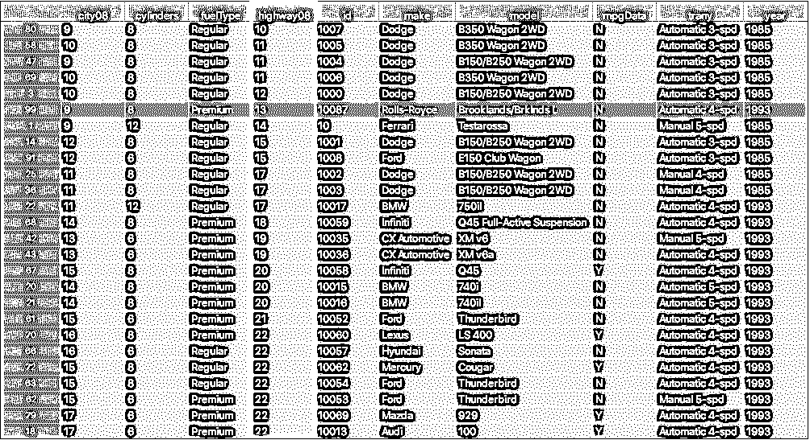
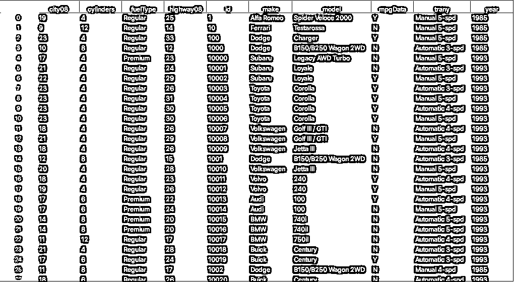

# 熊猫排序:Python 数据排序指南

> 原文：<https://realpython.com/pandas-sort-python/>

*立即观看**本教程有真实 Python 团队创建的相关视频课程。和文字教程一起看，加深理解: [**用熊猫排序 Python 中的数据**](/courses/sorting-data-python-pandas/)

学习 pandas **排序方法**是开始或练习使用 Python 进行基本[数据分析的好方法。最常见的是，数据分析是用](https://realpython.com/pandas-python-explore-dataset/)[电子表格](https://realpython.com/openpyxl-excel-spreadsheets-python/)、 [SQL](https://realpython.com/python-sql-libraries/) 或[熊猫](https://realpython.com/learning-paths/pandas-data-science/)来完成的。使用 pandas 的好处之一是它可以处理大量数据，并提供高性能的数据操作能力。

在本教程中，您将学习如何使用`.sort_values()`和`.sort_index()`，这将使您能够有效地对数据帧中的数据进行排序。

**本教程结束时，你将知道如何:**

*   按照一个或多个列的值对一个 **pandas 数据帧**进行排序
*   使用`ascending`参数改变**排序顺序**
*   使用 **`.sort_index()`** 按`index`对数据帧进行排序
*   对值排序时组织**缺失数据**
*   使用设置为`True`的`inplace`将数据帧**排序到**位置

为了跟随本教程，你需要对[熊猫数据帧](https://www.realpython.com/pandas-dataframe/)有一个基本的了解，并且对[从文件](https://realpython.com/python-csv/#reading-csv-files-with-pandas)中读取数据有一些熟悉。

**免费奖励:** 并学习 Python 3 的基础知识，如使用数据类型、字典、列表和 Python 函数。

## 熊猫排序方法入门

快速提醒一下， **DataFrame** 是一种数据结构，带有行和列的标记轴。您可以按行或列值以及行或列索引对数据帧进行排序。

行和列都有**索引**，它是数据在数据帧中位置的数字表示。您可以使用数据帧的索引位置从特定的行或列中检索数据。默认情况下，索引号从零开始。您也可以手动分配自己的索引。

[*Remove ads*](/account/join/)

### 准备数据集

在本教程中，您将使用美国环境保护署(EPA)收集的 1984 年至 2021 年间制造的车辆的燃油经济性数据。EPA 燃油经济性数据集非常棒，因为它有许多不同类型的信息可以排序，从文本到数字数据类型。数据集总共包含 83 列。

要继续学习，您需要安装 [pandas](https://pandas.pydata.org/) Python 库。本教程中的代码是使用 pandas 1.2.0 和 [Python 3.9.1](https://www.python.org/downloads/release/python-391/) 执行的。

**注意:**整个燃油经济性数据集约为 18 MB。将整个数据集读入内存可能需要一两分钟。限制行数和列数将有助于提高性能，但在下载数据之前仍需要几秒钟。

出于分析的目的，您将按品牌、型号、年份和其他车辆属性查看车辆的 MPG(每加仑英里数)数据。您可以指定将哪些列读入数据框架。对于本教程，您只需要[个可用列](https://www.fueleconomy.gov/feg/ws/index.shtml#vehicle)的子集。

以下是将燃油经济性数据集的相关列读入数据帧并显示前五行的命令:

>>>

```py
>>> import pandas as pd

>>> column_subset = [
...     "id",
...     "make",
...     "model",
...     "year",
...     "cylinders",
...     "fuelType",
...     "trany",
...     "mpgData",
...     "city08",
...     "highway08"
... ]

>>> df = pd.read_csv(
...     "https://www.fueleconomy.gov/feg/epadata/vehicles.csv",
...     usecols=column_subset,
...     nrows=100
... )

>>> df.head()
 city08  cylinders fuelType  ...  mpgData            trany  year
0      19          4  Regular  ...        Y     Manual 5-spd  1985
1       9         12  Regular  ...        N     Manual 5-spd  1985
2      23          4  Regular  ...        Y     Manual 5-spd  1985
3      10          8  Regular  ...        N  Automatic 3-spd  1985
4      17          4  Premium  ...        N     Manual 5-spd  1993
[5 rows x 10 columns]
```

通过使用数据集 URL 调用`.read_csv()`,您能够将数据加载到 DataFrame 中。缩小列的范围会导致更快的加载时间和更少的内存使用。为了进一步限制内存消耗并快速获得数据，您可以使用`nrows`指定加载多少行。

### 熟悉`.sort_values()`

您可以使用 [`.sort_values()`](https://pandas.pydata.org/pandas-docs/stable/reference/api/pandas.DataFrame.sort_values.html) 沿任一轴(列或行)对数据帧中的值进行排序。通常，您希望按一列或多列的值对数据帧中的行进行排序:

[](https://files.realpython.com/media/dataframe-values-sort.62a6327755df.png)

上图显示了使用`.sort_values()`根据`highway08`列中的值对数据帧的行进行排序的结果。这类似于使用列对电子表格中的数据进行排序。

### 熟悉`.sort_index()`

使用`.sort_index()`按照行索引或列标签对数据帧进行排序。与使用`.sort_values()`的不同之处在于，您是基于数据帧的行索引或列名对数据帧进行排序，而不是根据这些行或列中的值:

[](https://files.realpython.com/media/dataframe-row-index.d6aa0bd658aa.png)

在上图中，数据帧的行索引用蓝色标出。索引不被认为是列，通常只有一个单行索引。行索引可以看作是从零开始的行号。

## 在单列上对数据帧排序

要根据单个列中的值对 DataFrame 进行排序，您将使用`.sort_values()`。默认情况下，这将返回一个按升序排序的新数据帧。它不会修改原始数据帧。

### 按列升序排序

要使用`.sort_values()`，您可以向方法传递一个参数，该参数包含您想要排序的列的名称。在本例中，您按`city08`列对数据帧进行排序，该列代表纯燃油汽车的城市 MPG:

>>>

```py
>>> df.sort_values("city08")
 city08  cylinders fuelType  ...  mpgData            trany  year
99       9          8  Premium  ...        N  Automatic 4-spd  1993
1        9         12  Regular  ...        N     Manual 5-spd  1985
80       9          8  Regular  ...        N  Automatic 3-spd  1985
47       9          8  Regular  ...        N  Automatic 3-spd  1985
3       10          8  Regular  ...        N  Automatic 3-spd  1985
..     ...        ...      ...  ...      ...              ...   ...
9       23          4  Regular  ...        Y  Automatic 4-spd  1993
8       23          4  Regular  ...        Y     Manual 5-spd  1993
7       23          4  Regular  ...        Y  Automatic 3-spd  1993
76      23          4  Regular  ...        Y     Manual 5-spd  1993
2       23          4  Regular  ...        Y     Manual 5-spd  1985
[100 rows x 10 columns]
```

这将使用`city08`中的列值对数据框进行排序，首先显示 MPG 最低的车辆。默认情况下，`.sort_values()`按照**升序**对数据进行排序。虽然您没有为传递给`.sort_values()`的参数指定名称，但是您实际上使用了`by`参数，这将在下一个示例中看到。

[*Remove ads*](/account/join/)

### 改变排序顺序

`.sort_values()`的另一个参数是`ascending`。默认情况下`.sort_values()`已经将`ascending`设置为`True`。如果你想让数据帧按**降序**排序，那么你可以将`False`传递给这个参数:

>>>

```py
>>> df.sort_values(
...     by="city08",
...     ascending=False
... )
 city08  cylinders fuelType  ...  mpgData            trany  year
9       23          4  Regular  ...        Y  Automatic 4-spd  1993
2       23          4  Regular  ...        Y     Manual 5-spd  1985
7       23          4  Regular  ...        Y  Automatic 3-spd  1993
8       23          4  Regular  ...        Y     Manual 5-spd  1993
76      23          4  Regular  ...        Y     Manual 5-spd  1993
..     ...        ...      ...  ...      ...              ...   ...
58      10          8  Regular  ...        N  Automatic 3-spd  1985
80       9          8  Regular  ...        N  Automatic 3-spd  1985
1        9         12  Regular  ...        N     Manual 5-spd  1985
47       9          8  Regular  ...        N  Automatic 3-spd  1985
99       9          8  Premium  ...        N  Automatic 4-spd  1993
[100 rows x 10 columns]
```

通过将`False`传递给`ascending`，可以颠倒排序顺序。现在，您的数据框架按照在城市条件下测得的平均 MPG 降序排列。MPG 值最高的车辆位于第一排。

### 选择排序算法

值得注意的是，pandas 允许你选择不同的**排序算法**用于`.sort_values()`和`.sort_index()`。可用的算法有`quicksort`、`mergesort`和`heapsort`。有关这些不同排序算法的更多信息，请查看 Python 中的[排序算法。](https://realpython.com/sorting-algorithms-python/)

对单个列排序时默认使用的算法是 [`quicksort`](https://en.wikipedia.org/wiki/Quicksort) 。要将其更改为[稳定的](https://en.wikipedia.org/wiki/Category:Stable_sorts)排序算法，请使用 [`mergesort`](https://en.wikipedia.org/wiki/Merge_sort) 。你可以用`.sort_values()`或`.sort_index()`中的`kind`参数来完成，就像这样:

>>>

```py
>>> df.sort_values(
...     by="city08",
...     ascending=False,
...     kind="mergesort"
... )
 city08  cylinders fuelType  ...  mpgData            trany  year
2       23          4  Regular  ...        Y     Manual 5-spd  1985 7       23          4  Regular  ...        Y  Automatic 3-spd  1993 8       23          4  Regular  ...        Y     Manual 5-spd  1993 9       23          4  Regular  ...        Y  Automatic 4-spd  1993 10      23          4  Regular  ...        Y     Manual 5-spd  1993 ..     ...        ...      ...  ...      ...              ...   ...
69      10          8  Regular  ...        N  Automatic 3-spd  1985 1        9         12  Regular  ...        N     Manual 5-spd  1985 47       9          8  Regular  ...        N  Automatic 3-spd  1985 80       9          8  Regular  ...        N  Automatic 3-spd  1985 99       9          8  Premium  ...        N  Automatic 4-spd  1993
[100 rows x 10 columns]
```

使用`kind`，你设置排序算法为`mergesort`。前面的输出使用默认的`quicksort`算法。查看突出显示的索引，您可以看到这些行的顺序不同。这是因为`quicksort`不是一个稳定的排序算法，但是`mergesort`是。

**注意:**在熊猫中，当你在多个列或标签上排序时，`kind`被忽略。

当您对具有相同键的多条记录进行排序时，**稳定排序算法**将在排序后保持这些记录的原始顺序。因此，如果您计划执行多次排序，那么使用稳定的排序算法是必要的。

## 在多列上对数据帧进行排序

在数据分析中，通常希望根据多列的值对数据进行排序。假设您有一个包含人们的名字和姓氏的数据集。先按姓再按名排序是有意义的，这样姓相同的人就按名的字母顺序排列。

在第一个例子中，您在一个名为`city08`的列上对数据帧进行了排序。从分析的角度来看，城市条件下的 MPG 是决定汽车受欢迎程度的重要因素。除了城市条件下的 MPG，您可能还想看看高速公路条件下的 MPG。要按两个键排序，您可以将列名的[列表](https://realpython.com/python-lists-tuples/)传递给`by`:

>>>

```py
>>> df.sort_values(
...     by=["city08", "highway08"]
... )[["city08", "highway08"]]
 city08  highway08
80       9         10
47       9         11
99       9         13
1        9         14
58      10         11
..     ...        ...
9       23         30
10      23         30
8       23         31
76      23         31
2       23         33
[100 rows x 2 columns]
```

通过指定列名`city08`和`highway08`的列表，可以使用`.sort_values()`对两列上的数据帧进行排序。下一个例子将解释如何指定排序顺序，以及为什么注意所使用的列名列表很重要。

### 按多列升序排序

要对多个列上的数据帧进行排序，必须提供列名列表。例如，要按`make`和`model`排序，您应该创建以下列表，然后将其传递给`.sort_values()`:

>>>

```py
>>> df.sort_values(
...     by=["make", "model"]
... )[["make", "model"]]
 make               model
0   Alfa Romeo  Spider Veloce 2000
18        Audi                 100
19        Audi                 100
20         BMW                740i
21         BMW               740il
..         ...                 ...
12  Volkswagen      Golf III / GTI
13  Volkswagen           Jetta III
15  Volkswagen           Jetta III
16       Volvo                 240
17       Volvo                 240
[100 rows x 2 columns]
```

现在你的数据帧按`make`升序排序。如果有两个或更多相同的品牌，则按`model`排序。列表中列名的指定顺序与数据帧的排序方式相对应。

[*Remove ads*](/account/join/)

### 更改列排序顺序

因为您使用多列进行排序，所以您可以指定列的排序顺序。如果您想改变前面例子中的逻辑排序顺序，那么您可以改变列表中传递给`by`参数的列名的顺序:

>>>

```py
>>> df.sort_values(
...     by=["model", "make"]
... )[["make", "model"]]
 make        model
18           Audi          100
19           Audi          100
16          Volvo          240
17          Volvo          240
75          Mazda          626
..            ...          ...
62           Ford  Thunderbird
63           Ford  Thunderbird
88     Oldsmobile     Toronado
42  CX Automotive        XM v6
43  CX Automotive       XM v6a
[100 rows x 2 columns]
```

您的数据帧现在按`model`列升序排序，如果有两个或更多相同的模型，则按`make`排序。您可以看到，更改列的顺序也会更改值的排序顺序。

### 按多列降序排序

到目前为止，您只对多列进行了升序排序。在下一个例子中，您将基于`make`和`model`列进行降序排序。要按降序排序，请将`ascending`设置为`False`:

>>>

```py
>>> df.sort_values(
...     by=["make", "model"],
...     ascending=False
... )[["make", "model"]]
 make               model
16       Volvo                 240
17       Volvo                 240
13  Volkswagen           Jetta III
15  Volkswagen           Jetta III
11  Volkswagen      Golf III / GTI
..         ...                 ...
21         BMW               740il
20         BMW                740i
18        Audi                 100
19        Audi                 100
0   Alfa Romeo  Spider Veloce 2000
[100 rows x 2 columns]
```

对于任何具有相同`make`的汽车，`make`列中的值按字母顺序排列，而`model`列中的值按降序排列。对于文本数据，排序是**区分大小写**，这意味着大写文本将首先以升序出现，最后以降序出现。

### 按不同排序顺序的多列排序

您可能想知道是否可以使用多列进行排序，并让这些列使用不同的`ascending`参数。对于 pandas，您可以通过一个方法调用来实现。如果您想对一些列进行升序排序，对一些列进行降序排序，那么您可以传递一个由[布尔值](https://realpython.com/python-boolean/)到`ascending`组成的列表。

在本例中，您按照`make`、`model`和`city08`列对数据帧进行排序，前两列按升序排序，而`city08`按降序排序。为此，您向`by`传递一个列名列表，向`ascending`传递一个布尔值列表:

>>>

```py
>>> df.sort_values(
...     by=["make", "model", "city08"],
...     ascending=[True, True, False]
... )[["make", "model", "city08"]]
 make               model  city08
0   Alfa Romeo  Spider Veloce 2000      19
18        Audi                 100      17
19        Audi                 100      17
20         BMW                740i      14
21         BMW               740il      14
..         ...                 ...     ...
11  Volkswagen      Golf III / GTI      18
15  Volkswagen           Jetta III      20
13  Volkswagen           Jetta III      18
17       Volvo                 240      19
16       Volvo                 240      18
[100 rows x 3 columns]
```

现在你的数据帧按照`make`和`model`升序排序，但是`city08`列按照降序排序。这很有帮助，因为它按分类顺序对汽车进行分组，并首先显示 MPG 最高的汽车。

## 根据索引对数据帧进行排序

在对索引进行排序之前，最好知道索引代表什么。DataFrame 有一个 **`.index`** 属性，默认情况下是其行位置的数字表示。您可以将索引视为行号。它有助于快速查找和识别行。

### 按索引升序排序

您可以使用`.sort_index()`根据行索引对数据帧进行排序。像前面例子中那样按列值排序会对数据帧中的行进行重新排序，因此索引会变得杂乱无章。当您筛选数据帧或删除或添加行时，也会发生这种情况。

为了说明`.sort_index()`的用法，首先使用`.sort_values()`创建一个新的排序数据帧:

>>>

```py
>>> sorted_df = df.sort_values(by=["make", "model"])
>>> sorted_df
 city08  cylinders fuelType  ...  mpgData            trany  year
0       19          4  Regular  ...        Y     Manual 5-spd  1985
18      17          6  Premium  ...        Y  Automatic 4-spd  1993
19      17          6  Premium  ...        N     Manual 5-spd  1993
20      14          8  Premium  ...        N  Automatic 5-spd  1993
21      14          8  Premium  ...        N  Automatic 5-spd  1993
..     ...        ...      ...  ...      ...              ...   ...
12      21          4  Regular  ...        Y     Manual 5-spd  1993
13      18          4  Regular  ...        N  Automatic 4-spd  1993
15      20          4  Regular  ...        N     Manual 5-spd  1993
16      18          4  Regular  ...        Y  Automatic 4-spd  1993
17      19          4  Regular  ...        Y     Manual 5-spd  1993
[100 rows x 10 columns]
```

您已经创建了一个使用多个值排序的数据帧。请注意，行索引没有特定的顺序。要将新的数据帧恢复到原来的顺序，可以使用`.sort_index()`:

>>>

```py
>>> sorted_df.sort_index()
 city08  cylinders fuelType  ...  mpgData            trany  year
0       19          4  Regular  ...        Y     Manual 5-spd  1985
1        9         12  Regular  ...        N     Manual 5-spd  1985
2       23          4  Regular  ...        Y     Manual 5-spd  1985
3       10          8  Regular  ...        N  Automatic 3-spd  1985
4       17          4  Premium  ...        N     Manual 5-spd  1993
..     ...        ...      ...  ...      ...              ...   ...
95      17          6  Regular  ...        Y  Automatic 3-spd  1993
96      17          6  Regular  ...        N  Automatic 4-spd  1993
97      15          6  Regular  ...        N  Automatic 4-spd  1993
98      15          6  Regular  ...        N     Manual 5-spd  1993
99       9          8  Premium  ...        N  Automatic 4-spd  1993
[100 rows x 10 columns]
```

现在索引是升序排列的。就像`.sort_values()`一样，`.sort_index()`中`ascending`的默认实参是`True`，通过`False`可以改成降序。索引排序对数据本身没有影响，因为值是不变的。

当您已经使用 **`.set_index()`** 指定了自定义索引时，这尤其有用。如果您想使用`make`和`model`列设置一个自定义索引，那么您可以将一个列表传递给`.set_index()`:

>>>

```py
>>> assigned_index_df = df.set_index(
...     ["make", "model"]
... )
>>> assigned_index_df
 city08  cylinders  ...            trany  year
make        model                                    ...
Alfa Romeo  Spider Veloce 2000        19          4  ...     Manual 5-spd  1985
Ferrari     Testarossa                 9         12  ...     Manual 5-spd  1985
Dodge       Charger                   23          4  ...     Manual 5-spd  1985
 B150/B250 Wagon 2WD       10          8  ...  Automatic 3-spd  1985
Subaru      Legacy AWD Turbo          17          4  ...     Manual 5-spd  1993
 ...        ...  ...              ...   ...
Pontiac     Grand Prix                17          6  ...  Automatic 3-spd  1993
 Grand Prix                17          6  ...  Automatic 4-spd  1993
 Grand Prix                15          6  ...  Automatic 4-spd  1993
 Grand Prix                15          6  ...     Manual 5-spd  1993
Rolls-Royce Brooklands/Brklnds L       9          8  ...  Automatic 4-spd  1993
[100 rows x 8 columns]
```

使用这种方法，可以用两个轴标签替换默认的基于整数的行索引。这被认为是一个 [`MultiIndex`](https://pandas.pydata.org/pandas-docs/stable/reference/api/pandas.MultiIndex.html#pandas.MultiIndex) 或一个**层次索引**。您的数据帧现在由多个关键字索引，您可以使用`.sort_index()`进行排序:

>>>

```py
>>> assigned_index_df.sort_index()
 city08  cylinders  ...            trany  year
make       model                                  ...
Alfa Romeo Spider Veloce 2000      19          4  ...     Manual 5-spd  1985
Audi       100                     17          6  ...  Automatic 4-spd  1993
 100                     17          6  ...     Manual 5-spd  1993
BMW        740i                    14          8  ...  Automatic 5-spd  1993
 740il                   14          8  ...  Automatic 5-spd  1993
 ...        ...  ...              ...   ...
Volkswagen Golf III / GTI          21          4  ...     Manual 5-spd  1993
 Jetta III               18          4  ...  Automatic 4-spd  1993
 Jetta III               20          4  ...     Manual 5-spd  1993
Volvo      240                     18          4  ...  Automatic 4-spd  1993
 240                     19          4  ...     Manual 5-spd  1993
[100 rows x 8 columns]
```

首先使用`make`和`model`列为数据帧分配一个新的索引，然后使用`.sort_index()`对索引进行排序。你可以在熊猫文档中阅读更多关于使用 [`.set_index()`](https://pandas.pydata.org/pandas-docs/stable/reference/api/pandas.DataFrame.set_index.html) 的信息。

[*Remove ads*](/account/join/)

### 按索引降序排序

在下一个示例中，您将按照索引降序对数据帧进行排序。记住，在用`.sort_values()`对数据帧进行排序时，可以通过将`ascending`设置为`False`来颠倒排序顺序。该参数也适用于`.sort_index()`，因此您可以像这样以相反的顺序对数据帧进行排序:

>>>

```py
>>> assigned_index_df.sort_index(ascending=False)
 city08  cylinders  ...            trany  year
make       model                                  ...
Volvo      240                     18          4  ...  Automatic 4-spd  1993
 240                     19          4  ...     Manual 5-spd  1993
Volkswagen Jetta III               18          4  ...  Automatic 4-spd  1993
 Jetta III               20          4  ...     Manual 5-spd  1993
 Golf III / GTI          18          4  ...  Automatic 4-spd  1993
 ...        ...  ...              ...   ...
BMW        740il                   14          8  ...  Automatic 5-spd  1993
 740i                    14          8  ...  Automatic 5-spd  1993
Audi       100                     17          6  ...  Automatic 4-spd  1993
 100                     17          6  ...     Manual 5-spd  1993
Alfa Romeo Spider Veloce 2000      19          4  ...     Manual 5-spd  1985
[100 rows x 8 columns]
```

现在，您的数据帧按其索引降序排序。使用`.sort_index()`和`.sort_values()`的一个区别是`.sort_index()`没有`by`参数，因为默认情况下它在行索引上对数据帧进行排序。

### 探索高级索引排序概念

在数据分析的许多情况下，您希望按照[层次索引](https://pandas.pydata.org/pandas-docs/stable/user_guide/advanced.html)进行排序。你已经看到了如何在`MultiIndex`中使用`make`和`model`。对于这个数据集，您还可以使用`id`列作为索引。

将`id`列设置为索引可能有助于链接相关数据集。例如，环保署的[排放数据集](https://www.fueleconomy.gov/feg/ws/index.shtml#emissions)也使用`id`来表示车辆记录 id。这将排放数据与燃油经济性数据联系起来。在数据帧中对两个数据集的索引进行排序可以使用其他方法加快速度，例如`.merge()`。要了解更多关于在 pandas 中组合数据的信息，请查看[使用 merge()组合 Pandas 中的数据。join()和 concat()](https://realpython.com/pandas-merge-join-and-concat/) 。

## 对数据帧的列进行排序

您还可以使用数据框架的列标签对行值进行排序。使用可选参数`axis`设置为`1`的`.sort_index()`将按列标签对数据帧进行排序。排序算法应用于**轴标签**，而不是实际数据。这有助于数据帧的视觉检查。

### 使用数据帧`axis`

当您使用`.sort_index()`而不传递任何显式参数时，它使用`axis=0`作为默认参数。数据帧的**轴**是指索引(`axis=0`)或列(`axis=1`)。您可以使用两个轴对数据帧中的数据进行索引和选择，以及对数据进行排序。

### 使用列标签进行排序

您也可以使用数据帧的列标签作为`.sort_index()`的排序键。将`axis`设置为`1`会根据列标签对数据帧的列进行排序:

>>>

```py
>>> df.sort_index(axis=1)
 city08  cylinders fuelType  ...  mpgData            trany  year
0       19          4  Regular  ...        Y     Manual 5-spd  1985
1        9         12  Regular  ...        N     Manual 5-spd  1985
2       23          4  Regular  ...        Y     Manual 5-spd  1985
3       10          8  Regular  ...        N  Automatic 3-spd  1985
4       17          4  Premium  ...        N     Manual 5-spd  1993
..     ...        ...      ...  ...      ...              ...   ...
95      17          6  Regular  ...        Y  Automatic 3-spd  1993
96      17          6  Regular  ...        N  Automatic 4-spd  1993
97      15          6  Regular  ...        N  Automatic 4-spd  1993
98      15          6  Regular  ...        N     Manual 5-spd  1993
99       9          8  Premium  ...        N  Automatic 4-spd  1993
[100 rows x 10 columns]
```

数据帧的列按字母升序从左到右排序。如果您想按降序对列进行排序，那么您可以使用`ascending=False`:

>>>

```py
>>> df.sort_index(axis=1, ascending=False)
 year            trany mpgData  ... fuelType cylinders  city08
0   1985     Manual 5-spd       Y  ...  Regular         4      19
1   1985     Manual 5-spd       N  ...  Regular        12       9
2   1985     Manual 5-spd       Y  ...  Regular         4      23
3   1985  Automatic 3-spd       N  ...  Regular         8      10
4   1993     Manual 5-spd       N  ...  Premium         4      17
..   ...              ...     ...  ...      ...       ...     ...
95  1993  Automatic 3-spd       Y  ...  Regular         6      17
96  1993  Automatic 4-spd       N  ...  Regular         6      17
97  1993  Automatic 4-spd       N  ...  Regular         6      15
98  1993     Manual 5-spd       N  ...  Regular         6      15
99  1993  Automatic 4-spd       N  ...  Premium         8       9
[100 rows x 10 columns]
```

使用`.sort_index()`中的`axis=1`，您以升序和降序对数据帧的列进行了排序。这在其他数据集中可能更有用，例如列标签对应于一年中的几个月。在这种情况下，按月升序或降序排列数据是有意义的。

## 在 Pandas 中排序时处理缺失数据

现实世界的数据常常有许多不完美之处。虽然 pandas 有几种方法可以让你在排序前清理你的数据(T2 ),但是有时候在你排序的时候看看哪些数据丢失了会更好。你可以通过 **`na_position`** 参数来实现。

用于本教程的燃油经济性数据子集没有缺失值。为了说明`na_position`的用法，首先您需要创建一些缺失的数据。下面这段代码基于现有的`mpgData`列创建一个新列，映射`True`，其中`mpgData`等于`Y`，而 [`NaN`](https://en.wikipedia.org/wiki/NaN) 不等于:

>>>

```py
>>> df["mpgData_"] = df["mpgData"].map({"Y": True})
>>> df
 city08  cylinders fuelType  ...            trany  year mpgData_
0       19          4  Regular  ...     Manual 5-spd  1985     True
1        9         12  Regular  ...     Manual 5-spd  1985      NaN
2       23          4  Regular  ...     Manual 5-spd  1985     True
3       10          8  Regular  ...  Automatic 3-spd  1985      NaN
4       17          4  Premium  ...     Manual 5-spd  1993      NaN
..     ...        ...      ...  ...              ...   ...      ...
95      17          6  Regular  ...  Automatic 3-spd  1993     True
96      17          6  Regular  ...  Automatic 4-spd  1993      NaN
97      15          6  Regular  ...  Automatic 4-spd  1993      NaN
98      15          6  Regular  ...     Manual 5-spd  1993      NaN
99       9          8  Premium  ...  Automatic 4-spd  1993      NaN
[100 rows x 11 columns]
```

现在您有了一个名为`mpgData_`的新列，它包含了`True`和`NaN`值。您将使用该列来查看使用这两种排序方法时`na_position`的效果。要了解更多关于使用`.map()`的信息，你可以阅读[熊猫项目:用 Python 制作年级册&熊猫](https://realpython.com/pandas-project-gradebook/)。

[*Remove ads*](/account/join/)

### 了解`.sort_values()` 中的`na_position`参数

`.sort_values()`接受一个名为 **`na_position`** 的参数，该参数有助于组织正在排序的列中缺少的数据。如果对缺少数据的列进行排序，则缺少值的行将出现在数据框的末尾。无论您是按升序还是降序排序，都会发生这种情况。

当您对缺少数据的列进行排序时，您的数据框架如下所示:

>>>

```py
>>> df.sort_values(by="mpgData_")
 city08  cylinders fuelType  ...            trany  year mpgData_
0       19          4  Regular  ...     Manual 5-spd  1985     True
55      18          6  Regular  ...  Automatic 4-spd  1993     True
56      18          6  Regular  ...  Automatic 4-spd  1993     True
57      16          6  Premium  ...     Manual 5-spd  1993     True
59      17          6  Regular  ...  Automatic 4-spd  1993     True
..     ...        ...      ...  ...              ...   ...      ...
94      18          6  Regular  ...  Automatic 4-spd  1993      NaN
96      17          6  Regular  ...  Automatic 4-spd  1993      NaN
97      15          6  Regular  ...  Automatic 4-spd  1993      NaN
98      15          6  Regular  ...     Manual 5-spd  1993      NaN
99       9          8  Premium  ...  Automatic 4-spd  1993      NaN
[100 rows x 11 columns]
```

要改变这种行为并让丢失的数据首先出现在数据帧中，可以将`na_position`设置为`first`。`na_position`参数只接受默认值`last`和`first`。下面是如何在`.sort_values()`中使用`na_postion`:

>>>

```py
>>> df.sort_values(
...     by="mpgData_",
...     na_position="first"
... )
 city08  cylinders fuelType  ...            trany  year mpgData_
1        9         12  Regular  ...     Manual 5-spd  1985      NaN
3       10          8  Regular  ...  Automatic 3-spd  1985      NaN
4       17          4  Premium  ...     Manual 5-spd  1993      NaN
5       21          4  Regular  ...  Automatic 3-spd  1993      NaN
11      18          4  Regular  ...  Automatic 4-spd  1993      NaN
..     ...        ...      ...  ...              ...   ...      ...
32      15          8  Premium  ...  Automatic 4-spd  1993     True
33      15          8  Premium  ...  Automatic 4-spd  1993     True
37      17          6  Regular  ...  Automatic 3-spd  1993     True
85      17          6  Regular  ...  Automatic 4-spd  1993     True
95      17          6  Regular  ...  Automatic 3-spd  1993     True
[100 rows x 11 columns]
```

现在，用于排序的列中的任何缺失数据都将显示在数据框的顶部。当您第一次开始分析数据，并且不确定是否有缺失值时，这非常有用。

### 了解`.sort_index()` 中的`na_position`参数

`.sort_index()`也接受`na_position`。您的数据帧通常不会将`NaN`值作为其索引的一部分，因此该参数在`.sort_index()`中用处不大。但是，如果您的数据帧在行索引或列名中确实有`NaN`，那么您可以使用`.sort_index()`和`na_position`快速识别出来。

默认情况下，该参数设置为`last`，将`NaN`值放在排序结果的末尾。要改变这种行为，让丢失的数据首先出现在数据帧中，将`na_position`设置为`first`。

## 使用排序方法修改数据帧

在迄今为止您看到的所有示例中，当您调用这些方法时，`.sort_values()`和`.sort_index()`都返回了 DataFrame 对象。这是因为在默认情况下，熊猫的排序在位置[不工作。一般来说，这是使用 pandas 分析数据的最常见和首选方式，因为它创建了一个新的数据框架，而不是修改原始数据框架。这允许您保留从文件中读取数据时的数据状态。](https://en.wikipedia.org/wiki/In-place_algorithm)

但是，您可以通过用值`True`指定可选参数 **`inplace`** 来直接修改原始数据帧。大多数熊猫方法都包含了`inplace`参数。下面，您将看到一些使用`inplace=True`对数据帧进行排序的例子。

### 使用`.sort_values()`就位

当`inplace`设置为`True`时，您修改原始数据帧，因此排序方法返回 [`None`](https://realpython.com/null-in-python/) 。像第一个例子一样，通过`city08`列的值对数据帧进行排序，但是将`inplace`设置为`True`:

>>>

```py
>>> df.sort_values("city08", inplace=True)
```

注意调用`.sort_values()`并没有返回数据帧。下面是最初的`df`的样子:

>>>

```py
>>> df
 city08  cylinders fuelType  ...            trany  year mpgData_
99       9          8  Premium  ...  Automatic 4-spd  1993      NaN
1        9         12  Regular  ...     Manual 5-spd  1985      NaN
80       9          8  Regular  ...  Automatic 3-spd  1985      NaN
47       9          8  Regular  ...  Automatic 3-spd  1985      NaN
3       10          8  Regular  ...  Automatic 3-spd  1985      NaN
..     ...        ...      ...  ...              ...   ...      ...
9       23          4  Regular  ...  Automatic 4-spd  1993     True
8       23          4  Regular  ...     Manual 5-spd  1993     True
7       23          4  Regular  ...  Automatic 3-spd  1993     True
76      23          4  Regular  ...     Manual 5-spd  1993     True
2       23          4  Regular  ...     Manual 5-spd  1985     True
[100 rows x 11 columns]
```

在`df`对象中，值现在根据`city08`列按升序排序。您的原始数据帧已被修改，这些更改将持续存在。一般来说，避免使用`inplace=True`进行分析是个好主意，因为对数据框架的更改是不可撤销的。

### 使用`.sort_index()`就位

下一个例子说明了`inplace`也可以和`.sort_index()`一起工作。

因为当您将文件读入数据帧时，索引是按升序创建的，所以您可以再次修改您的`df`对象，使其恢复到初始顺序。使用`inplace`设置为`True`的`.sort_index()`来修改数据帧:

>>>

```py
>>> df.sort_index(inplace=True)
>>> df
 city08  cylinders fuelType  ...            trany  year mpgData_
0       19          4  Regular  ...     Manual 5-spd  1985     True
1        9         12  Regular  ...     Manual 5-spd  1985      NaN
2       23          4  Regular  ...     Manual 5-spd  1985     True
3       10          8  Regular  ...  Automatic 3-spd  1985      NaN
4       17          4  Premium  ...     Manual 5-spd  1993      NaN
..     ...        ...      ...  ...              ...   ...      ...
95      17          6  Regular  ...  Automatic 3-spd  1993     True
96      17          6  Regular  ...  Automatic 4-spd  1993      NaN
97      15          6  Regular  ...  Automatic 4-spd  1993      NaN
98      15          6  Regular  ...     Manual 5-spd  1993      NaN
99       9          8  Premium  ...  Automatic 4-spd  1993      NaN
[100 rows x 11 columns]
```

现在您的数据帧已经使用`.sort_index()`再次修改。因为您的数据帧仍然有默认索引，所以按升序排序会将数据恢复到原来的顺序。

如果你熟悉 Python 的内置函数`sort()`和`sorted()`，那么熊猫排序方法中可用的`inplace`参数可能感觉非常相似。要了解更多信息，您可以查看[如何在 Python](https://realpython.com/python-sort/) 中使用 sorted()和 sort()。

[*Remove ads*](/account/join/)

## 结论

您现在知道如何使用 pandas 库的两个核心方法:`.sort_values()`和`.sort_index()`。有了这些知识，您就可以使用数据框架进行基本的数据分析。虽然这两种方法之间有很多相似之处，但看到它们之间的差异，就可以清楚地看出哪种方法适用于不同的分析任务。

**在本教程中，您已经学会了如何:**

*   按照一个或多个列的值对一个 **pandas 数据帧**进行排序
*   使用`ascending`参数改变**排序顺序**
*   使用 **`.sort_index()`** 按`index`对数据帧进行排序
*   对值排序时组织**缺失数据**
*   使用设置为`True`的`inplace`将数据帧**排序到**位置

这些方法是精通数据分析的重要组成部分。他们将帮助你建立一个坚实的基础，在此基础上你可以执行更高级的熊猫操作。如果您想看一些 pandas 排序方法的更高级用法的例子，那么 pandas [文档](https://pandas.pydata.org/pandas-docs/stable/reference/api/pandas.DataFrame.sort_values.html)是一个很好的资源。

*立即观看**本教程有真实 Python 团队创建的相关视频课程。和文字教程一起看，加深理解: [**用熊猫排序 Python 中的数据**](/courses/sorting-data-python-pandas/)********