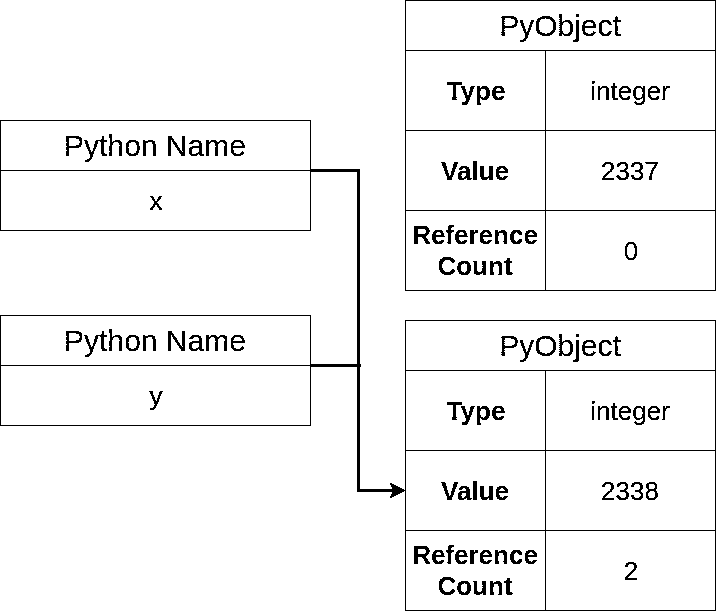

# Python 中的指针:有什么意义？

> 原文：<https://realpython.com/pointers-in-python/>

*立即观看**本教程有真实 Python 团队创建的相关视频课程。和书面教程一起看，加深理解:[**Python 中的指针和对象**](/courses/pointers-python/)

如果你曾经使用过像 [C](https://realpython.com/c-for-python-programmers/) 或者 [C++](https://realpython.com/python-vs-cpp/) 这样的低级语言，那么你可能听说过指针。指针允许你在部分代码中创造巨大的效率。它们还会给初学者带来困惑，甚至会导致各种内存管理错误，即使对于专家来说也是如此。那么它们在 Python 中的什么位置，如何在 Python 中模拟指针呢？

指针在 C 和 C++中被广泛使用。本质上，它们是保存另一个变量的内存地址的变量。对于指针的复习，你可以考虑看看这篇关于 C 指针的[概述。](https://www.tutorialspoint.com/cprogramming/c_pointers.htm)

在本文中，您将更好地理解 Python 的对象模型，并了解为什么 Python 中的指针并不真正存在。对于需要模拟指针行为的情况，您将学习在 Python 中模拟指针的方法，而不会遇到内存管理的噩梦。

**在本文中，您将:**

*   了解为什么 Python 中的指针不存在
*   探究 C 变量和 Python 名称之间的区别
*   在 Python 中模拟指针
*   使用`ctypes`试验真正的指针

**注意:**在本文中，“Python”将指 Python 在 C 中的参考实现，也称为 [CPython](https://realpython.com/cpython-source-code-guide/) 。由于本文讨论了该语言的一些内部机制，这些注释对 CPython 3.7 是正确的，但在该语言的未来或过去的迭代中可能不正确。

**免费下载:** [从 Python 技巧中获取一个示例章节:这本书](https://realpython.com/bonus/python-tricks-sample-pdf/)用简单的例子向您展示了 Python 的最佳实践，您可以立即应用它来编写更漂亮的+Python 代码。

## Python 为什么没有指针？

事实是我不知道。Python 中的指针可以原生存在吗？可能吧，但是指针似乎违背了 Python 的[禅。指针鼓励隐式更改，而不是显式更改。通常，它们是复杂的而不是简单的，尤其是对初学者来说。更糟糕的是，他们会想方设法搬起石头砸自己的脚，或者做一些非常危险的事情，比如读一段你不该读的记忆。](https://www.python.org/dev/peps/pep-0020/#id3)

Python 倾向于从用户那里抽象出实现细节，比如内存地址。Python 经常关注可用性而不是速度。因此，Python 中的指针并不真正有意义。不过不用担心，默认情况下，Python 确实给了你一些使用指针的好处。

理解 Python 中的指针需要简单了解一下 Python 的实现细节。具体来说，您需要了解:

1.  不可变对象与可变对象
2.  Python 变量/名称

抓紧你的内存地址，让我们开始吧。

[*Remove ads*](/account/join/)

## Python 中的对象

在 Python 中，一切都是对象。为了证明这一点，您可以打开 REPL，使用`isinstance()`进行探索:

>>>

```py
>>> isinstance(1, object)
True
>>> isinstance(list(), object)
True
>>> isinstance(True, object)
True
>>> def foo():
...     pass
...
>>> isinstance(foo, object)
True
```

这段代码向您展示了 Python 中的一切确实都是对象。每个对象至少包含三段数据:

*   引用计数
*   类型
*   价值

[引用计数](https://docs.python.org/3/library/sys.html#sys.getrefcount)用于内存管理。要深入了解 Python 中内存管理的内部机制，可以阅读 Python 中的[内存管理](https://realpython.com/python-memory-management/)。

该类型在 [CPython](https://realpython.com/products/cpython-internals-book/) 层使用，以确保运行时的类型安全。最后是值，它是与对象相关联的实际值。

然而，并非所有的对象都是相同的。还有一个你需要理解的重要区别:不可变对象和可变对象。理解对象类型之间的差异确实有助于澄清洋葱的第一层，即 Python 中的指针。

## 不可变与可变对象

在 Python 中，有两种类型的对象:

1.  **不可变对象**不能改变。
2.  **可变对象**可以改变。

理解这种差异是在 Python 中导航指针景观的第一把钥匙。下面是常见类型的分类，以及它们是可变的还是不可变的:

| 类型 | 不可变？ |
| --- | --- |
| `int` | 是 |
| `float` | 是 |
| `bool` | 是 |
| `complex` | 是 |
| `tuple` | 是 |
| `frozenset` | 是 |
| `str` | 是 |
| `list` | 不 |
| `set` | 不 |
| `dict` | 不 |

如您所见，许多常用的原始类型都是不可变的。你可以自己写一些 Python 来证明这一点。您需要 Python 标准库中的几个工具:

1.  **`id()`** 返回对象的内存地址。
2.  **`is`** 返回`True`当且仅当两个对象有相同的内存地址。

同样，您可以在 REPL 环境中使用它们:

>>>

```py
>>> x = 5
>>> id(x)
94529957049376
```

在上面的代码中，您将值`5`赋给了`x`。如果你试图用加法修改这个值，你会得到一个新的对象:

>>>

```py
>>> x += 1
>>> x
6
>>> id(x)
94529957049408
```

尽管上面的代码似乎修改了`x`的值，但是作为响应，您将得到一个新的对象。

`str`类型也是不可变的:

>>>

```py
>>> s = "real_python"
>>> id(s)
140637819584048
>>> s += "_rocks"
>>> s
'real_python_rocks'
>>> id(s)
140637819609424
```

同样，`s`在`+=`操作后以*不同的*内存地址结束。

**好处:**`+=`操作符翻译成各种方法调用。

对于一些像 [`list`](https://realpython.com/python-lists-tuples/) ，`+=`会翻译成`__iadd__()`(原地添加)。这将修改`self`并返回相同的 ID。然而，`str`和`int`没有这些方法，导致调用`__add__()`而不是`__iadd__()`。

有关更多详细信息，请查看 Python [数据模型文档。](https://docs.python.org/3/reference/datamodel.html#object.__iadd__)

试图直接改变[字符串](https://realpython.com/python-strings/) `s`会导致错误:

>>>

```py
>>> s[0] = "R"
Traceback (most recent call last):
  File "<stdin>", line 1, in <module>
TypeError: 'str' object does not support item assignment
```

以上代码失败，Python 表明`str`不支持这种突变，符合`str`类型不可变的定义。

与可变对象形成对比，如`list`:

>>>

```py
>>> my_list = [1, 2, 3]
>>> id(my_list)
140637819575368
>>> my_list.append(4)
>>> my_list
[1, 2, 3, 4]
>>> id(my_list)
140637819575368
```

这段代码显示了这两种对象的主要区别。`my_list`原本有一个 id。即使在将`4`添加到列表中之后，`my_list`仍然拥有与*相同的* id。这是因为`list`类型是可变的。

证明列表可变的另一种方法是赋值:

>>>

```py
>>> my_list[0] = 0
>>> my_list
[0, 2, 3, 4]
>>> id(my_list)
140637819575368
```

在这段代码中，您对`my_list`进行了变异，并将其第一个元素设置为`0`。但是，即使在这种赋值之后，它仍然保持相同的 id。随着可变和不可变对象的消失，您通往 [Python 启蒙之旅的下一步是理解 Python 的可变生态系统。](https://realpython.com/pycon-guide/#what-to-do-at-pycon)

[*Remove ads*](/account/join/)

## 理解变量

Python 变量与 C 或 C++中的变量有着本质的不同。其实 Python 连变量都没有。 *Python 有名字，没有变量。*

这可能看起来很迂腐，但在大多数情况下，的确如此。大多数时候，将 Python 名称视为变量是完全可以接受的，但是理解其中的区别是很重要的。当您在 Python 中导航棘手的指针主题时，尤其如此。

为了帮助理解这种差异，您可以看一看变量在 C 中是如何工作的，它们代表什么，然后将其与 Python 中的名称工作方式进行对比。

### C 语言中的变量

假设您有以下定义变量`x`的代码:

```py
int  x  =  2337;
```

这一行代码在执行时有几个不同的步骤:

1.  为整数分配足够的内存
2.  将值`2337`分配给该存储单元
3.  表示`x`指向该值

在内存的简化视图中，它可能如下所示:

[](https://files.realpython.com/media/c_memory1.334fe7c13e82.png)

这里，你可以看到变量`x`有一个假的内存位置`0x7f1`和值`2337`。如果在程序的后面，您想要更改`x`的值，您可以执行以下操作:

```py
x  =  2338;
```

上面的代码给变量`x`赋了一个新值(`2338`)，从而*覆盖了*之前的值。这意味着变量`x`是**可变的**。更新后的内存布局显示新值:

[](https://files.realpython.com/media/c_memory2.14d638daf718.png)

请注意，`x`的位置没有改变，只是值本身发生了变化。这是很重要的一点。这意味着`x` *是内存位置*，而不仅仅是它的一个名字。

另一种思考这个概念的方式是从所有权的角度。在某种意义上，`x`拥有内存位置。`x`首先是一个空盒子，它只能容纳一个整数，其中可以存储整数值。

当你给`x`赋值的时候，你就在`x`拥有的盒子里放了一个值。如果你想引入一个新的变量(`y`，你可以添加这行代码:

```py
int  y  =  x;
```

这段代码创建了一个名为`y`的*新*框，并将值从`x`复制到该框中。现在，内存布局将如下所示:

[](https://files.realpython.com/media/c_memory3.5afe110faf4d.png)

注意`y`的新位置`0x7f5`。即使`x`的值被复制到`y`，变量`y`在内存中拥有一些新的地址。因此，您可以覆盖`y`的值，而不会影响`x`:

```py
y  =  2339;
```

现在，内存布局将如下所示:

[](https://files.realpython.com/media/c_memory4.45a45dbbfaab.png)

同样，您修改了`y`处的值，但是*没有*其位置。此外，您根本没有影响原来的`x`变量。这与 Python 名称的工作方式形成了鲜明的对比。

[*Remove ads*](/account/join/)

### Python 中的名称

Python 没有变量。它有名字。是的，这是一个迂腐的观点，你当然可以尽可能多地使用变量这个术语。要知道变量和名字是有区别的，这一点很重要。

让我们从上面的 C 示例中取出等价的代码，并用 Python 编写:

>>>

```py
>>> x = 2337
```

与 C 语言非常相似，上面的代码在执行过程中被分解成几个不同的步骤:

1.  创建一个`PyObject`
2.  将`PyObject`的类型码设置为整数
3.  将`PyObject`的值设置为`2337`
4.  创建名为`x`的名称
5.  将`x`指向新的`PyObject`
6.  将`PyObject`的 refcount 增加 1

**注:**的 [`PyObject`](https://github.com/python/cpython/blob/v3.7.3/Include/object.h#L101) 和 Python 的`object`不一样。它特定于 CPython，代表所有 Python 对象的基本结构。

`PyObject`被定义为 C 结构，所以如果你想知道为什么不能直接调用`typecode`或`refcount`，那是因为你不能直接访问这些结构。像 [`sys.getrefcount()`](https://docs.python.org/3/library/sys.html#sys.getrefcount) 这样的方法调用可以帮助获得一些内部消息。

在内存中，它可能是这样的:

[](https://files.realpython.com/media/py_memory1.2b6e5f8e5bc9.png)

您可以看到内存布局与以前的 C 布局有很大不同。新创建的 Python 对象拥有`2337`所在的内存，而不是`x`拥有值`2337`所在的内存块。Python 名字`x`不像 C 变量`x`拥有内存中的静态槽那样直接拥有*任何*内存地址。

如果您试图给`x`分配一个新值，您可以尝试以下方法:

>>>

```py
>>> x = 2338
```

这里发生的事情与 C 语言的对等用法不同，但与 Python 中最初的 bind 没有太大的不同。

此代码:

*   创建新的`PyObject`
*   将`PyObject`的类型码设置为整数
*   将`PyObject`的值设置为`2338`
*   将`x`指向新的`PyObject`
*   将新`PyObject`的引用计数增加 1
*   将旧`PyObject`的引用计数减 1

现在在内存中，它看起来像这样:

[](https://files.realpython.com/media/py_memory2.99bb432c3432.png)

这个图有助于说明`x`指向一个对象的引用，并且不像以前那样拥有内存空间。它还显示了`x = 2338`命令不是赋值，而是将名称`x`绑定到一个引用。

此外，先前的对象(保存了`2337`值)现在位于内存中，引用计数为 0，并将被[垃圾收集器](https://docs.python.org/3/faq/design.html?highlight=garbage%20collect#how-does-python-manage-memory)清除。

您可以在混合中引入一个新名称`y`，如 C 示例所示:

>>>

```py
>>> y = x
```

在内存中，您会有一个新的名称，但不一定是一个新的对象:

[](https://files.realpython.com/media/py_memory3_1.ea43471d3bf6.png)

现在你可以看到一个新的 Python 对象已经*而不是*被创建，只是一个指向同一个对象的新名字。此外，对象的 refcount 增加了 1。您可以检查对象标识是否相等，以确认它们是否相同:

>>>

```py
>>> y is x
True
```

上面的代码表明`x`和`y`是同一个对象。但是不要搞错:`y`仍然是不可改变的。

例如，您可以在`y`上执行加法:

>>>

```py
>>> y += 1
>>> y is x
False
```

在添加调用之后，您将获得一个新的 Python 对象。现在，内存看起来是这样的:

[](https://files.realpython.com/media/py_memory4.0a15e8415a15.png)

已经创建了一个新对象，`y`现在指向新对象。有趣的是，如果您将`y`直接绑定到`2339`，这是相同的最终状态:

>>>

```py
>>> y = 2339
```

上述语句导致与加法相同的最终内存状态。概括地说，在 Python 中，不需要给变量赋值。相反，您将名称绑定到引用。

[*Remove ads*](/account/join/)

### 关于 Python 中 Intern 对象的一个注释

现在，您已经了解了 Python 对象是如何创建的，名称是如何绑定到这些对象的，是时候使用扳手了。那把扳手被称为被扣押的物品。

假设您有以下 Python 代码:

>>>

```py
>>> x = 1000
>>> y = 1000
>>> x is y
True
```

如上所述，`x`和`y`都是指向同一个 Python 对象的名字。但是保存值`1000`的 Python 对象并不总是保证有相同的内存地址。例如，如果你将两个数相加得到`1000`，你将得到一个不同的内存地址:

>>>

```py
>>> x = 1000
>>> y = 499 + 501
>>> x is y
False
```

这一次，行`x is y`返回`False`。如果这令人困惑，那么不要担心。以下是执行此代码时发生的步骤:

1.  创建 Python 对象(`1000`)
2.  将名称`x`分配给该对象
3.  创建 Python 对象(`499`)
4.  创建 Python 对象(`501`)
5.  将这两个对象相加
6.  创建新的 Python 对象(`1000`)
7.  将名称`y`分配给该对象

**技术提示:**只有在 REPL 内部执行这段代码时，上述步骤才会发生。如果您将上面的例子粘贴到一个文件中，并运行该文件，那么您会发现`x is y`行将返回`True`。

这是因为编译器很聪明。CPython 编译器试图进行称为[窥视孔优化](https://en.wikipedia.org/wiki/Peephole_optimization)的优化，这有助于尽可能节省执行步骤。有关详细信息，您可以查看 [CPython 的窥视孔优化器源代码](https://github.com/python/cpython/blob/master/Python/peephole.c)。

这不是浪费吗？是的，它是，但是那是你为 Python 的所有巨大好处所付出的代价。您永远不必担心清理这些中间对象，甚至不需要知道它们的存在！令人高兴的是，这些操作相对来说很快，直到现在您才需要了解这些细节。

核心的 Python 开发者，凭他们的智慧，也注意到了这种浪费，并决定做一些优化。这些优化会导致新来者感到惊讶的行为:

>>>

```py
>>> x = 20
>>> y = 19 + 1
>>> x is y
True
```

在本例中，您看到的代码与之前几乎相同，只是这次的结果是`True`。这是被拘留对象的结果。Python 在内存中预先创建了对象的某个子集，并将它们保存在全局的[名称空间](https://realpython.com/python-namespaces-scope/)中，以供日常使用。

哪些对象依赖于 Python 的实现。CPython 3.7 实习如下:

1.  `-5`和`256`之间的整数
2.  仅包含 ASCII 字母、数字或下划线的字符串

背后的原因是，这些变量极有可能在许多程序中使用。通过扣留这些对象，Python 防止了对一致使用的对象的内存分配调用。

少于 20 个字符并包含 ASCII 字母、数字或下划线的字符串将被保留。这背后的推理是，这些被假定为某种身份:

>>>

```py
>>> s1 = "realpython"
>>> id(s1)
140696485006960
>>> s2 = "realpython"
>>> id(s2)
140696485006960
>>> s1 is s2
True
```

这里可以看到`s1`和`s2`都指向内存中的同一个地址。如果您要引入非 ASCII 字母、数字或下划线，那么您会得到不同的结果:

>>>

```py
>>> s1 = "Real Python!"
>>> s2 = "Real Python!"
>>> s1 is s2
False
```

因为这个例子中有一个感叹号(`!`)，所以这些字符串不会被保留，而是内存中的不同对象。

**额外收获:**如果你真的想让这些对象引用同一个内部对象，那么你可能想检查一下`sys.intern()`。文档中概述了此功能的一个用例:

> 保留字符串有助于提高字典查找的性能——如果字典中的键被保留，并且查找键也被保留，则键比较(哈希之后)可以通过指针比较而不是字符串比较来完成。([来源](https://docs.python.org/3/library/sys.html#sys.intern))

被扣留的物品通常是混乱的来源。只要记住，如果你有任何疑问，你总是可以使用`id()`和`is`来确定对象相等。

[*Remove ads*](/account/join/)

## 在 Python 中模拟指针

Python 中的指针不是原生存在的，并不意味着你不能获得使用指针的好处。事实上，在 Python 中模拟指针有多种方式。在本节中，您将了解到两个问题:

1.  使用可变类型作为指针
2.  使用自定义 Python 对象

好了，说重点吧。

### 使用可变类型作为指针

您已经了解了可变类型。因为这些对象是可变的，所以您可以将它们视为指针来模拟指针行为。假设您想要复制以下 c 代码:

```py
void  add_one(int  *x)  { *x  +=  1; }
```

这段代码获取一个指向整数(`*x`)的指针，然后将该值递增 1。下面是练习代码的一个主要函数:

```py
#include  <stdio.h> int  main(void)  { int  y  =  2337; printf("y = %d\n",  y); add_one(&y); printf("y = %d\n",  y); return  0; }
```

在上面的代码中，您将`2337`赋值给`y`，[打印出](https://realpython.com/python-print/)当前值，将值递增 1，然后打印出修改后的值。执行这段代码的输出如下:

```py
y = 2337
y = 2338
```

在 Python 中复制这种行为的一种方法是使用可变类型。考虑使用列表并修改第一个元素:

>>>

```py
>>> def add_one(x):
...     x[0] += 1
...
>>> y = [2337]
>>> add_one(y)
>>> y[0]
2338
```

这里，`add_one(x)`访问第一个元素，并将其值递增 1。使用一个`list`意味着最终结果似乎已经修改了值。所以 Python 中的指针确实存在？不，这是唯一可能的，因为`list`是一个可变类型。如果您试图使用一个`tuple`，您会得到一个错误:

>>>

```py
>>> z = (2337,)
>>> add_one(z)
Traceback (most recent call last):
  File "<stdin>", line 1, in <module>
  File "<stdin>", line 2, in add_one
TypeError: 'tuple' object does not support item assignment
```

上面的代码演示了`tuple`是不可变的。因此，它不支持项目分配。`list`不是唯一的可变类型。另一种在 Python 中模仿指针的常见方法是使用`dict`。

假设您有一个应用程序，您希望跟踪每次发生的有趣事件。实现这一点的一种方法是创建一个`dict`，并使用其中一个项目作为计数器:

>>>

```py
>>> counters = {"func_calls": 0}
>>> def bar():
...     counters["func_calls"] += 1
...
>>> def foo():
...     counters["func_calls"] += 1
...     bar()
...
>>> foo()
>>> counters["func_calls"]
2
```

在这个例子中，`counters` [字典](https://realpython.com/python-dicts/)用于跟踪函数调用的次数。在您呼叫`foo()`之后，计数器已经如预期的那样增加到`2`。都是因为`dict`是可变的。

请记住，这只是*模拟*指针行为，并不直接映射到 C 或 C++中的真正指针。也就是说，这些操作比在 C 或 C++中更昂贵。

[*Remove ads*](/account/join/)

### 使用 Python 对象

`dict`选项是在 Python 中模拟指针的一种很好的方式，但是有时记住您使用的键名会很麻烦。如果您在应用程序的不同部分使用字典，这一点尤其正确。这就是自定义 Python 类真正有用的地方。

在最后一个例子的基础上，假设您想要跟踪应用程序中的指标。创建一个类是抽象讨厌的细节的好方法:

```py
class Metrics(object):
    def __init__(self):
        self._metrics = {
            "func_calls": 0,
            "cat_pictures_served": 0,
        }
```

这段代码定义了一个`Metrics`类。这个类仍然使用一个`dict`来保存实际数据，它在`_metrics`成员变量中。这会给你你需要的可变性。现在，您只需要能够访问这些值。一个很好的方法是使用属性:

```py
class Metrics(object):
    # ...

    @property
    def func_calls(self):
        return self._metrics["func_calls"]

    @property
    def cat_pictures_served(self):
        return self._metrics["cat_pictures_served"]
```

这段代码利用了 [`@property`](https://docs.python.org/3/library/functions.html#property) 。如果你不熟悉 decorator，你可以看看这篇关于 Python decorator 的[初级读本。这里的`@property`装饰器允许您访问`func_calls`和`cat_pictures_served`，就像它们是属性一样:](https://realpython.com/primer-on-python-decorators/)

>>>

```py
>>> metrics = Metrics()
>>> metrics.func_calls
0
>>> metrics.cat_pictures_served
0
```

事实上，您可以将这些名称作为属性来访问，这意味着您抽象了这些值在一个`dict`中的事实。您还可以使属性的名称更加明确。当然，您需要能够增加这些值:

```py
class Metrics(object):
    # ...

    def inc_func_calls(self):
        self._metrics["func_calls"] += 1

    def inc_cat_pics(self):
        self._metrics["cat_pictures_served"] += 1
```

你介绍了两种新方法:

1.  `inc_func_calls()`
2.  `inc_cat_pics()`

这些方法修改了指标`dict`中的值。现在你有了一个类，你可以像修改一个指针一样修改它:

>>>

```py
>>> metrics = Metrics()
>>> metrics.inc_func_calls()
>>> metrics.inc_func_calls()
>>> metrics.func_calls
2
```

在这里，您可以在应用程序的不同地方访问`func_calls`和调用`inc_func_calls()`，并在 Python 中模拟指针。当您在应用程序的不同部分需要经常使用和更新度量标准时，这是非常有用的。

**注意:**特别是在这个类中，使`inc_func_calls()`和`inc_cat_pics()`显式而不是使用`@property.setter`可以防止用户将这些值设置为任意的`int`或像`dict`一样的无效值。

下面是`Metrics`类的完整源代码:

```py
class Metrics(object):
    def __init__(self):
        self._metrics = {
            "func_calls": 0,
            "cat_pictures_served": 0,
        }

    @property
    def func_calls(self):
        return self._metrics["func_calls"]

    @property
    def cat_pictures_served(self):
        return self._metrics["cat_pictures_served"]

    def inc_func_calls(self):
        self._metrics["func_calls"] += 1

    def inc_cat_pics(self):
        self._metrics["cat_pictures_served"] += 1
```

## 带`ctypes`的实指针

好吧，也许 Python 中有指针，特别是 CPython。使用内置的`ctypes`模块，您可以在 Python 中创建真正的 C 风格指针。如果你对`ctypes`不熟悉，那么可以看看用 C 库扩展 Python 的[和“ctypes”模块](https://dbader.org/blog/python-ctypes-tutorial)。

您使用它的真正原因是，如果您需要对需要指针的 C 库进行函数调用。让我们回到之前的`add_one()` C 函数:

```py
void  add_one(int  *x)  { *x  +=  1; }
```

同样，这段代码将`x`的值加 1。要使用它，首先把它编译成一个共享对象。假设上述文件存储在`add.c`中，您可以用`gcc`来完成:

```py
$ gcc -c -Wall -Werror -fpic add.c
$ gcc -shared -o libadd1.so add.o
```

第一个命令将 C 源文件编译成一个名为`add.o`的对象。第二个命令获取未链接的对象文件，并生成一个名为`libadd1.so`的共享对象。

`libadd1.so`应该在你当前的目录下。您可以使用`ctypes`将其加载到 Python 中:

>>>

```py
>>> import ctypes
>>> add_lib = ctypes.CDLL("./libadd1.so")
>>> add_lib.add_one
<_FuncPtr object at 0x7f9f3b8852a0>
```

`ctypes.CDLL`代码返回一个代表`libadd1`共享对象的对象。因为您在这个共享对象中定义了`add_one()`，所以您可以像访问任何其他 Python 对象一样访问它。但是在调用函数之前，应该指定函数签名。这有助于 Python 确保向函数传递正确的类型。

在这种情况下，函数签名是一个指向整数的指针。`ctypes`将允许您使用以下代码对此进行指定:

>>>

```py
>>> add_one = add_lib.add_one
>>> add_one.argtypes = [ctypes.POINTER(ctypes.c_int)]
```

在这段代码中，您将函数签名设置为与 C 期望的相匹配。现在，如果您试图用错误的类型调用这段代码，您将得到一个很好的警告，而不是未定义的行为:

>>>

```py
>>> add_one(1)
Traceback (most recent call last):
  File "<stdin>", line 1, in <module>
ctypes.ArgumentError: argument 1: <class 'TypeError'>: \
expected LP_c_int instance instead of int
```

Python 抛出一个错误，解释说`add_one()`想要一个指针而不仅仅是一个整数。幸运的是，`ctypes`有办法传递指向这些函数的指针。首先，声明一个 C 风格的整数:

>>>

```py
>>> x = ctypes.c_int()
>>> x
c_int(0)
```

上面的代码创建了一个 C 风格的整数`x`，其值为`0`。`ctypes`提供了方便的`byref()`来允许通过引用传递变量。

**注意:**术语**通过引用**与通过值传递变量**相反。**

当通过引用传递时，您传递的是对原始变量的引用，因此修改将反映在原始变量中。通过值传递会产生原始变量的副本，修改不会反映在原始变量中。

有关 Python 中引用传递的更多信息，请查看[Python 中的引用传递:背景和最佳实践](https://realpython.com/python-pass-by-reference/)。

你可以用这个来调用`add_one()`:

>>>

```py
>>> add_one(ctypes.byref(x))
998793640
>>> x
c_int(1)
```

不错！您的整数增加了 1。恭喜你，你已经在 Python 中成功使用了实指针。

[*Remove ads*](/account/join/)

## 结论

现在，您对 Python 对象和指针之间的交集有了更好的理解。尽管名称和变量之间的一些区别看起来有些学究气，但是从根本上理解这些关键术语可以扩展您对 Python 如何处理变量的理解。

您还学习了一些在 Python 中模拟指针的优秀方法:

*   利用可变对象作为低开销指针
*   创建易于使用的自定义 Python 对象
*   使用`ctypes`模块解锁真实指针

这些方法允许您在 Python 中模拟指针，而不会牺牲 Python 提供的内存安全性。

感谢阅读。如果你还有问题，请在评论区或 Twitter 上联系我们。

*立即观看**本教程有真实 Python 团队创建的相关视频课程。和书面教程一起看，加深理解:[**Python 中的指针和对象**](/courses/pointers-python/)*********