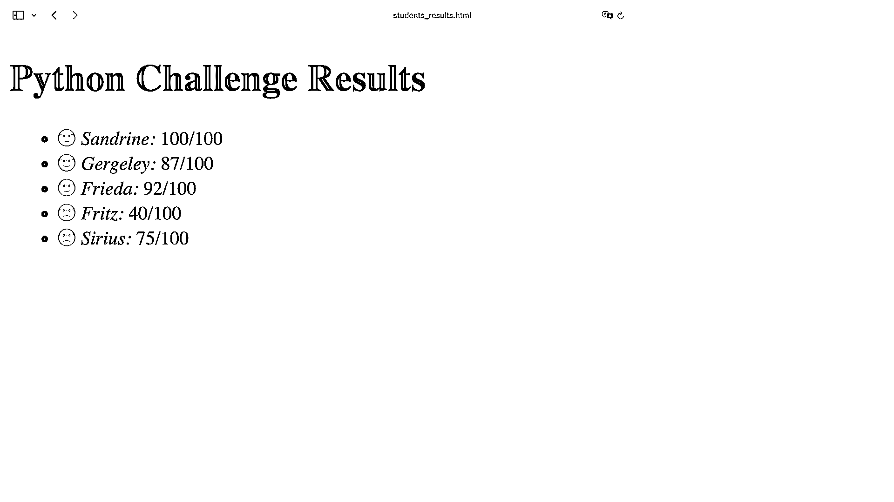
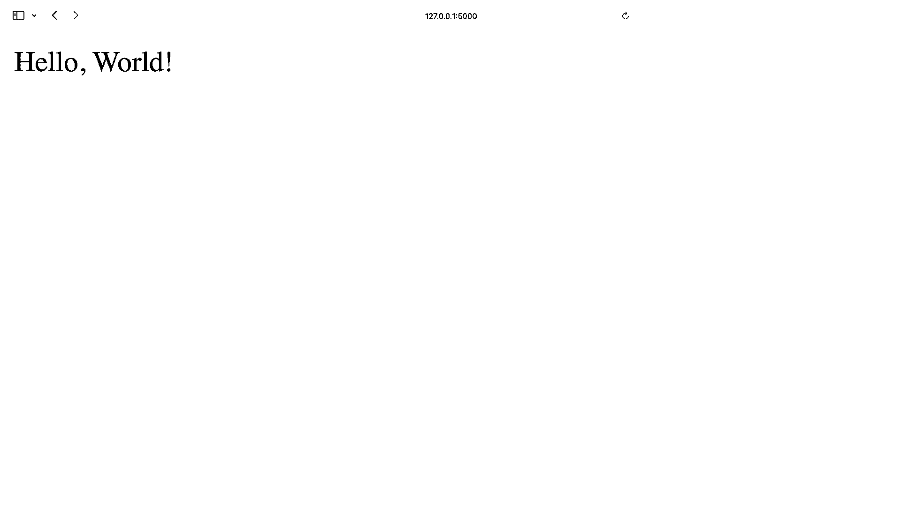
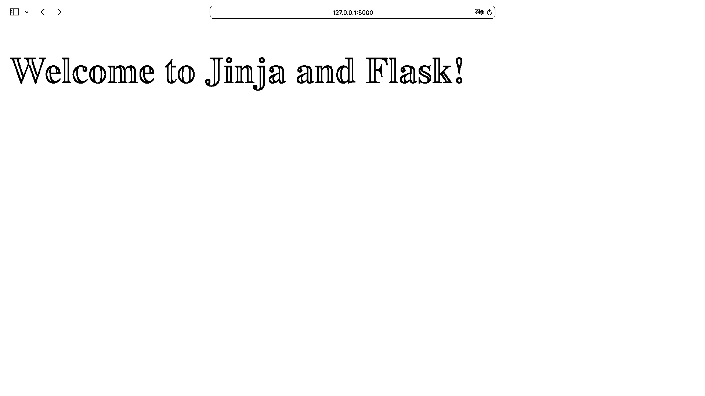
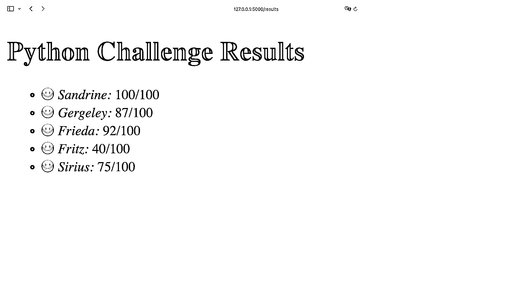
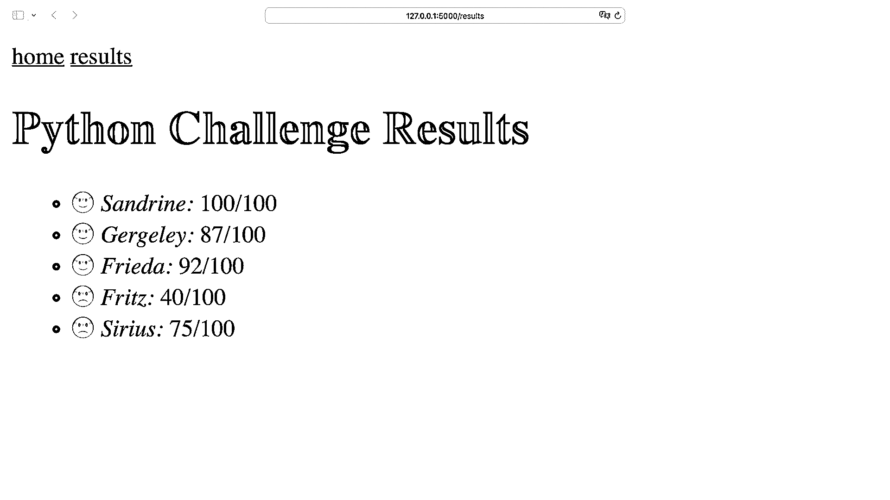
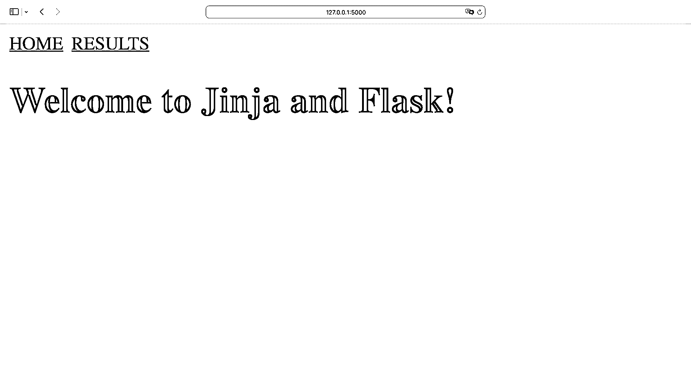
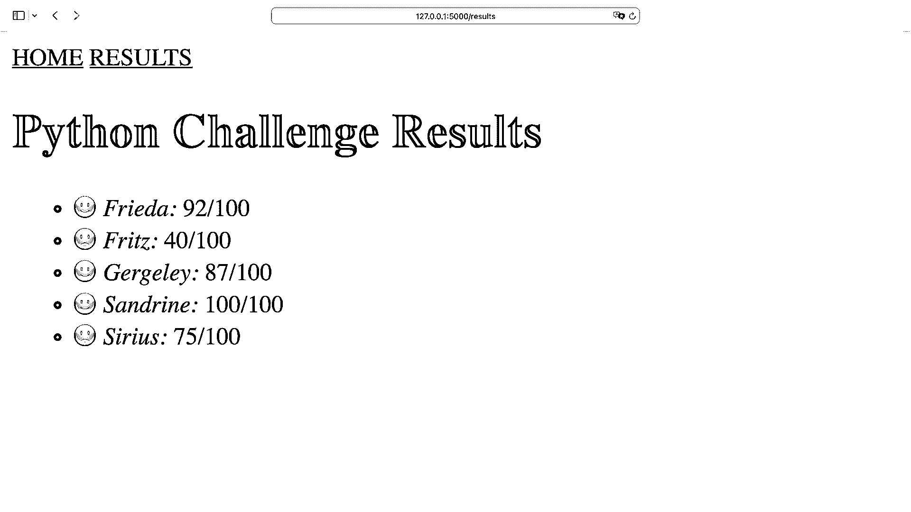
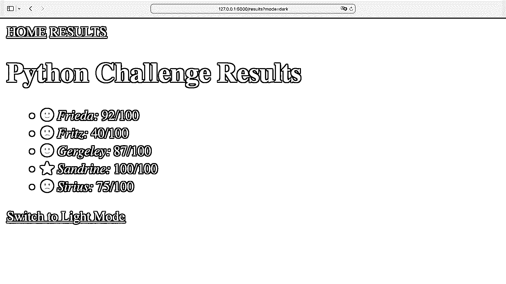

# Jinja 模板底漆

> 原文：<https://realpython.com/primer-on-jinja-templating/>

模板是全栈 web 开发中的重要组成部分。有了 **Jinja** ，您可以构建丰富的模板来驱动 Python web 应用程序的前端。

但是您不需要使用 web 框架来体验 Jinja 的功能。当你想创建带有编程内容的文本文件时，Jinja 可以帮助你。

**在本教程中，您将学习如何:**

*   安装 Jinja **模板引擎**
*   创建你的第一个 Jinja **模板**
*   在**烧瓶**中渲染一个 Jinja 模板
*   用 **`for`循环**和**条件语句**搭配 Jinja
*   **嵌套**金佳模板
*   用**过滤器**修改 Jinja 中的变量
*   使用**宏**为您的前端添加功能

您将从单独使用 Jinja 开始，了解 Jinja 模板的基础知识。稍后，您将构建一个包含两个页面和一个导航栏的基本 Flask web 项目，以充分利用 Jinja 的潜力。

在整个教程中，您将构建一个示例应用程序，展示 Jinja 的一些广泛功能。要查看它会做什么，请跳到最后一部分。

您也可以通过点击下面的链接找到 web 项目的完整源代码:

**源代码:** [点击这里下载源代码](https://realpython.com/bonus/jinja-primer-code/)，你将使用它来探索 Jinja 的能力。

如果你想学习更多关于 Jinja 模板语言的知识，或者如果你正在开始使用 Flask，这篇教程是为你准备的。

## 金贾入门

[金贾](https://jinja.palletsprojects.com/en/3.1.x/)不仅是乌干达东部地区的[城市](https://en.wikipedia.org/wiki/Jinja,_Uganda)和[日本寺庙](https://en.wikipedia.org/wiki/Shinto_shrine)，还是**模板引擎**。您通常将[模板引擎](https://en.wikipedia.org/wiki/Template_processor)用于 **web 模板**，这些模板从**后端**接收动态内容，并在前端将其呈现为**静态页面**。

但是你可以使用 Jinja，而不需要在后台运行 web 框架。这正是您在本节中要做的。具体来说，您将安装 Jinja 并构建您的第一个模板。

[*Remove ads*](/account/join/)

### 安装金贾

在探索任何新的包之前，创建并激活一个虚拟环境是个好主意。这样，您将在项目的虚拟环境中安装任何项目依赖项，而不是在系统范围内。

在下面选择您的**操作系统**，并使用您的平台特定命令来设置虚拟环境:

*   [*视窗*](#windows-1)
**   [**Linux + macOS**](#linux-macos-1)*

```py
PS> python -m venv venv
PS> .\venv\Scripts\activate
(venv) PS>
```

```py
$ python3 -m venv venv
$ source venv/bin/activate
(venv) $
```

通过上面的命令，您可以使用 Python 的内置`venv`模块创建并激活一个名为`venv`的虚拟环境。提示前面`venv`周围的括号(`()`)表示您已经成功激活了虚拟环境。

创建并激活虚拟环境后，就该用 [`pip`](https://realpython.com/what-is-pip/) 安装 Jinja 了:

```py
(venv) $ python -m pip install Jinja2
```

不要忘记包名末尾的`2`。否则，你将安装一个与 Python 3 不兼容的旧版本。

值得注意的是，虽然当前的主要版本实际上比`2`更大，但是您将要安装的包仍然叫做`Jinja2`。你可以通过运行`pip list`来验证你已经安装了一个现代版的 Jinja:

```py
(venv) $ python -m pip list
Package    Version
---------- -------
Jinja2     3.x
...
```

更混乱的是，在用大写的`J`安装了 Jinja 之后，还要用 Python 导入小写的`j`。通过打开[交互式 Python 解释器](https://realpython.com/interacting-with-python/)并运行以下命令来尝试一下:

>>>

```py
>>> import Jinja2
Traceback (most recent call last):
  ...
ModuleNotFoundError: No module named 'Jinja2'

>>> import jinja2
>>> # No error
```

当你试图导入`Jinja2`，用你用来安装 Jinja 的大写命名，然后你抛出一个`ModuleNotFoundError`。要将 Jinja 包导入 Python，必须键入小写的`j``jinja2`。

### 渲染你的第一个金贾模板

导入 Jinja 后，您可以继续加载和渲染您的第一个模板:

>>>

```py
>>> import jinja2
>>> environment = jinja2.Environment()
>>> template = environment.from_string("Hello, {{ name }}!")
>>> template.render(name="World")
'Hello, World!'
```

Jinja 的核心组件是`Environment()`级。在本例中，您创建了一个没有任何参数的 Jinja 环境。稍后，您将更改`Environment`的参数来定制您的环境。在这里，您创建了一个简单的环境，将字符串`"Hello, {{ name }}!"`作为模板加载。

您刚才所做的可能不会比在普通 Python 中使用[格式的字符串更令人印象深刻。然而，这个例子展示了在使用 Jinja 时通常要执行的两个重要步骤:](https://realpython.com/python-string-formatting/)

1.  **加载模板:**加载包含占位符变量的源。默认情况下，它们被包在一对花括号(`{{ }}`)中。
2.  **呈现模板:**用内容填充占位符。你可以提供一个[字典](https://realpython.com/python-dicts/)或者[关键字参数](https://realpython.com/defining-your-own-python-function/#keyword-arguments)作为上下文。在本例中，您已经填充了占位符，这样您就可以得到熟悉的`Hello, World!`作为输出。

您正在加载的源模板可以是一个文字字符串。但是当您使用文件并提供一个文本文件作为模板时，事情会变得更加有趣。

[*Remove ads*](/account/join/)

### 使用外部文件作为模板

如果您想遵循本教程中的示例，那么您可以继续创建一个新的文件夹来工作。在您的工作目录中，创建一个名为`templates/`的文件夹。

您可以将任何即将出现的模板存储在`templates/`文件夹中。现在创建一个名为`message.txt`的文本文件:

```py
{# templates/message.txt #}

Hello {{ name }}!

I'm happy to inform you that you did very well on today's {{ test_name }}.
You reached {{ score }} out of {{ max_score }} points.

See you tomorrow!
Anke
```

假设你是一名老师，想把成绩发给表现好的学生。`message.txt`模板包含了消息的蓝图，您可以复制并粘贴它以便以后发送。就像在`Hello, World!`的例子中，你可以在你的模板文本中找到花括号(`{{ }}`)。

接下来，创建一个名为`write_messages.py`的 Python 文件:

```py
# write_messages.py

from jinja2 import Environment, FileSystemLoader

max_score = 100
test_name = "Python Challenge"
students = [
    {"name": "Sandrine",  "score": 100},
    {"name": "Gergeley", "score": 87},
    {"name": "Frieda", "score": 92},
]

environment = Environment(loader=FileSystemLoader("templates/"))
template = environment.get_template("message.txt")

for student in students:
    filename = f"message_{student['name'].lower()}.txt"
    content = template.render(
        student,
        max_score=max_score,
        test_name=test_name
    )
    with open(filename, mode="w", encoding="utf-8") as message:
        message.write(content)
        print(f"... wrote {filename}")
```

当你用`FileSystemLoader`创建一个 Jinja 环境时，你可以传递指向你的模板文件夹的路径。您现在加载`message.txt`作为模板，而不是传入一个字符串。一旦你的模板被加载，你可以反复使用它来填充内容。在`write_messages.py`中，你将每个优等生的`name`和`score`呈现到一个文本文件中。

注意，`students`字典的键，连同`max_score`和`test_name`，匹配`message.txt`中的模板变量。如果您没有为模板中的变量提供上下文，它们不会抛出错误。但是它们呈现一个空字符串，这通常是不希望的。

当您调用`template.render()`时，您将呈现的模板作为字符串返回。与任何其他字符串一样，您可以使用`.write()`将其写入文件。要查看`write_messages.py`的运行，运行脚本:

```py
(venv) $ python write_messages.py
... wrote message_sandrine.txt
... wrote message_gergeley.txt
... wrote message_frieda.txt
```

您刚刚为您的每个学生创建了一个文件。看看`message_gergeley.txt`吧，比如:

```py
Hello Gergeley!

I'm happy to inform you that you did very well on today's Python Challenge.
You reached 87 out of 100 points.

See you tomorrow!
Anke
```

您的`message.txt`模板的变量成功接收了您学生的数据。让 Python 和 Jinja 为您工作是多么好的方式啊！现在，您可以复制并粘贴文本，将其发送给您的学生，并为自己节省一些工作。

## 控制金贾的流量

到目前为止，您已经向模板文本添加了占位符变量，并向其中呈现了值。在这一节中，您将学习如何将`if`语句和`for`循环添加到模板中，以便有条件地呈现内容而无需重复。

### 使用 if 语句

在上一节的示例中，您以编程方式为优等生创建了定制的消息。现在是时候考虑一下*你所有的*学生了。在`write_messages.py`中给`students`增加两个分数较低的学生:

```py
# write_messages.py

# ...

students = [
    {"name": "Sandrine",  "score": 100},
    {"name": "Gergeley", "score": 87},
    {"name": "Frieda", "score": 92},
 {"name": "Fritz", "score": 40}, {"name": "Sirius", "score": 75}, ]

# ...
```

你把弗里茨和小天狼星的分数加到`students`列表上。与其他学生不同，两人的成绩都低于 80 分。使用`80`标记在`message.txt`中创建一个条件语句:

```py
 1{# templates/message.txt #}
 2
 3Hello {{ name }}!
 4
 5 6I'm happy to inform you that you did very well on today's {{ test_name }}.
 7 8I'm sorry to inform you that you did not do so well on today's {{ test_name }}.
 9 10You reached {{ score }} out of {{ max_score }} points.
11
12See you tomorrow!
13Anke
```

除了您之前使用的变量，您现在还使用了一个带有 Jinja **块**的条件语句。不用一对双花括号，而是用一个花括号和一个百分号(``)创建 Jinja 块。

虽然您可以将普通变量看作子字符串，但是 Jinja 块包装了模板的更大部分。这就是为什么你也需要告诉 Jinja 你的街区在哪里结束。要关闭一个块，可以再次使用完全相同的关键字，加上一个`end`前缀。

在上面的例子中，你在第 5 行开始一个``块，在第 9 行用``关闭它。`if`语句本身的工作方式类似于 Python 中的[条件语句。在第 5 行，你正在检查`score`是否高于`80`。如果是这样，那么你正在传递一个快乐的信息。否则，您需要在第 8 行显示一条道歉消息。](https://realpython.com/python-conditional-statements/)

在上面的例子中，学生们同意将 80 分作为他们 Python 挑战性能的基准。随意将`80`改成任何让你和你的学生更舒服的分数。

[*Remove ads*](/account/join/)

### 循环杠杆

您还可以使用`for`循环来控制模板的流程。例如，您决定为学生创建一个显示所有结果的 HTML 页面。请注意，所有学生都同意在这场友谊赛中公开展示他们的成绩。

在您的`templates/`目录中创建一个名为`results.html`的新文件:

```py
{# templates/results.html #}

<!DOCTYPE html>
<html lang="en">
<head>
  <meta charset="utf-8">
  <title>Results</title>
</head>

<body>
  <h1>{{ test_name }} Results</h1>
  <ul>
  
    <li>
      <em>{{ student.name }}:</em> {{ student.score }}/{{ max_score }}
    </li>
  
  </ul>
</body>
</html>
```

在这里，您创建了一个 HTML 页面，它遍历您的`students`字典并显示它们的性能。就像用``块一样，你必须确保用``关闭你的``块。

您可以结合使用`if`语句和`for`循环来进一步控制模板的流程:

```
{# templates/results.html #}

{# ... #}


  <li>
 🙂🙁    <em>{{ student.name }}:</em> {{ student.score }}/{{ max_score }}
  </li>


{# ... #}
```py

根据学生的分数，你会显示一个微笑或悲伤的表情符号。请注意，您也可以将块表达式放在一行中。

继续更新`write_messages.py`:

```
# write_messages.py

# ...

results_filename = "students_results.html"
results_template = environment.get_template("results.html")
context = {
    "students": students,
    "test_name": test_name,
    "max_score": max_score,
}
with open(results_filename, mode="w", encoding="utf-8") as results:
    results.write(results_template.render(context))
    print(f"... wrote {results_filename}")
```py

除了为每个学生保存消息的`for`循环之外，现在还要编写一个包含该学生所有结果的 HTML 文件。这一次，您将创建一个`context`字典，保存您传递给模板的所有变量。

**注意:**使用`context`作为存储模板变量的集合的名称是一种约定。也就是说，如果你愿意的话，你可以用不同的名字来命名字典。

有了包含模板所有上下文的字典，您就可以用唯一的参数`context`调用`.render()`。当您运行`write_messages.py`时，您还会创建一个 HTML 文件:

>>>

```
(venv) $ python write_messages.py
... wrote message_sandrine.txt
... wrote message_gergeley.txt
... wrote message_frieda.txt
... wrote message_fritz.txt
... wrote message_sirius.txt
... wrote students_results.html
```py

您可以在代码编辑器中查看呈现的 HTML 文件。但是，由于您现在正在使用 HTML，您也可以在浏览器中查看该文件:

[](https://files.realpython.com/media/jinja-student-results.0fd2e89ad93a.png)

像在 Python 脚本中一样，您可以用`if`语句和`for`循环来控制 Jinja 模板的流程。在 Jinja 中，你使用块来包装内容。当你使用一个`for`块时，该块中的内容会在循环的每一步中呈现。

使用模板，您可以为大型网站创建构建块，而无需复制前端代码。这就是为什么像 Flask 这样的 web 框架利用了 Jinja 模板的力量。在下一节中，您将学习如何使用 Flask 将数据从后端呈现到前端的 web 页面中。

## 将金贾与烧瓶一起使用

很有可能你第一次听说 Jinja 是在你使用像 [Flask](https://flask.palletsprojects.com/) 这样的 web 框架的时候。Jinja 和 Flask 都由[托盘项目](https://palletsprojects.com/)维护，这是一个社区驱动的组织，负责管理为 Flask web 框架提供动力的 Python 库。

在本节中，您将继续前面的示例，为您的学生创建一个基本的 web 应用程序。

[*Remove ads*](/account/join/)

### 安装烧瓶

您可以继续在上一节中创建的相同目录和虚拟环境中工作。当您处于活跃的虚拟环境中时，继续安装 Flask:

```
(venv) $ python -m pip install flask
```py

安装 Flask 后，继续创建您的第一条路线，以验证 Flask 是否按预期工作。在项目的根目录下创建一个名为`app.py`的文件:

```
# app.py

from flask import Flask

app = Flask(__name__)

@app.route("/")
def home():
    return "Hello, World!"

if __name__ == "__main__":
    app.run(debug=True)
```py

当你把一个`@app.route()` [装饰器](https://realpython.com/primer-on-python-decorators/)放在一个烧瓶**视图**函数的顶部时，你用给定的 URL [规则](https://flask.palletsprojects.com/en/2.1.x/quickstart/#routing)注册它。在这里，您正在建立路由`/`，它返回`Hello, World!`。

要在浏览器中查看您的主页，请启动 Flask development web 服务器:

```
(venv) $ python app.py
...
 * Debug mode: on
 * Running on http://127.0.0.1:5000 (Press CTRL+C to quit)
 * Restarting with watchdog (fsevents)
 * Debugger is active!
```py

现在你的 Flask 应用运行在`debug`模式。在`debug`模式下，如果出现问题，你会得到更有意义的错误信息。此外，每当您更改代码库中的内容时，您的服务器都会自动重启。

要查看您的主页，请访问`http://127.0.0.1:5000`:

[](https://files.realpython.com/media/jinja-flask-hello-world.3a9c3d2d7869.png)

太棒了，你现在有一个跑步烧瓶应用程序了！在下一节中，您将在 Flask 应用程序中实现 Jinja 模板。

### 添加基础模板

到目前为止，您的 Flask 应用程序返回一个字符串。您可以通过添加 HTML 代码来增强您的字符串，Flask 会为您呈现它。但是正如您在上一节中了解到的，使用模板可以让您更方便地呈现内容。

在您的`templates/`目录中创建一个名为`base.html`的新模板:

```
 1{# templates/base.html #}
 2
 3<!DOCTYPE html>
 4<html lang="en">
 5<head>
 6  <meta charset="utf-8">
 7  <title>{{ title }}</title>
 8</head>
 9
10<body>
11  <h1>Welcome to {{ title }}!</h1>
12</body>
13</html>
```py

在`base.html`中，你有两次使用模板变量的机会:一次在第 7 行，另一次在第 11 行。为了渲染和提供`base.html`，将其作为您在`app.py`的主页加载:

```
# app.py

from flask import Flask, render_template 
app = Flask(__name__)

@app.route("/")
def home():
 return render_template("base.html", title="Jinja and Flask") 
# ...
```py

默认情况下，Flask 希望你的模板在一个`templates/`目录中。因此，不需要显式设置模板目录。当你提供`base.html`给`render_template()`时，Flask 知道在哪里寻找你的模板。

**注意:**通常，你会用 [CSS](https://realpython.com/html-css-python/) 改善网站的外观，用 [JavaScript](https://realpython.com/python-vs-javascript/) 添加一些功能。因为您在本教程中关注的是内容结构，所以您的 web 应用程序基本上是无样式的。

如果 Flask development server 还没有自动更新，请重新启动它。然后访问`http://127.0.0.1:5000`并验证 Flask 服务并呈现您的基本模板:

[](https://files.realpython.com/media/jinja-flask-welcome-home.816baca03b8a.png)

Flask 在你的网站标题和欢迎信息中呈现了`title`变量。接下来，您将创建一个页面来显示学生的成绩。

[*Remove ads*](/account/join/)

### 添加另一页

在前面的[章节](#leverage-for-loops)中，您使用`results.html`作为模板来生成一个名为`students_results.html`的文件。现在你已经有了一个 web 应用程序，你可以使用`results.html`来动态渲染你的模板，这次不用保存到一个新文件。

确保`results.html`被放置在`templates/`中，看起来像这样:

```
 1{# templates/results.html #}
 2
 3<!DOCTYPE html>
 4<html lang="en">
 5<head>
 6  <meta charset="utf-8">
 7  <title>{{ title }}</title> 8</head>
 9
10<body>
11  <h1>{{ test_name }} {{ title }}</h1> 12  <ul>
13  
14    <li>
15      🙂🙁
16      <em>{{ student.name }}:</em> {{ student.score }}/{{ max_score }}
17    </li>
18  
19  </ul>
20</body>
21</html>
```py

上面突出显示了对早期版本的唯一调整:

*   **第 7 行**添加动态页面标题。
*   **第 11 行**增强第一个标题。

要在 web 应用程序中访问结果页面，您必须创建路径。将以下代码添加到`app.py`:

```
# app.py

# ...

max_score = 100
test_name = "Python Challenge"
students = [
    {"name": "Sandrine",  "score": 100},
    {"name": "Gergeley", "score": 87},
    {"name": "Frieda", "score": 92},
    {"name": "Fritz", "score": 40},
    {"name": "Sirius", "score": 75},
]

@app.route("/results")
def results():
    context = {
        "title": "Results",
        "students": students,
        "test_name": test_name,
        "max_score": max_score,
    }
    return render_template("results.html", **context)

# ...
```py

在一个成熟的网络应用程序中，你可能会将数据存储在一个[外部数据库](https://realpython.com/python-mysql/)中。现在，你把`max_score`、`test_name`和`students`放在`results()`旁边。

Flask 的`render_template()`只接受一个[位置参数](https://realpython.com/defining-your-own-python-function/#positional-arguments)，即模板名称。任何其他参数都必须是关键字参数。所以你必须[打开你的字典](https://realpython.com/python-kwargs-and-args/#unpacking-with-the-asterisk-operators)，在`context`前面加两个星号(`**`)。使用星号操作符，您可以将`context`的条目作为关键字参数传递给`render_template()`。

当您在浏览器中访问`http://127.0.0.1:5000/results`时，Flask 为`results.html`提供呈现的上下文。跳到浏览器上看一看:

[](https://files.realpython.com/media/jinja-flask-student-results.d8afe18f9539.png)

现在，您有了一个主页和一个显示学生成绩的页面。对于 web 应用程序来说，这是一个很好的开始！

在下一节中，您将学习如何通过嵌套模板来更好地利用模板的功能。您还将向项目添加一个导航菜单，以便用户可以方便地从一个页面跳到另一个页面。

## 嵌套您的模板

随着应用程序的增长和不断添加新模板，您必须保持公共代码同步。到目前为止，你的两个模板，`base.html`和`results.html`，看起来非常相似。当多个模板包含相同的代码时，如果您更改了任何公共代码，就需要调整每个模板。

在本节中，您将实现一个父模板和子模板结构，这将使您的代码更易于维护。

### 调整您的基础模板

当您使用 Jinja 的模板继承时，您可以将 web 应用程序的公共结构移动到父**基础模板**，并让**子模板**继承该代码。

您的`base.html`几乎可以作为您的基础模板了。为了使您的基本模板可扩展，向结构中添加一些``标记:

```
{# templates/base.html #}

<!DOCTYPE html>
<html lang="en">
<head>
  <meta charset="utf-8">
 <title>{{ title }}</title> </head>

<body>
     <h1>Welcome to {{ title }}!</h1>
  </body>
</html>
```py

您使用``标签来定义您的基本模板的哪些部分可以被子模板覆盖。就像用``和``一样，你必须用``关闭你的区块。

请注意，您还命名了您的块。使用`title`参数，您允许子模板用自己的`title`块替换``和``之间的代码。你可以用一个`content`块代替``的代码。

**注意:**内容块的名称在每个模板中必须是唯一的。否则，Jinja 会对选择哪个块进行替换感到困惑。

在`base.html`中的``标签之间的内容是一个占位符。每当子模板不包含相应的``标签时，就会显示回退内容。

您也可以决定不在``标签之间添加回退内容。和模板中的变量一样，如果你不为它们提供内容，Jinja 也不会抱怨。相反，Jinja 将呈现一个空字符串。

在`base.html`中，你为你的模板块提供后备内容。因此，你不需要改变你的`home()`视图中的任何东西。它会像以前一样工作。

在下一节中，您将准备您的子模板来使用`base.html`。

[*Remove ads*](/account/join/)

### 扩展子模板

您当前有一个独立工作的`results.html`模板，没有父模板。这意味着你现在可以调整`results.html`的代码来连接`base.html`:

```
 1{# templates/results.html #}
 2
 3 4
 5 6<h1>{{ test_name }} {{ title }}</h1>
 7<ul>
 8
 9  <li>
10    🙂🙁
11    <em>{{ student.name }}:</em> {{ student.score }}/{{ max_score }}
12  </li>
13
14</ul>
15
```py

要将子模板与其父模板连接起来，必须在文件顶部添加一个``标签。

子模板也包含``标签。通过提供块的名称作为参数，可以将子模板中的块与父模板中的块连接起来。

注意`results.html`不包含`title`块。但是您的页面仍然会显示正确的标题，因为它使用了`base.html`中的回退内容，并且视图提供了一个`title`变量。

你不需要调整你的`results()`视角。当您访问`http://127.0.0.1:5000/results`时，您应该注意不到任何变化。呈现的页面包含`base.html`的根代码和来自`results.html`块的填充。

请记住，子模板块之外的任何内容都不会出现在您呈现的页面上。例如，如果你想给链接回你主页的`results.html`添加导航，那么你必须要么在`base.html`中定义一个新的占位符块，要么给`base.html`的结构添加导航菜单。

### 包括导航菜单

网站的导航通常显示在每个页面上。有了基础和子模板结构，最好将导航菜单的代码添加到`base.html`中。

您可以利用``标签，而不是将导航菜单代码直接添加到`base.html`中。通过用``引用另一个模板，你将整个模板加载到那个位置。

**内含模板**是包含完整 HTML 代码一小部分的部分模板。为了表示要包含一个模板，您可以在它的名称前加一个下划线(`_`)。

遵循基于前缀的命名方案，在您的`templates/`文件夹中创建一个名为`_navigation.html`的新模板:

```
{# templates/_navigation.html #}

<nav>

  <a href="{{ url_for(menu_item) }}">{{ menu_item }}</a>

</nav>
```py

请注意，`_navigation.html`既不包含``标签，也不包含任何``标签。您可以只关注如何呈现导航菜单。

当您使用`url_for()`时，Flask 会为您创建给定视图的完整 URL。因此，即使当你决定改变路线到你的一个网页，导航菜单仍然会工作。

在`base.html`中包含`_navigation.html`以在所有页面上显示导航菜单:

```
{# templates/base.html #}

<!DOCTYPE html>
<html lang="en">
<head>
  <meta charset="utf-8">
  <title>{{ title }}</title>
</head>

<body>
 <header>  </header>  
    <h1>Welcome to {{ title }}!</h1>
  
</body>
</html>
```py

你不需要直接在`base.html`中添加导航菜单代码，而是将`_navigation.html`包含在你网站的标题中。由于`results.html`延伸了`base.html`，你可以访问`http://127.0.0.1:5000/results`查看你的新导航菜单:

[](https://files.realpython.com/media/jinja-flask-menu.a642577f578f.png)

您的结果页面从您的基本模板继承代码。当您单击导航菜单中的链接时，地址栏中的 URL 会根据您当前的页面而改变。

[*Remove ads*](/account/join/)

## 应用过滤器

花点时间想一个情况，另一个人负责后端，你的责任是网站的前端。为了避免相互干扰，不允许您调整`app.py`中的任何视图或更改模板中的数据。

在与您的学生交谈后，您同意您的 web 应用程序可以改进。你想出了两个特点:

1.  以大写形式显示导航菜单项。
2.  将你学生的名字按字母顺序排序。

您将使用 Jinja 的**过滤器**功能来实现这两个特性，而无需触及后端。

### 调整您的菜单项

Jinja 提供了一堆[内置滤镜](https://jinja.palletsprojects.com/en/3.1.x/templates/#builtin-filters)。如果你检查它们，你会注意到它们看起来类似于 [Python 的内置函数](https://docs.python.org/3/library/functions.html)和[字符串方法](https://realpython.com/python-strings/#built-in-string-methods)。

在您继续之前，请重温您的`_navigation.html`部分:

```
{# templates/_navigation.html #}

<nav>

  <a href="{{ url_for(menu_item) }}">{{ menu_item }}</a>

</nav>
```py

目前，您的菜单项以小写显示，以匹配视图的名称。如果`menu_item`不是小写，那么这个链接就不起作用。这意味着`href`属性中的`menu_item`必须保持原样。

但是，您可以调整`<a>`标签内`menu_item`的显示:

```
{# templates/_navigation.html #}

<nav>

 <a href="{{ url_for(menu_item) }}">{{ menu_item|upper }}</a> 
</nav>
```py

指定变量，然后指定管道符号(`|`)，再指定过滤器。在某些情况下，可以在括号中指定参数。

在导航菜单中，您将`menu_item`变量交给`upper`过滤器。像 Python 的`.upper()`字符串方法一样，Jinja 的`upper`过滤器以大写字母返回变量。

访问`http://127.0.0.1:5000`实时查看您的变化:

[](https://files.realpython.com/media/jinja-flask-uppercase-nav.6a897f4c5416.png)

完美，菜单项现在是大写的！您实现了请求列表中的第一个特性。是时候处理下一个特性请求了。

### 对结果列表进行排序

此时，您的学生的结果会按照您在`app.py`中定义的顺序出现。您将使用 Jinja 的`sort`过滤器按照学生的字母顺序对结果列表进行排序。

打开`results.html`，将`sort`滤镜添加到`for`循环中:

```
{# templates/results.html #}

{# ... #}


  <li>
    🙂🙁
    <em>{{ student.name }}:</em> {{ student.score }}/{{ max_score }}
  </li>


{# ... #}
```py

`sort`滤镜使用 [Python 的`sorted()`](https://realpython.com/python-sort/) 遮光罩下。

您在`results.html`中的`students` iterable 包含每个条目的字典。通过添加`attribute=name`，您告诉 Jinja 根据`name`的值对`students`进行排序。当您想要对字符串列表进行排序时，可以使用不带任何参数的`sort`过滤器。

转到`http://127.0.0.1:5000/results`查看新的分类:

[](https://files.realpython.com/media/jinja-flask-student-results-sorted.57e84ccd5637.png)

您使用 Jinja 的`sort`过滤器将学生的成绩按姓名排序。如果您有同名的学生，那么您可以链接过滤器:

```


  {# ... #}


```py

首先，你按名字给你的学生分类。如果有两个学生同名，那么你按他们的分数排序。当然，同名的学生除了他们的分数之外，实际上还需要一些差异，但是对于这个例子来说，这种排序已经足够了。

你颠倒`score`的顺序，将这些学生从最高分到最低分排序。当你的行变得太长时，Jinja 允许你跨多行分布你的语句。

**注意:**与在 Python 中使用[布尔相反](https://realpython.com/python-boolean/)，你应该用小写写 Jinja 中的布尔。

您可以使用过滤器独立于后端来转换模板中的数据。将筛选器应用于变量时，您可以为用户更改变量值，而无需更改任何基础数据结构。

查看 [Jinja 的滤镜文档](https://jinja.palletsprojects.com/en/3.1.x/templates/#filters)以了解更多关于模板滤镜的信息。

如果你想在你的模板中加入更多的逻辑，那么你可以利用宏。在下一节中，您将通过在 Flask 应用程序中实现另外三个特性来探索宏。

[*Remove ads*](/account/join/)

## 包括宏

当您包含像导航菜单这样的部分模板时，包含的代码会在父模板的上下文中呈现，无需任何调整。通常，这正是您想要的，但是其他时候您可能想要定制包含的模板的外观。

Jinja 的**宏**可以帮助你创建接受参数的模板片段。就像当[在 Python](https://realpython.com/defining-your-own-python-function/) 中定义自己的函数时，你可以定义宏并将它们导入你的模板。

在本节中，您将向您的 Flask 项目添加另外三个特性:

1.  实现黑暗模式。
2.  突出分数最高的学生。
3.  在导航菜单中标记当前页面。

像以前一样，你不会碰任何后端代码来改进你的 web app。

### 实施黑暗模式

对于一些学生来说，亮暗配色方案在视觉上更有吸引力。为了迎合所有学生，您将添加切换到深色模式的选项，在深色背景上显示浅色文本。

向`templates/`目录添加一个`macros.html`文件:

```
 1{# templates/macros.html #}
 2
 3
 4  
 5    <a href="{{ request.path }}">Switch to Light Mode</a>
 6    <style> 7  {{ element }}  { 8  background-color:  #212F3C; 9  color:  #FFFFF0; 10  } 11  {{ element }}  a  { 12  color:  #00BFFF  !important; 13  } 14  </style>
15  
16    <a href="{{ request.path }}?mode=dark">Switch to Dark Mode</a>
17  
18
```py

您使用类似于 Python 中函数定义的``块来定义宏。您的宏必须有一个名称，并且它可以接受参数。

对于`light_or_dark_mode()`宏，您必须提供一个 HTML 元素名。这将是第 6 行到第 14 行中 CSS 由亮变暗的元素。

为了避免默认情况下提供一个黑暗主题的网站，你应该给你的学生提供切换设计的选项。当他们将`?mode=dark`添加到你 app 的任意路线时，你就激活了黑暗模式。

在第 4 行，您使用 Flask 的 [`request`对象](https://flask.palletsprojects.com/en/2.1.x/reqcontext/)来读取请求参数。默认情况下，`request`对象存在于模板的上下文中。

如果黑暗模式参数存在于 GET 请求中，那么在第 5 行显示一个带有切换到光明模式选项的链接，并将`style`标记添加到模板中。没有任何黑暗模式参数，你显示一个链接切换到黑暗主题。

要使用宏，必须将其导入到基本模板中。就像使用 [Python 的`import`语句](https://realpython.com/python-import/)一样，建议将``块放在模板的顶部:

```
{# templates/base.html #}

 
<!DOCTYPE html>
<html lang="en">
<head>
  <meta charset="utf-8">
  <title>{{ title }}</title>
</head>

<body>
  {# ... #}
 <footer> {{ macros.light_or_dark_mode("body") }} </footer> </body>
</html>
```py

根据请求的 GET 参数，您将呈现深色模式，并显示一个切换到其他颜色主题的链接。

通过提供`body`作为`macros.light_or_dark_mode()`的参数，您的学生可以切换整个页面的配色方案。访问`http://127.0.0.1:5000`,体验你的配色方案:

[https://player.vimeo.com/video/727335601?background=1](https://player.vimeo.com/video/727335601?background=1)

你可以尝试向`macros.light_or_dark_mode()`提供`"h1"`而不是`"body"`，然后重新加载页面。因为宏接受参数，所以可以灵活地有条件地呈现模板的各个部分。

[*Remove ads*](/account/join/)

### 突出你最好的学生

将宏引入 Flask 项目的另一个原因是将一些逻辑放入它自己的隔间中。像嵌套模板一样，将功能外包给宏可以整理您的父模板。

为了用星形表情符号突出你最好的学生，清理`results.html`并引用一个`add_badge()`宏:

```
{# templates/results.html #}

{# ... #}


  <li>
 {{ macros.add_badge(student, students) }}    <em>{{ student.name }}:</em> {{ student.score }}/{{ max_score }}
  </li>


{# ... #}
```py

注意不要在`results.html`的顶部导入`macros.html`。您正在扩展`base.html`，其中您已经导入了所有的宏。所以这里不需要再导入了。

不是在`results.html`中向列表项添加更多代码，而是在`for`循环中引用`macros.add_badge()`。你借此机会移除显示快乐或悲伤表情的`if` … `else`状态。这段代码完全符合宏的目的，即给所有学生添加一个徽章。

`add_badge()`宏需要两个参数:

1.  当前的`student`字典
2.  完整的`students`列表

如果你现在访问你的页面，你会得到一个错误，因为 Flask 找不到你引用的宏。继续将您的新宏添加到`macros.html`:

```
 1{# templates/macros.html #}
 2
 3{# ... #}
 4
 5
 6  
 7
 8  
 9    ⭐️
10  
11    🙂
12  
13    🙁
14  
15
```py

Jinja 允许你用``块在模板中定义你自己的变量。当您定义变量时，您还可以为它们的值添加过滤器，甚至将它们链接起来。

在`add_badge`中，首先用`map()`过滤器创建一个所有分数的列表，然后用`max()`挑选最高分，从而定义`high_score`。这两个过滤器的行为类似于 [Python 的`map()`](https://realpython.com/python-map-function/) 或 [`max()`函数](https://realpython.com/python-min-and-max/)。

一旦你知道了你的学生中的最高分，然后你在第 8 到 14 行检查你当前学生的分数。

访问`http://127.0.0.1:5000/results`并查看您的新宏的运行情况:

[](https://files.realpython.com/media/jinja-flask-student-results-star.a19d3ee96cfe.png)

除了您之前展示的微笑或悲伤表情外，您现在还为表现最好的学生展示了一个星形表情。

### 标记当前页面

您将实现的最后一个功能将改进您的导航菜单。目前，导航菜单在任一页面上保持不变。在本节中，您将创建一个用箭头标记当前页面菜单项的宏。

向`macros.html`添加另一个宏:

```
{# templates/macros.html #}

{# ... #}


  
  <a href="{{ url_for(menu_item) }}{{ mode }}">{{ menu_item|upper }}</a>
  
    ←
  

```py

您的`nav_link()`宏将菜单项作为参数。如果`menu_item`匹配当前端点，那么除了菜单项链接之外，宏还会呈现一个箭头。

此外，还要检查颜色模式。如果`"dark"`是 GET 请求的一部分，那么`"?mode=dark"`将被添加到菜单链接中。如果不检查和添加模式，你每次点击链接都会切换到灯光主题，因为`"?mode=dark"`不会是链接的一部分。

用新的宏替换`_navigation.html`中的菜单项链接:

```
{# templates/_navigation.html #}

<nav>

 {{ macros.nav_link(menu_item) }} 
</nav>
```

通过添加`nav_link()`宏到你的导航菜单，你可以保持你的导航模板干净。你把任何条件逻辑交给`nav_link()`。

访问`http://127.0.0.1:5000`并查看您已经实现的所有功能:

[https://player.vimeo.com/video/727335630?background=1](https://player.vimeo.com/video/727335630?background=1)

宏是 Jinja 的一个强大功能。不过，你不应该过度使用它们。在某些情况下，最好将逻辑放在后端，而不是让模板来完成工作。

总会有一些极端的情况，您必须决定是将代码直接添加到模板中，还是将其推迟到包含的模板中，或者创建一个宏。如果你的模板代码与你的数据结构纠缠太多，那么它甚至可能是你的代码逻辑属于你的应用程序后端的一个标志。

[*Remove ads*](/account/join/)

## 结论

Jinja 是一个功能丰富的模板引擎，与 Flask web 框架打包在一起。但是，您也可以独立于 Flask 使用 Jinja 来创建模板，您可以通过编程用内容填充这些模板。

**在本教程中，您学习了如何:**

*   安装 Jinja **模板引擎**
*   创建你的第一个 Jinja **模板**
*   在**烧瓶**中渲染一个 Jinja 模板
*   用 **`for`循环**和**条件语句**搭配 Jinja
*   **嵌套**金佳模板
*   用**过滤器**修改 Jinja 中的变量
*   使用**宏**为您的前端添加功能

如果你想把你新学到的关于 Jinja 的知识付诸实践，那么你可以构建一个前端的[fast API URL shorter](https://realpython.com/build-a-python-url-shortener-with-fastapi/)或者[部署你的 Flask 应用到 Heroku](https://realpython.com/flask-by-example-part-1-project-setup/) 。

你也可以考虑使用 [Jinja 作为 Django](https://docs.djangoproject.com/en/4.0/topics/templates/#support-for-template-engines) 的模板引擎。要了解更多关于 Jinja 和 [Django 的模板引擎](https://realpython.com/django-templates-tags-filters/)之间的区别，请访问 Jinja 关于[从其他模板引擎切换到 Jinja](https://jinja.palletsprojects.com/en/3.1.x/switching/) 的文档。

您是否有其他利用 Jinja 提供的功能的用例？请在下面的评论中与真正的 Python 社区分享它们！*************