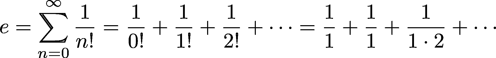

# Python 装饰者入门

> 原文：<https://realpython.com/primer-on-python-decorators/>

*立即观看**本教程有真实 Python 团队创建的相关视频课程。和写好的教程一起看，加深理解:[**Python Decorators 101**](/courses/python-decorators-101/)

在这篇关于装饰者的教程中，我们将看看它们是什么，以及如何创建和使用它们。Decorators 为调用[高阶函数](http://en.wikipedia.org/wiki/Higher-order_function)提供了简单的语法。

根据定义，装饰器是一个函数，它接受另一个函数并扩展后一个函数的行为，而无需显式修改它。

这听起来令人困惑，但事实并非如此，尤其是在你看过一些装饰者如何工作的例子之后。你可以在本文[这里](https://github.com/realpython/materials/tree/master/primer-on-python-decorators)找到所有的例子。

**免费奖励:** ，它向您展示了三种高级装饰模式和技术，您可以用它们来编写更简洁、更 Python 化的程序。

**Decorators Cheat Sheet:**[点击这里获得一个免费的三页 Python decorators cheat sheet](https://realpython.com/bonus/decorators-cheatsheet/) ，它总结了本教程中解释的技术。

**Decorators Q &文字记录:** [点击此处获取我们 Python decorators Q &的 25 页聊天记录，这是真实 Python 社区 Slack 中的一个会话](https://realpython.com/bonus/decorators-qa-2019/)，我们在这里讨论了常见的 decorator 问题。

**更新:**

*   *08/22/2018:* 主要更新增加了更多的例子和更高级的装饰者
*   *2016 年 1 月 12 日:*更新了 Python 3 (v3.5.1)语法的示例，并添加了一个新示例
*   *2015 . 11 . 01:*增加了对`functools.wraps()`装饰工的简要说明

## 功能

在理解 decorators 之前，你必须先理解函数是如何工作的。出于我们的目的，**函数根据给定的参数**返回值。这里有一个非常简单的例子:

>>>

```py
>>> def add_one(number):
...     return number + 1

>>> add_one(2)
3
```

一般来说，Python 中的函数也可能有副作用，而不仅仅是将输入变成输出。[`print()`函数](https://realpython.com/python-print/)就是一个基本的例子:它[返回](https://realpython.com/python-return-statement/) [`None`](https://realpython.com/null-in-python/) ，同时具有向控制台输出一些东西的副作用。然而，要理解 decorators，只需将函数看作是将给定参数转化为值的东西。

**注:**在[函数式编程](https://realpython.com/python-functional-programming/)中，你(几乎)只用纯函数工作，没有副作用。虽然 Python 不是纯粹的函数式语言，但它支持许多函数式编程概念，包括作为一级对象的函数。

[*Remove ads*](/account/join/)

### 一等物体

在 Python 中，函数是[一级对象](https://dbader.org/blog/python-first-class-functions)。这意味着**函数可以被传递并用作参数**，就像[任何其他对象(string、int、float、list 等等)](https://realpython.com/python-data-types/)一样。考虑以下三个函数:

```py
def say_hello(name):
    return f"Hello {name}"

def be_awesome(name):
    return f"Yo {name}, together we are the awesomest!"

def greet_bob(greeter_func):
    return greeter_func("Bob")
```

这里，`say_hello()`和`be_awesome()`是常规函数，它们期望一个字符串形式的名称。然而，`greet_bob()`函数需要一个函数作为它的参数。例如，我们可以传递给它`say_hello()`或`be_awesome()`函数:

>>>

```py
>>> greet_bob(say_hello)
'Hello Bob'

>>> greet_bob(be_awesome)
'Yo Bob, together we are the awesomest!'
```

注意，`greet_bob(say_hello)`指的是两个函数，只是方式不同:`greet_bob()`和`say_hello`。`say_hello`函数的命名不带括号。这意味着只传递对函数的引用。不执行该功能。另一方面，`greet_bob()`函数是用圆括号写的，所以它将像往常一样被调用。

### 内部函数

可以在其他函数内[定义函数](https://realpython.com/defining-your-own-python-function/) *。这样的函数被称为[内部函数](https://realpython.com/inner-functions-what-are-they-good-for/)。下面是一个包含两个内部函数的函数示例:*

```py
def parent():
    print("Printing from the parent() function")

    def first_child():
        print("Printing from the first_child() function")

    def second_child():
        print("Printing from the second_child() function")

    second_child()
    first_child()
```

调用`parent()`函数会发生什么？考虑一下这个问题。输出如下所示:

>>>

```py
>>> parent()
Printing from the parent() function
Printing from the second_child() function
Printing from the first_child() function
```

请注意，内部函数的定义顺序并不重要。像任何其他函数一样，只有在执行内部函数时才会进行打印。

此外，在调用父函数之前，不会定义内部函数。它们的局部范围是`parent()`:它们只作为局部[变量](https://realpython.com/python-variables/)存在于`parent()`函数中。试着打电话给`first_child()`。您应该会得到一个错误:

```py
Traceback (most recent call last):
  File "<stdin>", line 1, in <module>
NameError: name 'first_child' is not defined
```

每当你调用`parent()`，内部函数`first_child()`和`second_child()`也被调用。但是由于它们的局部作用域，它们在`parent()`函数之外是不可用的。

### 从函数返回函数

Python 还允许使用函数作为返回值。以下示例从外部`parent()`函数返回一个内部函数:

```py
def parent(num):
    def first_child():
        return "Hi, I am Emma"

    def second_child():
        return "Call me Liam"

    if num == 1:
        return first_child
    else:
        return second_child
```

请注意，您返回的是不带括号的`first_child`。回想一下，这意味着您正在**返回对函数`first_child`** 的引用。相反，带括号的`first_child()`指的是函数求值的结果。这可以从下面的例子中看出:

>>>

```py
>>> first = parent(1)
>>> second = parent(2)

>>> first
<function parent.<locals>.first_child at 0x7f599f1e2e18>

>>> second
<function parent.<locals>.second_child at 0x7f599dad5268>
```

有些晦涩的输出仅仅意味着`first`变量引用了`parent()`内部的局部`first_child()`函数，而`second`指向了`second_child()`。

您现在可以像使用常规函数一样使用`first`和`second`，即使它们指向的函数不能被直接访问:

>>>

```py
>>> first()
'Hi, I am Emma'

>>> second()
'Call me Liam'
```

最后，注意在前面的例子中，您在父函数中执行了内部函数，例如`first_child()`。然而，在最后一个例子中，您没有在返回时给内部函数`first_child`添加括号。这样，你就有了将来可以调用的每个函数的引用。有道理吗？

[*Remove ads*](/account/join/)

## 简单的装饰者

既然您已经看到了函数就像 Python 中的任何其他对象一样，那么您就可以继续下去，看看 Python 装饰器这个神奇的东西了。让我们从一个例子开始:

```py
def my_decorator(func):
    def wrapper():
        print("Something is happening before the function is called.")
        func()
        print("Something is happening after the function is called.")
    return wrapper

def say_whee():
    print("Whee!")

say_whee = my_decorator(say_whee)
```

你能猜到当你调用`say_whee()`时会发生什么吗？试试看:

>>>

```py
>>> say_whee()
Something is happening before the function is called.
Whee!
Something is happening after the function is called.
```

要理解这里发生了什么，回头看看前面的例子。我们实际上只是应用了你到目前为止所学的一切。

所谓的装饰发生在下面这条线上:

```py
say_whee = my_decorator(say_whee)
```

实际上，名称`say_whee`现在指向了`wrapper()`内部函数。记住当你调用`my_decorator(say_whee)`时，你返回`wrapper`作为一个函数:

>>>

```py
>>> say_whee
<function my_decorator.<locals>.wrapper at 0x7f3c5dfd42f0>
```

但是，`wrapper()`将原来的`say_whee()`引用为`func`，并在对 [`print()`](https://realpython.com/courses/python-print/) 的两次调用之间调用那个函数。

简单地说:**装饰者包装一个函数，修改它的行为。**

在继续之前，让我们看第二个例子。因为`wrapper()`是一个常规的 Python 函数，装饰者修改函数的方式可以动态改变。为了不打扰邻居，下面的示例将只在白天运行修饰代码:

```py
from datetime import datetime

def not_during_the_night(func):
    def wrapper():
        if 7 <= datetime.now().hour < 22:
            func()
        else:
            pass  # Hush, the neighbors are asleep
    return wrapper

def say_whee():
    print("Whee!")

say_whee = not_during_the_night(say_whee)
```

如果你试图在就寝时间后打电话给`say_whee()`，什么也不会发生:

>>>

```py
>>> say_whee()
>>>
```

### 句法糖！

你上面装饰的方式有点笨拙。首先，你最终要输入名字`say_whee`三次。此外，装饰隐藏在函数定义的下面。

相反，Python 允许你以更简单的方式用符号来**使用装饰器，有时被称为[“派”语法](https://www.python.org/dev/peps/pep-0318/#background)。以下示例与第一个装饰器示例做了完全相同的事情:**

```py
def my_decorator(func):
    def wrapper():
        print("Something is happening before the function is called.")
        func()
        print("Something is happening after the function is called.")
    return wrapper

@my_decorator
def say_whee():
    print("Whee!")
```

所以，`@my_decorator`只是`say_whee = my_decorator(say_whee)`更简单的说法。这就是如何将装饰器应用到函数中。

[*Remove ads*](/account/join/)

### 重用装饰者

回想一下，装饰器只是一个普通的 Python 函数。所有易于重用的常用工具都是可用的。让我们将装饰器移到它自己的[模块](https://realpython.com/python-modules-packages/)中，该模块可以在许多其他函数中使用。

用以下内容创建一个名为`decorators.py`的文件:

```py
def do_twice(func):
    def wrapper_do_twice():
        func()
        func()
    return wrapper_do_twice
```

**注意:**您可以随意命名您的内部函数，像`wrapper()`这样的通用名称通常是可以的。你会在这篇文章中看到很多装饰者。为了将它们区分开来，我们将内部函数命名为与装饰器相同的名称，但带有一个`wrapper_`前缀。

现在，您可以通过常规的[导入](https://realpython.com/absolute-vs-relative-python-imports/)在其他文件中使用这个新的装饰器:

```py
from decorators import do_twice

@do_twice
def say_whee():
    print("Whee!")
```

当您运行这个示例时，您应该看到原始的`say_whee()`被执行了两次:

>>>

```py
>>> say_whee()
Whee!
Whee!
```

**免费奖励:** ，它向您展示了三种高级装饰模式和技术，您可以用它们来编写更简洁、更 Python 化的程序。

### 用参数装饰函数

假设你有一个接受一些参数的函数。还能装修吗？让我们试试:

```py
from decorators import do_twice

@do_twice
def greet(name):
    print(f"Hello {name}")
```

不幸的是，运行这段代码会引发一个错误:

>>>

```py
>>> greet("World")
Traceback (most recent call last):
  File "<stdin>", line 1, in <module>
TypeError: wrapper_do_twice() takes 0 positional arguments but 1 was given
```

问题是内部函数`wrapper_do_twice()`没有任何参数，但是`name="World"`被传递给了它。您可以通过让`wrapper_do_twice()`接受一个参数来解决这个问题，但是它对您之前创建的`say_whee()`函数不起作用。

解决方法是在内部包装函数中使用 [`*args`和`**kwargs`](https://realpython.com/python-kwargs-and-args/) 。那么它将接受任意数量的位置和关键字参数。将`decorators.py`改写如下:

```py
def do_twice(func):
 def wrapper_do_twice(*args, **kwargs): func(*args, **kwargs) func(*args, **kwargs)    return wrapper_do_twice
```

`wrapper_do_twice()`内部函数现在接受任意数量的参数，并将它们传递给它修饰的函数。现在你的`say_whee()`和`greet()`例子都起作用了:

>>>

```py
>>> say_whee()
Whee!
Whee!

>>> greet("World")
Hello World
Hello World
```

[*Remove ads*](/account/join/)

### 从修饰函数中返回值

修饰函数的返回值会怎么样？嗯，这要由装修工来决定。假设您如下装饰一个简单的函数:

```py
from decorators import do_twice

@do_twice
def return_greeting(name):
    print("Creating greeting")
    return f"Hi {name}"
```

尝试使用它:

>>>

```py
>>> hi_adam = return_greeting("Adam")
Creating greeting
Creating greeting
>>> print(hi_adam)
None
```

糟糕，你的装饰器吃了函数的返回值。

因为`do_twice_wrapper()`没有显式返回值，所以调用`return_greeting("Adam")`最终返回了`None`。

要解决这个问题，你需要**确保包装函数返回被修饰函数**的返回值。更改您的`decorators.py`文件:

```py
def do_twice(func):
    def wrapper_do_twice(*args, **kwargs):
        func(*args, **kwargs)
 return func(*args, **kwargs)    return wrapper_do_twice
```

返回上一次执行函数的返回值:

>>>

```py
>>> return_greeting("Adam")
Creating greeting
Creating greeting
'Hi Adam'
```

### 你到底是谁？

在使用 Python 时，特别是在交互式 shell 中，一个很大的便利是它强大的自省能力。[自省](https://en.wikipedia.org/wiki/Type_introspection)是对象在运行时知道自己属性的能力。例如，一个函数知道它自己的名字和[文档](https://realpython.com/documenting-python-code/):

>>>

```py
>>> print
<built-in function print>

>>> print.__name__
'print'

>>> help(print)
Help on built-in function print in module builtins:

print(...)
 <full help message>
```

自省也适用于您自己定义的函数:

>>>

```py
>>> say_whee
<function do_twice.<locals>.wrapper_do_twice at 0x7f43700e52f0>

>>> say_whee.__name__
'wrapper_do_twice'

>>> help(say_whee)
Help on function wrapper_do_twice in module decorators:

wrapper_do_twice()
```

然而，在被装饰之后，`say_whee()`对自己的身份变得非常困惑。现在它被报告为`do_twice()`装饰器中的`wrapper_do_twice()`内部函数。虽然从技术上讲这是真的，但这并不是非常有用的信息。

为了解决这个问题，decorator 应该使用 [`@functools.wraps`](https://docs.python.org/library/functools.html#functools.wraps) decorator，它将保存关于原始函数的信息。再次更新`decorators.py`:

```py
import functools 
def do_twice(func):
 @functools.wraps(func)    def wrapper_do_twice(*args, **kwargs):
        func(*args, **kwargs)
        return func(*args, **kwargs)
    return wrapper_do_twice
```

您不需要对修饰过的`say_whee()`函数做任何修改:

>>>

```py
>>> say_whee
<function say_whee at 0x7ff79a60f2f0>

>>> say_whee.__name__
'say_whee'

>>> help(say_whee)
Help on function say_whee in module whee:

say_whee()
```

好多了！现在`say_whee()`还是装修后的自己。

**技术细节:**`@functools.wraps`装饰器[使用](https://github.com/python/cpython/blob/5d4cb54800966947db2e86f65fb109c5067076be/Lib/functools.py#L34)函数`functools.update_wrapper()`来更新自检中使用的特殊属性，如`__name__`和`__doc__`。

[*Remove ads*](/account/join/)

## 几个真实世界的例子

让我们看几个更有用的装饰者的例子。您会注意到，它们将主要遵循您到目前为止所学的相同模式:

```py
import functools

def decorator(func):
    @functools.wraps(func)
    def wrapper_decorator(*args, **kwargs):
        # Do something before
        value = func(*args, **kwargs)
        # Do something after
        return value
    return wrapper_decorator
```

这个公式对于构建更复杂的装饰器来说是一个很好的样板模板。

**注意:**在后面的例子中，我们将假设这些装饰器也保存在您的`decorators.py`文件中。回想一下，你可以下载[本教程](https://github.com/realpython/materials/tree/master/primer-on-python-decorators)中的所有例子。

### 计时功能

让我们从创建一个`@timer`装饰器开始。它将[测量一个函数执行](https://realpython.com/python-timer/)所需的时间，并将持续时间打印到控制台。代码如下:

```py
import functools
import time

def timer(func):
    """Print the runtime of the decorated function"""
    @functools.wraps(func)
    def wrapper_timer(*args, **kwargs):
        start_time = time.perf_counter()    # 1
        value = func(*args, **kwargs)
        end_time = time.perf_counter()      # 2
        run_time = end_time - start_time    # 3
        print(f"Finished {func.__name__!r} in {run_time:.4f} secs")
        return value
    return wrapper_timer

@timer
def waste_some_time(num_times):
    for _ in range(num_times):
        sum([i**2 for i in range(10000)])
```

这个装饰器通过存储函数开始运行之前的时间(在标记为`# 1`的行)和函数结束之后的时间(在`# 2`)来工作。函数花费的时间就是两者之差(在`# 3`)。我们使用 [`time.perf_counter()`](https://docs.python.org/library/time.html#time.perf_counter) 函数，它很好地测量了时间间隔。以下是一些计时示例:

>>>

```py
>>> waste_some_time(1)
Finished 'waste_some_time' in 0.0010 secs

>>> waste_some_time(999)
Finished 'waste_some_time' in 0.3260 secs
```

自己跑吧。逐行检查代码。确保你明白它是如何工作的。不过，如果你不明白，也不要担心。装修工是高级生物。试着考虑一下或者画一个程序流程图。

**注意:**如果你只是想了解一下你的函数的运行时，这个`@timer`装饰器是很棒的。如果你想对代码进行更精确的测量，你应该考虑标准库中的 [`timeit`模块](https://docs.python.org/library/timeit.html)。它暂时禁用[垃圾收集](https://realpython.com/python-memory-management/#garbage-collection)，并运行多次试验来去除快速函数调用中的噪声。

### 调试代码

下面的`@debug` decorator 将打印调用函数时使用的参数以及每次调用函数时的返回值:

```py
import functools

def debug(func):
    """Print the function signature and return value"""
    @functools.wraps(func)
    def wrapper_debug(*args, **kwargs):
        args_repr = [repr(a) for a in args]                      # 1
        kwargs_repr = [f"{k}={v!r}" for k, v in kwargs.items()]  # 2
        signature = ", ".join(args_repr + kwargs_repr)           # 3
        print(f"Calling {func.__name__}({signature})")
        value = func(*args, **kwargs)
        print(f"{func.__name__!r} returned {value!r}")           # 4
        return value
    return wrapper_debug
```

签名是通过连接所有参数的[字符串表示](https://dbader.org/blog/python-repr-vs-str)创建的。下表中的数字对应于代码中的编号注释:

1.  创建位置参数列表。使用`repr()`获得代表每个参数的字符串。
2.  创建关键字参数列表。 [f 字符串](https://realpython.com/python-f-strings/)将每个参数格式化为`key=value`，其中`!r`说明符意味着`repr()`用于表示值。
3.  位置和关键字参数列表被连接在一起成为一个签名字符串，每个参数用逗号分隔。
4.  函数执行后，返回值被打印出来。

让我们通过将装饰器应用到一个只有一个位置和一个关键字参数的简单函数来看看它在实践中是如何工作的:

```py
@debug
def make_greeting(name, age=None):
    if age is None:
        return f"Howdy {name}!"
    else:
        return f"Whoa {name}! {age} already, you are growing up!"
```

注意`@debug`装饰器如何打印`make_greeting()`函数的签名和返回值:

>>>

```py
>>> make_greeting("Benjamin")
Calling make_greeting('Benjamin')
'make_greeting' returned 'Howdy Benjamin!'
'Howdy Benjamin!'

>>> make_greeting("Richard", age=112)
Calling make_greeting('Richard', age=112)
'make_greeting' returned 'Whoa Richard! 112 already, you are growing up!'
'Whoa Richard! 112 already, you are growing up!'

>>> make_greeting(name="Dorrisile", age=116)
Calling make_greeting(name='Dorrisile', age=116)
'make_greeting' returned 'Whoa Dorrisile! 116 already, you are growing up!'
'Whoa Dorrisile! 116 already, you are growing up!'
```

这个例子可能看起来不太有用，因为`@debug`装饰器只是重复你刚刚写的内容。当应用到你自己不直接调用的小便利函数时，它就更强大了。

以下示例计算数学常数*e*T3[的近似值:](https://en.wikipedia.org/wiki/E_(mathematical_constant))

```py
import math
from decorators import debug

# Apply a decorator to a standard library function
math.factorial = debug(math.factorial)

def approximate_e(terms=18):
    return sum(1 / math.factorial(n) for n in range(terms))
```

这个例子还展示了如何将装饰器应用到一个已经定义好的函数中。 *e* 的近似值基于以下[级数展开](https://en.wikipedia.org/wiki/E_(mathematical_constant)):

[](https://files.realpython.com/media/e_series_long.7ce8d6492b4f.png)

当调用`approximate_e()`函数时，可以看到`@debug`装饰器在工作:

>>>

```py
>>> approximate_e(5)
Calling factorial(0)
'factorial' returned 1
Calling factorial(1)
'factorial' returned 1
Calling factorial(2)
'factorial' returned 2
Calling factorial(3)
'factorial' returned 6
Calling factorial(4)
'factorial' returned 24
2.708333333333333
```

在这个例子中，您得到了真实值 *e* = 2.718281828 的一个不错的近似值，只增加了 5 项。

[*Remove ads*](/account/join/)

### 减速代码

下一个例子可能不太有用。为什么要降低 Python 代码的速度？可能最常见的用例是，您希望对一个连续检查资源(如网页)是否已更改的函数进行速率限制。装饰器在调用被装饰的函数之前会休眠一秒钟:

```py
import functools
import time

def slow_down(func):
    """Sleep 1 second before calling the function"""
    @functools.wraps(func)
    def wrapper_slow_down(*args, **kwargs):
        time.sleep(1)
        return func(*args, **kwargs)
    return wrapper_slow_down

@slow_down
def countdown(from_number):
    if from_number < 1:
        print("Liftoff!")
    else:
        print(from_number)
        countdown(from_number - 1)
```

要查看`@slow_down`装饰器的效果，您真的需要自己运行这个例子:

>>>

```py
>>> countdown(3)
3
2
1
Liftoff!
```

**注意:**`countdown()`函数是递归函数。换句话说，它是一个调用自身的函数。要了解更多关于 Python 中递归函数的知识，请参阅我们的指南[Python 中的递归思维](https://realpython.com/python-thinking-recursively/)。

室内设计师总是睡一秒钟。[稍后](#slowing-down-code-revisited)，您将看到如何通过向装饰器传递一个参数来控制速率。

### 注册插件

装饰者不必包装他们正在装饰的功能。他们也可以简单地注册一个函数的存在，并将其解包返回。例如，这可以用来创建一个轻量级插件架构:

```py
import random
PLUGINS = dict()

def register(func):
    """Register a function as a plug-in"""
    PLUGINS[func.__name__] = func
    return func

@register
def say_hello(name):
    return f"Hello {name}"

@register
def be_awesome(name):
    return f"Yo {name}, together we are the awesomest!"

def randomly_greet(name):
    greeter, greeter_func = random.choice(list(PLUGINS.items()))
    print(f"Using {greeter!r}")
    return greeter_func(name)
```

`@register`装饰器只是在全局`PLUGINS`字典中存储一个对被装饰函数的引用。注意，在这个例子中，你不需要写一个内部函数或者使用`@functools.wraps`,因为你返回的是未修改的原始函数。

`randomly_greet()`函数随机选择一个注册的函数来使用。注意，`PLUGINS`字典已经包含了对每个注册为插件的函数对象的引用:

>>>

```py
>>> PLUGINS
{'say_hello': <function say_hello at 0x7f768eae6730>,
 'be_awesome': <function be_awesome at 0x7f768eae67b8>}

>>> randomly_greet("Alice")
Using 'say_hello'
'Hello Alice'
```

这种简单的插件架构的主要好处是，您不需要维护存在哪些插件的列表。该列表是在插件注册时创建的。这使得添加新插件变得很简单:只需定义函数并用`@register`修饰它。

如果你熟悉 Python 中的`globals()`,你可能会发现插件架构的一些相似之处。`globals()`允许访问当前作用域中的所有全局变量，包括您的插件:

>>>

```py
>>> globals()
{..., # Lots of variables not shown here.
 'say_hello': <function say_hello at 0x7f768eae6730>,
 'be_awesome': <function be_awesome at 0x7f768eae67b8>,
 'randomly_greet': <function randomly_greet at 0x7f768eae6840>}
```

使用`@register`装饰器，您可以创建自己的有趣变量列表，有效地从`globals()`中挑选一些函数。

### 用户登录了吗？

在转向一些更好的装饰者之前，最后一个例子通常在使用 web 框架时使用。在这个例子中，我们使用 [Flask](https://realpython.com/tutorials/flask/) 来建立一个`/secret`网页，这个网页应该只对已经登录或者通过身份验证的用户可见:

```py
from flask import Flask, g, request, redirect, url_for
import functools
app = Flask(__name__)

def login_required(func):
    """Make sure user is logged in before proceeding"""
    @functools.wraps(func)
    def wrapper_login_required(*args, **kwargs):
        if g.user is None:
            return redirect(url_for("login", next=request.url))
        return func(*args, **kwargs)
    return wrapper_login_required

@app.route("/secret")
@login_required
def secret():
    ...
```

虽然这给出了一个关于如何向 web 框架添加身份验证的想法，但是您通常不应该自己编写这些类型的 decorators。对于 Flask，您可以使用 Flask-Login 扩展来代替，这增加了更多的安全性和功能性。

[*Remove ads*](/account/join/)

## 花哨的装饰工

到目前为止，您已经看到了如何创建简单的装饰器。你已经很好的理解了装饰者是什么以及他们是如何工作的。请从这篇文章中抽出一点时间来练习你所学到的一切。

在本教程的第二部分，我们将探索更高级的功能，包括如何使用以下内容:

*   [班级上的装饰者](#decorating-classes)
*   [几个装饰者在一个功能上](#nesting-decorators)
*   [带参数的装饰者](#decorators-with-arguments)
*   [可以选择参数的装饰器](#both-please-but-never-mind-the-bread)
*   [有状态装饰器](#stateful-decorators)
*   [作为装饰者的类](#classes-as-decorators)

### 装饰课

有两种不同的方法可以在类中使用 decorators。第一个非常接近你已经用函数做的:你可以**装饰一个类**的方法。这是[当年引进装修工的动机之一。](https://www.python.org/dev/peps/pep-0318/#motivation)

一些常用的甚至是 Python 内置的装饰器有 [`@classmethod`、`@staticmethod`](https://realpython.com/instance-class-and-static-methods-demystified/) 、 [`@property`](https://realpython.com/python-property/) 。`@classmethod`和`@staticmethod`装饰器用于定义类[命名空间](https://realpython.com/python-namespaces-scope/)内的方法，这些方法不连接到该类的特定实例。`@property`装饰器用于为类属性定制[获取器和设置器](hhttps://realpython.com/python-getter-setter/)。展开下面的方框，看一个使用这些装饰器的例子。


下面的`Circle`类定义使用了`@classmethod`、`@staticmethod`和`@property`装饰器:

```py
class Circle:
    def __init__(self, radius):
        self._radius = radius

    @property
    def radius(self):
        """Get value of radius"""
        return self._radius

    @radius.setter
    def radius(self, value):
        """Set radius, raise error if negative"""
        if value >= 0:
            self._radius = value
        else:
            raise ValueError("Radius must be positive")

    @property
    def area(self):
        """Calculate area inside circle"""
        return self.pi() * self.radius**2

    def cylinder_volume(self, height):
        """Calculate volume of cylinder with circle as base"""
        return self.area * height

    @classmethod
    def unit_circle(cls):
        """Factory method creating a circle with radius 1"""
        return cls(1)

    @staticmethod
    def pi():
        """Value of π, could use math.pi instead though"""
        return 3.1415926535
```

在本课程中:

*   `.cylinder_volume()`是常规方法。
*   `.radius`是一个可变属性:它可以被设置为不同的值。然而，通过定义 setter 方法，我们可以进行一些错误测试，以确保它没有被设置为无意义的负数。属性作为不带括号的属性来访问。
*   `.area`是不可变的属性:没有`.setter()`方法的属性不能被改变。即使它被定义为一个方法，它也可以作为一个没有括号的属性被检索。
*   `.unit_circle()`是类方法。它并不局限于某个特定的`Circle`实例。类方法通常用作工厂方法，可以创建类的特定实例。
*   `.pi()`是静态方法。它并不真正依赖于`Circle`类，除了它是其名称空间的一部分。静态方法可以在实例或类上调用。

例如，`Circle`类可以如下使用:

>>>

```py
>>> c = Circle(5)
>>> c.radius
5

>>> c.area
78.5398163375

>>> c.radius = 2
>>> c.area
12.566370614

>>> c.area = 100
AttributeError: can't set attribute

>>> c.cylinder_volume(height=4)
50.265482456

>>> c.radius = -1
ValueError: Radius must be positive

>>> c = Circle.unit_circle()
>>> c.radius
1

>>> c.pi()
3.1415926535

>>> Circle.pi()
3.1415926535
```

让我们定义一个类，其中我们使用前面[中的](#a-few-real-world-examples) [`@debug`](#debugging-code) 和 [`@timer`](#timing-functions) 装饰器来装饰它的一些方法:

```py
from decorators import debug, timer

class TimeWaster:
    @debug
    def __init__(self, max_num):
        self.max_num = max_num

    @timer
    def waste_time(self, num_times):
        for _ in range(num_times):
            sum([i**2 for i in range(self.max_num)])
```

使用这个类，您可以看到装饰者的效果:

>>>

```py
>>> tw = TimeWaster(1000)
Calling __init__(<time_waster.TimeWaster object at 0x7efccce03908>, 1000)
'__init__' returned None

>>> tw.waste_time(999)
Finished 'waste_time' in 0.3376 secs
```

在类上使用装饰器的另一种方式是用**装饰整个类**。例如，这是在 [Python 3.7](https://realpython.com/python37-new-features/) 中的新 [`dataclasses`模块](https://realpython.com/python-data-classes/)中完成的:

```py
from dataclasses import dataclass

@dataclass
class PlayingCard:
    rank: str
    suit: str
```

语法的含义类似于函数装饰符。在上面的例子中，你可以通过写`PlayingCard = dataclass(PlayingCard)`来完成修饰。

类装饰器的一个常见用途是成为[元类](https://realpython.com/python-metaclasses/)的一些用例的简单替代。在这两种情况下，您都在动态地更改类的定义。

编写类装饰器与编写函数装饰器非常相似。唯一的区别是装饰者将接收一个类而不是一个函数作为参数。事实上，你在上面看到的所有装饰者[都将作为职业装饰者工作。当你在一个类而不是一个函数上使用它们时，它们的效果可能不是你想要的。在下面的例子中，`@timer`装饰器被应用于一个类:](#a-few-real-world-examples)

```py
from decorators import timer

@timer
class TimeWaster:
    def __init__(self, max_num):
        self.max_num = max_num

    def waste_time(self, num_times):
        for _ in range(num_times):
            sum([i**2 for i in range(self.max_num)])
```

装饰一个类并不装饰它的方法。回想一下，`@timer`只是`TimeWaster = timer(TimeWaster)`的简称。

这里，`@timer`只测量实例化类所花费的时间:

>>>

```py
>>> tw = TimeWaster(1000)
Finished 'TimeWaster' in 0.0000 secs

>>> tw.waste_time(999)
>>>
```

[稍后](#creating-singletons)，你会看到一个定义合适的类装饰器的例子，即`@singleton`，它确保一个类只有一个实例。

[*Remove ads*](/account/join/)

### 嵌套装饰器

你可以将几个装饰器叠加在一起应用于一个功能:

```py
from decorators import debug, do_twice

@debug
@do_twice
def greet(name):
    print(f"Hello {name}")
```

可以把这想象成装饰器按照它们被列出的顺序被执行。换句话说，`@debug`调用`@do_twice`，T1 调用`greet()`，或者`debug(do_twice(greet()))`:

>>>

```py
>>> greet("Eva")
Calling greet('Eva')
Hello Eva
Hello Eva
'greet' returned None
```

如果我们改变`@debug`和`@do_twice`的顺序，请观察不同之处:

```py
from decorators import debug, do_twice

@do_twice @debug def greet(name):
    print(f"Hello {name}")
```

在这种情况下，`@do_twice`也将应用于`@debug`:

>>>

```py
>>> greet("Eva")
Calling greet('Eva')
Hello Eva
'greet' returned None
Calling greet('Eva')
Hello Eva
'greet' returned None
```

### 带参数的装饰器

有时候，**向你的装饰者传递论点**是有用的。例如，`@do_twice`可以扩展为`@repeat(num_times)`装饰器。执行修饰函数的次数可以作为一个参数给出。

这将允许您执行如下操作:

```py
@repeat(num_times=4)
def greet(name):
    print(f"Hello {name}")
```

>>>

```py
>>> greet("World")
Hello World
Hello World
Hello World
Hello World
```

想想你如何能实现这一点。

到目前为止，写在`@`后面的名字引用了一个可以用另一个函数调用的函数对象。为了保持一致，您需要`repeat(num_times=4)`返回一个可以充当装饰器的函数对象。幸运的是，你[已经知道如何返回函数](#returning-functions-from-functions)！一般来说，您需要类似如下的内容:

```py
def repeat(num_times):
    def decorator_repeat(func):
        ...  # Create and return a wrapper function
    return decorator_repeat
```

通常，装饰器会创建并返回一个内部包装函数，所以完整地写出这个例子会给你一个内部函数中的内部函数。虽然这可能听起来像是《盗梦空间》电影的编程等价物，但我们马上就会解开这一切:

```py
def repeat(num_times):
    def decorator_repeat(func):
        @functools.wraps(func)
        def wrapper_repeat(*args, **kwargs):
            for _ in range(num_times):
                value = func(*args, **kwargs)
            return value
        return wrapper_repeat
    return decorator_repeat
```

这看起来有点乱，但是我们只把你已经见过很多次的装饰器模式放在一个额外的`def`中，它处理装饰器的参数。让我们从最里面的函数开始:

```py
def wrapper_repeat(*args, **kwargs):
    for _ in range(num_times):
        value = func(*args, **kwargs)
    return value
```

这个`wrapper_repeat()`函数接受任意参数并返回修饰函数`func()`的值。这个包装函数还包含调用装饰函数`num_times`次的循环。除了使用必须从外部提供的`num_times`参数之外，这与您看到的早期包装函数没有什么不同。

一步之外，您会发现装饰函数:

```py
def decorator_repeat(func):
    @functools.wraps(func)
    def wrapper_repeat(*args, **kwargs):
        ...
    return wrapper_repeat
```

同样，`decorator_repeat()`看起来与您之前编写的装饰函数一模一样，只是名称不同。这是因为我们为最外层的函数保留了基本名称——`repeat()`，这是用户将调用的函数。

正如您已经看到的，最外层的函数返回对装饰函数的引用:

```py
def repeat(num_times):
    def decorator_repeat(func):
        ...
    return decorator_repeat
```

在`repeat()`函数中发生了一些微妙的事情:

*   将`decorator_repeat()`定义为内部函数意味着`repeat()`将引用一个函数对象——`decorator_repeat`。前面我们用没有括号的`repeat`来指代函数对象。当定义接受参数的装饰器时，添加的括号是必要的。
*   `num_times`参数似乎没有在`repeat()`本身中使用。但是通过传递`num_times`，一个[闭包](https://realpython.com/inner-functions-what-are-they-good-for/)被创建，其中`num_times`的值被存储，直到它稍后被`wrapper_repeat()`使用。

一切就绪后，让我们看看结果是否如预期的那样:

```py
@repeat(num_times=4)
def greet(name):
    print(f"Hello {name}")
```

>>>

```py
>>> greet("World")
Hello World
Hello World
Hello World
Hello World
```

这正是我们想要的结果。

[*Remove ads*](/account/join/)

### 两样都要，但不要介意面包

稍加注意，您还可以定义既可以使用参数也可以不使用参数**的装饰器。最有可能的是，你不需要这个，但是拥有灵活性是很好的。**

正如您在上一节中看到的，当装饰器使用参数时，您需要添加一个额外的外部函数。对您的代码来说，挑战在于判断是否使用参数调用了装饰器。

因为只有在没有参数的情况下调用装饰器时，才直接传递要装饰的函数，所以该函数必须是可选参数。这意味着装饰参数必须全部由关键字指定。您可以使用特殊的`*`语法来强制实现这一点，这意味着[后面的所有参数都是关键字专用的](https://www.python.org/dev/peps/pep-3102/):

```py
def name(_func=None, *, kw1=val1, kw2=val2, ...):  # 1
    def decorator_name(func):
        ...  # Create and return a wrapper function.

    if _func is None:
        return decorator_name                      # 2
    else:
        return decorator_name(_func)               # 3
```

在这里，`_func`参数作为一个标记，记录装饰器是否被带参数调用:

1.  如果在没有参数的情况下调用了`name`，修饰函数将作为`_func`传入。如果它被带参数调用，那么`_func`将会是`None`，并且一些关键字参数可能已经改变了它们的默认值。参数列表中的`*`表示剩余的参数不能作为位置参数调用。
2.  在这种情况下，装饰器是用参数调用的。返回一个可以读取和返回函数的装饰函数。
3.  在这种情况下，调用装饰器时没有参数。立即将装饰器应用于函数。

使用上一节中的`@repeat`装饰器的样板文件，您可以编写以下代码:

```py
def repeat(_func=None, *, num_times=2):
    def decorator_repeat(func):
        @functools.wraps(func)
        def wrapper_repeat(*args, **kwargs):
            for _ in range(num_times):
                value = func(*args, **kwargs)
            return value
        return wrapper_repeat

 if _func is None: return decorator_repeat else: return decorator_repeat(_func)
```

把这个和原来的`@repeat`对比一下。唯一的变化是增加了`_func`参数和末尾的`if` - `else`。

优秀的 [Python 食谱](https://realpython.com/asins/1449340377/)的[食谱 9.6](https://github.com/dabeaz/python-cookbook/blob/master/src/9/defining_a_decorator_that_takes_an_optional_argument/example.py) 展示了使用 [`functools.partial()`](https://docs.python.org/library/functools.html#functools.partial) 的替代方案。

这些例子表明`@repeat`现在可以带或不带参数使用:

```py
@repeat
def say_whee():
    print("Whee!")

@repeat(num_times=3)
def greet(name):
    print(f"Hello {name}")
```

回想一下`num_times`的默认值是 2:

>>>

```py
>>> say_whee()
Whee!
Whee!

>>> greet("Penny")
Hello Penny
Hello Penny
Hello Penny
```

### 有状态装饰器

有时候，让**一个装饰器跟踪状态**是很有用的。作为一个简单的例子，我们将创建一个装饰器来计算一个函数被调用的次数。

**注意:**在本指南的开头的[中，我们讨论了基于给定参数返回值的纯函数。有状态装饰器完全相反，返回值依赖于当前状态和给定的参数。](#functions)

在下一节中，您将看到如何使用类来保持状态。但是在简单的情况下，您也可以使用[功能属性](https://www.python.org/dev/peps/pep-0232/)来避免麻烦:

```py
import functools

def count_calls(func):
    @functools.wraps(func)
    def wrapper_count_calls(*args, **kwargs):
        wrapper_count_calls.num_calls += 1
        print(f"Call {wrapper_count_calls.num_calls} of {func.__name__!r}")
        return func(*args, **kwargs)
    wrapper_count_calls.num_calls = 0
    return wrapper_count_calls

@count_calls
def say_whee():
    print("Whee!")
```

状态——调用函数的次数——存储在包装函数的函数属性`.num_calls`中。下面是使用它的效果:

>>>

```py
>>> say_whee()
Call 1 of 'say_whee'
Whee!

>>> say_whee()
Call 2 of 'say_whee'
Whee!

>>> say_whee.num_calls
2
```

[*Remove ads*](/account/join/)

### 作为装饰者的类

维护状态的典型方式是通过使用类[。在这一节中，您将看到如何使用一个类作为装饰器来重写上一节**中的`@count_calls`示例。**](https://realpython.com/python3-object-oriented-programming/)

回想一下，修饰语法`@my_decorator`只是一种更简单的说法`func = my_decorator(func)`。因此，如果`my_decorator`是一个类，它需要在它的`.__init__()`方法中将`func`作为参数。此外，类实例需要是[可调用的](https://docs.python.org/reference/datamodel.html#emulating-callable-objects)，这样它就可以代替被修饰的函数。

为了使一个类实例可被调用，需要实现特殊的`.__call__()`方法:

```py
class Counter:
    def __init__(self, start=0):
        self.count = start

    def __call__(self):
        self.count += 1
        print(f"Current count is {self.count}")
```

每次您试图调用该类的实例时，都会执行`.__call__()`方法:

>>>

```py
>>> counter = Counter()
>>> counter()
Current count is 1

>>> counter()
Current count is 2

>>> counter.count
2
```

因此，装饰器类的典型实现需要实现`.__init__()`和`.__call__()`:

```py
import functools

class CountCalls:
    def __init__(self, func):
        functools.update_wrapper(self, func)
        self.func = func
        self.num_calls = 0

    def __call__(self, *args, **kwargs):
        self.num_calls += 1
        print(f"Call {self.num_calls} of {self.func.__name__!r}")
        return self.func(*args, **kwargs)

@CountCalls
def say_whee():
    print("Whee!")
```

`.__init__()`方法必须存储对函数的引用，并且可以进行任何其他必要的初始化。将调用`.__call__()`方法，而不是被修饰的函数。它做的事情与我们前面例子中的`wrapper()`函数基本相同。注意，你需要使用 [`functools.update_wrapper()`](https://docs.python.org/library/functools.html#functools.update_wrapper) 功能，而不是`@functools.wraps`。

这个`@CountCalls`装饰器的工作原理与上一节中的相同:

>>>

```py
>>> say_whee()
Call 1 of 'say_whee'
Whee!

>>> say_whee()
Call 2 of 'say_whee'
Whee!

>>> say_whee.num_calls
2
```

## 更多真实世界的例子

我们已经走了很长一段路，已经知道如何创建各种各样的装饰器。让我们总结一下，将我们新发现的知识用于创建更多可能在现实世界中有用的示例。

### 放慢代码，重温

如前所述，我们之前的`@slow_down` 的[实现总是休眠一秒钟。现在你知道了如何给装饰器添加参数，所以让我们使用一个可选的`rate`参数来重写`@slow_down`,这个参数控制它休眠多长时间:](#slowing-down-code)

```py
import functools
import time

def slow_down(_func=None, *, rate=1):
    """Sleep given amount of seconds before calling the function"""
    def decorator_slow_down(func):
        @functools.wraps(func)
        def wrapper_slow_down(*args, **kwargs):
            time.sleep(rate)
            return func(*args, **kwargs)
        return wrapper_slow_down

    if _func is None:
        return decorator_slow_down
    else:
        return decorator_slow_down(_func)
```

我们使用了在[中介绍的样板，但是不要介意面包](#both-please-but-never-mind-the-bread)部分，使`@slow_down`无论有无参数都可以调用。与之前的相同的递归`countdown()`函数[现在在每次计数之间休眠两秒钟:](#slowing-down-code)

```py
@slow_down(rate=2) def countdown(from_number):
    if from_number < 1:
        print("Liftoff!")
    else:
        print(from_number)
        countdown(from_number - 1)
```

和前面一样，您必须自己运行这个示例来查看装饰器的效果:

>>>

```py
>>> countdown(3)
3
2
1
Liftoff!
```

### 创建单件

singleton 是只有一个实例的类。Python 中有几个你经常使用的单例，包括`None`、`True`和`False`。事实上，`None`是一个单例，允许你使用 [`is`关键字](https://realpython.com/python-is-identity-vs-equality/)来比较`None`，就像你在[两者皆请](#both-please-but-never-mind-the-bread)部分看到的那样:

```py
if _func is None:
    return decorator_name
else:
    return decorator_name(_func)
```

使用`is`只为完全相同实例的对象返回`True`。下面的`@singleton` decorator 通过将一个类的第一个实例存储为一个属性，将该类转化为一个单体。稍后尝试创建实例时，只需返回存储的实例:

```py
import functools

def singleton(cls):
    """Make a class a Singleton class (only one instance)"""
    @functools.wraps(cls)
    def wrapper_singleton(*args, **kwargs):
        if not wrapper_singleton.instance:
            wrapper_singleton.instance = cls(*args, **kwargs)
        return wrapper_singleton.instance
    wrapper_singleton.instance = None
    return wrapper_singleton

@singleton
class TheOne:
    pass
```

如您所见，这个类装饰器遵循与我们的函数装饰器相同的模板。唯一的区别是我们使用了`cls`而不是`func`作为参数名来表示它是一个类装饰器。

让我们看看它是否有效:

>>>

```py
>>> first_one = TheOne()
>>> another_one = TheOne()

>>> id(first_one)
140094218762280

>>> id(another_one)
140094218762280

>>> first_one is another_one
True
```

很明显，`first_one`确实是和`another_one`完全相同的实例。

注意:单例类在 Python 中并不像在其他语言中那样经常使用。单例的效果通常作为模块中的全局变量来实现更好。

### 缓存返回值

装饰者可以为[缓存](https://en.wikipedia.org/wiki/Cache_%28computing%29)和[记忆](https://en.wikipedia.org/wiki/Memoization)提供一个很好的机制。作为一个例子，让我们看看[斐波那契数列](https://en.wikipedia.org/wiki/Fibonacci_number)的[递归](https://realpython.com/python-thinking-recursively/)定义:

```py
from decorators import count_calls

@count_calls
def fibonacci(num):
    if num < 2:
        return num
    return fibonacci(num - 1) + fibonacci(num - 2)
```

虽然实现很简单，但它的运行时性能很糟糕:

>>>

```py
>>> fibonacci(10)
<Lots of output from count_calls>
55

>>> fibonacci.num_calls
177
```

为了计算第十个斐波那契数，你应该只需要计算前面的斐波那契数，但是这个实现需要 177 次计算。情况很快变得更糟:对`fibonacci(20)`需要 21891 次计算，对第 30 个数需要将近 270 万次计算。这是因为代码不断重新计算已知的斐波那契数。

通常的解决方案是使用一个 [`for`循环](https://realpython.com/python-for-loop/)和一个查找表来实现斐波那契数。然而，简单的计算缓存也能达到目的:

```py
import functools
from decorators import count_calls

def cache(func):
    """Keep a cache of previous function calls"""
    @functools.wraps(func)
    def wrapper_cache(*args, **kwargs):
        cache_key = args + tuple(kwargs.items())
        if cache_key not in wrapper_cache.cache:
            wrapper_cache.cache[cache_key] = func(*args, **kwargs)
        return wrapper_cache.cache[cache_key]
    wrapper_cache.cache = dict()
    return wrapper_cache

@cache @count_calls
def fibonacci(num):
    if num < 2:
        return num
    return fibonacci(num - 1) + fibonacci(num - 2)
```

缓存就像一个查找表，所以现在`fibonacci()`只做一次必要的计算:

>>>

```py
>>> fibonacci(10)
Call 1 of 'fibonacci'
...
Call 11 of 'fibonacci'
55

>>> fibonacci(8)
21
```

注意，在对`fibonacci(8)`的最后一次调用中，不需要新的计算，因为已经为`fibonacci(10)`计算了第八个斐波那契数。

在标准库中，一个[最近最少使用的(LRU)缓存](https://realpython.com/lru-cache-python/)可用作 [`@functools.lru_cache`](https://docs.python.org/library/functools.html#functools.lru_cache) 。

这个装饰器比你上面看到的那个有更多的特性。您应该使用`@functools.lru_cache`而不是编写自己的缓存装饰器:

```py
import functools

@functools.lru_cache(maxsize=4) def fibonacci(num):
 print(f"Calculating fibonacci({num})")    if num < 2:
        return num
    return fibonacci(num - 1) + fibonacci(num - 2)
```

`maxsize`参数指定缓存了多少个最近的呼叫。默认值是 128，但是您可以指定`maxsize=None`来缓存所有的函数调用。但是，请注意，如果您正在缓存许多大型对象，这可能会导致内存问题。

您可以使用`.cache_info()`方法来查看缓存的性能，如果需要，您可以对其进行调优。在我们的例子中，我们使用一个人为的小`maxsize`来观察从缓存中删除元素的效果:

>>>

```py
>>> fibonacci(10)
Calculating fibonacci(10)
Calculating fibonacci(9)
Calculating fibonacci(8)
Calculating fibonacci(7)
Calculating fibonacci(6)
Calculating fibonacci(5)
Calculating fibonacci(4)
Calculating fibonacci(3)
Calculating fibonacci(2)
Calculating fibonacci(1)
Calculating fibonacci(0)
55

>>> fibonacci(8)
21

>>> fibonacci(5)
Calculating fibonacci(5)
Calculating fibonacci(4)
Calculating fibonacci(3)
Calculating fibonacci(2)
Calculating fibonacci(1)
Calculating fibonacci(0)
5

>>> fibonacci(8)
Calculating fibonacci(8)
Calculating fibonacci(7)
Calculating fibonacci(6)
21

>>> fibonacci(5)
5

>>> fibonacci.cache_info()
CacheInfo(hits=17, misses=20, maxsize=4, currsize=4)
```

### 添加单元信息

下面的例子有点类似于前面的[注册插件](#registering-plugins)的例子，因为它并没有真正改变被修饰函数的行为。相反，它只是添加了`unit`作为函数属性:

```py
def set_unit(unit):
    """Register a unit on a function"""
    def decorator_set_unit(func):
        func.unit = unit
        return func
    return decorator_set_unit
```

以下示例根据圆柱体的半径和高度(以厘米为单位)计算圆柱体的体积:

```py
import math

@set_unit("cm^3")
def volume(radius, height):
    return math.pi * radius**2 * height
```

这个`.unit`功能属性可以在以后需要时访问:

>>>

```py
>>> volume(3, 5)
141.3716694115407

>>> volume.unit
'cm^3'
```

请注意，您可以使用[函数注释](https://www.python.org/dev/peps/pep-3107/)实现类似的功能:

```py
import math

def volume(radius, height) -> "cm^3":
    return math.pi * radius**2 * height
```

然而，由于注释[用于类型提示](https://www.python.org/dev/peps/pep-0484/)，很难将注释这样的单元与[静态类型检查](https://realpython.com/python-type-checking/#static-type-checking)结合起来。

当与一个可以在单位之间转换的库连接时，单位变得更加强大和有趣。一个这样的库是 [`pint`](http://pint.readthedocs.io/) 。安装`pint`([`pip install Pint`](https://pypi.org/project/Pint/))后，您可以将体积转换为立方英寸或加仑:

>>>

```py
>>> import pint
>>> ureg = pint.UnitRegistry()
>>> vol = volume(3, 5) * ureg(volume.unit)

>>> vol
<Quantity(141.3716694115407, 'centimeter ** 3')>

>>> vol.to("cubic inches")
<Quantity(8.627028576414954, 'inch ** 3')>

>>> vol.to("gallons").m  # Magnitude
0.0373464440537444
```

您也可以修改装饰器以直接返回一个`pint` [`Quantity`](https://pint.readthedocs.io/en/latest/tutorial.html) 。这样的一个`Quantity`是用一个值乘以单位得到的。在`pint`中，单位必须在`UnitRegistry`中查找。注册表存储为函数属性，以避免混淆名称空间:

```py
def use_unit(unit):
    """Have a function return a Quantity with given unit"""
    use_unit.ureg = pint.UnitRegistry()
    def decorator_use_unit(func):
        @functools.wraps(func)
        def wrapper_use_unit(*args, **kwargs):
            value = func(*args, **kwargs)
            return value * use_unit.ureg(unit)
        return wrapper_use_unit
    return decorator_use_unit

@use_unit("meters per second")
def average_speed(distance, duration):
    return distance / duration
```

使用`@use_unit`装饰器，转换单位几乎毫不费力:

>>>

```py
>>> bolt = average_speed(100, 9.58)
>>> bolt
<Quantity(10.438413361169102, 'meter / second')>

>>> bolt.to("km per hour")
<Quantity(37.578288100208766, 'kilometer / hour')>

>>> bolt.to("mph").m  # Magnitude
23.350065679064745
```

### 正在验证 JSON

让我们看最后一个用例。快速查看下面的[烧瓶](https://realpython.com/tutorials/flask/)路线处理器:

```py
@app.route("/grade", methods=["POST"])
def update_grade():
    json_data = request.get_json()
    if "student_id" not in json_data:
        abort(400)
    # Update database
    return "success!"
```

这里我们确保键`student_id`是请求的一部分。尽管这种验证是有效的，但它并不属于函数本身。另外，也许还有其他途径使用完全相同的验证。所以，让我们保持[干燥](https://en.wikipedia.org/wiki/Don%27t_repeat_yourself)，用装饰器抽象出任何不必要的逻辑。下面的`@validate_json`装饰器将完成这项工作:

```py
from flask import Flask, request, abort
import functools
app = Flask(__name__)

def validate_json(*expected_args):                  # 1
    def decorator_validate_json(func):
        @functools.wraps(func)
        def wrapper_validate_json(*args, **kwargs):
            json_object = request.get_json()
            for expected_arg in expected_args:      # 2
                if expected_arg not in json_object:
                    abort(400)
            return func(*args, **kwargs)
        return wrapper_validate_json
    return decorator_validate_json
```

在上面的代码中，装饰器将一个可变长度列表作为一个参数，这样我们可以根据需要传入尽可能多的字符串参数，每个参数代表一个用于验证 [JSON](https://realpython.com/python-json/) 数据的键:

1.  JSON 中必须存在的键列表作为参数提供给装饰器。
2.  包装器函数验证 JSON 数据中是否存在每个预期的键。

然后，路由处理程序可以专注于其真正的工作—更新分数—因为它可以安全地假设 JSON 数据是有效的:

```py
@app.route("/grade", methods=["POST"])
@validate_json("student_id")
def update_grade():
    json_data = request.get_json()
    # Update database.
    return "success!"
```

## 结论

这是一段不平凡的旅程！本教程开始时，您稍微仔细地研究了函数，特别是如何在其他函数中定义函数，以及如何像其他 Python 对象一样传递函数。然后，您了解了 decorators 以及如何编写它们:

*   它们可以重复使用。
*   它们可以用参数和返回值来修饰函数。
*   他们可以使用`@functools.wraps`看起来更像修饰过的函数。

在本教程的第二部分，您看到了更高级的装饰者，并学习了如何:

*   装饰班级
*   鸟巢装饰者
*   向装饰者添加参数
*   在 decorators 中保持状态
*   使用类作为装饰者

您已经看到，为了定义一个装饰器，通常要定义一个返回包装函数的函数。包装函数使用`*args`和`**kwargs`将参数传递给修饰函数。如果您希望您的装饰器也接受参数，您需要将包装器函数嵌套在另一个函数中。在这种情况下，你通常以三个`return`语句结束。

你可以从这个教程在线找到[的代码。](https://github.com/realpython/materials/tree/master/primer-on-python-decorators)

## 延伸阅读

如果你还在寻找更多，我们的书 [Python 窍门](https://realpython.com/products/python-tricks-book/)中有一个关于装饰者的章节，大卫·比兹利和布莱恩·k·琼斯的 [Python 食谱](https://realpython.com/asins/1449340377/)也是如此。

要深入探究装饰者应该如何在 Python 中实现的历史讨论，请参见 [PEP 318](https://www.python.org/dev/peps/pep-0318/) 以及 [Python 装饰者维基](https://wiki.python.org/moin/PythonDecorators)。更多装饰器的例子可以在 [Python 装饰器库](https://wiki.python.org/moin/PythonDecoratorLibrary)中找到。 [`decorator`模块](https://github.com/micheles/decorator)可以简化创建你自己的装饰器，它的[文档](https://decorator.readthedocs.io)包含更多的装饰器示例。

此外，我们还为您准备了一份简短的 Python decorators 备忘单:

**Decorators Cheat Sheet:**[点击这里获得一个免费的三页 Python decorators cheat sheet](https://realpython.com/bonus/decorators-cheatsheet/) ，它总结了本教程中解释的技术。

*立即观看**本教程有真实 Python 团队创建的相关视频课程。和写好的教程一起看，加深理解:[**Python Decorators 101**](/courses/python-decorators-101/)************