# 用于高效 Python 开发的 PyCharm(指南)

> 原文：<https://realpython.com/pycharm-guide/>

作为一名程序员，你应该专注于业务逻辑，为你的用户创建有用的应用程序。在这样做的时候，由 [JetBrains](https://www.jetbrains.com/) 开发的 [PyCharm](https://www.jetbrains.com/pycharm/) 通过处理日常事务以及简化调试和可视化等其他任务，为您节省了大量时间。

在这篇文章中，你将了解到:

*   安装 PyCharm
*   用 PyCharm 编写代码
*   在 PyCharm 中运行代码
*   在 PyCharm 中调试和测试代码
*   在 PyCharm 中编辑现有项目
*   在 PyCharm 中搜索和导航
*   在 PyCharm 中使用版本控制
*   在 PyCharm 中使用插件和外部工具
*   使用 PyCharm 专业特性，如 Django 支持和科学模式

本文假设您熟悉 Python 开发，并且已经在系统上安装了某种形式的 Python。Python 3.6 将用于本教程。提供的截图和演示是针对 macOS 的。因为 PyCharm 运行在所有主要平台上，所以您可能会看到略有不同的 UI 元素，并且可能需要修改某些命令。

**注**:

PyCharm 有三个版本:

1.  PyCharm Edu 是免费的，用于教育目的。
2.  PyCharm 社区也是免费的，旨在用于纯 Python 开发。
3.  PyCharm Professional 是付费的，拥有 Community edition 所拥有的一切，并且非常适合 Web 和科学开发，支持 Django 和 Flask、数据库和 SQL 等框架，以及 Jupyter 等科学工具。

要了解更多细节，请查看 JetBrains 的 [PyCharm 版本对比矩阵](https://www.jetbrains.com/pycharm/features/editions_comparison_matrix.html)。该公司还有针对学生、教师、开源项目和其他案例的[特别优惠](https://www.jetbrains.com/pycharm/buy/#edition=discounts)。

**下载示例项目:** [单击此处下载示例项目，您将在本教程中使用](https://realpython.com/bonus/alcazar-web-framework/)来探索 PyCharm 的项目特性。

## 安装 PyCharm

本文将使用 PyCharm 社区版 2019.1，因为它是免费的，可以在各大平台上使用。只有关于专业特性的部分会使用 py charm Professional Edition 2019.1。

安装 PyCharm 的推荐方式是使用 [JetBrains 工具箱应用](https://www.jetbrains.com/toolbox/app/)。在它的帮助下，您将能够安装不同的 JetBrains 产品或同一产品的几个版本，更新，回滚，并在必要时轻松删除任何工具。您还可以在正确的 IDE 和版本中快速打开任何项目。

要安装工具箱应用程序，请参考 JetBrains 的[文档](https://www.jetbrains.com/help/pycharm/installation-guide.html#toolbox)。它会根据你的操作系统自动给出正确的指令。如果它不能正确识别您的操作系统，您可以从右上方的下拉列表中找到它:

[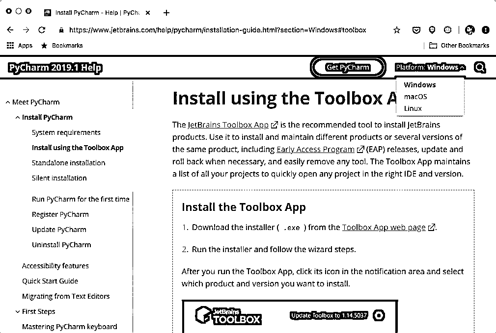](https://files.realpython.com/media/pycharm-jetbrains-os-list.231740335aaa.png)

安装后，启动应用程序并接受用户协议。在*工具*选项卡下，您将看到可用产品列表。在那里找到 PyCharm 社区，点击*安装*:

[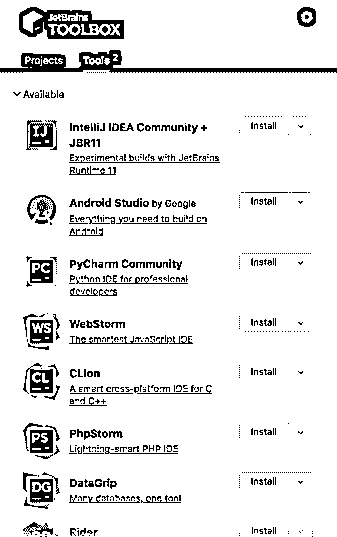](https://files.realpython.com/media/pycharm-toolbox-installed-pycharm.cdcf1b52bc02.png)

瞧啊。你的机器上有 PyCharm。如果你不想用工具箱 app，那么你也可以做一个[单机安装 PyCharm](https://www.jetbrains.com/help/pycharm/installation-guide.html#standalone) 。

启动 PyCharm，您将看到弹出的导入设置:

[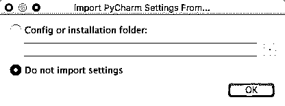](https://files.realpython.com/media/pycharm-import-settings-popup.4e360260c697.png)

PyCharm 将自动检测这是一个全新的安装，并为您选择*不要导入设置*。点击*确定*，PyCharm 会让你选择一个键位图方案。保留默认设置，点击右下方的*下一步:UI 主题*:

[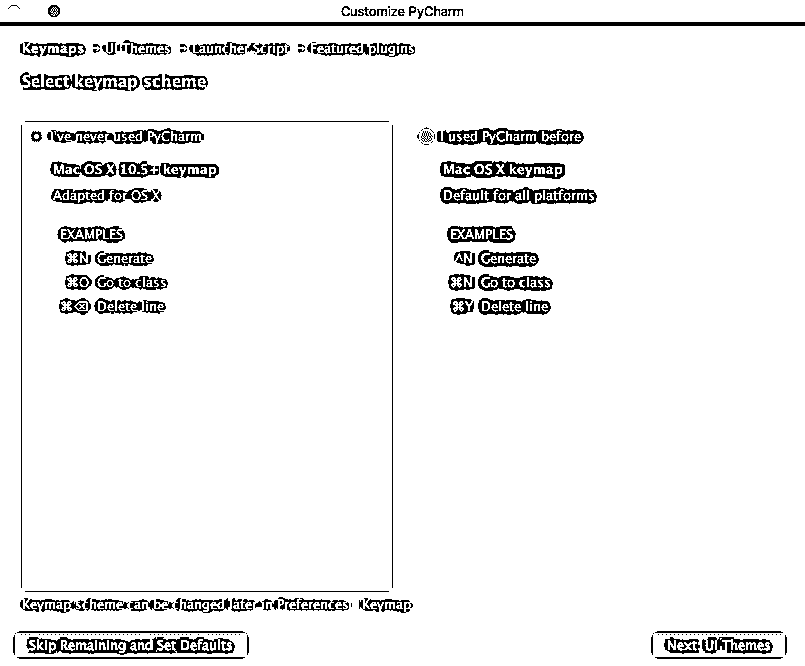](https://files.realpython.com/media/pycharm-keymap-scheme.c8115fda9bdd.png)

然后 PyCharm 会让你选择一个叫 Darcula 的黑暗主题或者一个光明主题。选择你喜欢的，然后点击*下一步:启动器脚本*:

[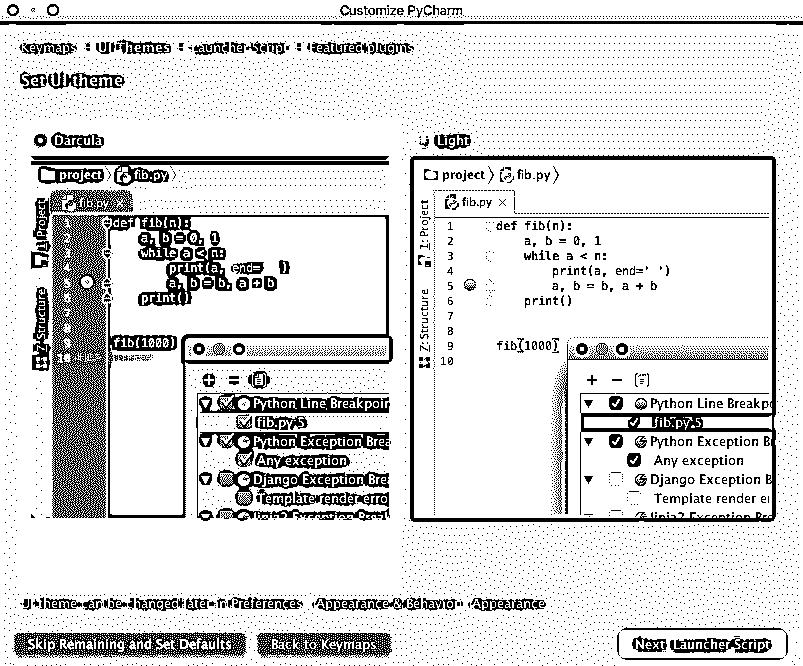](https://files.realpython.com/media/pycharm-set-ui-theme.c48aac8e3fe0.png)

我将在整个教程中使用黑暗主题 Darcula。你可以找到并安装其他主题作为[插件](#using-plugins-and-external-tools-in-pycharm)，或者你也可以[导入它们](https://blog.codota.com/5-best-intellij-themes/)。

在下一页，保留默认设置，点击*下一页:特色插件*。在那里，PyCharm 将向您显示您可能想要安装的插件列表，因为大多数用户都喜欢使用它们。点击*开始使用 PyCharm* ，现在你已经准备好写一些代码了！

[*Remove ads*](/account/join/)

## 用 PyCharm 编写代码

在 PyCharm 中，你可以在一个**项目**的上下文中做任何事情。因此，您需要做的第一件事就是创建一个。

安装并打开 PyCharm 后，您将进入欢迎屏幕。点击*新建项目*，会弹出*新建项目*:

[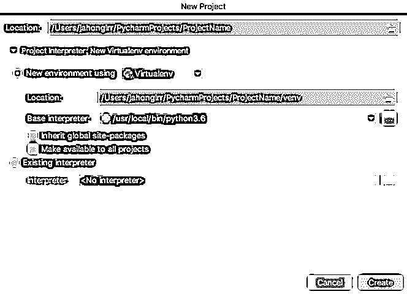](https://files.realpython.com/media/pycharm-new-project.cc35f3aa1056.png)

指定项目位置并展开*项目解释器*下拉菜单。在这里，您可以选择创建一个新的项目解释器或者重用一个现有的解释器。使用选择*新环境。紧挨着它，你有一个下拉列表来选择一个 *Virtualenv* 、 *Pipenv* 或 *Conda* ，这些工具通过为它们创建隔离的 Python 环境来帮助保持不同项目所需的[依赖关系](https://realpython.com/courses/managing-python-dependencies/)的分离。*

你可以自由选择你喜欢的，但是本教程使用的是 *Virtualenv* 。如果您愿意，您可以指定环境位置并从列表中选择基本解释器，该列表是您的系统上安装的 Python 解释器(如 Python2.7 和 Python3.6)的列表。通常情况下，默认值是好的。然后，您必须选择框来将全局站点包继承到您的新环境中，并使它对所有其他项目可用。不要选择它们。

点击右下方的*创建*，您将看到新项目被创建:

[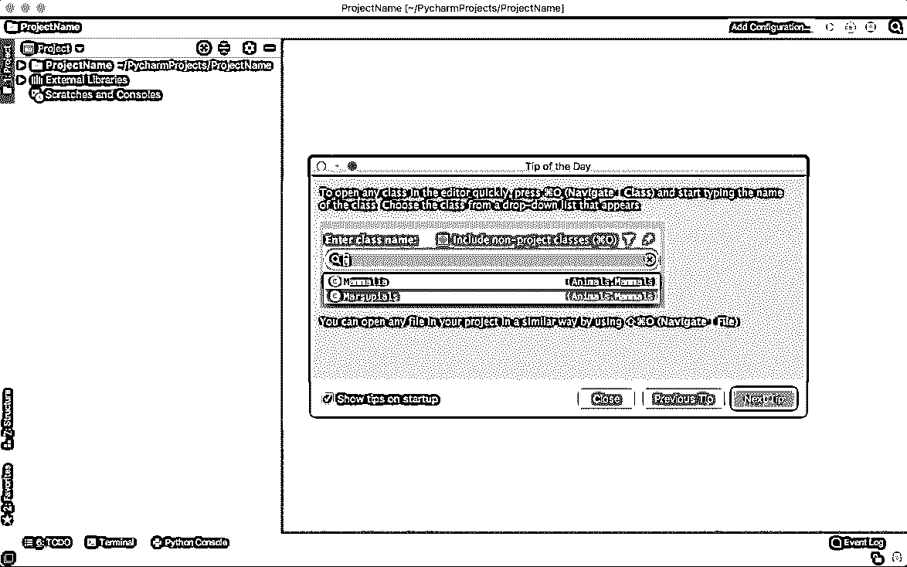](https://files.realpython.com/media/pycharm-project-created.99dffd1d4e9a.png)

你还会看到一个小小的*日积月累*弹出窗口，PyCharm 在这里给你一个每次启动都要学的技巧。继续并关闭此弹出窗口。

现在是时候开始一个新的 Python 程序了。如果您在 Mac 上，请键入 `Cmd` + `N` ，如果您在 Windows 或 Linux 上，请键入 `Alt` + `Ins` 。然后，选择 *Python 文件*。您也可以从菜单中选择*文件→新建*。将新文件命名为`guess_game.py`，点击*确定*。您将看到一个类似如下的 PyCharm 窗口:

[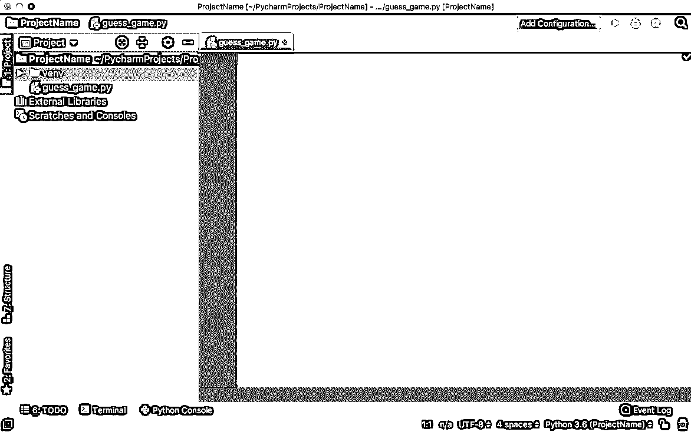](https://files.realpython.com/media/pycharm-new-file.7ea9902d73ea.png)

对于我们的测试代码，让我们快速编写一个简单的猜谜游戏，程序选择一个用户必须猜的数字。对于每一个猜测，该程序将告诉如果用户的猜测是小于或大于秘密数字。当用户猜出数字时，游戏结束。这是游戏的代码:

```py
 1from random import randint
 2
 3def play():
 4    random_int = randint(0, 100)
 5
 6    while True:
 7        user_guess = int(input("What number did we guess (0-100)?"))
 8
 9        if user_guess == random_int:
10            print(f"You found the number ({random_int}). Congrats!")
11            break
12
13        if user_guess < random_int:
14            print("Your number is less than the number we guessed.")
15            continue
16
17        if user_guess > random_int:
18            print("Your number is more than the number we guessed.")
19            continue
20
21
22if __name__ == '__main__':
23    play()
```

直接键入此代码，而不是复制和粘贴。您会看到类似这样的内容:

[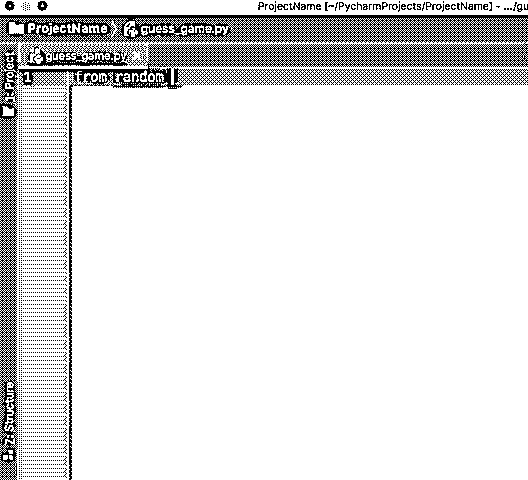](https://files.realpython.com/media/typing-guess-game.fcaedeb8ece2.gif)

如您所见，PyCharm 为[智能编码助手](https://www.jetbrains.com/pycharm/features/coding_assistance.html)提供了代码完成、代码检查、即时错误突出显示和快速修复建议。特别要注意，当您键入`main`然后点击 tab 时，PyCharm 会自动为您完成整个`main`子句。

还要注意，如果您忘记在条件前键入`if`，追加`.if`，然后点击 `Tab` ，PyCharm 会为您修复`if`子句。`True.while`也是如此。这是 PyCharm 的后缀补全为您工作，帮助您减少向后插入符号跳转。

## 在 PyCharm 中运行代码

既然你已经编写了游戏代码，现在是你运行它的时候了。

你有三种方式运行这个程序:

1.  在 Mac 上使用快捷键`Ctrl`+`Shift`+`R`或者在 Windows 或 Linux 上使用快捷键`Ctrl`+`Shift`+`F10`。
2.  右击背景，从菜单中选择*运行‘guess _ game’*。
3.  因为这个程序有`__main__`子句，你可以点击`__main__`子句左边的绿色小箭头，然后从那里选择*运行‘guess _ game’*。

使用上面的任何一个选项运行程序，您会看到窗口底部出现运行工具窗格，代码输出显示:

[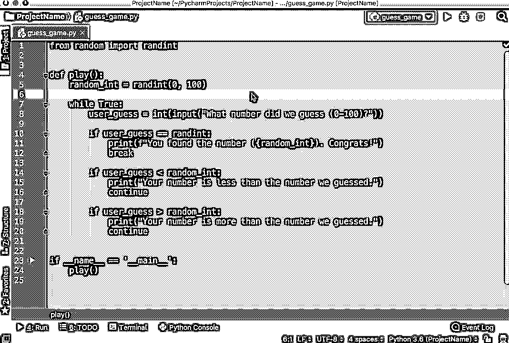](https://files.realpython.com/media/pycharm-running-script.33fb830f45b4.gif)

稍微玩一下这个游戏，看看你是否能找到猜对的数字。专业提示:从 50 开始。

[*Remove ads*](/account/join/)

## 在 PyCharm 中调试

你找到号码了吗？如果是这样，你可能在找到号码后看到了一些奇怪的东西。程序似乎重新开始，而不是打印祝贺信息并退出。那是一只虫子。为了找出程序重新开始的原因，现在您将调试程序。

首先，通过单击第 8 行左边的空白处放置一个断点:

[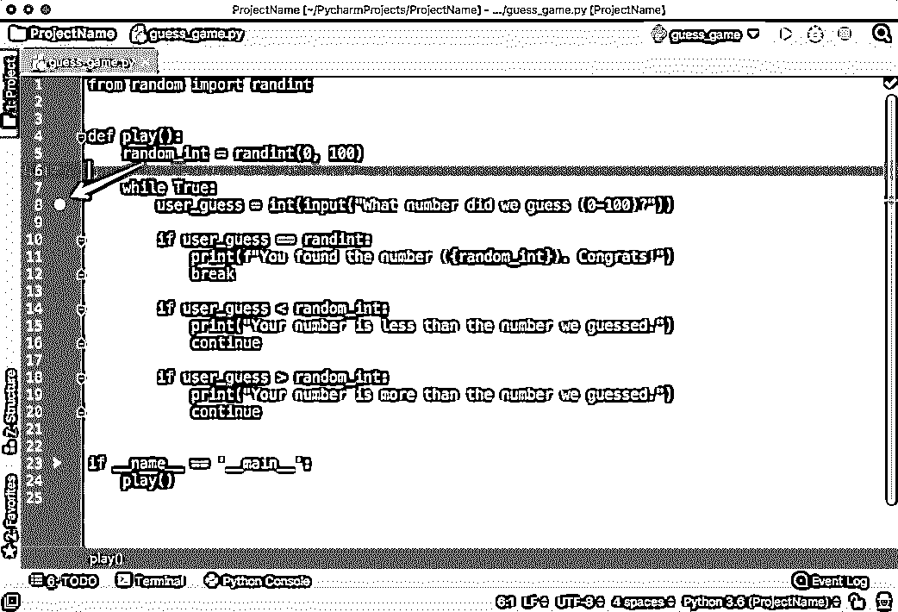](https://files.realpython.com/media/pycharm-debug-breakpoint.55cf93c49859.png)

这将是程序将被暂停的点，并且您可以从那里开始探索哪里出错了。接下来，选择以下三种方式之一开始调试:

1.  在 Mac 上按`Ctrl`+`Shift`+`D`或者在 Windows 或 Linux 上按`Shift`++`Alt`+`F9`。
2.  右击背景，选择*调试‘guess _ game’*。
3.  点击`__main__`子句左边的绿色小箭头，并从那里选择*Debug‘guess _ game*。

之后，你会看到一个*调试*窗口在底部打开:

[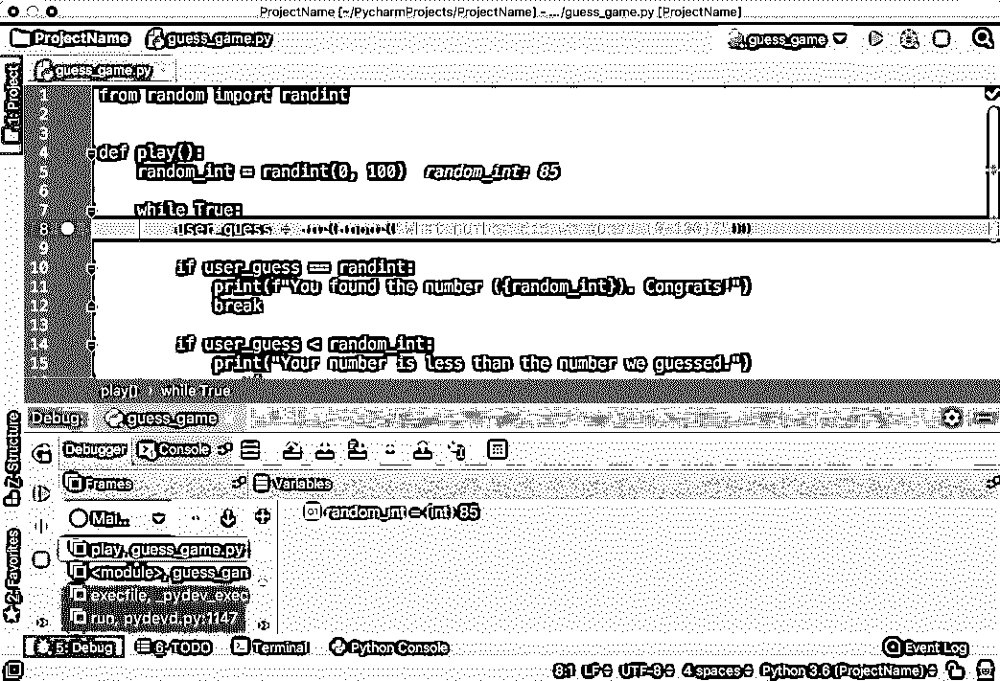](https://files.realpython.com/media/pycharm-debugging-start.04246b743469.png)

按照以下步骤调试程序:

1.  请注意，当前行以蓝色突出显示。

2.  请注意`random_int`及其值在调试窗口中列出。记下这个数字。(图中，数字是 85。)

3.  点击 `F8` 执行当前行，并跳过*进入下一行。如有必要，您也可以使用 `F7` 将*步进到当前行的*功能。当您继续执行语句时，[变量](https://realpython.com/python-variables/)中的变化将自动反映在调试器窗口中。*

**   请注意，在打开的调试器选项卡旁边有一个控制台选项卡。此控制台选项卡和调试器选项卡是互斥的。在控制台选项卡中，您将与您的程序进行交互，在调试器选项卡中，您将执行调试操作。

    *   切换到控制台选项卡，输入您的猜测。

    *   键入显示的数字，然后点击 `Enter` 。

    *   切换回调试器标签。

    *   再次点击 `F8` 来评估 [`if`语句](https://realpython.com/python-conditional-statements/)。注意你现在在第 14 行。但是等一下！为什么不去 11 号线？原因是第 10 行的`if`语句评估为`False`。但是为什么当你输入被选中的数字时，它的值是`False`？

    *   仔细看第 10 行，注意我们在比较`user_guess`和错误的东西。我们没有将它与`random_int`进行比较，而是将它与从`random`包中导入的函数`randint`进行比较。

    *   将其更改为`random_int`，重新开始调试，并再次执行相同的步骤。你会看到，这一次，它将转到第 11 行，第 10 行将评估为`True`:* 

*[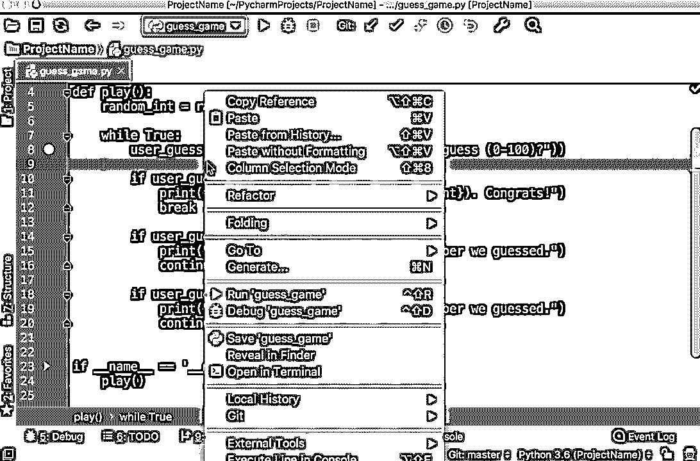](https://files.realpython.com/media/pycharm-debugging-scripts.bb5a077da438.gif)

恭喜你！你修复了漏洞。

## 在 PyCharm 中测试

没有单元测试的应用程序是不可靠的。PyCharm 可以帮助您快速舒适地编写和运行它们。默认情况下， [`unittest`](https://docs.python.org/3/library/unittest.html) 作为测试运行器，但 PyCharm 也支持其他测试框架，如 [`pytest`](http://www.pytest.org/en/latest/) ， [`nose`](https://nose.readthedocs.io/en/latest/) ， [`doctest`](https://docs.python.org/3/library/doctest.html) ， [`tox`](https://www.jetbrains.com/help/pycharm/tox-support.html) ， [`trial`](https://twistedmatrix.com/trac/wiki/TwistedTrial) 。例如，您可以为您的项目启用 [`pytest`](https://realpython.com/pytest-python-testing/) ，如下所示:

1.  打开*设置/首选项→工具→ Python 集成工具*设置对话框。
2.  在默认测试流道字段中选择`pytest`。
3.  点击*确定*保存设置。

对于这个例子，我们将使用默认的测试运行器`unittest`。

在同一个项目中，创建一个名为`calculator.py`的文件，并将下面的`Calculator`类放入其中:

```py
 1class Calculator:
 2    def add(self, a, b):
 3        return a + b
 4
 5    def multiply(self, a, b):
 6        return a * b
```

PyCharm 使得为现有代码创建测试变得非常容易。在`calculator.py`文件打开的情况下，执行以下任意一项操作:

*   在 Mac 上按`Shift`+`Cmd`+`T`或者在 Windows 或 Linux 上按`Ctrl`++`Shift`+`T`。
*   在课程背景中单击鼠标右键，然后选择*转到*和*测试*。
*   在主菜单上，选择*导航→测试*。

选择*创建新测试…* ，您将看到以下窗口:

[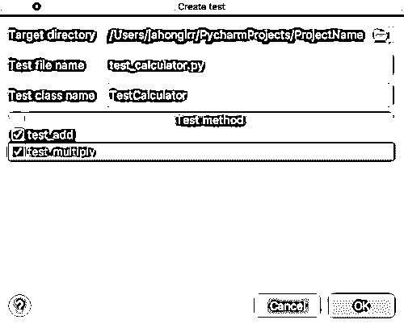](https://files.realpython.com/media/pycharm-create-tests.9a6cea78f9c6.png)

保留默认的*目标目录*、*测试文件名*、*测试类名*。选择两种方法并点击*确定*。瞧啊。PyCharm 自动创建了一个名为`test_calculator.py`的文件，并在其中为您创建了以下存根测试:

```py
 1from unittest import TestCase
 2
 3class TestCalculator(TestCase):
 4    def test_add(self):
 5        self.fail()
 6
 7    def test_multiply(self):
 8        self.fail()
```

使用以下方法之一运行测试:

*   在 Mac 上按 `Ctrl` + `R` 或者在 Windows 或 Linux 上按 `Shift` + `F10` 。
*   右键单击背景并选择*Run ' Unittests for test _ calculator . py '*。
*   点击测试类名左边的绿色小箭头，选择*Run ' Unittests for test _ calculator . py '*。

您会看到测试窗口在底部打开，所有测试都失败了:

[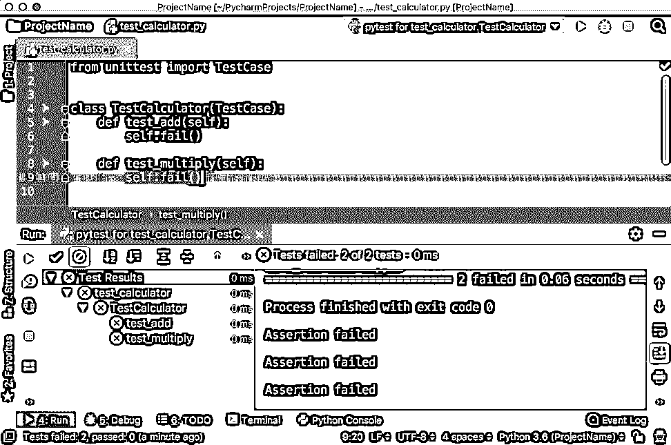](https://files.realpython.com/media/pycharm-failed-tests.810aa9c365cb.png)

注意，左边是测试结果的层次结构，右边是终端的输出。

现在，通过将代码改为如下来实现`test_add`:

```py
 1from unittest import TestCase
 2
 3from calculator import Calculator
 4
 5class TestCalculator(TestCase):
 6    def test_add(self):
 7        self.calculator = Calculator()
 8        self.assertEqual(self.calculator.add(3, 4), 7)
 9
10    def test_multiply(self):
11        self.fail()
```

再次运行测试，您将看到一个测试通过了，另一个测试失败了。浏览选项以显示通过的测试、显示忽略的测试、按字母顺序对测试排序以及按持续时间对测试排序:

[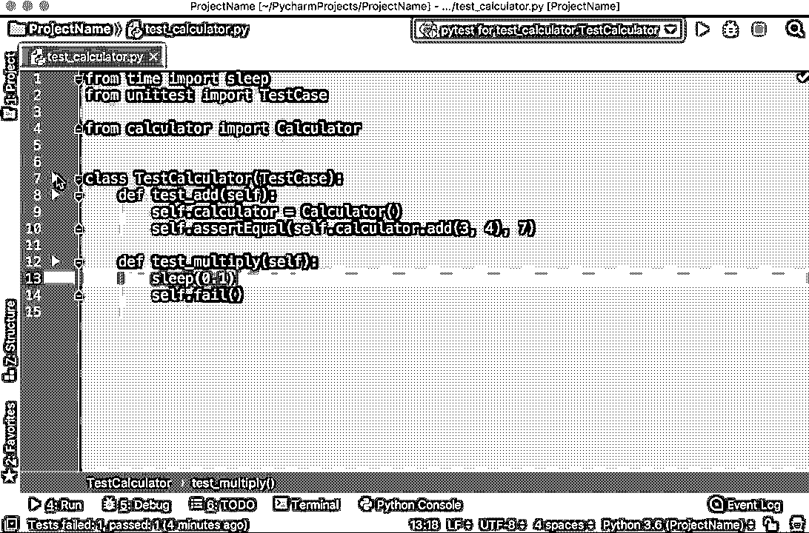](https://files.realpython.com/media/pycharm-running-tests.6077562207ba.gif)

请注意，您在上面的 GIF 中看到的`sleep(0.1)`方法是有意用来使其中一个测试变慢，以便按持续时间排序。

[*Remove ads*](/account/join/)

## 在 PyCharm 中编辑现有项目

这些单个文件的项目是很好的例子，但是你经常会在更长的时间内处理更大的项目。在这一节中，您将了解 PyCharm 如何处理一个更大的项目。

为了探索 PyCharm 以项目为中心的特性，您将使用为学习目的而构建的 Alcazar web 框架。要继续跟进，请在本地下载示例项目:

**下载示例项目:** [单击此处下载示例项目，您将在本教程中使用](https://realpython.com/bonus/alcazar-web-framework/)来探索 PyCharm 的项目特性。

在本地下载并解压缩项目后，使用以下方法之一在 PyCharm 中打开它:

*   在主菜单上点击*文件→打开*。
*   如果你在的话，点击[欢迎界面](https://www.jetbrains.com/help/pycharm/welcome-screen.html)上的*打开*。

完成上述任一步骤后，在您的计算机上找到包含该项目的文件夹并将其打开。

如果这个项目包含一个[虚拟环境](https://realpython.com/python-virtual-environments-a-primer/)，那么 PyCharm 会自动使用这个虚拟环境，并使其成为项目解释器。

如果需要配置不同的`virtualenv`，那么在 Mac 上通过按 `Cmd` + `,` 打开*偏好设置*，在 Windows 或 Linux 上通过按`Ctrl`+`Alt`+`S`打开*设置*，找到*项目:项目名称*部分。打开下拉菜单，选择*项目解释器*:

[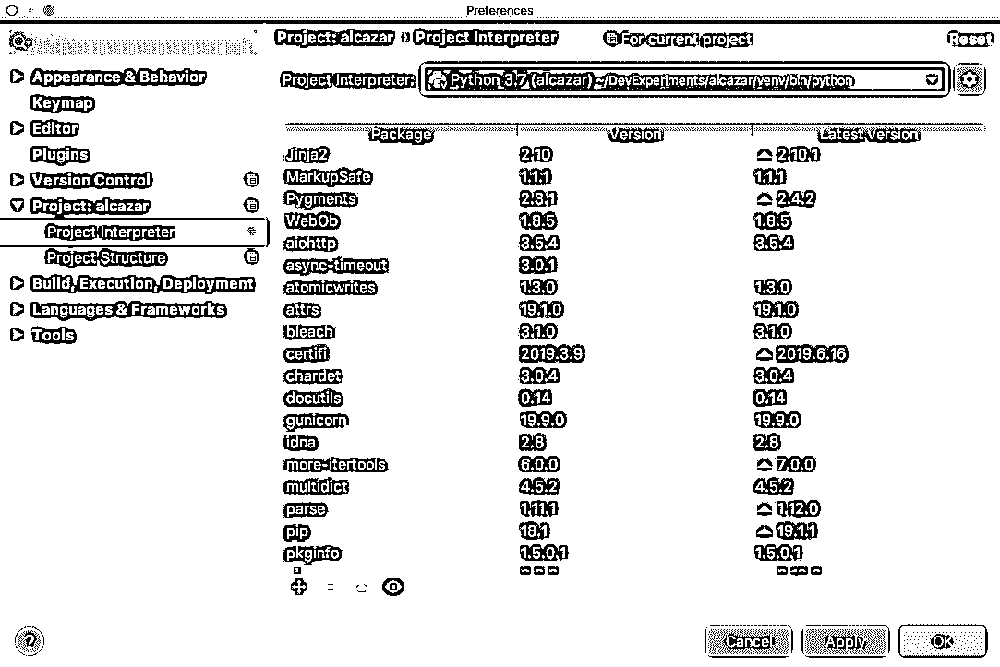](https://files.realpython.com/media/pycharm-project-interpreter.57282306555a.png)

从下拉列表中选择`virtualenv`。如果没有，点击下拉列表右侧的设置按钮，然后选择*添加…* 。剩下的步骤应该和我们[创建新项目](#writing-code-in-pycharm)时一样。

## 在 PyCharm 中搜索和导航

在一个大项目中，一个人很难记住所有东西的位置，因此能够快速导航并找到您要找的东西非常重要。皮查姆也在这里保护你。使用您在上一节中打开的项目来练习这些快捷键:

*   **在当前文件中查找片段:**在 Mac 上按 `Cmd` + `F` 或者在 Windows 或 Linux 上按 `Ctrl` + `F` 。
*   **在整个项目中搜索一个片段:**在 Mac 上按`Cmd`+`Shift`+`F`或者在 Windows 或 Linux 上按`Ctrl`+`Shift`+`F`。
*   **搜索类:**在 Mac 上按 `Cmd` + `O` 或者在 Windows 或 Linux 上按 `Ctrl` + `N` 。
*   **搜索文件:**按`Cmd`+`Shift`+`O`在 Mac 上或`Ctrl`+`Shift`+`N`在 Windows 或 Linux 上。
*   **搜索全部如果你不知道你要找的是文件、类还是代码片段:**按两次 `Shift` 。

至于导航，以下快捷方式可能会为您节省大量时间:

*   **要去声明一个变量:**在 Mac 上按 `Cmd` 或者在 Windows 或 Linux 上按 `Ctrl` ，点击变量。
*   **查找一个类、一个方法或者任何符号的用法:**按 `Alt` + `F7` 。
*   **查看您最近的变更:**按`Shift`+`Alt`+`C`或进入主菜单上的*查看→最近变更*。
*   **查看您最近的文件:**在 Mac 上按 `Cmd` + `E` 或者在 Windows 或 Linux 上按 `Ctrl` + `E` ，或者在主菜单上进入*查看→最近的文件*。
*   **在你跳来跳去之后，在你的导航历史中前进后退:**在 Mac 上按`Cmd`+`[`/`Cmd`+`]`或者`Ctrl`+`Alt`+`Left`/`Ctrl`+`Alt`+`Right`on

更多详情，参见[官方文档](https://www.jetbrains.com/help/pycharm/tutorial-exploring-navigation-and-search.html)。

## 在 PyCharm 中使用版本控制

诸如 [Git](https://git-scm.com/) 和 [Mercurial](https://www.mercurial-scm.org/) 这样的版本控制系统是现代软件开发世界中一些最重要的工具。因此，IDE 支持它们是必不可少的。PyCharm 通过整合许多流行的 VC 系统做得很好，如 Git(和 [Github](https://github.com/) )、Mercurial、 [Perforce](https://www.perforce.com/solutions/version-control) 和 [Subversion](https://subversion.apache.org/) 。

**注意** : [Git](https://realpython.com/python-git-github-intro/) 用于下面的例子。

[*Remove ads*](/account/join/)

### 配置 VCS

实现 VCS 一体化。进入 *VCS → VCS 操作弹出菜单…* ，在 Mac 上按 `Ctrl` + `V` ，在 Windows 或 Linux 上按 `Alt` + ```py
 。选择*启用版本控制集成…* 。您将看到以下窗口打开:

[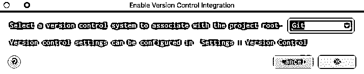](https://files.realpython.com/media/pycharm-enable-vc-integration.b30ec94c1246.png)

从下拉列表中选择 *Git* ，点击 *OK* ，您就为您的项目启用了 VCS。请注意，如果您打开了一个已经启用了版本控制的项目，那么 PyCharm 会看到并自动启用它。

现在，如果您转到 *VCS 操作弹出窗口…* ，您将看到一个不同的弹出窗口，其中包含待办事项选项`git add`、`git stash`、`git branch`、`git commit`、`git push`等等:

[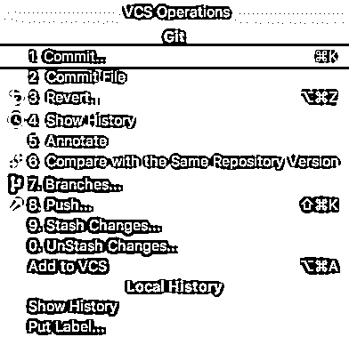](https://files.realpython.com/media/pycharm-vcs-operations.70dbafcb983a.png)

如果你找不到你需要的东西，你很可能通过从顶部菜单进入 *VCS* 并选择 *Git* 来找到它，在那里你甚至可以创建和查看拉请求。

### 提交和冲突解决

这是我个人非常喜欢使用的 PyCharm 中 VCS 集成的两个特性！假设你已经完成了你的工作，想提交它。进入 *VCS → VCS 操作弹出框… →提交…* 或者在 Mac 上按 `Cmd` + `K` 或者在 Windows 或 Linux 上按 `Ctrl` + `K` 。您将看到以下窗口打开:

[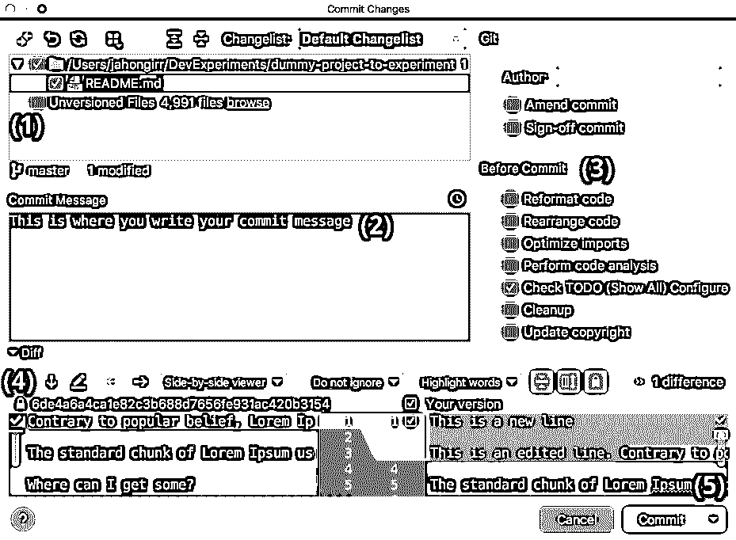](https://files.realpython.com/media/pycharm-commit-window.a4ceff16c2d3.png)

在此窗口中，您可以执行以下操作:

1.  选择要提交的文件
2.  编写您的提交消息
3.  在提交之前做各种检查和清理
4.  看到变化的不同
5.  按下右下角*提交*按钮右侧的箭头，选择*提交并推送…* ，即可提交并推送

它可以感觉神奇和快速，尤其是如果你习惯于在命令行上手动做一切。

当你在团队中工作时，**合并冲突**确实会发生。当有人提交对你正在处理的文件的更改，但是他们的更改与你的重叠，因为你们两个都更改了相同的行，那么 VCS 将不能决定它应该选择你的更改还是你的队友的更改。所以你会看到这些不幸的箭头和符号:

[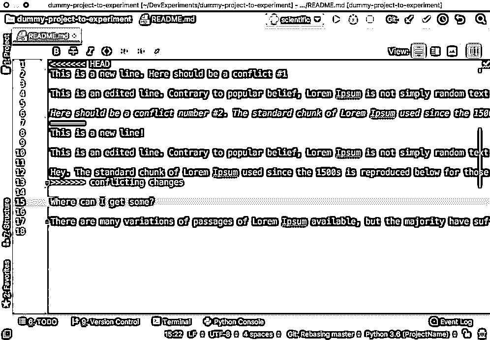](https://files.realpython.com/media/pycharm-conflicts.74b23b9ec798.png)

这看起来很奇怪，很难弄清楚哪些更改应该删除，哪些应该保留。皮查姆来救援了。它有一个更好更干净的解决冲突的方式。进入顶部菜单的 *VCS* ，选择 *Git* ，然后选择*解决冲突…* 。选择您想要解决冲突的文件，点击*合并*。您将看到以下窗口打开:

[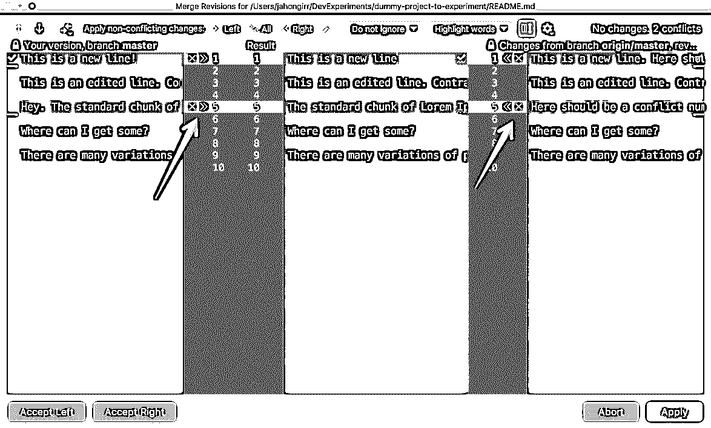](https://files.realpython.com/media/pycharm-conflict-resolving-window.eea8f79a12b2.png)

在左栏，您将看到您的更改。右边是你的队友所做的改变。最后，在中间的列中，您将看到结果。冲突的线被突出显示，你可以在那些线的右边看到一点点 *X* 和*>>*/*<<*。按箭头接受更改，按 *X* 拒绝。解决所有这些冲突后，单击*应用*按钮:

[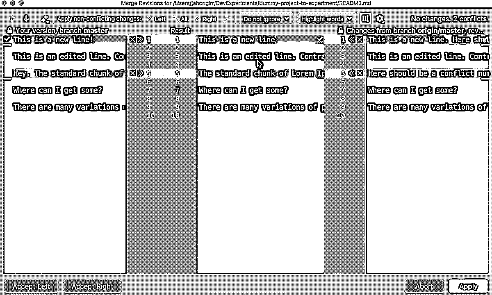](https://files.realpython.com/media/pycharm-resolving-conflicts.d3128ce78c45.gif)

在上面的 GIF 中，对于第一条冲突线，作者谢绝了自己的改动，接受了队友的改动。相反，作者接受了自己的修改，拒绝了队友对第二条冲突线的修改。

使用 PyCharm 中的 VCS 集成，您可以做更多的事情。有关更多详细信息，请参见本文档。

[*Remove ads*](/account/join/)

## 在 PyCharm 中使用插件和外部工具

在 PyCharm 中，您几乎可以找到开发所需的一切。如果你不能，最有可能的是有一个[插件](https://plugins.jetbrains.com/)添加了你需要的 PyCharm 功能。例如，他们可以:

*   添加对各种语言和框架的支持
*   通过快捷方式提示、文件监视器等提高您的工作效率
*   通过编码练习帮助你学习一门新的编程语言

例如， [IdeaVim](https://plugins.jetbrains.com/plugin/164-ideavim) 将 Vim 仿真添加到 PyCharm 中。如果你喜欢 Vim，这可能是一个很好的组合。

[材质主题 UI](https://plugins.jetbrains.com/plugin/8006-material-theme-ui) 将 PyCharm 的外观改为材质设计外观和感觉:

[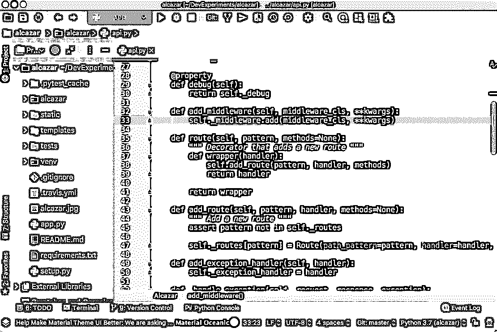](https://files.realpython.com/media/pycharm-material-theme.178175815adc.png)

[Vue.js](https://plugins.jetbrains.com/plugin/9442-vue-js) 增加对 [Vue.js](https://vuejs.org/) 项目的支持。 [Markdown](https://plugins.jetbrains.com/plugin/7793-markdown) 提供了在 IDE 中编辑 Markdown 文件并在实时预览中查看渲染 HTML 的能力。你可以通过进入 *Marketplace* 标签下的*首选项→插件*在 Mac 上或*设置→插件*在 Windows 或 Linux 上找到并安装所有可用的插件:

[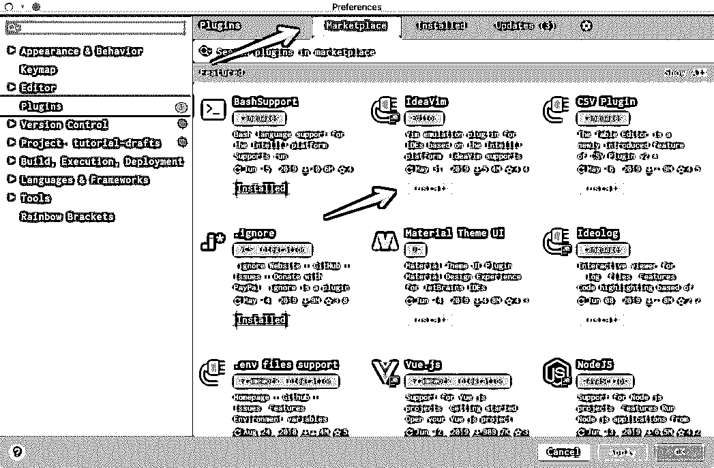](https://files.realpython.com/media/pycharm-plugin-marketplace.7d1cecfdc8b3.png)

如果找不到自己需要的，甚至可以[开发自己的插件](http://www.jetbrains.org/intellij/sdk/docs/basics.html)。

如果你找不到合适的插件，又不想自己开发，因为 PyPI 里已经有一个包了，那么你可以把它作为外部工具添加到 PyCharm 里。以代码分析器 [`Flake8`](http://flake8.pycqa.org/en/latest/) 为例。

首先，将`flake8`安装到你的 virtualenv 中，并在你选择的终端应用程序中安装`pip install flake8`。您也可以使用集成到 PyCharm 中的那个:

[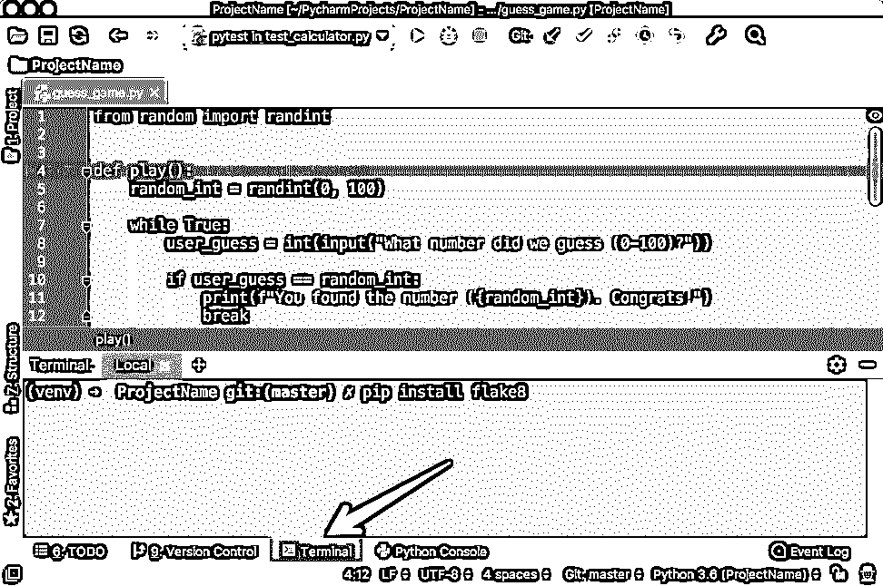](https://files.realpython.com/media/pycharm-terminal.bb20cae6697e.png)

然后，在 Mac 上进入*首选项→工具*或者在 Windows/Linux 上进入*设置→工具*，然后选择*外部工具*。然后点击底部的小 *+* 按钮(1)。在新的弹出窗口中，插入如下所示的详细信息，并在两个窗口中点击*确定*:

[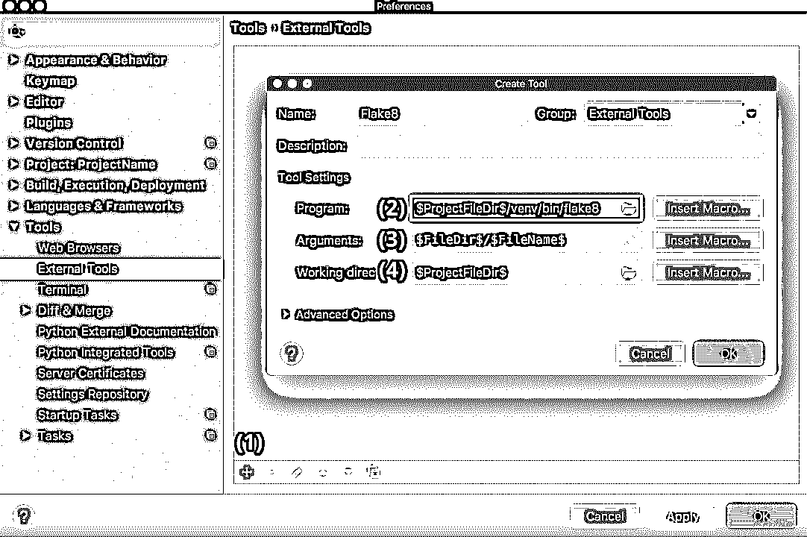](https://files.realpython.com/media/pycharm-flake8-tool.3963506224b4.png)

这里的*程序* (2)指的是 Flake8 可执行文件，可以在你的虚拟环境的文件夹 */bin* 中找到。 *Arguments* (3)指的是你想借助 Flake8 分析哪个文件。*工作目录*是你项目的目录。

您可以在这里硬编码所有东西的绝对路径，但是这意味着您不能在其他项目中使用这个外部工具。您只能在一个文件的一个项目中使用它。

所以你需要使用叫做*宏*的东西。宏基本上是`$name$`格式的变量，它根据你的上下文而变化。例如，当你编辑`first.py`时，`$FileName$`是`first.py`，当你编辑`second.py`时，它是`second.py`。您可以看到他们的列表，并通过点击*插入宏…* 按钮插入他们中的任何一个。因为您在这里使用了宏，所以这些值将根据您当前工作的项目而改变，并且 Flake8 将继续正常工作。

为了使用它，创建一个文件`example.py`并将以下代码放入其中:

```
 1CONSTANT_VAR = 1
 2
 3
 4
 5def add(a, b):
 6    c = "hello"
 7    return a + b
```

它故意打破了一些规则。右键单击该文件的背景。选择*外部工具*，然后选择*薄片 8* 。瞧啊。Flake8 分析的输出将出现在底部:

[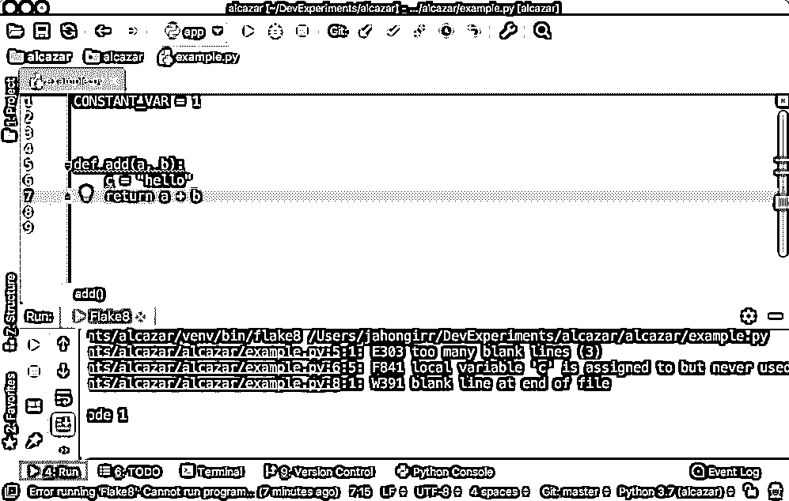](https://files.realpython.com/media/pycharm-flake8-output.5b78e911e6d3.png)

为了让它更好，你可以为它添加一个快捷方式。在 Mac 上进入*偏好设置*或者在 Windows 或 Linux 上进入*设置*。然后，进入*键图→外部工具→外部工具*。双击*薄片 8* 并选择*添加键盘快捷键*。您将看到以下窗口:

[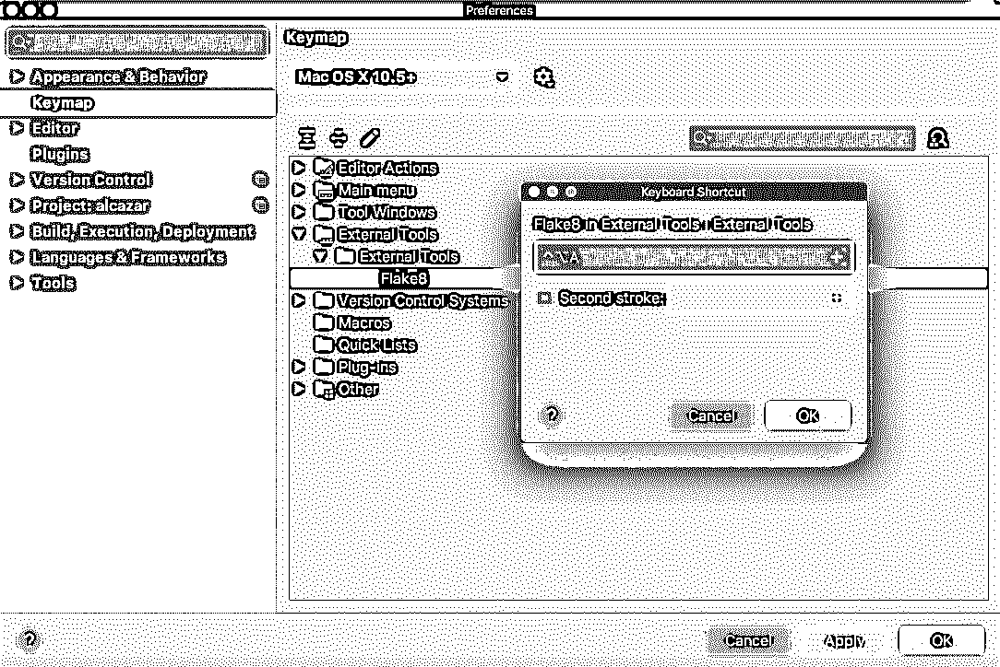](https://files.realpython.com/media/pycharm-add-shortcut.8c66b2bd12c0.png)

在上图中，该工具的快捷方式是`Ctrl`+`Alt`+`A`。在文本框中添加您喜欢的快捷方式，并在两个窗口中单击*确定*。现在，您可以使用该快捷方式来分析您当前正在使用 Flake8 处理的文件。

[*Remove ads*](/account/join/)

## PyCharm 专业特色

PyCharm Professional 是 PyCharm 的付费版本，具有更多开箱即用的功能和集成。在这一节中，您将主要看到其主要特性的概述和到官方文档的链接，其中详细讨论了每个特性。请记住，以下功能在社区版中不可用。

### Django 支持

PyCharm 对 Django T1 有广泛的支持，Django T1 是最受欢迎和喜爱的 T2 Python web 框架 T3 之一。要确保它已启用，请执行以下操作:

1.  在 Mac 上打开*偏好设置*或者在 Windows 或 Linux 上打开*设置*。
2.  选择*语言和框架*。
3.  选择 *Django* 。
4.  选中复选框*启用 Django 支持*。
5.  应用更改。

既然您已经启用了 Django 支持，那么您在 PyCharm 中的 Django 开发之旅将会容易得多:

*   当创建一个项目时，您将拥有一个专用的 Django 项目类型。这意味着，当您选择这种类型时，您将拥有所有必要的文件和设置。这相当于使用`django-admin startproject mysite`。
*   您可以直接在 PyCharm 中运行`manage.py`命令。
*   支持 Django 模板，包括:
    *   语法和错误突出显示
    *   代码完成
    *   航行
    *   块名的完成
    *   自定义标签和过滤器的完成
    *   标签和过滤器的快速文档
    *   调试它们的能力
*   所有其他 Django 部分的代码完成，比如视图、URL 和模型，以及对 Django ORM 的代码洞察支持。
*   Django 模型的模型依赖图。

关于 Django 支持的更多细节，请参见官方文档。

### 数据库支持

现代数据库开发是一项复杂的任务，需要许多支持系统和工作流。这就是为什么 PyCharm 背后的公司 JetBrains 为此开发了一个名为 [DataGrip](https://www.jetbrains.com/datagrip/) 的独立 IDE。它是 PyCharm 的独立产品，有单独的许可证。

幸运的是，PyCharm 通过一个名为*数据库工具和 SQL* 的插件支持 DataGrip 中所有可用的特性，这个插件默认是启用的。有了它的帮助，你可以查询、创建和管理数据库，无论它们是在本地、在服务器上还是在云中工作。该插件支持 [MySQL](https://realpython.com/python-mysql/) 、PostgreSQL、微软 SQL Server、 [SQLite](https://realpython.com/python-sqlite-sqlalchemy/) 、MariaDB、Oracle、Apache Cassandra 等。关于你可以用这个插件做什么的更多信息，请查看关于数据库支持的全面文档。

### 线程并发可视化

[`Django Channels`](https://channels.readthedocs.io/en/latest/) 、 [`asyncio`](https://realpython.com/async-io-python/) ，以及最近出现的类似 [`Starlette`](https://www.starlette.io/) 的框架，都是[异步 Python 编程](https://realpython.com/python-async-features/)日益增长的趋势的例子。虽然异步程序确实给桌面带来了很多好处，但是众所周知，编写和调试它们也很困难。在这种情况下，*线程并发可视化*可能正是医生所要求的，因为它可以帮助您完全控制您的多线程应用程序并优化它们。

查看[该特性的综合文档](https://www.jetbrains.com/help/pycharm/thread-concurrency-visualization.html)以了解更多细节。

### Profiler

说到优化，剖析是另一种可以用来优化代码的技术。在它的帮助下，您可以看到代码的哪些部分占用了大部分执行时间。探查器按以下优先级顺序运行:

1.  [T2`vmprof`](https://vmprof.readthedocs.io/en/latest/)
2.  [T2`yappi`](https://github.com/sumerc/yappi)
3.  [T2`cProfile`](https://docs.python.org/3/library/profile.html)

如果你没有安装`vmprof`或`yappi`，那么它将回落到标准的`cProfile`。是[有据可查的](https://www.jetbrains.com/help/pycharm/profiler.html)，这里就不赘述了。

### 科学模式

Python 不仅是一种通用和 web 编程语言。在过去的几年里，它也成为了数据科学和机器学习的最佳工具，这要归功于像 [NumPy](http://www.numpy.org/) 、 [SciPy](https://www.scipy.org/) 、 [scikit-learn](https://scikit-learn.org/) 、 [Matplotlib](https://matplotlib.org/) 、 [Jupyter](https://jupyter.org/) 等库和工具。有了如此强大的库，您需要一个强大的 IDE 来支持所有的功能，比如绘制和分析这些库所具有的功能。PyCharm 提供了您需要的一切，这里有详细的记录。

[*Remove ads*](/account/join/)

### 远程开发

许多应用程序中错误的一个常见原因是开发和生产环境不同。尽管在大多数情况下，不可能为开发提供生产环境的精确副本，但追求它是一个有价值的目标。

使用 PyCharm，您可以使用位于其他计算机上的解释器(如 Linux VM)来调试您的应用程序。因此，您可以使用与生产环境相同的解释器来修复和避免开发和生产环境之间的差异所导致的许多错误。请务必查看官方文档以了解更多信息。

## 结论

PyCharm 即使不是最好的，也是最好的、全功能的、专用的和通用的 Python 开发 ide 之一。它提供了大量的好处，通过帮助你完成日常任务来节省你的大量时间。现在你知道如何有效利用它了！

在本文中，您了解了很多内容，包括:

*   安装 PyCharm
*   用 PyCharm 编写代码
*   在 PyCharm 中运行代码
*   在 PyCharm 中调试和测试代码
*   在 PyCharm 中编辑现有项目
*   在 PyCharm 中搜索和导航
*   在 PyCharm 中使用版本控制
*   在 PyCharm 中使用插件和外部工具
*   使用 PyCharm 专业特性，如 Django 支持和科学模式

如果你有什么想问或分享的，请在下面的评论中联系我们。在 [PyCharm 网站](https://www.jetbrains.com/pycharm/documentation/)上还有更多信息供你探索。

**下载示例项目:** [单击此处下载示例项目，您将在本教程中使用](https://realpython.com/bonus/alcazar-web-framework/)来探索 PyCharm 的项目特性。********