# PyCon Africa 2019(摘要)

> 原文：<https://realpython.com/pycon-africa-2019-recap/>

[PyCon Africa](https://africa.pycon.org/) 是一场精彩、鼓舞人心、极具技术启发性的会议，于 2019 年 8 月 6 日至 10 日在加纳阿克拉的加纳大学举行。这次会议是第一次为 Python 开发者举办的**泛非会议**，来自 26 个不同国家的 323 名 Python 爱好者参加了会议。大多数与会者来自非洲各国，一些发言者来自美国、荷兰、德国、巴西和意大利。

Python 在全球变得越来越受欢迎。在非洲，Python 为自己赢得了一个特殊的位置，在那里它被广泛用于[网络开发](https://realpython.com/tutorials/web-dev/)和[数据科学](https://realpython.com/tutorials/data-science/)。非洲企业正在寻找在这些领域拥有 Python 技能的开发人员，在非洲拥有一个**PyCon**为帮助支持非洲程序员提供了基础。

**免费奖励:** [掌握 Python 的 5 个想法](https://realpython.com/bonus/python-mastery-course/)，这是一个面向 Python 开发者的免费课程，向您展示将 Python 技能提升到下一个水平所需的路线图和心态。

## 在 PyCon Africa 发生了什么

在主会议开始的前一天，与会者需要一些时间来适应。那些刚刚开始使用 Python 的人参加了由 Joey Darko 主持的初学者日会议，帮助他们为 Python 开发设置他们的计算机。我加入了另一个国际旅游团，去加纳的阿克拉旅游。我们参观了许多旅游景点，如独立广场、文化中心和一些当地市场，感受加纳的生活方式。

<figcaption class="figure-caption text-center">Image: [KhoPhi.Photography](https://www.khophi.photography/)</figcaption>

第二天是研讨会，上午和下午同时举行两场研讨会。Django 女孩讲习班向妇女和 Django 初学者介绍了 Django 的发展。其他研讨会关注的是数据可视化、测试和迭代器等概念。

[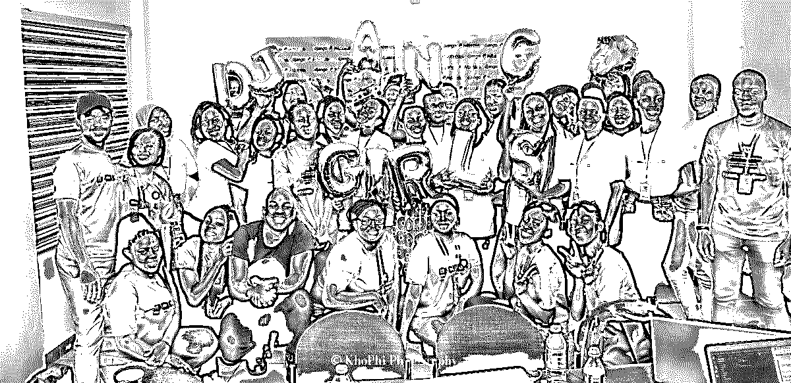](https://files.realpython.com/media/Optimized-django_girls_pycon_africa.8ef8e946afb5.jpg)

<figcaption class="figure-caption text-center">Django Girls (Image: [KhoPhi.Photography](https://www.khophi.photography/))</figcaption>

[*Remove ads*](/account/join/)

## 主会议

主要会议于 8 月 8 日开始，开幕式以加纳传统舞蹈和 Python 非洲主席 [Marlene Mhangami](https://realpython.com/interview-marlene-mhangami/) 的欢迎辞为特色。[会议的每一天](https://africa.pycon.org/schedule/)都有开幕和闭幕主题演讲。

<figcaption class="figure-caption text-center">Traditional Ghanaian dance (Image: [KhoPhi.Photography](https://www.khophi.photography/))</figcaption>

[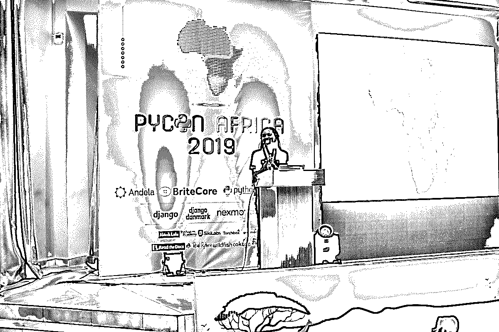](https://files.realpython.com/media/Optimized-pycon_africa_marlene.3f67708c9ad2.jpg)

<figcaption class="figure-caption text-center">Welcoming remarks by Marlene Mhangami (Image: [KhoPhi.Photography](https://www.khophi.photography/))</figcaption>

让我们来看看在会议的两天里所做的一些演讲。

## 穆斯塔法·西塞:通过人工智能产生积极影响的潜力

穆斯塔法·西塞是位于阿克拉的谷歌人工智能中心的负责人，他在主要会议的第一天发表了开幕主题演讲。穆斯塔法的演讲是关于非洲技术专家如何利用技术解决非洲问题。在他的演讲中，他讨论了他在谷歌和人工智能领域参与的一些工作，如使用人工智能进行疾病预测，以及使用卫星图像收集信息和统计数据进行人工智能洪水预测。

<figcaption class="figure-caption text-center">Moustapha Cisse, Head of Google AI Center Accra (Image: [KhoPhi.Photography](https://www.khophi.photography/))</figcaption>

## Meili Triantafyllidi:柏林皮拉迪斯 6 年的经验教训

Meili Triantafyllidi 是 PyLadies Berlin 的联合创始人。在非洲有许多以女性为中心的 Python 用户群。这些小组正在做许多令人惊叹的工作，但是就像生活中的任何事情一样，总有改进的空间。

Meili Triantafyllidi 做了一个及时的演讲，讲述了她在管理柏林皮拉迪斯的六年中所学到的经验。在她的演讲中，她分享了使活动更具包容性、可及性和安全性的技巧和最佳实践。她的演讲还涵盖了如何举办活动、找到合适的演讲者以及提高公共演讲技巧的信息。

[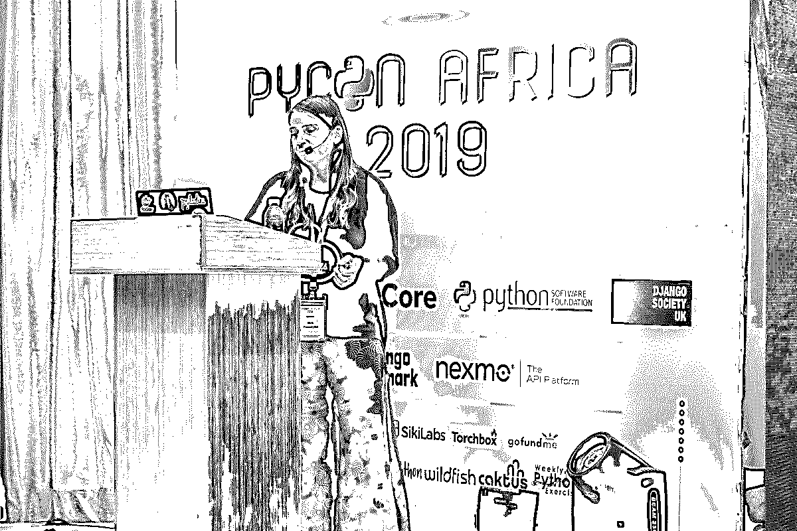](https://files.realpython.com/media/Optimized-meili_pycon_africa.8defefa8fde5.jpg)

<figcaption class="figure-caption text-center">Meili Triantafyllidi (Image: [KhoPhi.Photography](https://www.khophi.photography/))</figcaption>

梅丽会谈后，召开了皮拉第斯会议。会议确立了支持非洲女性程序员的共同目标和计划，包括通过在皮拉迪斯松弛小组中创建一个专门的皮拉迪斯非洲频道。

## 坎迪·特里西亚·科利韦:网络虚拟现实和 A-Frame

Mozilla 技术发言人 Candy Khohliwe 发表了一篇关于 [WebVR](https://webvr.info/) 的演讲，这是一项开放的技术，无论你使用什么设备，都可以在浏览器中体验虚拟现实。Candy 演讲的焦点是 [A-Frame](https://en.wikipedia.org/wiki/A-Frame_(virtual_reality_framework)) ，一个使用 HTML 创建 3D 和网络虚拟现实体验的网络框架。从这个内容丰富的讲座中，我学会了如何使用 A-Frame 来创建和绘制 WebVR 组件。我期待在未来的项目中尝试它！

[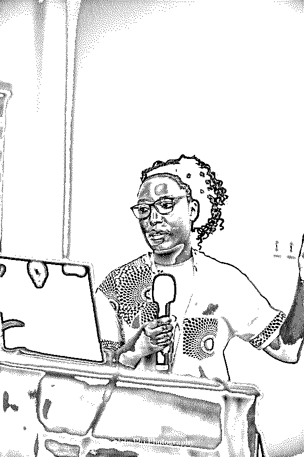](https://files.realpython.com/media/Optimized-pycon-africa-candy-khohliwe.6949c95996f5.jpg)

<figcaption class="figure-caption text-center">Candy Tricia Khohliwe (Image: [KhoPhi.Photography](https://www.khophi.photography/))</figcaption>

## 尼古拉斯·德尔·格罗索:解开意大利面条(重构代码的技巧)

尼克·德尔·格罗索做了一个关于重构代码的演讲。他解释了项目代码是如何变得混乱的，并带我们安全地完成了重构过程。他还讨论了识别死代码、选择好的变量名以及使用工具帮助重构代码的策略。

<figcaption class="figure-caption text-center">Nicholas Del Grosso (Image: [KhoPhi.Photography](https://www.khophi.photography/))</figcaption>

## 杰西卡·乌帕尼:Python 真的有用吗？

来自纳米比亚 Python 社区的 Jessica Upani 就纳米比亚不同的 Python 社区团体进行了富有启发性的演讲。她讨论了他们克服的挑战，以及其他非洲 Python 社区可以从他们身上学到什么。

[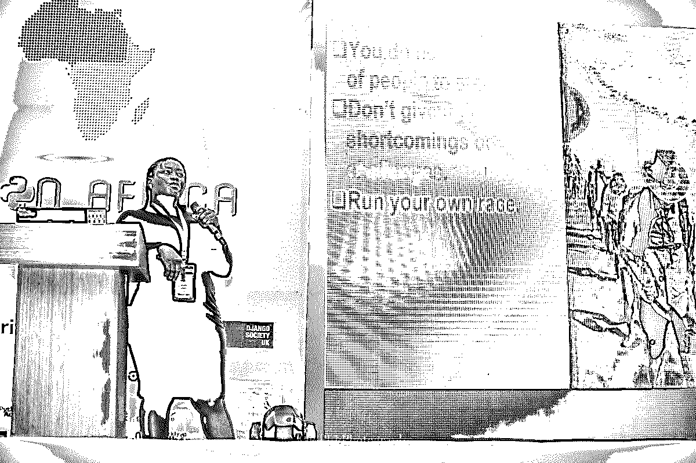](https://files.realpython.com/media/Optimized-pycon_africa_jessica_upani.841c87667d81.jpg)

<figcaption class="figure-caption text-center">Image: [Khophi.Photography](https://www.khophi.photography/)</figcaption>

[*Remove ads*](/account/join/)

## Kelvin Oyana:弥合 Python 社区和行业之间的人才差距

Kelvin 的演讲是关于公司对开发者的期望和开发者实际能做的之间的鸿沟。他还提出了社区和个人开发者如何弥合这一差距的见解。

[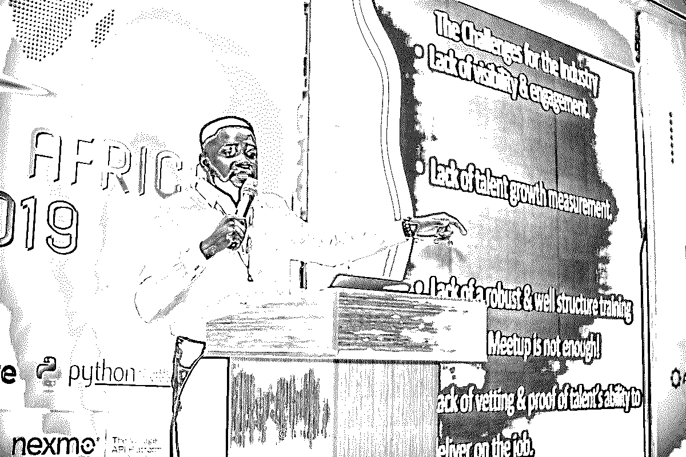](https://files.realpython.com/media/Optimized-pycon_africa-kelvin_oyana.e3ad29cc072b.jpg)

<figcaption class="figure-caption text-center">Kelvin Oyana (Image: [Khophi.Photography](https://www.khophi.photography/))</figcaption>

## 丹尼尔·普罗奇达:世界上最简单、最便宜的绘图仪

Daniele Procida 是 Django 的核心开发人员，也是 PyCon Africa 组织团队[的成员之一。在他的演讲中，丹尼尔展示了一个有趣的](https://africa.pycon.org/team/)[项目](https://brachiograph.readthedocs.io/en/latest/):他用纸板、一个 Rasberry Pi、一些伺服电机和 Python 软件制作了一个简单的笔式绘图仪。他的项目体现了非洲企业特有的足智多谋和创新精神。

<figcaption class="figure-caption text-center">Daniele Procida (Image: [Khophi.Photography](https://www.khophi.photography/))</figcaption>

## Ewa Jodlowska:主题演讲

[Python 软件基金会(PSF)](https://www.python.org/psf/) 的执行董事 Ewa Jodlowska 做了一个关于 PSF、它如何与全球社区合作及其未来计划的主题演讲。Ewa 进一步阐述了 PSF 为促进 Python 社区的发展而开展的不同项目，例如赞助项目和南美的 Python 大使项目。

[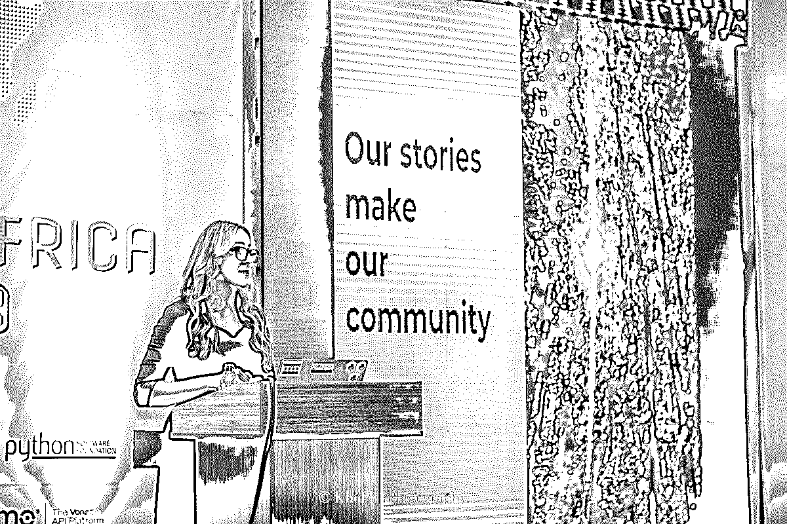](https://files.realpython.com/media/Optimized-pycon-africa-ewa.6f9cb20b9504.jpg)

<figcaption class="figure-caption text-center">Ewa Jodlowska (Image: [Khophi.Photography](https://www.khophi.photography/))</figcaption>

## 安娜·马卡鲁泽:非洲开发者如何增加技术多样性

安娜·马卡鲁泽在主要会议的第一天作了闭幕主旨发言。她是 brite core(PyCon Africa 的钻石赞助商之一)的软件工程师，Django 软件基金会的副主席，以及 T2 Django 女孩基金会的筹款协调员。Anna 利用她在这些组织中的经验，讨论了会议、组织和个人开发人员如何提高技术领域的多样性。

[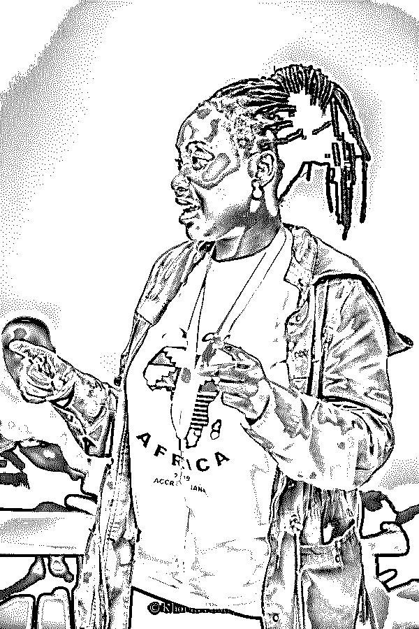](https://files.realpython.com/media/anna2.d1743996174a.jpg)

<figcaption class="figure-caption text-center">Anna Makarudze (Image: [Khophi.Photography](https://www.khophi.photography/))</figcaption>

## 小组讨论:非洲 Python 开发者在社区中的角色

商业、技术和社区发展领域的领导人进行了小组讨论。Marlene Manghami 主持了关于非洲 Python 社区在全球技术空间中的作用的讨论。她的小组成员是所罗门·阿彭亚、丹尼尔·罗伊·格林菲尔德和詹姆斯·扬卡。

Solomon Apenya 是 Andela 公司的高级顾问，该公司在非洲寻找并建立分布式工程团队。丹尼尔·罗伊·格林菲尔德是《T2:Django 的两个独家新闻》的合著者，也是 T4 brite core 的执行工程副总裁。詹姆斯·扬卡是布朗普顿集团的总经理，这是一家提供招聘、培训、管理、后勤和安全服务的公司。

[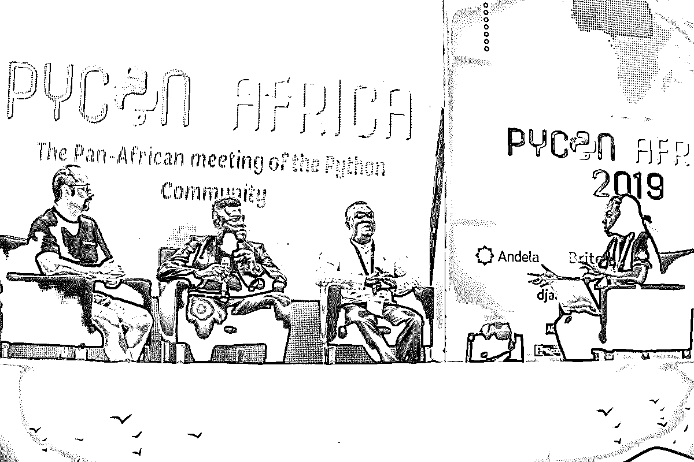](https://files.realpython.com/media/Optimized-pycon-africa-panel.72710f1b3453.jpg)

<figcaption class="figure-caption text-center">Image: [Khophi Photography](http://khophi.photography/)</figcaption>

## 安东尼·肖:在 2000 万开发者中脱颖而出

在会议的最后一天，我有幸见到并聆听了安东尼·肖(Anthony Shaw)的演讲。Anthony 做了一个针对新开发人员的演讲，帮助他们在开发生涯中取得成功。在[的演讲](https://speakerdeck.com/tonybaloney/getting-ahead-in-a-world-of-20-million-developers)中，Anthony 讨论了如何获得成功，增长技能，学习新技术，以及对抗怀疑和冒名顶替综合症。最后，他给出了如何完成技术面试的建议。

[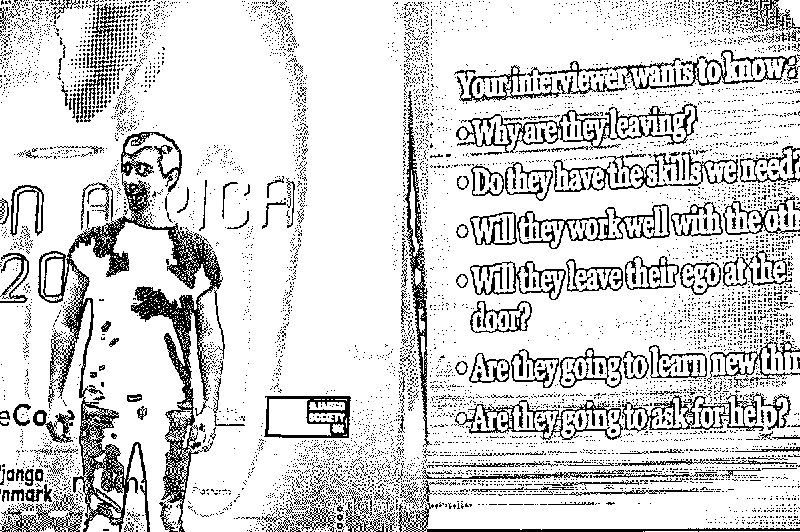](https://files.realpython.com/media/Optimized-pycon-africa-anthony-shaw.b43a55f28161.jpg)

<figcaption class="figure-caption text-center">Anthony Shaw (Image: [Khophi.Photography](https://www.khophi.photography/))</figcaption>

## 闭幕主题演讲:Kojo Idrissa

DjangoCon 的组织者和 Django Events Foundation North America(DEFNA)大使 Kojo Idrissa 在会议的最后一天发表了闭幕主题演讲。Kojo 反思了过去的教训以及非洲移民对我们所有人的影响。

[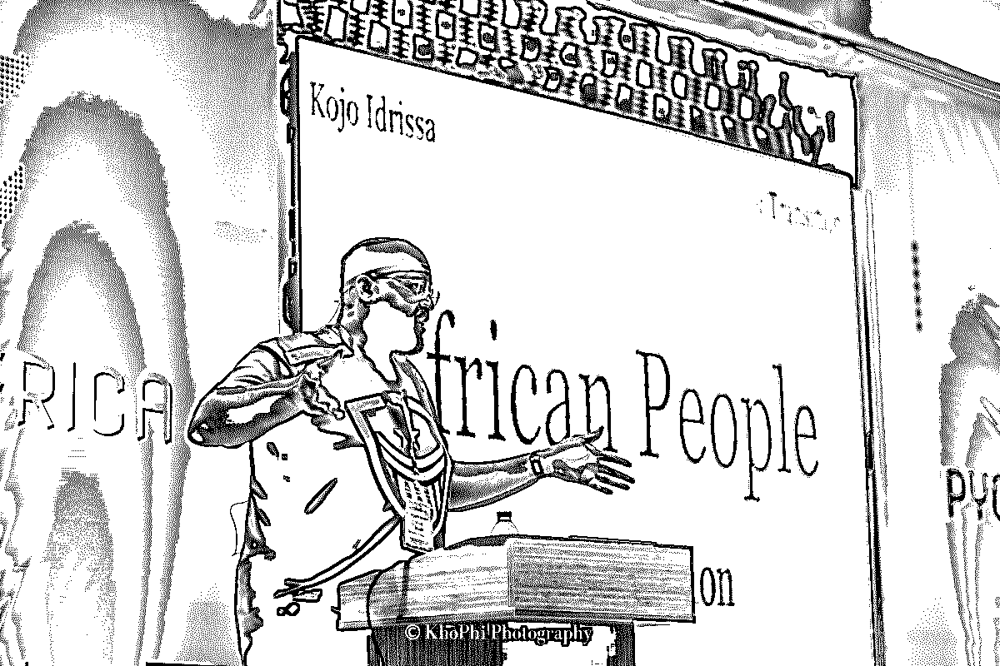](https://files.realpython.com/media/Optimized-pycon_africa_kojo.4817c592dbda.jpg)

<figcaption class="figure-caption text-center">Kojo Idrissa (Image: [Khophi.Photography](https://www.khophi.photography/))</figcaption>

[*Remove ads*](/account/join/)

## 短跑日

主发布会的后一天是专门用来冲刺的！这是人们聚集在一起从事各种开源 Python 项目的地方。我是团队中的一员，参与了[饼干切割器](https://github.com/cookiecutter/cookiecutter)和其他相关项目。我提交了一份合并到项目中的 PR，还帮助指导了其他团队成员。

我强烈推荐任何以前没有参加过短跑的人参加！这是一个很好的方式来练习你的技能，为一个开源项目做贡献，并会见参与该项目的开发人员。

[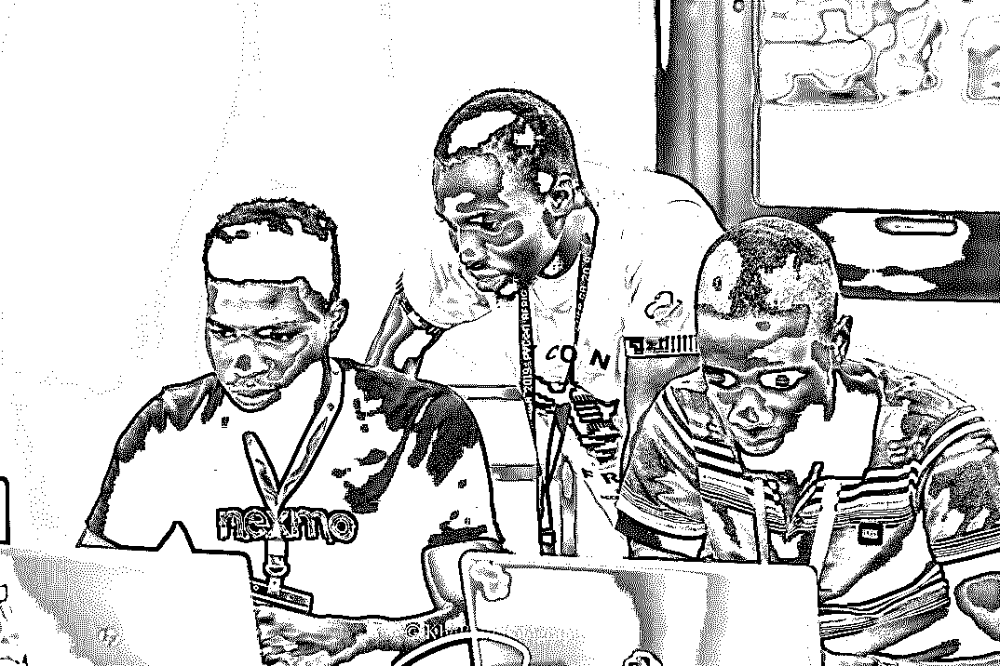](https://files.realpython.com/media/sprints.b4182ec9e033.jpg)

<figcaption class="figure-caption text-center">Sprints (Image: [Khophi.Photography](https://www.khophi.photography/))</figcaption>

## 总结

PyCon Africa 取得了巨大的成功，简直棒极了！对于非洲社区来说，这是一个良好的开端，因为它第一次将来自不同非洲 Python 社区的 Python 开发人员聚集在一起。这也让我们能够听到 PSF 代表关于 Python 社区是如何组织和资助的。对许多人来说，这是来自不同社区的人在多年的在线合作后第一次见面。

[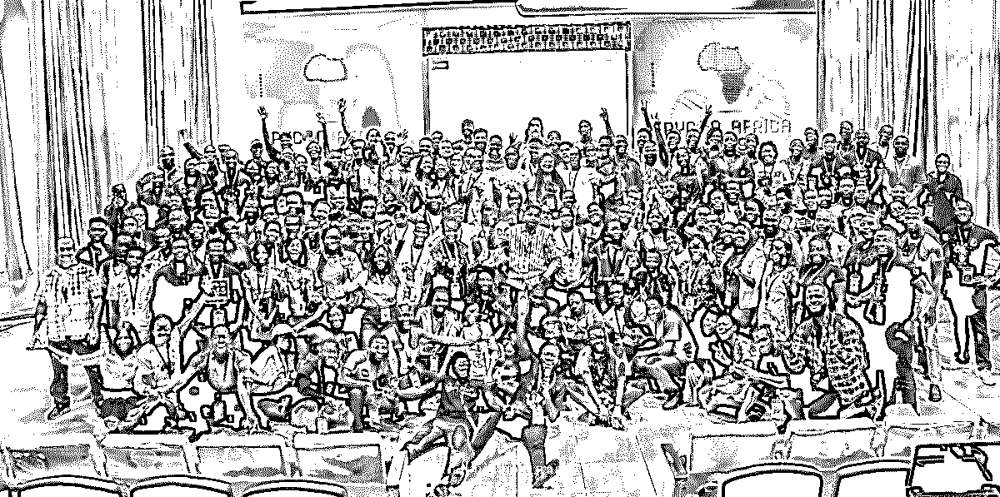](https://files.realpython.com/media/Optimized-pycon_africa_group.33a7bc40895b.jpg)

<figcaption class="figure-caption text-center">Image: [Khophi Photography](https://www.khophi.photography/)</figcaption>

对我来说，这种经历的牺牲和花费是值得的，因为我见到了来自世界各地的人，并与他们交谈，了解他们如何在工作或学习中使用 Python。我做了一个简短的演讲，讲述了如何使用 Python 和其他 Linux 自带的工具从 Python 脚本发送桌面通知。

参加 PyCon Africa 的另一个亮点是，我见到了我们的许多读者，他们中的许多人将他们的成功归功于他们在这里的 *Real Python* 上阅读的许多内容。安东尼·肖和我还赠送了许多*真蟒*贴纸。这是我们和爱迪生，一个朋友和*真正的 Python* 读者的合影:

[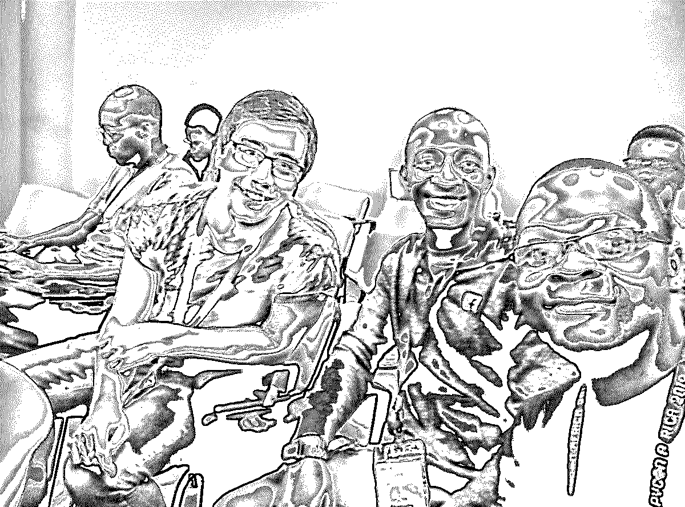](https://files.realpython.com/media/Optimized-IMG_20190809_113244.149c0fd85db5.jpg)

组织者面临的一个问题是让尽可能多的人负担得起这次会议。对许多非洲人来说，在非洲旅行既昂贵又困难。例如，仅加纳的入境签证就要花费 100 至 200 美元。再加上旅行和住宿的费用，这个活动对许多有兴趣参加的人来说是遥不可及的。

来自个人的自愿捐款和来自 Real Python、BriteCore、Andela 和其他几家赞助商的公司赞助帮助那些需要的人支付了门票、住宿和旅行的费用。如果你想让更多的非洲人参与 Python，那么考虑支持未来在非洲的 Python 活动，并雇佣非洲开发者在你的团队中远程工作。

在撰写本文时，会议的视频还没有公开，但有一个[精彩视频](https://www.youtube.com/watch?v=43wJnYZ6Zd0)，其中也包括对一些与会者的采访。你也可以阅读来自会议组织者的[官方报告](https://africa.pycon.org/report/)。如果你想参加附近的 PyCon，那么看看[如何充分利用 PyCon](https://realpython.com/pycon-guide/) 。***