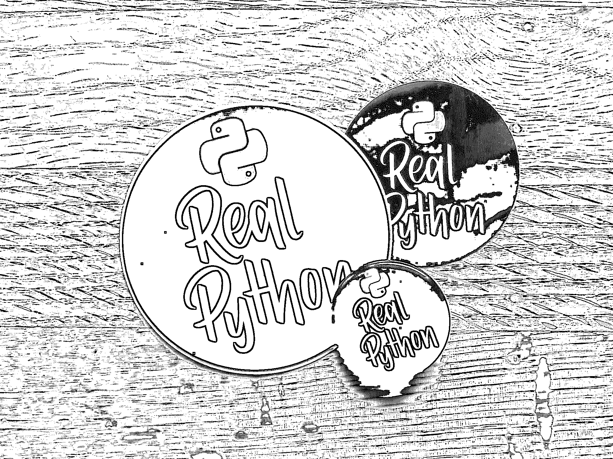

# 如何充分利用 PyCon US

> 原文：<https://realpython.com/pycon-guide/>

恭喜你！你要骗我们！

不管这是不是你的第一次，参加一个满是和你爱好相同的人的会议总是一种有趣的经历。PyCon 不仅仅是一群人在谈论 Python 语言，这对于第一次参加的人来说可能有点吓人。本指南将帮助您浏览 PyCon 的所有景点和活动。

PyCon US 是围绕 Python 语言的最大会议。这个会议最初于 2003 年发起，现在已经成指数级增长，甚至在世界各地催生了其他几个[pycon 和工作坊。](https://www.python.org/community/workshops/)

每个参加 PyCon 的人都会有不同的体验，这也是会议真正与众不同的地方。本指南旨在帮助你，但你不必严格遵守。

到本文结束时，你会知道:

*   PyCon 如何由**教程**、**会议**和**冲刺**组成
*   去之前做什么
***   在 PyCon 期间做什么***   PyCon 之后做什么***   如何拥有一个**伟大的** PyCon*****

***本指南将有专门针对 PyCon 2022 的链接，但对未来的 PyCon 也应该有用。

**免费下载:** [从 Python 技巧中获取一个示例章节:这本书](https://realpython.com/bonus/python-tricks-sample-pdf/)用简单的例子向您展示了 Python 的最佳实践，您可以立即应用它来编写更漂亮的+Python 代码。

## PyCon 涉及什么

在考虑如何充分利用 PyCon 之前，首先了解 PyCon 涉及的内容是很重要的。

PyCon 分为三个阶段:

1.  教程: PyCon 从两天三小时的课程开始，在此期间，您可以在导师的指导下深入学习。这些都是很好的去处，因为班级规模很小，你可以向老师提问。如果可以的话，你应该考虑至少参加其中的一个，但是他们每节课都有 150 美元的额外费用。

2.  接下来，PyCon 将提供为期三天的讲座。每场演讲持续 30 到 45 分钟，大约有五场演讲同时进行，包括西班牙语的 charlas 曲目。但这还不是全部:还有开放空间，赞助商，闪电谈话，晚宴，等等。

3.  **冲刺:**在这个阶段，你可以学以致用！这是一个为期两天的练习，在这个练习中，人们分组从事与 Python 相关的各种开源项目。如果你有时间，参加 sprints 是一个很好的方式，可以实践你所学的知识，参与开源项目，和非常聪明有才华的人交流。在今年早些时候的[博客文章](https://pycon.blogspot.com/2016/03/why-not-join-sprints-this-year-at-pycon.html)中了解更多关于短跑的知识。

由于大多数 PyCon 与会者都参加了会议部分，这将是本文的重点。然而，如果可能的话，不要让这阻止你参加教程或短跑！

你甚至可以通过参加辅导课而不是听讲座来学习更多的技术技能。短跑对于人际关系网和应用你已经掌握的技能很有帮助，同时也能从你的同事那里学到新的技能。

[*Remove ads*](/account/join/)

## 去之前做什么

一般来说，你对某事准备得越充分，你的体验就会越好。这同样适用于 PyCon。

提前计划和准备真的很有帮助，你已经通过阅读这篇文章做到了！

浏览一下[会谈时间表](https://us.pycon.org/2022/schedule/talks/)，看看哪些会谈你听起来最感兴趣。这并不意味着你需要计划好你将要看到的所有演讲，在每一个可能的时段，但是它有助于你了解将要展示的主题，这样你就可以决定你最感兴趣的是什么。

获得[旅行指南应用](https://guidebook.com/getit/)将帮助你计划你的时间表。这个应用程序可以让你查看会谈的时间表，并为你想参加的会谈添加提醒。如果你很难选择去参加哪个讲座，你可以准备好你需要解决的问题。这样做可以帮助你专注于对你来说重要的话题。

如果可以，提前一天来报到，参加开幕酒会。第一天登记的队伍总是很长，所以如果你在前一天登记，你会节省时间。那天晚上通常还会有一个开幕招待会，这样你就可以见到其他与会者和演讲者，也有机会去看看各个赞助商和他们的展位。

如果你是 PyCon 的新手，那么[新人培训](https://us.pycon.org/2022/events/newcomer-orientation/)可以帮助你了解会议内容以及如何参与。

由于 COVID 疫情，导致 PyCon 2020 和 PyCon 2021 变得遥远，今年的 PyCon 大会有额外的[健康和安全指南](https://us.pycon.org/2022/attend/health-safety-guidelines/)。确保你有资格参加，并在去之前填写必要的文件。注意安全！

**回顾:**以下是你出发前要做的事情:

1.  看[谈话日程](https://us.pycon.org/2022/schedule/talks/)。
2.  获取[旅行指南 App](https://guidebook.com/getit/) 。
3.  想出一个你想要回答的具体问题。
4.  在会议开始前一天报到。
5.  查看[健康和安全指南](https://us.pycon.org/2022/attend/health-safety-guidelines/)。

## 在 PyCon 做什么

如果你在会议的第一天感到紧张或兴奋也没关系。

会有很多来自各行各业的人，这就是它如此伟大的原因。你可能会看到一些你的 Python 英雄，比如[吉多·范·罗苏姆](https://en.wikipedia.org/wiki/Guido_van_Rossum)，并且有机会走上前去和他们打招呼。

<figcaption class="figure-caption text-center">Guido van Rossum With the Python Staff of Enlightenment</figcaption>

Python 社区非常欢迎！但也有一些指定的安静房间，在那里发言者和其他人将平静地工作。你应该避免和那些房间里的任何人说话，给他们一个安全的空间。

你可以将会议分解成一些关键要素，看看如何最大限度地利用它们:

*   会谈
*   空地
*   赞助商
*   志愿服务机会
*   下班后的活动，包括闪电谈话
*   属于你自己的时间

### 会谈

想去多少场讲座就去多少场，但你不需要去所有的讲座。当你从一个房间跑到另一个房间时，你只会发现自己越来越紧张。相反，要确保你在来之前就选择了演讲。虽然这种情况很少发生，但是时间表是可以改变的，所以每天查看时间表来发现任何变化。

<figcaption class="figure-caption text-center">'Light Up Your Life⁠ — With Python and LEDs' Talk Given by Nina Zakharenko at PyCon 2019</figcaption>

如果你真的想去的两个讲座之间有冲突，记住每个讲座都被记录下来并上传到 YouTube 上。有时候，它们甚至在同一天就可以买到！选择一个与你的情况最相关，并且对你来说最有趣的话题。然后记下你错过的演讲，并在当天晚上或第二天有空的时候观看。

尽管所有的讲座都可以在网上找到，但实际去听讲座仍然是有价值的。如果你参加，你会更好地记住信息，而且你将有机会直接向演讲者提问。

请记住，你不需要看到所有所谓的名人发言人。这些演讲者在 Python 社区得到了很多关注，因此看起来更值得一提。但是，在 PyCon 上让一个演讲获得批准的过程是严格的，并确保所有的演讲者和主题都值得一听。

事实上，有时候去看一些不太出名的演讲者会更好，因为你可以得到更好的座位，也有更多的机会提问。

当你去参加一个讲座时，记得关掉你的手机和电脑。噪音会让听众和演讲者分心。把你所有的设备放在一边，用便笺簿和纸简单地听或者记笔记可能会有帮助。

试着想一想你可能对正在讨论的内容有什么疑问。通常情况下，最后会分配时间给观众提问。如果这种情况没有发生，主持人通常会很乐意在之后的大厅里回答问题。

**回顾:**以下是你需要了解的关于 PyCon 的演讲:

1.  你不需要去参加所有的讲座，你可以在 YouTube 上观看。
2.  所有的演讲和演讲者都很棒。
3.  在谈话时把噪音降到最低。
4.  想好要问的问题。
5.  之后与演讲者交谈。

[*Remove ads*](/account/join/)

### 开放空间

开放空间是可以被与会者预订的房间。全天都有一个小时的时段，任何人都可以使用。这些房间被用作教授人们、举行聚会、甚至是瑜伽课的地方。它们对任何你需要它们的活动开放，当然，只要你遵守行为准则。

<figcaption class="figure-caption text-center">Open Spaces Board at PyCon 2019</figcaption>

有时你可能想去这些开放的地方，而不是去演讲或赞助商的展位。请务必每天查看开放空间公告板，因为它会不断变化。拍一张板子的照片供以后参考可能会有帮助。

随意创造你自己的开放空间。还记得您寻求帮助的那个问题或特定问题吗？注册一个房间，并就该主题寻求建议！你永远不知道谁会出现帮忙。

我们在 Real Python 主持了 PyCon 2019 的一个开放空间。对于现有成员和不太了解我们的人来说，这是一个非常棒的时刻。今年我们也将举办一个开放空间。来加入我们，一起讨论我们对未来的展望吧！你应该可以在空地板上找到时间，或者你可以到我们的展位来问我们。

如果你是一个专家，或者对你想分享的话题知之甚少，也可以随意地为它找一个开放的空间！这些空间是你想要和需要的，所以不要羞于使用它们。

**回顾:**以下是您需要了解的关于 PyCon 露天场地的信息:

1.  开放空间可以是你想要的任何样子。
2.  利用空位寻求帮助。
3.  利用空位教别人。

### 赞助商

拜访赞助商是了解一些在日常工作流程中使用 Python 的公司的好方法。有一些非常大的名字几乎每年都会出现:微软、JetBrains 和谷歌，仅举几例。PyCon 2022 大概有一百个赞助商！去赞助商的展台有很多好处，不仅仅是因为每个人都送出了精美的礼品。以下是我们的一些例子:

<figcaption class="figure-caption text-center">Real Python Swag: Meet us at PyCon and get some stickers</figcaption>

赞助商在那里最大的好处是你可以和你使用的工具和软件的实际开发者交流。假设您在 Windows 环境中遇到了 Anaconda 安装问题。你可以直接去蟒蛇展台问问题！这是一个和你所使用的工具的开发者和创造者交流的好机会。

你遇到的不仅仅是开发人员。也有作者和内容创作者来。 [O'Reilly](https://www.oreilly.com/) 通常每天会有一两个作者在展台前与你见面聊天。今年，我们将有自己的真正的 Python 展台，在那里你可以见到一些[作者和课程创建者](https://realpython.com/team/)！

最后，与赞助商会面可能会带来一个工作机会。许多赞助商也在寻找有才华的 Python 开发人员，你可以在展位或招聘会期间直接向他们申请，招聘会在会议快结束时举行。如果你没有在找工作，看看外面有什么，这些公司在寻找什么技能来帮助你选择学习的重点仍然很好。

**回顾:**以下是您需要了解的关于 PyCon 赞助商的信息:

1.  得到赞助商的赠品很棒。
2.  与开发者和内容创建者见面就更好了。
3.  你可以去应聘，或者看看公司在找什么技能。

### 志愿服务机会

你是否曾希望自己能为 Python 社区做出贡献或回报？嗯，你可以在 PyCon。

举办一次会议需要做很多工作，如果没有志愿者，这一切都是不可能的。2022 年 PyCon 大会正在寻找超过 300 个现场志愿者小时！

这听起来很多，但你仍然可以有所作为。一两个小时的时间会很有帮助，而且不会占用你的学习时间。作为一名志愿者，你也永远不知道你会和谁接触。你可以在现场志愿者的[电话中了解更多帮助信息。每个人都有一点小礼物。](https://us.pycon.org/2022/volunteers/volunteering/)

**回顾:**以下是你需要了解的关于 PyCon 志愿者的信息:

1.  去做吧。
2.  真的，照做就是了！

[*Remove ads*](/account/join/)

### 下班后的活动

尽管会议在傍晚结束，但在会议结束后还有更多事情要做。

你首先应该检查的是[闪电对话](https://us.pycon.org/2022/events/lightning-talks/)，即使只是一小会儿。这是五分钟的时间段，任何人都可以分享他们对某个主题的知识。这些讲座涵盖了广泛的话题:从新的开源项目到社会评论再到慈善事业。你知道吗 [Docker 是在一次 PyCon 闪电对话中首次公开宣布的](https://pyvideo.org/pycon-us-2013/the-future-of-linux-containers.html)？闪电会谈已经成为定期与会者的热门话题。

也要留意和他们公司成员一起做赞助晚餐的赞助商。这是一个建立你的人际网络的好方法，也是一顿免费晚餐。PyCon 确实在晚上举办晚宴，但这些都要花钱，而且通常很快就会卖光。

即使您没有参加正式的 PyCon 晚宴或赞助晚宴，在会议附近也有很多值得一去的地方。每个会议[地点](https://www.google.com/maps/d/u/0/viewer?mid=1zWWBZIrjmrlkXfxnRDv9sL2-eb-KRQnS&ll=40.76575052507184%2C-111.8939183&z=17)的选择部分是因为附近有趣的事情。当你为会议做准备的时候，找一些好玩的地方吃饭。

**回顾:**以下是你需要了解的关于 PyCon 会后活动的信息:

1.  看看闪电谈话。
2.  如果有空位，报名参加一个正式的 PyCon 晚宴。
3.  尽早并经常检查任何赞助的晚餐。
4.  享受探索当地美食和文化的乐趣。

### 新朋友

去 PyCon 的最好建议之一就是每天交一个新朋友。

<figcaption class="figure-caption text-center">Dan Bader and Andres Pineda</figcaption>

在 PyCon 认识一个人的最好时间是午餐和小吃休息时间。不要试图找一张空桌子坐下，找一张已经坐了一两个人的桌子，问问你是否可以加入他们。

开始一段对话，谈论他们迄今为止最喜欢的话题，或者他们如何在日常活动中使用 Python。很快你就会交到新朋友。你可以做一些笔记，无论是精神上的还是文字上的，这样你就可以在以后记住那个人。

为了与您遇到的人保持联系，您可能需要制作一些名片，上面有您想要共享的联系信息。确保更新你与他人分享的个人资料，如 LinkedIn 或 GitHub。

**回顾:**以下是你在 PyCon 结交新朋友需要知道的事情:

1.  接受挑战，每天至少认识一个新的人。
2.  记下那个人是谁，这样你就不会忘记。
3.  带上名片，与你遇到的人分享。

## PyCon 之后做什么

一旦会议结束，你还有很多事情可以做。首先，如果你有时间，还有 sprints，这是一个很好的机会让你磨练自己的技能，甚至作为一名 Python 开发人员获得新的技能。会议结束后会持续两天，但是你不需要一直呆在这里。想呆多久就呆多久，不管是几个小时还是一整天。

回家后，一定要看看 YouTube 上你错过或想重新观看的演讲视频。在 YouTube 上，你还可以查看所有的教程、主题演讲，甚至闪电演讲。全年都有足够的时间让你得到你的 PyCon fix。

PyCon 最大的好处就是有一种社区归属感。只有回馈 Python 社区的优秀人士才能做到这一点，你也可以成为他们中的一员！

你可以通过很多方式回馈这个伟大的社区:

*   为使用 Python 的开源项目做贡献。
*   加入当地的 Python meetup 群组。没有吗？创建一个！
*   与他人分享你所学到的东西。
*   为明年的 PyCon 提交一份报告或海报。

终于可以开始准备下一次 PyCon 了。当你提前买票时，你会得到一个折扣价格，但是那些票也很快就卖完了。为了准备选择在下一次 PyCon 上检查的演讲，你也可以开始记下任何你找不到答案的问题。

**回顾:**以下是你需要知道的会后要做的事情:

1.  如果你有时间，留下来看短跑。
2.  看看你错过或喜欢的 YouTube 视频。
3.  用你学到的知识为 Python 社区做贡献。
4.  开始看明年的 PyCon。

[*Remove ads*](/account/join/)

## 欢迎来到最伟大的社区！

恭喜你！你即将参加一个最伟大的技术会议，你已经准备好充分利用你在那里的时间。

**在本文中，您学习了:**

*   什么是 PyCon**所有关于**
*   在来到 PyCon 之前**你可以做什么**
*   在 PyCon 上**可以做什么**
*   在 PyCon 之后**你能做什么**

根据这篇文章中的建议，你将会拥有一个很棒的 PyCon。我们期待在那里见到您！********