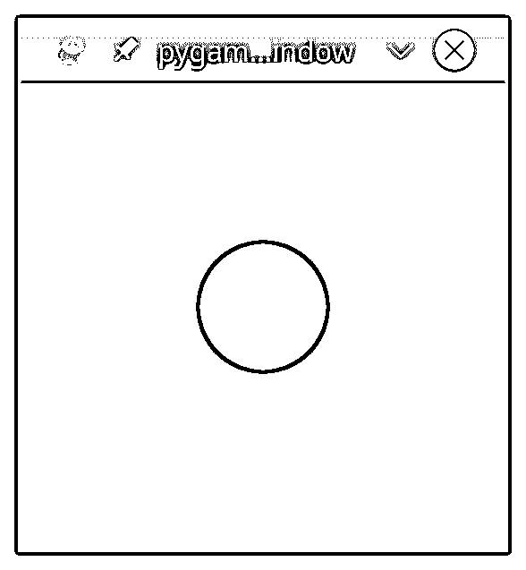
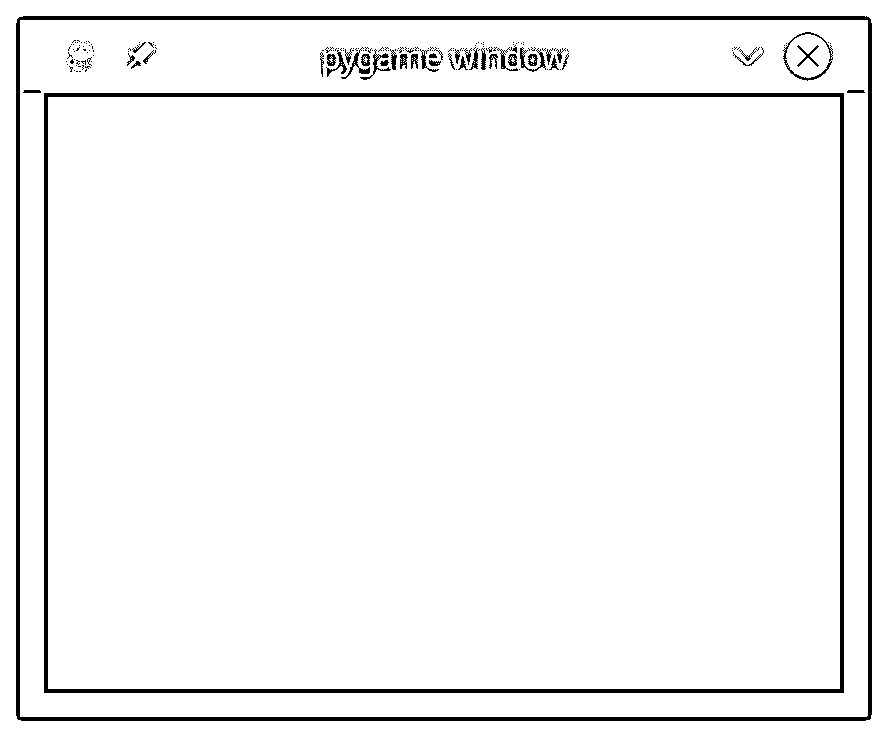
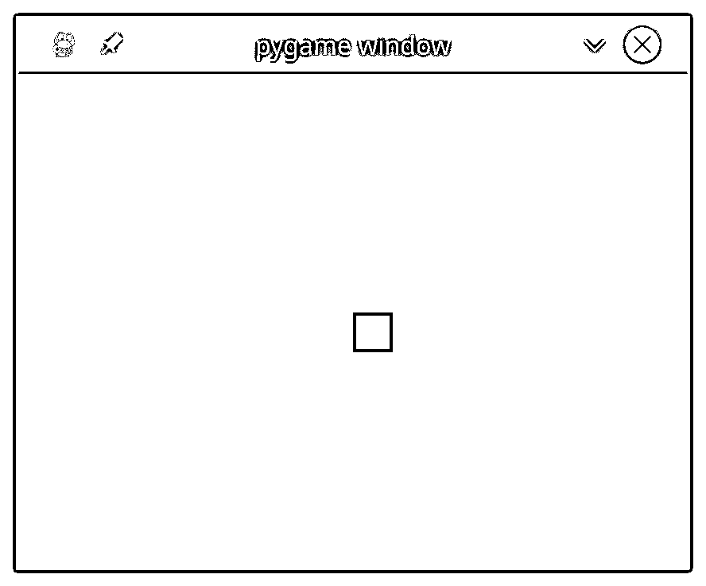
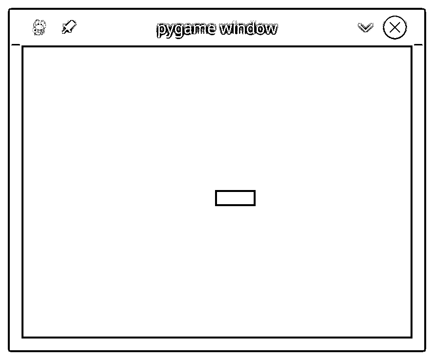
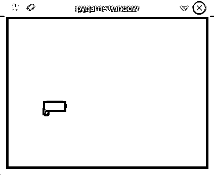
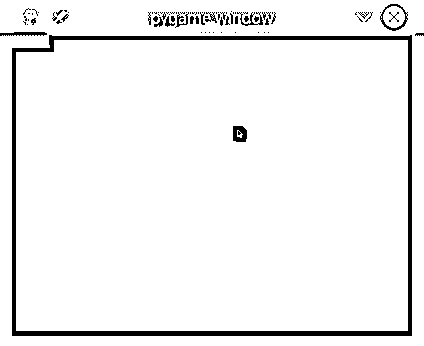
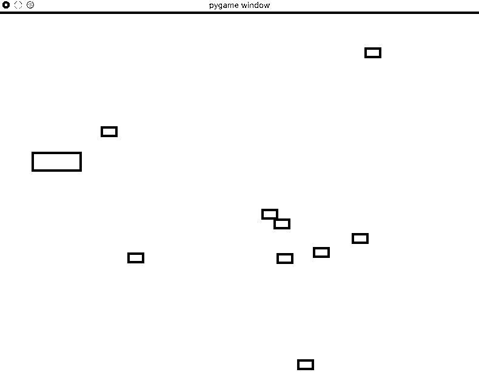
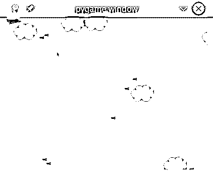
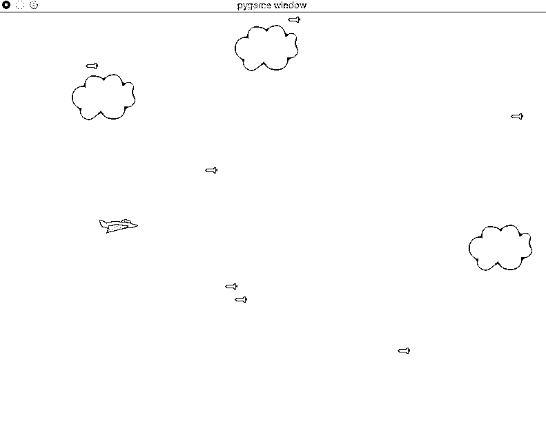

# PyGame:Python 游戏编程入门

> 原文：<https://realpython.com/pygame-a-primer/>

*立即观看**本教程有真实 Python 团队创建的相关视频课程。配合文字教程一起看，加深理解: [**用 PyGame**](/courses/pygame-primer/) 制作一个 2D 侧滚游戏

当我在上个千年后期开始学习计算机编程时，是受我编写计算机游戏的愿望驱使的。我试图弄清楚如何用我学过的每一种语言和每一个平台(包括 Python)用[写游戏](https://realpython.com/top-python-game-engines/)。我就是这样发现了 [`pygame`](https://www.pygame.org/) ，并学会了如何用它来编写游戏和其他图形程序。当时我真的很想要一本`pygame`的入门书。

**本文结束时，你将能够:**

*   在屏幕上绘制项目
*   播放音效和音乐
*   处理用户输入
*   实现事件循环
*   描述游戏编程与标准的程序化 Python 编程有何不同

这本初级读本假设你对编写 Python 程序有[的基本了解，包括用户自定义函数、](https://realpython.com/learning-paths/python3-introduction/)[导入](https://realpython.com/courses/python-imports-101/)、[循环](https://realpython.com/courses/mastering-while-loops/)和[条件](https://realpython.com/courses/python-conditional-statements/)。您还应该熟悉如何在您的平台上打开文件。对面向对象的 Python 的基本理解也是有帮助的。`pygame`适用于大多数版本的 Python，但本文通篇推荐使用 Python 3.6。

您可以阅读本文中的所有代码:

**示例代码:** [单击此处下载本教程中使用的 PyGame 示例项目](https://realpython.com/bonus/pygame-sample-code/)的源代码。

## 背景和设置

`pygame`是 [SDL 库](https://www.libsdl.org/)的 Python 包装器，代表**简单 DirectMedia 层**。SDL 提供对系统底层多媒体硬件组件的跨平台访问，如声音、视频、鼠标、键盘和操纵杆。`pygame`开始作为停滞不前的 [PySDL 项目](http://www.pygame.org/docs/tut/PygameIntro.html)的替代品。SDL 和`pygame`的跨平台特性意味着你可以为每一个支持它们的平台编写游戏和丰富的多媒体 Python 程序！

要在您的平台上安装`pygame`，使用适当的 [`pip`](https://realpython.com/what-is-pip/) 命令:

```py
$ pip install pygame
```

您可以通过加载库附带的示例之一来验证安装:

```py
$ python3 -m pygame.examples.aliens
```

如果出现游戏窗口，那么`pygame`安装正确！如果你遇到问题，那么[入门指南](https://www.pygame.org/wiki/GettingStarted)概述了所有平台的一些已知问题和警告。

[*Remove ads*](/account/join/)

## 基本 PyGame 程序

在进入细节之前，让我们看一下一个基本的`pygame`程序。这个程序创建一个窗口，用白色填充背景，并在中间画一个蓝色的圆圈:

```py
 1# Simple pygame program
 2
 3# Import and initialize the pygame library
 4import pygame
 5pygame.init()
 6
 7# Set up the drawing window
 8screen = pygame.display.set_mode([500, 500])
 9
10# Run until the user asks to quit
11running = True
12while running:
13
14    # Did the user click the window close button?
15    for event in pygame.event.get():
16        if event.type == pygame.QUIT:
17            running = False
18
19    # Fill the background with white
20    screen.fill((255, 255, 255))
21
22    # Draw a solid blue circle in the center
23    pygame.draw.circle(screen, (0, 0, 255), (250, 250), 75)
24
25    # Flip the display
26    pygame.display.flip()
27
28# Done! Time to quit.
29pygame.quit()
```

当你运行这个程序时，你会看到一个类似这样的窗口:

[](https://files.realpython.com/media/pygame-simple.5169327a10a3.png)

让我们一段一段地分解这段代码:

*   **4 号线和 5 号线**导入并初始化`pygame`库。没有这些线，就没有`pygame`。

*   第 8 行设置程序的显示窗口。您可以提供一个列表或一个元组来指定要创建的窗口的宽度和高度。这个程序使用一个列表来创建一个每边 500 像素的正方形窗口。

*   **第 11 行和第 12 行**建立了一个**游戏循环**来控制程序何时结束。在本教程的后面，你将会谈到游戏循环。

*   **第 15 至 17 行**扫描并处理游戏循环中的**事件**。你也会晚一点参加活动。在这种情况下，唯一处理的事件是`pygame.QUIT`，它在用户单击窗口关闭按钮时发生。

*   **第 20 行**用纯色填充窗口。`screen.fill()`接受指定颜色 RGB 值的列表或元组。自从提供了`(255, 255, 255)`后，窗口被填充为白色。

*   **第 23 行**使用以下参数在窗口中画一个圆:

    *   **`screen` :** 要绘制的窗口
    *   **`(0, 0, 255)` :** 包含 RGB 颜色值的元组
    *   **`(250, 250)` :** 指定圆的中心坐标的元组
    *   **`75` :** 以像素为单位绘制的圆的半径
*   **第 26 行**更新屏幕显示的内容。如果没有这个调用，窗口中什么都不会出现！

*   **29 号线**出站`pygame`。这只有在循环结束时才会发生。

这是“你好，世界”的`pygame`版本现在让我们更深入地挖掘一下这些代码背后的概念。

## PyGame 概念

由于 SDL 库可以跨不同的平台和设备移植，它们都需要定义和处理各种硬件现实的抽象。理解这些概念和抽象将帮助你设计和开发你自己的游戏。

### 初始化和模块

`pygame`库是由许多 Python 构造组成的[，其中包括几个不同的**模块**。这些模块提供了对系统上特定硬件的抽象访问，以及使用该硬件的统一方法。例如，`display`允许统一访问你的视频显示，而`joystick`允许抽象控制你的操纵杆。](https://www.pygame.org/docs/ref/pygame.html)

在上例中导入了`pygame`库之后，你做的第一件事就是[使用`pygame.init()`初始化 PyGame](https://www.pygame.org/docs/tut/ImportInit.html) 。该函数[调用所有包含的`pygame`模块的独立`init()`函数](https://www.pygame.org/docs/ref/pygame.html#pygame.init)。因为这些模块是特定硬件的抽象，所以这个初始化步骤是必需的，这样您就可以在 Linux、Windows 和 Mac 上使用相同的代码。

### 显示器和表面

除了这些模块，`pygame`还包括几个 Python **类**，它们封装了与硬件无关的概念。其中一个是 [`Surface`](https://www.pygame.org/docs/ref/surface.html) ，它最基本的定义了一个你可以在上面画画的矩形区域。`Surface`在`pygame`中，宾语用在很多语境中。稍后您将看到如何将一幅图像加载到`Surface`中并显示在屏幕上。

在`pygame`中，一切都在单个用户创建的 [`display`](https://www.pygame.org/docs/ref/display.html) 上查看，可以是窗口，也可以是全屏。使用 [`.set_mode()`](https://www.pygame.org/docs/ref/display.html#pygame.display.set_mode) 创建显示，返回代表窗口可见部分的`Surface`。就是这个`Surface`你传入 [`pygame.draw.circle()`](https://www.pygame.org/docs/ref/draw.html#pygame.draw.circle) 这样的绘图函数，当你调用 [`pygame.display.flip()`](https://www.pygame.org/docs/ref/display.html#pygame.display.flip) 的时候那个`Surface`的内容就被推送到显示器上。

### 图像和矩形

你的基本`pygame`程序直接在显示器的`Surface`上画出一个形状，但是你也可以处理磁盘上的图像。 [`image`模块](https://www.pygame.org/docs/ref/image.html)允许你[加载](https://www.pygame.org/docs/ref/image.html#pygame.image.load)和[保存](https://www.pygame.org/docs/ref/image.html#pygame.image.save)各种流行格式的图像。图像被加载到`Surface`对象中，然后可以用多种方式操作和显示。

如上所述，`Surface`对象由矩形表示，`pygame`中的许多其他对象也是如此，比如图像和窗口。矩形被大量使用，以至于有一个[专用的`Rect`类](https://www.pygame.org/docs/ref/rect.html)来处理它们。你将在游戏中使用`Rect`物体和图像来绘制玩家和敌人，并管理他们之间的冲突。

好了，理论到此为止。让我们设计并编写一个游戏吧！

[*Remove ads*](/account/join/)

## 基础游戏设计

在你开始写任何代码之前，做一些适当的设计总是一个好主意。由于这是一个教程游戏，让我们也为它设计一些基本的游戏玩法:

*   游戏的目标是避免即将到来的障碍:
    *   玩家从屏幕左侧开始。
    *   障碍物随机从右侧进入，然后沿直线向左移动。
*   玩家可以向左、向右、向上或向下移动来避开障碍物。
*   玩家不能离开屏幕。
*   游戏要么在玩家被障碍物击中时结束，要么在用户关闭窗口时结束。

当他描述软件项目时，我的一个前同事曾经说过，“你不知道你做什么，直到你知道你不做什么。”记住这一点，以下是本教程中不会涉及的一些内容:

*   没有多重生命
*   不计分
*   没有玩家攻击能力
*   没有升级级别
*   没有老板角色

您可以自由尝试将这些和其他特性添加到您自己的程序中。

我们开始吧！

### 导入并初始化 PyGame

导入`pygame`后，您还需要初始化它。这允许`pygame`将其抽象连接到您的特定硬件:

```py
 1# Import the pygame module
 2import pygame
 3
 4# Import pygame.locals for easier access to key coordinates
 5# Updated to conform to flake8 and black standards
 6from pygame.locals import (
 7    K_UP,
 8    K_DOWN,
 9    K_LEFT,
10    K_RIGHT,
11    K_ESCAPE,
12    KEYDOWN,
13    QUIT,
14)
15
16# Initialize pygame
17pygame.init()
```

除了模块和类之外,`pygame`库还定义了许多东西。它还为按键、鼠标移动和显示属性定义了一些[本地常量](https://www.pygame.org/docs/ref/locals.html)。使用语法`pygame.<CONSTANT>`引用这些常量。通过从`pygame.locals`导入特定的常量，您可以使用语法`<CONSTANT>`来代替。这将为您节省一些击键次数，并提高整体可读性。

### 设置显示屏

现在你需要一些可以借鉴的东西！创建一个[屏幕](https://www.pygame.org/docs/ref/display.html)作为整体画布:

```py
 1# Import the pygame module
 2import pygame
 3
 4# Import pygame.locals for easier access to key coordinates
 5# Updated to conform to flake8 and black standards
 6from pygame.locals import (
 7    K_UP,
 8    K_DOWN,
 9    K_LEFT,
10    K_RIGHT,
11    K_ESCAPE,
12    KEYDOWN,
13    QUIT,
14)
15
16# Initialize pygame
17pygame.init()
18
19# Define constants for the screen width and height 20SCREEN_WIDTH = 800 21SCREEN_HEIGHT = 600 22
23# Create the screen object 24# The size is determined by the constant SCREEN_WIDTH and SCREEN_HEIGHT 25screen = pygame.display.set_mode((SCREEN_WIDTH, SCREEN_HEIGHT))
```

您通过调用`pygame.display.set_mode()`并传递一个具有所需宽度和高度的元组或列表来创建要使用的屏幕。在这种情况下，窗口是 800x600，由第 20 行和第 21 行的常量`SCREEN_WIDTH`和`SCREEN_HEIGHT`定义。这将返回一个代表窗口内部尺寸的`Surface`。这是您可以控制的窗口部分，而操作系统控制窗口边框和标题栏。

如果你现在运行这个程序，那么你会看到一个窗口短暂弹出，然后随着程序的退出而立即消失。不要眨眼，否则你可能会错过它！在下一节中，您将关注游戏的主循环，以确保您的程序只有在得到正确的输入时才退出。

### 设置游戏循环

从 Pong 到堡垒之夜的每个游戏都使用一个[游戏循环](http://www.informit.com/articles/article.aspx?p=2167437&seqNum=2)来控制游戏性。游戏循环做了四件非常重要的事情:

1.  处理用户输入
2.  更新所有游戏对象的状态
3.  更新显示和音频输出
4.  保持游戏的速度

游戏循环的每个周期都被称为一个**帧**，每个周期你做事情越快，你的游戏就会运行得越快。帧继续出现，直到满足退出游戏的某些条件。在您的设计中，有两种情况可以结束游戏循环:

1.  玩家撞上了一个障碍物。(您将在后面讨论碰撞检测。)
2.  玩家关闭窗口。

游戏循环做的第一件事是处理用户输入，允许玩家在屏幕上移动。因此，您需要一些方法来捕获和处理各种输入。您可以使用`pygame`事件系统来做到这一点。

[*Remove ads*](/account/join/)

### 处理事件

按键、鼠标移动、甚至操纵杆移动是用户可以提供输入的一些方式。所有用户输入都导致产生一个[事件](https://www.pygame.org/docs/ref/event.html)。事件可以在任何时候发生，并且经常(但不总是)起源于程序之外。`pygame`中的所有事件都放在事件队列中，然后可以访问和操作。处理事件被称为**处理**它们，这样做的代码被称为**事件处理程序**。

`pygame`中的每个事件都有一个与之关联的事件**类型**。对于您的游戏，您将关注的事件类型是按键和窗口关闭。按键事件具有事件类型`KEYDOWN`，窗口关闭事件具有类型`QUIT`。不同的事件类型也可能有与之相关的其他数据。例如，`KEYDOWN`事件类型也有一个名为`key`的[变量](https://realpython.com/python-variables/)来指示哪个键被按下了。

您可以通过调用`pygame.event.get()`来访问队列中所有活动事件的列表。然后，循环遍历该列表，检查每个事件类型，并做出相应的响应:

```py
27# Variable to keep the main loop running
28running = True
29
30# Main loop
31while running:
32    # Look at every event in the queue
33    for event in pygame.event.get():
34        # Did the user hit a key?
35        if event.type == KEYDOWN:
36            # Was it the Escape key? If so, stop the loop.
37            if event.key == K_ESCAPE:
38                running = False
39
40        # Did the user click the window close button? If so, stop the loop.
41        elif event.type == QUIT:
42            running = False
```

让我们仔细看看这个游戏循环:

*   **第 28 行**为游戏循环设置一个控制变量。要退出循环和游戏，您需要设置`running = False`。游戏循环从第 29 行开始。

*   第 31 行启动事件处理程序，遍历当前事件队列中的每个事件。如果没有事件，那么列表是空的，处理程序不会做任何事情。

*   **第 35 到 38 行**检查当前`event.type`是否为`KEYDOWN`事件。如果是，那么程序通过查看`event.key`属性来检查哪个键被按下了。如果键是 `Esc` 键，用`K_ESCAPE`表示，则通过设置`running = False`退出游戏循环。

*   **第 41 行和第 42 行**对名为`QUIT`的事件类型进行类似的检查。该事件仅在用户单击窗口关闭按钮时发生。用户也可以使用任何其他操作系统动作来关闭窗口。

当您将这些行添加到前面的代码中并运行它时，您将看到一个空白或黑屏的窗口:

[](https://files.realpython.com/media/pygame-empty.a8c1bc646b3b.png)

直到您按下 `Esc` 键，或者通过关闭窗口触发`QUIT`事件，窗口才会消失。

### 在屏幕上绘图

在示例程序中，您使用两个命令在屏幕上绘图:

1.  **`screen.fill()`** 填充背景
2.  **`pygame.draw.circle()`** 画一个圆

现在你将学习第三种在屏幕上绘图的方法:使用`Surface`。

回想一下， [`Surface`](https://www.pygame.org/docs/ref/surface.html) 是一个长方形的物体，你可以在上面画画，就像一张白纸。`screen`对象是一个`Surface`，你可以在显示屏之外创建你自己的`Surface`对象。让我们看看它是如何工作的:

```py
44# Fill the screen with white
45screen.fill((255, 255, 255))
46
47# Create a surface and pass in a tuple containing its length and width
48surf = pygame.Surface((50, 50))
49
50# Give the surface a color to separate it from the background
51surf.fill((0, 0, 0))
52rect = surf.get_rect()
```

在屏幕第 45 行填满白色后，在第 48 行创建一个新的`Surface`。这个`Surface`宽 50 像素，高 50 像素，分配给`surf`。在这一点上，你对待它就像对待`screen`一样。所以在第 51 行，你用黑色填充。你也可以使用`.get_rect()`来访问它的底层`Rect`。这被存储为`rect`以备后用。

### 使用`.blit()`和`.flip()`

仅仅创建一个新的`Surface`不足以在屏幕上看到它。要做到这一点，你需要把这个`Surface`放到另一个`Surface`上。术语`blit`代表**块传输**，`.blit()`是你如何将一个`Surface`的内容复制到另一个。你只能从一个`Surface`到另一个`.blit()`，但既然屏幕只是另一个`Surface`，那就不是问题。下面是你在屏幕上画`surf`的方法:

```py
54# This line says "Draw surf onto the screen at the center"
55screen.blit(surf, (SCREEN_WIDTH/2, SCREEN_HEIGHT/2))
56pygame.display.flip()
```

第 55 行的`.blit()`调用有两个参数:

1.  `Surface`画画
2.  在源上绘制的位置`Surface`

坐标`(SCREEN_WIDTH/2, SCREEN_HEIGHT/2)`告诉你的程序将`surf`放在屏幕的正中央，但是看起来并不是这样:

[](https://files.realpython.com/media/pygame-blit.63a5d39f94e1.png)

图像看起来偏离中心的原因是`.blit()`将`surf`的**左上角**放在给定的位置。如果你想让`surf`居中，那么你必须做一些数学运算来把它向左上方移动。你可以通过从屏幕的宽度和高度中减去`surf`的宽度和高度，除以 2 来确定中心，然后将这些数字作为参数传递给`screen.blit()`:

```py
54# Put the center of surf at the center of the display
55surf_center = (
56    (SCREEN_WIDTH-surf.get_width())/2,
57    (SCREEN_HEIGHT-surf.get_height())/2
58)
59
60# Draw surf at the new coordinates
61screen.blit(surf, surf_center)
62pygame.display.flip()
```

注意在调用`blit()`之后调用 [`pygame.display.flip()`](https://www.pygame.org/docs/ref/display.html#pygame.display.flip) 。这将使用自上次翻转以来绘制的所有内容更新整个屏幕。没有对`.flip()`的调用，什么也不显示。

[*Remove ads*](/account/join/)

## 精灵

在你的游戏设计中，玩家从左边开始，障碍物从右边进来。你可以用`Surface`对象来表示所有的障碍，以使绘制一切变得更容易，但是你如何知道在哪里绘制它们呢？如何知道障碍物是否与玩家发生了碰撞？当障碍物飞出屏幕时会发生什么？如果你想画也会移动的背景图片怎么办？如果你想让你的图片变成动画，该怎么办？你可以用[精灵](https://en.wikipedia.org/wiki/Sprite_%28computer_graphics%29)处理所有这些情况甚至更多。

用编程术语来说，一个**精灵**是屏幕上某个东西的 2D 表示。本质上是一张图片。`pygame`提供了一个 [`Sprite`类](https://www.pygame.org/docs/ref/sprite.html)，它被设计用来保存你想要在屏幕上显示的任何游戏对象的一个或几个图形表示。为了使用它，你创建一个扩展`Sprite`的新类。这允许您使用它的内置方法。

### 玩家

以下是如何在当前游戏中使用`Sprite`对象来定义玩家。在第 18 行后插入以下代码:

```py
20# Define a Player object by extending pygame.sprite.Sprite
21# The surface drawn on the screen is now an attribute of 'player'
22class Player(pygame.sprite.Sprite):
23    def __init__(self):
24        super(Player, self).__init__()
25        self.surf = pygame.Surface((75, 25))
26        self.surf.fill((255, 255, 255))
27        self.rect = self.surf.get_rect()
```

首先通过在第 22 行扩展`pygame.sprite.Sprite`来定义`Player`。然后`.__init__()`用`.super()`调用`Sprite`的`.__init__()`方法。关于为什么这是必要的更多信息，你可以阅读[用 Python super()](https://realpython.com/python-super/) 增强你的类。

接下来，您定义并初始化`.surf`来保存要显示的图像，它目前是一个白盒。您还定义并初始化了`.rect`，稍后您将使用它来绘制播放器。要使用这个新类，您需要创建一个新对象并更改绘图代码。展开下面的代码块以查看所有内容:


```py
 1# Import the pygame module
 2import pygame
 3
 4# Import pygame.locals for easier access to key coordinates
 5# Updated to conform to flake8 and black standards
 6from pygame.locals import (
 7    K_UP,
 8    K_DOWN,
 9    K_LEFT,
10    K_RIGHT,
11    K_ESCAPE,
12    KEYDOWN,
13    QUIT,
14)
15
16# Define constants for the screen width and height
17SCREEN_WIDTH = 800
18SCREEN_HEIGHT = 600
19
20# Define a player object by extending pygame.sprite.Sprite 21# The surface drawn on the screen is now an attribute of 'player' 22class Player(pygame.sprite.Sprite): 23    def __init__(self): 24        super(Player, self).__init__() 25        self.surf = pygame.Surface((75, 25)) 26        self.surf.fill((255, 255, 255)) 27        self.rect = self.surf.get_rect() 28
29# Initialize pygame
30pygame.init()
31
32# Create the screen object
33# The size is determined by the constant SCREEN_WIDTH and SCREEN_HEIGHT
34screen = pygame.display.set_mode((SCREEN_WIDTH, SCREEN_HEIGHT))
35
36# Instantiate player. Right now, this is just a rectangle. 37player = Player() 38
39# Variable to keep the main loop running
40running = True
41
42# Main loop
43while running:
44    # for loop through the event queue
45    for event in pygame.event.get():
46        # Check for KEYDOWN event
47        if event.type == KEYDOWN:
48            # If the Esc key is pressed, then exit the main loop
49            if event.key == K_ESCAPE:
50                running = False
51        # Check for QUIT event. If QUIT, then set running to false.
52        elif event.type == QUIT:
53            running = False
54
55    # Fill the screen with black
56    screen.fill((0, 0, 0))
57
58    # Draw the player on the screen 59    screen.blit(player.surf, (SCREEN_WIDTH/2, SCREEN_HEIGHT/2)) 60
61    # Update the display
62    pygame.display.flip()
```

运行这段代码。您会在屏幕的大致中间位置看到一个白色矩形:

[](https://files.realpython.com/media/pygame-player-sprite.e8a7c96f65b4.png)

如果把 59 行改成`screen.blit(player.surf, player.rect)`，你觉得会怎么样？试试看:

```py
55# Fill the screen with black
56screen.fill((0, 0, 0))
57
58# Draw the player on the screen
59screen.blit(player.surf, player.rect) 60
61# Update the display
62pygame.display.flip()
```

当你传递一个`Rect`到`.blit()`的时候，它会用左上角的坐标来绘制曲面。稍后您将使用它来让您的玩家移动！

### 用户输入

到目前为止，你已经学会了如何设置`pygame`并在屏幕上绘制对象。现在，真正的乐趣开始了！您将使用键盘来控制播放器。

之前，您看到`pygame.event.get()`返回了事件队列中的事件列表，您在其中扫描`KEYDOWN`事件类型。嗯，这不是读取按键的唯一方法。`pygame`还提供`pygame.event.get_pressed()`，返回包含队列中所有当前`KEYDOWN`事件的[字典](https://realpython.com/python-dicts/)。

把这个放在你的游戏循环中，就在事件处理循环之后。这将返回一个字典，其中包含在每一帧开始时按下的键:

```py
54# Get the set of keys pressed and check for user input
55pressed_keys = pygame.key.get_pressed()
```

接下来，在`Player`中编写一个方法来接受字典。这将基于被按下的键定义精灵的行为。这可能是这样的:

```py
29# Move the sprite based on user keypresses
30def update(self, pressed_keys):
31    if pressed_keys[K_UP]:
32        self.rect.move_ip(0, -5)
33    if pressed_keys[K_DOWN]:
34        self.rect.move_ip(0, 5)
35    if pressed_keys[K_LEFT]:
36        self.rect.move_ip(-5, 0)
37    if pressed_keys[K_RIGHT]:
38        self.rect.move_ip(5, 0)
```

`K_UP`、`K_DOWN`、`K_LEFT`、`K_RIGHT`对应键盘上的箭头键。如果该键的字典条目是`True`，那么该键被按下，并且你在正确的方向上移动播放器`.rect`。这里使用`.move_ip()`，代表 [**移动到位**](https://www.pygame.org/docs/ref/rect.html#pygame.Rect.move_ip) ，移动当前`Rect`。

然后，您可以在每一帧调用`.update()`来移动播放器精灵以响应按键。在对`.get_pressed()`的呼叫后立即添加此呼叫:

```py
52# Main loop
53while running:
54    # for loop through the event queue
55    for event in pygame.event.get():
56        # Check for KEYDOWN event
57        if event.type == KEYDOWN:
58            # If the Esc key is pressed, then exit the main loop
59            if event.key == K_ESCAPE:
60                running = False
61        # Check for QUIT event. If QUIT, then set running to false.
62        elif event.type == QUIT:
63            running = False
64
65    # Get all the keys currently pressed
66    pressed_keys = pygame.key.get_pressed()
67
68    # Update the player sprite based on user keypresses 69    player.update(pressed_keys) 70
71    # Fill the screen with black
72    screen.fill((0, 0, 0))
```

现在你可以用箭头键在屏幕上移动你的球员矩形:

[](https://files.realpython.com/media/pygame-keypress-fast-cropped.1552149aa409.gif)

您可能会注意到两个小问题:

1.  如果按住一个键，玩家矩形可以快速移动。你过会儿将在那上工作。
2.  玩家矩形可以移出屏幕。我们现在来解决这个问题。

为了让玩家留在屏幕上，你需要添加一些逻辑来检测`rect`是否会移出屏幕。为此，您需要检查`rect`坐标是否已经超出了屏幕的边界。如果是，那么你指示程序将它移回边缘:

```py
25# Move the sprite based on user keypresses
26def update(self, pressed_keys):
27    if pressed_keys[K_UP]:
28        self.rect.move_ip(0, -5)
29    if pressed_keys[K_DOWN]:
30        self.rect.move_ip(0, 5)
31    if pressed_keys[K_LEFT]:
32        self.rect.move_ip(-5, 0)
33    if pressed_keys[K_RIGHT]:
34        self.rect.move_ip(5, 0)
35
36    # Keep player on the screen 37    if self.rect.left < 0: 38        self.rect.left = 0 39    if self.rect.right > SCREEN_WIDTH: 40        self.rect.right = SCREEN_WIDTH 41    if self.rect.top <= 0: 42        self.rect.top = 0 43    if self.rect.bottom >= SCREEN_HEIGHT: 44        self.rect.bottom = SCREEN_HEIGHT
```

这里不使用`.move()`，直接改变`.top`、`.bottom`、`.left`或`.right`的对应坐标即可。测试这个，你会发现玩家矩形不再能离开屏幕。

现在让我们添加一些敌人！

[*Remove ads*](/account/join/)

### 敌人

没有敌人的游戏算什么？你将使用你已经学过的技术创建一个基本的敌人职业，然后创建许多敌人让你的玩家躲避。首先，导入`random`库:

```py
 4# Import random for random numbers
 5import random
```

然后创建一个名为`Enemy`的新 sprite 类，遵循用于`Player`的相同模式:

```py
55# Define the enemy object by extending pygame.sprite.Sprite
56# The surface you draw on the screen is now an attribute of 'enemy'
57class Enemy(pygame.sprite.Sprite):
58    def __init__(self):
59        super(Enemy, self).__init__()
60        self.surf = pygame.Surface((20, 10))
61        self.surf.fill((255, 255, 255))
62        self.rect = self.surf.get_rect(
63            center=(
64                random.randint(SCREEN_WIDTH + 20, SCREEN_WIDTH + 100),
65                random.randint(0, SCREEN_HEIGHT),
66            )
67        )
68        self.speed = random.randint(5, 20)
69
70    # Move the sprite based on speed
71    # Remove the sprite when it passes the left edge of the screen
72    def update(self):
73        self.rect.move_ip(-self.speed, 0)
74        if self.rect.right < 0:
75            self.kill()
```

`Enemy`和`Player`有四个显著的区别:

1.  **在第 62 到 67 行**上，你将`rect`更新为沿着屏幕右边缘的一个随机位置。矩形的中心刚好在屏幕之外。它位于距离右边缘 20 到 100 像素之间的某个位置，在顶部和底部边缘之间的某个位置。

2.  **在第 68 行**，你将`.speed`定义为 5 到 20 之间的一个随机数。这指定了这个敌人向玩家移动的速度。

3.  **在第 73 到 76 行**，你定义`.update()`。这不需要争论，因为敌人会自动移动。相反，`.update()`将敌人移向屏幕左侧的`.speed`，这个位置是在敌人被创建时定义的。

4.  在第 74 行，你检查敌人是否已经离开屏幕。为了确保`Enemy`完全离开屏幕，并且不会在它仍然可见时就消失，你要检查`.rect`的右侧是否已经越过了屏幕的左侧。一旦敌人离开屏幕，你呼叫`.kill()`阻止它被进一步处理。

那么，`.kill()`是做什么的呢？要想弄清楚这一点，你必须知道**雪碧集团**。

## 精灵组

`pygame`提供的另一个超级有用的类是 [`Sprite Group`](https://www.pygame.org/docs/ref/sprite.html#pygame.sprite.Group) 。这是一个包含一组`Sprite`对象的对象。那么为什么要用呢？你不能在列表中跟踪你的`Sprite`对象吗？嗯，可以，但是使用`Group`的优势在于它公开的方法。这些方法有助于检测是否有任何`Enemy`与`Player`冲突，这使得更新更加容易。

让我们看看如何创建精灵组。您将创建两个不同的`Group`对象:

1.  第一个`Group`将持有游戏中的每一个`Sprite`。
2.  第二个`Group`将只保存`Enemy`对象。

代码看起来是这样的:

```py
82# Create the 'player'
83player = Player()
84
85# Create groups to hold enemy sprites and all sprites 86# - enemies is used for collision detection and position updates 87# - all_sprites is used for rendering 88enemies = pygame.sprite.Group() 89all_sprites = pygame.sprite.Group() 90all_sprites.add(player) 91
92# Variable to keep the main loop running
93running = True
```

当您调用`.kill()`时，`Sprite`将从它所属的每个`Group`中删除。这也删除了对`Sprite`的引用，允许 [Python 的垃圾收集器](https://realpython.com/python-memory-management/#garbage-collection)在必要时回收内存。

现在你有了一个`all_sprites`组，你可以改变对象的绘制方式。您可以迭代`all_sprites`中的所有内容，而不是只在`Player`上调用`.blit()`:

```py
117# Fill the screen with black
118screen.fill((0, 0, 0))
119
120# Draw all sprites 121for entity in all_sprites: 122    screen.blit(entity.surf, entity.rect) 123
124# Flip everything to the display
125pygame.display.flip()
```

现在，放入`all_sprites`的任何东西都会随着每一帧画出来，不管是敌人还是玩家。

只有一个问题…你没有任何敌人！你可以在游戏开始时创造一堆敌人，但几秒钟后当他们都离开屏幕时，游戏会很快变得无聊。相反，让我们探索如何随着游戏的进展保持稳定的敌人供应。

## 自定义事件

这个设计要求敌人定期出现。这意味着在设定的时间间隔内，您需要做两件事:

1.  创建新的`Enemy`。
2.  添加到`all_sprites`和`enemies`中。

您已经有了处理随机事件的代码。事件循环旨在寻找每一帧中发生的随机事件，并适当地处理它们。幸运的是，`pygame`没有限制您只能使用它定义的事件类型。你可以定义你自己的事件来处理你认为合适的。

让我们看看如何创建每隔几秒钟生成一次的自定义事件。您可以通过命名来创建自定事件:

```py
78# Create the screen object
79# The size is determined by the constant SCREEN_WIDTH and SCREEN_HEIGHT
80screen = pygame.display.set_mode((SCREEN_WIDTH, SCREEN_HEIGHT))
81
82# Create a custom event for adding a new enemy 83ADDENEMY = pygame.USEREVENT + 1 84pygame.time.set_timer(ADDENEMY, 250) 85
86# Instantiate player. Right now, this is just a rectangle.
87player = Player()
```

`pygame`内部将事件定义为整数，所以需要用唯一的整数定义一个新的事件。保留的最后一个事件`pygame`被称为`USEREVENT`，因此在第 83 行定义`ADDENEMY = pygame.USEREVENT + 1`可以确保它是唯一的。

接下来，您需要在整个游戏中以固定的间隔将这个新事件插入到事件队列中。这就是 [`time`](https://www.pygame.org/docs/ref/time.html) 模块的用武之地。第 84 行每 250 毫秒触发一次新的`ADDENEMY`事件，即每秒四次。你在游戏循环之外调用`.set_timer()`,因为你只需要一个定时器，但是它会在整个游戏中触发。

添加处理新事件的代码:

```py
100# Main loop
101while running:
102    # Look at every event in the queue
103    for event in pygame.event.get():
104        # Did the user hit a key?
105        if event.type == KEYDOWN:
106            # Was it the Escape key? If so, stop the loop.
107            if event.key == K_ESCAPE:
108                running = False
109
110        # Did the user click the window close button? If so, stop the loop.
111        elif event.type == QUIT:
112            running = False
113
114        # Add a new enemy? 115        elif event.type == ADDENEMY: 116            # Create the new enemy and add it to sprite groups 117            new_enemy = Enemy() 118            enemies.add(new_enemy) 119            all_sprites.add(new_enemy) 120
121    # Get the set of keys pressed and check for user input
122    pressed_keys = pygame.key.get_pressed()
123    player.update(pressed_keys)
124
125    # Update enemy position 126    enemies.update()
```

每当事件处理程序在第 115 行看到新的`ADDENEMY`事件时，它就创建一个`Enemy`并将它添加到`enemies`和`all_sprites`中。因为`Enemy`在`all_sprites`里，所以每一帧都会被画出来。您还需要调用第 126 行的`enemies.update()`，它更新`enemies`中的所有内容，以确保它们正确移动:

[](https://files.realpython.com/media/pygame-enemies-cropped.51821f9a69a6.gif)

然而，这并不是仅仅为`enemies`而成立团体的唯一原因。

[*Remove ads*](/account/join/)

## 碰撞检测

你的游戏设计要求每当敌人与玩家发生冲突时游戏就结束。检查碰撞是游戏编程的基本技术，通常需要一些非平凡的数学来确定两个精灵是否会相互重叠。

这就是像`pygame`这样的框架派上用场的地方！编写碰撞检测代码很繁琐，但是`pygame`有很多[碰撞检测方法](https://www.pygame.org/docs/ref/sprite.html#pygame.sprite.collide_rect)可供您使用。

对于本教程，您将使用一个名为 [`.spritecollideany()`](https://www.pygame.org/docs/ref/sprite.html#pygame.sprite.spritecollideany) 的方法，读作“sprite collide any”这个方法接受一个`Sprite`和一个`Group`作为参数。它查看`Group`中的每个对象，并检查其`.rect`是否与`Sprite`的`.rect`相交。如果是，那么它返回`True`。否则返回`False`。这对这个游戏来说是完美的，因为你需要检查单个`player`是否与`enemies`中的一个`Group`碰撞。

代码看起来是这样的:

```py
130# Draw all sprites
131for entity in all_sprites:
132    screen.blit(entity.surf, entity.rect)
133
134# Check if any enemies have collided with the player 135if pygame.sprite.spritecollideany(player, enemies): 136    # If so, then remove the player and stop the loop 137    player.kill() 138    running = False
```

第 135 行测试`player`是否与`enemies`中的任何物体发生碰撞。如果是这样，那么`player.kill()`被调用来从它所属的每个组中删除它。由于唯一被渲染的对象在`all_sprites`中，`player`将不再被渲染。一旦玩家被杀死，你也需要退出游戏，所以你在第 138 行设置`running = False`来退出游戏循环。

至此，您已经具备了游戏的基本要素:

[](https://files.realpython.com/media/pygame-part2.7d0bd84a877e.png)

现在，让我们稍微打扮一下，让它更具可玩性，并添加一些高级功能来帮助它脱颖而出。

## 精灵图像

好吧，你有一个游戏，但是说实话……它有点丑。玩家和敌人只是黑色背景上的白色方块。当 [Pong](https://en.wikipedia.org/wiki/Pong) 还是新产品的时候，这是最先进的技术，但现在已经不再适用了。让我们用一些更酷的图片来取代那些无聊的白色矩形，让游戏看起来像一个真实的游戏。

前面，您已经了解到，在`image`模块的帮助下，磁盘上的图像可以加载到`Surface`中。在本教程中，我们为玩家制作了一架小型喷气式飞机，为敌人制作了一些导弹。欢迎你使用这种艺术，画你自己的，或者下载一些[免费游戏艺术资产](https://realpython.com/pygame-a-primer/#note-on-sources)来使用。您可以单击下面的链接下载本教程中使用的图片:

**示例代码:** [单击此处下载本教程中使用的 PyGame 示例项目](https://realpython.com/bonus/pygame-sample-code/)的源代码。

### 改变对象构造函数

在使用图像来表示玩家和敌人的精灵之前，您需要对它们的构造函数进行一些更改。下面的代码替换了以前使用的代码:

```py
 7# Import pygame.locals for easier access to key coordinates
 8# Updated to conform to flake8 and black standards
 9# from pygame.locals import *
10from pygame.locals import (
11    RLEACCEL, 12    K_UP,
13    K_DOWN,
14    K_LEFT,
15    K_RIGHT,
16    K_ESCAPE,
17    KEYDOWN,
18    QUIT,
19)
20
21# Define constants for the screen width and height
22SCREEN_WIDTH = 800
23SCREEN_HEIGHT = 600
24
25
26# Define the Player object by extending pygame.sprite.Sprite
27# Instead of a surface, use an image for a better-looking sprite
28class Player(pygame.sprite.Sprite):
29    def __init__(self):
30        super(Player, self).__init__()
31        self.surf = pygame.image.load("jet.png").convert() 32        self.surf.set_colorkey((255, 255, 255), RLEACCEL) 33        self.rect = self.surf.get_rect()
```

让我们打开第 31 行的包装。`pygame.image.load()`从磁盘加载图像。你把文件的路径传递给它。它返回一个`Surface`，`.convert()`调用优化了`Surface`，使得未来的`.blit()`调用更快。

第 32 行使用`.set_colorkey()`表示颜色`pygame`将呈现为透明。在这种情况下，您选择白色，因为这是 jet 图像的背景色。 [RLEACCEL](https://www.pygame.org/docs/ref/surface.html#pygame.Surface.set_colorkey) 常量是一个可选参数，帮助`pygame`在非加速显示器上更快地渲染。这被添加到第 11 行的`pygame.locals`导入语句中。

其他都不需要改变。图像仍然是一个`Surface`，只不过现在上面画了一张图片。你仍然用同样的方式使用它。

下面是与`Enemy`类似的变化:

```py
59# Define the enemy object by extending pygame.sprite.Sprite
60# Instead of a surface, use an image for a better-looking sprite
61class Enemy(pygame.sprite.Sprite):
62    def __init__(self):
63        super(Enemy, self).__init__()
64        self.surf = pygame.image.load("missile.png").convert() 65        self.surf.set_colorkey((255, 255, 255), RLEACCEL) 66        # The starting position is randomly generated, as is the speed
67        self.rect = self.surf.get_rect(
68            center=(
69                random.randint(SCREEN_WIDTH + 20, SCREEN_WIDTH + 100),
70                random.randint(0, SCREEN_HEIGHT),
71            )
72        )
73        self.speed = random.randint(5, 20)
```

现在运行程序应该会显示这是你以前玩过的同一个游戏，除了现在你已经添加了一些漂亮的图形**皮肤**和图像。但是为什么仅仅让玩家和敌人的精灵看起来漂亮呢？让我们添加一些经过的云，给人一种喷气机飞过天空的感觉。

[*Remove ads*](/account/join/)

### 添加背景图像

对于背景云，你使用与`Player`和`Enemy`相同的原则:

1.  创建`Cloud`类。
2.  给它添加一个云的图像。
3.  创建一个方法`.update()`，将`cloud`向屏幕左侧移动。
4.  创建一个自定义事件和处理程序，以在设定的时间间隔创建新的`cloud`对象。
5.  将新创建的`cloud`对象添加到名为`clouds`的新`Group`中。
6.  更新并绘制游戏循环中的`clouds`。

下面是`Cloud`的样子:

```py
 83# Define the cloud object by extending pygame.sprite.Sprite
 84# Use an image for a better-looking sprite
 85class Cloud(pygame.sprite.Sprite):
 86    def __init__(self):
 87        super(Cloud, self).__init__()
 88        self.surf = pygame.image.load("cloud.png").convert()
 89        self.surf.set_colorkey((0, 0, 0), RLEACCEL)
 90        # The starting position is randomly generated
 91        self.rect = self.surf.get_rect(
 92            center=(
 93                random.randint(SCREEN_WIDTH + 20, SCREEN_WIDTH + 100),
 94                random.randint(0, SCREEN_HEIGHT),
 95            )
 96        )
 97
 98    # Move the cloud based on a constant speed
 99    # Remove the cloud when it passes the left edge of the screen
100    def update(self):
101        self.rect.move_ip(-5, 0)
102        if self.rect.right < 0:
103            self.kill()
```

这看起来应该很熟悉。和`Enemy`差不多。

要让云以一定的间隔出现，您将使用与创建新敌人类似的事件创建代码。放在敌人创造事件的正下方:

```py
116# Create custom events for adding a new enemy and a cloud
117ADDENEMY = pygame.USEREVENT + 1
118pygame.time.set_timer(ADDENEMY, 250)
119ADDCLOUD = pygame.USEREVENT + 2 120pygame.time.set_timer(ADDCLOUD, 1000)
```

这意味着在创建下一个`cloud`之前要等待 1000 毫秒，或者一秒钟。

接下来，创建一个新的`Group`来保存每个新创建的`cloud`:

```py
125# Create groups to hold enemy sprites, cloud sprites, and all sprites
126# - enemies is used for collision detection and position updates
127# - clouds is used for position updates
128# - all_sprites is used for rendering
129enemies = pygame.sprite.Group()
130clouds = pygame.sprite.Group() 131all_sprites = pygame.sprite.Group()
132all_sprites.add(player)
```

接下来，在事件处理程序中为新的`ADDCLOUD`事件添加一个处理程序:

```py
137# Main loop
138while running:
139    # Look at every event in the queue
140    for event in pygame.event.get():
141        # Did the user hit a key?
142        if event.type == KEYDOWN:
143            # Was it the Escape key? If so, then stop the loop.
144            if event.key == K_ESCAPE:
145                running = False
146
147        # Did the user click the window close button? If so, stop the loop.
148        elif event.type == QUIT:
149            running = False
150
151        # Add a new enemy?
152        elif event.type == ADDENEMY:
153            # Create the new enemy and add it to sprite groups
154            new_enemy = Enemy()
155            enemies.add(new_enemy)
156            all_sprites.add(new_enemy)
157
158        # Add a new cloud? 159        elif event.type == ADDCLOUD: 160            # Create the new cloud and add it to sprite groups 161            new_cloud = Cloud() 162            clouds.add(new_cloud) 163            all_sprites.add(new_cloud)
```

最后，确保每一帧都更新`clouds`:

```py
167# Update the position of enemies and clouds
168enemies.update()
169clouds.update() 170
171# Fill the screen with sky blue
172screen.fill((135, 206, 250))
```

第 172 行更新了原来的`screen.fill()`,用令人愉快的天蓝色填充屏幕。你可以把这个颜色换成别的颜色。也许你想要一个紫色天空的外星世界，霓虹绿色的有毒荒地，或者红色的火星表面！

注意，每个新的`Cloud`和`Enemy`都被添加到`all_sprites`以及`clouds`和`enemies`中。这样做是因为每个组都有单独的用途:

*   **渲染**是用`all_sprites`完成的。
*   **位置更新**使用`clouds`和`enemies`完成。
*   **碰撞检测**使用`enemies`完成。

您可以创建多个组，以便可以更改精灵移动或行为的方式，而不会影响其他精灵的移动或行为。

## 游戏速度

在测试游戏的时候，你可能已经注意到敌人移动的有点快。如果没有，那也没关系，因为不同的机器在这一点上会看到不同的结果。

原因是游戏循环以处理器和环境允许的最快速度处理帧。由于所有精灵每帧移动一次，它们每秒可以移动数百次。每秒处理的帧数被称为**帧率**，正确处理这一点是一个可玩的游戏和一个可遗忘的游戏之间的区别。

通常情况下，你想要尽可能高的帧率，但对于这个游戏，你需要放慢一点速度，让游戏可以玩。幸运的是，模块`time`包含一个 [`Clock`](https://www.pygame.org/docs/ref/time.html#pygame.time.Clock) 正是为此目的而设计的。

使用`Clock`来建立一个可播放的帧速率只需要两行代码。第一个在游戏循环开始前创建一个新的`Clock`:

```py
106# Setup the clock for a decent framerate
107clock = pygame.time.Clock()
```

第二个调用`.tick()`通知`pygame`程序已经到达帧的末尾:

```py
188# Flip everything to the display
189pygame.display.flip()
190
191# Ensure program maintains a rate of 30 frames per second 192clock.tick(30)
```

传递给`.tick()`的参数确定了所需的帧速率。为此，`.tick()`根据所需的帧速率，计算每帧应该花费的毫秒数。然后，它将这个数字与上次调用`.tick()`以来经过的毫秒数进行比较。如果没有经过足够的时间，那么`.tick()`延迟处理，以确保它永远不会超过指定的帧速率。

传入较小的帧速率会导致每帧有更多的时间用于计算，而较大的帧速率会提供更流畅(也可能更快)的游戏体验:

[](https://files.realpython.com/media/pygame-playable-cropped.8c230439469b.gif)

玩玩这个数字，看看什么最适合你！

[*Remove ads*](/account/join/)

## 音效

到目前为止，你已经专注于游戏性和游戏的视觉方面。现在让我们来探索给你的游戏一些听觉的味道。`pygame`提供了 [`mixer`](https://www.pygame.org/docs/ref/mixer.html) 来处理所有与声音相关的活动。您将使用这个模块的类和方法为各种动作提供背景音乐和声音效果。

名字`mixer`指的是该模块将各种声音混合成一个有凝聚力的整体。使用 [`music`](https://www.pygame.org/docs/ref/music.html) 子模块，您可以以多种格式传输单个声音文件，例如 [MP3](https://en.wikipedia.org/wiki/MP3) 、 [Ogg](https://en.wikipedia.org/wiki/Ogg) 和 [Mod](https://en.wikipedia.org/wiki/Module_file) 。你也可以使用`Sound`来保存一个要播放的音效，无论是 Ogg 还是[未压缩的 WAV](https://en.wikipedia.org/wiki/WAV) 格式。所有回放都在后台进行，因此当您播放一个`Sound`时，该方法会在声音播放时立即返回。

**注意:**[`pygame`文档](https://www.pygame.org/docs/ref/music.html)声明 MP3 支持是有限的，不支持的格式会导致系统崩溃。本文中引用的声音已经过测试，我们建议在发布游戏之前彻底测试所有声音。

和大多数东西`pygame`一样，使用`mixer`从一个初始化步骤开始。幸运的是，这已经由`pygame.init()`处理了。如果您想更改默认值，只需调用`pygame.mixer.init()`:

```py
106# Setup for sounds. Defaults are good. 107pygame.mixer.init() 108
109# Initialize pygame
110pygame.init()
111
112# Set up the clock for a decent framerate
113clock = pygame.time.Clock()
```

`pygame.mixer.init()`接受[一些参数](https://www.pygame.org/docs/ref/mixer.html#pygame.mixer.init)，但是默认参数在大多数情况下工作良好。注意，如果你想改变默认值，你需要在调用`pygame.init()`之前调用`pygame.mixer.init()`。否则，无论您如何更改，默认值都将生效。

系统初始化后，您可以设置声音和背景音乐:

```py
135# Load and play background music
136# Sound source: http://ccmixter.org/files/Apoxode/59262
137# License: https://creativecommons.org/licenses/by/3.0/
138pygame.mixer.music.load("Apoxode_-_Electric_1.mp3")
139pygame.mixer.music.play(loops=-1)
140
141# Load all sound files
142# Sound sources: Jon Fincher
143move_up_sound = pygame.mixer.Sound("Rising_putter.ogg")
144move_down_sound = pygame.mixer.Sound("Falling_putter.ogg")
145collision_sound = pygame.mixer.Sound("Collision.ogg")
```

**第 138 和 139 行**加载一个背景声音剪辑并开始播放。您可以通过设置命名参数`loops=-1`来告诉声音剪辑循环播放并且永不结束。

**第 143 行到第 145 行**加载了三种你将用于各种音效的声音。前两个是上升和下降的声音，当玩家向上或向下移动时播放。最后是每当发生碰撞时使用的声音。你也可以添加其他声音，比如创建`Enemy`时的声音，或者游戏结束时的最后声音。

那么，你是如何使用音效的呢？您希望在某个事件发生时播放每个声音。比如船往上走，你想玩`move_up_sound`。因此，无论何时处理该事件，都要添加对`.play()`的调用。在设计中，这意味着为`Player`添加以下对`.update()`的调用:

```py
26# Define the Player object by extending pygame.sprite.Sprite
27# Instead of a surface, use an image for a better-looking sprite
28class Player(pygame.sprite.Sprite):
29    def __init__(self):
30        super(Player, self).__init__()
31        self.surf = pygame.image.load("jet.png").convert()
32        self.surf.set_colorkey((255, 255, 255), RLEACCEL)
33        self.rect = self.surf.get_rect()
34
35    # Move the sprite based on keypresses
36    def update(self, pressed_keys):
37        if pressed_keys[K_UP]:
38            self.rect.move_ip(0, -5)
39            move_up_sound.play() 40        if pressed_keys[K_DOWN]:
41            self.rect.move_ip(0, 5)
42            move_down_sound.play()
```

对于玩家和敌人之间的碰撞，当检测到碰撞时播放声音:

```py
201# Check if any enemies have collided with the player
202if pygame.sprite.spritecollideany(player, enemies):
203    # If so, then remove the player
204    player.kill()
205
206    # Stop any moving sounds and play the collision sound
207    move_up_sound.stop() 208    move_down_sound.stop() 209    collision_sound.play() 210
211    # Stop the loop
212    running = False
```

在这里，您首先停止任何其他声音效果，因为在碰撞中玩家不再移动。然后播放碰撞声，从那里继续执行。

最后，当游戏结束时，所有的声音都应该停止。无论游戏是因为碰撞而结束，还是用户手动退出，都是如此。为此，请在循环后的程序末尾添加以下行:

```py
220# All done! Stop and quit the mixer.
221pygame.mixer.music.stop()
222pygame.mixer.quit()
```

从技术上讲，最后几行是不需要的，因为程序在这之后就结束了。然而，如果你决定在游戏中添加一个介绍界面或者退出界面，那么在游戏结束后可能会有更多的代码运行。

就是这样！再次测试，您应该会看到类似这样的内容:

[](https://files.realpython.com/media/pygame-part3.fdd9bec01862.png)[*Remove ads*](/account/join/)

## 关于来源的说明

您可能已经注意到在加载背景音乐时第 136-137 行的注释，列出了音乐的来源和到 Creative Commons 许可证的链接。这样做是因为声音的创造者需要它。许可证要求声明，为了使用声音，必须提供正确的属性和到许可证的链接。

以下是一些音乐、声音和艺术资源，您可以从中搜索有用的内容:

*   [**OpenGameArt.org:**](https://opengameart.org) 声音、音效、精灵和其他作品
*   [**Kenney.nl:**](https://kenney.nl) 声音、音效、精灵和其他作品
*   [**玩家艺术 2D:**](https://www.gameart2d.com/) 小妖精和其他艺术品
*   [**CC Mixter:**](http://ccmixter.org) 声音和音效
*   [**Freesound:**](https://freesound.org/) 声音和音效

当您制作游戏和使用从其他来源下载的内容(如艺术、音乐或代码)时，请确保您遵守这些来源的许可条款。

## 结论

在本教程中，你已经了解了用`pygame`进行游戏编程与标准程序编程的不同之处。您还学习了如何:

*   实现事件循环
*   在屏幕上绘制项目
*   播放音效和音乐
*   处理用户输入

为此，您使用了`pygame`模块的子集，包括`display`、`mixer`和`music`、`time`、`image`、`event`和`key`模块。您还使用了几个`pygame`类，包括`Rect`、`Surface`、`Sound`和`Sprite`。但是这些仅仅触及了`pygame`所能做的事情的表面！查看[官方`pygame`文档](https://www.pygame.org/docs/)以获得可用模块和类的完整列表。

您可以通过单击下面的链接找到本文的所有代码、图形和声音文件:

**示例代码:** [单击此处下载本教程中使用的 PyGame 示例项目](https://realpython.com/bonus/pygame-sample-code/)的源代码。

欢迎在下面留下你的评论。快乐的蟒蛇！

*立即观看**本教程有真实 Python 团队创建的相关视频课程。配合文字教程一起看，加深理解: [**用 PyGame**](/courses/pygame-primer/) 制作一个 2D 侧滚游戏***********