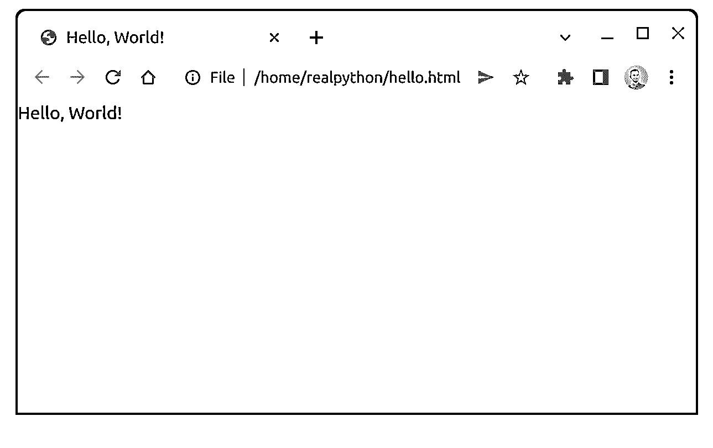
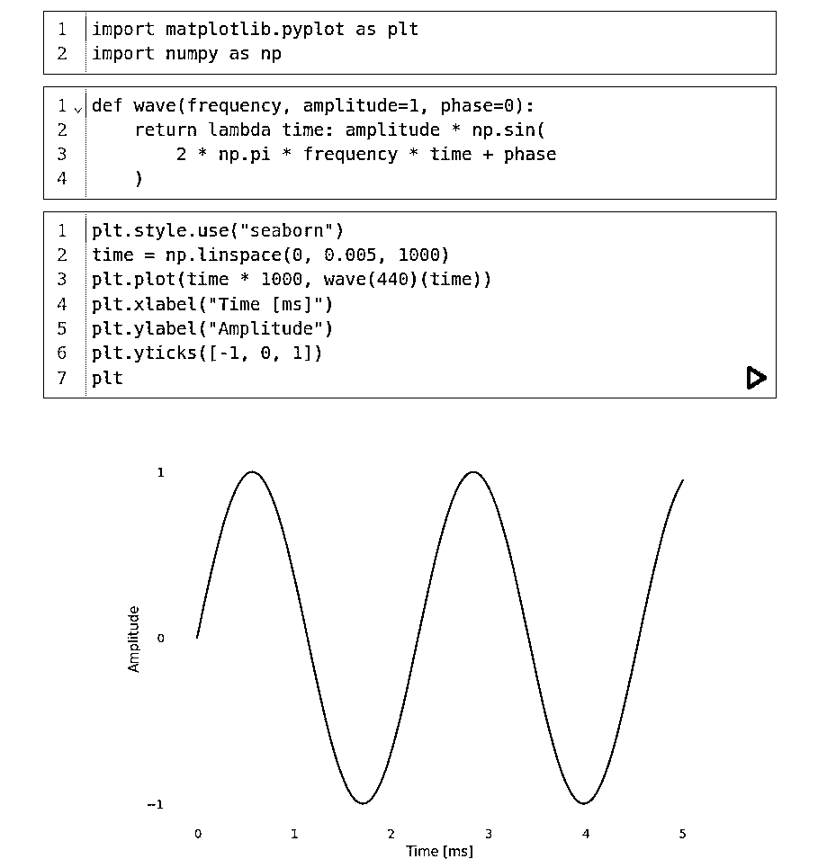
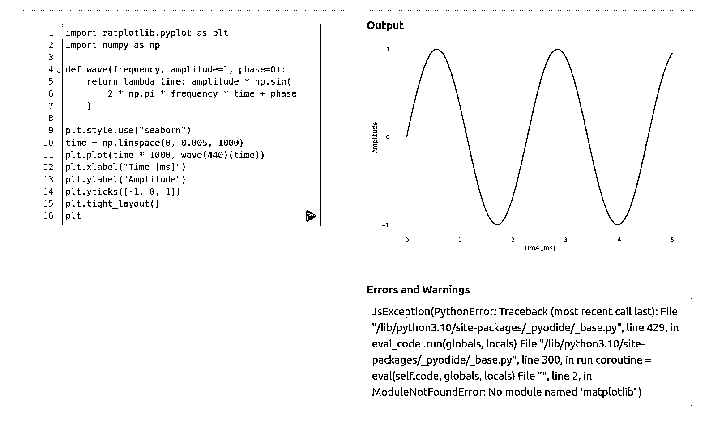

# Web 浏览器中的 PyScript: Python 初探

> 原文：<https://realpython.com/pyscript-python-in-browser/>

PyScript 是一个全新的框架，当 [Anaconda，Inc.](https://www.anaconda.com/) 的首席执行官兼联合创始人[王蒙杰](https://twitter.com/pwang)在 [PyCon US 2022](https://realpython.com/real-python-pycon-us-2022/) 的[主题演讲](https://anaconda.cloud/pyscript-pycon2022-peter-wang-keynote)中透露时，它引起了很多兴奋。虽然这个项目只是一个早期开发阶段的实验，但社交媒体上的人们似乎已经爱上了它。本教程将帮助您快速掌握 PyScript，而官方文档仍在制作中。

**在本教程中，您将学习如何:**

*   使用 Python 和 JavaScript 构建**交互式前端应用**
*   在**网络浏览器**中运行现有的 Python 代码
*   在**后端**和**前端**上重用相同的代码
*   从 **JavaScript** 调用 Python 函数，反之亦然
*   分发零依赖的 Python 程序

为了从本教程中获得最大收益，你最好对 JavaScript 和前端编程有所了解。同时，即使你以前从未做过任何[网站开发](https://realpython.com/learning-paths/become-python-web-developer/)，你也能很好地跟上进度。毕竟，这是 PyScript 背后的全部思想！

**免费下载:** [从 CPython Internals:您的 Python 3 解释器指南](https://realpython.com/bonus/cpython-internals-sample/)获得一个示例章节，向您展示如何解锁 Python 语言的内部工作机制，从源代码编译 Python 解释器，并参与 CPython 的开发。

## 声明:PyScript 是一个实验项目！

本教程是在 PyScript 正式发布后的几周内发布的。在撰写本文时，您会发现框架主页上醒目地显示了以下警告:

> 请注意，PyScript 是非常 alpha 化的，正在大量开发中。有许多已知的问题，从可用性到加载时间，你应该预料到事情会经常改变。我们鼓励人们使用 PyScript 进行游戏和探索，但目前我们不建议将其用于生产。([来源](https://pyscript.net/))

这一点怎么强调都不为过。在您开始之前，请做好准备，不要像本教程中介绍的那样工作。当你读到这篇文章的时候，有些事情可能根本不起作用，而有些问题可能已经以这样或那样的方式解决了。

鉴于 PyScript 相对较短的历史，这并不奇怪。因为是[开源软件](https://en.wikipedia.org/wiki/Open-source_software)，你可以在 GitHub 上一窥它的 [Git 提交历史](https://github.com/pyscript/pyscript/commits/main)。当你这样做的时候，你会发现来自 Anaconda 的[法比奥·普利格](https://twitter.com/b_smoke)，PyScript 的创建者和技术负责人，在 2022 年 2 月 21 日做出了[初始承诺](https://github.com/pyscript/pyscript/commit/bc5875790cf6520e471c16d2932070322cd523a7)。那离 4 月 30 日公开向世界公布也就两个多月！

这就是 PyScript 的现状。如果你准备好冒这个险，想尝试一下这个框架，那么请继续阅读。

[*Remove ads*](/account/join/)

## PyScript 入门

在本节结束时，您将对框架及其构建块有一个大致的了解，包括它们如何一起将 Python 引入您的浏览器。您将知道如何挑选所需的文件并在本地托管 PyScript，而不依赖于互联网连接。

### 用你的头脑思考 PyScript

您可能会问自己 PyScript 到底是什么。这个名字可能是一个聪明的尝试，将它作为浏览器中 JavaScript 的**替代品进行营销，但这样的解释不会给你完整的画面。以下是 PyScript 目前在其 Twitter 个人资料上的宣传方式:**

> PyScript -为 99%的人编程([来源](https://twitter.com/pyscript_dev)

PyScript 的目标之一是让网络成为任何想学习编码的人的友好场所，包括孩子。除了现有的文本编辑器和浏览器之外，该框架不需要任何安装或配置过程就可以实现这一目标。一个副作用是 PyScript 简化了与他人共享您的工作。

当您查看 PyScript 的 [README](https://en.wikipedia.org/wiki/README) 文件时，您会发现以下摘要和更长的描述:

> PyScript 是 Scratch、JSFiddle 和其他“易于使用”的编程框架的 Pythonic 替代品，其目标是使 web 成为一个友好的、可黑客攻击的地方，任何人都可以在那里创作有趣的交互式应用程序。
> 
> (…)
> 
> PyScript 是一个元项目，旨在将多种开放技术结合到一个框架中，允许用户使用 Python 创建复杂的浏览器应用程序。它与 DOM 在浏览器中的工作方式无缝集成，并允许用户以 web 和 Python 开发人员都感觉自然的方式添加 Python 逻辑( [Source](https://github.com/pyscript/pyscript/blob/main/README.md) )

[Scratch](https://scratch.mit.edu/) 是一种相对简单的[可视化编程语言](https://en.wikipedia.org/wiki/Visual_programming_language)，孩子们在学校学习它来构建简单的游戏和有趣的动画。 [JSFiddle](https://jsfiddle.net/) 是 JavaScript 的在线编辑器，通常用于在像 [StackOverflow](https://stackoverflow.com/) 这样的论坛上演示给定问题的解决方案。

此外，PyScript 的主页包含以下标语:

> PyScript 是一个框架，允许用户使用 HTML 的界面和 Pyodide、WASM 和现代 web 技术的力量在浏览器中创建丰富的 Python 应用程序。PyScript 框架为各种经验水平的用户提供了一种富于表现力、易于学习的编程语言，以及无数的应用程序。([来源](https://pyscript.net/#pyscript))

换句话说，PyScript 允许您使用 Python，不管有没有 JavaScript，来构建不一定要与服务器通信的交互式网站。这里的主要好处是，您可以利用现有的 Python 知识进入前端开发的世界，降低进入门槛，使其更容易获得。但是使用 PyScript 还有许多其他好处，稍后您将会了解到。

在稍微更技术的层面上，PyScript 是一个使用 [Svelte 框架](https://svelte.dev/)用 [TypeScript](https://www.typescriptlang.org/) 编写的[单页应用程序(SPA)](https://en.wikipedia.org/wiki/Single-page_application) ，样式为 [Tailwind CSS](https://tailwindcss.com/) ，捆绑 [rollup.js](https://rollupjs.org/guide/en/) 。根据早期 Git commit[中的一条评论](https://github.com/pyscript/pyscript/blob/e6192885559cfe27c514513dc883cbe361e309a4/pyscriptjs/README.md)，该项目基于 Sascha Aeppli 在[博客文章](https://www.liip.ch/en/blog/svelte-typescript-tailwind-setup)中提到的模板，该模板结合了这些工具。

如果不建立在最近版本的 [Pyodide](https://pyodide.org/en/stable/) 之上，PyScript 是不可能的——这是一个用 [emscripten](https://emscripten.org/) 到 [WebAssembly](https://webassembly.org/) 编译的 CPython 解释器，使 Python 能够在浏览器中运行。PyScript 通过封装所需的[样板代码](https://en.wikipedia.org/wiki/Boilerplate_code)在 Pyodide 上提供了一个薄的抽象层，否则您必须使用 JavaScript 自己输入。

如果您不熟悉 Pyodide 和 WebAssembly，请单击展开下面的可折叠部分:


已经有很多在浏览器中运行 Python 代码的尝试，取得了不同程度的成功。主要的挑战是，直到最近，JavaScript 还是 web 浏览器唯一能理解的编程语言。

在浏览器中运行 Python 代码有一些额外的困难要克服。例如，[trans crypt](https://www.transcrypt.org/)[trans piles](https://en.wikipedia.org/wiki/Source-to-source_compiler)将一段 Python 代码转换成类似的 JavaScript 代码片段，而 [Brython](https://realpython.com/brython-python-in-browser/) 是一个用 JavaScript 实现的流线型 Python 解释器。这些和类似的工具并不理想，因为它们依赖于假装是真正的 Python 运行时的东西。

Pyodide 与众不同，因为它利用了 WebAssembly，这是一个由现代 web 浏览器支持的相当新的标准，旨在实现接近本机代码的执行速度。你可以把 WebAssembly 看作浏览器现在理解的第二种“编程语言”。

WebAssembly 是一个成熟的虚拟机，能够运行可移植的字节码，你可以通过编译几乎任何编程语言的源代码来实现。然而，当你查看与 WebAssembly 兼容的语言的[列表时，你不会在那里找到 Python。你能猜到原因吗？](https://webassembly.org/getting-started/developers-guide/)

Python 是一种解释型语言，它没有针对 WebAssembly 的标准编译器。Pyodide 所做的是将整个 [CPython](https://realpython.com/cpython-source-code-guide/) 解释器编译到 WebAssembly 中，让它位于浏览器中并解释 Python 代码，就像它是常规的 Python 解释器一样。

当您忘记了浏览器沙箱及其安全策略的某些限制时，通过 CPython 或 Pyodide 运行代码应该没有功能上的区别，只有性能上的微小差异。Pyodide 和 WebAssembly 使 web 浏览器成为分发 Python 程序的绝佳场所。

为了使 Python 和 web 浏览器之间的集成更加简单，PyScript 定义了几个 [Web 组件](https://developer.mozilla.org/en-US/docs/Web/Web_Components)和定制元素，比如`<py-script>`和`<py-button>`，您可以将它们直接嵌入到 HTML 中。如果您对这些自定义标记名称中的连字符感到困扰，那么不要责怪 PyScript。HTML 规范强制执行它，以避免 Web 组件和未来 HTML 元素之间的名称冲突。

事不宜迟，是时候用 PyScript 写出你的第一个 [`Hello, World!`](https://en.wikipedia.org/wiki/%22Hello,_World!%22_program) 了！

### 写下你的第一句“你好，世界！”在 PyScript 中

开始使用 PyScript 的最快方法是创建一个[最小 HTML5 文档](https://www.sitepoint.com/a-minimal-html-document-html5-edition/)，将其保存在一个本地文件中，比如`hello.html`，并利用 PyScript 主页上的两个必需文件:

```py
<!DOCTYPE html>
<html lang="en">
<head>
  <meta charset="utf-8">
  <meta name="viewport" content="width=device-width, initial-scale=1">
  <title>Hello, World!</title>
 <link rel="stylesheet" href="https://pyscript.net/alpha/pyscript.css" /> <script defer src="https://pyscript.net/alpha/pyscript.js"></script> </head>
<body>
 <py-script>print("Hello, World!")</py-script> </body>
</html>
```

第一个文件`pyscript.css`，为 PyScript 的可视组件提供了默认样式，稍后您将[探索这些组件](#exploring-pyscripts-visual-components)，以及加载器[闪屏](https://en.wikipedia.org/wiki/Splash_screen)。第二个文件`pyscript.js`，包含引导 Python 运行时的 JavaScript，并添加了像`<py-script>`这样的定制元素，它可以保存 Python 指令，比如对 [`print()`](https://realpython.com/python-print/) 函数的调用。

有了这个设置，你*不需要*启动**网络服务器**来访问你的 HTML 内容。自己看吧！继续，将 HTML 文档保存到本地文件，并直接在您喜欢的 web 浏览器中打开它:

[](https://files.realpython.com/media/Screenshot_from_2022-06-02_20-46-11.93deb75be6d6.png)

<figcaption class="figure-caption text-center">PyScript's Hello, World!</figcaption>

恭喜你！您刚刚创建了第一个 PyScript 应用程序，它可以在任何现代网络浏览器上工作，甚至可以在早期的 Chromebook 上工作，而不需要安装 Python 解释器。你可以将你的 HTML 文件复制到 USB 拇指驱动器上，然后交给朋友，即使他们的机器上没有安装 Python，他们也可以运行你的代码。

**注意:** PyScript 只在[谷歌 Chrome](https://www.google.com/chrome/) 上测试过。不幸的是，这意味着您的代码在不同的 web 浏览器上的行为可能会有一些小的差异，这在传统的 Python 开发中是从来没有过的。

接下来，您将了解当您在 web 浏览器中打开该文件时发生了什么。

[*Remove ads*](/account/join/)

### 从互联网上获取 Python 运行时

当你在网络浏览器中打开你的 HTML 文件时，在显示 *Hello，World！*在橱窗里。PyScript 必须从 [jsDelivr CDN](https://www.jsdelivr.com/) ，JavaScript 的免费[内容交付网络](https://en.wikipedia.org/wiki/Content_delivery_network)为开源项目获取一打额外的资源。这些资源组成了 Pyodide 运行时，解压缩后总重量超过 20 兆字节。

幸运的是，您的[浏览器会将这些资源的大部分缓存在内存或磁盘上，这样，在将来，加载时间会明显加快。只要你至少打开过一次 HTML 文件，你就可以不依赖网络连接而离线工作**。**](https://pressidium.com/blog/browser-cache-work/)

依靠 CDN 来交付您的依赖无疑是方便的，但它有时会很脆弱。过去有已知的 cdn 宕机案例，导致大型在线业务中断。因为 PyScript 处于最前沿，所以 CDN 总是提供最新的 [alpha 版本](https://en.wikipedia.org/wiki/Software_release_life_cycle#Alpha)，这有时会带来突破性的变化。相反，CDN 可能偶尔需要时间来跟上 GitHub，所以它可能提供过时的代码。

总是请求特定版本的 PyScript 不是更好吗？

### 下载 PyScript 进行离线开发

如果您不想依赖 PyScript 的托管服务，那么您需要下载在浏览器中运行 Python 所需的所有文件，并自己托管它们。出于开发目的，您可以通过在包含您要托管的文件的目录中发出以下命令来启动一个内置在 Python 中的本地 [HTTP 服务器:](https://docs.python.org/3/library/http.server.html)

*   [*视窗*](#windows-1)
**   [**Linux + macOS**](#linux-macos-1)*

```py
PS> python -m http.server
Serving HTTP on :: port 8000 (http://[::]:8000/) ...
```

```py
$ python -m http.server
Serving HTTP on 0.0.0.0 port 8000 (http://0.0.0.0:8000/) ...
```

默认情况下，它会启动一个服务器监听所有网络接口上的 HTTP 请求，包括[本地主机](https://en.wikipedia.org/wiki/Localhost)，端口号为 8000。如果需要，您可以使用可选参数调整地址和端口号。例如，这将允许您在`http://localhost:8000/hello.html`访问 PyScript 应用程序。

然而，在这样做之前，您需要将`pyscript.css`、`pyscript.js`和`pyscript.py`下载到您的 HTML 文档所在的文件夹中。为此，您可以使用 [Wget](https://en.wikipedia.org/wiki/Wget) 命令行工具，它在 Windows 上的 [PowerShell](https://en.wikipedia.org/wiki/PowerShell) 中有对应的功能，或者手动下载文件:

*   [*视窗*](#windows-2)
**   [**Linux + macOS**](#linux-macos-2)*

```py
PS> foreach ($ext in "css", "js", "py") {
>> wget "https://pyscript.net/alpha/pyscript.$ext" -o "pyscript.$ext"
>> }
```

```py
$ wget https://pyscript.net/alpha/pyscript.{css,js,py}
```

这将一次性下载所有三个文件。助手 Python 模块包含 PyScript 和 Pyodide 所需的[粘合代码](https://en.wikipedia.org/wiki/Glue_code)。您需要下载`pyscript.py`,因为引导脚本将试图从它自己的域地址中获取它，这个地址将是您的本地主机地址。

**注意:**或者，您可以使用可选的[源地图](https://pyscript.net/alpha/pyscript.min.js.map)来获取引导脚本的[缩小版](https://pyscript.net/alpha/pyscript.min.js)，以进一步减少下载量。源代码映射可以让您从缩小的形式恢复源代码，这在调试过程中很有帮助。

不要忘记更新 HTML 中的 CSS 和 JavaScript 路径，以便它们指向本地文件，而不是在线托管的文件:

```py
<!DOCTYPE html>
<html lang="en">
<head>
  <meta charset="utf-8">
  <meta name="viewport" content="width=device-width, initial-scale=1">
  <title>Hello, World!</title>
 <link rel="stylesheet" href="/pyscript.css" /> <script defer src="/pyscript.js"></script> </head>
<body>
  <py-script>print("Hello, World!")</py-script>
</body>
</html>
```

这里，您假设这些资源文件放置在 HTML 文件的旁边，但是您也可以为这些资源创建一个或多个子文件夹以保持有序。

你就快到了。但是，如果您现在将浏览器导航到您的本地服务器，那么它仍然会尝试从 CDN 而不是您的本地 HTTP 服务器获取一些资源。您将在下一节中解决这个问题。

### 下载特定的 Pyodide 版本

既然您已经使 PyScript 脱机工作，那么是时候对 Pyodide 执行类似的步骤了。在 PyScript 的早期，带有 Pyodide 的 URL 是[硬编码的](https://en.wikipedia.org/wiki/Hard_coding)，但是开发人员最近引入了另一个名为`<py-config>`的定制元素，它允许您指定带有所需 Pyodide 版本的 URL:

```py
<!DOCTYPE html>
<html lang="en">
<head>
  <meta charset="utf-8">
  <meta name="viewport" content="width=device-width, initial-scale=1">
  <title>Hello, World!</title>
  <link rel="stylesheet" href="/pyscript.css" />
  <script defer src="/pyscript.js"></script>
  <py-config>
    - autoclose_loader: true
    - runtimes:
      -
 src: "/pyodide.js"        name: pyodide-0.20
        lang: python
  </py-config>
</head>
<body>
  <py-script>print("Hello, World!")</py-script>
</body>
</html>
```

这个可选标签里面的内容是一段 [YAML](https://realpython.com/python-yaml/) 的配置。您可以使用`src`属性提供一个包含在线托管的具体 Pyodide 版本的 URL，或者一个您稍后将下载的本地文件。在上面的代码块中，`"/pyodide.js"`表示相对于本地 HTTP 服务器的根地址的路径，例如，可以扩展为`http://localhost:8000/pyodide.js`。

要获得浏览器将从 CDN 下载或从其缓存加载的剩余文件的最新列表，您可以在刷新页面之前前往 [web 开发工具](https://en.wikipedia.org/wiki/Web_development_tools)并切换到*网络*标签。然而，有可能您最终会需要更多的文件，或者它们的名称将来可能会改变，因此检查网络流量很快就会变成一件麻烦的事情。

出于开发的目的，下载*所有*一个 [Pyodide 版本](https://github.com/pyodide/pyodide/releases)的文件，然后决定你的应用程序真正需要的文件，这可能更方便。因此，如果你不介意下载几百兆字节，那么从 GitHub 中抓取发布版 [tarball](https://en.wikipedia.org/wiki/Tar_(computing)) ，并将其解压到你的`Hello, World!`应用程序的文件夹中:

*   [*视窗*](#windows-3)
**   [**Linux + macOS**](#linux-macos-3)*

```py
PS> $VERSION='0.20.0'
PS> $TARBALL="pyodide-build-$VERSION.tar.bz2"
PS> $GITHUB_URL='https://github.com/pyodide/pyodide/releases/download'
PS> wget "$GITHUB_URL/$VERSION/$TARBALL"
PS> tar -xf "$TARBALL" --strip-components=1 pyodide
```

```py
$ VERSION='0.20.0'
$ TARBALL="pyodide-build-$VERSION.tar.bz2"
$ GITHUB_URL='https://github.com/pyodide/pyodide/releases/download'
$ wget "$GITHUB_URL/$VERSION/$TARBALL"
$ tar -xf "$TARBALL" --strip-components=1 pyodide
```

如果上面的命令在您的操作系统上不起作用，也不用担心。您可以[下载归档文件](https://github.com/pyodide/pyodide/releases/download/0.20.0/pyodide-build-0.20.0.tar.bz2)并手动提取其`pyodide/`子文件夹的内容。

**注意:** Pyodide 的 release tarball 如此之大是因为它捆绑了许多[流行的第三方库](#third-party-libraries-bundled-with-pyodide)，在[数据科学](https://realpython.com/learning-paths/data-science-python-core-skills/)中特别有用，这些库是为 WebAssembly 预编译的。

只要一切顺利，您的应用程序文件夹中至少应该有这 14 个文件:

```py
hello-world/
│
├── distutils.tar
├── hello.html
├── micropip-0.1-py3-none-any.whl
├── packages.json
├── packaging-21.3-py3-none-any.whl
├── pyodide.asm.data
├── pyodide.asm.js
├── pyodide.asm.wasm
├── pyodide.js
├── pyodide_py.tar
├── pyparsing-3.0.7-py3-none-any.whl
├── pyscript.css
├── pyscript.js
└── pyscript.py
```

如您所见，PyScript 是 Python、JavaScript、WebAssembly、CSS 和 HTML 的混合体。在实践中，您将使用 Python 完成大部分 PyScript 编程。

您在本节中采用的方法使您能够更精细地控制 Pyodide 和底层 Python 解释器的版本。要通过 Pyodide 查看哪些 Python 版本可用，可以查看 [changelog](https://pyodide.org/en/stable/project/changelog.html) 。例如，本教程中使用的 Pyodide 0.20.0 是在 CPython 3.10.2 之上构建的。

如果有疑问，您可以亲自验证浏览器中运行的 Python 版本，您将在接下来了解到这一点。

[*Remove ads*](/account/join/)

### 验证您的 Pyodide 和 Python 版本

要检查您的 Pyodide 版本，您需要的只是一行代码。回到您的[代码编辑器](https://realpython.com/python-ides-code-editors-guide/)，用下面的代码片段替换`Hello, World!`代码:

```py
<!DOCTYPE html>
<html lang="en">
<head>
  <meta charset="utf-8">
  <meta name="viewport" content="width=device-width, initial-scale=1">
  <title>Hello, World!</title>
  <link rel="stylesheet" href="/pyscript.css" />
  <script defer src="/pyscript.js"></script>
  <py-config>
    - autoclose_loader: true
    - runtimes:
      -
        src: "/pyodide.js"
        name: pyodide-0.20
        lang: python
  </py-config>
</head>
<body>
 <py-script>import pyodide_js; print(pyodide_js.version)</py-script> </body>
</html>
```

它依赖于自动注入 PyScript 的`pyodide_js`模块。如果 PyScript 没有为给定的特性提供自己的抽象层，您可以使用它直接从 Python 访问 Pyodide 的 JavaScript API。

在 PyScript 中检查 Python 版本看起来与在标准 CPython 解释器中一样:

```py
<py-script>import sys; print(f"Python {sys.version}")</py-script>
```

您从标准库中导入`sys`模块来检查`sys.version`常量，然后用 [f 字符串](https://realpython.com/python-f-strings/)打印它。当您在 web 浏览器中刷新页面并让它重新加载时，它应该会生成一个以如下内容开头的字符串:

> Python 3.10.2 (main，2022 年 4 月 9 日，20:52:01) […]

这是您在命令行中运行交互式 Python 解释器时通常会看到的。在这种情况下，Pyodide 并没有落后于最新的 CPython 版本，在撰写本教程时是 3.10.4。

顺便说一下，你注意到上面例子中的分号(`;`)了吗？在 Python 中，分号分隔出现在一行中的多个语句，这在您编写[单行](https://en.wikipedia.org/wiki/One-liner_program)脚本或受到约束时会很有用，例如，受到 [`timeit`](https://realpython.com/python-timer/#estimating-running-time-with-timeit) 模块的设置字符串的约束。

在 Python 代码中很少使用分号，而且经验丰富的 Python 爱好者通常不赞成使用分号。然而，这个不受欢迎的符号有助于回避 Python 的**重要空格**的问题，这在 PyScript 中有时会变得混乱。在下一节中，您将学习如何处理嵌入在 HTML 中的**块缩进**和 Python 代码格式。

## 处理 Python 代码格式化

当你在一个 HTML 文档中嵌入一段 CSS、JavaScript，甚至是一个 [SVG](https://en.wikipedia.org/wiki/Scalable_Vector_Graphics) 图像时，网络浏览器不会有误解相关代码的风险，因为它们都是[自由格式语言](https://en.wikipedia.org/wiki/Free-form_language)的例子，忽略多余的空格。在这些语言中，您可以随意设置代码的格式，例如，通过删除换行符，而不会丢失任何信息。这使得 JavaScript 的[小型化](https://en.wikipedia.org/wiki/Minification_(programming))成为可能。

不幸的是，这对 Python 来说并不正确，它的语法遵循了[越位规则](https://en.wikipedia.org/wiki/Off-side_rule)，其中每个空格字符都有效。因为 PyScript 是一项如此新颖的技术，今天大多数的**自动代码格式化器**很可能会做出错误的假设，并通过折叠重要的空白来破坏包含在`<py-script>`标签中的 Python 代码。如果发生这种情况，您可能会得到类似于下面的错误:

```py
Traceback (most recent call last):
  ...
  File "<exec>", line 2
    print(f"Python {sys.version}")
IndentationError: unexpected indent
```

在这种情况下，Pyodide 无法解析嵌入在 HTML 中的 Python 代码片段，因为缩进被破坏了。您将在文档正文和 web 开发人员控制台中看到这个[异常](https://realpython.com/python-exceptions/)和相关的[回溯](https://realpython.com/python-traceback/)。

但这还不是全部。如果你在 Python 代码中声明了一个看起来像 HTML 标签的[字符串文字](https://en.wikipedia.org/wiki/String_literal)，那么浏览器会把它识别为 [`HTMLUnknownElement`](https://developer.mozilla.org/en-US/docs/Web/API/HTMLUnknownElement) 并去掉它，只留下里面的文本。以[解析 XML](https://realpython.com/python-xml-parser/) 为例:

```py
<py-script>
import xml.etree.ElementTree as ET
ET.fromstring("<person>John Doe</person>")
</py-script>
```

上面的代码使用 Python 标准库中的 ElementTree API 来解析一个字符串，该字符串包含一个人的 XML 格式的数据记录。但是，传入函数的实际参数将只有`"John Doe"`而没有周围的标签。

注意，从 web 浏览器的角度来看，`<person>`看起来像是嵌套在`<py-script>`父元素下的另一个 HTML 标签。为了避免这种歧义，您可以将尖括号(`<`和`>`)替换为它们的对应编码，称为 [HTML 实体](https://en.wikipedia.org/wiki/List_of_XML_and_HTML_character_entity_references):

```py
<py-script>
import xml.etree.ElementTree as ET
ET.fromstring("&lt;person&gt;John Doe&lt;/person&gt;")
</py-script>
```

`&lt;`实体代表“小于”(`<`)字符，而`&gt;`代替了“大于”(`>`)字符。字符实体允许浏览器按字面意思呈现文本，否则文本会被解释为 HTML 元素。这在 PyScript 中可以工作，但是不能解决缩进问题。

**注意:**在 XML 文档中，您可以将内容包装在一对[字符数据(CDATA)](https://en.wikipedia.org/wiki/CDATA) 标记中，作为使用 HTML 实体的替代方法。不幸的是，大多数 HTML 解析器忽略了 CDATA。

除非您只是在玩 PyScript，否则通常最好将 Python 代码提取到一个单独的文件中，而不是与 HTML 混合在一起。您可以通过在`<py-script>`元素上指定可选的`src`属性来实现这一点，它看起来类似于 JavaScript 的标准`<script>`标记:

```py
<py-script src="/custom_script.py"></py-script>
```

页面一准备好，就会加载并立即[运行你的 Python 脚本](https://realpython.com/run-python-scripts/)。如果您只想将一个定制模块加载到 PyScript 运行时中，以使其可用于[导入](https://realpython.com/python-import/)，那么在下一节中用`<py-env>`检查依赖管理。

**注意:**由于网络浏览器强制实施的[跨来源资源共享(CORS)](https://en.wikipedia.org/wiki/Cross-origin_resource_sharing) 政策，当您将页面作为本地文件打开时，您将无法从外部文件加载 Python 脚本。您需要通过 web 服务器托管带有相关资源的 HTML，比如前面提到的 Python 内置的`http.server`。

你的页面上可以有多个`<py-script>`标签，只要它们出现在页面的`<head>`或`<body>`中。PyScript 会将它们放到一个队列中，并按顺序运行它们。

现在您知道了如何在浏览器中使用 PyScript 运行 Python 代码。然而，大多数实际应用程序需要一个或多个依赖项。在下一节中，您将了解如何利用 Python 现有的“电池”、在 [PyPI](https://pypi.org/) 或其他地方发布的第三方库，以及您自己的 Python 模块。

[*Remove ads*](/account/join/)

## 在 PyScript 中管理 Python 依赖关系

到目前为止，您已经看到了框架提供的`<py-script>`和`<py-config>`定制标签。另一个你经常想使用的元素是`<py-env>`，它有助于管理你的项目依赖，类似于 Python 的`pip`工具。

### Python 标准库中缺少的模块

Python 自带了包含的[电池，这意味着它的](https://docs.python.org/3/tutorial/stdlib.html#batteries-included)[标准库](https://docs.python.org/3/library/)模块已经解决了你在软件开发中可能面临的常见问题。您会发现这些模块中的大多数都有现成的 Pyodide 和 PyScript 版本，让您可以立即导入和使用它们。例如，您已经看到了利用`xml.etree`包解析 XML 文档的代码片段。

然而，由于 web 浏览器的限制和减少下载大小的努力，有一些值得注意的例外。任何与浏览器环境无关的东西都从当前的 Pyodide 版本中删除了。具体而言，这些包括但不限于以下[模块和包](https://realpython.com/python-modules-packages/):

*   `idlelib` ( [集成开发和学习环境](https://realpython.com/python-idle/))
*   [`tkinter`](https://realpython.com/python-gui-tkinter/) ( [GUI 编程](https://realpython.com/learning-paths/python-gui-programming/))
*   [`turtle`](https://realpython.com/beginners-guide-python-turtle/) ( [乌龟图形](https://en.wikipedia.org/wiki/Turtle_graphics))
*   虚拟环境

你可以在 Pyodide 的文档页面上查看[已移除包的完整列表](https://pyodide.org/en/stable/usage/wasm-constraints.html#python-standard-library)。

除此之外，一些包作为占位符保留，一旦 WebAssembly 在未来发展，它们最终可能会得到适当的支持。今天，您可以导入它们，以及依赖于它们的 [`urllib.request`](https://realpython.com/urllib-request/) 等模块，但它们无法工作:

*   [T2`multiprocessing`](https://realpython.com/python-concurrency/)
*   [T2`threading`](https://realpython.com/intro-to-python-threading/)
*   [T2`socket`](https://realpython.com/python-sockets/)

一般来说，不能启动新的进程、线程，或者打开低级别的网络连接。也就是说，在本教程的后面，你会学到一些缓解措施。

在 PyScript 中使用外部库怎么样，您通常将这些库与 [pip](https://realpython.com/what-is-pip/) 一起安装到您的虚拟环境中？

### 与 Pyodide 捆绑的第三方库

Pyodide 是 Mozilla 发起的现已停止的[碘化物](https://alpha.iodide.io/)母项目的衍生项目。它的目标是以类似于 [Jupyter 笔记本](https://realpython.com/jupyter-notebook-introduction/)的方式提供在网络浏览器中进行科学计算的工具，但不需要与服务器通信来运行 Python 代码。因此，研究人员将能够以有限的计算能力为代价，更容易地共享和重用他们的工作。

因为 PyScript 是 Pyodide 的包装器，所以您可以访问许多流行的第三方库，这些库是用 Pyodide 为 WebAssembly 编译的，甚至是那些部分用 C 和 [Fortran](https://en.wikipedia.org/wiki/Fortran) 编写的库。例如，您会在那里找到以下软件包:

*   [美汤](https://realpython.com/beautiful-soup-web-scraper-python/)
*   [散景](https://realpython.com/python-data-visualization-bokeh/)
*   [Matplotlib](https://realpython.com/python-matplotlib-guide/)
*   [NLTK](https://realpython.com/python-nltk-sentiment-analysis/)
*   [NumPy](https://realpython.com/numpy-tutorial/)
*   熊猫
*   [枕头](https://realpython.com/image-processing-with-the-python-pillow-library/)
*   [轨道](https://realpython.com/python-scipy-cluster-optimize/)轨道
*   [SQL 语法](https://realpython.com/python-sqlite-sqlalchemy/)
*   [scikit-learn](https://realpython.com/train-test-split-python-data/)

实际的列表要长得多，并且不仅限于严格为数据科学设计的库。在撰写本教程时，有将近 100 个库捆绑了 Pyodide。你可以查看 Pyodide 官方文档中的[完整列表](https://pyodide.org/en/stable/usage/packages-in-pyodide.html)或者前往相应 GitHub 存储库中的[包/](https://github.com/pyodide/pyodide/tree/main/packages) 文件夹查看最新状态。

即使这些外部库是 Pyodide 版本的一部分，它们也不会自动加载到 Python 运行时中。请记住，每个单独的 Python 模块都必须通过网络获取到您的 web 浏览器中，这需要花费宝贵的时间和资源。当 PyScript 启动时，您的环境只有解释 Python 代码所需的最低限度。

要导入 Python 标准库中不存在的模块，必须通过**在`<py-env>`元素中声明**它们的名称来显式请求它们:

```py
<!DOCTYPE html>
<html lang="en">
<head>
  <meta charset="utf-8">
  <meta name="viewport" content="width=device-width, initial-scale=1">
  <title>Sine Wave</title>
  <link rel="stylesheet" href="https://pyscript.net/alpha/pyscript.css" />
  <script defer src="https://pyscript.net/alpha/pyscript.js"></script>
</head>
<body>
 <py-env> - matplotlib - numpy </py-env>  <py-script>
import matplotlib.pyplot as plt
import numpy as np

time = np.linspace(0, 2 * np.pi, 100)
plt.plot(time, np.sin(time))
plt
  </py-script>
</body>
</html>
```

`<py-env>`元素包含一个 YAML 列表，其中包含要按需获取的库的名称。当你在你的网络开发工具中查看*网络*标签时，你会注意到浏览器从 CDN 服务器或者你的本地 HTTP 服务器下载 NumPy 和 Matplotlib。它还提取了 Matplotlib 所需的几个可传递的依赖项，总计超过 12 兆字节！

**注意:**您可以将`<py-env>`元素放在文档的标题或正文中。尽管 PyScript 中的一些[示例](https://github.com/pyscript/pyscript/tree/main/examples)将这个自定义元素*放在了*的标题和正文之间，但这似乎并不正确，可能并不适用于所有的 web 浏览器。

或者，您可以在 Python 中以编程方式安装依赖关系**，因为 PyScript 公开了 Pyodide 的 [micropip](https://pyodide.org/en/stable/usage/api/micropip-api.html) 工具，它是`pip`的精简版本:**

```py
<py-script>
# Run this using "asyncio"

async def main():
    await micropip.install(["matplotlib", "numpy"])

await loop.run_until_complete(main())

import matplotlib.pyplot as plt
import numpy as np

x = np.linspace(0, 2 * np.pi, 100)
plt.plot(x, np.sin(x))
plt
</py-script>
```

在 PyScript 的全局名称空间中，可以使用代表默认异步事件循环的`micropip`模块和隐式`loop`变量，而无需导入它们。

请注意，您必须通过 Python 的 [asyncio](https://realpython.com/async-io-python/) 包异步调用模块的`.install()`方法[来挂钩到 web 浏览器的](https://realpython.com/python-async-features/) [Fetch API](https://developer.mozilla.org/en-US/docs/Web/API/Fetch_API) 以供 micropip 使用。此外，虽然 [imports style guide](https://realpython.com/python-import/#imports-style-guide) 建议将您的`import`语句放在文件的顶部，但是它们必须放在这里的`await`语句之后，以确保所需的库已经被 micropip 首先获取并安装。

**注意:**如果单词`asyncio`出现在代码中的任何地方，包括注释中，那么 PyScript 将使用 Pyodide 的 [`.runPythonAsync()`](https://pyodide.org/en/stable/usage/api/js-api.html#pyodide.runPythonAsync) 方法异步运行 Python。否则，它会调用同步的 [`.runPython()`](https://pyodide.org/en/stable/usage/api/js-api.html#pyodide.runPython) 对应物，而不让你使用`await`关键字。

如果 Pyodide 在它的捆绑包中没有找到所需的库，那么它将尝试从 Python 包索引(PyPI)中下载它。然而，由于某些运行时限制，并不是所有的库都这样工作。

[*Remove ads*](/account/join/)

### 从 PyPI 下载的纯 Python 轮子

假设您想要创建一个 PyScript 应用程序，它使用 [untangle](https://pypi.org/project/untangle/) 库来解析 XML，这个库既没有与 Pyodide 捆绑在一起，也没有与标准库一起分发。您将以下声明添加到`<py-env>`元素，并在浏览器中重新加载您的页面:

```py
<py-env>
  - untangle
</py-env>
```

Pyodide 联系 PyPI 获取相关联的 [JSON 元数据](https://pypi.org/pypi/untangle/json)，并得出结论，该库没有以预期的 [Python wheel](https://realpython.com/python-wheels/) 格式构建和上传。它只能作为[源代码发行版(sdist)](https://packaging.python.org/en/latest/glossary/#term-Source-Distribution-or-sdist) 使用，这可能需要一个额外的编译步骤。如果库只包含纯 Python 代码也没关系。在这种情况下，Pyodide 需要一个车轮档案，它可以提取并立即开始使用。

有点失望，您用另一个名为 [xmltodict](https://pypi.org/project/xmltodict/) 的 XML 解析库试试运气，它将文档转换成 [Python 字典](https://realpython.com/python-dicts/)而不是对象:

```py
<py-env>
  - xmltodict
</py-env>
```

这一次，[库的元数据](https://pypi.org/pypi/xmltodict/json)表明一个纯 Python 的 wheel 档案是可用的，所以 Pyodide 继续获取它。如果库有自己的依赖项，那么 Pyodide 也会尝试获取它们。然而，在 micropip 中实现的依赖关系解析机制是非常初级的。从现在开始，`xmltodict`库可以导入到 PyScript 应用程序中。

然而，如果您尝试获取一个非纯 Python 库，比如 PostgreSQL 数据库的[二进制驱动程序，那么 Pyodide 会拒绝将其加载到您的运行时中。即使它是为各种平台构建的 Python 轮子，也没有一个适合 WebAssembly。在相应页面点击](https://pypi.org/project/psycopg-binary/) [*下载文件*](https://pypi.org/project/psycopg-binary/#files) 可以查看任意给定库上传到 PyPI 的车轮。

**注意:**通过在`<py-env>`元素中提供包的 URL，您可以有选择地从 PyPI 以外的远程服务器请求包，只要它们是纯 Python 的:

```py
<py-env>
  - http://local-pypi.org:8001/xmltodict-0.13.0-py2.py3-none-any.whl
</py-env>
```

托管这些轮子的服务器必须配置为返回 [CORS 头](https://en.wikipedia.org/wiki/Cross-origin_resource_sharing)，例如`Access-Control-Allow-Origin`。否则，浏览器将拒绝从不同的**来源**(协议、域、端口号)获取数据，并根据其安全策略阻止连接。

此外，依赖关系解析机制对上面的自定义 URL 不起作用。

综上所述，`<py-env>`中列出的第三方库必须是纯 Python 的，并且使用 wheel 格式分发才能被拾取，除非它已经为 WebAssembly 构建并与 Pyodide 捆绑在一起。将一个定制的非纯 Python 库放入 PyScript 是很棘手的。

### 为 WebAssembly 编译的 c 扩展模块

许多 Python 库包含用 C 或其他语言编写的代码，以提高性能，并利用纯 Python 中不可用的特定[系统调用](https://en.wikipedia.org/wiki/System_call)。有几种方法可以与这样的代码交互，但通常的做法是将它封装在一个 [Python C 扩展模块](https://realpython.com/build-python-c-extension-module/)中，该模块可以编译成您平台的本机代码，并在运行时动态加载。

使用 emscripten 编译器，您可以将 WebAssembly 作为目标，而不是特定的计算机体系结构和操作系统。然而，这样做并不容易。即使你知道如何[为 Pyodide 运行时](https://pyodide.org/en/stable/development/new-packages.html)构建一个 Python 轮子，并且你没有被这个过程吓倒，PyScript 的`<py-env>`标签总是期望一个纯 Python 轮子或者一个与 Pyodide 捆绑在一起的包。

要安装包含 WebAssembly 代码的轮子，可以使用前面提到的 Pyodide 的 Python 接口`pyodide_js`调用其 [`loadPackage()`](https://pyodide.org/en/stable/usage/loading-packages.html#loading-packages-with-pyodide-loadpackage) 函数。你也可以在 JavaScript 中直接使用 [Pyodide 的 API，但是它会启动一个独立的运行时，而不是连接到 PyScript 已经创建的运行时。因此，带有 WebAssembly 代码的自定义模块在 PyScript 中是不可见的。](https://pyodide.org/en/stable/usage/api/js-api.html)

加载定制的 C 扩展模块最终会变得更加简单。在此之前，你最好的选择似乎是耐心等待 Pyodide 发布所需的库。或者，您可以使用额外的交叉编译库从源代码构建自己的 Pyodide 运行时。有一个名为 [`pyodide-build`](https://pyodide.org/en/stable/usage/api/pyodide-build-cli.html) 的命令行工具，可以自动完成一些相关步骤。

目前，您可能希望坚持手工编写定制的 Python 模块。

### 定制 Python 模块和数据文件

您可以使用`<py-env>`或 micropip 使您的定制模块可导入 PyScript 应用程序。假设您制作了一个名为`waves.py`的助手模块，它位于`src/`子文件夹中:

```py
# src/waves.py

import numpy as np

def wave(frequency, amplitude=1, phase=0):
    def _wave(time):
        return amplitude * np.sin(2 * np.pi * frequency * time + phase)

    return _wave
```

你的模块名称使用复数形式，避免与标准库中 [`wave`](https://docs.python.org/3/library/wave.html) 模块冲突，用于读写[波形音频文件格式(WAV)](https://en.wikipedia.org/wiki/WAV) 。您的模块定义了一个名为`wave()`的函数，它返回一个[闭包](https://en.wikipedia.org/wiki/Closure_(computer_programming))。闭包所基于的[内部函数](https://realpython.com/inner-functions-what-are-they-good-for/) `_wave()`使用 NumPy 生成一个具有给定频率、振幅和相位的纯[正弦波](https://en.wikipedia.org/wiki/Sine_wave)。

在您可以从内联或源代码脚本将您的模块导入到一个`<py-script>`标签中之前，您需要通过在 YAML 指定一个特殊的`paths`属性，用`<py-env>`将它获取到您的 web 浏览器中:

```py
<!DOCTYPE html>
<html lang="en">
<head>
  <meta charset="utf-8">
  <meta name="viewport" content="width=device-width, initial-scale=1">
  <title>Sine Wave</title>
  <link rel="stylesheet" href="https://pyscript.net/alpha/pyscript.css" />
  <script defer src="https://pyscript.net/alpha/pyscript.js"></script>
</head>
<body>
  <py-env>
    - matplotlib
    - numpy
 - paths: - src/waves.py  </py-env>
  <py-script>
import matplotlib.pyplot as plt
import numpy as np
import waves 
time = np.linspace(0, 2 * np.pi, 100)
plt.plot(time, waves.wave(440)(time)) plt
  </py-script>
</body>
</html>
```

文件路径相对于您的 HTML 页面。和以前一样，由于 CORS 政策，你必须通过网络服务器托管你的文件，该政策不允许通过 [`file://`](https://en.wikipedia.org/wiki/File_URI_scheme) 协议获取额外的文件。

**注意:**不能用`paths`加载 Python 包，只能用模块。如果你有一个纯 Python 包，那么[构建一个轮子分发版](https://realpython.com/pypi-publish-python-package/#build-your-package)，并把它和你的其他文件放在一起，或者[把它上传到 PyPI](https://realpython.com/pypi-publish-python-package/#upload-your-package) 。

从好的方面来说，值得注意的是，虽然您不能将一个目录加载到 PyScript 中，但是您可以滥用`paths`属性将几乎任何文件加载到其中。这包括**数据文件**，如文本 [CSV 文件](https://realpython.com/python-csv/)或二进制 [SQLite 数据库](https://realpython.com/python-sql-libraries/#sqlite):

```py
<!DOCTYPE html>
<html lang="en">
<head>
  <meta charset="utf-8">
  <meta name="viewport" content="width=device-width, initial-scale=1">
  <title>Loading Data</title>
  <link rel="stylesheet" href="https://pyscript.net/alpha/pyscript.css" />
  <script defer src="https://pyscript.net/alpha/pyscript.js"></script>
</head>
<body>
  <py-env>
    - paths:
        - data/people.csv
        - data/people.sql
  </py-env>
  <py-script>
with open("people.csv") as file:
    print(file.read())
  </py-script>
  <py-script>
import sqlite3
  with sqlite3.connect("people.sql") as connection:
    cursor = connection.cursor()
    cursor.execute("SELECT * FROM people")
    for row in cursor.fetchall():
        print(row)
  </py-script>
</body>
</html>
```

请注意，当您使用`<py-env>`获取文件时，您会丢失关于其原始目录结构的信息，因为所有文件都在一个目标目录中结束。当您打开一个文件时，您只指定了它的名称而没有路径，这意味着您的文件必须唯一命名。稍后您将了解如何通过在 Pyodide 中写入虚拟文件系统来缓解这个问题。

好吧。既然您已经知道如何将您的 Python 代码或其他人的代码导入 PyScript，那么您应该学习如何更有效地使用这个框架。

[*Remove ads*](/account/join/)

## 效仿 Python REPL 和 Jupyter 的笔记本

学习 Python 或其任何底层库的一个快速而有趣的方法是在一个**实时解释器会话**中试用它们，也称为[读取-评估-打印-循环(REPL)](https://en.wikipedia.org/wiki/Read%E2%80%93eval%E2%80%93print_loop) 。通过与代码交互，你可以探索哪些[函数](https://realpython.com/defining-your-own-python-function/)和[类](https://realpython.com/python3-object-oriented-programming/#define-a-class-in-python)可用，以及你应该如何使用它们。和 PyScript 没什么区别。

因为 PyScript 的环境需要一段时间来加载，所以每次编辑完代码都刷新页面并不能解决问题。幸运的是，该框架还附带了另一个名为`<py-repl>`的定制元素，它允许您执行小代码片段，而无需重新加载页面。您可以在 HTML 中包含任意数量的这些内容，将它们留空或预先填充一些初始 Python 代码:

```py
<!DOCTYPE html>
<html lang="en">
<head>
  <meta charset="utf-8">
  <meta name="viewport" content="width=device-width, initial-scale=1">
  <title>PyScript REPL</title>
  <link rel="stylesheet" href="https://pyscript.net/alpha/pyscript.css" />
  <script defer src="https://pyscript.net/alpha/pyscript.js"></script>
  <py-env>
    - matplotlib
    - numpy
  </py-env>
</head>
<body>
  <py-repl>
import matplotlib.pyplot as plt
import numpy as np
  </py-repl>
  <py-repl>
def wave(frequency, amplitude=1, phase=0):
    def _wave(time):
        return amplitude * np.sin(2 * np.pi * frequency * time + phase)

    return _wave
  </py-repl>
  <py-repl></py-repl>
</body>
</html>
```

与您已经探索过的元素不同，`<py-repl>`有一个建立在 [CodeMirror](https://codemirror.net/) 编辑器之上的**可视化表示**，它支持主题化语法高亮、自动完成、代码折叠等等。只要已经包含了 PyScript 提供的[默认 CSS 样式表](https://pyscript.net/alpha/pyscript.css)，这个新元素在浏览器中呈现时应该是这样的:

[](https://files.realpython.com/media/pyrepl.7a6b18b5cdae.png)

<figcaption class="figure-caption text-center">PyScript's REPL Resembling a Jupyter Notebook</figcaption>

`<py-repl>`的每个实例都类似于 Jupyter 笔记本中的一个单元格。您可以在单元格中键入多行 Python 代码，然后单击右下角的绿色播放按钮来执行您的代码。你也可以使用 `Shift` + `Enter` 组合键来达到类似的效果。下面是 CodeMirror 提供的几个额外的**键盘快捷键**:

| 行动 | 马科斯 | Windows 和 Linux |
| --- | --- | --- |
| 搜索 | `Cmd` + `F` | `Ctrl` + `F` |
| 选择范围 | `Cmd` + `I` | `Ctrl` + `I` |
| 选择线 | `Ctrl` + `L` | `Alt` + `L` |
| 删除行 | `Cmd`+`Shift`+`K` | `Ctrl`+`Shift`+`K` |
| 在下面插入一行 | `Cmd` + `Enter` | `Ctrl` + `Enter` |
| 向上移动选择 | `Alt` + `Up` | `Alt` + `Up` |
| 向下移动选择 | `Alt` + `Down` | `Alt` + `Down` |
| 转到匹配的括号 | `Cmd`+`Shift`+`\` | `Ctrl`+`Shift`+`\` |
| 缩进 | `Cmd` + `]` | `Ctrl` + `]` |
| 德登特 | `Cmd` + `[` | `Ctrl` + `[` |

上表显示了[默认键映射](https://codemirror.net/doc/manual.html#keymaps)，可以调整它来模仿 [Emacs](https://realpython.com/emacs-the-best-python-editor/) 、 [Vim](https://realpython.com/vim-and-python-a-match-made-in-heaven/) 或 [Sublime Text](https://realpython.com/setting-up-sublime-text-3-for-full-stack-python-development/) 。

如果单元格中的最后一行包含有效的 Python 表达式，那么 PyScript 会将其表示形式追加到单元格的正下方。例如，它可以呈现用 Matplotlib 绘制的图形。当您在浏览器中查看这样的网页时，它确实开始看起来像一个 Jupyter 笔记本。

然而，与 Jupyter 笔记本不同，默认情况下，执行`<py-repl>`不会插入新的单元格。如果您想启用这样的行为，那么将元素的`auto-generate`属性设置为 true:

```py
<py-repl auto-generate="true"></py-repl>
```

现在，当您第一次在这样的单元格中运行代码时，它会在页面底部插入另一个代码。然而，随后的运行不会。这个新单元格本身将具有`auto-generate`属性。

`<py-repl>`元素的另一个默认行为是为 Python 输出和回溯添加新的 [`<div>`](https://developer.mozilla.org/en-US/docs/Web/HTML/Element/div) 容器。您可以有选择地将**标准输出**和**标准错误**流重定向到页面上单独的自定义元素，让您在浏览器中设计一个[类似 IDE 的环境](https://realpython.com/python-ides-code-editors-guide/):

[](https://files.realpython.com/media/pyrepl-ide.309c6a96f2a0.png)

<figcaption class="figure-caption text-center">Custom PyScript Playground in the Web Browser</figcaption>

下面是上面截图中描述的网页代码:

```py
<!DOCTYPE html>
<html>
<head>
  <meta charset="utf-8">
  <meta name="viewport" content="width=device-width, initial-scale=1">
  <title>PyScript Playground</title>
  <link rel="stylesheet" href="https://pyscript.net/alpha/pyscript.css" />
  <script defer src="https://pyscript.net/alpha/pyscript.js"></script>
  <style> body  { background-color:  #eee; } .container  { display:  grid; grid-template-columns:  1fr  1fr; grid-auto-rows:  minmax(200px,  auto); grid-gap:  1em; margin-top:  1em; } .container  >  div:first-child  { grid-row:  1/3; } .container  >  div  { background-color:  #fff; box-shadow:  0px  5px  10px  #ccc; padding:  10px; } </style>
  <py-env>
    - matplotlib
    - numpy
  </py-env>
</head>
<body>
  <div class="container">
    <div>
 <py-repl std-out="output" std-err="errors"></py-repl>    </div>
    <div>
      <b>Output</b><hr>
      <div id="output"></div>
    </div>
    <div>
      <b>Errors and Warnings</b><hr>
      <div id="errors"></div>
    </div>
  </div>
</body>
</html>
```

使用`std-out`和`std-err`属性来指定相应的目标元素 id。如果您想将这两个流合并到一个元素中，那么您可以使用`output`属性。同样的属性也适用于您之前看到的`<py-script>`元素。

PyScript 目前提供的其余元素是可视组件，也称为**小部件**，它们简化了 HTML 和 Python 的工作。现在您将探索它们。

## 探索 PyScript 的可视化组件

PyScript 提供的可视化组件是 HTML 元素的方便包装器，这对于没有太多 web 开发经验的初学者可能很有帮助，尤其是在客户端。然而，这些小部件是高度实验性的，功能有限，将来可能会被删除。有时，它们在 Pyodide 完全初始化之前加载得太快，这会导致错误。使用它们需要您自担风险！

[*Remove ads*](/account/join/)

### PyTitle

使用 PyTitle 元素，您可以快速地将一个**文本头**添加到您的网页中，如果您链接了 PyScript 附带的默认 CSS 样式表，它将以大写字母出现并水平居中。下面是如何在 HTML 代码中使用这个小部件:

```py
<py-title>PyScript Playground</py-title>
```

它是一个纯粹的可视化组件，没有额外的属性或行为，只接受开始和结束标记之间的纯文本内容。

### 宝盒〔t0〕

PyBox 是一个容器元素，可以使用[CSS Flexbox](https://en.wikipedia.org/wiki/CSS_Flexible_Box_Layout)T5】布局模型在水平方向排列其子元素。它目前使用 [Tailwind CSS 宽度类](https://tailwindcss.com/docs/width#fixed-widths)，如`w-1`、`w-1/2`或`w-full`，来定义列宽。

**注意:**当你读到这里的时候， [Tailwind 很可能已经被 PyScript 中的纯 CSS](https://github.com/pyscript/pyscript/issues/446) 所取代，所以下面的代码可能无法工作，或者可能需要一些调整。这一步的主要动机是减少各种资源的下载量。

您可以通过`<py-box>`父元素的可选`widths`属性来指定子元素的宽度:

```py
<py-box widths="2/3;1/6;1/6">
  <div>Wide Column</div>
  <div>Narrow Column</div>
  <div>Narrow Column</div>
</py-box>
```

请注意，您只提供了 CSS 类名中位于前缀`w-`之后的部分，并且使用分号(`;`)来分隔宽度。在上面的例子中，第一个`<div>`将占据该行可用空间的三分之二(⅔)，而其他两个元素合起来将占三分之一(⅙ + ⅙ = ⅓).)如果你跳过`widths`属性，那么所有的子节点将被拉伸到相同的大小。

### PyButton

PyButton 是 PyScript 中第一个**交互式小部件**，它允许您调用 Python 函数来响应用户操作，比如单击鼠标按钮。为了处理 JavaScript 的[点击事件](https://developer.mozilla.org/en-US/docs/Web/API/Element/click_event)，在`<py-button>`元素中定义一个名为`on_click()`的内嵌函数:

```py
<py-button label="Click me" styles="btn big">
def on_click(event):
    print(event)
</py-button>
```

这个函数是一个[回调](https://en.wikipedia.org/wiki/Callback_(computer_programming))，它接受一个[指针事件](https://developer.mozilla.org/en-US/docs/Web/API/PointerEvent)对象，不返回任何内容。虽然不可能附加一个在别处定义的回调，但是你总是可以委托给一些帮助函数。如果您不喜欢 PyButton 的默认外观，那么您可以通过`styles`属性用一个或多个 CSS 类覆盖它。

PyButton 支持的另一个事件是[焦点事件](https://developer.mozilla.org/en-US/docs/Web/API/Element/focus_event)，您可以通过定义`on_focus()`函数来监听它。它将接收 [FocusEvent](https://developer.mozilla.org/en-US/docs/Web/API/FocusEvent) 对象作为参数。

可悲的是，由于 PyScript 和 Pyodide 的开发速度太快，后者在 0.19 版本中通过[修复一个内存泄漏](https://github.com/pyodide/pyodide/issues/1853)引入了一个突破性的变化，意外地使 PyButton 停止工作。同样的问题也适用于 PyInputBox，您将在接下来了解它。希望在你读到这篇文章的时候，这两个小部件都已经被修复了。

### 查询输入盒

PyInputBox 是 PyScript 中目前可用的最后一个小部件，它包装了 HTML 的**输入元素**，并允许您在其上监听[按键事件](https://developer.mozilla.org/en-US/docs/Web/API/Document/keypress_event):

```py
<py-inputbox>
def on_keypress(event):
    print(event)
</py-inputbox>
```

请注意，keypress 事件已被弃用，取而代之的是 PyInputBox 尚不支持的 [keydown 事件](https://developer.mozilla.org/en-US/docs/Web/API/Document/keydown_event)。因此，您可能会发现直接从 PyScript 访问和操作标准 HTML 元素不那么麻烦，因为没有可能会中断的额外抽象层。

[*Remove ads*](/account/join/)

## 使用 PyScript 查找和操作 HTML 元素

WebAssembly 目前不允许与[文档对象模型(DOM)](https://realpython.com/python-xml-parser/#document-object-model-dom) 直接交互，这通常会让您访问 HTML 的底层元素。相反，您必须使用 JavaScript 来查询和遍历 DOM 树。由于 [Pyodide 的代理对象](https://pyodide.org/en/stable/usage/type-conversions.html#type-translations-pyproxy)，访问 Python 中的 JavaScript 对象成为可能，这促进了两种语言之间的翻译。在 PyScript 中，有两种方法可以将它们用于 DOM 操作。

### 用于 JavaScript 代理的 PyScript 适配器

对于琐碎的用例，当您很着急并且不介意缺少额外的附加功能时，您可以尝试一下 PyScript 的`Element`类。它已经在您的全局名称空间中，这意味着您不必导入它。类允许您仅通过 ID 查找 HTML 元素，并在有限的范围内修改它们的内容。

考虑下面的 HTML 文档示例:

```py
<!DOCTYPE html>
<html>
<head>
  <meta charset="utf-8">
  <meta name="viewport" content="width=device-width, initial-scale=1">
  <title>DOM API in PyScript</title>
  <link rel="stylesheet" href="https://pyscript.net/alpha/pyscript.css" />
  <script defer src="https://pyscript.net/alpha/pyscript.js"></script>
  <style> .crossed  { text-decoration:  line-through; } </style>
</head>
<body>
  <div id="shopping-list">
    <p>Shopping List</p>
    <ul>
      <li class="crossed">milk</li>
      <li class="crossed">eggs</li>
      <li>bread</li>
    </ul>
    <input id="new-item" type="text" placeholder="Add new item">
    
  </div>
  <py-repl></py-repl>
</body>
</html>
```

这是一个购物清单，上面有一些划掉的项目，底部有一个输入框，用于添加要购买的新项目。当您在 web 浏览器中打开这个页面时，`<py-repl>`元素将允许您交互式地测试和使用 PyScript API。

假设您想要确定用户在输入框中输入了哪个新的购物项目，然后您想要清除它。这里有一段 Python 代码，当它被放在`<py-script>`或`<py-repl>`标签中时，就能做到这一点:

```py
input_new_item = Element("new-item")
print(input_new_item.value)
input_new_item.clear()
```

首先，通过调用带有 HTML `id`属性`"new-item"`作为参数的`Element()` [类构造函数](https://realpython.com/python-class-constructor/)，获取对`<input>`元素的引用。然后，打印元素的`.value`属性，并调用`.clear()`来重置它的值。在看到任何结果之前，您需要在输入框中键入一些内容。

`Element`类还有其他有价值的属性，它们是只读的，还有一些方法可以调用来改变元素的样式或状态:

| 成员 | 描述 |
| --- | --- |
| `.element` | JavaScript 的 HTML 元素的代理对象 |
| `.id` | HTML 元素的`id`属性的字符串值(如果存在) |
| `.value` | HTML 元素的`.value`属性的字符串值(如果存在) |
| `.add_class()` | 添加一个或多个 CSS 类 |
| `.remove_class()` | 移除一个或多个 CSS 类 |
| `.write()` | 更新`.innerHTML`属性或添加一个全新的`<div>`元素 |
| `.clear()` | 清除`.value`或`.innerHTML`属性 |
| `.clone()` | 克隆元素并将其深层副本插入到 DOM 树中 |
| `.select()` | 使用 CSS 选择器找到一个后代`Element` |

在任何时候，您都可以通过`.element`属性深入到 PyScript 包装的实际 [`HTMLElement`](https://developer.mozilla.org/en-US/docs/Web/API/HTMLElement) 代理。`.select()`方法是一个有趣的方法，因为它允许您使用任何 CSS 选择器而不仅仅是普通的 ID 来查找嵌套在容器元素中的后代元素。例如，您可以找到第一个被划掉的列表项并从中删除`crossed` CSS 类，同时将它添加到列表的最后一个元素:

```py
shopping_list = Element("shopping-list")
shopping_list.select("ul > li.crossed").remove_class("crossed")
shopping_list.select("ul > li:last-child").add_class("crossed")
```

当您通过 PyScript REPL 运行这段代码时，牛奶*将不再被删除，而面包*将被删除。下次运行时，*蛋*也会变得不交叉。

**注意:**学习 CSS 选择器语法有时会令人沮丧，但也不尽然！掌握它的最好方法是通过练习和获得快速的视觉反馈。有许多有趣的互动游戏[，带你一步步地完成这个过程。最受欢迎的是](https://medium.com/geekculture/learn-css-by-playing-games-cf70a79a38) [CSS Diner](https://flukeout.github.io/) ，它紧扣烹饪主题。

这就是用 PyScript 的`Element`类可以做的所有事情。为了最终控制 DOM 树和您的设备，您需要使用代理对象本身。

### Pyodide 的 JavaScript 代理

首先在 PyScript 代码中导入 Pyodide 提供的`js`模块:

```py
import js

print(js.window.innerWidth)
print(js.document.title)
js.console.log("Hello from Python!")
```

这个模块打开了 JavaScript 的全局名称空间，展示了您的函数和变量，以及 web 浏览器隐式提供的对象。其中包括 [`window`](https://developer.mozilla.org/en-US/docs/Web/API/Window) 和 [`document`](https://developer.mozilla.org/en-US/docs/Web/API/Document) 对象，以及`HTMLElement`数据类型，这是您在操作 DOM 时最感兴趣的。

注意，为了方便起见，PyScript 已经将一些东西从`js`模块导入到 Python 的全局名称空间中。特别是， [`console`](https://developer.mozilla.org/en-US/docs/Web/API/console) 和`document`对象已经存在:

```py
<py-script>
console.log("This looks like JavaScript, but it's Python!")
console.log(document.title)
</py-script>
```

您不必再自己导入它们或者在它们的名称前加上`js`模块，这使得 Python 在您眯着眼睛看的时候看起来很像 JavaScript。

好的，根据输入框的值，将前面部分中的新商品添加到购物列表中怎么样？下面是如何利用 PyScript 中的 [DOM API](https://developer.mozilla.org/en-US/docs/Web/API/Document_Object_Model) 来实现这一点:

```py
input_new_item = document.querySelector("#new-item")

if input_new_item.value:
    child = document.createElement("li")
    child.innerText = input_new_item.value

    parent = document.querySelector("#shopping-list ul")
    parent.appendChild(child)

    input_new_item.value = ""
```

这对于以前使用纯 JavaScript 构建过 web 用户界面的人来说应该很熟悉。使用 CSS 选择器在整个 HTML 文档中查询`<input>`元素。如果用户在输入框中输入了一些值，那么创建一个新的列表项元素(`<li>`)并使用`.innerText`属性填充它。接下来，找到父元素`<ul>`并追加子元素。最后，清除输入框。

**注:**人们通常将纯 JavaScript 称为*香草* JavaScript。这个术语是由 [Eric Wastl](https://realpython.com/interview-eric-wastl/) 创造的，他是代码的[降临的创造者，他创建了](https://realpython.com/python-advent-of-code/) [Vanilla JS](http://vanilla-js.com/) 网站，作为一个笑话来强调你不需要像 [React](https://reactjs.org/) 这样的框架来创建前端应用程序。

在 PyScript 中使用`document`对象可以更疯狂。例如，通过结合 Python 和 JavaScript 的 API，可以编写看起来像两者混合的代码:

```py
from random import choice, randint

colors = ["azure", "beige", "khaki", "linen", "skyblue"]
for li in document.querySelectorAll("#shopping-list li"):
    if not li.hasAttribute("data-price"):
        li.dataset.price = randint(1, 15)
    li.classList.toggle("crossed")
    li.style.backgroundColor = choice(colors)
```

在这种情况下，您从 Python 标准库中导入一些函数来[生成随机值](https://realpython.com/python-random/)，并且您还利用了 Python 语法，例如，迭代一个包装在代理对象中的 [JavaScript 数组](https://developer.mozilla.org/en-US/docs/Web/JavaScript/Reference/Global_Objects/Array)。该循环遍历购物清单项目，有条件地为每个项目分配一个随机价格，切换它们的 CSS 类，并选择一个随机的背景颜色。

web 浏览器公开的 DOM API 太丰富了，不适合本教程，但是可以随意展开下面的可折叠部分，快速参考`HTMLElement`类最重要的属性和方法:


在 JavaScript 中，每个 HTML 元素都有以下属性:

| 属性 | 描述 |
| --- | --- |
| `.classList` | 一个类似列表的对象，带有元素的 CSS 类名 |
| `.className` | 带有元素的`class`属性值的字符串 |
| `.dataset` | 一个类似字典的对象，带有自定义的键值对 |
| `.innerHTML` | 在开始和结束标记之间有 HTML 内容的字符串 |
| `.innerText` | 在开始和结束标记之间有文本内容的字符串 |
| `.style` | 包含 CSS 样式声明的对象 |
| `.tagName` | HTML 元素标记的大写名称 |

这些属性大多支持读写。除此之外，您还可以找到与当前元素相关的 DOM 树遍历相关的属性:

| 属性 | 描述 |
| --- | --- |
| `.parentElement` | 此元素的父元素 |
| `.children` | 直接子元素的类似列表的对象 |
| `.firstElementChild` | 第一个子元素 |
| `.lastElementChild` | 最后一个子元素 |
| `.nextElementSibling` | 同一树级别上的下一个元素 |
| `.previousElementSibling` | 同一树级别上的前一个元素 |

要操作此处未列出的通用属性，可以对元素调用以下方法:

| 方法 | 描述 |
| --- | --- |
| `.hasAttribute()` | 检查元素是否有给定的属性 |
| `.getAttribute()` | 返回给定属性的值 |
| `.setAttribute()` | 分配或覆盖属性值 |
| `.removeAttribute()` | 从元素中删除属性 |

一旦有了对某个元素的对象引用，您可能希望通过使用 CSS 选择器查找它的后代来缩小搜索空间，同时忽略文档中的其余分支:

| 方法 | 描述 |
| --- | --- |
| `.querySelector()` | 返回匹配给定 CSS 选择器的嵌套元素 |
| `.querySelectorAll()` | 返回匹配给定 CSS 选择器的嵌套元素的类似列表的对象 |

这两个方法的工作方式与它们在`document`对象中的对应方法相同。此外，您将能够使用以下方便的方法修改 DOM 树的结构:

| 方法 | 描述 |
| --- | --- |
| `.cloneNode()` | 创建元素的浅层或深层副本 |
| `.appendChild()` | 添加一个新元素作为最后一个子元素 |
| `.insertBefore()` | 在指定的子元素之前插入新元素 |
| `.removeChild()` | 移除给定的子元素 |
| `.replaceChild()` | 用另一个元素替换给定的子元素 |

最后，您将希望通过使元素响应 DOM 事件(通常由用户操作引起)来为元素添加行为:

| 方法 | 描述 |
| --- | --- |
| `.addEventListener()` | 注册给定事件类型的回调 |
| `.removeEventListener()` | 注销给定事件类型的回调 |

要使用它们，您需要了解如何在 PyScript 中创建回调函数，接下来您将了解这一点。

为了让购物清单变得有用，它需要变得具有交互性。但是在 PyScript 中如何处理 [DOM 事件](https://developer.mozilla.org/en-US/docs/Web/Events)，比如鼠标点击？答案是你注册了一个回调函数！

[*Remove ads*](/account/join/)

### Python 事件回调代理

您已经编写了基于输入框中的值创建新列表项的代码。然而，它不依赖于页面上的任何可视组件，因为您必须通过`<py-repl>`元素手动运行它。如果点击*添加*按钮为你触发代码就好了。

首先，您需要将现有代码封装在一个函数中，该函数将 DOM 事件作为参数。在 JavaScript 中，您可以跳过不需要的参数，但是因为您正在编写 Python 函数，所以它的[签名](https://en.wikipedia.org/wiki/Type_signature)必须更加明确:

```py
def on_add_click(event):
    # ...
```

`event`参数将不会被使用和忽略，但没关系。假设你已经准备好了你的函数，是时候告诉浏览器什么时候调用它了。您可以通过向一个应该触发动作的元素添加一个**事件监听器**来实现。在这种情况下，该元素是按钮，您可以使用适当的 CSS 选择器找到它，事件名称是`"click"`:

```py
button = document.querySelector("button")
button.addEventListener("click", on_add_click)
```

上面代码块中的第二行添加了侦听器，它似乎可以工作而不会发出任何错误。然而，当你尝试点击浏览器中的按钮时，什么也不会发生。

**注意:**每当浏览器没有按预期运行时，您都有可能在开发工具控制台中找到错误的更多细节，因此在开发时保持它打开是一个好主意。

web 浏览器需要一个 JavaScript 回调，但是您给了它一个 Python 函数。为了解决这个问题，您可以通过使用`pyodide`模块中的相关函数，从 Python callable 中[创建一个代理对象](https://pyodide.org/en/stable/usage/api/python-api.html#pyodide.create_proxy):

```py
from pyodide import create_proxy 
button = document.querySelector("button") button.addEventListener("click", create_proxy(on_add_click))
```

就是这样！现在，您可以用一个包含完整 Python 代码的`<py-script>`标签替换您的`<py-repl>`标签，并且您可以开始享受您的第一个交互式 PyScript 应用程序了。下面是生成的 HTML 文档结构:

```py
<!DOCTYPE html>
<html>
<head>
  <meta charset="utf-8">
  <meta name="viewport" content="width=device-width, initial-scale=1">
  <title>DOM API in PyScript</title>
  <link rel="stylesheet" href="https://pyscript.net/alpha/pyscript.css" />
  <script defer src="https://pyscript.net/alpha/pyscript.js"></script>
  <style> .crossed  { text-decoration:  line-through; } </style>
</head>
<body>
  <div id="shopping-list">
    <p>Shopping List</p>
    <ul>
      <li class="crossed">milk</li>
      <li class="crossed">eggs</li>
      <li>bread</li>
    </ul>
    <input id="new-item" type="text" placeholder="Add new item">
    
  </div>
 <py-script> from pyodide import create_proxy   def on_add_click(event):
 input_new_item = document.querySelector("#new-item")   if input_new_item.value: child = document.createElement("li") child.innerText = input_new_item.value   parent = document.querySelector("#shopping-list ul") parent.appendChild(child)   input_new_item.value = ""   button = document.querySelector("button") button.addEventListener("click", create_proxy(on_add_click))
  </py-script>
</body>
</html>
```

由于调用相同的 API，等效的 JavaScript 代码将占用相同的空间。一方面，使用代理对象增加了更多的字符，但另一方面，Python 不需要像 JavaScript 那样用花括号来分隔每个代码块。

**注意:**根据经验，您应该倾向于从 web 服务器上托管的单独文件中获取 Python 代码，以避免缩进问题。如果没有，记得在`<py-script>`标签中正确缩进内联代码。只要您将这样的代码与行首对齐，并且不运行任何代码格式化工具，那么 PyScript 解析它应该没有问题。

除了使用 DOM API 查找和操作 HTML 元素之外，您还可以在 PyScript 中做更多与 web 浏览器相关的酷事情。在下一节中，您将仔细查看前端编程的一些剩余元素，这些元素通常必须用 JavaScript 编写。

## 通过 Python 与网络浏览器接口

在传统的前端开发中，你对 JavaScript 引擎的依赖程度不亚于你的执行环境提供的 T2 API 集，它们是等式的两个独立部分。虽然 JavaScript 的核心相对较小，并且在不同的供应商中表现得相当一致，但是 API 的前景可能会因目标平台的不同而有很大的不同。

您可以将 JavaScript 用于在 [Node.js](https://nodejs.org/en/) 中运行的服务器端代码、在 web 浏览器中执行的客户端代码，甚至是支持移动应用的代码。顺便说一句，利用一些独特的 API，在后端 Node.js 中运行 PyScript 在技术上是可能的。然而，在这一节中，您将关注浏览器 API。

### 饼干

在没有任何外部库的帮助下，使用普通 JavaScript 中的[HTTP cookie](https://en.wikipedia.org/wiki/HTTP_cookie)会变得笨拙，因为它迫使您解析一个包含给定域中所有 cookie 的完整信息的长字符串。相反，在 JavaScript 中定义一个新的 cookie 需要手动连接一个字符串和所需的属性。幸运的是，PyScript 允许您使用 Python，它附带了电池。

触手可及的电池之一是 [`http.cookies`](https://docs.python.org/3/library/http.cookies.html) 模块，它可以为您完成 cookie 字符串解析和编码。要解析 JavaScript 的`document.cookie`属性，使用 Python 中可用的`SimpleCookie`类:

```
from http.cookies import SimpleCookie

for cookie in SimpleCookie(document.cookie).values():
    print(f"🍪 {cookie.key} = {cookie.value}")
```py

Python helper 类能够解析服务器通常发送给浏览器的带有 cookie 属性的整个字符串。然而，在 JavaScript 中，您只能看到非 HttpOnly cookies 的名称和相应的值，而看不到它们的属性。

使用下面的代码片段为当前域指定一个将在一年后过期的新 cookie。作为一个好公民，您还应该显式设置 [SameSite](https://developer.mozilla.org/en-US/docs/Web/HTTP/Headers/Set-Cookie/SameSite) 属性，以避免依赖默认行为，默认行为因浏览器及其版本而异:

```
from datetime import timedelta
from http.cookies import SimpleCookie

cookies = SimpleCookie()
cookies["dark_theme"] = "true"
cookies["dark_theme"] |= {
    "expires": int(timedelta(days=365).total_seconds()),
    "samesite": "Lax"
}

document.cookie = cookies["dark_theme"].OutputString()
```py

诚然，这个模块的界面看起来相当过时，不符合[python 风格](https://realpython.com/learning-paths/writing-pythonic-code/)，但它完成了工作。当您运行这段代码并检查您的浏览器 cookie 时，您会看到一个新的设置为 true 的`dark_theme` cookie。您可以调整秒数，看看您的浏览器是否在指定时间后删除了 cookie。

您可以选择生成一个带有附加属性的 [`Set-Cookie`](https://developer.mozilla.org/en-US/docs/Web/HTTP/Headers/Set-Cookie) 头字符串，其中一些属性在 JavaScript 中是不允许的:

```
from http.cookies import SimpleCookie

cookies = SimpleCookie()
cookies["session_id"] = "1ddb897c43fc5f1b773cc5af6cfbe4cf"
cookies["session_id"] |= {
    "httponly": True,
    "secure": True,
    "samesite": "Strict",
    "domain": "your-domain.org",
    "path": "/",
    "max-age": str(int(timedelta(hours=8).total_seconds())),
}

print(cookies["session_id"])
```py

上面的代码将产生下面一长行代表 HTTP 头的文本，它被分割以适合您的屏幕并避免水平滚动:

```
Set-Cookie: session_id=1ddb897c43fc5f1b773cc5af6cfbe4cf;
⮑ Domain=your-domain.org;
⮑ HttpOnly;
⮑ Max-Age=28800;
⮑ Path=/;
⮑ SameSite=Strict;
⮑ Secure
```py

您不能自己设置这样的 cookie，因为它指定了 JavaScript 中不允许的某些属性，但是在获取一些数据时，从 web 服务器接收一个 cookie 是可能的。

[*Remove ads*](/account/join/)

### 获取 API

当用 JavaScript 从 web 浏览器发出 HTTP 请求时，您会受到几个**安全策略**的约束，这给不了您作为后端开发人员所习惯的自由。此外，JavaScript 固有的[异步模型](https://developer.mozilla.org/en-US/docs/Learn/JavaScript/Asynchronous/Introducing)不能很好地与 Python 的同步功能进行网络连接。因此，像`urllib.request`或`socket`这样的模块在 PyScript 中毫无用处。

Pyodide 建议用 web API 编写 HTTP 客户端，比如基于承诺的[Fetch API。为了使从 Python 调用 API 更加简单，Pyodide 提供了`pyfetch()`包装函数，它在异步上下文中工作。](https://developer.mozilla.org/en-US/docs/Learn/JavaScript/Asynchronous/Promises)

如果你想发出一个 [REST API](https://realpython.com/api-integration-in-python/) 请求，比如用用户名和密码验证你自己，那么你可以调用`pyfetch()`，它的签名类似于 JavaScript 的`fetch()`函数:

```
 1# Run this using "asyncio"
 2
 3import json
 4
 5from pyodide.http import pyfetch
 6from pyodide import JsException
 7
 8async def login(email, password):
 9    try:
10        response = await pyfetch(
11            url="https://reqres.in/api/login",
12            method="POST",
13            headers={"Content-Type": "application/json"},
14            body=json.dumps({"email": email, "password": password})
15        )
16        if response.ok:
17            data = await response.json()
18            return data.get("token")
19    except JsException:
20        return None
21
22token = await loop.run_until_complete(
23    login("eve.holt@reqres.in", "cityslicka")
24)
25print(token)
```py

单词`asyncio`出现在上面代码片段顶部的注释中，它告诉 PyScript 异步运行这段代码，以便您可以在底部等待事件循环。请记住，您可以将这个神奇的单词放在代码中的任何位置来触发相同的动作，这在当前就像是施法一样。也许最终会有一种更明确的方式来切换这种行为——例如，通过`<py-script>`标签上的属性。

当您用电子邮件地址和密码调用`login()` [协程](https://docs.python.org/3/glossary.html#term-coroutine)时，您向在线托管的[假 API](https://reqres.in/) 发出 HTTP POST 请求。注意，在 Python 中，使用`json`模块而不是 JavaScript 的`JSON`对象将有效负载序列化为 [JSON。](https://realpython.com/python-json/)

你也可以使用`pyfetch()`下载文件，然后保存到 Pyodide 的 emscripten 提供的[虚拟文件系统](https://pyodide.org/en/latest/usage/file-system.html)。请注意，这些文件只能通过 I/O 界面在您当前的浏览器会话中看到，但您不会在磁盘上的`Downloads/`文件夹中找到它们:

```
# Run this using "asyncio"

from pathlib import Path

from pyodide.http import pyfetch
from pyodide import JsException

async def download(url, filename=None):
    filename = filename or Path(url).name
    try:
        response = await pyfetch(url)
        if response.ok:
            with open(filename, mode="wb") as file:
                file.write(await response.bytes())
    except JsException:
        return None
    else:
        return filename

filename = await loop.run_until_complete(
    download("https://placekitten.com/500/900", "cats.jpg")
)
```py

除非您想以不同的名称保存文件，否则您可以使用 [`pathlib`](https://realpython.com/python-pathlib/) 模块从您的函数将返回的 URL 中提取文件名。由`pyfetch()`返回的响应对象有一个[可修改的](https://docs.python.org/3/glossary.html#term-awaitable) `.bytes()`方法，您可以用它将二进制内容保存到一个新文件中。

**注意:**您试图下载文件的服务器必须配置为返回适当的 CORS 头，否则浏览器将阻止您的获取请求。

稍后，您可以从虚拟文件系统中读取下载的文件，并将其显示在 HTML 中的一个``元素上:

```
import base64

data = base64.b64encode(open(filename, "rb").read()).decode("utf-8")
src = f"data:image/jpeg;charset=utf-8;base64,{data}"
document.querySelector("img").setAttribute("src", src)
```py

您需要使用 [Base64](https://en.wikipedia.org/wiki/Base64) 编码将原始字节转换成文本，然后将结果字符串格式化为一个[数据 URL](https://developer.mozilla.org/en-US/docs/Web/HTTP/Basics_of_HTTP/Data_URLs) ，然后将其分配给图像元素的`src`属性。

作为替代，您可以使用 PyScript 中的完全同步函数通过网络获取数据。唯一的问题是`open_url()`不能读取二进制数据:

```
from pyodide.http import open_url

pep8_url = "https://raw.githubusercontent.com/python/peps/main/pep-0008.txt"
pep8_text = open_url(pep8_url).getvalue()

import json
user = json.load(open_url("https://jsonplaceholder.typicode.com/users/2"))

svg = open_url("https://www.w3.org/Icons/SVG/svg-logo-v.svg")
print(svg.getvalue())
```py

对`open_url()`的第一次调用获取了 [PEP 8](https://peps.python.org/pep-0008/) 文档的原始文本，它存储在一个变量中。第二个调用与 REST API 端点通信，该端点返回 JSON 格式的用户对象，然后将该对象反序列化为 Python 字典。第三个调用下载官方的 SVG 徽标，因为 SVG 是基于文本的格式，所以可以在浏览器中呈现。

当你从因特网上获取数据时，你通常想把它存储起来以备后用。浏览器提供了几个[网络存储](https://developer.mozilla.org/en-US/docs/Web/API/Web_Storage_API)区域供选择，这取决于你想要的信息范围和生命周期。如果您想永久存储数据，本地存储是您的最佳选择。

### 本地存储

在下面的代码片段中，您用一条显示在[警告](https://developer.mozilla.org/en-US/docs/Web/API/Window/alert)框中的欢迎消息问候用户，用之前保存在浏览器的[本地存储](https://developer.mozilla.org/en-US/docs/Web/API/Window/localStorage)中的名称称呼他们。如果用户是第一次访问您的页面，那么您会显示一个[提示](https://developer.mozilla.org/en-US/docs/Web/API/Window/prompt)对话框，要求输入用户名:

```
from js import alert, prompt, localStorage, window

if not (name := localStorage.getItem("name")):
    name = prompt("What's your name?", "Anonymous")
    localStorage.setItem("name", name)

alert(f"Welcome to {window.location}, {name}!")
```py

为了获得本地存储，您从 JavaScript 导入`localStorage`引用，并使用它的`.getItem()`和`.setItem()`方法来持久化键值对。您还利用了 Python 3.8 中引入的 [Walrus 运算符(`:=` )](https://realpython.com/python-walrus-operator/) ，使代码更加简洁，并且您显示了浏览器窗口的 URL 地址。

好吧，来点更刺激的怎么样？

### 传感器 API

在平板电脑或智能手机等移动设备上运行的网络浏览器会暴露出[传感器 API](https://developer.mozilla.org/en-US/docs/Web/API/Sensor_APIs) ，这使得 JavaScript 程序员可以访问设备的加速度计、环境光传感器、陀螺仪或磁力计(如果配备了一个的话)。此外，通过组合来自多个物理传感器的信号，可以在软件中模拟一些传感器，从而降低噪声。重力传感器就是一个很好的例子。

你可以在 PyScript 中查看一个演示重力传感器用法的现场演示。确保在移动设备上打开链接。一旦您改变手机或平板电脑的方向，您将会看到屏幕上显示以下信息之一:

*   逆时针水平
*   水平顺时针
*   垂直直立
*   垂直颠倒
*   屏幕向上
*   向端线方向作掩护
*   倾斜的

如果您的设备没有重力传感器，或者您正在通过未加密的连接访问该网站，您将通过弹出窗口获得通知。或者，您可能只会看到一个空白屏幕。

**注意:**确保通过安全的 [HTTPS 协议](https://realpython.com/python-https/)托管您的 HTML 文件，以使用传感器 API。对于通过普通 HTTP 提供的内容，Web 浏览器会阻止这个 JavaScript API。您可以查看如何[发布您的 PyScript 应用程序](#publishing-your-pyscript-application-on-github-pages)以了解更多细节。

为了连接到设备上的传感器，您需要编写一点 JavaScript 粘合代码，因为 PyScript 目前没有将它创建的 Pyodide 实例导出到 JavaScript 的全局名称空间中。如果是的话，那么您可以获取一个并以 JavaScript 访问 Python 代理对象，这样会稍微容易一些。现在，您将从 Python 中调用一个 JavaScript 函数来进行相反的操作。

创建一个新的`index.html`文件，并不断向其中添加内容。首先，在 HTML 网页中定义一个`<script>`标记，并用下面的 JavaScript 代码填充它:

```
<!DOCTYPE html>
<html>
<head>
  <meta charset="utf-8">
  <meta name="viewport" content="width=device-width, initial-scale=1">
  <title>PyScript Gravity Sensor</title>
  <link rel="stylesheet" href="https://pyscript.net/alpha/pyscript.css" />
  <script defer src="https://pyscript.net/alpha/pyscript.js"></script>
</head>
<body>
 <script>  function  addGravityListener(callback)  {  if  ("GravitySensor"  in  window)  {  const  sensor  =  new  GravitySensor({frequency:  60})  sensor.addEventListener("reading",  ()  =>  callback(sensor.x,  sensor.y,  sensor.z)  )  sensor.start()  }  else  {  alert("Gravity sensor unavailable")  }  }  </script> </body>
</html>
```py

该函数接受回调，回调将是 Python 函数的 JavaScript 代理。然后检查您的浏览器是否支持 [`GravitySensor`](https://developer.mozilla.org/en-US/docs/Web/API/GravitySensor) 界面，并以每秒六十次的采样频率创建一个新的传感器实例。单个传感器读数是代表重力方向和大小的三维向量。

接下来，使用 PyScript 在浏览器中实现并注册 Python 回调:

```
<!DOCTYPE html>
<html>
<head>
  <meta charset="utf-8">
  <meta name="viewport" content="width=device-width, initial-scale=1">
  <title>PyScript Gravity Sensor</title>
  <link rel="stylesheet" href="https://pyscript.net/alpha/pyscript.css" />
  <script defer src="https://pyscript.net/alpha/pyscript.js"></script>
</head>
<body>
 <span></span>  <script> function  addGravityListener(callback)  { if  ("GravitySensor"  in  window)  { const  sensor  =  new  GravitySensor({frequency:  60}) sensor.addEventListener("reading", ()  =>  callback(sensor.x,  sensor.y,  sensor.z) ) sensor.start() }  else  { alert("Gravity sensor unavailable") } } </script>
 <py-script> from js import addGravityListener from pyodide import create_proxy   span = document.querySelector("span")   def callback(x, y, z):
 span.innerText = f"{x:.1f}, {y:.1f}, {z:.1f}"   addGravityListener(create_proxy(callback))
 </py-script> </body>
</html>
```py

假设您的页面上有一个`<span>`元素，您使用 CSS 选择器找到它的引用，然后在获取传感器读数后，将重力向量的三个分量写入一个格式化字符串。请注意，在将 Python 回调注册为监听器之前，需要将其封装在 JavaScript 代理中。

**注意:**在移动设备上测试网页变得很困难，因为你无法使用常用的 web 开发工具和控制台。为了帮助自己，你可以[在你的 Android 设备上启用 USB 调试](https://developer.android.com/studio/debug/dev-options#enable)，并利用谷歌 Chrome 中的[远程调试](https://developer.chrome.com/docs/devtools/remote-debugging/)。iOS 设备不支持此功能。

知道重力矢量的方向将会告诉你一些关于你的手机方向的信息，例如，当你想拍摄水平照片或检测你何时从桌子上拿起设备时，这可能是有用的。重力矢量的大小就是地球的加速度，你可以用它来粗略估计高度。

为了让这个例子更有趣，继续使用 NumPy 来检测设备的各种方向:

```
<!DOCTYPE html>
<html>
<head>
  <meta charset="utf-8">
  <meta name="viewport" content="width=device-width, initial-scale=1">
  <title>PyScript Gravity Sensor</title>
  <link rel="stylesheet" href="https://pyscript.net/alpha/pyscript.css" />
  <script defer src="https://pyscript.net/alpha/pyscript.js"></script>
 <py-env> - numpy </py-env> </head>
<body>
  <span></span>
  <script> function  addGravityListener(callback)  { if  ("GravitySensor"  in  window)  { const  sensor  =  new  GravitySensor({frequency:  60}) sensor.addEventListener("reading", ()  =>  callback(sensor.x,  sensor.y,  sensor.z) ) sensor.start() }  else  { alert("Gravity sensor unavailable") } } </script>
  <py-script>
from js import addGravityListener
from pyodide import create_proxy
import numpy as np 
span = document.querySelector("span")

def callback(x, y, z):
 span.innerText = orientation(x, y, z) 
def orientation(x, y, z):
 gravity = np.array([x, y, z]) v = list(np.round(gravity / np.linalg.norm(gravity)).astype(int)) if v == [ 1,  0,  0]: return "Horizontal counterclockwise" if v == [-1,  0,  0]: return "Horizontal clockwise" if v == [ 0,  1,  0]: return "Vertical upright" if v == [ 0, -1,  0]: return "Vertical upside down" if v == [ 0,  0,  1]: return "Screen up" if v == [ 0,  0, -1]: return "Screen down" return "Tilted" 
addGravityListener(create_proxy(callback))
  </py-script>
</body>
</html>
```py

添加`<py-env>`声明，将 NumPy 提取到 PyScript 环境中。然后，在现有的`<py-script>`标签的顶部导入库，并让回调将处理委托给一个助手函数。新的`orientation()`功能将你的重力向量归一化并四舍五入，以便与[设备坐标系](https://w3c.github.io/accelerometer/#device-coordinate-system)中沿轴的几个单位向量进行比较。

如果您的设备不支持重力传感器，请尝试识别其他工作的传感器，然后为另一个应用程序想一个主意，并相应地修改此示例中显示的代码。你可以在下面的评论区分享你的酷想法！

### 定时器功能

JavaScript 通常使用所谓的计时器函数来安排回调在未来运行一次，或者每隔指定的毫秒数定期运行一次。后者对页面上的内容制作动画或者 T2 轮询服务器获取快速变化数据的最新快照非常有用。

如果您打算延迟一次性功能的执行——例如，在特定时间后显示提醒通知或弹出窗口——那么可以考虑使用`create_once_callable()`来创建一个代理对象。完成后，Pyodide 会自动处理它:

```
from js import alert, setTimeout
from pyodide import create_once_callable

setTimeout(
  create_once_callable(
    lambda: alert("Reminder: Meeting in 10 minutes")
  ),
  3000  # Delay in milliseconds
)
```py

您使用 JavaScript 中的`setTimeout()`函数，它需要一个可调用的对象，比如一个包装在代理中的 [Python lambda 函数](https://realpython.com/python-lambda/)，以及在运行您的可调用对象之前等待的毫秒数。在这里，您会在三秒钟后显示一个带有提醒的警告框。

您会注意到，在运行上面的代码后，PyScript 将一个数值打印到 HTML 文档中。这是`setTimeout()`函数的返回值，它提供了超时的唯一标识符，您可以选择用相应的`clearTimeout()`函数取消它:

```
from js import alert, setTimeout, clearTimeout from pyodide import create_once_callable

timeout_id = setTimeout(
  create_once_callable(
    lambda: alert("Reminder: Meeting in 10 minutes")
  ),
  3000  # Delay in milliseconds
)

clearTimeout(timeout_id)
```py

在这种情况下，您可以在安排回调后立即使用其唯一标识符取消超时，因此它永远不会运行。

有一对类似的 JavaScript 函数，名为`setInterval()`和`clearInterval()`，它们的工作方式基本相同。但是，对回调函数的调用将每隔一段时间重复一次，例如，每隔三秒减去函数的执行时间。如果你的函数需要更长的时间来执行，那么下次它会尽快运行，没有延迟。

要在 PyScript 中使用`setInterval()`，你需要记住用对`create_proxy()`而不是`create_once_callable()`的调用来包装你的回调函数，以防止 Pyodide 在第一次运行后处理它:

```
from random import randint

from js import alert, setInterval, setTimeout, clearInterval
from pyodide import create_once_callable, create_proxy

def callback():
    r, g, b = randint(0, 255), randint(0, 255), randint(0, 255)
    document.body.style.backgroundColor = f"rgb({r}, {b}, {b})"

interval_id = setInterval(create_proxy(callback), 1000) 
_ = setTimeout(
    create_once_callable(
        lambda: clearInterval(interval_id)
    ),
    10_000
)
```py

这里发生了一些事情。您注册了一个每秒运行一次的回调，它将文档的背景设置为随机颜色。然后，十秒钟后，通过清除各自的间隔来停止它。最后，为了防止 PyScript 显示超时的标识符，您将返回值`setTimeout()`赋给一个用下划线(`_`)表示的占位符变量，这是 Python 中的标准约定。

好吧。这些是你可以在 JavaScript 中使用的网络浏览器界面的基本部分，多亏了 PyScript，现在你可以在 Python 中使用它们了。接下来，您将有机会使用 web 浏览器的一些功能来增强您动手操作的 PyScript 项目。

## 结合 Python 和 JavaScript 库的力量

PyScript 的优势之一是能够结合使用 Python 和 JavaScript 编写的现有库。Python 有许多奇妙的数据科学库，但没有那么多 JavaScript 等价物。另一方面，JavaScript 总是自然而然地适合在浏览器中构建有吸引力的用户界面。

在本节中，您将构建一个 PyScript 应用程序，它将 Python 和 JavaScript 库结合在一起，在浏览器中创建一个交互式用户界面。更具体地说，您将模拟两个略有不同频率的正弦波干扰，在声学上称为 T2 节拍。最后，您将拥有以下客户端应用程序:

[https://player.vimeo.com/video/714968549?background=1](https://player.vimeo.com/video/714968549?background=1)

<figcaption class="figure-caption text-center">Sine Wave Interference</figcaption>

有两个滑块，让您微调频率，还有一个`<canvas>`元素描绘波形图，它是由两个信号叠加而成的。移动滑块会导致绘图实时更新。

您将在 Python 的 NumPy 库中执行计算，并使用 JavaScript 的开源 [Chart.js](https://www.chartjs.org/) 库绘制结果。值得注意的是，Chart.js 不如一些付费的竞争对手快，但它是免费的，使用起来相当简单，所以你现在要坚持使用它。

### HTML 和 CSS

作为第一步，你需要搭建你的 [HTML 文档](https://realpython.com/html-css-python/#create-your-first-html-file)结构，[用 CSS](https://realpython.com/html-css-python/#style-your-content-with-css) 样式化它，并包含一些必要的样板代码。因为这个例子比您在本教程前面看到的例子稍微复杂一些，所以将 Python、JavaScript 和 CSS 代码保存在单独的文件中并在 HTML 中链接它们是有意义的。将以下代码保存在名为`index.html`的新文件中:

```
<!DOCTYPE html>
<html>
<head>
    <meta charset="utf-8">
    <meta name="viewport" content="width=device-width, initial-scale=1">
    <title>Sine Wave Interference</title>
    <link rel="stylesheet" href="https://pyscript.net/alpha/pyscript.css" />
    <script defer src="https://pyscript.net/alpha/pyscript.js"></script>
    <script src="https://cdn.jsdelivr.net/npm/chart.js"></script>
    <link rel="stylesheet" href="theme.css" />
    <py-env>
      - numpy
      - paths:
        - src/waves.py
    </py-env>
</head>
<body>
  <fieldset>
    <legend>Frequency<sub>1</sub></legend>
    <input id="range1"
      type="range" min="440" max="442" step="0.1" value="440">
    <label for="range1">440</label> Hz
  </fieldset>
  <fieldset>
    <legend>Frequency<sub>2</sub></legend>
    <input id="range2"
      type="range" min="440" max="442" step="0.1" value="441">
    <label for="range2">441</label> Hz
  </fieldset>
  <canvas id="chart"></canvas>
  <py-script src="src/controls.py"></py-script>
  <script src="src/plotting.js"></script>
</body>
</html>
```py

您可以在 HTML 头中包含常见的 PyScript 文件、jsDelivr CDN 提供的 Chart.js 库，以及您将在本地托管的自定义 CSS 样式表。您还在一个`<py-env>`标签中列出了 NumPy 和一个自定义助手模块，它们是您[在](#custom-python-modules-and-data-files)之前构建的，作为您的依赖项。在文档的底部，您可以找到核心 Python 模块和 JavaScript 中的绘图代码。

您的自定义 CSS 样式表确保文档正文周围有一些填充，并给画布一个固定的大小:

```
/* theme.css */ body  { padding:  10px; } canvas  { max-width:  800px; max-height:  400px; }
```py

请记住将您的自定义样式规则放在 HTML 中的 PyScript 样式表之后，这样才会有效果。因为浏览器从上到下读取文档，所以接下来的内容可能会覆盖前面的规则。

表示层已经不存在了，现在是时候将注意力转移到绘图代码上了。

### JavaScript 代码

要使用 Chart.js，您需要创建一个`Chart`实例，并在某个时候将您的数据传递给它。虽然您只需要制作一次图表，但是您将会多次更新数据，因此您可以定义一个回调函数来重用该逻辑:

```
// src/plotting.js const  chart  =  new  Chart("chart",  { type:  "line", data:  { datasets:  [{ borderColor:  "#007cfb", backgroundColor:  "#0062c5", } ] }, options:  { plugins:  { legend:  {display:  false}, tooltip:  {enabled:  false}, }, scales:  { x:  {display:  false}, y:  {display:  false} }, } }) function  updateChart(xValues,  yValues)  { chart.data.labels  =  xValues chart.data.datasets[0].data  =  yValues chart.update() }
```py

图表的构造函数需要一个`<canvas>`元素的`id`属性和一个描述图表外观的配置对象。回调函数也接受两个参数，即要绘制的数据系列的 x 和 y 值。这些数据点来自您的 Python 代码，现在您将检查这些代码。

### Python 代码

这个应用程序中有两个带有 Python 源代码的文件。一种是具有辅助功能的实用模块，可以生成具有所需频率、振幅和相位的波函数。同时，另一个 Python 文件是你的应用程序的[控制器层](https://en.wikipedia.org/wiki/Model%E2%80%93view%E2%80%93controller)，它导入了前者。

为了方便起见，这里再次描述了实用程序模块:

```
# src/waves.py

import numpy as np

def wave(frequency, amplitude=1, phase=0):
    def _wave(time):
        return amplitude * np.sin(2 * np.pi * frequency * time + phase)

    return _wave
```py

虽然您以前已经使用过这个函数，但是控制器模块可能需要一些解释，因为它包含相当多的代码:

```
 1# src/controls.py
 2
 3import numpy as np
 4from pyodide import create_proxy, to_js
 5
 6from js import updateChart
 7from waves import wave
 8
 9range1 = document.querySelector("#range1")
10range2 = document.querySelector("#range2")
11
12sampling_frequency = 800
13seconds = 1.5
14time = np.linspace(0, seconds, int(seconds * sampling_frequency))
15
16def on_range_update(event):
17    label = event.currentTarget.nextElementSibling
18    label.innerText = event.currentTarget.value
19    plot_waveform()
20
21def plot_waveform():
22    frequency1 = float(range1.value)
23    frequency2 = float(range2.value)
24
25    waveform = wave(frequency1)(time) + wave(frequency2)(time)
26    updateChart(to_js(time), to_js(waveform))
27
28proxy = create_proxy(on_range_update)
29range1.addEventListener("input", proxy)
30range2.addEventListener("input", proxy)
31
32plot_waveform()
```py

下面是这段代码的逐行分解:

*   **第 3 行和第 4 行**从所需的第三方库中导入代码。
*   **第 6 行和第 7 行**从您之前在 HTML 中链接的 Python 和 JavaScript 实用程序模块中导入您的自定义函数。
*   **第 9 行和第 10 行**用 CSS 选择器查询 HTML 文档，找到两个 slider 元素，并将它们保存在变量中以备后用。
*   **第 12 行到第 14 行**计算你的时间序列的 x 值，这个时间序列的持续时间是一秒半，每秒钟采样 800 次。
*   **第 16 行到第 19 行**定义了一个回调函数来响应你的一个滑块的值的变化，它代表波的频率。该函数更新 HTML 中的相应标签，并调用另一个函数来重新计算波形并更新绘图。
*   **第 21 到 26 行**定义了一个辅助函数，它从滑块中读取当前频率值，生成新的波函数，并在指定的持续时间内将它们相加。接下来，helper 函数使用 Pyodide 的`to_js()`将结果 x 和 y 值转换成 JavaScript 代理，并将它们传递给 JavaScript 模块中定义的回调函数。
*   **第 28 到 30 行**将您的`on_range_update()`事件监听器包装在一个 JavaScript 代理中，并在两个滑块中将其注册为回调，这样当您更改滑块的值时，web 浏览器将调用它。
*   **第 32 行**调用`plot_waveform()`辅助函数来显示页面加载时波形的初始图。

或者，如果您希望使用 Matplotlib 进行绘图，以消除代码中的 JavaScript，那么您可以创建一个图形并使用 PyScript 的`Element.write()`方法，如下所示:

```
import matplotlib.pyplot as plt

fig, _ = plt.subplots()
# ...
Element("panel").write(fig)
```py

`Element()`类构造函数接受 HTML 元素的`id`属性，通常是一个`<div>`。

随意增强这个项目——例如，通过将生成的声波转换成[音频流](https://developer.mozilla.org/en-US/docs/Web/API/AudioContext)并在您的浏览器中播放。它有一种奇怪的声音！另一方面，如果您对项目当前的形式感到满意，那么您将学习如何与世界上的任何人免费共享它，即使他们的计算机上没有安装 Python 解释器。

## 在 GitHub 页面上发布您的 PyScript 应用程序

因为 PyScript 允许您完全在客户端的 web 浏览器中运行代码，所以您不需要后端服务器来为您执行代码。因此，分发 PyScript 应用程序可以归结为托管一堆静态文件**供浏览器使用。 [GitHub Pages](https://pages.github.com/) 是一种快速简单的方法，可以将你的任何 Git 仓库免费变成一个网站。**

您将重用前一节中的代码，所以在继续之前，请确保您有以下目录结构:

```
sine-wave-interference/
│
├── src/
│   ├── controls.py
│   ├── plotting.js
│   └── waves.py
│
├── index.html
└── theme.css
```py

要开始使用 GitHub 页面，[登录](https://github.com/login)到你的 GitHub 账户，创建一个名为`sine-wave-interference`的新的**公共存储库**，保留所有默认选项。您不希望 GitHub 在这个阶段为您创建任何文件，因为它们会与您计算机上已有的代码冲突。之后记下您唯一的存储库 URL。它应该是这样的:

```
git@github.com:your-username/sine-wave-interference.git
```py

现在，打开终端，将您的工作目录更改为项目[根文件夹](https://en.wikipedia.org/wiki/Root_directory)。然后，初始化一个新的本地 Git 存储库，进行第一次提交，并使用您的惟一 URL 将文件推送到 GitHub 上的远程存储库:

```
$ cd sine-wave-interference/
$ git init
$ git add .
$ git commit -m "Initial commit"
$ git remote add origin git@github.com:your-username/sine-wave-interference.git
$ git push -u origin master
```py

现在，您可以转到 GitHub 存储库设置，通过选择要托管的分支和文件夹来启用 GitHub 页面。因为您只有`master`分支，所以您想从下拉菜单中选择它。你也应该选择根文件夹`/`，点击*保存*按钮确认。当你这样做，GitHub 将需要几分钟，直到你可以查看你的网站。

您的存储库的公共 URL 地址将与此类似:

```
https://your-username.github.io/sine-wave-interference/
```py

恭喜你！您现在可以与任何拥有现代 web 浏览器的人共享此 URL，他们将能够在线使用您的 PyScript 应用程序。达到这一步后，下一步是将缩小的资源包含在您的存储库中，并更新 HTML 文档中的相对路径，以使加载时间稍微快一些。

## 参与 PyScript

参与开源项目可能会令人生畏。然而，因为 PyScript 是一个如此年轻的框架，挖掘其源代码并对其进行修改实际上并不困难。您所需要的只是一个 Git 客户机、一个最新版本的 Node.js 和`npm`包管理器。

**注意:**可以通过[节点版本管理器](https://github.com/nvm-sh/nvm/)安装 Node.js，类似于 Python 中的 [pyenv](https://realpython.com/intro-to-pyenv/) 。

配置好这三个工具后，首先从 GitHub 克隆 [PyScript 库](https://github.com/pyscript/pyscript/)，并将所需的依赖项安装到本地`node_modules/`文件夹中:

```
$ git clone git@github.com:pyscript/pyscript.git
$ cd pyscript/pyscriptjs/
$ npm install --global rollup
$ npm install
```py

您将只运行这些命令一次，因为您不会向项目添加任何新的依赖项。接下来，在`src/`子文件夹中找到名为`main.ts`的文件，在您最喜欢的代码编辑器中打开它，并将与`PyScript`类相关联的自定义`<py-script>` HTML 标记重命名为例如`<real-python>`:

```
- const xPyScript = customElements.define('py-script', PyScript); + const xPyScript = customElements.define('real-python', PyScript);
```py

请记住，自定义标记名必须包含一个连字符，以区别于常规标记名。然后，在您的终端中，将当前工作目录更改为克隆项目中的`pyscriptjs/`子文件夹，并运行 build 命令:

```
$ npm run build
```py

这将产生一个新的`pyscript.js`文件，你可以把它放在本地，而不是链接到 CDN 上的官方版本。当您这样做时，您将能够在新的闪亮标签中嵌入 Python 代码:

```
<!DOCTYPE html>
<html lang="en">
<head>
  <meta charset="utf-8">
  <meta name="viewport" content="width=device-width, initial-scale=1">
  <title>Hello, World!</title>
  <link rel="stylesheet" href="/pyscript.css" />
  <script defer src="/pyscript.js"></script>
</head>
<body>
 <real-python>print("Hello, World!")</real-python> </body>
</html>
```

厉害！现在，你可以在 GitHub 上[分叉](https://docs.github.com/en/get-started/quickstart/fork-a-repo)这个，并打开一个[拉取请求](https://docs.github.com/en/pull-requests/collaborating-with-pull-requests/proposing-changes-to-your-work-with-pull-requests/creating-a-pull-request-from-a-fork)。开个玩笑！这是一个玩具示例，但它很好地演示了在较低层次上使用 PyScript 的一些基本步骤。即使您不打算对 PyScript 做任何贡献，浏览它的源代码可能会让您更好地理解它的内部工作方式。

## 结论

现在您对 PyScript 是什么、它是如何工作的以及它能提供什么有了一个很好的了解。您可以减轻它当前的一些缺点，甚至根据您的喜好对它进行定制。此外，您已经看到了几个演示框架特性和实际应用的实际例子。

**在本教程中，您学习了如何:**

*   使用 Python 和 JavaScript 构建**交互式前端应用**
*   在**网络浏览器**中运行现有的 Python 代码
*   在**后端**和**前端**上重用相同的代码
*   从 **JavaScript** 调用 Python 函数，反之亦然
*   分发零依赖的 Python 程序

PyScript 无疑是一项令人兴奋的新技术，由于有了 **Pyodide** 和 **WebAssembly** ，它可以让你在网络浏览器中运行 Python 代码。虽然在这方面已经有过早期的尝试，但 PyScript 是第一个在浏览器中运行真正的 CPython 解释器的框架，使得重用现有的 Python 程序几乎不需要修改成为可能。

**免费下载:** [从 CPython Internals:您的 Python 3 解释器指南](https://realpython.com/bonus/cpython-internals-sample/)获得一个示例章节，向您展示如何解锁 Python 语言的内部工作机制，从源代码编译 Python 解释器，并参与 CPython 的开发。

你对 PyScript 有什么看法？它真的会取代浏览器中的 JavaScript 吗？你打算在你的下一个项目中尝试一下吗？下面留言评论！*********************