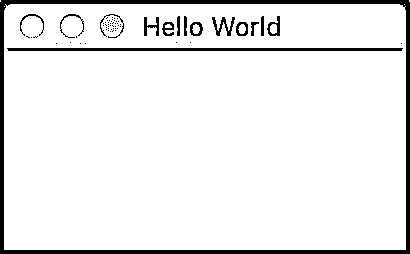
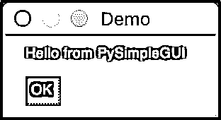
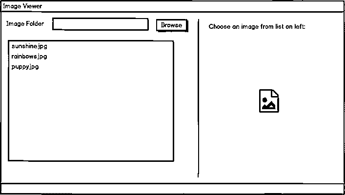
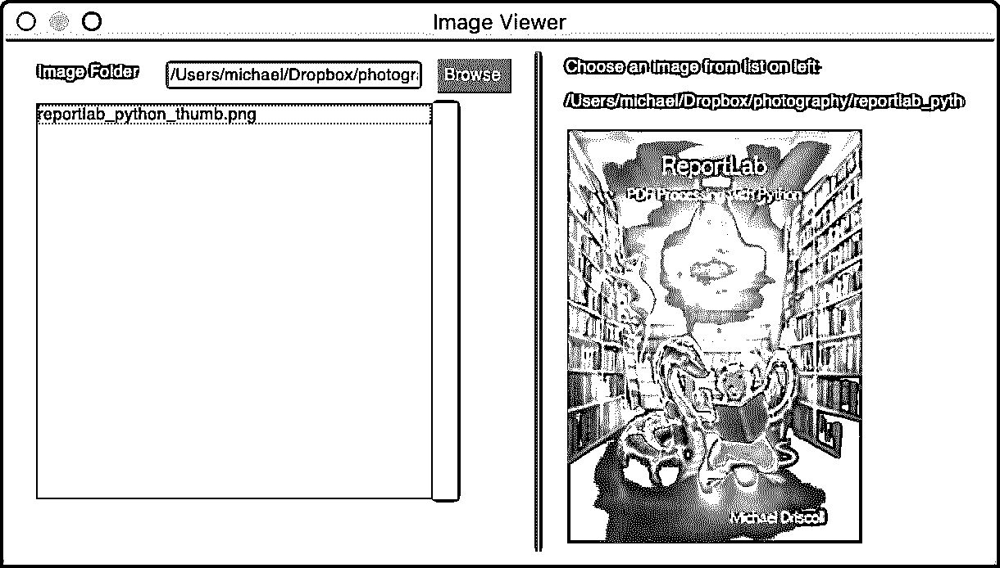
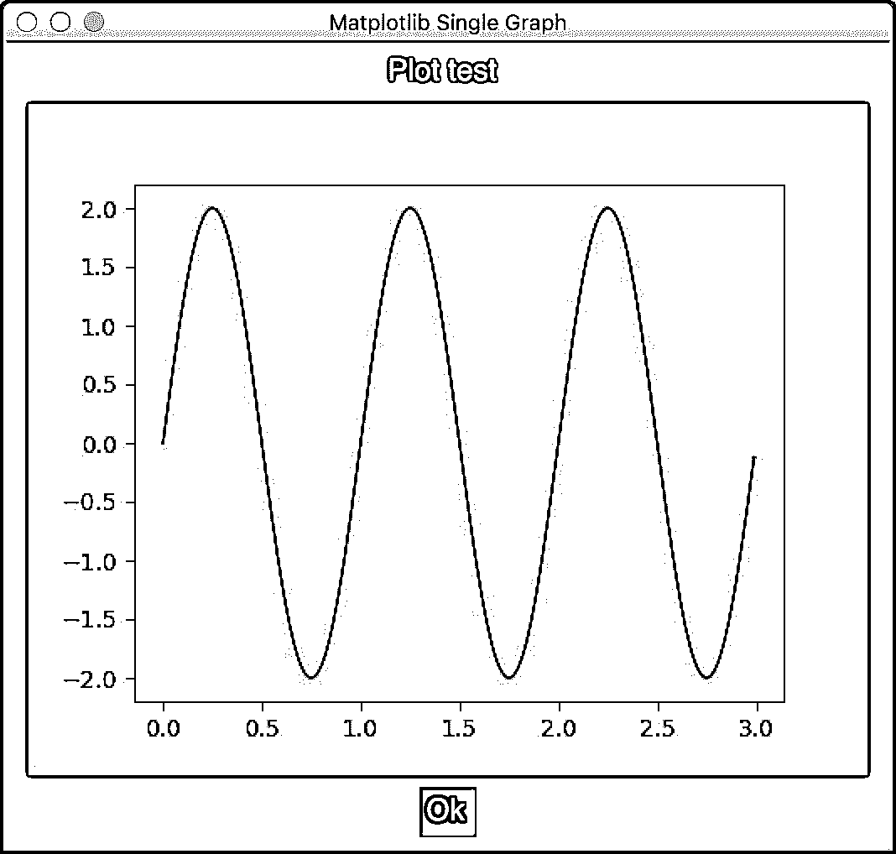
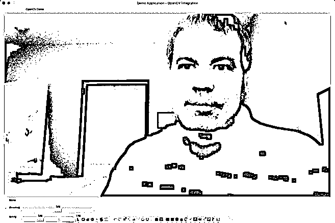

# PySimpleGUI:用 Python 创建 GUI 的简单方法

> 原文： [https://realpython.com/pysimplegui-python/](https://realpython.com/pysimplegui-python/)

*立即观看**本教程有真实 Python 团队创建的相关视频课程。和文字教程一起看，加深理解: [**用 PySimpleGUI**](/courses/simplify-gui-dev-pysimplegui/) 简化 Python GUI 开发

创建一个跨多个平台工作的简单图形用户界面(GUI)可能很复杂。但不一定非要这样。您可以使用 Python 和 PySimpleGUI 包来创建您和您的用户都会喜欢的好看的用户界面！PySimpleGUI 是一个新的 Python GUI 库，最近引起了很多人的兴趣。

**在本教程中，您将学习如何:**

*   安装 PySimpleGUI 包
*   用 PySimpleGUI 创建基本的**用户界面**元素
*   创建应用程序，比如 PySimpleGUI **图像查看器**
*   集成 PySimpleGUI 和 Matplotlib
*   在 PySimpleGUI 中使用**计算机视觉**
*   为 **Windows** 打包您的 PySimpleGUI 应用程序

现在是时候开始了！

**免费奖励:** ，它向您展示 Python 3 的基础知识，如使用数据类型、字典、列表和 Python 函数。

## PySimpleGUI 入门

PySimpleGUI 于 2018 年推出，因此与 [wxPython](https://realpython.com/python-gui-with-wxpython/) 或 [PyQt](https://realpython.com/python-pyqt-gui-calculator/) 相比，它是一个相对较新的包。

PySimpleGUI 有四个端口:

1.  [Tkinter](https://realpython.com/python-gui-tkinter/)
2.  [PyQt](https://riverbankcomputing.com/software/pyqt/intro)
3.  [wxPython](https://www.wxpython.org/pages/overview/)
4.  [Remi](https://pypi.org/project/remi/)

PySimpleGUI 包装了这些其他[包](https://realpython.com/python-modules-packages/)的一部分，使它们更容易使用。但是，每个端口都必须单独安装。

PySimpleGUI 封装了 Python 自带的全部 Tkinter。PySimpleGUI 已经包装了 PySide2 的大部分，但只包装了 wxPython 的一小部分。当您安装 PySimpleGUI 时，默认情况下您会得到 **Tkinter** 变量。有关 Tkinter 的更多信息，请查看使用 Tkinter 的 [Python GUI 编程](https://realpython.com/python-gui-tkinter/)。

根据您使用的 PySimpleGUI 的不同版本，您用 PySimpleGUI 创建的应用程序可能看起来不是其平台的原生程序。但是不要让这阻止您尝试 PySimpleGUI。PySimpleGUI 仍然非常强大，只需做一点工作就可以完成大多数事情。

[*Remove ads*](/account/join/)

## 安装 PySimpleGUI

如果使用 [pip](https://realpython.com/what-is-pip/) ，安装 PySimpleGUI 很容易。出于本教程的目的，您将学习如何安装常规的 PySimpleGUI 端口，它是 Tkinter 的变体。

以下是如何做到这一点:

```py
$ python -m pip install pysimplegui
```

这将把 PySimpleGUI 安装到 Python 设置的任何系统中。您还可以将 PySimpleGUI 安装到 Python 虚拟环境中。如果你不熟悉 Python 虚拟环境，那么你应该读一下 [Python 虚拟环境:入门](https://realpython.com/python-virtual-environments-a-primer/)。

如果您喜欢尝试 PyQt 变体，那么您可以使用`pip install PySimpleGUIQt`来代替。现在您已经安装了 PySimpleGUI，是时候了解如何使用它了！

## 在 PySimpleGUI 中创建基本 UI 元素

如果你以前用过 GUI 工具包，那么你可能听说过术语 **widgets** 。小部件是一个通用术语，用于描述组成用户界面(UI)的元素，如按钮、标签、窗口等。在 PySimpleGUI 中，小部件被称为**元素**，有时您可能会在别处看到大写的**元素**。

PySimpleGUI 的基本构件之一是`Window()`。要创建一个`Window()`，您可以执行以下操作:

```py
# hello_world.py

import PySimpleGUI as sg

sg.Window(title="Hello World", layout=[[]], margins=(100, 50)).read()
```

需要很多不同的参数——太多了，无法在此列出。然而，对于这个例子，你可以给`Window()`一个`title`和一个`layout`，并设置`margins`，这是用户界面窗口的像素大小。

`read()`将`Window()`中触发的任何事件作为[字符串](https://realpython.com/python-data-types/#strings)和`values` [字典](https://realpython.com/python-dicts/)返回。在本教程的后面部分，您将了解更多关于这些的内容。

当您运行这段代码时，您应该会看到类似这样的内容:

[](https://files.realpython.com/media/hello_world_psg.4e8bd27f1d6f.jpg)

这个例子除了可能向用户显示一条消息之外，实际上没有做什么。

通常，你的应用程序中除了一个`Window()`还有其他元素，所以让我们添加一些文本和一个按钮。

创建一个名为`hello_psg.py`的新文件，并添加以下代码:

```py
# hello_psg.py

import PySimpleGUI as sg

layout = [[sg.Text("Hello from PySimpleGUI")], [sg.Button("OK")]]

# Create the window
window = sg.Window("Demo", layout)

# Create an event loop
while True:
    event, values = window.read()
    # End program if user closes window or
    # presses the OK button
    if event == "OK" or event == sg.WIN_CLOSED:
        break

window.close()
```

大多数 GUI 工具包允许你使用**绝对定位**或者允许 GUI 动态**布局元素**。例如，wxPython 使用`Sizers`来动态布局元素。如果你想了解更多关于 wxPython 的知识，那么看看[如何用 wxPython](https://realpython.com/python-gui-with-wxpython/) 构建一个 Python GUI 应用程序。

PySimpleGUI 使用嵌套的 [Python 列表](https://realpython.com/python-lists-tuples/)来布局元素。在这种情况下，添加一个`Text()`元素和一个`Button()`元素。然后创建`window`，并传入您的自定义`layout`。

最后一块代码是**事件循环**。图形用户界面需要在一个循环中运行，并等待用户做一些事情。例如，用户可能需要按下用户界面中的按钮或者用键盘输入一些东西。当他们这样做时，这些事件由事件循环处理。

当您使用 PySimpleGUI 时，您通过创建一个无限的 [`while`循环](https://realpython.com/python-while-loop/)来从`window`对象中读取事件，从而创建一个事件循环。如果用户按下`OK`按钮或退出按钮，那么你希望程序结束。为了实现这一点，你`break`退出循环，`close()`退出`window`。

上面的代码创建了一个如下所示的应用程序:

[](https://files.realpython.com/media/hello_psg.8416fdc346b6.jpg)

现在您已经准备好创建一个实际的应用程序了！

[*Remove ads*](/account/join/)

## 创建简单的应用程序

您可以使用 PySimpleGUI 创建各种不同的跨平台 GUI。该包中包含的演示非常广泛。您可以创建任何东西，从桌面小部件到成熟的用户界面。

在接下来的几节中，您将看到使用 PySimpleGUI 的几种不同方式。然而，除了一个单独的教程所涵盖的内容之外，您还可以做更多的事情。如果您想了解更多细节，请务必查看 PySimpleGUI 中包含的其他演示。

## 创建 PySimpleGUI 图像查看器

PySimpleGUI 的 GitHub 页面上的演示之一是图像查看器。能够用 Python 编写自己的自定义图像查看器很有趣。您可以使用此代码来查看您自己的照片，或者合并它来查看您从数据库下载或读取的照片。

为了简单起见，您将使用 PySimpleGUI 的内置`Image()`元素来查看图像。遗憾的是，`Image()`元素在 PySimpleGUI 的常规版本中只能显示 PNG 和 GIF 格式。

如果你希望能够打开其他图像文件类型，那么你可以下载 [Pillow](https://pillow.readthedocs.io/en/stable/) ，它支持 TIFF、JPG 和 BMP 格式。查看 GitHub 上的 PySimpleGUI demo 文件夹，以获得演示如何做到这一点的示例。

另一方面，如果您安装了 PySimpleGUIQt 端口，那么您会发现 Qt 比 Tkinter 支持更多现成的图像格式。

这里有一个图像查看器最终应该是什么样子的模型:

[](https://files.realpython.com/media/image_viewer_mockup.96334ef5eb7d.png)

这个例子会有很多代码，但是不要担心。之后你会把它分成小块来看。

您可以在您选择的 Python 编辑器中创建一个名为`img_viewer.py`的文件。然后添加以下代码:


```py
 1# img_viewer.py
 2
 3import PySimpleGUI as sg
 4import os.path
 5
 6# First the window layout in 2 columns
 7
 8file_list_column = [
 9    [
10        sg.Text("Image Folder"),
11        sg.In(size=(25, 1), enable_events=True, key="-FOLDER-"),
12        sg.FolderBrowse(),
13    ],
14    [
15        sg.Listbox(
16            values=[], enable_events=True, size=(40, 20), key="-FILE LIST-"
17        )
18    ],
19]
20
21# For now will only show the name of the file that was chosen
22image_viewer_column = [
23    [sg.Text("Choose an image from list on left:")],
24    [sg.Text(size=(40, 1), key="-TOUT-")],
25    [sg.Image(key="-IMAGE-")],
26]
27
28# ----- Full layout -----
29layout = [
30    [
31        sg.Column(file_list_column),
32        sg.VSeperator(),
33        sg.Column(image_viewer_column),
34    ]
35]
36
37window = sg.Window("Image Viewer", layout)
38
39# Run the Event Loop
40while True:
41    event, values = window.read()
42    if event == "Exit" or event == sg.WIN_CLOSED:
43        break
44    # Folder name was filled in, make a list of files in the folder
45    if event == "-FOLDER-":
46        folder = values["-FOLDER-"]
47        try:
48            # Get list of files in folder
49            file_list = os.listdir(folder)
50        except:
51            file_list = []
52
53        fnames = [
54            f
55            for f in file_list
56            if os.path.isfile(os.path.join(folder, f))
57            and f.lower().endswith((".png", ".gif"))
58        ]
59        window["-FILE LIST-"].update(fnames)
60    elif event == "-FILE LIST-":  # A file was chosen from the listbox
61        try:
62            filename = os.path.join(
63                values["-FOLDER-"], values["-FILE LIST-"][0]
64            )
65            window["-TOUT-"].update(filename)
66            window["-IMAGE-"].update(filename=filename)
67
68        except:
69            pass
70
71window.close()
```

唷！这相当多行代码！让我们一条一条地过一遍。

下面是最初的几行:

```py
 1# img_viewer.py
 2
 3import PySimpleGUI as sg
 4import os.path
 5
 6# First the window layout in 2 columns
 7
 8file_list_column = [
 9    [
10        sg.Text("Image Folder"),
11        sg.In(size=(25, 1), enable_events=True, key="-FOLDER-"),
12        sg.FolderBrowse(),
13    ],
14    [
15        sg.Listbox(
16            values=[], enable_events=True, size=(40, 20), key="-FILE LIST-"
17        )
18    ],
19]
```

在这里，在**的第 3 行和第 4 行**，您导入了`PySimpleGUI`和 Python 的`os`模块。然后，在**的第 8 行到第 19 行**，创建一个嵌套的元素列表，表示用户界面的一个垂直列。这将创建一个浏览按钮，您将使用它来查找包含图像的文件夹。

`key`参数很重要。这是您用来在 GUI 中标识特定元素的内容。对于`In()`输入文本控件，您给它一个标识`"-FOLDER-"`。稍后您将使用它来访问元素的内容。您可以通过`enable_events`参数打开或关闭每个元素的事件。

元素将显示图像的路径列表，您可以从中选择要显示的图像。您可以通过传入一个字符串列表来用值预先填充`Listbox()`。

当您第一次加载您的用户界面时，您希望`Listbox()`是空的，所以您传递给它一个空列表。您打开这个元素的事件，设置它的`size`，并像处理 input 元素一样给它一个惟一的标识符。

现在，您可以查看右边的元素栏:

```py
21# For now will only show the name of the file that was chosen
22image_viewer_column = [
23    [sg.Text("Choose an image from list on left:")],
24    [sg.Text(size=(40, 1), key="-TOUT-")],
25    [sg.Image(key="-IMAGE-")],
26]
```

第 22 到 26 行**的列表列表**创建了三个元素。第一个元素告诉用户他们应该选择一个图像来显示。第二个元素显示选定文件的名称。第三个显示`Image()`。

请注意，`Image()`元素也有一个`key`集合，这样您以后可以很容易地引用该元素。有关`Image()`元素的更多信息，请查看[文档](https://pysimplegui.readthedocs.io/en/latest/#image-element)。

下一段代码定义了您的布局:

```py
28# ----- Full layout -----
29layout = [
30    [
31        sg.Column(file_list_column),
32        sg.VSeperator(),
33        sg.Column(image_viewer_column),
34    ]
35]
```

第 29 到 35 行的最后一个列表包含了控制元素如何在屏幕上布局的代码。这段代码包含两个`Column()`元素，它们之间有一个`VSeperator()`。`VSeperator()`是`VerticalSeparator()`的别名。通过阅读各自的文档页面，您可以了解更多关于 [`Column()`](https://pysimplegui.readthedocs.io/en/latest/#column-element-frame-tab-container-elements) 和 [`VSeperator()`](https://pysimplegui.readthedocs.io/en/latest/call%20reference/#verticalseparator-element) 如何工作的信息。

要将`layout`添加到`window`中，您可以这样做:

```py
37window = sg.Window("Image Viewer", layout)
```

现在您已经弄清楚了用户界面，您可以查看事件循环代码了。这是第一部分:

```py
39while True:
40    event, values = window.read()
41    if event == "Exit" or event == sg.WIN_CLOSED:
42        break
```

事件循环包含程序的**逻辑**。在这里，您从`window`中提取事件和`values`。`event`将是用户与之交互的任何元素的`key`字符串。`values` [变量](https://realpython.com/python-variables/)包含一个 Python 字典，它将元素`key`映射到一个值。例如，如果用户选择一个文件夹，那么`"-FOLDER-"`将映射到文件夹路径。

条件语句用于控制发生的事情。如果`event`等于`"Exit"`或者用户关闭了`window`，那么你就退出了循环。

现在，您可以看看循环中下一个条件语句的第一部分:

```py
44# Folder name was filled in, make a list of files in the folder
45if event == "-FOLDER-":
46    folder = values["-FOLDER-"]
47    try:
48        # Get list of files in folder
49        file_list = os.listdir(folder)
50    except:
51        file_list = []
52
53    fnames = [
54        f
55        for f in file_list
56        if os.path.isfile(os.path.join(folder, f))
57        and f.lower().endswith((".png", ".gif"))
58    ]
59    window["-FILE LIST-"].update(fnames)
```

这一次您对照`"-FOLDER-"` `key`检查`event`，后者指的是您之前创建的`In()`元素。如果事件存在，那么您知道用户已经选择了一个文件夹，并且您使用`os.listdir()`来获得一个文件列表。然后过滤列表，只列出扩展名为`".png"`或`".gif"`的文件。

**注意:**如前所述，您可以通过使用 Pillow 或 PySimpleGUIQt 来避免缩小图像文件类型。

现在你可以看看条件语句的下一部分:

```py
60elif event == "-FILE LIST-":  # A file was chosen from the listbox
61    try:
62        filename = os.path.join(
63            values["-FOLDER-"], values["-FILE LIST-"][0]
64        )
65        window["-TOUT-"].update(filename)
66        window["-IMAGE-"].update(filename=filename)
67    except:
68        pass
```

如果`event`等于`"-FILE LIST-"`，那么您知道用户已经在`Listbox()`中选择了一个文件，并且您想要更新`Image()`元素以及在右侧显示所选`filename`的`Text()`元素。

最后一段代码是如何结束程序的:

```py
71window.close()
```

当用户按下退出按钮时，应用程序必须关闭。为此，您可以使用`window.close()`。

从技术上讲，您可以从代码中删除这一行，Python 仍然会结束程序，但是在您完成之后进行清理总是一个好主意。此外，如果您正在使用 PySimpleGUI 的 web 端口，并且没有正确关闭窗口，那么您最终会让一个端口处于打开状态。

现在运行代码，您应该会看到这样的界面:

[](https://files.realpython.com/media/psg_image_viewer.4c4ca055b433.jpg)

您可以使用 Browse 按钮在您的计算机上找到一个包含图像的文件夹，以便您可以试用此代码。或者您可以将文件的路径复制并粘贴到`Text()`元素中。

查看完图像后，您就可以学习如何通过 PySimpleGUI 使用 Matplotlib 了。

[*Remove ads*](/account/join/)

## 集成 Matplotlib 和 PySimpleGUI

创建图表是与同事共享信息的好方法。Python 最流行的绘图包之一是 Matplotlib。Matplotlib 可以创建各种不同的图形。如果你想了解更多，请查看 [Python 绘图与 Matplotlib(指南)](https://realpython.com/python-matplotlib-guide/)。

Matplotlib 可以与 PySimpleGUI 集成，因此如果您已经知道如何使用 Matplotlib，您可以相当容易地将图形添加到您的 GUI 中。

如果你没有安装 Matplotlib，那么你可以使用 [`pip`](https://realpython.com/what-is-pip/) 来安装:

```py
$ python -m pip install matplotlib
```

对于这个例子，您使用的是 PySimpleGUI 的一个演示。Matplotlib 使用了 [NumPy](https://numpy.org/) ，所以你也要安装它:

```py
$ python -m pip install numpy
```

现在您已经拥有了编写代码所需的所有部分，您可以创建一个新文件并将其命名为`psg_matplotlib.py`。

演示代码有点长，所以您可以从下面开始分段添加代码:

```py
import numpy as np
from matplotlib.backends.backend_tkagg import FigureCanvasTkAgg
import PySimpleGUI as sg
import matplotlib

fig = matplotlib.figure.Figure(figsize=(5, 4), dpi=100)
t = np.arange(0, 3, .01)
fig.add_subplot(111).plot(t, 2 * np.sin(2 * np.pi * t))
```

这些是使代码工作所需的导入。这段代码还设置了 Matplotlib `Figure()`并使用`add_subplot()`添加了一个绘图。更多细节，你可能想参考[文档](https://matplotlib.org/3.2.1/api/_as_gen/matplotlib.pyplot.figure.html)。PySimpleGUIQt 端口目前不能以同样的方式工作，但是正在为将来的版本而努力。

在 PySimpleGUI 和 Tkinter 中，都使用`Canvas()`元素进行绘制。你可以在[文档](https://pysimplegui.readthedocs.io/en/latest/#canvas-element)中读到更多关于这个元素的内容。

现在您可以创建一个助手函数来在 PySimpleGUI 的`Canvas()`上绘制图形。一个**助手函数**是你不想写多次的重复代码。看一看:

```py
matplotlib.use("TkAgg")

def draw_figure(canvas, figure):
    figure_canvas_agg = FigureCanvasTkAgg(figure, canvas)
    figure_canvas_agg.draw()
    figure_canvas_agg.get_tk_widget().pack(side="top", fill="both", expand=1)
    return figure_canvas_agg
```

您将使用`figure_canvas_agg.draw()`来绘制 PySimpleGUI 的`Canvas()`元素的图。

要使用 PySimpleGUI 的`Canvas()`，需要将它和 Matplotlib `figure`对象一起传递给`FigureCanvasTkAgg()`。`FigureCanvasTkAgg()`来自 Matplotlib，由 Tkinter 用于在 PySimpleGUI 中嵌入绘图。如果您使用的是 PySimpleGUIQt，这将会有所不同。

最后一步是用 PySimpleGUI 编写用户界面:

```py
# Define the window layout
layout = [
    [sg.Text("Plot test")],
    [sg.Canvas(key="-CANVAS-")],
    [sg.Button("Ok")],
]

# Create the form and show it without the plot
window = sg.Window(
    "Matplotlib Single Graph",
    layout,
    location=(0, 0),
    finalize=True,
    element_justification="center",
    font="Helvetica 18",
)

# Add the plot to the window
draw_figure(window["-CANVAS-"].TKCanvas, fig)

event, values = window.read()

window.close()
```

要创建用户界面，您只需要一个`Text()`元素、一个`Canvas()`元素和一个`Button()`元素。然后你将所有这些添加到一个`Window()`中，并调用你的`draw_figure()`辅助函数来绘制图表。

这里不需要事件循环，因为您不会与这个用户界面中的元素进行交互。

图表看起来是这样的:

[](https://files.realpython.com/media/psg_matplot.094fc93d8763.jpg)

PySimpleGUI 中还包含了其他 Matplotlib 演示程序,您应该去看看。

现在您可以学习如何通过 PySimpleGUI 使用 OpenCV。

[*Remove ads*](/account/join/)

## 集成 OpenCV 和 PySimpleGUI

计算机视觉是现在的热门话题。Python 允许你通过使用 [opencv-python 包](https://pypi.org/project/opencv-python/)进入计算机视觉领域，该包是流行的 **OpenCV** 应用程序的包装器。如果你有兴趣学习更多关于计算机视觉的知识，那么看看用 Python 实现的[人脸识别，不到 25 行代码](https://realpython.com/face-recognition-with-python/)。

PySimpleGUI 具有与 OpenCV 库直接集成的特性。然而，您首先需要使用`pip`安装 OpenCV:

```py
$ python -m pip install opencv-python
```

现在你已经安装了 OpenCV，你可以写一个有趣的应用程序了！

您将看到另一个 [PySimpleGUI 演示](https://github.com/PySimpleGUI/PySimpleGUI/blob/master/DemoPrograms/Demo_OpenCV_Simple_GUI.py)，它使用 OpenCV 和您计算机的网络摄像头。这个应用程序可以让你将一些常用的滤镜实时应用到你的视频中。

这个例子的代码很长，但是不用担心。稍后会分小块解释。继续创建一个名为`psg_opencv.py`的文件，并添加以下代码:


```py
 1import PySimpleGUI as sg
 2import cv2
 3import numpy as np
 4
 5def main():
 6    sg.theme("LightGreen")
 7
 8    # Define the window layout
 9    layout = [
 10        [sg.Text("OpenCV Demo", size=(60, 1), justification="center")],
 11        [sg.Image(filename="", key="-IMAGE-")],
 12        [sg.Radio("None", "Radio", True, size=(10, 1))],
 13        [
 14            sg.Radio("threshold", "Radio", size=(10, 1), key="-THRESH-"),
 15            sg.Slider(
 16                (0, 255),
 17                128,
 18                1,
 19                orientation="h",
 20                size=(40, 15),
 21                key="-THRESH SLIDER-",
 22            ),
 23        ],
 24        [
 25            sg.Radio("canny", "Radio", size=(10, 1), key="-CANNY-"),
 26            sg.Slider(
 27                (0, 255),
 28                128,
 29                1,
 30                orientation="h",
 31                size=(20, 15),
 32                key="-CANNY SLIDER A-",
 33            ),
 34            sg.Slider(
 35                (0, 255),
 36                128,
 37                1,
 38                orientation="h",
 39                size=(20, 15),
 40                key="-CANNY SLIDER B-",
 41            ),
 42        ],
 43        [
 44            sg.Radio("blur", "Radio", size=(10, 1), key="-BLUR-"),
 45            sg.Slider(
 46                (1, 11),
 47                1,
 48                1,
 49                orientation="h",
 50                size=(40, 15),
 51                key="-BLUR SLIDER-",
 52            ),
 53        ],
 54        [
 55            sg.Radio("hue", "Radio", size=(10, 1), key="-HUE-"),
 56            sg.Slider(
 57                (0, 225),
 58                0,
 59                1,
 60                orientation="h",
 61                size=(40, 15),
 62                key="-HUE SLIDER-",
 63            ),
 64        ],
 65        [
 66            sg.Radio("enhance", "Radio", size=(10, 1), key="-ENHANCE-"),
 67            sg.Slider(
 68                (1, 255),
 69                128,
 70                1,
 71                orientation="h",
 72                size=(40, 15),
 73                key="-ENHANCE SLIDER-",
 74            ),
 75        ],
 76        [sg.Button("Exit", size=(10, 1))],
 77    ]
 78
 79    # Create the window and show it without the plot
 80    window = sg.Window("OpenCV Integration", layout, location=(800, 400))
 81
 82    cap = cv2.VideoCapture(0)
 83
 84    while True:
 85        event, values = window.read(timeout=20)
 86        if event == "Exit" or event == sg.WIN_CLOSED:
 87            break
 88
 89        ret, frame = cap.read()
 90
 91        if values["-THRESH-"]:
 92            frame = cv2.cvtColor(frame, cv2.COLOR_BGR2LAB)[:, :, 0]
 93            frame = cv2.threshold(
 94                frame, values["-THRESH SLIDER-"], 255, cv2.THRESH_BINARY
 95            )[1]
 96        elif values["-CANNY-"]:
 97            frame = cv2.Canny(
 98                frame, values["-CANNY SLIDER A-"], values["-CANNY SLIDER B-"]
 99            )
100        elif values["-BLUR-"]:
101            frame = cv2.GaussianBlur(frame, (21, 21), values["-BLUR SLIDER-"])
102        elif values["-HUE-"]:
103            frame = cv2.cvtColor(frame, cv2.COLOR_BGR2HSV)
104            frame[:, :, 0] += int(values["-HUE SLIDER-"])
105            frame = cv2.cvtColor(frame, cv2.COLOR_HSV2BGR)
106        elif values["-ENHANCE-"]:
107            enh_val = values["-ENHANCE SLIDER-"] / 40
108            clahe = cv2.createCLAHE(clipLimit=enh_val, tileGridSize=(8, 8))
109            lab = cv2.cvtColor(frame, cv2.COLOR_BGR2LAB)
110            lab[:, :, 0] = clahe.apply(lab[:, :, 0])
111            frame = cv2.cvtColor(lab, cv2.COLOR_LAB2BGR)
112
113        imgbytes = cv2.imencode(".png", frame)[1].tobytes()
114        window["-IMAGE-"].update(data=imgbytes)
115
116    window.close()
117
118main()
```

那是一段很长的代码！让我们一次检查一个例子:

```py
 1import PySimpleGUI as sg
 2import cv2
 3import numpy as np
 4
 5def main():
 6    sg.theme("LightGreen")
 7
 8    # Define the window layout
 9    layout = [
10        [sg.Text("OpenCV Demo", size=(60, 1), justification="center")],
11        [sg.Image(filename="", key="-IMAGE-")],
12        [sg.Radio("None", "Radio", True, size=(10, 1))],
13        [
14            sg.Radio("threshold", "Radio", size=(10, 1), key="-THRESH-"),
15            sg.Slider(
16                (0, 255),
17                128,
18                1,
19                orientation="h",
20                size=(40, 15),
21                key="-THRESH SLIDER-",
22            ),
23        ],
```

**第 1 行到第 3 行**是您需要的 Python 库的导入。然后你把`theme`设置在**线 6** 上。

下一步，从第 9 行开始，为 GUI 中的所有元素创建一个`layout`。第一组元素包括一个`Text()`元素、一个`Image()`元素和一个`Radio()`元素。您将`Image`元素的标识符键设置为`"-IMAGE-"`。您还可以嵌套一个`Radio()`元素和一个`Slider()`元素，并将它们的标识符键分别设置为`"-THRESH-"`和`"-THRESH SLIDER-"`。

现在您将向`layout`添加更多的元素:

```py
24[
25    sg.Radio("canny", "Radio", size=(10, 1), key="-CANNY-"),
26    sg.Slider(
27        (0, 255),
28        128,
29        1,
30        orientation="h",
31        size=(20, 15),
32        key="-CANNY SLIDER A-",
33    ),
34    sg.Slider(
35        (0, 255),
36        128,
37        1,
38        orientation="h",
39        size=(20, 15),
40        key="-CANNY SLIDER B-",
41    ),
42],
```

在**第 24 行到第 42 行**上，您添加了另一个`Radio()`元素和两个`Slider()`元素来控制用户界面的 [canny 边缘检测](https://docs.opencv.org/trunk/da/d22/tutorial_py_canny.html)。您还可以适当地设置标识符。

现在，您将添加一种模糊图像的方法:

```py
43[
44    sg.Radio("blur", "Radio", size=(10, 1), key="-BLUR-"),
45    sg.Slider(
46        (1, 11),
47        1,
48        1,
49        orientation="h",
50        size=(40, 15),
51        key="-BLUR SLIDER-",
52    ),
53],
```

在这里，你只需要添加几个元素来控制**图像模糊**，这也被称为**图像平滑**。你可以在 [OpenCV 文档](https://docs.opencv.org/master/d4/d13/tutorial_py_filtering.html)中读到更多关于这项技术的内容。

您只需再添加两组控件。接下来，您将添加色调控制:

```py
54[
55    sg.Radio("hue", "Radio", size=(10, 1), key="-HUE-"),
56    sg.Slider(
57        (0, 225),
58        0,
59        1,
60        orientation="h",
61        size=(40, 15),
62        key="-HUE SLIDER-",
63    ),
64],
```

这些元素允许您在不同的**色彩空间**之间转换。色彩空间超出了本教程的范围，但是你可以在 OpenCV 网站上的[改变色彩空间](https://docs.opencv.org/trunk/df/d9d/tutorial_py_colorspaces.html)教程中了解更多。

最后要添加的元素用于控制对比度:

```py
65    [
66        sg.Radio("enhance", "Radio", size=(10, 1), key="-ENHANCE-"),
67        sg.Slider(
68            (1, 255),
69            128,
70            1,
71            orientation="h",
72            size=(40, 15),
73            key="-ENHANCE SLIDER-",
74        ),
75    ],
76    [sg.Button("Exit", size=(10, 1))],
77]
78
79# Create the window and show it without the plot
80window = sg.Window("OpenCV Integration", layout, location=(800, 400))
81
82cap = cv2.VideoCapture(0)
```

这最后几个元素将允许您使用[对比度受限的自适应直方图均衡化](https://docs.opencv.org/master/d6/dc7/group__imgproc__hist.html)算法来增强视频流的对比度。

这就完成了`layout`。然后您将您的`layout`传递给`Window()`，这样您就可以在屏幕上看到您的 UI。

最后，您使用`cv2.VideoCapture(0)`来访问您机器上的网络摄像头。您可能会看到一个弹出窗口，询问您是否允许使用您的相机。如果你这样做，那么你需要授予许可，否则这段代码将无法工作。

现在看一下代码的其余部分:

```py
 84    while True:
 85        event, values = window.read(timeout=20)
 86        if event == "Exit" or event == sg.WIN_CLOSED:
 87            break
 88
 89        ret, frame = cap.read()
 90
 91        if values["-THRESH-"]:
 92            frame = cv2.cvtColor(frame, cv2.COLOR_BGR2LAB)[:, :, 0]
 93            frame = cv2.threshold(
 94                frame, values["-THRESH SLIDER-"], 255, cv2.THRESH_BINARY
 95            )[1]
 96        elif values["-CANNY-"]:
 97            frame = cv2.Canny(
 98                frame, values["-CANNY SLIDER A-"], values["-CANNY SLIDER B-"]
 99            )
100        elif values["-BLUR-"]:
101            frame = cv2.GaussianBlur(frame, (21, 21), values["-BLUR SLIDER-"])
102        elif values["-HUE-"]:
103            frame = cv2.cvtColor(frame, cv2.COLOR_BGR2HSV)
104            frame[:, :, 0] += int(values["-HUE SLIDER-"])
105            frame = cv2.cvtColor(frame, cv2.COLOR_HSV2BGR)
106        elif values["-ENHANCE-"]:
107            enh_val = values["-ENHANCE SLIDER-"] / 40
108            clahe = cv2.createCLAHE(clipLimit=enh_val, tileGridSize=(8, 8))
109            lab = cv2.cvtColor(frame, cv2.COLOR_BGR2LAB)
110            lab[:, :, 0] = clahe.apply(lab[:, :, 0])
111            frame = cv2.cvtColor(lab, cv2.COLOR_LAB2BGR)
112
113        imgbytes = cv2.imencode(".png", frame)[1].tobytes()
114        window["-IMAGE-"].update(data=imgbytes)
115
116    window.close()
117
118main()
```

这是 PySimpleGUI 接口的事件循环。当您更改 UI 中的滑块时，PySimpleGUI 将获取`event`和`values`，并使用它们来确定将哪个 OpenCV 函数应用于您的网络摄像头流。

这段代码与您看到的其他代码有些不同，因为它封装在一个`main()`函数中。这种类型的函数被用作程序的主入口点。要了解这个主题的更多信息，请查看用 Python 定义主函数的。

下面是 GUI 外观的一个示例:

[](https://files.realpython.com/media/psg_opencv_sm.ab7f962324a2.jpg)

现在是时候学习如何为 Windows 创建应用程序的可执行文件了。

[*Remove ads*](/account/join/)

## 为 Windows 打包您的 PySimpleGUI 应用程序

有许多不同的 [Python 包](https://realpython.com/python-modules-packages/)可以用来把你的 Python 代码转换成 Windows 的可执行文件。其中最受欢迎的是 [PyInstaller](https://pyinstaller.readthedocs.io/en/stable/operating-mode.html) 。

您可以使用`pip`安装 PyInstaller:

```py
$ python -m pip install pyinstaller
```

要了解更多关于如何使用 PyInstaller 的信息，请查看[使用 PyInstaller 轻松分发 Python 应用程序](https://realpython.com/pyinstaller-python/)。

您将使用 PyInstaller 将之前创建的图像查看器应用程序转换为可执行文件。

```py
$ pyinstaller img_viewer.py
```

当您运行此命令时，您会看到类似于以下内容的大量输出:

```py
177 INFO: PyInstaller: 3.6
178 INFO: Python: 3.8.2
179 INFO: Platform: Windows-10-10.0.10586-SP0
186 INFO: wrote C:\Users\mike\OneDrive\Documents\image_viewer_psg.spec
192 INFO: UPX is not available.
221 INFO: Extending PYTHONPATH with paths
---- output snipped ----
13476 INFO: Building COLLECT because COLLECT-00.toc is non existent
13479 INFO: Building COLLECT COLLECT-00.toc
25851 INFO: Building COLLECT COLLECT-00.toc completed successfully.
```

由于 PyInstaller 非常冗长，所以这个输出是缩写的。完成后，您将在包含`img_viewer.py`的同一个文件夹中拥有一个名为`dist`的子文件夹。你可以进入`dist`文件夹找到`img_viewer.exe`并尝试运行它。

在`dist`文件夹中会有很多可执行文件使用的其他文件。

如果您希望只有一个可执行文件，那么您可以使用`--onefile`标志重新运行该命令:

```py
$ pyinstaller --onefile img_viewer.py
```

这仍然会生成`dist`文件夹，但是这一次应该只有一个可执行文件。

**注意:**如果您使用`--onefile`标志，Windows Defender 可能会将您的可执行文件标记为有病毒。如果是这样，那么您需要向 Windows 安全添加一个排除项以使其运行。这是因为在 Windows 10 中，Windows 可执行文件需要**签名**。

当您运行可执行文件时，除了您的用户界面之外，您还会看到一个控制台窗口。要移除控制台，可以在运行 PyInstaller 时使用`--noconsole`或`--windowed`标志。

## 结论

您在本教程中学到了很多关于 PySimpleGUI 包的知识！最重要的是，您已经熟悉了使用 PySimpleGUI 创建应用程序的基础知识。

**在本教程中，您学习了如何:**

*   安装 PySimpleGUI 包
*   用 PySimpleGUI 创建基本的**用户界面元素**
*   用 PySimpleGUI 创建一些**应用程序**，比如一个**图像浏览器**
*   集成 PySimpleGUI 和 Matplotlib
*   在 PySimpleGUI 中使用**计算机视觉**
*   为 **Windows** 打包您的 PySimpleGUI 应用程序

您可以使用在本教程中学到的知识来创建自己的有趣且有用的应用程序。

PySimpleGUI 包提供了更多的[示例演示](https://github.com/PySimpleGUI/PySimpleGUI/blob/master/DemoPrograms),您可以使用它们来培养自己的技能，并发现如何更有效地使用库中的所有工具。一定要看看它们，你很快就会发现自己正在创建自己的跨平台 GUI 应用程序

如果您想了解关于 PySimpleGUI 的更多信息，那么您可以查看以下资源:

*   [PySimpleGUI 文档](https://pysimplegui.readthedocs.io/en/latest/)
*   [PySimpleGUI 食谱](https://pysimplegui.readthedocs.io/en/latest/cookbook/)
*   PySimpleGUI 演示程序

*立即观看**本教程有真实 Python 团队创建的相关视频课程。和文字教程一起看，加深理解: [**用 PySimpleGUI**](/courses/simplify-gui-dev-pysimplegui/) 简化 Python GUI 开发*******