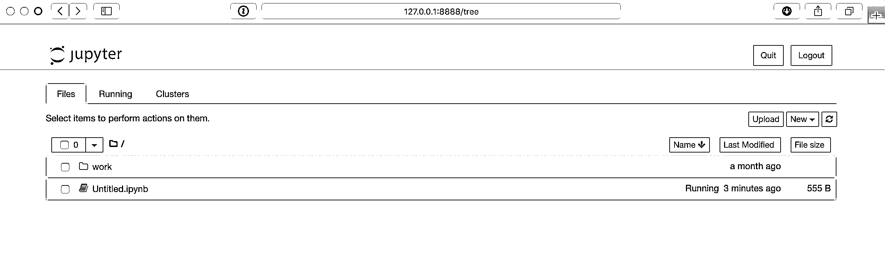
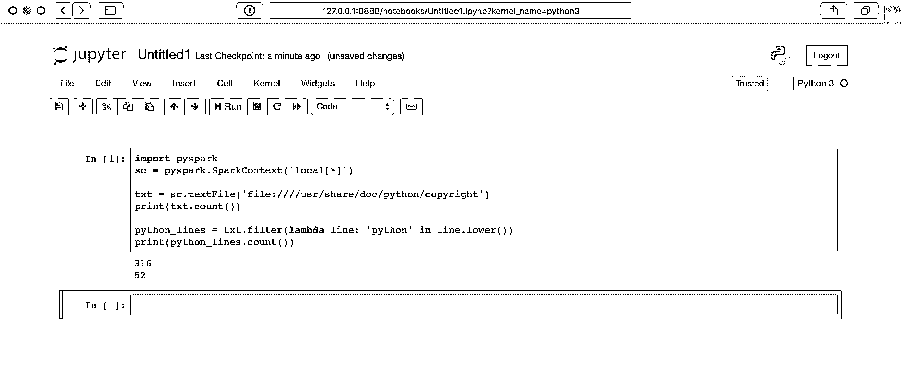
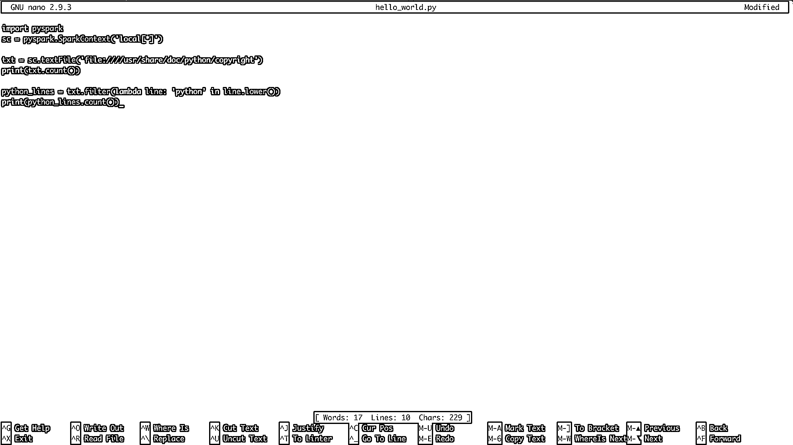

# PySpark 和大数据处理的第一步

> 原文：<https://realpython.com/pyspark-intro/>

面对数据量太大而无法在单台机器上处理的情况越来越常见。幸运的是，Apache Spark、Hadoop 和其他技术已经被开发出来解决这个问题。使用 PySpark 可以直接从 Python 中利用这些系统的能力！

高效地处理千兆字节甚至更多的数据集是任何 Python 开发人员都能够做到的事情，无论你是数据科学家、web 开发人员，还是介于两者之间的任何人。

在本教程中，您将学习:

*   哪些 Python 概念可以应用于大数据
*   如何使用 Apache Spark 和 PySpark
*   如何编写基本的 PySpark 程序
*   如何在本地小数据集上运行 PySpark 程序
*   将您的 PySpark 技能带到分布式系统的下一步该去哪里

**免费下载:** [从 Python 技巧中获取一个示例章节:这本书](https://realpython.com/bonus/python-tricks-sample-pdf/)用简单的例子向您展示了 Python 的最佳实践，您可以立即应用它来编写更漂亮的+Python 代码。

## Python 中的大数据概念

尽管作为*只是*一种[脚本语言](https://en.wikipedia.org/wiki/Scripting_language)而广受欢迎，Python 公开了几种[编程范例](https://en.wikipedia.org/wiki/Programming_paradigm)，如[面向数组编程](https://realpython.com/numpy-array-programming/)、[面向对象编程](https://realpython.com/python3-object-oriented-programming/)、[异步编程](https://realpython.com/courses/python-3-concurrency-asyncio-module/)以及许多其他编程范例。有抱负的大数据专业人士特别感兴趣的一个范例是[函数式编程](https://realpython.com/python-functional-programming/)。

在处理大数据时，函数式编程是一种常见的范式。以函数的方式编写会导致令人尴尬的并行代码。这意味着更容易获得代码，并让它在几个 CPU 上运行，甚至在完全不同的机器上运行。通过同时在多个系统上运行，您可以避开单个工作站的物理内存和 CPU 限制。

这就是 PySpark 生态系统的强大之处，它允许您获取功能代码，并自动将其分发到整个计算机集群。

幸运的是，对于 Python 程序员来说，函数式编程的许多核心思想都可以在 Python 的标准库和内置库中找到。您可以学习大数据处理所需的许多概念，而无需离开 Python 的舒适环境。

函数式编程的核心思想是数据应该由函数操作，而不需要维护任何外部状态。这意味着你的代码避免了全局[变量](https://realpython.com/python-variables/)，并且总是返回**新数据**，而不是就地操作数据。

函数式编程中另一个常见的想法是[匿名函数](https://en.wikipedia.org/wiki/Anonymous_function)。Python 使用 [`lambda`关键字](https://realpython.com/python-keywords/#the-lambda-keyword)公开匿名函数，不要与 [AWS Lambda 函数](https://realpython.com/code-evaluation-with-aws-lambda-and-api-gateway/)混淆。

现在您已经了解了一些术语和概念，您可以探索这些概念是如何在 Python 生态系统中体现的。

[*Remove ads*](/account/join/)

### λ函数

[Python 中的 lambda 函数](https://realpython.com/python-lambda/)是内联定义的，仅限于单个表达式。你可能在使用内置的 [`sorted()`](https://realpython.com/python-sort/) 函数时见过`lambda`函数:

>>>

```py
>>> x = ['Python', 'programming', 'is', 'awesome!']
>>> print(sorted(x))
['Python', 'awesome!', 'is', 'programming']
>>> print(sorted(x, key=lambda arg: arg.lower()))
['awesome!', 'is', 'programming', 'Python']
```

为[可迭代](https://realpython.com/lessons/looping-over-iterables/)中的每一项调用`sorted`的`key`参数。这使得排序不区分大小写，在排序发生之前，将所有的字符串都变成小写的*。*

这是`lambda`函数的常见用例，小型匿名函数不维护外部状态。

Python 中还存在其他常见的函数式编程函数，如`filter()`、[、`map()`、](https://realpython.com/python-map-function/)和`reduce()`。所有这些功能都可以以类似的方式使用`lambda`功能或用`def`定义的标准功能。

### `filter()`、`map()`、`reduce()`、T3】

内置的 [`filter()`](https://realpython.com/lessons/filter-function-overview/) 、 [`map()`](https://realpython.com/lessons/map-function-overview/) 、 [`reduce()`](https://realpython.com/lessons/reduce-function-overview/) 函数都是函数式编程中常见的。您将很快看到这些概念可以构成 PySpark 程序功能的重要部分。

在核心 Python 上下文中理解这些函数很重要。然后，您将能够将这些知识转化为 PySpark 程序和 Spark API。

`filter()`根据条件从 iterable 中过滤出项目，通常表示为`lambda`函数:

>>>

```py
>>> x = ['Python', 'programming', 'is', 'awesome!']
>>> print(list(filter(lambda arg: len(arg) < 8, x)))
['Python', 'is']
```

`filter()`接受一个 iterable，对每个项目调用`lambda`函数，并返回`lambda`返回`True`的项目。

**注意:**调用`list()`是必需的，因为`filter()`也是可迭代的。`filter()`只给出你循环时的值。`list()`将所有项目一次强制存入内存，而不是使用循环。

你可以想象使用`filter()`来替换一个常见的 [`for`循环](https://realpython.com/python-for-loop/)模式，如下所示:

```py
def is_less_than_8_characters(item):
    return len(item) < 8

x = ['Python', 'programming', 'is', 'awesome!']
results = []

for item in x:
    if is_less_than_8_characters(item):
        results.append(item)

print(results)
```

这段代码收集所有少于 8 个字符的字符串。代码比`filter()`示例更加冗长，但是它执行相同的功能，得到相同的结果。

`filter()`的另一个不太明显的好处是它返回一个 iterable。这意味着`filter()`不需要你的计算机有足够的内存来一次保存 iterable 中的所有条目。对于可以快速增长到几千兆字节大小的大数据集来说，这变得越来越重要。

`map()`与`filter()`的相似之处在于，它将函数应用于 iterable 中的每一项，但它总是产生原始项的一对一映射。`map()`返回的**新** iterable 将始终具有与原始 iterable 相同数量的元素，而`filter()`则不是这样:

>>>

```py
>>> x = ['Python', 'programming', 'is', 'awesome!']
>>> print(list(map(lambda arg: arg.upper(), x)))
['PYTHON', 'PROGRAMMING', 'IS', 'AWESOME!']
```

`map()`自动调用所有项目上的`lambda`函数，有效地取代了如下的`for`循环:

```py
results = []

x = ['Python', 'programming', 'is', 'awesome!']
for item in x:
    results.append(item.upper())

print(results)
```

`for`循环的结果与`map()`示例相同，它以大写形式收集所有项目。然而，与`filter()`的例子一样，`map()`返回一个 iterable，这又使得处理大到无法完全放入内存的大型数据集成为可能。

最后，Python 标准库中最后一个函数三重奏是 [`reduce()`](https://realpython.com/python-reduce-function/) 。与`filter()`和`map()`一样，`reduce()`将函数应用于 iterable 中的元素。

同样，所应用的函数可以是使用 [`def`关键字](https://realpython.com/python-keywords/#the-def-keyword)创建的标准 Python 函数，也可以是`lambda`函数。

然而，`reduce()`并不返回新的 iterable。相反，`reduce()`使用名为的函数将 iterable 简化为一个值:

>>>

```py
>>> from functools import reduce
>>> x = ['Python', 'programming', 'is', 'awesome!']
>>> print(reduce(lambda val1, val2: val1 + val2, x))
Pythonprogrammingisawesome!
```

这段代码将 iterable 中的所有项目从左到右组合成一个项目。这里没有对`list()`的调用，因为`reduce()`已经返回了一个条目。

**注:** Python 3.x 将内置的`reduce()`函数移到了`functools`包中。

`lambda`、`map()`、`filter()`和`reduce()`是存在于许多语言中的概念，可以在常规的 Python 程序中使用。很快，您将看到这些概念扩展到 PySpark API 来处理大量数据。

[*Remove ads*](/account/join/)

### 设置

[集合](https://realpython.com/python-sets/)是标准 Python 中的另一个常见功能，在大数据处理中非常有用。集合与列表非常相似，只是它们没有任何顺序，并且不能包含重复值。你可以把集合想象成类似于 Python 字典中的键。

## PySpark 的 hello World

如同任何优秀的编程教程一样，您会希望从一个`Hello World`示例开始。下面是 PySpark 当量:

```py
import pyspark
sc = pyspark.SparkContext('local[*]')

txt = sc.textFile('file:////usr/share/doc/python/copyright')
print(txt.count())

python_lines = txt.filter(lambda line: 'python' in line.lower())
print(python_lines.count())
```

先不要担心所有的细节。主要思想是记住 PySpark 程序与常规 Python 程序没有太大区别。

**注意:**如果您还没有安装 PySpark 或者没有指定的`copyright`文件，这个程序可能会在您的系统上引发一个[异常](https://realpython.com/python-exceptions/)，稍后您将看到如何做。

你很快就会了解到这个程序的所有细节，不过还是好好看看吧。该程序计算总行数和在名为`copyright`的文件中包含单词`python`的行数。

请记住，**PySpark 程序与常规 Python 程序**没有太大的不同，但是**的执行模型可能与常规 Python 程序有很大的不同**，尤其是当您在集群上运行时。

如果您在一个集群上，在后台可能会发生许多事情，将处理分布在多个节点上。但是，现在，请将该程序视为使用 PySpark 库的 Python 程序。

既然您已经看到了 Python 中存在的一些常见函数概念以及一个简单的 PySpark 程序，那么是时候更深入地研究 Spark 和 PySpark 了。

## 什么是火花？

Apache Spark 是由几个组件组成的，所以描述它可能会很困难。从本质上来说，Spark 是一个通用的 T2 引擎，用于处理大量数据。

Spark 用 [Scala](https://scala-lang.org) 编写，运行在 [JVM](https://en.wikipedia.org/wiki/Java_virtual_machine) 上。Spark 内置了用于处理流数据、机器学习、图形处理甚至通过 SQL 与数据交互的组件。

在本指南中，您将仅了解用于处理大数据的核心 Spark 组件。然而，所有其他组件，比如机器学习、SQL 等等，都可以通过 PySpark 用于 Python 项目。

## PySpark 是什么？

Spark 是在 Scala 中实现的，Scala 是一种在 JVM 上运行的语言，那么如何通过 Python 访问所有这些功能呢？

PySpark 就是答案。

PySpark 的当前版本是 2.4.3，可以与 Python 2.7、3.3 和更高版本一起工作。

您可以将 PySpark 视为 Scala API 之上的一个基于 Python 的包装器。这意味着您有两套文档可供参考:

1.  [PySpark API 文档](http://spark.apache.org/docs/latest/api/python/index.html)
2.  [Spark Scala API 文档](https://spark.apache.org/docs/latest/api/scala/index.html#package)

PySpark API 文档中有一些例子，但是通常你会想要参考 Scala 文档，并为你的 PySpark 程序将代码翻译成 Python 语法。幸运的是，Scala 是一种可读性很强的基于函数的编程语言。

PySpark 通过 [Py4J 库](https://www.py4j.org)与基于 Spark Scala 的 API 通信。Py4J 不是 PySpark 或 Spark 特有的。Py4J 允许任何 Python 程序与基于 JVM 的代码对话。

PySpark 基于函数范式有两个原因:

1.  Spark 的原生语言 Scala 是基于函数的。
2.  功能代码更容易并行化。

另一种看待 PySpark 的方式是一个允许在单台机器或一组机器上处理大量数据的库。

在 Python 环境中，想想 PySpark 有一种处理并行处理的方法，不需要`threading`或`multiprocessing`模块。所有线程、进程甚至不同 CPU 之间复杂的通信和同步都由 Spark 处理。

[*Remove ads*](/account/join/)

## PySpark API 和数据结构

要与 PySpark 交互，您需要创建称为[弹性分布式数据集](https://spark.apache.org/docs/latest/rdd-programming-guide.html#resilient-distributed-datasets-rdds) (RDDs)的专用数据结构。

如果您在集群上运行，rdd 隐藏了调度程序在多个节点之间自动转换和分发数据的所有复杂性。

为了更好地理解 PySpark 的 API 和数据结构，回想一下前面提到的`Hello World`程序:

```py
import pyspark
sc = pyspark.SparkContext('local[*]')

txt = sc.textFile('file:////usr/share/doc/python/copyright')
print(txt.count())

python_lines = txt.filter(lambda line: 'python' in line.lower())
print(python_lines.count())
```

任何 PySpark 程序的入口点都是一个`SparkContext`对象。该对象允许您连接到 Spark 集群并创建 rdd。`local[*]`字符串是一个特殊的字符串，表示您正在使用一个*本地*集群，也就是说您正在单机模式下运行。`*`告诉 Spark 在你的机器上创建和逻辑内核一样多的工作线程。

当您使用集群时，创建一个`SparkContext`会更加复杂。要连接到 Spark 集群，您可能需要处理认证和其他一些特定于集群的信息。您可以按如下方式设置这些详细信息:

```py
conf = pyspark.SparkConf()
conf.setMaster('spark://head_node:56887')
conf.set('spark.authenticate', True)
conf.set('spark.authenticate.secret', 'secret-key')
sc = SparkContext(conf=conf)
```

一旦有了`SparkContext`，就可以开始创建 rdd。

可以用多种方式创建 rdd，但一种常见的方式是 PySpark `parallelize()`函数。`parallelize()`可以将一些 Python 数据结构(如列表和元组)转换成 rdd，这为您提供了使它们容错和分布式的功能。

为了更好地理解 rdd，考虑另一个例子。下面的代码创建了一个包含 10，000 个元素的迭代器，然后使用`parallelize()`将数据分布到两个分区中:

>>>

```py
>>> big_list = range(10000)
>>> rdd = sc.parallelize(big_list, 2)
>>> odds = rdd.filter(lambda x: x % 2 != 0)
>>> odds.take(5)
[1, 3, 5, 7, 9]
```

`parallelize()`将迭代器转换成一个**分布式**数字集，并为您提供 Spark 基础设施的所有功能。

请注意，这段代码使用了 RDD 的`filter()`方法，而不是 Python 的内置`filter()`，您在前面已经看到了。结果是一样的，但是幕后发生的事情却截然不同。通过使用 RDD `filter()`方法，该操作以分布式方式在几个 CPU 或计算机上进行。

再一次，把这想象成 Spark 为你做`multiprocessing`工作，所有这些都封装在 RDD 数据结构中。

`take()`是查看 RDD 内容的一种方式，但只是一个很小的子集。`take()`将数据子集从分布式系统拉到一台机器上。

`take()`对于调试很重要，因为在一台机器上检查整个数据集是不可能的。rdd 针对大数据进行了优化，因此在现实世界中，一台机器可能没有足够的 RAM 来容纳整个数据集。

**注意:**在 shell 中运行这样的例子时，Spark 会暂时将信息打印到`stdout`中，您很快就会看到如何做了。您的`stdout`可能会暂时显示类似于`[Stage 0:> (0 + 1) / 1]`的内容。

`stdout`文本演示了 Spark 如何将 rdd 拆分，并跨不同的 CPU 和机器将您的数据处理成多个阶段。

创建 rdd 的另一种方法是用`textFile()`读入一个文件，这在前面的例子中已经看到过。rdd 是使用 PySpark 的基础数据结构之一，因此 API 中的许多函数都返回 rdd。

rdd 和其他数据结构之间的一个关键区别是处理被延迟，直到请求结果。这类似于一个 [Python 生成器](https://realpython.com/introduction-to-python-generators/)。Python 生态系统中的开发人员通常使用术语[懒惰评估](https://realpython.com/introduction-to-python-generators/)来解释这种行为。

您可以在同一个 RDD 上堆叠多个转换，而不进行任何处理。这个功能是可能的，因为 Spark 维护了一个转换的有向无环图。底层图形只有在请求最终结果时才被激活。在前面的例子中，在您通过调用`take()`请求结果之前，不会进行任何计算。

有多种方法可以从自动 RDD 获取结果。通过在 RDD 上使用`collect()`,您可以显式地请求对结果进行评估并收集到单个集群节点。您还可以通过各种方式隐式请求结果，其中一种方式是使用前面看到的`count()`。

**注意:**使用这些方法时要小心，因为它们会将整个数据集拉入内存，如果数据集太大而无法放入单台机器的 RAM 中，这种方法就不起作用。

再次，参考 [PySpark API 文档](http://spark.apache.org/docs/latest/api/python/index.html)以获得更多关于所有可能功能的细节。

[*Remove ads*](/account/join/)

## 安装 PySpark

通常，您将在 [Hadoop 集群](http://hadoop.apache.org)上运行 PySpark 程序，但是也支持其他集群部署选项。你可以阅读 [Spark 的集群模式概述](https://spark.apache.org/docs/latest/cluster-overview.html)了解更多详情。

**注意:**设置其中一个集群可能会很困难，这超出了本指南的范围。理想情况下，你的团队有一些向导[开发人员](https://realpython.com/learning-paths/python-devops/)工程师来帮助工作。如果没有，Hadoop 发布了[指南](http://hadoop.apache.org/docs/stable/hadoop-project-dist/hadoop-common/SingleCluster.html)来帮助你。

在本指南中，您将看到在本地机器上运行 PySpark 程序的几种方法。这对于测试和学习非常有用，但是您很快就会想要使用新程序并在集群上运行它们，以真正处理大数据。

有时，由于所有必需的依赖项，单独设置 PySpark 也很有挑战性。

PySpark 运行在 JVM 之上，需要大量底层的 [Java](https://realpython.com/oop-in-python-vs-java/) 基础设施才能运行。也就是说，我们生活在[码头工人](https://realpython.com/docker-in-action-fitter-happier-more-productive/)的时代，这使得 PySpark 的实验更加容易。

更好的是， [Jupyter](https://jupyter.org) 背后令人惊叹的开发人员已经为您完成了所有繁重的工作。他们发布了一个 [Dockerfile](https://github.com/jupyter/docker-stacks/tree/master/pyspark-notebook) ，其中包含了所有 PySpark 依赖项以及 Jupyter。所以，你可以直接在 Jupyter 笔记本上做实验！

**注:** Jupyter 笔记本的功能很多。查看 [Jupyter 笔记本:简介](https://realpython.com/jupyter-notebook-introduction/)了解更多关于如何有效使用笔记本的细节。

首先，你需要安装 Docker。看看 [Docker 的运行——更健康、更快乐、更有效率](https://realpython.com/docker-in-action-fitter-happier-more-productive/),如果你还没有安装 Docker 的话。

**注意:**Docker 图像可能会非常大，所以请确保您可以使用大约 5gb 的磁盘空间来使用 PySpark 和 Jupyter。

接下来，您可以运行以下命令来下载并自动启动一个 Docker 容器，其中包含一个预构建的 PySpark 单节点设置。这个命令可能需要几分钟，因为它直接从 [DockerHub](https://hub.docker.com) 下载图像以及 Spark、PySpark 和 Jupyter 的所有要求:

```py
$ docker run -p 8888:8888 jupyter/pyspark-notebook
```

一旦该命令停止打印输出，您就拥有了一个正在运行的容器，其中包含了在单节点环境中测试 PySpark 程序所需的一切。

要停止你的容器，在你输入`docker run`命令的同一个窗口中输入 `Ctrl` + `C` 。

现在终于要运行一些程序了！

## 运行 PySpark 程序

执行 PySpark 程序的方法有很多种，这取决于您喜欢命令行还是更直观的界面。对于命令行界面，您可以使用`spark-submit`命令、标准 Python shell 或专门的 PySpark shell。

首先，你会看到 Jupyter 笔记本更直观的界面。

### Jupyter 笔记型电脑

您可以在 Jupyter 笔记本中运行您的程序，方法是运行以下命令来启动您之前下载的 Docker 容器(如果它尚未运行):

```py
$ docker run -p 8888:8888 jupyter/pyspark-notebook
Executing the command: jupyter notebook
[I 08:04:22.869 NotebookApp] Writing notebook server cookie secret to /home/jovyan/.local/share/jupyter/runtime/notebook_cookie_secret
[I 08:04:25.022 NotebookApp] JupyterLab extension loaded from /opt/conda/lib/python3.7/site-packages/jupyterlab
[I 08:04:25.022 NotebookApp] JupyterLab application directory is /opt/conda/share/jupyter/lab
[I 08:04:25.027 NotebookApp] Serving notebooks from local directory: /home/jovyan
[I 08:04:25.028 NotebookApp] The Jupyter Notebook is running at:
[I 08:04:25.029 NotebookApp] http://(4d5ab7a93902 or 127.0.0.1):8888/?token=80149acebe00b2c98242aa9b87d24739c78e562f849e4437
[I 08:04:25.029 NotebookApp] Use Control-C to stop this server and shut down all kernels (twice to skip confirmation).
[C 08:04:25.037 NotebookApp]

 To access the notebook, open this file in a browser:
 file:///home/jovyan/.local/share/jupyter/runtime/nbserver-6-open.html
 Or copy and paste one of these URLs:
 http://(4d5ab7a93902 or 127.0.0.1):8888/?token=80149acebe00b2c98242aa9b87d24739c78e562f849e4437
```

现在您有了一个运行 PySpark 的容器。注意，`docker run`命令输出的结尾提到了一个本地 URL。

**注意:**`docker`命令的输出在每台机器上会略有不同，因为令牌、容器 id 和容器名称都是随机生成的。

您需要使用该 URL 在 web 浏览器中连接到运行 Jupyter 的 Docker 容器。将 URL **从您的输出**中直接复制并粘贴到您的网络浏览器中。以下是您可能会看到的 URL 示例:

```py
$ http://127.0.0.1:8888/?token=80149acebe00b2c98242aa9b87d24739c78e562f849e4437
```

以下命令中的 URL 在您的计算机上可能会稍有不同，但是一旦您在浏览器中连接到该 URL，您就可以访问 Jupyter 笔记本环境，该环境应该类似于以下内容:

[](https://files.realpython.com/media/jupyter_notebook_homepage.99427f629127.png)

从 Jupyter 笔记本页面，您可以使用最右边的*新建*按钮来创建一个新的 Python 3 shell。然后你可以测试一些代码，就像之前的`Hello World`例子:

```py
import pyspark
sc = pyspark.SparkContext('local[*]')

txt = sc.textFile('file:////usr/share/doc/python/copyright')
print(txt.count())

python_lines = txt.filter(lambda line: 'python' in line.lower())
print(python_lines.count())
```

下面是 Jupyter 笔记本中运行该代码的样子:

[](https://files.realpython.com/media/pyspark_hello_world_jupyter.6dcd55274218.png)

这里的幕后发生了很多事情，所以您的结果可能需要几秒钟才能显示。单击单元格后，答案不会立即出现。

[*Remove ads*](/account/join/)

### 命令行界面

命令行界面提供了多种提交 PySpark 程序的方式，包括 PySpark shell 和`spark-submit`命令。要使用这些 CLI 方法，首先需要连接到安装了 PySpark 的系统的 CLI。

要连接到 Docker 设置的 CLI，您需要像以前一样启动容器，然后连接到该容器。同样，要启动容器，您可以运行以下命令:

```py
$ docker run -p 8888:8888 jupyter/pyspark-notebook
```

一旦运行了 Docker 容器，就需要通过 shell 而不是 Jupyter 笔记本来连接它。为此，运行以下命令来查找容器名称:

```py
$ docker container ls
CONTAINER ID        IMAGE                      COMMAND                  CREATED             STATUS              PORTS                    NAMES
4d5ab7a93902        jupyter/pyspark-notebook   "tini -g -- start-no…"   12 seconds ago      Up 10 seconds       0.0.0.0:8888->8888/tcp   kind_edison
```

这个命令将显示所有正在运行的容器。找到运行`jupyter/pyspark-notebook`映像的容器的`CONTAINER ID`，用它连接到容器内的`bash`外壳*:*

```py
$ docker exec -it 4d5ab7a93902 bash
jovyan@4d5ab7a93902:~$
```

现在你应该连接到容器内的`bash`提示*。您可以验证事情正在运行，因为您的 shell 的提示符将变成类似于`jovyan@4d5ab7a93902`的东西，但是使用您的容器的惟一 ID。*

**注意:**用您机器上使用的`CONTAINER ID`替换`4d5ab7a93902`。

### 集群

您可以使用与 Spark 一起安装的`spark-submit`命令，通过命令行向集群提交 PySpark 代码。该命令采用 PySpark 或 Scala 程序，并在集群上执行。这可能是您执行真正的大数据处理工作的方式。

**注意:**这些命令的路径取决于 Spark 的安装位置，并且可能只在使用引用的 Docker 容器时才起作用。

要使用正在运行的 Docker 容器运行`Hello World`示例(或任何 PySpark 程序),首先如上所述访问 shell。一旦你进入容器的外壳环境，你可以使用[纳米文本编辑器](https://www.lifewire.com/beginners-guide-to-nano-editor-3859002)创建文件。

要在当前文件夹中创建文件，只需使用您想要创建的文件名启动`nano`:

```py
$ nano hello_world.py
```

键入`Hello World`示例的内容，并通过键入 `Ctrl` + `X` 并按照保存提示保存文件:

[](https://files.realpython.com/media/nano_example.1de8bb953293.png)

最后，您可以使用`pyspark-submit`命令通过 Spark 运行代码:

```py
$ /usr/local/spark/bin/spark-submit hello_world.py
```

默认情况下，这个命令会导致*大量的*输出，所以可能很难看到你程序的输出。通过改变`SparkContext`变量的级别，可以在 PySpark 程序内部控制日志的详细程度。为此，请将这一行放在脚本顶部附近:

```py
sc.setLogLevel('WARN')
```

这将省略`spark-submit`输出中的*部分*，这样你可以更清楚地看到你程序的输出。然而，在真实的场景中，您会希望将任何输出放入文件、数据库或其他存储机制中，以便于以后的调试。

幸运的是，PySpark 程序仍然可以访问 Python 的所有标准库，因此将结果保存到文件中不成问题:

```py
import pyspark
sc = pyspark.SparkContext('local[*]')

txt = sc.textFile('file:////usr/share/doc/python/copyright')
python_lines = txt.filter(lambda line: 'python' in line.lower())

with open('results.txt', 'w') as file_obj:
    file_obj.write(f'Number of lines: {txt.count()}\n')
    file_obj.write(f'Number of lines with python: {python_lines.count()}\n')
```

现在，您的结果保存在一个名为`results.txt`的单独文件中，以便于以后参考。

**注意:**上面的代码使用了 [f 串](https://realpython.com/python-f-strings/)，这是在 Python 3.6 中引入的。

[*Remove ads*](/account/join/)

### PySpark 外壳

另一种特定于 PySpark 的运行程序的方式是使用 PySpark 本身提供的 shell。同样，使用 Docker 设置，您可以如上所述连接到容器的 CLI。然后，您可以使用以下命令运行专门的 Python shell:

```py
$ /usr/local/spark/bin/pyspark
Python 3.7.3 | packaged by conda-forge | (default, Mar 27 2019, 23:01:00)
[GCC 7.3.0] :: Anaconda, Inc. on linux
Type "help", "copyright", "credits" or "license" for more information.
Using Spark's default log4j profile: org/apache/spark/log4j-defaults.properties
Setting default log level to "WARN".
To adjust logging level use sc.setLogLevel(newLevel). For SparkR, use setLogLevel(newLevel).
Welcome to
 ____              __
 / __/__  ___ _____/ /__
 _\ \/ _ \/ _ `/ __/  '_/
 /__ / .__/\_,_/_/ /_/\_\   version 2.4.1
 /_/

Using Python version 3.7.3 (default, Mar 27 2019 23:01:00)
SparkSession available as 'spark'.
```

现在您处于 Docker 容器中的 Pyspark shell 环境*，您可以测试类似于 Jupyter 笔记本示例的代码:*

>>>

```py
>>> txt = sc.textFile('file:////usr/share/doc/python/copyright')
>>> print(txt.count())
316
```

现在，您可以在 Pyspark shell 中工作，就像使用普通 Python shell 一样。

**注意:**您不必在 Pyspark shell 示例中创建一个`SparkContext`变量。PySpark shell 自动创建一个变量`sc`，在单节点模式下将您连接到 Spark 引擎。

当用`spark-submit`或 Jupyter 笔记本提交真正的 PySpark 程序时，你**必须创建你自己的** `SparkContext`。

只要 PySpark 安装在 Python 环境中，您也可以使用标准的 Python shell 来执行您的程序。您一直在使用的 Docker 容器*没有为标准 Python 环境启用 PySpark。因此，您必须使用前面的方法之一在 Docker 容器中使用 PySpark。*

## 将 PySpark 与其他工具结合使用

正如您已经看到的，PySpark 附带了额外的库来完成机器学习和大型数据集的 SQL 式操作。然而，你也可以使用其他常见的科学图书馆，如 [NumPy](https://realpython.com/numpy-array-programming/) 和 [Pandas](https://realpython.com/pandas-python-explore-dataset/) 。

您必须在每个集群节点上的相同环境**中安装它们，然后您的程序可以照常使用它们。然后，你可以自由地使用你已经知道的所有熟悉的[惯用熊猫](https://realpython.com/courses/idiomatic-pandas-tricks-features-you-may-not-know/)把戏。**

**记住:** [熊猫数据帧](https://realpython.com/pandas-dataframe/)被急切地评估，所以所有的数据将需要在一台机器上适合内存**。**

## 真正大数据处理的后续步骤

在学习 PySpark 基础知识后不久，您肯定会想要开始分析大量数据，这些数据在您使用单机模式时可能无法工作。安装和维护 Spark cluster 超出了本指南的范围，它本身可能是一项全职工作。

因此，现在可能是时候拜访您办公室的 it 部门，或者研究托管的 Spark 集群解决方案了。一个潜在的托管解决方案是[数据块](https://databricks.com/spark/about)。

Databricks 允许你用[微软 Azure](https://azure.microsoft.com/en-us/) 或 [AWS](https://aws.amazon.com) 托管你的数据，并有[14 天免费试用](https://databricks.com/try-databricks)。

有了一个工作的 Spark 集群后，您会希望将所有数据放入该集群进行分析。Spark 有多种导入数据的方法:

1.  [亚马逊 S3](https://aws.amazon.com/s3/)
2.  [Apache Hive 数据仓库](https://hive.apache.org)
3.  任何带有 [JDBC](https://en.wikipedia.org/wiki/Java_Database_Connectivity) 或 [ODBC](https://en.wikipedia.org/wiki/Open_Database_Connectivity) 接口的数据库

您甚至可以直接从网络文件系统中读取数据，这就是前面的例子的工作方式。

无论您是使用 Databricks 这样的托管解决方案还是您自己的机器集群，都不缺少访问所有数据的方法。

[*Remove ads*](/account/join/)

## 结论

PySpark 是大数据处理的一个很好的切入点。

在本教程中，您了解到，如果您熟悉一些函数式编程概念，如`map()`、`filter()`和 [basic Python](https://realpython.com/learning-paths/python3-introduction/) ，那么您就不必花很多时间预先学习。事实上，您可以在 PySpark 程序中直接使用所有您已经知道的 Python，包括熟悉的工具，如 NumPy 和 Pandas。

您现在能够:

*   **了解**适用于大数据的内置 Python 概念
*   **编写**基本 PySpark 程序
*   使用本地机器在小型数据集上运行 PySpark 程序
*   **探索**更强大的大数据解决方案，如 Spark 集群或其他定制的托管解决方案*******