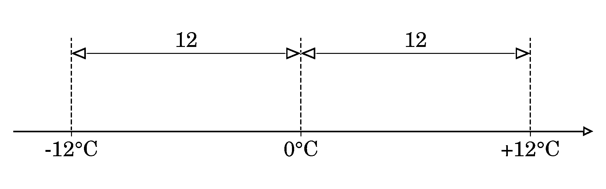
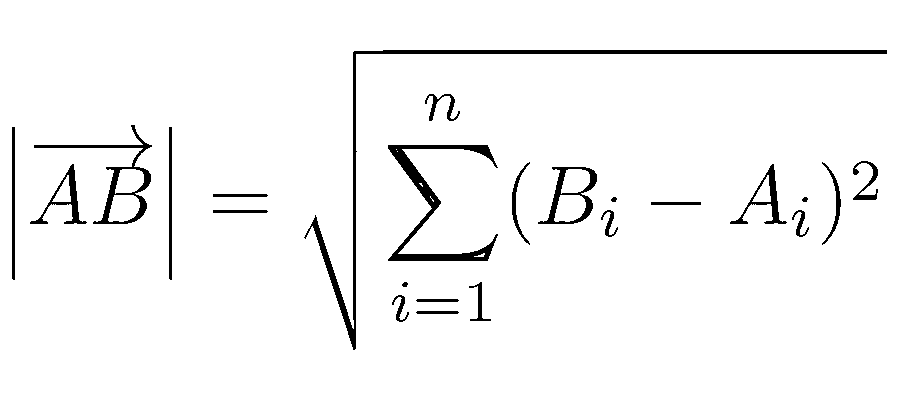

# 如何在 Python 中求绝对值

> 原文：<https://realpython.com/python-absolute-value/>

绝对值通常用于数学、物理和工程中。尽管学校对绝对值的定义可能看起来很简单，但实际上你可以从许多不同的角度来看待这个概念。如果您打算在 Python 中使用绝对值，那么您来对地方了。

**在本教程中，您将学习如何:**

*   从头开始执行**绝对值**功能
*   使用 Python 中的**内置`abs()`函数**
*   计算**数字**的绝对值
*   在**数字阵列**和**熊猫系列**上调用`abs()`
*   **自定义**对象上`abs()`的**行为**

如果你对绝对值函数的数学知识有点生疏也不用担心。在深入研究 Python 代码之前，您将首先刷新您的记忆。也就是说，请随意跳过下一部分，直接进入接下来的基本细节。

**示例代码:** [单击此处下载示例代码](https://realpython.com/bonus/python-absolute-value-code/)，您将使用它在 Python 中查找绝对值。

## 定义绝对值

绝对值让你决定一个物体的**大小**或**大小**，比如一个数字或一个[向量](https://en.wikipedia.org/wiki/Vector_(mathematics_and_physics))，而不管它的方向。当你忽略零时，实数可以有两个方向:正数或负数。另一方面，[复数](https://realpython.com/python-complex-numbers/)和向量可以有更多的方向。

注意:当你取一个数的绝对值时，你会丢失它的符号信息，或者更一般地说，它的方向信息。

以温度测量为例。如果温度计显示零下 12 摄氏度，你就可以说是零下 12 摄氏度。注意你是如何把最后一句话中的温度分解成一个量级，十二，和一个符号的。短语*在冰点以下*的意思和零摄氏度以下一样。温度的大小或绝对值与高得多的+12 摄氏度的绝对值相同。

使用数学符号，您可以将𝑥的绝对值定义为一个[分段函数](https://en.wikipedia.org/wiki/Piecewise)，它根据输入值的范围表现不同。绝对值的常用符号由两条垂直线组成:


<figcaption class="figure-caption text-center">Absolute Value Defined as a Piecewise Function</figcaption>

此函数返回大于或等于零的值，不做任何修改。另一方面，小于零的值的符号从负号变为正号。从代数上来说，这相当于求一个数的平方的平方根:


<figcaption class="figure-caption text-center">Absolute Value Defined Algebraically</figcaption>

当你对一个实数求平方时，你总是得到一个正的结果，即使这个数一开始是负的。例如，12 的平方和 12 的平方具有相同的值，等于 144。后来，当你计算 144 的平方根时，你只会得到没有负号的 12。

从几何学上讲，你可以把绝对值想象成离原点的**距离**，在之前温度读数的情况下，该距离在[数字线](https://en.wikipedia.org/wiki/Number_line)上为零:

[](https://files.realpython.com/media/plot_number_line.293268c27c16.jpg)

<figcaption class="figure-caption text-center">Absolute Value on a Number Line</figcaption>

要计算这个距离，可以从温度读数中减去原点(-12°C-0°C =-12°C)或者反过来(0°C-(-12°C)=+12°C)，然后去掉结果的符号。这里减去零并没有太大的区别，但参考点有时可能会发生偏移。对于束缚在空间固定点上的向量来说就是这样，空间固定点就是向量的原点。

向量就像数字一样，传达关于物理量的**方向**和**大小**的信息，但是是在多个维度上。例如，您可以将下落的雪花的[速度](https://en.wikipedia.org/wiki/Velocity)表示为一个三维向量:

[https://player.vimeo.com/video/734381007?background=1](https://player.vimeo.com/video/734381007?background=1)

该向量表示雪花相对于坐标系原点的当前位置。它还显示了雪花在空间中运动的方向和速度。向量越长，雪花的速度越大。只要向量的起点和终点的坐标是以米表示的，计算它的长度就会得到雪花在单位时间内以米测量的速度。

**注意:**看一个向量有两种方法。一个*束缚*向量是空间中一对有序的固定点，而一个*自由*向量只告诉你从 A 点到 B 点的坐标位移，而不透露它们的绝对位置。以下面的代码片段为例:

>>>

```py
>>> A = [1, 2, 3]
>>> B = [3, 2, 1]

>>> bound_vector = [A, B]
>>> bound_vector
[[1, 2, 3], [3, 2, 1]]

>>> free_vector = [b - a for a, b in zip(A, B)]
>>> free_vector
[2, 0, -2]
```

一个边界向量包围了这两个点，提供了相当多的信息。相比之下，自由向量只代表从 A 到 b 的移动。你可以通过从终点 b 减去起点 A 来计算自由向量。一种方法是用[列表理解](https://realpython.com/list-comprehension-python/)迭代连续的坐标对。

自由向量本质上是一个平移到坐标系原点的约束向量，所以它从零开始。

一个矢量的**长度**，也就是它的大小，是它的起点和终点𝐴和𝐵之间的距离，你可以用[欧几里德范数](https://en.wikipedia.org/wiki/Norm_(mathematics)#Euclidean_norm)来计算:



<figcaption class="figure-caption text-center">The Length of a Bound Vector as a Euclidean Norm</figcaption>

该公式计算𝑛-dimensional 向量𝐴𝐵的长度，方法是对𝑖.索引的每个维度上的点𝐴和𝐵的坐标之差的平方求和对于自由向量，初始点𝐴成为坐标系的原点(或零点)，这简化了公式，因为您只需要对向量的坐标求平方。

回想一下绝对值的代数定义。对于数字，它是数字平方的平方根。现在，当你在方程中增加更多的维度时，你最终得到了欧几里德范数的公式，如上所示。所以，向量的绝对值等于它的长度！

好吧。既然您已经知道了绝对值何时可能有用，那么是时候在 Python 中实现它们了！

[*Remove ads*](/account/join/)

## 在 Python 中实现绝对值函数

要在 Python 中实现绝对值函数，您可以采用早期的数学定义之一，并将其翻译成代码。例如，分段函数可能如下所示:

```py
def absolute_value(x):
    if x >= 0:
        return x
    else:
        return -x
```

您使用一个[条件语句](https://realpython.com/python-conditional-statements/)来检查用字母`x`表示的给定数字是否大于或等于零。如果是，那么你返回相同的数字。否则，你翻转数字的符号。因为这里只有两种可能的结果，你可以用一个适合单行的条件表达式重写上面的函数:

```py
def absolute_value(x):
    return x if x >= 0 else -x
```

这与之前的行为完全相同，只是以稍微紧凑的方式实现。当您没有很多逻辑进入代码中的两个可选分支时，条件表达式非常有用。

**注意:**或者，您可以依靠 Python 内置的 [`max()`](https://realpython.com/python-min-and-max/) 函数来更简洁地编写，该函数返回最大的参数:

```py
def absolute_value(x):
    return max(x, -x)
```

如果数字𝑥是负数，那么这个函数将返回它的正值。否则，它会返回𝑥本身。

绝对值的代数定义在 Python 中实现起来也非常简单:

```py
from math import sqrt

def absolute_value(x):
    return sqrt(pow(x, 2))
```

首先，从`math`模块导入[平方根函数](https://realpython.com/python-square-root-function/)，然后在给定的 2 次方数字上调用它。这个[函数](https://docs.python.org/3/library/functions.html#pow)内置在 Python 中，所以你不需要导入它。或者，您可以通过利用 Python 的[取幂运算符(`**` )](https://realpython.com/python-numbers/#exponents) )来完全避免 [`import`语句](https://realpython.com/python-modules-packages/#the-import-statement)，它可以模拟平方根函数:

```py
def absolute_value(x):
    return (x**2) ** 0.5
```

这是一种数学技巧，因为使用分数指数等同于计算一个数的 [𝑛th 根](https://en.wikipedia.org/wiki/Nth_root)。在这种情况下，你取一个平方数的二分之一(0.5)或二分之一( )，这与计算平方根是一样的。注意，基于代数定义的两种 Python 实现都有一点不足:

>>>

```py
>>> def absolute_value(x):
...     return (x**2) ** 0.5

>>> absolute_value(-12)
12.0

>>> type(12.0)
<class 'float'>
```

你总是以一个[浮点数](https://realpython.com/python-numbers/#floating-point-numbers)结束，即使你以一个[整数](https://realpython.com/python-numbers/#integers)开始。因此，如果您想保留数字的原始数据类型，那么您可能更喜欢基于分段的实现。

只要您使用整数和浮点数，您还可以通过利用 Python 中数字的文本表示来编写绝对值函数的一个有点傻的实现:

```py
def absolute_value(x):
    return float(str(x).lstrip("-"))
```

使用内置的`str()`函数将函数的参数`x`转换成一个 [Python 字符串](https://realpython.com/python-strings/)。这允许您用一个空字符串去掉前导减号(如果有)。然后，用`float()`将结果转换成浮点数。注意这个实现总是将整数转换成浮点数。

用 Python 从头实现绝对值函数是一项值得学习的工作。然而，在实际应用中，您应该利用 Python 自带的内置`abs()`函数。您将在下一节中找到原因。

## 使用内置的`abs()`函数和数字

上面实现的最后一个函数可能是效率最低的一个，因为数据转换和字符串操作通常比直接的数字操作要慢。但事实上，与语言内置的`abs()`函数相比，你所有手工实现的绝对值都相形见绌。那是因为`abs()`被编译成高速的[机器码](https://en.wikipedia.org/wiki/Machine_code)，而你的纯 Python 代码不是。

比起你的自定义函数，你应该总是更喜欢`abs()`。它的运行速度要快得多，当您有大量数据要处理时，这一优势会非常明显。此外，它的用途更加广泛，您将会发现这一点。

[*Remove ads*](/account/join/)

### 整数和浮点数

`abs()`函数是属于 Python 语言的[内置函数](https://docs.python.org/3/library/functions.html)之一。这意味着您可以立即开始使用它，而无需导入:

>>>

```py
>>> abs(-12)
12

>>> abs(-12.0)
12.0
```

如您所见，`abs()`保留了原始的数据类型。在第一种情况下，您传递了一个整数文本并得到了一个整数结果。当用浮点数调用时，该函数返回一个 Python `float`。但是这两种数据类型并不是唯一可以调用`abs()`的数据类型。`abs()`知道如何处理的第三个数字类型是 Python 的`complex`数据类型，它表示复数。

### 复数

你可以把一个[复数](https://realpython.com/python-complex-numbers/)想象成由两个浮点值组成的一对，俗称**实部**和**虚部**。在 Python 中定义复数的一种方法是调用内置的`complex()`函数:

>>>

```py
>>> z = complex(3, 2)
```

它接受两个参数。第一个代表实部，第二个代表虚部。在任何时候，您都可以访问复数的`.real`和`.imag`属性来取回这些部分:

>>>

```py
>>> z.real
3.0

>>> z.imag
2.0
```

它们都是只读的，并且总是表示为浮点值。还有，`abs()`返回的复数的绝对值恰好是浮点数:

>>>

```py
>>> abs(z)
3.605551275463989
```

这可能会让您感到惊讶，直到您发现复数有一个类似于固定在坐标系原点的二维向量的视觉表示:

[](https://files.realpython.com/media/complexn.580985f6c3a4.png)

您已经知道了计算这样一个向量的长度的公式，在本例中，它与`abs()`返回的数字一致。注意，复数的绝对值通常被称为复数的**幅度**、**模数**或**半径**。

虽然整数、浮点数和复数是 Python 本身支持的唯一数字类型，但是在 Python 的标准库中，您会发现另外两种数字类型。它们也可以与`abs()`函数互操作。

### 分数和小数

Python 中的`abs()`函数接受所有可用的数字数据类型，包括鲜为人知的[分数](https://realpython.com/python-fractions/)和[小数](https://realpython.com/python-rounding/#the-decimal-class)。例如，您可以将三分之一或负四分之三的绝对值定义为`Fraction`实例:

>>>

```py
>>> from fractions import Fraction

>>> abs(Fraction("1/3"))
Fraction(1, 3)

>>> abs(Fraction("-3/4"))
Fraction(3, 4)
```

在这两种情况下，您都获得了另一个`Fraction`对象，但是它是无符号的。如果您打算继续计算分数，这会很方便，因为分数比浮点数精度更高。

如果你在金融领域工作，那么你可能想要使用`Decimal`对象来帮助减轻[浮点表示错误](https://docs.python.org/3/tutorial/floatingpoint.html#representation-error)。幸运的是，您可以获得这些对象的绝对值:

>>>

```py
>>> from decimal import Decimal

>>> abs(Decimal("0.3333333333333333"))
Decimal('0.3333333333333333')

>>> abs(Decimal("-0.75"))
Decimal('0.75')
```

同样，`abs()`函数方便地返回与您提供的数据类型相同的数据类型，但是它给了您一个适当的正值。

哇，`abs()`可以处理多种多样的数字数据类型！但事实证明`abs()`比那更聪明。您甚至可以在第三方库提供的一些对象上调用它，这将在下一节中尝试。

[*Remove ads*](/account/join/)

## 在其他 Python 对象上调用`abs()`

假设您想要计算一段时间内日平均温度读数的绝对值。不幸的是，当您试图用这些数字在 Python 列表上调用`abs()`时，您会得到一个错误:

>>>

```py
>>> temperature_readings = [1, -5, 1, -4, -1, -8, 0, -7, 3, -5, 2]
>>> abs(temperature_readings)
Traceback (most recent call last):
  File "<stdin>", line 1, in <module>
TypeError: bad operand type for abs(): 'list'
```

那是因为`abs()`不知道怎么处理一串数字。要解决这个问题，您可以使用列表理解或调用 [Python 的`map()`](https://realpython.com/python-map-function/) 函数，如下所示:

>>>

```py
>>> [abs(x) for x in temperature_readings]
[1, 5, 1, 4, 1, 8, 0, 7, 3, 5, 2]

>>> list(map(abs, temperature_readings))
[1, 5, 1, 4, 1, 8, 0, 7, 3, 5, 2]
```

这两种实现都完成了工作，但是需要一个额外的步骤，这可能并不总是令人满意的。如果您想减少额外的步骤，那么您可以查看改变`abs()`行为的外部库。这就是您将在下面探讨的内容。

### 数字阵列和熊猫系列

用高性能数组和矩阵扩展 Python 的最流行的库之一是 [NumPy](https://realpython.com/numpy-array-programming/) 。它的𝑛-dimensional 数组数据结构`ndarray`，是 Python 中**数值计算**的基石，所以很多其他库都以它为基础。

一旦用`np.array()`将常规 Python 列表转换成 NumPy 数组，就可以调用一些内置函数，包括结果中的`abs()`:

>>>

```py
>>> import numpy as np
>>> temperature_readings = np.array([1, -5, 1, -4, -1, -8, 0, -7, 3, -5, 2])
>>> abs(temperature_readings)
array([1, 5, 1, 4, 1, 8, 0, 7, 3, 5, 2])
```

作为对在 NumPy 数组上调用`abs()`的响应，您将获得另一个包含原始元素绝对值的数组。就好像您自己迭代温度读数列表，并对每个元素单独应用`abs()`函数，就像您之前对列表理解所做的一样。

如果您觉得更合适，可以将 NumPy 数组转换回 Python 列表:

>>>

```py
>>> list(abs(temperature_readings))
[1, 5, 1, 4, 1, 8, 0, 7, 3, 5, 2]
```

但是，请注意 NumPy 数组共享大部分 Python 列表接口。例如，他们支持索引和[切片](https://realpython.com/python-lists-tuples/#modifying-multiple-list-values)，他们的方法类似于普通列表，所以大多数人通常只是坚持使用 NumPy 数组，而从来没有回头看列表。

[pandas](https://realpython.com/pandas-python-explore-dataset/) 是另一个广泛用于**数据分析**的第三方库，这要归功于它的`Series`和`DataFrame`对象。系列是一系列观察值或一列，而[数据帧](https://realpython.com/pandas-dataframe/)就像一个表格或一组列。你可以给他们俩都打电话`abs()`。

假设您有一个 [Python 字典](https://realpython.com/python-dicts/)，它将一个城市名称映射到一年中每月观察到的最低平均温度:

>>>

```py
>>> lowest_temperatures = {
...     "Reykjav\xedk": [-3, -2, -2, 1, 4, 7, 9, 8, 6, 2, -1, -2],
...     "Rovaniemi": [-16, -14, -10, -3, 3, 8, 12, 9, 5, -1, -6, -11],
...     "Valetta": [9, 9, 10, 12, 15, 19, 21, 22, 20, 17, 14, 11],
... }
```

每个城市有 12 个温度读数，时间跨度从 1 月到 12 月。现在，你可以把那本字典变成一个熊猫`DataFrame`对象，这样你就可以得出一些有趣的见解:

>>>

```py
>>> import calendar
>>> import pandas as pd

>>> df = pd.DataFrame(lowest_temperatures, index=calendar.month_abbr[1:])
>>> df
 Reykjavík  Rovaniemi  Valetta
Jan         -3        -16        9
Feb         -2        -14        9
Mar         -2        -10       10
Apr          1         -3       12
May          4          3       15
Jun          7          8       19
Jul          9         12       21
Aug          8          9       22
Sep          6          5       20
Oct          2         -1       17
Nov         -1         -6       14
Dec         -2        -11       11
```

您的数据框架不是使用默认的从零开始的索引，而是通过缩写的月份名称进行索引，这是您在 [`calendar`](https://docs.python.org/3/library/calendar.html#module-calendar) 模块的帮助下获得的。数据帧中的每一列都有来自原始字典的温度序列，表示为一个`Series`对象:

>>>

```py
>>> df["Rovaniemi"]
Jan   -16
Feb   -14
Mar   -10
Apr    -3
May     3
Jun     8
Jul    12
Aug     9
Sep     5
Oct    -1
Nov    -6
Dec   -11
Name: Rovaniemi, dtype: int64

>>> type(df["Rovaniemi"])
<class 'pandas.core.series.Series'>
```

通过使用方括号(`[]`)语法和罗瓦涅米这样的城市名称，您可以从 DataFrame 中提取单个`Series`对象，并缩小显示的信息量。

pandas，就像 NumPy 一样，让你在它的对象上调用 Python 的许多内置函数，包括它的`DataFrame`和`Series`对象。具体来说，可以调用`abs()`来一次计算多个绝对值:

>>>

```py
>>> abs(df)
 Reykjavík  Rovaniemi  Valetta
Jan          3         16        9
Feb          2         14        9
Mar          2         10       10
Apr          1          3       12
May          4          3       15
Jun          7          8       19
Jul          9         12       21
Aug          8          9       22
Sep          6          5       20
Oct          2          1       17
Nov          1          6       14
Dec          2         11       11

>>> abs(df["Rovaniemi"])
Jan    16
Feb    14
Mar    10
Apr     3
May     3
Jun     8
Jul    12
Aug     9
Sep     5
Oct     1
Nov     6
Dec    11
Name: Rovaniemi, dtype: int64
```

在整个数据帧上调用`abs()`会将该函数应用于每一列中的每个元素。也可以在单个列上调用`abs()`。

NumPy 和 pandas 是如何在不修改其底层代码的情况下改变 Python 内置`abs()`函数的行为的？嗯，这是可能的，因为该函数在设计时就考虑到了这种扩展。如果您正在寻找`abs()`的高级用法，那么请继续阅读，创建您自己的数据类型，它将很好地与该函数配合使用。

[*Remove ads*](/account/join/)

### 您自己的数据类型

根据数据类型的不同，Python 会以不同的方式处理绝对值的计算。

当你在一个整数上调用`abs()`时，它将使用一个定制的代码片段，类似于你的分段函数。然而，为了提高效率，这个功能将用 C 编程语言来实现。如果你传递一个浮点数，那么 Python 会把这个调用委托给 C 的 [`fabs()`](https://pubs.opengroup.org/onlinepubs/000095399/functions/fabs.html) 函数。在复数的情况下，它会调用 [`hypot()`](https://pubs.opengroup.org/onlinepubs/000095399/functions/hypot.html) 函数来代替。

像 DataFrames、series 和 arrays 这样的容器对象呢？

可以理解的是，当您在 Python 中定义一个新的数据类型时，它不会与`abs()`函数一起工作，因为它的默认行为是未知的。但是，您可以通过使用纯 Python 实现特殊的 [`.__abs__()`](https://docs.python.org/3/reference/datamodel.html#object.__abs__) 方法，针对您的类实例定制`abs()`的行为。Python 中有一组有限的预定义的[特殊方法](https://docs.python.org/3/glossary.html#term-special-method)，可以让你覆盖某些函数和操作符应该如何工作。

考虑下面的类，它表示在[欧几里得空间](https://en.wikipedia.org/wiki/Euclidean_space)中的一个自由𝑛-dimensional 向量:

>>>

```py
>>> import math

>>> class Vector:
...     def __init__(self, *coordinates):
...         self.coordinates = coordinates
...
...     def __abs__(self):
...         origin = [0] * len(self.coordinates)
...         return math.dist(origin, self.coordinates)
```

这个类接受一个或多个坐标值，描述从坐标系原点在每个维度上的位移。你的特殊的`.__abs__()`方法根据你在本教程开始时学到的**欧几里德范数**定义计算到原点的距离。

为了测试你的新类，你可以创建一个三维的**速度向量**，比如一片落下的雪花，看起来像这样:

>>>

```py
>>> snowflake_velocity = Vector(0.42, 1.5, 0.87)
>>> abs(snowflake_velocity)
1.7841804841439108
```

注意在你的`Vector`类实例上调用`abs()`如何返回正确的绝对值，大约等于 1.78。只要雪花的位移是在相隔一秒钟的两个不同时刻以米为单位测量的，速度单位将以米/秒表示。换句话说，雪花从 A 点到 b 点需要一秒钟。

使用上面提到的公式会迫使您定义原点。然而，因为您的`Vector`类表示自由向量而不是约束向量，所以您可以通过使用 Python 的`math.hypot()`函数计算多维[斜边](https://en.wikipedia.org/wiki/Hypotenuse)来简化您的代码:

>>>

```py
>>> import math

>>> class Vector:
...     def __init__(self, *coordinates):
...         self.coordinates = coordinates
...
...     def __abs__(self):
...         return math.hypot(*self.coordinates) 
>>> snowflake_velocity = Vector(0.42, 1.5, 0.87)
>>> abs(snowflake_velocity)
1.7841804841439108
```

您可以用更少的代码行获得相同的结果。注意，`hypot()`是一个接受可变数量参数的[变量函数](https://en.wikipedia.org/wiki/Variadic_function)，因此您必须使用星号运算符(`*`)将坐标元组解包到这些参数中。

厉害！您现在可以实现自己的库，Python 的内置`abs()`函数将知道如何使用它。您将获得与 NumPy 或 pandas 类似的功能！

## 结论

用 Python 实现绝对值公式轻而易举。然而，Python 已经提供了多功能的`abs()`函数，它允许您计算各种类型数字的绝对值，包括整数、浮点数、复数等等。您还可以在自定义类和第三方库对象的实例上使用`abs()`。

**在本教程中，您学习了如何:**

*   从头开始执行**绝对值**功能
*   使用 Python 中的**内置`abs()`函数**
*   计算**数字**的绝对值
*   在**数字阵列**和**熊猫系列**上调用`abs()`
*   **自定义**对象上`abs()`的**行为**

有了这些知识，您就拥有了在 Python 中计算绝对值的有效工具。

**示例代码:** [单击此处下载示例代码](https://realpython.com/bonus/python-absolute-value-code/)，您将使用它在 Python 中查找绝对值。****