# Python AI:如何构建神经网络并进行预测

> 原文：<https://realpython.com/python-ai-neural-network/>

*立即观看**本教程有真实 Python 团队创建的相关视频课程。和书面教程一起看，加深理解: [**构建神经网络&用 Python AI 做预测**](/courses/build-neural-network-python-ai/)

如果你刚刚开始进入人工智能(AI)世界，那么 Python 是一门很好的学习语言，因为大多数工具都是用它构建的。**深度学习**是一种利用数据进行预测的技术，它严重依赖于[神经网络](https://en.wikipedia.org/wiki/Neural_network)。今天，你将学习如何从头开始建立一个神经网络。

在生产环境中，你会使用像 [TensorFlow](https://www.tensorflow.org/) 或 [PyTorch](https://pytorch.org/) 这样的深度学习框架，而不是建立自己的神经网络。也就是说，了解一些神经网络如何工作是有帮助的，因为你可以用它来更好地构建你的深度学习模型。

在本教程中，您将学习:

*   什么是**人工智能**
*   **机器学习**和**深度学习**如何在 AI 中发挥作用
*   一个**神经网络**如何在内部运行
*   如何**使用 Python 从头开始构建神经网络**

我们开始吧！

**免费奖励:** [点击此处获取免费的 NumPy 资源指南](#)，它会为您指出提高 NumPy 技能的最佳教程、视频和书籍。

## 人工智能概述

用基本术语来说，使用人工智能的目标是让计算机像人类一样思考。这似乎是新的东西，但这个领域诞生于 20 世纪 50 年代。

想象一下，你需要编写一个 Python 程序，使用 AI 来[解决一个数独问题](https://realpython.com/python-practice-problems/#python-practice-problem-5-sudoku-solver)。实现这一点的一个方法是编写[条件语句](https://realpython.com/python-conditional-statements/)，并检查约束条件，看看是否可以在每个位置放置一个数字。嗯，这个 Python 脚本已经是 AI 的一个应用了，因为你给计算机编程解决了一个问题！

**机器学习(ML)****深度学习(DL)** 也是解决问题的途径。这些技术与 Python 脚本的区别在于，ML 和 DL 使用**训练数据**而不是硬编码的规则，但它们都可以用来解决使用 AI 的问题。在接下来的部分中，您将了解更多关于这两种技术的区别。

[*Remove ads*](/account/join/)

### 机器学习

机器学习是一种技术，在这种技术中，你训练系统来解决问题，而不是显式地编程规则。回到上一节中的数独示例，为了使用机器学习来解决问题，您将从已解决的数独游戏中收集数据，并训练一个**统计模型**。[统计模型](https://en.wikipedia.org/wiki/Statistical_model)是一种数学上形式化的方法，用来近似一种现象的行为。

一个常见的机器学习任务是[监督学习](https://en.wikipedia.org/wiki/Supervised_learning)，其中你有一个带有输入和已知输出的数据集。任务是使用该数据集来训练模型，该模型根据输入来预测正确的输出。下图显示了使用监督学习训练模型的工作流程:

[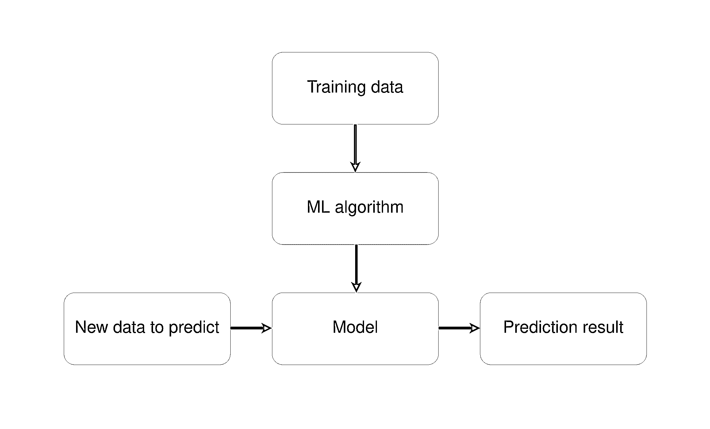](https://files.realpython.com/media/ML_workflow.8620ebb656aa.png)

<figcaption class="figure-caption text-center">Workflow to train a machine learning model</figcaption>

训练数据与机器学习算法的结合创建了模型。然后，使用这个模型，您可以对新数据进行预测。

**注:** [scikit-learn](https://scikit-learn.org) 是一个流行的 Python 机器学习库，提供了许多监督和非监督学习算法。要了解更多信息，请查看[用 scikit-learn 的 train_test_split()](https://realpython.com/train-test-split-python-data/) 分割数据集。

监督学习任务的目标是对新的、看不见的数据进行预测。为此，假设这些看不见的数据遵循一个类似于训练数据集分布的[概率分布](https://en.wikipedia.org/wiki/Probability_distribution)。如果将来这种分布发生变化，那么您需要使用新的训练数据集再次训练您的模型。

### 特征工程

当您使用不同种类的数据作为输入时，预测问题会变得更加困难。数独问题相对简单，因为你直接和数字打交道。如果你想训练一个模型来预测一个句子中的情绪呢？或者，如果你有一个图像，你想知道它是否描绘了一只猫？

输入数据的另一个名称是**特征**，**特征工程**是从原始数据中提取特征的过程。当处理不同种类的数据时，您需要找出表示这些数据的方法，以便从中提取有意义的信息。

特征工程技术的一个例子是[词汇化](https://realpython.com/sentiment-analysis-python/#normalizing-words)，在这种技术中，你可以从一个句子中的单词中去除音调变化。例如，动词“watch”的屈折形式，如“watches”、“watching”和“watched”，将被简化为它们的**词条**，或基本形式:“watch”

如果您使用数组来存储语料库中的每个单词，那么通过应用词汇化，您最终会得到一个不太稀疏的矩阵。这可以提高一些机器学习算法的性能。下图展示了使用[单词袋模型](https://en.wikipedia.org/wiki/Bag-of-words_model)进行词汇化和表示的过程:

[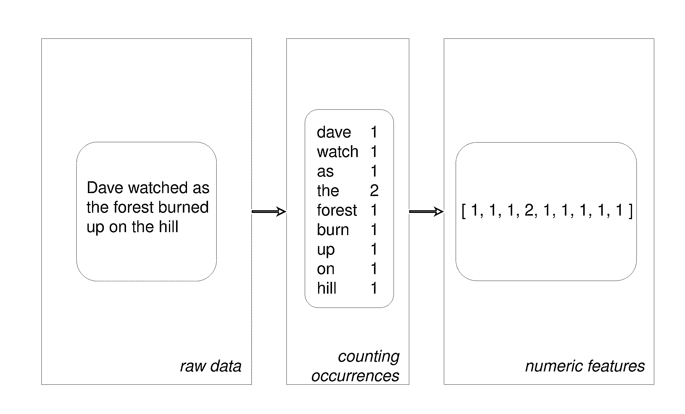](https://files.realpython.com/media/Features_from_text.9296775db229.png)

<figcaption class="figure-caption text-center">Creating features using a bag-of-words model</figcaption>

首先，每个单词的屈折形式被简化为它的引理。然后，计算该单词出现的次数。结果是一个包含文本中每个单词出现次数的数组。

### 深度学习

深度学习是一种技术，在这种技术中，你让神经网络自己找出哪些特征是重要的，而不是应用特征工程技术。这意味着，通过深度学习，你可以绕过特征工程过程。

不必处理特征工程是件好事，因为随着数据集变得越来越复杂，这个过程会变得越来越困难。例如，给定一个人的脸部照片，你如何提取数据来预测她的情绪？有了神经网络，你就不需要担心了，因为网络可以自己学习特征。在接下来的部分中，您将深入研究神经网络，以更好地理解它们是如何工作的。

## 神经网络:主要概念

神经网络是一个通过以下步骤学习如何进行预测的系统:

1.  获取输入数据
2.  做一个预测
3.  将预测与期望输出进行比较
4.  调整其内部状态以正确预测下一次

**向量**、**层**和**线性回归**是神经网络的一些构建模块。数据存储为向量，使用 Python 可以将这些向量存储在[数组](https://realpython.com/numpy-array-programming/)中。每一层都转换来自前一层的数据。您可以将每一层视为一个特征工程步骤，因为每一层都提取了先前数据的一些表示。

关于神经网络层的一件很酷的事情是，同样的计算可以从任何种类的数据中提取信息。这意味着无论您使用的是图像数据还是文本数据都没有关系。提取有意义的信息和训练深度学习模型的过程对于两种场景都是相同的。

在下图中，您可以看到一个具有两层的网络架构示例:

[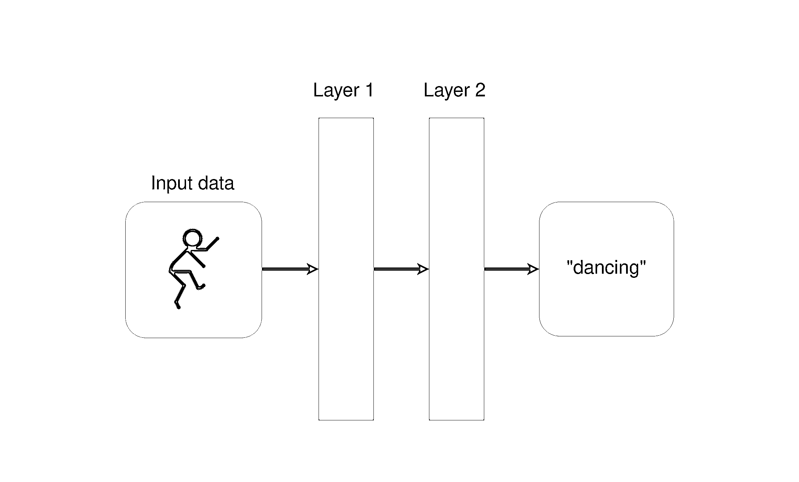](https://files.realpython.com/media/neural_network_layers.c8fe82979288.png)

<figcaption class="figure-caption text-center">A neural network with two layers</figcaption>

每一层都通过应用一些数学运算来转换来自前一层的数据。

[*Remove ads*](/account/join/)

### 训练神经网络的过程

训练一个神经网络类似于试错的过程。想象你第一次玩飞镖。在你的第一次投掷中，你试图击中镖靶的中心点。通常，第一枪只是为了感受一下你的手的高度和速度是如何影响结果的。如果你看到镖高于中心点，那么你调整你的手扔低一点，以此类推。

以下是尝试击中镖靶中心的步骤:

[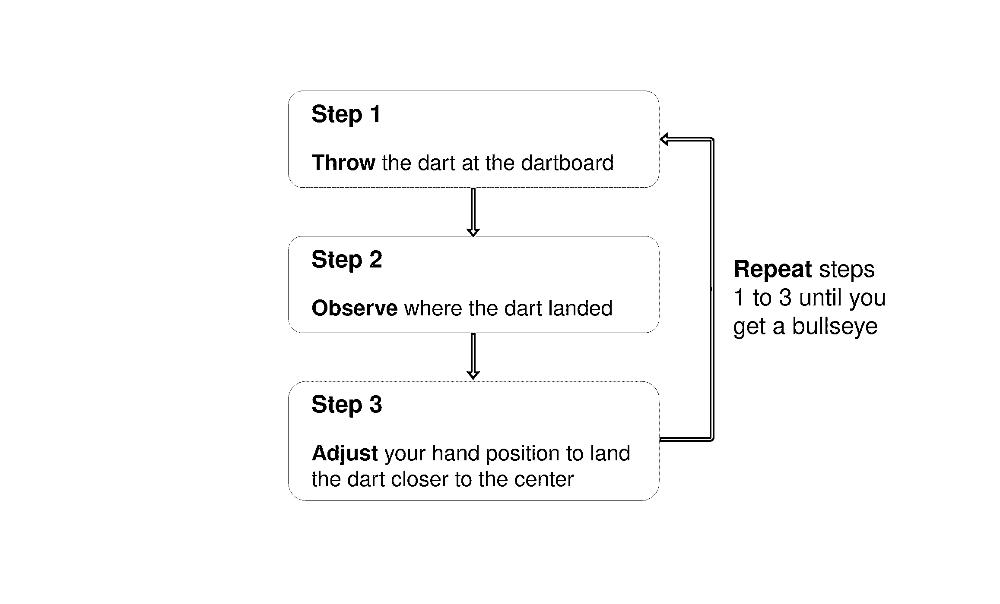](https://files.realpython.com/media/infographic.3276fe49eff4.png)

<figcaption class="figure-caption text-center">Steps to hit the center of a dartboard</figcaption>

请注意，您一直通过观察飞镖落地的位置来评估错误(步骤 2)。你继续前进，直到你最终击中镖靶的中心。

对于神经网络，过程非常相似:你从一些随机的**权重**和**偏差**向量开始，进行预测，将其与期望的输出进行比较，并调整向量以在下一次更准确地预测。该过程继续，直到预测和正确目标之间的差异最小。

知道何时停止训练以及设定什么精度目标是训练神经网络的一个重要方面，主要是因为[过拟合和欠拟合](https://realpython.com/linear-regression-in-python/#underfitting-and-overfitting)场景。

### 向量和权重

使用神经网络包括对向量进行运算。你把向量表示成多维数组。向量在深度学习中很有用，主要是因为一个特殊的操作:点积。两个向量的点积告诉你它们在方向上有多相似，并且由两个向量的大小来决定。

神经网络中的主要向量是权重和偏差向量。不严格地说，你希望你的神经网络做的是检查一个输入是否与它已经看到的其他输入相似。如果新的输入与先前看到的输入相似，那么输出也将相似。这就是你得到预测结果的方式。

### 线性回归模型

当你需要估计一个**因变量**和两个或多个**自变量**之间的关系时，使用**回归**。[线性回归](https://realpython.com/linear-regression-in-python/)是一种将变量之间的关系近似为线性的方法。该方法可追溯到十九世纪，是最流行的回归方法。

**注:****线性**关系是自变量和因变量之间有直接关系的关系。

通过将变量之间的关系建模为线性，您可以将因变量表示为自变量的**加权和**。所以，每个独立变量都会乘以一个叫做`weight`的向量。除了权重和自变量，您还添加了另一个向量:偏差**。当所有其他独立变量都等于零时，它设置结果。*

*作为如何构建线性回归模型的真实示例，假设您想要训练一个模型来根据面积和房屋的年龄预测房屋的价格。您决定使用线性回归来模拟这种关系。以下代码块显示了如何用伪代码为所述问题编写线性回归模型:

```py
price = (weights_area * area) + (weights_age * age) + bias
```

上例中有两个权重:`weights_area`和`weights_age`。训练过程包括调整权重和偏差，以便模型可以预测正确的价格值。为此，您需要计算预测误差并相应地更新权重。

这些是神经网络机制如何工作的基础。现在是时候看看如何使用 Python 应用这些概念了。

## Python AI:开始构建你的第一个神经网络

建立神经网络的第一步是从输入数据生成输出。你可以通过创建变量的加权和来实现。您需要做的第一件事是用 Python 和 [NumPy](https://realpython.com/numpy-tutorial/) 表示输入。

[*Remove ads*](/account/join/)

### 用 NumPy 包装神经网络的输入

您将使用 NumPy 将网络的输入向量表示为数组。但是在使用 NumPy 之前，最好使用纯 Python 中的矢量来更好地理解发生了什么。

在第一个例子中，您有一个输入向量和另外两个权重向量。目标是在考虑方向和大小的情况下，找出哪个权重与输入更相似。如果你画出这些向量，这就是它们的样子:

[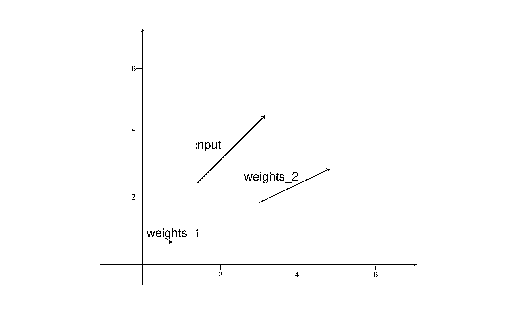](https://files.realpython.com/media/three_vectors_2d.9d220456ff49.png)

<figcaption class="figure-caption text-center">Three vectors in a cartesian coordinate plane</figcaption>

`weights_2`更类似于输入向量，因为它指向相同的方向，大小也相似。那么如何使用 Python 找出哪些向量是相似的呢？

首先，定义三个向量，一个用于输入，另外两个用于权重。然后你计算`input_vector`和`weights_1`有多相似。为此，您将应用 [**点积**](https://en.wikipedia.org/wiki/Dot_product) 。因为所有的向量都是二维向量，所以步骤如下:

1.  将`input_vector`的第一个索引乘以`weights_1`的第一个索引。
2.  将`input_vector`的第二个指数乘以`weights_2`的第二个指数。
3.  将两次乘法的结果相加。

你可以使用 IPython 控制台或 [Jupyter 笔记本](https://realpython.com/jupyter-notebook-introduction/)跟随。每次开始一个新的 Python 项目时，创建一个新的[虚拟环境](https://realpython.com/python-virtual-environments-a-primer/)是一个很好的实践，所以你应该首先这样做。[`venv`](https://docs.python.org/3/library/venv.html)Python 3.3 版及以上版本自带，方便创建虚拟环境:

```py
$ python -m venv ~/.my-env
$ source ~/.my-env/bin/activate
```

使用上面的命令，首先创建虚拟环境，然后激活它。现在是时候使用`pip`安装 IPython 控制台了。因为你还需要 NumPy 和 [Matplotlib](https://realpython.com/python-matplotlib-guide/) ，安装它们也是个好主意:

```py
(my-env) $ python -m pip install ipython numpy matplotlib
(my-env) $ ipython
```

现在您已经准备好开始编码了。这是计算`input_vector`和`weights_1`的点积的代码:

>>>

```py
In [1]: input_vector = [1.72, 1.23]
In [2]: weights_1 = [1.26, 0]
In [3]: weights_2 = [2.17, 0.32]

In [4]: # Computing the dot product of input_vector and weights_1
In [5]: first_indexes_mult = input_vector[0] * weights_1[0]
In [6]: second_indexes_mult = input_vector[1] * weights_1[1]
In [7]: dot_product_1 = first_indexes_mult + second_indexes_mult

In [8]: print(f"The dot product is: {dot_product_1}")
Out[8]: The dot product is: 2.1672
```

点积的结果是`2.1672`。现在你知道了如何计算点积，是时候使用 NumPy 的`np.dot()`了。下面是如何使用`np.dot()`计算`dot_product_1`:

>>>

```py
In [9]: import numpy as np

In [10]: dot_product_1 = np.dot(input_vector, weights_1) 
In [11]: print(f"The dot product is: {dot_product_1}")
Out[11]: The dot product is: 2.1672
```

做了和以前一样的事情，但是现在你只需要指定两个数组作为参数。现在让我们计算`input_vector`和`weights_2`的点积:

>>>

```py
In [10]: dot_product_2 = np.dot(input_vector, weights_2) 
In [11]: print(f"The dot product is: {dot_product_2}")
Out[11]: The dot product is: 4.1259
```

这一次，结果是`4.1259`。作为一种思考点积的不同方式，您可以将向量坐标之间的相似性视为一个开关。如果乘法结果是`0`，那么你会说坐标是*而不是*相似。如果结果不是`0`，那么你会说它们*和*相似。

这样，您可以将点积视为向量之间相似性的松散度量。每次乘法结果都是`0`，最后的点积会有一个较低的结果。回到例子的向量，由于`input_vector`和`weights_2`的点积是`4.1259`，而`4.1259`大于`2.1672`，这意味着`input_vector`更类似于`weights_2`。你将在你的神经网络中使用同样的机制。

**注意:**如果需要复制粘贴，点击每个代码块右上角的提示(> > >)。

在本教程中，您将训练一个模型来做出只有两种可能结果的预测。输出结果可以是`0`或`1`。这是一个**分类问题**，一个监督学习问题的子集，其中你有一个带有输入和已知目标的数据集。这些是数据集的输入和输出:

| 输入向量 | 目标 |
| --- | --- |
| [1.66, 1.56] | one |
| [2, 1.5] | Zero |

**目标**是你要预测的变量。在本例中，您正在处理一个由数字组成的数据集。这在真实的生产场景中并不常见。通常，当需要深度学习模型时，数据会以文件的形式呈现，如图像或文本。

[*Remove ads*](/account/join/)

### 做出你的第一个预测

由于这是您的第一个神经网络，您将保持事情简单明了，建立一个只有两层的网络。到目前为止，您已经看到在神经网络中使用的唯一两个操作是点积和求和。两者都是**线性运算**。

如果您添加更多的图层，但一直只使用线性运算，那么添加更多的图层将不会有任何效果，因为每一个图层总是与前一个图层的输入有一些关联。这意味着，对于具有多个图层的网络，总会有一个具有较少图层的网络预测相同的结果。

您想要的是找到一种操作，使中间层有时与输入相关，有时不相关。

您可以通过使用非线性函数来实现这一行为。这些非线性函数称为**激活函数**。有许多类型的激活功能。例如， [ReLU(整流线性单元)](https://en.wikipedia.org/wiki/Rectifier_(neural_networks))是将所有负数转换为零的功能。这意味着如果权重为负，网络可以“关闭”权重，从而增加非线性。

您正在构建的网络将使用[s 形激活功能](https://en.wikipedia.org/wiki/Sigmoid_function)。你将在最后一层使用它，`layer_2`。数据集中仅有的两个可能输出是`0`和`1`，sigmoid 函数将输出限制在`0`和`1`之间的范围内。这是表示 sigmoid 函数的公式:

[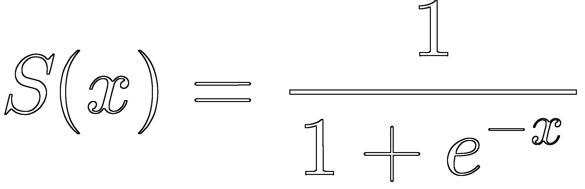](https://files.realpython.com/media/sigmoid_function.f966c820f8c3.png)

<figcaption class="figure-caption text-center">Sigmoid function formula</figcaption>

*e* 是一个叫做[欧拉数](https://en.wikipedia.org/wiki/E_(mathematical_constant))的数学常数，你可以用`np.exp(x)`来计算 *eˣ* 。

概率函数给你一个事件的可能结果发生的概率。数据集仅有的两个可能输出是`0`和`1`，而[伯努利分布](https://en.wikipedia.org/wiki/Bernoulli_distribution)也是一个有两个可能结果的分布。如果你的问题遵循伯努利分布，sigmoid 函数是一个很好的选择，所以[这就是为什么你在神经网络的最后一层使用它](http://citeseerx.ist.psu.edu/viewdoc/download?doi=10.1.1.476.1842&rep=rep1&type=pdf)。

因为该函数将输出限制在`0`到`1`的范围内，所以您将使用它来预测概率。如果输出大于`0.5`，那么你会说预测是`1`。如果它低于`0.5`，那么你会说预测是`0`。这是你正在构建的网络内部的计算流程:

[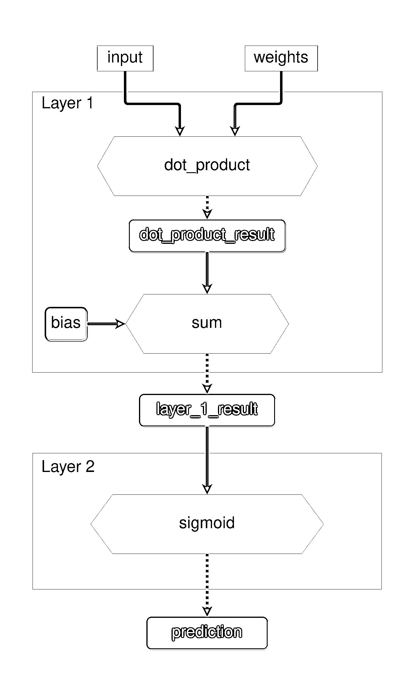](https://files.realpython.com/media/network_architecture.406cfcc68417.png)

<figcaption class="figure-caption text-center">The flow of computations inside your neural network</figcaption>

黄色六边形代表函数，蓝色矩形代表中间结果。现在是时候将这些知识转化为代码了。您还需要用 NumPy 数组包装向量。这是应用上图所示功能的代码:

>>>

```py
In [12]: # Wrapping the vectors in NumPy arrays
In [13]: input_vector = np.array([1.66, 1.56])
In [14]: weights_1 = np.array([1.45, -0.66])
In [15]: bias = np.array([0.0])

In [16]: def sigmoid(x):
 ...:    return 1 / (1 + np.exp(-x))

In [17]: def make_prediction(input_vector, weights, bias):
 ...:     layer_1 = np.dot(input_vector, weights) + bias ...:     layer_2 = sigmoid(layer_1) ...:     return layer_2 
In [18]: prediction = make_prediction(input_vector, weights_1, bias) 
In [19]: print(f"The prediction result is: {prediction}")
Out[19]: The prediction result is: [0.7985731]
```

原始预测结果为`0.79`，高于`0.5`，因此输出为`1`。网络做出了正确的预测。现在尝试使用另一个输入向量`np.array([2, 1.5])`。这个输入的正确结果是`0`。您只需要更改`input_vector`变量，因为所有其他参数保持不变:

>>>

```py
In [20]: # Changing the value of input_vector
In [21]: input_vector = np.array([2, 1.5]) 
In [22]: prediction = make_prediction(input_vector, weights_1, bias) 
In [23]: print(f"The prediction result is: {prediction}")
Out[23]: The prediction result is: [0.87101915]
```

这一次，网络做出了错误的预测。结果应该小于`0.5`，因为这个输入的目标是`0`，但是原始结果是`0.87`。它做了一个错误的猜测，但是错误有多严重呢？下一步是找到一种评估的方法。

## 训练你的第一个神经网络

在训练神经网络的过程中，您首先评估误差，然后相应地调整权重。为了调整权重，您将使用**梯度下降**和**反向传播**算法。应用梯度下降来寻找方向和速率以更新参数。

在对网络进行任何更改之前，您需要计算误差。这是您将在下一部分中执行的操作。

### 计算预测误差

要了解误差的大小，您需要选择一种方法来测量它。用于测量误差的函数被称为**成本函数**，或**损失函数**。在本教程中，您将使用[均方差(MSE)](https://en.wikipedia.org/wiki/Mean_squared_error) 作为您的成本函数。计算 MSE 分两步:

1.  计算预测值和目标值之间的差异。
2.  将结果本身相乘。

网络可能会因输出高于或低于正确值的值而出错。因为 MSE 是预测和正确结果之间的*平方*差，使用这个度量，您将总是以正值结束。

这是计算上一次预测误差的完整表达式:

>>>

```py
In [24]: target = 0

In [25]: mse = np.square(prediction - target)

In [26]: print(f"Prediction: {prediction}; Error: {mse}")
Out[26]: Prediction: [0.87101915]; Error: [0.7586743596667225]
```

在上面的例子中，错误是`0.75`。将差异乘以自身的一个含义是，较大的误差具有更大的影响，而较小的误差随着它们的减少而变得越来越小。

[*Remove ads*](/account/join/)

### 了解如何减少误差

目标是改变权重和偏差变量，这样可以减少误差。为了理解这是如何工作的，您将只更改权重变量，并暂时保持偏差不变。也可以去掉 sigmoid 函数，只使用`layer_1`的结果。剩下要做的就是找出如何修改权重，从而降低误差。

你通过做`error = np.square(prediction - target)`来计算 MSE。如果你把`(prediction - target)`看成一个单变量`x`，那么你就有了`error = np.square(x)`，它是一个[二次函数](https://en.wikipedia.org/wiki/Quadratic_function)。如果你画出这个函数，它看起来是这样的:

[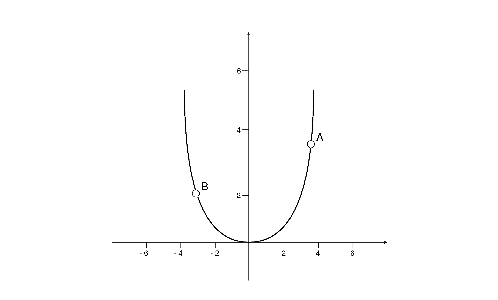](https://files.realpython.com/media/quatratic_function.002729dea332.png)

<figcaption class="figure-caption text-center">Plot of a quadratic function</figcaption>

误差由 y 轴给出。如果你在点`A`上，想要将误差减小到 0，那么你需要降低`x`的值。另一方面，如果你在点`B`上，想要减少误差，那么你需要提高`x`的值。为了知道你应该往哪个方向减少误差，你将使用**导数**。导数[精确地解释了一个模式将如何变化](https://betterexplained.com/articles/calculus-building-intuition-for-the-derivative/)。

导数的另一个词是**梯度**。**梯度下降**是用于寻找方向和速率以更新网络参数的算法的名称。

**注意:**要了解更多关于梯度下降背后的数学知识，请查看使用 Python 和 NumPy 的[随机梯度下降算法](https://realpython.com/gradient-descent-algorithm-python/)。

在本教程中，你不会关注导数背后的理论，所以你将简单地对你将遇到的每个函数应用[导数规则](https://www.mathsisfun.com/calculus/derivatives-rules.html)。[幂法则](https://en.wikipedia.org/wiki/Power_rule)表明 *xⁿ* 的导数是 *nx* ⁽ *ⁿ* ⁻ ⁾.所以`np.square(x)`的导数是`2 * x`，`x`的导数是`1`。

记住错误表达式是`error = np.square(prediction - target)`。当你把`(prediction - target)`当成单变量`x`时，误差的导数就是`2 * x`。通过对这个函数求导，你想知道你应该在什么方向改变`x`以使`error`的结果为零，从而减少误差。

当涉及到你的神经网络时，导数会告诉你应该采取什么方向来更新权重变量。如果它是一个正数，那么你预测得太高了，你需要降低权重。如果是负数，那么你预测的太低了，你需要增加权重。

现在是时候写代码弄清楚如何为之前的错误预测更新`weights_1`了。如果均方差是`0.75`，那么应该增加还是减少权重？由于导数是`2 * x`，你只需要将预测值和目标值之差乘以`2`:

>>>

```py
In [27]: derivative = 2 * (prediction - target)

In [28]: print(f"The derivative is {derivative}")
Out[28]: The derivative is: [1.7420383]
```

结果是`1.74`，一个正数，所以你需要减少权重。你可以通过减去权重向量的导数结果来实现。现在您可以相应地更新`weights_1`并再次预测，以查看它如何影响预测结果:

>>>

```py
In [29]: # Updating the weights
In [30]: weights_1 = weights_1 - derivative 
In [31]: prediction = make_prediction(input_vector, weights_1, bias)

In [32]: error = (prediction - target) ** 2 
In [33]: print(f"Prediction: {prediction}; Error: {error}")
Out[33]: Prediction: [0.01496248]; Error: [0.00022388]
```

误差降到差不多`0`！很漂亮，对吧？在这个例子中，导数结果很小，但是在某些情况下，导数结果太高。以二次函数的图像为例。高增量是不理想的，因为你可以从点`A`一直到点`B`，永远不会接近零。为了解决这个问题，您可以用导数结果的一部分来更新权重。

要定义更新权重的分数，您可以使用 **alpha** 参数，也称为**学习速率**。如果你降低学习率，那么增量就更小。如果你增加它，那么步骤是更高的。你怎么知道最佳学习率值是多少？通过猜测和实验。

**注:**传统默认学习率值为`0.1`、`0.01`、`0.001`。

如果你用新的权重，用第一个输入向量做预测，你会发现现在它对那个向量做了错误的预测。如果你的神经网络对训练集中的每个实例都做出了正确的预测，那么你可能有一个[过度拟合的模型](https://en.wikipedia.org/wiki/Overfitting)，其中该模型只记得如何对实例进行分类，而不是学习注意数据中的特征。

有一些技术可以避免这种情况，包括[正则化](https://en.wikipedia.org/wiki/Regularization_(mathematics))[随机梯度下降](https://realpython.com/gradient-descent-algorithm-python/#stochastic-gradient-descent-algorithms)。在本教程中，你将使用[在线随机梯度下降](https://realpython.com/gradient-descent-algorithm-python/#stochastic-gradient-descent-algorithms)。

既然你知道了如何计算误差以及如何相应地调整权重，那么是时候回去继续构建你的神经网络了。

[*Remove ads*](/account/join/)

### 应用链式法则

在你的神经网络中，你需要更新权重*和*偏差向量。您用来测量误差的函数取决于两个独立变量，权重和偏差。由于权重和偏差是[独立变量](https://en.wikipedia.org/wiki/Dependent_and_independent_variables)，您可以改变和调整它们以获得您想要的结果。

您正在构建的网络有两层，由于每层都有自己的功能，您正在处理一个[功能组合](https://en.wikipedia.org/wiki/Function_composition)。这意味着误差函数仍然是`np.square(x)`，但是现在`x`是另一个函数的结果。

重申一下问题，现在你想知道如何改变`weights_1`和`bias`来减少误差。你已经看到，你可以用导数来做这个，但不是一个只有和的函数，现在你有一个函数，它用其他函数来产生结果。

既然现在你已经有了这个函数组合，要对关于参数的误差求导，你需要使用微积分中的[链式法则](https://en.wikipedia.org/wiki/Chain_rule)。利用链式法则，你得到每个函数的偏导数，对它们求值，然后把所有的偏导数相乘，得到你想要的导数。

现在你可以开始更新权重了。你想知道如何改变权重来减少误差。这意味着您需要计算误差相对于重量的导数。由于误差是通过组合不同的函数来计算的，所以需要对这些函数求偏导数。

以下是如何应用链式法则计算误差相对于权重的导数的直观表示:

[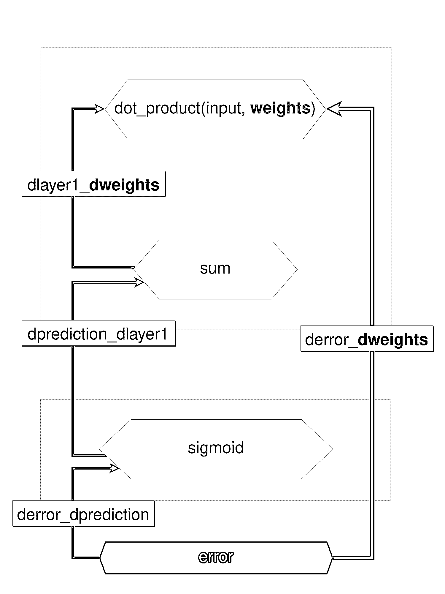](https://files.realpython.com/media/partial_derivative_weights_2.c792633559c3.png)

<figcaption class="figure-caption text-center">A diagram showing the partial derivatives inside the neural network</figcaption>

红色粗体箭头显示您想要的导数，`derror_dweights`。你将从红色的六边形开始，采取与预测相反的方式，计算每个函数的[偏导数](https://en.wikipedia.org/wiki/Partial_derivative)。

在上图中，每个函数用黄色六边形表示，偏导数用左边的灰色箭头表示。应用链式法则，`derror_dweights`的值如下:

```py
derror_dweights = (
    derror_dprediction * dprediction_dlayer1 * dlayer1_dweights
)
```

为了计算导数，将所有偏导数相乘，这些偏导数沿着从误差六边形(红色的那个)到找到权重的六边形(最左边的绿色的那个)的路径。

你可以说`y = f(x)`的导数就是`f`相对于`x`的导数。使用这个术语，对于`derror_dprediction`，您想要知道计算相对于预测值的误差的函数的导数。

这个反向路径被称为**反向路径**。在每次反向传递中，计算每个函数的偏导数，用变量的值替换变量，最后将所有值相乘。

这个“取偏导数、求值、相乘”的部分就是你如何应用**链式法则**。这种更新神经网络参数的算法被称为**反向传播**。

### 用反向传播调整参数

在本节中，您将一步一步地完成反向传播过程，从如何更新偏差开始。你想对误差函数求关于偏差的导数。然后你会继续往回走，求偏导数，直到找到`bias`变量。

因为你是从终点开始往回走，你首先需要对预测的误差求偏导数。这就是下图中的`derror_dprediction`:

[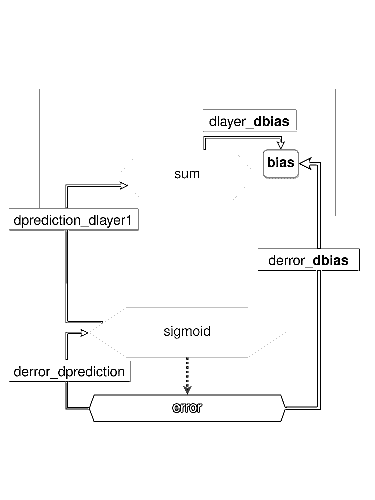](https://files.realpython.com/media/partial_derivative_bias_2.177c16a60b9d.png)

<figcaption class="figure-caption text-center">A diagram showing the partial derivatives to compute the bias gradient</figcaption>

产生误差的函数是平方函数，这个函数的导数是`2 * x`，你前面看到了。您应用了一阶偏导数(`derror_dprediction`)，但仍然没有得到偏差，因此您需要再后退一步，对前一层`dprediction_dlayer1`的预测进行求导。

该预测是 sigmoid 函数的结果。你可以通过把`sigmoid(x)`和`1 - sigmoid(x)`相乘来得到 sigmoid 函数的导数。这个求导公式非常方便，因为你可以使用[已经计算过的 sigmoid 结果](https://beckernick.github.io/sigmoid-derivative-neural-network/)来计算它的导数。然后你取这个偏导数，继续往回走。

现在你要对`layer_1`的偏差求导。这就是了——你终于找到了！`bias`变量是自变量，所以应用幂法则后的结果是`1`。酷，现在你已经完成了这个反向传递，你可以把所有东西放在一起计算`derror_dbias`:

>>>

```py
In [36]: def sigmoid_deriv(x):
 ...:    return sigmoid(x) * (1-sigmoid(x))

In [37]: derror_dprediction = 2 * (prediction - target)
In [38]: layer_1 = np.dot(input_vector, weights_1) + bias
In [39]: dprediction_dlayer1 = sigmoid_deriv(layer_1)
In [40]: dlayer1_dbias = 1
  In [41]: derror_dbias = (
 ...:    derror_dprediction * dprediction_dlayer1 * dlayer1_dbias ...: )
```

要更新权重，您需要遵循相同的过程，回溯并获取偏导数，直到得到权重变量。因为你已经计算了一些偏导数，你只需要计算`dlayer1_dweights`。点积的导数是第一个向量乘以第二个向量的导数，加上第二个向量乘以第一个向量的导数。

[*Remove ads*](/account/join/)

### 创建神经网络类

现在，您知道如何编写表达式来更新权重和偏差。是时候为神经网络创建一个**类**了。类是[面向对象编程(OOP)](https://realpython.com/python3-object-oriented-programming/) 的主要构建块。`NeuralNetwork`类为权重和偏差变量生成随机初始值。

当实例化一个`NeuralNetwork`对象时，需要传递`learning_rate`参数。你将使用`predict()`来做一个预测。方法`_compute_derivatives()`和`_update_parameters()`包含您在本节中学到的计算。这是最后一节`NeuralNetwork`课:

```py
class NeuralNetwork:
    def __init__(self, learning_rate):
        self.weights = np.array([np.random.randn(), np.random.randn()])
        self.bias = np.random.randn()
        self.learning_rate = learning_rate

    def _sigmoid(self, x):
        return 1 / (1 + np.exp(-x))

    def _sigmoid_deriv(self, x):
        return self._sigmoid(x) * (1 - self._sigmoid(x))

    def predict(self, input_vector):
        layer_1 = np.dot(input_vector, self.weights) + self.bias
        layer_2 = self._sigmoid(layer_1)
        prediction = layer_2
        return prediction
  def _compute_gradients(self, input_vector, target): layer_1 = np.dot(input_vector, self.weights) + self.bias layer_2 = self._sigmoid(layer_1) prediction = layer_2   derror_dprediction = 2 * (prediction - target) dprediction_dlayer1 = self._sigmoid_deriv(layer_1) dlayer1_dbias = 1 dlayer1_dweights = (0 * self.weights) + (1 * input_vector)   derror_dbias = ( derror_dprediction * dprediction_dlayer1 * dlayer1_dbias ) derror_dweights = ( derror_dprediction * dprediction_dlayer1 * dlayer1_dweights )   return derror_dbias, derror_dweights 
    def _update_parameters(self, derror_dbias, derror_dweights):
        self.bias = self.bias - (derror_dbias * self.learning_rate)
        self.weights = self.weights - (
            derror_dweights * self.learning_rate
        )
```

这就是你的第一个神经网络的代码。恭喜你！这段代码只是将您到目前为止看到的所有部分组合在一起。如果您想做一个预测，首先您创建一个`NeuralNetwork()`的实例，然后您调用`.predict()`:

>>>

```py
In [42]: learning_rate = 0.1

In [43]: neural_network = NeuralNetwork(learning_rate)

In [44]: neural_network.predict(input_vector)
Out[44]: array([0.79412963])
```

上面的代码做了一个预测，但是现在你需要学习如何训练网络。目标是让网络*在训练数据集上推广*。这意味着您希望它适应新的、看不见的数据，这些数据遵循与训练数据集相同的概率分布。这是您将在下一部分中执行的操作。

### 用更多数据训练网络

您已经为一个数据实例调整了权重和偏差，但目标是使网络在整个数据集上进行概化。[随机梯度下降](https://en.wikipedia.org/wiki/Stochastic_gradient_descent)是一种技术，在每次迭代中，模型根据随机选择的训练数据进行预测，计算误差，并更新参数。

现在是时候创建你的`NeuralNetwork`类的`train()`方法了。您将保存每 100 次迭代的所有数据点的误差，因为您想要绘制一个图表来显示这个指标如何随着迭代次数的增加而变化。这是你的神经网络的最终`train()`方法:

```py
 1class NeuralNetwork:
 2    # ...
 3
 4    def train(self, input_vectors, targets, iterations):
 5        cumulative_errors = []
 6        for current_iteration in range(iterations):
 7            # Pick a data instance at random
 8            random_data_index = np.random.randint(len(input_vectors)) 9
10            input_vector = input_vectors[random_data_index]
11            target = targets[random_data_index]
12
13            # Compute the gradients and update the weights
14            derror_dbias, derror_dweights = self._compute_gradients( 15                input_vector, target 16            ) 17 18            self._update_parameters(derror_dbias, derror_dweights) 19 20            # Measure the cumulative error for all the instances
21            if current_iteration % 100 == 0: 22                cumulative_error = 0
23                # Loop through all the instances to measure the error
24                for data_instance_index in range(len(input_vectors)): 25                    data_point = input_vectors[data_instance_index]
26                    target = targets[data_instance_index]
27
28                    prediction = self.predict(data_point) 29                    error = np.square(prediction - target) 30
31                    cumulative_error = cumulative_error + error 32                cumulative_errors.append(cumulative_error) 33
34        return cumulative_errors
```

上面的代码块中发生了很多事情，所以下面是一行一行的分解:

*   **第 8 行**从数据集中随机选取一个实例。

*   **第 14 到 16 行**计算偏导数并返回偏差和权重的导数。他们使用您之前定义的`_compute_gradients()`。

*   **第 18 行**使用`_update_parameters()`更新偏差和权重，这是您在前面的代码块中定义的。

*   **第 21 行**检查当前迭代索引是否是`100`的倍数。这样做是为了观察误差在每一次`100`迭代中是如何变化的。

*   第 24 行开始遍历所有数据实例的循环。

*   **第 28 行**计算`prediction`结果。

*   第 29 行为每个实例计算`error`。

*   **第 31 行**是使用`cumulative_error`变量累加误差总和的地方。你这样做是因为你想为所有的数据实例绘制一个有误差的点。然后，在第 32 行，您将`error`添加到`cumulative_errors`中，这是存储错误的数组。您将使用这个数组来绘制图形。

简而言之，从数据集中选取一个随机实例，计算梯度，并更新权重和偏差。您还可以计算每 100 次迭代的累积误差，并将这些结果保存在一个数组中。您将绘制该数组，以直观显示训练过程中误差的变化。

**注意:**如果你在 Jupyter 笔记本上运行代码，那么你需要在将`train()`添加到`NeuralNetwork`类后重启内核。

为了使事情不那么复杂，您将使用一个只有八个实例的数据集，即`input_vectors`数组。现在您可以调用`train()`并使用 Matplotlib 来绘制每次迭代的累积误差:

>>>

```py
In [45]: # Paste the NeuralNetwork class code here
 ...: # (and don't forget to add the train method to the class)

In [46]: import matplotlib.pyplot as plt

In [47]: input_vectors = np.array(
 ...:    [
 ...:        [3, 1.5],
 ...:        [2, 1],
 ...:        [4, 1.5],
 ...:        [3, 4],
 ...:        [3.5, 0.5],
 ...:        [2, 0.5],
 ...:        [5.5, 1],
 ...:        [1, 1],
 ...:    ]
 ...: )

In [48]: targets = np.array([0, 1, 0, 1, 0, 1, 1, 0])

In [49]: learning_rate = 0.1

In [50]: neural_network = NeuralNetwork(learning_rate)

In [51]: training_error = neural_network.train(input_vectors, targets, 10000)

In [52]: plt.plot(training_error)
In [53]: plt.xlabel("Iterations")
In [54]: plt.ylabel("Error for all training instances")
In [54]: plt.savefig("cumulative_error.png")
```

再次实例化`NeuralNetwork`类，并使用`input_vectors`和`target`值调用`train()`。您指定它应该运行`10000`次。下图显示了神经网络实例的误差:

[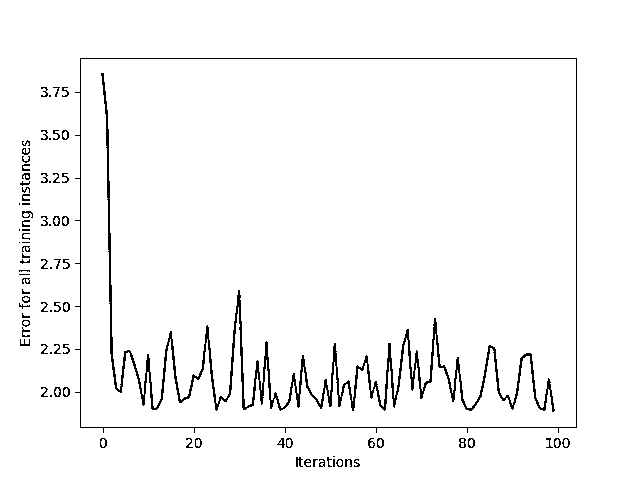](https://files.realpython.com/media/cumulative_error.93469c3cd4e3.png)

<figcaption class="figure-caption text-center">Graph showing the cumulative training error</figcaption>

整体误差在减小，这就是你想要的。该映像是在运行 IPython 的同一个目录中生成的。在最大程度的减少之后，误差从一个交互到另一个交互保持快速上升和下降。这是因为数据集是随机的，非常小，所以神经网络很难提取任何特征。

但是，使用这一指标来评估性能并不是一个好主意，因为您是使用网络已经看到的数据实例来评估性能的。这可能导致[过度拟合](https://developers.google.com/machine-learning/crash-course/generalization/peril-of-overfitting)，此时模型与训练数据集拟合得如此之好，以至于不能推广到新数据。

[*Remove ads*](/account/join/)

### 向神经网络添加更多层

出于学习目的，本教程中的数据集很小。通常，深度学习模型需要大量的数据，因为数据集更复杂，有很多细微差别。

由于这些数据集包含更复杂的信息，仅使用一两个图层是不够的。这就是深度学习模型被称为“深度”的原因。它们通常有许多层。

通过添加更多的层和使用激活函数，您可以增加网络的表达能力，并可以进行非常高水平的预测。这种类型的预测的一个例子是[面部识别](https://realpython.com/face-recognition-with-python/)，例如当你用手机拍摄面部照片时，如果手机识别出图像是你，它就会解锁。

## 结论

恭喜你！今天，您使用 NumPy 从头开始构建了一个神经网络。有了这些知识，您就可以更深入地研究 Python 中的人工智能世界了。

**在本教程中，您学习了:**

*   什么是**深度学习**以及它与**机器学习**的区别
*   如何用 NumPy 表示**向量**
*   什么是**激活函数**以及为什么在神经网络中使用它们
*   什么是**反向传播算法**以及它是如何工作的
*   如何训练一个**神经网络**并做出**预测**

训练神经网络的过程主要包括对向量进行运算。今天，您仅仅使用 NumPy 作为依赖项，从头开始完成了这项工作。在生产环境中不建议这样做，因为整个过程可能是低效的并且容易出错。这就是像 [Keras](https://realpython.com/python-keras-text-classification/) 、 [PyTorch 和 TensorFlow](https://realpython.com/pytorch-vs-tensorflow/) 这样的深度学习框架如此受欢迎的原因之一。

## 延伸阅读

有关本教程所涵盖主题的更多信息，请查看以下资源:

*   [看 Ma，无 For 循环:用 NumPy 进行数组编程](https://realpython.com/numpy-array-programming/)
*   [Python 中的线性回归](https://realpython.com/linear-regression-in-python/)
*   [用 Python 和 Keras 进行实用文本分类](https://realpython.com/python-keras-text-classification/)
*   [纯 Python vs NumPy vs TensorFlow 性能对比](https://realpython.com/numpy-tensorflow-performance/)
*   [PyTorch vs TensorFlow 为您的 Python 深度学习项目](https://realpython.com/pytorch-vs-tensorflow/)

*立即观看**本教程有真实 Python 团队创建的相关视频课程。和书面教程一起看，加深理解: [**构建神经网络&用 Python AI 做预测**](/courses/build-neural-network-python-ai/)************