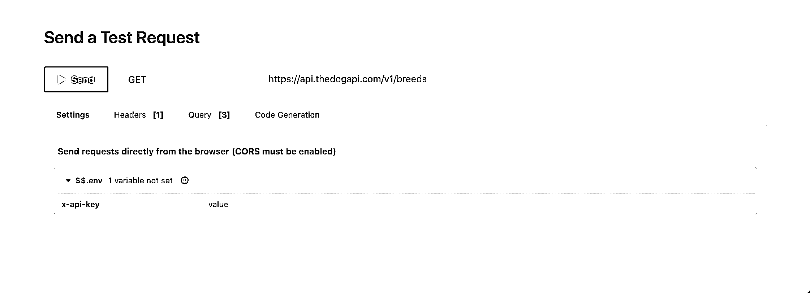
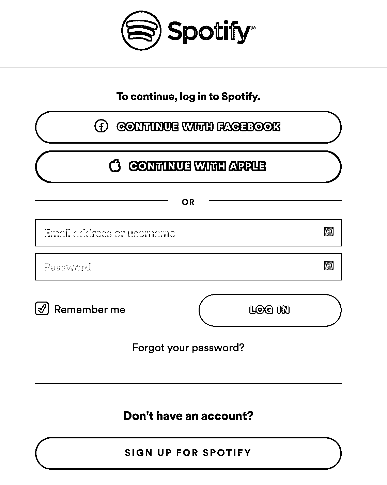
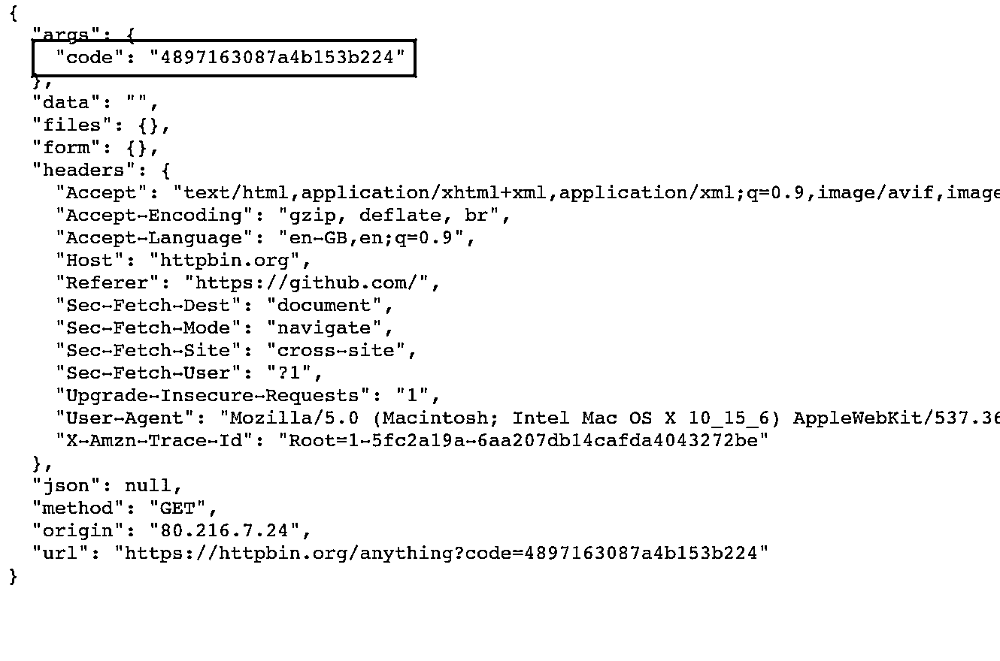
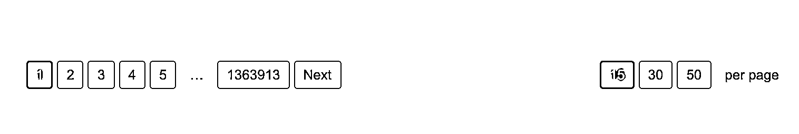
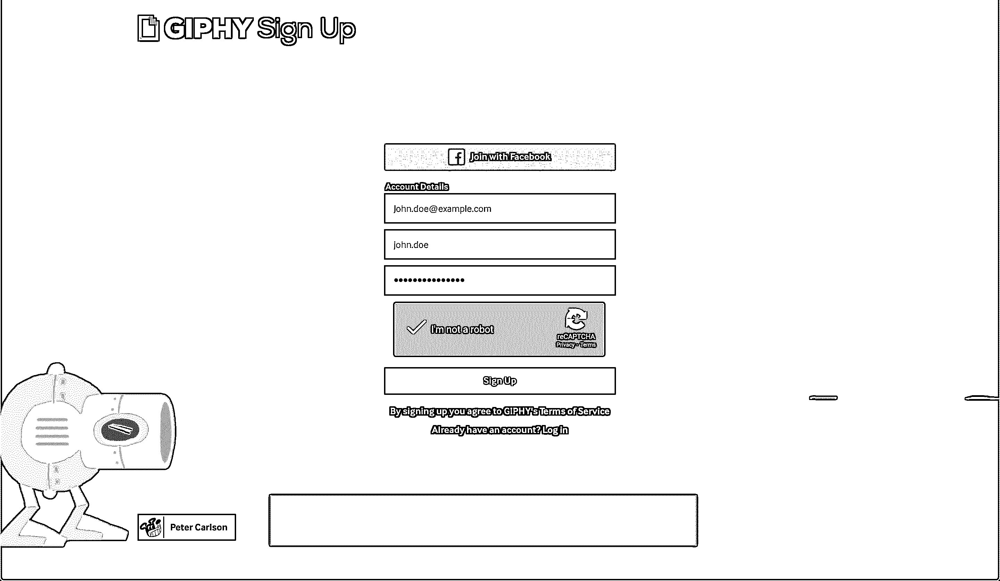
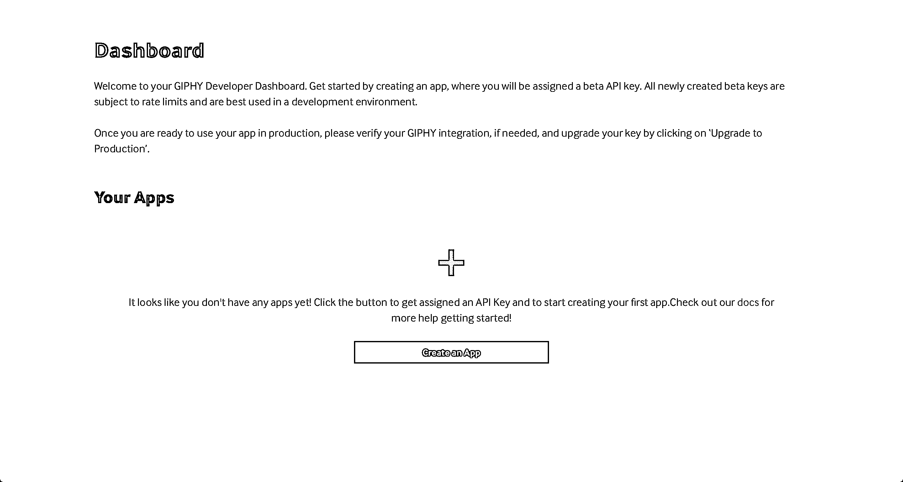
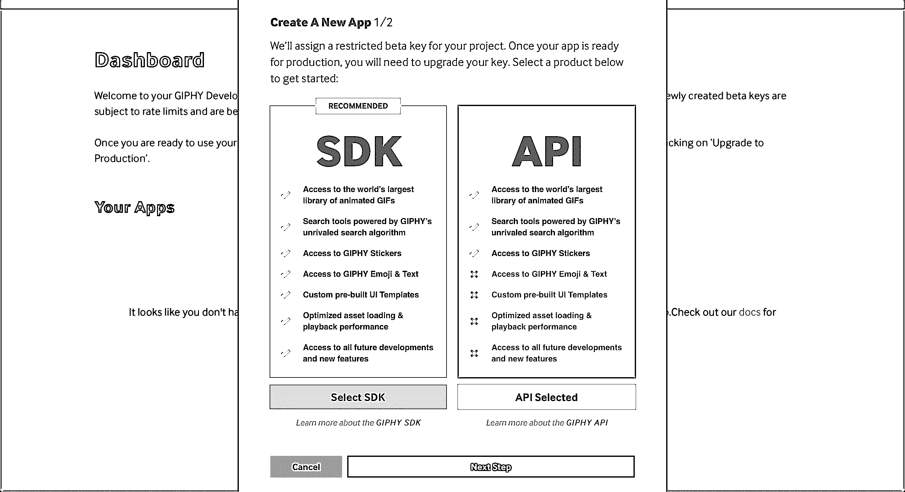
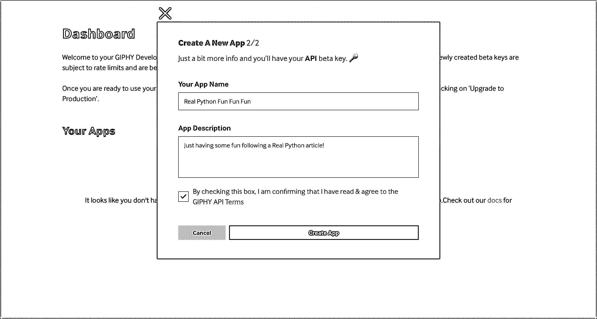
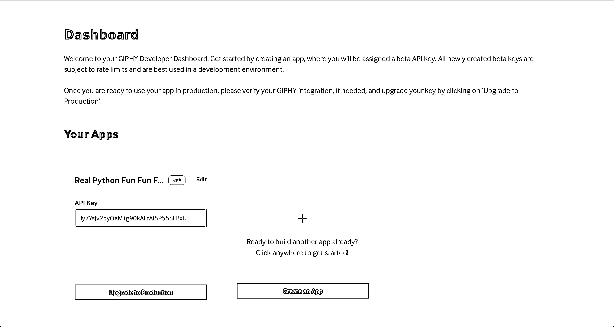

# Python 和 API:读取公共数据的成功组合

> 原文：<https://realpython.com/python-api/>

知道如何使用 API 是一种神奇的技能，一旦掌握，将打开一个全新的可能性世界，使用 Python 使用 API 是学习这种技能的一种很好的方式。

你日常使用的许多应用程序和系统都连接到一个 API。从非常简单和平凡的事情，比如早上查看天气，到更容易上瘾和耗时的操作，比如滚动 Instagram、抖音或 Twitter feed，API 都发挥着核心作用。

在本教程中，您将学习:

*   什么是 **API**
*   你如何用你的 Python 代码消费 API
*   什么是最重要的与 API 相关的概念
*   如何使用 Python 来**读取通过公共 API 可用的数据**

在本教程结束时，您将能够使用 Python 来使用您遇到的大多数 API。如果你是一名开发人员，知道如何使用 Python 来使用 API 会让你更加熟练，尤其是在将你的工作与第三方应用程序集成时。

**注意:**本教程关注的是如何*使用 Python 消费*API，而不是如何构建它们。有关使用 Python 构建 API 的信息，请查看[Python REST API With Flask、Connexion 和 SQLAlchemy](https://realpython.com/flask-connexion-rest-api/) 。

您可以通过单击下面的链接下载本教程中将要看到的示例的源代码:

**获取源代码:** [点击此处获取源代码，您将在本教程中使用](https://realpython.com/bonus/consuming-apis-python-code/)来学习使用 Python 来使用 API。

## 了解 API

API 代表**应用编程接口**。本质上，API 充当了一个通信层，或者顾名思义，一个接口，它允许不同的系统相互交流，而不需要理解彼此具体做什么。

API 可以有多种形式。它们可以是操作系统 API，用于像打开相机和音频以加入变焦呼叫这样的操作。或者它们可以是网络应用编程接口，用于以网络为中心的操作，比如喜欢 Instagram 上的图片或获取最新的推文。

不管是哪种类型，所有的 API 都以相同的方式运行。你通常会发出一个**请求**获取信息或数据，API 会返回一个包含你所请求内容的**响应**。例如，每当你打开 Twitter 或向下滚动 Instagram feed 时，你基本上是在向该应用背后的 API 发出请求，并获得响应。这也被称为**调用**API。

在本教程中，您将更多地关注跨网络通信的高级 API，也称为**web API**。

[*Remove ads*](/account/join/)

### SOAP vs REST vs GraphQL

尽管上面提到的一些例子是针对新的平台或应用程序的，但是 web APIs 已经存在很长时间了。在 20 世纪 90 年代末和 21 世纪初，两种不同的设计模型成为公开数据的规范:

1.  **SOAP(简单对象访问协议)**通常与企业世界相关联，具有更严格的基于契约的用法，并且主要是围绕动作设计的。
2.  REST(表述性状态转移)通常用于公共 API，是从 web 获取数据的理想选择。它比 SOAP 更轻便，更接近 HTTP 规范。

如今，镇上来了一个新人:GraphQL。由脸书创建的 GraphQL 是一种非常灵活的 API 查询语言，其中客户端决定他们想从服务器获取什么，而不是服务器决定发送什么。

如果您想进一步了解这三种设计模型之间的差异，这里有一些好的资源:

*   [什么是肥皂？](https://www.altexsoft.com/blog/engineering/what-is-soap-formats-protocols-message-structure-and-how-soap-is-different-from-rest/)
*   什么是休息？
*   [API 101: SOAP 与 REST 的对比](https://blog.postman.com/soap-vs-rest/)
*   [graph QL 简介](https://graphql.org/learn/)
*   [比较 API 架构风格:SOAP vs REST vs GraphQL vs RPC](https://www.altexsoft.com/blog/soap-vs-rest-vs-graphql-vs-rpc/)

尽管 GraphQL 正在崛起，并被越来越大的公司采用，包括 [GitHub](https://docs.github.com/en/free-pro-team@latest/graphql) 和 [Shopify](https://shopify.dev/docs/admin-api/graphql/reference) ，但事实是大多数公共 API 仍然是 REST APIs。因此，出于本教程的目的，您将只学习 REST APIs 以及如何使用 Python 来使用它们。

### `requests`和 APIs:天作之合

当用 Python 使用 API 时，你只需要一个库: [`requests`](https://realpython.com/python-requests/) 。有了它，您应该能够完成消费任何公共 API 所需的大部分(如果不是全部)操作。

您可以通过在控制台中运行以下命令来安装`requests`:

```py
$ python -m pip install requests
```

要遵循本教程中的代码示例，请确保您使用的是 Python 3.8.1 和`requests` 2.24.0 或更高版本。

## 使用 Python 调用您的第一个 API

说够了——是时候进行第一次 API 调用了！对于第一个例子，您将调用一个流行的 API 来生成[随机用户数据](https://randomuser.me/)。

在整个教程中，您将看到如下所示的 alert 块中引入了新的 API。对你来说，这是一种方便的方法，你可以在之后滚动，快速找到你所学过的所有新的 API。

**随机用户生成器 API:** 这是[生成随机用户数据](https://randomuser.me/)的绝佳工具。您可以使用它来生成任意数量的随机用户和相关数据，还可以指定性别、国籍和许多其他过滤器，这些过滤器在测试应用程序或 API 时非常有用。

从随机用户生成器 API 开始，您唯一需要做的事情就是知道使用哪个 URL 来调用它。对于这个例子，要使用的 URL 是`https://randomuser.me/api/`，这是您可以进行的最小的 API 调用:

>>>

```py
>>> import requests
>>> requests.get("https://randomuser.me/api/")
<Response [200]>
```

在这个小例子中，您[导入](https://realpython.com/python-import/)库`requests`，然后从随机用户生成器 API 的 URL 获取数据。但是您实际上看不到任何返回的数据。取而代之的是一个`Response [200]`，用 API 术语来说，这意味着一切正常。

如果您想看到实际的数据，那么您可以使用从返回的`Response`对象中的`.text`:

>>>

```py
>>> import requests
>>> response = requests.get("https://randomuser.me/api/")
>>> response.text '{"results":[{"gender":"female",
"name":{"title":"Ms","first":"Isobel","last":"Wang"}...'
```

就是这样！这是 API 消费的基础。您使用 Python 和`requests`库成功地从随机用户生成器 API 中获取了第一个随机用户。

[*Remove ads*](/account/join/)

### 端点和资源

正如你在上面看到的，消费一个 API 你需要知道的第一件事是 API URL，通常叫做**基本 URL** 。基本 URL 结构与你用来浏览谷歌、YouTube 或脸书的 URL 没有什么不同，尽管它通常包含单词`api`。这不是强制性的，只是一个经验法则。

例如，以下是一些著名 API 播放器的基本 URL:

*   `https://api.twitter.com`
*   `https://api.github.com`
*   `https://api.stripe.com`

正如你所看到的，以上都是以`https://api`开头的，包括剩下的官方域名，比如`.twitter.com`或者`.github.com`。对于 API 基本 URL 应该是什么样子，没有特定的标准，但是它模仿这种结构是很常见的。

如果你试着打开上面的任何一个链接，你会发现大多数链接都会返回一个错误或者要求凭证。这是因为 API 有时需要认证步骤才能使用。稍后在教程的中，你会学到更多关于这个[的内容。](#authentication)

这个 API 很有趣，但也是一个很好的例子，一个有着很棒的[文档的 API。有了它，你可以获取不同的狗品种和一些图像，但如果你注册，你也可以为你最喜欢的狗投票。](https://thedogapi.com/)

接下来，使用刚刚介绍的 [TheDogAPI](https://thedogapi.com/) ，您将尝试发出一个基本请求，看看它与您上面尝试的随机用户生成器 API 有何不同:

>>>

```py
>>> import requests
>>> response = requests.get("https://api.thedogapi.com/")
>>> response.text
'{"message":"The Dog API"}'
```

在这种情况下，当调用基本 URL 时，您会得到这样一条通用消息，即`The Dog API`。这是因为您调用的是基本 URL，它通常用于 API 的非常基本的信息，而不是真正的数据。

单独调用基本 URL 并不有趣，但这正是端点派上用场的地方。一个**端点**是 URL 的一部分，它指定您想要获取什么**资源**。记录良好的 API 通常包含一个 **API 引用**，这对于了解 API 拥有的确切端点和资源以及如何使用它们非常有用。

你可以查看官方文档来了解更多关于如何使用 DogAPI 以及有哪些端点可用。在那里，你会找到一个 [`/breeds`端点](https://docs.thedogapi.com/api-reference/breeds/breeds-list)，你可以用它来获取所有可用的品种资源或物品。

如果向下滚动，您会发现[发送测试请求](https://docs.thedogapi.com/api-reference/breeds/breeds-list#send-a-test-request)部分，您会看到如下所示的表单:

[](https://files.realpython.com/media/Screenshot_2020-11-23_at_21.13.12.3749ba90c6b8.png)

<figcaption class="figure-caption text-center">API Testing in TheDogAPI Documentation</figcaption>

这是您将在许多 API 文档中看到的东西:一种让您直接从文档页面快速测试 API 的方法。在这种情况下，您可以单击 *Send* 来快速获得调用该端点的结果。 *Et voilà* ，你只需调用一个 API，无需为其编写任何代码。

现在，使用 [breeds 端点](https://docs.thedogapi.com/api-reference/breeds/breeds-list)和一些您已经掌握的 API 知识，在本地代码中尝试一下:

>>>

```py
>>> response = requests.get("https://api.thedogapi.com/v1/breeds")
>>> response.text
'[{"weight":{"imperial":"6 - 13","metric":"3 - 6"},"height": ...}]'
```

这就是你的第一个使用狗 API 的品种列表！

如果你是一个爱猫的人，不要烦恼。您也可以使用一个 API，具有相同的端点，但不同的基本 URL:

>>>

```py
>>> response = requests.get("https://api.thecatapi.com/v1/breeds") >>> response.text
'[{..."id":"abys","name":"Abyssinian"}]'
```

我敢打赌，你已经在想用不同的方法来使用这些 API 来做一些可爱的附带项目，这就是 API 的伟大之处。一旦你开始使用它们，没有什么能阻止你把爱好或激情变成一个有趣的小项目。

在继续之前，您需要知道关于端点的一件事是`http://`和`https://`之间的区别。简而言之，HTTPS 是 HTTP 的加密版本，使客户端和服务器之间的所有流量更加安全。当使用公共 API 时，您应该避免向`http://`端点发送任何私有或敏感信息，并且只使用那些提供安全`https://`基本 URL 的 API。

要了解更多关于为什么在网上浏览时坚持 HTTPS 很重要的信息，请查看[用 Python 探索 HTTPS](https://realpython.com/python-https/)。

在下一节中，您将更深入地研究 API 调用的主要组件。

[*Remove ads*](/account/join/)

### 请求和响应

正如您在上面简要阅读的那样，客户端(在本例中是您的 Python 控制台)和 API 之间的所有交互都分为请求和响应:

*   **请求**包含关于 API 请求调用的相关数据，比如基本 URL、端点、使用的方法、头等等。
*   **响应**包含服务器返回的相关数据，包括数据或内容、状态码和头。

再次使用 DogAPI，您可以更深入地了解`Request`和`Response`对象内部的具体内容:

>>>

```py
>>> response = requests.get("https://api.thedogapi.com/v1/breeds")
>>> response
<Response [200]>
>>> response.request
<PreparedRequest [GET]>

>>> request = response.request
>>> request.url
'https://api.thedogapi.com/v1/breeds'
>>> request.path_url
'/v1/breeds'
>>> request.method
'GET'
>>> request.headers
{'User-Agent': 'python-requests/2.24.0', 'Accept-Encoding': 'gzip, deflate',
'Accept': '*/*', 'Connection': 'keep-alive'}

>>> response
<Response [200]>
>>> response.text
'[{"weight":{"imperial":"6 - 13","metric":"3 - 6"},
"height":{"imperial":"9 - 11.5","metric":"23 - 29"},"id":1,
"name":"Affenpinscher", ...}]'
>>> response.status_code
200
>>> response.headers
{'Cache-Control': 'post-check=0, pre-check=0', 'Content-Encoding': 'gzip',
'Content-Type': 'application/json; charset=utf-8',
'Date': 'Sat, 25 Jul 2020 17:23:53 GMT'...}
```

上面的例子向您展示了对`Request`和`Response`对象可用的一些最重要的属性。

在本教程中，您将了解到更多关于这些属性的信息，但是如果您想更深入地了解，那么您可以查看 Mozilla 关于 [HTTP messages](https://developer.mozilla.org/en-US/docs/Web/HTTP/Messages) 的文档，以获得关于每个属性的更深入的解释。

### 状态代码

状态代码是任何 API 响应中最重要的信息之一。它们会告诉您您的请求是否成功，是否缺少数据，是否缺少凭证，[等等](https://developer.mozilla.org/en-US/docs/Web/HTTP/Status)。

随着时间的推移，你会在没有帮助的情况下识别不同的状态代码。但是现在，这里列出了一些最常见的状态代码:

| 状态代码 | 描述 |
| --- | --- |
| `200 OK` | 您的请求成功了！ |
| `201 Created` | 您的请求已被接受，资源已创建。 |
| `400 Bad Request` | 你的请求要么是错误的，要么是遗漏了一些信息。 |
| `401 Unauthorized` | 您的请求需要一些额外的权限。 |
| `404 Not Found` | 请求的资源不存在。 |
| `405 Method Not Allowed` | 端点不允许该特定的 HTTP 方法。 |
| `500 Internal Server Error` | 您的请求不是预期的，可能破坏了服务器端的某些东西。 |

您在前面执行的示例中看到了`200 OK`，您甚至可以通过浏览网页认出`404 Not Found`。

**有趣的事实:**公司倾向于使用`404`错误页面来开私人玩笑或纯粹的玩笑，就像下面这些例子:

*   [曼陀罗实验室](https://www.mantralabsglobal.com/404)
*   [Gymbox](https://www.gymbox.com/404)
*   [皮克斯](https://www.pixar.com/404)
*   [松弛](https://slack.com/404)

然而，在 API 世界中，开发人员对于这种乐趣的反应空间有限。但是它们在其他地方弥补了这一点，比如 HTTP 头。您很快就会看到一些例子！

您可以使用`.status_code`和`.reason`来检查响应的状态。`requests`库还在`Response`对象的表示中打印状态代码:

>>>

```py
>>> response = requests.get("https://api.thedogapi.com/v1/breeds")
>>> response <Response [200]>
>>> response.status_code 200
>>> response.reason 'OK'
```

上面的请求返回`200`，所以你可以认为它是一个成功的请求。但是现在看看当您在端点`/breedz`中包含一个输入错误时触发的失败请求:

>>>

```py
>>> response = requests.get("https://api.thedogapi.com/v1/breedz") >>> response
<Response [404]>
>>> response.status_code
404
>>> response.reason
'Not Found'
```

如您所见，`/breedz`端点不存在，因此 API 返回一个`404 Not Found`状态代码。

您可以使用这些状态代码快速查看您的请求是否需要更改，或者您是否应该再次检查文档中的任何拼写错误或缺失部分。

### HTTP 报头

HTTP 头用于定义一些控制请求和响应的参数:

| HTTP 标头 | 描述 |
| --- | --- |
| `Accept` | 客户端可以接受什么类型的内容 |
| `Content-Type` | 服务器将响应什么类型的内容 |
| `User-Agent` | 客户端使用什么软件与服务器通信 |
| `Server` | 服务器使用什么软件与客户端通信 |
| `Authentication` | 谁在调用 API，他们有什么凭证 |

在检查请求或响应时，您可以找到许多其他的头。如果你对它们的具体用途感兴趣，可以看看 Mozilla 的扩展列表。

要检查响应的报头，可以使用`response.headers`:

>>>

```py
>>> response = requests.get("https://api.thedogapi.com/v1/breeds/1")
>>> response.headers {'Content-Encoding': 'gzip',
'Content-Type': 'application/json; charset=utf-8',
'Date': 'Sat, 25 Jul 2020 19:52:07 GMT'...}
```

为了对请求头做同样的事情，您可以使用`response.request.headers`，因为`request`是`Response`对象的一个属性:

>>>

```py
>>> response = requests.get("https://api.thedogapi.com/v1/breeds/1")
>>> response.request.headers {'User-Agent': 'python-requests/2.24.0',
'Accept-Encoding': 'gzip, deflate', 'Accept': '*/*',
'Connection': 'keep-alive'}
```

在这种情况下，您在发出请求时不需要定义任何特定的头，所以会返回默认的头。

#### 自定义标题

在使用 API 时，您可能会遇到的另一个标准是自定义头的使用。这些通常以`X-`开头，但不是必须的。API 开发人员通常使用自定义头向客户端发送或请求额外的自定义信息。

**有趣的事实:**一些公司想尽办法变得有趣和创新，以一种他们[不打算使用的方式使用 HTTP 报头](https://frenxi.com/http-headers-you-dont-expect/)，例如征求工作申请。

您可以使用一个[字典](https://realpython.com/python-dicts/)来定义头部，并且您可以使用`.get()`的`headers`参数将它们与您的请求一起发送。

例如，假设您想要向 API 服务器发送一些请求 ID，并且您知道您可以使用`X-Request-Id`来完成:

>>>

```py
>>> headers = {"X-Request-Id": "<my-request-id>"} >>> response = requests.get("https://example.org", headers=headers) >>> response.request.headers
{'User-Agent': 'python-requests/2.24.0', 'Accept-Encoding': 'gzip, deflate',
'Accept': '*/*', 'Connection': 'keep-alive',
'X-Request-Id': '<my-request-id>'}
```

如果您浏览一下`request.headers`字典，那么您会发现`X-Request-Id`就在最后，在缺省情况下任何 API 请求都会附带的一些其他头文件中。

一个响应可能有许多有用的头，但其中最重要的一个是`Content-Type`，它定义了响应中返回的内容种类。

#### `Content-Type`

如今，大多数 API 使用 [JSON](https://realpython.com/python-json/) 作为默认的内容类型，但是您可能需要使用返回 XML 或其他媒体类型的 API，比如图像或视频。在这种情况下，内容类型会有所不同。

如果您回头看看前面一个使用 DogAPI 的例子，并尝试检查`Content-Type`头，那么您会注意到它是如何被定义为`application/json`的:

>>>

```py
>>> response = requests.get("https://api.thedogapi.com/v1/breeds/1")
>>> response.headers.get("Content-Type") 'application/json; charset=utf-8'
```

除了特定类型的内容(在本例中为`application/json`)，消息头还可能返回响应内容的指定[编码](https://realpython.com/python-encodings-guide/)。

这是一个非常愚蠢的 API，它返回不同大小的山羊的[图像，你可以在你的网站中使用它们作为占位符图像。](https://placegoat.com/)

例如，如果您试图从 [PlaceGOAT API](https://placegoat.com/) 中获取一张山羊的图像，那么您会注意到内容类型不再是`application/json`，而是被定义为`image/jpeg`:

>>>

```py
>>> response = requests.get("http://placegoat.com/200/200") >>> response
<Response [200]>
>>> response.headers.get("Content-Type")
'image/jpeg'
```

在这种情况下，`Content-Type`头表明返回的内容是一个 JPEG 图像。您将在下一节学习如何查看这些内容。

对于您了解如何处理响应以及如何处理其内容来说,`Content-Type`头非常重要。还有数百种其他可接受的内容类型，包括音频、视频、字体等等。

[*Remove ads*](/account/join/)

### 响应内容

正如您刚刚了解到的，您在 API 响应中找到的内容类型将根据`Content-Type`头的不同而不同。为了根据不同的`Content-Type`头正确地读取响应内容，`requests`包附带了几个不同的`Response`属性，您可以使用它们来操作响应数据:

*   **`.text`** 以 [Unicode](https://realpython.com/python-encodings-guide/) 格式返回响应内容。
*   **`.content`** 返回[字节](https://realpython.com/python-strings/#bytes-objects)的响应内容。

您已经使用了上面的`.text`属性。但是对于某些特定类型的数据，比如图像和其他非文本数据，使用`.content`通常是更好的方法，即使它返回的结果与`.text`非常相似:

>>>

```py
>>> response = requests.get("https://api.thedogapi.com/v1/breeds/1")
>>> response.headers.get("Content-Type")
'application/json; charset=utf-8'
>>> response.content b'{"weight":{"imperial":"6 - 13","metric":"3 - 6"}...'
```

如你所见，`.content`和之前用的`.text`没有太大区别。

然而，通过查看响应的`Content-Type`头，您可以看到内容是`application/json;`，一个 JSON 对象。对于这种内容，`requests`库包含了一个特定的`.json()`方法，您可以使用它将 API 字节响应立即转换成一个 [Python 数据结构](https://realpython.com/python-data-structures/):

>>>

```py
>>> response = requests.get("https://api.thedogapi.com/v1/breeds/1")
>>> response.headers.get("Content-Type")
'application/json; charset=utf-8'
>>> response.json() {'weight': {'imperial': '6 - 13', 'metric': '3 - 6'},
'height': {'imperial': '9 - 11.5', 'metric': '23 - 29'}
...}
>>> response.json()["name"] 'Affenpinscher'
```

正如您所看到的，在执行`response.json()`之后，您得到了一个字典，您可以像使用 Python 中的任何其他字典一样使用它。

现在，回头看看最近使用 PlaceGOAT API 运行的示例，尝试获取相同的 GOAT 图像并查看其内容:

>>>

```py
>>> response = requests.get("http://placegoat.com/200/200")
>>> response
<Response [200]>
>>> response.headers.get("Content-Type")
'image/jpeg'
>>> response.content b'\xff\xd8\xff\xe0\x00\x10JFIF\x00\x01\x01\x01\x00H\...'
```

在这种情况下，因为您正在请求一个图像，`.content`不是很有帮助。事实上，这几乎是不可能理解的。然而，你知道这是一个 JPEG 图像，所以你可以试着把它存储到一个[文件](https://realpython.com/read-write-files-python/)中，看看会发生什么:

>>>

```py
>>> response = requests.get("http://placegoat.com/200/200")
>>> response
<Response [200]>
>>> response.headers.get("Content-Type")
'image/jpeg'
>>> file = open("goat.jpeg", "wb") >>> file.write(response.content) >>> file.close()
```

现在，如果你打开你正在工作的文件夹，你会发现一个`goat.jpeg`文件，这是你刚刚使用 API 获取的一只山羊的随机图像。是不是很神奇？

### HTTP 方法

当调用一个 API 时，有一些不同的方法，也称为**动词**，可以用来指定想要执行的动作。例如，如果你想获取一些数据，你可以使用方法`GET`，如果你想创建一些数据，你可以使用方法`POST`。

当纯粹使用 API 消费数据时，您通常会坚持使用`GET`请求，但这里列出了最常见的方法及其典型用例:

| HTTP 方法 | 描述 | 请求方法 |
| --- | --- | --- |
| `POST` | 创建新资源。 | `requests.post()` |
| `GET` | 读取现有资源。 | `requests.get()` |
| `PUT` | 更新现有资源。 | `requests.put()` |
| `DELETE` | 删除现有资源。 | `requests.delete()` |

这四种方法通常被称为 **CRUD 操作**，因为它们允许您**c**create、 **r** ead、 **u** pdate 和**d**delete 资源。

**注意:**还有一个额外的`PATCH`方法也与 CRUD 操作相关，但是它比上面的四个稍微不那么常见。它用于进行部分修改，而不是使用`PUT`完全替换一个资源。

你可以多读一点关于`PUT`和`PATCH` 之间的[差异，了解他们不同的需求。](https://medium.com/backticks-tildes/restful-api-design-put-vs-patch-4a061aa3ed0b)

如果你对剩下的 HTTP 方法感到好奇，或者如果你只是想了解更多关于那些已经提到的方法，那么看看 Mozilla 的文档。

到目前为止，您只使用了`.get()`来获取数据，但是您也可以将`requests`包用于所有其他的 HTTP 方法:

>>>

```py
>>> requests.post("https://api.thedogapi.com/v1/breeds/1")
>>> requests.get("https://api.thedogapi.com/v1/breeds/1")
>>> requests.put("https://api.thedogapi.com/v1/breeds/1")
>>> requests.delete("https://api.thedogapi.com/v1/breeds/1")
```

如果你在你的主机上尝试这些，那么你会注意到大多数都会返回一个`405 Method Not Allowed` [状态码](#status-codes)。这是因为不是所有的端点都支持`POST`、`PUT`或`DELETE`方法。尤其是当你使用公共 API 读取数据时，你会发现大多数 API 只允许`GET`请求，因为不允许你创建或更改现有数据。

[*Remove ads*](/account/join/)

### 查询参数

有时当你调用一个 API 时，你会得到大量你不需要或不想要的数据。例如，当调用 TheDogAPI 的`/breeds`端点时，您会获得关于某个特定品种的大量信息。但是在某些情况下，您可能只想提取某个特定品种的某些信息。这就是查询参数的用武之地！

您可能在网上浏览时见过或使用过查询参数。例如，在观看 YouTube 视频时，你会看到一个类似于`https://www.youtube.com/watch?v=aL5GK2LVMWI`的 URL。URL 中的`v=`就是您所说的**查询参数**。它通常位于基本 URL 和端点之后。

要向给定的 URL 添加查询参数，必须在第一个查询参数前添加一个问号(`?`)。如果您希望在您的请求中有多个查询参数，那么您可以用一个&符号(`&`)将它们分开。

上面带有多个查询参数的同一个 YouTube URL 应该是这样的:`https://www.youtube.com/watch?v=aL5GK2LVMWI&t=75`。

在 API 世界中，查询参数被用作过滤器，可以随 API 请求一起发送，以进一步缩小响应范围。例如，回到随机用户生成器 API，您知道如何生成随机用户:

>>>

```py
>>> requests.get("https://randomuser.me/api/").json()
{'results': [{'gender': 'male', 'name':
{'title': 'Mr', 'first': 'Silvijn', 'last': 'Van Bekkum'},
'location': {'street': {'number': 2480, 'name': 'Hooijengastrjitte'},
'city': 'Terherne', 'state': 'Drenthe',
'country': 'Netherlands', 'postcode': 59904...}
```

然而，让我们说你特别想只生成随机的女性用户。根据[文档](https://randomuser.me/documentation#gender)，您可以使用查询参数`gender=`进行查询:

>>>

```py
>>> requests.get("https://randomuser.me/api/?gender=female").json() {'results': [{'gender': 'female', 'name':
{'title': 'Mrs', 'first': 'Marjoleine', 'last': 'Van Huffelen'},
'location': {'street': {'number': 8993, 'name': 'De Teebus'},
'city': 'West-Terschelling', 'state': 'Limburg',
'country': 'Netherlands', 'postcode': 24241...}
```

太好了！现在让我们假设你想只产生来自德国的女性用户。同样，浏览文档，您会发现一个关于[国籍](https://randomuser.me/documentation#nationalities)的部分，您可以使用查询参数`nat=`进行查询:

>>>

```py
>>> requests.get("https://randomuser.me/api/?gender=female&nat=de").json() {'results': [{'gender': 'female', 'name':
{'title': 'Ms', 'first': 'Marita', 'last': 'Hertwig'},
'location': {'street': {'number': 1430, 'name': 'Waldstraße'},
'city': 'Velden', 'state': 'Rheinland-Pfalz',
'country': 'Germany', 'postcode': 30737...}
```

使用查询参数，您可以开始从 API 获取更具体的数据，使整个体验更符合您的需求。

为了避免一次又一次地重新构建 URL，您可以使用`params`属性发送一个包含所有查询参数的字典，以附加到 URL:

>>>

```py
>>> query_params = {"gender": "female", "nat": "de"} >>> requests.get("https://randomuser.me/api/", params=query_params).json() {'results': [{'gender': 'female', 'name':
{'title': 'Ms', 'first': 'Janet', 'last': 'Weyer'},
'location': {'street': {'number': 2582, 'name': 'Meisenweg'},
'city': 'Garding', 'state': 'Mecklenburg-Vorpommern',
'country': 'Germany', 'postcode': 56953...}
```

您可以将上述内容应用于任何其他您喜欢的 API。如果您返回到 DogAPI，文档有一种方法可以让您[过滤品种端点](https://docs.thedogapi.com/api-reference/breeds/breeds-search)，只返回匹配特定名称的品种。例如，如果您想寻找拉布拉多犬，那么您可以使用查询参数`q`来完成:

>>>

```py
>>> query_params = {"q": "labradoodle"} >>> endpoint = "https://api.thedogapi.com/v1/breeds/search" >>> requests.get(endpoint, params=query_params).json() [{'weight': {'imperial': '45 - 100', 'metric': '20 - 45'},
'height': {'imperial': '14 - 24', 'metric': '36 - 61'},
'id': 148, 'name': 'Labradoodle', 'breed_group': 'Mixed'...}]
```

你有它！通过发送带有值`labradoodle`的查询参数`q`，您能够过滤所有匹配该特定值的品种。

**提示:**当您重用同一个端点时，最好的做法是将其定义为代码顶部的一个[变量](https://realpython.com/python-variables/)。当你一次又一次地与一个 API 交互时，这将使你的生活变得更容易。

在查询参数的帮助下，您能够进一步缩小您的请求范围，并准确地指定您要查找的内容。你可以在网上找到的大多数 API 都有一些查询参数，你可以用它们来过滤数据。记住要浏览文档和 API 参考来找到它们。

## 学习高级 API 概念

既然您已经很好地理解了使用 Python 进行 API 消费的基础知识，那么还有一些更高级的主题值得一提，即使是简短的，比如[认证](#authentication)、[分页](#pagination)和[速率限制](#rate-limiting)。

[*Remove ads*](/account/join/)

### 认证

API 认证可能是本教程中最复杂的主题。尽管许多公共 API 都是免费且完全公开的，但在某种形式的认证背后，还有更多 API 可用。有许多 API 需要认证，但这里有几个很好的例子:

*   [GitHub API](https://docs.github.com/en/free-pro-team@latest/rest)
*   [Twitter API](https://developer.twitter.com/en/docs)
*   [Instagram API](https://developers.facebook.com/docs/instagram-basic-display-api)

身份验证方法从简单直接的方法(如使用 API 密钥或基本身份验证的方法)到复杂安全得多的技术(如 OAuth)不等。

通常，在没有凭证或凭证错误的情况下调用 API 会返回一个`401 Unauthorized`或`403 Forbidden`状态代码。

#### API 键

最常见的认证级别是 **API 密钥**。这些密钥用于识别您是 API 用户还是客户，并跟踪您对 API 的使用。API 键通常作为请求头或查询参数发送。

**NASA API:**最酷的公开可用 API 集合之一是由 [NASA](https://api.nasa.gov/) 提供的。你可以找到 API 来获取当天的[天文图片](https://apod.nasa.gov/apod/astropix.html)或者由[地球多色成像相机(EPIC)](https://epic.gsfc.nasa.gov/) 拍摄的图片，等等。

举个例子，你可以试试美国宇航局的[火星漫游者照片 API](https://github.com/chrisccerami/mars-photo-api) ，你将获取 2020 年 7 月 1 日拍摄的照片。出于测试目的，您可以使用 NASA 默认提供的`DEMO_KEY` API 键。否则，你可以通过进入 NASA 的[主 API 页面](https://api.nasa.gov/)并点击*开始*来快速生成你自己的。

您可以通过追加`api_key=`查询参数将 API 键添加到您的请求中:

>>>

```py
>>> endpoint = "https://api.nasa.gov/mars-photos/api/v1/rovers/curiosity/photos"
>>> # Replace DEMO_KEY below with your own key if you generated one.
>>> api_key = "DEMO_KEY" >>> query_params = {"api_key": api_key, "earth_date": "2020-07-01"} >>> response = requests.get(endpoint, params=query_params)
>>> response
<Response [200]>
```

到目前为止，一切顺利。您设法向 NASA 的 API 发出了一个经过验证的请求，并得到了一个`200 OK`响应。

现在看看`Response`物体，试着从中提取一些图片:

>>>

```py
>>> response.json()
{'photos': [{'id': 754118,
 'sol': 2809,
 'camera': {'id': 20,
 'name': 'FHAZ',
 'rover_id': 5,
 'full_name': 'Front Hazard Avoidance Camera'},
 'img_src': 'https://mars.nasa.gov/msl-raw-images/...JPG',
 'earth_date': '2020-07-01',
 'rover': {'id': 5,
 'name': 'Curiosity',
 'landing_date': '2012-08-06',
 'launch_date': '2011-11-26',
 'status': 'active'}},
 ...
}
>>> photos = response.json()["photos"]
>>> print(f"Found {len(photos)} photos")
Found 12 photos
>>> photos[4]["img_src"]
'https://mars.nasa.gov/msl-raw-images/proj/msl/redops/ods/surface/sol/02809/opgs/edr/rcam/RRB_646869036EDR_F0810628RHAZ00337M_.JPG'
```

使用`.json()`将响应转换为 Python 字典，然后从响应中获取`photos`字段，您可以遍历所有`Photo`对象，甚至获取特定照片的图像 URL。如果你在浏览器中打开那个网址，你会看到下面这张由[火星探测器](https://realpython.com/python-news-march-2021/#python-lands-on-mars)拍摄的火星照片:

[](https://files.realpython.com/media/RRB_646869036EDR_F0810628RHAZ00337M_.27f1657ce733.jpeg)

<figcaption class="figure-caption text-center">Mars Rover API Picture</figcaption>

在这个例子中，您选择了一个特定的`earth_date` ( `2020-07-01`)，然后从响应词典中选择了一张特定的照片(`4`)。在继续之前，试着改变日期或从不同的[相机](https://github.com/chrisccerami/mars-photo-api#cameras)获取照片，看看它如何改变最终结果。

#### OAuth:入门

API 认证中另一个非常常见的标准是 [OAuth](https://oauth.net/) 。在本教程中，您将只学习 OAuth 的基本知识，因为这是一个非常广泛的主题。

即使您没有意识到它是 OAuth 的一部分，您也可能已经多次看到和使用了 OAuth 流。每次一个应用或平台有一个使用或*继续使用*选项的*登录，这就是 OAuth 流程的起点:*

[](https://files.realpython.com/media/Screenshot_2020-07-28_13.55.42.4c9c66dba2be.png)

<figcaption class="figure-caption text-center">Example OAuth Login Buttons: Spotify</figcaption>

如果你点击*继续脸书*会发生什么，这里有一个逐步分解:

1.  Spotify 应用程序将要求脸书应用编程接口启动认证流程。为此，Spotify 应用程序将发送其应用程序 ID ( `client_id`)和一个 URL ( `redirect_uri`)，以便在成功或出错后重定向用户。

2.  您将被重定向到脸书网站，并被要求使用您的凭据登录。Spotify 应用程序不会看到或访问这些凭据。这是 OAuth 最重要的好处。

3.  脸书将向你展示 Spotify 应用程序从你的个人资料中索取的所有数据，并询问你是接受还是拒绝分享这些数据。

4.  如果你接受让 Spotify 访问你的数据，那么你将被重定向回已经登录的 Spotify 应用程序。

在进行第四步时，脸书将向 Spotify 提供一个特殊的凭证(`access_token`)，可以重复使用该凭证来获取您的信息。这个特定的脸书登录令牌的有效期为 60 天，但其他应用程序可能有不同的过期时间。如果你很好奇，那么脸书有一个[设置页面](https://www.facebook.com/settings?tab=applications&ref=settings)，你可以查看哪些应用获得了你的脸书访问令牌。

现在，从更技术性的角度来看，在使用 OAuth 消费 API 时，您需要了解以下内容:

*   您需要创建一个具有 ID ( `app_id`或`client_id`)和秘密(`app_secret`或`client_secret`)的应用程序。
*   您需要一个重定向 URL ( `redirect_uri`)，API 将使用它向您发送信息。
*   作为认证的结果，您将获得一个代码，您需要用它来交换一个访问令牌。

上面有一些变化，但是一般来说，大多数 OAuth 流程都有类似的步骤。

**提示:**当你刚刚开始测试，需要某种重定向 URL 来获取`code`时，你可以使用名为 [httpbin](https://httpbin.org/) 的服务。

更具体地说，您可以使用`https://httpbin.org/anything`作为重定向 URL，因为它将简单地输出它得到的任何输入。您可以通过导航到该 URL 来测试它。

接下来，您将深入一个使用 GitHub API 的示例！

#### OAuth:一个实际的例子

正如您在上面看到的，您需要做的第一件事是创建一个应用程序。在 GitHub 文档中有一个很好的分步解释，你可以跟随。需要记住的唯一一件事是将上面提到的`https://httpbin.org/anything` URL 用于*授权回调 URL* 字段。

**GitHub API:** 您可以将 [GitHub API](https://docs.github.com/en/rest) 用于许多不同的用例，比如获取您所属的存储库列表、获取您拥有的关注者列表等等。

一旦你创建了你的应用程序，将`Client_ID`和`Client_Secret`以及你选择的重定向 URL 复制并粘贴到一个叫做`github.py`的 Python 文件中:

```py
import requests

# REPLACE the following variables with your Client ID and Client Secret
CLIENT_ID = "<REPLACE_WITH_CLIENT_ID>" CLIENT_SECRET = "<REPLACE_WITH_CLIENT_SECRET>" 
# REPLACE the following variable with what you added in the
# "Authorization callback URL" field REDIRECT_URI = "<REPLACE_WITH_REDIRECT_URI>"
```

既然已经有了所有重要的变量，您需要能够创建一个链接，将用户重定向到他们的 GitHub 帐户，正如在 [GitHub 文档](https://docs.github.com/en/free-pro-team@latest/developers/apps/authorizing-oauth-apps#1-request-a-users-github-identity)中所解释的:

```py
def create_oauth_link():
 params = { "client_id": CLIENT_ID, "redirect_uri": REDIRECT_URI, "scope": "user", "response_type": "code", } 
    endpoint = "https://github.com/login/oauth/authorize"
 response = requests.get(endpoint, params=params) url = response.url    return url
```

在这段代码中，首先定义 API 期望的必需参数，然后使用`requests`包和`.get()`调用 API。

当您向`/login/oauth/authorize`端点发出请求时，API 会自动将您重定向到 GitHub 网站。在这种情况下，您需要从响应中获取`url`参数。该参数包含 GitHub 将您重定向到的确切 URL。

授权流程的下一步是将您获得的代码换成访问令牌。同样，按照 [GitHub 的文档](https://docs.github.com/en/free-pro-team@latest/developers/apps/authorizing-oauth-apps#2-users-are-redirected-back-to-your-site-by-github)中的步骤，您可以为它创建一个方法:

```py
def exchange_code_for_access_token(code=None):
    params = {
        "client_id": CLIENT_ID,
 "client_secret": CLIENT_SECRET,        "redirect_uri": REDIRECT_URI,
 "code": code,    }

    headers = {"Accept": "application/json"}
    endpoint = "https://github.com/login/oauth/access_token"
 response = requests.post(endpoint, params=params, headers=headers).json()    return response["access_token"]
```

这里，您发出一个`POST`请求，用代码交换一个访问令牌。在这个请求中，您必须发送您的`CLIENT_SECRET`和`code`，以便 GitHub 可以验证这个特定的代码最初是由您的应用程序生成的。只有这样，GitHub API 才会生成一个有效的访问令牌，然后[将它返回给](https://realpython.com/python-return-statement/)。

现在，您可以将以下内容添加到您的文件中，并尝试运行它:

```py
link = create_oauth_link()
print(f"Follow the link to start the authentication with GitHub: {link}")
code = input("GitHub code: ")
access_token = exchange_code_for_access_token(code)
print(f"Exchanged code {code} with access token: {access_token}")
```

如果一切按计划进行，那么您应该得到一个有效的访问令牌，您可以用它来调用 GitHub API，模拟经过身份验证的用户。

现在，尝试添加以下代码，使用[用户 API](https://docs.github.com/en/free-pro-team@latest/rest/reference/users#get-the-authenticated-user) 获取您的用户配置文件，并[打印](https://realpython.com/python-print/)您的姓名、用户名和私有存储库的数量:

```py
def print_user_info(access_token=None):
 headers = {"Authorization": f"token {access_token}"}    endpoint = "https://api.github.com/user"
    response = requests.get(endpoint, headers=headers).json()
 name = response["name"] username = response["login"] private_repos_count = response["total_private_repos"]    print(
        f"{name} ({username}) | private repositories: {private_repos_count}"
    )
```

现在您有了一个有效的访问令牌，您需要使用`Authorization`头在所有 API 请求中发送它。对您请求的响应将是一个包含所有用户信息的 Python 字典。从字典中，您想要获取字段`name`、`login`和`total_private_repos`。您也可以打印`response`变量，看看还有哪些字段可用。

好了，就这样了！剩下唯一要做的事情就是把它们放在一起并进行试验:

```py
 1import requests
 2
 3# REPLACE the following variables with your Client ID and Client Secret
 4CLIENT_ID = "<REPLACE_WITH_CLIENT_ID>"
 5CLIENT_SECRET = "<REPLACE_WITH_CLIENT_SECRET>"
 6
 7# REPLACE the following variable with what you added in
 8# the "Authorization callback URL" field
 9REDIRECT_URI = "<REPLACE_WITH_REDIRECT_URI>"
10
11def create_oauth_link():
12    params = {
13        "client_id": CLIENT_ID,
14        "redirect_uri": REDIRECT_URI,
15        "scope": "user",
16        "response_type": "code",
17    }
18    endpoint = "https://github.com/login/oauth/authorize"
19    response = requests.get(endpoint, params=params)
20    url = response.url
21    return url
22
23def exchange_code_for_access_token(code=None):
24    params = {
25        "client_id": CLIENT_ID,
26        "client_secret": CLIENT_SECRET,
27        "redirect_uri": REDIRECT_URI,
28        "code": code,
29    }
30    headers = {"Accept": "application/json"}
31    endpoint = "https://github.com/login/oauth/access_token"
32    response = requests.post(endpoint, params=params, headers=headers).json()
33    return response["access_token"]
34
35def print_user_info(access_token=None):
36    headers = {"Authorization": f"token {access_token}"}
37    endpoint = "https://api.github.com/user"
38    response = requests.get(endpoint, headers=headers).json()
39    name = response["name"]
40    username = response["login"]
41    private_repos_count = response["total_private_repos"]
42    print(
43        f"{name} ({username}) | private repositories: {private_repos_count}"
44    )
45
46link = create_oauth_link()
47print(f"Follow the link to start the authentication with GitHub: {link}")
48code = input("GitHub code: ")
49access_token = exchange_code_for_access_token(code)
50print(f"Exchanged code {code} with access token: {access_token}")
51print_user_info(access_token=access_token)
```

运行上面的代码时会发生以下情况:

1.  会生成一个链接，要求您转到 GitHub 页面进行身份验证。
2.  点击该链接并使用您的 GitHub 凭据登录后，您将被重定向到您定义的回调 URL，查询参数中有一个`code`字段:
    [](https://files.realpython.com/media/Screenshot_2020-11-28_at_20.16.51_v2.1eba580fd72f.png) 

    <figcaption class="figure-caption text-center">示例 GitHub OAuth 代码</figcaption>

3.  在您的控制台中粘贴代码后，您将代码换成一个可重用的访问令牌。

4.  您的用户信息是使用该访问令牌获取的。打印您的姓名、用户名和私人存储库数量。

如果您遵循上面的步骤，那么您应该会得到与此类似的最终结果:

```py
$ John Doe (johndoe) | number of private repositories: 42
```

这里有相当多的步骤要做，但重要的是你要花时间真正理解每一步。大多数使用 OAuth 的 API 都有很多相同的行为，所以当您从 API 中读取数据时，很好地了解这个过程将会释放很多潜力。

您可以随意改进这个示例并添加更多的功能，比如获取您的公共和星级存储库，或者遍历您的关注者以确定最受欢迎的存储库。

网上有很多关于 OAuth 的很棒的资源，如果消费 OAuth 背后的 API 是你真正需要的，那么我建议你在这个主题上做更多的研究。这里有几个好的起点:

*   OAuth 到底是什么？
*   [OAuth 2 简化版](https://aaronparecki.com/oauth-2-simplified/)
*   [OAuth 2.0 授权框架](https://auth0.com/docs/protocols/oauth2)

从 API 消费的角度来看，当您与公共 API 交互时，了解 OAuth 肯定会非常有用。大多数 API 都采用 OAuth 作为它们的认证标准，这是有充分理由的。

[*Remove ads*](/account/join/)

### 分页

在客户机和服务器之间来回发送大量数据需要付出代价:带宽。为了确保服务器能够处理大量的请求，API 通常使用**分页**。

简单来说，[分页](https://realpython.com/django-pagination/#pagination-in-the-wild)就是将大量数据分割成多个小块的行为。例如，每当你进入堆栈溢出中的[问题页面](https://stackoverflow.com/questions)，你会在底部看到这样的内容:

[](https://files.realpython.com/media/Screenshot_2020-11-24_at_00.06.03.eed31538b0f1.png)

<figcaption class="figure-caption text-center">Example Pagination in Stack Overflow</figcaption>

你可能从许多其他网站上认识到这一点，不同网站的概念基本相同。对于特定的 API，这通常借助于查询参数来处理，主要有以下两个:

1.  一个`page`属性，它定义了您当前正在请求的页面
2.  定义每页大小的`size`属性

具体的查询参数名称可能会因 API 开发人员的不同而有很大差异，但概念是相同的。一些 API 播放器也可能使用 HTTP 头或 JSON 响应来返回当前的分页过滤器。

再次使用 GitHub API，您可以在包含分页查询参数的文档中找到一个[事件](https://docs.github.com/en/rest/reference/activity#list-public-events)端点。参数`per_page=`定义了要返回的项数，而`page=`允许您对多个结果进行分页。以下是如何使用这些参数:

>>>

```py
>>> response = requests.get("https://api.github.com/events?per_page=1&page=0") >>> response.json()[0]["id"]
'14345572615'
>>> response = requests.get("https://api.github.com/events?per_page=1&page=1") >>> response.json()[0]["id"]
'14345572808'
>>> response = requests.get("https://api.github.com/events?per_page=1&page=2") >>> response.json()[0]["id"]
'14345572100'
```

使用第一个 URL ，你只能获取一个事件。但是使用`page=`查询参数，您可以在结果中保持分页，确保您能够获取所有事件，而不会使 API 过载。

### 速率限制

鉴于 API 是面向公众的，任何人都可以使用，心怀不轨的人经常试图滥用它们。为了防止这种攻击，你可以使用一种叫做**速率限制**的技术，它限制用户在给定时间范围内可以发出的请求数量。

如果您过于频繁地超过定义的速率限制，一些 API 实际上可能会阻止您的 IP 或 API 密钥。注意不要超过 API 开发者设置的限制。否则，您可能需要等待一段时间才能再次调用该 API。

对于下面的例子，您将再次使用 GitHub API 和`/events`端点。根据它的[文档](https://docs.github.com/en/rest/overview/resources-in-the-rest-api#rate-limiting)，GitHub 每小时允许大约 60 个未经认证的请求。如果超出这个范围，那么您将得到一个 403 状态代码，并且在相当长的一段时间内不能再进行任何 API 调用。

**警告:**运行下一段代码确实会在一段时间内阻止你调用 GitHub，所以在运行它之前，确保你一点也不需要访问 GitHub 的 API。

为了便于演示，您将有目的地尝试超过 GitHub 的速率限制，看看会发生什么。在下面的代码中，您将请求数据，直到您获得除`200 OK`之外的状态代码:

>>>

```py
>>> endpoint = "https://api.github.com/events"
>>> for i in range(100):
>>>   response = requests.get(endpoint)
>>>   print(f"{i} - {response.status_code}")
>>>   if response.status_code != 200:
>>>     break
0 - 200
1 - 200
2 - 200
3 - 200
4 - 200
5 - 200
...
55 - 200
56 - 200
57 - 403
>>> response
<Response [403]>
>>> response.json()
{'message': "API rate limit exceeded for <ip-address>.",
 'documentation_url': 'https://developer.github.com/v3/#rate-limiting'}
```

现在，在大约 60 个请求之后，API 停止返回`200 OK`响应，而是返回一个`403 Forbidden`响应，通知您已经超过了 API 速率限制。

有些 API，比如 GitHub，甚至可能在头中包含关于当前速率限制和剩余请求数量的附加信息。这些非常有助于你避免超过规定的限度。看看最新的`response.headers`看能不能找到那些具体的限速标题。

## 使用 Python 消费 API:实践示例

既然您已经了解了所有的理论，并且已经试验了一些 API，那么您可以用一些更实际的例子来巩固这些知识。您可以修改下面的示例，使它们适合您自己的目的。

您可以通过下载下面链接中的源代码来了解这些示例:

**获取源代码:** [点击此处获取源代码，您将在本教程中使用](https://realpython.com/bonus/consuming-apis-python-code/)来学习使用 Python 来使用 API。

[*Remove ads*](/account/join/)

### 搜索和获取趋势 gif

做一个小脚本从 [GIPHY](https://giphy.com/) 网站上取前三个趋势 gif 怎么样？为此，您需要创建一个应用程序，并从 GIPHY 获取一个 API 密钥。你可以通过展开下面的方框找到说明，也可以查看 GIPHY 的[快速入门文档](https://developers.giphy.com/docs/api#quick-start-guide)。


#### 步骤 1:创建一个 GIPHY 帐户

您应该首先创建一个 [GIPHY 帐户](https://giphy.com/join):

[](https://files.realpython.com/media/Screenshot_2020-11-28_at_21.13.24.ede3d2b7387f.png)

<figcaption class="figure-caption text-center">GIPHY Setup: Create Account</figcaption>

这里没有什么新东西，只是典型的电子邮件和密码表单，还有一个额外的用户名字段。

#### 步骤 2:创建一个应用程序

创建 GIPHY 帐户后，您可以跳转到[开发者仪表盘](https://developers.giphy.com/dashboard/)查看您现有的应用程序:

[](https://files.realpython.com/media/Screenshot_2020-11-28_at_21.14.26.e56e627fdff1.png)

<figcaption class="figure-caption text-center">GIPHY Setup - Developer Dashboard</figcaption>

在这种情况下，您还没有设置应用程序，所以它看起来有点空。您可以通过点击 [*创建应用*](https://developers.giphy.com/dashboard/?create=true) 来创建您的第一个应用:

[](https://files.realpython.com/media/Screenshot_2020-11-28_at_21.15.03.8ccb09e3bad8.png)

<figcaption class="figure-caption text-center">GIPHY Setup: Create New App</figcaption>

确保选择 API 版本，而不是 SDK 版本。之后，你会被要求填写更多关于你的申请的细节:

[](https://files.realpython.com/media/Screenshot_2020-11-28_at_21.15.30.fedd4516cb4e.png)

<figcaption class="figure-caption text-center">GIPHY Setup: Pick a Name</figcaption>

您可以在上面看到一个示例应用程序名称和描述，但是您可以随意填写这些内容。

#### 步骤 3:获取 API 密钥

完成上述步骤后，您应该会在仪表板中的“您的应用程序”部分下方看到一个新的应用程序。在那里，您将有一个 API 键，如下所示:

[](https://files.realpython.com/media/Screenshot_2020-11-28_at_21.15.53.3638568c518f.png)

<figcaption class="figure-caption text-center">GIPHY Setup: API Key</figcaption>

现在，您可以将这个 API 键复制并粘贴到您的代码中，以发出 GIPHY API 请求。

在您获得 API 密钥之后，您可以开始编写一些代码来使用这个 API。然而，有时您希望在实现大量代码之前运行一些测试。我知道我有。事实是，一些 API 实际上会为您提供直接从文档或仪表板中获取 API 数据的工具。

在这种特殊情况下，GIPHY 为您提供了一个 [API Explorer](https://developers.giphy.com/explorer) ，在您创建应用程序后，它允许您无需编写一行代码就可以开始使用 API。

其他一些 API 会在文档本身中为您提供资源管理器，这就是每个 API 参考页面底部的 [TheDogAPI](https://docs.thedogapi.com/api-reference/breeds/breeds-search) 所做的事情。

在任何情况下，您都可以使用代码来消费 API，这就是您在这里要做的。从仪表板中获取 API 密钥，通过替换下面的`API_KEY`变量的值，您可以开始使用 GIPHY API:

```py
 1import requests
 2
 3# Replace the following with the API key generated.
 4API_KEY = "API_KEY" 5endpoint = "https://api.giphy.com/v1/gifs/trending" 6
 7params = {"api_key": API_KEY, "limit": 3, "rating": "g"} 8response = requests.get(ENDPOINT, params=params).json()
 9for gif in response["data"]: 10    title = gif["title"]
11    trending_date = gif["trending_datetime"]
12    url = gif["url"]
13    print(f"{title} | {trending_date} | {url}")
```

在文件的顶部，在第 4 行和第 5 行，您定义了您的`API_KEY`和 GIPHY API `endpoint`，因为它们不会像其他部分那样经常变化。

在第 7 行，利用您在[查询参数](#query-parameters)部分学到的知识，您定义了`params`并添加了您自己的 API 键。您还包括几个其他过滤器:`limit`获取`3`结果，`rating`仅获取[适当的内容](https://developers.giphy.com/docs/optional-settings#rating)。

最后，在得到响应后，您[通过第 9 行的结果迭代](https://realpython.com/python-for-loop/)。对于每张 GIF，在第 13 行打印标题、日期和 URL。

在控制台中运行这段代码会输出一个有点结构化的 gif 列表:

```py
Excited Schitts Creek GIF by CBC | 2020-11-28 20:45:14 | https://giphy.com/gifs/cbc-schittscreek-schitts-creek-SiGg4zSmwmbafTYwpj
Saved By The Bell Shrug GIF by PeacockTV | 2020-11-28 20:30:15 | https://giphy.com/gifs/peacocktv-saved-by-the-bell-bayside-high-school-dZRjehRpivtJsNUxW9
Schitts Creek Thank You GIF by CBC | 2020-11-28 20:15:07 | https://giphy.com/gifs/cbc-funny-comedy-26n79l9afmfm1POjC
```

现在，假设您想要创建一个脚本，允许您搜索特定的单词并获取与该单词的第一个 GIPHY 匹配。不同的端点和上面代码的微小变化可以很快完成:

```py
import requests

# Replace the following with the API key generated.
API_KEY = "API_KEY"
endpoint = "https://api.giphy.com/v1/gifs/search" 
search_term = "shrug" params = {"api_key": API_KEY, "limit": 1, "q": search_term, "rating": "g"} response = requests.get(endpoint, params=params).json()
for gif in response["data"]:
    title = gif["title"]
    url = gif["url"]
 print(f"{title} | {url}")
```

你有它！现在，您可以根据自己的喜好修改这个脚本，并按需生成 gif。尝试从你最喜欢的节目或电影中获取 gif，在你的终端上添加一个快捷方式来按需获取最受欢迎的 gif，或者与你最喜欢的消息系统中的另一个 API 集成——WhatsApp，Slack，等等。然后开始给你的朋友和同事发送 gif！

### 获得每个国家的新冠肺炎确诊病例

尽管这可能是你现在已经厌倦听到的事情，但是有一个免费的 API 提供最新的世界新冠肺炎数据。这个 API 不需要身份验证，所以立即获取一些数据非常简单。您将在下面使用的免费版本有一个速率限制和一些数据限制，但对于小型用例来说已经足够了。

对于本例，您将获得截至前一天的确诊病例总数。我再次随机选择了德国作为国家，但是你可以选择任何你喜欢的国家:

```py
 1import requests 2from datetime import date, timedelta 3
 4today = date.today()
 5yesterday = today - timedelta(days=1)
 6country = "germany" 7endpoint = f"https://api.covid19api.com/country/{country}/status/confirmed" 8params = {"from": str(yesterday), "to": str(today)} 9
10response = requests.get(endpoint, params=params).json()
11total_confirmed = 0 12for day in response:
13    cases = day.get("Cases", 0)
14    total_confirmed += cases 15
16print(f"Total Confirmed Covid-19 cases in {country}: {total_confirmed}")
```

在第 1 行和第 2 行，您导入了必要的模块。在这种情况下，您必须导入`date`和`timedelta`对象才能获得今天和昨天的日期。

在第 6 行到第 8 行，您为 API 请求定义了您想要使用的 country slug、端点和查询参数。

响应是一个日期列表，对于每一天，您都有一个包含当天确诊病例总数的`Cases`字段。在第 11 行，您创建了一个变量来保存确诊病例的总数，然后在第 14 行，您遍历所有的日期并对它们求和。

打印最终结果将显示所选国家的确诊病例总数:

```py
Total Confirmed Covid-19 cases in germany: 1038649
```

在本例中，您将看到整个国家的确诊病例总数。然而，您也可以尝试查看[文档](https://documenter.getpostman.com/view/10808728/SzS8rjbc)并获取您的特定城市的数据。为什么不做得更彻底一点，并获得一些其他数据，如恢复案件的数量？

[*Remove ads*](/account/join/)

### 搜索谷歌图书

如果你对书籍有热情，那么你可能想要一个快速搜索特定书籍的方法。你甚至可能想把它连接到你当地图书馆的搜索中，看看某本书是否可以用该书的 [ISBN](https://en.wikipedia.org/wiki/International_Standard_Book_Number) 找到。

对于这个例子，您将使用 [Google Books API](https://developers.google.com/books) 和公共 [volumes 端点](https://developers.google.com/books/docs/v1/using#WorkingVolumes)来进行简单的图书搜索。

下面是一段在整个目录中查找单词`moby dick`的简单代码:

```py
 1import requests
 2
 3endpoint = "https://www.googleapis.com/books/v1/volumes" 4query = "moby dick" 5
 6params = {"q": query, "maxResults": 3}
 7response = requests.get(endpoint, params=params).json()
 8for book in response["items"]: 9    volume = book["volumeInfo"]
10    title = volume["title"]
11    published = volume["publishedDate"]
12    description = volume["description"]
13    print(f"{title} ({published}) | {description}")
```

这个代码示例与您之前看到的非常相似。从第 3 行和第 4 行开始，定义重要的变量，比如端点，在本例中是查询。

发出 API 请求后，在第 8 行开始遍历结果。然后，在第 13 行，您打印与您的初始查询相匹配的每本书的最有趣的信息:

```py
Moby-Dick (2016-04-12) | "Call me Ishmael." So begins the famous opening...
Moby Dick (1892) | A literary classic that wasn't recognized for its...
Moby Dick; Or, The Whale (1983-08-16) | The story of Captain Ahab's...
```

您可以在循环中打印`book`变量，看看还有哪些字段可用。下面是一些对进一步改进代码有用的例子:

*   `industryIdentifiers`
*   `averageRating`和`ratingsCount`
*   `imageLinks`

使用这个 API 的一个有趣挑战是使用你的 OAuth 知识创建你自己的书架应用程序，记录你读过或想读的所有书籍。之后，你甚至可以将它连接到你最喜欢的书店或图书馆，从你的愿望清单中快速找到你附近的书籍。这只是一个想法，我相信你能想出更多的。

## 结论

关于 API，您还可以学习很多其他的东西:不同的头、不同的内容类型、不同的认证技术等等。但是，您在本教程中学到的概念和技术将允许您使用您喜欢的任何 API 进行实践，并使用 Python 来满足您可能有的任何 API 消费需求。

**在本教程中，您学习了:**

*   什么是 API ,你能用它做什么
*   什么是**状态码**、 **HTTP 头**和 **HTTP 方法**
*   如何使用 Python 来使用 API 消费公共数据
*   用 Python 消费 API 时如何使用**认证**

继续用你喜欢的一些公共 API 来尝试这个新的魔法技能吧！您还可以通过从下面的链接下载源代码来查看您在本教程中看到的示例:

**获取源代码:** [点击此处获取源代码，您将在本教程中使用](https://realpython.com/bonus/consuming-apis-python-code/)来学习使用 Python 来使用 API。

## 延伸阅读

本教程中用作示例的 API 只是众多免费公共 API 的一小部分。这里有一个 API 集合列表，您可以用它来找到您下一个喜欢的 API:

*   [GitHub 公共 API 库](https://github.com/public-apis/public-apis)
*   [公共 API](https://public-apis.io/)
*   [公共 API](https://public-apis.xyz/)
*   [任何 API](https://any-api.com/)

你可以看看这些，找到一个适合你和你的爱好的 API，也许会启发你用它做一个小项目。如果你遇到一个好的公共 API，你认为我或其他阅读教程的人应该知道，那么请在下面留下评论！*********