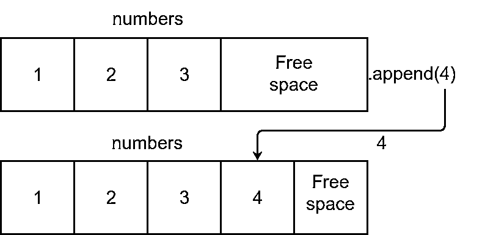

# Python 的。append():将项目添加到您的列表中

> 原文：<https://realpython.com/python-append/>

*立即观看**本教程有真实 Python 团队创建的相关视频课程。和书面教程一起看，加深理解: [**用 Python 的构建列表。**追加()](/courses/building-lists-with-python-append/)

在 Python 中，向列表中添加条目是一项相当常见的任务，因此该语言提供了许多方法和操作符来帮助您完成这项操作。其中一种方法是 **`.append()`** 。使用`.append()`，您可以将项目添加到现有列表对象的末尾。您也可以在 [`for`循环](https://realpython.com/python-for-loop/)中使用`.append()`以编程方式填充列表。

**在本教程中，您将学习如何:**

*   **`.append()`与**一起工作
*   使用`.append()`和**循环**填充列表
*   将`.append()`替换为**列表理解**
*   与**`array.array()`****`collections.deque()`**中的`.append()`一起工作

您还将编写一些如何在实践中使用`.append()`的例子。有了这些知识，你将能够在你的程序中有效地使用`.append()`。

**免费下载:** [从《Python 基础:Python 3 实用入门》中获取一个示例章节](https://realpython.com/bonus/python-basics-sample-download/)，看看如何通过 Python 3.8 的最新完整课程从初级到中级学习 Python。

## 用 Python 的`.append()` 向列表添加项目

Python 的 [`.append()`](https://docs.python.org/3/tutorial/datastructures.html#more-on-lists) 将一个对象作为参数，并将其添加到现有[列表](https://realpython.com/python-lists-tuples/)的末尾，紧接在其最后一个元素之后:

>>>

```py
>>> numbers = [1, 2, 3]
>>> numbers.append(4)
>>> numbers
[1, 2, 3, 4]
```

每次在现有列表上调用`.append()`时，该方法都会在列表的末尾或右侧添加一个新项目。下图说明了该过程:

[](https://files.realpython.com/media/python-append-diagram.57d5bd1285c6.png)

Python 列表在列表末尾为新项目保留了额外的空间。调用`.append()`会在可用空间中放置新的项目。

实际上，您可以使用`.append()`将任何类型的对象添加到给定的列表中:

>>>

```py
>>> mixed = [1, 2]

>>> mixed.append(3)
>>> mixed
[1, 2, 3]

>>> mixed.append("four")
>>> mixed
[1, 2, 3, 'four']

>>> mixed.append(5.0)
>>> mixed
[1, 2, 3, 'four', 5.0]
```

列表是可以保存不同数据类型和 Python 对象的序列，因此您可以使用`.append()`将任何对象添加到给定的列表中。在这个例子中，首先添加一个[整数](https://realpython.com/python-numbers/#integers)，然后添加一个[字符串](https://realpython.com/python-strings/)，最后添加一个[浮点数](https://realpython.com/python-numbers/#floating-point-numbers)。但是，您也可以添加另一个列表，一个[字典](https://realpython.com/python-dicts/)，一个[元组](https://realpython.com/python-lists-tuples/#python-tuples)，一个用户定义的对象，等等。

使用`.append()`相当于以下操作:

>>>

```py
>>> numbers = [1, 2, 3]

>>> # Equivalent to numbers.append(4)
>>> numbers[len(numbers):] = [4] >>> numbers
[1, 2, 3, 4]
```

在突出显示的行中，您同时执行两个操作:

1.  使用表达式`numbers[len(numbers):]`从`numbers`中取一个切片。
2.  将一个 iterable 分配给该片。

切片操作占用了`numbers`中最后一项之后的空间。同时，赋值操作[解包](https://realpython.com/python-lists-tuples/#tuple-assignment-packing-and-unpacking)赋值操作符右边的列表中的项目，并将它们添加到`numbers`。然而，使用这种赋值和使用`.append()`有一个重要的区别。通过分配，您可以一次将几个项目添加到列表的末尾:

>>>

```py
>>> numbers = [1, 2, 3]

>>> numbers[len(numbers):] = [4, 5, 6] >>> numbers
[1, 2, 3, 4, 5, 6]
```

在本例中，突出显示的行从`numbers`的末尾提取一个切片，解包右侧列表中的项目，并将它们作为单个项目添加到切片中。

[*Remove ads*](/account/join/)

### `.append()`增加一个单项

使用`.append()`，您可以将数字、列表、元组、字典、用户定义的对象或任何其他对象添加到现有列表中。然而，你需要记住`.append()`一次只添加一个项目或对象:

>>>

```py
>>> x = [1, 2, 3, 4]
>>> y = (5, 6)

>>> x.append(y)
>>> x
[1, 2, 3, 4, (5, 6)]
```

这里发生的是`.append()`将元组对象`y`添加到目标列表`x`的末尾。如果想把`y`中的每一个物品作为一个单独的物品加到`x`的末尾，得到`[1, 2, 3, 4, 5, 6]`怎么办？在这种情况下，您可以使用`.extend()`:

>>>

```py
>>> x = [1, 2, 3, 4]
>>> y = (5, 6, 7)
>>> x.extend(y)
>>> x
[1, 2, 3, 4, 5, 6, 7]

>>> x = [1, 2, 3, 4]
>>> y = (5, 6, 7)
>>> # Equivalent to x.extend(y)
>>> x[len(x):] = y
>>> x
[1, 2, 3, 4, 5, 6, 7]
```

将 iterable 作为参数，解包它的项，并将它们添加到目标列表的末尾。这个操作相当于`x[len(x):] = y`，和你上一节看到的技术是一样的。

### `.append()`回报`None`

实际上，`.append()`通过修改和增长底层列表来代替完成它的工作[。这意味着`.append()`不会向](https://en.wikipedia.org/wiki/In-place_algorithm)[返回一个新列表，并在末尾添加一个新项目。它返回](https://realpython.com/python-return-statement/) [`None`](https://realpython.com/null-in-python/) :

>>>

```py
>>> x = [1, 2, 3, 4]
>>> y = x.append(5)
>>> y is None
True
>>> x
[1, 2, 3, 4, 5]
```

与几个类似的方法一样，`.append()`就地改变底层列表。在学习[可变序列类型](https://docs.python.org/3/library/stdtypes.html#mutable-sequence-types)如何工作时，试图使用`.append()`的返回值是一个常见的错误。记住`.append()`的这种行为将有助于防止代码中出现错误。

## 从头开始填充列表

在 Python 中使用列表时，您可能会遇到的一个常见问题是如何用几个条目填充它们，以便进一步处理。有两种方法可以做到这一点:

1.  使用`.append()`和一个`for`回路
2.  使用列表理解

在接下来的几节中，您将学习如何以及何时使用这些技术从头开始创建和填充 Python 列表。

### 使用`.append()`

`.append()`的一个常见用例是使用一个`for`循环完全填充一个空列表。在循环内部，您可以操作数据并使用`.append()`将连续的结果添加到列表中。假设您需要创建一个函数，该函数接受一个数字序列并返回一个包含每个数字的平方根的列表:

>>>

```py
>>> import math

>>> def square_root(numbers):
...     result = []
...     for number in numbers:
...         result.append(math.sqrt(number))
...     return result
...

>>> numbers = [1, 4, 9, 16, 25, 36, 49, 64, 81]
>>> square_root(numbers)
[1.0, 2.0, 3.0, 4.0, 5.0, 6.0, 7.0, 8.0, 9.0]
```

在这里，您定义了`square_root()`，它将一个列表`numbers`作为参数。在`square_root()`中，创建一个名为`result`的空列表，并开始一个`for`循环，遍历`numbers`中的条目。在每次迭代中，使用 [`math.sqrt()`](https://realpython.com/python-square-root-function/) 计算当前数字的平方根，然后使用`.append()`将结果加到`result`中。一旦循环结束，就返回结果列表。

**注意:**在上面的例子中，你用的是来自`math`的`sqrt()`。Python 的`math`模块包含在[标准库](https://docs.python.org/3/library/index.html)中，并提供数学相关的功能。如果你想更深入地了解`math`，那么看看[Python 数学模块:你需要知道的一切](https://realpython.com/python-math-module/)。

这种填充列表的方式在 Python 中相当常见。然而，这种语言提供了一些方便的构造，可以使这个过程更加有效。其中一个构造是[列表理解](https://realpython.com/list-comprehension-python/)，您将在下一节看到它的运行。

[*Remove ads*](/account/join/)

### 使用列表理解

在实践中，当从头开始创建一个列表并填充它时，您经常用一个**列表理解**来替换`.append()`。通过列表理解，您可以像这样重新实现`square_root()`:

>>>

```py
>>> import math

>>> def square_root(numbers):
...     return [math.sqrt(number) for number in numbers]
...

>>> numbers = [1, 4, 9, 16, 25, 36, 49, 64, 81]
>>> square_root(numbers)
[1.0, 2.0, 3.0, 4.0, 5.0, 6.0, 7.0, 8.0, 9.0]
```

`square_root()`中的 list comprehension 为`numbers`中的每个`number`创建一个包含`number`的平方根的列表。这读起来几乎像简单的英语。此外，这种新的实现在处理时间方面将比使用`.append()`和`for`循环的实现更有效。

**注意:** Python 还提供了其他种类的理解，比如[集合理解、](https://realpython.com/list-comprehension-python/#using-set-and-dictionary-comprehensions)字典理解、[生成器表达式](https://realpython.com/introduction-to-python-generators/#building-generators-with-generator-expressions)。

要将`.append()`转换成列表理解，您只需要将它的参数放在一对方括号内，后面跟着循环头(没有冒号)。

### 切换回`.append()`

尽管对于填充列表来说，列表理解可能比`.append()`更具可读性和效率，但是在某些情况下`.append()`可能是更好的选择。

假设您需要`square_root()`向您的用户提供关于计算输入数字列表的平方根的进度的详细信息。要报告操作进度，可以使用 [`print()`](https://realpython.com/python-print/) :

>>>

```py
>>> import math

>>> def square_root(numbers):
...     result = []
...     n = len(numbers)
...     for i, number in enumerate(numbers):
...         print(f"Processing number: {number}")
...         result.append(math.sqrt(number))
...         print(f"Completed: {int((i + 1) / n * 100)}%")
...     return result
...

>>> numbers = [1, 4, 9, 16, 25, 36, 49, 64, 81]
>>> square_root(numbers)
Processing number: 1
Completed: 11%
...
Processing number: 81
Completed: 100%
[1.0, 2.0, 3.0, 4.0, 5.0, 6.0, 7.0, 8.0, 9.0]
```

现在考虑如何将`square_root()`的正文转化为列表理解。在列表中使用`print()`看起来不连贯，甚至是不可能的，除非你将部分代码包装在一个帮助函数中。所以，在这个例子中，使用`.append()`是正确的选择。

上述例子背后的寓意是，在某些情况下，你不能用列表理解或任何其他结构来替换`.append()`。

## 用 Python 的`.append()` 创建堆栈和队列

到目前为止，您已经学会了如何使用`.append()`向列表中添加单个项目或者从头开始填充列表。现在是时候举一个不同的更具体的例子了。在这一节中，您将学习如何使用 Python list 创建[堆栈](https://realpython.com/how-to-implement-python-stack/)和[队列](https://realpython.com/python-heapq-module/#data-structures-heaps-and-priority-queues)数据结构，并使用`.append()`和`.pop()`实现最少的功能需求。

### 实现堆栈

一个**栈**是一个[数据结构](https://realpython.com/python-data-structures/),它在彼此之上存储项目。物品以**后进/先出** ( [LIFO](https://en.wikipedia.org/wiki/LIFO) )的方式进出堆栈。通常，堆栈实现两个主要操作:

1.  **`push`** 将项目添加到堆栈的顶部或末端。
2.  **`pop`** 移除并返回堆栈顶部的项目。

在一个列表中，`.append()`相当于一个`push`操作，所以你可以用它来把条目推到堆栈上。列表还提供了`.pop()`，它可以选择接受一个整数索引作为参数。它返回基础列表中该索引处的项，并移除该项:

>>>

```py
>>> numbers = [1, 2, 3]
>>> numbers.pop(1)
2
>>> numbers
[1, 3]

>>> numbers.pop()
3
>>> numbers
[1]

>>> numbers.pop()
1
>>> numbers
[]

>>> numbers.pop()
Traceback (most recent call last):
  File "<input>", line 1, in <module>
    numbers.pop()
IndexError: pop from empty list
```

如果您将一个整数索引作为参数提供给`.pop()`，那么该方法将返回并删除列表中该索引处的项目。不带参数调用`.pop()`将返回列表中的最后一项。请注意，`.pop()`也从底层列表中删除了该项。最后，如果你在一个空列表上调用`.pop()`，那么你将得到一个 [`IndexError`](https://realpython.com/python-traceback/#indexerror) 。

有了这些知识，您就可以使用`.append()`和`.pop()`实现堆栈了。这里有一个定义堆栈的类。该类提供了`.push()`和`.pop()`操作:

```py
class Stack:
    def __init__(self):
        self._items = []

    def push(self, item):
        self._items.append(item)

    def pop(self):
        try:
            return self._items.pop()
        except IndexError:
            print("Empty stack")

    def __len__(self):
        return len(self._items)

    def __repr__(self):
        return f"Stack({self._items})"
```

在`Stack`中，首先初始化[实例属性](https://realpython.com/python3-object-oriented-programming/#class-and-instance-attributes) `._items`。该属性保存一个空列表，您将使用该列表在堆栈中存储项目。然后编写`.push()`，在`._items`上使用`.append()`实现`push`操作。

您还可以通过调用底层列表`._items`上的`.pop()`来实现`pop`操作。在这种情况下，您使用一个 [`try`和`except`块](https://realpython.com/python-exceptions/#the-try-and-except-block-handling-exceptions)来处理在空列表上调用`.pop()`时发生的`IndexError`。

**注意:**在 Python 中，使用异常来控制程序的流程是一种常见的模式。Python 开发人员更喜欢这种被称为 EAFP(请求原谅比请求许可容易)的编码风格，而不是被称为 LBYL(三思而后行)的编码风格。要了解这两种编码风格的更多信息，请查看 [LBYL vs EAFP:防止或处理 Python 中的错误](https://realpython.com/python-lbyl-vs-eafp/)。

EAFP 可以帮助您防止[竞争条件](https://en.wikipedia.org/wiki/Race_condition)，提高程序或代码片段的总体性能，并防止错误无声无息地传递。

特殊方法 [`.__len__()`](https://docs.python.org/3/reference/datamodel.html#object.__len__) 提供了检索内部列表`._items`长度所需的功能。特殊方法 [`.__repr__()`](https://realpython.com/operator-function-overloading/#representing-your-objects-using-repr) 允许您在将数据结构打印到屏幕上时，提供一个用户友好的栈的**字符串表示**。

以下是一些如何在实践中使用`Stack`的例子:

>>>

```py
>>> stack = Stack()

>>> # Push items onto the top of the stack
>>> stack.push(1)
>>> stack.push(2)

>>> # User-friendly printing format
>>> stack
Stack([1, 2])
>>> print(stack)
Stack([1, 2])

>>> # Retrieve the length of the stack
>>> len(stack)
2

>>> # Pop items from the top of the stack
>>> stack.pop()
2
>>> stack.pop()
1
>>> stack.pop()
Empty stack
>>> stack
Stack([])
```

就是这样！您已经编写了一个实现`push`和`pop`操作的堆栈数据结构。它还提供了获取底层列表长度和以用户友好的方式打印整个堆栈的功能。

[*Remove ads*](/account/join/)

### 实现队列

[队列](https://en.wikipedia.org/wiki/Queue_(abstract_data_type))是通常以**先进/先出** ( [先进先出](https://en.wikipedia.org/wiki/FIFO_(computing_and_electronics)))方式管理其项目的数据结构。队列就像一个管道，你在一端推入新的项目，旧的项目从另一端弹出。

将一个项目添加到队列的末尾被称为 **`enqueue`** 操作，而将一个项目从队列的前面或开头移除被称为 **`dequeue`** 操作。

您可以使用`.append()`让项目入队，使用`.pop()`让它们出队。这一次，您需要提供`0`作为`.pop()`的参数，让它检索列表中的第一项，而不是最后一项。下面是一个类，它实现了一个队列数据结构，使用一个列表来存储它的项目:

```py
class Queue:
    def __init__(self):
        self._items = []

    def enqueue(self, item):
        self._items.append(item)

    def dequeue(self):
        try:
            return self._items.pop(0)
        except IndexError:
            print("Empty queue")

    def __len__(self):
        return len(self._items)

    def __repr__(self):
        return f"Queue({self._items})"
```

这个班和你的`Stack`挺像的。主要区别在于，`.pop()`将`0`作为参数返回，并移除了底层列表`._items`中的*第一个*项，而不是最后一个。

**注意:**在 Python 列表上使用`.pop(0)`并不是消费列表项的最有效方式。幸运的是，Python 的 [`collections`模块](https://docs.python.org/3/library/collections.html#module-collections)提供了一个名为 [`deque()`](https://realpython.com/linked-lists-python/#introducing-collectionsdeque) 的数据结构，从`deque()`开始就将`.popleft()`实现为一种高效的消耗物品的方式。

在本教程的稍后部分，您将会学到更多关于使用 deques 的知识。

实现的其余部分几乎是相同的，但是使用了适当的名称，比如用`.enqueue()`添加条目，用`.dequeue()`删除条目。你可以使用`Queue`,就像你在上一节中使用`Stack`一样:只需调用`.enqueue()`来添加项目，调用`.dequeue()`来检索和删除它们。

## 在其他数据结构中使用`.append()`

其他 Python 数据结构也实现了`.append()`。工作原理与传统的`.append()`一列相同。方法将单个项添加到基础数据结构的末尾。但是，也有一些微妙的区别。

在接下来的两节中，您将学习`.append()`如何在其他数据结构中工作，例如 [`array.array()`](https://realpython.com/python-data-structures/#arrayarray-basic-typed-arrays) 和 [`collections.deque()`](https://realpython.com/python-data-structures/#collectionsdeque-fast-and-robust-stacks) 。

### `array.append()`

Python 的 **`array.array()`** 提供了一种类似序列的数据结构，可以简洁地表示一组值。这些值必须是相同的**数据类型**，仅限于 C 风格的数据类型，如字符、整数和浮点数。

`array.array()`采用以下两个参数:

| 争吵 | 内容 | 需要 |
| --- | --- | --- |
| `typecode` | 标识数组可以存储的数据类型的单字符代码 | 是 |
| `initializer` | 作为初始化器的列表、[类字节对象](https://docs.python.org/3/glossary.html#term-bytes-like-object)或 iterable | 不 |

`array` 的[文档提供了创建数组时可以使用的所有允许类型代码的完整信息。以下示例使用`"i"`类型代码创建一个整数数组:](https://docs.python.org/3/library/array.html?highlight=array#module-array)

>>>

```py
>>> from array import array

>>> # Array of integer numbers
>>> int_array = array("i", [1, 2, 3])
>>> int_array
array('i', [1, 2, 3])
>>> int_array[0]
1
>>> int_array[:2]
array('i', [1, 2])
>>> int_array[2] = 4
>>> int_array
array('i', [1, 2, 4])
```

要创建数组，您需要提供一个单字符代码来定义数组中值的数据类型。还可以提供适当类型的可选值列表来初始化数组。

数组支持大多数列表操作，比如**切片**和**索引**。和列表一样，`array.array()`也提供了一个名为 [`.append()`](https://docs.python.org/3/library/array.html#array.array.append) 的方法。该方法的工作方式与它的 list 对应方法类似，在基础数组的末尾添加一个值。但是，该值的数据类型必须与数组中的现有值兼容。否则，你会得到一个 [`TypeError`](https://realpython.com/python-traceback/#typeerror) 。

例如，如果您有一个整数数组，那么您不能使用`.append()`向该数组添加一个浮点数:

>>>

```py
>>> from array import array

>>> a = array("i", [1, 2, 3])
>>> a
array('i', [1, 2, 3])

>>> # Add a floating-point number
>>> a.append(1.5)
Traceback (most recent call last):
  File "<input>", line 1, in <module>
    a.append(1.5)
TypeError: integer argument expected, got float
```

如果你试图给`a`加一个浮点数，那么`.append()`会以一个`TypeError`失败。那是因为 Python 无法在不丢失信息的情况下自动将浮点数转换成整数。

相反，如果您有一个浮点数数组，并尝试向其中添加整数，那么您的操作将会成功:

>>>

```py
>>> from array import array

>>> float_array = array("f", [1.0, 2.0, 3.0])
>>> float_array
array('f', [1.0, 2.0, 3.0])

>>> # Add and integer number
>>> float_array.append(4)
>>> float_array
array('f', [1.0, 2.0, 3.0, 4.0])
```

这里，您使用`.append()`将一个整数添加到一个浮点数数组中。这是可能的，因为 Python 可以自动将整数转换成浮点数，而不会在转换过程中丢失信息。

[*Remove ads*](/account/join/)

### `deque.append()`和`deque.appendleft()`

**`collections.deque()`** 是另一种实现 [`.append()`](https://docs.python.org/3/library/collections.html#collections.deque.append) 变体的数据结构。一个 **`deque`** 是一个栈和一个队列的一般化，专门设计来支持其两端的快速和内存高效的`append`和`pop`操作。因此，如果您需要创建具有这些特性的数据结构，那么可以考虑使用 deque 而不是 list。

**注:**名字**德克**读作“deck”，代表**d**double-**e**nd**que**UE。

`collections.deque()`采用以下两个可选参数:

| 争吵 | 内容 |
| --- | --- |
| `iterable` | 充当初始值设定项的可迭代对象 |
| `maxlen` | 一个整数，指定队列的最大长度 |

如果您为`maxlen`提供一个值，那么您的队列将只存储最多`maxlen`个项目。一旦队列已满，添加一个新项目将自动导致队列另一端的项目被丢弃。另一方面，如果您不为`maxlen`提供一个值，那么 deque 可以增长到任意数量的条目。

在 deques 中，`.append()`还会在底层数据结构的末尾或右侧添加一个项目:

>>>

```py
>>> from collections import deque

>>> d = deque([1, "a", 3.0])
>>> d
deque([1, 'a', 3.0])

>>> d.append("b")
>>> d
deque([1, 'a', 3.0, 'b'])
```

像列表一样，deques 可以保存不同类型的条目，所以`.append()`将任意条目添加到 deques 的末尾。换句话说，使用`.append()`，您可以将任何对象添加到队列中。

除了`.append()`之外，deques 还提供 [`.appendleft()`](https://docs.python.org/3/library/collections.html#collections.deque.appendleft) ，在 deques 的开头或左侧添加一个单项。类似地，deques 提供 [`.pop()`](https://docs.python.org/3/library/collections.html#collections.deque.pop) 和 [`.popleft()`](https://docs.python.org/3/library/collections.html#collections.deque.popleft) 来分别从 deques 的右侧和左侧移除项目:

>>>

```py
>>> from collections import deque

>>> d = deque([1, "a", 3.0])
>>> d.appendleft(-1.0)
>>> d
deque([-1.0, 1, 'a', 3.0])

>>> d.pop()
3.0

>>> d.popleft()
-1.0

>>> d
deque([1, 'a'])
```

对`.appendleft()`的调用将`-1.0`添加到`d`的左侧。另一方面，`.pop()`返回并删除`d`中的最后一项，`.popleft()`返回并删除第一项。作为练习，您可以尝试使用 deque 而不是 list 来实现自己的堆栈或队列。为此，你可以利用你在[小节中看到的例子，用 Python 创建堆栈和队列。追加()](https://realpython.com/python-append/#creating-stacks-and-queues-with-pythons-append)。

## 结论

Python 提供了一个名为 **`.append()`** 的方法，可以用来将项目添加到给定列表的末尾。这种方法被广泛用于将单个项目添加到列表的末尾，或者使用 [`for`循环](https://realpython.com/python-for-loop/)填充列表。学习如何使用`.append()`将帮助你在程序中处理列表。

**在本教程中，您学习了:**

*   **`.append()`** 如何运作
*   如何使用`.append()`和一个`for`循环来**填充列表**
*   什么时候用**代替`.append()`列表理解**
*   `.append()`如何在**`array.array()`****`collections.deque()`**中发挥作用

此外，您编写了一些如何使用`.append()`创建数据结构的例子，比如[栈](https://realpython.com/how-to-implement-python-stack/)和[队列](https://en.wikipedia.org/wiki/Queue_(abstract_data_type))。这些知识将允许你使用`.append()`来有效地增加你的清单。

*立即观看**本教程有真实 Python 团队创建的相关视频课程。和书面教程一起看，加深理解: [**用 Python 的构建列表。**追加()](/courses/building-lists-with-python-append/)******