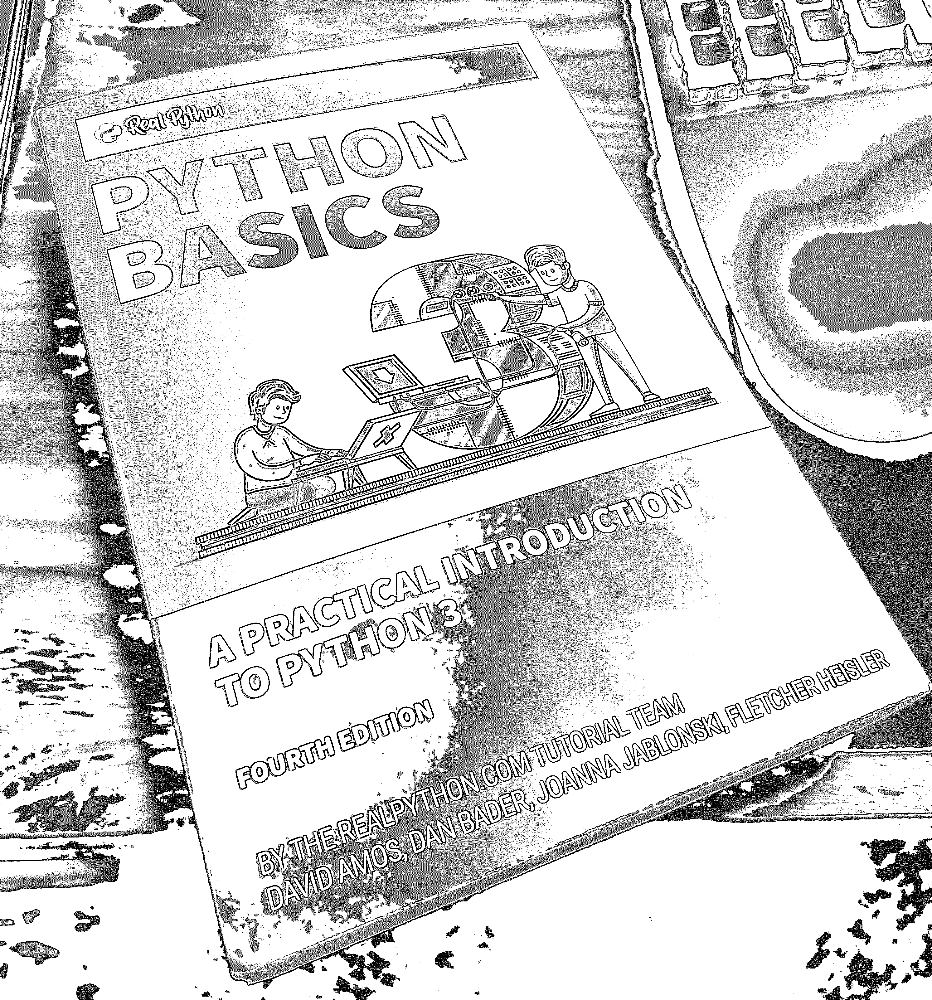
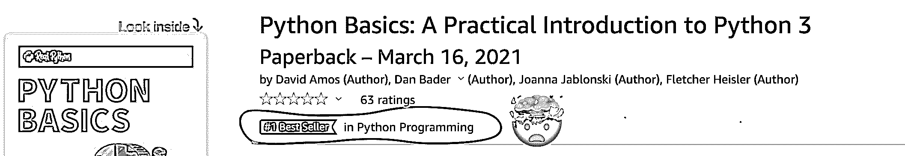
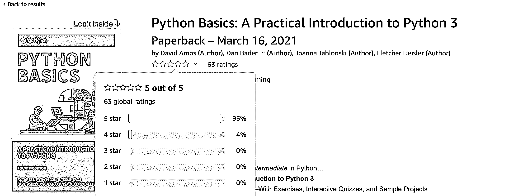

# Python 基础:平装本现已上市！

> 原文：<https://realpython.com/python-basics-paperback/>

经过多年的写作、审查和测试，我们很高兴地宣布 [*Python 基础知识:Python 3*](https://realpython.com/products/python-basics-book/) 实用介绍现已在**平装本**中推出！

听到读者如何利用这本书来促进他们的学习，这是很有收获的。在收到如此多的社区反馈后，我们相信你会用这本书为你的 Python 之旅打下坚实的基础:你不仅会学到你真正需要知道的**核心概念**，而且在**实践练习**的帮助下，你还会以最**有效的顺序**学习它们。

**在这篇文章中，你会看到:**

*   如何**用 *Python 基础*提升你的 Python**
*   其他蟒蛇是如何做到的

要直接跳到精彩内容并得到这本书，请单击下面的链接:

## 你可以得到平装本的 Python 基础！

终于来了！读者一直给我们看他们的副本，让我们知道他们的想法。这里有一个来自我们的[社区 Slack](https://realpython.com/community/) :

我们从 *Real Python* 社区收到的反馈是无价的，帮助我们创建了一个实用且有帮助的学习工具，我们很荣幸能与 Python 社区分享这个工具。要了解这本书的更多内容，请查看大卫·阿莫斯的概述，他是*真正的 Python* 核心团队成员和 *Python 基础知识*的主要作者:

[https://player.vimeo.com/video/527948454](https://player.vimeo.com/video/527948454)

*Python 基础知识*是许多人多年工作的成果，我们认为最终产品真正体现了这一点。这是一段不平凡的旅程！我们真的很高兴能与您分享这本书，所以当我们正式推出这本书时， *Real Python* 编辑团队在 Zoom 上举办了一个发布会:

当然有很多值得庆祝的事情！在发布后的最初几天里，观看 *Python 基础知识*在亚马逊排行榜上攀升并迅速成为 Python 编程领域的头号畅销书简直是一场疯狂之旅:

这本书不仅很快成为畅销书，而且到目前为止我们收到的评论都非常积极:

得知如此多的学习者使用这本书来提升他们的游戏水平，真是令人感动。我们希望在您亲自借阅这本书时收到您的来信。

[*Remove ads*](/account/join/)

## 谁应该读这本书？

互联网上有大量关于 Python 的信息，因此我们创建、测试并完善了一个学习系统，帮助您充分利用学习时间:

> **比满满一书架的 Python 书强！**
> 
> 《Python 基础》是一本写得非常好并且非常全面的书。每一个概念都被**清晰的解释**和**优秀的例子**…它们都有效！如果你对 Python 感兴趣，你会把这本书放在桌子上手边。(⭐⭐⭐⭐⭐)
> 
> ——布拉德·尤斯(通过亚马逊)

无论您是刚开始学习一般编程还是特别是 Python 编程，您都将获得有效的、真实的 Python 技能。如果你已经是一个 Pythonista，那么你会有一个经过反复试验的系统来提高你的技能，并确保你有一个强大的基础。

### 你是编程新手吗？

如果你是编程新手，那么你会得到一个实用的、循序渐进的路线图来发展你的基本技能。将按照逻辑顺序向您介绍每个概念，代码示例简短明了:

> **学习 Python 的佳作**
> 
> 作为一名目前正在攻读数据科学研究生学位的学生，您最终需要学习 Python。学校里的入门课程不足以真正更好地掌握编程语言。
> 
> 作为一个从未编写过代码的人，我需要尽可能多的帮助。谢天谢地，我找到了真正的 Python 网站。我真的很喜欢他们简单易懂的**教程，所以我买了《Python 基础知识》这本书。**
> 
> 这是一笔非常划算的买卖，我向所有想学习 Python 的人强烈推荐它。它很容易理解，并提供了很好的例子。(⭐⭐⭐⭐⭐)
> 
> Lorrayne Cruz Almodovar(通过亚马逊)

您将获得完整的 Python 课程，包括练习、互动测验和示例项目。

### 你是 Python 新手吗？

如果您熟悉一些基本的编程概念，那么您将会对 Python 有一个清晰的、经过充分测试的介绍。这是 Python 的实用介绍，让您直接跳到好的部分，以便快速跟踪您的进度:

> **Python 优秀入门**
> 
> 关于 Python 的入门书籍并不缺乏，但在我看来这本书很突出。概念是逐渐建立起来的，在之前的课程之上，顺序是**精心设计的**。**语言很简单**，甚至有点娱乐性，绝对不枯燥——对于一本编程书籍来说，这本身就是一个成就。
> 
> 在整篇文章中，有一些**提示**和陷阱，不管你的技能水平如何，你都会发现它们非常有用。有一章讲述了编程的几乎每一个方面，给人一种如何做的感觉——足够的深度。**强烈推荐**。(⭐⭐⭐⭐⭐)
> 
> —迪米特里(通过亚马逊)

您将很快熟悉 Python，并很快学会“足够危险”。

### 你是一个想不断学习的 Pythonista 吗？

如果您已经是 Python 开发人员，那么您可以快速混合和匹配您最感兴趣的章节，并使用交互式测验和练习来检查您的进度:

> **呼叫 Python 开发者获取这本书！**
> 
> Python 基础写得非常好。这本书很容易理解，并为 T2 提供了很多细节。这肯定会是一本我可以轻松获取的书，以刷新我的知识和学习新的东西。
> 
> 它有 635 页——无论你处于什么水平，你怎么能从这本书中学不到东西呢？这本书是高质量的，我对真正的 Python、Dan Bader 和他的团队的期望一点也不低！我有了数字版，很快就买了印刷版。(⭐⭐⭐⭐⭐)
> 
> —威廉·格伦农(通过亚马逊)

无论您在 Python 之旅的哪个地方，都有发展的空间。让我们一起来提升我们的 Python 吧！

## 你还需要知道什么？

在内容上，印刷版与*真蟒*网上商店上的[数字版](https://realpython.com/products/python-basics-book/)完全相同。亚马逊还为这本书提供了强大的 **30 天退款保证**，所以对你来说零风险。要获取打印副本，请单击下面的按钮:

[Buy on **Amazon** »](https://realpython.com/asins/1775093328/)

点击该按钮应该会自动将您重定向到您当地的亚马逊商店。或者您可以使用下面的直接链接:

*   [Amazon.com(美国&国际)](https://www.amazon.com/dp/1775093328/?tag=devdetailpage02-20)
*   [亚马逊网站(加拿大)](https://www.amazon.ca/dp/1775093328/?tag=devdetailpage-20)
*   [Amazon.co.uk(英国)](https://www.amazon.co.uk/dp/1775093328/?tag=devdetailpage-21)
*   [Amazon.de(德国&欧洲)](https://www.amazon.de/dp/1775093328/?tag=devdetailpa08-21)
*   [亚马逊印度站](https://www.amazon.in/dp/1775093328/)

如果您当地的亚马逊商店没有在这里列出，那么尝试在“书籍”下搜索“Python 基础”或 ISBN `1775093328`，它应该会出现。

如果你得到了平装本，那么你仍然可以获得数字版本中包含的所有额外资料。因此，您将获得与数字版客户相同的出色体验，通过交互式在线测验和下载访问练习和代码挑战解决方案。

如果亚马逊没有送货到你的地址，那么你应该可以通过给他们 ISBN 码`1775093328`从任何一家当地书店订购这本书。这本书可能需要一段时间才能上市，因为我们刚刚出版了它，但它不仅限于在亚马逊上销售。只是亚马逊是最大的分销渠道，所以这是我们现在推出的重点。

[*Remove ads*](/account/join/)

## 用 Python 基础知识提升您的 Python 水平！

听说读者已经从这本书中获益良多，这是很值得的，我们也很乐意**收到你的来信**！我们从 *Real Python* 社区收到的反馈是*无价的*——我们都对最终书的结果非常满意。感谢您的支持！要获得这本书，请单击下面的链接:

[Buy on **Amazon** »](https://realpython.com/asins/1775093328/)

一旦你拿到了这本书，如果你能在亚马逊上添加你自己的评论和评级，那将是一个巨大的帮助。请随时直接联系我们，让我们知道您的 Python 之旅进展如何，以及您需要什么样的学习资源来迈出下一大步。**