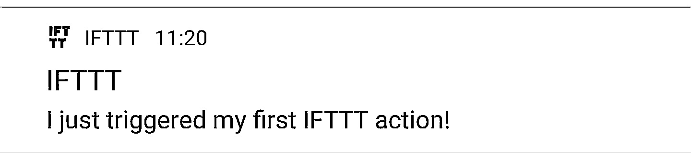
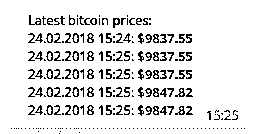

# 面向初学者的 Python 项目:比特币价格通知

> 原文：<https://realpython.com/python-bitcoin-ifttt/>

欢迎阅读面向初学者的 Python 项目系列文章的第一篇！

在本教程中，我们将构建一个比特币价格通知服务—

在这个项目中，您将了解 HTTP 请求以及如何使用(适当命名的)`requests`包发送它们。

您将了解 webhooks，以及如何使用它们将您的 Python 应用程序连接到外部服务，如电话通知或电报信息。

用相对少的代码(大约 50 行)，你将得到一个成熟的比特币价格通知服务，它将很容易扩展到其他加密货币和服务。

所以让我们直接开始吧:

## 用 Python 发布比特币价格通知

众所周知，比特币价格是一个善变的东西。你永远不知道一天结束时它会在哪里。因此，与其不断地在各种网站上寻找最新的更新，不如让 Python 应用程序来帮你完成这项工作。

为此，我们将使用流行的自动化网站 [IFTTT](https://ifttt.com) 。if TTT(“if this，then that”)是一种网络服务，它弥合了不同应用程序和设备之间的差距。

我们将创建两个 IFTTT 小程序:

*   一个用于当比特币价格低于某个阈值时的紧急通知；和
*   另一个是定期[电报](https://telegram.org/)关于比特币价格的更新。

这两者都将由我们的 Python 应用程序触发，该应用程序将使用来自 [Coinmarketcap API](https://coinmarketcap.com/api/) 的数据。

IFTTT applet 由两部分组成:触发器和动作。

在我们的例子中，触发器将是 IFTTT 提供的 webhook 服务。你可以把 webhooks 看作“用户定义的 HTTP 回调”,你可以在这里阅读更多关于它们的内容。

我们的 Python 应用程序将向 webhook URL 发出 HTTP 请求，这将触发一个操作。现在，这是有趣的部分——动作几乎可以是你想要的任何东西。IFTTT 提供了多种操作，比如发送电子邮件、更新谷歌电子表格，甚至打电话给你。

[*Remove ads*](/account/join/)

## 项目设置

让我们从建立一个[虚拟环境](https://realpython.com/python-virtual-environments-a-primer/)开始。运行以下命令以获得新的 Python 3 虚拟环境:

```py
$ mkvirtualenv -p $(which python3) bitcoin_notifications
```

在继续之前，您必须激活虚拟环境并安装所需的依赖项:

```py
$ workon bitcoin_notifications  # To activate the virtual environment
$ pip install requests==2.18.4  # We only need the requests package
```

您可以通过运行`deactivate` shell 命令来停用虚拟环境。

## 检索比特币价格

是时候把手弄脏了。我们可以从 Python 控制台中的 Coinmarketcap API 获取最新价格开始:

首先，我们必须[导入](https://realpython.com/absolute-vs-relative-python-imports/)模块`requests`并定义`bitcoin_api_url`变量，该变量包含比特币的 Coinmarketcap API URL。

接下来，我们使用`requests.get()`函数向 URL 发送一个 HTTP GET 请求，并保存响应。由于 API 返回一个 JSON 响应，我们可以通过调用响应上的`.json()`函数将它转换成一个 Python 对象。如您所见，API 返回了一个列表，其中一个元素包含比特币价格数据:

>>>

```py
>>> import requests
>>> bitcoin_api_url = 'https://api.coinmarketcap.com/v1/ticker/bitcoin/'
>>> response = requests.get(bitcoin_api_url)
>>> response_json = response.json()
>>> type(response_json) # The API returns a list
<class 'list'>
>>> # Bitcoin data is the first element of the list
>>> response_json[0]
{'id': 'bitcoin', 'name': 'Bitcoin', 'symbol': 'BTC', 'rank': '1', 
 'price_usd': '10226.7', 'price_btc': '1.0', '24h_volume_usd': '7585280000.0',
 'market_cap_usd': '172661078165', 'available_supply': '16883362.0', 
 'total_supply': '16883362.0', 'max_supply': '21000000.0', 
 'percent_change_1h': '0.67', 'percent_change_24h': '0.78', 
 'percent_change_7d': '-4.79', 'last_updated': '1519465767'}
```

我们最感兴趣的属性是`'price_usd'`——以美元计算的比特币价格。

## 发送测试 IFTTT 通知

现在我们可以进入事情的 IFTTT 方面了。要使用 IFTTT，你首先需要[建立一个新账户](https://ifttt.com/join)并安装他们的移动应用程序(如果你想从你的 Python 应用程序接收电话通知)。一旦你设置好了，我们将[创建](https://ifttt.com/create)一个新的 IFTTT 小程序用于[测试目的](https://realpython.com/python-testing/)。

要创建新的测试小程序，请按照下列步骤操作:

1.  点击大的*“本”*按钮
2.  搜索*“web hooks”*服务，选择*“接收 web 请求”*触发器
3.  让我们把这个事件命名为`test_event`
4.  现在选择大的*那个*按钮
5.  搜索*“通知”*服务，选择*“从 IFTTT 应用发送通知”*
6.  将消息更改为`I just triggered my first IFTTT action!`并点击*“创建行动”*
7.  点击*“完成”*按钮，我们就完成了

要查看关于如何使用 IFTTT webhooks 的文档，请进入此[页面](https://ifttt.com/maker_webhooks)并点击右上角的*“文档”*按钮。文档页面包含 webhook URL，看起来像这样:

```py
https://maker.ifttt.com/trigger/{event}/with/key/{your-IFTTT-key}
```

接下来，您需要用您在步骤 3 中创建 applet 时为我们的事件指定的名称替换`{event}`部分。`{your-IFTTT-key}`部分已经用 IFTTT 键填充。

现在复制 webhook URL 并启动另一个 Python 控制台。我们再次[导入](https://realpython.com/python-import/)模块`requests`并定义 webhook URL 变量。现在我们只需使用`requests.post()`函数向 IFTTT webhook URL 发送一个 HTTP POST 请求:

>>>

```py
>>> import requests
>>> # Make sure that your key is in the URL
>>> ifttt_webhook_url = 'https://maker.ifttt.com/trigger/test_event/with/key/{your-IFTTT-key}'
>>> requests.post(ifttt_webhook_url)
<Response [200]>
```

运行完最后一行后，您应该会在手机上看到一个通知:

[](https://files.realpython.com/media/ifttt_test_notification.7384c7562c30.jpg)[*Remove ads*](/account/join/)

## 创建 IFTTT 小程序

现在我们终于准备好了主要部分。在开始编写代码之前，我们需要创建两个新的 IFTTT 小程序:一个用于紧急比特币价格通知，一个用于定期更新。

**紧急比特币价格通知小程序:**

1.  选择*“web hooks”*服务，选择*“接收 web 请求”*触发器
2.  命名事件`bitcoin_price_emergency`
3.  对于操作，选择*“通知”*服务，并选择*“从 IFTTT 应用程序发送丰富通知”*操作
4.  给它起个标题，像*“比特币价格紧急事件！”*
5.  将消息设置为`Bitcoin price is at ${{Value1}}. Buy or sell now!`(稍后我们将返回到`{{Value1}}`部分)
6.  你可以选择添加一个链接 URL 到 Coinmarketcap 比特币页面:`https://coinmarketcap.com/currencies/bitcoin/`
7.  创建动作并完成 applet 的设置

**定期价格更新小程序:**

1.  再次选择*“web hooks”*服务，并选择*“接收 web 请求”*触发器
2.  命名事件`bitcoin_price_update`
3.  对于动作，选择*“电报”*服务，并选择*“发送消息”*动作
4.  将消息文本设置为:`Latest bitcoin prices:<br>{{Value1}}`
5.  创建动作，并以 applet 结束

> **注意:**创建此小程序时，您必须授权 IFTTT 电报机器人。

## 将所有这些放在一起

现在我们已经解决了 IFTTT，让我们开始编码吧！您将首先创建如下所示的标准 Python 命令行应用程序框架。将这段代码保存在一个名为`bitcoin_notifications.py`的文件中:

```py
import requests
import time
from datetime import datetime

def main():
    pass

if __name__ == '__main__':
    main()
```

接下来，我们必须将之前的两个 Python 控制台会话转换为两个函数，这两个函数将分别返回最新的比特币价格和发布到 IFTTT webhook。在[主功能](https://realpython.com/python-main-function/)上增加以下功能:

```py
BITCOIN_API_URL = 'https://api.coinmarketcap.com/v1/ticker/bitcoin/'
IFTTT_WEBHOOKS_URL = 'https://maker.ifttt.com/trigger/{}/with/key/{your-IFTTT-key}'

def get_latest_bitcoin_price():
    response = requests.get(BITCOIN_API_URL)
    response_json = response.json()
    # Convert the price to a floating point number
    return float(response_json[0]['price_usd'])

def post_ifttt_webhook(event, value):
    # The payload that will be sent to IFTTT service
    data = {'value1': value}
    # inserts our desired event
    ifttt_event_url = IFTTT_WEBHOOKS_URL.format(event)
    # Sends a HTTP POST request to the webhook URL
    requests.post(ifttt_event_url, json=data)
```

除了我们必须将价格从字符串转换成浮点数的部分之外,`get_latest_bitcoin_price`几乎是一样的。`post_ifttt_webhook`接受两个参数:`event`和`value`。

`event`参数对应于我们在设置 IFTTT 小程序时赋予触发器的任何事件名称。此外，IFTTT webhooks 允许我们将附加数据作为 JSON 格式的数据随请求一起发送。

这就是为什么我们需要`value`参数:当设置我们的小程序时，我们在消息字段中留下了一个`{{Value1}}`标签。这个标签被 JSON 负载中的`'value1'`文本替换。`requests.post()`函数允许我们通过添加`json`关键字来发送额外的 JSON 数据。

现在我们可以在`main`函数中继续我们应用程序的核心。它将由一个`while True`循环组成，因为我们希望我们的应用程序永远运行。在循环中，我们将调用 Coinmarketcap API 来获取最新的比特币价格，并记录当前的日期和时间。

根据目前的价格，我们将决定是否要发送紧急通知。对于我们的定期电报更新，我们还会将当前价格和日期附加到一个`bitcoin_history`列表中。一旦列表达到一定数量的项目(如 5)，我们将格式化项目，将更新发送到 Telegram，并重置历史以备将来更新。

哇哦！如你所见，这个应用程序有很多功能。如果你在理解我们到目前为止得到的代码时有困难，那么休息一下，慢慢地再读一遍上面的部分。这并不容易，所以慢慢来，不要担心第一次就把一切都做好。

重要的是避免过于频繁地发出这些请求，原因有二:

*   Coinmarketcap API 声明他们每 5 分钟才更新一次数据，所以没有必要更频繁地重新加载最新的价格信息
*   如果您的应用程序向 Coinmarketcap API 发送了太多请求，您的 IP 可能会被禁止或暂时暂停。

这就是为什么我们需要在获得新数据之前“休眠”(停止循环的执行)至少 5 分钟。下面的代码实现了我上面提到的所有必需的特性:

```py
BITCOIN_PRICE_THRESHOLD = 10000  # Set this to whatever you like

def main():
    bitcoin_history = []
    while True:
        price = get_latest_bitcoin_price()
        date = datetime.now()
        bitcoin_history.append({'date': date, 'price': price})

        # Send an emergency notification
        if price < BITCOIN_PRICE_THRESHOLD:
            post_ifttt_webhook('bitcoin_price_emergency', price)

        # Send a Telegram notification
        # Once we have 5 items in our bitcoin_history send an update
        if len(bitcoin_history) == 5:
            post_ifttt_webhook('bitcoin_price_update', 
                               format_bitcoin_history(bitcoin_history))
            # Reset the history
            bitcoin_history = []

        # Sleep for 5 minutes 
        # (For testing purposes you can set it to a lower number)
        time.sleep(5 * 60)
```

我们快完成了！唯一缺少的是`format_bitcoin_history`函数。它将`bitcoin_history`作为一个参数，并使用 Telegram 允许的一些基本 HTML 标签对其进行格式化，比如`<br>`、`<b>`、`<i>`等等。将此功能复制到`main`功能之上:

```py
def format_bitcoin_history(bitcoin_history):
    rows = []
    for bitcoin_price in bitcoin_history:
        # Formats the date into a string: '24.02.2018 15:09'
        date = bitcoin_price['date'].strftime('%d.%m.%Y %H:%M')
        price = bitcoin_price['price']
        # <b> (bold) tag creates bolded text
        # 24.02.2018 15:09: $<b>10123.4</b>
        row = '{}: $<b>{}</b>'.format(date, price)
        rows.append(row)

    # Use a <br> (break) tag to create a new line
    # Join the rows delimited by <br> tag: row1<br>row2<br>row3
    return '<br>'.join(rows)
```

这是你手机上的最终结果:

[](https://files.realpython.com/media/bitcoin_telegram.1a228cd2b5eb.png)

要运行价格通知应用程序，请在命令行终端中执行以下操作:

```py
$ python bitcoin_notifications.py
```

就是这样！在略多于 50 行的 Python 代码中，您已经创建了自己的比特币通知服务。恭喜你！下面我添加了完整的代码，这样你可以比较一下，看看你是否遗漏了什么:


```py
import requests
import time
from datetime import datetime

BITCOIN_PRICE_THRESHOLD = 10000
BITCOIN_API_URL = 'https://api.coinmarketcap.com/v1/ticker/bitcoin/'
IFTTT_WEBHOOKS_URL = 'https://maker.ifttt.com/trigger/{}/with/key/{your-IFTTT-key}'

def get_latest_bitcoin_price():
    response = requests.get(BITCOIN_API_URL)
    response_json = response.json()
    return float(response_json[0]['price_usd'])  # Convert the price to a floating point number

def post_ifttt_webhook(event, value):
    data = {'value1': value}  # The payload that will be sent to IFTTT service
    ifttt_event_url = IFTTT_WEBHOOKS_URL.format(event)  # Inserts our desired event
    requests.post(ifttt_event_url, json=data)  # Sends a HTTP POST request to the webhook URL

def format_bitcoin_history(bitcoin_history):
    rows = []
    for bitcoin_price in bitcoin_history:
        date = bitcoin_price['date'].strftime('%d.%m.%Y %H:%M')  # Formats the date into a string: '24.02.2018 15:09'
        price = bitcoin_price['price']
        # <b> (bold) tag creates bolded text
        row = '{}: $<b>{}</b>'.format(date, price)  # 24.02.2018 15:09: $<b>10123.4</b>
        rows.append(row)

    # Use a <br> (break) tag to create a new line
    return '<br>'.join(rows)  # Join the rows delimited by <br> tag: row1<br>row2<br>row3

def main():
    bitcoin_history = []
    while True:
        price = get_latest_bitcoin_price()
        date = datetime.now()
        bitcoin_history.append({'date': date, 'price': price})

        # Send an emergency notification
        if price < BITCOIN_PRICE_THRESHOLD:
            post_ifttt_webhook('bitcoin_price_emergency', price)

        # Send a Telegram notification
        if len(bitcoin_history) == 5:  # Once we have 5 items in our bitcoin_history send an update
            post_ifttt_webhook('bitcoin_price_update', format_bitcoin_history(bitcoin_history))
            # Reset the history
            bitcoin_history = []

        time.sleep(5 * 60)  # Sleep for 5 minutes (for testing purposes you can set it to a lower number)

if __name__ == '__main__':
    main()
```

[*Remove ads*](/account/join/)

## 回顾和后续步骤

在本文中，我们创建了自己的比特币通知服务。您学习了如何使用`requests`包发送 HTTP GET 和 POST 请求。您看到了使用 IFTTT 和 webhooks 将 Python 应用程序连接到外部服务是多么容易。

现在，你下一步应该去哪里？使用 Python 和 IFTTT，天空是无限的。但是这里有一些建议可以帮助你开始:

*   比如电子表格？使用 IFTTT 操作将比特币价格添加到 Google 电子表格中
*   改善`if price < BITCOIN_PRICE_THRESHOLD`条件，每天只收到一次通知(否则，如果比特币持续走低，这将变得非常烦人)
*   更喜欢以太坊/莱特币/Dogecoin？将`get_latest_bitcoin_price`更改为`get_latest_cryptocurrency_price`,它将接受加密货币作为参数并返回其价格
*   你想要不同货币的价格？检查 Coinmarketcap API 中的`convert`参数。

此外，这将是一个持续的系列，您可以构建更多的 Python 项目来提高您的技能。不要错过下一个教程:

**获得通知:**不要错过本教程的后续— [点击这里加入真正的 Python 时事通讯](https://realpython.com/bonus/newsletter-dont-miss-updates/)你会知道下一期什么时候出来。

祝好运和快乐的蟒蛇！请在下面的评论中让我知道你用 Python 和 IFTTT 构建了什么！***