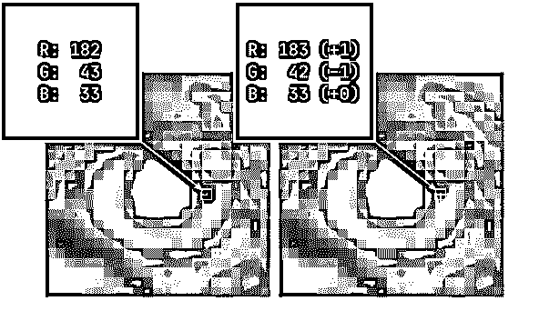

# Python 中的按位运算符

> 原文：<https://realpython.com/python-bitwise-operators/>

*立即观看**本教程有真实 Python 团队创建的相关视频课程。和书面教程一起看，加深理解:[**Python 中的二进制、字节、按位运算符**](/courses/binary-bytes-bitwise-operators/)

计算机将各种信息存储为二进制数字流，称为**位**。无论你是在处理文本、图像还是视频，它们都可以归结为 1 和 0。Python 的**位操作符**让你可以在最精细的层次上操作那些单独的数据位。

您可以使用按位运算符来实现压缩、加密和错误检测等算法，以及控制您的 [Raspberry Pi 项目](https://realpython.com/python-raspberry-pi/)或其他地方的物理设备。通常，Python 通过高层抽象将您与底层隔离开来。在实践中，你更有可能找到[重载](https://realpython.com/operator-function-overloading/)风格的按位运算子。但是当你以他们最初的形式和他们一起工作时，你会对他们的怪癖感到惊讶！

**在本教程中，您将学习如何:**

*   使用 Python **位操作符**来操作单个位
*   以与平台无关的方式读写二进制数据
*   使用**位掩码**将信息打包在一个字节上
*   **重载**自定义数据类型中的 Python 按位运算符
*   在数字图像中隐藏秘密信息

要获得数字水印示例的完整源代码，并提取隐藏在图像中的秘密处理，请单击下面的链接:

**获取源代码:** [点击此处获取源代码，您将在本教程中使用](https://realpython.com/bonus/python-bitwise-operators/)来学习 Python 的按位运算符。

## Python 的按位运算符概述

Python 附带了一些不同种类的[操作符](https://realpython.com/python-operators-expressions)，比如算术、逻辑和比较操作符。你可以把它们看作是利用了更紧凑的**前缀**和**中缀**语法的函数。

**注意:** Python 不包括**后缀**操作符，比如 c 语言中可用的增量(`i++`)或减量(`i--`)操作符

在不同的编程语言中，位运算符看起来几乎是一样的:

| 操作员 | 例子 | 意义 |
| --- | --- | --- |
| `&` | `a & b` | 按位 AND |
| `&#124;` | `a &#124; b` | 按位或 |
| `^` | `a ^ b` | 按位异或 |
| `~` | `~a` | 按位非 |
| `<<` | `a << n` | 按位左移 |
| `>>` | `a >> n` | 按位右移 |

正如你所看到的，它们用奇怪的符号而不是单词来表示。这使得它们在 Python 中显得很突出，比您可能习惯看到的稍微不那么冗长。仅仅看着它们，你可能无法理解它们的意思。

**注意:**如果您来自另一种编程语言，比如 [Java](https://realpython.com/oop-in-python-vs-java/) ，那么您会立即注意到 Python 缺少了由三个大于号(`>>>`)表示的**无符号右移运算符**。

这与 Python [如何在内部表示整数](#integers-in-python)有关。因为 Python 中的整数可以有无限多的位，所以[符号位](https://en.wikipedia.org/wiki/Sign_bit)没有固定的位置。事实上，Python 中根本没有符号位！

大多数位运算符都是**二进制**，这意味着它们需要处理两个操作数，通常称为**左操作数**和**右操作数**。按位 NOT ( `~`)是唯一的**一元**按位运算符，因为它只需要一个操作数。

所有二元按位运算符都有一个相应的**复合运算符**，它执行一个[增强赋值](https://www.python.org/dev/peps/pep-0203/):

| 操作员 | 例子 | 等于 |
| --- | --- | --- |
| `&=` | `a &= b` | `a = a & b` |
| `&#124;=` | `a &#124;= b` | `a = a &#124; b` |
| `^=` | `a ^= b` | `a = a ^ b` |
| `<<=` | `a <<= n` | `a = a << n` |
| `>>=` | `a >>= n` | `a = a >> n` |

这些是就地更新左操作数的简写符号。

这就是 Python 的按位运算符语法的全部内容！现在，您已经准备好仔细研究每个操作符，以了解它们最有用的地方以及如何使用它们。首先，在查看两类按位运算符之前，您将快速回顾一下二进制系统:按位**逻辑**运算符和按位**移位**运算符。

[*Remove ads*](/account/join/)

## 五分钟后双星系统

在继续之前，花点时间复习一下关于二进制系统的知识，这对理解按位运算是必不可少的。如果你已经习惯了，那就直接跳到下面的[位逻辑运算符](#bitwise-logical-operators)部分。

### 为什么要用二进制？

有无数种方法来表示数字。自古以来，人们发展了不同的符号，如罗马数字和埃及象形文字。大多数现代文明使用[位置符号](https://en.wikipedia.org/wiki/Positional_notation)，它高效、灵活，非常适合做算术。

任何定位系统的一个显著特征是它的**基数**，它代表可用的位数。人们自然青睐**十进制**数字系统，也称为**十进制**，因为它很好地处理了手指计数。

另一方面，计算机将数据视为一串以**为基数的二进制**数字系统表示的数字，通常被称为**二进制**系统。这样的数字只由 0 和 1 两个数字组成。

**注意:**在数学书籍中，数字的基数通常用一个略低于基线的下标来表示，例如 42 <sub>10</sub> 。

例如，二进制数 10011100 <sub>2</sub> 相当于十进制中的 156 <sub>10</sub> 。因为十进制系统中有十个数字——从零到九——所以用十进制写同一个数字通常比用二进制写少。

**注意:**你不能只看一个给定数字的位数来分辨一个数制。

比如十进制数 101 <sub>10</sub> 恰好只用二进制数字。但它代表了一个与其二进制对应物 101 <sub>2</sub> 完全不同的值，相当于 5 <sub>10</sub> 。

二进制系统比十进制系统需要更多的存储空间，但在硬件上实现起来要简单得多。虽然你需要更多的积木，但它们更容易制作，种类也更少。这就像把你的代码分解成更多的模块化和可重用的部分。

然而，更重要的是，二进制系统非常适合电子设备，它们将数字转换成不同的电压电平。由于各种[噪声](https://en.wikipedia.org/wiki/Noise_(electronics))的影响，电压喜欢上下漂移，所以您需要在连续电压之间保持足够的距离。否则，信号可能会失真。

通过仅使用两种状态，您可以使系统更加可靠，并且抗噪声。或者，你可以提高电压，但这也会增加**功耗**，这是你肯定想要避免的。

### 二进制是如何工作的？

想象一下，你只有两个手指可以指望。你可以数一个 0，一个 1，和一个 2。但是当你没有手指时，你需要注意你已经数到二多少次了，然后重新开始，直到你又数到二:

| 小数 | 手指 | 八层叠板 | 四人舞 | 二 | 二进制反码 | 二进制的 |
| --- | --- | --- | --- | --- | --- | --- |
| 0 <sub>10</sub> | 991 号房 | Zero | Zero | Zero | Zero | 0 <sub>2</sub> |
| 1 <sub>10</sub> | ☝️ | Zero | Zero | Zero | one | 1 <sub>2</sub> |
| 2 <sub>10</sub> | ✌️ | Zero | Zero | one | Zero | 10 <sub>2</sub> |
| 3 <sub>10</sub> | ✌️+☝️ | Zero | Zero | one | one | 11 <sub>2</sub> |
| 4 <sub>10</sub> | ✌️✌️ | Zero | one | Zero | Zero | 100 <sub>2</sub> |
| 5 <sub>10</sub> | ✌️✌️+☝️ | Zero | one | Zero | one | 101 <sub>2</sub> |
| 6 <sub>10</sub> | ✌️✌️+✌️ | Zero | one | one | Zero | 110 <sub>2</sub> |
| 7 <sub>10</sub> | ✌️✌️+✌️+☝️ | Zero | one | one | one | 111 <sub>2</sub> |
| 8 <sub>10</sub> | ✌️✌️✌️✌️ | one | Zero | Zero | Zero | 1000 <sub>2</sub> |
| 9 <sub>10</sub> | ✌️✌️✌️✌️+☝️ | one | Zero | Zero | one | 1001 <sub>2</sub> |
| 10 <sub>10</sub> | ✌️✌️✌️✌️+✌️ | one | Zero | one | Zero | 1010 <sub>2</sub> |
| 11 <sub>10</sub> | ✌️✌️✌️✌️+✌️+☝️ | one | Zero | one | one | 1011 <sub>2</sub> |
| 12 <sub>10</sub> | ✌️✌️✌️✌️+✌️✌️ | one | one | Zero | Zero | 1100 <sub>2</sub> |
| 13 <sub>10</sub> | ✌️✌️✌️✌️+✌️✌️+☝️ | one | one | Zero | one | 1101 <sub>2</sub> |

每次你写下另一对手指，你也需要按照 2 的幂来分组，这是系统的基础。例如，为了数到十三，你必须用你的两个手指六次，然后再用一个手指。你的手指可以排列成一个*八个*，一个*四个*，一个*一个*。

这些 2 的幂对应于二进制数中的数字位置，并准确地告诉你该接通哪些位。它们从右到左增长，从**最低有效位**开始，这决定了数字是偶数还是奇数。

位置记数法就像汽车里的里程表:一旦某个特定位置的数字达到最大值，即二进制中的 1，它就会转到 0，而 1 会转到左边。如果数字左边已经有一些 1，这可能会产生级联效应。

### 计算机如何使用二进制

现在你已经知道了二进制系统的基本原理和*为什么*计算机使用它，你已经准备好学习*如何用它来表示数据。*

在任何一条信息能够以数字形式再现之前，你必须把它分解成[个数字](https://realpython.com/python-numbers/)，然后把它们转换成二进制。例如，[纯文本](https://en.wikipedia.org/wiki/Plain_text)可以被认为是一个字符串。你可以给每个字符分配一个任意的数字，或者选择一个现有的字符编码，比如 [ASCII](https://en.wikipedia.org/wiki/ASCII) 、 [ISO-8859-1](https://en.wikipedia.org/wiki/ISO/IEC_8859-1) 或者 [UTF-8](https://en.wikipedia.org/wiki/UTF-8) 。

在 Python 中，字符串被表示为由 [Unicode](https://realpython.com/python-encodings-guide/) 码点组成的数组。要显示它们的序数值，请对每个字符调用`ord()`:

>>>

```py
>>> [ord(character) for character in "€uro"]
[8364, 117, 114, 111]
```

得到的数字唯一地标识了 Unicode 空间中的文本字符，但它们以十进制形式显示。你想用二进制数字重写它们:

| 性格；角色；字母 | 十进制代码点 | 二进制码位 |
| --- | --- | --- |
| € | 8364 <sub>10</sub> | 10000010101100 <sub>2</sub> |
| u | 117 <sub>10</sub> | 1110101 <sub>2</sub> |
| r | 114 <sub>10</sub> | 1110010 <sub>2</sub> |
| o | 111 <sub>10</sub> | 1101111 <sub>2</sub> |

请注意，**位长**，即二进制数字的数量，在字符之间变化很大。欧元符号(`€`)需要 14 位，而其余的字符可以轻松地放入 7 位。

**注意**:以下是你如何在 Python 中检查任意整数的位长:

>>>

```py
>>> (42).bit_length()
6
```

如果数字两边没有一对括号，它将被视为带小数点的浮点文字。

可变位长是有问题的。例如，如果你将这些二进制数一个接一个地放在光盘上，那么你最终会得到一长串字符之间没有清晰边界的位:

10000010101100111101111001011011011111<sub>2</sub>

了解如何解释该信息的一种方法是为所有字符指定固定长度的位模式。在现代计算中，最小的信息单位称为八位字节(T0)或 T2 字节(T3)，由八位组成，可以存储 256 个不同的值。

您可以用前导零填充二进制码位，以字节表示它们:

| 性格；角色；字母 | 十进制代码点 | 二进制码位 |
| --- | --- | --- |
| € | 8364 <sub>10</sub> | 00100000 10101100 <sub>2</sub> |
| u | 117 <sub>10</sub> | 000000000 01110101<sub>2</sub> |
| r | 114 <sub>10</sub> | 000000000 01110010<sub>2</sub> |
| o | 111 <sub>10</sub> | 000000000 01101111<sub>2</sub> |

现在每个字符占用两个字节，即 16 位。总的来说，您的原始文本几乎翻了一番，但至少它的编码是可靠的。

您可以使用[霍夫曼编码](https://en.wikipedia.org/wiki/Huffman_coding)为特定文本中的每个字符找到明确的位模式，或者使用更合适的字符编码。例如，为了节省空间，UTF-8 有意偏爱拉丁字母，而不是在英文文本中不太可能找到的符号:

>>>

```py
>>> len("€uro".encode("utf-8"))
6
```

根据 UTF-8 标准编码，整个文本占用 6 个字节。由于 UTF-8 是 ASCII 的超集，字母`u`、`r`和`o`各占一个字节，而欧元符号在这种编码中占三个字节:

>>>

```py
>>> for char in "€uro":
...     print(char, len(char.encode("utf-8")))
...
€ 3
u 1
r 1
o 1
```

其他类型的信息可以像文本一样被数字化。[光栅图像](https://en.wikipedia.org/wiki/Raster_graphics)由像素组成，每个像素都有将颜色强度表示为数字的通道。声音[波形](https://en.wikipedia.org/wiki/Waveform)包含在给定的[采样](https://en.wikipedia.org/wiki/Sampling_(signal_processing))间隔对应的气压数字。三维模型是从由它们的顶点定义的几何形状构建的，等等。

归根结底，一切都是一个数字。

[*Remove ads*](/account/join/)

## 按位逻辑运算符

您可以使用按位运算符对单个位执行[布尔逻辑](https://realpython.com/python-or-operator/#boolean-logic)。这类似于使用逻辑运算符，如`and`、`or`和`not`，但是是在比特级别上。按位运算符和逻辑运算符之间的相似之处不止于此。

可以用按位运算符代替逻辑运算符来计算布尔表达式，但通常不鼓励这种过度使用。如果您对详细信息感兴趣，您可以展开下面的方框了解更多信息。


在 Python 中指定复合[布尔表达式](https://realpython.com/python-boolean/)的普通方法是使用连接相邻谓词的逻辑运算符，如下所示:

```py
if age >= 18 and not is_self_excluded:
    print("You can gamble")
```

在这里，您检查用户是否至少 18 岁，以及他们是否没有退出赌博。您可以使用按位运算符重写条件:

```py
if age >= 18 & ~is_self_excluded:
    print("You can gamble")
```

尽管这种表达在语法上是正确的，但还是有一些问题。首先，可以说它可读性较差。第二，对于所有组的数据，它并不像预期的那样工作。您可以通过选择特定的操作数值来证明这一点:

>>>

```py
>>> age = 18
>>> is_self_excluded = True
>>> age >= 18 & ~is_self_excluded  # Bitwise logical operators
True
>>> age >= 18 and not is_self_excluded  # Logical operators
False
```

由按位运算符组成的表达式计算结果为`True`，而由逻辑运算符构建的同一表达式计算结果为`False`。这是因为按位运算符的[优先于比较运算符](https://realpython.com/python-operators-expressions/#operator-precedence)，改变了整个表达式的解释方式:

>>>

```py
>>> age >= (18 & ~is_self_excluded)
True
```

就好像有人在错误的操作数周围放了隐式括号。要解决这个问题，您可以使用显式括号，这将强制执行正确的求值顺序:

>>>

```py
>>> (age >= 18) & ~is_self_excluded
0
```

但是，您不再得到布尔结果。Python 按位运算符主要用于处理整数，因此如果需要，它们的操作数会自动转换。然而，这并不总是可能的。

虽然您可以在布尔上下文中使用 **truthy** 和 **falsy** 整数，但这是一种已知的反模式，会耗费您大量不必要的调试时间。你最好遵循 Python 的[禅](https://www.python.org/dev/peps/pep-0020/)来省去你自己的麻烦。

最后但并非最不重要的一点是，您可能故意想要使用按位运算符来禁用布尔表达式的**短路求值**。使用逻辑运算符的表达式从左到右缓慢计算。换句话说，一旦知道了整个表达式的结果，计算就会停止:

>>>

```py
>>> def call(x):
...     print(f"call({x=})")
...     return x
...
>>> call(False) or call(True)  # Both operands evaluated
call(x=False)
call(x=True)
True
>>> call(True) or call(False)  # Only the left operand evaluated
call(x=True)
True
```

在第二个例子中，根本没有调用右操作数，因为整个表达式的值已经由左操作数的值决定了。无论正确的操作数是什么，都不会影响结果，所以调用它是没有意义的，除非你依靠[副作用](https://en.wikipedia.org/wiki/Side_effect_(computer_science))。

有一些习惯用法，比如回退到默认值，就利用了这种特性:

>>>

```py
>>> (1 + 1) or "default"  # The left operand is truthy
2
>>> (1 - 1) or "default"  # The left operand is falsy
'default'
```

布尔表达式采用最后计算的操作数的值。运算对象在表达式中变为 true 或 falsy，但之后保留其原始类型和值。特别是，左边的正整数被传播，而零被丢弃。

与它们的逻辑对应物不同，按位运算符被急切地求值:

>>>

```py
>>> call(True) | call(False)
call(x=True)
call(x=False)
True
```

尽管知道左操作数就足以确定整个表达式的值，但所有操作数总是被无条件地求值。

除非你有一个强有力的理由并且知道你在做什么，否则你应该只对控制位使用按位操作符。否则太容易出错了。在大多数情况下，您会希望将整数作为参数传递给按位运算符。

### 按位 AND

按位 AND 运算符(`&`)对其操作数的相应位执行[逻辑合取](https://en.wikipedia.org/wiki/Logical_conjunction)。对于在两个数中占据相同位置的每一对位，只有当两个位都打开时，它才返回 1:

[](https://files.realpython.com/media/and.ef7704d02d6f.gif)

产生的位模式是运算符参数的**交集**。在两个操作数都为 1 的位置上，它有两个打开的位。在所有其他地方，至少有一个输入为 0 位。

从算术上讲，这相当于两个位值的**乘积**。你可以计算数字 *a* 和 *b* 的位与，方法是在每个索引 *i* 处乘以它们的位:

[](https://files.realpython.com/media/and.8577ec486e95.png)

这里有一个具体的例子:

| 表示 | 二进制值 | 小数值 |
| --- | --- | --- |
| `a` | 10011100 <sub>2</sub> | 156 <sub>10</sub> |
| `b` | 110100 <sub>2</sub> | 52 <sub>10</sub> |
| `a & b` | 10100 <sub>2</sub> | 20 <sub>10</sub> |

一乘以一等于一，但是任何乘以零的结果都是零。或者，您可以取每对中两位的最小值。请注意，当操作数的位长不相等时，较短的一个会自动用零填充到左边。

### 按位或

按位 OR 运算符(`|`)执行[逻辑析取](https://en.wikipedia.org/wiki/Logical_disjunction)。对于每一对对应的位，如果其中至少有一个被打开，则返回 1:

[](https://files.realpython.com/media/or.7f09664e2d15.gif)

产生的位模式是操作符参数的一个**并集**。当两个操作数中有一个为 1 时，它有五个位开启。只有两个零的组合在最终输出中给出一个零。

其背后的算法是位值的**总和**和**乘积**的组合。为了计算数字 *a* 和 *b* 的位或，你需要在每个索引 *i* 处对它们的位应用以下公式:

[](https://files.realpython.com/media/or.13c36c59de27.png)

这里有一个切实的例子:

| 表示 | 二进制值 | 小数值 |
| --- | --- | --- |
| `a` | 10011100 <sub>2</sub> | 156 <sub>10</sub> |
| `b` | 110100 <sub>2</sub> | 52 <sub>10</sub> |
| `a &#124; b` | 10111100 <sub>2</sub> | 188 <sub>10</sub> |

它几乎就像两个位的和，但在高端被箝位，因此它的值永远不会超过 1。你也可以取每对中两位的最大值[来得到相同的结果。](https://docs.python.org/3/library/functions.html#max)

[*Remove ads*](/account/join/)

### 按位异或

与按位的[和](#bitwise-and)、[或](#bitwise-or)、[而非](#bitwise-not)不同，按位的 XOR 运算符(`^`)在 Python 中没有逻辑对应。但是，您可以在现有操作符的基础上进行模拟:

```py
def xor(a, b):
    return (a and not b) or (not a and b)
```

它评估两个互斥的条件，并告诉您是否恰好满足其中一个。例如，一个人可以是未成年人，也可以是成年人，但不能同时是两者。相反，一个人不可能既不是未成年人也不是成年人。选择是强制性的。

名称 XOR 代表“异或”,因为它对比特对执行[异或](https://en.wikipedia.org/wiki/Exclusive_or)。换句话说，每个位对必须包含相反的位值以产生 1:

[](https://files.realpython.com/media/xor.8c17776dd501.gif)

从视觉上看，它是运算符参数的一个对称差。在结果中有三个比特被接通，其中两个数字具有不同的比特值。其余位置的位相互抵消，因为它们是相同的。

与按位“或”运算符类似，“异或”运算也包括求和。然而，当按位“或”将值固定为 1 时，“异或”运算符使用模 2 的**和将它们打包:**

[](https://files.realpython.com/media/xor.1303ef1b5fb2.png)

[模](https://en.wikipedia.org/wiki/Modulo_operation)是两个数字的函数，即**被除数**和**除数**，它执行除法并返回余数。在 Python 中，有一个内置的[模操作符](https://realpython.com/python-modulo-operator/)，用百分号(`%`)表示。

同样，您可以通过查看一个示例来确认该公式:

| 表示 | 二进制值 | 小数值 |
| --- | --- | --- |
| `a` | 10011100 <sub>2</sub> | 156 <sub>10</sub> |
| `b` | 110100 <sub>2</sub> | 52 <sub>10</sub> |
| `a ^ b` | 10101000 <sub>2</sub> | 168 <sub>10</sub> |

两个 0 或两个 1 的和除以 2 得到一个整数，所以结果的余数为零。然而，当您将两个不同的*位值之和除以 2 时，您会得到一个余数为 1 的分数。XOR 运算符的一个更简单的公式是每对中两位的最大值和最小值之差。*

### 按位非

最后一个按位逻辑运算符是按位 NOT 运算符(`~`)，它只需要一个参数，是唯一的一元按位运算符。它通过翻转给定数字的所有位来对其执行[逻辑否定](https://en.wikipedia.org/wiki/Negation):

[](https://files.realpython.com/media/not.7edac5691829.gif)

反转的位是对 1 的补码，将 0 变成 1，将 1 变成 0。它可以用算术方法表示为从 1 中减去单个比特值的**减法**:

[](https://files.realpython.com/media/not.1773bca4c9ab.png)

下面是一个示例，显示了之前使用的一个数字:

| 表示 | 二进制值 | 小数值 |
| --- | --- | --- |
| `a` | 10011100 <sub>2</sub> | 156 <sub>10</sub> |
| `~a` | 1100011 <sub>2</sub> | 99 <sub>10</sub> |

虽然按位 NOT 运算符似乎是所有运算符中最简单的，但在 Python 中使用它时需要格外小心。到目前为止，你所读到的一切都是基于数字用**无符号**整数表示的假设。

**注意:**无符号数据类型不允许存储负数，比如-273，因为在常规的位模式中没有符号的空间。试图这样做将导致编译错误、运行时异常或[整数溢出](https://en.wikipedia.org/wiki/Integer_overflow)，这取决于所使用的语言。

虽然有模拟[无符号整数](#unsigned-integers)的方法，但是 Python 本身并不支持。这意味着不管你是否指定，所有的数字都有一个隐含的符号。当您对任意数字执行按位非运算时，会显示以下内容:

>>>

```py
>>> ~156
-157
```

得到的不是预期的 99 <sub>10</sub> ，而是一个负值！一旦你了解了各种不同的[二进制数表示](#binary-number-representations)，原因就变得很清楚了。目前，快速解决方案是利用按位 AND 运算符:

>>>

```py
>>> ~156 & 255
99
```

这是一个很好的[位掩码](#bitmasks)的例子，您将在接下来的一节中探讨它。

[*Remove ads*](/account/join/)

## 按位移位运算符

按位移位运算符是另一种位操作工具。它们允许你移动这些位，这对以后创建位掩码很方便。在过去，它们通常用于提高某些数学运算的速度。

### 左移

按位左移运算符(`<<`)将第一个操作数的位向左移动第二个操作数中指定的位数。它还负责插入足够的零位，以填充新位模式右边缘出现的间隙:

[](https://files.realpython.com/media/lshift.e06f1509d89f.gif)

将单个位左移一位，其值会翻倍。例如，移位后该位将指示 4，而不是 2。将它向左移动两个位置会使结果值增加四倍。当你把一个给定数字的所有位相加时，你会注意到，每移位一位，这个数字也会翻倍:

| 表示 | 二进制值 | 小数值 |
| --- | --- | --- |
| `a` | 100111 <sub>2</sub> | 39 <sub>10</sub> |
| `a << 1` | 1001110 <sub>2</sub> | 78 <sub>10</sub> |
| `a << 2` | 10011100 <sub>2</sub> | 156 <sub>10</sub> |
| `a << 3` | 100111000 <sub>2</sub> | 312 <sub>10</sub> |

一般来说，向左移位对应于将数字乘以 2 的次方**，指数等于移位的位数:**

[](https://files.realpython.com/media/lshift.2b65aa74eb55.png)

左移曾经是一种流行的**优化**技术，因为移位是一条单指令，计算起来比指数或乘积更便宜。然而，今天的编译器和解释器，包括 Python 的，已经能够在幕后优化你的代码了。

**注意:**不要在 Python 中使用位移操作符作为过早优化的手段。您不会看到执行速度的差异，但是您肯定会降低代码的可读性。

在纸面上，左移产生的位模式会变得更长，其长度取决于您移动它的位置。对于 Python 来说也是如此，因为它处理整数的方式。然而，在大多数实际情况下，您会希望将位模式的长度限制为 8 的倍数，这是标准的字节长度。

例如，如果您正在处理单个字节，那么将其向左移动应该会丢弃超出其左边界的所有位:

[](https://files.realpython.com/media/lshift_masked.b627c10fcebb.gif)

这有点像通过固定长度的窗口查看无限的比特流。在 Python 中有一些技巧可以让你做到这一点。例如，您可以使用按位 AND 运算符应用[位掩码](#bitmasks):

>>>

```py
>>> 39 << 3
312
>>> (39 << 3) & 255
56
```

将 39 <sub>10</sub> 左移三位会返回一个比单个字节所能存储的最大值更大的数字。它需要九位，而一个字节只有八位。要去掉左边多余的一位，您可以应用具有适当值的位掩码。如果您想保留更多或更少的位，那么您需要相应地修改掩码值。

### 右移

按位右移运算符(`>>`)类似于左移运算符，但它不是将位向左移动，而是将它们向右移动指定的位数。最右边的位总是被丢弃:

[](https://files.realpython.com/media/rshift.9d585c1c838e.gif)

每向右移动一位，其潜在价值就会减半。将相同的位向右移动两个位置会产生原始值的四分之一，依此类推。当你把所有的位加起来时，你会发现同样的规则也适用于它们所代表的数字:

| 表示 | 二进制值 | 小数值 |
| --- | --- | --- |
| `a` | 10011101 <sub>2</sub> | 157 <sub>10</sub> |
| `a >> 1` | 1001110 <sub>2</sub> | 78 <sub>10</sub> |
| `a >> 2` | 100111 <sub>2</sub> | 39 <sub>10</sub> |
| `a >> 3` | 10011 <sub>2</sub> | 19 <sub>10</sub> |

将 157 <sub>10</sub> 这样的奇数减半会产生一个分数。为了摆脱它，右移操作员自动得出[楼层](https://docs.python.org/3/library/math.html#math.floor)的结果。它实际上与**楼层划分**的 2 次方相同:

[](https://files.realpython.com/media/rshift.093b1368dd1f.png)

同样，指数对应于向右移位的位数。在 Python 中，您可以利用专用运算符来执行楼层划分:

>>>

```py
>>> 5 >> 1  # Bitwise right shift
2
>>> 5 // 2  # Floor division (integer division)
2
>>> 5 / 2   # Floating-point division
2.5
```

按位右移运算符和除法运算符的工作方式相同，即使对于负数也是如此。然而，地板除法让你选择任何除数，而不仅仅是 2 的幂。使用按位右移是提高一些算术除法性能的常用方法。

**注:**你可能想知道当你没有比特可供移位时会发生什么。例如，当您尝试推动的位置超过一个数字的位数时:

>>>

```py
>>> 2 >> 5
0
```

一旦没有更多的位被打开，你就被零值卡住了。零除以任何值都将返回零。然而，当您右移一个负数时，事情就变得更棘手了，因为隐含的符号位起了作用:

>>>

```py
>>> -2 >> 5
-1
```

经验法则是，不管符号是什么，结果都与地板除以 2 的幂相同。一个小的负分数的底总是负一，这就是你将得到的。请继续阅读，了解更详细的解释。

就像左移运算符一样，位模式在右移后会改变其大小。虽然向右移动位会使二进制序列变短，但这通常无关紧要，因为您可以在不改变值的情况下，在一个位序列前面放置任意多的零。例如，101 <sub>2</sub> 与 0101 <sub>2</sub> 相同，00000101 <sub>2</sub> 也是如此，前提是你处理的是非负数。

有时你会希望在右移后保持一个给定的位长，使其与另一个值对齐或适合某个位置。您可以通过应用位掩码来做到这一点:

[](https://files.realpython.com/media/rshift_masked.fa8db8eea0cd.gif)

它只切割出您感兴趣的那些位，并在必要时用前导零填充位模式。

Python 中对负数的处理与传统的按位移位略有不同。在下一节中，您将更详细地研究这一点。

[*Remove ads*](/account/join/)

### 算术与逻辑移位

您可以进一步将按位移位操作符分为**算术**和**逻辑**移位操作符。虽然 Python 只允许您进行算术移位，但是有必要了解一下其他编程语言是如何实现按位移位操作符的，以避免混淆和意外。

这种区别来自于它们处理**符号位**的方式，它通常位于有符号二进制序列的最左边。实际上，它只与右移位操作符相关，这可能导致数字翻转符号，导致[整数溢出](https://en.wikipedia.org/wiki/Integer_overflow)。

**注意:** [Java](https://realpython.com/oop-in-python-vs-java/) 和 [JavaScript](https://realpython.com/python-vs-javascript/) 比如用一个附加的大于号(`>>>`)来区分逻辑右移运算符。因为左移操作符在两种移位中的行为是一致的，所以这些语言没有定义逻辑左移操作符。

通常，开启的符号位表示负数，这有助于保持二进制序列的算术属性:

| 小数值 | 有符号二进制值 | 符号位 | 符号 | 意义 |
| --- | --- | --- | --- | --- |
| -100 <sub>10</sub> | 10011100 <sub>2</sub> | one | - | 负数 |
| 28 <sub>10</sub> | 00011100 <sub>2</sub> | Zero | + | 正数或零 |

从左边看这两个二进制序列，可以看到它们的第一位携带符号信息，而剩余部分由**幅度**位组成，这两个数字是相同的。

**注意:**具体的十进制数值将取决于你决定如何用二进制表示有符号的数字。它因语言而异，在 Python 中甚至变得更加复杂，所以您可以暂时忽略它。一旦你读到下面的[二进制数表示](#binary-number-representations)部分，你会有一个更好的了解。

逻辑右移位，也称为**无符号右移位**或**零填充右移位**，移动整个二进制序列，包括符号位，并用零填充左边的结果间隙:

[](https://files.realpython.com/media/rshift_logical.5ee25943b1a4.gif)

请注意关于数字符号的信息是如何丢失的。不管最初的符号是什么，它总是产生一个非负整数，因为符号位被零代替了。只要您对数值不感兴趣，逻辑右移在处理低级二进制数据时会很有用。

但是，因为在大多数语言中，带符号的二进制数通常存储在固定长度的位序列上，所以它会使结果绕回极值。您可以在交互式 Java Shell 工具中看到这一点:

```py
jshell>  -100  >>>  1 $1  ==>  2147483598
```

结果数字的符号从负变为正，但它也会溢出，最终非常接近 Java 的最大整数:

```py
jshell>  Integer.MAX_VALUE $2  ==>  2147483647
```

乍一看，这个数字似乎很随意，但是它与 Java 为`Integer`数据类型分配的位数直接相关:

```py
jshell>  Integer.toBinaryString(-100) $3  ==>  "11111111111111111111111110011100"
```

它使用 32 位来存储以[二进制补码](https://en.wikipedia.org/wiki/Two%27s_complement)表示的[有符号整数](#signed-integers)。当去掉符号位后，剩下 31 位，其最大十进制值等于 2 <sup>31</sup> - 1，或 2147483647 <sub>10</sub> 。

另一方面，Python 存储整数时，就好像有无限多的位供您使用一样。因此，逻辑右移操作符在纯 Python 中没有很好的定义，所以语言中没有它。不过，你仍然可以模拟它。

一种方法是利用通过内置的`ctypes`模块公开的 [C](https://realpython.com/python-bindings-overview/) 中可用的无符号数据类型:

>>>

```py
>>> from ctypes import c_uint32 as unsigned_int32
>>> unsigned_int32(-100).value >> 1
2147483598
```

它们让你传入一个负数，但是不会给符号位附加任何特殊的含义。它被视为幅度位的剩余部分。

虽然 C 中只有几种预定义的无符号整数类型，它们的位长不同，但您可以在 Python 中创建一个自定义函数来处理任意位长:

>>>

```py
>>> def logical_rshift(signed_integer, places, num_bits=32):
...     unsigned_integer = signed_integer % (1 << num_bits)
...     return unsigned_integer >> places
...
>>> logical_rshift(-100, 1)
2147483598
```

这将有符号位序列转换为无符号位序列，然后执行常规算术右移。

然而，由于 Python 中的位序列长度不固定，它们实际上没有符号位。此外，它们不像 C 或 Java 那样使用传统的二进制补码表示。为了减轻这种情况，您可以利用模运算，它将保留正整数的原始位模式，同时适当地包装负整数。

算术右移(`>>`)，有时称为**有符号右移**运算符，通过在向右移动位之前复制数字的符号位来保持数字的符号:

[](https://files.realpython.com/media/rshift_arithmetic.990b7e40923a.gif)

换句话说，它用符号位来填充左边的空白。结合有符号二进制的二进制补码表示，这将产生算术上正确的值。不管数字是正数还是负数，算术右移都等同于地板除法。

您将会发现，Python 并不总是用二进制补码存储整数。相反，它遵循一种定制的自适应策略，就像[符号幅度](https://en.wikipedia.org/wiki/Signed_number_representations#Signed_magnitude_representation)一样，具有无限的位数。它在数字的内部表示和二进制补码之间来回转换数字，以模拟算术移位的标准行为。

[*Remove ads*](/account/join/)

## 二进制数字表示法

当使用按位求反(`~`)和右移位运算符(`>>`)时，您已经亲身体验了 Python 中无符号数据类型的缺乏。您已经看到了关于在 Python 中存储[整数的不寻常方法的提示，这使得处理负数变得棘手。为了有效地使用按位运算符，您需要了解数字在二进制中的各种表示方式。](#integers-in-python)

### 无符号整数

在像 C 这样的编程语言中，您可以选择是使用给定数值类型的有符号还是无符号形式。当您确信永远不需要处理负数时，无符号数据类型更合适。通过分配这一个额外的位，否则它将作为一个符号位，您实际上可以将可用值的范围扩大一倍。

它还通过在溢出发生之前增加最大限制来使事情变得稍微安全一些。然而，溢出只在固定位长的情况下发生，所以它们与 Python 无关，Python 没有这样的约束。

体验 Python 中无符号数值类型的最快方法是使用前面提到的`ctypes`模块:

>>>

```py
>>> from ctypes import c_uint8 as unsigned_byte
>>> unsigned_byte(-42).value
214
```

因为在这样的整数中没有符号位，所以它们的所有位都代表一个数的大小。传递负数会强制 Python 重新解释位模式，就好像它只有幅度位一样。

### 有符号整数

一个数的符号只有两种状态。如果你暂时忽略零，那么它可以是正的，也可以是负的，这可以很好地转化为二进制。然而，有几种用二进制表示有符号整数的替代方法，每种方法都有自己的优缺点。

可能最简单的是**符号幅度**，它自然地建立在无符号整数之上。当二进制序列被解释为符号幅度时，[最高有效位](https://en.wikipedia.org/wiki/Bit_numbering#Most_significant_bit)扮演符号位的角色，而其余位照常工作:

| 二元序列 | 符号幅度值 | 无符号值 |
| --- | --- | --- |
| 00101010 <sub>2</sub> | 42 <sub>10</sub> | 42 <sub>10</sub> |
| 10101010 <sub>2</sub> | -42 <sub>10</sub> | 170 <sub>10</sub> |

最左边位的 0 表示正数(`+`)，1 表示负数(`-`)。注意，在符号幅度表示中，符号位对数字的[绝对值](https://realpython.com/python-absolute-value)没有贡献。它只是让你翻转剩余位的符号。

为什么是最左边的？

它保持**位索引**不变，这反过来有助于保持用于计算二进制序列的十进制值的位权重的向后兼容性。然而，并不是所有关于符号大小的事情都如此重要。

**注意:**有符号整数的二进制表示只在定长位序列上有意义。否则，你就不知道符号位在哪里。然而，在 Python 中，您可以用任意多的位数来表示整数:

>>>

```py
>>> f"{-5 & 0b1111:04b}"
'1011'
>>> f"{-5 & 0b11111111:08b}"
'11111011'
```

无论是四位还是八位，符号位总是在最左边的位置。

可以存储在符号幅度位模式中的值的范围是**对称的**。但这也意味着你最终有两种方式来传达零:

| 二元序列 | 符号幅度值 | 无符号值 |
| --- | --- | --- |
| 00000000 <sub>2</sub> | +0 <sub>10</sub> | 0 <sub>10</sub> |
| 10000000 <sub>2</sub> | -0 <sub>10</sub> | 128 <sub>10</sub> |

从技术上来说，零没有符号，但是没有办法在符号大小中不包含一。虽然在大多数情况下有一个不明确的零(T1)并不理想，但这还不是最糟糕的部分。这种方法最大的缺点是繁琐的二进制运算。

当你将标准的**二进制算术**应用于以符号-幅度存储的数字时，它可能不会给你预期的结果。例如，将两个大小相同但符号相反的数字相加不会使它们相互抵消:

| 表示 | 二元序列 | 符号幅度值 |
| --- | --- | --- |
| `a` | 00101010 <sub>2</sub> | 42 <sub>10</sub> |
| `b` | 10101010 <sub>2</sub> | -42 <sub>10</sub> |
| `a + b` | 11010100 <sub>2</sub> | -84 <sub>10</sub> |

42 和-42 的和不会产生零。此外，[进位](https://en.wikipedia.org/wiki/Carry_(arithmetic))位有时会从幅度传播到符号位，反转符号并产生意外结果。

为了解决这些问题，一些早期的计算机采用了补码表示法。这个想法是改变十进制数映射到特定二进制序列的方式，以便它们可以正确地相加。为了更深入地了解一个人的补充，你可以展开下面的部分。


在一的补码中，正数与符号大小相同，但负数是通过使用按位 NOT 翻转正数的位获得的:

| 正序 | 逆序 | 量值 |
| --- | --- | --- |
| 00000000 <sub>2</sub> | 11111111 <sub>2</sub> | 0 <sub>10</sub> |
| 00000001 <sub>2</sub> | 11111110 <sub>2</sub> | 1 <sub>10</sub> |
| 00000010 <sub>2</sub> | 11111101 <sub>2</sub> | 2 <sub>10</sub> |
| ⋮ | ⋮ | ⋮ |
| 01111111 <sub>2</sub> | 10000000 <sub>2</sub> | 127 <sub>10</sub> |

这保留了符号位的原始含义，因此正数仍然以二进制零开始，而负数以二进制一开始。同样，值的范围保持对称，并继续有两种方式来表示零。然而，一个补码中负数的二进制序列的排列顺序与符号大小相反:

| 某人的补充 | 符号幅度 | 小数值 |
| --- | --- | --- |
| 11111111 <sub>2</sub> | 10000000 <sub>2</sub> | -0 <sub>10</sub> |
| 11111110 <sub>2</sub> | 10000001 <sub>2</sub> | -1 <sub>10</sub> |
| 11111101 <sub>2</sub> | 10000010 <sub>2</sub> | -2 <sub>10</sub> |
| ↓ | -好的 | ⋮ |
| 10000010 <sub>2</sub> | 11111101 <sub>2</sub> | -125 <sub>10</sub> |
| 10000001 <sub>2</sub> | 11111110 <sub>2</sub> | -126 <sub>10</sub> |
| 10000000 <sub>2</sub> | 11111111 <sub>2</sub> | -127 <sub>10</sub> |

由于这一点，你现在可以更可靠地将两个数字相加，因为符号位不需要特殊处理。如果进位来自符号位，它会在二进制序列的右边缘反馈，而不是被丢弃。这确保了正确的结果。

然而，现代计算机不使用一的补码来表示整数，因为有一种更好的方法叫做**二的补码**。通过应用一个小的修改，您可以一次性消除双零并简化二进制算术。要更详细地研究二进制补码，您可以展开下面的部分。


在二进制补码中查找负值的位序列时，技巧是在对这些位求反后将结果加 1:

| 正序 | 补语(非) | 二进制补码(非+1) |
| --- | --- | --- |
| 00000000 <sub>2</sub> | 11111111 <sub>2</sub> | 00000000 <sub>2</sub> |
| 00000001 <sub>2</sub> | 11111110 <sub>2</sub> | 11111111 <sub>2</sub> |
| 00000010 <sub>2</sub> | 11111101 <sub>2</sub> | 11111110 <sub>2</sub> |
| ⋮ | ⋮ | ⋮ |
| 01111111 <sub>2</sub> | 10000000 <sub>2</sub> | 10000001 <sub>2</sub> |

这将负数的位序列向下推一位，消除了臭名昭著的负零。更有用的负一将取而代之接管它的位模式。

作为副作用，二进制补码中可用值的范围变得**不对称**，下限是 2 的幂，上限是奇数。例如，一个 8 位有符号整数将允许你以二进制补码的形式存储从-128 <sub>10</sub> 到 127 <sub>10</sub> 的数字:

| 二进制补码 | 某人的补充 | 小数值 |
| --- | --- | --- |
| 10000000 <sub>2</sub> | 不适用的 | -128 <sub>10</sub> |
| 10000001 <sub>2</sub> | 10000000 <sub>2</sub> | -127 <sub>10</sub> |
| 10000010 <sub>2</sub> | 10000001 <sub>2</sub> | -126 <sub>10</sub> |
| ⋮ | ⋮ | ⋮ |
| 11111110 <sub>2</sub> | 11111101 <sub>2</sub> | -2 <sub>10</sub> |
| 11111111 <sub>2</sub> | 11111110 <sub>2</sub> | -1 <sub>10</sub> |
| 不适用的 | 11111111 <sub>2</sub> | -0 <sub>10</sub> |
| 00000000 <sub>2</sub> | 00000000 <sub>2</sub> | 0 <sub>10</sub> |
| 00000001 <sub>2</sub> | 00000001 <sub>2</sub> | 1 <sub>10</sub> |
| 00000010 <sub>2</sub> | 00000010 <sub>2</sub> | 2 <sub>10</sub> |
| ⋮ | ⋮ | ⋮ |
| 01111111 <sub>2</sub> | 01111111 <sub>2</sub> | 127 <sub>10</sub> |

另一种说法是，最高有效位携带符号和部分数值幅度:

| 第 7 位 | 第 6 位 | 第 5 位 | 第 4 位 | 第 3 位 | 第 2 位 | 第 1 位 | 第 0 位 |
| --- | --- | --- | --- | --- | --- | --- | --- |
| -2 <sup>7</sup> | 2 <sup>6</sup> | 2 <sup>5</sup> | 2 <sup>4</sup> | 2 <sup>3</sup> | 2 <sup>2</sup> | 2 <sup>1</sup> | 2 <sup>0</sup> |
| -128 | Sixty-four | Thirty-two | Sixteen | eight | four | Two | one |

注意最左边位权重旁边的减号。从这样的二进制序列中导出一个十进制值只是添加适当的列的问题。比如 8 位二进制补码表示法中 11010110 <sub>2</sub> 的值与 sum 相同:-128<sub>10</sub>+64<sub>10</sub>+16<sub>10</sub>+4<sub>10</sub>+2<sub>10</sub>=-42<sub>10</sub>。

有了二进制补码表示，你不再需要担心进位位，除非你想把它用作一种[溢出检测](https://stackoverflow.com/questions/32805087/how-is-overflow-detected-in-twos-complement)机制，这是一种简洁的机制。

有符号数表示还有一些其他的变体，但是它们没有那么流行。

[*Remove ads*](/account/join/)

### 浮点数

IEEE 754 标准定义了由**符号、指数和尾数**位组成的实数的二进制表示。在不涉及太多技术细节的情况下，您可以将其视为二进制数的科学符号。小数点“浮动”以适应不同数量的有效数字，除了它是一个二进制点。

符合该标准的两种数据类型得到了广泛支持:

1.  **单精度:** 1 个符号位，8 个指数位，23 个尾数位
2.  **双精度:** 1 个符号位，11 个指数位，52 个尾数位

Python 的`float`数据类型相当于双精度类型。请注意，有些应用需要更多或更少的位。例如，OpenEXR 图像格式利用[半精度](https://en.wikipedia.org/wiki/Half-precision_floating-point_format)以合理的文件大小用高动态范围的颜色表示像素。

圆周率(π)舍入到五位小数时，具有以下单精度二进制表示形式:

| 符号 | 指数 | 尾数 |
| --- | --- | --- |
| 0 <sub>2</sub> | 10000000 <sub>2</sub> | . 10010010000111111010000<sub>2</sub> |

符号位就像整数一样工作，所以零表示正数。然而，对于指数和尾数，取决于一些边缘情况，可以应用不同的规则。

首先，您需要将它们从二进制转换成十进制形式:

*   **指数:** 128 <sub>10</sub>
*   **尾数:**2<sup>-1</sup>+2<sup>-4</sup>+…+2<sup>-19</sup>= 299261<sub>10</sub>/524288<sub>10</sub>≈0.570795<sub>10</sub>

指数被存储为无符号整数，但是考虑到负值，它通常有一个单精度等于 127 <sub>10</sub> 的[偏差](https://en.wikipedia.org/wiki/Exponent_bias)。你需要减去它来恢复实际的指数。

尾数位代表分数，因此它们对应于 2 的负幂。此外，您需要给尾数加 1，因为在这种特殊情况下，它假定在基数点之前有一个隐含的前导位。

综上所述，您将得出以下公式，将浮点二进制数转换为十进制数:

[](https://files.realpython.com/media/fp-formula.5a1630e259a2.png)

当您用变量代替上面示例中的实际值时，您将能够破译以单精度存储的浮点数的位模式:

[](https://files.realpython.com/media/pi-formula.391a15af5088.png)

这就是了，假设圆周率已经四舍五入到小数点后五位。稍后你将学习如何用二进制显示这些数字。

### 定点数

虽然浮点数非常适合工程目的，但由于精度有限，它们在货币计算中失败了。例如，一些用十进制表示有限的数字，在二进制中只有无限的表示。这通常会导致[舍入](https://realpython.com/python-rounding/)误差，该误差会随着时间的推移而累积:

>>>

```py
>>> 0.1 + 0.2
0.30000000000000004
```

在这种情况下，您最好使用 Python 的 [`decimal`](https://realpython.com/python-rounding/#the-decimal-class) 模块，它实现了**定点**算法，并允许您指定在给定位长上放置小数点的位置。例如，您可以告诉它您想要保留多少位数:

>>>

```py
>>> from decimal import Decimal, localcontext
>>> with localcontext() as context:
...     context.prec = 5  # Number of digits
...     print(Decimal("123.456") * 1)
...
123.46
```

然而，它包括所有的数字，而不仅仅是小数。

**注意:**如果您正在处理有理数，那么您可能会对查看 [`fractions`](https://docs.python.org/3/library/fractions.html) 模块感兴趣，它是 Python 标准库的一部分。

如果您不能或不想使用定点数据类型，可靠地存储货币值的一种直接方法是将金额换算成最小单位，如美分，并用整数表示。

[*Remove ads*](/account/join/)

## Python 中的整数

在过去的编程时代，计算机内存非常珍贵。因此，语言可以让你很好地控制为你的数据分配多少字节。让我们以 C 语言中的几个整数类型为例快速浏览一下:

| 类型 | 大小 | 最小值 | 最大值 |
| --- | --- | --- | --- |
| `char` | 1 字节 | -128 | One hundred and twenty-seven |
| `short` | 2 字节 | -32,768 | Thirty-two thousand seven hundred and sixty-seven |
| `int` | 4 字节 | -2,147,483,648 | Two billion one hundred and forty-seven million four hundred and eighty-three thousand six hundred and forty-seven |
| `long` | 8 字节 | -9,223,372,036,854,775,808 | 9,223,372,036,854,775,807 |

这些值可能因平台而异。但是，如此丰富的数值类型允许您在内存中紧凑地安排数据。记住这些甚至不包括无符号类型！

另一个极端是诸如 JavaScript 之类的语言，它们只有一个数字类型来管理它们。虽然这对初学编程的人来说不那么令人困惑，但代价是增加了内存消耗、降低了处理效率和精度。

当谈到按位运算符时，理解 Python 如何处理整数是很重要的。毕竟，您将主要使用这些操作符来处理整数。Python 中有两种截然不同的整数表示，这取决于它们的值。

### 被拘留的整数

在 [CPython](https://realpython.com/cpython-source-code-guide/) 中，介于-5 <sub>10</sub> 和 256 <sub>10</sub> 之间的非常小的整数被[保留在全局缓存中](https://realpython.com/pointers-in-python/#a-note-on-intern-objects-in-python)以获得一些性能，因为该范围内的数字是常用的。实际上，无论何时你引用这些值中的一个，它们是在解释器启动时创建的[单态值](https://en.wikipedia.org/wiki/Singleton_pattern)，Python 将总是提供相同的实例:

>>>

```py
>>> a = 256
>>> b = 256
>>> a is b
True
>>> print(id(a), id(b), sep="\n")
94050914330336
94050914330336
```

这两个变量有相同的[标识](https://realpython.com/python-variables/#object-identity)，因为它们引用内存中完全相同的对象。这是典型的引用类型，但不是[不可变的](https://realpython.com/courses/immutability-python/)值，如整数。但是，当超出缓存值的范围时，Python 将在变量赋值期间开始创建不同的副本:

>>>

```py
>>> a = 257
>>> b = 257
>>> a is b
False
>>> print(id(a), id(b), sep="\n")
140282370939376
140282370939120
```

尽管值相等，但这些变量现在指向不同的对象。但是不要让那愚弄你。Python 会偶尔跳出来，在幕后优化你的代码。例如，它将缓存在同一行多次出现的数字，而不管其值如何:

>>>

```py
>>> a = 257
>>> b = 257
>>> print(id(a), id(b), sep="\n")
140258768039856
140258768039728
>>> print(id(257), id(257), sep="\n")
140258768039760
140258768039760
```

变量`a`和`b`是独立的对象，因为它们驻留在不同的内存位置，而 [`print()`](https://realpython.com/python-print/) 中字面上使用的数字实际上是同一个对象。

**注意:**实习是 [CPython 解释器](https://realpython.com/products/cpython-internals-book/)的一个实现细节，在未来的版本中可能会改变，所以不要在你的程序中依赖它。

有趣的是，Python 中也有类似的**字符串滞留**机制，它只适用于由 ASCII 字母组成的短文本。它允许通过内存地址或 [C 指针](https://realpython.com/pointers-in-python/)来比较关键字，而不是通过单个字符串字符，从而帮助加速[字典查找](https://www.youtube.com/watch?v=npw4s1QTmPg)。

### 固定精度整数

Python 中最有可能找到的整数将利用 C `signed long`数据类型。它们使用固定位数的经典二进制补码二进制表示。确切的位长取决于您的硬件平台、操作系统和 Python 解释器版本。

现代计算机通常使用 64 位架构，因此这将转化为-2 T2 63 T3 和 2 T4 63 T5-1 之间的十进制数。您可以通过以下方式在 Python 中检查固定精度整数的最大值:

>>>

```py
>>> import sys
>>> sys.maxsize
9223372036854775807
```

它是巨大的！大约是我们银河系恒星数量的 900 万倍，所以应该足够日常使用了。虽然在 C 语言中你能从类型`unsigned long`中挤出的最大值甚至更大，大约是 10 <sup>19</sup> ，但是 Python 中的整数没有理论上的限制。为此，不适合固定长度位序列的数字以不同的方式存储在内存中。

[*Remove ads*](/account/join/)

### 任意精度的整数

你还记得 2012 年风靡全球的流行韩国歌曲《江南 Style》吗？YouTube 视频是第一个点击量突破 10 亿的视频。不久之后，如此多的人观看了该视频，以至于[的观看柜台都挤满了人](https://www.youtube.com/watch?v=vA0Rl6Ne5C8)。YouTube 别无选择，只能将他们的计数器从 32 位有符号整数升级到 64 位。

这可能为视图计数器提供了足够的空间，但在现实生活中，尤其是在科学界，甚至有更多的数字并不罕见。尽管如此，Python 可以毫不费力地处理它们:

>>>

```py
>>> from math import factorial
>>> factorial(42)
1405006117752879898543142606244511569936384000000000
```

这个数字有 52 个十进制数字。用传统方法用二进制表示至少需要 170 位:

>>>

```py
>>> factorial(42).bit_length()
170
```

由于它们远远超过了任何 C 类型所能提供的极限，这样的天文数字被转换成符号-星等位置系统，其基数为 2 <sup>30</sup> 。是的，你没看错。你有十个手指，而 Python 有超过十亿个手指！

同样，这可能会因您当前使用的平台而异。如有疑问，您可以仔细检查:

>>>

```py
>>> import sys
>>> sys.int_info
sys.int_info(bits_per_digit=30, sizeof_digit=4)
```

这将告诉你每位数使用了多少位，以及底层 C 结构的字节大小。为了在 Python 2 中获得相同的[命名元组](https://realpython.com/python-data-structures/#collectionsnamedtuple-convenient-data-objects)，您应该引用`sys.long_info`属性。

虽然在 Python 3 中，固定精度和任意精度整数之间的转换是在幕后无缝完成的，但曾经有一段时间事情变得更加明确。要了解更多信息，您可以展开下面的框。


过去，Python 明确定义了两种不同的整数类型:

1.  普通整数
2.  长整数

第一个是模仿 C `signed long`类型，通常占用 32 或 64 位，并提供有限范围的值:

>>>

```py
>>> # Python 2
>>> import sys
>>> sys.maxint
9223372036854775807
>>> type(sys.maxint)
<type 'int'>
```

对于更大的数字，你应该使用没有限制的第二种类型。如果需要，Python 会自动将普通整数提升为长整数:

>>>

```py
>>> # Python 2
>>> import sys
>>> sys.maxint + 1
9223372036854775808L
>>> type(sys.maxint + 1)
<type 'long'>
```

此功能防止了整数溢出错误。注意文字末尾的字母`L`，它可以用来手动强制给定的类型:

>>>

```py
>>> # Python 2
>>> type(42)
<type 'int'>
>>> type(42L)
<type 'long'>
```

最终，这两种类型被[统一](https://www.python.org/dev/peps/pep-0237/)，这样你就不用再去想它了。

这种表示消除了整数溢出错误，并给出了无限位长的假象，但它需要更多的内存。此外，执行 [bignum 算法](https://en.wikipedia.org/wiki/Arbitrary-precision_arithmetic)比使用固定精度要慢，因为它不能在没有中间层仿真的情况下直接在硬件中运行。

另一个挑战是保持不同整数类型的位操作符的一致行为，这在处理符号位时至关重要。回想一下，Python 中的固定精度整数使用 C 中标准的二进制补码表示，而大整数使用符号幅度。

为了减少这种差异，Python 将为您进行必要的二进制转换。在应用按位运算符之前和之后，它可能会改变数字的表示方式。下面是来自 [CPython](https://realpython.com/cpython-source-code-guide/) 源代码的相关注释，它对此进行了更详细的解释:

> 负数的按位运算就像二进制补码表示一样。因此，将参数从符号大小转换为二进制补码，最后将结果转换回符号大小。([来源](https://github.com/python/cpython/blob/master/Objects/longobject.c#L4551))

换句话说，当您对负数应用按位运算符时，**负数**被视为二进制补码位序列，即使结果将以符号-幅度形式呈现给您。不过，有一些方法可以模拟符号位和 Python 中的一些无符号类型。

## Python 中的位串

欢迎您在本文的其余部分使用笔和纸。它甚至可以作为一个很好的练习！然而，在某些时候，您可能想要验证您的二进制序列或**位串**是否对应于 Python 中的预期数字。以下是方法。

### 将`int`转换为二进制

要显示 Python 中组成整数的位，可以打印一个[格式的字符串](https://realpython.com/python-f-strings/)文本，这可以让您指定要显示的前导零的数量:

>>>

```py
>>> print(f"{42:b}")  # Print 42 in binary
101010
>>> print(f"{42:032b}")  # Print 42 in binary on 32 zero-padded digits
00000000000000000000000000101010
```

或者，您可以使用数字作为参数来调用`bin()`:

>>>

```py
>>> bin(42)
'0b101010'
```

这个全局内置函数返回一个由**二进制文字**组成的字符串，该字符串以前缀`0b`开头，后跟 1 和 0。它总是显示不带前导零的最小位数。

您也可以在代码中逐字使用这样的文字:

>>>

```py
>>> age = 0b101010
>>> print(age)
42
```

Python 中其他可用的整数文本是十六进制的**和八进制的**和**，它们可以分别通过`hex()`和`oct()`函数获得:**

>>>

```py
>>> hex(42)
'0x2a'
>>> oct(42)
'0o52'
```

请注意十六进制系统是如何利用字母`A`到`F`来增加可用数字的。其他编程语言中的八进制文字通常以零为前缀，这可能会令人困惑。Python 明确禁止这种文字，以避免出错:

>>>

```py
>>> 052
  File "<stdin>", line 1
SyntaxError: leading zeros in decimal integer literals are not permitted;
use an 0o prefix for octal integers
```

您可以使用上面提到的任意整数以不同的方式表示相同的值:

>>>

```py
>>> 42 == 0b101010 == 0x2a == 0o52
True
```

选择在上下文中最有意义的一个。例如，习惯上用十六进制符号表示[位掩码](#bitmasks)。另一方面，八进制文字现在已经很少见了。

Python 中的所有数字文字都不区分大小写，因此可以用小写或大写字母作为前缀:

>>>

```py
>>> 0b101 == 0B101
True
```

这也适用于使用[科学记数法](https://en.wikipedia.org/wiki/Scientific_notation)和[复数](https://realpython.com/python-complex-numbers/)的浮点数文字量。

[*Remove ads*](/account/join/)

### 将二进制转换为`int`

一旦准备好位串，就可以利用二进制文字获得它的十进制表示:

>>>

```py
>>> 0b101010
42
```

这是在交互式 Python 解释器中工作时进行转换的快捷方式。不幸的是，它不允许您转换运行时合成的位序列，因为所有文字都需要在源代码中硬编码。

**注意:**你可能很想用`eval("0b101010")`评估 Python 代码，但是这很容易危及你程序的安全性，所以不要这么做！

在动态生成位串的情况下，使用两个参数调用`int()`会更好:

>>>

```py
>>> int("101010", 2)
42
>>> int("cafe", 16)
51966
```

第一个参数是一串数字，而第二个参数决定了数字系统的基数。与二进制文字不同，字符串可以来自任何地方，甚至是在键盘上打字的用户。要深入了解`int()`，可以展开下面的方框。


还有其他方式调用`int()`。例如，在没有参数的情况下调用时，它返回零:

>>>

```py
>>> int()
0
```

这个特性使它成为 [`defaultdict`](https://realpython.com/python-defaultdict/) 集合中的一个常见模式，它需要一个缺省值提供者。以此为例:

>>>

```py
>>> from collections import defaultdict
>>> word_counts = defaultdict(int)
>>> for word in "A sentence with a message".split():
...     word_counts[word.lower()] += 1
...
>>> dict(word_counts)
{'a': 2, 'sentence': 1, 'with': 1, 'message': 1}
```

在这里，`int()`帮助统计一个句子的字数。每当`defaultdict`需要初始化字典中缺少的键的值时，就会自动调用它。

`int()`的另一个流行用法是类型转换。例如，当您向`int()`传递一个浮点值时，它会通过移除小数部分来截断该值:

>>>

```py
>>> int(3.14)
3
```

当你给它一个字符串时，它试图[从中解析出一个数字](https://realpython.com/convert-python-string-to-int/):

>>>

```py
>>> int(input("Enter your age: "))
Enter your age: 42
42
```

一般来说，`int()`会接受任何类型的对象，只要它定义了一个可以处理转换的特殊方法。

到目前为止，一切顺利。但是负数呢？

### 模拟符号位

当您对一个负整数调用`bin()`时，它只是将减号加到从相应的正值获得的位串上:

>>>

```py
>>> print(bin(-42), bin(42), sep="\n ")
-0b101010
 0b101010
```

在 Python 中，改变数字的符号不会影响底层的位串。相反，在将一个位串转换成十进制形式时，可以在它前面加上减号:

>>>

```py
>>> int("-101010", 2)
-42
```

这在 Python 中是有意义的，因为在内部，它不使用符号位。您可以将 Python 中整数的符号视为与模数分开存储的一条信息。

但是，有一些变通方法可以让您模拟包含符号位的固定长度位序列:

*   Bitmask
*   模运算(`%`)
*   `ctypes`模块
*   `array`模块
*   `struct`模块

从前面的章节中我们知道，为了确保一个数的某个位长，可以使用一个漂亮的位掩码。例如，要保留一个字节，可以使用正好由八个开启位组成的掩码:

>>>

```py
>>> mask = 0b11111111  # Same as 0xff or 255
>>> bin(-42 & mask)
'0b11010110'
```

屏蔽会强制 Python 临时将数字的表示形式从符号幅度更改为二进制补码，然后再更改回来。如果你忘记了产生的二进制文字的十进制值，它等于 214 <sub>10</sub> ，那么它将在二进制补码中表示-42 <sub>10</sub> 。最左边的位将是符号位。

或者，您可以利用之前使用的模运算来模拟 Python 中的逻辑右移:

>>>

```py
>>> bin(-42 % (1 << 8))  # Give me eight bits
'0b11010110'
```

如果这对您来说太复杂了，那么您可以使用标准库中的一个模块来更清楚地表达相同的意图。例如，使用`ctypes`会产生相同的效果:

>>>

```py
>>> from ctypes import c_uint8 as unsigned_byte
>>> bin(unsigned_byte(-42).value)
'0b11010110'
```

你以前见过它，但是提醒一下，它会借用 c 语言中的无符号整数类型。

Python 中可以用于这种转换的另一个标准模块是 [`array`](https://docs.python.org/3/library/array.html) 模块。它定义了一个类似于`list`的[数据结构](https://realpython.com/python-data-structures/)，但是只允许保存相同数字类型的元素。在声明数组时，您需要预先用相应的字母表示其类型:

>>>

```py
>>> from array import array
>>> signed = array("b", [-42, 42])
>>> unsigned = array("B")
>>> unsigned.frombytes(signed.tobytes())
>>> unsigned
array('B', [214, 42])
>>> bin(unsigned[0])
'0b11010110'
>>> bin(unsigned[1])
'0b101010'
```

例如，`"b"`代表 8 位有符号字节，而`"B"`代表其无符号等效字节。还有一些其他预定义的类型，如带符号的 16 位整数或 32 位浮点数。

在这两个数组之间复制原始字节会改变位的解释方式。但是要占用两倍的内存，相当浪费。要就地执行这样的位重写，您可以依赖于`struct`模块，该模块使用类似的一组[格式字符](https://docs.python.org/3/library/struct.html#format-characters)进行类型声明:

>>>

```py
>>> from struct import pack, unpack
>>> unpack("BB", pack("bb", -42, 42))
(214, 42)
>>> bin(214)
'0b11010110'
```

打包使您可以根据给定的 C 数据类型说明符在内存中放置对象。它返回一个只读的 [`bytes()`](https://realpython.com/python-strings/#bytes-objects) 对象，其中包含生成的内存块的原始字节。稍后，您可以使用一组不同的类型代码读回这些字节，以改变它们被转换成 Python 对象的方式。

到目前为止，您已经使用了不同的技术来获得用二进制补码表示的整数的定长位串。如果您想将这些类型的位序列转换回 Python 整数，那么您可以尝试此函数:

```py
def from_twos_complement(bit_string, num_bits=32):
    unsigned = int(bit_string, 2)
    sign_mask = 1 << (num_bits - 1)  # For example 0b100000000
    bits_mask = sign_mask - 1        # For example 0b011111111
    return (unsigned & bits_mask) - (unsigned & sign_mask)
```

该函数接受由二进制数字组成的字符串。首先，它将数字转换为普通的无符号整数，忽略符号位。接下来，它使用两个位掩码来提取符号和幅度位，其位置取决于指定的位长。最后，在知道与符号位相关联的值为负的情况下，它使用常规算术将它们组合起来。

您可以对照早期示例中可靠的旧位字符串进行试验:

>>>

```py
>>> int("11010110", 2)
214
>>> from_twos_complement("11010110")
214
>>> from_twos_complement("11010110", num_bits=8)
-42
```

Python 的`int()`把所有的位都当作量，所以没有什么奇怪的。但是，这个新函数默认采用 32 位长的字符串，这意味着对于较短的字符串，符号位隐式等于零。当您请求一个与您的位串匹配的位长时，您将得到预期的结果。

虽然在大多数情况下 integer 是最适合使用位运算符的数据类型，但有时您需要提取和操作结构化二进制数据的片段，如图像像素。`array`和`struct`模块简要介绍了这个主题，所以接下来您将更详细地探索它。

### 查看二进制数据

您知道如何读取和解释单个字节。然而，真实世界的数据通常包含不止一个字节来传递信息。以`float`数据类型为例。Python 中的单个浮点数在内存中占用多达 8 个字节。

你如何看待这些字节？

您不能简单地使用按位运算符，因为它们不适用于浮点数:

>>>

```py
>>> 3.14 & 0xff
Traceback (most recent call last):
  File "<stdin>", line 1, in <module>
TypeError: unsupported operand type(s) for &: 'float' and 'int'
```

您必须忘记您正在处理的特定数据类型，并将其视为一般的字节流。这样，字节在被按位运算符处理的上下文之外代表什么就无关紧要了。

要在 Python 中获得浮点数的`bytes()`，您可以使用熟悉的`struct`模块打包它:

>>>

```py
>>> from struct import pack
>>> pack(">d", 3.14159)
b'@\t!\xf9\xf0\x1b\x86n'
```

忽略通过第一个参数传递的格式字符。直到你看到下面的[字节顺序](#byte-order)部分，它们才有意义。在这个相当晦涩的文本表示背后隐藏着一个由八个整数组成的列表:

>>>

```py
>>> list(b"@\t!\xf9\xf0\x1b\x86n")
[64, 9, 33, 249, 240, 27, 134, 110]
```

它们的值对应于用于以二进制表示浮点数的后续字节。您可以将它们组合起来产生一个很长的位串:

>>>

```py
>>> from struct import pack
>>> "".join([f"{b:08b}" for b in pack(">d", 3.14159)])
'0100000000001001001000011111100111110000000110111000011001101110'
```

这 64 位是您在前面读到的双精度符号、指数和尾数。要从一个相似的位串合成一个`float`，您可以颠倒这个过程:

>>>

```py
>>> from struct import unpack
>>> bits = "0100000000001001001000011111100111110000000110111000011001101110"
>>> unpack(
...   ">d",
...   bytes(int(bits[i:i+8], 2) for i in range(0, len(bits), 8))
... )
(3.14159,)
```

`unpack()`返回一个元组，因为它允许你一次读取多个值。例如，您可以读取与四个 16 位有符号整数相同的位字符串:

>>>

```py
>>> unpack(
...   ">hhhh",
...   bytes(int(bits[i:i+8], 2) for i in range(0, len(bits), 8))
... )
(16393, 8697, -4069, -31122)
```

正如您所看到的，必须预先知道位串的解释方式，以避免以混乱的数据结束。你需要问自己的一个重要问题是，你应该从字节流的哪一端开始读——左边还是右边。请继续阅读，寻找答案。

## 字节顺序

单个字节中位的顺序没有争议。无论它们在内存中的物理布局如何，你总能在索引 0 找到最低有效位，在索引 7 找到最高有效位。按位移位运算符依赖于这种一致性。

然而，对于多字节数据块中的**字节顺序**并没有一致的意见。例如，包括多于一个字节的一条信息可以像英语文本一样从左向右读取，或者像阿拉伯语文本一样从右向左读取。计算机看到二进制流中的字节，就像人类看到句子中的单词一样。

计算机选择从哪个方向读取字节并不重要，只要它们在任何地方都应用相同的规则。不幸的是，不同的计算机架构使用不同的方法，这使得在它们之间传输数据具有挑战性。

### 大端对小端

就拿 1969 <sub>10</sub> 这个数字对应的 32 位无符号整数来说吧，这是[巨蟒](https://en.wikipedia.org/wiki/Monty_Python)第一次出现在电视上的年份。由于所有前导零，它具有以下二进制表示 00000000000000000011110110001<sub>2</sub>。

你如何在计算机内存中存储这样一个值？

如果您将内存想象成由字节组成的一维磁带，那么您需要将这些数据分解成单独的字节，并将它们排列在一个连续的块中。有些人觉得从左端开始很自然，因为这是他们阅读的方式，而另一些人更喜欢从右端开始:

| 字节顺序 | 地址 | 地址 N+1 | 地址 N+2 | 地址 N+3 |
| --- | --- | --- | --- | --- |
| 大端的 | 00000000 <sub>2</sub> | 00000000 <sub>2</sub> | 00000111 <sub>2</sub> | 10110001 <sub>2</sub> |
| 小端的 | 10110001 <sub>2</sub> | 00000111 <sub>2</sub> | 00000000 <sub>2</sub> | 00000000 <sub>2</sub> |

当字节从左到右放置时，最高有效字节被分配给最低的存储器地址。这就是所谓的**大端**顺序。相反，当字节从右向左存储时，最不重要的字节先存储。那叫**小端**阶。

**注:**这些幽默的名字灵感来自乔纳森·斯威夫特的十八世纪小说 [*格列佛游记*](https://www.gutenberg.org/files/829/829-h/829-h.htm) 。作者描述了小端和大端在打破煮鸡蛋外壳的正确方法上的冲突。小尾序人更喜欢从小尖端开始，而大尾序人更喜欢大端。

哪种方式更好？

从实践的角度来看，使用其中一种并没有真正的优势。硬件级别的性能可能会有一些边际收益，但您不会注意到它们。主要的网络协议使用大端顺序，这允许它们在给定 [IP 寻址](https://realpython.com/python-ipaddress-module/)的分层设计的情况下更快地过滤数据包。除此之外，有些人可能会发现在调试时使用特定的字节顺序会更方便。

无论哪种方式，如果你没有得到它的权利，混淆了这两个标准，那么不好的事情开始发生:

>>>

```py
>>> raw_bytes = (1969).to_bytes(length=4, byteorder="big")
>>> int.from_bytes(raw_bytes, byteorder="little")
2970025984
>>> int.from_bytes(raw_bytes, byteorder="big")
1969
```

当您使用一种约定将一些值序列化为字节流，并尝试使用另一种约定读回它时，您将得到完全无用的结果。这种情况最有可能发生在通过网络发送数据时，但是在读取特定格式的本地文件时也会遇到这种情况。例如， [Windows 位图](https://en.wikipedia.org/wiki/BMP_file_format)的头总是使用 little-endian，而 [JPEG](https://en.wikipedia.org/wiki/JPEG) 可以使用两种字节顺序。

### 原生字节序

要找出您的平台的字节顺序，您可以使用`sys`模块:

>>>

```py
>>> import sys
>>> sys.byteorder
'little'
```

但是你不能改变字节序，因为这是你的 CPU 架构的固有特性。如果没有硬件虚拟化，比如 [QEMU](https://www.qemu.org/) ，就不可能模拟它进行测试，所以即使是流行的 [VirtualBox](https://www.virtualbox.org/) 也无济于事。

值得注意的是，支持大多数现代笔记本电脑和台式机的英特尔和 AMD x86 系列处理器是小端的。移动设备基于低能耗的 ARM 架构，这是[双字节序](https://en.wikipedia.org/wiki/Endianness#Bi-endian_hardware)，而一些较老的架构，如古老的摩托罗拉 68000，只是大端序。

有关确定 C #中字节顺序的信息，请展开下面的框。


从历史上看，在 C 语言中获得机器字节序的方法是声明一个小整数，然后用一个[指针](https://realpython.com/pointers-in-python/)读取它的第一个字节:

```py
#include  <stdio.h> #define BIG_ENDIAN "big"
#define LITTLE_ENDIAN "little"

char*  byteorder()  { int  x  =  1; char*  pointer  =  (char*)  &x;  // Address of the 1st byte
  return  (*pointer  >  0)  ?  LITTLE_ENDIAN  :  BIG_ENDIAN; } void  main()  { printf("%s\n",  byteorder()); }
```

如果该值大于零，则存储在最低内存地址的字节必须是最低有效字节。

一旦知道了机器的本机字节顺序，在操作二进制数据时，您会希望在不同的字节顺序之间进行转换。不管手头的数据类型是什么，一个通用的方法是反转一个通用的`bytes()`对象或表示这些字节的整数序列:

>>>

```py
>>> big_endian = b"\x00\x00\x07\xb1"
>>> bytes(reversed(big_endian))
b'\xb1\x07\x00\x00'
```

然而，使用`struct`模块通常更方便，它允许您定义标准的 C 数据类型。除此之外，它还允许您使用可选的修饰符请求给定的字节顺序:

>>>

```py
>>> from struct import pack, unpack
>>> pack(">I", 1969)  # Big-endian unsigned int
b'\x00\x00\x07\xb1'
>>> unpack("<I", b"\x00\x00\x07\xb1")  # Little-endian unsigned int
(2970025984,)
```

大于号(`>`)表示字节以大端顺序排列，而小于号(`<`)对应于小端顺序。如果不指定，则采用本机字节顺序。还有一些修饰语，比如感叹号(`!`，它表示网络字节顺序。

### 网络字节顺序

计算机网络由各种不同的设备组成，如笔记本电脑、台式机、平板电脑、智能手机，甚至配有 Wi-Fi 适配器的灯泡。它们都需要一致同意的协议和标准，包括二进制传输的字节顺序，才能有效地进行通信。

在互联网出现之初，人们决定这些网络协议的字节顺序是**大端字节序**。

想要通过网络进行通信的程序可以使用经典的 C API，它用一个[套接字层](https://realpython.com/python-sockets/)抽象出本质细节。Python 通过内置的`socket`模块包装该 API。然而，除非你正在编写一个定制的二进制协议，否则你可能想要利用一个更高层次的抽象，比如基于文本的 [HTTP 协议](https://realpython.com/python-requests/)。

`socket`模块的用处在于字节顺序转换。它公开了 C API 中的一些函数，这些函数有着独特的、令人费解的名字:

>>>

```py
>>> from socket import htons, htonl, ntohs, ntohl
>>> htons(1969)  # Host to network (short int)
45319
>>> htonl(1969)  # Host to network (long int)
2970025984
>>> ntohs(45319)  # Network to host (short int)
1969
>>> ntohl(2970025984)  # Network to host (long int)
1969
```

如果你的主机已经使用了大端字节顺序，那就没什么可做的了。这些值将保持不变。

## 位掩码

位遮罩的工作原理类似于涂鸦模板，可以阻止颜料喷到表面的特定区域。它可以让您隔离这些位，有选择地对它们应用一些功能。位屏蔽涉及到按位逻辑运算符和按位移位运算符。

您可以在许多不同的上下文中找到位掩码。例如， [IP 寻址](https://realpython.com/python-ipaddress-module/)中的子网掩码实际上是帮助你提取网络地址的位掩码。像素通道对应于 RGB 模型中的红色、绿色和蓝色，可以使用位掩码访问。您还可以使用位掩码来定义[布尔](https://realpython.com/python-boolean/)标志，然后您可以将这些标志打包到[位域](https://en.wikipedia.org/wiki/Bit_field)中。

与位掩码相关的操作有几种常见类型。您将快速浏览下面的一些内容。

### 变得有点

要读取给定位置上特定位的值，可以对所需索引处仅由一位组成的位掩码使用按位 AND:

>>>

```py
>>> def get_bit(value, bit_index):
...     return value & (1 << bit_index)
...
>>> get_bit(0b10000000, bit_index=5)
0
>>> get_bit(0b10100000, bit_index=5)
32
```

掩码将抑制除您感兴趣的位之外的所有位。它将产生 0 或 2 的幂，其指数等于位索引。如果你想得到一个简单的是或否的答案，那么你可以向右移动并检查最低有效位:

>>>

```py
>>> def get_normalized_bit(value, bit_index):
...     return (value >> bit_index) & 1
...
>>> get_normalized_bit(0b10000000, bit_index=5)
0
>>> get_normalized_bit(0b10100000, bit_index=5)
1
```

这一次，它将规范化位值，使其永远不会超过 1。然后，您可以使用该函数导出一个布尔值`True`或`False`而不是一个数值。

### 设置一个位

设置一个位类似于获取一个位。您可以像以前一样利用相同的位掩码，但是您不用按位 AND，而是使用按位 OR 运算符:

>>>

```py
>>> def set_bit(value, bit_index):
...     return value | (1 << bit_index)
...
>>> set_bit(0b10000000, bit_index=5)
160
>>> bin(160)
'0b10100000'
```

掩码保留所有原始位，同时在指定的索引处强制执行二进制 1。如果已经设置了那个位，它的值就不会改变。

### 复位位

要清除某个位，您需要复制所有二进制数字，同时在一个特定的索引处强制执行零。您可以通过再次使用相同的位掩码来实现这种效果，但形式相反:

>>>

```py
>>> def clear_bit(value, bit_index):
...     return value & ~(1 << bit_index)
...
>>> clear_bit(0b11111111, bit_index=5)
223
>>> bin(223)
'0b11011111'
```

在 Python 中，对正数使用按位 NOT 总是会产生负值。虽然这通常是不可取的，但在这里没有关系，因为您立即应用了按位 AND 运算符。这反过来又会触发掩码向二进制补码表示的转换，从而得到预期的结果。

### 切换一点

有时候，能够周期性地打开和关闭一点是有用的。这是位 XOR 运算符的绝佳机会，它可以像这样翻转您的位:

>>>

```py
>>> def toggle_bit(value, bit_index):
...     return value ^ (1 << bit_index)
...
>>> x = 0b10100000
>>> for _ in range(5):
...     x = toggle_bit(x, bit_index=7)
...     print(bin(x))
...
0b100000
0b10100000
0b100000
0b10100000
0b100000
```

请注意，同一个位掩码再次被使用。指定位置上的二进制 1 将使该索引处的位反转其值。在剩余的位置上具有二进制零将确保剩余的位将被复制。

## 按位运算符重载

按位运算符的主要领域是整数。这是它们最有意义的地方。然而，您也看到了它们在布尔上下文中的使用，在布尔上下文中，它们取代了逻辑运算符。Python 为它的一些操作符提供了可选的实现，并允许你为新的数据类型重载它们。

尽管在 Python 中重载逻辑操作符的提议被否决了，但是你可以赋予任何按位操作符新的含义。许多流行的库，甚至标准库，都利用了它。

### 内置数据类型

Python 按位运算符是为以下内置数据类型定义的:

*   `int`
*   `bool`
*   [`set`](https://realpython.com/python-sets/) 和 [`frozenset`](https://realpython.com/python-sets/#frozen-sets)
*   [`dict`](https://realpython.com/python-dicts/) (从 Python 3.9 开始)

这不是广为人知的事实，但按位运算符可以执行来自**集合代数**的运算，如并、交和对称差，以及合并和更新**字典**。

**注意:**在撰写本文时， [Python 3.9](https://realpython.com/python39-new-features/) 还没有发布，但你可以使用 [Docker](https://realpython.com/python-versions-docker/) 或 [pyenv](https://realpython.com/intro-to-pyenv/) 先睹为快。

当`a`和`b`是 Python 集合时，那么按位运算符对应以下方法:

| 永久变形测定法 | 按位运算符 |
| --- | --- |
| `a.union(b)` | `a &#124; b` |
| `a.update(b)` | `a &#124;= b` |
| `a.intersection(b)` | `a & b` |
| `a.intersection_update(b)` | `a &= b` |
| `a.symmetric_difference(b)` | `a ^ b` |
| `a.symmetric_difference_update(vegies)` | `a ^= b` |

它们实际上做同样的事情，所以使用哪种语法取决于你。除此之外，还有一个重载的减运算符(`-`)，它实现了两个集合的差。为了看到它们的作用，假设你有以下两组水果和蔬菜:

>>>

```py
>>> fruits = {"apple", "banana", "tomato"}
>>> veggies = {"eggplant", "tomato"}
>>> fruits | veggies
{'tomato', 'apple', 'eggplant', 'banana'}
>>> fruits & veggies
{'tomato'}
>>> fruits ^ veggies
{'apple', 'eggplant', 'banana'}
>>> fruits - veggies  # Not a bitwise operator!
{'apple', 'banana'}
```

它们共享一个很难分类的公共成员，但是它们的其余元素是不相交的。

需要注意的一点是不可变的`frozenset()`，它缺少就地更新的方法。但是，当您使用它们对应的按位运算符时，含义略有不同:

>>>

```py
>>> const_fruits = frozenset({"apple", "banana", "tomato"})
>>> const_veggies = frozenset({"eggplant", "tomato"})
>>> const_fruits.update(const_veggies)
Traceback (most recent call last):
  File "<input>", line 1, in <module>
    const_fruits.update(const_veggies)
AttributeError: 'frozenset' object has no attribute 'update'
>>> const_fruits |= const_veggies
>>> const_fruits
frozenset({'tomato', 'apple', 'eggplant', 'banana'})
```

当你使用按位操作符时，看起来`frozenset()`并不是不可变的，但是魔鬼在细节中。实际情况是这样的:

```py
const_fruits = const_fruits | const_veggies
```

第二次成功的原因是你没有改变原来的不可变对象。相反，您可以创建一个新变量，并再次将其赋给同一个变量。

Python `dict`只支持按位 OR，它的工作方式类似于[联合操作符](https://www.python.org/dev/peps/pep-0584/)。您可以使用它就地更新词典或将两个词典合并成一个新词典:

>>>

```py
>>> fruits = {"apples": 2, "bananas": 5, "tomatoes": 0}
>>> veggies = {"eggplants": 2, "tomatoes": 4}
>>> fruits | veggies  # Python 3.9+
{'apples': 2, 'bananas': 5, 'tomatoes': 4, 'eggplants': 2}
>>> fruits |= veggies  # Python 3.9+, same as fruits.update(veggies)
```

按位运算符的扩充版本相当于`.update()`。

### 第三方模块

许多流行的库，包括 [NumPy](https://realpython.com/numpy-array-programming/) 、 [pandas](https://realpython.com/learning-paths/pandas-data-science/) 和 [SQLAlchemy](https://realpython.com/flask-connexion-rest-api/) ，为它们特定的数据类型重载了位操作符。这是 Python 中最有可能找到按位运算符的地方，因为它们在最初的含义中已经不常使用了。

例如，NumPy 以[逐点](https://en.wikipedia.org/wiki/Pointwise)的方式将它们应用于矢量化数据:

>>>

```py
>>> import numpy as np
>>> np.array([1, 2, 3]) << 2
array([ 4,  8, 12])
```

这样，您不需要对数组的每个元素手动应用相同的按位运算符。但是在 Python 中你不能对普通的列表做同样的事情。

pandas 在幕后使用 NumPy，它还为其 [`DataFrame`](https://realpython.com/pandas-dataframe/) 和`Series`对象提供了按位运算符的重载版本。然而，它们的行为和你预期的一样。唯一的区别是它们通常在向量和数字矩阵上工作，而不是在单个标量上。

对于赋予按位运算全新含义的库，事情变得更加有趣。例如，SQLAlchemy 为查询数据库提供了一种紧凑的语法:

```py
session.query(User) \
       .filter((User.age > 40) & (User.name == "Doe")) \
       .all()
```

按位 AND 运算符(`&`)最终将转化为一段 [SQL](https://realpython.com/python-sql-libraries/) 查询。然而，这不是很明显，至少对我的 [IDE](https://realpython.com/python-ides-code-editors-guide/) 来说不是，它抱怨在这种类型的表达式中使用了**不协调的**位操作符。它立即建议用逻辑`and`替换每一次出现的`&`，不知道这样做会使代码停止工作！

这种类型的操作符重载是一种有争议的实践，它依赖于您必须事先知道的隐含魔力。一些编程语言如 Java 通过完全禁止操作符重载来防止这种滥用。Python 在这方面更加自由，并且相信您知道自己在做什么。

### 自定义数据类型

要定制 Python 的位操作符的行为，你必须定义一个[类](https://realpython.com/python3-object-oriented-programming/)，然后在其中实现相应的[魔法方法](https://docs.python.org/3/glossary.html#term-magic-method)。同时，您不能为现有类型重新定义按位运算符的行为。运算符重载只能在新的数据类型上实现。

下面是让您重载位运算符的特殊方法的简要介绍:

| 魔法方法 | 表示 |
| --- | --- |
| `.__and__(self, value)` | `instance & value` |
| `.__rand__(self, value)` | `value & instance` |
| `.__iand__(self, value)` | `instance &= value` |
| `.__or__(self, value)` | `instance &#124; value` |
| `.__ror__(self, value)` | `value &#124; instance` |
| `.__ior__(self, value)` | `instance &#124;= value` |
| `.__xor__(self, value)` | `instance ^ value` |
| `.__rxor__(self, value)` | `value ^ instance` |
| `.__ixor__(self, value)` | `instance ^= value` |
| `.__invert__(self)` | `~instance` |
| `.__lshift__(self, value)` | `instance << value` |
| `.__rlshift__(self, value)` | `value << instance` |
| `.__ilshift__(self, value)` | `instance <<= value` |
| `.__rshift__(self, value)` | `instance >> value` |
| `.__rrshift__(self, value)` | `value >> instance` |
| `.__irshift__(self, value)` | `instance >>= value` |

你不需要定义它们。例如，要有一个稍微方便一点的语法来将元素追加和前置到一个[队列](https://realpython.com/linked-lists-python/#introducing-collectionsdeque)，只实现`.__lshift__()`和`.__rrshift__()`就足够了:

>>>

```py
>>> from collections import deque
>>> class DoubleEndedQueue(deque):
...     def __lshift__(self, value):
...         self.append(value)
...     def __rrshift__(self, value):
...         self.appendleft(value)
...
>>> items = DoubleEndedQueue(["middle"])
>>> items << "last"
>>> "first" >> items
>>> items
DoubleEndedQueue(['first', 'middle', 'last'])
```

这个用户定义的类包装了一个 deque 以重用它的实现，并增加了两个额外的方法，允许向集合的左端或右端添加项目。

## 最低有效位隐写术

咻，那有很多要处理！如果您还在挠头，不知道为什么要使用按位运算符，那么不要担心。是时候用有趣的方式展示你能用它们做什么了。

要了解本节中的示例，您可以通过单击下面的链接下载源代码:

**获取源代码:** [点击此处获取源代码，您将在本教程中使用](https://realpython.com/bonus/python-bitwise-operators/)来学习 Python 的按位运算符。

您将学习隐写术，并应用这一概念在位图图像中秘密嵌入任意文件。

### 密码学 vs 隐写术

**密码术**是将信息转换成只有拥有正确密钥的人才可读的信息。其他人仍然可以看到加密的消息，但对他们来说没有任何意义。密码学的最初形式之一是替代密码，例如以朱利叶斯·凯撒命名的[凯撒密码](https://realpython.com/python-modulo-operator/#caesar-cipher)。

**隐写术**类似于密码学，因为它也允许你与你想要的观众分享秘密信息。然而，它没有使用加密，而是巧妙地将信息隐藏在不引人注意的介质中。例子包括使用隐形墨水或写一个[离合体](https://en.wikipedia.org/wiki/Acrostic)，其中每个单词或行的第一个字母形成一个秘密信息。

除非你知道隐藏的秘密信息和恢复它的方法，你可能会忽略载体。您可以将这两种技术结合起来，隐藏加密的消息而不是原始的消息，这样会更加安全。

在数字世界中，有很多方法可以走私秘密数据。特别是，携带大量数据的文件格式，如音频文件、视频或图像，非常适合，因为它们给你很大的工作空间。例如，发布受版权保护的材料的公司可能会使用隐写术给单个拷贝加水印，并追踪泄露的来源。

下面，您将把秘密数据注入到一个普通的**位图**中，这在 Python 中读写起来很简单，不需要外部依赖。

### 位图文件格式

*位图*这个词通常指的是 [Windows 位图](https://en.wikipedia.org/wiki/Windows_bitmap) ( `.bmp`)文件格式，它支持几种替代的像素表示方式。为了方便起见，我们假设像素是以 24 位未压缩的 [RGB](https://en.wikipedia.org/wiki/RGB_color_model) (红、绿、蓝)格式存储的。一个像素将有三个颜色通道，每个通道可以保存从 0 <sub>10</sub> 到 255 <sub>10</sub> 的值。

每个位图都以一个**文件头**开始，这个文件头包含元数据，比如图像的宽度和高度。以下是一些有趣的字段及其相对于标题开头的位置:

| 田 | 字节偏移量 | 字节长度 | 类型 | 样本值 |
| --- | --- | --- | --- | --- |
| 签名 | `0x00` | Two | 线 | 医学学士 |
| 文件大小 | `0x02` | four | 无符号整数 | Seven million six hundred and twenty-nine thousand one hundred and eighty-six |
| 保留#1 | `0x06` | Two | 字节 | Zero |
| 保留#2 | `0x08` | Two | 字节 | Zero |
| 像素偏移 | `0x0a` | four | 无符号整数 | One hundred and twenty-two |
| 像素大小 | `0x22` | four | 无符号整数 | Seven million six hundred and twenty-nine thousand and sixty-four |
| 图像宽度 | `0x12` | four | 无符号整数 | One thousand nine hundred and fifty-four |
| 图像高度 | `0x16` | four | 无符号整数 | One thousand three hundred and one |
| 每像素位数 | `0x1c` | Two | 无符号短整型 | Twenty-four |
| 压缩 | `0x1e` | four | 无符号整数 | Zero |
| 调色板 | `0x2e` | four | 无符号整数 | Zero |

您可以从这个标题推断出相应的位图是 1，954 像素宽和 1，301 像素高。它不使用压缩，也没有调色板。每个像素占用 24 位或 3 个字节，原始像素数据从偏移量 122 <sub>10</sub> 开始。

您可以在**二进制模式**下[打开](https://realpython.com/read-write-files-python/)位图，寻找所需的偏移量，读取给定数量的字节，并像之前一样使用`struct`将它们反序列化:

```py
from struct import unpack

with open("example.bmp", "rb") as file_object:
    file_object.seek(0x22)
    field: bytes = file_object.read(4)
    value: int = unpack("<I", field)[0]
```

请注意，位图中的所有整数字段都是按照小端字节顺序存储的。

您可能已经注意到了头中声明的像素字节数和图像大小产生的像素字节数之间的微小差异。将 1，954 像素× 1，301 像素× 3 字节相乘，得到的值比 7，629，064 小 2，602 字节。

这是因为像素字节是用零填充的，所以每一行都是四个字节的倍数。如果图像的宽度乘以三个字节恰好是四的倍数，那么就不需要填充。否则，将在每一行的末尾添加空字节。

**注意:**为了避免引起怀疑，您需要通过跳过空字节来考虑填充。否则，对于知道该找什么的人来说，这将是一个明显的泄露。

位图颠倒存储像素行，从底部而不是顶部开始。此外，每个像素被序列化为一个有点奇怪的 BGR 顺序的颜色通道矢量，而不是 RGB。然而，这与隐藏秘密数据的任务无关。

### 逐位捉迷藏

您可以使用按位运算符将自定义数据分布在连续的像素字节上。其思想是用来自下一个秘密字节的位来覆盖每个字节中的最低有效位。这将引入最少量的噪声，但您可以尝试添加更多位，以在注入数据的大小和像素失真之间取得平衡。

**注意:**使用最低有效位隐写术不会影响最终位图的文件大小。它将保持与原始文件相同。

在某些情况下，相应的位将是相同的，导致像素值没有任何变化。然而，即使在最糟糕的情况下，像素颜色也只会有百分之几的差异。这种微小的异常对人眼来说是不可见的，但可以通过使用统计学的**隐写分析**检测出来。

看看这些裁剪过的图片:

[](https://files.realpython.com/media/bird_eyes.d044f56893f6.png)

左边的图像来自原始位图，而右边的图像描绘了一个经过处理的位图，其中嵌入的视频存储在最低有效位上。你能看出区别吗？

下面这段代码将秘密数据编码到位图上:

```py
for secret_byte, eight_bytes in zip(file.secret_bytes, bitmap.byte_slices):
    secret_bits = [(secret_byte >> i) & 1 for i in reversed(range(8))]
    bitmap[eight_bytes] = bytes(
        [
            byte | 1 if bit else byte & ~1
            for byte, bit in zip(bitmap[eight_bytes], secret_bits)
        ]
    )
```

对于秘密数据的每一个字节和相应的像素数据的八个字节，不包括填充字节，它准备一个要扩展的位的列表。接下来，它使用相关的位掩码覆盖 8 个字节中每个字节的最低有效位。结果被转换成一个`bytes()`对象，并被分配回它原来所在的位图部分。

要从同一个位图解码一个文件，你需要知道有多少秘密字节被写入其中。您可以在数据流的开头分配几个字节来存储这个数字，或者可以使用位图头中的保留字段:

```py
@reserved_field.setter
def reserved_field(self, value: int) -> None:
    """Store a little-endian 32-bit unsigned integer."""
    self._file_bytes.seek(0x06)
    self._file_bytes.write(pack("<I", value))
```

这会跳转到文件中的右边偏移量，将 Python `int`序列化为原始字节，并将它们写下来。

您可能还想存储您的秘密文件的名称。因为它可以有任意的长度，所以使用一个[空终止的字符串](https://en.wikipedia.org/wiki/Null-terminated_string)来序列化它是有意义的，它将在文件内容之前。要创建这样的字符串，您需要将 Python `str`对象编码为字节，并在末尾手动添加空字节:

>>>

```py
>>> from pathlib import Path
>>> path = Path("/home/jsmith/café.pdf")
>>> path.name.encode("utf-8") + b"\x00"
b'caf\xc3\xa9.pdf\x00'
```

同样，使用 [`pathlib`](https://realpython.com/python-pathlib/) 从路径中删除多余的父目录也没有坏处。

补充本文的示例代码将让您使用以下命令从给定的位图中**编码**、**解码**、**擦除**一个秘密文件:

```py
$ python -m stegano example.bmp -d
Extracted a secret file: podcast.mp4
$ python -m stegano example.bmp -x
Erased a secret file from the bitmap
$ python -m stegano example.bmp -e pdcast.mp4
Secret file was embedded in the bitmap
```

这是一个可运行的模块，可以通过调用其包含的目录来执行。您还可以将它的内容制作成一个可移植的 ZIP 格式的存档，以利用对 [Python ZIP 应用程序](https://www.python.org/dev/peps/pep-0441/)的支持。

这个程序依赖于文章中提到的标准库中的模块，以及其他一些您以前可能没有听说过的模块。一个关键模块是 [`mmap`](https://realpython.com/python-mmap/) ，它向**内存映射的**文件公开了一个 Python 接口。它们允许您使用标准文件 API 和序列 API 来操作大型文件。这就好像文件是一个可以分割的大的可变列表。

继续玩附在支持材料上的位图。里面包含了给你的一个小惊喜！

## 结论

掌握 Python 位操作符给了你在项目中操作二进制数据的终极自由。您现在知道了它们的**语法**和不同的风格以及支持它们的数据类型。您还可以根据自己的需要自定义它们的行为。

**在本教程中，您学习了如何:**

*   使用 Python **位操作符**来操作单个位
*   以与平台无关的方式读写二进制数据
*   使用**位掩码**将信息打包在一个字节上
*   **重载**自定义数据类型中的 Python 按位运算符
*   在数字图像中隐藏秘密信息

你还学习了计算机如何使用二进制系统来表示不同种类的数字信息。您看到了几种解释位的流行方法，以及如何缓解 Python 中缺乏**无符号**数据类型的问题，以及 Python 在内存中存储整数的独特方式。

有了这些信息，您就可以在代码中充分利用二进制数据了。要下载水印示例中使用的源代码并继续尝试位运算符，可以单击下面的链接:

**获取源代码:** [点击此处获取源代码，您将在本教程中使用](https://realpython.com/bonus/python-bitwise-operators/)来学习 Python 的按位运算符。

*立即观看**本教程有真实 Python 团队创建的相关视频课程。和书面教程一起看，加深理解:[**Python 中的二进制、字节、按位运算符**](/courses/binary-bytes-bitwise-operators/)************