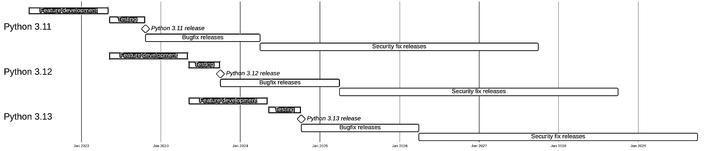

# 你应该更新到最新的 Python 错误修复版本吗？

> 原文：<https://realpython.com/python-bugfix-version/>

如果你已经在 Python 社区呆了一段时间，你可能还记得关于 Python 2 和 Python 3 的讨论，或者你可能已经看到了像 [Python 3.10](https://realpython.com/python310-new-features/) 和 [Python 3.11](https://realpython.com/python311-new-features/) 这样的版本，它们在[的大张旗鼓中发布](https://realpython.com/python-news-october-2021/#a-live-python-310-release-party-on-youtube)。您可能已经注意到 Python 版本有三个数字——例如，3.10.8。在本教程中，您将重点关注 **Python 错误修复版本**以及第三个数字**的重要性。**

对于任何开发人员来说，设计一个**版本控制方案**并解释相应的版本号就是它自己的小艺术形式。一些最流行的系统是[日历版本](https://calver.org/)和[语义版本](https://semver.org/)。Python 的版本化方案类似于语义版本化，但是有一些重要的区别。

通常，版本号由三个数字组成，通常称为 MAJOR.MINOR.PATCH。三个数字的含义取决于您的版本方案:

*   **专业**是最重要的数字。在日历版本中，这通常是发布的年份。当存在向后不兼容的变更时，语义版本化方案会引入新的主要版本。Python 最后一次更新主要版本是在 2008 年[发布 Python 3](https://docs.python.org/3/whatsnew/3.0.html)时，目前还没有发布 Python 主要版本 4 的具体计划。

*   **MINOR** 是第二个版本号。这个数字记录了提供一些新功能同时保持与以前版本兼容的常规版本。在 Python 中，次要版本通常被称为**特性版本**，而[可能会删除](https://peps.python.org/pep-0387/)不推荐使用的特性。Python 社区每年都会发布一个新的特性版本[，通常是在十月份。](https://peps.python.org/pep-0602/)

*   **PATCH** 是第三个也是最不重要的数字。它有时被命名为微。仅修补程序编号不同的版本通常具有相同的功能。在 Python 中，补丁发布通常被称为**错误修复发布**、**维护发布**或**安全修复发布**。顾名思义，这些版本只会引入 bug 或安全补丁。

在 Python 中，这些数字遵循相当严格的时间表。Python 的每个特性或次要版本都经历相同的生命周期:

[](https://files.realpython.com/media/release-life-cycle.d27a9c29d461.png)

<figcaption class="figure-caption text-center">Python feature release life cycle</figcaption>

该图显示了 Python 3.11、3.12 和 3.13 的生命周期。补丁号跟踪一个版本当前所处的周期。开发在发布日期前大约 17 个月开始:

*   新功能在前 12 个月开发，并以 **alpha** 版本发布。
*   该版本已经过彻底的测试，并准备在接下来的五个月内发布。 **Beta** 和**发布候选**版本在此期间发布。
*   **Bugfix 版本**在功能发布后的十八个月内定期发布。
*   **安全补丁版本**根据需要发布，直到功能发布五年后。

alpha、beta 和发布候选版本统称为[预发布版本](https://realpython.com/python-pre-release/)。对于每个功能发布，这些都在开发和测试阶段可用。您应该开始在这些早期版本上测试您的代码，但是您不应该在这些版本上运行必要的服务。

**免费下载:** [点击这里下载免费的示例代码](https://realpython.com/bonus/python-311-examples/)，它展示了 Python 3.11 的一些新特性。

在本教程中，您将重点关注错误修复和安全修复发布版本。虽然 Python 的新特性版本引起了一些关注，因为它们向该语言引入了新特性，但 3.11.0 和 3.11.1 之间的差异可能更难发现。是否应该更新到 Python 的最新 bugfix 版本？

## 简而言之:是的，尤其是在脆弱的生产系统中

保持您正在使用的 Python 特性版本的最新维护版本是一个好主意！

在特定的上下文和用例中，这甚至更为关键。和所有大型软件系统一样，Python 也有[bug。其中很少会影响到您，但有时会发现并修复一个漏洞。如果你处理**敏感数据**或者某个系统**暴露给可能有不良企图的用户**，那么你一定要及时更新最新的 bugfix 版本来保护你自己和你的用户。](https://github.com/python/cpython/issues?q=is%3Aissue+is%3Aopen+label%3Atype-bug)

**注意:**你不需要跟上 Python 最新的特性发布才安全。Python 的所有版本都支持五年，并在此期间接受安全修复。

如果您没有更新到最新的维护版本，那么您不会错过 Python 的任何新特性。这些都是在功能发布中添加的。所以，你应该考虑的主要问题是你的系统有多暴露和脆弱。如果您的系统可能会受到攻击，导致严重后果，那么您需要一个过程来确保您的环境尽可能健壮。

你应该通过一个自动化的[持续集成](https://realpython.com/python-continuous-integration/)系统来管理你的项目，这个系统会对你所有的更新进行测试。要获得关于 Python 新的 bug 修正版本的提醒，你可以关注 [Python Discourse](https://discuss.python.org/tag/release) 上的*发布*帖子，或者订阅 [Python 公告邮件列表](https://mail.python.org/archives/list/python-announce-list@python.org/)。

错误修复版本将只包含错误和安全修复。您很可能不会感受到同一个特性发布的两个版本之间的任何差异。如果您在运行代码时没有遇到任何潜在的 Python 错误，也没有接触到外部世界，那么总是使用最新的维护版本就不那么紧迫了。

**注意:** Bugfix 和安全补丁发布本质上是一样的。在功能发布后的前十八个月发布的维护版本被称为**错误修复版本**。它们大约每两个月发布一次，并与特定于操作系统的安装程序打包在一起。前 18 个月之后发布的版本是**安全补丁版本**。这些只在需要的时候发布，并且只以源代码的形式发布。

也就是说，即使安全问题的风险和后果在你的爱好项目中较小，使用最新的安全版本的 Python 仍然是一个好习惯。理想情况下，您应该找到一个工作流，它可以方便地运行不同版本的 Python 并更新到新版本。

[*Remove ads*](/account/join/)

## 如何方便地跟上新版本？

如何将生产系统更新到最新的 bugfix 版本取决于您的设置。理想情况下，您可以在配置文件中更改版本号，然后重新运行您的测试。

在本节中，您将看到在本地计算机上处理不同版本 Python 的一种可能的工作流。在工作流程中，您应该控制编程设置的两个独立方面:

1.  你的 Python **解释器的版本**
2.  你的 Python **包的版本**

一般来说，几个版本的 Python 可以在您的系统上共存。你可以手动管理你的 Python 版本，或者使用像 [pyenv](https://realpython.com/intro-to-pyenv/) 或者 [conda](https://realpython.com/python-windows-machine-learning-setup/#understanding-conda-environments) 这样的工具。

**注意:**无论您当前安装的是哪个版本，您都可以安装最新的 bugfix 版本。您不需要首先安装任何中间版本。然而，如果你跳过了发布，那么你应该更加勤奋地测试，因为在你的更新中有更多的变化。

你应该使用虚拟环境来处理你所依赖的 Python 包。当您创建一个虚拟环境时，您将它绑定到一个特定的 Python 版本。因此，为了更新 Python 解释器，您需要一种方便的方法来重新创建您的虚拟环境。

为了确保您的虚拟环境是可复制的，您可以使用一个**锁文件**，它列出了您所有的依赖项和它们各自的版本。可以手动创建这样的锁文件，但是使用工具通常是更好的选择。同样，你有几个选项，包括 [pip-tools](https://pypi.org/project/pip-tools/) 、[poems](https://realpython.com/dependency-management-python-poetry/)、 [conda-lock](https://pythonspeed.com/articles/conda-dependency-management/) 和 [Pipenv](https://realpython.com/pipenv-guide/) 。

您可以选择并组合适合您的工具。这里有一个使用 **pyenv** 和 **pip-tools** 的工作流示例。您需要[安装 pyenv](https://realpython.com/intro-to-pyenv/#installing-pyenv) 作为一个单独的应用程序，而您可以使用 [`pip`](https://realpython.com/what-is-pip/) 或 [`pipx`](https://pypa.github.io/pipx/) 来安装 pip-tools。

当您开始一个新项目时，您应该为它创建一个单独的项目目录。您将在该项目目录中执行以下所有命令。

首先，**在一个名为`requirements.in`的明文文件中指定您的依赖关系**。例如:

```py
# requirements.in

rich
typer
```

您将只在这个文件中定义您的直接依赖项。一般来说，这里不需要添加任何版本标记。

接下来，**使用 pip 工具锁定您的依赖关系**:

```py
$ pip-compile requirements.in
```

运行 pip-tools 会生成`requirements.txt`，其中包含所有的依赖项，包括间接依赖项:

```py
# requirements.txt
#
# This file is autogenerated by pip-compile with python 3.10
# To update, run:
#
#    pip-compile requirements.in
#
click==8.1.3
    # via typer
commonmark==0.9.1
    # via rich
pygments==2.13.0
    # via rich
rich==12.6.0
    # via -r requirements.in
typer==0.6.1
    # via -r requirements.in
```

Pip-tools 将每个依赖项固定到一个特定的版本。它还添加了有价值的注释，说明为什么它包含了每个依赖项。当您在`requirements.in`中添加新的依赖项时，您可以重新运行`pip-compile`。如果您想将您的依赖项升级到新版本，请运行`pip-compile --upgrade`。

当您开始一个项目时，您将添加您的需求文件，并且您将持续地维护它，独立于您何时更新 Python 版本。当你安装一个新的 bugfix 版本时，你不需要更新你的依赖关系。相反，您将确保在新的虚拟环境中安装依赖项。

为了更新到最新的维护版本，您将首先使用 pyenv 安装一个新的 Python 版本并激活它:

```py
$ pyenv update
$ pyenv install 3.10.8
$ pyenv local 3.10.8
```

您可以使用`pyenv install --list`来查看可用 Python 版本的列表。

接下来，**创建或重新创建您的虚拟环境**并且[激活](https://realpython.com/python-virtual-environments-a-primer/#activate-it)它:

*   [*视窗*](#windows-1)
**   [**Linux + macOS**](#linux-macos-1)*

```py
PS> python -m venv venv --clear
PS> venv\Scripts\activate
```

```py
$ python -m venv venv --clear
$ source venv/bin/activate
```

使用`--clear`来确保清理您的虚拟环境，即使您已经用旧版本的 Python 创建了它。

最后，**将您锁定的依赖项**安装到新的虚拟环境中:

```py
(venv) $ python -m pip install -r requirements.txt
```

如果您总是通过需求文件来添加依赖项，那么您将有信心能够重新创建您的环境。虽然这一原则可能看起来很麻烦，但投资将会得到数倍的回报，并帮助您毫不费力地更新 Python 解释器。

如果您使用其他工具，那么细节会有所不同。但是，您应该能够遵循相同的主要步骤。

[*Remove ads*](/account/join/)

## 更新到 Python 最新的 Bugfix 版本会出什么问题？

Python 维护版本只引入了几种类型的变化。重点是修复 bug 和安全问题。现有功能的行为不应该有任何新的特性或变化。

不过，在更新到新的 Python 版本之后，您应该总是运行您的测试。如果你的爱好项目中没有很多测试，那么至少运行你的代码来确认没有明显的变化。

虽然遇到问题的风险很低，但是有一些可能的情况您应该知道。

Python 是一个复杂的软件，有时修复一个错误会引入另一个错误。一些错误修复版本可能包含意外的**回归**。例如， [Python 3.10.3](https://www.python.org/downloads/release/python-3103/) 引入了一个 [bug](https://github.com/python/cpython/issues/91124) ，使得 Python 在一个旧的[红帽企业版 Linux](https://www.redhat.com/en/technologies/linux-platforms/enterprise-linux) 上无法使用。

Python 的核心团队处理了回归，并比计划提前发布了 [Python 3.10.4](https://www.python.org/downloads/release/python-3104/) 。

**注意:** Python 的[变更日志](https://docs.python.org/3/whatsnew/changelog.html)详细描述了每个版本中的所有变更。

有时候，你可能会无意识地依赖 Python 中一个 bug 的行为。如果这个错误被修复，那么你会发现你的代码停止工作。在这种情况下，您需要更新您的代码。不去管你的代码，而是停止更新 Python，这可能很有诱惑力。这样做在短期内会奏效，但这不是一个可持续的解决方案。

虽然很少发生，但有时**安全补丁会影响您的代码**。例如， [Python 3.10.7](https://www.python.org/downloads/release/python-3107/) 不允许非常大的整数在字符串和整数类型之间转换。Python 引入了[补丁](https://github.com/python/cpython/issues/95778)来防止某种攻击。然而，这也意味着在 Python 早期版本中有效的一些代码[不再有效](https://realpython.com/python-news-september-2022/#python-introduced-a-breaking-change-to-fix-a-vulnerability)。

在一个 bugfix 版本中做出如此重大的改变是有争议的，并不经常发生。如果你的项目被这样的改变影响了，那就不好玩了。不过，您最好的选择是更新您的代码，以继续使用最新的 bugfix 版本。

## Python 维护版本互相兼容吗？

如上所述，在 bugfix 版本中没有添加或删除新功能。因此，在给定 Python 版本的所有维护版本中，您的代码通常应该是相同的。

此外，CPython 用于与 C 扩展通信的[应用二进制接口](https://docs.python.org/3/c-api/stable.html) (ABI)在所有 bugfix 版本中都是稳定的。这种稳定性意味着在更新 bugfix 版本时，您可以使用第三方库的同一个轮子。换句话说，您不需要更新您的需求文件。

## 您是否也应该更新到最新的功能版本？

更新到 Python 的最新功能版本与更新到最新维护版本是非常不同的考虑事项。幸运的是，您可以彼此独立地做出这些决定。即使您使用较旧的功能版本，也可以确保使用该版本的最新 bugfix 版本。

新功能版本引入了新功能，淘汰并删除了旧功能。因此，如果您升级，您的代码被破坏的风险会更高。在做出改变之前，你应该勤于测试。

**注:**你可以在[酷炫新特性](https://realpython.com/search?kind=article&q=cool+new+features)系列教程中了解 Python 各个版本的新特性。

有一个问题可能会阻碍你升级到最新最闪亮的 Python 版本，那就是应用程序二进制接口在 Python 的不同特性版本之间不稳定。实际结果是必须为新版本编译 C 扩展库。可能需要一些时间，您的所有依赖项才能提供与最新版本兼容的轮子。

从安全的角度来看，即使您没有使用最新的功能版本，也完全没有问题。正如你之前看到的，Python 特性版本会在 18 个月内定期更新错误修复，在 5 年内根据需要更新安全修复。

尽管如此，您应该有一个定期更新您的功能版本的计划。特别是，您应该确保您的版本不会在生命周期结束后仍不受支持。

例如，你可以采取一种策略，只要某个功能版本定期更新，就坚持使用它。当它切换到只获取安全补丁时，您就升级到下一个版本。由于 bugfix 版本发布了 18 个月，这意味着您将在它发布后大约 6 个月切换到 Python 的新功能版本。

[*Remove ads*](/account/join/)

## 结论

Python 的 bugfix 发布并没有成为很多头条新闻。虽然大多数乐趣确实发生在功能发布上，但关注低调的定期更新也是一个好主意。如果您了解 Python 的最新版本，您会知道您的解释器包含了所有最新的 bug 和安全修复。

在本教程中，你已经知道你应该更新到最新的 Python bugfix 版本。您已经了解了 bugfix 和 feature 版本之间的区别，并了解了一些如何保持项目最新的策略。

**免费下载:** [点击这里下载免费的示例代码](https://realpython.com/bonus/python-311-examples/)，它展示了 Python 3.11 的一些新特性。******