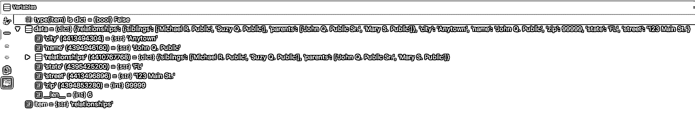

# 4 种测试 Python 命令行(CLI)应用的技术

> 原文：<https://realpython.com/python-cli-testing/>

您刚刚完成了第一个 Python 命令行应用程序的构建。或者你的第二个或第三个。你已经[学习 Python](https://realpython.com/python-first-steps/) 有一段时间了，现在你准备构建[更大更复杂的](https://realpython.com/comparing-python-command-line-parsing-libraries-argparse-docopt-click/)，但是仍然可以在命令行上运行。或者你习惯于用 GUI[构建和测试](https://realpython.com/python-testing/) web 应用或桌面应用，但现在开始构建 CLI 应用。

在所有这些情况以及更多情况下，您需要学习并熟悉测试 Python CLI 应用程序的各种方法。

虽然工具的选择可能令人生畏，但要记住的主要事情是，您只是将代码生成的输出与您期望的输出进行比较。一切都源于此。

**在本教程中，你将学习四种测试 Python 命令行应用的实用技术:**

*   使用`print()`进行“Lo-Fi”调试
*   使用可视化 Python 调试器
*   使用 pytest 和模拟进行单元测试
*   集成测试

**免费奖励:** [点击这里获取我们的 Python 测试备忘单](#)，它总结了本教程中演示的技术。

一切都将围绕一个基本的 Python CLI 应用程序构建，该应用程序以多级[字典](https://realpython.com/python-dicts/)的形式将数据传递给两个函数，这两个函数以某种方式转换数据，然后将数据打印给用户。

我们将使用下面的代码来检查一些不同的方法，这些方法将帮助您进行测试。虽然肯定不是详尽的，但我希望这篇教程能给你足够的宽度，让你有信心在主要的测试领域创建有效的测试。

我在这个初始代码中加入了一些 bug，我们将在测试方法中暴露这些 bug。

> **注意**:为了简单起见，这段代码不包括一些基本的最佳实践，比如验证字典中的键是否存在。

首先，让我们考虑一下这个应用程序每个阶段的对象。我们从描述 John Q. Public 的结构开始:

```py
JOHN_DATA = {
    'name': 'John Q. Public',
    'street': '123 Main St.',
    'city': 'Anytown',
    'state': 'FL',
    'zip': 99999,
    'relationships': {
        'siblings': ['Michael R. Public', 'Suzy Q. Public'],
        'parents': ['John Q. Public Sr.', 'Mary S. Public'],
    }
}
```

然后，我们展平其他字典，在调用我们的第一个转换函数`initial_transform`后会出现这种情况:

```py
JOHN_DATA = {
    'name': 'John Q. Public',
    'street': '123 Main St.',
    'city': 'Anytown',
    'state': 'FL',
    'zip': 99999,
    'siblings': ['Michael R. Public', 'Suzy Q. Public'],
    'parents': ['John Q. Public Sr.', 'Mary S. Public'],
}
```

然后，我们使用函数`final_transform`将所有地址信息构建到一个地址条目中:

```py
JOHN_DATA = {
    'name': 'John Q. Public',
    'address': '123 Main St. \nAnytown, FL 99999'
    'siblings': ['Michael R. Public', 'Suzy Q. Public'],
    'parents': ['John Q. Public Sr.', 'Mary S. Public'],
}
```

对`print_person`的调用将把这个写到控制台:

```py
Hello, my name is John Q. Public, my siblings are Michael R. Public 
and Suzy Q. Public, my parents are John Q. Public Sr. and Mary S. Public, 
and my mailing address is:
123 Main St. 
Anytown, FL 99999
```

测试目录. py:

```py
def initial_transform(data):
    """
 Flatten nested dicts
 """
    for item in list(data):
        if type(item) is dict:
            for key in item:
                data[key] = item[key]

    return data

def final_transform(transformed_data):
    """
 Transform address structures into a single structure
 """
    transformed_data['address'] = str.format(
        "{0}\n{1}, {2}  {3}", transformed_data['street'], 
        transformed_data['state'], transformed_data['city'], 
        transformed_data['zip'])

    return transformed_data

def print_person(person_data):
    parents = "and".join(person_data['parents'])
    siblings = "and".join(person_data['siblings'])
    person_string = str.format(
        "Hello, my name is {0}, my siblings are {1}, "
        "my parents are {2}, and my mailing"
        "address is: \n{3}", person_data['name'], 
        parents, siblings, person_data['address'])
    print(person_string)

john_data = {
    'name': 'John Q. Public',
    'street': '123 Main St.',
    'city': 'Anytown',
    'state': 'FL',
    'zip': 99999,
    'relationships': {
        'siblings': ['Michael R. Public', 'Suzy Q. Public'],
        'parents': ['John Q. Public Sr.', 'Mary S. Public'],
    }
}

suzy_data = {
    'name': 'Suzy Q. Public',
    'street': '456 Broadway',
    'apt': '333',
    'city': 'Miami',
    'state': 'FL',
    'zip': 33333,
    'relationships': {
        'siblings': ['John Q. Public', 'Michael R. Public', 
                    'Thomas Z. Public'],
        'parents': ['John Q. Public Sr.', 'Mary S. Public'],
    }
}

inputs = [john_data, suzy_data]

for input_structure in inputs:
    initial_transformed = initial_transform(input_structure)
    final_transformed = final_transform(initial_transformed)
    print_person(final_transformed)
```

现在，代码实际上没有满足这些期望，所以我们将在学习这四种技术的同时使用它们进行研究。通过这样做，你将获得使用这些技术的实践经验，扩大你对它们的适应范围，并开始学习它们最适合解决哪些问题。

## 使用打印进行“高保真”调试

这是最简单的测试方法之一。这里你所要做的就是`print`一个你感兴趣的变量或对象——在函数调用之前，函数调用之后，或者在函数内部。

它们分别允许您验证函数的输入、输出和逻辑。

如果您将上面的代码保存为`testapp.py`并尝试用`python testapp.py`运行它，您会看到如下错误:

```py
Traceback (most recent call last):
  File "testapp.py", line 60, in <module>
    print_person(final_transformed)
  File "testapp.py", line 23, in print_person
    parents = "and".join(person_data['parents'])
KeyError: 'parents'
```

在传递到`print_person`的`person_data`中有一个丢失的键。第一步是检查`print_person`的输入，看看为什么我们期望的输出(打印的消息)没有生成。我们将在调用`print_person`之前添加一个`print`函数调用:

```py
final_transformed = final_transform(initial_transformed)
print(final_transformed)
print_person(final_transformed)
```

这里的工作由`print`函数完成，在其输出中显示我们没有顶级的`parents`键，也没有`siblings`键，但是为了我们的理智起见，我将向您展示`pprint`，它以更易读的方式打印多级对象。要使用它，将`from pprint import pprint`添加到你的脚本的顶部。

我们调用`pprint(final_transformed)`而不是`print(final_transformed)`来检查我们的对象:

```py
{'address': '123 Main St.\nFL, Anytown 99999',
 'city': 'Anytown',
 'name': 'John Q. Public',
 'relationships': {'parents': ['John Q. Public Sr.', 'Mary S. Public'],
                   'siblings': ['Michael R. Public', 'Suzy Q. Public']},
 'state': 'FL',
 'street': '123 Main St.',
 'zip': 99999}
```

将此与上面预期的最终形式进行比较。

因为我们知道`final_transform`不接触`relationships`字典，所以是时候看看`initial_transform`发生了什么。通常，我会使用传统的调试器来逐步完成这个，但是我想向您展示打印调试的另一种用法。

我们可以打印代码中对象的状态，但我们并不局限于此。我们可以打印我们想要的任何东西，所以我们也可以打印标记来查看哪些逻辑分支在什么时候被执行。

因为`initial_transform`主要是几个循环，并且因为内部字典应该由内部 for 循环处理，我们应该检查那里发生了什么，如果有的话:

```py
def initial_transform(data):
    """
 Flatten nested dicts
 """
    for item in list(data):
        if type(item) is dict:
            print "item is dict!"
            pprint(item)
            for key in item:
                data[key] = item[key]

    return data
```

如果我们在我们的输入`data`中遇到一个字典，那么我们将在控制台中得到警告，然后我们将看到这个条目看起来像什么。

运行之后，我们的控制台输出没有变化。这很好地证明了我们的`if`语句没有像预期的那样工作。虽然我们可以继续打印以找到错误，但这是展示使用调试器的优势的一个很好的方式。

不过，作为练习，我建议只使用打印调试来查找这段代码中的错误。这是一个很好的实践，它会迫使你思考所有使用控制台来提醒你代码中发生的不同事情的方法。

[*Remove ads*](/account/join/)

### 总结

**何时使用打印调试:**

*   简单的物体
*   较短的脚本
*   看似简单的 bug
*   快速检查

**潜得更深:**

*   [pprint](https://docs.python.org/3/library/pprint.html) -美化印刷品

**优点:**

*   快速测试
*   使用方便

**缺点:**

*   大多数情况下你必须运行整个程序，否则:
*   您需要添加额外的代码来手动控制流量
*   完成后，您可能会意外地留下测试代码，尤其是在复杂的代码中

## 使用调试器

当您希望一次一行地单步执行代码并检查整个应用程序状态时，调试器非常有用。当您大致知道错误发生在哪里，但不知道原因时，它们会有所帮助，并且它们可以让您一次清楚地看到应用程序内部发生的所有事情。

有许多调试器，而且通常都带有 ide。Python 还有[一个名为`pdb`](https://realpython.com/python-debugging-pdb/) 的模块，可以在 [REPL](https://realpython.com/interacting-with-python/) 中用来调试代码。在这一节中，我将向您展示如何使用具有常见功能的调试器，例如设置*断点*和*观察器*，而不是进入所有可用调试器的特定实现细节。

**断点**是代码上的标记，告诉调试器在哪里暂停执行，以便检查应用程序的状态。 **Watches** 是可以在调试会话期间添加的表达式，用于观察变量(以及更多)的值，并在应用程序的执行过程中保持不变。

但是让我们跳回断点。这些将被添加到您希望开始或继续调试会话的位置。因为我们正在调试`initial_transform`方法，所以我们想在那里放一个。我将用一个`(*)`来表示断点:

```py
def initial_transform(data):
    """
 Flatten nested dicts
 """
(*) for item in list(data):
        if type(item) is dict:
            for key in item:
                data[key] = item[key]

    return data
```

现在，当我们开始调试时，执行将在那一行暂停，你将能够在程序执行的特定点看到变量和它们的类型。我们有几个选择来导航我们的代码:*跨过*、*步入*和*步出*是最常见的。

*Step over* 是你最常使用的一个——它只是跳转到下一行代码。

*进入*，尝试深入代码。当你遇到一个你想更深入研究的函数调用时，你会用到它——你会被直接带到那个函数的代码，并且能够检查那里的状态。当你把它和*跨过*混淆时，你也会经常用到它。幸运的是*站出来*可以拯救我们，这让我们回到了呼叫者那里。

我们还可以在这里设置一个*观察器*，类似于`type(item) is dict`，在大多数 ide 中，你可以在调试会话期间通过“添加观察器”按钮来完成。不管你在代码中的什么位置，现在都会显示`True`或`False`。

设置手表，现在移过去，这样你现在暂停在`if type(item) is dict:`线上。您现在应该能够看到手表的状态、新变量`item`和对象`data`。

[](https://files.realpython.com/media/debugger-variables-watches.866f7e9f20d3.png)

即使没有手表，我们也能看到这个问题:不是`type`查看`item`指向什么，而是查看`item`本身的类型，这是一个字符串。毕竟，计算机完全按照我们告诉它们的去做**。感谢调试器，我们看到了我们的方法的错误，并像这样修正我们的代码:**

```py
def initial_transform(data):
    """
 Flatten nested dicts
 """
    for item in list(data):
        if type(data[item]) is dict:
            for key in data[item]:
                data[key] = item[key]

    return data
```

我们应该再次通过调试器运行它，并确保代码运行到我们期望的地方。而我们没有，结构现在看起来是这样的:

```py
john_data = {
    'name': 'John Q. Public',
    'street': '123 Main St.',
    'city': 'Anytown',
    'state': 'FL',
    'zip': 99999,
    'relationships': {
        'siblings': ['Michael R. Public', 'Suzy Q. Public'],
        'parents': ['John Q. Public Sr.', 'Mary S. Public'],
    },
    'siblings',
    'parents',
}
```

现在我们已经了解了如何使用可视化调试器，让我们更深入，通过完成下面的练习来测试我们的新知识。


我希望您修改代码，使`initial_transform`的输出看起来更像这样，只使用调试器:

```py
john_data = {
    'name': 'John Q. Public',
    'street': '123 Main St.',
    'city': 'Anytown',
    'state': 'FL',
    'zip': 99999,
    'relationships': {
        'siblings': ['Michael R. Public', 'Suzy Q. Public'],
        'parents': ['John Q. Public Sr.', 'Mary S. Public'],
    },
    'parents': ['John Q. Public Sr.', 'Mary S. Public'],
    'siblings': ['Michael R. Public', 'Suzy Q. Public'],
}
```


```py
def initial_transform(data):
    """
 Flatten nested dicts
 """
    for item in list(data):
        if type(data[item]) is dict:
            for key in data[item]:
                data[key] = data[item][key]

    return data
```

我们已经讨论了可视化调试器。我们使用了可视化调试器。我们喜欢可视化调试器。不过，这种技术仍然有优点和缺点，您可以在下一节回顾它们。

[*Remove ads*](/account/join/)

### 总结

**何时使用 Python 调试器:**

*   更复杂的项目
*   很难发现漏洞
*   你需要检查不止一个物体
*   您大概知道*哪里发生了*错误，但是需要关注它

**潜得更深:**

*   条件断点
*   调试时计算表达式

**优点:**

*   程序流程控制
*   应用程序状态的鸟瞰图
*   不需要知道错误发生在哪里

**缺点:**

*   难以手动观察非常大的物体
*   长时间运行的代码需要很长时间来调试

## 使用 Pytest 和模拟进行单元测试

如果你想彻底测试输入输出组合，确保你命中代码的每一个分支——特别是当你的应用程序增长时，前面的技术是单调乏味的，并且可能需要改变代码。在我们的例子中，`initial_transform`的输出看起来仍然不太对。

虽然我们代码中的逻辑相当简单，但它很容易变得更大、更复杂，或者成为整个团队的责任。我们如何以更结构化、更详细、更自动化的方式测试应用程序？

输入单元测试。

单元测试是一种测试技术，它将源代码分解成可识别的单元(通常是方法或函数)并单独测试它们。

本质上，您将编写一个脚本或一组脚本，用不同的输入测试每个方法，以确保每个方法中的每个逻辑分支都得到测试——这被称为代码覆盖率，通常您希望达到 100%的代码覆盖率。这并不总是必要或实际的，但是我们可以把它留到另一篇文章(或教科书)中。

每个测试都将被测试的方法隔离对待:外部调用被一种称为 mocking 的技术覆盖，以给出可靠的返回值，并且在测试之前设置的任何对象在测试之后都被移除。这些技术和其他技术是为了确保被测单元的独立性和隔离性。

可重复性和隔离性是这类测试的关键，即使我们仍然继续我们的主题，比较预期输出和实际输出。现在你已经对单元测试有了全面的了解，你可以快速地绕一圈，看看如何用[最小可行测试套件](https://realpython.com/the-minimum-viable-test-suite/)对烧瓶应用程序进行单元测试。

### Pytest

既然我们已经深入理论了，让我们看看它在实践中是如何工作的。Python 自带了一个内置的`unittest`模块，但我相信 [`pytest`](https://realpython.com/pytest-python-testing/) 在`unittest`提供的基础上做得很好。不管怎样，我将只展示单元测试的基础知识，因为单元测试一项就可以占据多篇长文章。

一个常见的惯例是将所有的测试放在项目中的一个`test`目录中。因为这是一个小脚本，一个与`testapp.py`同级的文件`test_testapp.py`就足够了。

我们将为`initial_transform`编写一个单元测试，展示如何设置一组预期的输入和输出，并确保它们匹配。我使用`pytest`的基本模式是设置一个[夹具](https://docs.pytest.org/en/latest/fixture.html)，它将获取一些参数，并使用这些参数来生成我想要的测试输入和预期输出。

首先，我将展示 fixture 设置，当您查看代码时，请思考您需要的测试用例，以便找到`initial_transform`的所有可能的分支:

```py
import pytest
import testapp as app

@pytest.fixture(params=['nodict', 'dict'])
def generate_initial_transform_parameters(request):
```

在我们生成输入之前，让我们看看这里发生了什么，因为它可能会令人困惑。

首先，我们使用`@pytest.fixture` decorator 将下面的函数定义声明为 fixture。我们还使用一个命名参数`params`来和`generate_initial_transform_parameters`一起使用。

这个函数的巧妙之处在于，无论何时使用修饰函数，它都会与每个参数一起使用，所以只需调用`generate_initial_transform_parameters`就会调用它两次，一次用`nodict`作为参数，一次用`dict`。

为了访问这些参数，我们将 pytest 特殊对象`request`添加到我们的函数签名中。

现在，让我们构建我们的输入和预期输出:

```py
@pytest.fixture(params=['nodict', 'dict'])
def generate_initial_transform_parameters(request):
    test_input = {
        'name': 'John Q. Public',
        'street': '123 Main St.',
        'city': 'Anytown',
        'state': 'FL',
        'zip': 99999,
    }
    expected_output = {
        'name': 'John Q. Public',
        'street': '123 Main St.',
        'city': 'Anytown',
        'state': 'FL',
        'zip': 99999,
    }

    if request.param == 'dict':
        test_input['relastionships'] = {
            'siblings': ['Michael R. Public', 'Suzy Q. Public'],
            'parents': ['John Q. Public Sr.', 'Mary S. Public'],
        }
        expected_output['siblings'] = ['Michael R. Public', 'Suzy Q. Public']
        expected_output['parents'] = ['John Q. Public Sr.', 'Mary S. Public']

    return test_input, expected_output
```

这里没有什么太令人惊讶的，我们设置了输入和预期输出，如果我们有了`'dict'`参数，那么我们修改输入和预期输出，允许我们测试`if`块。

然后我们编写测试。在测试中，我们必须将 fixture 作为参数传递给测试函数来访问它:

```py
def test_initial_transform(generate_initial_transform_parameters):
    test_input = generate_initial_transform_parameters[0]
    expected_output = generate_initial_transform_parameters[1]
    assert app.initial_transform(test_input) == expected_output
```

测试函数应该以`test_`为前缀，并且应该基于 [`assert`语句](https://realpython.com/python-assert-statement/)。这里我们断言，通过将输入传递给实函数，我们得到的输出等于我们期望的输出。当你用测试配置在你的 IDE 中或者用 CLI 中的`pytest`运行它时，你会得到…错误！我们的产出还不完全正确。让我们通过下面的练习来解决这个问题——实践经验是无价的，将你所学付诸实践会让你在将来回忆起来更容易。


我想让你用单元测试来帮助你修复函数，这样它就会像我们期望的那样运行。仅使用单元测试输出来进行这些更改，不要更改单元测试。


```py
def initial_transform(data):
    """
 Flatten nested dicts
 """
    for item in list(data):
        if type(data[item]) is dict:
            for key in data[item]:
                data[key] = data[item][key]
            data.pop(item)

    return data
```

[*Remove ads*](/account/join/)

### 模拟

模拟是单元测试的另一个重要部分。因为我们只测试单个代码单元，所以我们并不关心其他函数调用做了什么。我们只想从他们那里得到可靠的回报。

让我们给`initial_transform`添加一个外部函数调用:

```py
def initial_transform(data):
    """
 Flatten nested dicts
 """
    for item in list(data):
        if type(data[item]) is dict:
            for key in data[item]:
                data[key] = data[item][key]
            data.pop(item)

    outside_module.do_something()
    return data
```

我们不想对`do_something()`进行实时调用，所以我们将在测试脚本中进行模拟。mock 将捕获这个调用，并返回您设置 mock 返回的任何内容。我喜欢在 fixtures 中设置模拟，因为这是测试设置的一部分，我们可以将所有设置代码放在一起:

```py
@pytest.fixture(params=['nodict', 'dict'])
def generate_initial_transform_parameters(request, mocker):
    [...]
    mocker.patch.object(outside_module, 'do_something')
    mocker.do_something.return_value(1)
    [...]
```

现在每次调用`initial_transform`时，`do_something`调用都会被拦截，返回 1。您还可以利用 fixture 参数来确定您的 mock 返回什么——当代码分支由外部调用的结果决定时，这一点很重要。

最后一个巧妙的技巧是使用`side_effect`。除了别的以外，这允许您模拟对同一函数的连续调用的不同返回:

```py
def initial_transform(data):
    """
 Flatten nested dicts
 """
    for item in list(data):
        if type(data[item]) is dict:
            for key in data[item]:
                data[key] = data[item][key]
            data.pop(item)

    outside_module.do_something()
    outside_module.do_something()
    return data
```

我们像这样设置我们的模拟，将一个输出列表(对于每个连续的调用)传递给`side_effect`:

```py
@pytest.fixture(params=['nodict', 'dict'])
def generate_initial_transform_parameters(request, mocker):
    [...]
    mocker.patch.object(outside_module, 'do_something')
    mocker.do_something.side_effect([1, 2])
    [...]
```

嘲讽是非常强大的，强大到你甚至可以[设置模仿服务器来测试第三方 API](https://realpython.com/testing-third-party-apis-with-mock-servers/)，我再次鼓励你自己用`mocker`更深入地探究嘲讽。

### 总结

**何时使用 Python 单元测试框架:**

*   大型复杂项目
*   OSS 项目

**有用的工具:**

*   [Pytest 夹具](https://docs.pytest.org/en/latest/fixture.html)
*   [deepdiff](https://pypi.python.org/pypi/deepdiff) 用于比较复杂对象
*   模仿者

**优点:**

*   自动化运行测试
*   可以捕捉多种类型的错误
*   团队的简单设置和修改

**缺点:**

*   写起来很乏味
*   必须随着大多数代码的更改而更新
*   不会复制真实的应用程序运行

[*Remove ads*](/account/join/)

## 集成测试

集成测试是这里最简单的测试方法之一，但可以说是最重要的方法之一。这需要在类似生产的环境中使用真实数据端到端地运行您的应用。

无论这是您的家用机器，还是复制生产服务器的测试服务器，或者只是更改从生产服务器到测试数据库的连接，这都让您知道您的更改将在部署时生效。

像所有其他方法一样，您正在检查您的应用程序是否在给定一些输入的情况下生成了预期的输出——除了这次您使用了实际的外部模块(不像在单元测试中，它们被模拟),可能写入实际的数据库或文件，以及在更大的应用程序中，确保您的代码与整个系统很好地集成。

如何做到这一点高度依赖于您的应用程序，例如，我们的测试应用程序可以使用`python testapp.py`自行运行。然而，让我们假设我们的代码是一个大型分布式应用程序的一部分，比如 ETL 管道——在这种情况下，您必须在测试服务器上运行整个系统，交换您的代码，通过它运行数据，并确保它以正确的形式通过整个系统。在命令行应用程序世界之外，像[py waves 这样的工具可以用于集成测试 Django apps](https://realpython.com/integration-testing-with-pyvows-and-django/) 。


这是一个开放式练习。我在代码中留下了一些 bug，运行几次代码，并将您的输出与本教程开始时我们预期的输出进行比较。使用这种方法和你学过的其他方法来查找和修复任何剩余的 bug。

### 总结

**在 Python 中何时使用集成测试:**

*   总是；-)
*   一般在其他测试方法之后，如果它们被使用的话。

**有用的工具:**

*   [tox](https://tox.readthedocs.io/en/latest/) 环境和测试自动化管理

**优点:**

*   了解您的应用程序在真实环境中的运行情况

**缺点:**

*   较大的应用程序可能很难准确跟踪数据流
*   必须拥有非常接近生产环境的测试环境

## 将所有这些放在一起

总之，所有 CLI 测试都是在给定一组输入的情况下，将预期输出与实际输出进行比较。我上面讨论的方法都是这样做的，并且在许多方面是互补的。当您继续用 Python 构建命令行应用程序时，这些将是您需要理解的重要工具，但本教程只是一个起点。

Python 有一个非常丰富的生态系统，并且扩展到测试工具和方法学，所以从这里扩展开来，进行更多的研究——你可能会找到我在这里没有提到的你绝对喜欢的工具或技术。如果是这样的话，我很想在评论中听到它！

简单回顾一下，以下是我们今天学到的技巧以及如何运用它们:

*   打印调试——打印出代码中的变量和其他标记，以查看执行流程
*   调试器——控制程序执行以获得应用程序状态和程序流的鸟瞰图
*   单元测试——将一个应用程序分成可单独测试的单元，并测试该单元中的所有逻辑分支
*   集成测试——在更广泛的应用程序环境中测试您的代码变更

现在去测试吧！当你使用这些技术时，一定要在评论中让我知道你是如何使用它们的，哪些是你最喜欢的。

要获得总结了本教程中演示的技术的 Python 测试备忘单，请单击下面的链接:

**免费奖励:** [点击这里获取我们的 Python 测试备忘单](#)，它总结了本教程中演示的技术。******