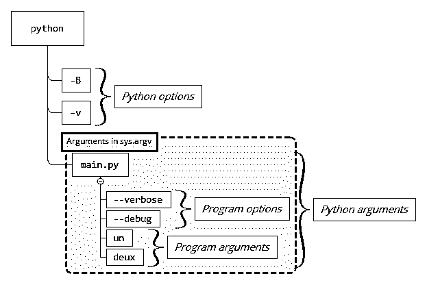
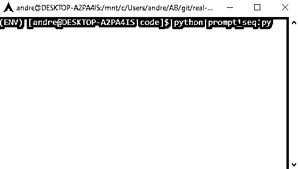

# Python 命令行参数

> 原文：<https://realpython.com/python-command-line-arguments/>

*立即观看**本教程有真实 Python 团队创建的相关视频课程。配合文字教程一起看，加深理解:[**Python 中的命令行接口**](/courses/command-line-interfaces/)

添加处理 **Python 命令行参数**的功能为基于文本的命令行程序提供了一个用户友好的界面。它类似于由图形元素或小部件操纵的可视化应用程序的图形用户界面。

Python 公开了一种捕获和提取 Python 命令行参数的机制。这些值可以用来修改程序的行为。例如，如果您的程序处理从文件中读取的[数据，那么您可以将该文件的名称传递给您的程序，而不是在您的源代码中硬编码该值。](https://realpython.com/read-write-files-python/)

本教程结束时，你会知道:

*   **Python 命令行参数的起源**
*   **Python 命令行参数的底层支持**
*   指导命令行界面设计的标准
*   **手动定制和处理 Python 命令行参数的基础知识**
*   Python 中可用的库简化了复杂命令行界面的开发

如果您想要一种用户友好的方式向您的程序提供 Python 命令行参数，而不需要导入专用的库，或者如果您想要更好地理解专用于构建 Python 命令行界面的现有库的公共基础，那么请继续阅读！

**免费奖励:** [掌握 Python 的 5 个想法](https://realpython.com/bonus/python-mastery-course/)，这是一个面向 Python 开发者的免费课程，向您展示将 Python 技能提升到下一个水平所需的路线图和心态。

## 命令行界面

[**命令行界面(CLI)**](https://en.wikipedia.org/wiki/Command-line_interface) 为用户提供了与运行在基于文本的[外壳](https://en.wikipedia.org/wiki/Shell_%28computing%29)解释器中的程序进行交互的方式。shell 解释器的一些例子是 Linux 上的 [Bash](https://en.wikipedia.org/wiki/Bash_%28Unix_shell%29) 或 Windows 上的[命令提示符](https://en.wikipedia.org/wiki/Cmd.exe)。命令行界面由暴露[命令提示符](https://en.wikipedia.org/wiki/Command-line_interface#Command_prompt)的外壳解释器启用。它可以由以下要素来表征:

*   一个**命令**或程序
*   零个或多个命令行**参数**
*   代表命令结果的**输出**
*   称为**用法**或**帮助**的文本文档

不是每个命令行界面都提供所有这些元素，但是这个列表也不是详尽的。命令行的复杂性范围很广，从传递单个参数的能力到众多参数和选项，很像一种[领域特定语言](https://en.wikipedia.org/wiki/Domain-specific_language)。例如，一些程序可能从命令行启动 web 文档，或者启动类似 Python 的[交互式 shell 解释器](https://docs.python.org/tutorial/interpreter.html#interactive-mode)。

以下两个 Python 命令示例说明了命令行界面的描述:

```py
$ python -c "print('Real Python')"
Real Python
```

在第一个例子中，Python 解释器将选项`-c`用于**命令**，该命令将选项`-c`之后的 Python 命令行参数作为 Python 程序来执行。

另一个例子展示了如何用`-h`调用 Python 来显示帮助:

```py
$ python -h
usage: python3 [option] ... [-c cmd | -m mod | file | -] [arg] ...
Options and arguments (and corresponding environment variables):
-b     : issue warnings about str(bytes_instance), str(bytearray_instance)
 and comparing bytes/bytearray with str. (-bb: issue errors)
[ ... complete help text not shown ... ]
```

在您的终端中尝试一下，以查看完整的帮助文档。

[*Remove ads*](/account/join/)

## C 遗留问题

Python 命令行参数直接继承自 [C](https://realpython.com/build-python-c-extension-module/) 编程语言。正如 Guido Van Rossum 在 1993 年的《Unix/C 程序员 Python 入门》中所写的，C 对 Python 有很大的影响。Guido 提到了文字、标识符、操作符和语句的定义，如`break`、`continue`或`return`。Python 命令行参数的使用也受到 C 语言的强烈影响。

为了说明相似之处，请考虑下面的 C 程序:

```py
 1// main.c
 2#include  <stdio.h> 3
 4int  main(int  argc,  char  *argv[])  { 5  printf("Arguments count: %d\n",  argc); 6  for  (int  i  =  0;  i  <  argc;  i++)  { 7  printf("Argument %6d: %s\n",  i,  argv[i]); 8  } 9  return  0; 10}
```

第 4 行定义了 [`main()`](https://en.wikipedia.org/wiki/Entry_point#C_and_C++) ，是一个 C 程序的入口点。请记下这些参数:

1.  **`argc`** 是一个表示程序参数个数的整数。
2.  **`argv`** 是一个指向字符的数组，在数组的第一个元素中包含程序的名称，在数组的其余元素中后跟程序的自变量(如果有的话)。

您可以在 Linux 上用`gcc -o main main.c`编译上面的代码，然后用`./main`执行以获得以下内容:

```py
$ gcc -o main main.c
$ ./main
Arguments count: 1
Argument      0: ./main
```

除非在命令行用选项`-o`明确表示， [`a.out`](https://en.wikipedia.org/wiki/A.out) 是由 **gcc** 编译器生成的可执行文件的默认名称。它代表**汇编器输出**，让人想起在旧的 UNIX 系统上生成的可执行文件。注意，可执行文件的名称`./main`是唯一的参数。

让我们通过向同一个程序传递几个 Python 命令行参数来增加这个例子的趣味:

```py
$ ./main Python Command Line Arguments
Arguments count: 5
Argument      0: ./main
Argument      1: Python
Argument      2: Command
Argument      3: Line
Argument      4: Arguments
```

输出显示参数的数量是`5`，参数列表包括程序名`main`，后面是您在命令行传递的短语`"Python Command Line Arguments"`的每个单词。

**注** : `argc`代表**自变量计数**，而`argv`代表**自变量向量**。要了解更多信息，请查看[一点 C Primer/C 命令行参数](https://en.wikibooks.org/wiki/A_Little_C_Primer/C_Command_Line_Arguments)。

`main.c`的编译假设你用的是 Linux 或者 Mac OS 系统。在 Windows 上，您还可以使用以下选项之一编译此 C 程序:

*   [**Windows Subsystem for Linux(WSL):**](https://en.wikipedia.org/wiki/Windows_Subsystem_for_Linux)它在一些 Linux 发行版中可用，比如 [Ubuntu](https://ubuntu.com/) 、 [OpenSUSE](https://www.opensuse.org/) 和 [Debian](https://www.debian.org/) 等等。您可以从 Microsoft 商店安装它。
*   [**Windows 构建工具:**](https://visualstudio.microsoft.com/downloads/#build-tools-for-visual-studio-2019) 这包括 Windows 命令行构建工具，微软 C/C++编译器 [`cl.exe`](https://docs.microsoft.com/en-us/cpp/build/walkthrough-compiling-a-cpp-cli-program-on-the-command-line?view=vs-2019) ，以及一个名为 [`clang.exe`](https://en.wikipedia.org/wiki/Clang) 用于 C/C++的编译器前端。
*   [**微软 Visual Studio:**](https://visualstudio.microsoft.com/downloads/) 这是微软主要的集成开发环境(IDE)。要了解更多关于可用于各种操作系统(包括 Windows)上的 Python 和 C 的 ide，请查看[Python ide 和代码编辑器(指南)](https://realpython.com/python-ides-code-editors-guide/)。
*   [**mingw-64 项目:**](http://mingw-w64.org) 这个支持 Windows 上的 [GCC 编译器](https://gcc.gnu.org/)。

如果您已经安装了 Microsoft Visual Studio 或 Windows 构建工具，那么您可以如下编译`main.c`:

```py
C:/>cl main.c
```

您将获得一个名为`main.exe`的可执行文件，您可以这样开始:

```py
C:/>main
Arguments count: 1
Argument      0: main
```

你可以实现一个 Python 程序`main.py`，它相当于 C 程序`main.c`，你可以在上面看到:

```py
# main.py
import sys

if __name__ == "__main__":
    print(f"Arguments count: {len(sys.argv)}")
    for i, arg in enumerate(sys.argv):
        print(f"Argument {i:>6}: {arg}")
```

你看不到像 C 代码例子中的`argc` [变量](https://realpython.com/python-variables/)。它在 Python 中不存在，因为`sys.argv`已经足够了。您可以在`sys.argv`中解析 Python 命令行参数，而不必知道列表的长度，如果您的程序需要参数的数量，您可以调用内置的 [`len()`](https://realpython.com/len-python-function/) 。

另外，请注意， [`enumerate()`](https://realpython.com/python-enumerate/) 在应用于 iterable 时，会返回一个`enumerate`对象，该对象可以发出将`sys.arg`中元素的索引与其相应值相关联的对。这允许循环遍历`sys.argv`的内容，而不必维护列表中索引的计数器。

如下执行`main.py`:

```py
$ python main.py Python Command Line Arguments
Arguments count: 5
Argument      0: main.py
Argument      1: Python
Argument      2: Command
Argument      3: Line
Argument      4: Arguments
```

`sys.argv`包含与 C 程序中相同的信息:

*   **节目名称** `main.py`是列表的第一项。
*   **自变量** `Python`、`Command`、`Line`和`Arguments`是列表中剩余的元素。

通过对 C 语言一些神秘方面的简短介绍，您现在已经掌握了一些有价值的知识，可以进一步掌握 Python 命令行参数。

[*Remove ads*](/account/join/)

## 来自 Unix 世界的两个实用程序

为了在本教程中使用 Python 命令行参数，您将实现 Unix 生态系统中两个实用程序的部分功能:

1.  [sha1sum](https://en.wikipedia.org/wiki/Sha1sum)
2.  [序列](https://en.wikipedia.org/wiki/Seq_%28Unix%29)

在下面几节中，您将对这些 Unix 工具有所熟悉。

### `sha1sum`

`sha1sum`计算[SHA-1](https://en.wikipedia.org/wiki/SHA-1)T3】哈希，常用于验证文件的完整性。对于给定的输入，一个 [**哈希函数**](https://realpython.com/python-hash-table/#understand-the-hash-function) 总是返回相同的值。输入中的任何微小变化都会导致不同的哈希值。在使用带有具体参数的实用程序之前，您可以尝试显示帮助:

```py
$ sha1sum --help
Usage: sha1sum [OPTION]... [FILE]...
Print or check SHA1 (160-bit) checksums.

With no FILE, or when FILE is -, read standard input.

 -b, --binary         read in binary mode
 -c, --check          read SHA1 sums from the FILEs and check them
 --tag            create a BSD-style checksum
 -t, --text           read in text mode (default)
 -z, --zero           end each output line with NUL, not newline,
 and disable file name escaping
[ ... complete help text not shown ... ]
```

显示命令行程序的帮助是命令行界面中公开的一个常见功能。

要计算文件内容的 SHA-1 哈希值，请执行以下操作:

```py
$ sha1sum main.c
125a0f900ff6f164752600550879cbfabb098bc3  main.c
```

结果显示 SHA-1 哈希值作为第一个字段，文件名作为第二个字段。该命令可以将多个文件作为参数:

```py
$ sha1sum main.c main.py
125a0f900ff6f164752600550879cbfabb098bc3  main.c
d84372fc77a90336b6bb7c5e959bcb1b24c608b4  main.py
```

由于 Unix 终端的通配符扩展特性，还可以为 Python 命令行参数提供通配符。一个这样的字符是星号或星号(`*`):

```py
$ sha1sum main.*
3f6d5274d6317d580e2ffc1bf52beee0d94bf078  main.c
f41259ea5835446536d2e71e566075c1c1bfc111  main.py
```

shell 将`main.*`转换为`main.c`和`main.py`，这是当前目录中与模式`main.*`匹配的两个文件，并将它们传递给`sha1sum`。程序计算参数列表中每个文件的 **SHA1 散列**。您将会看到，在 Windows 上，行为是不同的。Windows 没有通配符扩展，所以程序可能必须适应这一点。您的实现可能需要在内部扩展通配符。

没有任何参数，`sha1sum`从标准输入中读取。你可以通过在键盘上键入字符向程序输入数据。输入可以包含任何字符，包括回车符 `Enter` 。要终止输入，必须用 `Enter` 发出文件[结束的信号，后面是顺序 `Ctrl` + `D` :](https://en.wikipedia.org/wiki/End-of-file)

```py
 1$ sha1sum
 2Real
 3Python
 487263a73c98af453d68ee4aab61576b331f8d9d6  -
```

你先输入节目名称，`sha1sum`，接着是 `Enter` ，然后是`Real`和`Python`，每一个后面还跟着 `Enter` 。要关闭输入流，您可以键入 `Ctrl` + `D` 。结果是为文本`Real\nPython\n`生成的 SHA1 散列值。文件的名称是`-`。这是指示标准输入的约定。当您执行以下命令时，哈希值是相同的:

```py
$ python -c "print('Real\nPython\n', end='')" | sha1sum
87263a73c98af453d68ee4aab61576b331f8d9d6  -
$ python -c "print('Real\nPython')" | sha1sum
87263a73c98af453d68ee4aab61576b331f8d9d6  -
$ printf "Real\nPython\n" | sha1sum
87263a73c98af453d68ee4aab61576b331f8d9d6  -
```

接下来，你会读到一段关于`seq`的简短描述。

[*Remove ads*](/account/join/)

### `seq`

[`seq`](https://en.wikipedia.org/wiki/Seq_%28Unix%29) 生成一个**序列**的数字。在其最基本的形式中，如生成从 1 到 5 的序列，您可以执行以下内容:

```py
$ seq 5
1
2
3
4
5
```

为了获得对`seq`所揭示的可能性的概述，您可以在命令行显示帮助:

```py
$ seq --help
Usage: seq [OPTION]... LAST
 or:  seq [OPTION]... FIRST LAST
 or:  seq [OPTION]... FIRST INCREMENT LAST
Print numbers from FIRST to LAST, in steps of INCREMENT.

Mandatory arguments to long options are mandatory for short options too.
 -f, --format=FORMAT      use printf style floating-point FORMAT
 -s, --separator=STRING   use STRING to separate numbers (default: \n)
 -w, --equal-width        equalize width by padding with leading zeroes
 --help     display this help and exit
 --version  output version information and exit
[ ... complete help text not shown ... ]
```

对于本教程，您将编写几个简化的`sha1sum`和`seq`变体。在每个示例中，您将了解 Python 命令行参数的不同方面或特性组合。

在 Mac OS 和 Linux 上，`sha1sum`和`seq`应该是预装的，尽管不同系统或发行版的特性和帮助信息有时会略有不同。如果你使用的是 Windows 10，那么最方便的方法就是在安装在 [WSL](https://docs.microsoft.com/en-us/windows/wsl/install-win10) 上的 Linux 环境下运行`sha1sum`和`seq`。如果您不能访问公开标准 Unix 实用程序的终端，那么您可以访问在线终端:

*   在 [PythonAnywhere](https://www.pythonanywhere.com) 上创建一个免费账户，并启动一个 Bash 控制台。
*   在 [repl.it](https://repl.it/languages) 上创建一个临时 Bash 终端。

这是两个例子，你可能会找到其他的。

## `sys.argv`数组

在探索一些公认的惯例和发现如何处理 Python 命令行参数之前，您需要知道对所有 Python 命令行参数的底层支持是由 [`sys.argv`](https://docs.python.org/library/sys.html?highlight=sys%20argv#sys.argv) 提供的。下面几节中的例子向您展示了如何处理存储在`sys.argv`中的 Python 命令行参数，以及如何克服在您试图访问它们时出现的典型问题。您将了解到:

*   如何**访问**的内容`sys.argv`
*   如何**减轻**全球性质的副作用`sys.argv`
*   如何**处理 Python 命令行参数中的**空格
*   在访问 Python 命令行参数时，**如何处理**错误
*   如何**摄取**按字节传递的 Python 命令行参数的原始格式

我们开始吧！

### 显示参数

`sys`模块公开了一个名为`argv`的数组，它包括以下内容:

1.  **`argv[0]`** 包含当前 Python 程序的名称。
2.  **`argv[1:]`** ，列表的其余部分，包含任何和所有传递给程序的 Python 命令行参数。

下面的例子演示了`sys.argv`的内容:

```py
 1# argv.py
 2import sys
 3
 4print(f"Name of the script      : {sys.argv[0]=}")
 5print(f"Arguments of the script : {sys.argv[1:]=}")
```

下面是这段代码的工作原理:

*   **第 2 行**导入内部 Python 模块 [`sys`](https://docs.python.org/library/sys.html) 。
*   **第 4 行**通过访问列表的第一个元素`sys.argv`提取程序名。
*   **第 5 行**通过获取列表`sys.argv`的所有剩余元素来显示 Python 命令行参数。

**注意**:在`argv.py`中使用的 [f 字符串](https://realpython.com/python-f-strings/)语法利用了 Python 3.8 中新的调试说明符。要了解更多关于 f-string 的新特性和其他特性，请查看 Python 3.8 中的[新特性。](https://realpython.com/python38-new-features/)

如果您的 Python 版本低于 3.8，那么只需删除两个 f 字符串中的等号(`=`)就可以让程序成功执行。输出将只显示变量的值，而不是它们的名称。

使用如下任意参数列表执行上面的脚本`argv.py`:

```py
$ python argv.py un deux trois quatre
Name of the script      : sys.argv[0]='argv.py'
Arguments of the script : sys.argv[1:]=['un', 'deux', 'trois', 'quatre']
```

输出确认了`sys.argv[0]`的内容是 Python 脚本`argv.py`，并且`sys.argv`列表的剩余元素包含脚本的参数`['un', 'deux', 'trois', 'quatre']`。

总而言之，`sys.argv`包含了所有的`argv.py` Python 命令行参数。当 Python 解释器执行 Python 程序时，它解析命令行并用参数填充`sys.argv`。

[*Remove ads*](/account/join/)

### 颠倒第一个论点

现在您已经有了足够的关于`sys.argv`的背景知识，您将对命令行传递的参数进行操作。示例`reverse.py`反转在命令行传递的第一个参数:

```py
 1# reverse.py
 2
 3import sys
 4
 5arg = sys.argv[1]
 6print(arg[::-1])
```

在`reverse.py`中，通过以下步骤执行反转第一个自变量的过程:

*   **第 5 行**取出存储在`sys.argv`的索引`1`处的程序的第一个自变量。记住程序名存储在`sys.argv`的索引`0`中。
*   **第 6 行**打印反转的字符串。`args[::-1]`是使用切片操作的一种 Pythonic 方式来[反转一个列表](https://stackoverflow.com/questions/3705670/best-way-to-create-a-reversed-list-in-python/3705676#3705676)。

您按如下方式执行脚本:

```py
$ python reverse.py "Real Python"
nohtyP laeR
```

正如所料，`reverse.py`对`"Real Python"`进行运算，并反转输出`"nohtyP laeR"`的唯一参数。请注意，用引号将多单词字符串`"Real Python"`括起来可以确保解释器将它作为一个唯一的参数来处理，而不是两个参数。在后面的[部分](#escaping-whitespace-characters)中，您将深入研究**参数分隔符**。

### `sys.argv`变异

`sys.argv`**对你正在运行的 Python 程序来说是全球可用的**吗？流程执行过程中导入的所有模块都可以直接访问`sys.argv`。这种全球访问可能很方便，但`sys.argv`不是一成不变的。您可能希望实现一种更可靠的机制，将程序参数公开给 Python 程序中的不同模块，尤其是在具有多个文件的复杂程序中。

观察篡改`sys.argv`会发生什么:

```py
# argv_pop.py

import sys

print(sys.argv)
sys.argv.pop()
print(sys.argv)
```

您调用 [`.pop()`](https://docs.python.org/tutorial/datastructures.html#more-on-lists) 删除并返回`sys.argv`中的最后一项。

执行上面的脚本:

```py
$ python argv_pop.py un deux trois quatre
['argv_pop.py', 'un', 'deux', 'trois', 'quatre']
['argv_pop.py', 'un', 'deux', 'trois']
```

注意第四个参数不再包含在`sys.argv`中。

在一个简短的脚本中，您可以安全地依赖对`sys.argv`的全局访问，但是在一个更大的程序中，您可能希望将参数存储在一个单独的变量中。前面的示例可以修改如下:

```py
# argv_var_pop.py

import sys

print(sys.argv)
args = sys.argv[1:]
print(args)
sys.argv.pop()
print(sys.argv)
print(args)
```

这一次，`sys.argv`虽然失去了最后的元素，`args`却被安全的保存了下来。`args`不是全局的，你可以传递它来解析程序逻辑中的参数。Python 包管理器 [`pip`](https://realpython.com/courses/what-is-pip/) 使用这种[方法](https://github.com/pypa/pip/blob/ce46f8524e194ea81c47dbf8a547698f12e61329/src/pip/_internal/__init__.py#L53)。下面是`pip`源代码的简短摘录:

```py
def main(args=None):
    if args is None:
        args = sys.argv[1:]
```

在这个取自 [`pip`](https://realpython.com/what-is-pip/) 源代码的代码片段中， [`main()`](https://realpython.com/python-main-function/) 将只包含参数而不包含文件名的`sys.argv`片段保存到`args`中。`sys.argv`保持不变，`args`也不会受到对`sys.argv`的任何无意更改的影响。

[*Remove ads*](/account/join/)

### 转义空白字符

在`reverse.py`的例子中你看到了前面的，第一个也是唯一一个参数是`"Real Python"`，结果是`"nohtyP laeR"`。参数在`"Real"`和`"Python"`之间包含一个空格分隔符，需要对其进行转义。

在 Linux 上，可以通过执行以下操作之一来转义空格:

1.  **围绕**的论点用单引号(`'`)
2.  **用双引号将**括起来(`"`)
3.  **在**每个空格前加一个反斜杠(`\`)

如果没有一个转义解决方案，`reverse.py`将存储两个参数，`"Real"`在`sys.argv[1]`中，`"Python"`在`sys.argv[2]`中:

```py
$ python reverse.py Real Python
laeR
```

上面的输出显示脚本只反转了`"Real"`并且忽略了`"Python"`。为了确保两个参数都被存储，您需要用双引号(`"`)将整个字符串括起来。

您也可以使用反斜杠(`\`)来转义空格:

```py
$ python reverse.py Real\ Python
nohtyP laeR
```

使用反斜杠(`\`)，命令 shell 向 Python 公开一个惟一的参数，然后向`reverse.py`公开。

在 Unix shells 中，[内部字段分隔符(IFS)](https://en.wikipedia.org/wiki/Internal_field_separator) 定义用作**分隔符**的字符。通过运行以下命令，可以显示 shell 变量`IFS`的内容:

```py
$ printf "%q\n" "$IFS"
$' \t\n'
```

从上面的结果中，`' \t\n'`，您发现了三个分隔符:

1.  **太空** ( `' '`)
2.  **标签** ( `\t`)
3.  **换行** ( `\n`)

在空格前加上反斜杠(`\`)会绕过空格作为字符串`"Real Python"`中分隔符的默认行为。这产生了预期的一个文本块，而不是两个。

注意，在 Windows 上，可以通过使用双引号的组合来管理空白解释。这有点违反直觉，因为在 Windows 终端中，双引号(`"`)被解释为禁用并随后启用特殊字符的开关，如**空格**、**制表符**或**竖线** ( `|`)。

因此，当你用双引号将多个字符串括起来时，Windows 终端会将第一个双引号解释为命令**忽略特殊字符**，将第二个双引号解释为命令**解释特殊字符**。

考虑到这些信息，可以有把握地认为，用双引号将多个字符串括起来会产生预期的行为，即将一组字符串作为单个参数公开。要确认 Windows 命令行上双引号的这种特殊效果，请观察以下两个示例:

```py
C:/>python reverse.py "Real Python"
nohtyP laeR
```

在上面的例子中，你可以直观地推断出`"Real Python"`被解释为单个参数。但是，请意识到当您使用单引号时会发生什么:

```py
C:/>python reverse.py "Real Python
nohtyP laeR
```

命令提示符将整个字符串`"Real Python"`作为单个参数传递，就像参数是`"Real Python"`一样。实际上，Windows 命令提示符将唯一的双引号视为禁用空格作为分隔符的开关，并将双引号后面的任何内容作为唯一参数传递。

关于 Windows 终端中双引号的影响的更多信息，请查看[了解 Windows 命令行参数引用和转义的更好方法](http://www.windowsinspired.com/understanding-the-command-line-string-and-arguments-received-by-a-windows-program/)。

[*Remove ads*](/account/join/)

### 处理错误

Python 命令行参数是**松散字符串**。很多事情都可能出错，所以为程序的用户提供一些指导是个好主意，以防他们在命令行传递不正确的参数。例如，`reverse.py`需要一个参数，如果忽略它，就会出现错误:

```py
 1$ python reverse.py
 2Traceback (most recent call last):
 3 File "reverse.py", line 5, in <module>
 4 arg = sys.argv[1]
 5IndexError: list index out of range
```

Python [异常](https://realpython.com/python-exceptions/) `IndexError`被引发，对应的[回溯](https://realpython.com/python-traceback/)显示错误是由表达式`arg = sys.argv[1]`引起的。例外的消息是`list index out of range`。你没有在命令行传递参数，所以在索引`1`的列表`sys.argv`中没有任何内容。

这是一种常见的模式，可以用几种不同的方法来解决。对于这个初始示例，您将通过在一个`try`块中包含表达式`arg = sys.argv[1]`来保持它的简短。按如下方式修改代码:

```py
 1# reverse_exc.py
 2
 3import sys
 4
 5try:
 6    arg = sys.argv[1]
 7except IndexError:
 8    raise SystemExit(f"Usage: {sys.argv[0]} <string_to_reverse>")
 9print(arg[::-1])
```

第 4 行的表达式包含在`try`块中。第 8 行引出内置异常 [`SystemExit`](https://docs.python.org/library/exceptions.html#SystemExit) 。如果没有参数传递给`reverse_exc.py`，那么在打印用法之后，流程退出，状态代码为`1`。请注意错误消息中对`sys.argv[0]`的整合。它在使用消息中公开程序的名称。现在，当您在没有任何 Python 命令行参数的情况下执行相同的程序时，您可以看到以下输出:

```py
$ python reverse.py
Usage: reverse.py <string_to_reverse>

$ echo $?
1
```

没有在命令行传递参数。结果，程序引发了带有错误消息的`SystemExit`。这导致程序以`1`的状态退出，当你用 [`echo`](https://en.wikipedia.org/wiki/Echo_%28command%29) 打印特殊变量 [`$?`](https://en.wikipedia.org/wiki/Bash_(Unix_shell)#Conditional_execution) 时显示。

### 计算`sha1sum`

您将编写另一个脚本来演示，在类似于 [Unix 的](https://en.wikipedia.org/wiki/Unix-like)系统上，Python 命令行参数是按字节从操作系统传递的。该脚本将一个字符串作为参数，并输出该参数的十六进制 [SHA-1](https://en.wikipedia.org/wiki/SHA-1) 散列:

```py
 1# sha1sum.py
 2
 3import sys
 4import hashlib
 5
 6data = sys.argv[1]
 7m = hashlib.sha1()
 8m.update(bytes(data, 'utf-8'))
 9print(m.hexdigest())
```

这大致是受`sha1sum`的启发，但是它有意处理一个字符串，而不是文件的内容。在`sha1sum.py`中，获取 Python 命令行参数并输出结果的步骤如下:

*   **第 6 行**将第一个参数的内容存储在`data`中。
*   **第 7 行**举例说明了一个 SHA1 算法。
*   **第 8 行**用第一个程序参数的内容更新 SHA1 散列对象。注意，`hash.update`接受一个字节数组作为参数，因此有必要将`data`从字符串转换为字节数组。
*   **第 9 行**打印第 8 行计算的 SHA1 散列的十六进制表示。

当您运行带有参数的脚本时，您会得到以下结果:

```py
$ python sha1sum.py "Real Python"
0554943d034f044c5998f55dac8ee2c03e387565
```

为了保持示例简短，脚本`sha1sum.py`不处理缺失的 Python 命令行参数。在这个脚本中，可以像在`reverse_exc.py`中一样处理错误。

**注意:**查看 [`hashlib`](https://docs.python.org/library/hashlib.html) 了解 Python 标准库中可用散列函数的更多细节。

从`sys.argv` [文档](https://docs.python.org/library/sys.html#sys.argv)中，您了解到为了获得 Python 命令行参数的原始字节，您可以使用 [`os.fsencode()`](https://docs.python.org/library/os.html#os.fsencode) 。通过直接从`sys.argv[1]`获取字节，你不需要执行`data`的字符串到字节的转换:

```py
 1# sha1sum_bytes.py
 2
 3import os
 4import sys
 5import hashlib
 6
 7data = os.fsencode(sys.argv[1])
 8m = hashlib.sha1()
 9m.update(data)
10print(m.hexdigest())
```

`sha1sum.py`和`sha1sum_bytes.py`的主要区别在以下几行中突出显示:

*   **第 7 行**用传递给 Python 命令行参数的原始字节填充`data`。
*   **第 9 行**将`data`作为参数传递给 [`m.update()`](https://docs.python.org/library/hashlib.html#hashlib.hash.update) ，后者接收一个类似[字节的对象](https://docs.python.org/glossary.html#term-bytes-like-object)。

执行`sha1sum_bytes.py`比较输出:

```py
$ python sha1sum_bytes.py "Real Python"
0554943d034f044c5998f55dac8ee2c03e387565
```

SHA1 散列的十六进制值与前面的`sha1sum.py`示例中的值相同。

[*Remove ads*](/account/join/)

## Python 命令行参数剖析

既然您已经研究了 Python 命令行参数的几个方面，最著名的是`sys.argv`，那么您将应用开发人员在实现命令行接口时经常使用的一些标准。

Python 命令行参数是命令行界面的子集。它们可以由不同类型的参数组成:

1.  **选项**修改特定命令或程序的行为。
2.  **自变量**表示要处理的源或目的地。
3.  **子命令**允许程序用相应的选项和参数集定义多个命令。

在深入研究不同类型的参数之前，您将对指导命令行界面和参数设计的公认标准有一个概述。自从 20 世纪 60 年代中期[计算机终端](https://en.wikipedia.org/wiki/Computer_terminal)问世以来，这些技术已经得到了改进。

### 标准

一些可用的**标准**提供了一些定义和指南，以促进实现命令及其参数的一致性。以下是主要的 UNIX 标准和参考资料:

*   [POSIX 实用程序惯例](http://pubs.opengroup.org/onlinepubs/9699919799/basedefs/V1_chap12.html)
*   [命令行接口的 GNU 标准](https://www.gnu.org/prep/standards/standards.html#Command_002dLine-Interfaces)
*   [docopt](http://docopt.org/)

上面的标准为任何与程序和 Python 命令行参数相关的事物定义了指导方针和术语。以下几点摘自这些参考资料:

*   **POSIX** :
    *   程序或实用程序后跟选项、选项参数和操作数。
    *   所有选项前面都应该有一个连字符或减号(`-`)分隔符。
    *   选项参数不应该是可选的。
*   **GNU** :
    *   所有程序都应该支持两个标准选项，分别是`--version`和`--help`。
    *   长名称选项等效于单字母 Unix 样式的选项。一个例子是`--debug`和`-d`。
*   **docopt** :
    *   短选项可以叠加，意思是`-abc`相当于`-a -b -c`。
    *   长选项可以在空格或等号(`=`)后指定参数。长选项`--input=ARG`相当于`--input ARG`。

这些标准定义了有助于描述命令的符号。当您使用选项`-h`或`--help`调用特定命令时，可以使用类似的符号来显示该命令的用法。

GNU 标准非常类似于 POSIX 标准，但是提供了一些修改和扩展。值得注意的是，他们添加了**长选项**，这是一个以两个连字符(`--`)为前缀的全名选项。例如，要显示帮助，常规选项是`-h`，长选项是`--help`。

**注意:**你不需要严格遵循那些标准。相反，遵循自 UNIX 出现以来已经成功使用多年的惯例。如果你为你或你的团队编写一套实用程序，那么确保你**在不同的实用程序之间保持一致**。

在接下来的几节中，您将了解更多关于命令行组件、选项、参数和子命令的信息。

### 选项

一个**选项**，有时被称为**标志**或**开关**，意在修改程序的行为。例如，Linux 上的命令`ls`列出了给定目录的内容。没有任何参数，它列出了当前目录中的文件和目录:

```py
$ cd /dev
$ ls
autofs
block
bsg
btrfs-control
bus
char
console
```

我们来补充几个选项。您可以将`-l`和`-s`组合成`-ls`，改变终端显示的信息:

```py
$ cd /dev
$ ls -ls
total 0
0 crw-r--r--  1 root root       10,   235 Jul 14 08:10 autofs
0 drwxr-xr-x  2 root root             260 Jul 14 08:10 block
0 drwxr-xr-x  2 root root              60 Jul 14 08:10 bsg
0 crw-------  1 root root       10,   234 Jul 14 08:10 btrfs-control
0 drwxr-xr-x  3 root root              60 Jul 14 08:10 bus
0 drwxr-xr-x  2 root root            4380 Jul 14 15:08 char
0 crw-------  1 root root        5,     1 Jul 14 08:10 console
```

一个**选项**可以带一个参数，称为一个**选项-参数**。参见下面的 [`od`](https://en.wikipedia.org/wiki/Od_%28Unix%29) 动作示例:

```py
$ od -t x1z -N 16 main
0000000 7f 45 4c 46 02 01 01 00 00 00 00 00 00 00 00 00  >.ELF............<
0000020
```

**`od`** 代表**八进制转储**。该实用程序以不同的可打印表示显示数据，如八进制(默认)、十六进制、十进制和 ASCII。在上面的例子中，它获取二进制文件`main`并以十六进制格式显示文件的前 16 个字节。选项`-t`需要一个类型作为选项参数，而`-N`需要输入的字节数。

在上面的例子中，`-t`被赋予类型`x1`，它代表十六进制，每个整数一个字节。接下来是`z`,在输入行的末尾显示可打印的字符。`-N`将`16`作为选项参数，用于将输入字节数限制为 16。

[*Remove ads*](/account/join/)

### 参数

在 POSIX 标准中，**参数**也被称为**操作数**或[参数](https://en.wikipedia.org/wiki/Parameter#Computing)。参数表示命令所作用的数据的源或目标。例如，用于将一个或多个文件复制到一个文件或目录的命令 [`cp`](https://en.wikipedia.org/wiki/Cp_%28Unix%29) 至少有一个源和一个目标:

```py
 1$ ls main
 2main
 3
 4$ cp main main2 5
 6$ ls -lt
 7main
 8main2
 9...
```

在第 4 行，`cp`有两个参数:

1.  **`main`:源文件**
2.  **`main2` :** 目标文件

然后它将`main`的内容复制到一个名为`main2`的新文件中。`main`和`main2`都是程序`cp`的参数或操作数。

### 子命令

在 POSIX 或 GNU 标准中没有记载**子命令**的概念，但是它确实出现在 **docopt** 中。标准的 Unix 实用程序是遵循 [Unix 理念](https://en.wikipedia.org/wiki/Unix_philosophy)的小工具。Unix 程序旨在成为做一件事情并且做好这件事情的程序。这意味着不需要子命令。

相比之下，新一代的程序，包括 [`git`](https://git-scm.com/) 、 [`go`](https://golang.org/) 、 [`docker`](https://www.docker.com/) 和 [`gcloud`](https://cloud.google.com/sdk/gcloud/) ，有一个稍微不同的范例，包含子命令。它们不一定是 Unix 环境的一部分，因为它们跨越几个操作系统，而且它们部署在一个完整的生态系统中，需要几个命令。

以`git`为例。它处理几个命令，每个命令可能都有自己的一组选项、选项参数和参数。以下示例适用于 git 子命令`branch`:

*   **`git branch`** 显示本地 git 仓库的分支。
*   **`git branch custom_python`** 在本地存储库中创建本地分支`custom_python`。
*   **`git branch -d custom_python`** 删除本地分支`custom_python`。
*   **`git branch --help`** 显示`git branch`子命令的帮助。

在 Python 生态系统中， [`pip`](https://en.wikipedia.org/wiki/Pip_%28package_manager%29) 也有子命令的概念。一些`pip`子命令包括`list`、`install`、`freeze`或`uninstall`。

### 窗户

在 Windows 上，关于 Python 命令行参数的约定略有不同，特别是关于[命令行选项](https://en.wikipedia.org/wiki/Command-line_interface#Option_conventions_in_DOS,_Windows,_OS/2)的约定。为了验证这种差异，以`tasklist`为例，它是一个本地 Windows 可执行文件，显示当前运行的进程列表。类似于 Linux 或者 macOS 系统上的`ps`。下面是一个如何在 Windows 的命令提示符下执行`tasklist`的例子:

```py
C:/>tasklist /FI "IMAGENAME eq notepad.exe"

Image Name                     PID Session Name        Session#    Mem Usage
========================= ======== ================ =========== ============
notepad.exe                  13104 Console                    6     13,548 K
notepad.exe                   6584 Console                    6     13,696 K
```

注意，选项的分隔符是正斜杠(`/`)，而不是像 Unix 系统的约定那样的连字符(`-`)。为了可读性，在程序名`taskslist`和选项`/FI`之间有一个空格，但是键入`taskslist/FI`也是一样正确的。

上面的特定示例使用过滤器执行`tasklist`,只显示当前运行的记事本进程。您可以看到系统有两个正在运行的记事本进程实例。尽管这并不等同，但这类似于在类似 Unix 的系统上的终端中执行以下命令:

```py
$ ps -ef | grep vi | grep -v grep
andre     2117     4  0 13:33 tty1     00:00:00 vi .gitignore
andre     2163  2134  0 13:34 tty3     00:00:00 vi main.c
```

上面的`ps`命令显示了所有当前正在运行的`vi`进程。这种行为与 [Unix 哲学](https://en.wikipedia.org/wiki/Unix_philosophy)一致，因为`ps`的输出由两个`grep`过滤器转换。第一个`grep`命令选择`vi`的所有出现，第二个`grep`命令过滤掉`grep`本身的出现。

随着 Unix 工具在 Windows 生态系统中的出现，非特定于 Windows 的约定也在 Windows 上被接受。

[*Remove ads*](/account/join/)

### 视觉

在 Python 进程开始时，Python 命令行参数分为两类:

1.  **Python 选项:**这些影响 Python 解释器的执行。例如，添加选项 [`-O`](https://docs.python.org/3/using/cmdline.html#cmdoption-o) 是通过删除`assert`和`__debug__`语句来优化 Python 程序执行的一种手段。命令行中还有其他的 [Python 选项](https://docs.python.org/using/cmdline.html#interface-options)。

2.  **Python 程序及其参数:**跟随 Python 选项(如果有的话)，你会找到 Python 程序，它是一个文件名，通常有扩展名`.py`，以及它的参数。按照惯例，它们也可以由选项和参数组成。

采用下面的命令来执行程序`main.py`，它带有选项和参数。注意，在这个例子中，Python 解释器还带了一些选项，分别是 [`-B`](https://docs.python.org/using/cmdline.html#id1) 和 [`-v`](https://docs.python.org/using/cmdline.html#id4) 。

```py
$ python -B -v main.py --verbose --debug un deux
```

在上面的命令行中，选项是 Python 命令行参数，组织如下:

*   **选项`-B`** 告诉 Python 在导入源模块时不要写`.pyc`文件。关于`.pyc`文件的更多细节，请查看章节[编译器做什么？](https://realpython.com/cpython-source-code-guide/#what-does-a-compiler-do)在[您的 CPython 源代码指南](https://realpython.com/cpython-source-code-guide)中。
*   **选项`-v`** 代表**冗长**并告诉 Python 跟踪所有导入语句。
*   **传递给`main.py`** 的参数是虚构的，代表两个长选项(`--verbose`和`--debug`)和两个参数(`un`和`deux`)。

Python 命令行参数的这个示例可以用图形方式说明如下:

[](https://files.realpython.com/media/python_blue.37b9170f4345.png)

在 Python 程序`main.py`中，您只能访问 Python 在`sys.argv`中插入的 Python 命令行参数。Python 选项可能会影响程序的行为，但在`main.py`中无法访问。

## 解析 Python 命令行参数的几种方法

现在，您将探索几种理解选项、选项参数和操作数的方法。这是通过**解析** Python 命令行参数来完成的。在本节中，您将看到 Python 命令行参数的一些具体方面以及处理它们的技术。首先，您将看到一个例子，它介绍了一种依靠[列表理解](https://realpython.com/list-comprehension-python/)从参数中收集和分离选项的直接方法。然后你会:

*   **使用**正则表达式提取命令行的元素
*   **学习**如何处理命令行传递的文件
*   以与 Unix 工具兼容的方式理解标准输入
*   将程序的正常输出与错误区分开来
*   **实现**一个定制的解析器来读取 Python 命令行参数

这将为涉及标准库中或外部库中模块的选项做准备，您将在本教程的后面部分了解这些选项。

对于不复杂的情况，下面的模式可能就足够了，它不强制排序，也不处理选项参数:

```py
# cul.py

import sys

opts = [opt for opt in sys.argv[1:] if opt.startswith("-")] args = [arg for arg in sys.argv[1:] if not arg.startswith("-")] 
if "-c" in opts:
    print(" ".join(arg.capitalize() for arg in args))
elif "-u" in opts:
    print(" ".join(arg.upper() for arg in args))
elif "-l" in opts:
    print(" ".join(arg.lower() for arg in args))
else:
    raise SystemExit(f"Usage: {sys.argv[0]} (-c | -u | -l) <arguments>...")
```

上面程序的目的是修改 Python 命令行参数的大小写。有三个选项可用:

*   **`-c`** 将论据资本化
*   **`-u`** 将自变量转换为大写
*   **`-l`** 将自变量转换为小写

代码使用[列表理解](https://realpython.com/list-comprehension-python/)收集和分离不同的参数类型:

*   **第 5 行**通过过滤任何以连字符(`-`)开头的 Python 命令行参数来收集所有的**选项**。
*   **第 6 行**通过过滤选项来组装程序**参数**。

当您使用一组选项和参数执行上面的 Python 程序时，您会得到以下输出:

```py
$ python cul.py -c un deux trois
Un Deux Trois
```

这种方法在许多情况下可能已经足够，但在以下情况下会失败:

*   如果顺序很重要，尤其是选项应该出现在参数之前
*   如果需要支持选项参数
*   如果一些参数以连字符(`-`)为前缀

在求助于像`argparse`或`click`这样的库之前，您可以利用其他选项。

[*Remove ads*](/account/join/)

### 正则表达式

您可以使用一个[正则表达式](https://realpython.com/regex-python/)来强制执行特定的顺序、特定的选项和选项参数，甚至是参数的类型。为了说明正则表达式解析 Python 命令行参数的用法，您将实现一个 Python 版本的 [`seq`](https://en.wikipedia.org/wiki/Seq_%28Unix%29) ，这是一个打印数字序列的程序。遵循 docopt 惯例，`seq.py`的规范可能是这样的:

```py
Print integers from <first> to <last>, in steps of <increment>.

Usage:
  python seq.py --help
  python seq.py [-s SEPARATOR] <last>
  python seq.py [-s SEPARATOR] <first> <last>
  python seq.py [-s SEPARATOR] <first> <increment> <last>

Mandatory arguments to long options are mandatory for short options too.
  -s, --separator=STRING use STRING to separate numbers (default: \n)
      --help             display this help and exit

If <first> or <increment> are omitted, they default to 1\. When <first> is
larger than <last>, <increment>, if not set, defaults to -1.
The sequence of numbers ends when the sum of the current number and
<increment> reaches the limit imposed by <last>.
```

首先，看一个旨在捕捉上述需求的正则表达式:

```py
 1args_pattern = re.compile(
 2    r"""
 3 ^
 4 (
 5 (--(?P<HELP>help).*)|
 6 ((?:-s|--separator)\s(?P<SEP>.*?)\s)?
 7 ((?P<OP1>-?\d+))(\s(?P<OP2>-?\d+))?(\s(?P<OP3>-?\d+))?
 8 )
 9 $
10""",
11    re.VERBOSE,
12)
```

为了试验上面的正则表达式，您可以使用记录在[正则表达式 101](https://regex101.com/r/Wh2Rce/3) 上的片段。正则表达式捕获并实施了针对`seq`的需求的几个方面。特别是，该命令可能采用:

1.  **一个帮助选项**，简称`-h`或长格式`--help`，捕获为一个[命名组](https://www.regular-expressions.info/named.html)称为 **`HELP`**
2.  **一个分隔符选项**、`-s`或`--separator`，取一个可选参数，并被捕获为命名组**、`SEP`、**
3.  **最多三个整数操作数**，分别捕捉为 **`OP1`** 、 **`OP2`** 、 **`OP3`**

为了清楚起见，上面的模式`args_pattern`在第 11 行使用了标志 [`re.VERBOSE`](https://docs.python.org/library/re.html#re.VERBOSE) 。这允许您将正则表达式分散在几行中以增强可读性。该模式验证以下内容:

*   **参数顺序**:选项和参数应该按照给定的顺序排列。例如，参数前应该有选项。
*   **选项值** **:只有`--help`、`-s`或`--separator`被期望作为选项。
*   **论据互斥**:选项`--help`与其他选项或论据不兼容。
*   **参数类型**:操作数应为正整数或负整数。

为了让正则表达式能够处理这些事情，它需要在一个字符串中看到所有 Python 命令行参数。您可以使用 [str.join()](https://docs.python.org/3/library/stdtypes.html#str.join) 收集它们:

```py
arg_line = " ".join(sys.argv[1:])
```

这使得`arg_line`成为一个包含所有参数的字符串，除了程序名，用空格分开。

给定上面的模式`args_pattern`，您可以使用下面的函数提取 Python 命令行参数:

```py
def parse(arg_line: str) -> Dict[str, str]:
    args: Dict[str, str] = {}
    if match_object := args_pattern.match(arg_line):
        args = {k: v for k, v in match_object.groupdict().items()
                if v is not None}
    return args
```

该模式已经处理了参数的顺序、选项和参数之间的互斥性以及参数的类型。`parse()`是将 [`re.match()`](https://docs.python.org/library/re.html#re.match) 应用到参数行，以提取适当的值并将数据存储在字典中。

[字典](https://realpython.com/courses/dictionaries-python/)包括每个组的名称作为键和它们各自的值。例如，如果`arg_line`值是`--help`，那么字典就是`{'HELP': 'help'}`。如果`arg_line`是`-s T 10`，那么字典就变成了`{'SEP': 'T', 'OP1': '10'}`。您可以展开下面的代码块来查看带有正则表达式的`seq`的实现。


下面的代码使用正则表达式实现了 **`seq`** 的有限版本，以处理命令行解析和验证:

```py
# seq_regex.py

from typing import List, Dict
import re
import sys

USAGE = (
    f"Usage: {sys.argv[0]} [-s <separator>] [first [increment]] last"
)

args_pattern = re.compile(
    r"""
 ^
 (
 (--(?P<HELP>help).*)|
 ((?:-s|--separator)\s(?P<SEP>.*?)\s)?
 ((?P<OP1>-?\d+))(\s(?P<OP2>-?\d+))?(\s(?P<OP3>-?\d+))?
 )
 $
""",
    re.VERBOSE,
)

def parse(arg_line: str) -> Dict[str, str]:
    args: Dict[str, str] = {}
    if match_object := args_pattern.match(arg_line):
        args = {k: v for k, v in match_object.groupdict().items()
                if v is not None}
    return args

def seq(operands: List[int], sep: str = "\n") -> str:
    first, increment, last = 1, 1, 1
    if len(operands) == 1:
        last = operands[0]
    if len(operands) == 2:
        first, last = operands
        if first > last:
            increment = -1
    if len(operands) == 3:
        first, increment, last = operands
    last = last + 1 if increment > 0 else last - 1
    return sep.join(str(i) for i in range(first, last, increment))

def main() -> None:
    args = parse(" ".join(sys.argv[1:]))
    if not args:
        raise SystemExit(USAGE)
    if args.get("HELP"):
        print(USAGE)
        return
    operands = [int(v) for k, v in args.items() if k.startswith("OP")]
    sep = args.get("SEP", "\n")
    print(seq(operands, sep))

if __name__ == "__main__":
    main()
```

您可以通过运行以下命令来执行上面的代码:

```py
$ python seq_regex.py 3
```

这将输出以下内容:

```py
1
2
3
```

尝试此命令与其他组合，包括`--help`选项。

您没有看到此处提供的版本选项。这样做是为了缩短示例的长度。您可以考虑添加版本选项作为扩展练习。作为提示，您可以通过用`(--(?P<HELP>help).*)|(--(?P<VER>version).*)|`替换行`(--(?P<HELP>help).*)|`来修改正则表达式。在`main()`中还需要一个额外的`if`块。

至此，您已经知道了一些从命令行提取选项和参数的方法。到目前为止，Python 命令行参数只有字符串或整数。接下来，您将学习如何处理作为参数传递的文件。

### 文件处理

现在是试验 Python 命令行参数的时候了，这些参数应该是**文件名**。修改`sha1sum.py`来处理一个或多个文件作为参数。您将得到一个原始`sha1sum`实用程序的降级版本，它将一个或多个文件作为参数，并显示每个文件的十六进制 SHA1 散列，后跟文件名:

```py
# sha1sum_file.py

import hashlib
import sys

def sha1sum(filename: str) -> str:
    hash = hashlib.sha1()
    with open(filename, mode="rb") as f:
        hash.update(f.read())
    return hash.hexdigest()

for arg in sys.argv[1:]:
    print(f"{sha1sum(arg)}  {arg}")
```

`sha1sum()`应用于从命令行传递的每个文件中读取的数据，而不是字符串本身。请注意，`m.update()`将一个类似于[字节的对象](https://docs.python.org/glossary.html#term-bytes-like-object)作为参数，在用`rb`模式打开一个文件后调用`read()`的结果将返回一个 [`bytes`对象](https://docs.python.org/library/stdtypes.html#bytes)。有关处理文件内容的更多信息，请查看用 Python 读写文件的[，尤其是使用字节](https://realpython.com/read-write-files-python)的[部分。](https://realpython.com/read-write-files-python/#working-with-bytes)

`sha1sum_file.py`从在命令行处理字符串到操作文件内容的演变让您更接近于`sha1sum`的最初实现:

```py
$ sha1sum main main.c
9a6f82c245f5980082dbf6faac47e5085083c07d  main
125a0f900ff6f164752600550879cbfabb098bc3  main.c
```

使用相同的 Python 命令行参数执行 Python 程序，结果如下:

```py
$ python sha1sum_file.py main main.c
9a6f82c245f5980082dbf6faac47e5085083c07d  main
125a0f900ff6f164752600550879cbfabb098bc3  main.c
```

因为您与 shell 解释器或 Windows 命令提示符进行交互，所以您还可以受益于 shell 提供的通配符扩展。为了证明这一点，您可以重用`main.py`，它显示每个参数及其值:

```py
$ python main.py main.*
Arguments count: 5
Argument      0: main.py
Argument      1: main.c
Argument      2: main.exe
Argument      3: main.obj
Argument      4: main.py
```

您可以看到 shell 自动执行通配符扩展，因此任何基本名称与`main`匹配的文件，不管扩展名是什么，都是`sys.argv`的一部分。

通配符扩展在 Windows 上不可用。为了获得相同的行为，您需要在代码中实现它。要重构`main.py`以处理通配符扩展，您可以使用 [`glob`](https://docs.python.org/library/glob.html) 。下面的例子适用于 Windows，尽管它不如最初的`main.py`简洁，但同样的代码在不同平台上的表现是相似的:

```py
 1# main_win.py
 2
 3import sys
 4import glob
 5import itertools
 6from typing import List
 7
 8def expand_args(args: List[str]) -> List[str]:
 9    arguments = args[:1]
10    glob_args = [glob.glob(arg) for arg in args[1:]]
11    arguments += itertools.chain.from_iterable(glob_args)
12    return arguments
13
14if __name__ == "__main__":
15    args = expand_args(sys.argv)
16    print(f"Arguments count: {len(args)}")
17    for i, arg in enumerate(args):
18        print(f"Argument {i:>6}: {arg}")
```

在`main_win.py`中，`expand_args`依靠 [`glob.glob()`](https://docs.python.org/library/glob.html#glob.glob) 来处理 shell 风格的通配符。您可以在 Windows 和任何其他操作系统上验证结果:

```py
C:/>python main_win.py main.*
Arguments count: 5
Argument      0: main_win.py
Argument      1: main.c
Argument      2: main.exe
Argument      3: main.obj
Argument      4: main.py
```

这解决了使用通配符如星号(`*`)或问号(`?`)处理文件的问题，但是`stdin`如何呢？

如果您不向原始的`sha1sum`实用程序传递任何参数，那么它将从**标准输入**中读取数据。这是您在终端输入的文本，当您在类似 Unix 的系统上键入 `Ctrl` + `D` 或在 Windows 上键入 `Ctrl` + `Z` 时结束。这些控制序列向终端发送文件结束(EOF ),终端停止从`stdin`读取并返回输入的数据。

在下一节中，您将在代码中添加从标准输入流中读取的功能。

### 标准输入

当您使用 [`sys.stdin`](https://docs.python.org/library/sys.html#sys.stdin) 修改前面的`sha1sum`Python 实现来处理标准输入时，您将更接近最初的`sha1sum`:

```py
# sha1sum_stdin.py

from typing import List
import hashlib
import pathlib
import sys

def process_file(filename: str) -> bytes:
    return pathlib.Path(filename).read_bytes()

def process_stdin() -> bytes:
    return bytes("".join(sys.stdin), "utf-8")

def sha1sum(data: bytes) -> str:
    sha1_hash = hashlib.sha1()
    sha1_hash.update(data)
    return sha1_hash.hexdigest()

def output_sha1sum(data: bytes, filename: str = "-") -> None:
    print(f"{sha1sum(data)}  {filename}")

def main(args: List[str]) -> None:
    if not args:
        args = ["-"]
    for arg in args:
        if arg == "-":
            output_sha1sum(process_stdin(), "-")
        else:
            output_sha1sum(process_file(arg), arg)

if __name__ == "__main__":
    main(sys.argv[1:])
```

两个惯例适用于这个新的`sha1sum`版本:

1.  在没有任何参数的情况下，程序期望在标准输入中提供数据，`sys.stdin`，这是一个可读的文件对象。
2.  当在命令行提供一个连字符(`-`)作为文件参数时，程序将其解释为从标准输入中读取文件。

尝试这个没有任何参数的新脚本。输入[Python 之禅](https://www.python.org/dev/peps/pep-0020/)的第一句警句，然后在类 Unix 系统上用键盘快捷键 `Ctrl` + `D` 或在 Windows 上用键盘快捷键 `Ctrl` + `Z` 完成输入:

```py
$ python sha1sum_stdin.py
Beautiful is better than ugly.
ae5705a3efd4488dfc2b4b80df85f60c67d998c4  -
```

您还可以将其中一个参数作为`stdin`与其他文件参数混合，如下所示:

```py
$ python sha1sum_stdin.py main.py - main.c
d84372fc77a90336b6bb7c5e959bcb1b24c608b4  main.py
Beautiful is better than ugly.
ae5705a3efd4488dfc2b4b80df85f60c67d998c4  -
125a0f900ff6f164752600550879cbfabb098bc3  main.c
```

类 Unix 系统上的另一种方法是提供`/dev/stdin`而不是`-`来处理标准输入:

```py
$ python sha1sum_stdin.py main.py /dev/stdin main.c
d84372fc77a90336b6bb7c5e959bcb1b24c608b4  main.py
Beautiful is better than ugly.
ae5705a3efd4488dfc2b4b80df85f60c67d998c4  /dev/stdin
125a0f900ff6f164752600550879cbfabb098bc3  main.c
```

在 Windows 上没有与`/dev/stdin`等价的东西，所以使用`-`作为文件参数可以达到预期的效果。

脚本`sha1sum_stdin.py`并没有涵盖所有必要的错误处理，但是您将在本教程的后面部分涵盖一些缺失的特性[。](#a-few-methods-for-validating-python-command-line-arguments)

### 标准输出和标准误差

命令行处理可能与`stdin`有直接关系，以遵守前一节中详述的约定。标准输出虽然不是直接相关的，但如果你想坚持 Unix 哲学 T2，它仍然是一个问题。为了允许组合小程序，您可能必须考虑三个标准流:

1.  `stdin`
2.  `stdout`
3.  `stderr`

一个程序的输出成为另一个程序的输入，允许你链接小的实用程序。例如，如果您想要对 Python 的 Zen 的格言进行排序，那么您可以执行以下内容:

```py
$ python -c "import this" | sort
Although never is often better than *right* now.
Although practicality beats purity.
Although that way may not be obvious at first unless you're Dutch.
...
```

为了更好的可读性，上面的输出被截断了。现在假设您有一个程序，它输出相同的数据，但也打印一些调试信息:

```py
# zen_sort_debug.py

print("DEBUG >>> About to print the Zen of Python")
import this
print("DEBUG >>> Done printing the Zen of Python")
```

执行上面的 Python 脚本给出了:

```py
$ python zen_sort_debug.py
DEBUG >>> About to print the Zen of Python
The Zen of Python, by Tim Peters

Beautiful is better than ugly.
Explicit is better than implicit.
Simple is better than complex.
Complex is better than complicated.
...
DEBUG >>> Done printing the Zen of Python
```

[省略号](https://realpython.com/python-ellipsis/) ( `...`)表示输出被截断以提高可读性。

现在，如果您想对格言列表进行排序，那么执行如下命令:

```py
$ python zen_sort_debug.py | sort

Although never is often better than *right* now.
Although practicality beats purity.
Although that way may not be obvious at first unless you're Dutch.
Beautiful is better than ugly.
Complex is better than complicated.
DEBUG >>> About to print the Zen of Python
DEBUG >>> Done printing the Zen of Python
Errors should never pass silently.
...
```

您可能意识到您并不打算将调试输出作为`sort`命令的输入。为了解决这个问题，您希望将跟踪发送到标准错误流`stderr`，而不是:

```py
# zen_sort_stderr.py
import sys

print("DEBUG >>> About to print the Zen of Python", file=sys.stderr)
import this
print("DEBUG >>> Done printing the Zen of Python", file=sys.stderr)
```

执行`zen_sort_stderr.py`观察以下内容:

```py
$ python zen_sort_stderr.py | sort
DEBUG >>> About to print the Zen of Python
DEBUG >>> Done printing the Zen of Python

Although never is often better than *right* now.
Although practicality beats purity.
Although that way may not be obvious at first unless you're Dutch
....
```

现在，轨迹显示在终端上，但是它们不用作`sort`命令的输入。

### 自定义解析器

如果参数不太复杂，可以依靠正则表达式来实现`seq`。然而，正则表达式模式可能会很快使脚本的维护变得困难。在尝试从特定的库获得帮助之前，另一种方法是创建一个定制的解析器。解析器是一个循环，它一个接一个地获取每个参数，并根据程序的语义应用定制的逻辑。

处理`seq_parse.py`的自变量的可能实现如下:

```py
 1def parse(args: List[str]) -> Tuple[str, List[int]]:
 2    arguments = collections.deque(args)
 3    separator = "\n"
 4    operands: List[int] = []
 5    while arguments:
 6        arg = arguments.popleft()
 7        if not operands:
 8            if arg == "--help":
 9                print(USAGE)
10                sys.exit(0)
11            if arg in ("-s", "--separator"):
12                separator = arguments.popleft()
13                continue
14        try:
15            operands.append(int(arg))
16        except ValueError:
17            raise SystemExit(USAGE)
18        if len(operands) > 3:
19            raise SystemExit(USAGE)
20
21    return separator, operands
```

给`parse()`一个没有 Python 文件名的参数列表，并使用 [`collections.deque()`](https://docs.python.org/library/collections.html#collections.deque) 来获得 [`.popleft()`](https://docs.python.org/library/collections.html#collections.deque.popleft) 的好处，从集合的左边移除元素。随着参数列表中各项的展开，您可以应用程序预期的逻辑。在`parse()`中，您可以观察到以下内容:

*   **`while`循环**是该函数的核心，当没有更多的参数要解析时，当调用帮助时，或者当出现错误时，该循环终止。
*   如果检测到 **`separator`** 选项，那么下一个参数应该是分隔符。
*   **`operands`** 存储用于计算序列的整数。应该至少有一个操作数，最多三个。

下面是`parse()`的完整版本代码:


```py
# seq_parse.py

from typing import Dict, List, Tuple
import collections
import re
import sys

USAGE = (f"Usage: {sys.argv[0]} "
         "[--help] | [-s <sep>] [first [incr]] last")

def seq(operands: List[int], sep: str = "\n") -> str:
    first, increment, last = 1, 1, 1
    if len(operands) == 1:
        last = operands[0]
    if len(operands) == 2:
        first, last = operands
        if first > last:
            increment = -1
    if len(operands) == 3:
        first, increment, last = operands
    last = last + 1 if increment > 0 else last - 1
    return sep.join(str(i) for i in range(first, last, increment))

def parse(args: List[str]) -> Tuple[str, List[int]]:
    arguments = collections.deque(args)
    separator = "\n"
    operands: List[int] = []
    while arguments:
        arg = arguments.popleft()
        if not len(operands):
            if arg == "--help":
                print(USAGE)
                sys.exit(0)
            if arg in ("-s", "--separator"):
                separator = arguments.popleft() if arguments else None
                continue
        try:
            operands.append(int(arg))
        except ValueError:
            raise SystemExit(USAGE)
        if len(operands) > 3:
            raise SystemExit(USAGE)

    return separator, operands

def main() -> None:
    sep, operands = parse(sys.argv[1:])
    if not operands:
        raise SystemExit(USAGE)
    print(seq(operands, sep))

if __name__ == "__main__":
    main()
```

注意，为了保持例子相对简短，一些错误处理方面被保持在最低限度。

这种手动解析 Python 命令行参数的方法对于一组简单的参数可能就足够了。但是，由于以下原因，当复杂性增加时，它很容易出错:

*   **大量**的论据
*   **参数之间的复杂性和相互依赖性**
*   **验证**根据参数执行

定制方法是不可重用的，需要在每个程序中重新发明轮子。到本教程结束时，您将已经改进了这个手工制作的解决方案，并学会了一些更好的方法。

## 验证 Python 命令行参数的几种方法

您已经在几个例子中对 Python 命令行参数进行了验证，比如`seq_regex.py`和`seq_parse.py`。在第一个例子中，您使用了一个正则表达式，在第二个例子中，您使用了一个定制的解析器。

这两个例子都考虑了相同的方面。他们认为预期的**选项**是短格式(`-s`)还是长格式(`--separator`)。他们考虑了参数的**顺序**，这样选项就不会放在**操作数**之后。最后，他们考虑类型、操作数的整数和参数的数量，从一个到三个参数。

### 使用 Python 数据类进行类型验证

下面是一个概念验证，它试图验证在命令行传递的参数的类型。在以下示例中，您将验证参数的数量及其各自的类型:

```py
# val_type_dc.py

import dataclasses
import sys
from typing import List, Any

USAGE = f"Usage: python {sys.argv[0]} [--help] | firstname lastname age]"

@dataclasses.dataclass
class Arguments:
    firstname: str
    lastname: str
    age: int = 0

def check_type(obj):
    for field in dataclasses.fields(obj):
        value = getattr(obj, field.name)
        print(
            f"Value: {value}, "
            f"Expected type {field.type} for {field.name}, "
            f"got {type(value)}"
        )
        if type(value) != field.type:
            print("Type Error")
        else:
            print("Type Ok")

def validate(args: List[str]):
    # If passed to the command line, need to convert
    # the optional 3rd argument from string to int
    if len(args) > 2 and args[2].isdigit():
        args[2] = int(args[2])
    try:
        arguments = Arguments(*args)
    except TypeError:
        raise SystemExit(USAGE)
    check_type(arguments)

def main() -> None:
    args = sys.argv[1:]
    if not args:
        raise SystemExit(USAGE)

    if args[0] == "--help":
        print(USAGE)
    else:
        validate(args)

if __name__ == "__main__":
    main()
```

除非您在命令行传递了`--help`选项，否则这个脚本需要两到三个参数:

1.  **一个强制字符串:** `firstname`
2.  **一个强制字符串:** `lastname`
3.  **可选整数:** `age`

因为`sys.argv`中的所有项都是字符串，所以如果可选的第三个参数是由数字组成的，您需要将它转换为整数。 [`str.isdigit()`](https://docs.python.org/3/library/stdtypes.html#str.isdigit) 验证字符串中的所有字符是否都是数字。此外，通过用转换后的参数值构造**数据类** `Arguments`，可以获得两个验证:

1.  **如果参数**的数量与`Arguments`所期望的强制字段的数量不一致，那么就会出现一个错误。这是最少两个最多三个字段。
2.  **如果转换后的类型**与`Arguments`数据类定义中定义的类型不匹配，那么就会出现错误。

您可以通过下面的执行看到这一点:

```py
$ python val_type_dc.py Guido "Van Rossum" 25
Value: Guido, Expected type <class 'str'> for firstname, got <class 'str'>
Type Ok
Value: Van Rossum, Expected type <class 'str'> for lastname, got <class 'str'>
Type Ok
Value: 25, Expected type <class 'int'> for age, got <class 'int'>
Type Ok
```

在上面的执行中，参数的数量是正确的，每个参数的类型也是正确的。

现在，执行相同的命令，但省略第三个参数:

```py
$ python val_type_dc.py Guido "Van Rossum"
Value: Guido, Expected type <class 'str'> for firstname, got <class 'str'>
Type Ok
Value: Van Rossum, Expected type <class 'str'> for lastname, got <class 'str'>
Type Ok
Value: 0, Expected type <class 'int'> for age, got <class 'int'>
Type Ok
```

结果也是成功的，因为字段`age`是用默认值、`0`定义的，所以数据类`Arguments`不需要它。

相反，如果第三个参数的类型不正确，比如说，字符串而不是整数，那么就会出现错误:

```py
python val_type_dc.py Guido Van Rossum
Value: Guido, Expected type <class 'str'> for firstname, got <class 'str'>
Type Ok
Value: Van, Expected type <class 'str'> for lastname, got <class 'str'>
Type Ok
Value: Rossum, Expected type <class 'int'> for age, got <class 'str'>
Type Error
```

期望值`Van Rossum`没有用引号括起来，所以它被拆分了。姓氏的第二个单词`Rossum`，是一个作为年龄处理的字符串，应该是一个`int`。验证失败。

**注意:**关于 Python 中数据类用法的更多细节，请查看[Python 3.7 中数据类的终极指南](https://realpython.com/python-data-classes/)。

同样，您也可以使用 [`NamedTuple`](https://docs.python.org/3/library/typing.html#typing.NamedTuple) 来实现类似的验证。你可以用一个从`NamedTuple`派生的类替换数据类，然后`check_type()`会如下变化:

```py
from typing import NamedTuple

class Arguments(NamedTuple):
    firstname: str
    lastname: str
    age: int = 0

def check_type(obj):
    for attr, value in obj._asdict().items():
        print(
            f"Value: {value}, "
            f"Expected type {obj.__annotations__[attr]} for {attr}, "
            f"got {type(value)}"
        )
        if type(value) != obj.__annotations__[attr]:
            print("Type Error")
        else:
            print("Type Ok")
```

一个`NamedTuple`公开了类似于`_asdict`的函数，这些函数将对象转换成可用于数据查找的字典。它还公开了像`__annotations__`这样的属性，这是一个为每个字段存储类型的字典，关于`__annotations__`的更多信息，请查看 [Python 类型检查(指南)](https://realpython.com/python-type-checking/#annotations)。

正如在 [Python 类型检查(指南)](https://realpython.com/python-type-checking/#using-types-at-runtime)中所强调的，您还可以利用现有的包，如 [Enforce](https://pypi.org/project/enforce/) 、 [Pydantic](https://pydantic-docs.helpmanual.io/) 和 [Pytypes](https://pypi.org/project/pytypes/) 进行高级验证。

### 自定义验证

与你之前已经探索过的不同，详细的验证可能需要一些定制的方法。例如，如果您试图使用不正确的文件名作为参数来执行`sha1sum_stdin.py`，那么您会得到以下结果:

```py
$ python sha1sum_stdin.py bad_file.txt
Traceback (most recent call last):
 File "sha1sum_stdin.py", line 32, in <module>
 main(sys.argv[1:])
 File "sha1sum_stdin.py", line 29, in main
 output_sha1sum(process_file(arg), arg)
 File "sha1sum_stdin.py", line 9, in process_file
 return pathlib.Path(filename).read_bytes()
 File "/usr/lib/python3.8/pathlib.py", line 1222, in read_bytes
 with self.open(mode='rb') as f:
 File "/usr/lib/python3.8/pathlib.py", line 1215, in open
 return io.open(self, mode, buffering, encoding, errors, newline,
 File "/usr/lib/python3.8/pathlib.py", line 1071, in _opener
 return self._accessor.open(self, flags, mode)
FileNotFoundError: [Errno 2] No such file or directory: 'bad_file.txt'
```

不存在，但程序试图读取它。

重新访问`sha1sum_stdin.py`中的`main()`,以处理在命令行传递的不存在的文件:

```py
 1def main(args):
 2    if not args:
 3        output_sha1sum(process_stdin())
 4    for arg in args:
 5        if arg == "-":
 6            output_sha1sum(process_stdin(), "-")
 7            continue
 8        try: 9            output_sha1sum(process_file(arg), arg) 10        except FileNotFoundError as err: 11            print(f"{sys.argv[0]}: {arg}: {err.strerror}", file=sys.stderr)
```

要查看这个额外验证的完整示例，请展开下面的代码块:


```py
# sha1sum_val.py

from typing import List
import hashlib
import pathlib
import sys

def process_file(filename: str) -> bytes:
    return pathlib.Path(filename).read_bytes()

def process_stdin() -> bytes:
    return bytes("".join(sys.stdin), "utf-8")

def sha1sum(data: bytes) -> str:
    m = hashlib.sha1()
    m.update(data)
    return m.hexdigest()

def output_sha1sum(data: bytes, filename: str = "-") -> None:
    print(f"{sha1sum(data)}  {filename}")

def main(args: List[str]) -> None:
    if not args:
        output_sha1sum(process_stdin())
    for arg in args:
        if arg == "-":
            output_sha1sum(process_stdin(), "-")
            continue
        try:
            output_sha1sum(process_file(arg), arg)
        except (FileNotFoundError, IsADirectoryError) as err:
            print(f"{sys.argv[0]}: {arg}: {err.strerror}", file=sys.stderr)

if __name__ == "__main__":
    main(sys.argv[1:])
```

当您执行这个修改后的脚本时，您会得到:

```py
$ python sha1sum_val.py bad_file.txt
sha1sum_val.py: bad_file.txt: No such file or directory
```

注意，显示到终端的错误被写入`stderr`，因此它不会干扰读取`sha1sum_val.py`输出的命令所期望的数据:

```py
$ python sha1sum_val.py bad_file.txt main.py | cut -d " " -f 1
sha1sum_val.py: bad_file.txt: No such file or directory
d84372fc77a90336b6bb7c5e959bcb1b24c608b4
```

该命令通过管道将`sha1sum_val.py`的输出传输到 [`cut`](https://en.wikipedia.org/wiki/Cut_%28Unix%29) 以仅包括第一场。你可以看到`cut`忽略了错误信息，因为它只接收发送给`stdout`的数据。

## Python 标准库

尽管您采用了不同的方法来处理 Python 命令行参数，但是任何复杂的程序都可能更好地利用现有的库来处理复杂的命令行接口所需的繁重工作。从 Python 3.7 开始，标准库中有三个命令行解析器:

1.  [T2`argparse`](https://docs.python.org/library/argparse.html)
2.  [T2`getopt`](https://docs.python.org/library/getopt.html)
3.  [T2`optparse`](https://docs.python.org/library/optparse.html)

标准库中推荐使用的模块是`argparse`。标准库也公开了`optparse`,但是它已经被官方否决了，在这里只是作为参考。在 Python 3.2 中，它被`argparse`所取代，你不会在本教程中看到对它的讨论。

### `argparse`

你将重访`sha1sum`的最新克隆`sha1sum_val.py`，介绍`argparse`的好处。为此，您将修改`main()`并添加`init_argparse`来实例化`argparse.ArgumentParser`:

```py
 1import argparse
 2
 3def init_argparse() -> argparse.ArgumentParser:
 4    parser = argparse.ArgumentParser(
 5        usage="%(prog)s [OPTION] [FILE]...",
 6        description="Print or check SHA1 (160-bit) checksums."
 7    )
 8    parser.add_argument(
 9        "-v", "--version", action="version",
10        version = f"{parser.prog} version 1.0.0"
11    )
12    parser.add_argument('files', nargs='*')
13    return parser
14
15def main() -> None:
16    parser = init_argparse()
17    args = parser.parse_args()
18    if not args.files:
19        output_sha1sum(process_stdin())
20    for file in args.files:
21        if file == "-":
22            output_sha1sum(process_stdin(), "-")
23            continue
24        try:
25            output_sha1sum(process_file(file), file)
26        except (FileNotFoundError, IsADirectoryError) as err:
27            print(f"{sys.argv[0]}: {file}: {err.strerror}", file=sys.stderr)
```

与之前的实现相比，只需要多几行代码，就可以获得一种清晰的方法来添加以前不存在的`--help`和`--version`选项。对象 [`argparse.Namespace`](https://docs.python.org/library/argparse.html#argparse.Namespace) 的字段`files`中有所有期望的参数(要处理的文件)。通过调用 [`parse_args()`](https://docs.python.org/library/argparse.html#argparse.ArgumentParser.parse_args) 在第 17 行填充这个对象。

要查看经过上述修改的完整脚本，请展开下面的代码块:


```py
# sha1sum_argparse.py

import argparse
import hashlib
import pathlib
import sys

def process_file(filename: str) -> bytes:
    return pathlib.Path(filename).read_bytes()

def process_stdin() -> bytes:
    return bytes("".join(sys.stdin), "utf-8")

def sha1sum(data: bytes) -> str:
    sha1_hash = hashlib.sha1()
    sha1_hash.update(data)
    return sha1_hash.hexdigest()

def output_sha1sum(data: bytes, filename: str = "-") -> None:
    print(f"{sha1sum(data)}  {filename}")

def init_argparse() -> argparse.ArgumentParser:
    parser = argparse.ArgumentParser(
        usage="%(prog)s [OPTION] [FILE]...",
        description="Print or check SHA1 (160-bit) checksums.",
    )
    parser.add_argument(
        "-v", "--version", action="version",
        version=f"{parser.prog} version 1.0.0"
    )
    parser.add_argument("files", nargs="*")
    return parser

def main() -> None:
    parser = init_argparse()
    args = parser.parse_args()
    if not args.files:
        output_sha1sum(process_stdin())
    for file in args.files:
        if file == "-":
            output_sha1sum(process_stdin(), "-")
            continue
        try:
            output_sha1sum(process_file(file), file)
        except (FileNotFoundError, IsADirectoryError) as err:
            print(f"{parser.prog}: {file}: {err.strerror}", file=sys.stderr)

if __name__ == "__main__":
    main()
```

为了说明您通过在该程序中引入`argparse`获得的直接好处，请执行以下操作:

```py
$ python sha1sum_argparse.py --help
usage: sha1sum_argparse.py [OPTION] [FILE]...

Print or check SHA1 (160-bit) checksums.

positional arguments:
 files

optional arguments:
 -h, --help     show this help message and exit
 -v, --version  show program's version number and exit
```

要深入了解`argparse`的细节，请查看[如何用 argparse](https://realpython.com/command-line-interfaces-python-argparse/) 在 Python 中构建命令行接口。

### `getopt`

`getopt`起源于 [`getopt`](https://en.wikipedia.org/wiki/Getopt) C 函数。它有助于解析命令行和处理选项、选项参数和参数。从`seq_parse.py`重游`parse`到使用`getopt`:

```py
def parse():
    options, arguments = getopt.getopt(
        sys.argv[1:],                      # Arguments
        'vhs:',                            # Short option definitions
        ["version", "help", "separator="]) # Long option definitions
    separator = "\n"
    for o, a in options:
        if o in ("-v", "--version"):
            print(VERSION)
            sys.exit()
        if o in ("-h", "--help"):
            print(USAGE)
            sys.exit()
        if o in ("-s", "--separator"):
            separator = a
    if not arguments or len(arguments) > 3:
        raise SystemExit(USAGE)
    try:
        operands = [int(arg) for arg in arguments]
    except ValueError:
        raise SystemExit(USAGE)
    return separator, operands
```

[`getopt.getopt()`](https://docs.python.org/library/getopt.html#getopt.getopt) 采取了如下论点:

1.  通常的参数列表减去脚本名，`sys.argv[1:]`
2.  定义短选项的字符串
3.  长选项的字符串列表

请注意，后跟冒号(`:`)的短选项需要一个选项参数，后跟等号(`=`)的长选项需要一个选项参数。

`seq_getopt.py`的剩余代码与`seq_parse.py`相同，可在下面折叠的代码块中找到:


```py
# seq_getopt.py

from typing import List, Tuple
import getopt
import sys

USAGE = f"Usage: python {sys.argv[0]} [--help] | [-s <sep>] [first [incr]] last"
VERSION = f"{sys.argv[0]} version 1.0.0"

def seq(operands: List[int], sep: str = "\n") -> str:
    first, increment, last = 1, 1, 1
    if len(operands) == 1:
        last = operands[0]
    elif len(operands) == 2:
        first, last = operands
        if first > last:
            increment = -1
    elif len(operands) == 3:
        first, increment, last = operands
    last = last - 1 if first > last else last + 1
    return sep.join(str(i) for i in range(first, last, increment))

def parse(args: List[str]) -> Tuple[str, List[int]]:
    options, arguments = getopt.getopt(
        args,                              # Arguments
        'vhs:',                            # Short option definitions
        ["version", "help", "separator="]) # Long option definitions
    separator = "\n"
    for o, a in options:
        if o in ("-v", "--version"):
            print(VERSION)
            sys.exit()
        if o in ("-h", "--help"):
            print(USAGE)
            sys.exit()
        if o in ("-s", "--separator"):
            separator = a
    if not arguments or len(arguments) > 3:
        raise SystemExit(USAGE)
    try:
        operands = [int(arg) for arg in arguments]
    except:
        raise SystemExit(USAGE)
    return separator, operands

def main() -> None:
    args = sys.argv[1:]
    if not args:
        raise SystemExit(USAGE)
    sep, operands = parse(args)
    print(seq(operands, sep))

if __name__ == "__main__":
    main()
```

接下来，您将看到一些外部包，它们将帮助您解析 Python 命令行参数。

## 几个外部 Python 包

基于您在本教程中看到的现有约定， [Python 包索引(PyPI)](https://pypi.org/) 中有一些可用的库，它们需要更多的步骤来简化命令行接口的实现和维护。

以下章节简要介绍了[点击](https://click.palletsprojects.com/en/7.x/)和 [Python 提示工具包](https://python-prompt-toolkit.readthedocs.io/en/master/index.html)。您将只接触到这些包的非常有限的功能，因为它们都需要完整的教程——如果不是整个系列的话——来公正地对待它们！

### 点击

在撰写本文时， **Click** 可能是为 Python 程序构建复杂命令行界面的最先进的库。它被几个 Python 产品使用，最著名的是[烧瓶](https://palletsprojects.com/p/flask/)和[黑](https://black.readthedocs.io/en/stable/)。在尝试下面的例子之前，您需要在一个 [Python 虚拟环境](https://docs.python.org/tutorial/venv.html)或者您的本地环境中安装 Click。如果你不熟悉虚拟环境的概念，那么看看 [Python 虚拟环境:初级读本](https://realpython.com/python-virtual-environments-a-primer/)。

要安装 Click，请执行以下步骤:

```py
$ python -m pip install click
```

那么，Click 如何帮助您处理 Python 命令行参数呢？这里有一个使用 Click 的`seq`程序的变体:

```py
# seq_click.py

import click

@click.command(context_settings=dict(ignore_unknown_options=True))
@click.option("--separator", "-s",
              default="\n",
              help="Text used to separate numbers (default: \\n)")
@click.version_option(version="1.0.0")
@click.argument("operands", type=click.INT, nargs=-1)
def seq(operands, separator) -> str:
    first, increment, last = 1, 1, 1
    if len(operands) == 1:
        last = operands[0]
    elif len(operands) == 2:
        first, last = operands
        if first > last:
            increment = -1
    elif len(operands) == 3:
        first, increment, last = operands
    else:
        raise click.BadParameter("Invalid number of arguments")
    last = last - 1 if first > last else last + 1
    print(separator.join(str(i) for i in range(first, last, increment)))

if __name__ == "__main__":
    seq()
```

将 [`ignore_unknown_options`](https://click.palletsprojects.com/en/7.x/api/#click.Context.ignore_unknown_options) 设置为`True`可以确保 Click 不会将负参数解析为选项。负整数是有效的`seq`参数。

正如你可能已经观察到的，你可以免费得到很多！几个精心雕琢的[装饰者](https://www.python.org/dev/peps/pep-0318/)就足以埋葬样板代码，让你专注于主要代码，也就是本例中`seq()`的内容。

**注意:**要了解更多关于 Python 装饰者的信息，请查看关于 Python 装饰者的[入门](https://realpython.com/primer-on-python-decorators/)。

剩下的唯一导入是`click`。修饰主命令`seq()`的声明性方法消除了重复的代码。这可能是以下任何一种情况:

*   **定义**帮助或使用程序
*   **处理**程序的版本
*   **捕捉**和**设置**选项默认值
*   **验证**参数，包括类型

新的`seq`实现仅仅触及了表面。Click 提供了许多有助于您打造非常专业的命令行界面的细节:

*   输出着色
*   提示省略参数
*   命令和子命令
*   参数类型验证
*   对选项和参数的回调
*   文件路径验证
*   进度条

还有许多其他功能。查看使用 Click 编写 Python 命令行工具的[以查看更多基于 Click 的具体示例。](https://dbader.org/blog/python-commandline-tools-with-click)

### Python 提示工具包

还有其他流行的 Python 包在处理命令行接口问题，比如 Python 的[doc opt](https://github.com/docopt/docopt)。所以，你可能会发现选择[提示工具包](https://python-prompt-toolkit.readthedocs.io/en/master/index.html)有点违反直觉。

Python Prompt Toolkit 提供的特性可能会让你的命令行应用偏离 Unix 哲学。然而，它有助于在晦涩难懂的命令行界面和成熟的[图形用户界面](https://realpython.com/python-gui-with-wxpython/)之间架起一座桥梁。换句话说，它可能有助于使你的工具和程序更加用户友好。

除了像前面的例子中一样处理 Python 命令行参数之外，您还可以使用这个工具，但是这为您提供了一个类似 UI 的方法，而不必依赖于完整的 [Python UI 工具包](https://wiki.python.org/moin/GuiProgramming)。要使用`prompt_toolkit`，需要安装`pip`:

```py
$ python -m pip install prompt_toolkit
```

您可能会觉得下一个例子有点做作，但是它的目的是激发灵感，让您稍微远离命令行中与您在本教程中看到的约定相关的更严格的方面。

正如您已经看到的这个示例的核心逻辑一样，下面的代码片段只显示了与前面的示例明显不同的代码:

```py
def error_dlg():
    message_dialog(
        title="Error",
        text="Ensure that you enter a number",
    ).run()

def seq_dlg():
    labels = ["FIRST", "INCREMENT", "LAST"]
    operands = []
    while True:
        n = input_dialog(
            title="Sequence",
            text=f"Enter argument {labels[len(operands)]}:",
        ).run()
        if n is None:
            break
        if n.isdigit():
            operands.append(int(n))
        else:
            error_dlg()
        if len(operands) == 3:
            break

    if operands:
        seq(operands)
    else:
        print("Bye")        

actions = {"SEQUENCE": seq_dlg, "HELP": help, "VERSION": version}

def main():
    result = button_dialog(
        title="Sequence",
        text="Select an action:",
        buttons=[
            ("Sequence", "SEQUENCE"),
            ("Help", "HELP"),
            ("Version", "VERSION"),
        ],
    ).run()
    actions.get(result, lambda: print("Unexpected action"))()
```

上面的代码涉及交互的方法，可能会引导用户输入预期的输入，并使用三个对话框交互地验证输入:

1.  `button_dialog`
2.  `message_dialog`
3.  `input_dialog`

Python Prompt Toolkit 公开了许多旨在改善与用户交互的其他特性。对`main()`中处理程序的调用是通过调用存储在字典中的函数来触发的。如果您以前从未遇到过 Python 习语，请查看 Python 中的[仿真 switch/case 语句。](https://realpython.com/courses/emulating-switch-case-python/)

您可以通过展开下面的代码块来查看使用`prompt_toolkit`的程序的完整示例:


```py
# seq_prompt.py

import sys
from typing import List
from prompt_toolkit.shortcuts import button_dialog, input_dialog, message_dialog

def version():
    print("Version 1.0.0")

def help():
    print("Print numbers from FIRST to LAST, in steps of INCREMENT.")

def seq(operands: List[int], sep: str = "\n"):
    first, increment, last = 1, 1, 1
    if len(operands) == 1:
        last = operands[0]
    elif len(operands) == 2:
        first, last = operands
        if first > last:
            increment = -1
    elif len(operands) == 3:
        first, increment, last = operands
    last = last - 1 if first > last else last + 1
    print(sep.join(str(i) for i in range(first, last, increment)))

def error_dlg():
    message_dialog(
        title="Error",
        text="Ensure that you enter a number",
    ).run()

def seq_dlg():
    labels = ["FIRST", "INCREMENT", "LAST"]
    operands = []
    while True:
        n = input_dialog(
            title="Sequence",
            text=f"Enter argument {labels[len(operands)]}:",
        ).run()
        if n is None:
            break
        if n.isdigit():
            operands.append(int(n))
        else:
            error_dlg()
        if len(operands) == 3:
            break

    if operands:
        seq(operands)
    else:
        print("Bye")        

actions = {"SEQUENCE": seq_dlg, "HELP": help, "VERSION": version}

def main():
    result = button_dialog(
        title="Sequence",
        text="Select an action:",
        buttons=[
            ("Sequence", "SEQUENCE"),
            ("Help", "HELP"),
            ("Version", "VERSION"),
        ],
    ).run()
    actions.get(result, lambda: print("Unexpected action"))()

if __name__ == "__main__":
    main()
```

当您执行上面的代码时，会出现一个对话框提示您采取行动。然后，如果您选择动作*序列*，将显示另一个对话框。收集完所有必要的数据、选项或参数后，对话框消失，结果在命令行打印出来，如前面的示例所示:

[](https://files.realpython.com/media/cla_prompt_toolkit-ani.068d4b790d97.gif)

随着命令行的发展，你可以看到一些更有创造性的与用户交互的尝试，其他包如 [PyInquirer](https://github.com/CITGuru/PyInquirer) 也允许你利用一种非常交互式的方法。

为了进一步探索**基于文本的用户界面(TUI)** 的世界，请查看[构建控制台用户界面](https://realpython.com/python-print/#building-console-user-interfaces)和[您的 Python 打印功能指南](https://realpython.com/python-print/)中的[第三方部分](https://realpython.com/python-print/#third-party)。

如果您有兴趣研究完全依赖图形用户界面的解决方案，那么您可以考虑查看以下资源:

*   [如何用 wxPython 构建 Python GUI 应用](https://realpython.com/python-gui-with-wxpython/)
*   [Python 和 PyQt:构建 GUI 桌面计算器](https://realpython.com/python-pyqt-gui-calculator/)
*   [使用 Kivy Python 框架构建移动应用](https://realpython.com/mobile-app-kivy-python/)

## 结论

在本教程中，您已经浏览了 Python 命令行参数的许多不同方面。您应该准备好将以下技能应用到您的代码中:

*   Python 命令行参数的**约定和伪标准**
*   Python 中`sys.argv`的**起源**
*   `sys.argv`的**用法**提供运行 Python 程序的灵活性
*   **Python 标准库**像`argparse`或`getopt`那样抽象命令行处理
*   **强大的 Python 包**像`click`和`python_toolkit`来进一步提高你的程序的可用性

无论您运行的是小脚本还是复杂的基于文本的应用程序，当您公开一个**命令行接口**时，您将显著改善 Python 软件的用户体验。事实上，你可能就是这些用户中的一员！

下次使用您的应用程序时，您会感谢您提供的带有`--help`选项的文档，或者您可以传递选项和参数，而不是修改源代码来提供不同的数据。

## 额外资源

要进一步了解 Python 命令行参数及其许多方面，您可能希望查阅以下资源:

*   [比较 Python 命令行解析库——arg parse、Docopt 和 Click](https://realpython.com/comparing-python-command-line-parsing-libraries-argparse-docopt-click/)
*   Python、Ruby 和 Golang:命令行应用比较

您可能还想尝试其他 Python 库，它们针对相同的问题，同时为您提供不同的解决方案:

*   [类型](https://typer.tiangolo.com/)
*   [广场](http://micheles.github.io/plac/)
*   [悬崖](https://docs.openstack.org/cliff/latest/)
*   [水泥](https://builtoncement.com/)
*   [巨蟒之火](https://github.com/google/python-fire/)

*立即观看**本教程有真实 Python 团队创建的相关视频课程。配合文字教程一起看，加深理解:[**Python 中的命令行接口**](/courses/command-line-interfaces/)************