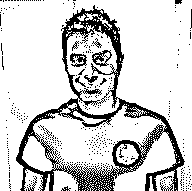
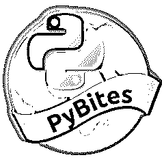

# python 社区采访黄铁矿的 bob 和 julian

> 原文：<https://realpython.com/python-community-interview-bob-and-julian-pybites/>

本周，我和 PyBites 乐队的鲍勃·贝尔德博斯和 T2·朱利安·塞杰拉在一起。Bob 是西班牙甲骨文公司的一名软件开发人员。Julian 是澳大利亚亚马逊网络服务公司的一名数据中心技术人员。

加入我们，一起讨论 PyBites 是如何起步的，以及他们对未来有什么打算。我们还会调查鲍勃对绘画的秘密爱好以及朱利安对好酒的秘密爱好。

里基: *欢迎，鲍勃和朱利安！或者是朱利安和鲍勃？不管是哪种情况，谢谢你参加这次面试。让我们从通常的第一个问题开始。你是怎么进入编程的？你是什么时候开始用 Python 的？*

朱利安:我们更喜欢用“布尔”不完全是，但是让我们坚持下去。

我第一次被编程错误(双关语！)回到高中，但在 2015 年末真正投身于编程。

我需要一种方法来跟踪我在 Oracle 担任现场工程师时的加班时间，以确保我得到正确的报酬。输入 Python(在 Bob 的推荐下)。

我给自己做了一个 CLI 加班跟踪器，包括一个基本的菜单系统，带有简单的选项来计算我的税后加班工资。这是最基本的，非常有效，让我迷上了 Python。

提示:是真实世界的用例让学习变得更有意义！

与我使用 C++的高中时代相比，Python 的速度和简单性让我着迷。然后我们开始 PyBites，蟒蛇变得真实。(*真正的 Python* ，懂了吗？)

对我来说，这一切要追溯到 2009 年的太阳微系统公司。我加入了系统支持小组，找到了一个合适的位置来开发一个 web 应用程序来解析诊断输出，我们每个月都会收到数千个这样的输出。这成为支持组织的主要工具，每天为他们节省了无数小时的繁琐工作。

这个诊断工具是 shell 脚本(bash/sed/awk)、Perl、PHP 和一些 jQuery 的混合。企业决定转向服务请求的完全自动化，为此我用 Perl 编写了一个新的框架，这很快成为维护的噩梦，所以我开始寻找其他解决方案。

这是在 2012 年。我偶然发现了 Python 并开始学习它。这是一见钟情:它干净优雅的设计( *type import this in your REPL* )，没有括号和其他类似 C 的语法，读起来就像英语！学习 Python 的基础很简单，但是在幕后，它是非常通用的。

在 Linux Journal 上有一篇 Eric Raymond 的很棒的文章，题目是 [*为什么是 Python？*](https://www.linuxjournal.com/article/3882) ，描述了他从 Perl 转向 Python 时的启示。

我也经历过类似的事情。在用 Python 快速重写自动化框架之后，进行更改变得相对“容易”,并且我们用许多令人兴奋的新特性对其进行了扩展，所有这些都没有大的麻烦。虽然我转换到了另一个角色，但解决方案仍然得到了积极的维护。从那以后，我有幸在几乎所有的工作中使用 Python。

瑞奇: *你们两个都是最出名的(不管是好是坏)，因为你们都是[皮比特](https://pybit.es/)的联合创始人。对于不了解 PyBites 的人来说，它是什么，又是怎么开始的？*

PyBites 最初只是一个简单的博客，分享我们在 Python 领域的学习。(我们使用名为[鹈鹕](https://github.com/getpelican/pelican)的静态站点生成器。)我们热衷于推动自己超越仅仅阅读书籍和观看视频。写博客文章让我们真正深入下去，以确保我们传达的是正确的概念。

它成立后不久，我们就开始试验一些想法。一个是挑战自我，受到诺亚·卡根的咖啡挑战的启发。所以有一天 Bob 提出了一个 Python 练习，让我们在周末之前解决。

我们发现了一个 JavaScript 课程页面，上面有每个视频的`mm:ss`计时，但没有总时长。任务是浏览网站，把所有的视频时间戳加起来，计算课程的总时长。

在周末(sprint)，我们比较了我们的解决方案，回顾了我们的学习成果。我们有“搏击俱乐部时刻”(也许没有那么暴力……)“我们应该找个时间再来一次”，这就是我们的博客/社区代码挑战热线的诞生。

我们研究了 GitHub，为我们建立了一个挑战报告来发布我们的挑战和解决方案，然后创建了一个单独的社区分支，让其他人请求他们的工作。

我们从中获得的动力激发了这个想法，这个想法成为了我们的编码平台: [CodeChalleng.es](https://codechalleng.es) 。它由不断增长的近 200 个 Python 练习(称为 Py 的*片段)组成，您可以在自己的浏览器中舒适地编写代码。*

对我们来说，另一件大事是完成 [#100DaysOfCode](https://www.100daysofcode.com/) 挑战，我们在博客和社交媒体上积极分享了这一挑战。这让我们在 *Talk Python* 播客上接受了采访，反过来，也让我们与 [Michael Kennedy](https://realpython.com/interview-michael-kennedy/) 一起制作了 [#100DaysOfCode in Python 课程](https://training.talkpython.fm/courses/explore_100days_in_python/100-days-of-code-in-python)。

对我们来说，重要的一课是，你只需要开始行动，放弃完美主义。发生的许多令人敬畏的事情不是计划好的，而是因为我们把一些产生兴趣的东西放在那里而来到我们身边，我们在这个过程中根据我们收到的有价值的反馈采取行动！

朱利安，你白天不是程序员，你在亚马逊网络服务公司做数据中心技术员。和像 Bob 这样有成就的人一起学习编程感觉如何？我认为找一个更有经验的人做你的生意伙伴会有帮助？在你学习编码的过程中，有什么让你感到惊讶或感到困难的事情吗？

我和鲍勃之间的鸿沟一直是 PyBites 的基石。实际上，我们认为这会给我们的博客一个独特的旋转！

为此，情况有点复杂。当你和像 Bob 这样有能力的人一起编码时，第一感觉是敬畏。你可以看到他们代码的优雅，以及他们在瞬间解决你花了几个小时解决的问题的能力。真的很励志！

但并不总是如此。很容易陷入冒名顶替综合症的陷阱:

*   "我的代码还会一样好吗？"
*   “我为什么要烦恼？”
*   “他总是会变得更好！”

现实是，总会有更好的人来写代码，总会有更好的人来生活！我很快认识到，与其关注技能差距，我应该关注我自己的代码，为我的成就感到自豪，并拥抱我带来的东西。

有趣的是，这适用于我们两个人，我们在学习和管理代码时遇到的困难可以忽略不计。也就是我们接受它，热爱它。(我现在这样说，但绝不是在当下！)

令人惊讶的困难部分是 PyBites 的实际业务方面！我还要补充一点，我不做专业程序员的日子可能要结束了！(*嘘！*)

鲍勃，用你自己的话来说，当你在日常工作中“不为男人努力工作”时，你喜欢在业余时间修补和建造项目。你目前有什么样的项目在进行中？

目前，我几乎所有的时间都花在了制作课程内容和通过增加更多练习和功能来改进我们的平台上。随着使用的增加，会有更多的问题和反馈/请求，但是我很喜欢它的每一分钟，因为它提供了一个教授 Python 和指导其他开发人员的好方法，这是我非常喜欢的。

我还参加了 Coursera 应用数据科学专业，因为我热爱数据，并希望在日常工作中更多地融入这些数据。

当这个和我们即将开始的课程(*悬念…* )完成后，我的默认工作流程仍然是相似的:

1.  接受一个新概念(Python 模块、数据、web 技术、自动化机会等等)
2.  研究一下
3.  做一些很酷的东西，然后写博客/分享这个过程

这是我所热爱的，也是 PyBites 不断增长的内容的一部分。

这实际上是我推荐给任何程序员/开发人员的。简历是遗产。开始建立你的博客/GitHub/品牌，这样你就有一个可以展示的作品集了。它还使您能够在未来的项目中重复使用您所构建的内容，这是一种与他人建立网络/协作的好方法。

里基: *很明显，你们俩都有企业家的基因。(你只要看看[鲍勃的书架](https://bobbelderbos.com/books/)就能看到证据。)对你来说，创业/副业(PyBites)最困难或最具挑战性的部分是什么？你发现你们各自的才能互相抵消了吗？*

最具挑战性的部分无疑是管理我们的优先事项。

我们两个人生活中最重要的事情碰巧非常相似:

*   家人/孩子
*   全职工作
*   学问
*   硫化铁矿

随着 PyBites 的增长，所需的时间投资也在增长。我们不能把这些时间从日常工作或家庭中抽出来，所以这无疑是试图找到一个可接受的平衡的最大障碍。

我们采取的观点是“如果我们有时间看网飞，那么我们就有时间研究俾比特人。”

为此，我们常常有意识地选择不看电视、不玩游戏或不出门，把这些时间变成我们的时间。这听起来没什么，但是在漫长的一天工作和哄孩子睡觉之后，重新使用工具来研究 PyBites 是非常具有挑战性的！

也就是说，我们公开告诉任何愿意倾听的人，如果没有彼此的相互支持，我们就不会有今天。

如果你在做任何有价值的事情，那么给自己找一个负责任的伙伴。我们让对方对我们接手的项目负责，当事情不尽如人意时，我们互相扶持。

我们不同的才能肯定会互相抵消。Julian 更倾向于作家、讲故事者、营销者、业务经理和“代言人”，而 Bob 深入研究代码，构建和维护工具，提出令人难以置信的想法，并在技术上支持社区。结合这两种才能，你就有了一台运转良好的 PyBites 机器。

最好的部分(并且坚持我们的核心信念，即你从实践中学习)是我们互相学习。我们互相推动，不断改进，跳出框框，不断尝试新事物。

**里基:** *现在我的最后一个问题。你在业余时间还做些什么？除了 Python 和编码，你还有什么其他的爱好和兴趣？*

哈哈，Python 和编码是一大块，但除此之外，我喜欢和我的妻子和两个孩子在一起的每一分钟。

我也热衷于坚持每天的健身计划，尤其是当我们的工作需要这么多坐着和看屏幕的时间的时候！我喜欢看书和听播客。当我有更多的空闲时间时，语言学习和绘画是我真正喜欢的另外两件事。

**Julian:** 好了，切掉编码和 Python，唷！

像鲍勃一样，首要任务是花时间陪伴我的妻子和两个孩子。任何有小孩的人都会知道，在他们结束后，你真的没有太多的时间，所以现在的业余爱好时间是有限的。

当我抓住几分钟不重要的时间时，我喜欢弹电吉他，玩电子游戏，阅读，摆弄我的树莓派和家庭自动化设备。

此外，作为一个交际花，我喜欢和朋友出去玩，喝几杯啤酒。带我去酒吧，给我一杯好酒，我会是你最好的朋友！

(等一下。鲍勃刚才说他喜欢画画吗？)

你有什么项目想和我们的读者分享吗？我们在哪里可以找到更多关于你们的信息以及你们在做什么？

**Boolean:** 除了[博客](https://pybit.es)，我们目前最引以为豪的是[我们的在线 Python 编码练习平台](https://codechalleng.es)。

我们还与 Michael Kennedy 一起在 Python 课程中创建了 [#100DaysOfCode】并成为了 *Talk Python to Me* 培训平台的培训师。同样，这也是我们非常自豪的事情。(更多内容请见此处！)](https://training.talkpython.fm/courses/explore_100days_in_python/100-days-of-code-in-python)

你可以在下面黑暗的地方找到并跟踪**朱利安**:

*   **推特:** [@_juliansequeira](https://twitter.com/_juliansequeira)
*   **领英:**【https://www.linkedin.com/in/juliansequeira/】T2
*   我还在 Udemy 上创建了一个[入门烧瓶课程！](https://www.udemy.com/python-flask-for-beginners/)
*   **个人博客:**【https://www.techmoneykids.com/】T2

鲍勃:

*   **推特:** [@bbelderbos](https://twitter.com/bbelderbos)
*   **领英:**【https://www.linkedin.com/in/bbelderbos/】T2
*   **个人博客:**【https://bobbelderbos.com】T2

* * *

谢谢朱利安和鲍勃的有趣采访。如果你最近没有去过 PyBites，那么我鼓励你去看看。如果你想让我采访某个人作为这个系列的一部分，请在下面留下评论。编码快乐！