# 用 Python 简化复数

> 原文：<https://realpython.com/python-complex-numbers/>

大多数通用编程语言要么不支持，要么有限支持**复数**。你的典型选择是学习一些专门的工具，比如 [MATLAB](https://realpython.com/matlab-vs-python/) 或者找一个第三方库。Python 是一个罕见的例外，因为它内置了复数。

顾名思义，复数并不复杂！它们在处理实际问题时很方便，您将在本教程中体会到这一点。你将探索**矢量图形**和**声音频率分析**，但是复数也可以帮助绘制**分形**，例如[曼德尔布罗集合](https://realpython.com/mandelbrot-set-python/)。

**在本教程中，您将学习如何:**

*   用 Python 中的**文字**定义复数
*   在**直角**和**极坐标**中表示复数
*   在**算术**表达式中使用复数
*   利用内置的 **`cmath`模块**
*   将**数学公式**直接翻译成 Python 代码

如果你需要快速复习或者对复数理论有一个温和的介绍，那么你可以看看[汗学院的视频系列](https://youtu.be/SP-YJe7Vldo)。要下载本教程中使用的示例代码，请单击下面的链接:

**获取示例代码:** [单击此处获取示例代码，您将在本教程中使用](https://realpython.com/bonus/python-complex-numbers-code/)来学习 Python 中的复数。

## 在 Python 中创建复数

在 Python 中创建和操作复数与其他内置数据类型没有太大区别，尤其是数值类型。这是可能的，因为这种语言将他们视为一等公民。这意味着你可以用很少的开销来表达包含复数的数学公式。

Python 允许你在算术表达式中使用复数，并对它们调用[函数](https://realpython.com/defining-your-own-python-function/)，就像你在 Python 中处理其他[数一样。它产生了优雅的语法，读起来几乎像一本数学教科书。](https://realpython.com/python-numbers/)

[*Remove ads*](/account/join/)

### 复数文字

在 Python 中定义复数的最快方法是直接在源代码中键入它的[文字](https://en.wikipedia.org/wiki/Literal_(computer_programming)):

>>>

```py
>>> z = 3 + 2j
```

虽然这看起来像一个代数公式，但等号右边的表达式已经是一个固定值，不需要进一步计算。当您检查它的类型时，您将确认它确实是一个复数:

>>>

```py
>>> type(z)
<class 'complex'>
```

这与*用加号[运算符](https://realpython.com/python-operators-expressions/)将*两个数字相加有何不同？一个明显的例子是粘在第二个数字上的字母`j`,它完全改变了表达的意思。如果您删除字母，您将得到一个熟悉的整数结果:

>>>

```py
>>> z = 3 + 2

>>> type(z)
<class 'int'>
```

顺便说一下，您也可以使用浮点数来创建复数:

>>>

```py
>>> z = 3.14 + 2.71j
>>> type(z)
<class 'complex'>
```

Python 中的复数文字模拟数学符号，也称为复数的**标准形式**、**代数形式**，或者有时称为**标准形式**。在 Python 中，可以在这些文字中使用小写的`j`或大写的`J`。

如果你在数学课上学过复数，你可能会看到用`i`而不是`j`来表示它们。如果你对 Python 为什么使用`j`而不是`i`感到好奇，那么你可以展开下面的可折叠部分来了解更多。


传统的复数符号使用字母`i`代替`j`，因为它代表**虚数单位**。如果你有数学背景，你可能会对 Python 的约定感到有点不舒服。然而，有几个原因可以证明 Python 有争议的选择是正确的:

*   这是工程师已经采用的惯例，以避免与电流的名称冲突，电流用字母`i`表示。
*   在计算中，字母`i`通常用于循环中的索引变量。
*   字母`i`在源代码中很容易与`l`或`1`混淆。

这是十多年前 Python 的 bug 追踪器提出来的，Python 的创造者吉多·范·罗苏姆本人用下面的评论结束了这个问题:

> 这个问题不会得到解决。首先，字母“I”或大写字母“I”看起来太像数字了。语言解析器(在源代码中)或内置函数(int、float、complex)解析数字的方式不应以任何方式进行本地化或配置；这是在自找巨大的失望。如果你想用“I”而不是“j”来解析复数，你已经有很多解决方案了。([来源](https://bugs.python.org/issue10562#msg148083))

所以你有它。除非你想开始使用 MATLAB，否则你将不得不忍受使用`j`来表示你的复数。

复数的代数形式遵循代数的标准规则，这便于执行算术运算。例如，加法有一个[可交换属性](https://en.wikipedia.org/wiki/Commutative_property)，它允许你交换一个复数文字的两个部分的顺序，而不改变它的值:

>>>

```py
>>> 3 + 2j == 2j + 3
True
```

同样，您可以在复数文字中用加法代替减法，因为减号只是等价形式的简写符号:

>>>

```py
>>> 3 - 2j == 3 + (-2j)
True
```

Python 中的复数文字一定要由两个数字组成吗？它能有更多吗？它们被订购了吗？为了回答这些问题，让我们进行一些实验。不出所料，如果您只指定一个数字，没有字母`j`，那么您将得到一个常规整数或浮点数:

>>>

```py
>>> z = 3.14
>>> type(z)
<class 'float'>
```

另一方面，将字母`j`附加到数字文字会立即将它变成一个复数:

>>>

```py
>>> z = 3.14j
>>> type(z)
<class 'complex'>
```

严格地说，从数学的角度来看，您刚刚创建了一个纯**虚数**，但是 Python 不能将其表示为独立的数据类型。因此，没有另一部分，它只是一个复数。

反过来呢？要创建一个没有虚数部分的复数*，你可以利用零，像这样加或减它:*

>>>

```py
>>> z = 3.14 + 0j
>>> type(z)
<class 'complex'>
```

事实上，复数的两个部分总是存在的。当你看不到 1 时，意味着它的值为零。让我们来看看当你尝试把比以前更多的项填入总和时会发生什么:

>>>

```py
>>> 2 + 3j + 4 + 5j
(6+8j)
```

这一次，您的表达式不再是一个文字，因为 Python 将其计算为一个仅包含两部分的复数。请记住，代数的基本规则适用于复数，所以如果您将相似的术语分组并应用组件式加法，那么您将得到`6 + 8j`。

注意 Python 默认显示复数的方式。它们的文本表示包含一对括号、一个小写字母`j`，没有空格。此外，虚部次之。

恰好也是纯虚数的复数没有括号，只显示它们的虚部:

>>>

```py
>>> 3 + 0j
(3+0j)
>>> 0 + 3j
3j
```

这有助于区分虚数和大多数由实部和虚部组成的复数。

[*Remove ads*](/account/join/)

### `complex()`工厂功能

Python 有一个内置函数`complex()`，您可以使用它作为复数文字的替代:

>>>

```py
>>> z = complex(3, 2)
```

在这种形式下，它类似于一个[元组](https://realpython.com/python-lists-tuples/)或者一对有序的普通数字。这个类比并没有那么牵强。复数在**笛卡儿坐标系**中有一个几何解释，稍后您将对其进行探究。你可以认为复数是二维的。

**有趣的事实:**在数学中，复数传统上用字母`z`表示，因为它是字母表中继`x`和`y`之后的下一个字母，通常代表坐标。

复数[工厂函数](https://en.wikipedia.org/wiki/Factory_(object-oriented_programming))接受两个数值参数。第一个代表**实部**，而第二个代表**虚部**在你之前看到的字面上用字母`j`表示:

>>>

```py
>>> complex(3, 2) == 3 + 2j
True
```

这两个参数都是可选的，默认值为零，这使得定义没有虚部或实部和虚部的复数变得不那么笨拙:

>>>

```py
>>> complex(3) == 3 + 0j
True
>>> complex() == 0 + 0j
True
```

单参数版本在**类型转换**中很有用。例如，您可以传递一个非数字值，比如一个[字符串](https://realpython.com/python-strings/)文本，以获得一个对应的`complex`对象。请注意，该字符串不能包含任何空格，尽管:

>>>

```py
>>> complex("3+2j")
(3+2j)

>>> complex("3 + 2j")
Traceback (most recent call last):
  File "<stdin>", line 1, in <module>
ValueError: complex() arg is a malformed string
```

稍后，您将了解如何让您的[类](https://realpython.com/python3-object-oriented-programming/)与这种类型转换机制兼容。有趣的是，当您将一个复数传递给`complex()`时，您将得到相同的实例:

>>>

```py
>>> z = complex(3, 2)
>>> z is complex(z)
True
```

这与 Python 中其他类型的数字的工作方式一致，因为它们都是不可变的。要制作一个复数的**不同副本**，必须再次调用带有两个参数的函数，或者用复数文本声明另一个变量:

>>>

```py
>>> z = complex(3, 2)
>>> z is complex(3, 2)
False
```

当你给函数提供两个参数时，它们必须总是数字，比如`int`、`float`或`complex`。否则，您会得到一个运行时错误。从技术上讲， [`bool`](https://realpython.com/python-boolean/) 是`int`的子类，所以它也可以工作:

>>>

```py
>>> complex(False, True)  # Booleans, same as complex(0, 1)
1j

>>> complex(3, 2)  # Integers
(3+2j)

>>> complex(3.14, 2.71)  # Floating-point numbers
(3.14+2.71j)

>>> complex("3", "2")  # Strings
Traceback (most recent call last):
  File "<stdin>", line 1, in <module>
TypeError: complex() can't take second arg if first is a string
```

当您向`complex()`工厂函数提供复数作为参数时，事情似乎变得更加奇怪。但是，如果只提供第一个参数，它将像以前一样充当代理:

>>>

```py
>>> complex(complex(3, 2))
(3+2j)
```

但是，当存在两个参数并且其中至少有一个是复数时，您将得到乍一看可能难以解释的结果:

>>>

```py
>>> complex(1, complex(3, 2))
(-1+3j)

>>> complex(complex(3, 2), 1)
(3+3j)

>>> complex(complex(3, 2), complex(3, 2))
(1+5j)
```

为了得到答案，让我们看一看工厂函数的 [docstring](https://realpython.com/documenting-python-code/) 或在线文档，它们解释了当您调用`complex(real, imag)`时发生了什么:

> 返回一个值为*实数* + *imag* *1j 的复数，或者将字符串或数字转换为复数。([来源](https://docs.python.org/3/library/functions.html#complex))

在本说明中，`real`和`imag`是函数自变量的名称。第二个参数乘以虚数单位`j`，结果加到第一个参数上。如果还是没有任何意义也不用担心。当你读到[复数算术](#complex-numbers-arithmetic)时，你可以回到这一部分。您将学习的规则将使这变得简单明了。

什么时候你想在字面上使用`complex()`工厂函数？这要视情况而定，但是例如，当您处理动态生成的数据时，调用该函数可能更方便。

[*Remove ads*](/account/join/)

## 了解 Python 复数

在数学中，复数是[实数](https://en.wikipedia.org/wiki/Real_number)的超集，也就是说每一个实数也是虚数部分等于零的复数。Python 通过一个叫做**数字塔**的概念来模拟这种关系，在 [PEP 3141](https://www.python.org/dev/peps/pep-3141/) 中有描述:

>>>

```py
>>> import numbers
>>> issubclass(numbers.Real, numbers.Complex)
True
```

内置的`numbers`模块通过**抽象类**定义了数字类型的层次结构，这些抽象类可用于类型检查和数字分类。例如，要确定一个值是否属于一组特定的数字，可以对它调用`isinstance()`:

>>>

```py
>>> isinstance(3.14, numbers.Complex)
True
>>> isinstance(3.14, numbers.Integral)
False
```

浮点值`3.14`是一个实数，恰好也是一个复数，但不是整数。请注意，您不能在这样的测试中直接使用内置类型:

>>>

```py
>>> isinstance(3.14, complex)
False
```

`complex`和`numbers.Complex`的区别在于，它们属于数值型层次树中单独的分支，后者是一个抽象基类，没有任何实现:

[](https://files.realpython.com/media/uml_numeric_types.ed370d32b0b3.png)

<figcaption class="figure-caption text-center">Type hierarchy for numbers in Python</figcaption>

抽象基类，在上图中用红色表示，可以通过[将](https://docs.python.org/3/library/abc.html#abc.ABCMeta.register)不相关的类注册为它们的虚拟子类来绕过常规的继承检查机制。这就是为什么示例中的浮点值看起来是`numbers.Complex`的实例，而不是`complex`的实例。

### 访问实部和虚部

为了在 Python 中获得复数的实部和虚部，您可以使用相应的`.real`和`.imag`属性:

>>>

```py
>>> z = 3 + 2j
>>> z.real
3.0
>>> z.imag
2.0
```

两个属性**都是只读的**，因为复数是不可变的，所以试图给它们中的任何一个赋值都会失败:

>>>

```py
>>> z.real = 3.14
Traceback (most recent call last):
  File "<stdin>", line 1, in <module>
AttributeError: readonly attribute
```

因为 Python 中的每个数字都是一个更具体的复数类型，所以在`numbers.Complex`中定义的属性和方法也适用于所有数字类型，包括`int`和`float`:

>>>

```py
>>> x = 42
>>> x.real
42
>>> x.imag
0
```

这类数字的虚部总是零。

### 计算复数的共轭

Python 复数只有三个公共成员。除了`.real`和`.imag`属性，它们还公开了`.conjugate()`方法，该方法翻转虚部的符号:

>>>

```py
>>> z = 3 + 2j
>>> z.conjugate()
(3-2j)
```

对于虚数部分等于零的数字，它不会有任何影响:

>>>

```py
>>> x = 3.14
>>> x.conjugate()
3.14
```

这个操作是它自己的逆操作，所以调用它两次将得到开始时的原始数字:

>>>

```py
>>> z.conjugate().conjugate() == z
True
```

虽然看起来没什么价值，但[复共轭](https://en.wikipedia.org/wiki/Complex_conjugate)有一些有用的算术属性，可以帮助用笔和纸计算两个复数的除法，以及其他许多东西。

[*Remove ads*](/account/join/)

## 复数算术

由于`complex`是 Python 中的原生数据类型，您可以将复数插入到**算术表达式**中，并调用其中的许多内置函数。更高级的复数函数在`cmath`模块中定义，它是[标准库](https://docs.python.org/3/library/)的一部分。在本教程的后面部分，您将会看到对它的介绍。

现在，记住一个规则将让你运用小学的算术知识来计算涉及复数的基本运算。需要记住的规则是**虚数单位**的定义，它满足以下等式:

[](https://files.realpython.com/media/latex_imaginary_unit.759e12aee3bc.png)

把`j`想成实数看起来不太对，但是不要慌。如果你暂时忽略它，把每一次出现的`j` <sup>`2`</sup> 都用`-1`代替，就好像它是一个常数一样，那么你就设定好了。让我们看看它是如何工作的。

### 加法

两个或更多复数之和相当于将它们的实部和虚部按分量相加:

>>>

```py
>>> z1 = 2 + 3j
>>> z2 = 4 + 5j
>>> z1 + z2
(6+8j)
```

之前，你发现由实数和虚数组成的代数表达式遵循代数的标准规则。当你用代数的方式写下它时，你将能够应用[分配性质](https://en.wikipedia.org/wiki/Distributive_property)并通过分解和分组常见术语来简化公式:

[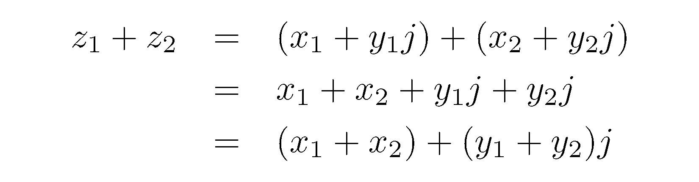](https://files.realpython.com/media/latex_addition.f6cf0ea151e3.png)

当您添加混合数值类型的值时，Python 会自动将操作数提升为`complex`数据类型:

>>>

```py
>>> z = 2 + 3j
>>> z + 7  # Add complex to integer
(9+3j)
```

这类似于您可能更熟悉的从`int`到`float`的隐式转换。

### 减法

复数的减法类似于复数的加法，这意味着您也可以按元素应用它:

>>>

```py
>>> z1 = 2 + 3j
>>> z2 = 4 + 5j
>>> z1 - z2
(-2-2j)
```

然而，与求和不同的是，操作数的顺序很重要，并且产生不同的结果，就像实数一样:

>>>

```py
>>> z1 + z2 == z2 + z1
True
>>> z1 - z2 == z2 - z1
False
```

您也可以使用**一元减号运算符(-)** 来求复数的负数:

>>>

```py
>>> z = 3 + 2j
>>> -z
(-3-2j)
```

这将反转复数的实部和虚部。

[*Remove ads*](/account/join/)

### 乘法运算

两个或更多复数的乘积变得更加有趣:

>>>

```py
>>> z1 = 2 + 3j
>>> z2 = 4 + 5j
>>> z1 * z2
(-7+22j)
```

你究竟是如何在只有正数的情况下得到负数的呢？要回答这个问题，你必须回忆一下虚部的定义，并用实部和虚部改写这个表达式:

[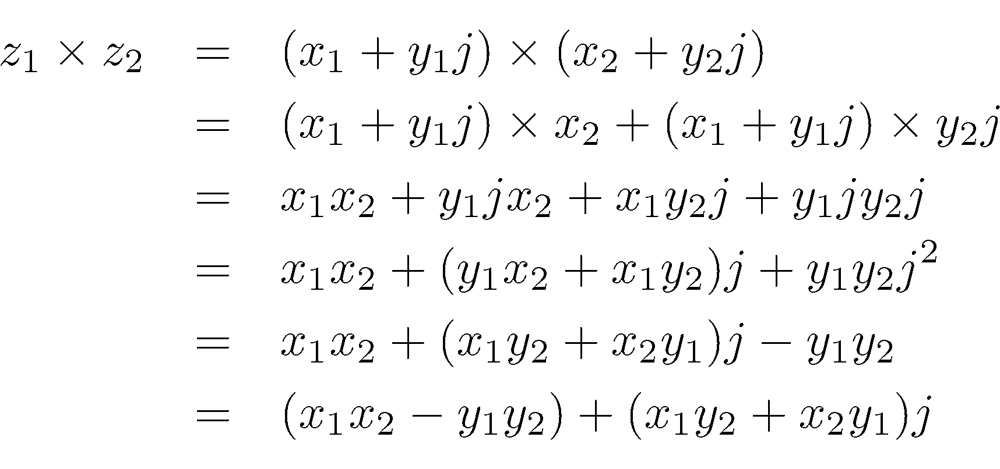](https://files.realpython.com/media/latex_multiplication.24b751b862b4.png)

要重点观察的是，`j`乘以`j`得出`j` <sup>`2`</sup> ，可以用`-1`代替。这将反转其中一个被加数的符号，而其余的规则保持不变。

### 分部

初看起来，将复数相除可能有些吓人:

>>>

```py
>>> z1 = 2 + 3j
>>> z2 = 4 + 5j
>>> z1 / z2
(0.5609756097560976+0.0487804878048781j)
```

信不信由你，你只用纸和笔就能得到同样的结果！(好吧，一个计算器可能会让你以后不再头疼。)当两个数都以标准形式表示时，技巧是将分子和分母乘以后者的共轭:

[](https://files.realpython.com/media/latex_division_1.03eb65d21657.png)

分母变成除数的平方**模数**。稍后你会学到更多关于复数的模数。当你继续推导这个公式时，你会得到:

[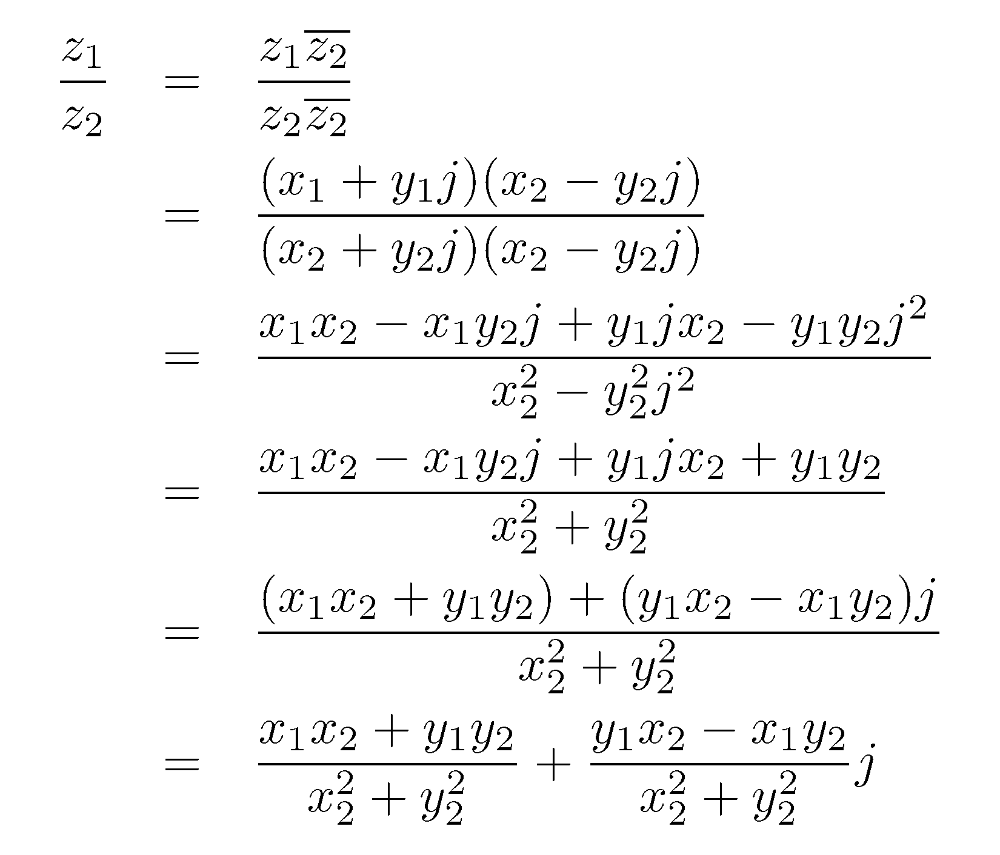](https://files.realpython.com/media/latex_division_2.aa08b066800f.png)

注意，复数不支持[底数除法](https://docs.python.org/3/glossary.html#term-floor-division)，也称为整数除法:

>>>

```py
>>> z1 // z2
Traceback (most recent call last):
  File "<stdin>", line 1, in <module>
TypeError: can't take floor of complex number.

>>> z1 // 3.14
Traceback (most recent call last):
  File "<stdin>", line 1, in <module>
TypeError: can't take floor of complex number.
```

这在 Python 2.x 中曾经有效，但后来为了避免歧义而被删除了。

### 求幂运算

您可以使用二进制**取幂运算符(`**` )** 或内置的`pow()`对复数进行幂运算，但不能使用在`math`模块中定义的运算符，后者仅支持浮点值:

>>>

```py
>>> z = 3 + 2j

>>> z**2
(5+12j)

>>> pow(z, 2)
(5+12j)

>>> import math
>>> math.pow(z, 2)
Traceback (most recent call last):
  File "<stdin>", line 1, in <module>
TypeError: can't convert complex to float
```

**底数**和**指数**可以是任何数字类型，包括整数、浮点、虚数或复数:

>>>

```py
>>> 2**z
(1.4676557979464138+7.86422192328995j)

>>> z**2
(5+12j)

>>> z**0.5
(1.8173540210239707+0.5502505227003375j)

>>> z**3j
(-0.13041489185767086-0.11115341486478239j)

>>> z**z
(-5.409738793917679-13.410442370412747j)
```

当复数以标准形式表示时，手动求幂变得非常困难。将**三角形式中的数字**重写，[用一些基本的三角学计算幂](https://youtu.be/dl_9NC_J6yo)就方便多了。如果你对所涉及的数学感兴趣，看看[德莫维尔的公式](https://en.wikipedia.org/wiki/De_Moivre%27s_formula)，它能让你做到这一点。

[*Remove ads*](/account/join/)

## 使用 Python 复数作为 2D 向量

你可以把复数想象成笛卡尔或 T4 直角坐标系统中欧几里得平面上的点 T1 或 T2 向量 T3:

[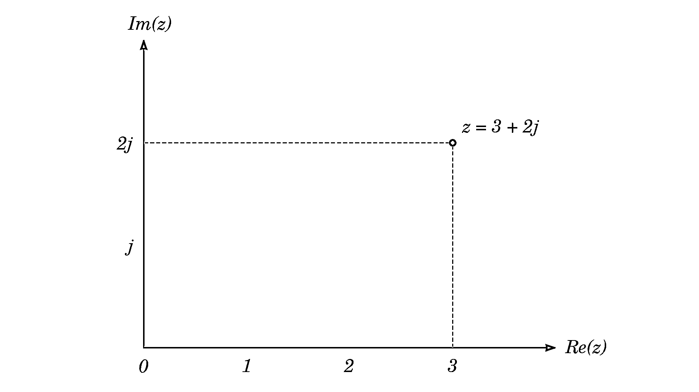](https://files.realpython.com/media/complex_plane.0396c2f95b79.png)

[复平面](https://en.wikipedia.org/wiki/Complex_plane)上的 X 轴，也称为**高斯平面**或**阿甘图**，代表一个复数的实部，而 Y 轴代表其虚部。

这个事实导致了 Python 中`complex`数据类型最酷的特性之一，它免费实现了二维[向量](https://en.wikipedia.org/wiki/Vector_(mathematics_and_physics))的基本实现。虽然不是所有的运算在两者中都以相同的方式工作，但是向量和复数有许多相似之处。

### 获取坐标

[百慕大三角](https://en.wikipedia.org/wiki/Bermuda_Triangle)是一个以超自然现象闻名的传奇地区，横跨佛罗里达南端、波多黎各和百慕大小岛。其顶点大致由三个主要城市指定，其地理坐标如下:

1.  迈阿密:北纬 25° 45 ' 42.054 英寸，西经 80° 11 ' 30.438 英寸
2.  圣胡安:北纬 18° 27 ' 58.8 英寸，西经 66° 6 ' 20.598 英寸
3.  汉密尔顿:北纬 32° 17 ' 41.64 "，西经 64° 46 ' 58.908 "

将这些坐标转换成十进制度数后，每个城市将有两个浮点数。您可以使用`complex`数据类型来存储有序的数字对。由于**纬度**是纵坐标，而**经度**是横坐标，因此按照笛卡尔坐标的传统顺序将它们互换可能会更方便:

```py
miami_fl = complex(-80.191788, 25.761681)
san_juan = complex(-66.105721, 18.466333)
hamilton = complex(-64.78303, 32.2949)
```

负经度值代表西半球，而正纬度值代表北半球。

记住这些是**球坐标**。为了正确地将它们投影到一个平面上，你需要考虑地球的曲率。地图学中最早使用的地图投影之一是[墨卡托投影](https://en.wikipedia.org/wiki/Mercator_projection)，它帮助水手们为他们的船只导航。但是让我们忽略所有这些，假设值已经在直角坐标系中表示了。

当你[在一个复平面上绘制](https://realpython.com/learning-paths/data-visualization-python/)这些数字时，你会得到百慕大三角的粗略描绘:

[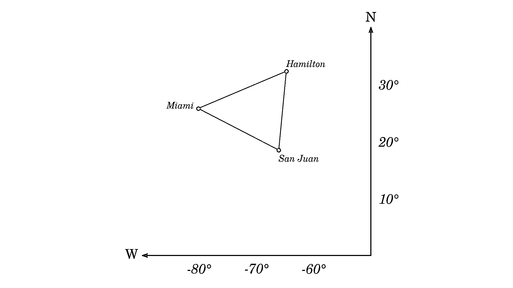](https://files.realpython.com/media/bermuda.c61ec1dcca39.png)

在配套资料中，你会发现一个交互式的 [Jupyter 笔记本](https://realpython.com/jupyter-notebook-introduction/)，它使用 [Matplotlib](https://realpython.com/python-matplotlib-guide/) 库绘制了百慕大三角。要下载本教程的源代码和材料，请单击下面的链接:

**获取示例代码:** [单击此处获取示例代码，您将在本教程中使用](https://realpython.com/bonus/python-complex-numbers-code/)来学习 Python 中的复数。

如果你不喜欢调用`complex()`工厂函数，你可以用一个更合适的名字创建一个[类型的别名](https://docs.python.org/3/library/typing.html#type-aliases),或者使用复数的字面形式来节省一些击键次数:

```py
CityCoordinates = complex
miami_fl = CityCoordinates(-80.191788, 25.761681)
miami_fl = -80.191788 + 25.761681j
```

如果您需要在一个城市上打包更多的属性，您可以使用一个名为 tuple 的[或者一个](https://realpython.com/python-namedtuple/)[数据类](https://realpython.com/python-data-classes/)或者创建一个自定义类。

### 计算震级

一个复数的**大小**，也称为**模数**或**半径**，是在一个复平面上描述它的向量的长度:

[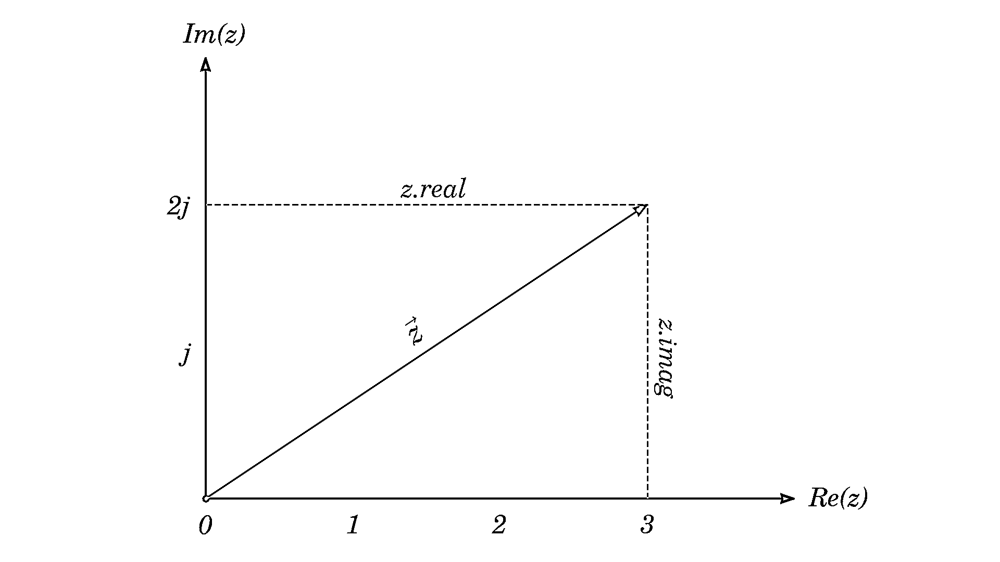](https://files.realpython.com/media/magnitude.c89ae3ebb4d6.png)

你可以从[勾股定理](https://en.wikipedia.org/wiki/Pythagorean_theorem)通过取实部平方和虚部平方之和的平方根来计算:

[](https://files.realpython.com/media/latex_magnitude.be42a2542e96.png)

你可能会认为 Python 会让你用内置的`len()`来计算这样一个向量的长度，但事实并非如此。要得到一个复数的大小，你必须调用另一个名为 [`abs()`](https://realpython.com/python-absolute-value/#using-the-built-in-abs-function-with-numbers) 的全局函数，它通常用于计算一个数的[绝对值](https://realpython.com/python-absolute-value/):

>>>

```py
>>> len(3 + 2j)
Traceback (most recent call last):
  File "<stdin>", line 1, in <module>
TypeError: object of type 'complex' has no len()

>>> abs(3 + 2j)
3.605551275463989
```

这个函数从您传入的整数中删除符号，但是对于复数，它返回幅度或向量长度:

>>>

```py
>>> abs(-42)
42

>>> z = 3 + 2j

>>> abs(z)
3.605551275463989

>>> from math import sqrt
>>> sqrt(z.real**2 + z.imag**2)
3.605551275463989
```

您可能记得在前面的章节中，一个复数乘以它的共轭会产生它的大小的平方。

[*Remove ads*](/account/join/)

### 求两点间的距离

让我们找到百慕大三角的几何中心和形成其边界的三个城市到它的距离。首先，您需要将所有坐标相加，然后将结果除以它们的数量，得到平均值:

```py
geometric_center = sum([miami_fl, san_juan, hamilton]) / 3
```

这会给你一个位于大西洋的点，在三角形内的某个地方:

[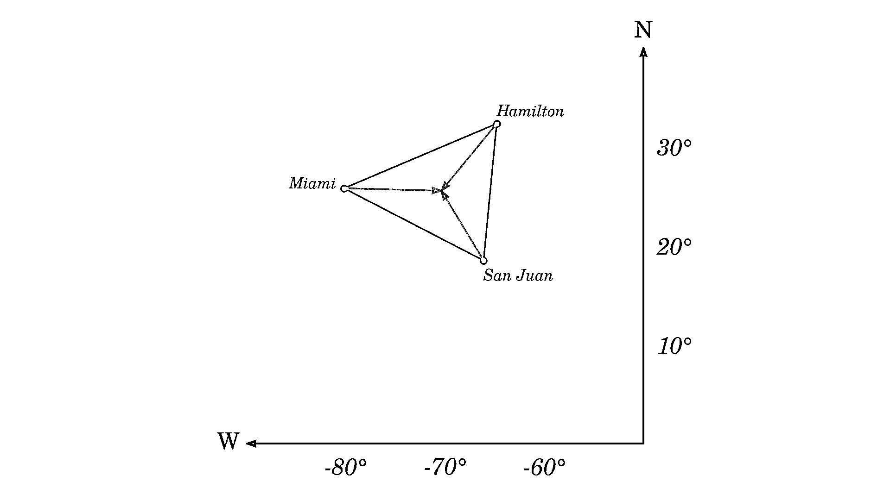](https://files.realpython.com/media/bermuda_center.8c260af2f7e5.png)

现在，您可以创建锚定在城市中并指向三角形几何中心的向量。向量是通过从目标点减去源点得到的:

```py
v1 = geometric_center - miami_fl
v2 = geometric_center - san_juan
v3 = geometric_center - hamilton
```

因为减去复数，所以每个向量也是由两部分组成的复数。要获得距离，请计算每个矢量的大小:

>>>

```py
>>> abs(v1)
9.83488994681275

>>> abs(v2)
8.226809506084367

>>> abs(v3)
8.784732429678444
```

这些向量长度并不能反映有意义的距离，但对于这样的玩具示例来说是很好的近似值。为了用有形的单位表示精确的结果，你必须首先将坐标从球形转换成矩形，或者使用[大圆](https://en.wikipedia.org/wiki/Great-circle_distance)方法来计算距离。

### 平移、翻转、缩放和旋转

三角形出现在笛卡尔坐标系的第二个[象限](https://en.wikipedia.org/wiki/Quadrant_(plane_geometry))可能会困扰你。让我们移动它，使它的几何中心与原点对齐。所有三个顶点将被**平移**由几何中心指示的矢量长度，但方向相反:

```py
triangle = miami_fl, san_juan, hamilton
offset = -geometric_center
centered_triangle = [vertex + offset for vertex in triangle]
```

请注意，您将两个复数加在一起，这将执行它们的元素相加。这是一个[仿射变换](https://en.wikipedia.org/wiki/Affine_transformation)，因为它不会改变三角形的形状或其顶点的相对位置:

[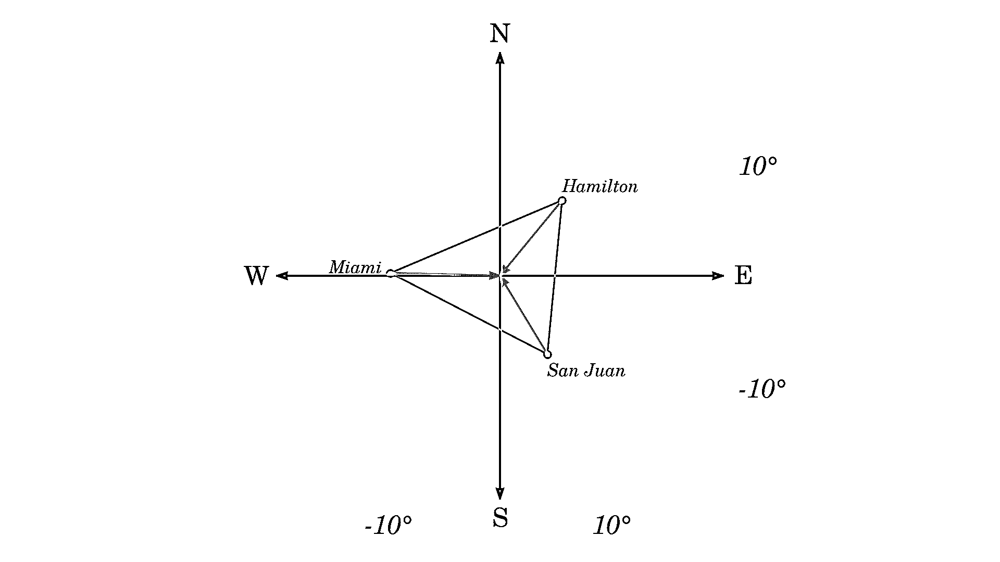](https://files.realpython.com/media/bermuda_translate.7563f46ea10c.png)

围绕实轴或虚轴的三角形的镜像需要反转其顶点中的相应分量。例如，要将**水平翻转**，您必须使用实数部分的负数，这对应于水平方向。要垂直翻转它，你要取虚部的负值:

```py
flipped_horizontally = [complex(-v.real, v.imag) for v in centered_triangle]
flipped_vertically = [complex(v.real, -v.imag) for v in centered_triangle]
```

后者本质上与计算复数共轭是一样的，所以你可以在每个顶点上直接调用`.conjugate()`来为你做这项艰苦的工作:

```py
flipped_vertically = [v.conjugate() for v in centered_triangle]
```

自然，没有什么可以阻止你在任一方向上或同时在两个方向上应用对称性。在这种情况下，您可以在复数前面使用一元减号运算符来翻转其实部和虚部:

```py
flipped_in_both_directions = [-v for v in centered_triangle]
```

继续使用可下载资料中的交互式 Jupyter 笔记本摆弄不同的翻盖组合。以下是沿两个轴翻转三角形时的样子:

[](https://files.realpython.com/media/bermuda_flip.2910c05a24ce.png)

**缩放**类似于平移，但不是添加偏移，而是将每个顶点乘以一个常数因子，该常数因子必须是一个*实数*:

```py
scaled_triangle = [1.5*vertex for vertex in centered_triangle]
```

这样做的结果是每个复数的两个分量都乘以相同的量。它应该拉伸百慕大三角，使它在图上看起来更大:

[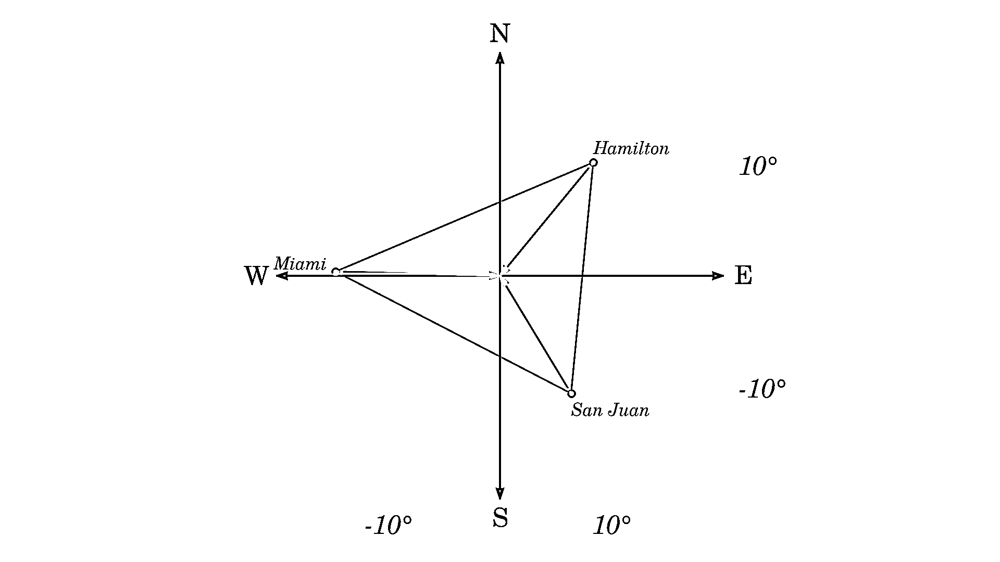](https://files.realpython.com/media/bermuda_scale.b888d6153e21.png)

另一方面，将三角形的顶点乘以另一个*复数*，会产生**围绕坐标系原点旋转**的效果。这与通常的向量相乘有很大的不同。例如，两个向量的[点积](https://en.wikipedia.org/wiki/Dot_product)将产生一个标量，而它们的[叉积](https://en.wikipedia.org/wiki/Cross_product)将返回三维空间中的一个新向量，该向量垂直于它们定义的表面。

**注意:**两个复数的乘积不代表向量乘法。而是定义为二维向量空间中的**矩阵乘法**，以 1 和`j`为标准基。将(*x*<sub>1</sub>+*y*<sub>1</sub>`j`)乘以(*x*<sub>2</sub>+*y*<sub>2</sub>`j`)对应如下矩阵乘法:

[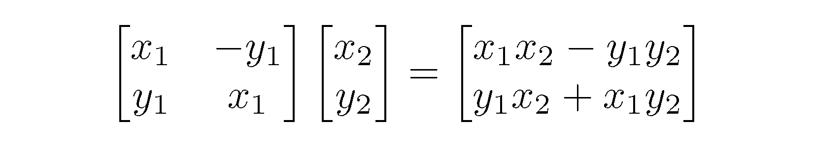](https://files.realpython.com/media/latex_multiplication_matrix.ece9c1c3983c.png)

这是左边的**旋转矩阵**，这使得数学计算很好。

当你把顶点乘以虚数单位时，它会把三角形逆时针旋转 90 度。如果你不断重复，你最终会到达你开始的地方:

[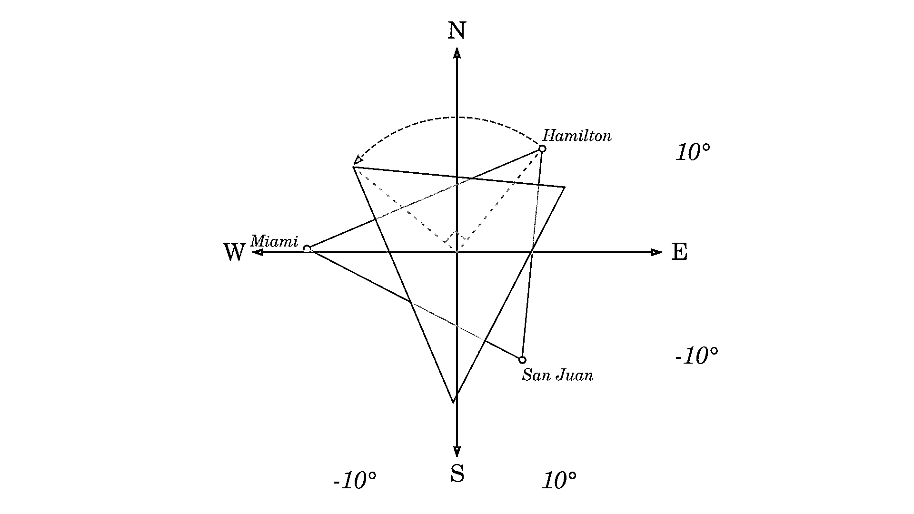](https://files.realpython.com/media/bermuda_rotate.444f38c0fcd0.png)

如何找到一个特定的复数，当两个复数相乘时，它可以将另一个复数旋转任意角度？首先，看一下下表，它总结了连续旋转 90°的情况:

| 90 度旋转 | 总角度 | 公式 | 指数 | 价值 |
| --- | --- | --- | --- | --- |
| Zero | 0° | *z* | `j` <sup>0</sup> | one |
| one | 90° | *z* × `j` | `j` <sup>1</sup> | `j` |
| Two | 180° | *z* × `j` × `j` | `j` <sup>2</sup> | -1 |
| three | 270° | *z* × `j` × `j` × `j` | `j` <sup>3</sup> | - `j` |
| four | 360° | *z* × `j` × `j` × `j` × `j` | `j` <sup>4</sup> | one |
| five | 450° | *z*×`j`×`j`×`j`×`j`×`j` | `j` <sup>5</sup> | `j` |
| six | 540° | *z*×`j`×`j`×`j`×`j`×`j`×`j` | `j` <sup>6</sup> | -1 |
| seven | 630° | *z*×`j`×`j`×`j`×`j`×`j`×`j`×`j` | `j` <sup>7</sup> | - `j` |
| eight | 720° | *z*×`j`×`j`×`j`×`j`×`j`×`j`×`j`×`j` | `j` <sup>8</sup> | one |

当你用正整数指数来表示与`j`的重复乘法时，就会出现一种模式。请注意虚数单位的后续幂如何使其重复循环相同的值。你可以将此推断到分数指数上，并期望它们对应于中间角度。

例如，第一次旋转中途的指数等于 0.5，代表 45 度角:

[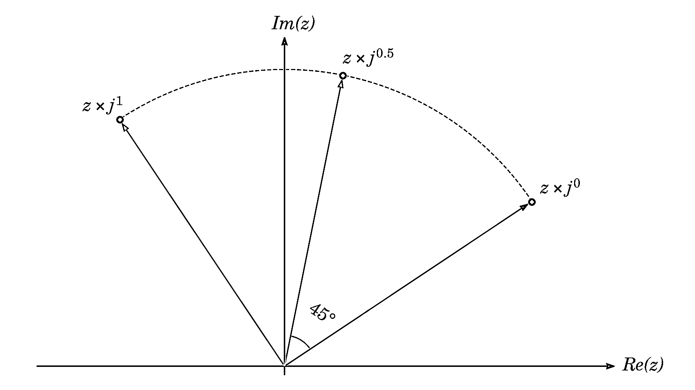](https://files.realpython.com/media/complex_rotation.27ec9e821541.png)

因此，如果您知道 1 的幂代表直角，并且两者之间的任何值都按比例缩放，那么您就可以推导出任意旋转的通用公式:

```py
def rotate(z: complex, degrees: float) -> complex:
    return z * 1j**(degrees/90)
```

请注意，当您在极坐标中表示复数时，旋转变得更加自然，极坐标已经描述了角度。然后，您可以利用**指数形式**使计算更加简单明了:


使用极坐标旋转数字有两种方法:

```py
import math, cmath

def rotate1(z: complex, degrees: float) -> complex:
    radius, angle = cmath.polar(z)
    return cmath.rect(radius, angle + math.radians(degrees))

def rotate2(z: complex, degrees: float) -> complex:
    return z * cmath.rect(1, math.radians(degrees))
```

你可以对角度求和，或者将你的复数乘以一个单位向量。

在下一节中，您将了解到更多关于这些内容的信息。

[*Remove ads*](/account/join/)

## 探索复数的数学模块:`cmath`

您已经看到了一些内置函数，如`abs()`和`pow()`接受复数，而其他的则不接受。例如，你不能`round()`一个复数，因为这样的运算没有意义:

>>>

```py
>>> round(3 + 2j)
Traceback (most recent call last):
  File "<stdin>", line 1, in <module>
TypeError: type complex doesn't define __round__ method
```

许多高级数学函数，如**三角函数**、**双曲线函数**或**对数函数**都可以在标准库中找到。可悲的是，即使你对 [Python `math`模块](https://realpython.com/python-math-module/)了如指掌，也无济于事，因为它的函数都不支持复数。您需要将它与`cmath`模块结合起来，后者为复数定义了相应的函数。

`cmath`模块重新定义了来自`math`的所有浮点常量，因此它们唾手可得，无需导入这两个模块:

>>>

```py
>>> import math, cmath
>>> for name in "e", "pi", "tau", "nan", "inf":
...     print(name, getattr(math, name) == getattr(cmath, name))
...
e True
pi True
tau True
nan False
inf True
```

注意`nan`是一个特殊值，它永远不等于任何其他值，包括它本身！这就是为什么你在上面的输出中看到了一个孤独的`False`。除此之外，`cmath`还为 [NaN](https://en.wikipedia.org/wiki/NaN) (非数字)和 infinity 提供了两个复数对应物，两者的实部都为零:

>>>

```py
>>> from cmath import nanj, infj
>>> nanj.real, nanj.imag
(0.0, nan)
>>> infj.real, infj.imag
(0.0, inf)
```

`cmath`中的功能大约是标准`math`模块的一半。它们中的大部分模仿了最初的行为，但也有一些是复数所特有的。它们将允许您在两个坐标系之间进行转换，这将在本节中探讨。

### 提取复数的根

代数的[基本定理说明一个复系数的次数 *n* 多项式恰好有 *n* 复数](https://en.wikipedia.org/wiki/Fundamental_theorem_of_algebra)[根](https://en.wikipedia.org/wiki/Zero_of_a_function)。如果你仔细想想，那是相当重要的，所以让它沉淀一会儿。

现在，我们以二次函数 [*x* <sup>2</sup> + 1](https://www.wolframalpha.com/input/?i=x%5E2+%2B+1) 为例。从视觉上看，这条**抛物线**不与 X 轴相交，因为它位于原点上方一个单位处。该函数的[判别式](https://en.wikipedia.org/wiki/Discriminant)为负，这从算术上证实了这一观察结果。同时，它是一个二次多项式，所以它必须有两个复数根，尽管它没有任何实数根！

为了找到这些根，你可以将函数重写为一个二次方程，然后将常数移到右边，取两边的平方根:

[](https://files.realpython.com/media/latex_quadratic.1a6555853632.png)

在实数域中，平方根仅针对非负输入值定义。因此，在 Python 中调用这个函数将引发一个[异常](https://realpython.com/python-exceptions/),并显示相应的错误消息:

>>>

```py
>>> import math
>>> math.sqrt(-1)
Traceback (most recent call last):
  File "<stdin>", line 1, in <module>
ValueError: math domain error
```

然而，当您将√-1 视为复数并从`cmath`模块调用相关函数时，您将获得更有意义的结果:

>>>

```py
>>> import cmath
>>> cmath.sqrt(-1)
1j
```

有道理。毕竟，二次方程的中间形式 *x* <sup>2</sup> = -1 正是虚数单位的定义。但是，等一下。另一个复杂的根去了哪里？高次多项式的复根怎么办？

比如一个四次多项式 *x* <sup>4</sup> + 1，可以写成方程 *x* <sup>4</sup> = -1，有这四个复数根:

*   *z*<sub>0</sub>= 2/2+2/2`j`
*   *z*<sub>1</sub>= 2/2-√2/2`j`
*   *z*<sub>2</sub>=【T2/2+2/2`j`
*   *z*<sub><sub>=【T2/2】-【T2/2】`j`</sub></sub>

将每个根提升到四次幂会得到一个等于-1 + 0 `j`的复数或一个实数-1:

>>>

```py
>>> import cmath
>>> z0 = -cmath.sqrt(2)/2 + cmath.sqrt(2)/2*1j

>>> z0**4
(-1.0000000000000004-0j)

>>> (z0**4).real
-1.0000000000000004
```

您会注意到，由于浮点运算中的[舍入](https://realpython.com/python-rounding/)误差，结果值并不完全是-1。为了说明这一点，只要需要判断两个复数的值是否接近，就可以调用`cmath.isclose()`:

>>>

```py
>>> cmath.isclose(z0**4, -1)
True
```

不幸的是，您不能用纯 Python 计算其他复杂的根，因为正则求幂总是给出一个解:

>>>

```py
>>> pow(-1, 1/4)
(0.7071067811865476+0.7071067811865475j)
```

这只是之前列出的词根之一。寻找所有复数根的数学公式利用了复数的**三角形式**:

[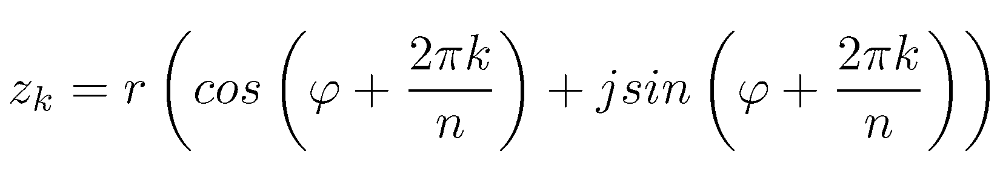](https://files.realpython.com/media/latex_roots.50334d646b37.png)

*r* 和 *φ* 是复数的**极坐标**，而 *n* 是多项式的次数， *k* 是根的索引，从零开始。好消息是你不需要自己费力地计算这些根。找到它们最快的方法是通过[安装](https://realpython.com/what-is-pip/)一个第三方库，比如 [NumPy](https://realpython.com/numpy-tutorial/) 和[将](https://realpython.com/python-import/)导入到您的项目中:

>>>

```py
>>> import numpy as np
>>> np.roots([1, 0, 0, 0, 1])  # Coefficients of the polynomial x**4 + 1
array([-0.70710678+0.70710678j, -0.70710678-0.70710678j,
 0.70710678+0.70710678j,  0.70710678-0.70710678j])
```

了解各种复数形式及其坐标系会很有用。如你所见，它有助于解决实际问题，如寻找复杂的根。因此，在下一节中，您将深入研究更多的细节。

[*Remove ads*](/account/join/)

### 在直角坐标和极坐标之间转换

几何上，你可以把一个复数看两遍。一方面，它是一个点，它离原点的水平和垂直距离唯一地标识了它的位置。这些被称为包含实部和虚部的直角坐标。

另一方面，你可以在极坐标**中描述同一点**,这也让你用两个距离明确地找到它:

1.  **径向距离**是从原点测量的半径长度。
2.  **角距离**是水平轴和半径之间测得的角度。

**半径**，也被称为**模数**，对应于复数的幅度，或者矢量的长度。该角度通常被称为复数的**相位**或**幅角**。使用三角函数时，用[弧度](https://en.wikipedia.org/wiki/Radian)而不是度数来表示角度很有用。

以下是对两个坐标系中的复数的描述:

[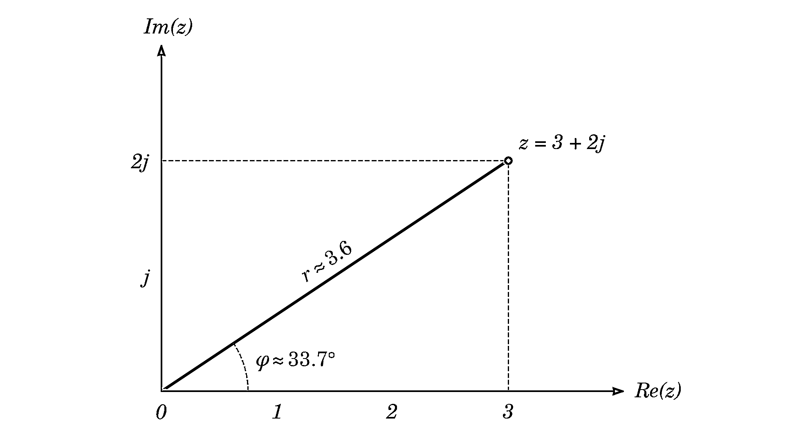](https://files.realpython.com/media/polar.11c9020655b7.png)

因此，笛卡尔坐标系中的点(3，2)具有大约 3.6 的半径和大约 33.7 的角度，或者大约π超过 5.4 弧度。

两个坐标系之间的转换可以通过`cmath`模块中的几个函数来实现。具体来说，要获得一个复数的极坐标，必须将其传递给`cmath.polar()`:

>>>

```py
>>> import cmath
>>> cmath.polar(3 + 2j)
(3.605551275463989, 0.5880026035475675)
```

它将返回一个元组，其中第一个元素是半径，第二个元素是以弧度表示的角度。注意，半径的值与星等相同，可以通过在复数上调用`abs()`来计算。相反，如果您只对获取一个复数的角度感兴趣，那么您可以调用`cmath.phase()`:

>>>

```py
>>> z = 3 + 2j

>>> abs(z)  # Magnitude is also the radial distance
3.605551275463989

>>> import cmath
>>> cmath.phase(3 + 2j)
0.5880026035475675

>>> cmath.polar(z) == (abs(z), cmath.phase(z))
True
```

由于实部、虚部和幅度一起形成了一个直角三角形，因此可以使用基本的[三角学](https://en.wikipedia.org/wiki/Trigonometry)获得角度:

[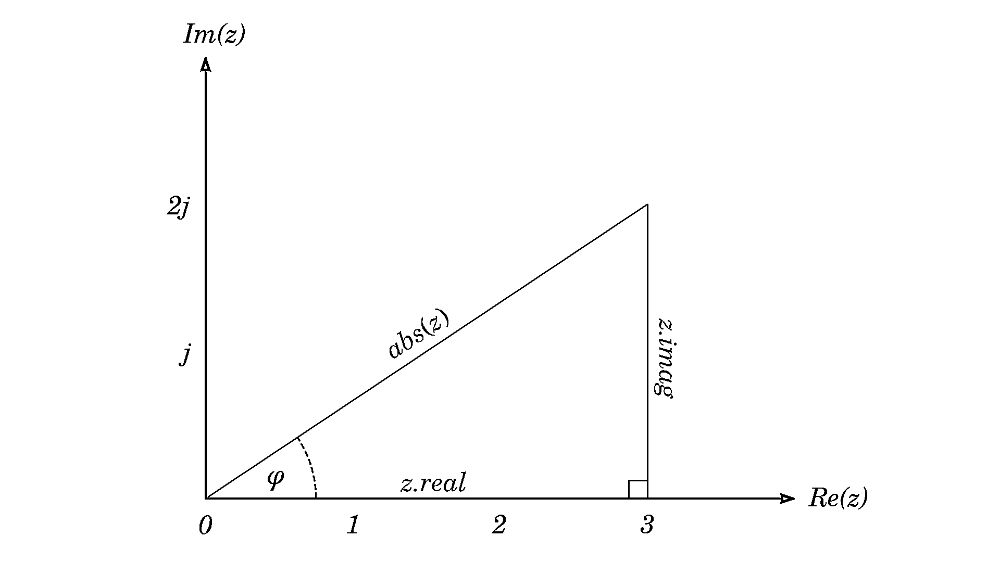](https://files.realpython.com/media/trigonometry.e7420d1c33ba.png)

您可以从`math`或`cmath`使用反三角函数，如**反正弦**，但后者会产生虚部等于零的复数值:

>>>

```py
>>> z = 3 + 2j

>>> import math
>>> math.acos(z.real / abs(z))
0.5880026035475675
>>> math.asin(z.imag / abs(z))
0.5880026035475676
>>> math.atan(z.imag / z.real)  # Prefer math.atan2(z.imag, z.real)
0.5880026035475675

>>> import cmath
>>> cmath.acos(z.real / abs(z))
(0.5880026035475675-0j)
```

不过，在使用**反正切**函数时，有一个小细节需要小心，这导致许多编程语言开发了一个名为 [`atan2()`](https://en.wikipedia.org/wiki/Atan2) 的替代实现。计算虚部和实部之间的比率有时会由于例如被零除而产生[奇点](https://en.wikipedia.org/wiki/Singularity_(mathematics))。此外，在此过程中，两个值的单个符号会丢失，从而无法确定地判断角度:

>>>

```py
>>> import math

>>> math.atan(1 / 0)
Traceback (most recent call last):
  File "<stdin>", line 1, in <module>
ZeroDivisionError: division by zero

>>> math.atan2(1, 0)
1.5707963267948966

>>> math.atan(1 / 1) == math.atan(-1 / -1)
True

>>> math.atan2(1, 1) == math.atan2(-1, -1)
False
```

注意`atan()`是如何无法识别位于坐标系相对象限的两个不同点的。另一方面，`atan2()`期望两个参数而不是一个参数来保留各个符号，然后再将它们分开，这样也避免了其他问题。

要获得角度而不是弧度，您可以再次使用`math`模块进行必要的转换:

>>>

```py
>>> import math
>>> math.degrees(0.5880026035475675)  # Radians to degrees
33.690067525979785
>>> math.radians(180)  # Degrees to radians
3.141592653589793
```

反转该过程(即将极坐标转换为直角坐标)依赖于另一个函数。然而，你不能只传递从`cmath.polar()`得到的相同的元组，因为`cmath.rect()`需要两个独立的参数:

>>>

```py
>>> cmath.rect(cmath.polar(3 + 2j))
Traceback (most recent call last):
  File "<stdin>", line 1, in <module>
TypeError: rect expected 2 arguments, got 1
```

在进行赋值时，最好先解包元组，并给这些元素起一个更具描述性的名字。现在您可以正确地调用`cmath.rect()`:

>>>

```py
>>> radius, angle = cmath.polar(3 + 2j)
>>> cmath.rect(radius, angle)
(3+1.9999999999999996j)
```

在 Python 进行计算的过程中，您可能会遇到舍入误差。在幕后，它调用三角函数来检索实部和虚部:

>>>

```py
>>> import math
>>> radius*(math.cos(angle) + math.sin(angle)*1j)
(3+1.9999999999999996j)

>>> import cmath
>>> radius*(cmath.cos(angle) + cmath.sin(angle)*1j)
(3+1.9999999999999996j)
```

同样，在这种情况下使用`math`还是`cmath`并不重要，因为结果是一样的。

[*Remove ads*](/account/join/)

### 以不同方式表示复数

不管坐标系如何，您都可以用几种数学上等价的形式来表示同一个复数:

*   代数(标准)
*   几何学的
*   三角法的
*   指数的

这个列表并不详尽，因为还有更多表示法，比如复数的矩阵表示法。

拥有选择权可以让你选择最方便的方法来解决给定的问题。例如，在下一节中，您将需要指数形式来计算[离散傅立叶变换](https://en.wikipedia.org/wiki/Discrete_Fourier_transform)。使用这种形式也适用于复数的乘除运算。

以下是单个复数形式及其坐标的简要概述:

| 形式 | 矩形的 | 极地的 |
| --- | --- | --- |
| 代数的 | *z*=*x*+*y*`j` | - |
| 几何学的 | *z* = ( *x* ， *y* ) | *z* = ( *r* ，φ) |
| 三角法的 | *z*= &#124;*z*&#124;(cos(*x*/&#124;*z*&#124;)+`j`sin(*y*/&#124;*z*&#124;)) | *z*=*r*(cos(φ)+`j`sin(φ)) |
| 指数的 | *z*= &#124;*z*&#124; e<sup>`atan2(y/x)j`T6】</sup> | *z*=*r*(e<sup>T0】φ</sup> |

当您使用文字指定复数时，代数形式是 Python 固有的。您也可以将它们视为笛卡尔或极坐标系统中欧几里得平面上的点。虽然 Python 中没有三角或指数形式的单独表示，但您可以验证数学原理是否成立。

例如，将[欧拉公式](https://en.wikipedia.org/wiki/Euler%27s_formula)代入三角形式，就会变成指数形式。你可以调用`cmath`模块的`exp()`或者提升`e`常数的幂来得到相同的结果:

>>>

```py
>>> import cmath

>>> algebraic = 3 + 2j
>>> geometric = complex(3, 2)
>>> radius, angle = cmath.polar(algebraic)
>>> trigonometric = radius * (cmath.cos(angle) + 1j*cmath.sin(angle))
>>> exponential = radius * cmath.exp(1j*angle)

>>> for number in algebraic, geometric, trigonometric, exponential:
...     print(format(number, "g"))
...
3+2j
3+2j
3+2j
3+2j
```

所有的形式实际上都是同一数字的不同编码方式。但是不能直接比较，因为其间可能会出现舍入误差。使用`cmath.isclose()`进行安全比较，或者适当地使用 [`format()`作为字符串](https://realpython.com/python-formatted-output/)。在下一节中，您将了解如何格式化这样的字符串。

解释为什么不同形式的复数是等价的需要微积分，远远超出了本教程的范围。然而，如果你对数学感兴趣，那么你会发现由复数表现出来的不同数学领域之间的联系非常迷人。

## 在 Python 中剖析复数

您已经学习了很多关于 Python 复数的知识，并且已经看到了初步的例子。然而，在进一步讨论之前，有必要讨论一些最终的主题。在这一节中，您将研究比较复数、格式化包含复数的字符串等等。

### 测试复数的相等性

在数学上，当两个复数具有相同的值时，不管所采用的坐标系如何，它们都等于。然而，极坐标和直角坐标之间的转换通常会在 Python 中引入舍入误差，因此在比较它们时需要注意细微的差异。

例如，当您考虑半径等于 1 且倾斜 60°的[单位圆](https://en.wikipedia.org/wiki/Unit_circle)上的一个点时，三角学很好地解决了这个问题，使得用笔和纸进行转换很简单:

>>>

```py
>>> import math, cmath

>>> z1 = cmath.rect(1, math.radians(60))
>>> z2 = complex(0.5, math.sqrt(3)/2)

>>> z1 == z2
False

>>> z1.real, z2.real
(0.5000000000000001, 0.5)
>>> z1.imag, z2.imag
(0.8660254037844386, 0.8660254037844386)
```

即使你知道`z1`和`z2`是同一点，Python 也无法确定，因为存在舍入误差。幸运的是， [PEP 485](https://www.python.org/dev/peps/pep-0485/) 文档定义了近似相等的函数，这些函数在`math`和`cmath`模块中可用:

>>>

```py
>>> math.isclose(z1.real, z2.real)
True

>>> cmath.isclose(z1, z2)
True
```

记住在比较复数时一定要使用它们！如果默认容差对您的计算不够好，您可以通过指定[附加参数](https://docs.python.org/3/library/cmath.html#cmath.isclose)来更改它。

### 复数排序

如果你熟悉元组，那么你知道 Python 可以对它们进行排序:

>>>

```py
>>> planets = [
...     (6, "saturn"),
...     (4, "mars"),
...     (1, "mercury"),
...     (5, "jupiter"),
...     (8, "neptune"),
...     (3, "earth"),
...     (7, "uranus"),
...     (2, "venus"),
... ]
>>> from pprint import pprint
>>> pprint(sorted(planets))
[(1, 'mercury'),
 (2, 'venus'),
 (3, 'earth'),
 (4, 'mars'),
 (5, 'jupiter'),
 (6, 'saturn'),
 (7, 'uranus'),
 (8, 'neptune')]
```

默认情况下，单个元组从左到右进行比较:

>>>

```py
>>> (6, "saturn") < (4, "mars")
False
>>> (3, "earth") < (3, "moon")
True
```

在第一种情况下，数字`6`大于`4`，所以根本不考虑行星名称。不过，它们可以帮助解决平局。然而，复数就不是这样了，因为它们*没有*定义自然的排序关系。例如，如果您试图比较两个复数，就会得到一个错误:

>>>

```py
>>> (3 + 2j) < (2 + 3j)
Traceback (most recent call last):
  File "<stdin>", line 1, in <module>
TypeError: '<' not supported between instances of 'complex' and 'complex'
```

虚维度是否应该比实维度更有分量？是否应该比较它们的大小？这取决于你，答案会有所不同。由于不能直接比较复数，所以需要通过指定一个自定义的**键函数**，比如`abs()`，告诉 Python 如何排序:

>>>

```py
>>> cities = {
...     complex(-64.78303, 32.2949): "Hamilton",
...     complex(-66.105721, 18.466333): "San Juan",
...     complex(-80.191788, 25.761681): "Miami"
... }

>>> for city in sorted(cities, key=abs, reverse=True):
...     print(abs(city), cities[city])
...
84.22818453809096 Miami
72.38647347392259 Hamilton
68.63651945864338 San Juan
```

这将把复数按大小降序排列。

### 将复数格式化为字符串

没有任何特定于复数的[格式代码](https://docs.python.org/3/library/string.html#formatspec)，但是您可以使用浮点数的标准代码分别格式化它们的实部和虚部。下面，你会发现一些技术来证明这一点。他们中的一些人实际上将你的格式说明符同时应用到实部和虚部。

**注意:**字符串格式化可以让你忽略浮点表示错误，假装它不存在:

>>>

```py
>>> import cmath
>>> z = abs(3 + 2j) * cmath.exp(1j*cmath.phase(3 + 2j))

>>> str(z)
'(3+1.9999999999999996j)'

>>> format(z, "g")
'3+2j'
```

格式说明符中的字母`"g"`代表**通用格式**，它将您的数字四舍五入到要求的精度。默认精度为六位有效数字。

让我们以下面的复数为例，将其格式化为两部分都有两位小数:

>>>

```py
>>> z = pow(3 + 2j, 0.5)
>>> print(z)
(1.8173540210239707+0.5502505227003375j)
```

一种快速的方法是用数字格式说明符调用`format()`，或者创建一个适当格式化的 [f 字符串](https://realpython.com/python-f-strings/):

>>>

```py
>>> format(z, ".2f")
'1.82+0.55j'

>>> f"{z:.2f}"
'1.82+0.55j'
```

如果您想要更多的控制，例如，在加号运算符周围添加额外的填充，那么 f 字符串将是更好的选择:

>>>

```py
>>> f"{z.real:.2f} + {z.imag:.2f}j"
'1.82 + 0.55j'
```

你也可以在一个字符串对象上调用 [`.format()`，并将**位置**或**关键字参数**传递给它:](https://realpython.com/python-formatted-output/)

>>>

```py
>>> "{0:.2f} + {0:.2f}j".format(z.real, z.imag)
'1.82 + 1.82j'

>>> "{re:.2f} + {im:.2f}j".format(re=z.real, im=z.imag)
'1.82 + 0.55j'
```

位置参数提供了一系列值，而关键字参数允许您通过名称引用它们。类似地，可以将[字符串模操作符](https://realpython.com/python-input-output/#the-string-modulo-operator) ( `%`)与元组或[字典](https://realpython.com/python-dicts/)一起使用:

>>>

```py
>>> "%.2f + %.2fj" % (z.real, z.imag)
'1.82 + 0.55j'

>>> "%(re).2f + %(im).2fj" % {"re": z.real, "im": z.imag}
'1.82 + 0.55j'
```

但是，这使用了不同的占位符语法，有点过时。

### 创建自己的复杂数据类型

Python [数据模型](https://docs.python.org/3/reference/datamodel.html)定义了一组特殊的方法，您可以实现这些方法来使您的类与某些内置类型兼容。假设你正在处理点和向量，并且想要得到两个**约束向量**之间的角度。你可能会计算它们的点积，并做一些三角学。或者，你可以利用复数。

让我们首先定义您的类:

```py
from typing import NamedTuple

class Point(NamedTuple):
    x: float
    y: float

class Vector(NamedTuple):
    start: Point
    end: Point
```

一个`Point`具有`x`和`y`坐标，而一个`Vector`连接两个点。你可能记得`cmath.phase()`，它计算一个复数的角距离。现在，如果你将矢量视为复数，并知道它们的相位，那么你可以减去它们，以获得所需的角度。

要让 Python 将向量实例识别为复数，必须在类体中提供`.__complex__()`:

```py
class Vector(NamedTuple):
    start: Point
    end: Point

    def __complex__(self):
        real = self.end.x - self.start.x
        imag = self.end.y - self.start.y
        return complex(real, imag)
```

里面的代码必须总是返回一个`complex`数据类型的实例，所以它通常从你的对象中构造一个新的复数。在这里，你减去初始点和终点，得到水平和垂直位移，作为实部和虚部。当您在 vector 实例上调用全局`complex()`时，该方法将通过**委托**运行:

>>>

```py
>>> vector = Vector(Point(-2, -1), Point(1, 1))
>>> complex(vector)
(3+2j)
```

在某些情况下，您不必自己制作这种类型的铸件。让我们看一个实践中的例子:

>>>

```py
>>> v1 = Vector(Point(-2, -1), Point(1, 1))
>>> v2 = Vector(Point(10, -4), Point(8, -1))

>>> import math, cmath
>>> math.degrees(cmath.phase(v2) - cmath.phase(v1))
90.0
```

你有两个向量，由四个不同的点标识。接下来，您将它们直接传递给`cmath.phase()`，它会将它们转换成复数并返回相位。相位差是两个向量之间的角度。

那不是很美吗？通过使用复数和一点 Python 技巧，您避免了键入大量容易出错的代码。

## 用复数计算离散傅立叶变换

虽然您可以使用实数通过[傅立叶变换](https://en.wikipedia.org/wiki/Fourier_transform)来计算周期函数频率的正弦和余弦系数，但通常更方便的是每个频率只处理一个复系数。复域中的**离散傅立叶变换**由以下公式给出:

[](https://files.realpython.com/media/latex_dft.06d94aedd6c9.png)

对于每个**频率仓** *k* ，它测量信号和以指数形式表示为复数的特定正弦波的相关性。(谢谢你，莱昂哈德·欧拉！)波的[角频率](https://en.wikipedia.org/wiki/Angular_frequency)可以通过将圆角(2π弧度)乘以离散样本数的 *k* 来计算:

[](https://files.realpython.com/media/latex_omega.8cde211c50d0.png)

当您利用`complex`数据类型时，用 Python 编写这些代码看起来非常简洁:

```py
from cmath import pi, exp

def discrete_fourier_transform(x, k):
    omega = 2 * pi * k / (N := len(x))
    return sum(x[n] * exp(-1j * omega * n) for n in range(N))
```

这个函数是上面公式的文字转录。现在，您可以对使用 Python 的`wave`模块从音频文件加载的声音或从头合成的声音进行频率分析。本教程附带的一个 Jupyter 笔记本可以让您交互式地进行音频合成和分析。

要用 Matplotlib 绘制**频谱**，你必须知道采样频率，它决定了你的**频率仓分辨率**以及[奈奎斯特极限](https://en.wikipedia.org/wiki/Nyquist_frequency):

```py
import matplotlib.pyplot as plt

def plot_frequency_spectrum(
    samples,
    samples_per_second,
    min_frequency=0,
    max_frequency=None,
):
    num_bins = len(samples) // 2
    nyquist_frequency = samples_per_second // 2

    magnitudes = []
    for k in range(num_bins):
        magnitudes.append(abs(discrete_fourier_transform(samples, k)))

    # Normalize magnitudes
    magnitudes = [m / max(magnitudes) for m in magnitudes]

    # Calculate frequency bins
    bin_resolution = samples_per_second / len(samples)
    frequency_bins = [k * bin_resolution for k in range(num_bins)]

    plt.xlim(min_frequency, max_frequency or nyquist_frequency)
    plt.bar(frequency_bins, magnitudes, width=bin_resolution)
```

频谱中频段的数量等于样本的一半，而奈奎斯特频率限制了您可以测量的最高频率。该变换返回一个复数，其幅度对应于给定频率的正弦波的**振幅**，而其角度是**相位**。

**注意:**要获得正确的振幅值，必须将数值加倍，并将结果振幅除以样本数。另一方面，如果您只关心频率直方图，那么您可以通过它们的总和或最大频率来归一化幅度。

这是一个声波频率图示例，它包含三个振幅相等的音调，即 440 Hz、1.5 kHz 和 5 kHz:

[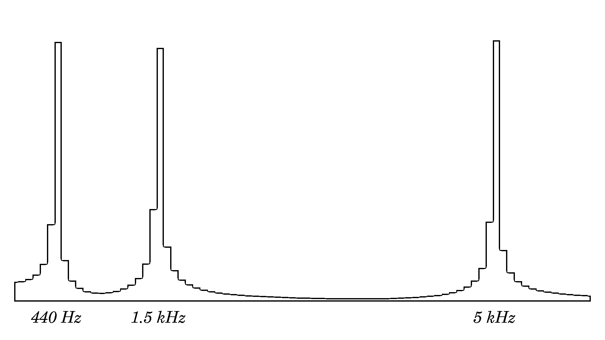](https://files.realpython.com/media/spectrum.3f8057ab8422.png)

<figcaption class="figure-caption text-center">Frequency spectrum plot</figcaption>

请注意，这是一个纯粹的学术示例，因为使用嵌套迭代计算离散傅立叶变换具有*O*(*n*<sup>2</sup>)[的时间复杂度](https://realpython.com/sorting-algorithms-python/#measuring-efficiency-with-big-o-notation)，这使得它在实践中无法使用。对于实际应用，您希望使用最好在 C 库中实现的**快速傅立叶变换(FFT)** 算法，例如 SciPy 中的 [FFT。](https://realpython.com/python-scipy-fft/)

## 结论

在 Python 中使用复数的便利性使它们成为一个非常有趣和实用的工具。你看到了实际上免费实现的二维**向量**，多亏了它们，你才能够分析**声音频率**。复数让你可以优雅地用代码表达**数学公式**，而没有太多样板语法的阻碍。

**在本教程中，您学习了如何:**

*   用 Python 中的**文字**定义复数
*   在**直角**和**极坐标**中表示复数
*   在**算术**表达式中使用复数
*   利用内置的 **`cmath`模块**
*   将**数学公式**直接翻译成 Python 代码

到目前为止，你对 Python 复数有什么体验？你被他们吓倒过吗？你认为他们还会让你解决什么有趣的问题？

您可以单击下面的链接来获得本教程的完整源代码:

**获取示例代码:** [单击此处获取示例代码，您将在本教程中使用](https://realpython.com/bonus/python-complex-numbers-code/)来学习 Python 中的复数。**********