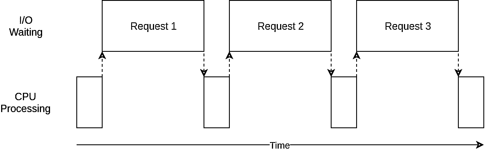
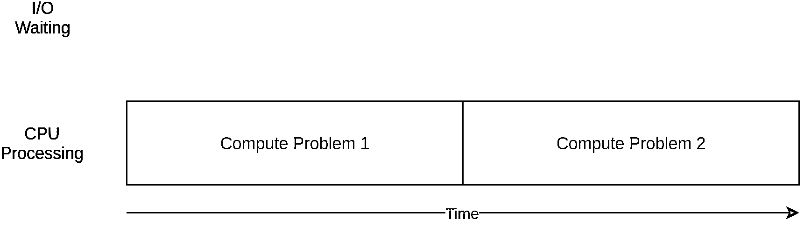
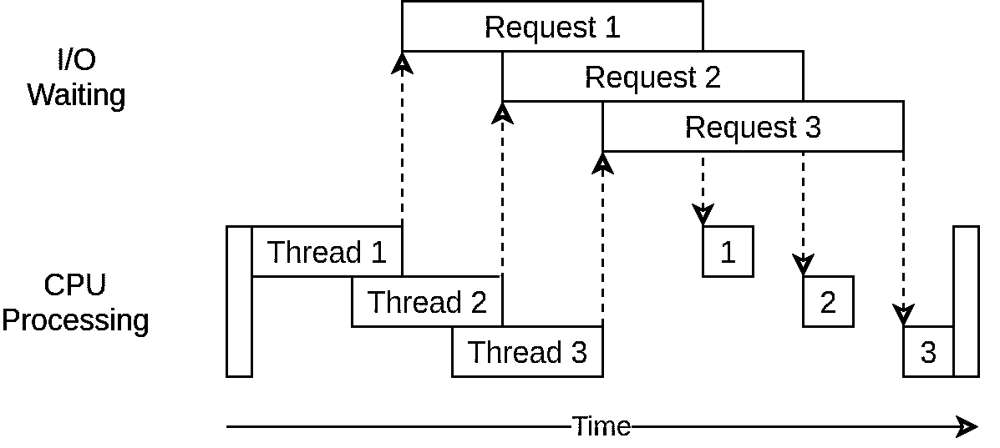
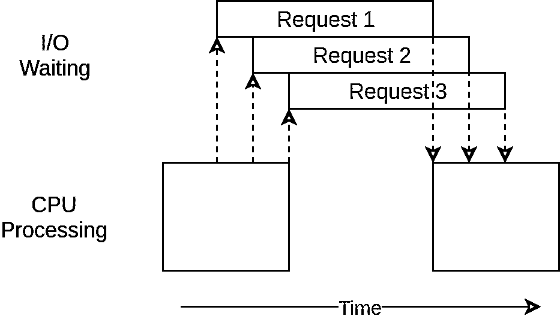
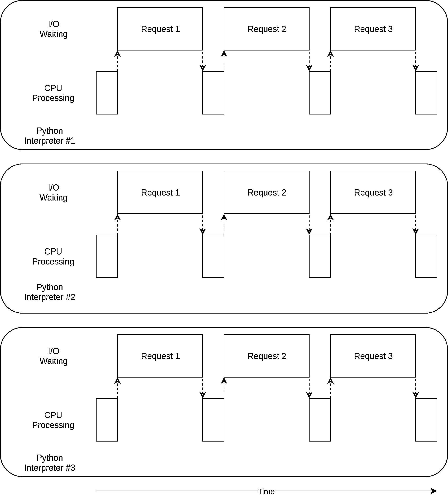
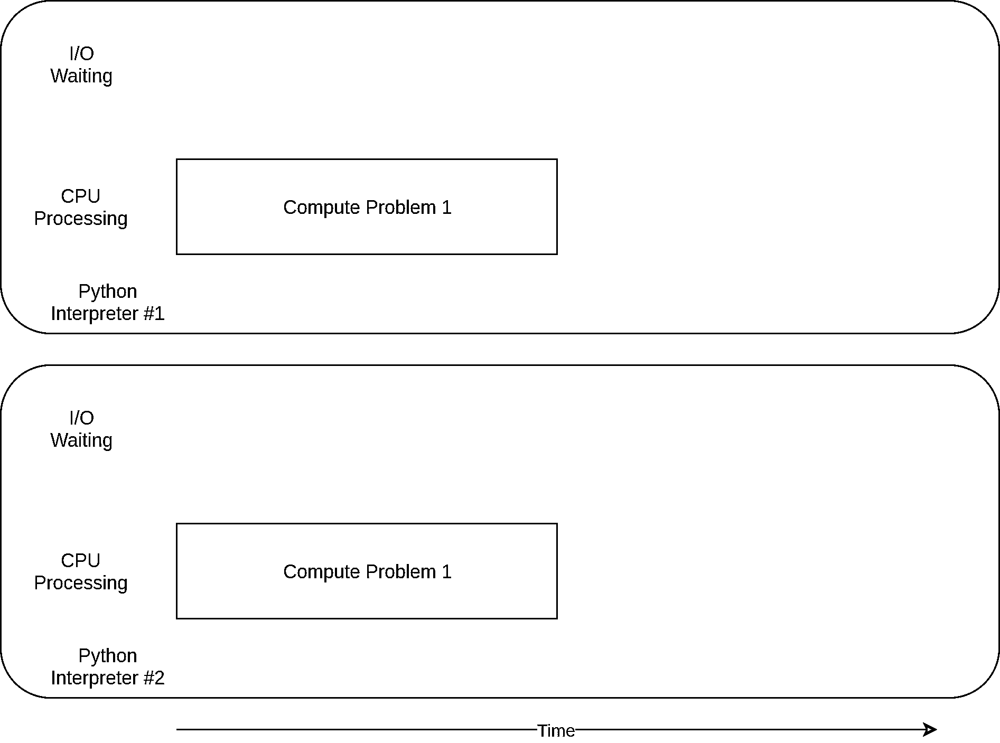

# 通过并发加速您的 Python 程序

> 原文：<https://realpython.com/python-concurrency/>

*立即观看**本教程有真实 Python 团队创建的相关视频课程。和写好的教程一起看，加深理解: [**用并发加速 Python**](/courses/speed-python-concurrency/)

如果你听说过很多关于将`asyncio` [添加到 Python](https://realpython.com/python37-new-features/) 的讨论，但是很好奇它与其他并发方法相比如何，或者想知道什么是并发以及它如何加速你的程序，那么你来对地方了。

在这篇文章中，你将学到以下内容:

*   什么是**并发**
*   什么是平行度
*   如何比较一些 **Python 的并发方法**，包括`threading`、`asyncio`、`multiprocessing`
*   什么时候在你的程序中使用并发以及使用哪个模块

本文假设您对 Python 有基本的了解，并且至少使用 3.6 版本来运行这些示例。你可以从 [*真实 Python* GitHub repo](https://github.com/realpython/materials/tree/master/concurrency-overview) 下载例子。

**免费奖励:** [掌握 Python 的 5 个想法](https://realpython.com/bonus/python-mastery-course/)，这是一个面向 Python 开发者的免费课程，向您展示将 Python 技能提升到下一个水平所需的路线图和心态。

***参加测验:****通过我们的交互式“Python 并发性”测验来测试您的知识。完成后，您将收到一个分数，以便您可以跟踪一段时间内的学习进度:*

*[参加测验](/quizzes/python-concurrency/)

## 什么是并发？

并发的字典定义是同时发生。在 Python 中，同时发生的事情有不同的名称(线程、任务、进程),但在高层次上，它们都指的是按顺序运行的指令序列。

我喜欢把它们看作不同的思路。每一个都可以在特定的点停止，处理它们的 CPU 或大脑可以切换到不同的点。每一个的状态都被保存，这样它就可以在被中断的地方重新启动。

您可能想知道为什么 Python 对同一个概念使用不同的词。原来线程、任务、进程只有从高层次来看才是一样的。一旦你开始挖掘细节，它们都代表着略有不同的东西。随着示例的深入，您将会看到更多的不同之处。

现在我们来谈谈这个定义的同时部分。你必须小心一点，因为当你深入到细节时，只有`multiprocessing`实际上同时运行这些思路。 [`Threading`](https://realpython.com/intro-to-python-threading/) 和`asyncio`都运行在一个处理器上，因此一次只运行一个。他们只是巧妙地想办法轮流加速整个过程。即使它们不同时运行不同的思路，我们仍然称之为并发。

线程或任务轮流的方式是`threading`和`asyncio`的最大区别。在`threading`中，操作系统实际上知道每个线程，并可以随时中断它，开始运行不同的线程。这被称为[抢先多任务](https://en.wikipedia.org/wiki/Preemption_%28computing%29#Preemptive_multitasking)，因为操作系统可以抢先你的线程进行切换。

抢先式多任务处理非常方便，因为线程中的代码不需要做任何事情来进行切换。因为“在任何时候”这个短语，它也可能是困难的。这种切换可能发生在一条 Python 语句的中间，甚至是像`x = x + 1`这样微不足道的语句。

另一方面，`Asyncio`使用[协同多任务](https://en.wikipedia.org/wiki/Cooperative_multitasking)。当任务准备好被切换时，它们必须通过宣布来协作。这意味着任务中的代码必须稍加修改才能实现这一点。

预先做这些额外工作的好处是你总是知道你的任务将在哪里被交换。它不会在 Python 语句中间被换出，除非该语句被标记。稍后您将看到这是如何简化设计的。

[*Remove ads*](/account/join/)

## 什么是并行？

到目前为止，您已经看到了发生在单个处理器上的并发性。你的酷炫新笔记本电脑拥有的所有 CPU 内核呢？你如何利用它们？`multiprocessing`就是答案。

使用`multiprocessing`，Python 创建了新的流程。这里的进程可以被认为是一个几乎完全不同的程序，尽管从技术上来说，它们通常被定义为资源的集合，其中的资源包括内存、文件句柄等等。一种思考方式是，每个进程都在自己的 Python 解释器中运行。

因为它们是不同的进程，所以你在多处理程序中的每一个思路都可以在不同的内核上运行。在不同的内核上运行意味着它们实际上可以同时运行，这太棒了。这样做会产生一些复杂的问题，但是 Python 在大多数情况下做得很好。

现在，您已经了解了什么是并发和并行，让我们回顾一下它们的区别，然后我们可以看看它们为什么有用:

| 并发类型 | 转换决策 | 处理器数量 |
| --- | --- | --- |
| 抢先多任务(`threading`) | 操作系统决定何时切换 Python 外部的任务。 | one |
| 协作多任务(`asyncio`) | 任务决定何时放弃控制权。 | one |
| 多重处理(`multiprocessing`) | 这些进程同时在不同的处理器上运行。 | 许多 |

这些并发类型中的每一种都很有用。让我们来看看它们能帮助你加速哪些类型的程序。

## 并发什么时候有用？

并发性对于两种类型的问题有很大的不同。这些通常被称为 CPU 绑定和 I/O 绑定。

I/O 相关的问题会导致你的程序变慢，因为它经常需要等待来自外部资源的输入/输出。当你的程序处理比你的 CPU 慢得多的东西时，它们经常出现。

比你的 CPU 慢的例子举不胜举，但是谢天谢地你的程序没有和它们中的大部分进行交互。你的程序最常与之交互的是文件系统和网络连接。

让我们看看这是什么样子:

[](https://files.realpython.com/media/IOBound.4810a888b457.png)

在上图中，蓝框表示程序工作的时间，红框表示等待 I/O 操作完成的时间。这个图不是按比例绘制的，因为互联网上的请求可能比 CPU 指令多花几个数量级的时间，所以你的程序可能会花费大部分时间等待。这是你的浏览器大部分时间在做的事情。

另一方面，有些程序可以在不与网络通信或不访问文件的情况下进行大量计算。这些是 CPU 受限的程序，因为限制程序速度的资源是 CPU，而不是网络或文件系统。

下面是一个 CPU 受限程序的相应图表:

[](https://files.realpython.com/media/CPUBound.d2d32cb2626c.png)

通过下一节中的例子，您将看到不同形式的并发在 CPU 受限和 I/O 受限的程序中工作得更好或更差。向程序中添加并发性会增加额外的代码和复杂性，因此您需要决定潜在的加速是否值得付出额外的努力。到本文结束时，您应该有足够的信息来开始做决定。

这里有一个简短的总结来阐明这个概念:

| 输入输出绑定进程 | CPU 限制的进程 |
| --- | --- |
| 你的程序大部分时间都在和一个慢速设备对话，比如网络连接，硬盘，或者打印机。 | 你的程序大部分时间都在做 CPU 操作。 |
| 加速包括重叠等待这些设备的时间。 | 加快速度需要找到在相同时间内完成更多计算的方法。 |

您将首先看到 I/O 绑定的程序。然后，您将看到一些处理 CPU 受限程序的代码。

[*Remove ads*](/account/join/)

## 如何加速一个 I/O 绑定的程序

让我们首先关注 I/O 绑定程序和一个常见问题:通过网络下载内容。对于我们的例子，您将从几个站点下载网页，但它实际上可能是任何网络流量。它只是更容易可视化和设置网页。

### 同步版本

我们将从这个任务的非并发版本开始。注意，这个程序需要 [`requests`](http://docs.python-requests.org/en/master/) 模块。你应该在运行它之前运行`pip install requests`，可能使用一个[虚拟器](https://realpython.com/python-virtual-environments-a-primer/)。这个版本根本不使用并发:

```py
import requests
import time

def download_site(url, session):
    with session.get(url) as response:
        print(f"Read {len(response.content)} from {url}")

def download_all_sites(sites):
    with requests.Session() as session:
        for url in sites:
            download_site(url, session)

if __name__ == "__main__":
    sites = [
        "https://www.jython.org",
        "http://olympus.realpython.org/dice",
    ] * 80
    start_time = time.time()
    download_all_sites(sites)
    duration = time.time() - start_time
    print(f"Downloaded {len(sites)} in {duration} seconds")
```

如你所见，这是一个相当短的程序。从 URL 下载内容并打印尺寸。需要指出的一件小事是，我们使用了来自`requests`的 [`Session`](https://2.python-requests.org/en/master/user/advanced/#id1) 对象。

可以简单地直接使用来自`requests`的`get()`，但是创建一个`Session`对象允许`requests`做一些奇特的网络技巧并真正加速。

`download_all_sites()`创建`Session`然后遍历[列表](https://realpython.com/python-lists-tuples/)中的站点，依次下载每个站点。最后，它打印出这个过程花了多长时间，这样您就可以满意地看到在下面的例子中并发性给我们带来了多大的帮助。

这个程序的处理图看起来很像上一节中的 I/O 绑定图。

**注意:**网络流量取决于多种因素，这些因素可能会因时而异。我看到由于网络问题，这些测试的次数从一次运行到另一次运行增加了一倍。

**为什么同步版摇滚**

这个版本的代码的伟大之处在于，它很简单。它相对容易编写和调试。考虑起来也更直截了当。只有一个思路贯穿其中，所以你可以预测下一步是什么，它会如何表现。

**同步版本的问题**

这里的大问题是，与我们将提供的其他解决方案相比，它相对较慢。下面是我的机器上最终输出的一个例子:

```py
$ ./io_non_concurrent.py
 [most output skipped]
Downloaded 160 in 14.289619207382202 seconds
```

**注意:**您的结果可能会有很大差异。运行这个脚本时，我看到时间从 14.2 秒到 21.9 秒不等。对于本文，我选择了三次跑步中最快的一次作为时间。这些方法之间的差异仍然很明显。

然而，速度慢并不总是一个大问题。如果您正在运行的程序在同步版本中只需要 2 秒钟，并且很少运行，那么可能不值得添加并发性。你可以停在这里。

如果你的程序经常运行怎么办？如果要跑几个小时呢？让我们通过使用`threading`重写这个程序来讨论并发性。

### `threading`版本

正如你可能猜到的，编写一个线程化的程序需要更多的努力。然而，对于简单的情况，您可能会惊讶地发现几乎不需要额外的努力。下面是使用`threading`的相同程序的样子:

```py
import concurrent.futures
import requests
import threading
import time

thread_local = threading.local()

def get_session():
    if not hasattr(thread_local, "session"):
        thread_local.session = requests.Session()
    return thread_local.session

def download_site(url):
    session = get_session()
    with session.get(url) as response:
        print(f"Read {len(response.content)} from {url}")

def download_all_sites(sites):
    with concurrent.futures.ThreadPoolExecutor(max_workers=5) as executor:
        executor.map(download_site, sites)

if __name__ == "__main__":
    sites = [
        "https://www.jython.org",
        "http://olympus.realpython.org/dice",
    ] * 80
    start_time = time.time()
    download_all_sites(sites)
    duration = time.time() - start_time
    print(f"Downloaded {len(sites)} in {duration} seconds")
```

当你添加`threading`时，整体结构是一样的，你只需要做一些改变。`download_all_sites()`从每个站点调用一次函数变成了更复杂的结构。

在这个版本中，您正在创建一个`ThreadPoolExecutor`，这似乎是一件复杂的事情。让我们来分解一下:`ThreadPoolExecutor` = `Thread` + `Pool` + `Executor`。

你已经知道了`Thread`部分。那只是我们之前提到的一个思路。`Pool`部分是开始变得有趣的地方。这个对象将创建一个线程池，每个线程都可以并发运行。最后，`Executor`是控制池中每个线程如何以及何时运行的部分。它将在池中执行请求。

有益的是，标准库将`ThreadPoolExecutor`实现为上下文管理器，因此您可以使用`with`语法来管理`Threads`池的创建和释放。

一旦你有了一个`ThreadPoolExecutor`，你就可以使用它方便的`.map()`方法。该方法在列表中的每个站点上运行传入的函数。最重要的是，它使用自己管理的线程池自动并发运行它们。

那些来自其他语言，甚至 Python 2 的人，可能想知道在处理`threading`、`Thread.start()`、`Thread.join()`和`Queue`时，管理您习惯的细节的常用对象和函数在哪里。

这些仍然存在，您可以使用它们来实现对线程运行方式的细粒度控制。但是，从 Python 3.2 开始，标准库增加了一个名为`Executors`的高级抽象，如果您不需要这种细粒度的控制，它可以为您管理许多细节。

我们示例中另一个有趣的变化是每个线程都需要创建自己的`requests.Session()`对象。当你在看`requests`的文档时，不一定容易分辨，但是阅读[这一期](https://github.com/requests/requests/issues/2766)，似乎很清楚你需要为每个线程建立一个单独的会话。

这是关于`threading`的有趣且困难的问题之一。因为操作系统控制着您的任务何时被中断以及另一个任务何时开始，所以线程之间共享的任何数据都需要受到保护，或者说是线程安全的。不幸的是`requests.Session()`不是线程安全的。

根据数据是什么以及如何使用数据，有几种策略可以使数据访问线程安全。其中之一是使用线程安全的数据结构，比如 Python 的`queue`模块中的`Queue`。

这些对象使用像 [`threading.Lock`](https://docs.python.org/2/library/threading.html#lock-objects) 这样的低级原语来确保同一时间只有一个线程可以访问一块代码或一点内存。您通过`ThreadPoolExecutor`对象间接地使用了这个策略。

这里使用的另一个策略是线程本地存储。创建一个看起来像全局的对象，但却是特定于每个线程的。在您的示例中，这是通过`thread_local`和`get_session()`完成的:

```py
thread_local = threading.local()

def get_session():
    if not hasattr(thread_local, "session"):
        thread_local.session = requests.Session()
    return thread_local.session
```

`local()`是在`threading`模块中专门解决这个问题的。这看起来有点奇怪，但是您只想创建这些对象中的一个，而不是为每个线程创建一个。对象本身负责分离不同线程对不同数据的访问。

当调用`get_session()`时，它查找的`session`是特定于它运行的特定线程的。所以每个线程在第一次调用`get_session()`时都会创建一个会话，然后在整个生命周期中的每个后续调用中都会使用这个会话。

最后，关于选择线程数量的一个简短说明。您可以看到示例代码使用了 5 个线程。你可以随意摆弄这个数字，看看总的时间是如何变化的。您可能认为每次下载一个线程是最快的，但至少在我的系统上不是这样。我发现最快的结果出现在 5 到 10 个线程之间。如果超过这个值，那么创建和销毁线程的额外开销会抵消所有节省的时间。

这里很难回答的一个问题是，线程的正确数量对于不同的任务来说并不是一个常数。需要做一些实验。

**为什么`threading`版摇滚**

好快啊！这是我最快的一次测试。请记住，非并发版本耗时超过 14 秒:

```py
$ ./io_threading.py
 [most output skipped]
Downloaded 160 in 3.7238826751708984 seconds
```

下面是它的执行时序图:

[](https://files.realpython.com/media/Threading.3eef48da829e.png)

它使用多线程同时向网站发出多个打开的请求，允许您的程序重叠等待时间并更快地获得最终结果！耶！这就是目标。

**版本`threading`的问题**

正如你从例子中看到的，这需要更多的代码来实现，你真的需要考虑一下线程之间共享什么数据。

线程可以以微妙且难以察觉的方式进行交互。这些交互会导致竞争条件，这种竞争条件经常会导致难以发现的随机的、间歇性的错误。那些不熟悉竞争条件概念的人可能想扩展阅读下面的部分。


竞争条件是一整类微妙的错误，在多线程代码中可能并且经常发生。竞争情况的发生是因为程序员没有充分保护数据访问，以防止线程相互干扰。在编写线程代码时，您需要采取额外的步骤来确保事情是线程安全的。

这里发生的事情是操作系统控制你的线程何时运行，何时被换出让另一个线程运行。这种线程交换可以在任何时候发生，甚至在执行 Python 语句的子步骤时。举个简单的例子，看看这个函数:

```py
import concurrent.futures

counter = 0

def increment_counter(fake_value):
    global counter
    for _ in range(100):
        counter += 1

if __name__ == "__main__":
    fake_data = [x for x in range(5000)]
    counter = 0
    with concurrent.futures.ThreadPoolExecutor(max_workers=5000) as executor:
        executor.map(increment_counter, fake_data)
```

这段代码与您在上面的`threading`示例中使用的结构非常相似。不同之处在于，每个线程都在访问同一个全局[变量](https://realpython.com/python-variables/) `counter`并递增它。`Counter`没有受到任何保护，所以它不是线程安全的。

为了增加`counter`，每个线程需要读取当前值，给它加 1，然后将该值保存回变量。发生在这一行:`counter += 1`。

因为操作系统对您的代码一无所知，并且可以在执行的任何时候交换线程，所以这种交换可能发生在线程读取值之后，但在它有机会写回值之前。如果正在运行的新代码也修改了`counter`,那么第一个线程就有了数据的旧拷贝，问题就会随之而来。

可以想象，碰到这种情况是相当罕见的。你可以运行这个程序成千上万次，永远看不到问题。这就是为什么这种类型的问题很难调试，因为它可能很难重现，并可能导致随机出现的错误。

作为进一步的例子，我想提醒你`requests.Session()`不是线程安全的。这意味着，如果多个线程使用同一个`Session`，在某些地方可能会发生上述类型的交互。我提出这个问题并不是要诽谤`requests`，而是要指出这些问题很难解决。

[*Remove ads*](/account/join/)

### `asyncio`版本

在您开始研究`asyncio`示例代码之前，让我们更多地讨论一下`asyncio`是如何工作的。

**`asyncio`基础知识**

这将是`asyncio`的简化版。这里忽略了许多细节，但它仍然传达了其工作原理。

`asyncio`的一般概念是，一个称为事件循环的 Python 对象控制每个任务如何以及何时运行。事件循环知道每个任务，并且知道它处于什么状态。实际上，任务可能处于许多状态，但现在让我们想象一个只有两种状态的简化事件循环。

就绪状态将指示任务有工作要做并准备好运行，等待状态意味着任务正在等待一些外部事情完成，例如网络操作。

简化的事件循环维护两个任务列表，每个列表对应一种状态。它选择一个就绪任务，并让它重新开始运行。该任务处于完全控制中，直到它合作地将控制权交还给事件循环。

当正在运行的任务将控制权交还给事件循环时，事件循环会将该任务放入就绪或等待列表中，然后遍历等待列表中的每个任务，以查看它是否在 I/O 操作完成时已就绪。它知道就绪列表中的任务仍然是就绪的，因为它知道它们还没有运行。

一旦所有的任务都被重新排序到正确的列表中，事件循环就会选择下一个要运行的任务，并重复这个过程。简化的事件循环挑选等待时间最长的任务并运行它。这个过程重复进行，直到事件循环结束。

`asyncio`很重要的一点是，任务永远不会放弃控制，除非有意这样做。他们从不在行动中被打断。这使得我们在`asyncio`比在`threading`更容易共享资源。您不必担心使您的代码线程安全。

这是对正在发生的`asyncio`的高级视图。如果你想要更多的细节，这个 StackOverflow 答案提供了一些很好的细节，如果你想深入挖掘的话。

**`async`和`await`**

现在来说说 Python 中新增的两个[关键词](https://realpython.com/python-keywords/):`async`和`await`。根据上面的讨论，您可以将`await`视为允许任务将控制权交还给事件循环的魔法。当您的代码等待函数调用时，这是一个信号，表明调用可能需要一段时间，任务应该放弃控制。

最简单的方法是将`async`看作 Python 的一个标志，告诉它将要定义的函数使用了`await`。在某些情况下，这并不完全正确，比如[异步发电机](https://www.python.org/dev/peps/pep-0525/)，但它适用于许多情况，并在您开始时为您提供一个简单的模型。

您将在下一段代码中看到的一个例外是`async with`语句，它从您通常等待的对象创建一个上下文管理器。虽然语义略有不同，但想法是一样的:将这个上下文管理器标记为可以被换出的东西。

我相信您可以想象，管理事件循环和任务之间的交互是很复杂的。对于从`asyncio`开始的开发者来说，这些细节并不重要，但是你需要记住任何调用`await`的函数都需要用`async`来标记。否则会出现语法错误。

**回码**

现在你已经对什么是`asyncio`有了一个基本的了解，让我们浏览一下示例代码的`asyncio`版本，并弄清楚它是如何工作的。注意这个版本增加了 [`aiohttp`](https://aiohttp.readthedocs.io/en/stable/) 。您应该在运行之前运行`pip install aiohttp`:

```py
import asyncio
import time
import aiohttp

async def download_site(session, url):
    async with session.get(url) as response:
        print("Read {0} from {1}".format(response.content_length, url))

async def download_all_sites(sites):
    async with aiohttp.ClientSession() as session:
        tasks = []
        for url in sites:
            task = asyncio.ensure_future(download_site(session, url))
            tasks.append(task)
        await asyncio.gather(*tasks, return_exceptions=True)

if __name__ == "__main__":
    sites = [
        "https://www.jython.org",
        "http://olympus.realpython.org/dice",
    ] * 80
    start_time = time.time()
    asyncio.get_event_loop().run_until_complete(download_all_sites(sites))
    duration = time.time() - start_time
    print(f"Downloaded {len(sites)} sites in {duration} seconds")
```

这个版本比前两个版本稍微复杂一点。它有相似的结构，但是设置任务比创建`ThreadPoolExecutor`要多一点工作。让我们从示例的顶部开始。

**T2`download_site()`**

除了函数定义行上的`async`关键字和实际调用`session.get()`时的`async with`关键字之外，顶部的`download_site()`几乎与`threading`版本相同。稍后您将看到为什么`Session`可以在这里传递，而不是使用线程本地存储。

**T2`download_all_sites()`**

`download_all_sites()`是与`threading`示例相比最大的变化。

您可以在所有任务之间共享该会话，因此该会话在这里被创建为上下文管理器。这些任务可以共享会话，因为它们都运行在同一个线程上。当会话处于不良状态时，一个任务不可能中断另一个任务。

在上下文管理器中，它使用`asyncio.ensure_future()`创建了一个任务列表，并负责启动它们。一旦创建了所有的任务，这个函数就使用`asyncio.gather()`来保持会话上下文活动，直到所有的任务都完成。

`threading`代码做了一些类似的事情，但是细节在`ThreadPoolExecutor`中可以方便地处理。目前还没有一个`AsyncioPoolExecutor`类。

然而，这里的细节隐藏了一个微小但重要的变化。还记得我们如何讨论要创建的线程数量吗？在`threading`的例子中，线程的最佳数量并不明显。

`asyncio`的一个很酷的优势是它的伸缩性比`threading`好得多。与线程相比，创建每个任务需要的资源和时间要少得多，因此创建和运行更多的任务效果会更好。这个例子只是为每个站点创建了一个单独的下载任务，这样做效果很好。

**T2`__main__`**

最后，`asyncio`的性质意味着您必须启动事件循环并告诉它运行哪些任务。文件底部的`__main__`部分包含了`get_event_loop()`和`run_until_complete()`的代码。如果不说别的，他们在命名这些函数方面做得非常好。

如果你已经升级到了 [Python 3.7](https://realpython.com/python37-new-features/) ，Python 核心开发者为你简化了这个语法。你可以用`asyncio.run()`代替`asyncio.get_event_loop().run_until_complete()`绕口令。

**为什么`asyncio`版摇滚**

真的很快！在我的机器上进行的测试中，这是最快的代码版本，远远超过其他版本:

```py
$ ./io_asyncio.py
 [most output skipped]
Downloaded 160 in 2.5727896690368652 seconds
```

执行时序图看起来与`threading`示例中发生的事情非常相似。只是 I/O 请求都是由同一个线程完成的:

[](https://files.realpython.com/media/Asyncio.31182d3731cf.png)

缺少像`ThreadPoolExecutor`这样的包装器使得这段代码比`threading`的例子要复杂一些。在这种情况下，您必须做一些额外的工作才能获得更好的性能。

还有一个常见的论点是，必须在适当的位置添加`async`和`await`会增加额外的复杂性。在某种程度上，这是真的。这个论点的另一面是，它迫使你去思考一个给定的任务什么时候会被交换出去，这可以帮助你创造一个更好、更快的设计。

缩放问题在这里也很突出。用一个线程为每个站点运行上面的`threading`例子明显比用少量线程运行慢。运行有数百个任务的`asyncio`示例丝毫没有降低它的速度。

**版本`asyncio`的问题**

在这一点上,`asyncio`有几个问题。你需要特殊的[异步](https://realpython.com/python-async-features/)版本的库来获得`asyncio`的全部优势。如果你只是使用`requests`来下载网站，它会慢得多，因为`requests`不是用来通知事件循环它被阻止的。随着时间的推移，这个问题越来越小，越来越多的图书馆接受了`asyncio`。

另一个更微妙的问题是，如果其中一个任务不合作，合作多任务的所有优势都会被抛弃。代码中的一个小错误会导致一个任务停止运行，并长时间占用处理器，使其他需要运行的任务无法运行。如果任务不将控制权交还给它，事件循环就无法中断。

考虑到这一点，让我们采用一种完全不同的方法来实现并发性。

[*Remove ads*](/account/join/)

### `multiprocessing`版本

与之前的方法不同，`multiprocessing`版本的代码充分利用了您的新电脑拥有的多个 CPU。或者，在我的情况下，我的笨重，旧笔记本电脑。让我们从代码开始:

```py
import requests
import multiprocessing
import time

session = None

def set_global_session():
    global session
    if not session:
        session = requests.Session()

def download_site(url):
    with session.get(url) as response:
        name = multiprocessing.current_process().name
        print(f"{name}:Read {len(response.content)} from {url}")

def download_all_sites(sites):
    with multiprocessing.Pool(initializer=set_global_session) as pool:
        pool.map(download_site, sites)

if __name__ == "__main__":
    sites = [
        "https://www.jython.org",
        "http://olympus.realpython.org/dice",
    ] * 80
    start_time = time.time()
    download_all_sites(sites)
    duration = time.time() - start_time
    print(f"Downloaded {len(sites)} in {duration} seconds")
```

这比`asyncio`的例子短得多，实际上看起来与`threading`的例子非常相似，但是在我们深入研究代码之前，让我们快速浏览一下`multiprocessing`为您做了什么。

**`multiprocessing`总而言之**

到目前为止，本文中的所有并发示例都只在计算机的单个 CPU 或内核上运行。其原因与 CPython 当前的设计和一种叫做全局解释器锁(或 GIL)的东西有关。

这篇文章不会深入到 [GIL](https://realpython.com/python-gil/) 的方式和原因。现在知道这个例子的同步、`threading`和`asyncio`版本都运行在单个 CPU 上就足够了。

标准库中的旨在打破这一障碍，并在多个 CPU 上运行您的代码。在高层次上，它通过创建一个新的 Python 解释器实例来运行在每个 CPU 上，然后将程序的一部分移植到它上面来运行。

可以想象，启动一个单独的 Python 解释器不如在当前的 Python 解释器中启动一个新线程快。这是一个重量级的操作，并带有一些限制和困难，但对于正确的问题，它可以产生巨大的差异。

**`multiprocessing`代号**

代码与我们的同步版本相比有一些小的变化。第一个在`download_all_sites()`里。它不是简单地重复调用`download_site()`，而是创建一个`multiprocessing.Pool`对象，并让它将`download_site`映射到可迭代的`sites`。从`threading`示例来看，这应该很熟悉。

这里发生的是,`Pool`创建了许多独立的 Python 解释器进程，并让每个进程对 iterable 中的一些项目运行指定的函数，在我们的例子中，iterable 是站点列表。主进程和其他进程之间的通信由`multiprocessing`模块为您处理。

创建`Pool`的行值得你关注。首先，它没有指定在`Pool`中创建多少个流程，尽管这是一个可选参数。默认情况下，`multiprocessing.Pool()`会决定你电脑中的 CPU 数量并与之匹配。这通常是最好的答案，对我们来说也是如此。

对于这个问题，增加流程的数量并没有让事情变得更快。它实际上减慢了速度，因为设置和拆除所有这些进程的成本大于并行执行 I/O 请求的好处。

接下来是通话的`initializer=set_global_session`部分。记住我们的`Pool`中的每个进程都有自己的内存空间。这意味着他们不能共享像`Session`对象这样的东西。您不希望每次调用函数时都创建一个新的`Session`，而是希望为每个进程创建一个。

`initializer`功能参数就是为这种情况建立的。没有办法将返回值从`initializer`传递回进程`download_site()`调用的函数，但是您可以初始化一个全局`session`变量来保存每个进程的单个会话。因为每个进程都有自己的内存空间，所以每个进程的全局内存空间都是不同的。

这就是事情的全部。代码的其余部分与您之前看到的非常相似。

**为什么`multiprocessing`版摇滚**

这个例子的`multiprocessing`版本很棒，因为它相对容易设置，只需要很少的额外代码。它还充分利用了计算机的 CPU 能力。这段代码的执行时序图如下所示:

[](https://files.realpython.com/media/MProc.7cf3be371bbc.png)

**版本`multiprocessing`的问题**

这个版本的例子确实需要一些额外的设置，而且全局`session`对象很奇怪。你必须花一些时间考虑在每个进程中哪些变量将被访问。

最后，它显然比本例中的`asyncio`和`threading`版本慢:

```py
$ ./io_mp.py
 [most output skipped]
Downloaded 160 in 5.718175172805786 seconds
```

这并不奇怪，因为 I/O 绑定问题并不是`multiprocessing`存在的真正原因。当您进入下一节并查看 CPU 相关的示例时，您将会看到更多内容。

[*Remove ads*](/account/join/)

## 如何加速一个 CPU 受限的程序

让我们稍微改变一下思路。到目前为止，这些例子都处理了一个 I/O 绑定的问题。现在，您将研究一个 CPU 相关的问题。正如您所看到的，一个 I/O 绑定的问题大部分时间都在等待外部操作(如网络调用)的完成。另一方面，与 CPU 相关的问题很少进行 I/O 操作，它的总执行时间是它处理所需数据速度的一个因素。

出于我们示例的目的，我们将使用一个有点傻的函数来创建一些需要在 CPU 上运行很长时间的东西。此函数计算从 0 到传入值的每个数字的平方和:

```py
def cpu_bound(number):
    return sum(i * i for i in range(number))
```

您将传入大量的[数字](https://realpython.com/python-numbers/)，所以这将需要一段时间。请记住，这只是你的代码的占位符，它实际上做了一些有用的事情，需要大量的处理时间，比如计算方程的根或者对大型数据结构进行[排序](https://realpython.com/sorting-algorithms-python/)。

### CPU 绑定的同步版本

现在让我们来看看这个例子的非并发版本:

```py
import time

def cpu_bound(number):
    return sum(i * i for i in range(number))

def find_sums(numbers):
    for number in numbers:
        cpu_bound(number)

if __name__ == "__main__":
    numbers = [5_000_000 + x for x in range(20)]

    start_time = time.time()
    find_sums(numbers)
    duration = time.time() - start_time
    print(f"Duration {duration} seconds")
```

这段代码调用`cpu_bound()` 20 次，每次都使用不同的大数。它在单个 CPU 上的单个进程中的单个线程上完成所有这些工作。执行时序图如下所示:

[](https://files.realpython.com/media/CPUBound.d2d32cb2626c.png)

与 I/O 相关的示例不同，CPU 相关的示例通常在运行时相当一致。在我的机器上，这个大约需要 7.8 秒:

```py
$ ./cpu_non_concurrent.py
Duration 7.834432125091553 seconds
```

显然我们可以做得更好。这一切都在一个 CPU 上运行，没有并发性。让我们看看我们能做些什么来使它变得更好。

### `threading`和`asyncio`版本

你认为使用`threading`或`asyncio`重写这段代码会提高多少速度？

如果你回答“一点也不”，给自己一块饼干。如果你回答“它会让你慢下来”，给自己两块饼干。

原因如下:在上面的 I/O 绑定示例中，总时间的大部分都花在了等待缓慢的操作完成上。`threading`和`asyncio`通过让你的等待时间重叠来加快速度，而不是按顺序进行。

然而，在 CPU 受限的问题上，没有等待。中央处理器正在尽可能快地处理这个问题。在 Python 中，线程和任务都在同一个进程的同一个 CPU 上运行。这意味着一个 CPU 负责非并发代码的所有工作，外加设置线程或任务的额外工作。需要超过 10 秒钟:

```py
$ ./cpu_threading.py
Duration 10.407078266143799 seconds
```

我已经写了这段代码的一个`threading`版本，并把它和其他示例代码一起放在了 [GitHub repo](https://github.com/realpython/materials/tree/master/concurrency-overview) 中，这样你就可以自己去测试了。不过，我们先不要看这个。

[*Remove ads*](/account/join/)

### 受 CPU 限制的`multiprocessing`版本

现在你终于到达了`multiprocessing`真正闪耀的地方。与其他并发库不同，`multiprocessing`被明确设计为在多个 CPU 之间共享繁重的 CPU 工作负载。下面是它的执行时序图:

[](https://files.realpython.com/media/CPUMP.69c1a7fad9c4.png)

下面是代码的样子:

```py
import multiprocessing
import time

def cpu_bound(number):
    return sum(i * i for i in range(number))

def find_sums(numbers):
    with multiprocessing.Pool() as pool:
        pool.map(cpu_bound, numbers)

if __name__ == "__main__":
    numbers = [5_000_000 + x for x in range(20)]

    start_time = time.time()
    find_sums(numbers)
    duration = time.time() - start_time
    print(f"Duration {duration} seconds")
```

非并发版本的代码几乎没有什么变化。你不得不`import multiprocessing`然后从循环遍历数字变成创建一个`multiprocessing.Pool`对象，并使用它的`.map()`方法在工人进程空闲时向它们发送单独的数字。

这正是你对 I/O 绑定的`multiprocessing`代码所做的，但是这里你不需要担心`Session`对象。

如上所述，`multiprocessing.Pool()`构造函数的`processes`可选参数值得注意。您可以指定想要在`Pool`中创建和管理多少个`Process`对象。默认情况下，它将确定您的机器中有多少个 CPU，并为每个 CPU 创建一个进程。虽然这对于我们的简单示例来说非常有用，但是您可能希望在生产环境中有更多的控制。

此外，正如我们在第一部分提到的`threading`,`multiprocessing.Pool`代码是建立在像`Queue`和`Semaphore`这样的构建模块之上的，这对于那些用其他语言编写过多线程和多处理代码的人来说是很熟悉的。

**为什么`multiprocessing`版摇滚**

这个例子的`multiprocessing`版本很棒，因为它相对容易设置，只需要很少的额外代码。它还充分利用了计算机的 CPU 能力。

哎，上次我们看`multiprocessing`的时候我也是这么说的。最大的不同在于，这一次它显然是最佳选择。在我的机器上需要 2.5 秒:

```py
$ ./cpu_mp.py
Duration 2.5175397396087646 seconds
```

这比我们看到的其他选项要好得多。

**版本`multiprocessing`的问题**

使用`multiprocessing`有一些缺点。在这个简单的例子中，它们并没有真正显示出来，但是将您的问题分解开来，使每个处理器都可以独立工作，有时会很困难。

此外，许多解决方案需要进程间更多的通信。这会给你的解决方案增加一些非并发程序不需要处理的复杂性。

## 何时使用并发

您已经讨论了很多内容，所以让我们回顾一些关键的想法，然后讨论一些决策点，这些决策点将帮助您确定您希望在项目中使用哪个并发模块(如果有的话)。

这个过程的第一步是决定你是否应该使用并发模块。虽然这里的例子使每个库看起来都很简单，但是并发总是带来额外的复杂性，并且经常会导致难以发现的错误。

坚持添加并发性，直到您发现一个已知的性能问题，然后*再*决定您需要哪种类型的并发性。正如 [Donald Knuth](https://en.wikipedia.org/wiki/Donald_Knuth) 所说，“过早优化是编程中所有罪恶(或者至少是大部分罪恶)的根源。”

一旦你决定你应该优化你的程序，弄清楚你的程序是受 CPU 限制的还是受 I/O 限制的是一个很好的下一步。请记住，I/O 绑定的程序是那些花费大部分时间等待事情发生的程序，而 CPU 绑定的程序花费时间尽可能快地处理数据或计算数字。

如您所见，CPU 限制的问题只有通过使用`multiprocessing`才能真正解决。`threading`和`asyncio`对这类问题一点帮助都没有。

对于 I/O 相关的问题，Python 社区有一条通用的经验法则:“尽可能使用`asyncio`，必要时使用`threading`”`asyncio`可以为这种类型的程序提供最好的速度，但有时你会需要尚未移植的关键库来利用`asyncio`。请记住，任何没有放弃对事件循环的控制的任务都会阻塞所有其他任务。

[*Remove ads*](/account/join/)

## 结论

现在，您已经看到了 Python 中可用的基本并发类型:

*   `threading`
*   `asyncio`
*   `multiprocessing`

您已经理解了决定对于给定的问题应该使用哪种并发方法，或者是否应该使用任何一种并发方法！此外，您对使用并发时可能出现的一些问题有了更好的理解。

我希望您从这篇文章中学到了很多，并且在您自己的项目中发现了并发的巨大用途！请务必参加下面链接的“Python 并发性”测验，检查您的学习情况:

***参加测验:****通过我们的交互式“Python 并发性”测验来测试您的知识。完成后，您将收到一个分数，以便您可以跟踪一段时间内的学习进度:*

*[参加测验](/quizzes/python-concurrency/)

*立即观看**本教程有真实 Python 团队创建的相关视频课程。和写好的教程一起看，加深理解: [**用并发加速 Python**](/courses/speed-python-concurrency/)***********