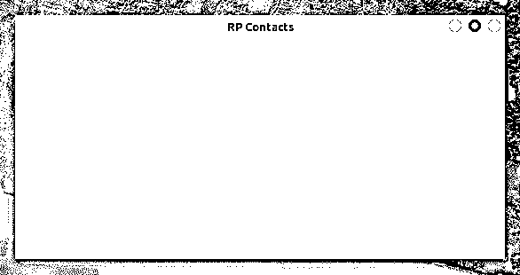
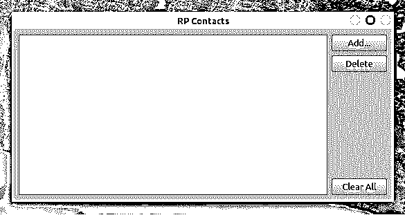
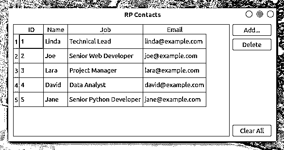
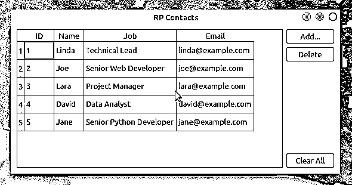
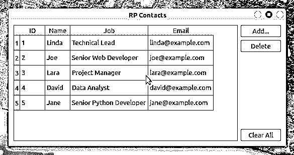
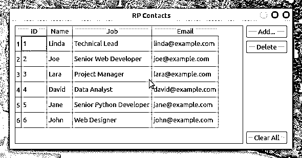
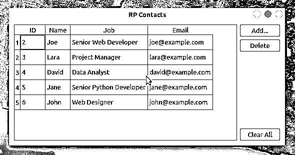

# 用 Python、PyQt 和 SQLite 构建联系簿

> 原文：<https://realpython.com/python-contact-book/>

构建[项目](https://realpython.com/intermediate-python-project-ideas/)可以说是学习编程的更容易接近和有效的方法之一。真正的项目需要你运用不同的编码技巧。他们还鼓励你研究在开发过程中解决问题时出现的主题。在本教程中，您将使用 Python、PyQt 和 SQLite 创建一个通讯录应用程序。

**在本教程中，您将学习如何:**

*   使用 Python 和 PyQt 为您的通讯录应用程序创建一个**图形用户界面(GUI)**
*   使用 **PyQt 的 SQL 支持**将应用程序连接到 **SQLite 数据库**
*   使用 **PyQt 的模型视图架构**管理联系人数据

在这个项目结束时，你将有一个功能的通讯录应用程序，允许你存储和管理你的联系信息。

要获得该应用程序的完整源代码以及本教程中每个步骤的代码，请单击下面的链接:

**获取源代码:** [单击此处获取源代码，您将在本教程中使用](https://realpython.com/bonus/python-contact-book-code/)用 Python、PyQt 和 SQLite 构建通讯录。

## 演示:用 Python 编写的通讯录

通讯录是一种有用且广泛使用的应用程序。他们无处不在。你的手机和电脑上可能有一本通讯录。使用通讯录，您可以存储和管理家庭成员、朋友、同事等的联系信息。

在本教程中，您将使用 Python、 [SQLite](https://www.sqlite.org/about.html) 和 [PyQt](https://www.riverbankcomputing.com/static/Docs/PyQt5/) 编写一个通讯录 GUI 应用程序。这是一个演示，演示了按照本教程中的步骤操作后，通讯录的外观和工作方式:

[https://player.vimeo.com/video/500503701?background=1](https://player.vimeo.com/video/500503701?background=1)

您的通讯录将为此类应用程序提供所需的最少功能。您可以显示、创建、更新和删除联系人列表中的信息。

[*Remove ads*](/account/join/)

## 项目概述

要构建您的通讯录应用程序，您需要将代码组织成模块和包，并为您的项目提供一致的结构。在本教程中，您将使用以下目录和文件结构:

```py
rpcontacts_project/
│
├── rpcontacts/
│   ├── __init__.py
│   ├── views.py
│   ├── database.py
│   ├── main.py
│   └── model.py
│
├── requirements.txt
├── README.md
└── rpcontacts.py
```

以下是项目目录内容的简要总结:

*   **`rpcontacts_project/`** 是项目的根目录。它将包含以下文件:
    *   **`requirements.txt`** 提供了该项目的需求列表。
    *   **`README.md`** 提供项目的一般信息。
    *   **`rpcontacts.py`** 提供了运行应用程序的入口点脚本。
*   **`rpcontacts/`** 是提供应用主包的子目录。它提供了以下模块:
    *   `__init__.py`
    *   `views.py`
    *   `database.py`
    *   `main.py`
    *   `model.py`

在本教程中，您将一步一步地介绍这些文件。每个文件的名称表明了它在应用程序中的作用。例如，`views.py`将包含生成窗口和对话框 GUI 的代码，`database.py`将包含处理数据库的代码，`main.py`将托管应用程序本身。最后，`model.py`将实现模型来管理应用程序数据库中的数据。

一般来说，应用程序会有一个主窗口来显示、添加、删除和更新联系人。它还会有一个对话框来添加新的联系人到数据库中。

## 先决条件

为了从这个项目中获得最大的收益，一些以前使用 Python 和 PyQt 进行 GUI 编程的知识会有所帮助。在这方面，您需要了解如何:

*   用 PyQt 和 Python 创建 GUI 应用程序
*   用 PyQt 构建和布局 GUI
*   用 Python 和 PyQt 管理 SQL 数据库
*   使用 [SQLite](https://realpython.com/python-sql-libraries/#sqlite) 数据库

要复习这些主题，您可以查看以下资源:

*   [Python 和 PyQt:构建 GUI 桌面计算器](https://realpython.com/python-pyqt-gui-calculator/)
*   [Python 和 PyQt:创建菜单、工具栏和状态栏](https://realpython.com/python-menus-toolbars/)
*   PyQt 布局:创建专业外观的 GUI 应用程序
*   [用 PyQt 处理 SQL 数据库:基础知识](https://realpython.com/python-pyqt-database/)
*   [Python SQL 库简介](https://realpython.com/python-sql-libraries/)
*   [使用 Python、SQLite 和 SQLAlchemy 进行数据管理](https://realpython.com/python-sqlite-sqlalchemy/)

在开始本教程之前，如果您不是这些领域的专家，请不要担心。你将通过参与真实项目的过程来学习。如果你被卡住了，那就花点时间复习上面链接的资源。然后回到代码上。

您将在本教程中构建的通讯录应用程序只有一个外部依赖项:PyQt。

**注意:**在本教程中，您将使用 PyQt 版本 5.15.2 来构建您的通讯录应用程序。该项目需要 5.15.2 版才能在 macOS Big Sur 上运行。

[PyQt 6.0 版本](https://www.riverbankcomputing.com/)于 2021 年 1 月 4 日发布。这是绑定到 [Qt 版本 6](https://doc.qt.io/qtforpython-6/) 的库的第一个版本。然而，本教程中的项目还没有经过 PyQt 6.0 的测试。

如果您觉得有必要使用这个新版本的 PyQt 来运行项目，那么就试一试吧。作为提示，您应该使用`pip install PyQt6`，然后更新导入以使用`PyQt6`而不是`PyQt5`。

为了遵循开发过程中的最佳实践，您可以从创建一个[虚拟环境](https://realpython.com/python-virtual-environments-a-primer/)开始，然后使用[`pip`](https://realpython.com/what-is-pip/)[安装 PyQt](https://realpython.com/python-pyqt-gui-calculator/#installing-pyqt) 。一旦安装了 PyQt，就可以开始编码了！

## 步骤 1:用 PyQt 创建通讯录的框架应用

在第一步中，您将创建一个最小但功能强大的 PyQt GUI 应用程序，为您开始构建通讯录提供基础。您还将创建所需的最小项目结构，包括项目的主包和运行应用程序的入口点脚本。

您将在本节中添加到通讯录项目的所有代码和文件都收集在`source_code_step_1/`目录下。您可以通过单击下面的链接下载它们:

**获取源代码:** [单击此处获取源代码，您将在本教程中使用](https://realpython.com/bonus/python-contact-book-code/)用 Python、PyQt 和 SQLite 构建通讯录。

在本节结束时，您将能够第一次为您的通讯录运行框架 GUI 应用程序。

[*Remove ads*](/account/join/)

### 构建通讯录项目

要开始编写应用程序，请创建一个名为`rpcontacts_project/`的新目录。这将是项目的根目录。现在在`rpcontacts_project/`中创建一个名为`rpcontacts/`的新子目录。这个子目录将保存应用程序的主[包](https://realpython.com/python-modules-packages/)。最后，在根目录中启动您的[代码编辑器或 IDE](https://realpython.com/python-ides-code-editors-guide/) 。

为了将一个目录变成一个包，Python 需要一个`__init__.py`模块来初始化这个包。在`rpcontacts/`中创建该文件，并向其中添加以下代码:

```py
# -*- coding: utf-8 -*-

"""This module provides the rpcontacts package."""

__version__ = "0.1.0"
```

这个文件告诉 Python`rpcontacts`是一个包。文件中的代码在您导入包或它的一些模块时运行。

你不需要在一个`__init__.py`文件中放入任何代码来初始化这个包。一个空的`__init__.py`文件将完成这项工作。然而，在这种情况下，您定义了一个名为`__version__`的模块级常量来保存应用程序的版本号。

### 创建应用程序的主窗口

现在是时候创建你的通讯录的主窗口了。为此，在您的`rpcontacts`包中创建一个名为`views.py`的模块。然后将以下代码添加到模块中并保存它:

```py
# -*- coding: utf-8 -*-

"""This module provides views to manage the contacts table."""

from PyQt5.QtWidgets import (
    QHBoxLayout,
    QMainWindow,
    QWidget,
)

class Window(QMainWindow):
    """Main Window."""
    def __init__(self, parent=None):
        """Initializer."""
        super().__init__(parent)
        self.setWindowTitle("RP Contacts")
        self.resize(550, 250)
        self.centralWidget = QWidget()
        self.setCentralWidget(self.centralWidget)
        self.layout = QHBoxLayout()
        self.centralWidget.setLayout(self.layout)
```

首先，从`PyQt5.QtWidgets`导入所需的类。然后你创建`Window`。这个类继承了 [`QMainWindow`](https://doc.qt.io/qt-5.15/qmainwindow.html) 并提供了生成应用程序主窗口的代码。在初始化器方法中，您将窗口的标题设置为`"RP Contacts"`，将窗口大小调整为`250`像素的`550`，使用 [`QWidget`](https://doc.qt.io/qt-5.15/qwidget.html) 定义并设置中心小部件，最后使用水平框布局为中心小部件定义一个[布局](https://realpython.com/python-pyqt-layout/)。

### 编码和运行应用程序

既然您已经有了一个通讯录的主窗口，那么是时候使用 [`QApplication`](https://doc.qt.io/qt-5.15/qapplication.html) 编写代码来创建一个功能性的 PyQt 应用程序了。为此，在您的`rpcontacts`包中创建一个名为`main.py`的新模块，并向其中添加以下代码:

```py
# -*- coding: utf-8 -*-
# rpcontacts/main.py

"""This module provides RP Contacts application."""

import sys

from PyQt5.QtWidgets import QApplication

from .views import Window

def main():
    """RP Contacts main function."""
    # Create the application
    app = QApplication(sys.argv)
    # Create the main window
    win = Window()
    win.show()
    # Run the event loop
    sys.exit(app.exec())
```

在这个模块中，您导入 [`sys`](https://docs.python.org/3/library/sys.html#module-sys) 来访问 [`exit()`](https://docs.python.org/3/library/sys.html#sys.exit) ，这允许您在用户关闭主窗口时干净地退出应用程序。然后你从`PyQt5.QtWidgets`导入`QApplication`，从`views`导入`Window`。最后一步是将 [`main()`](https://realpython.com/python-main-function/) 定义为应用程序的主函数。

在`main()`中，你实例化了`QApplication`和`Window`。然后在`Window`上调用`.show()`，最后使用 [`.exec()`](https://doc.qt.io/qt-5.15/qapplication.html#exec) 运行应用程序的**主循环**，或者**事件循环**。

现在向上移动到项目根目录`rpcontacts_project/`并创建一个名为`rpcontacts.py`的文件。这个文件提供了运行应用程序的入口点脚本。将以下代码添加到文件中并保存:

```py
#!/usr/bin/env python3
# -*- coding: utf-8 -*-
# rpcontacts_project/rpcontacts.py

"""This module provides RP Contacts entry point script."""

from rpcontacts.main import main

if __name__ == "__main__":
    main()
```

这个文件从你的`main.py`模块导入`main()`。然后实现传统的[条件语句](https://realpython.com/python-conditional-statements/)，如果用户[以 Python 脚本的形式运行](https://realpython.com/run-python-scripts/)该模块，则该语句调用`main()`。现在，通过在 Python 环境中运行命令`python rpcontacts.py`来启动应用程序。您将在屏幕上看到以下窗口:

[](https://files.realpython.com/media/Contact-Book-App-Skeleton.8c91f7c7406a.png)

就是这样！您已经创建了一个最小但功能强大的 PyQt GUI 应用程序，可以用它作为构建通讯录的起点。此时，您的项目应该具有以下结构:

```py
./rpcontacts_project/
│
├── rpcontacts/
│   ├── __init__.py
│   ├── views.py
│   └── main.py
│
└── rpcontacts.py
```

在本节中，您已经使用 Python 模块和包创建了通讯录项目所需的最小结构。您已经构建了应用程序的主窗口，并将样板代码放在一起创建了一个 PyQt GUI 应用程序。您还第一次运行了该应用程序。接下来，您将开始向 GUI 添加特性。

[*Remove ads*](/account/join/)

## 步骤 2:用 Python 构建通讯录的 GUI

现在您已经构建了通讯录应用程序的框架，您可以开始编写主窗口的 GUI 了。在本节结束时，您将完成使用 Python 和 PyQt 创建通讯录 GUI 的必要步骤。GUI 将如下所示:

[](https://files.realpython.com/media/Contact-Book-Main-Window.190ed869068e.png)

在窗口的中央，您有一个表格视图来显示您的联系人列表。在表单的右侧，有三个按钮:

1.  ***添加*** 向列表中添加新的联系人
2.  ***删除*** 从列表中删除选中的联系人
3.  ***清除全部*** 从列表中删除所有联系人

您将在本节中添加或修改的所有代码和文件都收集在`source_code_step_2/`目录下。您可以通过单击下面的链接下载它们:

**获取源代码:** [单击此处获取源代码，您将在本教程中使用](https://realpython.com/bonus/python-contact-book-code/)用 Python、PyQt 和 SQLite 构建通讯录。

回到`views.py`模块，更新`Window`的代码，生成上面的 GUI:

```py
 1# -*- coding: utf-8 -*-
 2# rpcontacts/views.py
 3
 4"""This module provides views to manage the contacts table."""
 5
 6from PyQt5.QtWidgets import (
 7    QAbstractItemView, 8    QHBoxLayout,
 9    QMainWindow,
10    QPushButton, 11    QTableView, 12    QVBoxLayout, 13    QWidget,
14)
15
16class Window(QMainWindow):
17    """Main Window."""
18    def __init__(self, parent=None):
19        """Initializer."""
20        # Snip...
21
22        self.setupUI()
23 24    def setupUI(self): 25        """Setup the main window's GUI."""
26        # Create the table view widget
27        self.table = QTableView()
28        self.table.setSelectionBehavior(QAbstractItemView.SelectRows)
29        self.table.resizeColumnsToContents()
30        # Create buttons
31        self.addButton = QPushButton("Add...")
32        self.deleteButton = QPushButton("Delete")
33        self.clearAllButton = QPushButton("Clear All")
34        # Lay out the GUI
35        layout = QVBoxLayout()
36        layout.addWidget(self.addButton)
37        layout.addWidget(self.deleteButton)
38        layout.addStretch()
39        layout.addWidget(self.clearAllButton)
40        self.layout.addWidget(self.table)
41        self.layout.addLayout(layout)
```

首先导入一些额外的 PyQt 类，以便在 GUI 中使用。以下是一些比较相关的例子:

*   [`QPushButton`](https://doc.qt.io/qt-5.15/qpushbutton.html) 创建*添加*，*删除*，*清除所有*按钮
*   [`QTableView`](https://doc.qt.io/qt-5.15/qtableview.html) 提供显示联系人列表的表格视图
*   [`QAbstractItemView`](https://doc.qt.io/qt-5.15/qabstractitemview.html) 提供访问表格视图选择行为策略

在这段代码中，对`Window`的第一个添加是在`__init__()`结束时对`.setupUI()`的调用。当您运行应用程序时，这个调用生成主窗口的 GUI。

下面是`.setupUI()`中代码的作用:

*   第 27 行创建一个`QTableView`实例来显示联系人列表。
*   **第 28 行**将 [`.selectionBehavior`](https://doc.qt.io/qt-5.15/qabstractitemview.html#selectionBehavior-prop) 属性设置为 [`QAbstractItemView.SelectRows`](https://doc.qt.io/qt-5.15/qabstractitemview.html#SelectionBehavior-enum) 。这确保了当用户单击表格视图的任何单元格时，整个行都会被选中。表格视图中的行保存与联系人列表中的单个联系人相关的所有信息。
*   **第 31 行到第 33 行**向 GUI 添加三个按钮:*添加*、*删除*、*全部清除*。这些按钮还不执行任何操作。
*   **第 35 到 41 行**为 GUI 中的所有小部件创建并设置一个一致的布局。

有了这些对`Window`的补充，您可以再次运行应用程序。您屏幕上的窗口将与您在本节开始时看到的窗口相似。

**注意:**上述代码和本教程中其余代码示例中的行号是为了便于解释。它们与最终模块或脚本中的行顺序不匹配。

在本节中，您已经运行了创建通讯录主窗口的 GUI 所需的所有步骤。现在，您已经准备好开始处理您的应用程序将如何管理和存储您的联系人数据。

## 第三步:建立通讯录数据库

此时，您已经创建了一个 PyQt 应用程序及其主窗口的 GUI 来构建您的通讯录项目。在本节中，您将编写代码来定义应用程序如何连接到联系人数据库。为了完成这一步，您将使用 SQLite 来处理数据库，并且 [PyQt 的 SQL 支持](https://realpython.com/python-pyqt-database/)将应用程序连接到数据库，并处理您的联系数据。

您将在本节中添加或修改的源代码和文件存储在`source_code_step_3/`目录下。您可以通过单击下面的链接下载它们:

**获取源代码:** [单击此处获取源代码，您将在本教程中使用](https://realpython.com/bonus/python-contact-book-code/)用 Python、PyQt 和 SQLite 构建通讯录。

首先，返回到`rpcontacts/`目录中的`main.py`，更新代码以创建到数据库的连接:

```py
# -*- coding: utf-8 -*-
# rpcontacts/main.py

"""This module provides RP Contacts application."""

import sys

from PyQt5.QtWidgets import QApplication

from .database import createConnection from .views import Window

def main():
    """RP Contacts main function."""
    # Create the application
    app = QApplication(sys.argv)
    # Connect to the database before creating any window
 if not createConnection("contacts.sqlite"): sys.exit(1)    # Create the main window if the connection succeeded
    win = Window()
    win.show()
    # Run the event loop
    sys.exit(app.exec_())
```

在这种情况下，首先从`database.py`导入`createConnection()`。该函数将包含创建和打开到联系人数据库的连接的代码。您将在下一部分创建`database.py`并编写`createConnection()`。

在`main()`中，第一个突出显示的行试图使用`createConnection()`创建到数据库的连接。如果由于某种原因，应用程序不能创建一个连接，那么调用`sys.exit(1)`将关闭应用程序而不创建一个图形元素，并指示出现了一个错误。

您必须以这种方式处理连接，因为应用程序依赖于数据库才能正常工作。如果你没有一个功能性的连接，那么你的应用程序根本就不能工作。

这种做法允许您处理错误，并在出现问题时干净地关闭应用程序。您还能够向用户显示应用程序在尝试连接数据库时遇到的错误的相关信息。

有了这些补充，是时候深入研究`createConnection()`的代码了。

[*Remove ads*](/account/join/)

### 用 PyQt 和 SQLite 连接数据库

将您的通讯录应用程序连接到其关联的数据库是开发应用程序的基本步骤。为此，您将编写一个名为`createConnection()`的函数，它将创建并打开一个到数据库的连接。如果连接成功，那么函数将[返回](https://realpython.com/python-return-statement/) `True`。否则，它将提供有关连接失败原因的信息。

回到`rpcontacts/`目录，并在其中创建一个名为`database.py`的新模块。然后将以下代码添加到该模块中:

```py
 1# -*- coding: utf-8 -*-
 2# rpcontacts/database.py
 3
 4"""This module provides a database connection."""
 5
 6from PyQt5.QtWidgets import QMessageBox
 7from PyQt5.QtSql import QSqlDatabase
 8
 9def createConnection(databaseName):
10    """Create and open a database connection."""
11    connection = QSqlDatabase.addDatabase("QSQLITE")
12    connection.setDatabaseName(databaseName)
13
14    if not connection.open():
15        QMessageBox.warning(
16            None,
17            "RP Contact",
18            f"Database Error: {connection.lastError().text()}",
19        )
20        return False
21
22    return True
```

在这里，首先导入一些必需的 PyQt 类。然后你定义`createConnection()`。这个函数有一个参数: **`databaseName`** 保存文件系统中物理 SQLite 数据库文件的名称或路径。

下面是`createConnection()`中代码的作用:

*   **第 11 行**使用 [`QSQLITE`](https://doc.qt.io/qt-5/sql-driver.html#qsqlite) 驱动程序创建数据库连接。
*   **第 12 行**设置数据库的文件名或路径。
*   **第 14 行**试图打开连接。如果在调用`.open()`的过程中出现问题，那么`if`代码块会显示一条错误消息，然后返回`False`来表明连接尝试失败。
*   **如果连接尝试成功，第 22 行**返回`True`。

您已经编码了`createConnection()`。现在您可以编写代码在数据库中创建`contacts`表。

### 创建`contacts`表格

有了创建和打开数据库连接的函数，您可以继续编写一个助手函数来创建`contacts`表。您将使用此表来存储有关联系人的信息。

下面是实现`_createContactsTable()`的代码:

```py
# -*- coding: utf-8 -*-
# rpcontacts/database.py

# Snip...
from PyQt5.QtSql import QSqlDatabase, QSqlQuery 
def _createContactsTable():
    """Create the contacts table in the database."""
    createTableQuery = QSqlQuery()
    return createTableQuery.exec(
        """
 CREATE TABLE IF NOT EXISTS contacts (
 id INTEGER PRIMARY KEY AUTOINCREMENT UNIQUE NOT NULL,
 name VARCHAR(40) NOT NULL,
 job VARCHAR(50),
 email VARCHAR(40) NOT NULL
 )
 """
    )

def createConnection(databaseName):
    # Snip...
 _createContactsTable()    return True
```

在这里，首先添加一个新的导入。你导入 [`QSqlQuery`](https://doc.qt.io/qt-5.15/qsqlquery.html) 来执行和操作 SQL 语句。

在`_createContactsTable()`中，您创建了一个`QSqlQuery`实例。然后，使用基于字符串的 SQL [`CREATE TABLE`语句](https://en.wikipedia.org/wiki/Data_definition_language#CREATE_TABLE_statement)作为参数，对查询对象调用`.exec()`。该语句在数据库中创建一个名为`contacts`的新表。该表包含以下列:

| 圆柱 | 内容 |
| --- | --- |
| `id` | 一个带有表的[主键](https://en.wikipedia.org/wiki/Primary_key)的[整数](https://realpython.com/python-numbers/#integers) |
| `name` | 带有联系人姓名的[字符串](https://realpython.com/python-strings/) |
| `job` | 包含联系人职务的字符串 |
| `email` | 联系人电子邮件的字符串 |

您数据库中的`contacts`表将存储您联系人的相关信息。

完成编码`database.py`的最后一步是从`createConnection()`内部添加对`_createContactsTable()`的调用，就在最后一个 [`return`语句](https://realpython.com/python-return-statement/)之前。这确保了应用程序在对数据库进行任何操作之前创建了`contacts`表。

一旦创建了`contacts`表，就可以在数据库上运行一些测试，并为进一步的测试添加一些样本数据。

### 测试通讯录的数据库

到目前为止，您已经完成了处理到通讯录数据库的连接所需的代码。在本节中，您将执行一些测试来确保代码和数据库本身正常工作。您还将向数据库添加一些示例数据，以便在本教程的后面部分执行进一步的测试。

现在打开一个终端或命令行，移动到项目的根目录`rpcontacts_project/`。在那里，启动一个 Python [交互会话](https://realpython.com/interacting-with-python/)，并输入以下代码:

>>>

```py
>>> from rpcontacts.database import createConnection

>>> # Create a connection
>>> createConnection("contacts.sqlite")
True

>>> # Confirm that contacts table exists
>>> from PyQt5.QtSql import QSqlDatabase
>>> db = QSqlDatabase.database()
>>> db.tables()
['contacts', 'sqlite_sequence']
```

这里，首先从`database.py`模块导入`createConnection()`。然后调用这个函数创建并打开一个到联系人数据库的连接。数据库文件名是`contacts.sqlite`。因为这个文件不存在于项目的根目录中，所以 SQLite 会为您创建它。您可以通过查看您当前的目录来检查这一点。

接下来，您确认数据库包含一个名为`contacts`的表。为此，您在`QSqlDatabase`上调用`.database()`。这个类方法返回一个指向当前数据库连接的[指针](https://realpython.com/pointers-in-python/)。有了这个对连接的引用，您可以调用`.tables()`来获取数据库中的表列表。注意，列表中的第一个表是`contacts`，所以现在您可以确定一切都运行良好。

现在您可以准备一个 SQL 查询来将样本数据插入到`contacts`表中:

>>>

```py
>>> # Prepare a query to insert sample data
>>> from PyQt5.QtSql import QSqlQuery

>>> insertDataQuery = QSqlQuery()
>>> insertDataQuery.prepare(
...     """
...     INSERT INTO contacts (
...         name,
...         job,
...         email
...     )
...     VALUES (?, ?, ?)
...     """
... )
True
```

上面的查询允许您将特定的值插入到`name`、`job`和`email`属性中，并将这些值保存到数据库中。下面是如何做到这一点的示例:

>>>

```py
>>> # Sample data
>>> data = [
...     ("Linda", "Technical Lead", "linda@example.com"),
...     ("Joe", "Senior Web Developer", "joe@example.com"),
...     ("Lara", "Project Manager", "lara@example.com"),
...     ("David", "Data Analyst", "david@example.com"),
...     ("Jane", "Senior Python Developer", "jane@example.com"),
... ]

>>> # Insert sample data
>>> for name, job, email in data:
...     insertDataQuery.addBindValue(name)
...     insertDataQuery.addBindValue(job)
...     insertDataQuery.addBindValue(email)
...     insertDataQuery.exec()
...
True
True
True
True
True
```

在这段代码中，首先定义`data`来保存一组人的联系信息。接下来，您使用一个 [`for`循环](https://realpython.com/python-for-loop/)通过调用`.addBindValue()`来插入数据。然后在查询对象上调用`.exec()`来有效地在数据库上运行 SQL 查询。

因为对`.exec()`的所有调用都返回`True`，所以可以断定数据已经成功地插入到数据库中。如果要确认这一点，请运行以下代码:

>>>

```py
>>> query = QSqlQuery()
>>> query.exec("SELECT name, job, email FROM contacts")
True

>>> while query.next():
...     print(query.value(0), query.value(1), query.value(2))
...
Linda Technical Lead linda@example.com
Joe Senior Web Developer joe@example.com
Lara Project Manager lara@example.com
David Data Analyst david@example.com
Jane Senior Python Developer jane@example.com
```

就是这样！你的数据库工作正常！现在，您已经有了一些用来测试应用程序的样本数据，您可以专注于如何在您的通讯录主窗口中加载和显示联系人信息。

[*Remove ads*](/account/join/)

## 步骤 4:显示和更新现有联系人

要在应用程序的主窗口中显示您的联系人数据，您可以使用`QTableView`。这个类是 PyQt 的[模型-视图架构](https://doc.qt.io/qt-5/model-view-programming.html#the-model-view-architecture)的一部分，提供了一种健壮有效的方式来显示来自 PyQt 模型对象的项目。

您将在本节中添加或修改的文件和代码存储在`source_code_step_4/`目录下。要下载它们，请单击下面的链接:

**获取源代码:** [单击此处获取源代码，您将在本教程中使用](https://realpython.com/bonus/python-contact-book-code/)用 Python、PyQt 和 SQLite 构建通讯录。

完成此步骤后，您的通讯录将如下所示:

[](https://files.realpython.com/media/Contact-Book-Visualize-Data.8ee132b0a2b2.png)

主窗口中的表格视图对象提供了允许您快速修改和更新联系人信息所需的功能。

例如，要更新联系人的姓名，您可以双击包含姓名的单元格，更新姓名，然后按 `Enter` 将更改自动保存到数据库。但是在这样做之前，您需要创建一个模型并将其连接到表视图。

### 创建处理联系数据的模型

PyQt 提供了一组丰富的[类](https://doc.qt.io/qt-5/qtsql-module.html)，用于处理 SQL 数据库。对于您的通讯录应用程序，您将使用 [`QSqlTableModel`](https://doc.qt.io/qt-5/qsqltablemodel.html) ，它为单个数据库表提供了一个可编辑的数据模型。它非常适合这项工作，因为您的数据库只有一个表`contacts`。

回到代码编辑器，在`rpcontacts/`目录下创建一个名为`model.py`的新模块。将以下代码添加到文件中并保存:

```py
 1# -*- coding: utf-8 -*-
 2# rpcontacts/model.py
 3
 4"""This module provides a model to manage the contacts table."""
 5
 6from PyQt5.QtCore import Qt
 7from PyQt5.QtSql import QSqlTableModel
 8
 9class ContactsModel:
10    def __init__(self):
11        self.model = self._createModel()
12
13    @staticmethod
14    def _createModel():
15        """Create and set up the model."""
16        tableModel = QSqlTableModel()
17        tableModel.setTable("contacts")
18        tableModel.setEditStrategy(QSqlTableModel.OnFieldChange)
19        tableModel.select()
20        headers = ("ID", "Name", "Job", "Email")
21        for columnIndex, header in enumerate(headers):
22            tableModel.setHeaderData(columnIndex, Qt.Horizontal, header)
23        return tableModel
```

在这段代码中，首先进行一些必需的导入，然后创建`ContactsModel`。在类初始化器中，定义一个名为`.model`的实例属性来保存数据模型。

接下来，添加一个静态方法[来创建和设置模型对象。下面是`._createModel()`中的代码所做的事情:](https://realpython.com/instance-class-and-static-methods-demystified/)

*   **第 16 行**创建了一个名为`tableModel`的`QSqlTableModel()`实例。
*   **第 17 行**将模型对象与数据库中的`contacts`表相关联。
*   **第 18 行**将模型的 [`.editStrategy`](https://doc.qt.io/qt-5/qsqltablemodel.html#editStrategy) 属性设置为 [`QSqlTableModel.OnFieldChange`](https://doc.qt.io/qt-5/qsqltablemodel.html#EditStrategy-enum) 。这样，您可以确保模型上的更改立即保存到数据库中。
*   **第 19 行**通过调用`.select()`将表格加载到模型中。
*   **第 20 到 22 行**为`contacts`表格的列定义和设置用户友好的标题。
*   **第 23 行**返回新创建的模型。

此时，您已经准备好使用您的数据模型了。现在您需要将表视图小部件连接到模型，这样您就可以向您的用户提供联系信息。

### 将模型连接到视图

要在通讯录的主窗口中显示联系人数据，您需要将表格视图与数据模型连接起来。要执行这个连接，您需要在表视图对象上调用`.setModel()`,并将模型作为参数传递:

```py
# -*- coding: utf-8 -*-
# rpcontacts/views.py

# Snip...
from .model import ContactsModel 
class Window(QMainWindow):
    """Main Window."""
    def __init__(self, parent=None):
        # Snip...
 self.contactsModel = ContactsModel()        self.setupUI()

    def setupUI(self):
        """Setup the main window's GUI."""
        # Create the table view widget
        self.table = QTableView()
 self.table.setModel(self.contactsModel.model)        self.table.setSelectionBehavior(QAbstractItemView.SelectRows)
        # Snip...
```

在这段代码中，首先从`model.py`导入`ContactsModel`。该类提供了管理联系人数据库中数据的模型。

在`Window`的初始化器中，你创建了一个`ContactsModel`的实例。然后在`.setupUI()`中，调用`.table`上的`.setModel()`来连接模型和表格视图。如果您在这次更新后运行应用程序，那么您将得到您在[步骤 4](#step-4-displaying-and-updating-existing-contacts) 开始时看到的窗口。

[*Remove ads*](/account/join/)

### 显示和更新联系人

PyQt 的模型视图架构提供了一种健壮且用户友好的方式来创建管理数据库的 GUI 应用程序。**模型**与数据库中的数据通信并访问数据。模型中的任何变化都会立即更新数据库。**视图**负责向用户显示数据，并提供可编辑的小部件，允许用户直接在视图中修改数据。

如果用户通过视图修改数据，则视图会在内部与模型通信并更新模型，从而将更改保存到物理数据库:

[](https://files.realpython.com/media/Contact-Book-Visualize-Update-Data.b4d076c6d2e1.gif)

在本例中，您双击乔的*职务*字段。这使您可以访问一个可编辑的小部件，允许您修改单元格中的值。然后你把工作描述从`Senior Web Developer`更新到`Web Developer`。当您点击 `Enter` 时，表格视图将变更传递给模型，模型立即将变更保存到数据库中。

要确认更改已成功保存到数据库中，您可以关闭应用程序并再次运行它。表格视图应该反映您的更新。

## 步骤 5:创建新联系人

在这一步，您的通讯录应用程序提供了加载、显示和更新联系人信息的功能。尽管您可以修改和更新联系人信息，但您不能在列表中添加或移除联系人。

您将在本节中添加或修改的所有文件和代码都收集在`source_code_step_5/`目录中。要下载它们，请单击下面的链接:

**获取源代码:** [单击此处获取源代码，您将在本教程中使用](https://realpython.com/bonus/python-contact-book-code/)用 Python、PyQt 和 SQLite 构建通讯录。

在本节中，您将提供向数据库添加新联系人所需的功能，使用弹出对话框输入新信息。第一步是创建*添加联系人*对话框。

### 创建添加联系人对话框

对话框是可以用来与用户交流的小窗口。在本节中，您将编写通讯录的*添加联系人*对话框，以允许您的用户向他们当前的联系人列表添加新的联系人。

要编写*添加联系人*对话框，您需要子类化 [`QDialog`](https://doc.qt.io/qt-5.15/qdialog.html) 。这个类为你的 GUI 应用程序提供了一个构建对话框的蓝图。

现在打开`views.py`模块，像这样更新导入部分:

```py
# -*- coding: utf-8 -*-
# rpcontacts/views.py

# Snip...
from PyQt5.QtCore import Qt from PyQt5.QtWidgets import (
    QAbstractItemView,
 QDialog, QDialogButtonBox, QFormLayout,    QHBoxLayout,
 QLineEdit,    QMainWindow,
 QMessageBox,    QPushButton,
    QTableView,
    QVBoxLayout,
    QWidget,
)
```

上面代码中突出显示的行导入了构建*添加联系人*对话框所需的类。将这些类放在您的[名称空间](https://realpython.com/python-namespaces-scope/)中，在`views.py`的末尾添加以下类:

```py
 1# -*- coding: utf-8 -*-
 2# rpcontacts/views.py
 3
 4# Snip...
 5class AddDialog(QDialog):
 6    """Add Contact dialog."""
 7    def __init__(self, parent=None):
 8        """Initializer."""
 9        super().__init__(parent=parent)
10        self.setWindowTitle("Add Contact")
11        self.layout = QVBoxLayout()
12        self.setLayout(self.layout)
13        self.data = None
14
15        self.setupUI()
16
17    def setupUI(self):
18        """Setup the Add Contact dialog's GUI."""
19        # Create line edits for data fields
20        self.nameField = QLineEdit()
21        self.nameField.setObjectName("Name")
22        self.jobField = QLineEdit()
23        self.jobField.setObjectName("Job")
24        self.emailField = QLineEdit()
25        self.emailField.setObjectName("Email")
26        # Lay out the data fields
27        layout = QFormLayout()
28        layout.addRow("Name:", self.nameField)
29        layout.addRow("Job:", self.jobField)
30        layout.addRow("Email:", self.emailField)
31        self.layout.addLayout(layout)
32        # Add standard buttons to the dialog and connect them
33        self.buttonsBox = QDialogButtonBox(self)
34        self.buttonsBox.setOrientation(Qt.Horizontal)
35        self.buttonsBox.setStandardButtons(
36            QDialogButtonBox.Ok | QDialogButtonBox.Cancel
37        )
38        self.buttonsBox.accepted.connect(self.accept)
39        self.buttonsBox.rejected.connect(self.reject)
40        self.layout.addWidget(self.buttonsBox)
```

这段代码中发生了很多事情。这里有一个总结:

*   **第 5 行**定义了一个新类[从`QDialog`继承了](https://realpython.com/inheritance-composition-python/)。
*   **第 7 到 15 行**定义了类初始化器。在这种情况下，最相关的添加是`.data`，它是一个[实例属性](https://realpython.com/python3-object-oriented-programming/#class-and-instance-attributes)，您将使用它来保存用户提供的数据。

在`.setupUI()`中，您定义了对话框的 GUI:

*   **第 20 行到第 25 行**添加三个 [`QLineEdit`](https://doc.qt.io/qt-5.15/qlineedit.html) 对象:`name`、`job`、`email`。您将使用这些行编辑来获取用户输入的要添加的联系人的姓名、工作描述和电子邮件。它们代表数据库中相应的字段。
*   **第 27 行到第 30 行**创建一个 [`QFormLayout`](https://doc.qt.io/qt-5.15/qformlayout.html) 实例，它在一个表单中排列行编辑。这个**布局管理器**还为每个行编辑或字段提供用户友好的标签。
*   **第 33 行到第 37 行**添加一个 [`QDialogButtonBox`](https://doc.qt.io/qt-5.15/qdialogbuttonbox.html) 对象，提供两个标准按钮: *OK* 和*取消*。*确定*按钮接受用户输入，而*取消*按钮拒绝用户输入。
*   **线 38 和 39** 分别将对话框的内置`.accepted()`和`.rejected()`信号与`.accept()`和`reject()`插槽相连。在这种情况下，您将依赖对话框内置的`.reject()`插槽，它关闭对话框而不处理输入。除此之外，你只需要对`.accept()`槽进行编码。

为了给对话框的`.accept()`槽编码，你需要考虑任何用户输入都需要**验证**来确保它的正确性和安全性。当你使用 SQL 数据库时尤其如此，因为存在 SQL 注入攻击 T4 的风险。

在本例中，您将添加一个最小验证规则，以确保用户为对话框中的每个输入字段提供数据。然而，添加您自己的更健壮的验证规则将是一个很好的练习。

事不宜迟，回到`AddDialog`并为其`.accept()`插槽添加以下代码:

```py
 1# -*- coding: utf-8 -*-
 2# rpcontacts/views.py
 3
 4# Snip...
 5class AddDialog(QDialog):
 6    def __init__(self, parent=None):
 7        # Snip...
 8
 9    def setupUI(self):
10        # Snip...
11
12    def accept(self): 13        """Accept the data provided through the dialog."""
14        self.data = []
15        for field in (self.nameField, self.jobField, self.emailField):
16            if not field.text():
17                QMessageBox.critical(
18                    self,
19                    "Error!",
20                    f"You must provide a contact's {field.objectName()}",
21                )
22                self.data = None  # Reset .data
23                return
24
25            self.data.append(field.text())
26
27        if not self.data:
28            return
29
30        super().accept()
```

`.accept()`中的代码执行以下操作:

*   **第 14 行**将`.data`初始化为空列表(`[]`)。该列表将存储用户的输入数据。
*   **第 15 行**定义了一个`for`循环，迭代对话框中的三行编辑或字段。
*   **第 16 到 23 行**定义了一个条件语句，检查用户是否为对话框中的每个字段提供了数据。如果没有，则对话框会显示一条错误消息，警告用户缺少数据。
*   **第 25 行**将用户对每个字段的输入添加到`.data`。
*   **第 30 行**调用超类的`.accept()`槽来提供用户点击 *OK* 后关闭对话框的标准行为。

有了这段代码，您就可以在通讯录的主窗口中添加一个新的位置了。该插槽将启动该对话框，如果用户提供有效的输入，那么该插槽将使用该模型将新添加的联系人保存到数据库中。

[*Remove ads*](/account/join/)

### 启动添加联系人对话框

现在你已经编写了*添加联系人*对话框，是时候给`Window`添加一个新的槽了，这样你就可以通过点击*添加*来启动对话框，并在用户点击 *OK* 时处理用户的输入。

转到`Window`的定义，添加以下代码:

```py
 1# -*- coding: utf-8 -*-
 2# rpcontacts/views.py
 3
 4# Snip...
 5class Window(QMainWindow):
 6    # Snip...
 7
 8    def setupUI(self):
 9        # Snip...
10        self.addButton = QPushButton("Add...")
11        self.addButton.clicked.connect(self.openAddDialog) 12        # Snip...
13
14    def openAddDialog(self): 15        """Open the Add Contact dialog."""
16        dialog = AddDialog(self) 17        if dialog.exec() == QDialog.Accepted: 18            self.contactsModel.addContact(dialog.data) 19            self.table.resizeColumnsToContents()
```

下面是上面代码中发生的事情的总结:

*   **线 11** 将*添加*按钮的`.clicked()`信号连接到新创建的插槽`.openAddDialog()`。这样，点击按钮将自动调用插槽。
*   **第 14 行**定义了`.openAddDialog()`槽。
*   **第 16 行**创建一个`AddDialog`的实例。
*   **第 17 到 19 行**定义了一个条件语句来检查对话是否被接受。如果是这样，那么第 14 行用对话框的`.data`属性作为参数调用数据模型上的`.addContact()`。`if`代码块中的最后一条语句调整表格视图的大小，以适应其更新内容的大小。

现在您已经有了启动*添加联系人*对话框并处理其数据的方法，您需要在您的数据模型中提供`.addContact()`的代码。这是下一节的主题。

### 在模型中处理添加对话框的数据

在本节中，您将向您的数据模型`ContactsModel`添加一个名为`.addContact()`的方法。在您的代码编辑器中打开`model.py`，转到`ContactsModel`的定义，并添加以下代码:

```py
 1# -*- coding: utf-8 -*-
 2# rpcontacts/model.py
 3
 4# Snip...
 5class ContactsModel:
 6    # Snip...
 7
 8    def addContact(self, data): 9        """Add a contact to the database."""
10        rows = self.model.rowCount() 11        self.model.insertRows(rows, 1) 12        for column, field in enumerate(data): 13            self.model.setData(self.model.index(rows, column + 1), field) 14        self.model.submitAll() 15        self.model.select()
```

在`.addContact()`中，代码执行以下操作:

*   **第 10 行**获取数据模型中的当前行数。
*   **第 11 行**在数据模型的末尾插入一个新行。
*   **第 12 行和第 13 行**运行一个`for`循环，将`data`中的每一项插入到数据模型中相应的单元格中。为此，第 9 行调用模型上的`.setData()`，将单元格的索引和当前数据`field`作为参数。
*   **第 14 行**通过调用模型上的`.submitAll()`向数据库提交变更。
*   **第 15 行**将数据从数据库重新加载到模型中。

如果您使用这些新增功能运行应用程序，您将获得以下行为:

[](https://files.realpython.com/media/Contact-Book-Add-Contact.cfe6c106c0d0.gif)

现在，当您点击*添加*时，屏幕上会出现*添加联系人*对话框。您可以使用该对话框提供新联系人所需的信息，并通过点击 *OK* 将该联系人添加到数据库中。

## 步骤 6:删除现有联系人

您将添加到通讯录应用程序的最后一个特性是使用 GUI 从数据库中删除联系人的能力。

同样，您可以在`source_code_step_6/`目录下找到本节中添加或修改的所有文件和代码。您可以通过单击下面的链接下载它们:

**获取源代码:** [单击此处获取源代码，您将在本教程中使用](https://realpython.com/bonus/python-contact-book-code/)用 Python、PyQt 和 SQLite 构建通讯录。

在本节中，您将首先添加一次删除一个联系人的功能。然后，您将添加代码从数据库中删除所有联系人。

[*Remove ads*](/account/join/)

### 删除选定的联系人

要从联系人数据库中删除单个联系人，您需要在通讯录主窗口的表格视图中选择所需的联系人。一旦选择了联系人，就可以点击*删除*来对数据库执行操作。

转到`model.py`模块，添加以下代码以在`ContactsModel`中实现`.deleteContact()`:

```py
# -*- coding: utf-8 -*-
# rpcontacts/model.py

# Snip...
class ContactsModel:
    # Snip...

 def deleteContact(self, row):        """Remove a contact from the database."""
 self.model.removeRow(row) self.model.submitAll() self.model.select()
```

这个方法有三行代码。第一行删除选中的`row`。第二行将更改提交给数据库。最后，第三行将数据重新加载到模型中。

接下来，返回到`views.py`模块，在`Window`中的*删除*按钮后面添加代码:

```py
# -*- coding: utf-8 -*-
# rpcontacts/views.py

# Snip...
class Window(QMainWindow):
    # Snip...

    def setupUI(self):
        """Setup the main window's GUI."""
        # Snip...
        self.deleteButton = QPushButton("Delete")
 self.deleteButton.clicked.connect(self.deleteContact)        # Snip...

 def deleteContact(self):        """Delete the selected contact from the database."""
 row = self.table.currentIndex().row() if row < 0: return 
 messageBox = QMessageBox.warning( self,            "Warning!",
 "Do you want to remove the selected contact?", QMessageBox.Ok | QMessageBox.Cancel, ) 
 if messageBox == QMessageBox.Ok: self.contactsModel.deleteContact(row)
```

在第一个突出显示的行中，您将*删除*按钮的`.clicked()`信号连接到`.deleteContact()`插槽。每当用户点击按钮时，这个连接就会触发对`.deleteContact()`的调用。

在`.deleteContact()`中，首先获取表格视图中当前选中行的索引。`if`语句检查索引是否小于`0`，这意味着在表视图中没有联系人。如果是，则该方法立即返回，而不执行任何进一步的动作。

则该方法显示警告消息，确认用户想要删除所选联系人。如果用户接受操作，那么`.deleteContact(row)`被调用。在这种情况下，`row`表示表中当前选中行的索引。

完成这些添加后，您可以再次运行该应用程序以获得以下行为:

[](https://files.realpython.com/media/Contact-Book-Delete-Contact.94bad3c91752.gif)

现在，当您从表格视图中选择一个联系人并单击*删除*时，您会看到一条警告消息。如果您点击消息对话框的 *OK* 按钮，那么应用程序将从数据库中删除选定的联系人，并相应地更新表格视图。

### 清除联系人数据库

要从数据库中删除所有联系人，首先要向`ContactsModel`添加一个名为`.clearContacts()`的方法。打开你的`model.py`模块，在类的末尾添加下面的方法:

```py
 1# -*- coding: utf-8 -*-
 2# rpcontacts/model.py
 3
 4# Snip...
 5class ContactsModel:
 6    # Snip...
 7
 8    def clearContacts(self): 9        """Remove all contacts in the database."""
10        self.model.setEditStrategy(QSqlTableModel.OnManualSubmit) 11        self.model.removeRows(0, self.model.rowCount()) 12        self.model.submitAll() 13        self.model.setEditStrategy(QSqlTableModel.OnFieldChange) 14        self.model.select()
```

下面是每行代码的作用:

*   **第 10 行**将数据模型的`.editStrategy`属性设置为`QSqlTableModel.OnManualSubmit`。这允许您缓存所有的更改，直到您稍后调用`.submitAll()`。您需要这样做，因为您要同时更改几行。
*   **第 11 行**从模型中删除所有行。
*   **第 12 行**保存对数据库的更改。
*   **第 13 行**将模型的`.editStrategy`属性重置为其初始值`QSqlTableModel.OnFieldChange`。如果您不将该属性重置为其原始值，那么您将无法直接在表格视图中更新联系人。
*   **第 14 行**将数据重新载入模型。

一旦你编写了`.clearContacts()`，你可以回到`views.py`文件，用下面的代码更新`Window`:

```py
# -*- coding: utf-8 -*-
# rpcontacts/views.py

# Snip...
class Window(QMainWindow):
    # Snip...

    def setupUI(self):
        """Setup the main window's GUI."""
        # Snip...
        self.clearAllButton = QPushButton("Clear All")
 self.clearAllButton.clicked.connect(self.clearContacts)        # Snip...

 def clearContacts(self):        """Remove all contacts from the database."""
 messageBox = QMessageBox.warning( self, "Warning!", "Do you want to remove all your contacts?", QMessageBox.Ok | QMessageBox.Cancel, ) 
 if messageBox == QMessageBox.Ok: self.contactsModel.clearContacts()
```

这段代码中第一个突出显示的行将*清除所有*按钮的`.clicked()`信号连接到下面的`.clearContacts()`插槽。

在`.clearContacts()`中，首先创建一个消息对话框`messageBox`，要求用户确认移除操作。如果用户通过点击 *OK* 来确认操作，那么`.clearContacts()`将在模型上被调用以从数据库中删除所有联系人:

[](https://files.realpython.com/media/Contact-Book-Clear-All-Contacts.70cc216d2f46.gif)

就是这样！有了这最后一段代码，您的通讯录应用程序就完成了。该应用程序提供的功能允许您的用户显示、添加、更新和删除数据库中的联系人。

[*Remove ads*](/account/join/)

## 结论

用 Python、PyQt 和 SQLite 构建一个通讯录 GUI 应用程序对于您来说是一个很好的练习，可以扩展您使用这些工具的技能，对于一般的开发人员来说也是如此。像这样的编码项目允许你应用你已经拥有的知识和技能，并且每当你遇到一个新的编程问题时，也推动你去研究和学习新的主题。

**在本教程中，您学习了如何:**

*   使用 PyQt 为通讯录应用程序构建 **GUI**
*   使用 **PyQt 的 SQL 支持**将应用程序连接到 **SQLite 数据库**
*   使用 **PyQt 的模型-视图架构**来处理应用程序的数据库

您可以通过单击下面的链接下载通讯录应用程序的完整源代码以及完成本教程中每个步骤的代码:

**获取源代码:** [单击此处获取源代码，您将在本教程中使用](https://realpython.com/bonus/python-contact-book-code/)用 Python、PyQt 和 SQLite 构建通讯录。

## 接下来的步骤

至此，您已经完成了一个功能完整的通讯录项目。该应用程序提供了最少的功能，但它是一个很好的起点，可以继续添加功能，并将您的 Python 和 PyQt 技能提升到一个新的水平。以下是一些你可以实施的下一步想法:

*   **添加新的数据字段:**添加新的数据字段来存储更多关于你的联系人的信息会很棒。例如，您可以添加联系人的照片、电话号码、网页、Twitter 账号等。为此，您可能需要创建新的表并设置它们之间的关系。PyQt 提供了 [`QSqlRelationalTableModel`](https://doc.qt.io/qt-5.15/qsqlrelationaltablemodel.html) ，为单个表定义了一个可编辑的数据模型，并提供外键支持。

*   **提供搜索功能:**让用户能够在数据库中搜索联系人，这无疑是这类应用程序的必备功能。要实现它，可以用 PyQt 的`QSqlQuery`和 [`QSqlQueryModel`](https://doc.qt.io/qt-5.15/qsqlquerymodel.html) 。

*   **添加备份功能:**提供一种备份联系信息的方式是另一个有趣的功能。用户的计算机可能会出现问题，并丢失数据。您可以提供将数据上传到云服务或将数据备份到外部磁盘的选项。

这些只是一些关于如何继续向您的通讯录添加功能的想法。接受挑战，在此基础上创造出令人惊叹的东西！*********