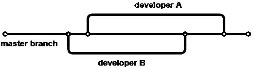
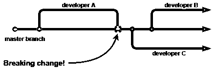
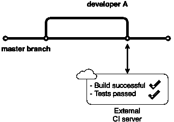
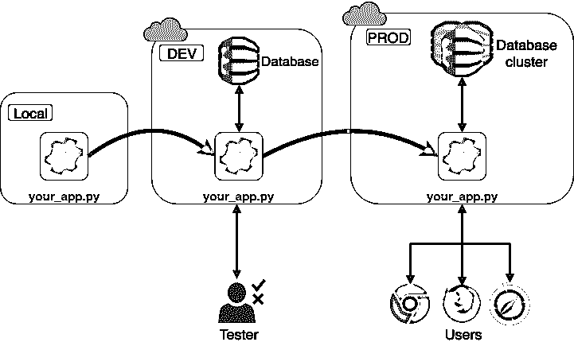

# 与 Python 的持续集成:简介

> 原文：<https://realpython.com/python-continuous-integration/>

*立即观看**本教程有真实 Python 团队创建的相关视频课程。配合文字教程一起看，加深理解: [**与 Python 的持续集成**](/courses/python-continuous-integration/)

当你自己写代码时，唯一优先考虑的是让它工作。然而，在一个专业软件开发团队中工作会带来很多挑战。其中一个挑战是协调许多人在同一代码上工作。

专业团队如何在保证每个人都协调一致、不出任何纰漏的情况下，每天做出几十个改动？进入持续集成！

**在本教程中，您将:**

*   了解持续集成背后的核心概念
*   了解持续集成的好处
*   建立一个基本的持续集成系统
*   创建一个简单的 Python 示例，并将其连接到持续集成系统

**免费奖励:** [掌握 Python 的 5 个想法](https://realpython.com/bonus/python-mastery-course/)，这是一个面向 Python 开发者的免费课程，向您展示将 Python 技能提升到下一个水平所需的路线图和心态。

## 什么是持续集成？

持续集成(CI)是指经常自动地、尽可能早地构建和测试对代码所做的每个更改。多产的开发人员和作者 Martin Fowler 将 CI 定义如下:

> “持续集成是一种软件开发实践，团队成员经常集成他们的工作，通常每个人至少每天集成一次——导致每天多次集成。每个集成都由自动化构建(包括测试)来验证，以尽快检测集成错误。”([来源](https://martinfowler.com/articles/continuousIntegration.html))

让我们打开这个。

编程是迭代的。源代码存在于团队所有成员共享的存储库中。如果你想开发那个产品，你必须得到一个拷贝。您将进行更改，测试它们，并将它们集成回主回购中。冲洗并重复。

不久前，这些集成规模很大，而且相隔几周(或几个月)，导致头痛、浪费时间和损失金钱。有了经验，开发人员开始做一些小的改动，并更频繁地集成它们。这减少了引入冲突的机会，您稍后需要解决这些冲突。

每次集成之后，您都需要构建源代码。构建意味着将您的高级代码转换成您的计算机知道如何运行的格式。最后，系统地测试结果，以确保您的更改不会引入错误。

[*Remove ads*](/account/join/)

## 我为什么要在乎？

在个人层面上，持续集成实际上是关于你和你的同事如何度过你的时间。

使用 CI，您将花费更少的时间:

*   担心每次修改时都会引入一个 bug
*   修复别人造成的混乱，这样你就可以集成你的代码
*   确保代码可以在每台机器、操作系统和浏览器上运行

相反，你会花更多的时间:

*   解决有趣的问题
*   与您的团队一起编写出色的代码
*   共同创造令人惊叹的产品，为用户提供价值

听起来怎么样？

在团队层面上，它允许一个更好的工程文化，在那里你尽早地并且经常地交付价值。合作是被鼓励的，错误会更快地被发现。持续集成将:

*   让你和你的团队更快
*   给你信心，你正在建立稳定的软件，更少的错误
*   确保您的产品可以在其他机器上运行，而不仅仅是您的笔记本电脑
*   消除大量繁琐的开销，让您专注于重要的事情
*   减少解决冲突所花费的时间(当不同的人修改相同的代码时)

## 核心概念

为了有效地进行持续集成，您需要理解几个关键的想法和实践。此外，当您谈论 CI 时，可能会有一些您不熟悉但经常使用的单词和短语。本章将向你介绍这些概念以及伴随它们而来的术语。

### 单一来源储存库

如果你和其他人合作开发一个代码库，通常会有一个共享的源代码库。从事该项目的每个开发人员都会创建一个本地副本并进行更改。一旦他们对变更感到满意，他们就将它们合并回中央存储库。

使用 Git 这样的版本控制系统(VCS)来为您处理这个工作流已经成为一种标准。团队通常使用外部服务来托管他们的源代码并处理所有移动部分。最受欢迎的是 GitHub、BitBucket 和 GitLab。

Git 允许您创建一个存储库的多个**分支**。每个分支都是源代码的独立副本，可以在不影响其他分支的情况下进行修改。这是一个重要的特性，大多数团队都有一个代表项目当前状态的主线分支(通常称为主分支)。

如果您想要添加或修改代码，您应该创建一个主分支的副本，并在新的开发分支中工作。完成后，将这些更改合并回主分支。

[](https://files.realpython.com/media/CI1-Branching_2.fe69572f8bcb.png)

<figcaption class="figure-caption text-center">Git branching</figcaption>

版本控制不仅仅包含代码。文档和测试脚本通常与源代码一起存储。一些程序寻找用于配置其参数和初始设置的外部文件。其他应用程序需要数据库模式。所有这些文件都应该放入您的存储库中。

如果您从未使用过 Git 或需要复习，请查看我们的[面向 Python 开发人员的 Git 和 GitHub 介绍](https://realpython.com/python-git-github-intro/)。

### 自动化构建

如前所述，构建代码意味着获取原始源代码，以及执行代码所需的一切，并将其转换为计算机可以直接运行的格式。Python 是一种[解释语言](https://en.wikipedia.org/wiki/Interpreted_language)，所以它的“构建”主要围绕测试执行而不是编译。

在每一个小的改变之后手动运行这些步骤是乏味的，并且从你试图做的实际问题解决中花费宝贵的时间和注意力。持续集成的很大一部分是自动化该过程，并将其转移到看不见的地方(和想不到的地方)。

这对 Python 意味着什么？想想你写的一段更复杂的代码。如果您使用的库、包或框架不是 Python 标准库附带的(想想您需要用`pip`或`conda`安装的任何东西)，Python 需要知道这一点，所以当程序发现它不识别的命令时，它知道去哪里找。

您将那些[包](https://realpython.com/python-modules-packages/)的列表存储在`requirements.txt`或 Pipfile 中。这些是代码的[依赖](https://realpython.com/courses/managing-python-dependencies/)，是成功构建的必要条件。

你会经常听到“打破构建”这个短语。当您中断构建时，这意味着您引入了一个导致最终产品不可用的变更。别担心。每个人都会遇到这种情况，即使是久经沙场的高级开发人员。您希望避免这种情况，主要是因为它会妨碍其他人工作。

CI 的全部意义在于让每个人都在一个已知的稳定基础上工作。如果他们克隆了一个破坏了构建的存储库，他们将使用一个破坏了的代码版本，并且不能引入或者测试他们的变更。当您中断构建时，首要任务是修复它，以便每个人都可以继续工作。

[](https://files.realpython.com/media/CI1-BreakingChange.45a0e6b1fa07.png)

<figcaption class="figure-caption text-center">Introducing a breaking change to the master branch</figcaption>

当构建自动化时，鼓励您频繁提交，通常是每天多次。它允许人们快速发现变化，并注意到两个开发人员之间是否有冲突。如果有许多小的变化而不是一些大的更新，那么定位错误的来源就容易多了。这也会鼓励你把工作分成更小的块，这样更容易跟踪和测试。

[*Remove ads*](/account/join/)

### 自动化测试

因为每个人每天都要提交多次变更，所以知道您的变更没有破坏代码中的任何东西或者引入 bug 是很重要的。在许多公司中，测试现在是每个开发人员的责任。如果你写代码，你应该写测试。最起码，你应该用单元测试覆盖每一个新功能。

自动运行测试，提交每一个变更，这是一个捕捉 bug 的好方法。失败的测试会自动导致构建失败。它会把你的注意力吸引到测试揭示的问题上，失败的构建会让你修复你引入的 bug。测试不能保证你的代码没有错误，但是它可以防止很多粗心的修改。

自动化测试执行让您安心，因为您知道服务器会在您每次提交时测试您的代码，即使您忘记在本地测试。

### 使用外部持续集成服务

如果某样东西在你的电脑上能用，它会在每台电脑上都能用吗？大概不会。这是一个老生常谈的借口，也是开发人员之间的一种内部玩笑，他们说，“嗯，它在我的机器上工作了！”让代码在本地工作并不是你的责任。

为了解决这个问题，大多数公司使用外部服务来处理集成，就像使用 GitHub 托管源代码库一样。外部服务拥有构建代码和运行测试的服务器。它们充当您的存储库的监视器，并且如果他们的变更破坏了构建，阻止任何人合并到主分支。

[](https://files.realpython.com/media/CI-Testing_1.dd4a5d09bedd.png)

<figcaption class="figure-caption text-center">Merging changes triggers the CI server</figcaption>

有很多这样的服务，有不同的功能和价格。大多数都有一个免费层，这样您就可以试验您的一个存储库。在本教程后面的示例中，您将使用一个名为 CircleCI 的服务。

### 在试运行环境中测试

生产环境是软件最终运行的地方。即使在成功地构建和测试了应用程序之后，您也不能确定您的代码是否能在目标计算机上运行。这就是团队在模拟生产环境的环境中部署最终产品的原因。一旦确定一切正常，应用程序就部署到生产环境中了。

**注意:**这一步与应用程序代码比与库代码更相关。您编写的任何 Python 库仍然需要在构建服务器上进行测试，以确保它们可以在不同于本地计算机的环境中工作。

您将听到人们使用开发环境、试运行环境或测试环境等术语来谈论生产环境的这个**克隆**。开发环境通常使用 DEV 这样的缩写，生产环境通常使用 PROD 这样的缩写。

[开发环境](https://realpython.com/effective-python-environment/)应该尽可能地复制生产条件。这种设置通常被称为**开发/生产奇偶校验**。让本地计算机上的环境尽可能与开发和生产环境相似，以便在部署应用程序时最大限度地减少异常。

[](https://files.realpython.com/media/DEV_PROD_2_2.ae771984fb55.png)

<figcaption class="figure-caption text-center">Test in a clone of the production environment</figcaption>

我们提到这一点是为了向您介绍词汇表，但是持续地将软件部署到开发和生产是一个完全不同的主题。不出所料，这个过程被称为持续部署(CD)。您可以在本文的[后续步骤](#next-steps)部分找到更多相关资源。

## 轮到你了！

最好的学习方法是边做边学。您现在已经理解了持续集成的所有基本实践，所以是时候动手创建使用 CI 所必需的整个步骤链了。这个链通常被称为 CI **管道**。

这是一个实践教程，所以启动你的编辑器，准备好阅读这些步骤吧！

我们假设您了解 Python 和 Git 的基础知识。我们将使用 [Github](https://github.com/) 作为我们的托管服务，使用 [CircleCI](https://circleci.com/) 作为我们的外部持续集成服务。如果您没有这些服务的帐户，请继续注册。这两个都有免费层！

[*Remove ads*](/account/join/)

### 问题定义

请记住，您在这里的重点是为您的功能带添加一个新工具，即持续集成。对于这个例子，Python 代码本身很简单。您希望将大部分时间用于内部化构建管道的步骤，而不是编写复杂的代码。

假设您的团队正在开发一个简单的计算器应用程序。你的任务是编写一个基本数学函数库:加、减、乘、除。您并不关心实际的应用程序，因为那是您的同行使用您的库中的函数开发的。

### 创建回购

登录您的 GitHub 帐户，创建一个新的存储库，并将其命名为 *CalculatorLibrary* 。添加自述文件和。gitignore，然后将存储库克隆到您的本地机器上。如果你在这个过程中需要更多的帮助，看看 GitHub 的[演练](https://help.github.com/articles/creating-a-new-repository/)关于创建一个新的仓库。

### 建立工作环境

为了让其他人(和 CI 服务器)复制您的工作条件，您需要设置一个环境。在 repo 之外的某个地方创建一个[虚拟环境](https://realpython.com/python-virtual-environments-a-primer/)并激活它:

```py
$ # Create virtual environment
$ python3 -m venv calculator

$ # Activate virtual environment (Mac and Linux)
$ . calculator/bin/activate
```

前面的命令适用于 macOS 和 Linux。如果您是 Windows 用户，请查看[官方文档](https://docs.python.org/3.7/library/venv.html#creating-virtual-environments)中的平台表。这将创建一个包含 Python 安装的目录，并告诉解释器使用它。现在我们可以安装软件包了，因为它不会影响系统的默认 Python 安装。

### 写一个简单的 Python 例子

在存储库的顶层目录中创建一个名为`calculator.py`的新文件，并复制以下代码:

```py
"""
Calculator library containing basic math operations.
"""

def add(first_term, second_term):
    return first_term + second_term

def subtract(first_term, second_term):
    return first_term - second_term
```

这是一个简单的例子，包含了我们将要编写的四个函数中的两个。一旦我们启动并运行了 CI 管道，您将添加剩下的两个功能。

继续并提交这些更改:

```py
$ # Make sure you are in the correct directory
$ cd CalculatorLibrary
$ git add calculator.py
$ git commit -m "Add functions for addition and subtraction"
```

您的 *CalculatorLibrary* 文件夹现在应该包含以下文件:

```py
CalculatorLibrary/
|
├── .git
├── .gitignore
├── README.md
└── calculator.py
```

很好，您已经完成了所需功能的一部分。下一步是添加测试，以确保您的代码按照预期的方式工作。

### 编写单元测试

您将分两步测试您的代码。

第一步涉及林挺——运行一个名为 linter 的程序，分析代码中的潜在错误。 [`flake8`](http://flake8.pycqa.org/en/latest/) 常用来检查你的代码是否符合标准的 Python 编码风格。林挺确保你的代码对于 Python 社区的其他人来说是易读的。

第二步是单元测试。单元测试旨在检查代码的单个功能或单元。Python 附带了一个标准的单元测试库，但是其他库也存在并且非常流行。本例使用 [`pytest`](https://realpython.com/pytest-python-testing/) 。

与测试密切相关的一个标准实践是计算代码覆盖率。代码覆盖率是测试“覆盖”的源代码的百分比。`pytest`有一个扩展`pytest-cov`，可以帮助你理解你的代码覆盖率。

这些是外部依赖项，您需要安装它们:

```py
$ pip install flake8 pytest pytest-cov
```

这些是您将使用的唯一外部软件包。确保将这些依赖关系存储在一个`requirements.txt`文件中，以便其他人可以复制您的环境:

```py
$ pip freeze > requirements.txt
```

要运行 linter，请执行以下命令:

```py
$ flake8 --statistics
./calculator.py:3:1: E302 expected 2 blank lines, found 1
./calculator.py:6:1: E302 expected 2 blank lines, found 1
2     E302 expected 2 blank lines, found 1
```

`--statistics`选项给你一个特定错误发生次数的概览。这里我们有两个 PEP 8 违规，因为`flake8`期望在函数定义前有两个空行，而不是一个。继续在每个函数定义前添加一个空行。再次运行`flake8`，检查错误信息是否不再出现。

现在是编写测试的时候了。在存储库的顶层目录中创建一个名为`test_calculator.py`的文件，并复制以下代码:

```py
"""
Unit tests for the calculator library
"""

import calculator

class TestCalculator:

    def test_addition(self):
        assert 4 == calculator.add(2, 2)

    def test_subtraction(self):
        assert 2 == calculator.subtract(4, 2)
```

这些测试确保我们的代码按预期运行。这还不够广泛，因为您还没有测试代码的潜在误用，但是现在保持简单。

以下命令运行您的测试:

```py
$ pytest -v --cov
collected 2 items

test_calculator.py::TestCalculator::test_addition PASSED [50%]

test_calculator.py::TestCalculator::test_subtraction PASSED [100%]

---------- coverage: platform darwin, python 3.6.6-final-0 -----------
Name                                              Stmts   Miss  Cover
---------------------------------------------------------------------
calculator.py                                         4      0   100%
test_calculator.py                                    6      0   100%
/Users/kristijan.ivancic/code/learn/__init__.py       0      0   100%
---------------------------------------------------------------------
TOTAL                                                10      0   100%
```

`pytest`擅长测试发现。因为您有一个前缀为`test`的文件，`pytest`知道它将包含单元测试以便运行。同样的原则也适用于文件中的类名和方法名。

`-v`标志给你一个更好的输出，告诉你哪些测试通过了，哪些测试失败了。在我们的案例中，两个测试都通过了。`--cov`标志确保`pytest-cov`运行，并给你一份`calculator.py`的代码覆盖报告。

你已经完成了准备工作。提交测试文件，并将所有这些更改推送到主分支:

```py
$ git add test_calculator.py
$ git commit -m "Add unit tests for calculator"
$ git push
```

在本节结束时，您的 *CalculatorLibrary* 文件夹应该包含以下文件:

```py
CalculatorLibrary/
|
├── .git
├── .gitignore
├── README.md
├── calculator.py
├── requirements.txt
└── test_calculator.py
```

太好了，你的两个功能都经过测试，工作正常。

[*Remove ads*](/account/join/)

### 连接到 CircleCI

最后，您已经准备好建立您的持续集成管道了！

CircleCI 需要知道如何运行您的构建，并希望该信息以特定的格式提供。它要求 repo 中有一个`.circleci`文件夹，其中有一个配置文件。配置文件包含构建服务器需要执行的所有步骤的指令。CircleCI 希望这个文件被称为`config.yml`。

一个`.yml`文件使用一种数据序列化语言， [YAML](https://realpython.com/python-yaml/) ，它有自己的[规范](http://yaml.org/spec/)。YAML 的目标是让人类可读，并能很好地与现代编程语言一起完成日常任务。

在 YAML 文件中，有三种基本方式来表示数据:

*   映射(键值对)
*   序列(列表)
*   标量(字符串或数字)

读起来很简单:

*   缩进可以用于结构。
*   冒号分隔键值对。
*   破折号用于创建列表。

在您的 repo 中创建`.circleci`文件夹和一个包含以下内容的`config.yml`文件:

```py
# Python CircleCI 2.0 configuration file version:  2 jobs: build: docker: -  image:  circleci/python:3.7 working_directory:  ~/repo steps: # Step 1: obtain repo from GitHub -  checkout # Step 2: create virtual env and install dependencies -  run: name:  install dependencies command:  | python3 -m venv venv . venv/bin/activate pip install -r requirements.txt # Step 3: run linter and tests -  run: name:  run tests command:  | . venv/bin/activate flake8 --exclude=venv* --statistics pytest -v --cov=calculator
```

其中一些单词和概念可能对你来说不熟悉。比如什么是 Docker，什么是 images？让我们回到过去一点。

还记得程序员面临的问题吗？有些东西在他们的笔记本电脑上可以用，但在别的地方不行。以前，开发人员常常创建一个程序，隔离计算机的一部分物理资源(内存、硬盘驱动器等)，并将它们变成一个**虚拟机**。

虚拟机自己伪装成一台完整的计算机。它甚至会有自己的操作系统。在该操作系统上，您部署您的应用程序或安装您的库并测试它。

虚拟机占用了大量的资源，这激发了容器的发明。这个想法类似于海运集装箱。在集装箱发明之前，制造商必须以多种尺寸、包装和方式(卡车、火车、轮船)运输货物。

通过标准化集装箱，这些货物可以在不同的运输方式之间转移，而无需任何修改。同样的想法也适用于软件容器。

容器是一个轻量级的代码单元及其运行时依赖项，以一种标准化的方式打包，因此它们可以快速插入并在 Linux 操作系统上运行。您不需要像创建虚拟机那样创建一个完整的虚拟操作系统。

容器只复制它们工作所需的操作系统的一部分。这减小了它们的尺寸，并大大提高了它们的性能。

Docker 是目前领先的容器平台，它甚至能够在 Windows 和 macOS 上运行 Linux 容器。要创建 Docker 容器，您需要一个 Docker 映像。图像为容器提供蓝图，就像类为对象提供蓝图一样。你可以在他们的[入门](https://docs.docker.com/get-started/)指南中阅读更多关于 Docker 的内容。

CircleCI 为几种编程语言维护了[预构建的 Docker 映像](https://circleci.com/docs/2.0/circleci-images/)。在上面的配置文件中，您指定了一个已经安装了 Python 的 Linux 映像。这个图像将会创造一个容器，在这个容器中其他的事情都会发生。

让我们依次看看配置文件的每一行:

1.  **`version` :** 每个`config.yml`都以 CircleCI 版本号开头，用于发布关于重大变更的警告。

2.  **`jobs` :** 作业代表构建的一次执行，由一组步骤定义。如果你只有一份工作，那一定叫`build`。

3.  **`build` :** 如前所述，`build`是你工作的名称。您可以有多个作业，在这种情况下，它们需要有唯一的名称。

4.  **`docker` :** 一个作业的各个步骤发生在一个叫做执行器的环境中。CircleCI 中常见的执行者是一个 [Docker 容器](https://www.docker.com/resources/what-container)。这是一个[云托管的](https://circleci.com/product/#hosting-options)执行环境，但也有其他选择，比如 macOS 环境。

5.  **`image`:**Docker 镜像是一个用来创建运行 Docker 容器的文件。我们使用预装了 Python 3.7 的映像。

6.  **`working_directory` :** 您的存储库必须在构建服务器上的某个地方被检出。工作目录代表存储库的文件路径。

7.  **`steps` :** 这个键标志着构建服务器要执行的一系列步骤的开始。

8.  **`checkout` :** 服务器需要做的第一步是将源代码签出到工作目录。这是通过一个叫做`checkout`的特殊步骤来完成的。

9.  **`run` :** 命令行程序或命令的执行是在`command`键内完成的。实际的 shell 命令将嵌套在。

10.  **`name`:**circle ci 用户界面以可扩展部分的形式向您展示每个构建步骤。该部分的标题取自与`name`键相关联的值。

11.  **`command` :** 该键代表通过 shell 运行的命令。`|`符号指定接下来是一组命令，每行一个，就像您在 shell/bash 脚本中看到的一样。

您可以阅读 [CircleCI 配置参考](https://circleci.com/docs/2.0/configuration-reference/)文档了解更多信息。

我们的管道非常简单，由 3 个步骤组成:

1.  签出存储库
2.  在虚拟环境中安装依赖关系
3.  在虚拟环境中运行 linter 和测试

我们现在有了启动管道所需的一切。登录你的 CircleCI 账户，点击*添加项目*。找到你的*计算器库*回购，点击*设置项目。*选择 Python 作为您的语言。因为我们已经有了一个`config.yml`，我们可以跳过接下来的步骤，点击*开始构建。*

CircleCI 将带您进入工作的执行仪表板。如果你正确地遵循所有的步骤，你应该看到你的工作成功。

您的 *CalculatorLibrary* 文件夹的最终版本应该如下所示:

```py
CalculatorRepository/
|
├── .circleci
├── .git
├── .gitignore
├── README.md
├── calculator.py
├── requirements.txt
└── test_calculator.py
```

恭喜你！您已经创建了您的第一个持续集成管道。现在，每次推送到主分支，都会触发一个作业。点击 CircleCI 侧边栏中的 *Jobs* ，可以看到你当前和过去的工作列表。

[*Remove ads*](/account/join/)

### 进行更改

是时候把乘法加入我们的计算器库中了。

这一次，我们将首先添加一个单元测试，而不编写函数。如果没有代码，测试将会失败，CircleCI 作业也会失败。将以下代码添加到您的`test_calculator.py`的末尾:

```py
def test_multiplication(self):
    assert 100 == calculator.multiply(10, 10)
```

将代码推送到主分支，并在 CircleCI 中看到作业失败。这表明持续集成是有效的，如果你犯了错误，它会保护你。

现在将代码添加到`calculator.py`中，这将使测试通过:

```py
def multiply(first_term, second_term):
    return first_term * second_term
```

确保乘法函数和前一个函数之间有两个空格，否则您的代码将无法通过 linter 检查。

这次工作应该会成功。这种先写一个失败的测试，然后添加代码通过测试的工作流程被称为[测试驱动开发](https://en.wikipedia.org/wiki/Test-driven_development) (TDD)。这是一个很好的工作方式，因为它让你提前考虑你的代码结构。

现在你自己试试。为除法函数添加一个测试，看到它失败，然后编写函数使测试通过。

### 通知

当处理具有大量移动部件的大型应用程序时，持续集成工作可能需要一段时间才能运行。大多数团队都建立了一个通知程序，让他们知道自己的工作是否失败。他们可以在等待作业运行的同时继续工作。

最受欢迎的选项有:

*   为每个失败的构建发送电子邮件
*   向松弛通道发送故障通知
*   在每个人都能看到的仪表板上显示故障

默认情况下，CircleCI 应该在作业失败时向您发送电子邮件。

## 接下来的步骤

您已经理解了持续集成的基础，并练习了为一个简单的 Python 程序设置管道。这是您作为开发人员的旅程中向前迈出的一大步。你可能会问自己，“现在怎么办？”

为了简单起见，本教程跳过了一些大的主题。通过花些时间更深入地研究每一个主题，你可以极大地提高你的技能。这里有一些你可以进一步研究的话题。

### Git 工作流程

除了您在这里使用的东西之外，还有更多的东西可以利用。每个开发团队都有一个适合他们特定需求的工作流程。其中大多数包括分支策略和所谓的**同行评审**。他们在与`master`分支分开的分支上进行更改。当你想用`master`合并那些变更时，在你被允许合并之前，其他开发人员必须首先查看你的变更并批准它们。

**注:**如果你想了解更多关于团队使用的不同工作流，看看 [GitHub](https://help.github.com/categories/collaborating-with-issues-and-pull-requests/) 和 [BitBucket](https://www.atlassian.com/git/tutorials/learn-git-with-bitbucket-cloud) 上的教程。

如果你想提高你的 Git 技能，我们有一篇文章叫做[Python 开发者的高级 Git 技巧](https://realpython.com/advanced-git-for-pythonistas/)。

[*Remove ads*](/account/join/)

### 依赖性管理和虚拟环境

除了`virtualenv`，还有其他流行的包和环境管理器。其中一些只处理虚拟环境，而一些同时处理包安装和环境管理。其中之一是康达:

> “Conda 是一个开源的软件包管理系统和环境管理系统，可以在 Windows、macOS 和 Linux 上运行。Conda 快速安装、运行和更新软件包及其依赖项。Conda 可以在本地计算机上轻松创建、保存、加载和切换环境。它是为 Python 程序设计的，但它可以为任何语言打包和分发软件。”([来源](https://conda.io/docs/))

另一个选择是 [Pipenv](https://pipenv.readthedocs.io/en/latest/) ，一个在应用程序开发人员中越来越受欢迎的年轻竞争者。Pipenv 将`pip`和`virtualenv`组合成一个工具，并使用`Pipfile`代替`requirements.txt`。pip 文件提供了确定性的环境和更高的安全性。这个介绍并没有做到公正，所以请查看 [Pipenv:新 Python 打包工具指南](https://realpython.com/pipenv-guide/)。

### 测试

用`pytest`进行简单的单元测试只是冰山一角。外面有一整个世界等着你去探索！软件可以在许多层面上进行测试，包括集成测试、验收测试、回归测试等等。为了让你的 Python 代码测试知识更上一层楼，请前往[Python 测试入门](https://realpython.com/python-testing/)。

### 包装

在本教程中，您开始构建一个函数库，供其他开发人员在他们的项目中使用。您需要将这个库打包成一种易于分发和安装的格式，例如使用`pip`。

创建一个可安装包需要不同的布局和一些额外的文件，如`__init__.py`和`setup.py`。阅读 [Python 应用程序布局:参考](https://realpython.com/python-application-layouts/#installable-single-package)了解更多关于构建代码的信息。

要了解如何将您的存储库变成可安装的 Python 包，请阅读由 [Python 打包权威](https://www.pypa.io/en/latest/)撰写的[打包 Python 项目](https://packaging.python.org/tutorials/packaging-projects/)。

### 持续集成

在本教程中，您使用了一个简单的 Python 代码示例，涵盖了 CI 的所有基础知识。CI 管道的最后一步通常是创建一个**可部署工件**。一个工件代表一个完成的、打包的工作单元，可以随时部署给用户或者包含在复杂的产品中。

例如，要将您的计算器库变成一个可部署的工件，您应该将它组织成一个可安装的包。最后，您将在 CircleCI 中添加一个步骤来打包库，并将工件存储在其他进程可以获取的地方。

对于更复杂的应用程序，您可以创建一个工作流来安排多个 CI 作业并将其连接到一次执行中。请随意浏览 [CircleCI 文档](https://circleci.com/docs/2.0/)。

### 连续部署

您可以将持续部署视为 CI 的扩展。一旦您的代码被测试并构建到可部署的工件中，它就被部署到生产中，这意味着动态应用程序会随着您的更改而更新。其中一个目标是最小化交付时间，即从编写一行新代码到提交给用户之间的时间。

**注意:**为了增加一点混乱，缩写 CD 不是唯一的。它也可以意味着连续交付，这与连续部署几乎相同，但是在集成和部署之间有一个手动验证步骤。你可以在任何时候集成你的代码，但是你必须按下一个按钮才能把它发布到正在运行的应用程序中。

大多数公司同时使用 CI/CD，因此值得您花时间了解更多关于[连续交付/部署](https://continuousdelivery.com/)的信息。

## 持续集成服务概述

您已经使用了 CircleCI，这是最流行的持续集成服务之一。然而，这是一个有很多强有力竞争者的大市场。CI 产品分为两个基本类别:远程和自托管服务。

[Jenkins](https://jenkins.io/) 是最受欢迎的自托管解决方案。它是开源的、灵活的，社区开发了很多扩展。

在远程服务方面，有许多流行的选项，如 [TravisCI](https://travis-ci.org/) 、 [CodeShip](https://codeship.com/) 和 [Semaphore](https://semaphoreci.com/) 。大企业往往有他们的定制解决方案，他们把它们作为服务来卖，比如 [AWS CodePipeline](https://aws.amazon.com/codepipeline/) 、[微软 Team Foundation Server](https://visualstudio.microsoft.com/tfs/) ，甲骨文的 [Hudson](http://hudson-ci.org/) 。

您选择哪个选项取决于您和您的团队需要的平台和功能。如需更详细的细分，请查看 G2Crowd 的[最佳 CI 软件](https://www.g2crowd.com/categories/continuous-integration)。

[*Remove ads*](/account/join/)

## 结论

借助本教程中的知识，您现在可以回答以下问题:

*   什么是持续集成？
*   为什么持续集成很重要？
*   持续集成的核心实践是什么？
*   如何为我的 Python 项目设置持续集成？

你已经获得了编程的超能力！理解持续集成的哲学和实践将使你成为任何团队中有价值的一员。太棒了。

*立即观看**本教程有真实 Python 团队创建的相关视频课程。配合文字教程一起看，加深理解: [**与 Python 的持续集成**](/courses/python-continuous-integration/)*********