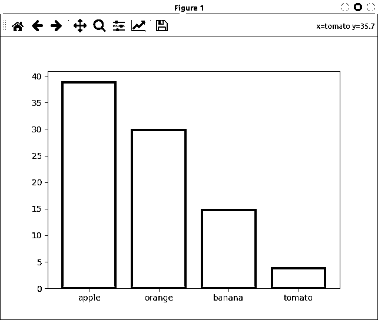

# Python 的计数器:计算对象的 python 方式

> 原文：<https://realpython.com/python-counter/>

*立即观看**本教程有真实 Python 团队创建的相关视频课程。和文字教程一起看，加深理解: [**用 Python 的计数器计数**](/courses/counting-python-counter/)

一次计数几个重复的对象是编程中常见的问题。Python 提供了一系列工具和技术来解决这个问题。然而，Python 的 **`Counter`** 从 [`collections`](https://docs.python.org/3/library/collections.html#module-collections) 提供了一个干净、高效、Python 式的解决方案。

这个[字典](https://realpython.com/python-dicts/)子类提供了开箱即用的高效计数能力。作为 Python 开发人员，理解`Counter`以及如何有效地使用它是一项方便的技能。

**在本教程中，您将学习如何:**

*   一次数几个重复的物体
*   用 Python 的 **`Counter`** 创建计数器
*   检索计数器中最常见的对象
*   更新**对象计数**
*   使用`Counter`来帮助**进一步计算**

您还将学习使用`Counter`作为[多集](https://en.wikipedia.org/wiki/Multiset)的基础知识，这是 Python 中该类的一个附加特性。

**免费奖励:** [掌握 Python 的 5 个想法](https://realpython.com/bonus/python-mastery-course/)，这是一个面向 Python 开发者的免费课程，向您展示将 Python 技能提升到下一个水平所需的路线图和心态。

## Python 中的计数对象

有时，您需要对给定数据源中的对象进行计数，以了解它们出现的频率。换句话说，你需要确定它们的**频率**。例如，您可能想知道特定项目在值列表或值序列中出现的频率。当你的清单很短的时候，计算清单可以简单快捷。然而，当你有一个很长的清单时，计数会更有挑战性。

为了计数对象，通常使用一个**计数器**，它是一个初始值为零的[整数变量](https://realpython.com/python-numbers/#integers)。然后递增计数器，以反映给定对象在输入数据源中出现的次数。

当计算单个对象的出现次数时，可以使用单个计数器。但是，当您需要对几个不同的对象进行计数时，您必须创建与您拥有的唯一对象一样多的计数器。

要一次计算几个不同的对象，可以使用 Python 字典。字典**键**将存储您想要计数的对象。字典**值**将保存给定对象的重复次数，或者该对象的**计数**。

例如，要使用字典对序列中的对象进行计数，可以循环遍历序列，检查当前对象是否不在字典中以初始化计数器(键-值对)，然后相应地增加其计数。

下面是一个计算单词“Mississippi”中的字母的例子:

>>>

```py
>>> word = "mississippi"
>>> counter = {}

>>> for letter in word:
...     if letter not in counter:
...         counter[letter] = 0
...     counter[letter] += 1
...

>>> counter
{'m': 1, 'i': 4, 's': 4, 'p': 2}
```

[`for`循环](https://realpython.com/python-for-loop/)迭代`word`中的字母。在每次迭代中，[条件语句](https://realpython.com/python-conditional-statements/)检查手头的字母是否已经是您用作`counter`的字典中的一个键。如果是，它用字母创建一个新的密钥，并将其计数初始化为零。最后一步是将计数加 1。当您访问`counter`时，您会看到字母作为键工作，而值作为计数。

**注意:**当你用 Python 字典计算几个重复的对象时，记住它们必须是[可散列的](https://docs.python.org/3/glossary.html#term-hashable)，因为它们将作为字典键。成为**可散列的**意味着你的对象必须有一个在其生命周期中永不改变的散列值。在 Python 中，[不可变的](https://docs.python.org/3/glossary.html#term-immutable)对象也是可散列的。

用字典计数对象的另一种方法是使用 [`dict.get()`](https://docs.python.org/3/library/stdtypes.html#dict.get) ，用`0`作为缺省值:

>>>

```py
>>> word = "mississippi"
>>> counter = {}

>>> for letter in word:
...     counter[letter] = counter.get(letter, 0) + 1
...

>>> counter
{'m': 1, 'i': 4, 's': 4, 'p': 2}
```

当您以这种方式调用`.get()`时，您将获得给定`letter`的当前计数，或者如果字母丢失，则获得`0`(默认)。然后将计数增加`1`，并将其存储在字典中相应的`letter`下。

您也可以从 [`collections`](https://docs.python.org/3/library/collections.html#module-collections) 中使用 [`defaultdict`](https://realpython.com/python-defaultdict/) 来计数一个循环内的对象:

>>>

```py
>>> from collections import defaultdict

>>> word = "mississippi"
>>> counter = defaultdict(int)

>>> for letter in word:
...     counter[letter] += 1
...

>>> counter
defaultdict(<class 'int'>, {'m': 1, 'i': 4, 's': 4, 'p': 2})
```

这个解决方案更简洁，可读性更好。首先使用带有 [`int()`](https://docs.python.org/3/library/functions.html#int) 的`defaultdict`初始化`counter`作为默认工厂函数。这样，当您访问底层`defaultdict`中不存在的键时，字典会自动创建这个键，并用工厂函数返回的值初始化它。

在这个例子中，因为你使用`int()`作为[工厂函数](https://realpython.com/factory-method-python/)，初始值是`0`，这是无参数调用`int()`的结果。

与编程中的许多其他常见任务一样，Python 提供了一种更好的方法来处理计数问题。在`collections`中，你会发现一个专门设计的类，可以一次计算几个不同的物体。这个班就顺手叫 [`Counter`](https://docs.python.org/3/library/collections.html#collections.Counter) 。

[*Remove ads*](/account/join/)

## Python 的`Counter` 入门

`Counter`是`dict`的一个子类，专门用于计算 Python 中可散列对象的数量。它是一个将对象存储为键并作为值计数的字典。为了用`Counter`计数，你通常提供一个可散列对象的序列或[可迭代](https://docs.python.org/3/glossary.html#term-iterable)作为类的构造函数的参数。

`Counter`在内部遍历输入序列，计算给定对象出现的次数，并将对象存储为键，将计数存储为值。在下一节中，您将了解构造计数器的不同方法。

### 构建计数器

创建`Counter`实例有几种方法。但是，如果你的目标是一次计数几个对象，那么你需要使用一个序列或 iterable 来初始化计数器。例如，下面是如何使用`Counter`重写密西西比的例子:

>>>

```py
>>> from collections import Counter

>>> # Use a string as an argument
>>> Counter("mississippi")
Counter({'i': 4, 's': 4, 'p': 2, 'm': 1})

>>> # Use a list as an argument
>>> Counter(list("mississippi"))
Counter({'i': 4, 's': 4, 'p': 2, 'm': 1})
```

`Counter`遍历`"mississippi"`并生成一个字典，将字母作为关键字，将它们的频率作为值。在第一个例子中，您使用一个字符串作为`Counter`的参数。您还可以使用[列表、元组](https://realpython.com/python-lists-tuples/)或任何包含重复对象的 iterables，如第二个示例所示。

**注:`Counter`中的**，经过高度优化的 [C 函数](https://github.com/python/cpython/blob/73b20ae2fb7a5c1374aa5c3719f64c53d29fa0d2/Modules/_collectionsmodule.c#L2307)提供计数功能。如果这个函数由于某种原因不可用，那么这个类使用一个等效的但是效率较低的 [Python 函数](https://github.com/python/cpython/blob/6f1e8ccffa5b1272a36a35405d3c4e4bbba0c082/Lib/collections/__init__.py#L503)。

创建`Counter`实例还有其他方法。然而，它们并不严格意味着计数。例如，您可以使用包含键和计数的字典，如下所示:

>>>

```py
>>> from collections import Counter

>>> Counter({"i": 4, "s": 4, "p": 2, "m": 1})
Counter({'i': 4, 's': 4, 'p': 2, 'm': 1})
```

计数器现在有了一组初始的键计数对。当您需要提供现有对象组的初始计数时，这种创建`Counter`实例的方式非常有用。

当您呼叫类别的建构函式时，也可以使用关键字引数来产生类似的结果:

>>>

```py
>>> from collections import Counter

>>> Counter(i=4, s=4, p=2, m=1)
Counter({'i': 4, 's': 4, 'p': 2, 'm': 1})
```

同样，您可以使用这种方法为键和计数对创建一个具有特定初始状态的`Counter`对象。

在实践中，如果你使用`Counter`从头开始计数，那么你不需要初始化计数，因为它们默认为 0。另一种可能是将计数初始化为`1`。在这种情况下，您可以这样做:

>>>

```py
>>> from collections import Counter

>>> Counter(set("mississippi"))
Counter({'p': 1, 's': 1, 'm': 1, 'i': 1})
```

Python [设置](https://realpython.com/python-sets/)存储唯一的对象，因此本例中对`set()`的调用抛出了重复的字母。在此之后，您将得到原始 iterable 中每个字母的一个实例。

`Counter`继承了普通词典的接口。但是，它没有提供一个 [`.fromkeys()`](https://docs.python.org/3/library/stdtypes.html#dict.fromkeys) 的工作实现来防止歧义，比如`Counter.fromkeys("mississippi", 2)`。在这个特定的例子中，每个字母都有一个默认的计数`2`，不管它在输入 iterable 中的当前出现次数。

对于可以存储在计数器的键和值中的对象没有任何限制。键可以存储可散列对象，而值可以存储任何对象。但是，要作为计数器工作，这些值应该是表示计数的整数。

下面是一个保存负数和零计数的`Counter`实例的例子:

>>>

```py
>>> from collections import Counter

>>> inventory = Counter(
...     apple=10,
...     orange=15,
...     banana=0,
...     tomato=-15
... )
```

在这个例子中，你可能会问，“为什么我有`-15`西红柿？”嗯，这可能是一个内部惯例，表明你有一个客户的`15`西红柿订单，而你目前的库存中没有。谁知道呢？`Counter`允许你这样做，你可能会发现这个特性的一些用例。

[*Remove ads*](/account/join/)

### 更新对象计数

一旦有了一个`Counter`实例，就可以使用`.update()`用新的对象和计数来更新它。由`Counter`提供的 [`.update()`](https://docs.python.org/3/library/collections.html#collections.Counter.update) 实现将现有的计数加在一起，而不是像它的`dict`对应物那样替换值。它还会在必要时创建新的键计数对。

您可以使用`.update()`将 iterables 和计数映射作为参数。如果使用 iterable，方法会计算其项数，并相应地更新计数器:

>>>

```py
>>> from collections import Counter

>>> letters = Counter({"i": 4, "s": 4, "p": 2, "m": 1})

>>> letters.update("missouri")
>>> letters
Counter({'i': 6, 's': 6, 'p': 2, 'm': 2, 'o': 1, 'u': 1, 'r': 1})
```

现在你有了`i`的`6`实例、`s`的`6`实例，等等。您还拥有一些新的键计数对，例如`'o': 1`、`'u': 1`和`'r': 1`。请注意，iterable 需要是一个项目序列，而不是一个`(key, count)`对序列。

**注意:**正如您已经知道的，您可以在计数器中存储的值(计数)没有限制。

使用整数以外的对象进行计数会破坏常见的计数器功能:

>>>

```py
>>> from collections import Counter

>>> letters = Counter({"i": "4", "s": "4", "p": "2", "m": "1"})

>>> letters.update("missouri")
Traceback (most recent call last):
  ...
TypeError: can only concatenate str (not "int") to str
```

在这个例子中，字母计数是字符串而不是整数值。这中断了`.update()`，导致了`TypeError`。

使用`.update()`的第二种方法是提供另一个计数器或计数映射作为参数。在这种情况下，您可以这样做:

>>>

```py
>>> from collections import Counter
>>> sales = Counter(apple=25, orange=15, banana=12)

>>> # Use a counter
>>> monday_sales = Counter(apple=10, orange=8, banana=3)
>>> sales.update(monday_sales)
>>> sales
Counter({'apple': 35, 'orange': 23, 'banana': 15})

>>> # Use a dictionary of counts
>>> tuesday_sales = {"apple": 4, "orange": 7, "tomato": 4}
>>> sales.update(tuesday_sales)
>>> sales
Counter({'apple': 39, 'orange': 30, 'banana': 15, 'tomato': 4})
```

在第一个示例中，您使用另一个计数器`monday_sales`来更新现有的计数器`sales`。注意`.update()`是如何将两个计数器的计数相加的。

**注意:**你也可以把`.update()`和关键字参数一起使用。例如，做类似于`sales.update(apple=10, orange=8, banana=3)`的事情和上面例子中的`sales.update(monday_sales)`是一样的。

接下来，使用包含项目和计数的常规字典。在这种情况下，`.update()`添加现有键的计数，并创建缺失的键计数对。

### 访问计数器的内容

正如你已经知道的，`Counter`和`dict`的界面几乎一样。您可以使用计数器执行与标准字典几乎相同的操作。例如，您可以使用类似字典的键访问(`[key]`)来访问它们的值。您还可以使用常用的技术和方法迭代键、值和项:

>>>

```py
>>> from collections import Counter

>>> letters = Counter("mississippi")
>>> letters["p"]
2
>>> letters["s"]
4

>>> for letter in letters:
...     print(letter, letters[letter])
...
m 1
i 4
s 4
p 2

>>> for letter in letters.keys():
...     print(letter, letters[letter])
...
m 1
i 4
s 4
p 2

>>> for count in letters.values():
...     print(count)
...
1
4
4
2

>>> for letter, count in letters.items():
...     print(letter, count)
...
m 1
i 4
s 4
p 2
```

在这些例子中，您使用熟悉的字典接口访问并迭代计数器的键(字母)和值(计数)，该接口包括诸如`.keys()`、`.values()`和`.items()`之类的方法。

**注意:**如果你想深入了解如何迭代字典，那么看看[如何用 Python 迭代字典](https://realpython.com/iterate-through-dictionary-python/)。

关于`Counter`需要注意的最后一点是，如果你试图访问一个丢失的键，那么你得到的是零而不是一个 [`KeyError`](https://realpython.com/python-keyerror/) :

>>>

```py
>>> from collections import Counter

>>> letters = Counter("mississippi")
>>> letters["a"]
0
```

由于字母`"a"`没有出现在字符串`"mississippi"`中，当您试图访问该字母的计数时，计数器返回`0`。

### 寻找最常见的物体

如果你需要根据一组物体出现的频率或者次数来列出它们，那么你可以使用 [`.most_common()`](https://docs.python.org/3/library/collections.html#collections.Counter.most_common) 。这个方法返回一个按对象当前计数排序的列表`(object, count)`。计数相等的对象按照它们第一次出现的顺序排列。

如果您提供一个整数`n`作为`.most_common()`的参数，那么您将得到`n`最常见的对象。如果省略`n`或将其设为`None`，则`.most_common()`返回计数器中的所有对象:

>>>

```py
>>> from collections import Counter
>>> sales = Counter(banana=15, tomato=4, apple=39, orange=30)

>>> # The most common object
>>> sales.most_common(1)
[('apple', 39)]

>>> # The two most common objects
>>> sales.most_common(2)
[('apple', 39), ('orange', 30)]

>>> # All objects sorted by count
>>> sales.most_common()
[('apple', 39), ('orange', 30), ('banana', 15), ('tomato', 4)]

>>> sales.most_common(None)
[('apple', 39), ('orange', 30), ('banana', 15), ('tomato', 4)]

>>> sales.most_common(20)
[('apple', 39), ('orange', 30), ('banana', 15), ('tomato', 4)]
```

在这些例子中，您使用`.most_common()`来检索`sales`中最频繁出现的对象。不带参数或带 [`None`](https://realpython.com/null-in-python/) ，该方法返回所有对象。如果`.most_common()`的参数大于当前计数器的长度，那么您将再次获得所有对象。

你也可以通过对`.most_common()`的结果进行[切片](https://docs.python.org/dev/whatsnew/2.3.html#extended-slices)得到最不常见的对象:

>>>

```py
>>> from collections import Counter
>>> sales = Counter(banana=15, tomato=4, apple=39, orange=30)

>>> # All objects in reverse order
>>> sales.most_common()[::-1]
[('tomato', 4), ('banana', 15), ('orange', 30), ('apple', 39)]

>>> # The two least-common objects
>>> sales.most_common()[:-3:-1]
[('tomato', 4), ('banana', 15)]
```

第一次切片，`[::-1]`，根据各自的计数以相反的顺序返回`sales`中的所有对象。切片`[:-3:-1]`从`.most_common()`的结果中提取最后两个对象。通过更改切片操作符中的第二个偏移值，可以调整最不常用对象的数量。例如，要获得三个最不常用的对象，可以将`-3`改为`-4`，依此类推。

**注:**查看[反向 Python 列表:Beyond。reverse()和 reversed()](https://realpython.com/python-reverse-list/) 获得使用切片语法的实际例子。

如果你想让`.most_common()`正常工作，那么确保你的计数器中的值是可排序的。这一点需要记住，因为如上所述，您可以在计数器中存储任何数据类型。

[*Remove ads*](/account/join/)

## 将`Counter`付诸行动

到目前为止，您已经学习了在代码中创建和使用`Counter`对象的基础知识。您现在知道如何计算每个对象在给定序列或 iterable 中出现的次数。您还知道如何:

*   用初始值创建计数器
*   更新现有计数器
*   获取给定计数器中最频繁出现的对象

在接下来的部分中，您将编写一些实际的例子，这样您就可以更好地了解 Python 的`Counter`有多有用。

### 对文本文件中的字母进行计数

假设您有一个包含一些文本的文件。你需要计算每个字母在文本中出现的次数。例如，假设您有一个名为`pyzen.txt`的文件，其内容如下:

```py
The Zen of Python, by Tim Peters

Beautiful is better than ugly.
Explicit is better than implicit.
Simple is better than complex.
Complex is better than complicated.
Flat is better than nested.
Sparse is better than dense.
Readability counts.
Special cases aren't special enough to break the rules.
Although practicality beats purity.
Errors should never pass silently.
Unless explicitly silenced.
In the face of ambiguity, refuse the temptation to guess.
There should be one-- and preferably only one --obvious way to do it.
Although that way may not be obvious at first unless you're Dutch.
Now is better than never.
Although never is often better than *right* now.
If the implementation is hard to explain, it's a bad idea.
If the implementation is easy to explain, it may be a good idea.
Namespaces are one honking great idea -- let's do more of those!
```

是的，这是[Python 的禅](https://www.python.org/dev/peps/pep-0020/)，一系列指导原则定义了 Python 设计背后的核心哲学。为了统计每个字母在这个文本中出现的次数，你可以利用`Counter`和[编写一个函数](https://realpython.com/defining-your-own-python-function/)，如下所示:

```py
 1# letters.py
 2
 3from collections import Counter
 4
 5def count_letters(filename):
 6    letter_counter = Counter()
 7    with open(filename) as file:
 8        for line in file:
 9            line_letters = [
10                char for char in line.lower() if char.isalpha()
11            ]
12            letter_counter.update(Counter(line_letters))
13    return letter_counter
```

下面是这段代码的工作原理:

*   **第 5 行**定义`count_letters()`。该函数将基于字符串的文件路径作为参数。
*   **第 6 行**创建一个空计数器，用于计算目标文本中的字母数。
*   **第 7 行** [打开输入文件进行读取](https://realpython.com/read-write-files-python/)并在文件内容上创建一个迭代器。
*   **第 8 行**开始一个循环，逐行遍历文件内容。
*   **第 9 到 11 行**定义了一个列表理解，使用 [`.isalpha()`](https://docs.python.org/3/library/stdtypes.html#str.isalpha) 从当前行中排除非字母字符。在过滤字母之前，理解小写字母，以防止出现单独的小写和大写计数。
*   **第 12 行**调用字母计数器上的`.update()`来更新每个字母的计数。

要使用`count_letters()`，您可以这样做:

>>>

```py
>>> from letters import count_letters
>>> letter_counter = count_letters("pyzen.txt")

>>> for letter, count in letter_counter.items():
...     print(letter, "->", count)
...
t -> 79
h -> 31
e -> 92
z -> 1
 ...
k -> 2
v -> 5
w -> 4

>>> for letter, count in letter_counter.most_common(5):
...     print(letter, "->", count)
...
e -> 92
t -> 79
i -> 53
a -> 53
s -> 46
```

太好了！您的代码计算给定文本文件中每个字母的出现频率。语言学家经常用[字母频率](https://en.wikipedia.org/wiki/Letter_frequency)进行[语言识别](https://en.wikipedia.org/wiki/Language_identification)。例如，在英语中，对平均字母频率的研究表明，五个最常见的字母是“e”、“t”、“a”、“o”和“I”。哇！这几乎与您的结果相符！

### 用 ASCII 条形图绘制分类数据

[统计](https://en.wikipedia.org/wiki/Statistics)是另一个可以使用`Counter`的字段。例如，当您处理[分类](https://en.wikipedia.org/wiki/Categorical_variable)数据时，您可能想要创建[条形图](https://en.wikipedia.org/wiki/Bar_chart)来可视化每个类别的观察数量。条形图对于绘制这种类型的数据特别方便。

现在假设您想创建一个函数，允许您在终端上创建 ASCII 条形图。为此，您可以使用以下代码:

```py
# bar_chart.py

from collections import Counter

def print_ascii_bar_chart(data, symbol="#"):
    counter = Counter(data).most_common()
    chart = {category: symbol * frequency for category, frequency in counter}
    max_len = max(len(category) for category in chart)
    for category, frequency in chart.items():
        padding = (max_len - len(category)) * " "
        print(f"{category}{padding} |{frequency}")
```

在这个例子中，`print_ascii_bar_chart()`获取一些分类`data`，计算每个唯一类别在数据中出现的次数(`frequency`，并生成一个反映该频率的 ASCII 条形图。

以下是使用该功能的方法:

>>>

```py
>>> from bar_chart import print_ascii_bar_chart

>>> letters = "mississippimississippimississippimississippi"
>>> print_ascii_bar_chart(letters)
i |################
s |################
p |########
m |####

>>> from collections import Counter
>>> sales = Counter(banana=15, tomato=4, apple=39, orange=30)

>>> print_ascii_bar_chart(sales, symbol="+")
apple  |+++++++++++++++++++++++++++++++++++++++
orange |++++++++++++++++++++++++++++++
banana |+++++++++++++++
tomato |++++
```

对`print_ascii_bar_chart()`的第一次调用绘制了输入字符串中每个字母的频率。第二个调用绘制每个水果的销售额。在这种情况下，您使用计数器作为输入。另外，请注意，您可以使用`symbol`来更改条形的字符。

**注意:**在上面的例子中，`print_ascii_bar_chart()`在绘制图表时并没有将`frequency`的值归一化。如果你使用高`frequency`值的数据，那么你的屏幕会看起来像一堆符号。

创建条形图时，使用水平条可以为类别标签留出足够的空间。条形图的另一个有用的特性是可以根据频率对数据进行排序。在本例中，您使用`.most_common()`对数据进行排序。

[*Remove ads*](/account/join/)

### 使用 Matplotlib 绘制分类数据

很高兴知道如何使用 Python 从头开始创建 ASCII 条形图。然而，在 Python 生态系统中，您可以找到一些绘制数据的工具。其中一个工具是 Matplotlib。

Matplotlib 是一个第三方库，用于在 Python 中创建静态、动画和交互式可视化。您可以照常使用 [`pip`](https://realpython.com/what-is-pip/) 从 [PyPI](https://realpython.com/pypi-publish-python-package/) 安装库:

```py
$ python -m pip install matplotlib
```

这个命令在您的 Python [环境](https://realpython.com/effective-python-environment/)中安装 Matplotlib。一旦你安装了这个库，你就可以用它来创建你的条形图等等。下面是如何用 Matplotlib 创建一个最小的条形图:

>>>

```py
>>> from collections import Counter
>>> import matplotlib.pyplot as plt

>>> sales = Counter(banana=15, tomato=4, apple=39, orange=30).most_common()
>>> x, y = zip(*sales)
>>> x
('apple', 'orange', 'banana', 'tomato')
>>> y
(39, 30, 15, 4)

>>> plt.bar(x, y)
<BarContainer object of 4 artists>
>>> plt.show()
```

在这里，你先做所需的[进口](https://realpython.com/absolute-vs-relative-python-imports/)。然后创建一个包含水果销售的初始数据的计数器，并使用`.most_common()`对数据进行排序。

你用 [`zip()`](https://realpython.com/python-zip-function/) 把`sales`的内容解压成两个变量:

1.  **`x`** 持有一份水果清单。
2.  **`y`** 持有每果对应的售出单位。

然后你用 [`plt.bar()`](https://matplotlib.org/stable/api/_as_gen/matplotlib.pyplot.bar.html#matplotlib.pyplot.bar) 创建一个条形图。当您运行 [`plt.show()`](https://matplotlib.org/stable/api/_as_gen/matplotlib.pyplot.show.html#matplotlib.pyplot.show) 时，您会在屏幕上看到如下窗口:

[](https://files.realpython.com/media/fruits-bar-chart.d6e2577346c9.png)

在此图表中，横轴显示每种独特水果的名称。同时，纵轴表示每个水果售出的单位数。

### 寻找样本的模式

在统计学中，[模式](https://en.wikipedia.org/wiki/Mode_(statistics))是数据样本中出现频率最高的值。例如，如果您有样本`[2, 1, 2, 2, 3, 5, 3]`，那么模式就是`2`，因为它出现得最频繁。

在某些情况下，模式不是唯一的值。考虑样本`[2, 1, 2, 2, 3, 5, 3, 3]`。这里有两种模式，`2`和`3`，因为两者出现的次数相同。

您将经常使用模式来描述分类数据。例如，当您需要知道数据中最常见的类别时，该模式非常有用。

要找到 Python 的模式，需要计算样本中每个值出现的次数。然后你必须找到最频繁的值。换句话说，就是出现次数最多的值。这听起来像是你可以使用`Counter`和`.most_common()`来做的事情。

**注:** Python 在标准库中的 [`statistics`](https://docs.python.org/3/library/statistics.html#module-statistics) 模块提供了计算多个统计量的函数，包括[单峰](https://docs.python.org/3/library/statistics.html#statistics.mode)和[多峰](https://docs.python.org/3/library/statistics.html#statistics.multimode)样本的模式。下面的例子只是为了展示`Counter`有多有用。

这是一个计算样本模式的函数:

```py
# mode.py

from collections import Counter

def mode(data):
    counter = Counter(data)
    _, top_count = counter.most_common(1)[0]
    return [point for point, count in counter.items() if count == top_count]
```

在`mode()`中，首先计算每个观察值在输入`data`中出现的次数。然后你用`.most_common(1)`得到最常见的观察频率。因为`.most_common()`以`(point, count)`的形式返回元组列表，所以您需要检索索引`0`处的元组，这是列表中最常见的。然后将元组解包成两个变量:

1.  **`_`** 掌握着最普通的物体。使用下划线命名变量意味着您不需要在代码中使用该变量，但是您需要它作为占位符。
2.  **`top_count`** 保存着`data`中最常见物体的频率。

列表理解将每个对象的`count`与最常见的一个对象的计数`top_count`进行比较。这允许您识别给定样品中的多种模式。

要使用此功能，您可以执行以下操作:

>>>

```py
>>> from collections import Counter
>>> from mode import mode

>>> # Single mode, numerical data
>>> mode([2, 1, 2, 2, 3, 5, 3])
[2]

>>> # Multiple modes, numerical data
>>> mode([2, 1, 2, 2, 3, 5, 3, 3])
[2, 3]

>>> # Single mode, categorical data
>>> data = [
...     "apple",
...     "orange",
...     "apple",
...     "apple",
...     "orange",
...     "banana",
...     "banana",
...     "banana",
...     "apple",
... ]

>>> mode(data)
['apple']

>>> # Multiple modes, categorical data
>>> mode(Counter(apple=4, orange=4, banana=2))
['apple', 'orange']
```

你的`mode()`管用！它找到数值和分类数据的模式。它也适用于单模和多模样品。大多数情况下，您的数据会以一系列值的形式出现。然而，最后一个例子表明，您也可以使用计数器来提供输入数据。

[*Remove ads*](/account/join/)

### 按类型计数文件

另一个涉及到`Counter`的有趣例子是统计给定目录中的文件，按照文件扩展名或文件类型对它们进行分组。为此，你可以利用 [`pathlib`](https://realpython.com/python-pathlib/) :

>>>

```py
>>> import pathlib
>>> from collections import Counter

>>> entries = pathlib.Path("Pictures/").iterdir()
>>> extensions = [entry.suffix for entry in entries if entry.is_file()]
['.gif', '.png', '.jpeg', '.png', '.png', ..., '.png']

>>> Counter(extensions)
Counter({'.png': 50, '.jpg': 11, '.gif': 10, '.jpeg': 9, '.mp4': 9})
```

在这个例子中，首先使用 [`Path.iterdir()`](https://docs.python.org/3/library/pathlib.html#pathlib.Path.iterdir) 在给定目录中的条目上创建一个迭代器。然后使用 list comprehension 构建一个包含目标目录中所有文件扩展名( [`.suffix`](https://docs.python.org/3/library/pathlib.html#pathlib.PurePath.suffix) )的列表。最后，使用文件扩展名作为分组标准来计算文件的数量。

如果你在你的计算机上运行这个代码，那么你会得到一个不同的输出，这取决于你的`Pictures/`目录的内容，如果它存在的话。因此，您可能需要使用另一个输入目录来运行这段代码。

## 使用`Counter`实例作为多重集

在数学中，[多重集](https://en.wikipedia.org/wiki/Multiset)代表一个[集](https://en.wikipedia.org/wiki/Set_(mathematics))的变体，允许其[元素](https://en.wikipedia.org/wiki/Element_(mathematics))的多个实例。给定元素的实例数量被称为其**多重性**。因此，您可以有一个类似{1，1，2，3，3，3，4，4}的多重集，但是集合版本将被限制为{1，2，3，4}。

就像在数学中一样，常规的 Python [集合](https://realpython.com/python-sets/)只允许唯一的元素:

>>>

```py
>>> # A Python set
>>> {1, 1, 2, 3, 3, 3, 4, 4}
{1, 2, 3, 4}
```

当您创建这样的集合时，Python 会删除每个数字的所有重复实例。因此，您将得到一个只包含唯一元素的集合。

Python 用`Counter`支持多重集的概念。`Counter`实例中的键是惟一的，所以它们相当于一个集合。计数包含每个元素的多重性或实例数:

>>>

```py
>>> from collections import Counter

>>> # A Python multiset
>>> multiset = Counter([1, 1, 2, 3, 3, 3, 4, 4])
>>> multiset
Counter({3: 3, 1: 2, 4: 2, 2: 1})

>>> # The keys are equivalent to a set
>>> multiset.keys() == {1, 2, 3, 4}
True
```

这里，首先使用`Counter`创建一个多重集。这些键相当于您在上面的示例中看到的集合。这些值包含集合中每个元素的多重性。

实现了一系列多重集特性，可以用来解决一些问题。编程中多集的一个常见用例是购物车，因为根据客户的需求，它可以包含每种产品的多个实例:

>>>

```py
>>> from collections import Counter

>>> prices = {"course": 97.99, "book": 54.99, "wallpaper": 4.99}
>>> cart = Counter(course=1, book=3, wallpaper=2)

>>> for product, units in cart.items():
...     subtotal = units * prices[product]
...     price = prices[product]
...     print(f"{product:9}: ${price:7.2f} × {units} = ${subtotal:7.2f}")
...
course   : $  97.99 × 1 = $  97.99
book     : $  54.99 × 3 = $ 164.97
wallpaper: $   4.99 × 2 = $   9.98
```

在这个例子中，您使用一个`Counter`对象作为一个多重集来创建一个购物车。计数器提供有关客户订单的信息，其中包括几个学习资源。`for`循环遍历计数器，计算每个`product`的`subtotal`，然后[将](https://realpython.com/python-print/)打印到屏幕上。

为了巩固您使用`Counter`对象作为多重集的知识，您可以展开下面的方框并完成练习。完成后，展开解决方案框来比较您的结果。


作为练习，您可以修改上面的示例来计算在结帐时要支付的总金额。


这里有一个可能的解决方案:

>>>

```py
>>> from collections import Counter

>>> prices = {"course": 97.99, "book": 54.99, "wallpaper": 4.99}
>>> cart = Counter(course=1, book=3, wallpaper=2)
>>> total = 0.0 
>>> for product, units in cart.items():
...     subtotal = units * prices[product]
...     price = prices[product]
...     print(f"{product:9}: ${price:7.2f} × {units} = ${subtotal:7.2f}")
...     total += subtotal ...
course   : $  97.99 × 1 = $  97.99
book     : $  54.99 × 3 = $ 164.97
wallpaper: $   4.99 × 2 = $   9.98

>>> total
272.94
```

在第一个突出显示的行中，您添加了一个新变量来保存您订购的所有产品的总成本。在第二个突出显示的行中，您使用一个[增强赋值](https://docs.python.org/3/reference/simple_stmts.html#augmented-assignment-statements)来累加`total`中的每个`subtotal`。

现在您已经了解了什么是多重集以及 Python 如何实现它们，您可以看看`Counter`提供的一些多重集特性。

[*Remove ads*](/account/join/)

### 从计数器中恢复元素

你将要学习的`Counter`的第一个多重集特性是 [`.elements()`](https://docs.python.org/3/library/collections.html#collections.Counter.elements) 。这个方法返回一个多集合(`Counter`实例)中元素的迭代器，重复每个元素，重复次数等于它的计数:

>>>

```py
>>> from collections import Counter

>>> for letter in Counter("mississippi").elements():
...     print(letter)
...
m
i
i
i
i
s
s
s
s
p
p
```

在计数器上调用`.elements()`的净效果是恢复您用来创建计数器本身的原始数据。该方法按照元素在基础计数器中首次出现的顺序返回元素(在本例中为字母)。自从 [Python 3.7](https://realpython.com/python37-new-features/) ，`Counter`记住其键的插入顺序作为从`dict`继承的特性。

**注意:**正如你已经知道的，你可以创建带有零和负计数的计数器。如果一个元素的计数小于 1，那么`.elements()`忽略它。

[源代码文件](https://github.com/python/cpython/blob/150af7543214e1541fa582374502ac1cd70e8eb4/Lib/collections/__init__.py#L607)中`.elements()`的 [docstring](https://realpython.com/documenting-python-code/) 提供了一个有趣的例子，使用这种方法从一个数的[质因数](https://en.wikipedia.org/wiki/Prime_number#Unique_factorization)计算出该数。由于一个给定的质因数可能出现不止一次，你可能会得到一个多重集。例如，您可以将数字 1836 表示为其质因数的乘积，如下所示:

1836 = 2×2×3×3×3×17 = 2<sup>2</sup>×3<sup>3</sup>×17<sup>1</sup>

您可以将此表达式写成像{2，2，3，3，3，17}这样的多重集。使用 Python 的`Counter`，你将拥有`Counter({2: 2, 3: 3, 17: 1})`。一旦有了这个计数器，就可以使用它的质因数来计算原始数:

>>>

```py
>>> from collections import Counter

>>> # Prime factors of 1836
>>> prime_factors = Counter({2: 2, 3: 3, 17: 1})
>>> product = 1

>>> for factor in prime_factors.elements():
...     product *= factor
...

>>> product
1836
```

该循环迭代`prime_factors`中的元素，并将它们相乘以计算原始数`1836`。如果您使用的是 [Python 3.8](https://realpython.com/python38-new-features/) 或更高版本，那么您可以从 [`math`](https://realpython.com/python-math-module/) 中使用 [`prod()`](https://realpython.com/python-math-module/#new-additions-to-the-math-module-in-python-38) 来获得类似的结果。此函数计算输入 iterable 中所有元素的乘积:

>>>

```py
>>> import math
>>> from collections import Counter

>>> prime_factors = Counter({2: 2, 3: 3, 17: 1})
>>> math.prod(prime_factors.elements())
1836
```

在这个例子中，对`.elements()`的调用恢复了质因数。然后`math.prod()`从它们中一次性计算出`1836`，这样可以省去编写循环和一些中间变量。

使用`.elements()`提供了一种恢复原始输入数据的方法。它唯一的缺点是，在大多数情况下，输入项的顺序与输出项的顺序不匹配:

>>>

```py
>>> from collections import Counter

>>> "".join(Counter("mississippi").elements())
'miiiisssspp'
```

在这个例子中，得到的字符串没有拼写出原来的单词`mississippi`。但是，就字母而言，它有相同的内容。

### 减去元素的多重性

有时，您需要减去多重集或计数器中元素的多重性(计数)。那样的话，可以用`.subtract()`。顾名思义，该方法从目标计数器的计数中减去 iterable 或 mapping 中提供的计数。

假设你有一个当前水果库存的多重集，你需要保持它的更新。然后，您可以运行以下一些操作:

>>>

```py
>>> from collections import Counter

>>> inventory = Counter(apple=39, orange=30, banana=15)

>>> # Use a counter
>>> wastage = Counter(apple=6, orange=5, banana=8)
>>> inventory.subtract(wastage)
>>> inventory
Counter({'apple': 33, 'orange': 25, 'banana': 7})

>>> # Use a mapping of counts
>>> order_1 = {"apple": 12, "orange": 12}
>>> inventory.subtract(order_1)
>>> inventory
Counter({'apple': 21, 'orange': 13, 'banana': 7})

>>> # Use an iterable
>>> order_2 = ["apple", "apple", "apple", "apple", "banana", "banana"]
>>> inventory.subtract(order_2)
>>> inventory
Counter({'apple': 17, 'orange': 13, 'banana': 5})
```

这里，您使用几种方式向`.subtract()`提供输入数据。在所有情况下，通过减去输入数据中提供的计数来更新每个唯一对象的计数。你可以把`.subtract()`想象成`.update()`的翻版。

[*Remove ads*](/account/join/)

### 用元素的多重性做算术

使用`.subtract()`和`.update()`，可以通过加减相应的元素计数来组合计数器。或者，Python 提供了元素计数的加法(`+`)和减法(`-`)操作符，以及交集(`&`)和并集(`|`)操作符。**交集**运算符返回相应计数的最小值，而**并集**运算符返回计数的最大值。

以下是所有这些运算符如何工作的几个示例:

>>>

```py
>>> from collections import Counter

>>> # Fruit sold per day
>>> sales_day1 = Counter(apple=4, orange=9, banana=4)
>>> sales_day2 = Counter(apple=10, orange=8, banana=6)

>>> # Total sales
>>> sales_day1 + sales_day2
Counter({'orange': 17, 'apple': 14, 'banana': 10})

>>> # Sales increment
>>> sales_day2 - sales_day1
Counter({'apple': 6, 'banana': 2})

>>> # Minimum sales
>>> sales_day1 & sales_day2
Counter({'orange': 8, 'apple': 4, 'banana': 4})

>>> # Maximum sales
>>> sales_day1 | sales_day2
Counter({'apple': 10, 'orange': 9, 'banana': 6})
```

这里，首先使用加法运算符(`+`)将两个计数器相加。得到的计数器包含相同的键(元素)，而它们各自的值(多重性)保存两个相关计数器的计数之和。

第二个例子展示了减法运算符(`-`)的工作原理。请注意，负数和零计数会导致结果计数器中不包括键计数对。所以，你在输出中看不到`orange`，因为 8 - 9 = -1。

交集运算符(`&`)从两个计数器中提取计数较低的对象，而并集运算符(`|`)从两个相关计数器中返回计数较高的对象。

**注意:**关于`Counter`如何处理算术运算的更多细节，请查看类[文档](https://docs.python.org/3/library/collections.html#counter-objects)。

`Counter`还支持一些**一元运算**。例如，您可以分别使用加号(`+`)和减号(`-`)获得正计数和负计数的项目:

>>>

```py
>>> from collections import Counter

>>> counter = Counter(a=2, b=-4, c=0)

>>> +counter
Counter({'a': 2})

>>> -counter
Counter({'b': 4})
```

当您在现有计数器上使用加号(`+`)作为一元运算符时，您将获得计数大于零的所有对象。另一方面，如果您使用减号(`-`)，您将获得具有负计数的对象。请注意，在这两种情况下，结果都不包括计数等于零的对象。

## 结论

在 Python 中需要统计几个重复的对象时，可以使用`collections`中的`Counter`。这个类提供了一种有效的 Pythonic 方式来计数，而不需要使用涉及循环和嵌套数据结构的传统技术。这可以让你的代码更干净、更快。

**在本教程中，您学习了如何:**

*   使用不同的 Python 工具计数几个重复的对象
*   用 Python 的 **`Counter`** 创建快速高效的计数器
*   检索特定计数器中最常见的对象
*   更新和操作**对象计数**
*   使用`Counter`来帮助**进一步计算**

您还了解了使用`Counter`实例作为多重集的基本知识。有了这些知识，您将能够快速计算代码中的对象数，并使用多重集执行数学运算。

*立即观看**本教程有真实 Python 团队创建的相关视频课程。和文字教程一起看，加深理解: [**用 Python 的计数器计数**](/courses/counting-python-counter/)*********