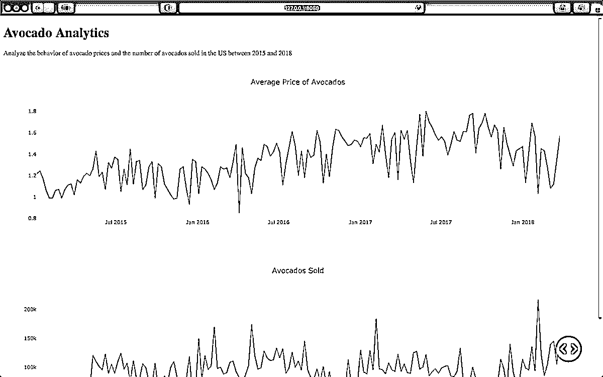
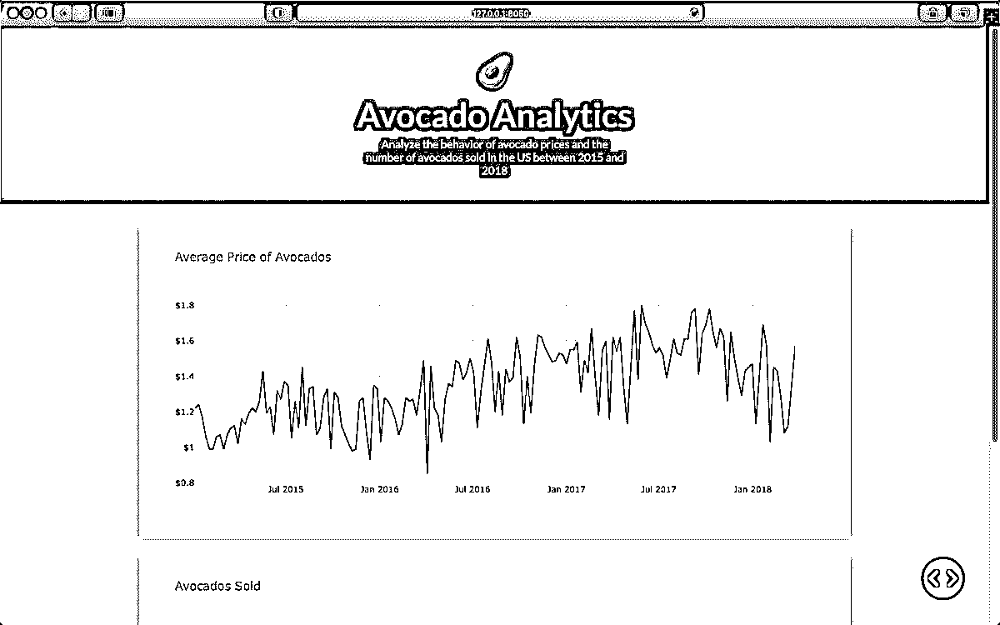
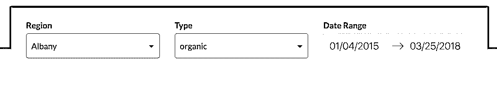

# 用 Dash 开发 Python 中的数据可视化接口

> 原文：<https://realpython.com/python-dash/>

*立即观看**本教程有真实 Python 团队创建的相关视频课程。配合文字教程一起看，加深理解:[**Python 中的数据可视化接口带破折号**](/courses/data-viz-with-dash/)

在过去，创建分析性 web 应用程序是经验丰富的开发人员的任务，需要多种编程语言和框架的知识。现在不再是这样了。如今，你可以使用纯 Python 制作数据可视化界面。一个流行的工具是[破折号](https://dash.plotly.com/introduction)。

Dash 使数据科学家能够在交互式 web 应用程序中展示他们的成果。你不需要成为[网页开发](https://realpython.com/learning-paths/become-python-web-developer/)的专家。一个下午的时间，你就可以构建并部署一个 Dash 应用，与他人分享。

**在本教程中，您将学习如何:**

*   创建一个 **Dash 应用程序**
*   使用 Dash **核心组件**和 **HTML 组件**
*   **定制 Dash 应用程序的风格**
*   使用**回调**构建交互式应用
*   在 **Heroku** 上部署您的应用程序

您可以通过单击下面的链接下载您将在本教程中制作的示例应用程序的源代码、数据和资源:

**获取源代码:** [点击此处获取源代码，您将在本教程中使用](https://realpython.com/bonus/dash-code/)了解如何使用 Dash 在 Python 中创建数据可视化接口。

## Dash 是什么？

Dash 是一个用于构建数据可视化界面的开源框架。它于 2017 年作为 Python 库发布，现已发展到包括 R 和 Julia 的实现。Dash 帮助数据科学家构建分析 web 应用程序，而不需要高级 web 开发知识。

三项技术构成了 Dash 的核心:

1.  **Flask** 提供网络服务器功能。
2.  **React.js** 渲染网页的用户界面。
3.  **Plotly.js** 生成应用程序中使用的图表。

但是你不必担心让所有这些技术一起工作。达什会帮你做的。你只需要写 Python，R，或者 Julia，再撒上一点 CSS。

总部位于加拿大的公司 Plotly 建立了 Dash 并支持其发展。你可能从与它同名的[流行图形库](https://plotly.com/graphing-libraries/)中知道这家公司。Plotly(该公司)开源了 Dash，并在[麻省理工学院许可](https://tldrlegal.com/license/mit-license)下发布，所以你可以免费使用 Dash。

Plotly 还提供 Dash 的商业伙伴，名为 [Dash Enterprise](https://plotly.com/dash/) 。这项付费服务为公司提供支持服务，例如托管、部署和处理 Dash 应用程序上的身份验证。但这些功能不属于 Dash 的开源生态系统。

Dash 将帮助您快速构建仪表板。如果您习惯于使用 Python 分析数据或构建数据可视化，那么 Dash 将是您工具箱中一个有用的补充。这里有几个你可以用 Dash 做的例子:

*   [实时分析交易头寸的仪表板](https://dash-gallery.plotly.host/dash-web-trader/)
*   [数百万优步游乐设施的可视化效果](https://dash-gallery.plotly.host/dash-uber-rides-demo/)
*   [交互式财务报告](https://dash-gallery.plotly.host/dash-financial-report/)

这只是一个微小的样本。如果你想看看其他有趣的用例，那么去查看一下 [Dash 应用程序库](https://dash-gallery.plotly.host/Portal/)。

**注意:**你不需要 web 开发的高级知识来学习这个教程，但是熟悉一些 [HTML 和 CSS](https://realpython.com/html-css-python/) 不会有坏处。

本教程的其余部分假设您了解以下主题的基础知识:

*   Python 图形库，如 Plotly、 [Bokeh](https://realpython.com/python-data-visualization-bokeh/) 或 [Matplotlib](https://realpython.com/python-matplotlib-guide/)
*   HTML 和 HTML 文件的[结构](https://developer.mozilla.org/en-US/docs/Learn/HTML/Introduction_to_HTML/Getting_started)
*   [CSS 和样式表](https://developer.mozilla.org/en-US/docs/Learn/CSS/First_steps/Getting_started)

如果您对这些要求感到满意，并且想在您的下一个项目中学习如何使用 Dash，那么请继续下面的部分！

[*Remove ads*](/account/join/)

## Python 中的 Dash 入门

在本教程中，您将经历使用 Dash 构建仪表板的端到端过程。如果您按照示例进行操作，那么您将从本地机器上的一个基本仪表板变成部署在 [Heroku](https://www.heroku.com/about) 上的一个风格化的仪表板。

为了构建仪表板，您将使用 2015 年至 2018 年间美国鳄梨的销售和价格的数据集。这个数据集是由[贾斯汀·基金斯](https://justinkiggins.com/about)利用来自[哈斯鳄梨委员会](https://www.hassavocadoboard.com/retail/volume-and-price-data)的数据汇编而成。

### 如何设置您的本地环境

为了开发你的应用，你需要一个新的目录来存储你的代码和数据，以及一个干净的 Python 3 [虚拟环境](https://realpython.com/python-virtual-environments-a-primer/)。要创建这些版本，请遵循以下说明，选择与您的操作系统相匹配的版本。

如果您使用的是 **Windows** ，那么打开命令提示符并执行这些命令:

```py
c:\> mkdir avocado_analytics && cd avocado_analytics
c:\> c:\path\to\python\launcher\python -m venv venv
c:\> venv\Scripts\activate.bat
```

第一个命令为您的项目创建一个目录，并将您的当前位置移动到那里。第二个命令在该位置创建一个虚拟环境。最后一个命令激活虚拟环境。确保用 Python 3 启动器的路径替换第二个命令中的路径。

如果你使用的是 macOS(苹果操作系统)或 Linux(T2 操作系统)，那么在终端上遵循以下步骤:

```py
$ mkdir avocado_analytics && cd avocado_analytics
$ python3 -m venv venv
$ source venv/bin/activate
```

前两个命令执行以下操作:

1.  创建一个名为`avocado_analytics`的目录
2.  将您的当前位置移动到`avocado_analytics`目录
3.  在该目录中创建一个名为`venv`的干净的虚拟环境

最后一个命令激活您刚刚创建的虚拟环境。

接下来，您需要安装所需的库。你可以在你的虚拟环境中使用 [`pip`](https://realpython.com/what-is-pip/) 来实现。按如下方式安装库:

```py
(venv) $ python -m pip install dash==1.13.3 pandas==1.0.5
```

这个命令将在你的虚拟环境中安装 Dash 和熊猫。您将使用这些包的特定版本来确保您拥有与本教程中使用的环境相同的环境。除了 Dash 之外，pandas 还将帮助你处理阅读和争论你将在应用程序中使用的数据。

最后，您需要一些数据输入到您的仪表板中。您可以通过单击下面的链接下载本教程中的数据和代码:

**获取源代码:** [点击此处获取源代码，您将在本教程中使用](https://realpython.com/bonus/dash-code/)了解如何使用 Dash 在 Python 中创建数据可视化接口。

将数据保存为项目根目录下的`avocado.csv`。到目前为止，您应该已经有了一个虚拟环境，其中包含所需的库和项目根文件夹中的数据。您的项目结构应该如下所示:

```py
avocado_analytics/
|
├── venv/
|
└── avocado.csv
```

你可以走了！接下来，您将构建您的第一个 Dash 应用程序。

[*Remove ads*](/account/join/)

### 如何构建 Dash 应用程序

出于开发目的，将构建 Dash 应用程序的过程分为两步是很有用的:

1.  使用应用程序的**布局**定义应用程序的外观。
2.  使用**回调**来确定你的应用程序的哪些部分是交互式的，以及它们对什么做出反应。

在这一节中，您将学习布局，在后面的一节中，您将学习[如何使您的仪表板交互](#add-interactivity-to-your-dash-apps-using-callbacks)。首先，设置初始化应用程序所需的一切，然后定义应用程序的布局。

#### 初始化您的 Dash 应用程序

在项目的根目录下创建一个名为`app.py`的空文件，然后查看本节中`app.py`的代码。为了让你更容易复制完整的代码，你会在本节末尾找到`app.py`的全部内容。

下面是`app.py`的前几行:

```py
 1import dash
 2import dash_core_components as dcc
 3import dash_html_components as html
 4import pandas as pd
 5
 6data = pd.read_csv("avocado.csv")
 7data = data.query("type == 'conventional' and region == 'Albany'")
 8data["Date"] = pd.to_datetime(data["Date"], format="%Y-%m-%d")
 9data.sort_values("Date", inplace=True)
10
11app = dash.Dash(__name__)
```

在第 1 到 4 行，您导入所需的库:`dash`、`dash_core_components`、`dash_html_components`和`pandas`。每个库都为您的应用程序提供了一个构建块:

*   **`dash`** 帮助你初始化你的应用程序。
*   **`dash_core_components`** 允许您创建交互式组件，如图表、下拉列表或日期范围。
*   **`dash_html_components`** 让你访问 HTML 标签。
*   **`pandas`** 帮助你阅读和组织数据。

在第 6 到 9 行，您[读取数据](https://realpython.com/python-csv/#reading-csv-files-with-pandas)并对其进行预处理，以便在仪表板中使用。您过滤了一些数据，因为您的仪表板的当前版本不是交互式的，否则绘制的值没有意义。

在第 11 行，您创建了一个`Dash`类的实例。如果你以前用过 [Flask](https://realpython.com/tutorials/flask/) ，那么初始化`Dash`类可能看起来很熟悉。在 Flask 中，通常使用`Flask(__name__)`初始化 WSGI 应用程序。同样，对于一个 Dash 应用，你使用`Dash(__name__)`。

#### 定义 Dash 应用程序的布局

接下来，您将定义应用程序的`layout`属性。这个属性决定了你的应用程序的外观。在这种情况下，您将使用一个标题，标题下有一段描述和两个图表。你可以这样定义它:

```py
13app.layout = html.Div(
14    children=[
15        html.H1(children="Avocado Analytics",),
16        html.P(
17            children="Analyze the behavior of avocado prices"
18            " and the number of avocados sold in the US"
19            " between 2015 and 2018",
20        ),
21        dcc.Graph(
22            figure={
23                "data": [
24                    {
25                        "x": data["Date"],
26                        "y": data["AveragePrice"],
27                        "type": "lines",
28                    },
29                ],
30                "layout": {"title": "Average Price of Avocados"},
31            },
32        ),
33        dcc.Graph(
34            figure={
35                "data": [
36                    {
37                        "x": data["Date"],
38                        "y": data["Total Volume"],
39                        "type": "lines",
40                    },
41                ],
42                "layout": {"title": "Avocados Sold"},
43            },
44        ),
45    ]
46)
```

这段代码定义了`app`对象的`layout`属性。该属性使用由 Dash 组件组成的树结构来确定应用程序的外观。

Dash 组件预先打包在 Python 库中。有的装的时候自带 Dash。其余的你要单独安装。几乎每个应用程序中都有两组组件:

1.  [Dash HTML Components](https://dash.plotly.com/dash-html-components) 为你提供 HTML 元素的 Python 包装器。例如，您可以使用此库来创建段落、标题或列表等元素。
2.  [Dash Core Components](https://dash.plotly.com/dash-core-components) 为您提供了创建交互式用户界面的 Python 抽象。您可以使用它来创建交互式元素，如图形、滑块或下拉列表。

在第 13 到 20 行，您可以看到实际的 Dash HTML 组件。首先定义父组件，一个`html.Div`。然后再添加两个元素，一个标题(`html.H1`)和一个段落(`html.P`)，作为它的子元素。

这些组件相当于`div`、`h1`和`p` HTML 标签。您可以使用组件的参数来修改标签的属性或内容。例如，要指定在`div`标签中包含什么，可以在`html.Div`中使用`children`参数。

组件中还有其他参数，如`style`、`className`或`id`，它们引用 HTML 标签的属性。在下一节中，您将看到如何使用这些属性来设计您的仪表板。

第 13 到 20 行显示的布局部分将被转换成下面的 HTML 代码:

```py
<div>
  <h1>Avocado Analytics</h1>
  <p>
    Analyze the behavior of avocado prices and the number
    of avocados sold in the US between 2015 and 2018
  </p>
  <!-- Rest of the app -->
</div>
```

当您在浏览器中打开应用程序时，会呈现此 HTML 代码。它遵循与 Python 代码相同的结构，带有一个包含一个`h1`和一个`p`元素的`div`标签。

在布局代码片段的第 21 到 24 行，您可以看到来自 Dash Core Components 的 graph 组件。`app.layout`中有两个`dcc.Graph`组件。第一个是研究期间鳄梨的平均价格，第二个是同一时期在美国销售的鳄梨数量。

在幕后，Dash 使用 Plotly.js 来生成图形。`dcc.Graph`组件期望一个[图形对象](https://plotly.com/python/figure-structure/)或一个 [Python 字典](https://realpython.com/python-dicts/)包含绘图的数据和布局。在这种情况下，您提供了后者。

最后，这两行代码帮助您运行应用程序:

```py
48if __name__ == "__main__":
49    app.run_server(debug=True)
```

第 48 和 49 行使得使用 Flask 的内置服务器在本地运行 Dash 应用程序成为可能。来自`app.run_server`的`debug=True`参数启用应用程序中的**热重装**选项。这意味着当您对应用程序进行更改时，它会自动重新加载，而无需您重新启动服务器。

最后，这里是完整版的`app.py`。您可以将这段代码复制到您之前创建的空的`app.py`中。


```py
import dash
import dash_core_components as dcc
import dash_html_components as html
import pandas as pd

data = pd.read_csv("avocado.csv")
data = data.query("type == 'conventional' and region == 'Albany'")
data["Date"] = pd.to_datetime(data["Date"], format="%Y-%m-%d")
data.sort_values("Date", inplace=True)

app = dash.Dash(__name__)

app.layout = html.Div(
    children=[
        html.H1(children="Avocado Analytics",),
        html.P(
            children="Analyze the behavior of avocado prices"
            " and the number of avocados sold in the US"
            " between 2015 and 2018",
        ),
        dcc.Graph(
            figure={
                "data": [
                    {
                        "x": data["Date"],
                        "y": data["AveragePrice"],
                        "type": "lines",
                    },
                ],
                "layout": {"title": "Average Price of Avocados"},
            },
        ),
        dcc.Graph(
            figure={
                "data": [
                    {
                        "x": data["Date"],
                        "y": data["Total Volume"],
                        "type": "lines",
                    },
                ],
                "layout": {"title": "Avocados Sold"},
            },
        ),
    ]
)

if __name__ == "__main__":
    app.run_server(debug=True)
```

这是一个基本仪表板的代码。它包括您在本节前面回顾的所有代码片段。

现在是运行应用程序的时候了。在项目的根目录和项目的虚拟环境中打开一个终端。运行`python app.py`，然后使用您喜欢的浏览器转到`http://localhost:8050`。

它还活着！您的仪表板应该如下所示:

[](https://files.realpython.com/media/barebones_small.929570811d70.jpg)

好消息是您现在有了一个工作版本的仪表板。坏消息是，在向其他人展示之前，还有一些工作要做。仪表板在视觉上并不令人满意，您仍然需要为它添加一些交互性。

但是不要担心，您将在接下来的章节中学习如何解决这些问题。

[*Remove ads*](/account/join/)

## 设计您的 Dash 应用程序

Dash 为您定制应用程序的外观提供了很大的灵活性。您可以使用自己的 CSS 或 JavaScript 文件，设置一个 **favicon** (显示在网络浏览器上的小图标)，嵌入图像，以及其他高级选项。

在本节中，您将学习如何将自定义样式应用于组件，然后您将样式化您在上一节中构建的仪表板。

### 如何将自定义样式应用到组件中

可以通过两种方式设置组件的样式:

1.  使用单个组件的`style`参数
2.  提供外部 CSS 文件

使用`style`参数定制您的仪表板非常简单。该参数采用一个 Python 字典，其中的键值对由 CSS 属性的名称和要设置的值组成。

**注意:**在`style`参数中指定 CSS 属性时，应该使用 mixedCase 语法，而不是用连字符分隔的单词。例如，要改变一个元素的背景颜色，你应该使用`backgroundColor`而不是`background-color`。

如果你想改变`app.py`中`H1`元素的大小和颜色，那么你可以如下设置元素的`style`参数:

```py
html.H1(
    children="Avocado Analytics",
 style={"fontSize": "48px", "color": "red"}, ),
```

在这里，您向`style`提供一个字典，其中包含您想要为它们设置的属性和值。在这种情况下，指定的样式是红色标题，字体大小为 48 像素。

使用`style`参数的缺点是，随着代码库的增长，它不能很好地伸缩。如果您的仪表板有多个您希望看起来相同的组件，那么您将会重复很多代码。相反，您可以使用自定义 CSS 文件。

如果你想要包含你自己的本地 CSS 或者 [JavaScript](https://realpython.com/python-vs-javascript/) 文件，那么你需要在你的项目的根目录下创建一个名为`assets/`的文件夹，并保存你想要添加的文件。默认情况下，Dash 会自动为`assets/`中包含的任何文件提供服务。这也适用于添加一个 favicon 或嵌入图像，你很快就会看到。

然后，您可以使用组件的`className`或`id`参数通过 CSS 调整它们的样式。这些参数在转换成 HTML 标签时与 [`class`](https://www.w3schools.com/html/html_classes.asp) 和 [`id`](https://www.w3schools.com/html/html_id.asp) 属性相对应。

如果您想调整`app.py`中`H1`元素的字体大小和文本颜色，那么您可以使用如下的`className`参数:

```py
html.H1(
    children="Avocado Analytics",
 className="header-title", ),
```

设置`className`参数将为`H1`元素定义 class 属性。然后你可以在`assets`文件夹中使用一个 CSS 文件来指定你想要的外观:

```py
.header-title  { font-size:  48px; color:  red; }
```

你使用一个[类选择器](https://www.w3schools.com/cssref/sel_class.asp)来格式化你的 CSS 文件中的标题。该选择器将调整标题格式。您也可以通过设置`className="header-title"`将它与其他需要共享格式的元素一起使用。

接下来，您将设计仪表板的样式。

[*Remove ads*](/account/join/)

### 如何改善您仪表板的外观

您刚刚介绍了 Dash 中造型的基础知识。现在，您将学习如何定制您的仪表板的外观。您将做出以下改进:

*   向页面添加网站图标和标题
*   更改仪表板的字体系列
*   使用外部 CSS 文件来设置仪表板组件的样式

您将从学习如何在应用程序中使用外部资产开始。这将允许您添加一个 favicon、一个自定义字体系列和一个 CSS 样式表。然后，您将学习如何使用`className`参数将定制样式应用到您的 Dash 组件。

#### 向您的应用添加外部资产

在项目的根目录下创建一个名为`assets/`的文件夹。[从](https://raw.githubusercontent.com/dylanjcastillo/materials/python-dash/python-dash/additional_files/favicon.ico) [Twemoji 开源项目](https://github.com/twitter/twemoji)中下载一个 favicon ，在`assets/`中另存为`favicon.ico`。最后，在`assets/`中创建一个名为`style.css`的 CSS 文件和下面可折叠部分中的代码。


```py
body  { font-family:  "Lato",  sans-serif; margin:  0; background-color:  #F7F7F7; } .header  { background-color:  #222222; height:  256px; display:  flex; flex-direction:  column; justify-content:  center; } .header-emoji  { font-size:  48px; margin:  0  auto; text-align:  center; } .header-title  { color:  #FFFFFF; font-size:  48px; font-weight:  bold; text-align:  center; margin:  0  auto; } .header-description  { color:  #CFCFCF; margin:  4px  auto; text-align:  center; max-width:  384px; } .wrapper  { margin-right:  auto; margin-left:  auto; max-width:  1024px; padding-right:  10px; padding-left:  10px; margin-top:  32px; } .card  { margin-bottom:  24px; box-shadow:  0  4px  6px  0  rgba(0,  0,  0,  0.18); }
```

`assets/`文件包含您将应用于应用程序布局中组件的样式。现在，您的项目结构应该如下所示:

```py
avocado_analytics/
│
├── assets/
│   ├── favicon.ico
│   └── style.css
│
├── venv/
│
├── app.py
└── avocado.csv
```

一旦启动服务器，Dash 将自动提供位于`assets/`的文件。您在`assets/`中包含了两个文件:`favicon.ico`和`style.css`。对于设置默认的 favicon，您不必采取任何额外的步骤。为了使用您在`style.css`中定义的样式，您需要使用 Dash 组件中的`className`参数。

需要一些改变。您将包含一个外部样式表，向您的仪表板添加一个标题，并使用`style.css`文件对组件进行样式化。查看下面的更改。然后，在这一节的最后一部分，你会找到更新版`app.py`的完整代码。

以下是如何包含外部样式表并将标题添加到仪表板的方法:

```py
11external_stylesheets = [
12    {
13        "href": "https://fonts.googleapis.com/css2?"
14                "family=Lato:wght@400;700&display=swap",
15        "rel": "stylesheet",
16    },
17]
18app = dash.Dash(__name__, external_stylesheets=external_stylesheets)
19app.title = "Avocado Analytics: Understand Your Avocados!"
```

在第 11 行到第 18 行，您指定了一个外部 CSS 文件，一个想要加载到应用程序中的字体系列。外部文件被添加到应用程序的`head`标签中，并在应用程序的`body`加载之前加载。使用`external_stylesheets`参数添加外部 CSS 文件，或者使用`external_scripts`添加外部 JavaScript 文件，比如 Google Analytics。

在第 19 行，您设置了应用程序的标题。这是当你分享你的网站时，出现在你的网页浏览器的标题栏，谷歌的搜索结果，以及社交媒体卡片上的文字。

#### 定制组件的样式

要使用`style.css`中的样式，您需要使用 Dash 组件中的`className`参数。下面的代码将一个带有相应类选择器的`className`添加到组成仪表板标题的每个组件中:

```
21app.layout = html.Div(
22    children=[
23        html.Div(
24            children=[
25                html.P(children="🥑", className="header-emoji"),
26                html.H1(
27                    children="Avocado Analytics", className="header-title"
28                ),
29                html.P(
30                    children="Analyze the behavior of avocado prices"
31                    " and the number of avocados sold in the US"
32                    " between 2015 and 2018",
33                    className="header-description",
34                ),
35            ],
36            className="header",
37        ),
```py

在第 21 行到第 37 行，您可以看到仪表板的初始版本有两个变化:

1.  有一个新的段落元素，鳄梨表情符号将作为标志。
2.  每个组件中都有一个`className`参数。这些类名应该匹配`style.css`中的一个类选择器，它将定义每个组件的外观。

例如，分配给以`"Analyze the behavior of avocado prices"`开始的段落组件的`header-description`类在`style.css`中有一个对应的选择器:

```
29.header-description  { 30  color:  #CFCFCF; 31  margin:  4px  auto; 32  text-align:  center; 33  max-width:  384px; 34}
```py

`style.css`的第 29 到 34 行定义了`header-description`类选择器的格式。这些将改变任何带有`className="header-description"`的组件的颜色、边距、对齐和最大宽度。所有组件在 CSS 文件中都有相应的类选择器。

另一个显著的变化是在图表中。这是价格图表的新代码:

```
38html.Div(
39    children=[
40        html.Div(
41            children=dcc.Graph(
42                id="price-chart",
43                config={"displayModeBar": False},
44                figure={
45                    "data": [
46                        {
47                            "x": data["Date"],
48                            "y": data["AveragePrice"],
49                            "type": "lines",
50                            "hovertemplate": "$%{y:.2f}"
51                                                "<extra></extra>",
52                        },
53                    ],
54                    "layout": {
55                        "title": {
56                            "text": "Average Price of Avocados",
57                            "x": 0.05,
58                            "xanchor": "left",
59                        },
60                        "xaxis": {"fixedrange": True},
61                        "yaxis": {
62                            "tickprefix": "$",
63                            "fixedrange": True,
64                        },
65                        "colorway": ["#17B897"],
66                    },
67                },
68            ),
69            className="card",
70        ),
```py

在这段代码中，您为图表的参数`config`和`figure`定义了一个`className`和一些定制。变化如下:

*   **第 43 行**:移除默认情况下 Plotly 显示的浮动条。
*   **第 50 行和第 51 行:**您设置了悬停模板，以便当用户悬停在数据点上时，它显示以美元为单位的价格。它将显示为`$2.5`，而不是`2.5`。
*   **第 54 行到第 66 行:**您在图形的布局部分调整轴、图形的颜色和标题格式。
*   **第 69 行:**你用一个`"card"`类将图包装在一个`html.Div`中。这将给图形一个白色背景，并在其下方添加一个小阴影。

销售和成交量图表也有类似的调整。你可以在下面的可折叠部分看到更新的`app.py`的完整代码。


```
import dash
import dash_core_components as dcc
import dash_html_components as html
import pandas as pd

data = pd.read_csv("avocado.csv")
data = data.query("type == 'conventional' and region == 'Albany'")
data["Date"] = pd.to_datetime(data["Date"], format="%Y-%m-%d")
data.sort_values("Date", inplace=True)

external_stylesheets = [
    {
        "href": "https://fonts.googleapis.com/css2?"
        "family=Lato:wght@400;700&display=swap",
        "rel": "stylesheet",
    },
]
app = dash.Dash(__name__, external_stylesheets=external_stylesheets)
app.title = "Avocado Analytics: Understand Your Avocados!"

app.layout = html.Div(
    children=[
        html.Div(
            children=[
                html.P(children="🥑", className="header-emoji"),
                html.H1(
                    children="Avocado Analytics", className="header-title"
                ),
                html.P(
                    children="Analyze the behavior of avocado prices"
                    " and the number of avocados sold in the US"
                    " between 2015 and 2018",
                    className="header-description",
                ),
            ],
            className="header",
        ),
        html.Div(
            children=[
                html.Div(
                    children=dcc.Graph(
                        id="price-chart",
                        config={"displayModeBar": False},
                        figure={
                            "data": [
                                {
                                    "x": data["Date"],
                                    "y": data["AveragePrice"],
                                    "type": "lines",
                                    "hovertemplate": "$%{y:.2f}"
                                                     "<extra></extra>",
                                },
                            ],
                            "layout": {
                                "title": {
                                    "text": "Average Price of Avocados",
                                    "x": 0.05,
                                    "xanchor": "left",
                                },
                                "xaxis": {"fixedrange": True},
                                "yaxis": {
                                    "tickprefix": "$",
                                    "fixedrange": True,
                                },
                                "colorway": ["#17B897"],
                            },
                        },
                    ),
                    className="card",
                ),
                html.Div(
                    children=dcc.Graph(
                        id="volume-chart",
                        config={"displayModeBar": False},
                        figure={
                            "data": [
                                {
                                    "x": data["Date"],
                                    "y": data["Total Volume"],
                                    "type": "lines",
                                },
                            ],
                            "layout": {
                                "title": {
                                    "text": "Avocados Sold",
                                    "x": 0.05,
                                    "xanchor": "left",
                                },
                                "xaxis": {"fixedrange": True},
                                "yaxis": {"fixedrange": True},
                                "colorway": ["#E12D39"],
                            },
                        },
                    ),
                    className="card",
                ),
            ],
            className="wrapper",
        ),
    ]
)

if __name__ == "__main__":
    app.run_server(debug=True)
```py

这是`app.py`的更新版本。它对代码进行了必要的修改，添加了一个 favicon 和一个页面标题，更新了字体系列，并使用了一个外部 CSS 文件。经过这些更改后，您的仪表板应该如下所示:

[](https://files.realpython.com/media/styling_small.c3b8362982f1.jpg)

在下一节中，您将学习如何向仪表板添加交互式组件。

[*Remove ads*](/account/join/)

## 使用回调功能为您的 Dash 应用添加交互性

在本节中，您将学习如何向您的仪表板添加交互式元素。

Dash 的交互性基于一种[反应式编程](https://en.wikipedia.org/wiki/Reactive_programming)范式。这意味着您可以将组件与您想要更新的应用程序元素相链接。如果用户与输入组件(如下拉列表或范围滑块)进行交互，那么输出(如图表)将自动对输入的变化做出反应。

现在，让我们使您的仪表板具有交互性。这个新版本的仪表板将允许用户与以下过滤器进行交互:

*   地区
*   鳄梨的种类
*   日期范围

首先在下面的可折叠部分用新版本替换您的本地`app.py`。


```
import dash
import dash_core_components as dcc
import dash_html_components as html
import pandas as pd
import numpy as np
from dash.dependencies import Output, Input

data = pd.read_csv("avocado.csv")
data["Date"] = pd.to_datetime(data["Date"], format="%Y-%m-%d")
data.sort_values("Date", inplace=True)

external_stylesheets = [
    {
        "href": "https://fonts.googleapis.com/css2?"
        "family=Lato:wght@400;700&display=swap",
        "rel": "stylesheet",
    },
]
app = dash.Dash(__name__, external_stylesheets=external_stylesheets)
app.title = "Avocado Analytics: Understand Your Avocados!"

app.layout = html.Div(
    children=[
        html.Div(
            children=[
                html.P(children="🥑", className="header-emoji"),
                html.H1(
                    children="Avocado Analytics", className="header-title"
                ),
                html.P(
                    children="Analyze the behavior of avocado prices"
                    " and the number of avocados sold in the US"
                    " between 2015 and 2018",
                    className="header-description",
                ),
            ],
            className="header",
        ),
        html.Div(
            children=[
                html.Div(
                    children=[
                        html.Div(children="Region", className="menu-title"),
                        dcc.Dropdown(
                            id="region-filter",
                            options=[
                                {"label": region, "value": region}
                                for region in np.sort(data.region.unique())
                            ],
                            value="Albany",
                            clearable=False,
                            className="dropdown",
                        ),
                    ]
                ),
                html.Div(
                    children=[
                        html.Div(children="Type", className="menu-title"),
                        dcc.Dropdown(
                            id="type-filter",
                            options=[
                                {"label": avocado_type, "value": avocado_type}
                                for avocado_type in data.type.unique()
                            ],
                            value="organic",
                            clearable=False,
                            searchable=False,
                            className="dropdown",
                        ),
                    ],
                ),
                html.Div(
                    children=[
                        html.Div(
                            children="Date Range",
                            className="menu-title"
                            ),
                        dcc.DatePickerRange(
                            id="date-range",
                            min_date_allowed=data.Date.min().date(),
                            max_date_allowed=data.Date.max().date(),
                            start_date=data.Date.min().date(),
                            end_date=data.Date.max().date(),
                        ),
                    ]
                ),
            ],
            className="menu",
        ),
        html.Div(
            children=[
                html.Div(
                    children=dcc.Graph(
                        id="price-chart", config={"displayModeBar": False},
                    ),
                    className="card",
                ),
                html.Div(
                    children=dcc.Graph(
                        id="volume-chart", config={"displayModeBar": False},
                    ),
                    className="card",
                ),
            ],
            className="wrapper",
        ),
    ]
)

@app.callback(
    [Output("price-chart", "figure"), Output("volume-chart", "figure")],
    [
        Input("region-filter", "value"),
        Input("type-filter", "value"),
        Input("date-range", "start_date"),
        Input("date-range", "end_date"),
    ],
)
def update_charts(region, avocado_type, start_date, end_date):
    mask = (
        (data.region == region)
        & (data.type == avocado_type)
        & (data.Date >= start_date)
        & (data.Date <= end_date)
    )
    filtered_data = data.loc[mask, :]
    price_chart_figure = {
        "data": [
            {
                "x": filtered_data["Date"],
                "y": filtered_data["AveragePrice"],
                "type": "lines",
                "hovertemplate": "$%{y:.2f}<extra></extra>",
            },
        ],
        "layout": {
            "title": {
                "text": "Average Price of Avocados",
                "x": 0.05,
                "xanchor": "left",
            },
            "xaxis": {"fixedrange": True},
            "yaxis": {"tickprefix": "$", "fixedrange": True},
            "colorway": ["#17B897"],
        },
    }

    volume_chart_figure = {
        "data": [
            {
                "x": filtered_data["Date"],
                "y": filtered_data["Total Volume"],
                "type": "lines",
            },
        ],
        "layout": {
            "title": {"text": "Avocados Sold", "x": 0.05, "xanchor": "left"},
            "xaxis": {"fixedrange": True},
            "yaxis": {"fixedrange": True},
            "colorway": ["#E12D39"],
        },
    }
    return price_chart_figure, volume_chart_figure

if __name__ == "__main__":
    app.run_server(debug=True)
```py

接下来，用下面可折叠部分中的代码替换`style.css`。


```
body  { font-family:  "Lato",  sans-serif; margin:  0; background-color:  #F7F7F7; } .header  { background-color:  #222222; height:  288px; padding:  16px  0  0  0; } .header-emoji  { font-size:  48px; margin:  0  auto; text-align:  center; } .header-title  { color:  #FFFFFF; font-size:  48px; font-weight:  bold; text-align:  center; margin:  0  auto; } .header-description  { color:  #CFCFCF; margin:  4px  auto; text-align:  center; max-width:  384px; } .wrapper  { margin-right:  auto; margin-left:  auto; max-width:  1024px; padding-right:  10px; padding-left:  10px; margin-top:  32px; } .card  { margin-bottom:  24px; box-shadow:  0  4px  6px  0  rgba(0,  0,  0,  0.18); } .menu  { height:  112px; width:  912px; display:  flex; justify-content:  space-evenly; padding-top:  24px; margin:  -80px  auto  0  auto; background-color:  #FFFFFF; box-shadow:  0  4px  6px  0  rgba(0,  0,  0,  0.18); } .Select-control  { width:  256px; height:  48px; } .Select--single  >  .Select-control  .Select-value,  .Select-placeholder  { line-height:  48px; } .Select--multi  .Select-value-label  { line-height:  32px; } .menu-title  { margin-bottom:  6px; font-weight:  bold; color:  #079A82; }
```py

现在，您已经准备好开始向您的应用程序添加交互式组件了！

### 如何创建交互式组件

首先，您将学习如何创建用户可以与之交互的组件。为此，你将在你的图表上方加入一个新的`html.Div`。它将包括两个下拉框和一个日期范围选择器，用户可以使用它来过滤数据和更新图表。

下面是它在`app.py`中的样子:

```
24html.Div(
25    children=[
26        html.Div(
27            children=[
28                html.Div(children="Region", className="menu-title"),
29                dcc.Dropdown(
30                    id="region-filter",
31                    options=[
32                        {"label": region, "value": region}
33                        for region in np.sort(data.region.unique())
34                    ],
35                    value="Albany",
36                    clearable=False,
37                    className="dropdown",
38                ),
39            ]
40        ),
41        html.Div(
42            children=[
43                html.Div(children="Type", className="menu-title"),
44                dcc.Dropdown(
45                    id="type-filter",
46                    options=[
47                        {"label": avocado_type, "value": avocado_type}
48                        for avocado_type in data.type.unique()
49                    ],
50                    value="organic",
51                    clearable=False,
52                    searchable=False,
53                    className="dropdown",
54                ),
55            ],
56        ),
57        html.Div(
58            children=[
59                html.Div(
60                    children="Date Range",
61                    className="menu-title"
62                    ),
63                dcc.DatePickerRange(
64                    id="date-range",
65                    min_date_allowed=data.Date.min().date(),
66                    max_date_allowed=data.Date.max().date(),
67                    start_date=data.Date.min().date(),
68                    end_date=data.Date.max().date(),
69                ),
70            ]
71        ),
72    ],
73    className="menu",
74),
```py

在第 24 到 74 行，您在您的图形顶部定义了一个由两个下拉列表和一个日期范围选择器组成的`html.Div`。它将作为用户用来与数据交互的菜单:

[](https://files.realpython.com/media/dropdowns_and_daterange.4028753a720e.png)

菜单中的第一个组件是区域下拉列表。下面是该组件的代码:

```
41html.Div(
42    children=[
43        html.Div(children="Region", className="menu-title"),
44        dcc.Dropdown(
45            id="region-filter",
46            options=[
47                {"label": region, "value": region}
48                for region in np.sort(data.region.unique())
49            ],
50            value="Albany",
51            clearable=False,
52            className="dropdown",
53        ),
54    ]
55),
```py

在第 41 到 55 行，您定义了用户将用来按地区过滤数据的下拉列表。除了标题，它还有一个`dcc.Dropdown`的成分。以下是每个参数的含义:

*   **`id`** 是这个元素的标识符。
*   **`options`** 是选择下拉菜单时显示的选项。它需要一个带有标签和值的字典。
*   **`value`** 是页面加载时的默认值。
*   **`clearable`** 如果设置为`True`，允许用户将该字段留空。
*   **`className`** 是用于应用样式的类选择器。

类型和日期范围选择器遵循与区域下拉列表相同的结构。请自行检查。

接下来，看看`dcc.Graphs`组件:

```
 90html.Div(
 91    children=[
 92        html.Div(
 93            children=dcc.Graph(
 94                id="price-chart", config={"displayModeBar": False},
 95            ),
 96            className="card",
 97        ),
 98        html.Div(
 99            children=dcc.Graph(
100                id="volume-chart", config={"displayModeBar": False},
101            ),
102            className="card",
103        ),
104    ],
105    className="wrapper",
106),
```py

在第 90 到 106 行，您定义了`dcc.Graph`组件。您可能已经注意到，与以前版本的仪表板相比，组件缺少了`figure`参数。这是因为`figure`参数现在将由[回调函数](https://en.wikipedia.org/wiki/Callback_(computer_programming))使用用户使用区域、类型和日期范围选择器设置的输入来生成。

[*Remove ads*](/account/join/)

### 如何定义回调

您已经定义了用户将如何与您的应用程序交互。现在，您需要让您的应用程序对用户交互做出反应。为此，您将使用**回调函数。**

Dash 的回调函数是带有`app.callback` [修饰符](https://realpython.com/primer-on-python-decorators/)的常规 Python 函数。在 Dash 中，当输入改变时，会触发一个回调函数。该函数执行一些预定的操作，如过滤数据集，并将输出返回给应用程序。本质上，回调链接了应用程序中的输入和输出。

下面是用于更新图形的回调函数:

```
111@app.callback(
112    [Output("price-chart", "figure"), Output("volume-chart", "figure")],
113    [
114        Input("region-filter", "value"),
115        Input("type-filter", "value"),
116        Input("date-range", "start_date"),
117        Input("date-range", "end_date"),
118    ],
119)
120def update_charts(region, avocado_type, start_date, end_date):
121    mask = (
122        (data.region == region)
123        & (data.type == avocado_type)
124        & (data.Date >= start_date)
125        & (data.Date <= end_date)
126    )
127    filtered_data = data.loc[mask, :]
128    price_chart_figure = {
129        "data": [
130            {
131                "x": filtered_data["Date"],
132                "y": filtered_data["AveragePrice"],
133                "type": "lines",
134                "hovertemplate": "$%{y:.2f}<extra></extra>",
135            },
136        ],
137        "layout": {
138            "title": {
139                "text": "Average Price of Avocados",
140                "x": 0.05,
141                "xanchor": "left",
142            },
143            "xaxis": {"fixedrange": True},
144            "yaxis": {"tickprefix": "$", "fixedrange": True},
145            "colorway": ["#17B897"],
146        },
147    }
148
149    volume_chart_figure = {
150        "data": [
151            {
152                "x": filtered_data["Date"],
153                "y": filtered_data["Total Volume"],
154                "type": "lines",
155            },
156        ],
157        "layout": {
158            "title": {
159                "text": "Avocados Sold",
160                "x": 0.05,
161                "xanchor": "left"
162            },
163            "xaxis": {"fixedrange": True},
164            "yaxis": {"fixedrange": True},
165            "colorway": ["#E12D39"],
166        },
167    }
168    return price_chart_figure, volume_chart_figure
```py

在第 111 到 119 行，您在`app.callback`装饰器中定义了输入和输出。

首先，使用`Output`对象定义输出。这些对象有两个参数:

1.  当函数执行时，他们将修改的元素的标识符
2.  要修改的元素的属性

例如，`Output("price-chart", "figure")`将更新`"price-chart"`元素的`figure`属性。

然后使用`Input`对象定义输入。他们还提出了两个论点:

1.  他们将监视更改的元素的标识符
2.  被监视元素的属性，当发生更改时，它们应该采用该属性

因此，`Input("region-filter", "value")`将观察`"region-filter"`元素的变化，如果元素发生变化，将获取其`value`属性。

**注:**这里讨论的`Input`对象是从`dash.dependencies`导入的。注意不要把它和来自`dash_core_components`的组件混淆。这些对象不可互换，并且有不同的用途。

在第 120 行，您定义了当输入改变时将应用的函数。这里需要注意的一点是，函数的参数将与提供给回调的`Input`对象的顺序相对应。函数中参数的名称和输入对象中指定的值之间没有明确的关系。

最后，在第 121 到 164 行，您定义了函数体。在这种情况下，该函数接受输入(地区、鳄梨类型和日期范围)，过滤数据，并为价格和交易量图表生成图形对象。

仅此而已！如果您已经遵循了这一点，那么您的仪表板应该是这样的:

[https://player.vimeo.com/video/489978858?background=1](https://player.vimeo.com/video/489978858?background=1)

好样的。这是您的仪表板的最终版本。除了让它看起来很漂亮，你还让它具有了互动性。唯一缺少的一步是将它公之于众，这样你就可以与他人分享。

## 将您的 Dash 应用程序部署到 Heroku

您已经完成了应用程序的构建，并且拥有了一个漂亮的、完全交互式的仪表板。现在您将学习如何部署它。

Dash 应用程序是 Flask 应用程序，因此两者共享相同的[部署选项](https://flask.palletsprojects.com/en/1.1.x/deploying/)。在本节中，您将在 Heroku 上部署您的应用程序。

在开始之前，确保你已经安装了 [Heroku 命令行界面(CLI)](https://devcenter.heroku.com/articles/heroku-cli) 和 [Git](https://git-scm.com/book/en/v2/Getting-Started-Installing-Git) 。您可以通过在命令提示符(Windows)或终端(macOS、Linux)上运行以下命令来验证您的系统中是否存在这两者:

```
$ git --version
git version 2.21.1 (Apple Git-122.3)
$ heroku --version
heroku/7.42.2 darwin-x64 node-v12.16.2
```py

根据您的操作系统和您安装的版本，输出可能会有一些变化，但是您应该不会得到错误。

我们开始吧！

首先，您需要在`app.py`中做一个小小的改变。在第 18 行初始化应用程序后，添加一个名为`server`的新的[变量](https://realpython.com/python-variables/):

```
18app = dash.Dash(__name__, external_stylesheets=external_stylesheets)
19server = app.server
```py

使用一个 [WSGI 服务器](https://www.python.org/dev/peps/pep-3333/)来运行你的应用程序，这个添加是必要的。不建议在生产中使用 Flask 的内置服务器，因为它不能处理太多的流量。

接下来，在项目的根目录下，创建一个名为`runtime.txt`的文件，在这里您将为 Heroku 应用程序指定一个 Python 版本:

```
python-3.8.6
```py

当你部署你的应用程序时，Heroku 会自动检测出它是一个 Python 应用程序，并使用正确的`buildpack`。如果您还提供了一个`runtime.txt`，那么它将确定您的应用程序将使用的 Python 版本。

接下来，在项目的根目录下创建一个`requirements.txt`文件，您将在其中复制在 web 服务器上设置 Dash 应用程序所需的库:

```
dash==1.13.3
pandas==1.0.5
gunicorn==20.0.4
```py

你可能注意到了，`requirements.txt`里有个包你到现在都没见过:`gunicorn`。Gunicorn 是一个 WSGI [HTTP](https://realpython.com/python-https/#what-is-http) 服务器，经常用于将 Flask 应用程序部署到产品中。您将使用它来部署您的仪表板。

现在创建一个名为`Procfile`的文件，内容如下:

```
web: gunicorn app:server
```py

这个文件告诉 Heroku 应用程序应该执行什么命令来启动你的应用程序。在这种情况下，它为您的仪表板启动一个`gunicorn`服务器。

接下来，您需要初始化一个 [Git](https://realpython.com/python-git-github-intro/) 存储库。为此，转到项目的根目录并执行以下命令:

```
$ git init
```py

这将在`avocado_analytics/`中启动一个`Git`存储库。它将开始跟踪您对该目录中的文件所做的所有更改。

但是，有些文件是您不希望使用 Git 跟踪的。例如，您通常想要删除 Python 编译的文件、虚拟环境文件夹的内容或元数据文件，如`.DS_Store`。

为了避免跟踪不必要的文件，在根目录中创建一个名为`.gitignore`的文件。然后在里面复制以下内容:

```
venv
*.pyc
.DS_Store # Only if you are using macOS
```py

这将确保您的存储库不会跟踪不必要的文件。现在提交您的项目文件:

```
$ git add .
$ git commit -m 'Add dashboard files'
```py

在最后一步之前，确保你已经准备好了一切。您的项目结构应该如下所示:

```
avocado_analytics/
│
├── assets/
│   ├── favicon.ico
│   └── style.css
│
├── venv/
│
├── app.py
├── avocado.csv
├── Procfile
├── requirements.txt
└── runtime.txt
```py

最后，您需要在 Heroku 中创建一个应用程序，使用 Git 将您的代码推送到那里，并在 Heroku 的一个免费服务器选项中启动应用程序。您可以通过运行以下命令来实现这一点:

```
$ heroku create APP-NAME # Choose a name for your app
$ git push heroku master
$ heroku ps:scale web=1
```

第一个命令将在 Heroku 上创建一个新的应用程序和一个关联的 Git 存储库。第二个会将更改推送到那个存储库，第三个会在 Heroku 的一个免费服务器选项中启动你的应用程序。

就是这样！您已经构建并部署了您的仪表板。现在你只需要访问它，与你的朋友分享。要访问您的应用程序，请在您的浏览器中复制`https://APP-NAME.herokuapp.com/`，并用您在上一步中定义的名称替换`APP-NAME`。

如果你很好奇，可以看看一个[示例应用](https://avocado-analytics.herokuapp.com/)。

[*Remove ads*](/account/join/)

## 结论

恭喜你！您刚刚使用 Dash 构建、定制并部署了您的第一个仪表板。你从一个简单的仪表板变成了一个部署在 Heroku 上的完全交互式的仪表板。

有了这些知识，您就可以使用 Dash 来构建分析应用程序，并与他人共享。随着越来越多的公司更加重视数据的使用，知道如何使用 Dash 将增加你在工作场所的影响。过去只有专家才能完成的任务，现在一个下午就能完成。

**在本教程中，您已经学习了:**

*   如何**使用 Dash 创建仪表板**
*   如何**定制【Dash 应用程序的样式**
*   如何使用 Dash 组件使您的应用程序**具有交互性**
*   什么是**回调**以及如何使用它们来创建交互式应用程序
*   如何在 Heroku 上部署您的应用程序

现在，您已经准备好开发新的 Dash 应用程序了。找到一个数据集，想到一些令人兴奋的可视化，并建立另一个仪表板！

您可以通过单击下面的链接下载您在本教程中制作的示例应用程序的源代码、数据和资源:

**获取源代码:** [点击此处获取源代码，您将在本教程中使用](https://realpython.com/bonus/dash-code/)了解如何使用 Dash 在 Python 中创建数据可视化接口。

*立即观看**本教程有真实 Python 团队创建的相关视频课程。配合文字教程一起看，加深理解:[**Python 中的数据可视化接口带破折号**](/courses/data-viz-with-dash/)*********