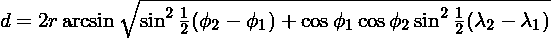

# Python 3.7+中的数据类(指南)

> 原文：<https://realpython.com/python-data-classes/>

*立即观看**本教程有真实 Python 团队创建的相关视频课程。和书面教程一起看，加深理解: [**在 Python 中使用数据类**](/courses/python-data-classes/)

Python 3.7 中一个令人兴奋的新特性是数据类。数据类通常主要包含数据，尽管实际上没有任何限制。它是使用新的`@dataclass`装饰器创建的，如下所示:

```py
from dataclasses import dataclass

@dataclass
class DataClassCard:
    rank: str
    suit: str
```

**注意:**这段代码，以及本教程中的所有其他例子，将只在 Python 3.7 和更高版本中工作。

数据类带有已经实现的基本功能。例如，您可以立即实例化、打印和比较数据类实例:

>>>

```py
>>> queen_of_hearts = DataClassCard('Q', 'Hearts')
>>> queen_of_hearts.rank
'Q'
>>> queen_of_hearts
DataClassCard(rank='Q', suit='Hearts')
>>> queen_of_hearts == DataClassCard('Q', 'Hearts')
True
```

与普通班级相比。最小的常规类应该是这样的:

```py
class RegularCard:
    def __init__(self, rank, suit):
        self.rank = rank
        self.suit = suit
```

虽然没有更多的代码要写，但是您已经可以看到样板文件之痛的迹象:`rank`和`suit`都重复了三次，只是为了初始化一个对象。此外，如果您尝试使用这个普通的类，您会注意到对象的表示不是非常具有描述性，并且由于某种原因，红心皇后与红心皇后不同:

>>>

```py
>>> queen_of_hearts = RegularCard('Q', 'Hearts')
>>> queen_of_hearts.rank
'Q'
>>> queen_of_hearts
<__main__.RegularCard object at 0x7fb6eee35d30>
>>> queen_of_hearts == RegularCard('Q', 'Hearts')
False
```

似乎数据类正在幕后帮助我们。默认情况下，数据类实现了一个 [`.__repr__()`方法](https://realpython.com/operator-function-overloading/)来提供良好的字符串表示，还实现了一个`.__eq__()`方法来进行基本的对象比较。为了让`RegularCard`类模仿上面的数据类，您还需要添加这些方法:

```py
class RegularCard
    def __init__(self, rank, suit):
        self.rank = rank
        self.suit = suit

    def __repr__(self):
        return (f'{self.__class__.__name__}'
                f'(rank={self.rank!r}, suit={self.suit!r})')

    def __eq__(self, other):
        if other.__class__ is not self.__class__:
            return NotImplemented
        return (self.rank, self.suit) == (other.rank, other.suit)
```

在本教程中，您将确切了解数据类提供了哪些便利。除了漂亮的表示和比较，您还会看到:

*   如何向数据类字段添加默认值
*   数据类如何允许对象排序
*   如何表示不可变数据
*   数据类如何处理继承

我们将很快深入研究数据类的这些特性。然而，你可能会想你以前已经见过类似的东西了。

**免费下载:** [从 Python 技巧中获取一个示例章节:这本书](https://realpython.com/bonus/python-tricks-sample-pdf/)用简单的例子向您展示了 Python 的最佳实践，您可以立即应用它来编写更漂亮的+Python 代码。

## 数据类的替代方案

对于简单的数据结构，你可能已经使用过[、`tuple`或`dict`、](https://dbader.org/blog/records-structs-and-data-transfer-objects-in-python)。您可以用以下任何一种方式代表红心皇后牌:

>>>

```py
>>> queen_of_hearts_tuple = ('Q', 'Hearts')
>>> queen_of_hearts_dict = {'rank': 'Q', 'suit': 'Hearts'}
```

它工作了。然而，作为一名程序员，这给你带来了很多责任:

*   你需要记住的是`queen_of_hearts_...` [变量](https://realpython.com/python-variables/)代表一张牌。
*   对于`tuple`版本，你需要记住属性的顺序。编写`('Spades', 'A')`会搞乱你的程序，但可能不会给你一个容易理解的错误信息。
*   如果您使用`dict`版本，您必须确保属性的名称是一致的。例如`{'value': 'A', 'suit': 'Spades'}`将无法按预期工作。

此外，使用这些结构并不理想:

>>>

```py
>>> queen_of_hearts_tuple[0]  # No named access
'Q'
>>> queen_of_hearts_dict['suit']  # Would be nicer with .suit
'Hearts'
```

更好的选择是 [`namedtuple`](https://dbader.org/blog/writing-clean-python-with-namedtuples) 。它长期以来被用来创建可读的小型数据结构。事实上，我们可以像这样使用`namedtuple`重新创建上面的数据类示例:

```py
from collections import namedtuple

NamedTupleCard = namedtuple('NamedTupleCard', ['rank', 'suit'])
```

`NamedTupleCard`的这个定义将给出与我们的`DataClassCard`示例完全相同的输出:

>>>

```py
>>> queen_of_hearts = NamedTupleCard('Q', 'Hearts')
>>> queen_of_hearts.rank
'Q'
>>> queen_of_hearts
NamedTupleCard(rank='Q', suit='Hearts')
>>> queen_of_hearts == NamedTupleCard('Q', 'Hearts')
True
```

那么，为什么还要麻烦数据类呢？首先，数据类提供了比你目前所见更多的特性。同时，`namedtuple`还有一些其他不一定可取的特性。按照设计，一个`namedtuple`是一个常规元组。这可以从比较中看出，例如:

>>>

```py
>>> queen_of_hearts == ('Q', 'Hearts')
True
```

虽然这看起来是件好事，但是缺乏对自身类型的了解可能会导致微妙且难以发现的错误，尤其是因为它还会乐于比较两个不同的`namedtuple`类:

>>>

```py
>>> Person = namedtuple('Person', ['first_initial', 'last_name']
>>> ace_of_spades = NamedTupleCard('A', 'Spades')
>>> ace_of_spades == Person('A', 'Spades')
True
```

`namedtuple`也有一些限制。例如，很难向`namedtuple`中的一些字段添加默认值。一个`namedtuple`本质上也是不可改变的。也就是说，`namedtuple`的值永远不会改变。在某些应用程序中，这是一个很棒的功能，但在其他设置中，如果有更多的灵活性就更好了:

>>>

```py
>>> card = NamedTupleCard('7', 'Diamonds')
>>> card.rank = '9'
AttributeError: can't set attribute
```

数据类不会取代`namedtuple`的所有用途。例如，如果您需要您的数据结构表现得像一个元组，那么命名元组是一个很好的选择！

另一个选择，也是数据类的[灵感之一，是](https://mail.python.org/pipermail/python-dev/2017-December/151034.html) [`attrs`项目](http://www.attrs.org)。安装了`attrs`(`pip install attrs`)后，可以编写如下的卡类:

```py
import attr

@attr.s
class AttrsCard:
    rank = attr.ib()
    suit = attr.ib()
```

这可以以与前面的`DataClassCard`和`NamedTupleCard`示例完全相同的方式使用。`attrs`项目很棒，支持一些数据类不支持的特性，包括转换器和验证器。此外，`attrs`已经存在了一段时间，在 Python 2.7 以及 Python 3.4 和更高版本中都得到了支持。然而，由于`attrs`不是标准库的一部分，它给你的项目增加了一个外部[依赖项](https://realpython.com/courses/managing-python-dependencies/)。通过数据类，类似的功能将随处可见。

除了`tuple`、`dict`、`namedtuple`、`attrs`之外，还有[很多其他类似的项目](https://www.python.org/dev/peps/pep-0557/#rationale)，包括 [`typing.NamedTuple`](https://docs.python.org/library/typing.html#typing.NamedTuple) 、 [`namedlist`](https://pypi.org/project/namedlist/) 、 [`attrdict`](https://pypi.org/project/attrdict/) 、 [`plumber`](https://pypi.org/project/plumber/) 、 [`fields`](https://pypi.org/project/fields/) 。虽然数据类是一个很好的新选择，但是仍然有旧的变体更适合的用例。例如，如果您需要与期望元组的特定 API 兼容，或者需要数据类中不支持的功能。

[*Remove ads*](/account/join/)

## 基本数据类别

让我们回到数据类。例如，我们将创建一个`Position`类，它将使用名称以及纬度和经度来表示地理位置:

```py
from dataclasses import dataclass

@dataclass
class Position:
    name: str
    lon: float
    lat: float
```

使它成为数据类的是类定义上面的 [`@dataclass`装饰符](https://realpython.com/primer-on-python-decorators/)。在`class Position:`行下面，您只需简单地列出您想要包含在数据类中的字段。用于字段的`:`符号使用了 Python 3.6 中的一个新特性，叫做[变量注释](https://www.python.org/dev/peps/pep-0526/)。我们将很快谈论更多关于这个符号以及为什么我们指定像`str`和`float`这样的数据类型。

您只需要这几行代码。新类已经可以使用了:

>>>

```py
>>> pos = Position('Oslo', 10.8, 59.9)
>>> print(pos)
Position(name='Oslo', lon=10.8, lat=59.9)
>>> pos.lat
59.9
>>> print(f'{pos.name} is at {pos.lat}°N, {pos.lon}°E')
Oslo is at 59.9°N, 10.8°E
```

您也可以像创建命名元组一样创建数据类。以下(几乎)等同于上面`Position`的定义:

```py
from dataclasses import make_dataclass

Position = make_dataclass('Position', ['name', 'lat', 'lon'])
```

数据类是一个常规的 Python 类。它与众不同的唯一一点是，它为您实现了基本的[数据模型方法](https://docs.python.org/reference/datamodel.html#basic-customization)，如`.__init__()`、`.__repr__()`和`.__eq__()`。

### 默认值

向数据类的字段添加默认值很容易:

```py
from dataclasses import dataclass

@dataclass
class Position:
    name: str
    lon: float = 0.0
    lat: float = 0.0
```

这与您在常规类的`.__init__()`方法的定义中指定默认值完全一样:

>>>

```py
>>> Position('Null Island')
Position(name='Null Island', lon=0.0, lat=0.0)
>>> Position('Greenwich', lat=51.8)
Position(name='Greenwich', lon=0.0, lat=51.8)
>>> Position('Vancouver', -123.1, 49.3)
Position(name='Vancouver', lon=-123.1, lat=49.3)
```

[稍后](#advanced-default-values)你会了解到`default_factory`，它给出了一种提供更复杂默认值的方法。

### 类型提示

到目前为止，我们还没有对数据类支持开箱即用的[输入](https://realpython.com/python-type-checking/)这一事实大惊小怪。您可能已经注意到我们用类型提示定义了字段:`name: str`表示`name`应该是一个[文本字符串](https://realpython.com/python-strings/) ( `str`类型)。

事实上，在定义数据类中的字段时，添加某种类型的提示是强制性的。如果没有类型提示，字段将不会是数据类的一部分。但是，如果您不想向您的数据类添加显式类型，请使用`typing.Any`:

```py
from dataclasses import dataclass
from typing import Any

@dataclass
class WithoutExplicitTypes:
    name: Any
    value: Any = 42
```

虽然在使用数据类时需要以某种形式添加类型提示，但这些类型在运行时并不是强制的。以下代码运行时没有任何问题:

>>>

```py
>>> Position(3.14, 'pi day', 2018)
Position(name=3.14, lon='pi day', lat=2018)
```

Python 中的类型通常是这样工作的: [Python 现在是并且将永远是一种动态类型语言](https://www.python.org/dev/peps/pep-0484/#non-goals)。为了实际捕捉类型错误，可以在源代码上运行像 [Mypy](http://mypy-lang.org) 这样的类型检查器。

[*Remove ads*](/account/join/)

### 添加方法

你已经知道数据类只是一个普通的类。这意味着您可以自由地将自己的方法添加到数据类中。作为一个例子，让我们沿着地球表面计算一个位置和另一个位置之间的距离。一种方法是使用哈弗辛公式:

[](https://files.realpython.com/media/haversine_formula_150.fb2b87d122a4.png)

您可以向数据类添加一个`.distance_to()`方法，就像处理普通类一样:

```py
from dataclasses import dataclass
from math import asin, cos, radians, sin, sqrt

@dataclass
class Position:
    name: str
    lon: float = 0.0
    lat: float = 0.0

    def distance_to(self, other):
        r = 6371  # Earth radius in kilometers
        lam_1, lam_2 = radians(self.lon), radians(other.lon)
        phi_1, phi_2 = radians(self.lat), radians(other.lat)
        h = (sin((phi_2 - phi_1) / 2)**2
             + cos(phi_1) * cos(phi_2) * sin((lam_2 - lam_1) / 2)**2)
        return 2 * r * asin(sqrt(h))
```

它的工作方式如您所料:

>>>

```py
>>> oslo = Position('Oslo', 10.8, 59.9)
>>> vancouver = Position('Vancouver', -123.1, 49.3)
>>> oslo.distance_to(vancouver)
7181.7841229421165
```

## 更灵活的数据类别

到目前为止，您已经看到了 data 类的一些基本特性:它为您提供了一些方便的方法，您仍然可以添加默认值和其他方法。现在您将了解一些更高级的特性，比如`@dataclass`装饰器和`field()`函数的参数。当创建数据类时，它们一起给你更多的控制。

让我们回到您在本教程开始时看到的扑克牌示例，并添加一个包含一副扑克牌的类:

```py
from dataclasses import dataclass
from typing import List

@dataclass
class PlayingCard:
    rank: str
    suit: str

@dataclass
class Deck:
    cards: List[PlayingCard]
```

可以像这样创建一个只包含两张卡片的简单卡片组:

>>>

```py
>>> queen_of_hearts = PlayingCard('Q', 'Hearts')
>>> ace_of_spades = PlayingCard('A', 'Spades')
>>> two_cards = Deck([queen_of_hearts, ace_of_spades])
Deck(cards=[PlayingCard(rank='Q', suit='Hearts'),
 PlayingCard(rank='A', suit='Spades')])
```

### 高级默认值

假设您想给`Deck`一个默认值。例如，如果`Deck()`创建一副由 52 张扑克牌组成的[普通(法国)牌](https://en.wikipedia.org/wiki/French_playing_cards)，那将会很方便。首先，指定不同的军衔和服装。然后，添加一个函数`make_french_deck()`，它创建一个`PlayingCard`实例的[列表](https://realpython.com/python-lists-tuples/):

```py
RANKS = '2 3 4 5 6 7 8 9 10 J Q K A'.split()
SUITS = '♣ ♢ ♡ ♠'.split()

def make_french_deck():
    return [PlayingCard(r, s) for s in SUITS for r in RANKS]
```

有趣的是，这四种不同的套装是用它们的 Unicode 符号指定的。

> **注意:**上面，我们在源代码中直接使用了类似`♠`的 Unicode 字形。我们可以这样做，因为默认情况下 [Python 支持在 UTF-8 中编写源代码](https://docs.python.org/howto/unicode.html#unicode-literals-in-python-source-code)。关于如何在您的系统上输入这些内容，请参考[本页的 Unicode 输入](https://en.wikipedia.org/wiki/Unicode_input)。您也可以使用`\N`命名字符转义符(如`\N{BLACK SPADE SUIT}`)或`\u` Unicode 转义符(如`\u2660`)为套装输入 Unicode 符号。

为了简化以后卡片的比较，等级和套装也按照通常的顺序排列。

>>>

```py
>>> make_french_deck()
[PlayingCard(rank='2', suit='♣'), PlayingCard(rank='3', suit='♣'), ...
 PlayingCard(rank='K', suit='♠'), PlayingCard(rank='A', suit='♠')]
```

理论上，您现在可以使用这个函数为`Deck.cards`指定一个默认值:

```py
from dataclasses import dataclass
from typing import List

@dataclass
class Deck:  # Will NOT work
    cards: List[PlayingCard] = make_french_deck()
```

不要这样！这引入了 Python 中最常见的反模式之一:[使用可变默认参数](http://docs.python-guide.org/en/latest/writing/gotchas/#mutable-default-arguments)。问题是`Deck`的所有实例将使用相同的列表对象作为`.cards`属性的默认值。这意味着，比方说，如果从一个`Deck`中移除一张卡片，那么它也会从所有其他`Deck`的实例中消失。实际上，数据类试图[阻止你这样做](https://www.python.org/dev/peps/pep-0557/#mutable-default-values)，上面的代码会引发一个`ValueError`。

相反，数据类使用一种叫做`default_factory`的东西来处理可变的默认值。要使用`default_factory`(以及数据类的许多其他很酷的特性)，您需要使用`field()`说明符:

```py
from dataclasses import dataclass, field
from typing import List

@dataclass
class Deck:
    cards: List[PlayingCard] = field(default_factory=make_french_deck)
```

`default_factory`的参数可以是任何可调用的零参数。现在很容易创建一副完整的扑克牌:

>>>

```py
>>> Deck()
Deck(cards=[PlayingCard(rank='2', suit='♣'), PlayingCard(rank='3', suit='♣'), ...
 PlayingCard(rank='K', suit='♠'), PlayingCard(rank='A', suit='♠')])
```

`field()`说明符用于单独定制数据类的每个字段。稍后您将看到其他一些示例。作为参考，以下是`field()`支持的参数:

*   `default`:该字段的默认值
*   `default_factory`:返回字段初始值的函数
*   `init`:在`.__init__()`方法中使用字段？(默认为`True`。)
*   `repr`:使用对象的`repr`中的字段？(默认为`True`。)
*   `compare`:在比较中包含该字段？(默认为`True`。)
*   `hash`:计算`hash()`时包含该字段？(默认使用与`compare`相同的。)
*   `metadata`:关于字段信息的映射

在`Position`示例中，您看到了如何通过编写`lat: float = 0.0`来添加简单的默认值。然而，如果您还想定制这个字段，例如在`repr`中隐藏它，您需要使用`default`参数:`lat: float = field(default=0.0, repr=False)`。您不能同时指定`default`和`default_factory`。

数据类本身不使用`metadata`参数，但是您(或第三方包)可以使用它将信息附加到字段中。在`Position`示例中，您可以指定纬度和经度应该以度为单位:

```py
from dataclasses import dataclass, field

@dataclass
class Position:
    name: str
    lon: float = field(default=0.0, metadata={'unit': 'degrees'})
    lat: float = field(default=0.0, metadata={'unit': 'degrees'})
```

可以使用`fields()`函数检索元数据(以及关于字段的其他信息)(注意复数 *s* ):

>>>

```py
>>> from dataclasses import fields
>>> fields(Position)
(Field(name='name',type=<class 'str'>,...,metadata={}),
 Field(name='lon',type=<class 'float'>,...,metadata={'unit': 'degrees'}),
 Field(name='lat',type=<class 'float'>,...,metadata={'unit': 'degrees'}))
>>> lat_unit = fields(Position)[2].metadata['unit']
>>> lat_unit
'degrees'
```

[*Remove ads*](/account/join/)

### 你需要代理吗？

回想一下，我们可以凭空创造卡片组:

>>>

```py
>>> Deck()
Deck(cards=[PlayingCard(rank='2', suit='♣'), PlayingCard(rank='3', suit='♣'), ...
 PlayingCard(rank='K', suit='♠'), PlayingCard(rank='A', suit='♠')])
```

虽然这种对`Deck`的表示是显式的和可读的，但它也非常冗长。在上面的输出中，我已经删除了 52 张卡片中的 48 张。在一个 80 列的显示器上，仅仅打印完整的`Deck`就要占用 22 行！让我们添加一个更简洁的表示。一般来说，一个 Python 对象有[两种不同的字符串表示](https://dbader.org/blog/python-repr-vs-str):

*   `repr(obj)`由`obj.__repr__()`定义，应该返回一个对开发者友好的`obj`的表示。如果可能的话，这应该是可以重新创建`obj`的代码。数据类就是这样做的。

*   `str(obj)`由`obj.__str__()`定义，应该返回一个用户友好的`obj`表示。数据类没有实现`.__str__()`方法，所以 Python 将退回到`.__repr__()`方法。

让我们实现一个`PlayingCard`的用户友好表示:

```py
from dataclasses import dataclass

@dataclass
class PlayingCard:
    rank: str
    suit: str

    def __str__(self):
        return f'{self.suit}{self.rank}'
```

卡片现在看起来漂亮多了，但是这副牌还是和以前一样冗长:

>>>

```py
>>> ace_of_spades = PlayingCard('A', '♠')
>>> ace_of_spades
PlayingCard(rank='A', suit='♠')
>>> print(ace_of_spades)
♠A
>>> print(Deck())
Deck(cards=[PlayingCard(rank='2', suit='♣'), PlayingCard(rank='3', suit='♣'), ...
 PlayingCard(rank='K', suit='♠'), PlayingCard(rank='A', suit='♠')])
```

为了说明添加自己的`.__repr__()`方法也是可能的，我们将违反它应该返回可以重新创建对象的代码的原则。[实用性终究胜过纯粹性](https://www.python.org/dev/peps/pep-0020/)。下面的代码添加了一个更简洁的`Deck`表示:

```py
from dataclasses import dataclass, field
from typing import List

@dataclass
class Deck:
    cards: List[PlayingCard] = field(default_factory=make_french_deck)

    def __repr__(self):
        cards = ', '.join(f'{c!s}' for c in self.cards)
        return f'{self.__class__.__name__}({cards})'
```

注意`{c!s}`格式字符串中的`!s`说明符。这意味着我们明确地想要使用每个`PlayingCard`的`str()`表示。有了新的`.__repr__()`，对`Deck`的描绘更加赏心悦目:

>>>

```py
>>> Deck()
Deck(♣2, ♣3, ♣4, ♣5, ♣6, ♣7, ♣8, ♣9, ♣10, ♣J, ♣Q, ♣K, ♣A,
 ♢2, ♢3, ♢4, ♢5, ♢6, ♢7, ♢8, ♢9, ♢10, ♢J, ♢Q, ♢K, ♢A,
 ♡2, ♡3, ♡4, ♡5, ♡6, ♡7, ♡8, ♡9, ♡10, ♡J, ♡Q, ♡K, ♡A,
 ♠2, ♠3, ♠4, ♠5, ♠6, ♠7, ♠8, ♠9, ♠10, ♠J, ♠Q, ♠K, ♠A)
```

这是一个更好的甲板代表。然而，这是有代价的。您不再能够通过执行其表示来重新创建牌组。通常，用`.__str__()`实现相同的表示会更好。

### 比较卡片

在许多纸牌游戏中，纸牌是互相比较的。例如，在典型的取牌游戏中，最高的牌取牌。正如当前实现的那样，`PlayingCard`类不支持这种比较:

>>>

```py
>>> queen_of_hearts = PlayingCard('Q', '♡')
>>> ace_of_spades = PlayingCard('A', '♠')
>>> ace_of_spades > queen_of_hearts
TypeError: '>' not supported between instances of 'Card' and 'Card'
```

然而，这(看起来)很容易纠正:

```py
from dataclasses import dataclass

@dataclass(order=True)
class PlayingCard:
    rank: str
    suit: str

    def __str__(self):
        return f'{self.suit}{self.rank}'
```

装饰器有两种形式。到目前为止，您已经看到了没有任何括号和参数的简单形式。然而，您也可以给圆括号中的`@dataclass()`装饰器提供参数。支持以下参数:

*   `init`:添加`.__init__()`方法？(默认为`True`。)
*   `repr`:添加`.__repr__()`方法？(默认为`True`。)
*   `eq`:添加`.__eq__()`方法？(默认为`True`。)
*   `order`:添加订购方式？(默认为`False`。)
*   `unsafe_hash`:强制添加一个`.__hash__()`方法？(默认为`False`。)
*   `frozen`:如果`True`，赋值给字段引发异常。(默认为`False`。)

参见[原 PEP](https://www.python.org/dev/peps/pep-0557/#id7) 了解更多关于各参数的信息。设置`order=True`后，可以比较`PlayingCard`的实例:

>>>

```py
>>> queen_of_hearts = PlayingCard('Q', '♡')
>>> ace_of_spades = PlayingCard('A', '♠')
>>> ace_of_spades > queen_of_hearts
False
```

但是这两张卡有什么不同呢？您没有指定应该如何排序，而且出于某种原因，Python 似乎认为皇后比 a 高…

事实证明，数据类比较对象就好像它们是其字段的元组一样。换句话说，皇后比 a 高，因为在字母表中`'Q'`排在`'A'`之后:

>>>

```py
>>> ('A', '♠') > ('Q', '♡')
False
```

这对我们来说并不奏效。相反，我们需要定义某种使用`RANKS`和`SUITS`顺序的排序索引。大概是这样的:

>>>

```py
>>> RANKS = '2 3 4 5 6 7 8 9 10 J Q K A'.split()
>>> SUITS = '♣ ♢ ♡ ♠'.split()
>>> card = PlayingCard('Q', '♡')
>>> RANKS.index(card.rank) * len(SUITS) + SUITS.index(card.suit)
42
```

为了让`PlayingCard`使用这个排序索引进行比较，我们需要向类中添加一个字段`.sort_index`。然而，该字段应根据其他字段`.rank`和`.suit`自动计算。这正是特殊方法`.__post_init__()`的目的。它允许在调用常规的`.__init__()`方法后进行特殊处理:

```py
from dataclasses import dataclass, field

RANKS = '2 3 4 5 6 7 8 9 10 J Q K A'.split()
SUITS = '♣ ♢ ♡ ♠'.split()

@dataclass(order=True)
class PlayingCard:
    sort_index: int = field(init=False, repr=False)
    rank: str
    suit: str

    def __post_init__(self):
        self.sort_index = (RANKS.index(self.rank) * len(SUITS)
                           + SUITS.index(self.suit))

    def __str__(self):
        return f'{self.suit}{self.rank}'
```

请注意，`.sort_index`是作为该类的第一个字段添加的。这样，首先使用`.sort_index`进行比较，只有当出现平局时才使用其他字段。使用`field()`，您还必须指定`.sort_index`不应该作为参数包含在`.__init__()`方法中(因为它是从`.rank`和`.suit`字段中计算出来的)。为了避免用户对这个实现细节感到困惑，从类的`repr`中移除`.sort_index`可能也是一个好主意。

最后，ace 很高:

>>>

```py
>>> queen_of_hearts = PlayingCard('Q', '♡')
>>> ace_of_spades = PlayingCard('A', '♠')
>>> ace_of_spades > queen_of_hearts
True
```

现在，您可以轻松创建一个已排序的卡片组:

>>>

```py
>>> Deck(sorted(make_french_deck()))
Deck(♣2, ♢2, ♡2, ♠2, ♣3, ♢3, ♡3, ♠3, ♣4, ♢4, ♡4, ♠4, ♣5,
 ♢5, ♡5, ♠5, ♣6, ♢6, ♡6, ♠6, ♣7, ♢7, ♡7, ♠7, ♣8, ♢8,
 ♡8, ♠8, ♣9, ♢9, ♡9, ♠9, ♣10, ♢10, ♡10, ♠10, ♣J, ♢J, ♡J,
 ♠J, ♣Q, ♢Q, ♡Q, ♠Q, ♣K, ♢K, ♡K, ♠K, ♣A, ♢A, ♡A, ♠A)
```

或者，如果你不在乎[排序](https://realpython.com/sorting-algorithms-python/)，这是你随机抽取 10 张牌的方法:

>>>

```py
>>> from random import sample
>>> Deck(sample(make_french_deck(), k=10))
Deck(♢2, ♡A, ♢10, ♣2, ♢3, ♠3, ♢A, ♠8, ♠9, ♠2)
```

当然，你不需要`order=True`来做这个…

[*Remove ads*](/account/join/)

## 不可变数据类

您之前看到的`namedtuple`的一个定义特性是[是不可变的](https://medium.com/@meghamohan/mutable-and-immutable-side-of-python-c2145cf72747)。也就是说，其字段的值可能永远不会改变。对于许多类型的数据类来说，这是一个好主意！为了使数据类不可变，在创建时设置`frozen=True`。例如，下面是您之前看到的的`Position`类[的不可变版本:](#basic-data-classes)

```py
from dataclasses import dataclass

@dataclass(frozen=True)
class Position:
    name: str
    lon: float = 0.0
    lat: float = 0.0
```

在冻结的数据类中，不能在创建后为字段赋值:

>>>

```py
>>> pos = Position('Oslo', 10.8, 59.9)
>>> pos.name
'Oslo'
>>> pos.name = 'Stockholm'
dataclasses.FrozenInstanceError: cannot assign to field 'name'
```

请注意，如果您的数据类包含可变字段，这些字段仍然可能会发生变化。这适用于 Python 中的所有嵌套数据结构(更多信息请参见[本视频](https://www.youtube.com/watch?v=p9ppfvHv2Us)):

```py
from dataclasses import dataclass
from typing import List

@dataclass(frozen=True)
class ImmutableCard:
    rank: str
    suit: str

@dataclass(frozen=True)
class ImmutableDeck:
    cards: List[ImmutableCard]
```

尽管`ImmutableCard`和`ImmutableDeck`都是不可变的，但是包含`cards`的列表却不是。因此，您仍然可以更改这副牌中的牌:

>>>

```py
>>> queen_of_hearts = ImmutableCard('Q', '♡')
>>> ace_of_spades = ImmutableCard('A', '♠')
>>> deck = ImmutableDeck([queen_of_hearts, ace_of_spades])
>>> deck
ImmutableDeck(cards=[ImmutableCard(rank='Q', suit='♡'), ImmutableCard(rank='A', suit='♠')])
>>> deck.cards[0] = ImmutableCard('7', '♢')
>>> deck
ImmutableDeck(cards=[ImmutableCard(rank='7', suit='♢'), ImmutableCard(rank='A', suit='♠')])
```

为了避免这种情况，请确保不可变数据类的所有字段都使用不可变类型(但请记住，类型在运行时是不强制的)。应该使用元组而不是列表来实现`ImmutableDeck`。

## 继承

你可以很自由地[子类化](https://realpython.com/python3-object-oriented-programming/)数据类。例如，我们将使用一个`country`字段来扩展我们的`Position`示例，并使用它来记录大写字母:

```py
from dataclasses import dataclass

@dataclass
class Position:
    name: str
    lon: float
    lat: float

@dataclass
class Capital(Position):
    country: str
```

在这个简单的例子中，一切顺利:

>>>

```py
>>> Capital('Oslo', 10.8, 59.9, 'Norway')
Capital(name='Oslo', lon=10.8, lat=59.9, country='Norway')
```

`Capital`的`country`字段添加在`Position`的三个原始字段之后。如果基类中的任何字段都有默认值，事情会变得稍微复杂一些:

```py
from dataclasses import dataclass

@dataclass
class Position:
    name: str
    lon: float = 0.0
    lat: float = 0.0

@dataclass
class Capital(Position):
    country: str  # Does NOT work
```

这段代码会立即崩溃，并出现一个`TypeError`抱怨“非默认参数‘country’跟在默认参数后面。”问题是我们新的`country`字段没有默认值，而`lon`和`lat`字段有默认值。数据类将尝试用下面的签名编写一个`.__init__()`方法:

```py
def __init__(name: str, lon: float = 0.0, lat: float = 0.0, country: str):
    ...
```

但是，这不是有效的 Python。[如果一个参数有默认值，所有后续参数也必须有默认值](https://docs.python.org/reference/compound_stmts.html#function-definitions)。换句话说，如果基类中的字段有默认值，那么子类中添加的所有新字段也必须有默认值。

另一件需要注意的事情是字段在子类中是如何排序的。从基类开始，字段按照第一次定义的顺序排序。如果一个字段在子类中被重新定义，它的顺序不会改变。例如，如果将`Position`和`Capital`定义如下:

```py
from dataclasses import dataclass

@dataclass
class Position:
    name: str
    lon: float = 0.0
    lat: float = 0.0

@dataclass
class Capital(Position):
    country: str = 'Unknown'
    lat: float = 40.0
```

那么`Capital`中字段的顺序仍然是`name`、`lon`、`lat`、`country`。但是`lat`的默认值会是`40.0`。

>>>

```py
>>> Capital('Madrid', country='Spain')
Capital(name='Madrid', lon=0.0, lat=40.0, country='Spain')
```

[*Remove ads*](/account/join/)

## 优化数据类

我要用几句关于[槽](https://docs.python.org/reference/datamodel.html#slots)的话来结束这个教程。插槽可以用来使类更快，使用更少的内存。数据类没有处理插槽的显式语法，但是创建插槽的正常方式也适用于数据类。(他们真的只是普通班！)

```py
from dataclasses import dataclass

@dataclass
class SimplePosition:
    name: str
    lon: float
    lat: float

@dataclass
class SlotPosition:
    __slots__ = ['name', 'lon', 'lat']
    name: str
    lon: float
    lat: float
```

本质上，槽是使用`.__slots__`来定义的，列出一个类中的变量。不存在于`.__slots__`中的变量或属性可能无法定义。此外，插槽类可能没有默认值。

添加这些限制的好处是可以进行某些优化。例如，插槽类占用更少的内存，可以使用 [Pympler](https://pythonhosted.org/Pympler/) 来测量:

>>>

```py
>>> from pympler import asizeof
>>> simple = SimplePosition('London', -0.1, 51.5)
>>> slot = SlotPosition('Madrid', -3.7, 40.4)
>>> asizeof.asizesof(simple, slot)
(440, 248)
```

类似地，插槽类通常使用起来更快。以下示例使用标准库中的 [timeit](https://docs.python.org/library/timeit.html) 来测量 slots 数据类和常规数据类的属性访问速度。

>>>

```py
>>> from timeit import timeit
>>> timeit('slot.name', setup="slot=SlotPosition('Oslo', 10.8, 59.9)", globals=globals())
0.05882283499886398
>>> timeit('simple.name', setup="simple=SimplePosition('Oslo', 10.8, 59.9)", globals=globals())
0.09207444800267695
```

在这个特殊的例子中，slot 类大约快了 35%。

## 结论和进一步阅读

数据类是 Python 3.7 的新特性之一。使用数据类，您不必编写样板代码来获得对象的正确初始化、表示和比较。

您已经看到了如何定义自己的数据类，以及:

*   如何向数据类中的字段添加默认值
*   如何自定义数据类对象的排序
*   如何使用不可变数据类
*   继承如何为数据类工作

如果你想深入了解数据类的所有细节，看看 [PEP 557](https://www.python.org/dev/peps/pep-0557/) 以及最初的 [GitHub repo](https://github.com/ericvsmith/dataclasses/issues?utf8=%E2%9C%93&q=) 中的讨论。

此外，Raymond Hettinger 的 PyCon 2018 talk [Dataclasses:结束所有代码生成器的代码生成器](https://www.youtube.com/watch?v=T-TwcmT6Rcw)非常值得一看。

如果您还没有 Python 3.7，那么 Python 3.6 还有一个[数据类反向移植](https://github.com/ericvsmith/dataclasses)。现在，向前迈进，编写更少的代码！

*立即观看**本教程有真实 Python 团队创建的相关视频课程。和书面教程一起看，加深理解: [**在 Python 中使用数据类**](/courses/python-data-classes/)*******