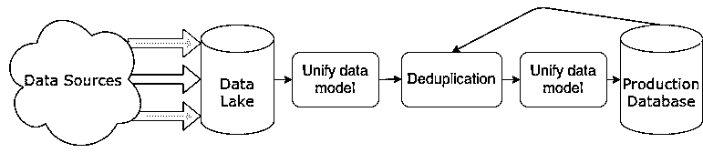
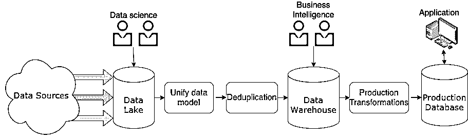

# 什么是数据工程，它适合你吗？

> 原文：<https://realpython.com/python-data-engineer/>

大数据。云数据。AI 训练数据和个人识别数据。数据无处不在，并且每天都在增长。软件工程已经发展到包括数据工程(一个直接关注数据传输、转换和存储的分支学科)是有意义的。

也许你已经看过大数据的招聘信息，并对处理 Pb 级数据的前景感兴趣。也许你很好奇[生成性对抗网络](https://realpython.com/generative-adversarial-networks/)是如何从底层数据中创造出逼真的图像的。也许你从未听说过数据工程，但对开发人员如何处理当今大多数应用程序所需的大量数据感兴趣。

无论你属于哪一类，这篇介绍性文章都适合你。你将对这个领域有一个大致的了解，包括什么是数据工程以及它需要什么样的工作。

在这篇文章中，你将了解到:

*   数据工程领域的当前状态是什么
*   数据工程**在行业中是如何使用的**
*   数据工程师的各种**客户**是谁
*   什么是**数据工程领域**的一部分，什么不是
*   如何决定你是否想将数据工程作为一门学科来学习

首先，你要回答这个领域最紧迫的问题之一:数据工程师到底是做什么的？

**免费奖励:** 并学习 Python 3 的基础知识，如使用数据类型、字典、列表和 Python 函数。

## 数据工程师是做什么的？

数据工程是一个非常广泛的学科，有多个头衔。在许多组织中，它甚至可能没有特定的标题。因此，最好首先确定数据工程的目标，然后讨论什么样的工作会带来期望的结果。

数据工程的最终目标是提供有组织的、一致的数据流，以实现数据驱动的工作，例如:

*   训练机器学习模型
*   进行探索性数据分析
*   用外部数据填充应用程序中的字段

这种数据流可以通过多种方式实现，并且所需的特定工具集、技术和技能在团队、组织和期望的结果之间会有很大的不同。然而，一种常见的模式是**数据流水线**。这是一个由独立程序组成的系统，这些程序对输入或收集的数据进行各种操作。

数据管道通常分布在多个服务器上:

此图是一个简化的数据管道示例，让您对可能遇到的架构有一个非常基本的了解。你会看到更复杂的表现形式。

数据可以来自任何来源:

*   [物联网](https://realpython.com/micropython/)设备
*   车辆遥测技术
*   房地产数据馈送
*   web 应用程序上的正常用户活动
*   你能想到的任何其他收集或测量工具

根据这些来源的性质，传入的数据将在实时**流**中进行处理，或者在**批处理**中以某种规则的节奏进行处理。

数据通过的管道是数据工程师的责任。数据工程团队负责设计、构建、维护、扩展，通常还负责支持数据管道的基础设施。他们还可能负责传入的数据，或者更常见的是负责[数据模型](https://en.wikipedia.org/wiki/Data_model)以及数据最终是如何存储的。

如果您将数据管道视为一种应用程序，那么数据工程开始看起来像任何其他软件工程学科。

许多团队也在朝着建立数据平台的方向前进。在许多组织中，仅有一个管道将传入数据保存到某个地方的 SQL 数据库是不够的。大型组织有多个团队，他们需要对不同类型的数据进行不同级别的访问。

例如，**人工智能(AI)** 团队可能需要标注和拆分清洗过的数据的方法。**商业智能(BI)** 团队可能需要轻松访问来聚合数据和构建数据可视化。**数据科学**团队可能需要数据库级别的访问权限来正确地探索数据。

如果你熟悉 web 开发，那么你可能会发现这种结构类似于[模型-视图-控制器(MVC)设计模式](https://realpython.com/the-model-view-controller-mvc-paradigm-summarized-with-legos/)。使用 MVC，数据工程师负责模型，AI 或 BI 团队处理视图，所有团队在控制器上协作。对于拥有依赖数据访问的多样化团队的组织来说，构建满足所有这些需求的数据平台正成为首要任务。

现在，您已经了解了一些数据工程师的工作，以及他们与所服务的客户之间的关系，进一步了解这些客户以及数据工程师对他们的责任将会很有帮助。

[*Remove ads*](/account/join/)

## 数据工程师的职责是什么？

依赖数据工程师的客户就像数据工程团队本身的技能和产出一样多种多样。无论你从事什么领域，你的客户永远决定你解决什么问题，你如何解决问题。

在本节中，您将从数据需求的角度了解数据工程团队的一些常见客户:

*   数据科学和人工智能团队
*   商业智能或分析团队
*   产品团队

在这些团队有效工作之前，必须满足某些需求。特别是，数据必须:

*   可靠地路由到更广泛的系统中
*   规范化为合理的数据模型
*   清理以填补重要缺口
*   向所有相关成员公开

Monica Rogarty 的优秀文章[人工智能需求层次](https://hackernoon.com/the-ai-hierarchy-of-needs-18f111fcc007)对这些需求进行了更全面的描述。作为一名数据工程师，您有责任满足客户的数据需求。但是，您将使用各种方法来适应他们各自的工作流。

### 数据流

要对系统中的数据做任何事情，您必须首先确保数据能够可靠地流入和通过系统。输入几乎可以是您能想到的任何类型的数据，包括:

*   JSON 或 XML 数据的实时流
*   每小时更新一批视频
*   每月抽血数据
*   每周批量标记的图像
*   来自部署传感器的遥测

数据工程师通常负责消费这些数据，设计一个系统，该系统可以将来自一个或多个来源的数据作为输入，转换这些数据，然后为客户存储这些数据。这些系统通常被称为 **ETL** 管道，分别代表**提取**、**转换**、**加载**。

数据流责任主要属于**提取**步骤。但是数据工程师的职责并不仅限于将数据导入管道。他们必须确保管道足够健壮，以应对意外或畸形的数据、离线的源和致命的错误。正常运行时间非常重要，尤其是在使用实时数据或时间敏感型数据时。

无论你的客户是谁，你维护数据流的责任都是一致的。但是，有些客户可能比其他客户要求更高，尤其是当客户是一个依赖于实时更新数据的应用程序时。

### 数据标准化和建模

流入系统的数据是巨大的。然而，在某些时候，数据需要符合某种架构标准。**规范化**数据包括使用户更容易访问数据的任务。这包括但不限于以下步骤:

*   删除重复项(**重复数据删除**)
*   修复冲突数据
*   使数据符合指定的数据模型

这些过程可能发生在不同的阶段。例如，假设您在一个大型组织中工作，有数据科学家和 BI 团队，他们都依赖于您的数据。您可以将非结构化数据存储在**数据湖**中，供您的数据科学客户用于探索性数据分析。您还可以将规范化的数据存储在一个[关系数据库](https://en.wikipedia.org/wiki/Relational_database)或一个更专门构建的**数据仓库**中，供 BI 团队在其报告中使用。

您可能有更多或更少的客户团队，或者可能有一个使用您的数据的应用程序。下图显示了先前管道示例的修改版本，突出显示了某些团队可能访问数据的不同阶段:

在此图中，您可以看到一个假设的数据管道，以及您经常会发现不同客户团队工作的各个阶段。

如果您的客户是一个产品团队，那么一个架构良好的数据模型是至关重要的。一个深思熟虑的数据模型可能是一个缓慢的、几乎没有响应的应用程序和一个运行起来好像已经知道用户想要访问什么数据的应用程序之间的区别。这类决策通常是产品和数据工程团队合作的结果。

数据规范化和建模通常是 ETL 的**转换**步骤的一部分，但它们不是这一类别中的唯一部分。另一个常见的转型步骤是数据清理。

[*Remove ads*](/account/join/)

### 数据清理

**数据清理**与数据标准化齐头并进。有些人甚至认为数据规范化是数据清理的一个子集。但是，虽然数据规范化主要关注于使不同的数据符合某种数据模型，但数据清理包括许多使数据更加统一和完整的操作，包括:

*   将相同的数据转换为单一类型(例如，强制整数字段中的[字符串成为整数](https://realpython.com/convert-python-string-to-int/)
*   确保日期格式一致
*   如果可能，填写缺失的字段
*   将字段的值约束到指定的范围
*   删除损坏或不可用的数据

数据清理可以纳入上图中的重复数据消除和统一数据模型步骤。但实际上，这些步骤中的每一步都非常庞大，可以包含任意数量的阶段和单独的过程。

您采取的清理数据的具体操作将高度依赖于输入、数据模型和期望的结果。然而，干净数据的重要性是不变的:

*   **数据科学家**需要它来执行精确的分析。
*   **机器学习工程师**需要它来建立精确的、可推广的模型。
*   **商业智能团队**需要 it 为企业提供准确的报告和预测。
*   产品团队需要它来确保他们的产品不会崩溃或者给用户错误的信息。

数据清理的责任落在许多不同的肩上，取决于整个组织及其优先级。作为一名数据工程师，您应该努力尽可能地实现自动化清理，并对传入和存储的数据进行定期抽查。您的客户团队和领导层可以提供关于什么构成符合其目的的干净数据的见解。

### 数据可访问性

数据可访问性没有得到像数据规范化和清理那样多的关注，但它可以说是以客户为中心的数据工程团队更重要的职责之一。

**数据可访问性**是指数据对于客户来说访问和理解的难易程度。这一点根据客户的不同而有不同的定义:

*   **数据科学团队**可能只需要可以用某种查询语言访问的数据。
*   **分析团队**可能更喜欢按某种指标分组的数据，可通过基本查询或报告界面访问。
*   考虑到产品性能和可靠性，产品团队通常希望数据可以通过快速、简单的查询获得，并且不会经常改变。

因为较大的组织为这些团队和其他团队提供相同的数据，所以许多组织已经开始为不同的团队开发自己的内部平台。这方面一个非常成熟的例子是打车服务优步，它分享了其令人印象深刻的大数据平台的许多细节。

事实上，许多数据工程师发现自己正在成为平台工程师，这表明了数据工程技能对数据驱动型企业的持续重要性。因为数据可访问性与数据的存储方式密切相关，所以它是 ETL 的 **load** 步骤的主要组成部分，它指的是如何存储数据以备后用。

现在，您已经遇到了一些常见的数据工程客户，并了解了他们的需求，是时候更仔细地看看您可以开发哪些技能来帮助满足这些需求了。

## 有哪些常见的数据工程技能？

数据工程技能在很大程度上与你从事软件工程所需的技能相同。然而，有几个领域是数据工程师更关注的。在本节中，您将了解几项重要的技能:

*   一般编程概念
*   数据库
*   分布式系统和云工程

在让你成为一名全面发展的数据工程师的过程中，上述每一项都将发挥至关重要的作用。

### 通用编程技巧

数据工程是软件工程的一个专门化，所以软件工程的基础在这个列表的顶部是有意义的。与其他软件工程专业一样，数据工程师应该理解设计概念，如 [DRY(不要重复)](https://en.wikipedia.org/wiki/Don%27t_repeat_yourself)、[面向对象编程](https://realpython.com/learning-paths/object-oriented-programming-oop-python/)、[数据结构](https://realpython.com/python-data-structures/)和算法。

和其他专业一样，也有少数偏爱的语言。在撰写本文时，你在数据工程工作描述中最常看到的是 Python、Scala 和 [Java](https://realpython.com/oop-in-python-vs-java/) 。是什么让这些语言如此受欢迎？

Python 受欢迎有几个原因。其中最大的一个是它的普遍性。从很多方面来看，Python 是世界上最流行的三种编程语言之一。例如，它在 2020 年 11 月的 [TIOBE 社区指数](https://www.tiobe.com/tiobe-index/)中排名第二，在 Stack Overflow 的 [2020 开发者调查](https://stackoverflow.blog/2020/05/27/2020-stack-overflow-developer-survey-results/)中排名第三。

它也被机器学习和人工智能团队广泛使用。紧密合作的团队经常需要能够用同一种语言交流，而 Python 仍然是这个领域的通用语言。

Python 流行的另一个更有针对性的原因是它在编排工具中的使用，如 [Apache Airflow](https://airflow.apache.org) 和流行工具的可用库，如 [Apache Spark](https://airflow.apache.org) 。如果一个组织使用这样的工具，那么了解他们使用的语言是很重要的。

Scala 也很受欢迎，和 Python 一样，这部分是由于使用它的工具的流行，尤其是 Apache Spark。Scala 是一种运行在 Java 虚拟机(JVM)上的函数式语言，这使得它能够与 Java 无缝地结合使用。

Java 在数据工程中并不那么受欢迎，但是你仍然会在一些工作描述中看到它。这部分是因为它在企业软件栈中的普遍性，部分是因为它与 Scala 的互操作性。随着 Scala 被用于 Apache Spark，一些团队也使用 Java 是有道理的。

除了一般的编程技能之外，熟悉数据库技术也是必不可少的。

[*Remove ads*](/account/join/)

### 数据库技术

如果您要移动数据，那么您将会大量使用数据库。非常宽泛地说，您可以将数据库技术分为两类:SQL 和 NoSQL。

SQL 数据库是**关系数据库管理系统** (RDBMS)，它对关系进行建模，并通过使用结构化查询语言或 SQL 进行交互。这些通常用于对由关系定义的数据进行建模，例如客户订单数据。

**注意:**如果你想学习更多关于 SQL 的知识，以及如何用 Python 与 SQL 数据库进行交互，那么请查看[Python SQL 库简介](https://realpython.com/python-sql-libraries/)。

NoSQL 通常意味着“其他一切”这些数据库通常存储非关系数据，如下所示:

*   键值存储，如 [Redis](https://realpython.com/python-redis/) 或 AWS 的 [DynamoDB](https://aws.amazon.com/dynamodb/)
*   像 [MongoDB](https://realpython.com/introduction-to-mongodb-and-python/) 或 [Elasticsearch](https://www.elastic.co/) 这样的文档商店
*   图形数据库，如 [Neo4j](https://neo4j.com/)
*   其他不太常见的数据存储

虽然不要求您了解所有数据库技术的来龙去脉，但是您应该了解这些不同系统的优缺点，并能够快速学习其中的一两种。

数据工程师工作的系统越来越多地位于云上，数据管道通常分布在多个服务器或集群上，无论是否在私有云上。因此，未来的数据工程师应该了解分布式系统和云工程。

### 分布式系统和云工程

诸如 ETL 管道之类的数据工程技术的主要优势之一是，它们有助于实现**分布式系统**。一种常见的模式是让管道的独立部分运行在单独的服务器上，由像 [RabbitMQ](https://www.rabbitmq.com/) 或 [Apache Kafka](https://kafka.apache.org/intro) 这样的消息队列来编排。

了解如何设计这些系统，它们的好处和风险是什么，以及何时应该使用它们是非常重要的。

这些系统需要许多服务器，地理上分散的团队经常需要访问它们包含的数据。Amazon Web Services、Google Cloud 和 Microsoft Azure 等私有云提供商是构建和部署分布式系统的非常流行的工具。

对云提供商的主要产品以及一些更流行的分布式消息传递工具的基本了解将有助于您找到第一份数据工程工作。你可以在工作中更深入地学习这些工具。

到目前为止，您已经了解了很多关于什么是数据工程的知识。但是因为这个学科没有标准的定义，而且因为有很多相关的学科，你也应该知道什么是数据工程*而不是*。

## 什么不是数据工程？

许多领域与数据工程密切相关，您的客户通常是这些领域的成员。了解你的客户很重要，所以你应该了解这些领域以及它们与数据工程的区别。

以下是一些与数据工程密切相关的领域:

*   数据科学
*   商业智能
*   机器学习工程

在本节中，您将从数据科学开始，更仔细地了解这些领域。

### 数据科学

如果说数据工程是由如何移动和组织海量数据决定的，那么数据科学则是由如何处理这些数据决定的。

数据科学家通常会查询、探索并尝试从数据集中获得见解。他们可能编写用于特定数据集的一次性脚本，而数据工程师倾向于使用软件工程最佳实践创建可重用的程序。

数据科学家使用统计工具，如 [k 均值聚类](https://realpython.com/k-means-clustering-python/)和[回归](https://realpython.com/logistic-regression-python/)以及机器学习技术。他们经常使用 R 或 Python，并试图从数据中获得洞察力和预测，以指导企业各个层面的决策。

**注:**你想探索数据科学吗？看看以下任何一种学习途径:

*   [具备 Python 核心技能的数据科学](https://realpython.com/learning-paths/data-science-python-core-skills/)
*   [数据采集&存储](https://realpython.com/learning-paths/data-collection-storage/)
*   [数据科学数学](https://realpython.com/learning-paths/math-data-science/)
*   [数据科学熊猫](https://realpython.com/learning-paths/pandas-data-science/)

数据科学家通常来自科学或统计背景，他们的工作风格反映了这一点。他们从事一个项目，回答一个特定的研究问题，而数据工程团队专注于构建可扩展的、可重用的、快速的内部产品。

数据科学家回答研究问题的一个很好的例子可以在生物技术和健康技术公司找到，在那里，数据科学家探索药物相互作用、副作用、疾病结果等数据。

[*Remove ads*](/account/join/)

### 商业智能

商业智能类似于数据科学，但有一些重要的区别。数据科学侧重于预测和做出未来预测，而商业智能侧重于提供业务当前状态的视图。

这两个组都由数据工程团队提供服务，甚至可能来自同一个数据池。然而，商业智能关注的是分析业务绩效并从数据中生成报告。然后，这些报告帮助管理层在业务层面做出决策。

像数据科学家一样，商业智能团队依靠数据工程师来构建工具，使他们能够分析和报告与其关注领域相关的数据。

### 机器学习工程

机器学习工程师是你会经常接触到的另一个群体。你可能和他们做类似的工作，或者你甚至可能被嵌入到一个机器学习工程师的团队中。

像数据工程师一样，机器学习工程师更专注于构建可重用的软件，许多人都有计算机科学背景。然而，他们不太专注于构建应用程序，而是更专注于构建机器学习模型或设计用于模型的新算法。

**注:**如果你对机器学习领域感兴趣，那就去看看[用 Python 进行机器学习](https://realpython.com/learning-paths/machine-learning-python/)的学习路径吧。

机器学习工程师建立的模型经常被产品团队用于面向客户的产品中。你作为数据工程师提供的数据将用于训练他们的模型，使你的工作成为任何与你合作的机器学习团队的能力的基础。

例如，机器学习工程师可能为您公司的产品开发新的推荐算法，而数据工程师将提供用于训练和测试该算法的数据。

需要理解的一件重要事情是，您在这里看到的字段通常并不清晰。具有数据科学、BI 或机器学习背景的人可能会在某个组织中从事数据工程工作，作为一名数据工程师，您可能会被要求协助这些团队的工作。

你可能会发现自己某一天重新构建了一个数据模型，另一天构建了一个数据标签工具，然后优化了一个内部深度学习框架。好的数据工程师灵活、好奇，并且愿意尝试新事物。

## 结论

这就完成了你对数据工程领域的介绍，这是对有计算机科学和技术背景或兴趣的人最需要的学科之一！

**在本教程中，您学习了:**

*   数据工程师做什么
*   谁是数据工程师的**客户**
*   哪些**技能**是数据工程中常见的
*   什么数据工程**不是**

现在你可以决定是否要深入了解这个令人兴奋的领域。你对数据工程感兴趣吗？你有兴趣更深入地探索它吗？请在评论中告诉我们！****