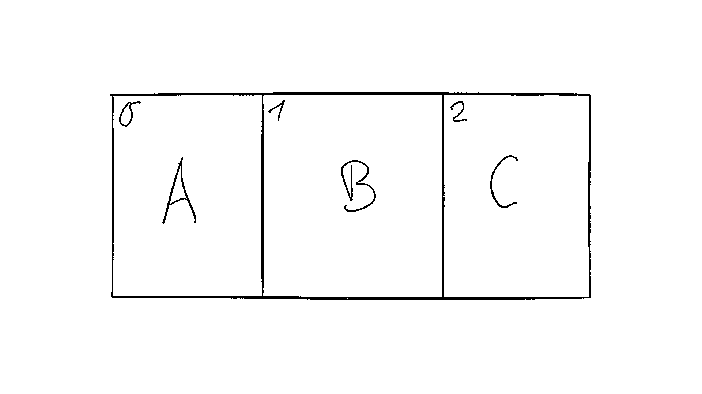

# 通用 Python 数据结构(指南)

> 原文：<https://realpython.com/python-data-structures/>

*立即观看**本教程有真实 Python 团队创建的相关视频课程。和书面教程一起看，加深理解: [**栈和队列:选择理想的数据结构**](/courses/stacks-queues-ideal-data-structure/)

数据结构是构建程序的基础结构。每种数据结构都提供了一种特定的组织数据的方式，因此可以根据您的使用情况有效地访问数据。Python 在其[标准库](https://docs.python.org/3/library/index.html)中附带了一组广泛的数据结构。

然而，Python 的命名约定并不像其他语言那样清晰。在 [Java](https://realpython.com/oop-in-python-vs-java/) 中，列表不仅仅是一个`list`——它或者是一个`LinkedList`或者是一个`ArrayList`。在 Python 中并非如此。即使是有经验的 Python 开发人员有时也会怀疑内置的`list`类型是作为[链表](https://realpython.com/linked-lists-python/)还是动态数组实现的。

在本教程中，您将学习:

*   Python 标准库中内置了哪些常见的抽象数据类型
*   最常见的抽象数据类型如何映射到 Python 的**命名方案**
*   如何在各种算法中把抽象数据类型**实际运用**

**注:**本教程改编自 [*Python 招数:书*](https://realpython.com/products/python-tricks-book/) 中“Python 中常见的数据结构”一章。如果你喜欢下面的内容，那么一定要看看这本书的其余部分。

**免费下载:** [从 Python 技巧中获取一个示例章节:这本书](https://realpython.com/bonus/python-tricks-sample-pdf/)用简单的例子向您展示了 Python 的最佳实践，您可以立即应用它来编写更漂亮的+Python 代码。

## 字典、地图和哈希表

在 Python 中，[字典](https://realpython.com/python-dicts/)(或简称为**字典**)是一个中心数据结构。字典存储任意数量的对象，每个对象都由唯一的字典**键**标识。

字典也经常被称为**映射**、**哈希表**、**查找表**，或者**关联数组**。它们允许高效地查找、插入和删除与给定键相关联的任何对象。

电话簿是字典对象的真实模拟。它们允许您快速检索与给定键(人名)相关的信息(电话号码)。你可以或多或少地直接跳到一个名字，并查找相关信息，而不必从头到尾阅读电话簿来查找某人的号码。

当涉及到*如何*组织信息以允许快速查找时，这个类比就有些站不住脚了。但是基本的性能特征保持不变。字典允许您快速找到与给定关键字相关的信息。

字典是计算机科学中最重要和最常用的数据结构之一。那么，Python 是如何处理字典的呢？让我们浏览一下核心 Python 和 Python 标准库中可用的字典实现。

[*Remove ads*](/account/join/)

### `dict`:您的首选词典

因为字典非常重要，Python 提供了一个健壮的字典实现，它直接内置在核心语言中: [`dict`](https://docs.python.org/3/library/stdtypes.html#mapping-types-dict) 数据类型。

Python 还提供了一些有用的**语法糖**，用于在程序中使用字典。例如，花括号({ })字典表达式语法和[字典理解](https://realpython.com/iterate-through-dictionary-python/#using-comprehensions)允许您方便地定义新的字典对象:

>>>

```py
>>> phonebook = {
...     "bob": 7387,
...     "alice": 3719,
...     "jack": 7052,
... }

>>> squares = {x: x * x for x in range(6)}

>>> phonebook["alice"]
3719

>>> squares
{0: 0, 1: 1, 2: 4, 3: 9, 4: 16, 5: 25}
```

对于哪些对象可以用作有效的键有一些限制。

Python 的字典是通过关键字索引的，关键字可以是任何[哈希](https://docs.python.org/3/glossary.html#term-hashable)类型。一个 **hashable** 对象有一个哈希值，这个哈希值在它的生命周期内不会改变(见`__hash__`)，它可以和其他对象进行比较(见`__eq__`)。被比较为相等的可散列对象必须具有相同的散列值。

[**不可变**类型](https://realpython.com/courses/immutability-python/)像[字符串](https://realpython.com/python-strings/)和[数字](https://realpython.com/python-data-types/)是可散列的，并且作为字典键工作得很好。你也可以使用 [`tuple`对象](https://realpython.com/python-lists-tuples/#python-tuples)作为字典键，只要它们本身只包含可散列类型。

对于大多数用例，Python 的内置字典实现将完成您需要的一切。字典是高度优化的，是语言的许多部分的基础。例如，[类属性](https://realpython.com/python-scope-legb-rule/#class-and-instance-attributes-scope)和[堆栈框架](https://en.wikipedia.org/wiki/Call_stack#Structure)中的变量都存储在字典内部。

Python 字典基于一个经过良好测试和微调的[哈希表](https://realpython.com/python-hash-table/)实现，它提供了您所期望的性能特征: *O* (1)一般情况下查找、插入、更新和删除操作的时间复杂度。

没有理由不使用 Python 中包含的标准`dict`实现。然而，存在专门的第三方字典实现，例如[跳过列表](https://en.wikipedia.org/wiki/Skip_list)或[基于 B 树的](https://en.wikipedia.org/wiki/B-tree)字典。

除了普通的`dict`对象，Python 的标准库还包括许多专门的字典实现。这些专门的字典都基于内置的字典类(并共享其性能特征)，但也包括一些额外的便利特性。

让我们来看看它们。

### `collections.OrderedDict`:记住按键的插入顺序

Python 包含一个专门的`dict`子类，它会记住添加到其中的键的插入顺序: [`collections.OrderedDict`](https://realpython.com/python-ordereddict/) 。

**注意:** `OrderedDict`不是核心语言的内置部分，必须从标准库中的`collections`模块导入。

虽然在 CPython 3.6 和更高版本中，标准的`dict`实例保留了键的插入顺序，但这只是 CPython 实现的一个[副作用](https://mail.python.org/pipermail/python-dev/2016-September/146327.html)，直到 Python 3.7 才在语言规范中定义。因此，如果键的顺序对算法的工作很重要，那么最好通过显式地使用`OrderedDict`类来清楚地表达这一点:

>>>

```py
>>> import collections
>>> d = collections.OrderedDict(one=1, two=2, three=3)

>>> d
OrderedDict([('one', 1), ('two', 2), ('three', 3)])

>>> d["four"] = 4
>>> d
OrderedDict([('one', 1), ('two', 2),
 ('three', 3), ('four', 4)])

>>> d.keys()
odict_keys(['one', 'two', 'three', 'four'])
```

在 [Python 3.8](https://realpython.com/python38-new-features/) 之前，不能使用`reversed()`逆序迭代字典条目。只有`OrderedDict`实例提供该功能。即使在 Python 3.8 中，`dict`和`OrderedDict`对象也不完全相同。`OrderedDict`实例有一个普通`dict`实例没有的 [`.move_to_end()`方法](https://realpython.com/python-data-types/)，以及一个比普通`dict`实例更加可定制的 [`.popitem()`方法](https://docs.python.org/3/library/collections.html#collections.OrderedDict.popitem)。

### `collections.defaultdict`:返回缺失键的默认值

[`defaultdict`](https://docs.python.org/3/library/collections.html#collections.defaultdict) 类是另一个字典子类，在其构造函数中接受一个 callable，如果找不到请求的键，将使用其返回值。

与在常规字典中使用`get()`或捕捉 [`KeyError`异常](https://realpython.com/python-keyerror/)相比，这可以节省您的一些输入，并使您的意图更加清晰:

>>>

```py
>>> from collections import defaultdict
>>> dd = defaultdict(list)

>>> # Accessing a missing key creates it and
>>> # initializes it using the default factory,
>>> # i.e. list() in this example:
>>> dd["dogs"].append("Rufus")
>>> dd["dogs"].append("Kathrin")
>>> dd["dogs"].append("Mr Sniffles")

>>> dd["dogs"]
['Rufus', 'Kathrin', 'Mr Sniffles']
```

[*Remove ads*](/account/join/)

### `collections.ChainMap`:将多个字典作为单个映射进行搜索

[`collections.ChainMap`](https://docs.python.org/3/library/collections.html#collections.ChainMap) 数据结构将多个字典组合成一个映射。查找逐个搜索底层映射，直到找到一个键。插入、更新和删除仅影响添加到链中的第一个映射:

>>>

```py
>>> from collections import ChainMap
>>> dict1 = {"one": 1, "two": 2}
>>> dict2 = {"three": 3, "four": 4}
>>> chain = ChainMap(dict1, dict2)

>>> chain
ChainMap({'one': 1, 'two': 2}, {'three': 3, 'four': 4})

>>> # ChainMap searches each collection in the chain
>>> # from left to right until it finds the key (or fails):
>>> chain["three"]
3
>>> chain["one"]
1
>>> chain["missing"]
Traceback (most recent call last):
  File "<stdin>", line 1, in <module>
KeyError: 'missing'
```

### `types.MappingProxyType`:用于制作只读字典的包装器

[`MappingProxyType`](https://docs.python.org/3/library/types.html#types.MappingProxyType) 是一个标准字典的包装器，它提供了对包装字典数据的只读视图。这个类是在 Python 3.3 中添加的，可以用来创建不可变的字典代理版本。

例如，如果你想从一个类或模块返回一个携带内部状态的字典，同时阻止对这个对象的写访问，那么`MappingProxyType`会很有帮助。使用`MappingProxyType`允许您设置这些限制，而不必首先创建字典的完整副本:

>>>

```py
>>> from types import MappingProxyType
>>> writable = {"one": 1, "two": 2}
>>> read_only = MappingProxyType(writable)

>>> # The proxy is read-only:
>>> read_only["one"]
1
>>> read_only["one"] = 23
Traceback (most recent call last):
  File "<stdin>", line 1, in <module>
TypeError: 'mappingproxy' object does not support item assignment

>>> # Updates to the original are reflected in the proxy:
>>> writable["one"] = 42
>>> read_only
mappingproxy({'one': 42, 'two': 2})
```

### Python 中的字典:摘要

本教程中列出的所有 Python 字典实现都是内置于 Python 标准库中的有效实现。

如果您正在寻找在程序中使用哪种映射类型的一般建议，我会向您推荐内置的`dict`数据类型。它是一个通用的、优化的哈希表实现，直接内置于核心语言中。

我建议您使用这里列出的其他数据类型，除非您有超出`dict`所提供的特殊需求。

所有的实现都是有效的选择，但是如果你的代码大部分时间都依赖于标准的 Python 字典，那么你的代码将会更加清晰和易于维护。

## 数组数据结构

一个**数组**是大多数编程语言中可用的基本数据结构，它在不同的算法中有广泛的用途。

在本节中，您将了解 Python 中的数组实现，这些实现只使用 Python 标准库中包含的核心语言特性或功能。您将看到每种方法的优点和缺点，因此您可以决定哪种实现适合您的用例。

但是在我们开始之前，让我们先了解一些基础知识。数组是如何工作的，它们有什么用途？数组由固定大小的数据记录组成，允许根据索引有效地定位每个元素:

[](https://files.realpython.com/media/python-linked-list-array-visualization.5b9f4c4040cb.jpeg)

因为数组将信息存储在相邻的内存块中，所以它们被认为是**连续的**数据结构(例如，相对于像链表这样的**链接的**数据结构)。

数组数据结构的真实类比是停车场。你可以把停车场看作一个整体，把它当作一个单独的对象，但是在停车场内部，有一些停车位，它们由一个唯一的数字索引。停车点是车辆的容器——每个停车点可以是空的，也可以停放汽车、摩托车或其他车辆。

但并不是所有的停车场都一样。一些停车场可能仅限于一种类型的车辆。例如，一个房车停车场不允许自行车停在上面。受限停车场对应于一个**类型的**数组数据结构，它只允许存储相同数据类型的元素。

就性能而言，根据元素的索引查找数组中包含的元素非常快。对于这种情况，适当的阵列实现保证了恒定的 *O* (1)访问时间。

Python 在其标准库中包含了几个类似数组的数据结构，每个结构都有略微不同的特征。让我们来看看。

[*Remove ads*](/account/join/)

### `list`:可变动态数组

[列表](https://docs.python.org/3.6/library/stdtypes.html#lists)是核心 Python 语言的一部分。尽管名字如此，Python 的列表在幕后被实现为**动态数组**。

这意味着列表允许添加或删除元素，并且列表将通过分配或释放内存来自动调整保存这些元素的后备存储。

Python 列表可以保存任意元素——Python 中的一切都是对象，包括函数。因此，您可以混合和匹配不同种类的数据类型，并将它们全部存储在一个列表中。

这可能是一个强大的功能，但缺点是同时支持多种数据类型意味着数据通常不太紧凑。因此，整个结构占据了更多的空间:

>>>

```py
>>> arr = ["one", "two", "three"]
>>> arr[0]
'one'

>>> # Lists have a nice repr:
>>> arr
['one', 'two', 'three']

>>> # Lists are mutable:
>>> arr[1] = "hello"
>>> arr
['one', 'hello', 'three']

>>> del arr[1]
>>> arr
['one', 'three']

>>> # Lists can hold arbitrary data types:
>>> arr.append(23)
>>> arr
['one', 'three', 23]
```

### `tuple`:不可变容器

就像列表一样，[元组](https://docs.python.org/3/library/stdtypes.html#tuple)是 Python 核心语言的一部分。然而，与列表不同，Python 的`tuple`对象是不可变的。这意味着不能动态地添加或删除元素——元组中的所有元素都必须在创建时定义。

元组是另一种可以保存任意数据类型元素的数据结构。拥有这种灵活性是非常强大的，但是同样，这也意味着数据没有在类型化数组中那么紧密:

>>>

```py
>>> arr = ("one", "two", "three")
>>> arr[0]
'one'

>>> # Tuples have a nice repr:
>>> arr
('one', 'two', 'three')

>>> # Tuples are immutable:
>>> arr[1] = "hello"
Traceback (most recent call last):
  File "<stdin>", line 1, in <module>
TypeError: 'tuple' object does not support item assignment

>>> del arr[1]
Traceback (most recent call last):
  File "<stdin>", line 1, in <module>
TypeError: 'tuple' object doesn't support item deletion

>>> # Tuples can hold arbitrary data types:
>>> # (Adding elements creates a copy of the tuple)
>>> arr + (23,)
('one', 'two', 'three', 23)
```

### `array.array`:基本类型数组

Python 的`array`模块为基本的 C 风格数据类型(如字节、32 位整数、浮点数等)提供了节省空间的存储。

用 [`array.array`](https://docs.python.org/3/library/array.html) 类创建的数组是可变的，其行为类似于列表，除了一个重要的区别:它们是被限制为单一数据类型的**类型化数组**。

由于这个限制，`array.array`具有许多元素的对象比列表和元组更有空间效率。存储在其中的元素被紧密打包，如果您需要存储许多相同类型的元素，这可能会很有用。

此外，数组支持许多与常规列表相同的方法，并且您可以将它们作为一种替代方法来使用，而无需对应用程序代码进行其他更改。

>>>

```py
>>> import array
>>> arr = array.array("f", (1.0, 1.5, 2.0, 2.5))
>>> arr[1]
1.5

>>> # Arrays have a nice repr:
>>> arr
array('f', [1.0, 1.5, 2.0, 2.5])

>>> # Arrays are mutable:
>>> arr[1] = 23.0
>>> arr
array('f', [1.0, 23.0, 2.0, 2.5])

>>> del arr[1]
>>> arr
array('f', [1.0, 2.0, 2.5])

>>> arr.append(42.0)
>>> arr
array('f', [1.0, 2.0, 2.5, 42.0])

>>> # Arrays are "typed":
>>> arr[1] = "hello"
Traceback (most recent call last):
  File "<stdin>", line 1, in <module>
TypeError: must be real number, not str
```

### `str`:不可变的 Unicode 字符数组

Python 3.x 使用 [`str`](https://docs.python.org/3/library/stdtypes.html#text-sequence-type-str) 对象将文本数据存储为 [Unicode 字符](https://realpython.com/python-encodings-guide/)的不可变序列。实际上，这意味着`str`是一个不可变的字符数组。奇怪的是，它也是一个[递归](https://realpython.com/python-thinking-recursively/)数据结构——字符串中的每个字符本身都是一个长度为 1 的`str`对象。

字符串对象是空间高效的，因为它们被紧密地打包，并且它们专门用于一种数据类型。如果你存储的是 Unicode 文本，那么你应该使用一个字符串。

因为字符串在 Python 中是不可变的，所以修改字符串需要创建一个修改后的副本。与可变字符串最接近的等效方式是在列表中存储单个字符:

>>>

```py
>>> arr = "abcd"
>>> arr[1]
'b'

>>> arr
'abcd'

>>> # Strings are immutable:
>>> arr[1] = "e"
Traceback (most recent call last):
  File "<stdin>", line 1, in <module>
TypeError: 'str' object does not support item assignment

>>> del arr[1]
Traceback (most recent call last):
  File "<stdin>", line 1, in <module>
TypeError: 'str' object doesn't support item deletion

>>> # Strings can be unpacked into a list to
>>> # get a mutable representation:
>>> list("abcd")
['a', 'b', 'c', 'd']
>>> "".join(list("abcd"))
'abcd'

>>> # Strings are recursive data structures:
>>> type("abc")
"<class 'str'>"
>>> type("abc"[0])
"<class 'str'>"
```

[*Remove ads*](/account/join/)

### `bytes`:不可变的单字节数组

[`bytes`](https://docs.python.org/3/library/stdtypes.html#bytes-objects) 对象是不可变的单字节序列，或者 0 ≤ *x* ≤ 255 范围内的整数。从概念上讲，`bytes`对象类似于`str`对象，你也可以把它们看作不可变的字节数组。

像字符串一样，`bytes`有自己的文字语法来创建对象，并且空间效率高。`bytes`对象是不可变的，但与字符串不同，有一个专用的可变字节数组数据类型，称为`bytearray`，它们可以被解压到:

>>>

```py
>>> arr = bytes((0, 1, 2, 3))
>>> arr[1]
1

>>> # Bytes literals have their own syntax:
>>> arr
b'\x00\x01\x02\x03'
>>> arr = b"\x00\x01\x02\x03"

>>> # Only valid `bytes` are allowed:
>>> bytes((0, 300))
Traceback (most recent call last):
  File "<stdin>", line 1, in <module>
ValueError: bytes must be in range(0, 256)

>>> # Bytes are immutable:
>>> arr[1] = 23
Traceback (most recent call last):
  File "<stdin>", line 1, in <module>
TypeError: 'bytes' object does not support item assignment

>>> del arr[1]
Traceback (most recent call last):
  File "<stdin>", line 1, in <module>
TypeError: 'bytes' object doesn't support item deletion
```

### `bytearray`:单字节可变数组

[`bytearray`](https://docs.python.org/3.1/library/functions.html#bytearray) 类型是一个可变的整数序列，范围为 0 ≤ *x* ≤ 255。`bytearray`对象与`bytes`对象密切相关，主要区别在于`bytearray`可以自由修改——您可以覆盖元素、删除现有元素或添加新元素。`bytearray`物体会相应地增大和缩小。

一个`bytearray`可以被转换回不可变的`bytes`对象，但是这涉及到完全复制存储的数据——一个花费 *O* ( *n* )时间的缓慢操作:

>>>

```py
>>> arr = bytearray((0, 1, 2, 3))
>>> arr[1]
1

>>> # The bytearray repr:
>>> arr
bytearray(b'\x00\x01\x02\x03')

>>> # Bytearrays are mutable:
>>> arr[1] = 23
>>> arr
bytearray(b'\x00\x17\x02\x03')

>>> arr[1]
23

>>> # Bytearrays can grow and shrink in size:
>>> del arr[1]
>>> arr
bytearray(b'\x00\x02\x03')

>>> arr.append(42)
>>> arr
bytearray(b'\x00\x02\x03*')

>>> # Bytearrays can only hold `bytes`
>>> # (integers in the range 0 <= x <= 255)
>>> arr[1] = "hello"
Traceback (most recent call last):
  File "<stdin>", line 1, in <module>
TypeError: 'str' object cannot be interpreted as an integer

>>> arr[1] = 300
Traceback (most recent call last):
  File "<stdin>", line 1, in <module>
ValueError: byte must be in range(0, 256)

>>> # Bytearrays can be converted back into bytes objects:
>>> # (This will copy the data)
>>> bytes(arr)
b'\x00\x02\x03*'
```

### Python 中的数组:摘要

在 Python 中实现数组时，有许多内置的数据结构可供选择。在本节中，您已经关注了标准库中包含的核心语言特性和数据结构。

如果你愿意超越 Python 标准库，那么像 [NumPy](https://realpython.com/numpy-array-programming/) 和 [pandas](https://realpython.com/pandas-dataframe/) 这样的第三方包为科学计算和数据科学提供了广泛的快速数组实现。

如果您想将自己局限于 Python 中包含的数组数据结构，那么这里有一些指导原则:

*   如果您需要存储任意对象，可能是混合数据类型，那么使用`list`或`tuple`，这取决于您是否想要一个不可变的数据结构。

*   如果您有数字(整数或浮点)数据，并且紧密封装和性能很重要，那么尝试一下`array.array`。

*   如果您有表示为 Unicode 字符的文本数据，那么使用 Python 的内置`str`。如果你需要一个可变的类似字符串的数据结构，那么使用字符的`list`。

*   如果您想要存储一个连续的字节块，那么使用不可变的`bytes`类型，或者如果您需要可变的数据结构，使用`bytearray`。

在大多数情况下，我喜欢从简单的`list`开始。如果性能或存储空间成为一个问题，我将稍后专门讨论。很多时候，使用像`list`这样的通用数组数据结构，可以给你最快的开发速度和最大的编程便利。

我发现这通常在开始时比从一开始就试图挤出最后一滴表现要重要得多。

## 记录、结构和数据传输对象

与数组相比，**记录**数据结构提供了固定数量的字段。每个字段可以有一个名称，也可以有不同的类型。

在本节中，您将看到如何仅使用标准库中的内置数据类型和类在 Python 中实现记录、结构和普通的旧数据对象。

**注意:**我在这里不严格地使用记录的定义。例如，我还将讨论像 Python 的内置`tuple`这样的类型，它们在严格意义上可能被认为是记录，也可能不被认为是记录，因为它们不提供命名字段。

Python 提供了几种数据类型，可用于实现记录、结构和数据传输对象。在本节中，您将快速了解每个实现及其独特的特征。最后，你会发现一个总结和一个决策指南，可以帮助你做出自己的选择。

**注:**本教程改编自 [*Python 招数:书*](https://realpython.com/products/python-tricks-book/) 中“Python 中常见的数据结构”一章。如果你喜欢你正在阅读的东西，那么一定要看看这本书的其余部分。

好吧，让我们开始吧！

[*Remove ads*](/account/join/)

### `dict`:简单数据对象

正如前面提到的[和](#dictionaries-maps-and-hash-tables)，Python 字典存储任意数量的对象，每个对象由一个惟一的键标识。字典通常也被称为**映射**或**关联数组**，允许高效地查找、插入和删除与给定键相关的任何对象。

在 Python 中使用字典作为记录数据类型或数据对象是可能的。Python 中的字典很容易创建，因为它们以**字典文字**的形式在语言中内置了自己的语法糖。该词典语法简洁，打字十分方便。

使用字典创建的数据对象是可变的，而且几乎没有防止字段名拼写错误的保护措施，因为字段可以随时自由添加和删除。这两个属性都会引入令人惊讶的错误，并且总是要在便利性和错误恢复能力之间进行权衡:

>>>

```py
>>> car1 = {
...     "color": "red",
...     "mileage": 3812.4,
...     "automatic": True,
... }
>>> car2 = {
...     "color": "blue",
...     "mileage": 40231,
...     "automatic": False,
... }

>>> # Dicts have a nice repr:
>>> car2
{'color': 'blue', 'automatic': False, 'mileage': 40231}

>>> # Get mileage:
>>> car2["mileage"]
40231

>>> # Dicts are mutable:
>>> car2["mileage"] = 12
>>> car2["windshield"] = "broken"
>>> car2
{'windshield': 'broken', 'color': 'blue',
 'automatic': False, 'mileage': 12}

>>> # No protection against wrong field names,
>>> # or missing/extra fields:
>>> car3 = {
...     "colr": "green",
...     "automatic": False,
...     "windshield": "broken",
... }
```

### `tuple`:不可变的对象组

Python 的元组是对任意对象进行分组的直接数据结构。元组是不可变的——它们一旦被创建就不能被修改。

就性能而言，在 CPython 中，元组占用的内存[比](https://github.com/python/cpython/blob/1a5856bf9295fa73995898d576e0bedf016aee1f/Include/tupleobject.h#L10-L34)[列表略少](https://github.com/python/cpython/blob/b879fe82e7e5c3f7673c9a7fa4aad42bd05445d8/Include/listobject.h#L4-L41)，而且它们的构建速度也更快。

正如您在下面的字节码反汇编中看到的，构造一个元组常量只需要一个`LOAD_CONST`操作码，而构造一个具有相同内容的列表对象需要更多的操作:

>>>

```py
>>> import dis
>>> dis.dis(compile("(23, 'a', 'b', 'c')", "", "eval"))
 0 LOAD_CONST           4 ((23, "a", "b", "c"))
 3 RETURN_VALUE

>>> dis.dis(compile("[23, 'a', 'b', 'c']", "", "eval"))
 0 LOAD_CONST           0 (23)
 3 LOAD_CONST           1 ('a')
 6 LOAD_CONST           2 ('b')
 9 LOAD_CONST           3 ('c')
 12 BUILD_LIST           4
 15 RETURN_VALUE
```

然而，你不应该过分强调这些差异。在实践中，性能差异通常可以忽略不计，试图通过从列表切换到元组来挤出程序的额外性能可能是错误的方法。

普通元组的一个潜在缺点是，存储在其中的数据只能通过整数索引访问才能取出。不能给存储在元组中的单个属性命名。这可能会影响代码的可读性。

此外，一个元组总是一个特别的结构:很难确保两个元组中存储了相同数量的字段和相同的属性。

这很容易引入疏忽的错误，比如混淆了字段顺序。因此，我建议您尽可能减少存储在元组中的字段数量:

>>>

```py
>>> # Fields: color, mileage, automatic
>>> car1 = ("red", 3812.4, True)
>>> car2 = ("blue", 40231.0, False)

>>> # Tuple instances have a nice repr:
>>> car1
('red', 3812.4, True)
>>> car2
('blue', 40231.0, False)

>>> # Get mileage:
>>> car2[1]
40231.0

>>> # Tuples are immutable:
>>> car2[1] = 12
Traceback (most recent call last):
  File "<stdin>", line 1, in <module>
TypeError: 'tuple' object does not support item assignment

>>> # No protection against missing or extra fields
>>> # or a wrong order:
>>> car3 = (3431.5, "green", True, "silver")
```

### 编写自定义类:更多工作，更多控制

**类**允许您为数据对象定义可重用的蓝图，以确保每个对象提供相同的字段集。

使用常规 Python 类作为记录数据类型是可行的，但是也需要手工操作才能获得其他实现的便利特性。例如，向`__init__`构造函数添加新字段是冗长且耗时的。

此外，从自定义类实例化的对象的默认字符串表示也没什么帮助。为了解决这个问题，你可能需要添加你自己的 [`__repr__`](https://docs.python.org/3.4/reference/datamodel.html#object.__repr__) 方法，这通常也是相当冗长的，每次你添加一个新的字段时都必须更新。

存储在类上的字段是可变的，新字段可以自由添加，您可能喜欢也可能不喜欢。使用 [`@property`](https://docs.python.org/3/library/functions.html#property) 装饰器可以提供更多的访问控制并创建只读字段，但是这又需要编写更多的粘合代码。

每当您想使用方法向记录对象添加业务逻辑和行为时，编写自定义类是一个很好的选择。然而，这意味着这些对象在技术上不再是普通的数据对象:

>>>

```py
>>> class Car:
...     def __init__(self, color, mileage, automatic):
...         self.color = color
...         self.mileage = mileage
...         self.automatic = automatic
...
>>> car1 = Car("red", 3812.4, True)
>>> car2 = Car("blue", 40231.0, False)

>>> # Get the mileage:
>>> car2.mileage
40231.0

>>> # Classes are mutable:
>>> car2.mileage = 12
>>> car2.windshield = "broken"

>>> # String representation is not very useful
>>> # (must add a manually written __repr__ method):
>>> car1
<Car object at 0x1081e69e8>
```

[*Remove ads*](/account/join/)

### `dataclasses.dataclass` : Python 3.7+数据类

[数据类](https://realpython.com/python-data-classes/)在 Python 3.7 及以上版本中可用。它们为从头定义自己的数据存储类提供了一个很好的选择。

通过编写一个数据类而不是普通的 Python 类，您的对象实例获得了一些现成的有用特性，这将为您节省一些键入和手动实现工作:

*   定义实例变量的语法更短，因为您不需要实现`.__init__()`方法。
*   数据类的实例通过自动生成的`.__repr__()`方法自动获得好看的字符串表示。
*   实例变量接受类型注释，使您的数据类在一定程度上是自文档化的。请记住，类型注释只是一些提示，如果没有单独的[类型检查](https://realpython.com/python-type-checking/)工具，这些提示是不会生效的。

数据类通常是使用`@dataclass` [装饰器](https://realpython.com/primer-on-python-decorators/)创建的，您将在下面的代码示例中看到:

>>>

```py
>>> from dataclasses import dataclass
>>> @dataclass
... class Car:
...     color: str
...     mileage: float
...     automatic: bool
...
>>> car1 = Car("red", 3812.4, True)

>>> # Instances have a nice repr:
>>> car1
Car(color='red', mileage=3812.4, automatic=True)

>>> # Accessing fields:
>>> car1.mileage
3812.4

>>> # Fields are mutable:
>>> car1.mileage = 12
>>> car1.windshield = "broken"

>>> # Type annotations are not enforced without
>>> # a separate type checking tool like mypy:
>>> Car("red", "NOT_A_FLOAT", 99)
Car(color='red', mileage='NOT_A_FLOAT', automatic=99)
```

要了解更多关于 Python 数据类的信息，请查看[Python 3.7](https://realpython.com/python-data-classes/)中数据类的终极指南。

### `collections.namedtuple`:方便的数据对象

Python 2.6+中可用的 [`namedtuple`](https://dbader.org/blog/writing-clean-python-with-namedtuples) 类提供了内置`tuple`数据类型的扩展。类似于定义一个定制类，使用`namedtuple`允许您为您的记录定义可重用的蓝图，确保使用正确的字段名称。

对象是不可变的，就像正则元组一样。这意味着在创建了`namedtuple`实例之后，您不能添加新字段或修改现有字段。

除此之外，`namedtuple`物体是，嗯。。。命名元组。存储在其中的每个对象都可以通过唯一的标识符来访问。这使您不必记住整数索引或求助于变通方法，如定义整数常量**作为索引的助记符**。

对象在内部被实现为常规的 Python 类。就内存使用而言，它们也比常规类更好，内存效率与常规元组一样高:

>>>

```py
>>> from collections import namedtuple
>>> from sys import getsizeof

>>> p1 = namedtuple("Point", "x y z")(1, 2, 3)
>>> p2 = (1, 2, 3)

>>> getsizeof(p1)
64
>>> getsizeof(p2)
64
```

对象是清理代码的一种简单方法，通过为数据实施更好的结构，使代码更具可读性。

我发现，从特定的数据类型(如具有固定格式的字典)到`namedtuple`对象有助于我更清楚地表达代码的意图。通常当我应用这种重构时，我会神奇地为我面临的问题想出一个更好的解决方案。

在常规(非结构化)元组和字典上使用`namedtuple`对象也可以让你的同事的生活变得更轻松，至少在某种程度上，这是通过让正在传递的数据自文档化来实现的:

>>>

```py
>>> from collections import namedtuple
>>> Car = namedtuple("Car" , "color mileage automatic")
>>> car1 = Car("red", 3812.4, True)

>>> # Instances have a nice repr:
>>> car1
Car(color="red", mileage=3812.4, automatic=True)

>>> # Accessing fields:
>>> car1.mileage
3812.4

>>> # Fields are immtuable:
>>> car1.mileage = 12
Traceback (most recent call last):
  File "<stdin>", line 1, in <module>
AttributeError: can't set attribute

>>> car1.windshield = "broken"
Traceback (most recent call last):
  File "<stdin>", line 1, in <module>
AttributeError: 'Car' object has no attribute 'windshield'
```

### `typing.NamedTuple`:改进的命名元组

Python 3.6 中新增， [`typing.NamedTuple`](https://docs.python.org/3/library/typing.html#typing.NamedTuple) 是`collections`模块中`namedtuple`类的弟弟。它与`namedtuple`非常相似，主要区别是定义新记录类型的更新语法和增加对[类型提示](https://docs.python.org/3/library/typing.html)的支持。

请注意，如果没有像 [mypy](http://mypy-lang.org/) 这样的独立类型检查工具，类型注释是不会生效的。但是，即使没有工具支持，它们也可以为其他程序员提供有用的提示(或者，如果类型提示过时，就会变得非常混乱):

>>>

```py
>>> from typing import NamedTuple

>>> class Car(NamedTuple):
...     color: str
...     mileage: float
...     automatic: bool

>>> car1 = Car("red", 3812.4, True)

>>> # Instances have a nice repr:
>>> car1
Car(color='red', mileage=3812.4, automatic=True)

>>> # Accessing fields:
>>> car1.mileage
3812.4

>>> # Fields are immutable:
>>> car1.mileage = 12
Traceback (most recent call last):
  File "<stdin>", line 1, in <module>
AttributeError: can't set attribute

>>> car1.windshield = "broken"
Traceback (most recent call last):
  File "<stdin>", line 1, in <module>
AttributeError: 'Car' object has no attribute 'windshield'

>>> # Type annotations are not enforced without
>>> # a separate type checking tool like mypy:
>>> Car("red", "NOT_A_FLOAT", 99)
Car(color='red', mileage='NOT_A_FLOAT', automatic=99)
```

[*Remove ads*](/account/join/)

### `struct.Struct`:序列化的 C 结构

[`struct.Struct`](https://docs.python.org/3/library/struct.html#struct.Struct) 类在 Python 值和序列化为 Python `bytes`对象的 C 结构之间进行转换。例如，它可以用于处理存储在文件中或来自网络连接的二进制数据。

使用基于[格式字符串](https://docs.python.org/3/library/struct.html#struct-format-strings)的迷你语言来定义结构，这允许你定义各种 C 数据类型的排列，如`char`、`int`和`long`以及它们的`unsigned`变体。

序列化结构很少用于表示纯粹在 Python 代码中处理的数据对象。它们主要是作为一种数据交换格式，而不是一种仅由 Python 代码使用的在内存中保存数据的方式。

在某些情况下，将原始数据打包到结构中可能比将其保存在其他数据类型中使用更少的内存。然而，在大多数情况下，这将是一个非常高级的(可能是不必要的)优化:

>>>

```py
>>> from struct import Struct
>>> MyStruct = Struct("i?f")
>>> data = MyStruct.pack(23, False, 42.0)

>>> # All you get is a blob of data:
>>> data
b'\x17\x00\x00\x00\x00\x00\x00\x00\x00\x00(B'

>>> # Data blobs can be unpacked again:
>>> MyStruct.unpack(data)
(23, False, 42.0)
```

### `types.SimpleNamespace`:花式属性访问

这里还有一个用 Python 实现数据对象的稍微晦涩的选择: [`types.SimpleNamespace`](https://docs.python.org/3/library/types.html#types.SimpleNamespace) 。这个类是在 Python 3.3 中添加的，提供了对其名称空间的属性访问。

这意味着`SimpleNamespace`实例将它们所有的键作为类属性公开。您可以使用`obj.key`点状属性访问，而不是常规字典使用的`obj['key']`方括号索引语法。默认情况下，所有实例都包含一个有意义的`__repr__`。

顾名思义，`SimpleNamespace`简单！它基本上是一个允许属性访问和良好打印的字典。可以自由添加、修改和删除属性:

>>>

```py
>>> from types import SimpleNamespace
>>> car1 = SimpleNamespace(color="red", mileage=3812.4, automatic=True)

>>> # The default repr:
>>> car1
namespace(automatic=True, color='red', mileage=3812.4)

>>> # Instances support attribute access and are mutable:
>>> car1.mileage = 12
>>> car1.windshield = "broken"
>>> del car1.automatic
>>> car1
namespace(color='red', mileage=12, windshield='broken')
```

### Python 中的记录、结构和数据对象:摘要

如您所见，实现记录或数据对象有很多不同的选择。Python 中的数据对象应该使用哪种类型？通常，您的决定将取决于您的用例:

*   如果只有几个字段，那么如果字段顺序容易记忆或者字段名是多余的，那么使用普通元组对象可能是没问题的。比如，想象三维空间中的一个`(x, y, z)`点。

*   如果需要不可变的字段，那么普通元组、`collections.namedtuple`和`typing.NamedTuple`都是不错的选择。

*   如果您需要锁定字段名以避免输入错误，那么`collections.namedtuple`和`typing.NamedTuple`就是您的朋友。

*   如果您想保持简单，那么一个普通的字典对象可能是一个不错的选择，因为它的语法非常类似于 [JSON](https://realpython.com/python-json/) 。

*   如果您需要完全控制您的数据结构，那么是时候用[`@property`](https://realpython.com/python-property/#using-property-as-a-decorator)[setter 和 getter](https://realpython.com/python-getter-setter/)编写一个自定义类了。

*   如果你需要给对象添加行为(方法)，那么你应该从头开始写一个自定义类，或者使用`dataclass`装饰器，或者通过扩展`collections.namedtuple`或`typing.NamedTuple`。

*   如果您需要将数据紧密打包以将其序列化到磁盘或通过网络发送，那么是时候阅读一下`struct.Struct`了，因为这是一个很好的用例！

如果您正在寻找一个安全的默认选择，那么我对在 Python 中实现普通记录、结构或数据对象的一般建议是在 Python 2.x 中使用`collections.namedtuple`,在 Python 3 中使用它的兄弟`typing.NamedTuple`。

## 集合和多重集合

在这一节中，您将看到如何使用标准库中的内置数据类型和类在 Python 中实现可变和不可变的 [set](https://realpython.com/python-sets/) 和 multiset (bag)数据结构。

一个**集合**是不允许重复元素的无序对象集合。通常，集合用于快速测试集合中的成员资格值，从集合中插入或删除新值，以及计算两个集合的并集或交集。

在一个适当的 set 实现中，成员资格测试应该在快速的 *O* (1)时间内运行。并、交、差、子集运算平均要花 *O* ( *n* )时间。Python 标准库[中包含的 set 实现遵循这些性能特征](https://wiki.python.org/moin/TimeComplexity)。

就像字典一样，集合在 Python 中得到了特殊处理，并且有一些语法上的好处，使得它们易于创建。例如，花括号集合表达式语法和[集合理解](https://realpython.com/list-comprehension-python/#using-set-and-dictionary-comprehensions)允许您方便地定义新的集合实例:

```py
vowels = {"a", "e", "i", "o", "u"}
squares = {x * x for x in range(10)}
```

但是要小心:创建空集需要调用`set()`构造函数。使用空的花括号(`{}`)是不明确的，会创建一个空的字典。

Python 及其标准库提供了几个 set 实现。让我们来看看它们。

[*Remove ads*](/account/join/)

### `set`:您的定位设置

[`set`](https://docs.python.org/3/library/stdtypes.html#set-types-set-frozenset) 类型是 Python 中内置的 set 实现。它是可变的，允许动态插入和删除元素。

Python 的集合由`dict`数据类型支持，并共享相同的性能特征。任何可散列的对象都可以存储在一个集合中:

>>>

```py
>>> vowels = {"a", "e", "i", "o", "u"}
>>> "e" in vowels
True

>>> letters = set("alice")
>>> letters.intersection(vowels)
{'a', 'e', 'i'}

>>> vowels.add("x")
>>> vowels
{'i', 'a', 'u', 'o', 'x', 'e'}

>>> len(vowels)
6
```

### `frozenset`:不可变集合

[`frozenset`](https://docs.python.org/3/library/stdtypes.html#set-types-set-frozenset) 类实现了`set`的不可变版本，该版本在被构造后不能被更改。

对象是静态的，只允许对其元素进行查询操作，不允许插入或删除。因为`frozenset`对象是静态的和可散列的，它们可以用作字典键或另一个集合的元素，这是常规(可变)`set`对象所不能做到的:

>>>

```py
>>> vowels = frozenset({"a", "e", "i", "o", "u"})
>>> vowels.add("p")
Traceback (most recent call last):
  File "<stdin>", line 1, in <module>
AttributeError: 'frozenset' object has no attribute 'add'

>>> # Frozensets are hashable and can
>>> # be used as dictionary keys:
>>> d = { frozenset({1, 2, 3}): "hello" }
>>> d[frozenset({1, 2, 3})]
'hello'
```

### `collections.Counter`:多重集

Python 标准库中的 [`collections.Counter`](https://docs.python.org/3/library/collections.html#collections.Counter) 类实现了一个多重集合或包类型，允许集合中的元素出现不止一次。

如果您不仅需要跟踪某个元素是否是集合的一部分，还需要跟踪它在集合中被包含的次数，这将非常有用:

>>>

```py
>>> from collections import Counter
>>> inventory = Counter()

>>> loot = {"sword": 1, "bread": 3}
>>> inventory.update(loot)
>>> inventory
Counter({'bread': 3, 'sword': 1})

>>> more_loot = {"sword": 1, "apple": 1}
>>> inventory.update(more_loot)
>>> inventory
Counter({'bread': 3, 'sword': 2, 'apple': 1})
```

对 [`Counter`](https://realpython.com/python-counter/) 类的一个警告是，在计算一个`Counter`对象中的元素数量时，你要小心。调用`len()`返回多重集中*唯一*元素的数量，而*元素的总数*可以使用`sum()`来检索:

>>>

```py
>>> len(inventory)
3  # Unique elements

>>> sum(inventory.values())
6  # Total no. of elements
```

### Python 中的集合和多重集合:摘要

集合是 Python 及其标准库包含的另一种有用且常用的数据结构。以下是决定使用哪种方法的一些指导原则:

*   如果需要可变集合，那么使用内置的`set`类型。
*   如果你需要可以用作字典或设置键的可散列对象，那么使用`frozenset`。
*   如果你需要一个多重集，或者包，数据结构，那么使用`collections.Counter`。

## 堆栈(后进先出法)

一个[栈](https://realpython.com/queue-in-python/#stack-last-in-first-out-lifo)是支持快速**后进/先出** (LIFO)插入和删除语义的对象集合。与列表或数组不同，堆栈通常不允许对它们包含的对象进行随机访问。插入和删除操作通常也被称为**推送**和**弹出**。

栈数据结构的一个有用的现实类比是一堆盘子。新的盘子被放在盘子堆的最上面，因为这些盘子很珍贵也很重，所以只有最上面的盘子可以被移动。换句话说，堆叠的最后一个盘子必须是第一个取出的(LIFO)。为了够到堆叠中较低的板，最上面的板必须一个接一个地移开。

就性能而言，一个合适的[栈实现](https://realpython.com/how-to-implement-python-stack/)预计会花费 *O* (1)的时间用于插入和删除操作。

堆栈在算法中有广泛的用途。例如，它们被用于语言解析和运行时内存管理，后者依赖于一个**调用栈**。使用堆栈的一个简短而漂亮的算法是在树或图数据结构上的[深度优先搜索](https://en.wikipedia.org/wiki/Depth-first_search) (DFS)。

Python 附带了几个堆栈实现，每个实现都有略微不同的特征。让我们来看看他们，比较他们的特点。

[*Remove ads*](/account/join/)

### `list`:简单的内置堆栈

Python 内置的`list`类型[使得一个体面的栈数据结构](https://docs.python.org/3/tutorial/datastructures.html#using-lists-as-stacks)，因为它支持在[摊销](https://en.wikipedia.org/wiki/Amortized_analysis)O(1)时间内的推送和弹出操作。

Python 的列表在内部被实现为动态数组，这意味着当添加或删除元素时，它们偶尔需要为存储在其中的元素调整存储空间。列表过度分配了它的后备存储器，因此不是每次推送或弹出都需要调整大小。结果，你得到了这些操作的分摊的 *O* (1)时间复杂度。

不利的一面是，这使得它们的性能不如基于链表的实现所提供的稳定的 *O* (1)插入和删除(您将在下面的`collections.deque`中看到)。另一方面，链表确实提供了对栈上元素的快速随机访问，这是一个额外的好处。

当使用列表作为堆栈时，有一个重要的性能警告需要注意:为了获得插入和删除的分摊的 *O* (1)性能，必须使用`append()`方法将新的项目添加到列表的*末端*，并使用`pop()`再次从末端移除。为了获得最佳性能，基于 Python 列表的栈应该向更高的索引增长，向更低的索引收缩。

从前面添加和移除要慢得多，需要 *O* ( *n* )的时间，因为现有的元素必须四处移动才能为新元素腾出空间。这是一个您应该尽可能避免的性能[反模式](https://en.wikipedia.org/wiki/Anti-pattern):

>>>

```py
>>> s = []
>>> s.append("eat")
>>> s.append("sleep")
>>> s.append("code")

>>> s
['eat', 'sleep', 'code']

>>> s.pop()
'code'
>>> s.pop()
'sleep'
>>> s.pop()
'eat'

>>> s.pop()
Traceback (most recent call last):
  File "<stdin>", line 1, in <module>
IndexError: pop from empty list
```

### `collections.deque`:快速和稳定的堆栈

[`deque`](https://docs.python.org/3/library/collections.html#collections.deque) 类实现了一个[双端队列](https://realpython.com/queue-in-python/#deque-double-ended-queue)，支持在 *O* (1)时间(非摊销)内从两端添加和移除元素。因为 deques 同样支持从两端添加和删除元素，所以它们既可以用作队列，也可以用作堆栈。

Python 的`deque`对象被实现为[双向链表](https://github.com/python/cpython/blob/6e8128f02e1d36e38e5866f9dc36e051caa47bc9/Modules/_collectionsmodule.c#L33-L35)，这使得它们在插入和删除元素时具有出色且一致的性能，但在随机访问堆栈中间的元素时，性能却很差 *O* ( *n* )。

总的来说， [`collections.deque`是一个很好的选择](https://realpython.com/linked-lists-python/#introducing-collectionsdeque)如果你正在 Python 的标准库中寻找一个栈数据结构，它具有链表实现的性能特征:

>>>

```py
>>> from collections import deque
>>> s = deque()
>>> s.append("eat")
>>> s.append("sleep")
>>> s.append("code")

>>> s
deque(['eat', 'sleep', 'code'])

>>> s.pop()
'code'
>>> s.pop()
'sleep'
>>> s.pop()
'eat'

>>> s.pop()
Traceback (most recent call last):
  File "<stdin>", line 1, in <module>
IndexError: pop from an empty deque
```

### `queue.LifoQueue`:并行计算的锁定语义

Python 标准库中的 [`LifoQueue`](https://docs.python.org/3/library/queue.html#queue.LifoQueue) 栈实现是同步的，并提供**锁定语义**来支持多个并发生产者和消费者。

除了`LifoQueue`之外，`queue`模块还包含其他几个类，它们实现了对并行计算有用的多生产者、多消费者队列。

根据您的用例，锁定语义可能是有帮助的，或者它们可能只是招致不必要的开销。在这种情况下，最好使用一个`list`或一个`deque`作为通用堆栈:

>>>

```py
>>> from queue import LifoQueue
>>> s = LifoQueue()
>>> s.put("eat")
>>> s.put("sleep")
>>> s.put("code")

>>> s
<queue.LifoQueue object at 0x108298dd8>

>>> s.get()
'code'
>>> s.get()
'sleep'
>>> s.get()
'eat'

>>> s.get_nowait()
queue.Empty

>>> s.get()  # Blocks/waits forever...
```

### Python 中的堆栈实现:概要

如您所见，Python 附带了堆栈数据结构的几种实现。它们都有稍微不同的特征以及性能和使用权衡。

如果您不寻求并行处理支持(或者如果您不想手动处理锁定和解锁)，那么您可以选择内置的`list`类型或`collections.deque`。区别在于幕后使用的数据结构和整体易用性。

**`list`** 由一个动态数组支持，这使得它非常适合快速随机访问，但需要在添加或删除元素时偶尔调整大小。

列表过度分配了它的后备存储，所以不是每次推送或弹出都需要调整大小，并且你得到了这些操作的分摊的 *O* (1)时间复杂度。但是您需要注意的是，只能使用`append()`和`pop()`来插入和移除项目。否则，性能会下降到 *O* ( *n* )。

**`collections.deque`** 以双向链表为后盾，优化了两端的追加和删除，并为这些操作提供了一致的 *O* (1)性能。不仅其性能更稳定，而且`deque`类也更易于使用，因为您不必担心从错误的一端添加或删除项目。

总之，`collections.deque`是在 Python 中实现堆栈(LIFO 队列)的绝佳选择。

[*Remove ads*](/account/join/)

## 队列(先进先出)

在本节中，您将看到如何仅使用 Python 标准库中的内置数据类型和类来实现一个**先进/先出** (FIFO)队列数据结构。

一个[队列](https://realpython.com/queue-in-python/#queue-first-in-first-out-fifo)是支持插入和删除的快速 FIFO 语义的对象集合。插入和删除操作有时被称为**入队**和**出列**。与列表或数组不同，队列通常不允许对它们包含的对象进行随机访问。

这里有一个 FIFO 队列的真实类比:

想象一下 PyCon 注册的第一天，一队 Pythonistas 在等着领取他们的会议徽章。当新人进入会场，排队领取胸卡时，他们在队伍的后面排队。开发人员收到他们的徽章和会议礼品包，然后在队列的前面离开队伍(出列)。

记住队列数据结构特征的另一种方法是把它想象成一个管道。你把乒乓球放在一端，它们会移动到另一端，然后你把它们移走。当球在队列中(一根实心金属管)时，你不能够到它们。与队列中的球进行交互的唯一方法是在管道的后面添加新的球(入队)或者在前面移除它们(出列)。

队列类似于堆栈。两者的区别在于如何移除物品。用一个**队列**，你移除最近添加最少的项目*(FIFO)，但是用一个**堆栈**，你移除最近添加最多*的项目*(LIFO)。*

就性能而言，一个合适的队列实现预计会花费 *O* (1)的时间来执行插入和删除操作。这是对队列执行的两个主要操作，在正确的实现中，它们应该很快。

队列在算法中有广泛的应用，通常有助于解决调度和并行编程问题。使用队列的一个简短而漂亮的算法是在树或图数据结构上的[广度优先搜索](https://en.wikipedia.org/wiki/Breadth-first_search) (BFS)。

调度算法经常在内部使用**优先级队列**。这些是专门的队列。一个[优先级队列](https://realpython.com/python-heapq-module/#data-structures-heaps-and-priority-queues)检索*优先级最高的*元素，而不是按照插入时间检索下一个元素。单个元素的优先级由队列根据应用于它们的键的顺序来决定。

然而，常规队列不会对其携带的项目进行重新排序。就像在管道的例子中，你取出你放入的东西，并且完全按照那个顺序。

Python 附带了几个队列实现，每个实现都有稍微不同的特征。我们来复习一下。

### `list`:非常慢的队列

有可能[使用常规的`list`作为队列](https://docs.python.org/3/tutorial/datastructures.html#using-lists-as-queues)，但是从性能角度来看这并不理想。为此目的，列表非常慢，因为在开头插入或删除一个元素需要将所有其他元素移动一位，需要 *O* ( *n* )时间。

因此，我*而不是*建议在 Python 中使用`list`作为临时队列，除非你只处理少量元素:

>>>

```py
>>> q = []
>>> q.append("eat")
>>> q.append("sleep")
>>> q.append("code")

>>> q
['eat', 'sleep', 'code']

>>> # Careful: This is slow!
>>> q.pop(0)
'eat'
```

### `collections.deque`:快速和健壮的队列

`deque`类实现了一个双端队列，支持在 *O* (1)时间内(非摊销)从两端添加和移除元素。因为 deques 同样支持从两端添加和删除元素，所以它们既可以用作队列，也可以用作堆栈。

Python 的`deque`对象被实现为双向链表。这使得它们在插入和删除元素时具有出色且一致的性能，但在随机访问堆栈中间的元素时，性能却很差。

因此，如果您在 Python 的标准库中寻找队列数据结构，`collections.deque`是一个很好的默认选择:

>>>

```py
>>> from collections import deque
>>> q = deque()
>>> q.append("eat")
>>> q.append("sleep")
>>> q.append("code")

>>> q
deque(['eat', 'sleep', 'code'])

>>> q.popleft()
'eat'
>>> q.popleft()
'sleep'
>>> q.popleft()
'code'

>>> q.popleft()
Traceback (most recent call last):
  File "<stdin>", line 1, in <module>
IndexError: pop from an empty deque
```

### `queue.Queue`:并行计算的锁定语义

Python 标准库中的 [`queue.Queue`](https://docs.python.org/3/library/queue.html#queue.Queue) 实现是同步的，并提供锁定语义来支持多个并发的生产者和消费者。

模块包含了其他几个实现多生产者、多消费者队列的类，这对于并行计算非常有用。

根据您的用例，锁定语义可能会有所帮助，也可能会带来不必要的开销。在这种情况下，最好使用`collections.deque`作为通用队列:

>>>

```py
>>> from queue import Queue
>>> q = Queue()
>>> q.put("eat")
>>> q.put("sleep")
>>> q.put("code")

>>> q
<queue.Queue object at 0x1070f5b38>

>>> q.get()
'eat'
>>> q.get()
'sleep'
>>> q.get()
'code'

>>> q.get_nowait()
queue.Empty

>>> q.get()  # Blocks/waits forever...
```

### `multiprocessing.Queue`:共享作业队列

[`multiprocessing.Queue`](https://docs.python.org/3/library/multiprocessing.html#multiprocessing.Queue) 是一个共享的作业队列实现，允许多个并发工作器并行处理排队的项目。基于进程的并行化在 CPython 中很流行，这是因为[全局解释器锁](https://realpython.com/python-gil/) (GIL)阻止了在单个解释器进程上的某些形式的并行执行。

作为一个专门用于在进程间共享数据的队列实现，`multiprocessing.Queue`使得在多个进程间分配工作变得容易，从而绕过 GIL 限制。这种类型的队列可以跨进程边界存储和传输任何可拾取的对象:

>>>

```py
>>> from multiprocessing import Queue
>>> q = Queue()
>>> q.put("eat")
>>> q.put("sleep")
>>> q.put("code")

>>> q
<multiprocessing.queues.Queue object at 0x1081c12b0>

>>> q.get()
'eat'
>>> q.get()
'sleep'
>>> q.get()
'code'

>>> q.get()  # Blocks/waits forever...
```

### Python 中的队列:摘要

Python 包括几个队列实现，作为核心语言及其标准库的一部分。

对象可以用作队列，但由于性能较慢，通常不建议这样做。

如果您不寻求并行处理支持，那么由`collections.deque`提供的实现是在 Python 中实现 FIFO 队列数据结构的一个极好的默认选择。它提供了良好队列实现的性能特征，也可以用作堆栈(LIFO 队列)。

## 优先队列

一个[优先级队列](https://realpython.com/queue-in-python/#priority-queue-sorted-from-high-to-low)是一个容器数据结构，它管理一组具有[全序](https://en.wikipedia.org/wiki/Total_order)关键字的记录，以提供对该组中具有最小或最大关键字的记录的快速访问。

您可以将优先级队列视为修改后的队列。它不是根据插入时间检索下一个元素，而是检索优先级最高的元素。单个元素的优先级由应用于它们的键的顺序决定。

优先级队列通常用于处理调度问题。例如，您可以使用它们来优先处理更紧急的任务。

考虑操作系统任务调度程序的工作:

理想情况下，系统中优先级较高的任务(比如玩实时游戏)应该优先于优先级较低的任务(比如在后台下载更新)。通过将未决任务组织在以任务紧急程度为关键字的优先级队列中，任务计划程序可以快速选择优先级最高的任务，并允许它们首先运行。

在本节中，您将看到一些选项，说明如何使用内置数据结构或 Python 标准库中包含的数据结构在 Python 中实现优先级队列。每种实现都有自己的优点和缺点，但在我看来，对于大多数常见的场景，都有一个明显的赢家。让我们找出是哪一个。

### `list`:手动排序队列

你可以使用一个排序的`list`来快速识别和删除最小或最大的元素。缺点是向列表中插入新元素是一个缓慢的 *O* ( *n* )操作。

虽然可以使用标准库中的 [`bisect.insort`](https://docs.python.org/3/library/bisect.html#bisect.insort) 在 *O* (log *n* )时间内找到插入点，但这总是由缓慢的插入步骤决定。

通过追加列表和重新排序来维持顺序也至少需要 *O* ( *n* log *n* )的时间。另一个缺点是，当插入新元素时，您必须手动重新排序列表。错过这一步很容易引入 bug，负担永远在你这个开发者身上。

这意味着排序列表仅在插入很少时适合作为优先级队列:

>>>

```py
>>> q = []
>>> q.append((2, "code"))
>>> q.append((1, "eat"))
>>> q.append((3, "sleep"))
>>> # Remember to re-sort every time a new element is inserted,
>>> # or use bisect.insort()
>>> q.sort(reverse=True)

>>> while q:
...     next_item = q.pop()
...     print(next_item)
...
(1, 'eat')
(2, 'code')
(3, 'sleep')
```

### `heapq`:基于列表的二进制堆

[`heapq`](https://docs.python.org/3/library/heapq.html) 是一个通常由普通`list`支持的二进制堆实现，支持在 *O* (log *n* )时间内插入和提取最小元素。

对于用 Python 实现优先级队列的[来说，这个模块是个不错的选择。由于`heapq`在技术上只提供了一个最小堆实现，](https://realpython.com/python-heapq-module/)[必须采取额外的步骤](https://docs.python.org/3/library/heapq.html#priority-queue-implementation-notes)来确保排序稳定性和其他实际优先级队列通常期望的特性:

>>>

```py
>>> import heapq
>>> q = []
>>> heapq.heappush(q, (2, "code"))
>>> heapq.heappush(q, (1, "eat"))
>>> heapq.heappush(q, (3, "sleep"))

>>> while q:
...     next_item = heapq.heappop(q)
...     print(next_item)
...
(1, 'eat')
(2, 'code')
(3, 'sleep')
```

### `queue.PriorityQueue`:漂亮的优先队列

[`queue.PriorityQueue`](https://docs.python.org/3/library/queue.html#queue.PriorityQueue) 内部使用`heapq`，具有相同的时间和空间复杂度。不同之处在于`PriorityQueue`是同步的，并提供锁定语义来支持多个并发的生产者和消费者。

根据您的用例，这可能是有帮助的，或者可能只是稍微减慢您的程序。无论如何，你可能更喜欢由`PriorityQueue`提供的基于类的接口，而不是由`heapq`提供的基于函数的接口:

>>>

```py
>>> from queue import PriorityQueue
>>> q = PriorityQueue()
>>> q.put((2, "code"))
>>> q.put((1, "eat"))
>>> q.put((3, "sleep"))

>>> while not q.empty():
...     next_item = q.get()
...     print(next_item)
...
(1, 'eat')
(2, 'code')
(3, 'sleep')
```

### Python 中的优先级队列:摘要

Python 包括几个优先级队列实现，可供您使用。

**`queue.PriorityQueue`** 凭借一个漂亮的面向对象的界面和一个清楚表明其意图的名字脱颖而出。应该是你的首选。

如果你想避免`queue.PriorityQueue`的锁定开销，那么直接使用 **`heapq`** 模块也是一个不错的选择。

## 结论:Python 数据结构

这就结束了您对 Python 中常见数据结构的探索。有了这里学到的知识，您就可以实现适合您的特定算法或用例的高效数据结构了。

**在本教程中，您已经学习了:**

*   Python 标准库中内置了哪些常见的抽象数据类型
*   最常见的抽象数据类型如何映射到 Python 的**命名方案**
*   如何在各种算法中把抽象数据类型**实际运用**

如果你喜欢在这个例子中从 *Python 技巧*中学到的东西，那么一定要看看[这本书的其余部分](https://realpython.com/products/python-tricks-book/)。

如果你有兴趣温习你的一般数据结构知识，那么我强烈推荐史蒂文·s·斯基纳的《算法设计手册》*。它在教您基本的(和更高级的)数据结构和向您展示如何在代码中实现它们之间取得了很好的平衡。史蒂夫的书对本教程的写作有很大的帮助。*

*立即观看**本教程有真实 Python 团队创建的相关视频课程。和书面教程一起看，加深理解: [**栈和队列:选择理想的数据结构**](/courses/stacks-queues-ideal-data-structure/)************