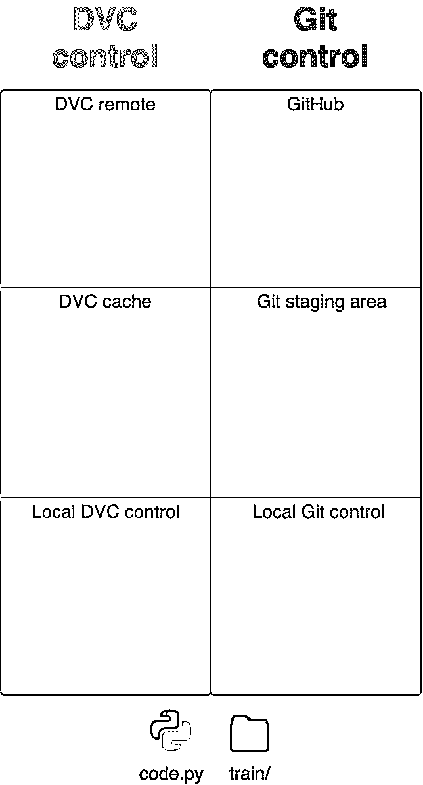
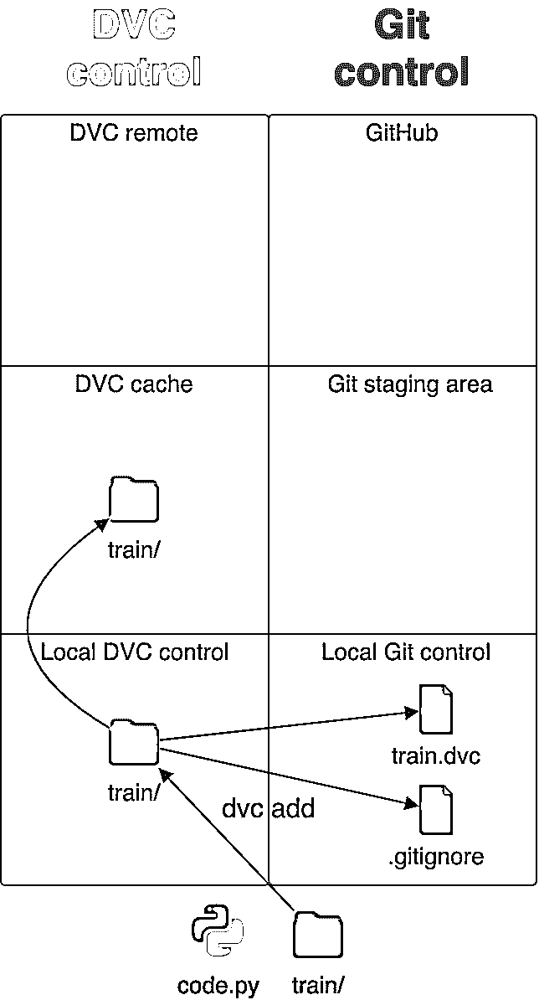
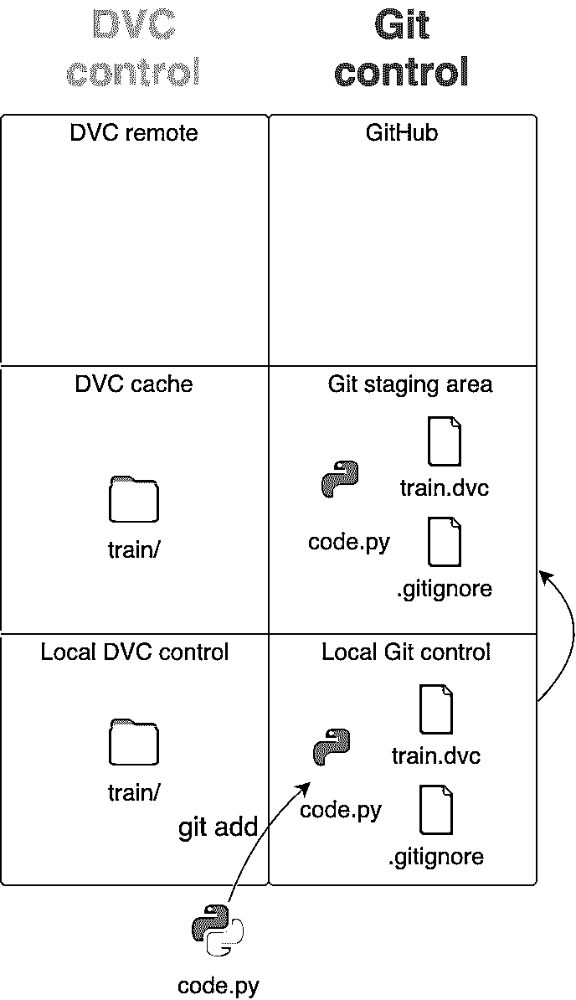
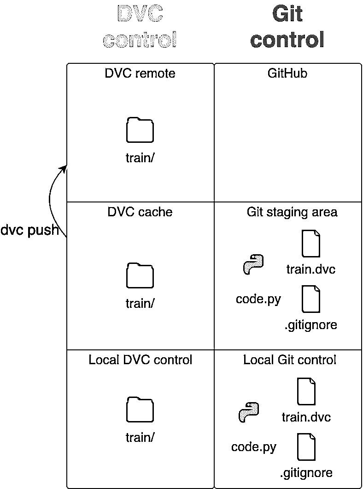
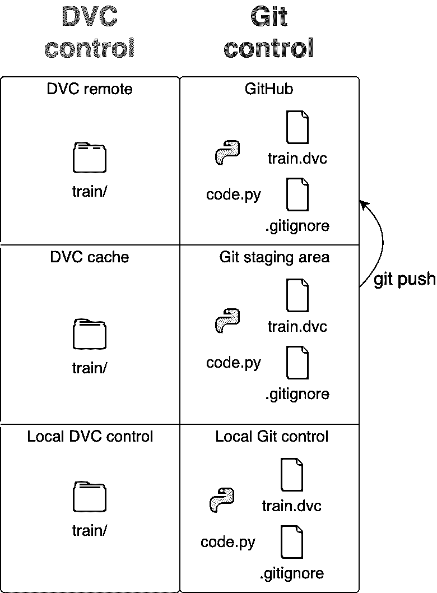
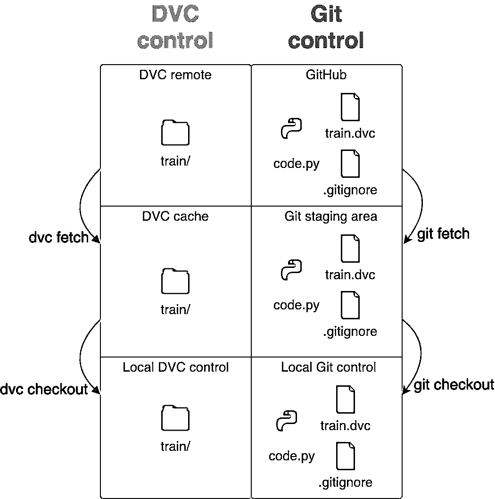
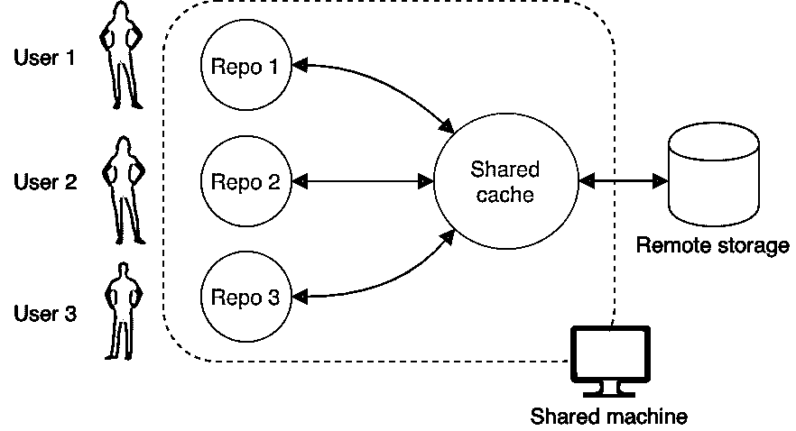
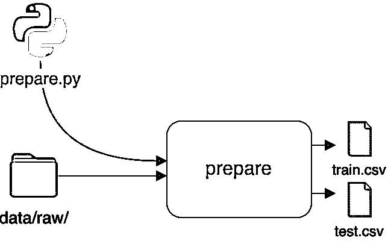
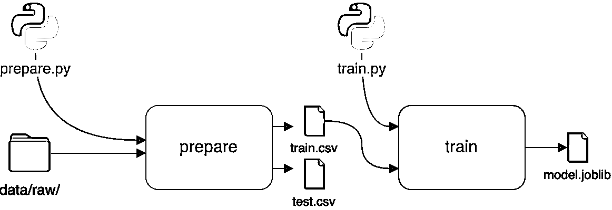
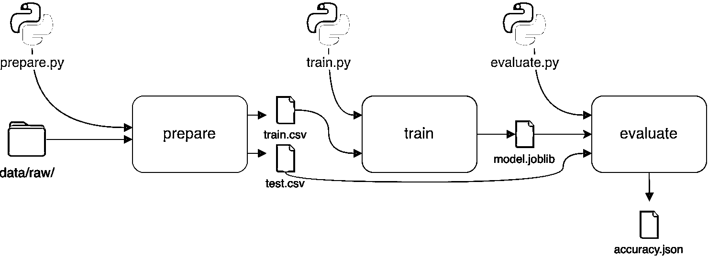

# 用 Python 和 DVC 实现数据版本控制

> 原文：<https://realpython.com/python-data-version-control/>

机器学习和数据科学带来了一系列不同于传统软件工程的问题。版本控制系统帮助开发人员管理源代码的变更。但是数据版本控制，管理对**模型**和**数据集**的变更，还没有很好地建立起来。

要跟踪你用于实验的所有数据和你制作的模型并不容易。准确地**重现你或其他人做过的实验**是一个挑战。许多团队正在积极开发工具和框架来解决这些问题。

**在本教程中，您将学习如何:**

*   使用一个叫做 **DVC** 的工具来应对这些挑战
*   **跟踪和版本化**您的数据集和模型
*   队友之间共用一台**单机开发电脑**
*   创建**可重复的**机器学习实验

本教程包括几个数据版本控制技术的例子。要继续学习，您可以通过单击下面的链接获得包含示例代码的存储库:

**获取源代码:** [点击此处获取源代码，您将在本教程中使用](https://realpython.com/bonus/data-version-control-code/)了解 DVC 的数据版本控制。

## 什么是数据版本控制？

在标准软件工程中，许多人需要在一个共享的代码库上工作，并处理同一代码的多个版本。这可能很快导致混乱和代价高昂的错误。

为了解决这个问题，开发人员使用**版本控制系统**，比如 [Git](https://git-scm.com/) ，帮助团队成员保持组织性。

在版本控制系统中，有一个代表项目当前官方状态的中央代码库。开发人员可以复制该项目，进行一些更改，并要求他们的新版本成为正式版本。然后，他们的代码在部署到生产环境之前会经过审查和测试。

在传统的开发项目中，这些快速的反馈循环每天会发生很多次。但商业数据科学和机器学习中很大程度上缺乏类似的约定和标准。**数据版本控制**是一套工具和过程，试图使版本控制过程适应数据世界。

拥有允许人们快速工作并继续完成其他人没有完成的工作的系统将会提高交付成果的速度和质量。它将使人们能够透明地管理数据，有效地进行实验，并与其他人合作。

**注意:**一个**实验**在这个上下文中意味着要么训练一个模型，要么在数据集上运行操作以从中学习一些东西。

一个帮助研究人员管理他们的数据和模型并运行可重复实验的工具是 **DVC** ，它代表**数据版本控制**。

[*Remove ads*](/account/join/)

## 什么是 DVC？

DVC 是用 Python 编写的命令行工具。它模仿 Git 命令和工作流，以确保用户可以快速地将它整合到他们的常规 Git 实践中。如果你以前没有使用过 Git，那么一定要看看[给 Python 开发者的 Git 和 GitHub 介绍](https://realpython.com/python-git-github-intro)。如果你对 Git 很熟悉，但是想让你的技能更上一层楼，那么看看[针对 Python 开发者的高级 Git 技巧](https://realpython.com/advanced-git-for-pythonistas/)。

DVC 注定要和吉特并肩作战。事实上，`git`和`dvc`命令经常会被一前一后地使用。当 Git 被用来存储和版本化代码时，DVC 对数据和模型文件做同样的事情。

Git 可以在本地存储代码，也可以在托管服务上存储代码，比如 GitHub、T2、T4、GitLab 和 T5。同样，DVC 使用远程存储库来存储您的所有数据和模型。这是真理的唯一来源，可以在整个团队中共享。您可以获得远程存储库的本地副本，修改文件，然后上传您的更改以与团队成员共享。

远程存储库可以在您工作的同一台计算机上，也可以在云中。DVC 支持大多数主要的云提供商，包括 [AWS](https://aws.amazon.com/about-aws/) 、 [GCP](https://cloud.google.com/) 和 [Azure](https://azure.microsoft.com/en-us/overview/what-is-azure/) 。但是你可以在任何服务器上建立一个 DVC 远程存储库，并将其连接到你的笔记本电脑上。有保护措施来防止成员破坏或删除远程数据。

当您在远程存储库中存储数据和模型时，会创建一个 **`.dvc`文件**。一个`.dvc`文件是一个小的文本文件，它指向远程存储中的实际数据文件。

`.dvc`文件是轻量级的，应该和你的代码一起存储在 GitHub 中。当您下载一个 Git 存储库时，您还会获得`.dvc`文件。然后，您可以使用这些文件来获取与该存储库相关联的数据。大型数据和模型文件放在你的 DVC 远程存储器中，指向你的数据的小型`.dvc`文件放在 GitHub 中。

了解 DVC 的最好方法是使用它，所以让我们开始吧。您将通过几个例子来探索最重要的特性。在开始之前，您需要设置一个工作环境，然后获取一些数据。

## 设置您的工作环境

在本教程中，您将通过练习处理图像数据的示例来学习如何使用 DVC。您将处理大量图像文件，并训练一个机器学习模型来识别图像包含的内容。

要完成这些示例，您需要在系统上安装 Python 和 Git。您可以按照 [Python 3 安装和设置指南](https://realpython.com/installing-python/)在您的系统上安装 Python。要安装 Git，可以通读[安装 Git](https://git-scm.com/book/en/v2/Getting-Started-Installing-Git) 。

由于 DVC 是一个命令行工具，您需要熟悉操作系统的命令行。如果你是 Windows 用户，看看在 Windows 上运行 DVC 的[。](https://dvc.org/doc/user-guide/running-dvc-on-windows)

要准备工作区，您需要采取以下步骤:

1.  创建并激活一个虚拟环境。
2.  安装 DVC 及其必备的 Python 库。
3.  派生并克隆一个包含所有代码的 GitHub 库。
4.  下载一个免费的数据集用于示例。

您可以使用任何您想要的包和环境管理器。本教程使用 [conda](https://docs.conda.io/en/latest/) 是因为它对数据科学和机器学习工具有很大的支持。要创建并激活虚拟环境，请打开您选择的命令行界面，并键入以下命令:

```py
$ conda create --name dvc python=3.8.2 -y
```

`create`命令创建一个新的虚拟环境。`--name`开关为该环境命名，在本例中为`dvc`。`python`参数允许您选择想要安装在环境中的 Python 版本。最后，`-y`开关自动同意安装 Python 需要的所有必要的包，而不需要您回应任何提示。

安装好一切后，激活环境:

```py
$ conda activate dvc
```

现在，您拥有了一个独立于操作系统 Python 安装的 Python 环境。这给了你一个干净的石板，防止你不小心弄乱了你的默认 Python 版本。

在本教程中，您还将使用一些外部库:

1.  **`dvc`** 是本教程的主角。
2.  **`scikit-learn`** 是一个机器学习库，可以让你训练模型。
3.  **`scikit-image`** 是一个图像处理库，您将使用它来准备训练数据。
4.  **`pandas`** 是一个用于数据分析的库，它以类似表格的结构组织数据。
5.  **`numpy`** 是一个数值计算库，增加了对多维数据的支持，比如图像。

其中一些只能通过 conda-forge 获得，所以您需要将它添加到您的配置中，并使用`conda install`来安装所有的库:

```py
$ conda config --add channels conda-forge
$ conda install dvc scikit-learn scikit-image pandas numpy
```

或者，您可以使用 [`pip`安装程序](https://realpython.com/what-is-pip/):

```py
$ python -m pip install dvc scikit-learn scikit-image pandas numpy
```

现在，您已经拥有了运行代码所需的所有 Python 库。

本教程附带了一个现成的存储库，其中包含目录结构和代码，可以让您快速体验 DVC。您可以通过单击下面的链接获得该存储库:

**获取源代码:** [点击此处获取源代码，您将在本教程中使用](https://realpython.com/bonus/data-version-control-code/)了解 DVC 的数据版本控制。

您需要将存储库分支到您自己的 GitHub 帐户。在资源库的 [GitHub 页面](https://github.com/realpython/data-version-control)上，点击屏幕右上角的*叉*，在弹出的窗口中选择你的私人账户。GitHub 将在你的帐户下创建一个库的分叉副本。

使用`git clone`命令将分叉的存储库克隆到您的计算机上，并将您的命令行放在存储库文件夹中:

```py
$ git clone https://github.com/YourUsername/data-version-control
$ cd data-version-control
```

不要忘记用您实际的用户名替换上面命令中的`YourUsername`。现在，您的计算机上应该有一个存储库的克隆。

下面是存储库的文件夹结构:

```py
data-version-control/
|
├── data/
│   ├── prepared/
│   └── raw/
|
├── metrics/
├── model/
└── src/
    ├── evaluate.py
    ├── prepare.py
    └── train.py
```

您的存储库中有六个文件夹:

1.  **`src/`** 为源代码。
2.  **`data/`** 是针对所有版本的数据集。
3.  **`data/raw/`** 是针对从外部来源获得的数据。
4.  **`data/prepared/`** 是对数据进行内部修改。
5.  **`model/`** 是用于机器学习的模型。
6.  **`data/metrics/`** 用于跟踪您的模型的性能指标。

`src/`文件夹包含三个 Python 文件:

1.  **`prepare.py`** 包含为训练准备数据的代码。
2.  **`train.py`** 包含用于训练机器学习模型的代码。
3.  **`evaluate.py`** 包含用于评估机器学习模型结果的代码。

准备工作的最后一步是获取一个可用于练习 DVC 的示例数据集。图像非常适合本教程，因为管理大量的大文件是 DVC 的强项，所以您可以很好地了解 DVC 最强大的功能。您将使用来自 [fastai](https://www.fast.ai/) 的 [Imagenette](https://github.com/fastai/imagenette) 数据集。

Imagenette 是 [ImageNet](http://www.image-net.org/) 数据集的子集，在许多机器学习论文中经常被用作基准数据集。ImageNet 太大了，不能在笔记本电脑上用作示例，所以您将使用较小的 ImageNet 数据集。进入 [Imagenette GitHub](https://github.com/fastai/imagenette) 页面，点击`README`中的 *160 px 下载*。

这将下载压缩到 [TAR](https://en.wikipedia.org/wiki/Tar_(computing)) 档案中的数据集。Mac 用户可以通过连按 Finder 中的归档来提取文件。Linux 用户可以用 [`tar`](https://man7.org/linux/man-pages/man1/tar.1.html) 命令解包。Windows 用户需要安装一个解压 TAR 文件的工具，比如 [7-zip](https://www.7-zip.org/) 。

数据集是以一种特殊的方式构建的。它有两个主要文件夹:

1.  **`train/`** 包括用于训练模型的图像。
2.  **`val/`** 包括用于验证模型的图像。

**注意:**验证通常发生在*模型正在训练的时候*，因此研究人员可以快速了解模型的表现如何。由于本教程并不关注性能指标，所以在完成训练后，您将使用验证集来测试您的模型*。*

Imagenette 是一个**分类**数据集，这意味着每个图像都有一个描述图像内容的相关类。为了解决分类问题，您需要训练一个模型，该模型可以准确地确定图像的类别。它需要查看图像，并正确识别正在显示的内容。

`train/`和`val/`文件夹被进一步分成多个文件夹。每个文件夹都有一个代表 10 个可能类别之一的代码，并且该数据集中的每个图像都属于 10 个类别之一:

1.  滕奇
2.  獚
3.  盒式磁带录音机
4.  链锯
5.  教堂
6.  圆号
7.  垃圾车
8.  气泵
9.  高尔夫球
10.  降落伞

为了简单和快速，您将只使用十个类中的两个来训练模型，高尔夫球和降落伞。经过训练后，模型会接受任何图像，并告诉你这是高尔夫球的图像还是降落伞的图像。这种一个模型在两种对象之间做决定的问题，叫做**二元分类**。

复制`train/`和`val/`文件夹，并将它们放入您的新存储库的`data/raw/`文件夹中。您的存储库结构现在应该如下所示:

```py
data-version-control/
|
├── data/
│   ├── prepared/
│   └── raw/
│       ├── train/
│       │   ├── n01440764/
│       │   ├── n02102040/
│       │   ├── n02979186/
│       │   ├── n03000684/
│       │   ├── n03028079/
│       │   ├── n03394916/
│       │   ├── n03417042/
│       │   ├── n03425413/
│       │   ├── n03445777/
│       │   └── n03888257/
|       |
│       └── val/
│           ├── n01440764/
│           ├── n02102040/
│           ├── n02979186/
│           ├── n03000684/
│           ├── n03028079/
│           ├── n03394916/
│           ├── n03417042/
│           ├── n03425413/
│           ├── n03445777/
│           └── n03888257/
|
├── metrics/
├── model/
└── src/
    ├── evaluate.py
    ├── prepare.py
    └── train.py
```

或者，您可以使用`curl`命令获取数据:

```py
$ curl https://s3.amazonaws.com/fast-ai-imageclas/imagenette2-160.tgz \
    -O imagenette2-160.tgz
```

反斜杠(\)允许您将一个命令分成多行，以提高可读性。上面的命令将下载 TAR 归档文件。

然后，您可以提取数据集并将其移动到数据文件夹:

```py
$ tar -xzvf imagenette2-160.tgz
$ mv imagenette2-160/train data/raw/train
$ mv imagenette2-160/val data/raw/val
```

最后，删除归档文件和解压缩的文件夹:

```py
$ rm -rf imagenette2-160
$ rm imagenette2-160.tgz
```

太好了！你已经完成了设置，并准备开始与 DVC 玩。

[*Remove ads*](/account/join/)

## 练习基本的 DVC 工作流程

你下载的数据集足以开始练习 DVC 基础。在这一节中，您将看到 DVC 如何与 Git 协同工作来管理您的代码和数据。

首先，为您的第一个实验创建一个分支:

```py
$ git checkout -b "first_experiment"
```

`git checkout`改变你当前的分支，`-b`开关告诉 Git 这个分支不存在，应该创建。

接下来，您需要初始化 DVC。确保您位于存储库的顶层文件夹中，然后运行`dvc init`:

```py
$ dvc init
```

这将创建一个保存配置信息的`.dvc`文件夹，就像 Git 的`.git`文件夹一样。原则上，您不需要打开那个文件夹，但是您可以在本教程中浏览一下，这样您就可以了解在这个引擎盖下发生了什么。

**注意:** DVC 最近开始收集匿名化的使用分析，因此作者可以更好地了解 DVC 是如何被使用的。这有助于他们改进工具。您可以通过将分析配置选项设置为`false`来关闭它:

```py
$ dvc config core.analytics false
```

Git 让您能够将本地代码推送到远程存储库，这样您就有了与其他开发人员共享的真实信息来源。其他人可以检查您的代码并在本地处理它，而不用担心会破坏其他人的代码。DVC 也是如此。

您需要某种远程存储来存储由 DVC 控制的数据和模型文件。这可以像系统中的另一个文件夹一样简单。在系统中的某个地方，在`data-version-control/`存储库之外创建一个文件夹，并将其命名为`dvc_remote`。

现在回到您的`data-version-control/`存储库，告诉 DVC 远程存储在您系统的什么位置:

```py
$ dvc remote add -d remote_storage path/to/your/dvc_remote
```

DVC 现在知道在哪里备份你的数据和模型。`dvc remote add`将位置存储到您的远程存储器，并将其命名为`remote_storage`。如果你愿意，你可以选择另一个名字。`-d`开关告诉 DVC 这是你默认的远程存储器。您可以添加多个存储位置，并在它们之间切换。

您可以随时检查您的存储库的远程是什么。在存储库的`.dvc`文件夹中有一个名为`config`的文件，它存储了关于存储库的配置信息:

```py
[core] analytics  =  false remote  =  remote_storage ['remote "remote_storage"'] url  =  /path/to/your/remote_storage
```

`remote = remote_storage`将您的`remote_storage`文件夹设置为默认文件夹，`['remote "remote_storage"']`定义您遥控器的配置。`url`指向你系统上的文件夹。如果您的远程存储是一个云存储系统，那么`url`变量将被设置为一个 web URL。

DVC 支持许多基于云的存储系统，如 AWS S3 桶、谷歌云存储和微软 Azure Blob 存储。你可以在 DVC 官方文档中找到更多关于 [dvc 远程添加](https://dvc.org/doc/command-reference/remote/add)命令的信息。

您的存储库现在已经初始化，可以开始工作了。您将涉及三个基本操作:

1.  跟踪文件
2.  上传文件
3.  下载文件

你要遵循的基本经验是，小文件去 GitHub，大文件去 DVC 远程存储。

[*Remove ads*](/account/join/)

### 跟踪文件

Git 和 DVC 都使用`add`命令开始跟踪文件。这将文件置于它们各自的控制之下。

将`train/`和`val/`文件夹添加到 DVC 控件:

```py
$ dvc add data/raw/train
$ dvc add data/raw/val
```

图像被视为大文件，尤其是当它们被收集到包含数百或数千个文件的数据集中时。命令将这两个文件夹添加到 DVC 的控制下。以下是 DVC 在幕后做的事情:

1.  **将**你的`train/`和`val/`文件夹添加到`.gitignore`
2.  **创建两个扩展名为`.dvc`、`train.dvc`和`val.dvc`的**文件
3.  **将`train/`和`val/`文件夹复制**到暂存区

这个过程有点复杂，需要更详细的解释。

`.gitignore`是一个文本文件，包含 Git 应该忽略或不跟踪的文件列表。当一个文件被列在`.gitignore`中时，它对`git`命令是不可见的。通过将`train/`和`val/`文件夹添加到`.gitignore`，DVC 确保你不会不小心将大数据文件上传到 GitHub。

你在[一节中了解了`.dvc`文件什么是 DVC？](#what-is-dvc)它们是小文本文件，将 DVC 指向你远程存储的数据。记住经验法则:大的数据文件和文件夹进入 DVC 远程存储，但是小的`.dvc`文件进入 GitHub。当你回到你的工作中，从 GitHub 中检查出所有的代码，你也会得到`.dvc`文件，你可以用它来获得你的大数据文件。

最后，DVC 将数据文件复制到临时区域。暂存区被称为**高速缓存**。当您用`dvc init`初始化 DVC 时，它会在您的存储库中创建一个`.dvc`文件夹。在那个文件夹中，它创建了缓存文件夹，`.dvc/cache`。当你运行`dvc add`时，所有的文件都被复制到`.dvc/cache`。

这提出了两个问题:

1.  复制文件不浪费很多空间吗？
2.  你能把缓存放在别的地方吗？

两个问题的答案都是肯定的。您将在[共享开发机器](#share-a-development-machine)一节中解决这两个问题。

以下是执行任何命令之前存储库的样子:

[](https://files.realpython.com/media/0_new-start.48d65eac9b3f.png)

<figcaption class="figure-caption text-center">The Starting State of a Repository</figcaption>

DVC 控制的所有东西都在左边(绿色)，Git 控制的所有东西都在右边(蓝色)。本地存储库有一个包含 Python 代码的`code.py`文件和一个包含训练数据的`train/`文件夹。这是您的存储库将会发生的事情的简化版本。

当你运行`dvc add train/`时，包含大文件的文件夹在 DVC 控制下，而小的`.dvc`和`.gitignore`文件在 Git 控制下。`train/`文件夹也进入暂存区或缓存:

[](https://files.realpython.com/media/1_new-dvc_add.e7d290c59325.png)

<figcaption class="figure-caption text-center">Adding Large Files and Folders to DVC Control</figcaption>

一旦大的图像文件被置于 DVC 控制之下，您就可以用`git add`将所有的代码和小文件添加到 Git 控制之下:

```py
$ git add --all
```

`--all`开关将 Git 可见的所有文件添加到登台区。

现在，所有文件都在各自版本控制系统的控制之下:

[](https://files.realpython.com/media/2_new-git_add.2de3d14865f7.png)

<figcaption class="figure-caption text-center">Adding Small Files to Git Control</figcaption>

概括地说，大的图像文件受 DVC 控制，小的文件受 Git 控制。如果有人想参与您的项目并使用`train/`和`val/`数据，那么他们首先需要下载您的 Git 存储库。然后他们可以使用`.dvc`文件来获取数据。

但是在人们可以获得你的存储库和数据之前，你需要把你的文件上传到远程存储器。

[*Remove ads*](/account/join/)

### 上传文件

要将文件上传到 GitHub，首先需要创建存储库当前状态的快照。当您使用`git add`将所有修改过的文件添加到暂存区时，使用`commit`命令创建一个快照:

```py
$ git commit -m "First commit with setup and DVC files"
```

`-m`开关意味着后面的引用文本是一个**提交消息**解释做了什么。该命令将单个跟踪的更改转化为存储库状态的完整快照。

DVC 也有一个`commit`命令，但是它不做与`git commit`相同的事情。DVC 不需要整个存储库的快照。一旦被`dvc add`追踪到，它就可以上传单个文件。

当一个已经被跟踪的文件改变时，使用`dvc commit`。如果您对数据进行本地更改，那么您应该在将数据上传到远程之前将更改提交到缓存中。自从添加数据以来，您没有更改过数据，因此您可以跳过提交步骤。

**注意:**由于 DVC 的这一部分不同于 Git，您可能想在 DVC 官方文档中阅读更多关于 [`add`](https://dvc.org/doc/command-reference/add) 和 [`commit`](https://dvc.org/doc/command-reference/commit) 命令的内容。

要将文件从缓存上传到遥控器，请使用`push`命令:

```py
$ dvc push
```

DVC 将浏览你所有的存储库文件夹来寻找`.dvc`文件。如上所述，这些文件将告诉 DVC 需要备份哪些数据，DVC 会将它们从缓存拷贝到远程存储:

[](https://files.realpython.com/media/new-dvc_push_1.1e26af053dd1.png)

<figcaption class="figure-caption text-center">Uploading Large Files to DVC Remote Storage</figcaption>

您的数据现在安全地存储在远离存储库的位置。最后，将 Git 控制下的文件推送到 GitHub:

```py
$ git push --set-upstream origin first_experiment
```

GitHub 不知道你在本地创建的新分支，所以第一个`push`需要使用`--set-upstream`选项。`origin`是你的主版本代码所在的地方。在这种情况下，它意味着 GitHub。您的代码和其他小文件现在安全地存储在 GitHub 中:

[](https://files.realpython.com/media/new-git_push_1.5ee03041c300.png)

<figcaption class="figure-caption text-center">Uploading small files to GitHub</figcaption>

干得好！您的所有文件都已备份到远程存储中。

### 下载文件

要了解如何下载文件，首先需要从存储库中删除一些文件。

一旦你用`dvc add`添加了你的数据，并用`dvc push`推送，它就被备份并且安全了。如果想节省空间，可以删除实际数据。只要所有的文件都被 DVC 跟踪，并且他们的`.dvc`文件都在你的存储库中，你就可以很快地取回数据。

您可以删除整个`val/`文件夹，但要确保`.dvc`文件不会被删除:

```py
$ rm -rf data/raw/val
```

这将从您的存储库中删除`data/raw/val/`文件夹，但是该文件夹仍然安全地存储在您的缓存*和远程存储*中。你可以随时取回它。

要从缓存中取回数据，使用`dvc checkout`命令:

```py
$ dvc checkout data/raw/val.dvc
```

您的`data/raw/val/`文件夹已恢复。如果您想让 DVC 搜索您的整个存储库并检查出所有丢失的东西，那么使用`dvc checkout`而不需要额外的参数。

当您在新机器上克隆 GitHub 存储库时，缓存将是空的。`fetch`命令将远程存储器的内容获取到缓存中:

```py
$ dvc fetch data/raw/val.dvc
```

或者您可以只使用`dvc fetch`来获取存储库中所有 DVC 文件的数据。一旦数据在您的缓存中，使用`dvc checkout`将其签出到存储库。你可以用一个命令`dvc pull`执行`fetch`和`checkout`:

```py
$ dvc pull
```

`dvc pull`执行`dvc fetch`，然后执行`dvc checkout`。它将您的数据从远程设备复制到缓存，然后一次性复制到您的存储库中。这些命令大致模仿了 Git 的功能，因为 Git 也有`fetch`、`checkout`和`pull`命令:

[](https://files.realpython.com/media/5_new-download.dd38540ba18f.png)

<figcaption class="figure-caption text-center">Getting Your Data Back From the Remote</figcaption>

请记住，您首先需要从 Git 获取`.dvc`文件，只有这样，您才能调用 DVC 命令，如`fetch`和`checkout`来获取您的数据。如果`.dvc`文件不在您的存储库中，那么 DVC 将不知道您想要获取和检出什么数据。

您现在已经学习了 DVC 和 Git 的基本工作流程。每当您添加更多数据或更改一些代码时，您可以使用`add`、`commit`和`push`来保持所有内容的版本控制和安全备份。对于许多人来说，这种基本的工作流程足以满足他们的日常需求。

本教程的其余部分集中在一些特定的用例上，比如多人共享计算机和创建可复制的管道。为了探索 DVC 如何处理这些问题，你需要一些运行机器学习实验的代码。

[*Remove ads*](/account/join/)

## 建立机器学习模型

使用 Imagenette 数据集，您将训练一个模型来区分高尔夫球和降落伞的图像。

您将遵循三个主要步骤:

1.  为培训准备数据。
2.  训练你的机器学习模型。
3.  评估模型的性能。

如前所述，这些步骤对应于`src/`文件夹中的三个 Python 文件:

1.  `prepare.py`
2.  `train.py`
3.  `evaluate.py`

以下小节将解释每个文件的作用。将显示整个文件的内容，并解释每一行的作用。

### 准备数据

由于数据存储在多个文件夹中，Python 需要搜索所有文件夹来找到图像。文件夹名称决定了标签的内容。这对计算机来说可能不难，但对人类来说就不太直观了。

为了使数据更容易使用，您将创建一个 [CSV 文件](https://realpython.com/python-csv/)，它将包含一个用于训练的所有图像及其标签的列表。CSV 文件将有两列，一列是包含单个图像完整路径的`filename`列，另一列是包含实际标签字符串的`label`列，如`"golf ball"`或`"parachute"`。每行代表一幅图像。

这是 CSV 外观的预览图:

```py
filename, label
full/path/to/data-version-control/raw/n03445777/n03445777_5768.JPEG,golf ball
full/path/to/data-version-control/raw/n03445777/n03445777_5768,golf ball
full/path/to/data-version-control/raw/n03445777/n03445777_11967.JPEG,golf ball
...
```

您需要两个 CSV 文件:

1.  **`train.csv`** 将包含用于训练的图片列表。
2.  **`test.csv`** 将包含一个用于测试的图片列表。

您可以通过运行`prepare.py`脚本来创建 CSV 文件，它有三个主要步骤:

1.  将文件夹名称如`n03445777/`映射到标签名称如`golf ball`。
2.  获取标签为`golf ball`和`parachute`的文件列表。
3.  将`filelist` - `label`对保存为 CSV 文件。

以下是您将用于准备步骤的源代码:

```py
 1# prepare.py
 2from pathlib import Path
 3
 4import pandas as pd
 5
 6FOLDERS_TO_LABELS = {
 7    "n03445777": "golf ball",
 8    "n03888257": "parachute"
 9    }
10
11def get_files_and_labels(source_path):
12    images = []
13    labels = []
14    for image_path in source_path.rglob("*/*.JPEG"):
15        filename = image_path.absolute()
16        folder = image_path.parent.name
17        if folder in FOLDERS_TO_LABELS:
18            images.append(filename)
19            label = FOLDERS_TO_LABELS[folder]
20            labels.append(label)
21    return images, labels
22
23def save_as_csv(filenames, labels, destination):
24    data_dictionary = {"filename": filenames, "label": labels}
25    data_frame = pd.DataFrame(data_dictionary)
26    data_frame.to_csv(destination)
27
28def main(repo_path):
29    data_path = repo_path / "data"
30    train_path = data_path / "raw/train"
31    test_path = data_path / "raw/val"
32    train_files, train_labels = get_files_and_labels(train_path)
33    test_files, test_labels = get_files_and_labels(test_path)
34    prepared = data_path / "prepared"
35    save_as_csv(train_files, train_labels, prepared / "train.csv")
36    save_as_csv(test_files, test_labels, prepared / "test.csv")
37
38if __name__ == "__main__":
39    repo_path = Path(__file__).parent.parent
40    main(repo_path)
```

要运行本教程，您不必理解代码中发生的所有事情。如果您感到好奇，以下是对代码功能的高级解释:

*   **第 6 行:**包含高尔夫球和降落伞图像的文件夹的名称被映射到名为`FOLDERS_TO_LABELS`的字典中的标签`"golf ball"`和`"parachute"`。

*   **第 11 到 21 行:** `get_files_and_labels()`接受一个指向`data/raw/`文件夹的 [`Path`](https://realpython.com/python-pathlib/) 。该功能在所有文件夹和子文件夹中循环查找以`.jpeg`扩展名结尾的文件。标签被分配给那些文件夹在`FOLDERS_TO_LABELS`中被表示为关键字的文件。文件名和标签作为列表返回。

*   **第 23 到 26 行:** `save_as_csv()`接受文件列表、标签列表和目的地`Path`。文件名和标签被格式化为[熊猫数据帧](https://realpython.com/pandas-dataframe/)，并在目的地保存为 CSV 文件。

*   **第 28 到 36 行:** `main()`驱动脚本的功能。它运行`get_files_and_labels()`来查找`data/raw/train/`和`data/raw/val/`文件夹中的所有图像。文件名和它们匹配的标签将作为两个 CSV 文件保存在`data/prepared/`文件夹中，`train.csv`和`test.csv`。

*   **第 38 到 40 行:**当你从命令行运行`prepare.py`时，脚本的[主作用域](https://realpython.com/python-main-function/#use-if-__name__-main-to-control-the-execution-of-your-code)被执行并调用`main()`。

所有路径操作都是使用`pathlib`模块完成的。如果你不熟悉这些操作，那么看看用 Python 处理文件的[。](https://realpython.com/working-with-files-in-python/)

在命令行中运行`prepare.py`脚本:

```py
$ python src/prepare.py
```

当脚本完成时，您的`data/prepared/`文件夹中会有`train.csv`和`test.csv`文件。您需要将这些文件添加到 DVC，并将相应的`.dvc`文件添加到 GitHub:

```py
$ dvc add data/prepared/train.csv data/prepared/test.csv
$ git add --all
$ git commit -m "Created train and test CSV files"
```

太好了！现在，您有了一个用于训练和测试机器学习模型的文件列表。下一步是加载图像并使用它们来运行训练。

[*Remove ads*](/account/join/)

### 训练模型

为了训练这个模型，你将使用一种叫做**监督学习**的方法。这种方法包括向模型显示一幅图像，并让它猜测图像显示的内容。然后，你给它看正确的标签。如果它猜错了，那么它会自我纠正。对于数据集中的每个图像和标签，您都要多次执行此操作。

解释每个模型如何工作超出了本教程的范围。幸运的是，scikit-learn 有大量现成的模型可以解决各种问题。每个模型都可以通过调用一些标准方法来训练。

使用`train.py`文件，您将执行六个步骤:

1.  阅读告诉 Python 图像位置的 CSV 文件。
2.  将训练图像加载到内存中。
3.  将类别标签载入内存。
4.  对图像进行预处理，以便用于训练。
5.  训练机器学习模型对图像进行分类。
6.  将机器学习模型保存到您的磁盘。

以下是您将在培训步骤中使用的源代码:

```py
 1# train.py
 2from joblib import dump
 3from pathlib import Path
 4
 5import numpy as np
 6import pandas as pd
 7from skimage.io import imread_collection
 8from skimage.transform import resize
 9from sklearn.linear_model import SGDClassifier
10
11def load_images(data_frame, column_name):
12    filelist = data_frame[column_name].to_list()
13    image_list = imread_collection(filelist)
14    return image_list
15
16def load_labels(data_frame, column_name):
17    label_list = data_frame[column_name].to_list()
18    return label_list
19
20def preprocess(image):
21    resized = resize(image, (100, 100, 3))
22    reshaped = resized.reshape((1, 30000))
23    return reshape
24
25def load_data(data_path):
26    df = pd.read_csv(data_path)
27    labels = load_labels(data_frame=df, column_name="label")
28    raw_images = load_images(data_frame=df, column_name="filename")
29    processed_images = [preprocess(image) for image in raw_images]
30    data = np.concatenate(processed_images, axis=0)
31    return data, labels
32
33def main(repo_path):
34    train_csv_path = repo_path / "data/prepared/train.csv"
35    train_data, labels = load_data(train_csv_path)
36    sgd = SGDClassifier(max_iter=10)
37    trained_model = sgd.fit(train_data, labels)
38    dump(trained_model, repo_path / "model/model.joblib")
39
40if __name__ == "__main__":
41    repo_path = Path(__file__).parent.parent
42    main(repo_path)
```

下面是代码的作用:

*   **第 11 到 14 行:** `load_images()`接受一个 DataFrame，它代表在`prepare.py`中生成的一个 CSV 文件和包含图像文件名的列的名称。然后，该函数加载并返回图像，作为一个由 [NumPy 数组](https://realpython.com/numpy-array-programming/)组成的列表。

*   **第 16 到 18 行:** `load_labels()`接受与`load_images()`相同的数据帧和包含标签的列名。该函数读取并返回对应于每个图像的标签列表。

*   **第 20 行到第 23 行:** `preprocess()`接受一个表示单个图像的 NumPy 数组，调整它的大小，并将其重新整形为一行数据。

*   **第 25 到 31 行:** `load_data()`接受`Path`到`train.csv`的文件。该函数加载图像和标签，对它们进行预处理，并将它们堆叠到一个二维 NumPy 数组中，因为您将使用的 scikit-learn 分类器期望数据采用这种格式。数据数组和标签被返回给调用者。

*   **第 33 到 38 行:** `main()`将数据加载到内存中，并定义一个名为 [SGDClassifier](https://scikit-learn.org/stable/modules/generated/sklearn.linear_model.SGDClassifier.html) 的示例分类器。使用训练数据训练分类器，并保存在`model/`文件夹中。scikit-learn 推荐使用`joblib`模块来完成这项工作。

*   **第 40 到 42 行:**当`train.py`被执行时，脚本的主要作用域运行`main()`。

现在在命令行中运行`train.py`脚本:

```py
$ python src/train.py
```

运行代码可能需要几分钟时间，这取决于您的计算机有多强。执行这段代码时，您可能会得到一个警告:

```py
ConvergenceWarning: Maximum number of iteration reached before convergence.
Consider increasing max_iter to improve the fit.
```

这意味着 scikit-learn 认为您可以增加`max_iter`并获得更好的结果。您将在下面的某一节中做到这一点，但本教程的目标是让您的实验运行得更快，而不是达到最高的精度。

当脚本完成时，您将有一个经过训练的机器学习模型保存在名为`model.joblib`的`model/`文件夹中。这是实验中最重要的文件。需要将它添加到 DVC，并将相应的`.dvc`文件提交到 GitHub:

```py
$ dvc add model/model.joblib
$ git add --all
$ git commit -m "Trained an SGD classifier"
```

干得好！你已经训练了一个机器学习模型来区分两类图像。下一步是确定模型在测试图像上的表现有多准确，这是模型在训练期间没有看到的。

### 评估模型

评估会带来一点回报，因为你的努力最终会得到一些反馈。在这个过程的最后，你会有一些硬数字来告诉你这个模型做得有多好。

下面是您将用于评估步骤的源代码:

```py
 1# evaluate.py
 2from joblib import load
 3import json
 4from pathlib import Path
 5
 6from sklearn.metrics import accuracy_score
 7
 8from train import load_data
 9
10def main(repo_path):
11    test_csv_path = repo_path / "data/prepared/test.csv"
12    test_data, labels = load_data(test_csv_path)
13    model = load(repo_path / "model/model.joblib")
14    predictions = model.predict(test_data)
15    accuracy = accuracy_score(labels, predictions)
16    metrics = {"accuracy": accuracy}
17    accuracy_path = repo_path / "metrics/accuracy.json"
18    accuracy_path.write_text(json.dumps(metrics))
19
20if __name__ == "__main__":
21    repo_path = Path(__file__).parent.parent
22    main(repo_path)
```

下面是代码的作用:

*   **第 10 到 14 行:** `main()`根据测试数据评估训练好的模型。该函数加载测试图像，加载模型，并预测哪些图像对应于哪些标签。

*   **第 15 行到第 18 行:**将模型生成的预测与来自`test.csv`的实际标签进行比较，并将准确性作为 [JSON](https://realpython.com/python-json/) 文件保存在`metrics/`文件夹中。准确度表示正确分类的图像的比率。之所以选择 JSON 格式，是因为 DVC 可以用它来比较不同实验之间的指标，这一点您将在[创建可再现的管道](#create-reproducible-pipelines)一节中学习。

*   **第 20 到 22 行:**当`evaluate.py`被执行时，脚本的主要作用域运行`main()`。

在命令行中运行`evaluate.py`脚本:

```py
$ python src/evaluate.py
```

您的模型现在已经被评估了，度量标准被安全地存储在一个`accuracy.json`文件中。每当你改变你的模型或者使用一个不同的模型，你可以通过比较它和这个值来看它是否有所改进。

在这种情况下，您的 JSON 文件只包含一个对象，即您的模型的准确性:

```py
{  "accuracy":  0.670595690747782  }
```

如果您将`accuracy`变量乘以 100，您将得到正确分类的百分比。在这种情况下，该模型对 67.06%的测试图像进行了正确分类。

JSON 文件非常小，将它保存在 GitHub 中非常有用，这样您可以快速检查每个实验的执行情况:

```py
$ git add --all
$ git commit -m "Evaluate the SGD model accuracy"
```

干得好！评估完成后，您就可以深入了解 DVC 的一些高级功能和流程了。

[*Remove ads*](/account/join/)

## 版本数据集和模型

可再生数据科学的核心是能够拍摄用于构建模型的所有事物的快照。每次运行实验时，您都想确切地知道什么输入进入了系统，什么输出被创建。

在本节中，您将尝试一个更复杂的工作流来对您的实验进行版本控制。您还将打开一个`.dvc`文件并查看其内部。

首先，将您对`first_experiment`分支所做的所有更改推送到您的 GitHub 和 DVC 远程存储器:

```py
$ git push
$ dvc push
```

您的代码和模型现在备份在远程存储上。

训练一个模型或完成一个实验是一个项目的里程碑。你应该有办法找到并回到这个特定的点。

### 标记提交

一种常见的做法是使用[标记](https://git-scm.com/book/en/v2/Git-Basics-Tagging)来标记您的 Git 历史中的某个重要点。既然您已经完成了一项实验并制作了一个新模型，那么就创建一个标记，向您自己和他人表明您已经有了一个现成的模型:

```py
$ git tag -a sgd-classifier -m "SGDClassifier with accuracy 67.06%"
```

`-a`开关用于注释您的标签。你可以把它变得简单或复杂。一些团队用版本号对他们训练的模型进行版本化，像`v1.0`、`v1.3`等等。其他人使用日期和训练模型的团队成员的首字母。您和您的团队决定如何跟踪您的模型。`-m`开关允许您向标签添加消息字符串，就像提交一样。

Git 标签不是通过常规提交来推送的，所以它们必须被单独推送至 GitHub 或您使用的任何平台上的存储库的源位置。使用`--tags`开关将所有标签从本地存储库推送到远程存储库:

```py
$ git push origin --tags
```

如果您使用 GitHub，那么您可以通过存储库的 *Releases* 选项卡访问标签。

您可以随时查看当前存储库中的所有标签:

```py
$ git tag
```

DVC 工作流严重依赖于有效的 Git 实践。标记特定的提交标志着项目的重要里程碑。另一种让工作流更加有序和透明的方法是使用分支。

### 为每个实验创建一个 Git 分支

到目前为止，您已经完成了`first_experiment`分支上的所有工作。复杂的问题或长期项目通常需要运行许多实验。一个好主意是为每个实验创建一个新的分支。

在您的第一个实验中，您将模型的最大迭代次数设置为`10`。您可以尝试将该数字设置得更高，看看是否能改善结果。创建一个新的分支，并将其命名为`sgd-100-iterations`:

```py
$ git checkout -b "sgd-100-iterations"
```

当您创建一个新的分支时，您在先前分支中的所有`.dvc`文件都将出现在新分支中，就像其他文件和文件夹一样。

更新`train.py`中的代码，使`SGDClassifier`模型具有参数`max_iter=100`:

```py
# train.py
def main(repo_path):
    train_csv_path = repo_path / "data/prepared/train.csv"
    train_data, labels = load_data(train_csv_path)
 sgd = SGDClassifier(max_iter=100)    trained_model = sgd.fit(train_data, labels)
    dump(trained_model, repo_path / "model/model.joblib")
```

这是你唯一能做的改变。通过运行`train.py`和`evaluate.py`重新运行培训和评估:

```py
$ python src/train.py
$ python src/evaluate.py
```

您现在应该有一个新的`model.joblib`文件和一个新的`accuracy.json`文件。

由于训练过程已经更改了`model.joblib`文件，您需要将它提交到 DVC 缓存:

```py
$ dvc commit
```

DVC 将抛出一个提示，询问您是否确定要进行更改。按下 `Y` ，然后按下 `Enter` 。

记住，`dvc commit`的工作方式与`git commit`不同，它用于更新一个*已经跟踪的*文件。这不会删除以前的模型，但会创建一个新的模型。

添加并提交您对 Git 所做的更改:

```py
$ git add --all
$ git commit -m "Change SGD max_iter to 100"
```

标记您的新实验:

```py
$ git tag -a sgd-100-iter -m "Trained an SGD Classifier for 100 iterations"
$ git push origin --tags
```

将代码更改推送到 GitHub，将 DVC 更改推送到您的远程存储器:

```py
$ git push --set-upstream origin sgd-100-iter
$ dvc push
```

通过从 GitHub 检查代码，然后从 DVC 检查数据和模型，您可以在分支之间跳转。例如，您可以检查`first_example`分支并获得相关的数据和模型:

```py
$ git checkout first_experiment
$ dvc checkout
```

非常好。现在您有了多个实验，并且它们的结果被版本化和存储，您可以通过 Git 和 DVC 检查内容来访问它们。

[*Remove ads*](/account/join/)

### 查看 DVC 档案

您已经创建并提交了一些`.dvc`文件到 GitHub，但是文件里面有什么呢？打开模型`data-version-control/model/model.joblib.dvc`的当前`.dvc`文件。以下是内容示例:

```py
md5:  62bdac455a6574ed68a1744da1505745 outs: -  md5:  96652bd680f9b8bd7c223488ac97f151 path:  model.joblib cache:  true metric:  false persist:  false
```

内容可能会令人困惑。DVC 的档案是 YAML 的[档案。信息存储在键值对和列表中。第一个是 **md5** 密钥，后面是一串看似随机的字符。](https://realpython.com/python-yaml/)

**MD5** 是众所周知的[哈希函数](https://realpython.com/python-hash-table/#understand-the-hash-function)。哈希处理任意大小的文件，并使用其内容产生固定长度的字符串，称为**哈希**或**校验和**。在这种情况下，长度是 32 个字符。不管文件的原始大小是多少，MD5 总是计算 32 个字符的散列。

两个完全相同的文件将产生相同的哈希。但是，如果其中一个文件中有一个比特发生了变化，那么散列将会完全不同。DVC 使用 MD5 的这些属性来实现两个重要目标:

1.  通过查看文件的哈希值来跟踪哪些文件发生了更改
2.  查看两个大文件何时相同，以便只有一个副本可以存储在缓存或远程存储中

在您正在查看的示例`.dvc`文件中，有两个`md5`值。第一个描述了`.dvc`文件本身，第二个描述了`model.joblib`文件。`path`是模型的文件路径，相对于您的工作目录，`cache`是一个[布尔值](https://realpython.com/python-boolean/)，它决定 DVC 是否应该缓存模型。

您将在后面的章节中看到其他一些字段，但是您可以在[官方文档](https://dvc.org/doc/user-guide/dvc-file-format)中了解关于`.dvc`文件格式的所有信息。

如果只有你一个人使用运行实验的计算机，你刚刚学习的工作流程就足够了。但是许多团队不得不共享强大的机器来完成他们的工作。

## 共享一台开发机

在许多学术和工作环境中，计算繁重的工作不是在个人笔记本电脑上完成的，因为它们的功能不足以处理大量数据或密集处理。相反，团队使用云计算机或内部工作站。多个用户经常在一台机器上工作。

当多个用户处理相同的数据时，您不希望在用户和存储库中散布相同数据的多个副本。为了节省空间，DVC 允许您设置共享缓存。当您用`dvc init`初始化 DVC 存储库时，默认情况下，DVC 会将缓存放在存储库的`.dvc/cache`文件夹中。

您可以更改默认值以指向计算机上其他地方。在计算机上的某个位置创建一个新文件夹。把它叫做`shared_cache`，告诉 DVC 把那个文件夹作为缓存:

```py
$ dvc cache dir path/to/shared_cache
```

现在每次运行`dvc add`或者`dvc commit`，数据都会备份到那个文件夹里。当您使用`dvc fetch`从远程存储获取数据时，它将进入共享缓存，而`dvc checkout`将把它带到您的工作存储库。

如果您一直在学习本教程中的例子，那么您所有的文件都将在您的存储库的`.dvc/cache`文件夹中。执行上述命令后，将数据从默认缓存移动到新的共享缓存:

```py
$ mv .dvc/cache/* path/to/shared_cache
```

该计算机上的所有用户现在都可以将其存储库缓存指向共享缓存:

[](https://files.realpython.com/media/6_new-shared_cache.54170a671825.png)

<figcaption class="figure-caption text-center">Multiple Users Can Share a Single Cache</figcaption>

太好了。现在，您有了一个共享缓存，所有其他用户都可以共享它们的存储库。如果您的操作系统(OS)不允许任何人使用共享缓存，那么请确保您系统上的所有权限都设置正确。你可以在 [DVC 文档](https://dvc.org/doc/use-cases/shared-development-server)中找到关于建立共享系统的更多细节。

如果您检查您的存储库的`.dvc/config`文件，那么您会看到一个新的部分出现:

```py
[cache] dir  =  /path/to/shared_cache
```

这允许您仔细检查数据备份的位置。

但是这如何帮助你节省空间呢？DVC 可以使用**链接**，而不是在本地存储库、共享缓存、*和*机器上的所有其他存储库中复制相同的数据。链接是操作系统的一个特征。

如果你有一个文件，比如一张图片，那么你可以创建一个到那个文件的链接。该链接看起来就像系统中的另一个文件，但它不包含数据。它只引用系统中其他地方的实际文件，比如快捷方式。有许多类型的链接，像**参考链接**、**符号链接**和**硬链接**。每种都有不同的属性。

默认情况下，DVC 将尝试使用参考链接，但它们并非在所有电脑上都可用。如果你的操作系统不支持引用链接，DVC 将默认创建副本。你可以在 [DVC 文档](https://dvc.org/doc/user-guide/large-dataset-optimization#file-link-types-for-the-dvc-cache)中了解更多关于文件链接类型的信息。

您可以通过更改`cache.type`配置选项来更改缓存的默认行为:

```py
$ dvc config cache.type symlink
```

你可以用`reflink`、`hardlink`或者`copies`来代替`symlink`。研究每种类型的链接，并选择最适合您正在使用的操作系统的选项。记住，您可以通过阅读`.dvc/config`文件来检查您的 DVC 存储库当前是如何配置的:

```py
[cache]
 dir = /path/to/shared_cache
 type = symlink
```

如果您对`cache.type`进行了更改，它不会立即生效。你需要告诉 DVC 查看链接，而不是文件副本:

```py
$ dvc checkout --relink
```

开关将告诉 DVC 检查缓存类型并重新链接 DVC 当前跟踪的所有文件。

如果您的存储库或缓存中有没有被使用的模型或数据文件，那么您可以通过使用`dvc gc`清理您的存储库来节省额外的空间。 **`gc`** 代表**垃圾收集**，将从缓存中移除任何未使用的文件和目录。

**重要提示:**小心任何删除数据的命令！

通过查阅删除文件命令的官方文档，如 [`gc`](https://dvc.org/doc/command-reference/gc) 和 [`remove`](https://dvc.org/doc/command-reference/remove) ，确保你理解所有的细微差别。

现在，您可以与您的团队共享一台开发机器了。要探索的下一个特性是创建管道。

[*Remove ads*](/account/join/)

## 创建可复制管道

以下是迄今为止您为训练机器学习模型所做的步骤的回顾:

1.  获取数据
2.  准备数据
3.  跑步训练
4.  评估训练运行

您手动提取数据并将其添加到远程存储。你现在可以用`dvc checkout`或者`dvc pull`得到它。其他步骤通过运行各种 Python 文件来执行。这些可以被链接到一个叫做 DVC **流水线**的单一执行中，只需要一个命令。

创建一个新的分支，并将其命名为`sgd-pipeline`:

```py
$ git checkout -b sgd-pipeline
```

您将使用这个分支作为 DVC 管道重新运行实验。流水线由多个阶段组成，使用`dvc run`命令执行。每个阶段有三个组成部分:

1.  输入
2.  输出
3.  命令

DVC 使用术语**依赖**作为输入，使用**输出**作为输出。该命令可以是您通常在命令行中运行的任何内容，包括 Python 文件。您可以在运行另一个实验时练习创建阶段管道。三个 Python 文件中的每一个，`prepare.py`、`train.py`和`evaluate.py`都将由管道中的一个阶段来表示。

**注意:**你将通过创建管道来复制你用`prepare.py`、`train.py`和`evaluate.py`创建的所有文件。

管道会自动将新创建的文件添加到 DVC 控制中，就像你输入了`dvc add`一样。由于你已经手动添加了很多文件到 DVC 控制，如果你试图用管道创建相同的文件，DVC 会感到困惑。

为了避免这种情况，首先使用`dvc remove`删除 CSV 文件、模型和指标:

```py
$ dvc remove data/prepared/train.csv.dvc \
             data/prepared/test.csv.dvc \
             model/model.joblib.dvc --outs
```

这将删除`.dvc`文件和`.dvc`文件指向的相关数据。现在，您应该有一张白纸，使用 DVC 管道重新创建这些文件。

首先，你将运行`prepare.py`作为 DVC 管道阶段。这个命令是`dvc run`，它需要知道依赖项、输出和命令:

1.  **依赖:** `prepare.py`和`data/raw`中的数据
2.  **输出:** `train.csv`和`test.csv`
3.  **命令:** `python prepare.py`

使用`dvc run`命令将`prepare.py`作为 DVC 流水线阶段执行:

```py
 1$ dvc run -n prepare \
 2        -d src/prepare.py -d data/raw \
 3        -o data/prepared/train.csv -o data/prepared/test.csv \
 4        python src/prepare.py
```

所有这些都是一个单一的命令。第一行启动`dvc run`命令并接受几个选项:

*   **`-n`** 开关为舞台命名。
*   **`-d`** 开关将依赖关系传递给命令。
*   **`-o`** 开关定义了命令的输出。

该命令的主要参数是将要执行的 Python 命令，`python src/prepare.py`。简单地说，上面的`dvc run`命令给了 DVC 以下信息:

*   **第 1 行:**你要运行一个流水线阶段，称之为`prepare`。
*   **第二行:**管道需要`prepare.py`文件和`data/raw`文件夹。
*   **第 3 行:**流水线会产生`train.csv`和`test.csv`文件。
*   **第 4 行:**要执行的命令是`python src/prepare.py`。

一旦你创建了舞台，DVC 将创建两个文件，`dvc.yaml`和`dvc.lock`。打开看看里面。

这是您将在`dvc.yaml`中看到的示例:

```py
stages: prepare: cmd:  python src/prepare.py deps: -  data/raw -  src/prepare.py outs: -  data/prepared/test.csv -  data/prepared/train.csv
```

都是你放在`dvc run`命令里的信息。顶层元素`stages`下嵌套了多个元素，每个阶段一个。目前，你只有一个阶段，`prepare`。当你链接更多的时候，它们会出现在这个文件中。从技术上讲，您不必在命令行中键入`dvc run`命令——您可以在这里创建您的所有阶段。

每个`dvc.yaml`都有一个对应的`dvc.lock`文件，也是 YAML 格式。里面的信息是相似的，除了所有依赖项和输出的 MD5 散列之外:

```py
prepare: cmd:  python src/prepare.py deps: -  path:  data/raw md5:  a8a5252d9b14ab2c1be283822a86981a.dir -  path:  src/prepare.py md5:  0e29f075d51efc6d280851d66f8943fe outs: -  path:  data/prepared/test.csv md5:  d4a8cdf527c2c58d8cc4464c48f2b5c5 -  path:  data/prepared/train.csv md5:  50cbdb38dbf0121a6314c4ad9ff786fe
```

添加 MD5 哈希允许 DVC 跟踪所有的依赖和输出，并检测这些文件是否有任何变化。例如，如果一个依赖文件改变了，那么它将有一个不同的散列值，DVC 将知道它需要用新的依赖重新运行那个阶段。因此，`train.csv`、`test.csv`和`model.joblib`没有单独的`.dvc`文件，所有的东西都在`.lock`文件中被跟踪。

太好了—您已经自动化了管道的第一阶段，这可以可视化为流程图:

[](https://files.realpython.com/media/new-pipeline_1_1.79fcfdf683a8.png)

<figcaption class="figure-caption text-center">The First Stage of the Pipeline</figcaption>

您将在接下来的阶段中使用此阶段生成的 CSV 文件。

下一步是培训。依赖关系是`train.py`文件本身和`data/prepared`中的`train.csv`文件。唯一的输出是`model.joblib`文件。要用`train.py`创建一个流水线阶段，用`dvc run`执行它，指定正确的依赖项和输出:

```py
$ dvc run -n train \
        -d src/train.py -d data/prepared/train.csv \
        -o model/model.joblib \
        python src/train.py
```

这将创建管道的第二阶段，并将其记录在`dvc.yml`和`dvc.lock`文件中。这是管道新状态的可视化:

[](https://files.realpython.com/media/new-pipeline_2_1.dca61ebc0e0e.png)

<figcaption class="figure-caption text-center">The Second Stage of the Pipeline</figcaption>

搞定两个，还剩一个！最后一个阶段是评估。依赖项是前一阶段生成的`evaluate.py`文件和模型文件。输出是度量文件`accuracy.json`。用`dvc run`执行`evaluate.py`:

```py
$ dvc run -n evaluate \
        -d src/evaluate.py -d model/model.joblib \
        -M metrics/accuracy.json \
        python src/evaluate.py
```

请注意，您使用了`-M`开关，而不是`-o`。DVC 对指标的处理不同于其他输出。当您运行这个命令时，它会生成`accuracy.json`文件，但是 DVC 会知道这是一个用来衡量模型性能的指标。

您可以使用`dvc show`命令让 DVC 向您展示它知道的所有指标:

```py
$ dvc metrics show
 metrics/accuracy.json:
 accuracy: 0.6996197718631179
```

您已经完成了管道的最后一个阶段，如下所示:

[](https://files.realpython.com/media/new-pipeline_3_1.2459d31b98e5.png)

<figcaption class="figure-caption text-center">The Full Pipeline</figcaption>

现在，您可以在一幅图像中看到整个工作流程。别忘了给你的新分支贴上标签，把所有的改变都推送到 GitHub 和 DVC:

```py
$ git add --all
$ git commit -m "Rerun SGD as pipeline"
$ dvc commit
$ git push --set-upstream origin sgd-pipeline
$ git tag -a sgd-pipeline -m "Trained SGD as DVC pipeline."
$ git push origin --tags
$ dvc push
```

这将为新的 DVC 管道版本化和存储您的代码、模型和数据。

现在是最精彩的部分！

对于训练，您将使用一个**随机森林分类器**，这是一个不同的模型，可用于分类。它比 SGD 分类器更复杂，可能会产生更好的结果。首先创建并检出一个新分支，并将其命名为`random_forest`:

```py
$ git checkout -b "random_forest"
```

管道的强大之处在于，无论何时你做了任何改变，它都能以最小的麻烦重现。修改你的`train.py`，使用`RandomForestClassifier`代替`SGDClassifier`:

```py
# train.py
from joblib import dump
from pathlib import Path

import numpy as np
import pandas as pd
from skimage.io import imread_collection
from skimage.transform import resize
from sklearn.ensemble import RandomForestClassifier # ...

def main(path_to_repo):
    train_csv_path = repo_path / "data/prepared/train.csv"
    train_data, labels = load_data(train_csv_path)
 rf = RandomForestClassifier() trained_model = rf.fit(train_data, labels)    dump(trained_model, repo_path / "model/model.joblib")
```

唯一改变的代码行是导入`RandomForestClassifier`而不是`SGDClassifier`，创建分类器的一个实例，并调用它的`fit()`方法。其他一切都保持不变。

自从您的`train.py`文件改变后，它的 MD5 散列也改变了。DVC 将意识到需要复制管道阶段中的一个。您可以使用`dvc status`命令检查发生了什么变化:

```py
$ dvc status
train:
 changed deps:
 modified:           src/train.py
```

这将显示管道每个阶段的所有已更改的依赖关系。因为模型中的变化也会影响度量，所以您想要重现整个链。您可以使用`dvc repro`命令复制任何 DVC 管线文件:

```py
$ dvc repro evaluate
```

就是这样！当您运行`repro`命令时，DVC 会检查整个管道的所有依赖项，以确定发生了什么变化以及哪些命令需要再次执行。想想这意味着什么。你可以从一个分支跳到另一个分支，用一个简单的命令复制任何实验！

最后，将您的随机森林分类器代码推送到 GitHub，将模型推送到 DVC:

```py
$ git add --all
$ git commit -m "Train Random Forrest classifier"
$ dvc commit
$ git push --set-upstream origin random-forest
$ git tag -a random-forest -m "Random Forest classifier with 80.99% accuracy."
$ git push origin --tags
$ dvc push
```

现在您可以跨多个分支和标签比较指标。

使用`-T`开关调用`dvc metrics show`,显示多个标签的指标:

```py
$ dvc metrics show -T
sgd-pipeline:
 metrics/accuracy.json:
 accuracy: 0.6996197718631179
forest:
 metrics/accuracy.json:
 accuracy: 0.8098859315589354
```

厉害！这为您提供了一种快速跟踪存储库中表现最好的实验的方法。

当你六个月后回到这个项目，不记得细节时，你可以用`dvc metrics show -T`检查哪个设置是最成功的，并用`dvc repro`重现！任何想复制你作品的人都可以这样做。他们只需要采取三个步骤:

1.  运行`git clone`或`git checkout`获取代码和`.dvc`文件。
2.  用`dvc checkout`获取训练数据。
3.  用`dvc repro evaluate`再现整个工作流程。

如果他们可以编写一个脚本来获取数据并为其创建一个管道阶段，那么他们甚至不需要步骤 2。

干得好！您运行了多个实验，并安全地版本化和备份了数据和模型。更重要的是，您可以通过获取必要的代码和数据并执行一个`dvc repro`命令来快速重现每个实验。

[*Remove ads*](/account/join/)

## 接下来的步骤

祝贺您完成教程！您已经学习了如何在日常工作中使用数据版本控制。如果您想更深入地优化您的工作流程或了解更多关于 DVC 的信息，本节将提供一些建议。

记住在正确的时间运行所有的 DVC 和 Git 命令可能是一个挑战，尤其是在您刚刚开始的时候。DVC 提供了将两者更紧密地结合在一起的可能性。使用 Git 挂钩，您可以在运行某些 Git 命令时自动执行 DVC 命令。在官方文档中阅读更多关于为 DVC 安装 Git 挂钩的信息。

Git 和 GitHub 允许您跟踪特定存储库的变更历史。您可以看到谁在何时更新了什么。您可以创建拉式请求来更新数据。像这样的模式在 DVC 也是可能的。看看 DVC 文档中关于数据注册中心的章节。

DVC 甚至有一个 [Python API](https://dvc.org/doc/api-reference) ，这意味着你可以在你的 Python 代码中调用 DVC 命令来访问存储在 DVC 库中的数据或模型。

尽管本教程提供了 DVC 的可能性的广泛概述，但不可能在一个文档中涵盖所有内容。你可以通过查看官方[用户指南](https://dvc.org/doc/user-guide)、[命令参考](https://dvc.org/doc/command-reference)和[互动教程](https://dvc.org/doc/tutorials/interactive)来详细探索 DVC。

## 结论

您现在知道如何使用 DVC 来解决数据科学家多年来一直在努力解决的问题了！对于您运行的每个实验，您可以对您使用的数据和您训练的模型进行版本化。您可以与其他团队成员共享训练机器，而不必担心丢失数据或耗尽磁盘空间。你的实验是可重复的，任何人都可以重复你所做的。

**在本教程中，您已经学会了如何:**

*   在类似于 Git 的工作流中使用 **DVC** ，带有`add`、`commit`和`push`命令
*   与其他团队成员共享开发机器，并通过**符号链接**节省空间
*   创建可以用`dvc repro`复制的**实验管道**

如果您想重现上面看到的示例，请务必点击以下链接下载源代码:

**获取源代码:** [点击此处获取源代码，您将在本教程中使用](https://realpython.com/bonus/data-version-control-code/)了解 DVC 的数据版本控制。

练习这些技巧，你会自动开始这个过程。这将让你把所有的注意力放在运行酷实验上。祝你好运！**********