# Python 中使用散景的交互式数据可视化

> 原文：<https://realpython.com/python-data-visualization-bokeh/>

*立即观看**本教程有真实 Python 团队创建的相关视频课程。配合文字教程一起看，加深理解: [**用散景在 Python 中交互数据可视化**](/courses/interactive-data-visualization-python-bokeh/)

Bokeh 为自己是一个交互式数据可视化库而自豪。

与 Python 可视化领域流行的 Matplotlib 和 Seaborn 不同，Bokeh 使用 HTML 和 JavaScript 呈现图形。这使得它成为构建基于 web 的仪表板和应用程序的绝佳候选。然而，对于探索和理解您的数据，或者为项目或报告创建漂亮的自定义图表，它是一个同样强大的工具。

使用真实数据集上的大量示例，本教程的目标是让您开始使用散景。

**您将学习如何:**

*   使用散景将您的数据转换成可视化效果
*   **定制和组织**您的可视化效果
*   **为您的可视化添加交互性**

所以让我们开始吧。您可以从 [Real Python GitHub repo](https://github.com/realpython/materials/tree/master/intro-to-bokeh) 下载示例和代码片段。

**免费下载:** [从 Python 技巧中获取一个示例章节:这本书](https://realpython.com/bonus/python-tricks-sample-pdf/)用简单的例子向您展示了 Python 的最佳实践，您可以立即应用它来编写更漂亮的+Python 代码。

## 从数据到可视化

使用散景构建可视化效果包括以下步骤:

*   准备数据
*   确定可视化将在哪里呈现
*   设置图形
*   连接到并绘制数据
*   组织布局
*   预览并保存您创建的漂亮数据

让我们更详细地探索每一步。

[*Remove ads*](/account/join/)

### 准备数据

任何好的数据可视化都始于——你猜对了——数据。如果你需要快速复习用 Python 处理数据，一定要看看关于这个主题的[越来越多的优秀的*真正的 Python* 教程。](https://realpython.com/tutorials/data-science/)

这一步通常涉及到数据处理库，如 [Pandas](https://pandas.pydata.org) 和 [Numpy](http://www.numpy.org/#) ，并采取必要的步骤将其转换成最适合您想要的可视化的形式。

### 确定可视化将在何处呈现

在这一步，您将确定如何生成并最终查看可视化效果。在本教程中，您将了解散景提供的两个常见选项:生成静态 HTML 文件和在 [Jupyter 笔记本](http://jupyter.org)中内联渲染您的可视化效果。

### 设置图

从这里，您将组装您的图形，为您的可视化准备画布。在这一步中，您可以自定义从标题到刻度线的所有内容。您还可以设置一套工具，支持用户与可视化进行各种交互。

### 连接并提取您的数据

接下来，您将使用 Bokeh 的众多渲染器来为您的数据赋予形状。在这里，您可以使用许多可用的标记和形状选项灵活地从头开始绘制数据，所有这些选项都可以轻松定制。这种功能让您在表示数据时拥有难以置信的创作自由。

此外，Bokeh 还有一些内置功能，用于构建类似于[堆积条形图](https://bokeh.pydata.org/en/latest/docs/user_guide/categorical.html#stacked)的东西，以及大量用于创建更高级可视化效果的示例，如[网络图](https://bokeh.pydata.org/en/latest/docs/user_guide/graph.html)和[地图](https://bokeh.pydata.org/en/latest/docs/user_guide/geo.html)。

### 组织布局

如果你需要一个以上的数字来表达你的数据，散景可以满足你。Bokeh 不仅提供了标准的网格布局选项，还可以让您轻松地用几行代码将可视化内容组织成选项卡式布局。

此外，您的地块可以快速链接在一起，因此对一个地块的选择将反映在其他地块的任何组合上。

### 预览并保存您创建的漂亮数据

最后，是时候看看你创造了什么。

无论您是在浏览器中还是在笔记本中查看可视化效果，您都将能够探索您的可视化效果，检查您的自定义设置，并体验添加的任何交互。

如果你喜欢你所看到的，你可以将你的可视化保存到一个图像文件中。否则，您可以根据需要重新访问上述步骤，将您的数据愿景变为现实。

就是这样！这六个步骤是一个整洁、灵活的模板的组成部分，可用于将您的数据从表格带到大屏幕上:

```py
"""Bokeh Visualization Template

This template is a general outline for turning your data into a 
visualization using Bokeh.
"""
# Data handling
import pandas as pd
import numpy as np

# Bokeh libraries
from bokeh.io import output_file, output_notebook
from bokeh.plotting import figure, show
from bokeh.models import ColumnDataSource
from bokeh.layouts import row, column, gridplot
from bokeh.models.widgets import Tabs, Panel

# Prepare the data

# Determine where the visualization will be rendered
output_file('filename.html')  # Render to static HTML, or 
output_notebook()  # Render inline in a Jupyter Notebook

# Set up the figure(s)
fig = figure()  # Instantiate a figure() object

# Connect to and draw the data

# Organize the layout

# Preview and save 
show(fig)  # See what I made, and save if I like it
```

上面预览了在每个步骤中发现的一些常见代码片段，当您浏览教程的其余部分时，您将看到如何填写其余部分！

[*Remove ads*](/account/join/)

## 生成您的第一个数字

在散景中有多种方式输出你的视觉效果。在本教程中，您将看到这两个选项:

*   **`output_file('filename.html')`** 将把可视化结果写入一个静态 HTML 文件。
*   **`output_notebook()`** 将直接在 Jupyter 笔记本上呈现你的可视化。

值得注意的是，这两个函数实际上都不会向您显示可视化效果。直到调用`show()`才会发生这种情况。然而，它们将确保当调用`show()`时，可视化出现在您想要的地方。

通过在同一次执行中同时调用`output_file()`和`output_notebook()`，可视化将同时呈现到静态 HTML 文件和笔记本中。然而，如果出于某种原因你在同一次执行中运行了多个`output_file()`命令，那么只有最后一个会被用于渲染。

这是一个很好的机会，让你第一次看到使用`output_file()`的默认散景:

```py
# Bokeh Libraries
from bokeh.io import output_file
from bokeh.plotting import figure, show

# The figure will be rendered in a static HTML file called output_file_test.html
output_file('output_file_test.html', 
            title='Empty Bokeh Figure')

# Set up a generic figure() object
fig = figure()

# See what it looks like
show(fig)
```

[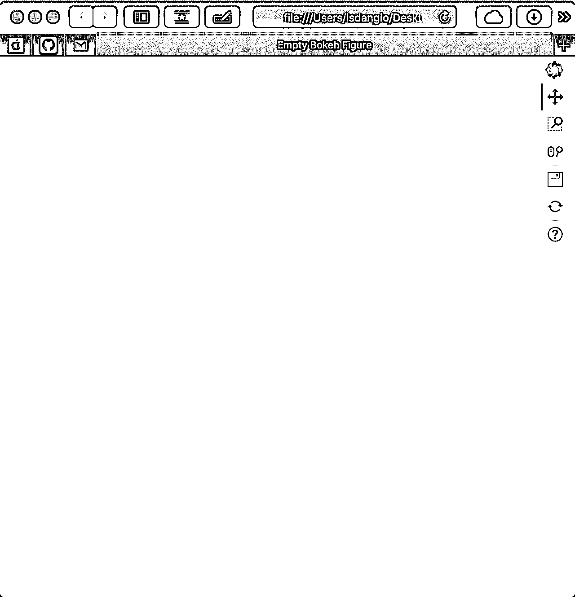](https://files.realpython.com/media/output_file_example.44c5ca494d41.png)

正如你所看到的，一个新的浏览器窗口打开了，有一个名为*空散景图*的标签和一个空图。没有显示的是在当前工作目录中生成的名为 *output_file_test.html* 的文件。

如果您要用`output_notebook()`代替`output_file()`运行相同的代码片段，假设您有一个 Jupyter 笔记本启动并准备运行，您将得到以下内容:

```py
# Bokeh Libraries
from bokeh.io import output_notebook
from bokeh.plotting import figure, show

# The figure will be right in my Jupyter Notebook
output_notebook()

# Set up a generic figure() object
fig = figure()

# See what it looks like
show(fig)
```

[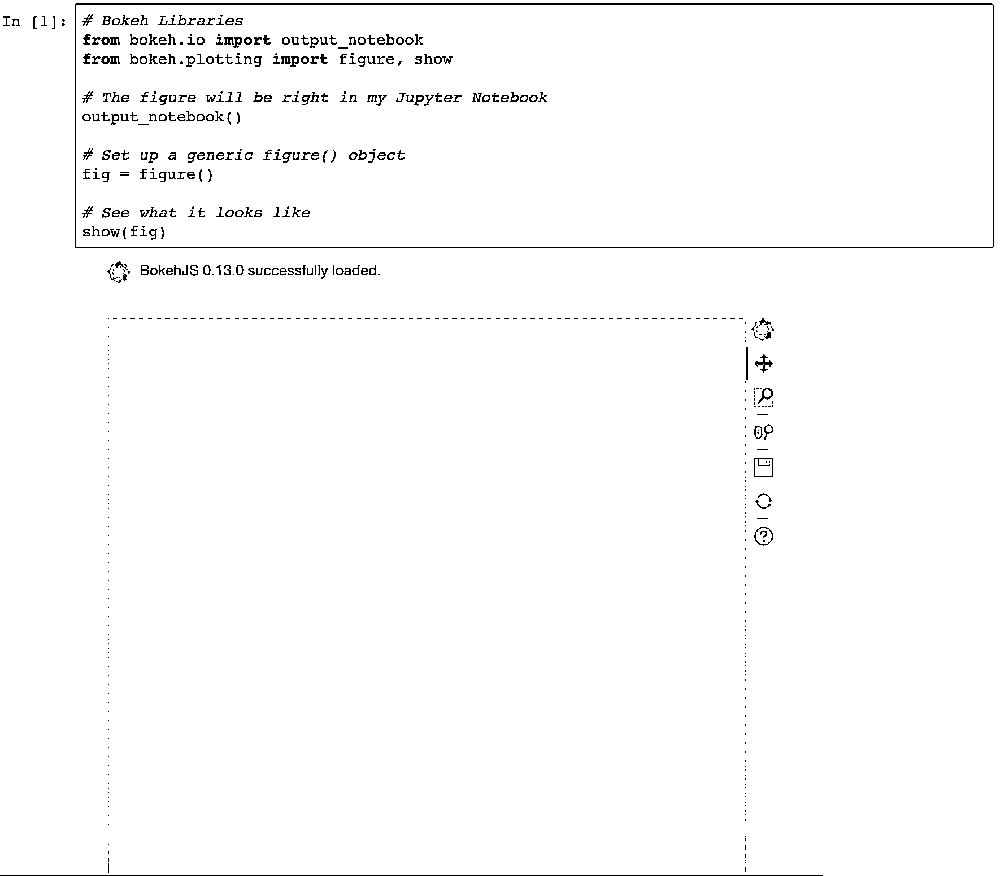](https://files.realpython.com/media/output_notebook_example.94b3a3850c89.png)

如您所见，结果是相同的，只是在不同的位置进行了渲染。

关于`output_file()`和`output_notebook()`的更多信息可以在[散景官方文档](https://bokeh.pydata.org/en/latest/docs/reference/io.html#bokeh-io-output)中找到。

**注意:**有时，当连续渲染多个可视化效果时，你会发现每次执行都没有清除过去的渲染。如果您遇到这种情况，请在执行之间导入并运行以下内容:

```py
# Import reset_output (only needed once) 
from bokeh.plotting import reset_output

# Use reset_output() between subsequent show() calls, as needed
reset_output()
```

在继续之前，你可能已经注意到默认的散景图预装了一个工具栏。这是对开箱即用的散景互动元素的重要预览。你将在本教程末尾的[添加交互](#adding-interaction)部分找到更多关于工具栏以及如何配置它的信息。

## 为数据准备好数据

现在，您已经知道如何在浏览器或 Jupyter 笔记本中创建和查看普通散景图像，是时候了解如何配置`figure()`对象了。

`figure()`对象不仅是数据可视化的基础，也是解锁所有可用于数据可视化的 Bokeh 工具的对象。散景图形是[散景绘图对象](https://bokeh.pydata.org/en/latest/docs/reference/models/plots.html#bokeh.models.plots.Plot)的子类，它提供了许多参数，使您可以配置图形的美学元素。

为了向您展示可用的定制选项，让我们创建一个有史以来最丑的图形:

```py
# Bokeh Libraries
from bokeh.io import output_notebook
from bokeh.plotting import figure, show

# The figure will be rendered inline in my Jupyter Notebook
output_notebook()

# Example figure
fig = figure(background_fill_color='gray',
             background_fill_alpha=0.5,
             border_fill_color='blue',
             border_fill_alpha=0.25,
             plot_height=300,
             plot_width=500,
             h_symmetry=True,
             x_axis_label='X Label',
             x_axis_type='datetime',
             x_axis_location='above',
             x_range=('2018-01-01', '2018-06-30'),
             y_axis_label='Y Label',
             y_axis_type='linear',
             y_axis_location='left',
             y_range=(0, 100),
             title='Example Figure',
             title_location='right',
             toolbar_location='below',
             tools='save')

# See what it looks like
show(fig)
```

[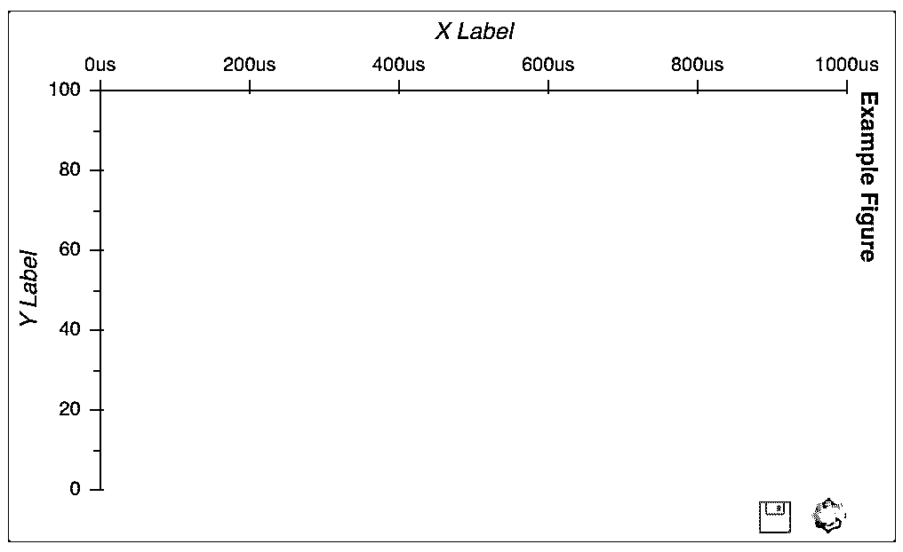](https://files.realpython.com/media/example_figure.4f94be1e1632.png)

一旦实例化了`figure()`对象，您仍然可以在事后配置它。假设你想去掉网格线:

```py
# Remove the gridlines from the figure() object
fig.grid.grid_line_color = None

# See what it looks like 
show(fig)
```

网格线属性可以通过图形的`grid`属性来访问。在这种情况下，将`grid_line_color`设置为 [`None`](https://realpython.com/null-in-python/) 可以有效地完全删除网格线。[关于图形属性的更多细节](https://bokeh.pydata.org/en/latest/docs/reference/models/plots.html#bokeh.models.plots.Plot.axis)可以在绘图类文档的文件夹下找到。

[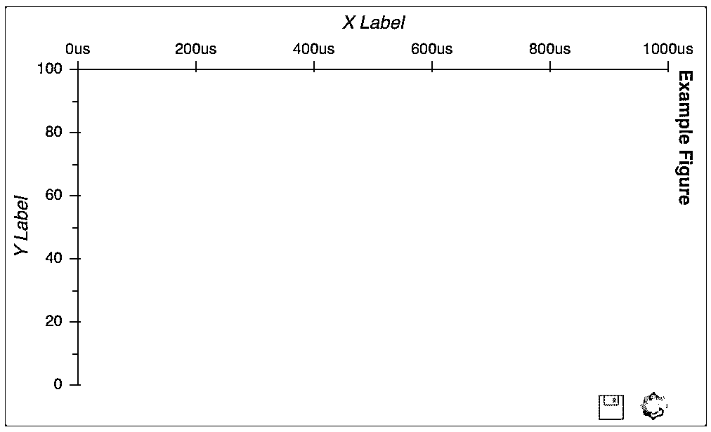](https://files.realpython.com/media/example_figure_no_gridlines.b860b44b0650.png)

**注意:**如果您正在使用具有自动完成功能的笔记本电脑或 IDE，该功能绝对是您的好朋友！有了这么多可定制的元素，它对发现可用选项非常有帮助:

[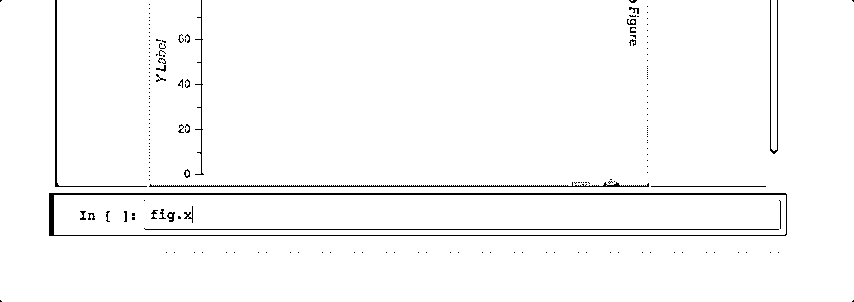](https://files.realpython.com/media/auto_complete.37c784671746.gif)

否则，用关键字*散景*和你想做的事情做一个快速的网络搜索，通常会给你指出正确的方向。

这里还有很多我可以接触到的，但不要觉得你错过了。随着教程的进展，我将确保引入不同的图形调整。以下是该主题的一些其他有用链接:

*   **[散景图类](https://bokeh.pydata.org/en/latest/docs/reference/models/plots.html#bokeh.models.plots.Plot)** 是`figure()`对象的超类，人物从其继承了很多属性。
*   **[图类](https://bokeh.pydata.org/en/latest/docs/reference/plotting.html#bokeh.plotting.figure.Figure)** 文档是找到关于`figure()`对象参数更多细节的好地方。

以下是一些值得一试的特定定制选项:

*   [**文本属性**](https://bokeh.pydata.org/en/latest/docs/user_guide/styling.html#text-properties) 涵盖了所有与改变字体样式、大小、颜色等相关的属性。
*   [**TickFormatters**](https://bokeh.pydata.org/en/latest/docs/user_guide/styling.html#tick-label-formats) 是内置对象，专门用于使用类似 Python 的字符串格式化语法来格式化轴。

有时，直到你的图形中实际上有一些可视化的数据时，才知道你的图形需要如何定制，所以接下来你将学习如何实现这一点。

[*Remove ads*](/account/join/)

## 用字形绘制数据

一个空的图形并不令人兴奋，所以让我们看看字形:散景可视化的构建块。字形是一种用于表示数据的矢量化图形形状或标记，如圆形或方形。更多例子可以在[散景图库](https://bokeh.pydata.org/en/latest/docs/gallery/markers.html)中找到。在你创建了你的图形之后，你就可以访问[一组可配置的字形方法](https://bokeh.pydata.org/en/latest/docs/reference/plotting.html)。

让我们从一个非常基本的例子开始，在 x-y 坐标网格上画一些点:

```py
# Bokeh Libraries
from bokeh.io import output_file
from bokeh.plotting import figure, show

# My x-y coordinate data
x = [1, 2, 1]
y = [1, 1, 2]

# Output the visualization directly in the notebook
output_file('first_glyphs.html', title='First Glyphs')

# Create a figure with no toolbar and axis ranges of [0,3]
fig = figure(title='My Coordinates',
             plot_height=300, plot_width=300,
             x_range=(0, 3), y_range=(0, 3),
             toolbar_location=None)

# Draw the coordinates as circles
fig.circle(x=x, y=y,
           color='green', size=10, alpha=0.5)

# Show plot
show(fig)
```

[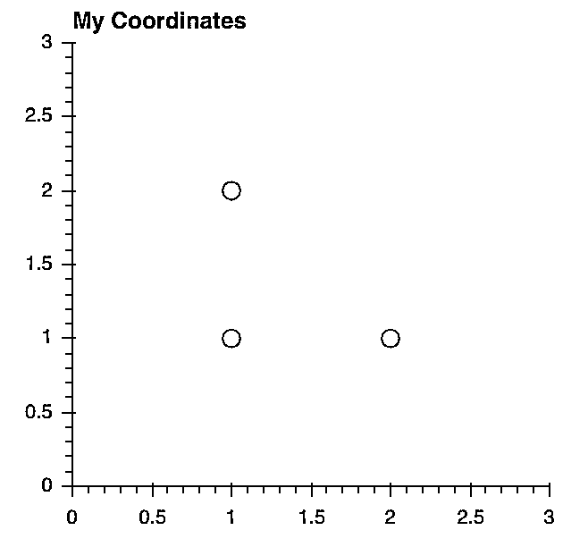](https://files.realpython.com/media/first_glyphs.ed000f56ed12.png)

一旦您的图形被实例化，您就可以看到如何使用定制的`circle`字形来绘制 x-y 坐标数据。

以下是几类字形:

*   **标记**包括圆形、菱形、正方形和三角形等形状，对于创建散点图和气泡图等可视化效果非常有效。

*   **线条**包括单线、阶跃和多线形状，可用于构建折线图。

*   **条形图/矩形**形状可用于创建传统或堆积条形图(`hbar`)和柱形图(`vbar`)以及瀑布图或[甘特图](https://en.wikipedia.org/wiki/Gantt_chart)。

关于上面以及其他符号的信息可以在[散景的参考指南](https://bokeh.pydata.org/en/latest/docs/user_guide/plotting.html)中找到。

这些字形可以根据需要进行组合，以满足您的可视化需求。比方说，我想创建一个可视化程序，显示我在制作本教程时每天写了多少单词，并用累计字数的趋势线覆盖:

```py
import numpy as np

# Bokeh libraries
from bokeh.io import output_notebook
from bokeh.plotting import figure, show

# My word count data
day_num = np.linspace(1, 10, 10)
daily_words = [450, 628, 488, 210, 287, 791, 508, 639, 397, 943]
cumulative_words = np.cumsum(daily_words)

# Output the visualization directly in the notebook
output_notebook()

# Create a figure with a datetime type x-axis
fig = figure(title='My Tutorial Progress',
             plot_height=400, plot_width=700,
             x_axis_label='Day Number', y_axis_label='Words Written',
             x_minor_ticks=2, y_range=(0, 6000),
             toolbar_location=None)

# The daily words will be represented as vertical bars (columns)
fig.vbar(x=day_num, bottom=0, top=daily_words, 
         color='blue', width=0.75, 
         legend='Daily')

# The cumulative sum will be a trend line
fig.line(x=day_num, y=cumulative_words, 
         color='gray', line_width=1,
         legend='Cumulative')

# Put the legend in the upper left corner
fig.legend.location = 'top_left'

# Let's check it out
show(fig)
```

[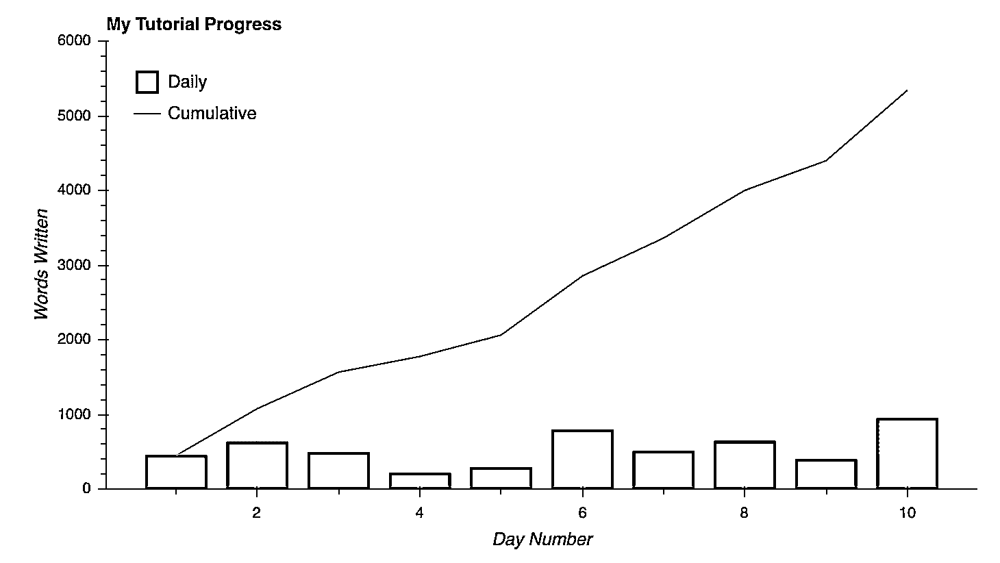](https://files.realpython.com/media/multi_glyph_example.0721ffa49fb3.png)

要合并图上的列和行，只需使用同一个`figure()`对象创建它们。

此外，您可以在上面看到如何通过为每个字形设置`legend`属性来无缝地创建图例。然后通过将`'top_left'`分配给`fig.legend.location`将图例移动到绘图的左上角。

你可以查看[更多关于造型传奇](https://bokeh.pydata.org/en/latest/docs/user_guide/styling.html#legends)的信息。预告:在教程的后面，当我们开始挖掘可视化的交互元素时，它们会再次出现。

## 关于数据的快速旁白

每当您探索一个新的可视化库时，从您熟悉的领域中的一些数据开始是一个好主意。散景的美妙之处在于，你的任何想法都有可能实现。这只是你想如何利用可用的工具来做到这一点的问题。

其余的例子将使用来自 Kaggle 的公开可用数据，该数据具有关于国家篮球协会(NBA) 2017-18 赛季的[的信息，具体来说:](https://www.kaggle.com/pablote/nba-enhanced-stats)

*   [**2017-18 _ player box score . CSV**](https://www.kaggle.com/pablote/nba-enhanced-stats#2017-18_playerBoxScore.csv):球员统计的逐场快照
*   [**2017-18 _ teamboxscore . CSV**](https://www.kaggle.com/pablote/nba-enhanced-stats#2017-18_teamBoxScore.csv):球队统计的逐场快照
*   [**2017-18 _ 积分榜. csv**](https://www.kaggle.com/pablote/nba-enhanced-stats#2017-18_standings.csv) :每日球队积分榜及排名

这些数据与我的工作无关，但我热爱篮球，喜欢思考如何可视化与篮球相关的不断增长的数据。

如果你没有来自学校或工作的数据可以使用，想想你感兴趣的东西，并试图找到一些与此相关的数据。这将大大有助于使学习和创作过程更快、更愉快！

为了跟随教程中的例子，你可以从上面的链接下载数据集，并使用以下命令将它们[读入](https://realpython.com/pandas-read-write-files/)到[熊猫`DataFrame`](https://realpython.com/pandas-dataframe/) 中:

```py
import pandas as pd

# Read the csv files
player_stats = pd.read_csv('2017-18_playerBoxScore.csv', parse_dates=['gmDate'])
team_stats = pd.read_csv('2017-18_teamBoxScore.csv', parse_dates=['gmDate'])
standings = pd.read_csv('2017-18_standings.csv', parse_dates=['stDate'])
```

这段代码从三个 CSV 文件中读取数据，并自动将日期列解释为 [`datetime`对象](https://realpython.com/python-datetime/)。

现在是时候获取一些真实的数据了。

[*Remove ads*](/account/join/)

## 使用`ColumnDataSource`对象

上面的例子使用了 [Python 列表](https://realpython.com/python-lists-tuples/#python-lists)和 [Numpy 数组](https://realpython.com/numpy-array-programming/)来表示数据，Bokeh 很好地处理了这些数据类型。然而，当谈到 Python 中的数据时，你很可能会遇到 [Python 字典](https://realpython.com/python-dicts/)和 [Pandas DataFrames](http://pandas.pydata.org/pandas-docs/stable/generated/pandas.DataFrame.html#pandas.DataFrame) ，尤其是当你从文件或外部数据源读入数据时。

Bokeh 能够很好地处理这些更复杂的数据结构，甚至有内置的功能来处理它们，即`ColumnDataSource`。

您可能会问自己，“当散景可以直接与其他数据类型交互时，为什么还要使用`ColumnDataSource`”

首先，不管你是直接引用列表、数组、字典还是数据帧，Bokeh 都会在幕后把它变成一个`ColumnDataSource`。更重要的是，`ColumnDataSource`使得实现散景的交互式启示更加容易。

`ColumnDataSource`是将数据传递给用于可视化的字形的基础。它的主要功能是将名称映射到数据的列。这使您在构建可视化时更容易引用数据元素。这也使得散景在构建可视化效果时更容易做到这一点。

`ColumnDataSource`可以解释三种类型的数据对象:

*   **Python `dict`** :键是与各自的值序列(列表、数组等)相关联的名称。

*   **熊猫`DataFrame`**:`DataFrame`的栏目成为`ColumnDataSource`的参照名。

*   [**熊猫`groupby`**](https://realpython.com/pandas-groupby/):`ColumnDataSource`的列引用调用`groupby.describe()`看到的列。

让我们从 2017-18 赛季卫冕冠军金州勇士队和挑战者休斯顿火箭队之间争夺 NBA 西部第一名的比赛开始。这两个队每天的胜负记录存储在一个名为`west_top_2`的数据帧中:

>>>

```py
>>> west_top_2 = (standings[(standings['teamAbbr'] == 'HOU') | (standings['teamAbbr'] == 'GS')]
...               .loc[:, ['stDate', 'teamAbbr', 'gameWon']]
...               .sort_values(['teamAbbr','stDate']))
>>> west_top_2.head()
 stDate teamAbbr  gameWon
9   2017-10-17       GS        0
39  2017-10-18       GS        0
69  2017-10-19       GS        0
99  2017-10-20       GS        1
129 2017-10-21       GS        1
```

从这里，您可以将这个`DataFrame`加载到两个`ColumnDataSource`对象中，并可视化比赛:

```py
# Bokeh libraries
from bokeh.plotting import figure, show
from bokeh.io import output_file
from bokeh.models import ColumnDataSource

# Output to file
output_file('west-top-2-standings-race.html', 
            title='Western Conference Top 2 Teams Wins Race')

# Isolate the data for the Rockets and Warriors
rockets_data = west_top_2[west_top_2['teamAbbr'] == 'HOU']
warriors_data = west_top_2[west_top_2['teamAbbr'] == 'GS']

# Create a ColumnDataSource object for each team
rockets_cds = ColumnDataSource(rockets_data)
warriors_cds = ColumnDataSource(warriors_data)

# Create and configure the figure
fig = figure(x_axis_type='datetime',
             plot_height=300, plot_width=600,
             title='Western Conference Top 2 Teams Wins Race, 2017-18',
             x_axis_label='Date', y_axis_label='Wins',
             toolbar_location=None)

# Render the race as step lines
fig.step('stDate', 'gameWon', 
         color='#CE1141', legend='Rockets', 
         source=rockets_cds)
fig.step('stDate', 'gameWon', 
         color='#006BB6', legend='Warriors', 
         source=warriors_cds)

# Move the legend to the upper left corner
fig.legend.location = 'top_left'

# Show the plot
show(fig)
```

[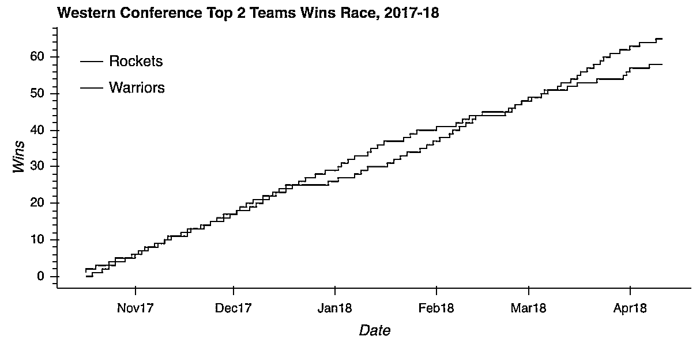](https://files.realpython.com/media/rockets_v_warriors.9d4eda72977b.png)

注意在创建两条线时如何引用各自的`ColumnDataSource`对象。您只需将原始列名作为输入参数传递，并通过`source`属性指定使用哪个`ColumnDataSource`。

可视化显示了整个赛季的紧张比赛，勇士队在赛季中期建立了一个相当大的缓冲。然而，赛季后期的一点下滑让火箭赶上并最终超过卫冕冠军，成为西部联盟的头号种子。

**注意:**在散景中，您可以通过名称、十六进制值或 RGB 颜色代码来指定颜色。

对于上面的可视化，为代表两个团队的相应线条指定了颜色。不要使用 CSS 颜色名称，如火箭队的`'red'`和勇士队的`'blue'`，你可能想通过使用十六进制颜色代码形式的[官方团队颜色](https://teamcolorcodes.com/nba-team-color-codes/)来添加一个漂亮的视觉效果。或者，你可以使用代表 RGB 颜色代码的元组:`(206, 17, 65)`代表火箭，`(0, 107, 182)`代表勇士。

散景提供了一个有用的 CSS 颜色名称列表，按照它们的色调分类。另外，htmlcolorcodes.com 的[是一个寻找 CSS、十六进制和 RGB 颜色代码的好网站。](https://htmlcolorcodes.com)

`ColumnDataSource`对象可以做的不仅仅是作为引用`DataFrame`列的简单方法。`ColumnDataSource`对象有三个内置过滤器，可用于使用`CDSView`对象创建数据视图:

*   **`GroupFilter`** 根据分类引用值从`ColumnDataSource`中选择行
*   **`IndexFilter`** 通过整数索引列表过滤`ColumnDataSource`
*   **`BooleanFilter`** 允许您使用一列 [`boolean`值](https://realpython.com/python-boolean/)，并选择`True`行

在前面的例子中，创建了两个`ColumnDataSource`对象，分别来自`west_top_2`数据帧的一个子集。下一个例子将使用一个创建数据视图的`GroupFilter`，基于所有的`west_top_2`，从一个`ColumnDataSource`重新创建相同的输出:

```py
# Bokeh libraries
from bokeh.plotting import figure, show
from bokeh.io import output_file
from bokeh.models import ColumnDataSource, CDSView, GroupFilter

# Output to file
output_file('west-top-2-standings-race.html', 
            title='Western Conference Top 2 Teams Wins Race')

# Create a ColumnDataSource
west_cds = ColumnDataSource(west_top_2)

# Create views for each team
rockets_view = CDSView(source=west_cds,
                       filters=[GroupFilter(column_name='teamAbbr', group='HOU')])
warriors_view = CDSView(source=west_cds,
                        filters=[GroupFilter(column_name='teamAbbr', group='GS')])

# Create and configure the figure
west_fig = figure(x_axis_type='datetime',
                  plot_height=300, plot_width=600,
                  title='Western Conference Top 2 Teams Wins Race, 2017-18',
                  x_axis_label='Date', y_axis_label='Wins',
                  toolbar_location=None)

# Render the race as step lines
west_fig.step('stDate', 'gameWon',
              source=west_cds, view=rockets_view,
              color='#CE1141', legend='Rockets')
west_fig.step('stDate', 'gameWon',
              source=west_cds, view=warriors_view,
              color='#006BB6', legend='Warriors')

# Move the legend to the upper left corner
west_fig.legend.location = 'top_left'

# Show the plot
show(west_fig)
```

[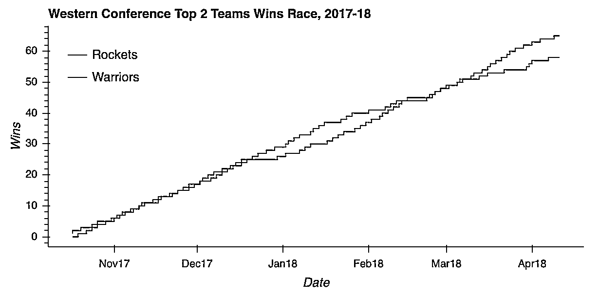](https://files.realpython.com/media/rockets_v_warriors_v2.8b33de43b78c.png)

注意列表中的`GroupFilter`是如何传递给`CDSView`的。这允许您将多个过滤器组合在一起，根据需要从`ColumnDataSource`中分离出您需要的数据。

有关集成数据源的信息，请查看 [`ColumnDataSource`上的散景用户指南帖子和其他可用的源对象](https://bokeh.pydata.org/en/latest/docs/user_guide/data.html)。

西部联盟最终是一场激动人心的比赛，但如果你想看看东部联盟是否同样紧张。不仅如此，您还想在一个可视化视图中查看它们。这是一个完美的下一个话题:布局。

[*Remove ads*](/account/join/)

## 用布局组织多个可视化

东部联盟排名下降到大西洋赛区的两个对手:波士顿凯尔特人队和多伦多猛龙队。在复制用于创建`west_top_2`的步骤之前，让我们用上面学到的知识再一次测试一下`ColumnDataSource`。

在本例中，您将看到如何将整个数据帧输入到一个`ColumnDataSource`中，并创建视图来隔离相关数据:

```py
# Bokeh libraries
from bokeh.plotting import figure, show
from bokeh.io import output_file
from bokeh.models import ColumnDataSource, CDSView, GroupFilter

# Output to file
output_file('east-top-2-standings-race.html', 
            title='Eastern Conference Top 2 Teams Wins Race')

# Create a ColumnDataSource
standings_cds = ColumnDataSource(standings)

# Create views for each team
celtics_view = CDSView(source=standings_cds,
                      filters=[GroupFilter(column_name='teamAbbr', 
                                           group='BOS')])
raptors_view = CDSView(source=standings_cds,
                      filters=[GroupFilter(column_name='teamAbbr', 
                                           group='TOR')])

# Create and configure the figure
east_fig = figure(x_axis_type='datetime',
           plot_height=300, plot_width=600,
           title='Eastern Conference Top 2 Teams Wins Race, 2017-18',
           x_axis_label='Date', y_axis_label='Wins',
           toolbar_location=None)

# Render the race as step lines
east_fig.step('stDate', 'gameWon', 
              color='#007A33', legend='Celtics',
              source=standings_cds, view=celtics_view)
east_fig.step('stDate', 'gameWon', 
              color='#CE1141', legend='Raptors',
              source=standings_cds, view=raptors_view)

# Move the legend to the upper left corner
east_fig.legend.location = 'top_left'

# Show the plot
show(east_fig)
```

[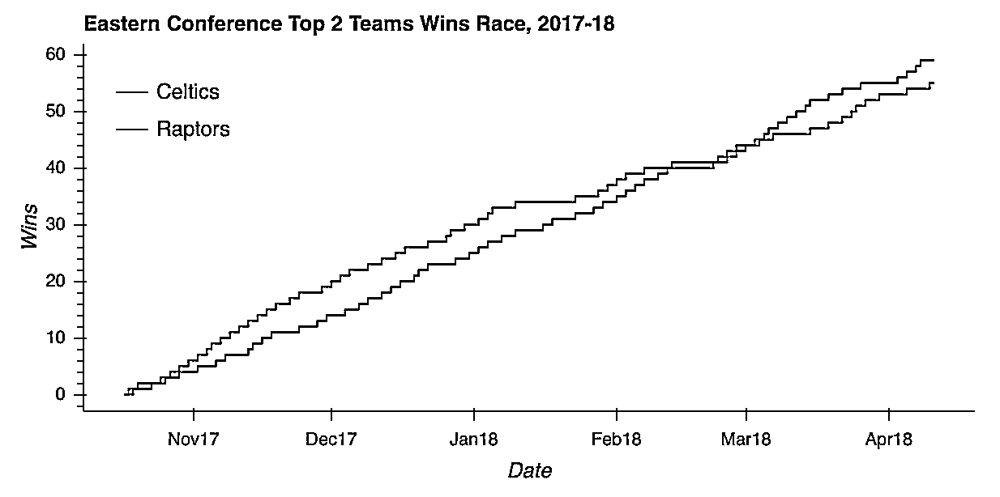](https://files.realpython.com/media/celtics_v_raptors.86506516532b.png)

`ColumnDataSource`能够毫不费力地将相关数据隔离在一个 5040 乘 39 的`DataFrame`内，在此过程中节省了几行熊猫代码。

从视觉效果来看，你可以看到东部联盟的比赛并不轻松。在凯尔特人咆哮着冲出大门后，猛龙一路追上了他们的分区对手，并以五连胜结束了常规赛。

我们的两个可视化已经准备好了，是时候把它们放在一起了。

与 [Matplotlib 的`subplot`](https://realpython.com/python-matplotlib-guide/#understanding-pltsubplots-notation) 功能类似，Bokeh 在其`bokeh.layouts`模块中提供了`column`、`row`和`gridplot`功能。这些功能通常可以归类为**布局**。

用法非常简单。如果要将两个可视化效果放在垂直配置中，可以通过以下方式实现:

```py
# Bokeh library
from bokeh.plotting import figure, show
from bokeh.io import output_file
from bokeh.layouts import column

# Output to file
output_file('east-west-top-2-standings-race.html', 
            title='Conference Top 2 Teams Wins Race')

# Plot the two visualizations in a vertical configuration
show(column(west_fig, east_fig))
```

[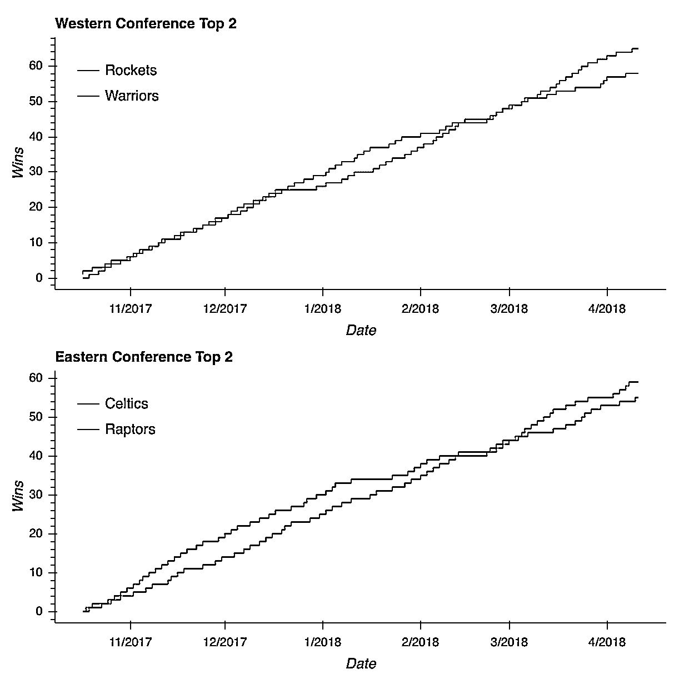](https://files.realpython.com/media/column_layout.db1f023f726b.png)

我将为您节省两行代码，但是请放心，将上面代码片段中的`column`替换为`row`将类似地在水平配置中配置两个图。

**注意:**如果您在阅读教程的过程中正在尝试代码片段，我想绕个弯来解决您在下面的例子中访问`west_fig`和`east_fig`时可能会看到的一个错误。这样做时，您可能会收到如下错误:

```py
WARNING:bokeh.core.validation.check:W-1004 (BOTH_CHILD_AND_ROOT): Models should not be a document root...
```

这是散景的[验证模块](https://bokeh.pydata.org/en/latest/docs/reference/core/validation.html)的许多错误之一，其中`w-1004`特别警告在新布局中重复使用`west_fig`和`east_fig`。

为了避免在测试示例时出现这种错误，请在说明每个布局的代码片段前面加上以下内容:

```py
# Bokeh libraries
from bokeh.plotting import figure, show
from bokeh.models import ColumnDataSource, CDSView, GroupFilter

# Create a ColumnDataSource
standings_cds = ColumnDataSource(standings)

# Create the views for each team
celtics_view = CDSView(source=standings_cds,
                      filters=[GroupFilter(column_name='teamAbbr', 
                                           group='BOS')])

raptors_view = CDSView(source=standings_cds,
                      filters=[GroupFilter(column_name='teamAbbr', 
                                           group='TOR')])

rockets_view = CDSView(source=standings_cds,
                      filters=[GroupFilter(column_name='teamAbbr', 
                                           group='HOU')])
warriors_view = CDSView(source=standings_cds,
                      filters=[GroupFilter(column_name='teamAbbr', 
                                           group='GS')])

# Create and configure the figure
east_fig = figure(x_axis_type='datetime',
                  plot_height=300,
                  x_axis_label='Date',
                  y_axis_label='Wins',
                  toolbar_location=None)

west_fig = figure(x_axis_type='datetime',
                  plot_height=300,
                  x_axis_label='Date',
                  y_axis_label='Wins',
                  toolbar_location=None)

# Configure the figures for each conference
east_fig.step('stDate', 'gameWon', 
              color='#007A33', legend='Celtics',
              source=standings_cds, view=celtics_view)
east_fig.step('stDate', 'gameWon', 
              color='#CE1141', legend='Raptors',
              source=standings_cds, view=raptors_view)

west_fig.step('stDate', 'gameWon', color='#CE1141', legend='Rockets',
              source=standings_cds, view=rockets_view)
west_fig.step('stDate', 'gameWon', color='#006BB6', legend='Warriors',
              source=standings_cds, view=warriors_view)

# Move the legend to the upper left corner
east_fig.legend.location = 'top_left'
west_fig.legend.location = 'top_left'

# Layout code snippet goes here!
```

这样做将更新相关组件以呈现可视化，确保不需要警告。

不要用`column`或`row`，你可以用一个`gridplot`来代替。

`gridplot`的一个关键区别是它会自动合并所有子图形的工具栏。上面的两个可视化没有工具栏，但如果有，那么当使用`column`或`row`时，每个图形都有自己的工具栏。这样，它也有了自己的`toolbar_location`属性，见下面设置为`'right'`。

从语法上来说，您还会注意到下面的`gridplot`的不同之处在于，它不是被传递一个元组作为输入，而是需要一个列表列表，其中每个子列表代表网格中的一行:

```py
# Bokeh libraries
from bokeh.io import output_file
from bokeh.layouts import gridplot

# Output to file
output_file('east-west-top-2-gridplot.html', 
            title='Conference Top 2 Teams Wins Race')

# Reduce the width of both figures
east_fig.plot_width = west_fig.plot_width = 300

# Edit the titles
east_fig.title.text = 'Eastern Conference'
west_fig.title.text = 'Western Conference'

# Configure the gridplot
east_west_gridplot = gridplot([[west_fig, east_fig]], 
                              toolbar_location='right')

# Plot the two visualizations in a horizontal configuration
show(east_west_gridplot)
```

[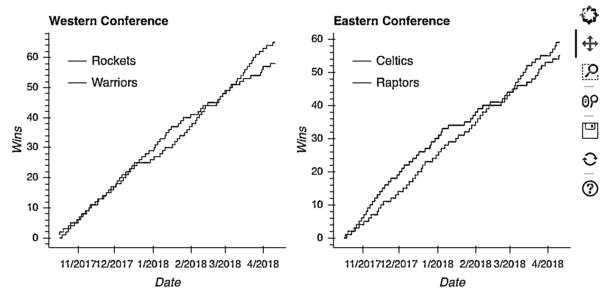](https://files.realpython.com/media/gridplot_layout.c7eb7b37803d.png)

最后，`gridplot`允许传递被解释为空白支线剧情的`None`值。因此，如果您想为两个额外的图留一个占位符，您可以这样做:

```py
# Bokeh libraries
from bokeh.io import output_file
from bokeh.layouts import gridplot

# Output to file
output_file('east-west-top-2-gridplot.html', 
            title='Conference Top 2 Teams Wins Race')

# Reduce the width of both figures
east_fig.plot_width = west_fig.plot_width = 300

# Edit the titles
east_fig.title.text = 'Eastern Conference'
west_fig.title.text = 'Western Conference'

# Plot the two visualizations with placeholders
east_west_gridplot = gridplot([[west_fig, None], [None, east_fig]], 
                              toolbar_location='right')

# Plot the two visualizations in a horizontal configuration
show(east_west_gridplot)
```

[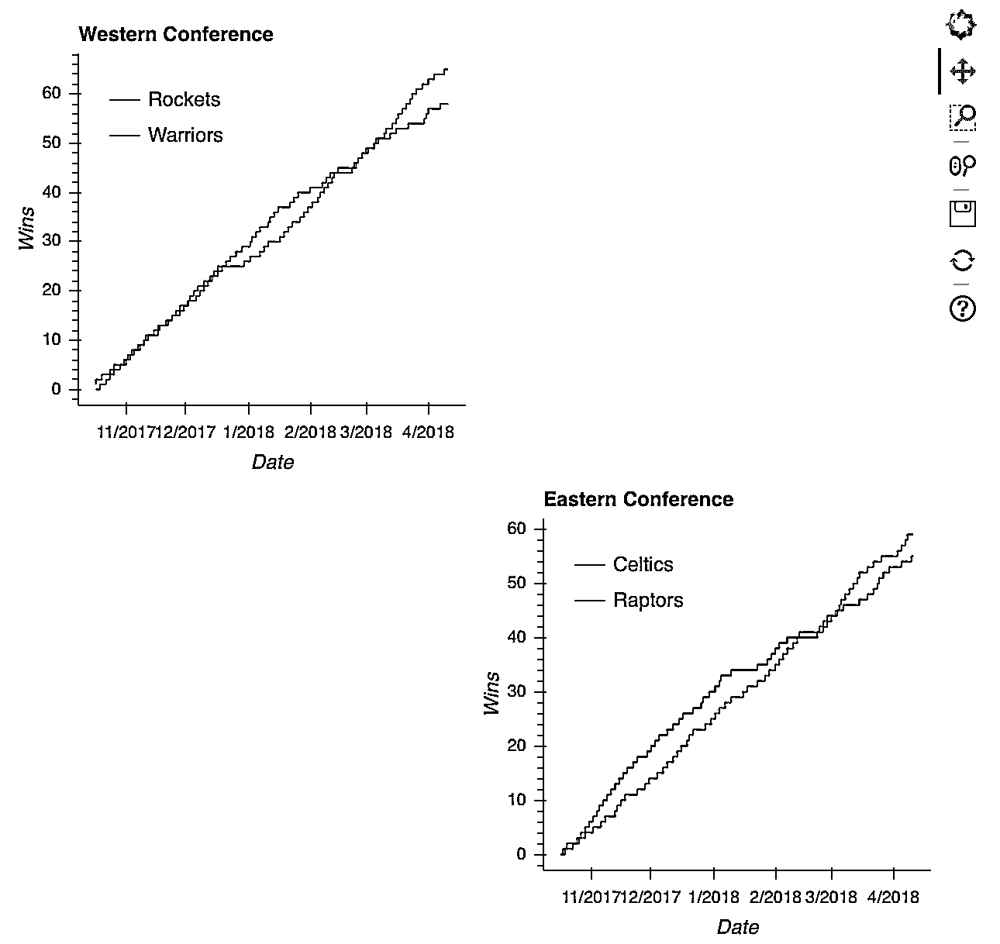](https://files.realpython.com/media/gridplot_with_nones.cc7feb66a672.png)

如果您更愿意在两种可视化效果之间切换，而不必将它们压缩到彼此相邻或重叠，选项卡式布局是一个不错的选择。

选项卡式布局由两个散景小部件功能组成:`bokeh.models.widgets`子模块中的`Tab()`和`Panel()`。像使用`gridplot()`一样，制作选项卡式布局非常简单:

```py
# Bokeh Library
from bokeh.io import output_file
from bokeh.models.widgets import Tabs, Panel

# Output to file
output_file('east-west-top-2-tabbed_layout.html', 
            title='Conference Top 2 Teams Wins Race')

# Increase the plot widths
east_fig.plot_width = west_fig.plot_width = 800

# Create two panels, one for each conference
east_panel = Panel(child=east_fig, title='Eastern Conference')
west_panel = Panel(child=west_fig, title='Western Conference')

# Assign the panels to Tabs
tabs = Tabs(tabs=[west_panel, east_panel])

# Show the tabbed layout
show(tabs)
```

[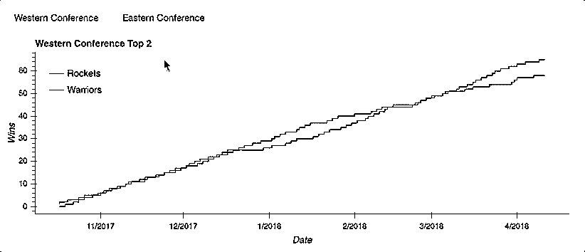](https://files.realpython.com/media/tabbed_layout.2566a4615fcf.gif)

第一步是为每个选项卡创建一个`Panel()`。这听起来可能有点混乱，但是可以把`Tabs()`函数看作是组织用`Panel()`创建的各个选项卡的机制。

每个`Panel()`接受一个孩子作为输入，这个孩子可以是一个单独的`figure()`或者一个布局。(记住，布局是`column`、`row`或`gridplot`的通称。)一旦你的面板组装好了，它们就可以作为输入传递给列表中的`Tabs()`。

既然你已经了解了如何访问、绘制和组织你的数据，是时候进入散景的真正魔力了:交互！一如既往，查看散景的用户指南，了解更多关于[布局](https://bokeh.pydata.org/en/latest/docs/user_guide/layout.html)的信息。

[*Remove ads*](/account/join/)

## 添加交互

让散景与众不同的特性是它能够在可视化中轻松实现交互性。Bokeh 甚至将自己描述为一个交互式可视化库:

> Bokeh 是一个交互式可视化库，面向现代 web 浏览器进行演示。([来源](https://bokeh.pydata.org/en/latest/docs/user_guide/quickstart.html#userguide-quickstart))

在这一节中，我们将讨论增加交互性的五种方法:

*   配置工具栏
*   选择数据点
*   添加悬停动作
*   链接轴和选择
*   使用图例高亮显示数据

实现这些交互式元素为探索数据提供了可能性，这是静态可视化本身无法做到的。

### 配置工具栏

正如你在[生成你的第一个数字](#generating-your-first-figure)时所看到的，默认的散景`figure()`带有一个开箱即用的工具栏。默认工具栏包含以下工具(从左到右):

*   平底锅
*   方框缩放
*   滚轮缩放
*   救援
*   重置
*   链接到 [**散景配置绘图工具的用户指南**](https://bokeh.pydata.org/en/latest/docs/user_guide/tools.html#built-in-tools)
*   链接到 [**散景主页**](https://bokeh.pydata.org/en/latest/)

当实例化一个`figure()`对象时，可以通过传递`toolbar_location=None`来移除工具栏，或者通过传递`'above'`、`'below'`、`'left'`或`'right'`中的任意一个来重新定位工具栏。

此外，工具栏可以配置为包含您需要的任何工具组合。Bokeh 提供五大类 18 种特定工具:

*   **平移/拖动** : `box_select`、`box_zoom`、`lasso_select`、`pan`、`xpan`、`ypan`、`resize_select`
*   **点击/轻击** : `poly_select`，`tap`
*   **滚动/捏合** : `wheel_zoom`，`xwheel_zoom`，`ywheel_zoom`
*   **动作** : `undo`，`redo`，`reset`，`save`
*   **检查员** : `crosshair`，`hover`

要研究工具，一定要访问指定工具的。否则，它们将在本文涉及的各种交互中进行说明。

### 选择数据点

实现选择行为就像在声明字形时添加一些特定的关键字一样简单。

下一个示例将创建一个散点图，将球员的三分球尝试总数与三分球尝试次数的百分比相关联(对于至少有 100 次三分球尝试的球员)。

数据可以从`player_stats`数据帧中汇总:

```py
# Find players who took at least 1 three-point shot during the season
three_takers = player_stats[player_stats['play3PA'] > 0]

# Clean up the player names, placing them in a single column
three_takers['name'] = [f'{p["playFNm"]}  {p["playLNm"]}' 
                        for _, p in three_takers.iterrows()]

# Aggregate the total three-point attempts and makes for each player
three_takers = (three_takers.groupby('name')
                            .sum()
                            .loc[:,['play3PA', 'play3PM']]
                            .sort_values('play3PA', ascending=False))

# Filter out anyone who didn't take at least 100 three-point shots
three_takers = three_takers[three_takers['play3PA'] >= 100].reset_index()

# Add a column with a calculated three-point percentage (made/attempted)
three_takers['pct3PM'] = three_takers['play3PM'] / three_takers['play3PA']
```

下面是结果`DataFrame`的一个例子:

>>>

```py
>>> three_takers.sample(5)
 name  play3PA  play3PM    pct3PM
229        Corey Brewer      110       31  0.281818
78           Marc Gasol      320      109  0.340625
126      Raymond Felton      230       81  0.352174
127  Kristaps Porziņģis      229       90  0.393013
66      Josh Richardson      336      127  0.377976
```

假设您想要在分布中选择一组玩家，并在这样做时将代表未选择玩家的符号的颜色静音:

```py
# Bokeh Libraries
from bokeh.plotting import figure, show
from bokeh.io import output_file
from bokeh.models import ColumnDataSource, NumeralTickFormatter

# Output to file
output_file('three-point-att-vs-pct.html',
            title='Three-Point Attempts vs. Percentage')

# Store the data in a ColumnDataSource
three_takers_cds = ColumnDataSource(three_takers)

# Specify the selection tools to be made available
select_tools = ['box_select', 'lasso_select', 'poly_select', 'tap', 'reset']

# Create the figure
fig = figure(plot_height=400,
             plot_width=600,
             x_axis_label='Three-Point Shots Attempted',
             y_axis_label='Percentage Made',
             title='3PT Shots Attempted vs. Percentage Made (min. 100 3PA), 2017-18',
             toolbar_location='below',
             tools=select_tools)

# Format the y-axis tick labels as percentages
fig.yaxis[0].formatter = NumeralTickFormatter(format='00.0%')

# Add square representing each player
fig.square(x='play3PA',
           y='pct3PM',
           source=three_takers_cds,
           color='royalblue',
           selection_color='deepskyblue',
           nonselection_color='lightgray',
           nonselection_alpha=0.3)

# Visualize
show(fig)
```

首先，指定要提供的选择工具。在上面的例子中，`'box_select'`、`'lasso_select'`、`'poly_select'`和`'tap'`(加上一个重置按钮)在一个名为`select_tools`的列表中被指定。当图形被实例化时，工具栏被定位到图中的`'below'`，列表被传递到`tools`以使上面选择的工具可用。

每个玩家最初由一个皇家蓝色方形符号表示，但当选择一个玩家或一组玩家时，会设置以下配置:

*   将选定的玩家转到`deepskyblue`
*   将所有未被选中的玩家的符号更改为带有`0.3`不透明度的`lightgray`颜色

就是这样！只需快速添加一些内容，现在的可视化效果如下所示:

[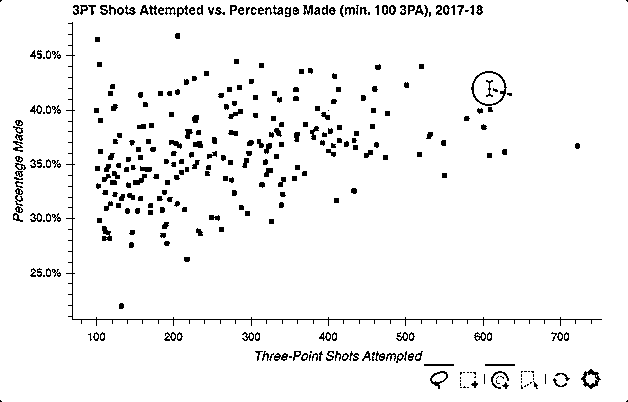](https://files.realpython.com/media/selection_example.d9ac1d0c8987.gif)

关于选择后可以做什么的更多信息，请查看[已选择和未选择的字形](https://bokeh.pydata.org/en/latest/docs/user_guide/styling.html#selected-and-unselected-glyphs)。

[*Remove ads*](/account/join/)

### 添加悬停动作

因此，我实现了选择散点图中感兴趣的特定玩家数据点的功能，但如果您想快速查看一个字形代表哪些玩家呢？一种选择是使用散景的`HoverTool()`在光标穿过带有字形的路径时显示工具提示。您需要做的只是将以下内容添加到上面的代码片段中:

```py
# Bokeh Library
from bokeh.models import HoverTool

# Format the tooltip
tooltips = [
            ('Player','@name'),
            ('Three-Pointers Made', '@play3PM'),
            ('Three-Pointers Attempted', '@play3PA'),
            ('Three-Point Percentage','@pct3PM{00.0%}'),
           ]

# Add the HoverTool to the figure
fig.add_tools(HoverTool(tooltips=tooltips))

# Visualize
show(fig)
```

`HoverTool()`与你在上面看到的选择工具略有不同，因为它有属性，特别是`tooltips`。

首先，您可以通过创建包含对`ColumnDataSource`的描述和引用的元组列表来配置格式化的工具提示。这个列表作为输入传递给`HoverTool()`，然后使用`add_tools()`简单地添加到图形中。事情是这样的:

[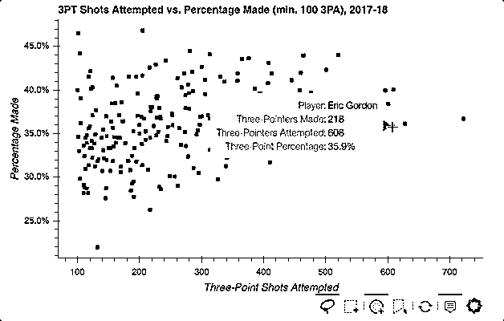](https://files.realpython.com/media/hover_tooltip_example.ff00e6668f0b.gif)

注意工具栏上增加了*悬停*按钮，可以切换开关。

如果你想进一步强调玩家的悬停，散景可以通过悬停检查来实现。下面是添加了工具提示的代码片段的略微修改版本:

```py
# Format the tooltip
tooltips = [
            ('Player','@name'),
            ('Three-Pointers Made', '@play3PM'),
            ('Three-Pointers Attempted', '@play3PA'),
            ('Three-Point Percentage','@pct3PM{00.0%}'),
           ]

# Configure a renderer to be used upon hover
hover_glyph = fig.circle(x='play3PA', y='pct3PM', source=three_takers_cds,
                         size=15, alpha=0,
                         hover_fill_color='black', hover_alpha=0.5)

# Add the HoverTool to the figure
fig.add_tools(HoverTool(tooltips=tooltips, renderers=[hover_glyph]))

# Visualize
show(fig)
```

这是通过创建一个全新的字形来完成的，在这种情况下是圆形而不是方形，并将其分配给`hover_glyph`。请注意，初始不透明度设置为零，因此在光标接触到它之前，它是不可见的。通过将`hover_alpha`和`hover_fill_color`一起设置为`0.5`来捕捉悬停时出现的属性。

现在，当您将鼠标悬停在各种标记上时，您会看到一个黑色小圆圈出现在原始方块上:

[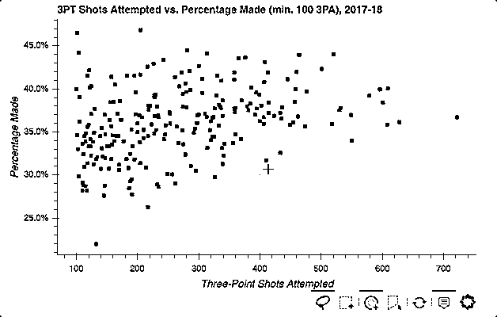](https://files.realpython.com/media/hover_inspection.6670d76e3ded.gif)

要进一步了解`HoverTool()`的功能，请参见[悬停工具](https://bokeh.pydata.org/en/latest/docs/user_guide/tools.html#hovertool)和[悬停检查](https://bokeh.pydata.org/en/latest/docs/user_guide/styling.html#hover-inspections)指南。

### 链接轴和选择

链接是同步布局中不同可视化元素的过程。例如，您可能想要链接多个图的轴，以确保如果您放大一个图，它会反映在另一个图上。我们来看看是怎么做的。

对于这个例子，可视化将能够平移到球队赛程的不同部分，并检查各种比赛统计数据。每个统计数据都将在一个两两的`gridplot()`中用它自己的图来表示。

可以从`team_stats`数据框架中收集数据，选择费城 76 人队作为感兴趣的球队:

```py
# Isolate relevant data
phi_gm_stats = (team_stats[(team_stats['teamAbbr'] == 'PHI') & 
                           (team_stats['seasTyp'] == 'Regular')]
                .loc[:, ['gmDate', 
                         'teamPTS', 
                         'teamTRB', 
                         'teamAST', 
                         'teamTO', 
                         'opptPTS',]]
                .sort_values('gmDate'))

# Add game number
phi_gm_stats['game_num'] = range(1, len(phi_gm_stats)+1)

# Derive a win_loss column
win_loss = []
for _, row in phi_gm_stats.iterrows():

    # If the 76ers score more points, it's a win
    if row['teamPTS'] > row['opptPTS']:
        win_loss.append('W')
    else:
        win_loss.append('L')

# Add the win_loss data to the DataFrame
phi_gm_stats['winLoss'] = win_loss
```

以下是 76 人队前 5 场比赛的结果:

>>>

```py
>>> phi_gm_stats.head()
 gmDate  teamPTS  teamTRB  teamAST  teamTO  opptPTS  game_num winLoss
10  2017-10-18      115       48       25      17      120         1       L
39  2017-10-20       92       47       20      17      102         2       L
52  2017-10-21       94       41       18      20      128         3       L
80  2017-10-23       97       49       25      21       86         4       W
113 2017-10-25      104       43       29      16      105         5       L
```

首先导入必要的散景库，指定输出参数，并将数据读入`ColumnDataSource`:

```py
# Bokeh Libraries
from bokeh.plotting import figure, show
from bokeh.io import output_file
from bokeh.models import ColumnDataSource, CategoricalColorMapper, Div
from bokeh.layouts import gridplot, column

# Output to file
output_file('phi-gm-linked-stats.html',
                title='76ers Game Log')

# Store the data in a ColumnDataSource
gm_stats_cds = ColumnDataSource(phi_gm_stats)
```

每场比赛由一列表示，如果结果是赢，将显示为绿色，如果结果是输，将显示为红色。为此，可以使用散景的`CategoricalColorMapper`将数据值映射到指定的颜色:

```py
# Create a CategoricalColorMapper that assigns a color to wins and losses
win_loss_mapper = CategoricalColorMapper(factors = ['W', 'L'], 
                                         palette=['green', 'red'])
```

对于这个用例，指定要映射的分类数据值的列表被传递给`factors`，带有预期颜色的列表被传递给`palette`。有关`CategoricalColorMapper`的更多信息，请参见 Bokeh 用户指南中[处理分类数据](https://bokeh.pydata.org/en/latest/docs/user_guide/categorical.html#handling-categorical-data)的[颜色](https://bokeh.pydata.org/en/latest/docs/user_guide/categorical.html#colors)部分。

在二乘二`gridplot`中有四个数据可以可视化:得分、助攻、篮板和失误。在创建这四个图并配置它们各自的图表时，属性中有很多冗余。因此，为了简化代码，可以使用一个`for`循环:

```py
# Create a dict with the stat name and its corresponding column in the data
stat_names = {'Points': 'teamPTS',
              'Assists': 'teamAST',
              'Rebounds': 'teamTRB',
              'Turnovers': 'teamTO',}

# The figure for each stat will be held in this dict
stat_figs = {}

# For each stat in the dict
for stat_label, stat_col in stat_names.items():

    # Create a figure
    fig = figure(y_axis_label=stat_label, 
                 plot_height=200, plot_width=400,
                 x_range=(1, 10), tools=['xpan', 'reset', 'save'])

    # Configure vbar
    fig.vbar(x='game_num', top=stat_col, source=gm_stats_cds, width=0.9, 
             color=dict(field='winLoss', transform=win_loss_mapper))

    # Add the figure to stat_figs dict
    stat_figs[stat_label] = fig
```

如您所见，唯一需要调整的参数是图中的`y-axis-label`和将在`vbar`中指示`top`的数据。这些值可以很容易地存储在一个`dict`中，通过迭代该值来创建每个 stat 的数字。

你也可以在`vbar`字形的配置中看到`CategoricalColorMapper`的实现。向`color`属性传递一个`dict`，其中包含要映射的`ColumnDataSource`中的字段和上面创建的`CategoricalColorMapper`的名称。

初始视图将只显示 76 人赛季的前 10 场比赛，因此需要有一种方法来水平平移，以浏览赛季的其余比赛。因此，将工具栏配置为具有一个`xpan`工具，允许在整个绘图中平移，而不必担心视图沿垂直轴意外倾斜。

现在图形已经创建，可以参照上面创建的`dict`中的图形来设置`gridplot`:

```py
# Create layout
grid = gridplot([[stat_figs['Points'], stat_figs['Assists']], 
                [stat_figs['Rebounds'], stat_figs['Turnovers']]])
```

连接四个图的轴就像设置每个图形的`x_range`彼此相等一样简单:

```py
# Link together the x-axes
stat_figs['Points'].x_range = \
    stat_figs['Assists'].x_range = \
    stat_figs['Rebounds'].x_range = \
    stat_figs['Turnovers'].x_range
```

要将标题栏添加到可视化中，您可以尝试在 points 图形上这样做，但是它会被限制在该图形的空间内。因此，一个很好的技巧是使用 Bokeh 解释 HTML 的能力来插入包含标题信息的`Div`元素。一旦创建完成，只需在`column`布局中将它与`gridplot()`组合起来:

```py
# Add a title for the entire visualization using Div
html = """<h3>Philadelphia 76ers Game Log</h3>
<b><i>2017-18 Regular Season</i>
<br>
</b><i>Wins in green, losses in red</i>
"""
sup_title = Div(text=html)

# Visualize
show(column(sup_title, grid))
```

将所有部分放在一起会产生以下结果:

[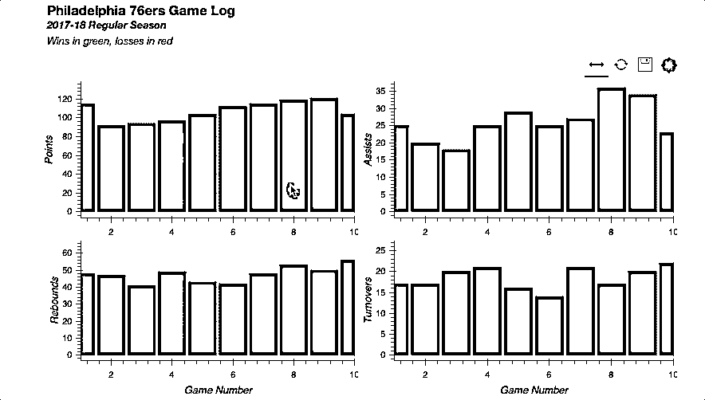](https://files.realpython.com/media/linked_axes.597d060fb6eb.gif)

同样，您可以轻松实现链接选择，其中一个绘图上的选择将反映在其他绘图上。

为了了解这一点，下一个可视化将包含两个散点图:一个显示 76 人的两分与三分投篮命中率，另一个显示 76 人在每场比赛中的球队得分与对手得分。

目标是能够选择左侧散点图上的数据点，并能够快速识别右侧散点图上的相应数据点是赢还是输。

该可视化的数据框架与第一个示例中的数据框架非常相似:

```py
# Isolate relevant data
phi_gm_stats_2 = (team_stats[(team_stats['teamAbbr'] == 'PHI') & 
                             (team_stats['seasTyp'] == 'Regular')]
                  .loc[:, ['gmDate', 
                           'team2P%', 
                           'team3P%', 
                           'teamPTS', 
                           'opptPTS']]
                  .sort_values('gmDate'))

# Add game number
phi_gm_stats_2['game_num'] = range(1, len(phi_gm_stats_2) + 1)

# Derive a win_loss column
win_loss = []
for _, row in phi_gm_stats_2.iterrows():

    # If the 76ers score more points, it's a win
    if row['teamPTS'] > row['opptPTS']:
        win_loss.append('W')
    else:
        win_loss.append('L')

# Add the win_loss data to the DataFrame
phi_gm_stats_2['winLoss'] = win_loss
```

数据看起来是这样的:

>>>

```py
>>> phi_gm_stats_2.head()
 gmDate  team2P%  team3P%  teamPTS  opptPTS  game_num winLoss
10  2017-10-18   0.4746   0.4286      115      120         1       L
39  2017-10-20   0.4167   0.3125       92      102         2       L
52  2017-10-21   0.4138   0.3333       94      128         3       L
80  2017-10-23   0.5098   0.3750       97       86         4       W
113 2017-10-25   0.5082   0.3333      104      105         5       L
```

创建可视化的代码如下:

```py
# Bokeh Libraries
from bokeh.plotting import figure, show
from bokeh.io import output_file
from bokeh.models import ColumnDataSource, CategoricalColorMapper, NumeralTickFormatter
from bokeh.layouts import gridplot

# Output inline in the notebook
output_file('phi-gm-linked-selections.html',
            title='76ers Percentages vs. Win-Loss')

# Store the data in a ColumnDataSource
gm_stats_cds = ColumnDataSource(phi_gm_stats_2)

# Create a CategoricalColorMapper that assigns specific colors to wins and losses
win_loss_mapper = CategoricalColorMapper(factors = ['W', 'L'], palette=['Green', 'Red'])

# Specify the tools
toolList = ['lasso_select', 'tap', 'reset', 'save']

# Create a figure relating the percentages
pctFig = figure(title='2PT FG % vs 3PT FG %, 2017-18 Regular Season',
                plot_height=400, plot_width=400, tools=toolList,
                x_axis_label='2PT FG%', y_axis_label='3PT FG%')

# Draw with circle markers
pctFig.circle(x='team2P%', y='team3P%', source=gm_stats_cds, 
              size=12, color='black')

# Format the y-axis tick labels as percenages
pctFig.xaxis[0].formatter = NumeralTickFormatter(format='00.0%')
pctFig.yaxis[0].formatter = NumeralTickFormatter(format='00.0%')

# Create a figure relating the totals
totFig = figure(title='Team Points vs Opponent Points, 2017-18 Regular Season',
                plot_height=400, plot_width=400, tools=toolList,
                x_axis_label='Team Points', y_axis_label='Opponent Points')

# Draw with square markers
totFig.square(x='teamPTS', y='opptPTS', source=gm_stats_cds, size=10,
              color=dict(field='winLoss', transform=win_loss_mapper))

# Create layout
grid = gridplot([[pctFig, totFig]])

# Visualize
show(grid)
```

这很好地说明了使用`ColumnDataSource`的威力。只要字形渲染器(在这种情况下，百分比的`circle`字形和赢输的`square`字形)共享同一个`ColumnDataSource`，那么默认情况下选择将被链接。

下面是它的实际效果，您可以看到在任一图形上所做的选择都会反映在另一个图形上:

[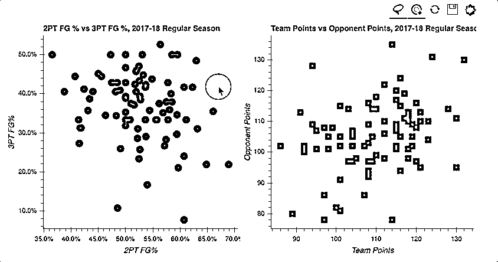](https://files.realpython.com/media/linked_selection.70bd761944f3.gif)

通过在左散点图的右上象限中选择数据点的随机样本，那些对应于高两分和三分投篮命中率的数据点，右散点图上的数据点被突出显示。

类似地，在右侧散点图上选择对应于损失的数据点倾向于更靠近左下方，在左侧散点图上投篮命中率更低。

有关链接图的所有详细信息可以在散景用户指南的[链接图](https://bokeh.pydata.org/en/latest/docs/user_guide/interaction/linking.html)中找到。

[*Remove ads*](/account/join/)

### 使用图例突出显示数据

这就把我们带到了本教程的最后一个交互例子:交互图例。

在[用字形](#drawing-data-with-glyphs)绘制数据部分，您看到了在创建绘图时实现图例是多么容易。有了图例，添加交互性只是分配一个`click_policy`的问题。使用一行代码，您就可以使用图例快速地向`hide`或`mute`数据添加功能。

在这个例子中，你会看到两个相同的散点图，比较勒布朗詹姆斯和凯文·杜兰特每场比赛的得分和篮板。唯一的区别将是一个使用一个`hide`作为它的`click_policy`，而另一个使用`mute`。

第一步是配置输出和设置数据，从`player_stats`数据帧为每个玩家创建一个视图:

```py
# Bokeh Libraries
from bokeh.plotting import figure, show
from bokeh.io import output_file
from bokeh.models import ColumnDataSource, CDSView, GroupFilter
from bokeh.layouts import row

# Output inline in the notebook
output_file('lebron-vs-durant.html',
            title='LeBron James vs. Kevin Durant')

# Store the data in a ColumnDataSource
player_gm_stats = ColumnDataSource(player_stats)

# Create a view for each player
lebron_filters = [GroupFilter(column_name='playFNm', group='LeBron'),
                  GroupFilter(column_name='playLNm', group='James')]
lebron_view = CDSView(source=player_gm_stats,
                      filters=lebron_filters)

durant_filters = [GroupFilter(column_name='playFNm', group='Kevin'),
                  GroupFilter(column_name='playLNm', group='Durant')]
durant_view = CDSView(source=player_gm_stats,
                      filters=durant_filters)
```

在创建图形之前，可以将图形、标记和数据的公共参数合并到字典中并重复使用。这不仅在下一步中节省了冗余，而且提供了一种简单的方法来在以后需要时调整这些参数:

```py
# Consolidate the common keyword arguments in dicts
common_figure_kwargs = {
    'plot_width': 400,
    'x_axis_label': 'Points',
    'toolbar_location': None,
}
common_circle_kwargs = {
    'x': 'playPTS',
    'y': 'playTRB',
    'source': player_gm_stats,
    'size': 12,
    'alpha': 0.7,
}
common_lebron_kwargs = {
    'view': lebron_view,
    'color': '#002859',
    'legend': 'LeBron James'
}
common_durant_kwargs = {
    'view': durant_view,
    'color': '#FFC324',
    'legend': 'Kevin Durant'
}
```

既然已经设置了各种属性，就可以用更简洁的方式构建两个散点图:

```py
# Create the two figures and draw the data
hide_fig = figure(**common_figure_kwargs,
                  title='Click Legend to HIDE Data', 
                  y_axis_label='Rebounds')
hide_fig.circle(**common_circle_kwargs, **common_lebron_kwargs)
hide_fig.circle(**common_circle_kwargs, **common_durant_kwargs)

mute_fig = figure(**common_figure_kwargs, title='Click Legend to MUTE Data')
mute_fig.circle(**common_circle_kwargs, **common_lebron_kwargs,
                muted_alpha=0.1)
mute_fig.circle(**common_circle_kwargs, **common_durant_kwargs,
                muted_alpha=0.1)
```

注意`mute_fig`有一个额外的参数叫做`muted_alpha`。当`mute`用作`click_policy`时，该参数控制标记的不透明度。

最后，设置每个图形的`click_policy`,它们以水平配置显示:

```py
# Add interactivity to the legend
hide_fig.legend.click_policy = 'hide'
mute_fig.legend.click_policy = 'mute'

# Visualize
show(row(hide_fig, mute_fig))
```

[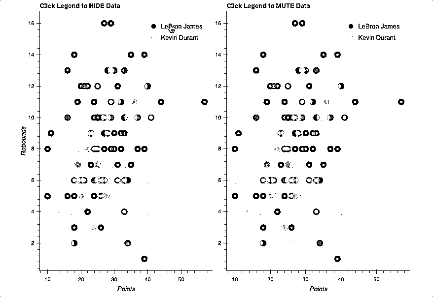](https://files.realpython.com/media/interactive_legend.8ab895366ef2.gif)

一旦图例就位，您所要做的就是将`hide`或`mute`分配给图形的`click_policy`属性。这将自动把你的基本图例变成一个交互式图例。

还要注意，特别是对于`mute`，`muted_alpha`的附加属性是在勒布朗·詹姆斯和凯文·杜兰特各自的`circle`字形中设置的。这决定了图例交互驱动的视觉效果。

关于散景互动的更多信息，在散景用户指南中添加互动是一个很好的开始。

## 总结和后续步骤

恭喜你！您已经完成了本教程的学习。

现在，您应该有了一套很好的工具，可以开始使用散景将您的数据转化为漂亮的交互式可视化效果。您可以从 [Real Python GitHub repo](https://github.com/realpython/materials/tree/master/intro-to-bokeh) 下载示例和代码片段。

您学习了如何:

*   配置您的脚本以呈现静态 HTML 文件或 Jupyter 笔记本
*   实例化并定制`figure()`对象
*   使用字形构建可视化
*   使用`ColumnDataSource`访问和过滤您的数据
*   在网格和选项卡布局中组织多个图
*   添加不同形式的交互，包括选择、悬停动作、链接和交互图例

为了探索更多的散景功能，官方的[散景用户指南](https://bokeh.pydata.org/en/latest/docs/user_guide.html)是深入探讨一些更高级主题的绝佳场所。我还建议去[散景画廊](https://bokeh.pydata.org/en/latest/docs/gallery.html)看看大量的例子和灵感。

*立即观看**本教程有真实 Python 团队创建的相关视频课程。配合文字教程一起看，加深理解: [**用散景在 Python 中交互数据可视化**](/courses/interactive-data-visualization-python-bokeh/)**********