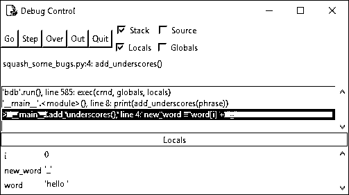

# 查找并修复 Python 中的代码错误:用 IDLE 调试

> 原文：<https://realpython.com/python-debug-idle/>

*立即观看**本教程有真实 Python 团队创建的相关视频课程。配合文字教程一起看，加深理解: [**Python 基础知识:查找并修复代码 bug**](/courses/python-basics-code-bugs/)

每个人都会犯错——即使是经验丰富的专业开发人员！Python 的交互式解释器 [IDLE](https://realpython.com/python-idle/) 非常擅长捕捉语法错误和运行时错误，但是还有第三种类型的错误，你可能已经经历过了。**逻辑错误**发生在一个原本有效的程序没有做预期的事情的时候。逻辑错误导致被称为**bug**的意外行为。去除 bug 叫做**调试**。

一个**调试器**是一个帮助你追踪 bug 并理解它们为什么会发生的工具。知道如何找到并修复代码中的 bug 是一项你将在整个编码生涯中使用的技能！

**在本教程中，您将:**

*   了解如何使用 IDLE 的**调试控制**窗口
*   练习**在有问题的函数上调试**
*   学习调试代码的替代方法

**注:**本教程改编自 [*Python 基础知识:Python 实用入门 3*](https://realpython.com/products/python-basics-book/) 中“查找并修复代码 bug”一章。

该书使用 Python 内置的 IDLE 编辑器来创建和编辑 Python 文件，并与 Python shell 进行交互，因此在整个教程中，您将会看到对 IDLE 内置调试工具的引用。但是，您应该能够将相同的概念应用到您选择的调试器中。

**免费奖励:** [掌握 Python 的 5 个想法](https://realpython.com/bonus/python-mastery-course/)，这是一个面向 Python 开发者的免费课程，向您展示将 Python 技能提升到下一个水平所需的路线图和心态。

## 使用调试控制窗口

IDLE 调试器的主界面是调试控制窗口，或简称为调试窗口。您可以通过从交互窗口的菜单中选择*调试→调试器*来打开调试窗口。继续并打开调试窗口。

**注意:**如果你的菜单栏中没有调试菜单，那么一定要点击它使交互窗口成为焦点。

每当调试窗口打开时，交互式窗口会在提示符旁边显示`[DEBUG ON]`,表示调试器已打开。现在打开一个新的编辑器窗口，在屏幕上排列这三个窗口，这样你就可以同时看到它们。

在本节中，您将了解如何组织调试窗口，如何使用调试器一次一行地单步调试代码，以及如何设置断点来帮助加快调试过程。

[*Remove ads*](/account/join/)

### 调试控制窗口:概述

要了解调试器如何工作，您可以从编写一个没有任何错误的简单程序开始。在编辑器窗口中键入以下内容:

```py
 1for i in range(1, 4):
 2    j = i * 2
 3    print(f"i is {i} and j is {j}")
```

保存文件，然后保持调试窗口打开并按下 `F5` 。你会注意到执行并没有走多远。

调试窗口将如下所示:

[](https://files.realpython.com/media/debug_window_overview.ecfbe2ea7bd0.png)

请注意，窗口顶部的堆栈面板包含以下消息:

```py
> '__main__'.<module>(), line 1: for i in range(1, 4):
```

这告诉你**线 1** (包含代码`for i in range(1, 4):`)是*关于*要运行但还没开始。消息的`'__main__'.module()`部分指的是这样一个事实，即你当前在程序的主要部分，而不是，例如，在到达主要代码块之前在一个函数定义中。

堆栈面板下面是一个局部面板，列出了一些看起来很奇怪的东西，比如`__annotations__`、`__builtins__`、`__doc__`等等。这些是你现在可以忽略的内部系统变量[T4。当你的程序运行时，你会在这个窗口中看到代码中声明的变量，这样你就可以跟踪它们的值。](https://realpython.com/python-variables/)

调试窗口的左上角有五个按钮:*前进*、*步进*、*越过*、*退出*、*退出*。这些按钮控制调试器如何遍历代码。

在接下来的部分中，您将从*步骤*开始，探究这些按钮的作用。

### 步进按钮

继续点击调试窗口左上角的*步骤*。调试窗口略有变化，如下所示:

[](https://files.realpython.com/media/step_button_1.1ad2c73284e1.png)

这里有两个不同点需要注意。首先,“堆栈”面板中的消息更改为:

```py
> '__main__'.<module>(), line 2: j = i * 2:
```

此时，代码的**行 1** 已经运行，调试器在执行**行 2** 之前已经停止。

要注意的第二个变化是新变量`i`，它在“局部变量”面板中被赋值为`1`。那是因为第一行代码中的 [`for`循环](https://realpython.com/python-for-loop/)创建了变量`i`，并给它赋值`1`。

继续点击*步骤*按钮，一行一行地浏览你的代码，并观察调试器窗口中发生了什么。当你到达第`print(f"i is {i} and j is {j}")`行时，你可以看到显示在交互窗口中的输出，一次一片。

更重要的是，当你逐步通过`for`循环时，你可以跟踪`i`和`j`的增长值。当您试图定位程序中的错误来源时，您可以想象这个特性是多么的有用。了解每一行代码中每个变量的值可以帮助您查明哪里出错了。

[*Remove ads*](/account/join/)

### 断点和继续按钮

通常，您可能知道 bug 一定在代码的特定部分，但是您可能不知道确切的位置。不要整天点击*步骤*按钮，你可以设置一个**断点**，告诉调试器连续运行所有代码，直到它到达断点。

[断点](https://en.wikipedia.org/wiki/Breakpoint)告诉调试器什么时候暂停代码执行，这样你就可以看看程序的当前状态。他们实际上并不破坏任何东西。

要设置断点，右键单击(`Ctrl`-在 Mac 上单击)编辑器窗口中您想要暂停的代码行，然后选择*设置断点*。IDLE 用黄色突出显示该行，表示已经设置了断点。要删除断点，右键单击带有断点的行并选择*清除断点*。

继续按下调试窗口顶部的*退出*，暂时关闭调试器。这不会关闭窗口，您会希望让它保持打开状态，因为您稍后会再次使用它。

用`print()`语句在代码行上设置一个断点。编辑器窗口现在应该如下所示:

[](https://files.realpython.com/media/set_breakpoint_1.4bc498b1c779.png)

保存并运行文件。就像之前一样，调试窗口的堆栈面板指示调试器已经启动，正在等待执行**行 1** 。点击 *Go* ，观察调试窗口中会发生什么:

[](https://files.realpython.com/media/go_button.47ebb267bbe4.png)

堆栈面板现在显示以下消息，表明它正在等待执行**行 3** :

```py
> '__main__'.<module>(), line 3: print(f"i is {i} and j is {j}")
```

如果您查看“局部变量”面板，那么您会看到变量`i`和`j`分别具有值`1`和`2`。通过点击 *Go* ，你告诉调试器连续运行你的代码，直到它到达一个断点或者程序的结尾。再次按下 *Go* 。调试窗口现在看起来像这样:

[](https://files.realpython.com/media/go_button_2.db5286a5bb5f.png)

你看到什么改变了吗？堆栈面板中显示与之前相同的消息，表明调试器正在等待再次执行**行 3** 。然而，变量`i`和`j`的值现在是`2`和`4`。交互式窗口还显示第一次通过循环运行带有`print()`的行的输出。

每次你按下 *Go* 按钮，调试器就会连续运行代码，直到到达下一个断点。由于您在**行的第 3** 处设置了断点，这是在`for`循环内，调试器每次遍历循环时都会在这一行停止。

第三次按下 *Go* 。现在`i`和`j`具有值`3`和`6`。你认为再按一次 *Go* 会发生什么？由于`for`循环只迭代三次，当你再次按 *Go* 时，程序将结束运行。

### 完了，完了

*Over* 按钮有点像是 *Step* 和 *Go* 的组合。它单步执行一个函数或循环。换句话说，如果您要使用调试器单步执行一个函数，那么您仍然可以运行该函数的代码，而不必单步执行它的每一行。点击上的*按钮可以直接看到运行该功能的结果。*

同样，如果你已经在一个函数或循环中，那么 *Out* 按钮执行函数或循环体内的剩余代码，然后暂停。

在下一节中，您将看到一些有问题的代码，并学习如何用 IDLE 来修复它。

[*Remove ads*](/account/join/)

## 压扁一些虫子

既然您已经习惯了使用调试控制窗口，让我们来看看一个有问题的程序。

下面的代码定义了一个函数`add_underscores()`，它将一个字符串对象`word`作为参数，并返回一个新字符串，该字符串包含一个`word`的副本，每个字符都用下划线包围。比如`add_underscores("python")`应该返回`"_p_y_t_h_o_n_"`。

下面是有问题的代码:

```py
def add_underscores(word):
    new_word = "_"
    for i in range(len(word)):
        new_word = word[i] + "_"
    return new_word

phrase = "hello"
print(add_underscores(phrase))
```

在编辑器窗口中输入这段代码，然后保存文件，按 `F5` 运行程序。预期的输出是`_h_e_l_l_o_`，但是您看到的却是`o_`，或者是字母`"o"`后跟一个下划线。

如果您已经发现了代码的问题所在，不要只是修复它。本节的重点是学习如何使用 IDLE 的调试器来识别问题。

如果看不出问题出在哪里，不要着急！在本节结束时，您将会找到它，并且能够识别您遇到的其他代码中的类似问题。

**注意:**调试可能会很困难，也很耗时，而且错误可能很微妙，很难识别。

虽然这一节着眼于一个相对基本的 bug，但是用于检查代码和发现 bug 的方法对于更复杂的问题是相同的。

调试就是解决问题，随着你越来越有经验，你会开发出自己的方法。在本节中，您将学习一个简单的四步法来帮助您开始:

1.  猜猜哪一段代码可能包含 bug。
2.  设置一个断点，通过一次一行地遍历有问题的部分来检查代码，同时跟踪重要的变量。
3.  确定有错误的代码行(如果有的话),并进行更改以解决问题。
4.  根据需要重复步骤 1–3，直到代码按预期运行。

### 第一步:猜测 Bug 在哪里

第一步是识别可能包含 bug 的代码部分。一开始，您可能无法确定错误的确切位置，但是您通常可以合理地猜测代码的哪个部分有错误。

注意，程序被分成两个不同的部分:一个函数定义(在这里定义了`add_underscores()`)和一个主代码块，它定义了一个值为`"hello"`的变量`phrase`，然后打印调用`add_underscores(phrase)`的结果。

看主要部分:

```py
phrase = "hello"
print(add_underscores(phrase))
```

你认为问题会在这里吗？看起来不像是吧？这两行代码的一切看起来都很好。所以，问题一定出在函数定义上:

```py
def add_underscores(word):
    new_word = "_"
    for i in range(len(word)):
        new_word = word[i] + "_"
    return new_word
```

函数中的第一行代码创建了一个值为`"_"`的变量`new_word`。你们都很好，所以可以断定问题出在`for`循环的某个地方。

### 步骤 2:设置断点并检查代码

既然您已经确定了 bug 的位置，那么就在`for`循环的开始处设置一个断点，这样您就可以通过调试窗口准确地跟踪出代码内部发生了什么:

[](https://files.realpython.com/media/set_breakpoint_2.54854bf6da55.png)

打开调试窗口并运行该文件。执行仍然停留在它看到的第一行，也就是函数定义。

按 *Go* 运行代码，直到遇到断点。调试窗口现在将如下所示:

[](https://files.realpython.com/media/debug_window_1.7e95b8106270.png)

此时，代码在进入`add_underscores()`函数中的`for`循环之前暂停。注意，两个局部变量`word`和`new_word`显示在“局部变量”面板中。目前，`word`的值为`"hello"`，而`new_word`的值为`"_"`，与预期一致。

点击*步*一次，进入`for`循环。调试窗口发生变化，一个值为`0`的新变量`i`显示在“局部变量”面板中:

[](https://files.realpython.com/media/debug_window_2.7b6adcd28176.png)

`i`是在`for`循环中使用的计数器，你可以用它来跟踪你当前正在查看的`for`循环的迭代。

再次点击*步骤*。如果您查看“局部变量”面板，您会看到变量`new_word`的值为`"h_"`:

[](https://files.realpython.com/media/debug_window_3.928b8a6f32bc.png)

这不对。最初，`new_word`有值`"_"`，在`for`循环的第二次迭代中，它现在应该有值`"_h_"`。如果你点击*步骤*几次，那么你会看到`new_word`被设置为`e_`，然后是`l_`，以此类推。

[*Remove ads*](/account/join/)

### 步骤 3:识别错误并尝试修复它

此时您可以得出的结论是，在`for`循环的每次迭代中，`new_word`都被字符串中的下一个字符`"hello"`和尾随下划线覆盖。由于在`for`循环中只有一行代码，您知道问题一定出在下面的代码上:

```py
new_word = word[i] + "_"
```

仔细看这条线。它告诉 Python 获取下一个字符`word`，在它的末尾加上一个下划线，并将这个新字符串赋给变量`new_word`。这正是你在`for`循环中看到的行为！

要解决这个问题，您需要告诉 Python 将字符串`word[i] + "_"`连接到现有的值`new_word`。在调试窗口中按*退出*，但暂时不要关闭窗口。打开编辑器窗口，将`for`循环中的代码行改为:

```py
new_word = new_word + word[i] + "_"
```

### 步骤 4:重复步骤 1 到 3，直到 Bug 消失

保存对程序的新更改，然后再次运行。在调试窗口中，按 *Go* 执行代码直到断点。

**注意:**如果您在上一步中关闭了调试器而没有点击*退出*，那么当您重新打开调试窗口时，您可能会看到以下错误:

```py
You can only toggle the debugger when idle
```

当你完成一个调试会话时，一定要点击 *Go* 或 *Quit* ，而不是仅仅关闭调试器，否则你可能很难重新打开它。要消除这个错误，您必须关闭并重新打开 IDLE。

程序在进入`add_underscores()`中的`for`循环之前暂停。重复按下*步骤*，观察每次迭代中`new_word`变量会发生什么。成功！一切按预期运行！

您第一次修复错误的尝试成功了，因此您不再需要重复步骤 1-3。情况不会总是这样。有时候，在你修复一个 bug 之前，你必须重复这个过程几次。

### 寻找漏洞的替代方法

使用调试器可能很棘手，也很耗时，但这是在代码中找到 bug 的最可靠的方法。然而，调试器并不总是可用的。资源有限的系统，比如小型的物联网设备，通常没有内置的调试器。

在这种情况下，您可以使用**打印调试**来查找代码中的 bug。打印调试使用`print()`在控制台中显示文本，指示程序在哪里执行，以及程序变量在代码中特定点的状态。

例如，您可以在`add_underscores()`中的`for`循环的末尾添加下面一行，而不是使用调试窗口来调试前面的程序:

```py
print(f"i = {i}; new_word = {new_word}")
```

修改后的代码将如下所示:

```py
def add_underscores(word):
    new_word = "_"
    for i in range(len(word)):
        new_word = word[i] + "_"
        print(f"i = {i}; new_word = {new_word}")
    return new_word

phrase = "hello"
print(add_underscores(phrase))
```

运行该文件时，交互式窗口会显示以下输出:

```py
i = 0; new_word = h_
i = 1; new_word = e_
i = 2; new_word = l_
i = 3; new_word = l_
i = 4; new_word = o_
o_
```

这向您展示了在`for`循环的每次迭代中`new_word`的值。只包含一个下划线的最后一行是在程序末尾运行`print(add_underscore(phrase))`的结果。

通过查看上面的输出，您可以得出与使用调试窗口进行调试时相同的结论。问题是`new_word`在每次迭代时都会被覆盖。

打印调试是可行的，但是与使用调试器进行调试相比，它有几个缺点。首先，每次想要检查变量的值时，都必须运行整个程序。与使用断点相比，这可能是巨大的时间浪费。当你完成调试时，你还必须记住从你的代码中删除那些`print()`函数调用！

本节中的示例循环可能是说明调试过程的一个很好的例子，但它不是[python 代码](https://realpython.com/learning-paths/writing-pythonic-code/)的最佳例子。索引`i`的使用表明可能有更好的方法来编写循环。

改进这个循环的一个方法是直接迭代`word`中的字符。有一种方法可以做到这一点:

```py
def add_underscores(word):
    new_word = "_"
    for letter in word:
        new_word = new_word + letter + "_"
    return new_word
```

重写现有代码以使其更清晰、更易于阅读和理解，或者更符合团队设定的标准的过程被称为**重构**。我们不会在本教程中讨论重构，但它是编写专业质量代码的重要部分。

[*Remove ads*](/account/join/)

## 结论:Python 调试用空闲

就是这样！现在，您已经了解了使用 IDLE 的调试窗口进行调试的所有内容。您可以将这里使用的基本原则用于许多不同的调试工具。现在，您已经准备好开始调试 Python 代码了。

**在本教程中，您学习了:**

*   如何使用 IDLE 的**调试控制**窗口检查变量值
*   如何插入**断点**来仔细看看你的代码是如何工作的
*   如何使用*步*、*走*、【T4 过、*出*按钮**逐行追踪 bug**

您还得到了一些使用识别和消除 bug 的四步过程调试错误函数的实践:

1.  猜猜窃听器在哪里。
2.  设置断点并检查代码。
3.  找出错误并尝试修复。
4.  重复步骤 1 至 3，直到错误被修复。

调试既是一门科学，也是一门艺术。掌握调试的唯一方法就是进行大量的实践！获得一些实践的一个方法是打开调试控制窗口，当你在其他*真正的 Python* 教程中找到练习和挑战时，使用它来逐步通过你的代码。

有关调试 Python 代码的更多信息，请查看使用 Pdb 调试 Python。如果你喜欢在这个例子中从 [*Python 基础:Python 3*](https://realpython.com/products/python-basics-book/) 实用介绍中学到的东西，那么一定要看看本书的其余部分。

*立即观看**本教程有真实 Python 团队创建的相关视频课程。配合文字教程一起看，加深理解: [**Python 基础知识:查找并修复代码 bug**](/courses/python-basics-code-bugs/)*******