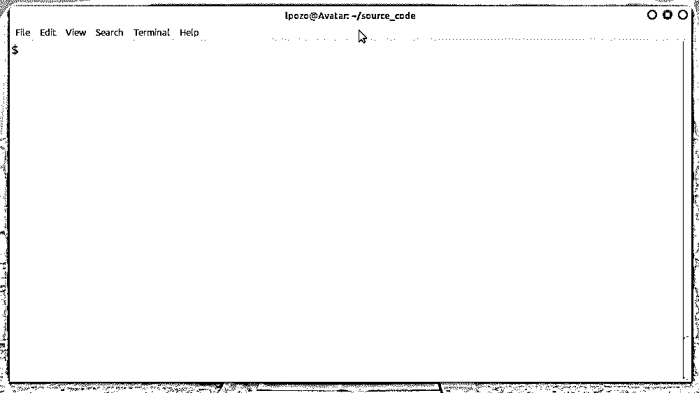

# 用 Python 构建掷骰子应用程序

> 原文：<https://realpython.com/python-dice-roll/>

构建小项目，如[基于文本的用户界面(TUI)](https://en.wikipedia.org/wiki/Text-based_user_interface) 掷骰子应用程序，将帮助您提高 Python 编程技能。您将学习如何收集和验证用户的输入，从模块和包中导入代码，编写函数，使用`for`循环和条件语句，并通过使用字符串和 [`print()`](https://realpython.com/python-print/) 函数灵活地显示输出。

在这个项目中，您将编写一个模拟掷骰子事件的应用程序。为此，您将使用 Python 的`random`模块。

**在本教程中，您将学习如何:**

*   用 **`random.randint()`** 模拟**掷骰子**事件
*   使用内置的 **`input()`** 函数请求**用户输入**
*   **解析**和**验证**用户的输入
*   操纵**琴弦**的使用方法，如 **`.center()`** 和 **`.join()`**

您还将学习如何构建、组织、记录和运行 Python 程序和脚本的基础知识。

单击下面的链接下载这个掷骰子应用程序的完整代码，并跟随您自己构建项目:

**获取源代码:** [点击此处获取源代码，您将使用](https://realpython.com/bonus/python-dice-roll-project-code/)构建您的 Python 掷骰子应用程序。

## 演示

在这个分步项目中，您将构建一个运行掷骰子模拟的应用程序。该应用程序将能够滚动多达六个骰子，每个骰子有六个面。每次掷骰子后，应用程序都会生成骰子面的 ASCII 图，并显示在屏幕上。以下视频演示了该应用程序的工作原理:

[](https://files.realpython.com/media/python-dice-roll-demo.93e6fe0d714a.gif)

当你运行你的掷骰子模拟器应用程序时，你会得到一个提示，询问你要掷多少个骰子。一旦您提供了从 1 到 6(包括 1 和 6)的有效整数，应用程序就会模拟滚动事件，并在屏幕上显示骰子面的图形。

[*Remove ads*](/account/join/)

## 项目概述

您的掷骰子模拟器应用程序将有一个最小但用户友好的[基于文本的用户界面(TUI)](https://en.wikipedia.org/wiki/Text-based_user_interface) ，它将允许您指定您想要掷出的六面骰子的数量。您将使用此 TUI 在家中掷骰子，而不必飞往拉斯维加斯。

以下是该应用程序内部工作方式的描述:

| 要运行的任务 | 要使用的工具 | 要编写的代码 |
| --- | --- | --- |
| 提示用户选择掷出多少个六面骰子，然后读取用户的输入 | Python 内置的 [`input()`](https://docs.python.org/3/library/functions.html#input) 函数 | 使用适当的参数调用`input()` |
| 解析并验证用户的输入 | 字符串方法、比较运算符和[条件语句](https://realpython.com/python-conditional-statements/) | 名为`parse_input()`的用户自定义函数 |
| 运行掷骰子模拟 | Python 的 [`random`](https://realpython.com/python-random/) 模块，具体是 [`randint()`](https://docs.python.org/3/library/random.html#random.randint) 函数 | 名为`roll_dice()`的用户自定义函数 |
| 用生成的骰子面生成 ASCII 图 | 循环， [`list.append()`](https://realpython.com/python-append/) ，和 [`str.join()`](https://realpython.com/python-string-split-concatenate-join/) | 名为`generate_dice_faces_diagram()`的用户自定义函数 |
| 在屏幕上显示骰子面的图形 | Python 内置的 [`print()`](https://realpython.com/python-print/) 函数 | 使用适当的参数调用`print()` |

牢记这些内部工作原理，您将编写三个自定义函数来提供应用程序的主要特性和功能。这些函数将定义你的代码的公共 [API](https://en.wikipedia.org/wiki/API) ，你将调用它来激活应用程序。

为了组织掷骰子模拟器项目的代码，您将在文件系统中您选择的目录下创建一个名为`dice.py`的文件。继续并创建文件开始吧！

## 先决条件

在开始构建这个掷骰子模拟项目之前，您应该熟悉以下概念和技能:

*   在 Python 中运行脚本的方法
*   Python 的 [`import`](https://realpython.com/python-import/) 机制
*   [Python 数据类型](https://realpython.com/python-data-types/)的基础知识，主要是[字符串](https://realpython.com/python-strings/)和[整数数字](https://realpython.com/python-numbers/#integers)
*   基本的[数据结构](https://realpython.com/python-data-structures/)，特别是[列表](https://realpython.com/python-lists-tuples/)
*   Python [变量](https://realpython.com/python-variables/)和常量
*   Python [比较运算符](https://realpython.com/python-operators-expressions/#comparison-operators)
*   [布尔值](https://realpython.com/python-boolean/)和[逻辑表达式](https://realpython.com/python-operators-expressions/#logical-operators)
*   [条件](https://realpython.com/python-conditional-statements/)语句
*   Python [`for` loops](https://realpython.com/python-for-loop/)
*   Python 中[输入、](https://realpython.com/python-input-output/)输出、[字符串格式化](https://realpython.com/python-string-formatting/)的基础知识

如果在开始这次编码冒险之前，您还没有掌握所有的必备知识，那也没关系！通过继续前进并开始行动，您可能会学到更多！如果遇到困难，您可以随时停下来查看此处链接的资源。

## 步骤 1:编写 Python 掷骰子应用程序的 TUI 代码

在这一步中，您将编写所需的代码，要求用户输入他们希望在模拟中掷出多少骰子。您还将编写一个 Python 函数，该函数接受用户的输入，对其进行验证，如果验证成功，则返回一个整数。否则，该函数将再次要求用户输入。

要下载此步骤的代码，请单击以下链接并导航至`source_code_step_1/`文件夹:

**获取源代码:** [点击此处获取源代码，您将使用](https://realpython.com/bonus/python-dice-roll-project-code/)构建您的 Python 掷骰子应用程序。

### 在命令行接受用户的输入

为了让您的手变脏，您可以开始编写与用户交互的代码。这段代码将提供应用程序的**基于文本的界面**，并将依赖于`input()`。这个内置函数从命令行读取用户输入。它的`prompt`参数允许您传递所需输入类型的描述。

启动你最喜欢的[编辑器或 IDE](https://realpython.com/python-ides-code-editors-guide/) ，在你的`dice.py`文件中输入以下代码:

```py
 1# dice.py
 2
 3# ~~~ App's main code block ~~~
 4# 1\. Get and validate user's input
 5num_dice_input = input("How many dice do you want to roll? [1-6] ")
 6num_dice = parse_input(num_dice_input)
```

您对第 5 行的`input()`的调用显示一个提示，询问用户想要掷出多少骰子。如提示所示，该数字必须在 1 到 6 的范围内。

**注意:**通过在第 3 行添加注释，您将应用程序的主代码与您将在接下来的部分中添加的其余代码分开。

同样，第 4 行的注释反映了您当时正在执行的特定任务。在本教程的其他部分，你会发现更多类似的[评论](https://realpython.com/python-comments-guide/)。这些评论是可选的，所以如果你愿意，可以随意删除它们。

第 6 行调用`parse_input()`并将[返回的](https://realpython.com/python-return-statement/)值存储在`num_dice`中。在下一节中，您将实现这个函数。

[*Remove ads*](/account/join/)

### 解析并验证用户的输入

`parse_input()`的工作是将用户的输入作为一个字符串，检查它是否是一个有效的整数，并将其作为 Python `int`对象返回。继续将以下内容添加到您的`dice.py`文件中，就在应用程序主代码之前:

```py
 1# dice.py
 2
 3def parse_input(input_string):
 4    """Return `input_string` as an integer between 1 and 6.
 5
 6 Check if `input_string` is an integer number between 1 and 6.
 7 If so, return an integer with the same value. Otherwise, tell
 8 the user to enter a valid number and quit the program.
 9 """
10    if input_string.strip() in {"1", "2", "3", "4", "5", "6"}:
11        return int(input_string)
12    else:
13        print("Please enter a number from 1 to 6.")
14        raise SystemExit(1)
15
16# ~~~ App's main code block ~~~
17# ...
```

下面是这段代码的逐行工作方式:

*   **第 3 行**定义了`parse_input()`，它以输入字符串作为参数。

*   **第 4 行到第 9 行**提供了函数的文档字符串。在函数中包含信息丰富且格式良好的 docstring 是 Python 编程中的最佳实践，因为 docstring 允许您[记录您的代码](https://realpython.com/documenting-python-code/)。

*   **第 10 行**检查用户输入的掷骰子数是否为有效值。对`.strip()`的调用删除了输入字符串周围不需要的空格。 [`in`操作符](https://realpython.com/python-boolean/#the-in-operator)检查输入是否在允许掷骰子的数目范围内。在这种情况下，您使用一个[集合](https://realpython.com/python-sets/)，因为这个 Python [数据结构](https://realpython.com/python-data-structures/)中的**成员测试**非常高效。

*   **第 11 行**将输入转换成整数并返回给调用者。

*   **第 13 行**打印一条信息到屏幕上，提醒用户输入无效(如果适用)。

*   **第 14 行**以 [`SystemExit`](https://docs.python.org/3/library/exceptions.html#SystemExit) 异常和`1`的[状态码](https://docs.python.org/3/library/exceptions.html#SystemExit.code)退出应用程序，表示出现了问题。

使用`parse_input()`，您可以在命令行处理和验证用户的输入。[验证任何直接来自用户或任何不可信来源的输入](https://realpython.com/python-property/#validating-input-values)是您的应用程序可靠安全工作的关键。

**注意:**本教程中代码示例的行号是为了便于解释。大多数情况下，它们不会与你最终脚本中的行号相匹配。

现在您已经有了用户友好的 TUI 和适当的输入验证机制，您需要确保这些功能正常工作。这就是你在下一节要做的。

### 试试掷骰子应用程序的 TUI

要尝试您到目前为止编写的代码，请打开一个命令行窗口并运行您的`dice.py`脚本:

```py
$ python dice.py
How many dice do you want to roll? [1-6] 3

$ python dice.py
How many dice do you want to roll? [1-6] 7
Please enter a number from 1 to 6.
```

如果您输入 1 到 6 之间的整数，则代码不会显示消息。另一方面，如果输入不是有效的整数或者超出了目标区间，那么您会得到一条消息，告诉您需要 1 到 6 之间的整数。

到目前为止，您已经成功地编写了在命令行请求和解析用户输入的代码。这段代码提供了应用程序的 TUI，它基于内置的`input()`函数。您还编写了一个函数来验证用户的输入，并将其作为整数返回。现在，是掷骰子的时候了！

## 第二步:用 Python 模拟六面骰子的滚动

您的掷骰子应用程序现在提供了一个 TUI 来接受用户的输入并进行处理。太好了！为了继续构建应用程序的主要功能，您将编写`roll_dice()`函数，它将允许您模拟掷骰子事件。这个函数将获取用户想要掷骰子的数目。

Python 的 [`random`](https://realpython.com/python-random/) 模块从标准库中提供了 [`randint()`](https://docs.python.org/3/library/random.html#random.randint) 函数，在给定的区间内生成[伪随机](https://en.wikipedia.org/wiki/Pseudorandomness)整数。您将利用这个函数来模拟掷骰子。

要下载此步骤的代码，请单击以下链接并查看`source_code_step_2/`文件夹:

**获取源代码:** [点击此处获取源代码，您将使用](https://realpython.com/bonus/python-dice-roll-project-code/)构建您的 Python 掷骰子应用程序。

下面是实现`roll_dice()`的代码:

```py
 1# dice.py
 2import random
 3
 4# ...
 5
 6def roll_dice(num_dice):
 7    """Return a list of integers with length `num_dice`.
 8
 9 Each integer in the returned list is a random number between
10 1 and 6, inclusive.
11 """
12    roll_results = []
13    for _ in range(num_dice):
14        roll = random.randint(1, 6)
15        roll_results.append(roll)
16    return roll_results
17
18# ~~~ App's main code block ~~~
19# ...
```

在这个代码片段中，第 2 行将`random`导入到当前的[名称空间](https://realpython.com/python-namespaces-scope/)中。该导入允许您稍后访问`randint()`功能。下面是其余代码的细目分类:

*   **第 6 行**定义了`roll_dice()`，它接受一个参数，表示在给定调用中掷骰子的数目。

*   **第 7 行到第 11 行**提供了函数的[文档串](https://docs.python.org/3/glossary.html#term-docstring)。

*   **第 12 行**创建一个空的[列表](https://realpython.com/python-lists-tuples/)，`roll_results`，用来存储掷骰子模拟的结果。

*   **第 13 行**定义了一个`for`循环，对用户想要掷出的每个骰子迭代一次。

*   **第 14 行**调用`randint()`生成一个从 1 到 6(含)的伪随机整数。该调用在每次迭代中生成一个数字。这个数字表示滚动六面骰子的结果。

*   **第 15 行**将当前掷骰结果追加到`roll_results`中。

*   **第 16 行**返回掷骰子模拟结果列表。

为了测试您新创建的函数，将下面几行代码添加到您的`dice.py`文件的末尾:

```py
 1# dice.py
 2# ...
 3
 4# ~~~ App's main code block ~~~
 5# 1\. Get and validate user's input
 6num_dice_input = input("How many dice do you want to roll? [1-6] ")
 7num_dice = parse_input(num_dice_input)
 8# 2\. Roll the dice
 9roll_results = roll_dice(num_dice) 10
11print(roll_results)  # Remove this line after testing the app
```

在这段代码中，第 9 行用`num_dice`作为参数调用`roll_dice()`。第 11 行调用`print()`将结果显示为屏幕上的数字列表。列表中的每个数字代表单个芯片的结果。测试完代码后，您可以删除第 11 行。

继续从命令行运行您的应用程序:

```py
$ python dice.py
How many dice do you want to roll? [1-6] 5
[6, 1, 3, 6, 6]

$ python dice.py
How many dice do you want to roll? [1-6] 2
[2, 6]
```

您屏幕上的结果列表会有所不同，因为您正在生成自己的伪随机数。在本例中，您将分别模拟掷出五个和两个骰子。每个骰子的值介于 1 和 6 之间，因为您使用的是六面骰子。

既然您已经编写并测试了模拟掷骰子事件的代码，那么是时候继续为您的应用程序提供一种显示这些结果的华丽方式了。这是您将在下一部分中执行的操作。

[*Remove ads*](/account/join/)

## 第三步:生成并显示骰子面的 ASCII 图

此时，您的应用程序已经模拟了几个骰子的滚动，并将结果存储为数字列表。然而，从用户的角度来看，数字列表并不吸引人。你需要一个更好的输出，让你的应用看起来更专业。

在本节中，您将编写代码来生成显示最多六个骰子正面的图表。为此，您将创建一点 ASCII 艺术。

单击下面的链接下载此步骤的代码，以便您可以跟随项目。您将在`source_code_step_3/`文件夹中找到您需要的内容:

**获取源代码:** [点击此处获取源代码，您将使用](https://realpython.com/bonus/python-dice-roll-project-code/)构建您的 Python 掷骰子应用程序。

### 设置骰子面图

您的掷骰子模拟器应用程序需要一种方式来显示掷骰子的结果。为此，您将使用骰子正面的 ASCII 图表，该图表将显示掷出所需数量的六面骰子的结果。例如，在掷出四个骰子后，图表看起来会像这样:

```py
~~~~~~~~~~~~~~~~~~~ RESULTS ~~~~~~~~~~~~~~~~~~~
┌─────────┐ ┌─────────┐ ┌─────────┐ ┌─────────┐
│  ●   ●  │ │         │ │  ●      │ │  ●      │
│         │ │    ●    │ │    ●    │ │         │
│  ●   ●  │ │         │ │      ●  │ │      ●  │
└─────────┘ └─────────┘ └─────────┘ └─────────┘
```

此图中的每个模具面反映了一次模拟迭代的结果值。要开始编写构建该图的功能，您需要将一些 ASCII 图片放在一起。

```py
 1# dice.py
 2import random
 3
 4DICE_ART = {
 5    1: (
 6        "┌─────────┐",
 7        "│         │",
 8        "│    ●    │",
 9        "│         │",
10        "└─────────┘",
11    ),
12    2: (
13        "┌─────────┐",
14        "│  ●      │",
15        "│         │",
16        "│      ●  │",
17        "└─────────┘",
18    ),
19    3: (
20        "┌─────────┐",
21        "│  ●      │",
22        "│    ●    │",
23        "│      ●  │",
24        "└─────────┘",
25    ),
26    4: (
27        "┌─────────┐",
28        "│  ●   ●  │",
29        "│         │",
30        "│  ●   ●  │",
31        "└─────────┘",
32    ),
33    5: (
34        "┌─────────┐",
35        "│  ●   ●  │",
36        "│    ●    │",
37        "│  ●   ●  │",
38        "└─────────┘",
39    ),
40    6: (
41        "┌─────────┐",
42        "│  ●   ●  │",
43        "│  ●   ●  │",
44        "│  ●   ●  │",
45        "└─────────┘",
46    ),
47}
48DIE_HEIGHT = len(DICE_ART[1])
49DIE_WIDTH = len(DICE_ART[1][0])
50DIE_FACE_SEPARATOR = " "
51
52# ...
```

在第 4 到 47 行，您使用 ASCII 字符绘制了六个骰子面。您将面孔存储在`DICE_ART`中，这是一个将每个面孔映射到其相应整数值的字典。

第 48 行定义了`DIE_HEIGHT`，它保存了一个给定面将占据的行数。在本例中，每个面占据五行。类似地，第 49 行定义了`DIE_WIDTH`来保存绘制模具面所需的列数。在本例中，宽度为 11 个字符。

最后，第 50 行定义了`DIE_FACE_SEPARATOR`，它包含一个空白字符。您将使用所有这些常量来为您的应用程序生成和显示骰子面的 ASCII 图。

### 生成骰子面图

此时，您已经为每个模具面构建了 ASCII 艺术。要将这些部分组合成一个最终的图表，表示掷骰子模拟的完整结果，您将编写另一个自定义函数:

```py
 1# dice.py
 2
 3# ...
 4
 5def generate_dice_faces_diagram(dice_values):
 6    """Return an ASCII diagram of dice faces from `dice_values`.
 7
 8 The string returned contains an ASCII representation of each die.
 9 For example, if `dice_values = [4, 1, 3, 2]` then the string
10 returned looks like this:
11
12 ~~~~~~~~~~~~~~~~~~~ RESULTS ~~~~~~~~~~~~~~~~~~~
13 ┌─────────┐ ┌─────────┐ ┌─────────┐ ┌─────────┐
14 │  ●   ●  │ │         │ │  ●      │ │  ●      │
15 │         │ │    ●    │ │    ●    │ │         │
16 │  ●   ●  │ │         │ │      ●  │ │      ●  │
17 └─────────┘ └─────────┘ └─────────┘ └─────────┘
18 """
19    # Generate a list of dice faces from DICE_ART
20    dice_faces = []
21    for value in dice_values:
22        dice_faces.append(DICE_ART[value])
23
24    # Generate a list containing the dice faces rows
25    dice_faces_rows = []
26    for row_idx in range(DIE_HEIGHT):
27        row_components = []
28        for die in dice_faces:
29            row_components.append(die[row_idx])
30        row_string = DIE_FACE_SEPARATOR.join(row_components)
31        dice_faces_rows.append(row_string)
32
33    # Generate header with the word "RESULTS" centered
34    width = len(dice_faces_rows[0])
35    diagram_header = " RESULTS ".center(width, "~")
36
37    dice_faces_diagram = "\n".join([diagram_header] + dice_faces_rows)
38    return dice_faces_diagram
39
40# ~~~ App's main code block ~~~
41# ...
```

该函数执行以下操作:

*   **第 5 行**用一个名为`dice_values`的参数定义了`generate_dice_faces_diagram()`。这个参数将保存调用`roll_dice()`得到的掷骰子的整数值列表。

*   **第 6 行到第 18 行**提供了函数的文档字符串。

*   **第 20 行**创建一个名为`dice_faces`的空列表来存储与输入的骰子值列表相对应的骰子面。这些骰子面将显示在最终的 ASCII 图中。

*   **第 21 行**定义了一个`for`循环来迭代骰子值。

*   **第 22 行**从`DICE_ART`检索对应于当前模具值的模具面，并将其附加到`dice_faces`。

*   **第 25 行**创建一个空列表来保存最终骰子点数图中的行。

*   **第 26 行**定义了一个从`0`到`DIE_HEIGHT - 1`遍历索引的循环。每个索引代表骰子点数图中给定行的索引。

*   **第 27 行**将`row_components`定义为一个空列表，用于保存将填充给定行的骰子面部分。

*   **第 28 行**开始一个嵌套的`for`循环来迭代骰子面。

*   **第 29 行**存储每行组件。

*   **第 30 行**将行组件连接成最终的行字符串，用空格分隔各个组件。

*   **第 31 行**将每个行字符串追加到保存行的列表中，这些行将形成最终的图表。

*   **第 34 行**创建一个临时变量来保存当前骰子点数图的`width`。

*   **第 35 行**创建一个显示单词*结果*的标题。为此，它使用 [`str.center()`](https://docs.python.org/3/library/stdtypes.html#str.center) 以及图的`width`和波浪号(`~`)作为参数。

*   **第 37 行**生成一个包含最终骰子点数图的字符串。[换行符](https://realpython.com/python-data-types/#applying-special-meaning-to-characters)字符(`\n`)用作行分隔符。`.join()`的参数是一个字符串列表，它连接了图头和塑造骰子面的字符串(行)。

*   **第 38 行**向调用者返回一个准备打印的骰子点数图。

哇！太多了！您将回到这段代码，并对其进行改进，使其更易于管理。不过，在此之前，您会想尝试一下您的应用程序，所以您需要完成其主要代码块的编写。

### 完成应用程序的主要代码，掷骰子

有了`generate_dice_faces_diagram()`,您现在可以完成应用程序主代码的编写，这将允许您实际生成并在屏幕上显示骰子面的图形。继续将下面几行代码添加到`dice.py`的末尾:

```py
 1# dice.py
 2
 3# ...
 4
 5# ~~~ App's main code block ~~~
 6# 1\. Get and validate user's input
 7num_dice_input = input("How many dice do you want to roll? [1-6] ")
 8num_dice = parse_input(num_dice_input)
 9# 2\. Roll the dice
10roll_results = roll_dice(num_dice)
11# 3\. Generate the ASCII diagram of dice faces
12dice_face_diagram = generate_dice_faces_diagram(roll_results) 13# 4\. Display the diagram
14print(f"\n{dice_face_diagram}")
```

第 12 行用`roll_results`作为参数调用`generate_dice_faces_diagram()`。该调用构建并返回与当前掷骰子结果相对应的骰子面图。第 14 行调用`print()`在屏幕上显示图表。

通过此更新，您可以再次运行该应用程序。回到命令行，执行以下命令:

```py
$ python dice.py
How many dice do you want to roll? [1-6] 5

~~~~~~~~~~~~~~~~~~~~~~~~~ RESULTS ~~~~~~~~~~~~~~~~~~~~~~~~~
┌─────────┐ ┌─────────┐ ┌─────────┐ ┌─────────┐ ┌─────────┐
│  ●   ●  │ │  ●   ●  │ │  ●   ●  │ │  ●      │ │  ●   ●  │
│    ●    │ │  ●   ●  │ │  ●   ●  │ │    ●    │ │         │
│  ●   ●  │ │  ●   ●  │ │  ●   ●  │ │      ●  │ │  ●   ●  │
└─────────┘ └─────────┘ └─────────┘ └─────────┘ └─────────┘
```

酷！现在，您的掷骰子模拟器应用程序显示一个格式良好的 ASCII 图表，显示模拟事件的结果。很整洁，不是吗？

如果你回到`generate_dice_faces_diagram()`的实现，你会注意到它包含了一些注释，指出了代码的相应部分在做什么:

```py
def generate_dice_faces_diagram(dice_values):
    # ...
 # Generate a list of dice faces from DICE_ART    dice_faces = []
    for value in dice_values:
        dice_faces.append(DICE_ART[value])

 # Generate a list containing the dice faces rows    dice_faces_rows = []
    for row_idx in range(DIE_HEIGHT):
        row_components = []
        for die in dice_faces:
            row_components.append(die[row_idx])
        row_string = DIE_FACE_SEPARATOR.join(row_components)
        dice_faces_rows.append(row_string)

 # Generate header with the word "RESULTS" centered    width = len(dice_faces_rows[0])
    diagram_header = " RESULTS ".center(width, "~")

    dice_faces_diagram = "\n".join([diagram_header] + dice_faces_rows)
    return dice_faces_diagram
```

这种评论通常表明你的代码会从一些重构中受益。在下一节中，您将使用一种流行的重构技术，这种技术将帮助您清理代码并使其更易于维护。

[*Remove ads*](/account/join/)

## 步骤 4:重构生成骰子面图的代码

您的`generate_dice_faces_diagram()`函数需要注释，因为它一次执行几个操作，这违反了[单责任原则](https://en.wikipedia.org/wiki/Single-responsibility_principle)。

粗略地说，这个原则认为每个函数、类或模块应该只做一件事。这样，给定功能的改变不会破坏代码的其余部分。结果，您将得到一个更健壮、更易维护的代码。

要下载该步骤的代码，请单击下面的链接，然后查看`source_code_step_4/`文件夹:

**获取源代码:** [点击此处获取源代码，您将使用](https://realpython.com/bonus/python-dice-roll-project-code/)构建您的 Python 掷骰子应用程序。

有一种叫做**提取方法**的[重构技术](https://en.wikipedia.org/wiki/Code_refactoring#Techniques)，可以通过提取可以独立工作的功能来帮助你改进代码。例如，您可以从前面的`generate_dice_faces_diagram()`实现中提取第 20 行到第 22 行的代码，并将其放在一个名为`_get_dice_faces()`的**非公共帮助函数**中:

```py
def _get_dice_faces(dice_values):
    dice_faces = []
    for value in dice_values:
        dice_faces.append(DICE_ART[value])
    return dice_faces
```

您可以从`generate_dice_faces_diagram()`调用`_get_dice_faces()`来获得隐含的功能。通过使用这种技术，您可以完全重构`generate_dice_faces_diagram()`,以满足单一责任原则。

**注意:**要了解更多关于用前导下划线(`_`)命名非公共函数的信息，请查看[Python](https://dbader.org/blog/meaning-of-underscores-in-python)中下划线的含义。

这里有一个重构版本的`generate_dice_faces_diagram()`,它利用了`_get_dice_faces()`,并实现了另一个叫做`_generate_dice_faces_rows()`的助手函数来提取第 25 行到第 31 行的功能:

```py
# dice.py

# ...

def generate_dice_faces_diagram(dice_values):
    """Return an ASCII diagram of dice faces from `dice_values`.

 The string returned contains an ASCII representation of each die.
 For example, if `dice_values = [4, 1, 3, 2]` then the string
 returned looks like this:

 ~~~~~~~~~~~~~~~~~~~ RESULTS ~~~~~~~~~~~~~~~~~~~
 ┌─────────┐ ┌─────────┐ ┌─────────┐ ┌─────────┐
 │  ●   ●  │ │         │ │  ●      │ │  ●      │
 │         │ │    ●    │ │    ●    │ │         │
 │  ●   ●  │ │         │ │      ●  │ │      ●  │
 └─────────┘ └─────────┘ └─────────┘ └─────────┘
 """
    dice_faces = _get_dice_faces(dice_values)
    dice_faces_rows = _generate_dice_faces_rows(dice_faces)

    # Generate header with the word "RESULTS" centered
    width = len(dice_faces_rows[0])
    diagram_header = " RESULTS ".center(width, "~")

    dice_faces_diagram = "\n".join([diagram_header] + dice_faces_rows)
    return dice_faces_diagram

def _get_dice_faces(dice_values):
    dice_faces = []
    for value in dice_values:
        dice_faces.append(DICE_ART[value])
    return dice_faces

def _generate_dice_faces_rows(dice_faces):
    dice_faces_rows = []
    for row_idx in range(DIE_HEIGHT):
        row_components = []
        for die in dice_faces:
            row_components.append(die[row_idx])
        row_string = DIE_FACE_SEPARATOR.join(row_components)
        dice_faces_rows.append(row_string)
    return dice_faces_rows

# ~~~ App's main code block ~~~
# ...
```

新添加的助手函数从原始函数中提取功能。现在每个助手功能都有自己的单一职责。帮助器函数还允许您使用可读和描述性的名称，消除了解释性注释的需要。

作为 Python 开发人员，重构代码以使其更好是一项很好的技能。要更深入地了解代码重构，请查看[为简单起见重构 Python 应用程序](https://realpython.com/python-refactoring/)。

代码重构背后的一个基本思想是，修改后的代码应该和原始代码一样工作。要检查这个原则，请继续运行您的应用程序！

这样，你就完成了你的项目！您已经构建了一个全功能的 TUI 应用程序，允许您模拟掷骰子事件。每次运行该应用程序时，您可以模拟最多六个骰子的滚动，每个骰子有六个面。您甚至可以在一个漂亮的 ASCII 图中看到最终的骰子面。干得好！

## 结论

您已经编写了一个功能完整的项目，它由一个基于文本的用户界面应用程序组成，该应用程序用 Python 模拟了六面骰子的滚动。通过这个项目，您学习并练习了一些基本技能，例如收集并验证用户的输入、导入代码、[编写函数](https://realpython.com/defining-your-own-python-function/)、使用[循环](https://realpython.com/python-for-loop/)和条件语句，以及在屏幕上显示漂亮的[格式输出](https://realpython.com/python-formatted-output/)。

**在本教程中，您学习了如何:**

*   用 **`random.randint()`** 模拟**掷骰子**
*   使用内置的 **`input()`** 函数在命令行接受**用户的输入**
*   **使用几种工具和技术解析**和**验证**用户的输入
*   操纵**琴弦**的使用方法，如 **`.center()`** 和 **`.join()`**

此外，您还学习了如何构建、组织、记录和运行 Python 程序和脚本。有了这些知识，您就可以更好地准备继续您的 Python 编码之旅。

您可以通过单击下面的链接下载这个掷骰子应用程序的完整代码:

**获取源代码:** [点击此处获取源代码，您将使用](https://realpython.com/bonus/python-dice-roll-project-code/)构建您的 Python 掷骰子应用程序。

[*Remove ads*](/account/join/)

## 接下来的步骤

现在，您已经完成了掷骰子应用程序的构建，您可以通过添加新功能将项目向前推进一步。自己添加新特性将有助于您继续学习令人兴奋的新编码概念和技术。

以下是一些让你的项目更上一层楼的想法:

*   **支持任意数量的骰子:**修改代码，这样就可以掷出任意数量的骰子。
*   **支持不同面数的骰子:**添加代码，不仅支持六面骰子，还支持任意面数的骰子。

第一个特性要求您修改处理用户输入的掷骰子数的代码。您还需要修改生成和显示骰子面图的代码。例如，您可以生成一个图表，在几行中显示骰子面，以避免拥挤的输出使您的屏幕混乱。

另一方面，支持不同面数的骰子将要求您调整模拟掷骰子事件的代码。您还需要为任何超过六面的骰子创建新的 ASCII 艺术。

一旦你完成了这些新功能，你就可以换个方式，投入到其他很酷的项目中。下面是一些很好的后续步骤，供您继续学习 Python 和构建更复杂的项目:

*   [如何使用 argparse 在 Python 中构建命令行接口:](https://realpython.com/command-line-interfaces-python-argparse/)在这个循序渐进的 Python 教程中，您将学习如何通过添加一个方便的[命令行接口](https://en.wikipedia.org/wiki/Command-line_interface)，让您的命令行 Python 脚本更上一层楼，您可以使用 [`argparse`](https://docs.python.org/3/library/argparse.html) 编写该接口。

*   [为命令行构建一个 Python 目录树生成器:](https://realpython.com/directory-tree-generator-python/)在这个循序渐进的项目中，您将为命令行创建一个 Python 目录树生成器应用程序。您将使用`argparse`编写命令行界面，并使用 [`pathlib`](https://realpython.com/python-pathlib/) 遍历文件系统。

*   [用 Python 和 Typer 构建命令行待办事项应用:](https://realpython.com/python-typer-cli/)在这个循序渐进的项目中，你将使用 Python 和 [Typer](https://typer.tiangolo.com/) 为你的命令行创建一个待办事项应用。当您构建这个应用程序时，您将学习 Typer 的基础知识，这是一个用于构建命令行界面的现代化多功能库。*****