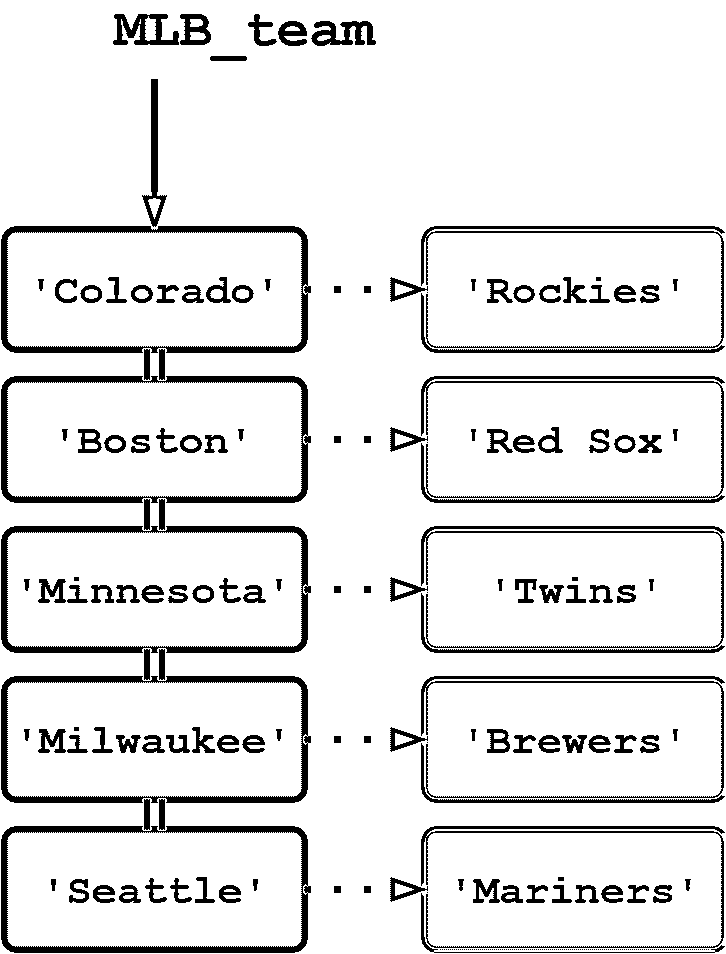

# Python 中的字典

> 原文：<https://realpython.com/python-dicts/>

*立即观看**本教程有真实 Python 团队创建的相关视频课程。和书面教程一起看，加深理解:[**Python 中的字典**](/courses/dictionaries-python/)

Python 提供了另一种复合[数据类型](https://realpython.com/python-data-types/)，称为**字典**，它类似于列表，因为它是对象的集合。

**在本教程中，您将学到以下内容:**您将了解 Python 字典的基本特征，并学习如何访问和管理字典数据。一旦您完成了本教程，您应该对什么时候使用字典是合适的数据类型以及如何使用有一个很好的认识。

字典和列表具有以下共同特征:

*   两者都是可变的。
*   两者都是动态的。它们可以根据需要增长和收缩。
*   两者都可以嵌套。一个列表可以包含另一个列表。一个字典可以包含另一个字典。字典也可以包含列表，反之亦然。

字典与列表的主要区别在于元素的访问方式:

*   通过索引，列表元素通过它们在列表中的位置被访问。
*   字典元素是通过键访问的。

***参加测验:****通过我们的交互式“Python 字典”测验来测试您的知识。完成后，您将收到一个分数，以便您可以跟踪一段时间内的学习进度:*

*[参加测验](/quizzes/python-dicts/)

## 定义字典

字典是 Python 对一种数据结构的实现，这种数据结构通常被称为关联数组。字典由一组键值对组成。每个键-值对都将键映射到其关联的值。

您可以通过用大括号(`{}`)括起一个逗号分隔的键值对列表来定义一个字典。冒号(`:`)将每个键与其相关值分开:

```py
d = {
    <key>: <value>,
    <key>: <value>,
      .
      .
      .
    <key>: <value>
}
```

下面定义了一个字典，该字典将一个位置映射到其对应的大联盟棒球队的名称:

>>>

```py
>>> MLB_team = {
...     'Colorado' : 'Rockies',
...     'Boston'   : 'Red Sox',
...     'Minnesota': 'Twins',
...     'Milwaukee': 'Brewers',
...     'Seattle'  : 'Mariners'
... }
```

[](https://files.realpython.com/media/t.b3e3d8f2d100.png)

<figcaption class="figure-caption text-center">Dictionary Mapping Location to MLB Team</figcaption>

还可以用内置的`dict()`函数构造一个字典。`dict()`的参数应该是一系列键值对。元组列表很适合这种情况:

```py
d = dict([
    (<key>, <value>),
    (<key>, <value),
      .
      .
      .
    (<key>, <value>)
])
```

`MLB_team`也可以这样定义:

>>>

```py
>>> MLB_team = dict([
...     ('Colorado', 'Rockies'),
...     ('Boston', 'Red Sox'),
...     ('Minnesota', 'Twins'),
...     ('Milwaukee', 'Brewers'),
...     ('Seattle', 'Mariners')
... ])
```

如果键值是简单的字符串，它们可以被指定为关键字参数。所以这里还有另一种定义`MLB_team`的方式:

>>>

```py
>>> MLB_team = dict(
...     Colorado='Rockies',
...     Boston='Red Sox',
...     Minnesota='Twins',
...     Milwaukee='Brewers',
...     Seattle='Mariners'
... )
```

一旦定义了字典，就可以显示它的内容，就像对列表一样。显示时，上面显示的所有三个定义如下所示:

>>>

```py
>>> type(MLB_team)
<class 'dict'>

>>> MLB_team
{'Colorado': 'Rockies', 'Boston': 'Red Sox', 'Minnesota': 'Twins',
'Milwaukee': 'Brewers', 'Seattle': 'Mariners'}
```

字典中的条目按照定义的顺序显示。但是，当涉及到检索它们时，这是无关紧要的。数字索引不能访问字典元素:

>>>

```py
>>> MLB_team[1]
Traceback (most recent call last):
  File "<pyshell#13>", line 1, in <module>
    MLB_team[1]
KeyError: 1
```

也许你仍然喜欢整理你的字典。如果是这种情况，那么看看对 Python 字典排序的[:值、键等等](https://realpython.com/sort-python-dictionary/)。

[*Remove ads*](/account/join/)

## 访问字典值

当然，字典元素必须以某种方式可访问。如果不是按索引获取，那怎么获取呢？

通过在方括号(`[]`)中指定相应的键，从字典中检索值:

>>>

```py
>>> MLB_team['Minnesota']
'Twins'
>>> MLB_team['Colorado']
'Rockies'
```

如果引用字典中没有的键，Python 会引发一个异常:

>>>

```py
>>> MLB_team['Toronto']
Traceback (most recent call last):
  File "<pyshell#19>", line 1, in <module>
    MLB_team['Toronto']
KeyError: 'Toronto'
```

将一个条目添加到现有的字典中只是分配一个新的键和值:

>>>

```py
>>> MLB_team['Kansas City'] = 'Royals'
>>> MLB_team
{'Colorado': 'Rockies', 'Boston': 'Red Sox', 'Minnesota': 'Twins',
'Milwaukee': 'Brewers', 'Seattle': 'Mariners', 'Kansas City': 'Royals'}
```

如果您想更新一个条目，只需为现有的键分配一个新值:

>>>

```py
>>> MLB_team['Seattle'] = 'Seahawks'
>>> MLB_team
{'Colorado': 'Rockies', 'Boston': 'Red Sox', 'Minnesota': 'Twins',
'Milwaukee': 'Brewers', 'Seattle': 'Seahawks', 'Kansas City': 'Royals'}
```

要删除一个条目，使用`del`语句，指定要删除的键:

>>>

```py
>>> del MLB_team['Seattle']
>>> MLB_team
{'Colorado': 'Rockies', 'Boston': 'Red Sox', 'Minnesota': 'Twins',
'Milwaukee': 'Brewers', 'Kansas City': 'Royals'}
```

走开，海鹰！你是一支 NFL 球队。

## 字典键与列表索引

您可能已经注意到，当使用未定义的键或数字索引访问字典时，解释器会引发相同的异常， [`KeyError`](https://realpython.com/python-keyerror/) :

>>>

```py
>>> MLB_team['Toronto']
Traceback (most recent call last):
  File "<pyshell#8>", line 1, in <module>
    MLB_team['Toronto']
KeyError: 'Toronto'

>>> MLB_team[1]
Traceback (most recent call last):
  File "<pyshell#9>", line 1, in <module>
    MLB_team[1]
KeyError: 1
```

其实也是同样的错误。在后一种情况下，`[1]`看起来像一个数字索引，但它不是。

在本教程的后面，您将看到任何[不可变](https://realpython.com/courses/immutability-python/)类型的对象都可以用作字典键。因此，没有理由不能使用整数:

>>>

```py
>>> d = {0: 'a', 1: 'b', 2: 'c', 3: 'd'}
>>> d
{0: 'a', 1: 'b', 2: 'c', 3: 'd'} 
>>> d[0]
'a'
>>> d[2]
'c'
```

在表达式`MLB_team[1]`、`d[0]`和`d[2]`中，方括号中的数字看起来好像是索引。但它们与词典中条目的顺序无关。Python 将它们解释为字典键。如果您以相反的顺序定义相同的字典，您仍然可以使用相同的键获得相同的值:

>>>

```py
>>> d = {3: 'd', 2: 'c', 1: 'b', 0: 'a'}
>>> d
{3: 'd', 2: 'c', 1: 'b', 0: 'a'} 
>>> d[0]
'a'
>>> d[2]
'c'
```

语法可能看起来很相似，但是你不能把字典当成一个列表:

>>>

```py
>>> type(d)
<class 'dict'>

>>> d[-1]
Traceback (most recent call last):
  File "<pyshell#30>", line 1, in <module>
    d[-1]
KeyError: -1

>>> d[0:2]
Traceback (most recent call last):
  File "<pyshell#31>", line 1, in <module>
    d[0:2]
TypeError: unhashable type: 'slice'

>>> d.append('e')
Traceback (most recent call last):
  File "<pyshell#32>", line 1, in <module>
    d.append('e')
AttributeError: 'dict' object has no attribute 'append'
```

**注意:**虽然对字典中条目的访问不依赖于顺序，但是 Python 确实保证了字典中条目的顺序被保留。当显示时，项目将按照它们被定义的顺序出现，并且通过键的迭代也将按照该顺序发生。添加到词典中的条目被添加到末尾。如果删除了项目，则保留其余项目的顺序。

你只能指望最近这种秩序的维护。它是作为 Python 语言规范的一部分添加到 3.7 版本的。然而，在 3.6 版本中也是如此——这是实现的偶然结果，但语言规范并不保证。

[*Remove ads*](/account/join/)

## 逐步建立字典

如上所示，如果您事先知道所有的键和值，那么使用花括号和一系列键-值对定义一个字典是很好的。但是，如果你想在飞行中建立一个字典呢？

您可以从创建一个空字典开始，它由空花括号指定。然后，您可以一次添加一个新的键和值:

>>>

```py
>>> person = {}
>>> type(person)
<class 'dict'>

>>> person['fname'] = 'Joe'
>>> person['lname'] = 'Fonebone'
>>> person['age'] = 51
>>> person['spouse'] = 'Edna'
>>> person['children'] = ['Ralph', 'Betty', 'Joey']
>>> person['pets'] = {'dog': 'Fido', 'cat': 'Sox'}
```

一旦以这种方式创建了字典，就可以像访问任何其他字典一样访问它的值:

>>>

```py
>>> person
{'fname': 'Joe', 'lname': 'Fonebone', 'age': 51, 'spouse': 'Edna',
'children': ['Ralph', 'Betty', 'Joey'], 'pets': {'dog': 'Fido', 'cat': 'Sox'}}

>>> person['fname']
'Joe'
>>> person['age']
51
>>> person['children']
['Ralph', 'Betty', 'Joey']
```

检索子列表或子字典中的值需要额外的索引或键:

>>>

```py
>>> person['children'][-1]
'Joey'
>>> person['pets']['cat']
'Sox'
```

这个例子展示了字典的另一个特性:字典中包含的值不需要是相同的类型。在`person`中，有些值是字符串，一个是整数，一个是列表，一个是另一个字典。

正如字典中的值不需要属于同一类型，键也不需要:

>>>

```py
>>> foo = {42: 'aaa', 2.78: 'bbb', True: 'ccc'}
>>> foo
{42: 'aaa', 2.78: 'bbb', True: 'ccc'}

>>> foo[42]
'aaa'
>>> foo[2.78]
'bbb'
>>> foo[True]
'ccc'
```

这里，一个键是整数，一个是浮点数，一个是[布尔](https://realpython.com/python-boolean/)。不清楚这将如何有用，但你永远不知道。

注意 Python 字典是多么的通用。在`MLB_team`中，为几个不同地理位置中的每一个保存相同的信息(棒球队名称)。另一方面，`person`为一个人存储不同类型的数据。

您可以将字典用于多种用途，因为对允许的键和值的限制很少。但是有一些。请继续阅读！

## 对字典键的限制

在 Python 中，几乎任何类型的值都可以用作字典键。您刚刚看到了这个例子，其中整数、浮点和布尔对象被用作键:

>>>

```py
>>> foo = {42: 'aaa', 2.78: 'bbb', True: 'ccc'}
>>> foo
{42: 'aaa', 2.78: 'bbb', True: 'ccc'}
```

您甚至可以使用内置对象，如类型和函数:

>>>

```py
>>> d = {int: 1, float: 2, bool: 3}
>>> d
{<class 'int'>: 1, <class 'float'>: 2, <class 'bool'>: 3}
>>> d[float]
2

>>> d = {bin: 1, hex: 2, oct: 3}
>>> d[oct]
3
```

但是，字典键必须遵守一些限制。

首先，给定的键在字典中只能出现一次。不允许重复的密钥。字典将每个键映射到一个对应的值，因此多次映射一个特定的键没有意义。

从上面可以看出，当您为一个已经存在的字典键赋值时，它不会再次添加该键，而是替换现有的值:

>>>

```py
>>> MLB_team = {
...     'Colorado' : 'Rockies',
...     'Boston'   : 'Red Sox',
...     'Minnesota': 'Twins',
...     'Milwaukee': 'Brewers',
...     'Seattle'  : 'Mariners'
... }

>>> MLB_team['Minnesota'] = 'Timberwolves'
>>> MLB_team
{'Colorado': 'Rockies', 'Boston': 'Red Sox', 'Minnesota': 'Timberwolves',
'Milwaukee': 'Brewers', 'Seattle': 'Mariners'}
```

同样，如果在字典的初始创建过程中第二次指定一个键，第二次出现的键将覆盖第一次出现的键:

>>>

```py
>>> MLB_team = {
...     'Colorado' : 'Rockies',
...     'Boston'   : 'Red Sox',
...     'Minnesota': 'Timberwolves',
...     'Milwaukee': 'Brewers',
...     'Seattle'  : 'Mariners',
...     'Minnesota': 'Twins'
... }
>>> MLB_team
{'Colorado': 'Rockies', 'Boston': 'Red Sox', 'Minnesota': 'Twins',
'Milwaukee': 'Brewers', 'Seattle': 'Mariners'}
```

滚吧，森林狼！你是一支 NBA 球队。算是吧。

其次，字典键必须是不可变的类型。您已经看到了一些例子，在这些例子中，您所熟悉的几种不可变类型——整型、浮点型、字符串型和布尔型——被用作字典键。

元组也可以是字典键，因为元组是不可变的:

>>>

```py
>>> d = {(1, 1): 'a', (1, 2): 'b', (2, 1): 'c', (2, 2): 'd'}
>>> d[(1,1)]
'a'
>>> d[(2,1)]
'c'
```

(回想一下关于[元组](https://realpython.com/python-lists-tuples/#defining-and-using-tuples)的讨论，使用元组而不是列表的一个基本原理是存在需要不可变类型的情况。这是其中之一。)

但是，列表和另一个字典都不能作为字典键，因为列表和字典是可变的:

>>>

```py
>>> d = {[1, 1]: 'a', [1, 2]: 'b', [2, 1]: 'c', [2, 2]: 'd'}
Traceback (most recent call last):
  File "<pyshell#20>", line 1, in <module>
    d = {[1, 1]: 'a', [1, 2]: 'b', [2, 1]: 'c', [2, 2]: 'd'}
TypeError: unhashable type: 'list'
```

**技术说明:**为什么错误信息说“不可修”？

从技术上讲，说一个对象必须是不可变的才能用作字典键是不太正确的。更准确地说，一个对象必须是 [hashable](https://docs.python.org/3/glossary.html#term-hashable) ，这意味着它可以被传递给一个散列函数。一个[散列函数](https://realpython.com/python-hash-table/#understand-the-hash-function)获取任意大小的数据，并将其映射到一个相对简单的固定大小的值，称为**散列值**(或简称为 hash)，用于表查找和比较。

Python 的内置`hash()`函数返回可散列对象的散列值，并为不可散列对象引发异常:

>>>

```py
>>> hash('foo')
11132615637596761

>>> hash([1, 2, 3])
Traceback (most recent call last):
  File "<stdin>", line 1, in <module>
TypeError: unhashable type: 'list'
```

到目前为止，您已经了解的所有内置不可变类型都是可哈希的，而可变容器类型(列表和字典)则不是。因此，就目前的目的而言，你可以认为 hashable 和 immutable 差不多是同义词。

在以后的教程中，你会遇到可变的对象，它们也是可散列的。

[*Remove ads*](/account/join/)

## 对字典值的限制

相比之下，对字典值没有限制。实际上一点也没有。字典值可以是 Python 支持的任何类型的对象，包括可变类型，如列表和字典，以及用户定义的对象，您将在接下来的教程中了解这些内容。

对于特定值在字典中多次出现也没有限制:

>>>

```py
>>> d = {0: 'a', 1: 'a', 2: 'a', 3: 'a'}
>>> d
{0: 'a', 1: 'a', 2: 'a', 3: 'a'}
>>> d[0] == d[1] == d[2]
True
```

## 运算符和内置函数

您已经熟悉了许多可用于[字符串](https://realpython.com/python-strings)、[列表](https://realpython.com/python-lists-tuples/#python-lists)和[元组](https://realpython.com/python-lists-tuples/#python-tuples)的操作符和内置函数。其中一些也适用于字典。

例如，`in`和`not in`运算符根据指定的操作数在字典中是否作为关键字出现，返回`True`或`False`:

>>>

```py
>>> MLB_team = {
...     'Colorado' : 'Rockies',
...     'Boston'   : 'Red Sox',
...     'Minnesota': 'Twins',
...     'Milwaukee': 'Brewers',
...     'Seattle'  : 'Mariners'
... }

>>> 'Milwaukee' in MLB_team
True
>>> 'Toronto' in MLB_team
False
>>> 'Toronto' not in MLB_team
True
```

当试图访问一个不在字典中的键时，可以使用`in`操作符和短路评估来避免产生错误:

>>>

```py
>>> MLB_team['Toronto']
Traceback (most recent call last):
  File "<pyshell#2>", line 1, in <module>
    MLB_team['Toronto']
KeyError: 'Toronto'

>>> 'Toronto' in MLB_team and MLB_team['Toronto']
False
```

第二种情况，由于短路求值，表达式`MLB_team['Toronto']`不求值，所以`KeyError`异常不会发生。

`len()`函数返回字典中键值对的数量:

>>>

```py
>>> MLB_team = {
...     'Colorado' : 'Rockies',
...     'Boston'   : 'Red Sox',
...     'Minnesota': 'Twins',
...     'Milwaukee': 'Brewers',
...     'Seattle'  : 'Mariners'
... }
>>> len(MLB_team)
5
```

## 内置字典方法

与字符串和列表一样，有几个可以在字典上调用的内置方法。事实上，在某些情况下，list 和 dictionary 方法共享相同的名称。(在关于面向对象编程的讨论中，您将看到不同类型拥有相同名称的方法是完全可以接受的。)

以下是适用于词典的方法概述:

### `d.clear()`

> 清除字典。

`d.clear()`清空字典`d`中的所有键值对:

>>>

```py
>>> d = {'a': 10, 'b': 20, 'c': 30}
>>> d
{'a': 10, 'b': 20, 'c': 30}

>>> d.clear()
>>> d
{}
```

[*Remove ads*](/account/join/)

### `d.get(<key>[, <default>])`

> 如果字典中存在某个键值，则返回该键值。

Python dictionary `.get()`方法提供了一种从字典中获取键值的便捷方式，无需提前检查键是否存在，也不会引发错误。

`d.get(<key>)`在字典`d`中搜索`<key>`，如果找到则返回相关值。如果没有找到`<key>`，则返回`None`:

>>>

```py
>>> d = {'a': 10, 'b': 20, 'c': 30}

>>> print(d.get('b'))
20
>>> print(d.get('z'))
None
```

如果没有找到`<key>`并且指定了可选的`<default>`参数，则返回该值而不是`None`:

>>>

```py
>>> print(d.get('z', -1))
-1
```

### `d.items()`

> 返回字典中的键值对列表。

`d.items()`返回包含`d`中键值对的元组列表。每个元组中的第一项是键，第二项是键值:

>>>

```py
>>> d = {'a': 10, 'b': 20, 'c': 30}
>>> d
{'a': 10, 'b': 20, 'c': 30}

>>> list(d.items())
[('a', 10), ('b', 20), ('c', 30)]
>>> list(d.items())[1][0]
'b'
>>> list(d.items())[1][1]
20
```

### `d.keys()`

> 返回字典中的键列表。

`d.keys()`返回`d`中所有键的列表:

>>>

```py
>>> d = {'a': 10, 'b': 20, 'c': 30}
>>> d
{'a': 10, 'b': 20, 'c': 30}

>>> list(d.keys())
['a', 'b', 'c']
```

### `d.values()`

> 返回字典中的值列表。

`d.values()`返回`d`中所有值的列表:

>>>

```py
>>> d = {'a': 10, 'b': 20, 'c': 30}
>>> d
{'a': 10, 'b': 20, 'c': 30}

>>> list(d.values())
[10, 20, 30]
```

`d`中的任何重复值都将按照出现的次数返回:

>>>

```py
>>> d = {'a': 10, 'b': 10, 'c': 10}
>>> d
{'a': 10, 'b': 10, 'c': 10}

>>> list(d.values())
[10, 10, 10]
```

**技术提示:**`.items()`、`.keys()`和`.values()`方法实际上返回了一个叫做**视图对象**的东西。字典视图对象或多或少类似于键和值的窗口。出于实用目的，您可以将这些方法视为返回字典的键和值的列表。

[*Remove ads*](/account/join/)

### `d.pop(<key>[, <default>])`

> 从字典中移除一个键(如果存在)，并返回它的值。

如果`d`中存在`<key>`，`d.pop(<key>)`移除`<key>`并返回其相关值:

>>>

```py
>>> d = {'a': 10, 'b': 20, 'c': 30}

>>> d.pop('b')
20
>>> d
{'a': 10, 'c': 30}
```

如果`<key>`不在`d`中，则`d.pop(<key>)`引发`KeyError`异常:

>>>

```py
>>> d = {'a': 10, 'b': 20, 'c': 30}

>>> d.pop('z')
Traceback (most recent call last):
  File "<pyshell#4>", line 1, in <module>
    d.pop('z')
KeyError: 'z'
```

如果`<key>`不在`d`中，并且指定了可选的`<default>`参数，则返回该值，并且不引发异常:

>>>

```py
>>> d = {'a': 10, 'b': 20, 'c': 30}
>>> d.pop('z', -1)
-1
>>> d
{'a': 10, 'b': 20, 'c': 30}
```

### `d.popitem()`

> 从字典中移除键值对。

`d.popitem()`删除从`d`添加的最后一个键-值对，并将其作为元组返回:

>>>

```py
>>> d = {'a': 10, 'b': 20, 'c': 30}

>>> d.popitem()
('c', 30)
>>> d
{'a': 10, 'b': 20}

>>> d.popitem()
('b', 20)
>>> d
{'a': 10}
```

如果`d`为空，`d.popitem()`会引发`KeyError`异常:

>>>

```py
>>> d = {}
>>> d.popitem()
Traceback (most recent call last):
  File "<pyshell#11>", line 1, in <module>
    d.popitem()
KeyError: 'popitem(): dictionary is empty'
```

**注意:**在低于 3.6 的 Python 版本中，`popitem()`将返回一个任意(随机)的键值对，因为 [Python 字典在 3.6 版本之前是无序的](https://realpython.com/iterate-through-dictionary-python/)。

### `d.update(<obj>)`

> 将一个字典与另一个字典或键值对的 iterable 合并。

如果`<obj>`是字典，`d.update(<obj>)`将`<obj>`中的条目合并到`d`中。对于`<obj>`中的每个键:

*   如果键不在`d`中，来自`<obj>`的键-值对被添加到`d`。
*   如果密钥已经存在于`d`中，则该密钥在`d`中的相应值被更新为来自`<obj>`的值。

以下示例显示了两个字典合并在一起的情况:

>>>

```py
>>> d1 = {'a': 10, 'b': 20, 'c': 30}
>>> d2 = {'b': 200, 'd': 400}

>>> d1.update(d2)
>>> d1
{'a': 10, 'b': 200, 'c': 30, 'd': 400}
```

在这个例子中，键`'b'`已经存在于`d1`中，所以它的值被更新为`200`，即来自`d2`的那个键的值。但是`d1`中没有键`'d'`，所以从`d2`开始添加键-值对。

`<obj>`也可以是一系列的键值对，类似于使用`dict()`函数定义字典。例如，`<obj>`可以被指定为元组列表:

>>>

```py
>>> d1 = {'a': 10, 'b': 20, 'c': 30}
>>> d1.update([('b', 200), ('d', 400)])
>>> d1
{'a': 10, 'b': 200, 'c': 30, 'd': 400}
```

或者，要合并的值可以指定为关键字参数列表:

>>>

```py
>>> d1 = {'a': 10, 'b': 20, 'c': 30}
>>> d1.update(b=200, d=400)
>>> d1
{'a': 10, 'b': 200, 'c': 30, 'd': 400}
```

[*Remove ads*](/account/join/)

## 结论

在本教程中，您了解了 Python **字典**的基本属性，并学习了如何访问和操作字典数据。

**列表**和**字典**是最常用的两种 Python 类型。正如您所看到的，它们有几个相似之处，但是在元素的访问方式上有所不同。列表元素通过基于顺序的数字索引来访问，字典元素通过键来访问

由于这种差异，列表和字典往往适合不同的环境。你现在应该有一个很好的感觉，如果有的话，对于一个给定的情况是最好的。

接下来，您将了解 Python **集合**。集合是另一种复合数据类型，但它与列表或字典有很大不同。

***参加测验:****通过我们的交互式“Python 字典”测验来测试您的知识。完成后，您将收到一个分数，以便您可以跟踪一段时间内的学习进度:*

*[参加测验](/quizzes/python-dicts/)*

*[« Lists and Tuples in Python](https://realpython.com/python-lists-tuples/)[Dictionaries in Python](#)[Sets in Python »](https://realpython.com/python-sets/)

*立即观看**本教程有真实 Python 团队创建的相关视频课程。和书面教程一起看，加深理解:[**Python 中的字典**](/courses/dictionaries-python/)**********