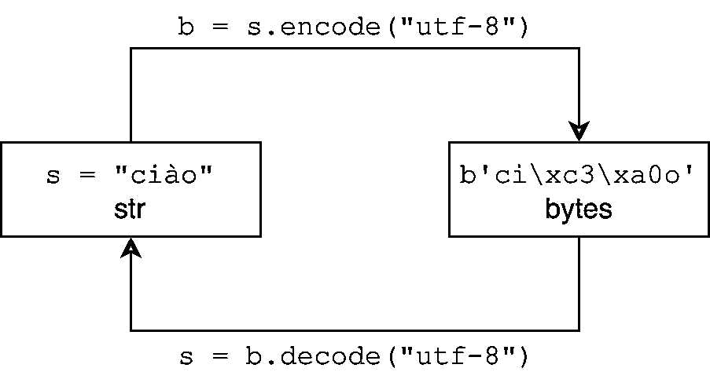

# Python 中的 Unicode 和字符编码:轻松指南

> 原文：<https://realpython.com/python-encodings-guide/>

*立即观看**本教程有真实 Python 团队创建的相关视频课程。和书面教程一起看，加深理解:[**Python 中的 Unicode:使用字符编码**](/courses/python-unicode/)

用 Python 或任何其他语言处理字符编码有时看起来很痛苦。像栈溢出这样的地方有成千上万的问题，这些问题源于对像`UnicodeDecodeError`和`UnicodeEncodeError`这样的异常的混淆。本教程旨在消除`Exception`的迷雾，说明在 Python 3 中处理文本和二进制数据是一种流畅的体验。Python 的 Unicode 支持很强大，但是需要一些时间来掌握。

本教程是不同的，因为它不是语言不可知的，而是有意以 Python 为中心的。你仍然会得到一本与语言无关的初级读本，但是你将会深入到 Python 中的插图中，将文本段落保持在最少。您将看到如何在实时 Python 代码中使用字符编码的概念。

**本教程结束时，您将:**

*   获取字符编码和编号系统的概念性概述
*   理解编码是如何与 Python 的`str`和`bytes`一起发挥作用的
*   了解 Python 中通过各种形式的`int`文字对编号系统的支持
*   熟悉 Python 中与字符编码和编号系统相关的内置函数

字符编码和编号系统是如此紧密地联系在一起，以至于它们需要在同一个教程中讨论，否则对其中任何一个的讨论都是不充分的。

**注意**:本文以 Python 3 为中心。具体来说，本教程中的所有代码示例都是从 CPython 3.7.2 shell 中生成的，尽管 Python 3 的所有次要版本在处理文本时应该(大部分)表现相同。

如果您仍在使用 Python 2，并且被 Python 2 和 Python 3 处理文本和二进制数据的不同所吓倒，那么希望本教程能帮助您做出改变。

**免费下载:** [从 Python 技巧中获取一个示例章节:这本书](https://realpython.com/bonus/python-tricks-sample-pdf/)用简单的例子向您展示了 Python 的最佳实践，您可以立即应用它来编写更漂亮的+Python 代码。

## 什么是字符编码？

即使没有数百种字符编码，也有数十种。开始理解它们是什么的最好方法是了解最简单的字符编码之一，ASCII。

无论您是自学还是有正式的计算机科学背景，您都有可能见过一两次 ASCII 表。ASCII 是开始学习字符编码的一个好地方，因为它是一种小型的封闭编码。(事实证明，太小了。)

它包括以下内容:

*   **小写英文字母** : *a* 到 *z*
*   **大写英文字母** : *A* 到 *Z*
*   **一些标点符号** : `"$"`和`"!"`，举几个例子
*   **空白字符**:一个实际的空格(`" "`)，以及换行符、回车符、水平制表符、垂直制表符和其他一些字符
*   **一些不可打印的字符**:比如退格键、`"\b"`这样的字符，它们不能像字母 *A* 那样逐字打印

那么字符编码更正式的定义是什么呢？

在很高的层次上，它是一种将字符(如字母、标点、符号、空白和控制字符)转换成整数并最终转换成位的方法。每个字符可以被编码成一个独特的位序列。如果您对位的概念不确定，也不要担心，因为我们很快就会谈到它们。

概述的各种类别代表字符组。每个单个字符都有一个对应的**码位**，你可以把它想象成只是一个整数。在 ASCII 表中，字符被分成不同的范围:

| 代码点范围 | 班级 |
| --- | --- |
| 0 到 31 | 控制/不可打印字符 |
| 32 岁到 64 岁 | 标点符号、符号、数字和空格 |
| 65 到 90 岁 | 大写英文字母 |
| 91 到 96 | 额外的字素，如`[`和`\` |
| 97 到 122 | 小写英文字母 |
| 123 到 126 | 额外的字素，如`{`和`&#124;` |
| One hundred and twenty-seven | 控制/不可打印字符(`DEL`) |

整个 ASCII 表包含 128 个字符。这个表捕获了 ASCII 允许的完整的**字符集**。如果您在这里看不到某个字符，那么在 ASCII 编码方案下，您根本无法将其表示为打印文本。


| 码点 | 人物(姓名) | 码点 | 人物(姓名) |
| --- | --- | --- | --- |
| Zero | null_ null) | Sixty-four | `@` |
| one | SOH(标题开始) | Sixty-five | `A` |
| Two | STX(文本开始) | Sixty-six | `B` |
| three | ETX(文末) | Sixty-seven | `C` |
| four | 传输结束 | sixty-eight | `D` |
| five | ENQ(询问) | sixty-nine | `E` |
| six | ACK(确认) | Seventy | `F` |
| seven | 贝尔 | Seventy-one | `G` |
| eight | 退格键 | seventy-two | `H` |
| nine | HT(水平制表符) | Seventy-three | `I` |
| Ten | 换行 | Seventy-four | `J` |
| Eleven | 垂直标签 | Seventy-five | `K` |
| Twelve | 换页 | Seventy-six | `L` |
| Thirteen | 回车符 | Seventy-seven | `M` |
| Fourteen | 所以(移出) | seventy-eight | `N` |
| Fifteen | SI(移入) | Seventy-nine | `O` |
| Sixteen | DLE(数据链路转义) | Eighty | `P` |
| Seventeen | DC1(设备控制 1) | Eighty-one | `Q` |
| Eighteen | DC2(设备控制 2) | Eighty-two | `R` |
| Nineteen | DC3(设备控制 3) | Eighty-three | `S` |
| Twenty | DC4(设备控制 4) | Eighty-four | `T` |
| Twenty-one | 否定确认 | eighty-five | `U` |
| Twenty-two | 同步空闲 | Eighty-six | `V` |
| Twenty-three | ETB(传输块结束) | Eighty-seven | `W` |
| Twenty-four | 可以(取消) | Eighty-eight | `X` |
| Twenty-five | EM(媒体结束) | eighty-nine | `Y` |
| Twenty-six | SUB(替代) | Ninety | `Z` |
| Twenty-seven | ESC(退出) | Ninety-one | `[` |
| Twenty-eight | 文件分隔符 | Ninety-two | `\` |
| Twenty-nine | 组分隔符 | Ninety-three | `]` |
| Thirty | 记录分隔符 | Ninety-four | `^` |
| Thirty-one | 美国(单位分隔符) | Ninety-five | `_` |
| Thirty-two | 警司(空间) | Ninety-six | ```py
 |
| Thirty-three | `!` | Ninety-seven | `a` |
| Thirty-four | `"` | Ninety-eight | `b` |
| Thirty-five | `#` | Ninety-nine | `c` |
| Thirty-six | `$` | One hundred | `d` |
| Thirty-seven | `%` | One hundred and one | `e` |
| Thirty-eight | `&` | One hundred and two | `f` |
| Thirty-nine | `'` | One hundred and three | `g` |
| Forty | `(` | One hundred and four | `h` |
| Forty-one | `)` | One hundred and five | `i` |
| forty-two | `*` | One hundred and six | `j` |
| Forty-three | `+` | One hundred and seven | `k` |
| forty-four | `,` | One hundred and eight | `l` |
| Forty-five | `-` | One hundred and nine | `m` |
| Forty-six | `.` | One hundred and ten | `n` |
| Forty-seven | `/` | One hundred and eleven | `o` |
| Forty-eight | `0` | One hundred and twelve | `p` |
| forty-nine | `1` | One hundred and thirteen | `q` |
| Fifty | `2` | One hundred and fourteen | `r` |
| Fifty-one | `3` | One hundred and fifteen | `s` |
| fifty-two | `4` | One hundred and sixteen | `t` |
| Fifty-three | `5` | One hundred and seventeen | `u` |
| Fifty-four | `6` | One hundred and eighteen | `v` |
| Fifty-five | `7` | One hundred and nineteen | `w` |
| fifty-six | `8` | One hundred and twenty | `x` |
| Fifty-seven | `9` | One hundred and twenty-one | `y` |
| Fifty-eight | `:` | One hundred and twenty-two | `z` |
| Fifty-nine | `;` | One hundred and twenty-three | `{` |
| Sixty | `<` | One hundred and twenty-four | `&#124;` |
| Sixty-one | `=` | One hundred and twenty-five | `}` |
| Sixty-two | `>` | One hundred and twenty-six | `~` |
| Sixty-three | `?` | One hundred and twenty-seven | 删除 |

[*Remove ads*](/account/join/)

### `string`模块

Python 的`string`模块是 ASCII 字符集中的[字符串](https://realpython.com/python-strings/)常量的便捷一站式商店。

以下是该模块的核心部分:

```
# From lib/python3.7/string.py

whitespace = ' \t\n\r\v\f'
ascii_lowercase = 'abcdefghijklmnopqrstuvwxyz'
ascii_uppercase = 'ABCDEFGHIJKLMNOPQRSTUVWXYZ'
ascii_letters = ascii_lowercase + ascii_uppercase
digits = '0123456789'
hexdigits = digits + 'abcdef' + 'ABCDEF'
octdigits = '01234567'
punctuation = r"""!"#$%&'()*+,-./:;<=>?@[\]^_`{|}~"""
printable = digits + ascii_letters + punctuation + whitespace
```py

这些常量中的大多数应该在它们的标识符名称中是自文档化的。我们将很快介绍什么是`hexdigits`和`octdigits`。

您可以在日常字符串操作中使用这些常量:

>>>

```
>>> import string

>>> s = "What's wrong with ASCII?!?!?"
>>> s.rstrip(string.punctuation)
'What's wrong with ASCII'
```py

**注** : `string.printable`包括所有的`string.whitespace`。这与另一种测试字符是否可打印的方法略有不同，即`str.isprintable()`，它会告诉你`{'\v', '\n', '\r', '\f', '\t'}`都不可打印。

细微的差别是因为定义:`str.isprintable()`认为一些东西是可打印的，如果“它的所有字符在`repr()`中都被认为是可打印的。”

### 稍微复习一下

现在是对第**位**进行简短复习的好时机，这是计算机知道的最基本的信息单位。

一个比特是一个只有两种可能状态的信号。象征性地表示一个比特有不同的方式，都表示同一件事:

*   0 或 1
*   “是”还是“不是”
*   `True`或`False`
*   “开”或“关”

上一节中的 ASCII 表使用了我们称之为[的数字](https://realpython.com/python-numbers/) (0 到 127)，但更准确的说法是十进制数字。

您也可以用一系列位(以 2 为基数)来表示这些以 10 为基数的数字。以下是十进制中 0 到 10 的二进制版本:

| 小数 | 二进制(紧凑) | 二进制(填充形式) |
| --- | --- | --- |
| Zero | Zero | 00000000 |
| one | one | 00000001 |
| Two | Ten | 00000010 |
| three | Eleven | 00000011 |
| four | One hundred | 00000100 |
| five | One hundred and one | 00000101 |
| six | One hundred and ten | 00000110 |
| seven | One hundred and eleven | 00000111 |
| eight | One thousand | 00001000 |
| nine | One thousand and one | 00001001 |
| Ten | One thousand and ten | 00001010 |

请注意，随着十进制数 *n* 的增加，您需要更多的 [**有效位**](https://chortle.ccsu.edu/AssemblyTutorial/Chapter-14/ass14_4.html) 来表示一直到并包括该数的字符集。

这里有一种在 Python 中将 ASCII 字符串表示为位序列的简便方法。ASCII 字符串中的每个字符都被伪编码为 8 位，8 位序列之间有空格，每个空格代表一个字符:

>>>

```
>>> def make_bitseq(s: str) -> str:
...     if not s.isascii():
...         raise ValueError("ASCII only allowed")
...     return " ".join(f"{ord(i):08b}" for i in s)

>>> make_bitseq("bits")
'01100010 01101001 01110100 01110011'

>>> make_bitseq("CAPS")
'01000011 01000001 01010000 01010011'

>>> make_bitseq("$25.43")
'00100100 00110010 00110101 00101110 00110100 00110011'

>>> make_bitseq("~5")
'01111110 00110101'
```py

**注意** : `.isascii()`是在 Python 3.7 中引入的。

[f 字符串](https://realpython.com/python-f-strings/) `f"{ord(i):08b}"`使用 Python 的[格式规范迷你语言](https://docs.python.org/3/library/string.html#formatspec)，这是一种为格式字符串中的替换字段指定格式的方式:

*   冒号左边的`ord(i)`是实际的对象，其值将被格式化并插入到输出中。使用 Python `ord()`函数可以为单个`str`字符提供以 10 为基数的码位。

*   冒号的右边是格式说明符。`08`表示*宽度 8，0 填充*，`b`作为符号输出以 2 为基数的结果数(二进制)。

这个技巧主要是为了好玩，对于任何你在 ASCII 表中看不到的字符，它都会非常失败。稍后我们将讨论其他编码如何解决这个问题。

[*Remove ads*](/account/join/)

### 我们需要更多的钻头！

有一个至关重要的公式与 bit 的定义有关。给定比特数 *n* ，可以用 *n* 比特表示的不同可能值的数量是*2<sup>n</sup>T7:*

```
def n_possible_values(nbits: int) -> int:
    return 2 ** nbits
```py

这意味着:

*   1 bit 会让你表达 *2 <sup>1</sup> == 2* 可能的值。
*   8 位将让你表达 *2 <sup>8</sup> == 256* 可能的值。
*   64 位会让你表达*2<sup>64</sup>= = 18446744073709551616*个可能值。

这个公式有一个推论:给定一个不同的可能值的范围，我们如何找到这个范围被完全表示所需的位数， *n* ？你要解的是方程 *2 <sup>n</sup> = x* 中的 *n* (这里你已经知道 *x* )。

结果是这样的:

>>>

```
>>> from math import ceil, log

>>> def n_bits_required(nvalues: int) -> int:
...     return ceil(log(nvalues) / log(2))

>>> n_bits_required(256)
8
```py

您需要在`n_bits_required()`中使用上限的原因是考虑到不是 2 的纯幂的值。假设您需要存储总共 110 个字符的字符集。天真的说，这个应该取`log(110) / log(2) == 6.781`位，但是没有 0.781 位这种东西。110 个值将需要 7 位，而不是 6 位，最后的槽是不需要的:

>>>

```
>>> n_bits_required(110)
7
```py

所有这些都证明了一个概念:严格来说，ASCII 是一种 7 位代码。您在上面看到的 ASCII 表包含 128 个代码点和字符，从 0 到 127，包括 0 和 127。这需要 7 位:

>>>

```
>>> n_bits_required(128)  # 0 through 127
7
>>> n_possible_values(7)
128
```py

这个问题是，现代计算机在 7 位插槽中存储的东西不多。它们以 8 位为单位进行通信，通常称为一个**字节**。

注意:在整个教程中，我假设一个字节指的是 8 位，从 20 世纪 60 年代开始就是这样，而不是其他存储单位。如果你愿意，你可以称之为 [*八位字节*](https://en.wikipedia.org/wiki/Octet_(computing)) 。

这意味着 ASCII 使用的存储空间有一半是空的。如果不清楚这是为什么，回想一下上面的十进制到二进制表。你*可以*只用 1 位表示数字 0 和 1，也可以用 8 位分别表示为 00000000 和 00000001。

你*可以*只用 2 位表示数字 0 到 3，或者 00 到 11，或者你可以用 8 位分别表示为 00000000，00000001，00000010，0000011。最高的 ASCII 码位 127 只需要 7 个有效位。

了解了这一点，您可以看到`make_bitseq()`将 ASCII 字符串转换成字节的`str`表示，其中每个字符消耗一个字节:

>>>

```
>>> make_bitseq("bits")
'01100010 01101001 01110100 01110011'
```py

ASCII 没有充分利用现代计算机提供的 8 位字节，导致了一系列相互冲突的非正式编码，每个编码都指定了附加字符，用于 8 位字符编码方案中允许的剩余 128 个可用码位。

这些不同的编码不仅相互冲突，而且每一种编码本身仍然是世界字符的一个非常不完整的表示，尽管它们使用了一个额外的位。

多年来，一个字符编码的大计划开始统治他们。然而，在我们到达那里之前，让我们花一点时间谈谈编号系统，它是字符编码方案的基础。

[*Remove ads*](/account/join/)

## 涵盖所有基数:其他数系

在上面关于 ASCII 的讨论中，您看到了每个字符都映射到 0 到 127 范围内的一个整数。

这个数字范围用十进制表示(基数为 10)。这是你、我和我们人类习惯的数数方式，没有比我们有 10 个手指更复杂的原因。

但是在整个 [CPython 源代码](https://realpython.com/cpython-source-code-guide/)中，还有其他特别流行的编号系统。虽然“基本数字”是相同的，但所有的编号系统只是表示相同数字的不同方式。

如果我问你字符串`"11"`代表什么数字，你会奇怪地看我一眼，然后回答它代表 11。

但是，这种字符串表示可以在不同的编号系统中表示不同的基础数字。除了十进制之外，还有以下几种常用的计数系统:

*   **二进制**:基数 2
*   **八进制**:基数 8
*   **Hexadecimal (hex)** : base 16

但是如果我们说，在一个特定的计数系统中，数字是用基数 *N* 来表示的，这又意味着什么呢？

这是我所知道的最好的方式来表达这个意思:它是你在那个系统中可以指望的手指的数量。

如果你想要一个更全面但仍然温和的编号系统介绍，查尔斯·佩佐德的 [*代码*](https://realpython.com/asins/073560505X/) 是一本非常酷的书，详细探讨了计算机代码的基础。

演示不同的编号系统如何解释同一事物的一种方法是使用 Python 的`int()`构造函数。如果您[将一个`str`传递给`int()`](https://realpython.com/convert-python-string-to-int/) ，Python 将默认假定该字符串表示一个基数为 10 的数字，除非您另外告诉它:

>>>

```
>>> int('11')
11
>>> int('11', base=10)  # 10 is already default
11
>>> int('11', base=2)  # Binary
3
>>> int('11', base=8)  # Octal
9
>>> int('11', base=16)  # Hex
17
```py

有一种更常见的方法告诉 Python 你的整数是以 10 以外的基数输入的。Python 接受上述三种可选编号系统中每一种的**文字**形式:

| 文字类型 | 前缀 | 例子 |
| --- | --- | --- |
| 不适用的 | 不适用的 | `11` |
| 二进制文字 | `0b`或`0B` | `0b11` |
| 八进制文字 | `0o`或`0O` | `0o11` |
| 十六进制文字 | `0x`或`0X` | `0x11` |

所有这些都是**整数文字**的子形式。您可以看到，这两个函数分别产生了与使用非默认的`base`值调用`int()`相同的结果。它们都只是`int`地巨蟒:

>>>

```
>>> 11
11
>>> 0b11  # Binary literal
3
>>> 0o11  # Octal literal
9
>>> 0x11  # Hex literal
17
```py

以下是如何输入十进制数字 0 到 20 的二进制、八进制和十六进制的等价形式。所有这些在 Python 解释器外壳或源代码中都是完全有效的，并且都属于类型`int`:

| 小数 | 二进制的 | 八进制的 | 十六进制 |
| --- | --- | --- | --- |
| `0` | `0b0` | `0o0` | `0x0` |
| `1` | `0b1` | `0o1` | `0x1` |
| `2` | `0b10` | `0o2` | `0x2` |
| `3` | `0b11` | `0o3` | `0x3` |
| `4` | `0b100` | `0o4` | `0x4` |
| `5` | `0b101` | `0o5` | `0x5` |
| `6` | `0b110` | `0o6` | `0x6` |
| `7` | `0b111` | `0o7` | `0x7` |
| `8` | `0b1000` | `0o10` | `0x8` |
| `9` | `0b1001` | `0o11` | `0x9` |
| `10` | `0b1010` | `0o12` | `0xa` |
| `11` | `0b1011` | `0o13` | `0xb` |
| `12` | `0b1100` | `0o14` | `0xc` |
| `13` | `0b1101` | `0o15` | `0xd` |
| `14` | `0b1110` | `0o16` | `0xe` |
| `15` | `0b1111` | `0o17` | `0xf` |
| `16` | `0b10000` | `0o20` | `0x10` |
| `17` | `0b10001` | `0o21` | `0x11` |
| `18` | `0b10010` | `0o22` | `0x12` |
| `19` | `0b10011` | `0o23` | `0x13` |
| `20` | `0b10100` | `0o24` | `0x14` |


令人惊讶的是，这些表达式在 Python 标准库中如此普遍。如果您想亲自查看，请导航到您的`lib/python3.7/`目录所在的位置，并查看十六进制文字的用法，如下所示:

```
$ grep -nri --include "*\.py" -e "\b0x" lib/python3.7
```py

这应该可以在任何安装了`grep`的 Unix 系统上运行。您可以使用`"\b0o"`来搜索八进制文本，或者使用“\b0b”来搜索二进制文本。

使用这些替代的`int`字面语法的理由是什么？简而言之，是因为 2、8、16 都是 2 的幂，而 10 不是。这三种交替的数字系统偶尔提供了一种以计算机友好的方式表达数值的方法。例如，数字 65536 或*2<sup>16</sup>T5，只是十六进制的 10000，或作为 Python 十六进制文字的`0x10000`。*

[*Remove ads*](/account/join/)

## 输入 Unicode

正如您所看到的，ASCII 的问题是它不是一个足够大的字符集来容纳世界上的语言、方言、符号和字形。(光是英语[都不够大](https://en.wikipedia.org/wiki/English_terms_with_diacritical_marks)。)

Unicode 基本上与 ASCII 服务于相同的目的，但是它只是包含了一个更大的代码点集合。有一些编码是按时间顺序出现在 ASCII 和 Unicode 之间的，但它们现在还不值得一提，因为 Unicode 和它的编码方案之一 UTF-8 已经被广泛使用。

可以把 Unicode 想象成一个庞大的 ASCII 表——它有 1，114，112 个可能的代码点。也就是 0 到 1，114，111，或者 0 到 *17 * (2 <sup>16</sup> ) - 1* ，或者`0x10ffff`十六进制。事实上，ASCII 是 Unicode 的完美子集。Unicode 表中的前 128 个字符与您合理预期的 ASCII 字符完全对应。

为了技术上的精确起见， **Unicode 本身是*而不是*编码**。相反，Unicode 是由不同的字符编码实现的，您很快就会看到。Unicode 最好被认为是一个映射(类似于`dict`)或一个两列数据库表。它将字符(如`"a"`、`"¢"`，甚至`"ቈ"`)映射到不同的正整数。字符编码需要提供更多的功能。

Unicode 包含了几乎所有你能想到的字符，还包括其他不可打印的字符。我最喜欢的一个是讨厌的从右到左标记，它的代码点是 8207，用于从左到右和从右到左语言脚本的文本中，例如同时包含英语和阿拉伯语段落的文章。

**注意:**字符编码的世界是一些人喜欢挑剔的许多精细技术细节之一。一个这样的细节是，由于[一些古老的原因](https://www.quora.com/How-do-you-determine-how-many-characters-Unicode-can-store)，只有 1111998 个 Unicode 码点实际上是可用的。

### Unicode vs UTF-8

没过多久，人们就意识到，世界上所有的字符都不能装进一个字节。很明显，现代的、更全面的编码需要使用多个字节来编码一些字符。

您在上面也看到了，从技术上讲，Unicode 不是一种成熟的字符编码。这是为什么呢？

Unicode 没有告诉您一件事:它没有告诉您如何从文本中获取实际的位—只是代码点。它没有告诉您如何将文本转换为二进制数据，反之亦然。

Unicode 是一种抽象编码标准，而不是编码。这就是 UTF 8 和其他编码方案发挥作用的地方。Unicode 标准(字符到代码点的映射)从其单个字符集定义了几种不同的编码。

UTF-8 及其较少使用的同类产品 UTF-16 和 UTF-32 是将 Unicode 字符表示为每个字符一个或多个字节的二进制数据的编码格式。我们一会儿将讨论 UTF-16 和 UTF-32，但是 UTF-8 已经获得了最大的份额。

这给我们带来了一个期待已久的定义。从形式上来说，**编码**和**解码**是什么意思？

### Python 3 中的编码和解码

Python 3 的`str`类型表示人类可读的文本，可以包含任何 Unicode 字符。

相反，`bytes`类型表示二进制数据或原始字节序列，它们本身没有附加编码。

编码和解码是从一个到另一个的过程:

[](https://files.realpython.com/media/encode-decode.3e665ad9b455.png)

<figcaption class="figure-caption text-center">Encoding vs decoding (Image: Real Python)</figcaption>

在`.encode()`和`.decode()`中，`encoding`参数默认为`"utf-8"`，尽管指定它通常更安全、更明确:

>>>

```
>>> "résumé".encode("utf-8")
b'r\xc3\xa9sum\xc3\xa9'
>>> "El Niño".encode("utf-8")
b'El Ni\xc3\xb1o'

>>> b"r\xc3\xa9sum\xc3\xa9".decode("utf-8")
'résumé'
>>> b"El Ni\xc3\xb1o".decode("utf-8")
'El Niño'
```py

`str.encode()`的结果是一个 [`bytes`](https://docs.python.org/3/library/stdtypes.html#bytes-objects) 的对象。字节文字(如`b"r\xc3\xa9sum\xc3\xa9"`)和字节的表示都只允许 ASCII 字符。

这也是为什么在调用`"El Niño".encode("utf-8")`时，ASCII 兼容的`"El"`被允许原样表示，但是带颚化符的 *n* 被转义为`"\xc3\xb1"`。这个看起来杂乱的序列代表两个字节，十六进制的`0xc3`和`0xb1`:

>>>

```
>>> " ".join(f"{i:08b}" for i in (0xc3, 0xb1))
'11000011 10110001'
```py

也就是说，[字符`ñ`](https://unicode-table.com/en/00F1/) 在 UTF-8 下的二进制表示需要两个字节。

**注意**:如果你输入`help(str.encode)`，你可能会看到默认的`encoding='utf-8'`。在排除这一点而只使用`"résumé".encode()`时要小心，因为在 Python 3.6 之前的 Windows 中，默认的[可能与](https://docs.python.org/3/whatsnew/3.6.html#pep-528-change-windows-console-encoding-to-utf-8)不同。

[*Remove ads*](/account/join/)

### Python 3:全在 Unicode 上

Python 3 完全支持 Unicode，尤其是 UTF 8。这意味着:

*   默认情况下，Python 3 源代码被认为是 UTF 8。这意味着在 Python 3 中不需要在`.py`文件的顶部放置`# -*- coding: UTF-8 -*-`。

*   默认情况下，所有文本(`str`)都是 Unicode。编码的 Unicode 文本表示为二进制数据(`bytes`)。`str`类型可以包含任何文本 Unicode 字符，比如`"Δv / Δt"`，所有这些字符都将被存储为 Unicode。

*   [Python 3 在标识符](https://docs.python.org/3/reference/lexical_analysis.html#identifiers)中接受许多 Unicode 码位，这意味着如果您喜欢的话`résumé = "~/Documents/resume.pdf"`是有效的。

*   Python 的 [`re`模块](https://docs.python.org/3/library/re.html)默认为`re.UNICODE`标志而不是`re.ASCII`。例如，这意味着`r"\w"`匹配 Unicode 单词字符，而不仅仅是 ASCII 字母。

*   `str.encode()`和`bytes.decode()`中默认的`encoding`是 UTF-8。

还有一个更微妙的属性，即内置`open()`的默认`encoding`是平台相关的，并且取决于`locale.getpreferredencoding()`的值:

>>>

```
>>> # Mac OS X High Sierra
>>> import locale
>>> locale.getpreferredencoding()
'UTF-8'

>>> # Windows Server 2012; other Windows builds may use UTF-16
>>> import locale
>>> locale.getpreferredencoding()
'cp1252'
```py

同样，这里的教训是，当谈到 UTF-8 的普遍性时，要小心做出假设，即使它是主要的编码。在你的代码中明确一点没有坏处。

### 一个字节，两个字节，三个字节，四个

一个至关重要的特点是，UTF-8 是一种**可变长度编码**。掩盖这意味着什么很有诱惑力，但值得深入研究。

回想一下关于 ASCII 的部分。扩展 ASCII 域中的所有内容最多需要一个字节的空间。你可以用下面的[生成器表达式](https://realpython.com/introduction-to-python-generators/)快速证明这一点:

>>>

```
>>> all(len(chr(i).encode("ascii")) == 1 for i in range(128))
True
```py

UTF 8 号完全不同。给定的 Unicode 字符可以占用一到四个字节。下面是一个占用四个字节的单个 Unicode 字符的示例:

>>>

```
>>> ibrow = "🤨"
>>> len(ibrow)
1
>>> ibrow.encode("utf-8")
b'\xf0\x9f\xa4\xa8'
>>> len(ibrow.encode("utf-8"))
4

>>> # Calling list() on a bytes object gives you
>>> # the decimal value for each byte
>>> list(b'\xf0\x9f\xa4\xa8')
[240, 159, 164, 168]
```

这是`len()`的一个微妙但重要的特性:

*   作为 Python 的单个 Unicode 字符的长度`str`将*总是*为 1，不管它占用多少字节。
*   编码到`bytes`的相同字符的长度将在 1 和 4 之间。

下表总结了适合每个字节长度存储桶的一般字符类型:

| 小数范围 | 十六进制范围 | 包括什么 | 例子 |
| --- | --- | --- | --- |
| 0 到 127 | `"\u0000"`至`"\u007F"` | 美国 ASCII | `"A"`、`"\n"`、`"7"`、`"&"` |
| 128 年至 2047 年 | `"\u0080"`至`"\u07FF"` | 大多数拉丁字母* | `"ę"`、`"±"`、`"ƌ"`、`"ñ"` |
| 2048 转 65535 | `"\u0800"`至`"\uFFFF"` | 多语言平面的附加部分(BMP)** | `"ത"`、`"ᄇ"`、`"ᮈ"`、`"‰"` |
| 65536 转 1114111 | `"\U00010000"`至`"\U0010FFFF"` | 其他*** | `"𝕂"`，`"𐀀"`，`"😓"`，`"🂲"`， |

<sub>*如英语、阿拉伯语、希腊语和爱尔兰语</sub>
<sub>* *大量的语言和符号—按容量计主要是中文、日文和韩文(还有 ASCII 和拉丁字母)</sub>
<sub>* * *附加的中文、日文、韩文和越南语字符，以及更多的符号和表情符号</sub>

**注意**:为了不忽略大局，UTF-8 还有一组额外的技术特性没有在这里介绍，因为 Python 用户很少能看到它们。

例如，UTF-8 实际上使用前缀码来表示序列中的字节数。这使得解码器能够判断哪些字节属于可变长度编码，并让第一个字节作为即将到来的序列中字节数的指示符。

维基百科的 [UTF-8](https://en.wikipedia.org/wiki/UTF-8) 文章没有回避技术细节，而且总有官方的 [Unicode 标准](http://www.unicode.org/versions/latest/)供你阅读享受。

### UTF-16 和 UTF-32 呢？

让我们回到另外两种编码变体，UTF-16 和 UTF-32。

这些与 UTF-8 之间的区别在实践中是实质性的。以下示例说明了往返转换的差异有多大:

>>>

```
>>> letters = "αβγδ"
>>> rawdata = letters.encode("utf-8")
>>> rawdata.decode("utf-8")
'αβγδ'
>>> rawdata.decode("utf-16")  # 😧
'뇎닎돎듎'
```py

在这种情况下，用 UTF-8 编码四个希腊字母，然后解码回 UTF-16 的文本，会产生一个完全不同语言(朝鲜语)的文本`str`。

当不双向使用相同的编码时，像这样明显错误的结果是可能的。解码同一个`bytes`对象的两种变体可能产生甚至不是同一种语言的结果。

下表总结了 UTF-8、UTF-16 和 UTF-32 下的字节范围或数量:

| 编码 | 每个字符的字节数(含) | 可变长度 |
| --- | --- | --- |
| UTF-8 | 1 到 4 | 是 |
| UTF-16 | 2 比 4 | 是 |
| UTF-32 | four | 不 |

UTF 家族另一个奇怪的方面是，UTF-8 不会总是比 UTF-16 占用更少的空间。这似乎在数学上违反直觉，但很有可能:

>>>

```
>>> text = "記者 鄭啟源 羅智堅"
>>> len(text.encode("utf-8"))
26
>>> len(text.encode("utf-16"))
22
```py

原因是范围`U+0800`到`U+FFFF`(十进制的 2048 到 65535)中的代码点在 UTF-8 中占用了三个字节，而在 UTF-16 中只有两个字节。

我绝不建议您加入 UTF-16 行列，不管您使用的语言中的字符是否在这个范围内。除了其他原因，使用 UTF-8 的一个强有力的理由是，在编码的世界里，融入人群是一个好主意。

更不用说，现在是 2019 年:计算机内存很便宜，所以特意使用 UTF-16 来节省 4 个字节可以说是不值得的。

[*Remove ads*](/account/join/)

## Python 的内置函数

你已经熬过了最艰难的部分。是时候使用到目前为止在 Python 中看到的内容了。

Python 有一组内置函数，这些函数以某种方式与编号系统和字符编码相关:

*   [T2`ascii()`](https://docs.python.org/3/library/functions.html#ascii)
*   [T2`bin()`](https://docs.python.org/3/library/functions.html#bin)
*   [T2`bytes()`](https://docs.python.org/3/library/functions.html#bytes)
*   [T2`chr()`](https://docs.python.org/3/library/functions.html#chr)
*   [T2`hex()`](https://docs.python.org/3/library/functions.html#hex)
*   [T2`int()`](https://docs.python.org/3/library/functions.html#int)
*   [T2`oct()`](https://docs.python.org/3/library/functions.html#oct)
*   [T2`ord()`](https://docs.python.org/3/library/functions.html#ord)
*   [T2`str()`](https://docs.python.org/3/library/functions.html#str)

这些可以根据其用途进行逻辑分组:

*   **`ascii()`、`bin()`、`hex()`和`oct()`** 用于获得输入的不同表示。每一个都产生一个`str`。第一个是`ascii()`，产生一个对象的纯 ASCII 表示，非 ASCII 字符被转义。其余三个分别给出整数的二进制、十六进制和八进制表示。这些只是*表示*，并不是输入的根本变化。

*   **`bytes()`、`str()`、`int()`、**是各自类型的类构造函数`bytes`、`str`、`int`。它们都提供了将输入强制转换成所需类型的方法。例如，正如您之前看到的，虽然`int(11.0)`可能更常见，但您也可能会看到`int('11', base=16)`。

*   **`ord()`和`chr()`** 是彼此相反的，因为 Python `ord()`函数将一个`str`字符转换为其基数为 10 的码位，而`chr()`则相反。

以下是对这九项功能的详细介绍:

| 功能 | 签名 | 接受 | 返回类型 | 目的 |
| --- | --- | --- | --- | --- |
| `ascii()` | `ascii(obj)` | 变化 | `str` | 对象的纯 ASCII 表示，非 ASCII 字符被转义 |
| `bin()` | `bin(number)` | `number: int` | `str` | 整数的二进制表示，带有前缀`"0b"` |
| `bytes()` | `bytes(iterable_of_ints)`

`bytes(s, enc[, errors])`

`bytes(bytes_or_buffer)`

 | 变化 | `bytes` | 将输入强制(转换)为`bytes`，原始二进制数据 |
| `chr()` | `chr(i)` | `i: int`

`i>=0`

`i<=1114111` | `str` | 将整数码位转换为单个 Unicode 字符 |
| `hex()` | `hex(number)` | `number: int` | `str` | 整数的十六进制表示，带有前缀`"0x"` |
| `int()` | `int([x])`

T1】 | 变化 | `int` | 强制(转换)输入到`int` |
| `oct()` | `oct(number)` | `number: int` | `str` | 一个整数的八进制表示，带有前缀`"0o"` |
| `ord()` | `ord(c)` | `c: str`

T1】 | `int` | 将单个 Unicode 字符转换为它的整数码位 |
| `str()` | `str(object=’‘)`

T1】 | 变化 | `str` | 将输入强制(转换)为`str`，文本 |

您可以展开下面的部分，查看每个功能的一些示例。


`ascii()`给出一个对象的纯 ASCII 表示，非 ASCII 字符被转义:

>>>

```
>>> ascii("abcdefg")
"'abcdefg'"

>>> ascii("jalepeño")
"'jalepe\\xf1o'"

>>> ascii((1, 2, 3))
'(1, 2, 3)'

>>> ascii(0xc0ffee)  # Hex literal (int)
'12648430'
```py


`bin()`给出一个整数的二进制表示，前缀为`"0b"`:

>>>

```
>>> bin(0)
'0b0'

>>> bin(400)
'0b110010000'

>>> bin(0xc0ffee)  # Hex literal (int)
'0b110000001111111111101110'

>>> [bin(i) for i in [1, 2, 4, 8, 16]]  # `int` + list comprehension
['0b1', '0b10', '0b100', '0b1000', '0b10000']
```py


`bytes()`强制输入到`bytes`，代表原始二进制数据:

>>>

```
>>> # Iterable of ints
>>> bytes((104, 101, 108, 108, 111, 32, 119, 111, 114, 108, 100))
b'hello world'

>>> bytes(range(97, 123))  # Iterable of ints
b'abcdefghijklmnopqrstuvwxyz'

>>> bytes("real 🐍", "utf-8")  # String + encoding
b'real \xf0\x9f\x90\x8d'

>>> bytes(10)
b'\x00\x00\x00\x00\x00\x00\x00\x00\x00\x00'

>>> bytes.fromhex('c0 ff ee')
b'\xc0\xff\xee'

>>> bytes.fromhex("72 65 61 6c 70 79 74 68 6f 6e")
b'realpython'
```py


`chr()`将整数码位转换为单个 Unicode 字符:

>>>

```
>>> chr(97)
'a'

>>> chr(7048)
'ᮈ'

>>> chr(1114111)
'\U0010ffff'

>>> chr(0x10FFFF)  # Hex literal (int)
'\U0010ffff'

>>> chr(0b01100100)  # Binary literal (int)
'd'
```py


`hex()`给出一个整数的十六进制表示，前缀为`"0x"`:

>>>

```
>>> hex(100)
'0x64'

>>> [hex(i) for i in [1, 2, 4, 8, 16]]
['0x1', '0x2', '0x4', '0x8', '0x10']

>>> [hex(i) for i in range(16)]
['0x0', '0x1', '0x2', '0x3', '0x4', '0x5', '0x6', '0x7',
 '0x8', '0x9', '0xa', '0xb', '0xc', '0xd', '0xe', '0xf']
```py


`int()`强制输入到`int`，可选地在给定的基础上解释输入:

>>>

```
>>> int(11.0)
11

>>> int('11')
11

>>> int('11', base=2)
3

>>> int('11', base=8)
9

>>> int('11', base=16)
17

>>> int(0xc0ffee - 1.0)
12648429

>>> int.from_bytes(b"\x0f", "little")
15

>>> int.from_bytes(b'\xc0\xff\xee', "big")
12648430
```py


Python `ord()`函数将单个 Unicode 字符转换为它的整数码位:

>>>

```
>>> ord("a")
97

>>> ord("ę")
281

>>> ord("ᮈ")
7048

>>> [ord(i) for i in "hello world"]
[104, 101, 108, 108, 111, 32, 119, 111, 114, 108, 100]
```py


`str()`强制输入到`str`，表示文本:

>>>

```
>>> str("str of string")
'str of string'

>>> str(5)
'5'

>>> str([1, 2, 3, 4])  # Like [1, 2, 3, 4].__str__(), but use str()
'[1, 2, 3, 4]'

>>> str(b"\xc2\xbc cup of flour", "utf-8")
'¼ cup of flour'

>>> str(0xc0ffee)
'12648430'
```py

## Python 字符串文字:剥猫皮的方法

通常不使用`str()`构造函数，而是直接键入`str`:

>>>

```
>>> meal = "shrimp and grits"
```py

这似乎很容易。但是有趣的一面是，因为 Python 3 完全是以 Unicode 为中心的，所以您可以“输入”Unicode 字符，而您可能在键盘上找不到这些字符。您可以将其复制并粘贴到 Python 3 解释器 shell 中:

>>>

```
>>> alphabet = 'αβγδεζηθικλμνξοπρςστυφχψ'
>>> print(alphabet)
αβγδεζηθικλμνξοπρςστυφχψ
```py

除了在控制台中放置实际的、非转义的 Unicode 字符之外，还有其他方法来键入 Unicode 字符串。

Python 文档中最密集的部分之一是关于词法分析的部分，特别是关于[字符串和字节文字](https://docs.python.org/3/reference/lexical_analysis.html#string-and-bytes-literals)的部分。就我个人而言，我不得不把这一部分读一遍、两遍或者九遍，才能真正理解。

它说的一部分是，Python 允许你以多达六种方式输入同一个 Unicode 字符。

第一种也是最常见的方法是逐字键入字符本身，正如您已经看到的那样。这种方法的难点在于找到实际的击键。这就是获取和表示字符的其他方法发挥作用的地方。以下是完整列表:

| 换码顺序 | 意义 | 如何表达`"a"` |
| --- | --- | --- |
| `"\ooo"` | 具有八进制值的字符`ooo` | `"\141"` |
| `"\xhh"` | 带十六进制值的字符`hh` | `"\x61"` |
| `"\N{name}"` | Unicode 数据库中名为`name`的字符 | `"\N{LATIN SMALL LETTER A}"` |
| `"\uxxxx"` | 具有 16 位(2 字节)十六进制值的字符`xxxx` | `"\u0061"` |
| `"\Uxxxxxxxx"` | 具有 32 位(4 字节)十六进制值的字符`xxxxxxxx` | `"\U00000061"` |

以下是对上述内容的一些证明和验证:

>>>

```
>>> (
...     "a" ==
...     "\x61" == 
...     "\N{LATIN SMALL LETTER A}" ==
...     "\u0061" ==
...     "\U00000061"
... )
True
```

现在，有两个主要的警告:

1.  并非所有这些形式都适用于所有角色。整数 300 的十六进制表示是`0x012c`，它根本不适合 2 个十六进制数字的转义码`"\xhh"`。你能挤进这个转义序列的最高代码点是`"\xff"` ( `"ÿ"`)。对于`"\ooo"`也是一样，它只会工作到`"\777"` ( `"ǿ"`)。

2.  对于`\xhh`、`\uxxxx`和`\Uxxxxxxxx`，需要的位数与这些示例中所示的一样多。这可能会让您陷入一个循环，因为 Unicode 表通常显示字符的代码，带有前导的`U+`和可变数量的十六进制字符。关键是 Unicode 表通常不会用零填充这些代码。

例如，如果你咨询 unicode-table.com[的哥特字母 faihu(或 fehu)`"𐍆"`的信息，你会看到它被列为代码`U+10346`。](https://unicode-table.com/en/10336)

这个怎么放入`"\uxxxx"`或者`"\Uxxxxxxxx"`？嗯，你不能把它放在`"\uxxxx"`中，因为它是一个 4 字节的字符，要用`"\Uxxxxxxxx"`来表示这个字符，你需要在序列的左边填充:

>>>

```
>>> "\U00010346"
'𐍆'
```py

这也意味着`"\Uxxxxxxxx"`形式是唯一能够保存*任何* Unicode 字符的转义序列。

**注意**:这里有一个简短的函数，将看起来像`"U+10346"`的字符串转换成 Python 可以处理的东西。它使用`str.zfill()`:

>>>

```
>>> def make_uchr(code: str):
...     return chr(int(code.lstrip("U+").zfill(8), 16))
>>> make_uchr("U+10346")
'𐍆'
>>> make_uchr("U+0026")
'&'
```py

[*Remove ads*](/account/join/)

## Python 中可用的其他编码

到目前为止，您已经看到了四种字符编码:

1.  美国信息交换标准代码
2.  UTF-8
3.  UTF-16
4.  UTF-32

外面还有很多其他的。

一个例子是 Latin-1(也称为 ISO-8859-1)，根据 RFC 2616 ，它在技术上是超文本传输协议(HTTP)的默认协议。Windows 有自己的 Latin-1 变体，称为 cp1252。

**注意** : ISO-8859-1 仍然广泛存在。 [`requests`](https://realpython.com/python-requests/) 库遵循 RFC 2616“不折不扣”地使用它作为 HTTP 或 [HTTPS](https://realpython.com/python-https/) 响应内容的默认编码。如果在`Content-Type`头中发现单词“text”，并且没有指定其他编码，那么`requests` [将使用 ISO-8859-1](https://github.com/kennethreitz/requests/blob/75bdc998e2d430a35d869b2abf1779bd0d34890e/requests/utils.py#L473) 。

被接受的编码的[完整列表隐藏在`codecs`模块的文档中，它是 Python 标准库的一部分。](https://docs.python.org/3/library/codecs.html#standard-encodings)

还有一个更有用的编码需要注意，那就是`"unicode-escape"`。如果您有一个解码的`str`，并且想要快速获得它的转义 Unicode 文字的表示，那么您可以在`.encode()`中指定这个编码:

>>>

```
>>> alef = chr(1575)  # Or "\u0627"
>>> alef_hamza = chr(1571)  # Or "\u0623"
>>> alef, alef_hamza
('ا', 'أ')
>>> alef.encode("unicode-escape")
b'\\u0627'
>>> alef_hamza.encode("unicode-escape")
b'\\u0623'
```py

## 你知道他们是怎么说假设的吗…

仅仅因为 Python 对你生成的*文件和代码做了 UTF-8 编码的假设，并不意味着你，程序员，应该对外部数据做同样的假设。*

让我们再说一遍，因为这是一条必须遵守的规则:当您从第三方来源接收二进制数据(字节)时，无论是从文件还是通过网络，最佳实践是检查数据是否指定了编码。如果没有，那就由你来问了。

所有的 I/O 都是以字节为单位的，而不是文本，字节对计算机来说只是 1 和 0，除非你通过告诉它一种编码来告诉它不是这样。

这是一个可能出错的例子。你订阅了一个 API，它会向你发送当天的食谱，你会在`bytes`中收到，并且总是使用`.decode("utf-8")`解码，没有任何问题。在这特殊的一天，食谱的一部分是这样的:

>>>

```
>>> data = b"\xbc cup of flour"
```py

看起来食谱需要一些面粉，但我们不知道需要多少:

>>>

```
>>> data.decode("utf-8")
Traceback (most recent call last):
  File "<stdin>", line 1, in <module>
UnicodeDecodeError: 'utf-8' codec can't decode byte 0xbc in position 0: invalid start byte
```py

*嗯哦*。当你对编码做出假设时，有一个讨厌的问题会咬你一口。您可以检查 API 主机。你瞧，数据实际上是用拉丁文 1 编码发送的:

>>>

```
>>> data.decode("latin-1")
'¼ cup of flour'
```py

我们走吧。在 [Latin-1](https://en.wikipedia.org/wiki/ISO/IEC_8859-1#Code_page_layout) 中，每个字符都适合一个字节，而在 UTF-8 ( `"\xc2\xbc"`)中，“”字符占用两个字节。

这里的教训是，对任何交给你的数据进行编码可能是危险的。这些天通常是*UTF-8，但这是小比例的情况下，它不会把事情搞砸。*

如果你真的需要弃船猜测编码，那么看看 [`chardet`](https://chardet.readthedocs.io/en/latest/) 库，它使用 Mozilla 的方法论对含糊不清的编码文本进行有根据的猜测。也就是说，像`chardet`这样的工具应该是你最后的选择，而不是你的第一选择。

[*Remove ads*](/account/join/)

## 零零碎碎:`unicodedata`

如果不提到 Python 标准库中的 [`unicodedata`](https://docs.python.org/3/library/unicodedata.html) ，那将是我们的疏忽，该标准库允许您与 Unicode 字符数据库(UCD)进行交互和查找:

>>>

```
>>> import unicodedata

>>> unicodedata.name("€")
'EURO SIGN'
>>> unicodedata.lookup("EURO SIGN")
'€'
```

## 总结

在本文中，您已经解读了 Python 中字符编码这一广泛而重要的主题。

您已经涉及了很多领域:

*   字符编码和编号系统的基本概念
*   Python 中的整数、二进制、八进制、十六进制、字符串和字节文字
*   Python 内置的与字符编码和编号系统相关的函数
*   Python 3 对文本和二进制数据的处理

现在，去编码吧！

## 资源

有关本文所涉及主题的更多详细信息，请查看以下资源:

*   乔尔·斯波尔斯基: [绝对的最小值每个软件开发人员绝对地、肯定地必须了解 Unicode 和字符集(没有借口！)](https://www.joelonsoftware.com/2003/10/08/the-absolute-minimum-every-software-developer-absolutely-positively-must-know-about-unicode-and-character-sets-no-excuses/)
*   **大卫·岑特格拉夫:** [每个程序员绝对需要了解的关于编码和字符集的知识，以处理文本](http://kunststube.net/encoding/)
*   **Mozilla:** [一种综合的语言/编码检测方法](https://www-archive.mozilla.org/projects/intl/UniversalCharsetDetection.html)
*   **维基百科:** [UTF-8](https://en.wikipedia.org/wiki/UTF-8)
*   **约翰·斯基特:** [Unicode and。网](http://csharpindepth.com/Articles/General/Unicode.aspx)
*   **Charles Petzold:**[T3】代码:计算机硬件和软件的隐藏语言 T5】](https://realpython.com/asins/073560505X/)
*   **网络工作组，RFC 3629:** [UTF-8，ISO 10646 的一种转换格式](https://tools.ietf.org/html/rfc3629)
*   **Unicode 技术标准#18:** [Unicode 正则表达式](https://unicode.org/reports/tr18/)

Python 文档有两页是关于这个主题的:

*   [Python 3.0 的新特性](https://docs.python.org/3.0/whatsnew/3.0.html#text-vs-data-instead-of-unicode-vs-8-bit)
*   [Unicode HOWTO](https://docs.python.org/3/howto/unicode.html#unicode-howto)

*立即观看**本教程有真实 Python 团队创建的相关视频课程。和书面教程一起看，加深理解:[**Python 中的 Unicode:使用字符编码**](/courses/python-unicode/)**********