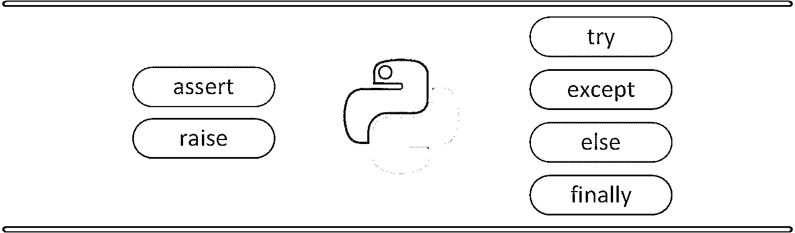
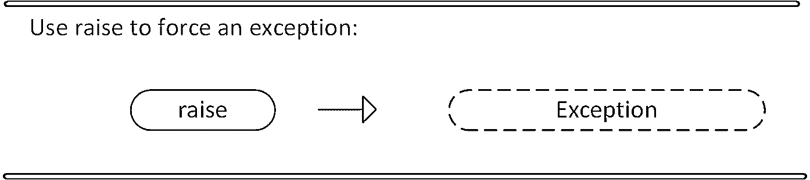
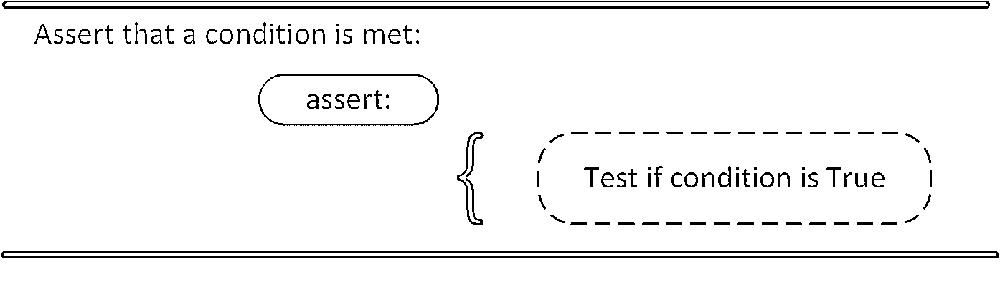
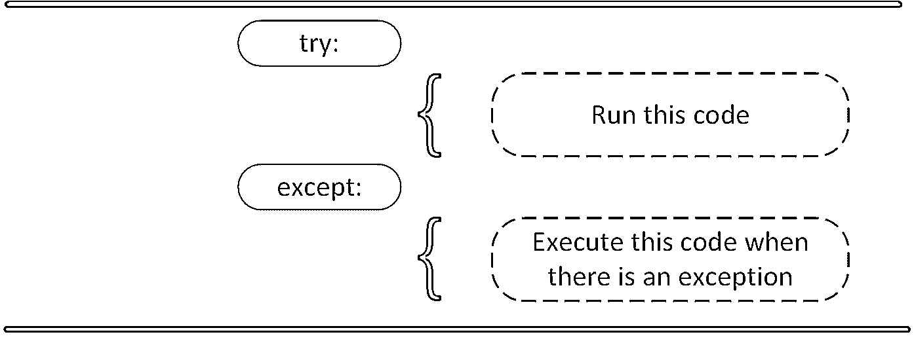
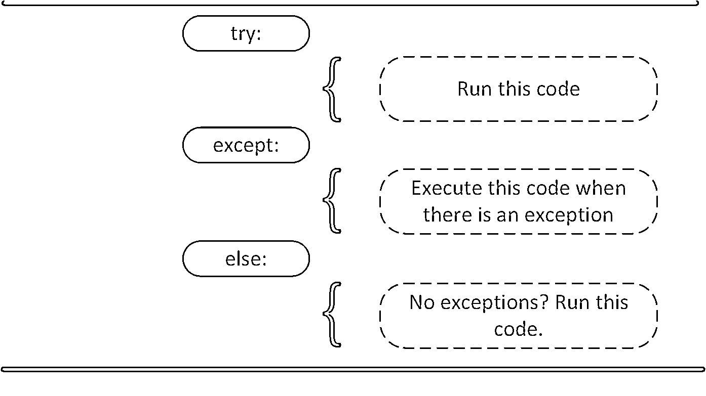
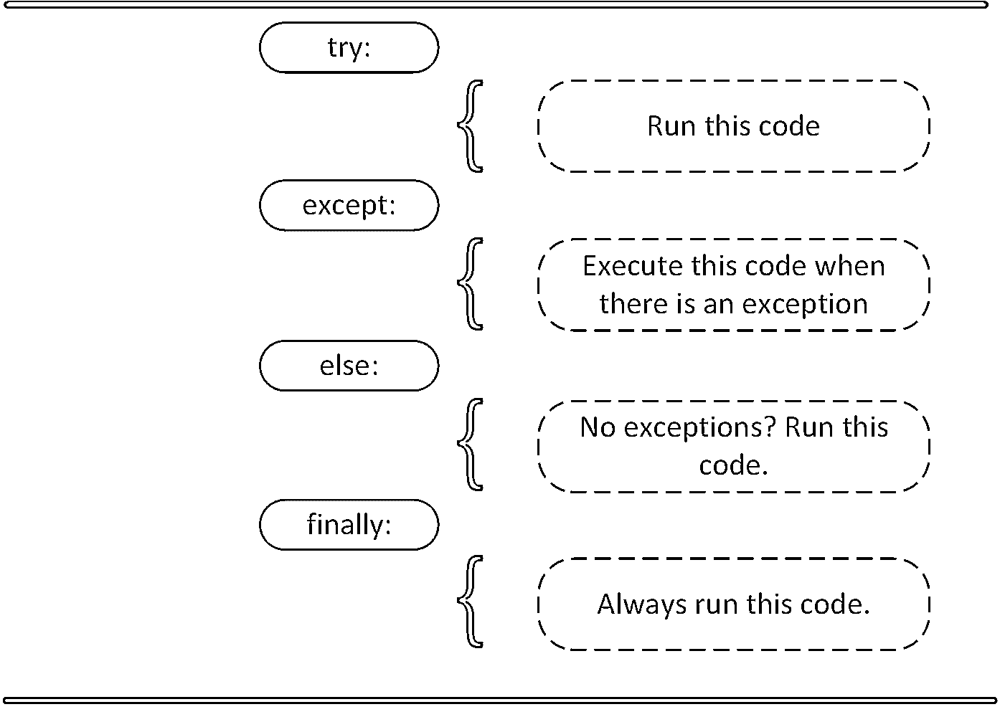

# Python 异常:简介

> 原文：<https://realpython.com/python-exceptions/>

*立即观看**本教程有真实 Python 团队创建的相关视频课程。和文字教程一起看，加深理解:[**Python 异常的饲养和处理**](/courses/raising-handling-exceptions/)

Python 程序一遇到错误就终止。在 Python 中，错误可以是语法错误或异常。在本文中，您将看到什么是异常，以及它与语法错误有何不同。之后，您将学习如何引发异常和做出断言。然后，您将完成 try and except 块的演示。

[](https://files.realpython.com/media/intro.8915db1758d8.png)

**免费 PDF 下载:** [Python 3 备忘单](https://realpython.com/bonus/python-cheat-sheet-short/)

## 异常与语法错误

[语法错误](https://realpython.com/invalid-syntax-python/)当解析器检测到不正确的语句时发生。观察下面的例子:

```py
>>> print( 0 / 0 ))
  File "<stdin>", line 1
    print( 0 / 0 ))
                  ^
SyntaxError: invalid syntax
```

箭头指示解析器在哪里遇到了**语法错误**。在这个例子中，多了一个括号。移除它并再次运行您的代码:

```py
>>> print( 0 / 0)
Traceback (most recent call last):
  File "<stdin>", line 1, in <module>
ZeroDivisionError: integer division or modulo by zero
```

这一次，您遇到了一个**异常错误**。每当语法正确的 Python 代码导致错误时，就会发生这种类型的错误。消息的最后一行指出了您遇到的异常错误的类型。

Python 没有显示消息`exception error`，而是详细说明遇到了什么类型的异常错误。在这种情况下，它是一个`ZeroDivisionError`。Python 附带了[各种内置异常](https://docs.python.org/3/library/exceptions.html)以及创建自定义异常的可能性。

[*Remove ads*](/account/join/)

## 引发异常

如果条件发生，我们可以使用`raise`抛出一个异常。可以用自定义异常来补充该语句。

[](https://files.realpython.com/media/raise.3931e8819e08.png)

如果您想在某个条件发生时使用`raise`抛出一个错误，您可以这样做:

```py
x = 10
if x > 5:
    raise Exception('x should not exceed 5\. The value of x was: {}'.format(x))
```

运行此代码时，输出如下:

```py
Traceback (most recent call last):
  File "<input>", line 4, in <module>
Exception: x should not exceed 5\. The value of x was: 10
```

程序停止并在屏幕上显示我们的异常，提供出错的线索。

## `AssertionError`异常

你也可以从[用 Python](https://dbader.org/blog/python-assert-tutorial) 做断言开始，而不是等待程序中途崩溃。我们认为某个条件得到了满足。如果这个条件原来是`True`，那就太好了！程序可以继续。如果条件是`False`，你可以让程序抛出一个`AssertionError`异常。

[](https://files.realpython.com/media/assert.f6d344f0c0b4.png)

看看下面的例子，其中断言代码将在 Linux 系统上执行:

```py
import sys
assert ('linux' in sys.platform), "This code runs on Linux only."
```

如果您在 Linux 机器上运行这段代码，断言就会通过。如果您在 Windows 机器上运行这段代码，断言的结果将是`False`，结果如下:

```py
Traceback (most recent call last):
  File "<input>", line 2, in <module>
AssertionError: This code runs on Linux only.
```

在这个例子中，抛出一个`AssertionError`异常是程序将做的最后一件事。程序将停止，不会继续。如果这不是你想要的呢？

## `try`和`except`块:处理异常

Python 中的`try`和`except`块用于捕捉和处理异常。Python 执行遵循`try`语句的代码，作为程序的“正常”部分。`except`语句后面的代码是程序对前面`try`子句中任何异常的响应。

[](https://files.realpython.com/media/try_except.c94eabed2c59.png)

正如您之前看到的，当语法正确的代码遇到错误时，Python 会抛出异常错误。如果不处理这个异常错误，它将使程序崩溃。`except`子句决定了你的程序如何响应异常。

以下函数可以帮助您理解`try`和`except`块:

```py
def linux_interaction():
    assert ('linux' in sys.platform), "Function can only run on Linux systems."
    print('Doing something.')
```

`linux_interaction()`只能在 Linux 系统上运行。如果您在 Linux 之外的操作系统上调用这个函数中的`assert`,它将抛出一个`AssertionError`异常。

您可以使用下面的代码给函数一个`try`:

```py
try:
    linux_interaction()
except:
    pass
```

这里处理错误的方式是发出一个`pass`。如果您在 Windows 机器上运行此代码，您将得到以下输出:

你什么都没有。这里的好事情是程序没有崩溃。但是如果能看到在运行代码时是否发生了某种类型的异常，那就更好了。为此，您可以将`pass`更改为能够生成信息性消息的内容，如下所示:

```py
try:
    linux_interaction()
except:
    print('Linux function was not executed')
```

在 Windows 计算机上执行以下代码:

```py
Linux function was not executed
```

当运行该函数的程序出现异常时，程序将继续运行，并通知您函数调用不成功。

您没有看到的是作为函数调用的结果而抛出的错误类型。为了查看到底哪里出错了，您需要捕捉函数抛出的错误。

下面的代码是一个示例，其中您捕获了`AssertionError`并将该消息输出到屏幕:

```py
try:
    linux_interaction()
except AssertionError as error:
    print(error)
    print('The linux_interaction() function was not executed')
```

在 Windows 计算机上运行此函数会输出以下内容:

```py
Function can only run on Linux systems.
The linux_interaction() function was not executed
```

第一条消息是`AssertionError`，通知您该功能只能在 Linux 机器上执行。第二条消息告诉您哪个函数没有被执行。

在前面的例子中，您调用了自己编写的函数。当您执行该函数时，您捕获了`AssertionError`异常并将其打印到屏幕上。

这是另一个打开文件并使用内置异常的例子:

```py
try:
    with open('file.log') as file:
        read_data = file.read()
except:
    print('Could not open file.log')
```

如果 *file.log* 不存在，这段代码将输出如下内容:

```py
Could not open file.log
```

这是一条信息性消息，我们的程序仍将继续运行。在 [Python 文档](https://docs.python.org/3/library/exceptions.html)中，您可以看到这里有许多您可以使用的内置异常。该页面上描述的一个例外如下:

> 异常`FileNotFoundError`
> 
> 当文件或目录被请求但不存在时引发。对应于 errno ENOENT。

要捕捉这种类型的异常并将其打印到屏幕上，可以使用以下代码:

```py
try:
    with open('file.log') as file:
        read_data = file.read()
except FileNotFoundError as fnf_error:
    print(fnf_error)
```

在这种情况下，如果 *file.log* 不存在，则输出如下:

```py
[Errno 2] No such file or directory: 'file.log'
```

您可以在您的`try`子句中有不止一个函数调用，并预期捕捉各种异常。这里需要注意的一点是，一旦遇到异常，`try`子句中的代码就会停止。

**警告:**捕捉`Exception`隐藏所有错误……甚至是那些完全意想不到的错误。这就是为什么您应该在 Python 程序中避免裸露的`except`子句。相反，你会想要引用你想要捕捉和处理的*特定异常类*。你可以在本教程中了解更多为什么这是个好主意[。](https://realpython.com/the-most-diabolical-python-antipattern/)

看看下面的代码。在这里，首先调用`linux_interaction()`函数，然后尝试打开一个文件:

```py
try:
    linux_interaction()
    with open('file.log') as file:
        read_data = file.read()
except FileNotFoundError as fnf_error:
    print(fnf_error)
except AssertionError as error:
    print(error)
    print('Linux linux_interaction() function was not executed')
```

如果文件不存在，在 Windows 计算机上运行此代码将输出以下内容:

```py
Function can only run on Linux systems.
Linux linux_interaction() function was not executed
```

在`try`子句中，您立即遇到了一个异常，并且没有到达您试图打开 *file.log* 的部分。现在看看在 Linux 机器上运行代码时会发生什么:

```py
[Errno 2] No such file or directory: 'file.log'
```

以下是关键要点:

*   执行一个`try`子句，直到遇到第一个异常。
*   在`except`子句或异常处理程序中，您决定程序如何响应异常。
*   您可以预测多个异常，并区分程序应该如何响应它们。
*   避免使用裸露的子句。

[*Remove ads*](/account/join/)

## `else`条款

在 Python 中，使用`else`语句，您可以指示程序仅在没有异常的情况下执行某个代码块。

[](https://files.realpython.com/media/try_except_else.703aaeeb63d3.png)

请看下面的例子:

```py
try:
    linux_interaction()
except AssertionError as error:
    print(error)
else:
    print('Executing the else clause.')
```

如果您在 Linux 系统上运行这段代码，输出将如下所示:

```py
Doing something.
Executing the else clause.
```

因为程序没有遇到任何异常，所以执行了`else`子句。

您还可以`try`在`else`子句中运行代码，并在那里捕捉可能的异常:

```py
try:
    linux_interaction()
except AssertionError as error:
    print(error)
else:
    try:
        with open('file.log') as file:
            read_data = file.read()
    except FileNotFoundError as fnf_error:
        print(fnf_error)
```

如果您在 Linux 机器上执行这段代码，您将得到以下结果:

```py
Doing something.
[Errno 2] No such file or directory: 'file.log'
```

从输出中，您可以看到`linux_interaction()`函数运行了。因为没有遇到异常，所以尝试打开 *file.log* 。该文件不存在，您没有打开该文件，而是捕捉到了`FileNotFoundError`异常。

## 使用`finally`后清理

想象一下，在执行完代码后，您总是需要执行某种清理操作。Python 使您能够使用`finally`子句来做到这一点。

[](https://files.realpython.com/media/try_except_else_finally.a7fac6c36c55.png)

看看下面的例子:

```py
try:
    linux_interaction()
except AssertionError as error:
    print(error)
else:
    try:
        with open('file.log') as file:
            read_data = file.read()
    except FileNotFoundError as fnf_error:
        print(fnf_error)
finally:
    print('Cleaning up, irrespective of any exceptions.')
```

在前面的代码中，`finally`子句中的所有内容都将被执行。如果您在`try`或`else`条款中遇到异常，这并不重要。在 Windows 计算机上运行前面的代码将输出以下内容:

```py
Function can only run on Linux systems.
Cleaning up, irrespective of any exceptions.
```

[*Remove ads*](/account/join/)

## 总结

在了解了语法错误和异常之间的区别之后，您了解了在 Python 中引发、捕捉和处理异常的各种方法。在本文中，您看到了以下选项:

*   允许你在任何时候抛出一个异常。
*   使您能够验证是否满足特定条件，如果不满足，则抛出异常。
*   在`try`子句中，所有语句都被执行，直到遇到异常。
*   `except`用于捕获和处理 try 子句中遇到的异常。
*   `else`允许您编写只有在 try 子句中没有遇到异常时才运行的代码段。
*   `finally`使您能够执行应该总是运行的代码段，不管是否有任何先前遇到的异常。

**免费 PDF 下载:** [Python 3 备忘单](https://realpython.com/bonus/python-cheat-sheet-short/)

希望本文能帮助您理解 Python 在处理异常时必须提供的基本工具。

*立即观看**本教程有真实 Python 团队创建的相关视频课程。和文字教程一起看，加深理解:[**Python 异常的饲养和处理**](/courses/raising-handling-exceptions/)*****