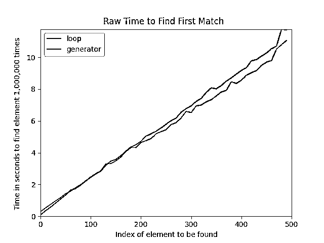
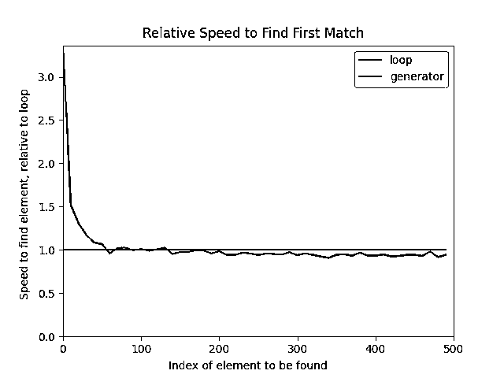
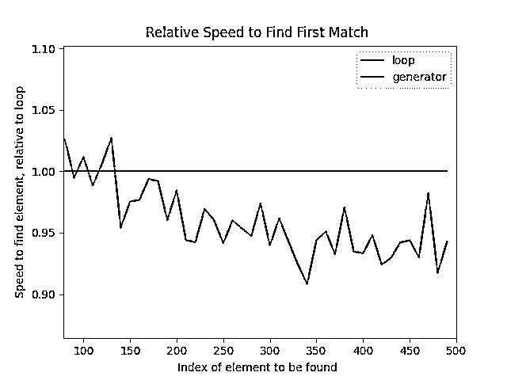
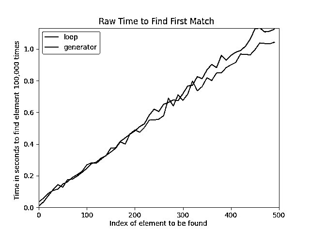
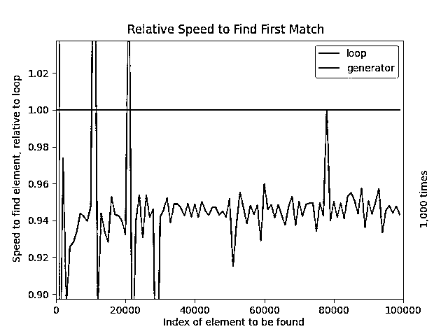

# 如何从 Python 列表或 Iterable 中获取第一个匹配

> 原文：<https://realpython.com/python-first-match/>

在您的 Python 旅程中的某个时刻，您可能需要在 Python 的[可迭代](https://realpython.com/python-for-loop/#iterables)中找到与某个标准匹配的第**个项目，例如[列表](https://realpython.com/python-lists-tuples/)或[字典](https://realpython.com/python-dicts/)。**

最简单的情况是，您需要确认 iterable 中存在一个特定的项。例如，您想在姓名列表中查找一个姓名，或者在字符串中查找一个[子字符串。在这些情况下，最好使用`in`操作符。但是，在很多情况下，您可能希望查找具有特定属性的项目。例如，您可能需要:](https://realpython.com/python-string-contains-substring/)

*   在一列[数字](https://realpython.com/python-numbers/)中找到一个非零值
*   在[字符串列表](https://realpython.com/python-strings/)中查找特定长度的名称
*   基于特定属性在词典列表中查找和修改词典

本教程将介绍如何最好地处理这三种情况。一种选择是将整个 iterable 转换成一个新的列表，然后使用`.index()`来查找第一个符合标准的条目:

>>>

```py
>>> names = ["Linda", "Tiffany", "Florina", "Jovann"]
>>> length_of_names = [len(name) for name in names]
>>> idx = length_of_names.index(7)
>>> names[idx]
'Tiffany'
```

在这里，您使用了`.index()`发现`"Tiffany"`是您的列表中的第一个名字，有七个字符。这个解决方案不是很好，部分原因是您计算了所有元素的标准，即使第一个项目是匹配的。

在上述情况下，您正在搜索您正在**迭代**的项目的**计算属性**。在本教程中，您将学习如何匹配这样一个**派生属性**，而无需进行不必要的计算。

**示例代码:** [单击此处下载免费源代码](https://realpython.com/bonus/python-first-code/)，您将使用它来查找 Python 列表或 iterable 中的第一个匹配。

## 如何获得 Python 列表中的第一个匹配项

您可能已经知道了`in` Python 操作符，它可以告诉您一个项目是否在 iterable 中。虽然这是您可以用于此目的的最有效的方法，但有时您可能需要基于项目的计算属性进行匹配，如它们的长度。

例如，您可能正在处理一个字典列表，这是处理 JSON 数据时可能得到的典型结果。查看从 [`country-json`](https://github.com/samayo/country-json) 获得的数据:

>>>

```py
>>> countries = [
...     {"country": "Austria", "population": 8_840_521},
...     {"country": "Canada", "population": 37_057_765},
...     {"country": "Cuba", "population": 11_338_138},
...     {"country": "Dominican Republic", "population": 10_627_165},
...     {"country": "Germany", "population": 82_905_782},
...     {"country": "Norway", "population": 5_311_916},
...     {"country": "Philippines", "population": 106_651_922},
...     {"country": "Poland", "population": 37_974_750},
...     {"country": "Scotland", "population": 5_424_800},
...     {"country": "United States", "population": 326_687_501},
... ]
```

你可能想找到第一本拥有超过一亿人口的字典。由于两个原因,`in`操作符不是一个很好的选择。首先，您需要完整的字典来匹配它，其次，它不会返回实际的对象，而是一个布尔值:

>>>

```py
>>> target_country = {"country": "Philippines", "population": 106_651_922}
>>> target_country in countries
True
```

如果您需要根据字典的属性(比如人口)来查找字典，就没有办法使用`in`。

根据计算值查找和操作列表中第一个元素的最容易理解的方法是使用一个简单的 [`for`循环](https://realpython.com/python-for-loop/):

>>>

```py
>>> for country in countries:
...     if country["population"] > 100_000_000:
...         print(country)
...         break
...
{"country": "Philippines", "population": 106651922}
```

除了打印目标对象，您可以在`for`循环体中对它做任何您想做的事情。完成后，一定要打破`for`循环，这样就不会不必要地搜索列表的其余部分。

**注意:**使用`break`语句适用于从 iterable 中寻找第一个*匹配。如果您希望获得或处理所有的匹配，那么您可以不使用`break`。*

`for`循环方法是 [`first`](https://pypi.org/project/first/) 包采用的方法，这是一个很小的包，你可以从 [PyPI](https://pypi.org/) 下载，它公开了一个通用函数`first()`。默认情况下，该函数从 iterable 返回第一个真值，并带有一个可选的`key`参数，用于在第一个值通过`key`参数传递后返回该值。

**注意:**在 Python 3.10 和更高版本中，您可以使用[结构模式匹配](https://realpython.com/python310-new-features/#structural-pattern-matching)来以您喜欢的方式匹配这些类型的数据结构。例如，您可以查找第一个人口超过一亿的国家，如下所示:

>>>

```py
>>> for country in countries:
...     match country:
...         case {"population": population} if population > 100_000_000:
...             print(country)
...             break
...
{'country': 'Philippines', 'population': 106651922}
```

在这里，你使用一个守卫，只匹配某些人群。

如果匹配模式足够复杂，那么使用结构化模式匹配代替常规条件语句会更加易读和简洁。

在本教程的后面，您将实现自己的`first()`函数变体。但是首先，您将研究返回第一个匹配的另一种方法:使用生成器。

[*Remove ads*](/account/join/)

## 使用 Python 生成器获得第一个匹配

Python 生成器迭代器是内存高效的可迭代对象，可用于查找列表中的第一个元素或任何可迭代对象。它们是 Python 的核心特性，被广泛使用。很可能你已经在不知不觉中使用过发电机了！

生成器的潜在问题是它们有点抽象，因此不像`for`循环那样易读。您确实从生成器中获得了一些性能上的好处，但是当考虑到可读性的重要性时，这些好处通常是可以忽略的。也就是说，使用它们会很有趣，并真正提升你的 Python 游戏水平！

在 Python 中，你可以用各种方式创建一个生成器，但是在本教程中，你将使用[生成器理解](https://realpython.com/list-comprehension-python/#choose-generators-for-large-datasets):

>>>

```py
>>> gen = (country for country in countries)
>>> next(gen)
{'country': 'Austria', 'population': 8840521}

>>> next(gen)
{'country': 'Canada', 'population': 37057765}
```

一旦定义了生成器迭代器，就可以用生成器调用`next()`函数，一个接一个地产生国家，直到`countries`列表用完。

为了在列表中找到匹配特定标准的第一个元素，您可以在生成器理解中添加一个条件表达式，这样结果迭代器将只产生匹配您的标准的项目。在以下示例中，您使用条件表达式根据项目的`population`属性是否超过一亿来生成项目:

>>>

```py
>>> gen = (
...     country for country in countries
...     if country["population"] > 100_000_000 ... )
>>> next(gen)
{'country': 'Philippines', 'population': 106651922}
```

所以现在生成器只会生成`population`属性过亿的字典。这意味着你第一次用生成器迭代器调用`next()`时，它会产生你在列表中寻找的第一个元素，就像`for`循环版本一样。

**注意:**如果你调用`next()`没有匹配或者生成器耗尽，你会得到一个异常。为了防止这种情况，您可以向`next()`传递一个`default`参数:

>>>

```py
>>> next(gen, None)
{'country': 'United States', 'population': 326687501}
>>> next(gen, None)
```

一旦生成器完成生成匹配，它将返回传入的默认值。因为您正在返回`None`，所以在 REPL 上没有输出。如果你没有传入默认值，你会得到一个`StopIteration` [异常](https://realpython.com/python-exceptions/)。

就可读性而言，生成器不像`for`循环那样自然。那么，您为什么要为此使用一个呢？在下一节中，您将进行一个快速的性能比较。

## 比较回路和发电机的性能

一如往常，在衡量绩效时，你不应该对任何一组结果做过多解读。相反，在你做任何重要的决定之前，用你真实的数据为你自己的代码设计一个测试。你还需要权衡**复杂性**和**可读性**——也许减少几毫秒是不值得的！

对于这个测试，您需要创建一个函数，该函数可以创建任意大小的列表，并且在特定位置具有特定值:

>>>

```py
>>> from pprint import pp

>>> def build_list(size, fill, value, at_position):
...     return [value if i == at_position else fill for i in range(size)]
...

>>> pp(
...     build_list(
...         size=10,
...         fill={"country": "Nowhere", "population": 10},
...         value={"country": "Atlantis", "population": 100},
...         at_position=5,
...     )
... )
[{'country': 'Nowhere', 'population': 10},
 {'country': 'Nowhere', 'population': 10},
 {'country': 'Nowhere', 'population': 10},
 {'country': 'Nowhere', 'population': 10},
 {'country': 'Nowhere', 'population': 10},
 {'country': 'Atlantis', 'population': 100},
 {'country': 'Nowhere', 'population': 10},
 {'country': 'Nowhere', 'population': 10},
 {'country': 'Nowhere', 'population': 10},
 {'country': 'Nowhere', 'population': 10}]
```

`build_list()`功能创建一个包含相同项目的列表。除一项外，列表中所有项目均为`fill`参数的副本。唯一的异常值是`value`参数，它被放在`at_position`参数提供的索引处。

您导入了 [`pprint`](https://realpython.com/python-pretty-print/) ，并使用它来输出构建的列表，以使其更具可读性。否则，默认情况下，列表将显示在一行中。

使用这个函数，您将能够创建一个大的列表集，其中目标值位于列表中的不同位置。您可以使用它来比较在列表的开头和结尾找到一个元素需要多长时间。

为了比较`for`循环和生成器，您需要另外两个硬编码的基本函数来查找一个`population`属性超过 50 的字典:

```py
def find_match_loop(iterable):
    for value in iterable:
        if value["population"] > 50:
            return value
    return None

def find_match_gen(iterable):
    return next(
      (value for value in iterable if value["population"] > 50),
      None
    )
```

这些函数是硬编码的，以保持测试的简单性。在下一节中，您将创建一个可重用的函数。

准备好这些基本组件后，您可以使用 [`timeit`](https://realpython.com/python-timer/#estimating-running-time-with-timeit) 设置一个脚本，用一系列列表测试两个匹配函数，这些列表具有目标位置和列表中的不同位置:

```py
from timeit import timeit

TIMEIT_TIMES = 100
LIST_SIZE = 500
POSITION_INCREMENT = 10

def build_list(size, fill, value, at_position): ...

def find_match_loop(iterable): ...

def find_match_gen(iterable): ...

looping_times = []
generator_times = []
positions = []

for position in range(0, LIST_SIZE, POSITION_INCREMENT):
    print(
        f"Progress {position / LIST_SIZE:.0%}",
        end=f"{3 * ' '}\r",  # Clear previous characters and reset cursor
    )

    positions.append(position)

    list_to_search = build_list(
        LIST_SIZE,
        {"country": "Nowhere", "population": 10},
        {"country": "Atlantis", "population": 100},
        position,
    )

    looping_times.append(
        timeit(
            "find_match_loop(list_to_search)",
            globals=globals(),
            number=TIMEIT_TIMES,
        )
    )
    generator_times.append(
        timeit(
            "find_match_gen(list_to_search)",
            globals=globals(),
            number=TIMEIT_TIMES,
        )
    )

print("Progress 100%")
```

这个脚本将生成两个并行列表，每个列表都包含用循环或生成器找到元素所花费的时间。该脚本还将生成第三个列表，其中包含列表中目标元素的相应位置。

您还没有对结果做任何事情，理想情况下，您希望将这些绘制出来。因此，看看下面这个完整的脚本，它使用 [`matplotlib`](https://realpython.com/python-matplotlib-guide/) 从输出中生成几个图表:


```py
# chart.py

from timeit import timeit

import matplotlib.pyplot as plt

TIMEIT_TIMES = 1000  # Increase number for smoother lines
LIST_SIZE = 500
POSITION_INCREMENT = 10

def build_list(size, fill, value, at_position):
    return [value if i == at_position else fill for i in range(size)]

def find_match_loop(iterable):
    for value in iterable:
        if value["population"] > 50:
            return value

def find_match_gen(iterable):
    return next(value for value in iterable if value["population"] > 50)

looping_times = []
generator_times = []
positions = []

for position in range(0, LIST_SIZE, POSITION_INCREMENT):
    print(
        f"Progress {position / LIST_SIZE:.0%}",
        end=f"{3 * ' '}\r",  # Clear previous characters and reset cursor
    )

    positions.append(position)

    list_to_search = build_list(
        size=LIST_SIZE,
        fill={"country": "Nowhere", "population": 10},
        value={"country": "Atlantis", "population": 100},
        at_position=position,
    )

    looping_times.append(
        timeit(
            "find_match_loop(list_to_search)",
            globals=globals(),
            number=TIMEIT_TIMES,
        )
    )
    generator_times.append(
        timeit(
            "find_match_gen(list_to_search)",
            globals=globals(),
            number=TIMEIT_TIMES,
        )
    )

print("Progress 100%")

fig, ax = plt.subplots()

plot = ax.plot(positions, looping_times, label="loop")
plot = ax.plot(positions, generator_times, label="generator")

plt.xlim([0, LIST_SIZE])
plt.ylim([0, max(max(looping_times), max(generator_times))])

plt.xlabel("Index of element to be found")
plt.ylabel(f"Time in seconds to find element {TIMEIT_TIMES:,} times")
plt.title("Raw Time to Find First Match")
plt.legend()

plt.show()

# Ratio

looping_ratio = [loop / loop for loop in looping_times]
generator_ratio = [
    gen / loop for gen, loop in zip(generator_times, looping_times)
]

fig, ax = plt.subplots()

plot = ax.plot(positions, looping_ratio, label="loop")
plot = ax.plot(positions, generator_ratio, label="generator")

plt.xlim([0, LIST_SIZE])
plt.ylim([0, max(max(looping_ratio), max(generator_ratio))])

plt.xlabel("Index of element to be found")
plt.ylabel("Speed to find element, relative to loop")
plt.title("Relative Speed to Find First Match")
plt.legend()

plt.show()
```

根据您正在运行的系统以及您使用的`TIMEIT_TIMES`、`LIST_SIZE`和`POSITION_INCREMENT`的值，运行脚本可能需要一段时间，但是它应该会生成一个图表，显示彼此对应的时间:

[](https://files.realpython.com/media/1m_raw_edited.de60b7991295.png)

此外，关闭第一个图表后，您将获得另一个图表，显示两种策略之间的比率:

[](https://files.realpython.com/media/1m_relative_edited_or.3e8261f592c7.png)

最后一个图表清楚地说明了在这个测试中，当目标项靠近迭代器的开始时，生成器比`for`循环慢得多。然而，一旦要查找的元素位于位置 100 或更高，生成器就会相当一致地以相当大的差距击败`for`循环:

[](https://files.realpython.com/media/1m_relative_edited.b0514d6a4c7e.png)

您可以使用放大镜图标交互式放大上一个图表。放大的图表显示，性能提高了大约 5%或 6%。百分之五可能不是什么值得大书特书的东西，但也是不可忽略的。对您来说是否值得取决于您将使用的特定数据，以及您需要使用它的频率。

**注意:**对于较低的`TIMEIT_TIMES`值，您经常会在图表中看到尖峰，这是在非专用于测试的计算机上进行测试时不可避免的副作用:

[](https://files.realpython.com/media/100k_raw_edited.2a4d1171551c.png)

如果计算机需要做一些事情，那么它会毫不犹豫地暂停 Python 进程，这可能会夸大某些结果。如果你重复测试不同的时间，那么尖峰会出现在随机的位置。

为了平滑线条，增加`TIMEIT_TIMES`的值。

有了这些结果，你可以暂时说生成器比`for`循环快，即使当要查找的项在 iterable 的前 100 个元素中时，生成器会慢得多。当您处理小列表时，总的来说损失的原始毫秒数并不多。然而，对于 5%的涨幅可能意味着几分钟的大型项目，需要记住的是:

[](https://files.realpython.com/media/100k_relative_zoom_edited.8ee366f45eaa.png)

正如您在最后一张图表中看到的，对于非常大的可迭代对象，性能提升稳定在 6%左右。此外，忽略峰值——为了测试这个大的可迭代函数,`TIMEIT_TIMES`被大幅降低。

[*Remove ads*](/account/join/)

## 制作一个可重用的 Python 函数来寻找第一个匹配

假设您期望使用的可迭代对象比较大，并且您对从代码中挤出每一点性能感兴趣。因此，您将使用生成器而不是`for`循环。您还将处理具有各种项目的各种不同的可重复项，并且希望在匹配方式上具有灵活性，因此您将设计能够实现各种目标的函数:

*   返回第一个真值
*   返回第一场比赛
*   返回通过键函数传递的第一个真值结果
*   返回通过键函数传递的第一个匹配值
*   如果不匹配，则返回默认值

虽然有许多方法可以实现这一点，但有一种方法可以用[模式匹配](https://realpython.com/python310-new-features/#structural-pattern-matching)来实现:

```py
def get_first(iterable, value=None, key=None, default=None):
    match value is None, callable(key):
        case (True, True):
            gen = (elem for elem in iterable if key(elem))
        case (False, True):
            gen = (elem for elem in iterable if key(elem) == value)
        case (True, False):
            gen = (elem for elem in iterable if elem)
        case (False, False):
            gen = (elem for elem in iterable if elem == value)

    return next(gen, default)
```

您可以用多达四个参数调用该函数，根据您传递给它的参数组合，它的行为会有所不同。

函数的行为主要取决于`value`和`key`参数。这就是为什么`match`语句检查`value is None`是否是，并使用`callable()`函数来了解`key`是否是一个函数。

例如，如果两个`match`条件都是`True`，那么就意味着你已经传入了一个`key`，但是没有传入`value`。这意味着您希望 iterable 中的每一项都通过`key`函数传递，返回值应该是第一个真值结果。

作为另一个例子，如果两个`match`条件都是`False`，这意味着你已经传入了一个值而不是一个`key`。传递一个`value`而不传递`key`意味着您希望 iterable 中的第一个元素与提供的值直接匹配。

一旦`match`结束，你就有了你的发电机。剩下要做的就是用生成器和第一次匹配的`default`参数调用`next()`。

使用此功能，您可以用四种不同的方式搜索匹配项:

>>>

```py
>>> countries = [
...     {"country": "Austria", "population": 8_840_521},
...     {"country": "Canada", "population": 37_057_765},
...     {"country": "Cuba", "population": 11_338_138},
...     {"country": "Dominican Republic", "population": 10_627_165},
...     {"country": "Germany", "population": 82_905_782},
...     {"country": "Norway", "population": 5_311_916},
...     {"country": "Philippines", "population": 106_651_922},
...     {"country": "Poland", "population": 37_974_750},
...     {"country": "Scotland", "population": 5_424_800},
...     {"country": "United States", "population": 326_687_501},
... ]

>>> # Get first truthy item
>>> get_first(countries)
{'country': 'Austria', 'population': 8840521}

>>> # Get first item matching the value argument
>>> get_first(countries, value={"country": "Germany", "population": 82_905_782})
{'country': 'Germany', 'population': 82905782}

>>> # Get first result of key(item) that equals the value argument
>>> get_first(
...     countries, value=5_311_916, key=lambda country: country["population"]
... )
{'country': 'Norway', 'population': 5311916}

>>> # Get first truthy result of key(item)
>>> get_first(
...     countries, key=lambda country: country["population"] > 100_000_000
... )
{'country': 'Philippines', 'population': 106651922}
```

有了这个功能，你在搭配上就有了很大的灵活性。例如，您可以只处理值，或者只处理`key`函数，或者两者都处理！

在前面提到的 [`first`](https://pypi.org/project/first/) 包中，函数签名略有不同。它没有值参数。依靠`key`参数，您仍然可以实现与上述相同的效果:

>>>

```py
>>> from first import first
>>> first(
...     countries,
...     key=lambda item: item == {"country": "Cuba", "population": 11_338_138}
... )
{'country': 'Cuba', 'population': 11338138}
```

在可下载的资料中，您还可以找到`get_first()`的替代实现，它镜像了`first`包的签名:

**示例代码:** [单击此处下载免费源代码](https://realpython.com/bonus/python-first-code/)，您将使用它来查找 Python 列表或 iterable 中的第一个匹配。

不管您最终使用哪种实现，您现在都有了一个高性能的、可重用的函数，它可以获得您需要的第一项。

## 结论

在本教程中，你已经学会了如何用各种方法找到列表中的第一个元素或任何可迭代的元素。您已经了解到最快和最基本的匹配方法是使用`in`操作符，但是您已经看到它对于任何更复杂的事情都是有限的。因此，您已经检查了简单的`for`循环，这将是可读性最强、最直接的方法。然而，你也看到了发电机的额外性能和招摇过市。

最后，您看到了从 iterable 中获取第一项的函数的一种可能的实现，无论这是第一个真值还是由符合特定条件的函数转换的值。**