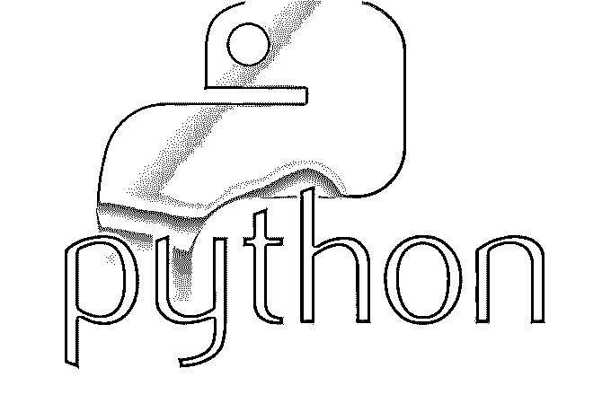
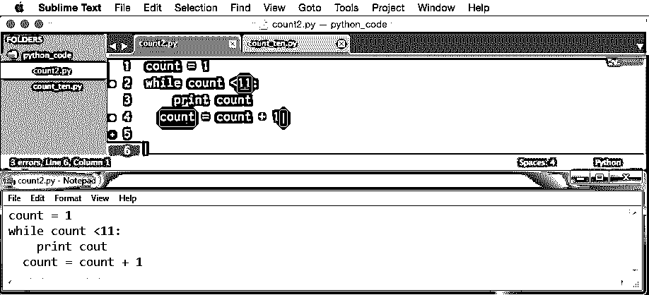
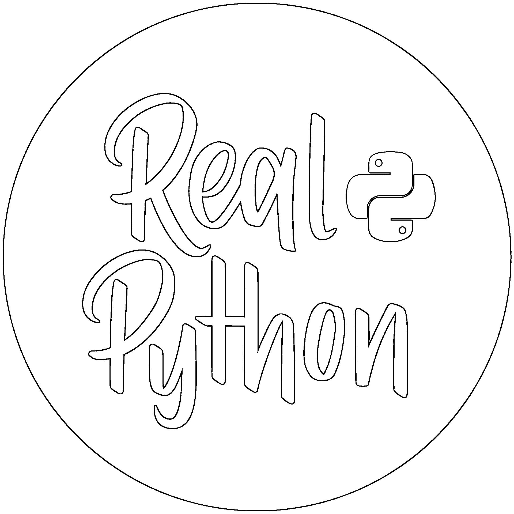
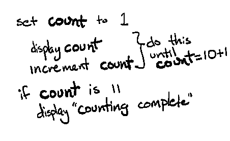

# 如何使用 Python:你的第一步

> 原文：<https://realpython.com/python-first-steps/>

您是否正在寻找一个地方，从初学者的角度学习如何使用 [Python 的基础知识](https://realpython.com/learning-paths/python3-introduction/)？您是否想开始使用 Python，但是不知道从哪里开始？如果是这样，那么这篇教程就是为你准备的。本教程重点介绍开始使用 Python 编程时需要了解的基本知识。

在本教程中，您将学习:

*   什么是 **Python** 以及为什么应该使用它
*   开始编码时应该学习哪些基本的 Python 语法
*   如何在 Python 中**处理错误**
*   如何在 Python 中**快速获得帮助**
*   你应该在你的代码中应用什么样的代码风格
*   无需重新发明轮子，从哪里获得**额外功能**
*   哪里可以找到高质量的 Python 内容并**增长您的技能**

你也将有机会创建你的第一个 Python 程序，并在你的电脑上运行它。最后，你将有机会通过一个小测验来评估你的进步，这个小测验会让你知道你学到了多少。

**免费奖励:** ，它向您展示 Python 3 的基础知识，如使用数据类型、字典、列表和 Python 函数。

## 为什么应该使用 Python

[](https://files.realpython.com/media/pythonlogo.0658b34b4498.jpg)

Python，以英国喜剧组合 [Monty Python](https://en.wikipedia.org/wiki/Monty_Python) 命名，是一种**高级**、**解释型**、**交互型**、**面向对象型**编程语言。它的灵活性让你可以做大大小小的事情。使用 Python，您可以编写基本程序和脚本，还可以创建复杂的大规模企业解决方案。下面是它的一些用法:

*   构建桌面应用，包括 [GUI 应用](https://realpython.com/learning-paths/python-gui-programming/)、 [CLI 工具](https://realpython.com/command-line-interfaces-python-argparse/)，甚至[游戏](https://realpython.com/top-python-game-engines/)
*   做着[数学](https://realpython.com/learning-paths/math-data-science/)和[科学](https://realpython.com/learning-paths/data-science-python-core-skills/)的数据分析
*   构建[网络](https://realpython.com/learning-paths/become-python-web-developer/)和互联网应用
*   进行计算机系统管理和自动化任务
*   执行 [DevOps](https://realpython.com/tutorials/devops/) 任务

在计算机编程的世界里，你到处都可以找到 Python。例如，Python 是世界上一些最受欢迎的网站的基础，包括 Reddit、Dropbox 和 YouTube 等等。Python web 框架 [Django](https://realpython.com/learning-paths/django-web-development/) 同时支持 [Instagram](https://www.instagram.com/) 和 [Pinterest](https://pinterest.com/) 。

Python 有一系列的特性，这些特性使它成为你的第一种编程语言:

*   **免费:** Python 是免费的，即使是用于商业目的。
*   **开源:**任何人都可以[为 Python 开发做出贡献](https://realpython.com/start-contributing-python/)。
*   **无障碍:**从在校儿童到退休人员，各个年龄段的人都学过 Python，你也可以。
*   **多才多艺:** Python 可以帮助你解决很多领域的问题，包括脚本、数据科学、web 开发、GUI 开发等等。
*   **功能强大:**可以编写小脚本实现重复性任务的自动化，也可以用 Python 创建复杂大规模的企业解决方案。

与其他编程语言相比，Python 具有以下特性:

*   **解释:**它是可移植的，比编译语言更快。
*   **Multiparadigm:** 可以让你用不同的风格编写代码，包括[面向对象](https://realpython.com/python3-object-oriented-programming/)、[命令式](https://en.wikipedia.org/wiki/Imperative_programming)和[功能式](https://realpython.com/python-reduce-function/)风格。
*   **动态类型化:**它在运行时检查[变量](https://realpython.com/python-variables/)类型，所以不需要显式声明。
*   强类型:它不会让不兼容类型上的不安全操作被忽视。

关于 Python 还有很多需要学习的地方。但是到目前为止，您应该对为什么 Python 如此受欢迎以及为什么您应该考虑学习用它编程有了更好的理解。

[*Remove ads*](/account/join/)

## 如何下载安装 Python

Python 可以在 Linux、Mac、 [Windows](https://realpython.com/python-coding-setup-windows/) 和其他几个平台上工作。它预装在 macOS 和大多数 Linux 发行版中。然而，如果你想保持最新，那么你可能需要下载并安装最新的版本。如果你愿意，你也可以选择在不同的项目中使用[不同的 Python 版本](https://realpython.com/intro-to-pyenv/)。

要检查操作系统中全局安装的 Python 版本，请打开终端或命令行并运行以下命令:

```py
$ python3 -V
```

该命令打印系统默认 Python 3 安装的版本。请注意，您使用了`python3`而不是`python`，因为一些操作系统仍然将 Python 2 作为默认的 Python 安装。

### 从二进制文件安装 Python

不管你的操作系统是什么，你都可以从官方网站下载合适的 Python 版本。去那里获取适合你的操作系统和处理器的 32 位或 64 位版本。

从该语言的官方网站选择并下载 Python 二进制文件通常是一个不错的选择。但是，有一些特定于操作系统的替代方案:

*   macOS: 你可以选择[安装来自](https://realpython.com/installing-python/#what-your-options-are_1)[自制](http://brew.sh/)的 Python 。
*   Linux: 您可以使用发行版的包管理器安装几个 Python 版本。
*   **Windows:** 你可以从[微软商店](https://www.microsoft.com/en-ca/search?q=python)安装 Python。

你也可以使用 [Anaconda 发行版](https://www.anaconda.com/products/individual)来安装 Python 以及一组丰富的包和库，或者如果你想只安装你需要的包，你可以使用 [Miniconda](https://docs.conda.io/en/latest/miniconda.html) 。

**注意:**管理 Python 版本和环境有几个选项。当您开始学习这门语言时，为这项任务选择合适的工具可能会非常困难。

关于这个主题的指南，请查看[一个有效的 Python 环境:让自己像在家里一样](https://realpython.com/effective-python-environment/)。

关于在不同平台上安装 Python 的更多说明，你可以查看 [Python 3 安装&安装指南](https://realpython.com/installing-python/)。

### 运行您的 Python 解释器

您可以做一个快速测试来确保 Python 安装正确。启动您的终端或命令行并运行`python3`命令。这应该会打开一个 Python 交互式会话，您的命令提示符应该如下所示:

>>>

```py
Python 3.9.0 (default, Oct  5 2020, 17:52:02)
[GCC 9.3.0] on linux
Type "help", "copyright", "credits" or "license" for more information.
>>>
```

当您在这里时，不妨运行您的第一行代码:

>>>

```py
>>> print("Python is fun!")
Python is fun!
```

就是这样！您刚刚编写了您的第一个 Python 程序！完成后，您可以使用 [`exit()`](https://docs.python.org/3/library/constants.html#exit) 或 [`quit()`](https://docs.python.org/3/library/constants.html#quit) 离开交互会话，也可以使用以下组合键:

*   **macOS 和 Linux:**`Ctrl`+`D`
*   **窗口:** `Ctrl` + `D` 然后按 `Enter`

保持终端或命令行打开。你还有很多要做和要学的！您将从学习 Python 语法的基础开始。

[*Remove ads*](/account/join/)

## 基本的 Python 语法

Python [语法](https://en.wikipedia.org/wiki/Syntax_(programming_languages))清晰、简洁，并且注重可读性。可读性可以说是语言本身更有吸引力的特性之一。这使得 Python 成为学习编程的人的理想选择。在本节中，您将了解 Python 语法的几个重要组成部分:

*   [评论](https://realpython.com/python-comments-guide/)
*   [变量](https://realpython.com/python-variables/)
*   [关键词](https://realpython.com/python-keywords/)
*   [内置数据类型](https://realpython.com/python-data-types/)
*   [条件语句](https://realpython.com/python-conditional-statements/)
*   [循环](https://realpython.com/python-for-loop/)
*   [功能](https://realpython.com/defining-your-own-python-function/)

这些知识将帮助您开始使用 Python。你几乎马上就能创建自己的程序。

### 评论

注释是存在于代码中的文本片段，但是在 Python 解释器执行代码时会被忽略。您可以使用注释来描述代码，以便您和其他开发人员能够快速理解代码的作用，或者为什么要以给定的方式编写代码。要用 Python 编写注释，只需在注释文本前添加一个散列标记(`#`):

```py
# This is a comment on its own line
```

Python 解释器会忽略散列标记之后直到行尾的文本。你也可以添加**行内注释**到你的代码中。换句话说，如果注释占据了一行的最后一部分，您可以将 Python 表达式或语句与注释组合在一行中:

```py
var = "Hello, World!"  # This is an inline comment
```

你应该谨慎地使用行内注释来清理那些本身不明显的代码。一般来说，你的评论应该简明扼要。PEP 8 建议将评论控制在 72 个字符以内。如果你的评论接近或超过这个长度，那么你可能想把它分散在多行中:

```py
# This is a long comment that requires
# two lines to be complete.
```

如果给定的注释需要更多的空间，那么可以使用多行，每行加一个散列符号。这样，您可以将评论长度控制在 72 个字符以内。

### 变量

在 Python 中，变量是附加在特定对象上的名称。它们保存一个引用，或称[指针](https://realpython.com/pointers-in-python/)，指向存储对象的内存地址。一旦变量被赋予一个对象，您就可以使用变量名来访问该对象。

你需要预先定义你的变量。下面是语法:

```py
variable_name = variable_value
```

您应该使用一种命名方案，使您的变量直观易读。变量名应该提供一些关于分配给它的值是什么的指示。

有时候程序员会使用简短的变量名，比如`x`和`y`。在数学、代数等领域，这些都是非常合适的名字。在其他情况下，您应该避免使用单字符名称，并使用更具描述性的名称。这样，其他开发人员可以对您的变量进行有根据的猜测。当你写程序的时候，想想别人，也想想你未来的自己。你未来的自己会感谢你。

以下是 Python 中有效和无效变量名的一些示例:

>>>

```py
>>> numbers = [1, 2, 3, 4, 5]
>>> numbers
[1, 2, 3, 4, 5]

>>> first_num = 1
>>> first_num
1

>>> 1rst_num = 1
  File "<input>", line 1
    1rst_num = 1
    ^
SyntaxError: invalid syntax

>>> π = 3.141592653589793
>>> π
3.141592653589793
```

变量名可以是任意长度，可以由大小写字母(`A-Z`、`a-z`)、数字(`0-9`)以及下划线字符(`_`)组成。总之，变量名应该是字母数字，但是注意，即使变量名可以包含数字，它们的第一个字符不能是数字。

**注:****lower _ case _ with _ 下划线**命名约定，也称为 [snake_case](https://en.wikipedia.org/wiki/Snake_case) ，在 Python 中常用。它不是强制性的，但它是一个被广泛采用的标准。

最后，Python 现在提供了[完全的 Unicode 支持](https://realpython.com/python-encodings-guide/)，所以你也可以在你的变量名中使用 Unicode 字符，就像你在上面看到的变量`π`一样。

[*Remove ads*](/account/join/)

### 关键词

像任何其他编程语言一样，Python 有一组特殊的单词，是其语法的一部分。这些词被称为**关键词**。要获得当前 Python 安装中可用关键字的完整列表，可以在交互式会话中运行以下代码:

>>>

```py
>>> help("keywords")

Here is a list of the Python keywords.  Enter any keyword to get more help.

False               class               from                or
None                continue            global              pass
True                def                 if                  raise
and                 del                 import              return
as                  elif                in                  try
assert              else                is                  while
async               except              lambda              with
await               finally             nonlocal            yield
break               for                 not
```

这些关键字中的每一个都在 Python 语法中扮演着角色。它们是保留词，在语言中有特定的含义和目的，所以除了这些特定的目的，你不应该使用它们。例如，您不应该在代码中将它们用作变量名。

还有另一种方法可以访问 Python 关键字的完整列表:

>>>

```py
>>> import keyword
>>> keyword.kwlist
['False', 'None', 'True', 'and', 'as', 'assert', 'async', 'await', 'break', 'cla
ss', 'continue', 'def', 'del', 'elif', 'else', 'except', 'finally', 'for', 'from
', 'global', 'if', 'import', 'in', 'is', 'lambda', 'nonlocal', 'not', 'or', 'pas
s', 'raise', 'return', 'try', 'while', 'with', 'yield']
```

[`keyword`](https://docs.python.org/3/library/keyword.html#module-keyword) 提供了一组函数，允许你判断一个给定的字符串是否是关键字。例如，`keyword.kwlist`保存了 Python 中所有当前关键字的列表。当您需要在 Python 程序中以编程方式操作关键字时，这些非常方便。

### 内置数据类型

Python 内置的[数据类型](https://docs.python.org/3/library/stdtypes.html)屈指可数，比如[数字](https://realpython.com/python-numbers/)(整数、浮点数、复数)[布尔](https://realpython.com/python-boolean/)、[字符串](https://realpython.com/python-strings/)、[列表、元组](https://realpython.com/python-lists-tuples/)、[字典](https://realpython.com/python-dicts/)、[集合](https://realpython.com/python-sets/)。您可以使用几种工具来操作它们:

*   [操作员](https://realpython.com/python-operators-expressions/)
*   [内置函数](https://docs.python.org/3/library/functions.html)
*   [数据类型方法](https://realpython.com/instance-class-and-static-methods-demystified/)

在接下来的几节中，您将学习将 Python 的内置数据类型合并到您的程序中的基础知识。

#### 数字

Python 提供整数、浮点数和复数。整数和浮点数是日常编程中最常用的数值类型，而复数在数学和科学中有特定的用例。以下是它们的功能总结:

| 数字 | 描述 | 例子 | Python 数据类型 |
| --- | --- | --- | --- |
| 整数 | 整数 | `1`、`2`、`42`、`476`、`-99999` | `int` |
| 浮点型 | 带小数点的数字 | `1.0`、`2.2`、`42.09`、`476.1`、`-99999.9` | `float` |
| 复杂的 | 具有实部和虚部的数字 | `complex(1, 2)`、`complex(-1, 7)`、`complex("1+2j")` | `complex` |

整数的精度没有限制。浮点数的精度信息在 [`sys.float_info`](https://docs.python.org/3/library/sys.html#sys.float_info) 中提供。复数有实部和虚部，都是浮点数。

**运算符**表示运算，如加、减、乘、除等。当您将它们与数字组合在一起时，它们会形成 Python 可以计算的表达式:

>>>

```py
>>> # Addition
>>> 5 + 3
8

>>> # Subtraction
>>> 5 - 3
2

>>> # Multiplication
>>> 5 * 3
15

>>> # Division
>>> 5 / 3
1.6666666666666667

>>> # Floor division
>>> 5 // 3
1

>>> # Modulus (returns the remainder from division)
>>> 5 % 3
2

>>> # Power
>>> 5 ** 3
125
```

这些运算符与两个操作数一起工作，通常被称为**算术运算符**。操作数可以是数字或保存数字的变量。

除了操作符之外，Python 还为您提供了一堆用于操作数字的内置函数。这些功能始终可供您使用。换句话说，你不必[导入](https://realpython.com/absolute-vs-relative-python-imports/)它们就能在你的程序中使用它们。

**注意:**[Python 标准库](https://docs.python.org/3/library/index.html)中有可用的模块，比如 [`math`](https://realpython.com/python-math-module/) ，也为你提供了操作数字的函数。

要使用与这些模块相关的功能，首先必须导入模块，然后使用`module.function_name()`访问功能。或者，您可以使用`from module import function_name`直接从模块中导入一个函数。

给定一个整数或表示数字的字符串作为参数，`float()`返回一个浮点数:

>>>

```py
>>> # Integer numbers
>>> float(9)
9.0
>>> float(-99999)
-99999.0

>>> # Strings representing numbers
>>> float("2")
2.0
>>> float("-200")
-200.0
>>> float("2.25")
2.25

>>> # Complex numbers
>>> float(complex(1, 2))
Traceback (most recent call last):
  File "<input>", line 1, in <module>
    float(complex(1, 2))
TypeError: can't convert complex to float
```

用`float()`可以把整数和代表数字的字符串转换成浮点数，但是不能把复数转换成浮点数。

给定一个浮点数或字符串作为参数， [`int()`返回一个整数](https://realpython.com/convert-python-string-to-int/)。该函数不会将输入向上舍入到最接近的整数。它只是截断输入，丢弃小数点后的任何内容，然后返回数字。因此，`10.6`的输入返回`10`而不是`11`。同样，`3.25`返回`3`:

>>>

```py
>>> # Floating-point numbers
>>> int(10.6)
10
>>> int(3.25)
3

>>> # Strings representing numbers
>>> int("2")
2
>>> int("2.3")
Traceback (most recent call last):
  File "<input>", line 1, in <module>
    int("2.3")
ValueError: invalid literal for int() with base 10: '2.3'

>>> # Complex numbers
>>> int(complex(1, 2))
Traceback (most recent call last):
  File "<input>", line 1, in <module>
    int(complex(1, 2))
TypeError: can't convert complex to int
```

注意，可以将表示整数的字符串传递给`int()`，但是不能传递表示浮点数的字符串。复数也不行。

除了这些内置函数，还有一些方法与每种类型的数字相关联。您可以使用[属性引用](https://docs.python.org/3/reference/expressions.html#attribute-references)来访问它们，也称为**点符号**:

>>>

```py
>>> 10.0.is_integer()
True
>>> 10.2.is_integer()
False

>>> (10).bit_length()
4
>>> 10.bit_length()
  File "<input>", line 1
    10.bit_length()
      ^
SyntaxError: invalid syntax
```

这些方法是学习的有用工具。在整数的情况下，要通过一个**文字**访问它们的方法，你需要使用一对括号。否则，你会得到一个`SyntaxError`。

#### 布尔型

在 Python 中，布尔值被实现为整数的一个子类，只有两个可能的值:`True`或`False`。请注意，这些值必须以大写字母开头。

您使用布尔值来表达表达式或对象的[真值](https://docs.python.org/3/library/stdtypes.html#truth-value-testing)。当您编写[谓词](https://en.wikipedia.org/wiki/Predicate_(mathematical_logic))函数或者使用[比较运算符](https://docs.python.org/3/library/stdtypes.html#comparisons)时，例如大于(`>`)、小于(`<`)、等于(`==`)等等，使用布尔值非常方便:

>>>

```py
>>> 2 < 5
True
>>> 4 > 10
False
>>> 4 <= 3
False
>>> 3 >= 3
True
>>> 5 == 6
False
>>> 6 != 9
True
```

比较运算符计算布尔值、`True`或`False`。在 Python 交互式会话中，您可以随意使用它们。

Python 提供了一个内置函数， [`bool()`](https://docs.python.org/3/library/functions.html#bool) ，与布尔值密切相关。它是这样工作的:

>>>

```py
>>> bool(0)
False
>>> bool(1)
True

>>> bool("")
False
>>> bool("a")
True

>>> bool([])
False
>>> bool([1, 2, 3])
True
```

`bool()`以一个对象为自变量，根据对象的真值返回`True`或`False`。为了评估对象的真值，该函数使用 [Python 的真值测试规则](https://docs.python.org/3/library/stdtypes.html#truth)。

另一方面，`int()`取一个布尔值，并为`False`返回`0`，为`True`返回`1`:

>>>

```py
>>> int(False)
0
>>> int(True)
1
```

这是因为 Python 将其布尔值实现为`int`的子类，如您之前所见。

#### 字符串

字符串是可以使用单引号、双引号或三引号定义的文本片段或字符序列:

>>>

```py
>>> # Use single quotes
>>> greeting = 'Hello there!'
>>> greeting
'Hello there!'

>>> # Use double quotes
>>> welcome = "Welcome to Real Python!"
>>> welcome
'Welcome to Real Python!'

>>> # Use triple quotes
>>> message = """Thanks for joining us!"""
>>> message
'Thanks for joining us!'

>>> # Escape characters
>>> escaped = 'can\'t'
>>> escaped
"can't"
>>> not_escaped = "can't"
>>> not_escaped
"can't"
```

请注意，您可以使用不同类型的引号在 Python 中创建字符串对象。还可以使用反斜杠字符(`\`)到**来转义具有特殊含义的**字符，比如引号本身。

一旦定义了字符串对象，就可以使用加号运算符(`+`)将**和**连接成一个新字符串:

>>>

```py
>>> "Happy" + " " + "pythoning!"
'Happy pythoning!'
```

当用于字符串时，加号运算符(`+`)将它们连接成一个字符串。请注意，您需要在单词之间包含一个空格(`" "`)，以便在结果字符串中有适当的间距。如果你需要连接很多字符串，那么你应该考虑使用`.join()`，这样效率更高。在本教程的稍后部分，您将了解到`.join()`。

Python 附带了许多用于字符串操作的有用的内置函数和方法。例如，如果您将一个字符串作为参数传递给`len()`，那么您将获得该字符串的**长度**，或者它包含的字符数:

>>>

```py
>>> len("Happy pythoning!")
16
```

当您使用字符串作为参数调用 [`len()`](https://realpython.com/len-python-function/) 时，您将获得输入字符串中的字符数，包括任何空格。

string 类(`str`)提供了一组[丰富的方法](https://docs.python.org/3/library/stdtypes.html#string-methods)，这些方法对于操作和处理字符串非常有用。例如，`str.join()`接受一个[可迭代的](https://docs.python.org/3/glossary.html#term-iterable)字符串，并将它们连接成一个新的字符串。对其调用方法的字符串充当分隔符的角色:

>>>

```py
>>> " ".join(["Happy", "pythoning!"])
'Happy pythoning!'
```

`str.upper()`返回基础字符串的副本，其中所有字母都转换为大写:

>>>

```py
>>> "Happy pythoning!".upper()
'HAPPY PYTHONING!'
```

`str.lower()`返回基础字符串的副本，其中所有字母都转换为小写:

>>>

```py
>>> "HAPPY PYTHONING!".lower()
'happy pythoning!'
```

`str.format()`执行一个[字符串格式化](https://realpython.com/python-string-formatting/)操作。这种方法为字符串格式化和插值提供了很大的灵活性:

>>>

```py
>>> name = "John Doe"
>>> age = 25
>>> "My name is {0} and I'm {1} years old".format(name, age)
"My name is John Doe and I'm 25 years old"
```

你也可以使用一个 [f 弦](https://realpython.com/python-f-strings/)来格式化你的弦而不使用`.format()`:

>>>

```py
>>> name = "John Doe"
>>> age = 25
>>> f"My name is {name} and I'm {age} years old"
"My name is John Doe and I'm 25 years old"
```

Python 的 f-strings 是一种改进的字符串格式化语法。它们是以`f`开头的字符串，在引号之外。出现在嵌入式花括号(`{}`)中的表达式被替换为它们在格式化字符串中的值。

字符串是字符序列。这意味着您可以使用位置索引从字符串中检索单个字符。索引是一个与序列中特定位置相关联的从零开始的[整数:](https://en.wikipedia.org/wiki/Zero-based_numbering)

>>>

```py
>>> welcome = "Welcome to Real Python!"
>>> welcome[0]
'W'
>>> welcome[11]
'R'
>>> welcome[-1]
'!'
```

索引操作在给定索引指示的位置检索字符。注意，负索引以相反的顺序检索元素，其中`-1`是字符串中最后一个字符的索引。

你也可以通过**切分**来获取字符串的一部分:

>>>

```py
>>> welcome = "Welcome to Real Python!"
>>> welcome[0:7]
'Welcome'
>>> welcome[11:22]
'Real Python'
```

切片操作采用`[start:end:step]`形式的元素。这里，`start`是要包含在切片中的第一项的索引，`end`是最后一项的索引，它不包含在返回的切片中。最后，`step`是一个可选的整数，表示从原始字符串中提取项目时要跳过的项目数。例如，`2`的`step`将返回`start`和`stop`之间的所有其他元素。

#### 列表

在几乎所有其他编程语言中，列表通常被称为**数组**。在 Python 中，列表是将各种对象组合在一起的[可变序列](https://docs.python.org/3/library/stdtypes.html#mutable-sequence-types)。要创建一个列表，您可以使用一个赋值语句，在右边的方括号(`[]`)中包含一系列以逗号分隔的对象:

>>>

```py
>>> # Define an empty list
>>> empty = []
>>> empty
[]

>>> # Define a list of numbers
>>> numbers = [1, 2, 3, 100]
>>> numbers
[1, 2, 3, 100]

>>> # Modify the list in place
>>> numbers[3] = 200
>>> numbers
[1, 2, 3, 200]

>>> # Define a list of strings
>>> superheroes = ["batman", "superman", "spiderman"]
>>> superheroes
['batman', 'superman', 'spiderman']

>>> # Define a list of objects with different data types
>>> mixed_types = ["Hello World", [4, 5, 6], False]
>>> mixed_types
['Hello World', [4, 5, 6], False]
```

列表可以包含不同数据类型的对象，包括其他列表。它们也可以是空的。由于列表是可变的序列，您可以使用索引符号和赋值操作来修改它们[而不是](https://en.wikipedia.org/wiki/In-place_algorithm)。

因为列表就像字符串一样是序列，所以您可以使用从零开始的整数索引来访问它们各自的项:

>>>

```py
>>> numbers = [1, 2, 3, 200]
>>> numbers[0]
1
>>> numbers[1]
2

>>> superheroes = ["batman", "superman", "spiderman"]
>>> superheroes[-1]
"spiderman"
>>> superheroes[-2]
"superman"
```

索引操作也适用于 Python 列表，因此您可以通过使用位置索引来检索列表中的任何项目。负索引以相反的顺序检索项目，从最后一个项目开始。

您也可以使用切片操作从现有列表创建新列表:

>>>

```py
>>> numbers = [1, 2, 3, 200]
>>> new_list = numbers[0:3]
>>> new_list
[1, 2, 3]
```

如果您在另一个列表中嵌套了一个列表、一个字符串或任何其他序列，那么您可以使用多个索引来访问内部项目:

>>>

```py
>>> mixed_types = ["Hello World", [4, 5, 6], False]
>>> mixed_types[1][2]
6
>>> mixed_types[0][6]
'W'
```

在这种情况下，第一个索引从容器列表中获取项目，第二个索引从内部序列中检索项目。

您也可以使用加号运算符连接列表:

>>>

```py
>>> fruits = ["apples", "grapes", "oranges"]
>>> veggies = ["corn", "kale", "mushrooms"]
>>> grocery_list = fruits + veggies
>>> grocery_list
['apples', 'grapes', 'oranges', 'corn', 'kale', 'mushrooms']
```

因为列表是对象的序列，所以您可以对任何其他序列使用相同的函数，比如字符串。

给定一个列表作为参数，`len()`返回列表的长度，或者它包含的对象的数量:

>>>

```py
>>> numbers = [1, 2, 3, 200]
>>> len(numbers)
4
```

您可以查看 Python [文档](https://docs.python.org/3/tutorial/datastructures.html#more-on-lists)来查看所有可用的列表方法。下面总结了一些最常用的方法。

[`list.append()`](https://realpython.com/python-append/) 将一个对象作为参数，并将其添加到底层列表的末尾:

>>>

```py
>>> fruits = ["apples", "grapes", "oranges"]
>>> fruits.append("blueberries")
>>> fruits
['apples', 'grapes', 'oranges', 'blueberries']
```

[`list.sort()`](https://realpython.com/python-sort/) 将底层列表排序到位:

>>>

```py
>>> fruits.sort()
>>> fruits
['apples', 'blueberries', 'grapes', 'oranges']
```

`list.pop()`将整数索引作为参数，然后移除并返回基础列表中该索引处的项目:

>>>

```py
>>> numbers_list = [1, 2, 3, 200]
>>> numbers_list.pop(2)
3
>>> numbers_list
[1, 2, 200]
```

列表是 Python 中非常常见和通用的数据结构。它们如此受欢迎，以至于开发人员有时倾向于过度使用它们，这会使代码效率低下。

#### 元组

元组类似于列表，但它们是不可变的序列。这意味着您不能在创建后更改它们。要创建 tuple 对象，可以使用一个赋值操作，在其右侧包含一系列以逗号分隔的项。您通常使用括号来分隔元组，但它们不是强制性的:

>>>

```py
>>> employee = ("Jane", "Doe", 31, "Software Developer")

>>> employee[0] = "John"
Traceback (most recent call last):
  File "<input>", line 1, in <module>
    employee[0] = "John"
TypeError: 'tuple' object does not support item assignment
```

如果您试图就地改变一个元组，那么您会得到一个 [`TypeError`](https://realpython.com/python-traceback/#typeerror) ，表明元组不支持就地修改。

就像列表一样，您也可以对元组进行索引和切片:

>>>

```py
>>> employee = ("Jane", "Doe", 31, "Software Developer")
>>> employee[0]
'Jane'
>>> employee[1:3]
('Doe', 31)
```

因为元组是序列，所以可以使用索引来检索元组中的特定项。请注意，您还可以使用切片操作从元组中检索切片。

还可以使用串联运算符添加两个元组:

>>>

```py
>>> first_tuple = (1, 2)
>>> second_tuple = (3, 4)
>>> third_tuple = first_tuple + second_tuple
>>> third_tuple
(1, 2, 3, 4)
```

具有两个元组的串联操作创建包含两个输入元组中所有项目的新元组。

与列表和字符串一样，您可以使用一些内置函数来操作元组。例如，`len()`返回元组的长度，或者它包含的项数:

>>>

```py
>>> numbers = (1, 2, 3)
>>> len(numbers)
3
```

使用元组作为参数，`list()`返回输入元组中所有项目的列表:

>>>

```py
>>> numbers = (1, 2, 3)
>>> list(numbers)
[1, 2, 3]
```

因为元组是不可变的序列，所以许多可用于列表的方法并不适用于元组。但是，元组有两个内置方法:

1.  `.count()`
2.  `.index()`

`tuple.count()`以一个对象作为参数，返回该项目在底层元组中出现的次数。如果对象不在元组中，那么`.count()`返回`0`:

>>>

```py
>>> letters = ("a", "b", "b", "c", "a")
>>> letters.count("a")
2
>>> letters.count("c")
1
>>> letters.count("d")
0
```

`tuple.index()`将一个对象作为参数，并返回该对象在当前元组中的第一个实例的索引。如果对象不在元组中，那么`.index()`产生一个`ValueError`:

>>>

```py
>>> letters = ("a", "b", "b", "c", "a")
>>> letters.index("a")
0

>>> letters.index("c")
3

>>> letters.index("d")
Traceback (most recent call last):
  File "<input>", line 1, in <module>
    letters.index("d")
ValueError: tuple.index(x): x not in tuple
```

元组是非常有用的数据结构。它们是内存高效的、不可变的，并且在管理不应该被用户修改的数据方面有很大的潜力。它们也可以用作字典键，这将在下一节中介绍。

#### 字典

字典是一种关联数组，包含一组**键-值对**，其中每个键都是一个映射到任意对象(值)的[哈希](https://docs.python.org/3/glossary.html#term-hashable)对象。创建词典有几种方法。这是其中的两个:

>>>

```py
>>> person1 = {"name": "John Doe", "age": 25, "job": "Python Developer"}
>>> person1
{'name': 'John Doe', 'age': 25, 'job': 'Python Developer'}

>>> person2 = dict(name="Jane Doe", age=24, job="Web Developer")
>>> person2
{'name': 'Jane Doe', 'age': 24, 'job': 'Web Developer'}
```

第一种方法使用一对花括号，在其中添加一个逗号分隔的键-值对列表，使用冒号(`:`)将键和值分隔开。第二种方法使用内置函数 [`dict()`](https://docs.python.org/3/library/functions.html#func-dict) ，它可以将[关键字参数](https://realpython.com/defining-your-own-python-function/#keyword-arguments)转换成一个字典，以关键字为键，参数为值。

**注:**从 Python 3.6 开始，[字典已经是有序数据结构](https://docs.python.org/3/whatsnew/3.6.html#whatsnew36-compactdict)。但在此之前，它们是无序的。所以，如果你用的是低于 3.6 的 Python 版本，需要一个有序的字典，那就考虑用 [`collections.OrderedDict()`](https://docs.python.org/3/library/collections.html#collections.OrderedDict) 。

您可以使用以下语法检索与给定键关联的值:

>>>

```py
>>> person1 = {"name": "John Doe", "age": 25, "job": "Python Developer"}
>>> person1["name"]
'John Doe'
>>> person1["age"]
25
```

这非常类似于索引操作，但是这次您使用的是键而不是索引。

您还可以分别使用`.keys()`、`.values()`和`.items()`在字典中检索键、值和键值对:

>>>

```py
>>> # Retrieve all the keys
>>> person1.keys()
dict_keys(['name', 'age', 'job'])

>>> # Retrieve all the values
>>> person1.values()
dict_values(['John Doe', 25, 'Python Developer'])

>>> # Retrieve all the key-value pairs
>>> person1.items()
dict_items([('name', 'John Doe'), ('age', 25), ('job', 'Python Developer')])
```

这三个方法是在 Python 中操作字典的基本工具，尤其是当你在字典中迭代时。

#### 设置

Python 还提供了一个**集合**的数据结构。集合是任意但可散列的 Python 对象的无序且可变的集合。您可以通过多种方式创建集合。这是其中的两个:

>>>

```py
>>> employees1 = {"John", "Jane", "Linda"}
{'John', 'Linda', 'Jane'}

>>> employees2 = set(["David", "Mark", "Marie"])
{'Mark', 'David', 'Marie'}

>>> empty = set()
>>> empty
set()
```

在第一个示例中，您使用花括号和逗号分隔的对象列表来创建一个集合。如果您使用`set()`，那么您需要提供一个 iterable，其中包含您想要包含在集合中的对象。最后，如果你想创建一个空集，那么你需要使用不带参数的`set()`。使用一对空的花括号会创建一个空的字典，而不是一个集合。

集合的一个最常见的用例是使用它们从现有的 iterable 中删除重复的对象:

>>>

```py
>>> set([1, 2, 2, 3, 4, 5, 3])
{1, 2, 3, 4, 5}
```

因为集合是唯一对象的集合，当你使用`set()`和一个 iterable 作为参数创建一个集合时，[类构造器](https://realpython.com/python-class-constructor/)删除任何重复的对象，并且在结果集中只保留每个对象的一个实例。

**注意:** Python 还提供了一个名为 [frozenset](https://docs.python.org/3/library/stdtypes.html#frozenset) 的集合的不可变变体。您可以通过使用 iterable 作为参数调用`frozenset()`来创建它们。如果你调用`frozenset()`而没有参数，那么你将得到一个空的 frozenset。

您可以像处理其他内置数据结构一样，对集合使用一些内置函数。例如，如果您将一个集合作为参数传递给`len()`，那么您将获得集合中的项目数:

>>>

```py
>>> employees1 = {"John", "Jane", "Linda"}

>>> len(employees1)
3
```

您还可以使用运算符来管理 Python 中的集合。在这种情况下，大多数运算符代表典型的[集合运算](https://en.wikipedia.org/wiki/Set_(mathematics)#Basic_operations)，如**并集** ( `|`)、**交集** ( `&`)、**差集** ( `-`)等等:

>>>

```py
>>> primes = {2, 3, 5, 7}
>>> evens = {2, 4, 6, 8}

>>> # Union
>>> primes | evens
{2, 3, 4, 5, 6, 7, 8}

>>> # Intersection
>>> primes & evens
{2}

>>> # Difference
>>> primes - evens
{3, 5, 7}
```

集合提供了一堆方法，包括执行集合运算的方法，就像上面的例子一样。它们还提供了修改或更新基础集合的方法。例如，`set.add()`获取一个对象并将其添加到集合中:

>>>

```py
>>> primes = {2, 3, 5, 7}

>>> primes.add(11)
>>> primes
{2, 3, 5, 7, 11}
```

`set.remove()`获取一个对象并将其从集合中移除:

>>>

```py
>>> primes = {2, 3, 5, 7, 11}

>>> primes.remove(11)
>>> primes
{2, 3, 5, 7}
```

Python 集合是非常有用的数据结构，是 Python 开发人员工具包的重要补充。

[*Remove ads*](/account/join/)

### 条件句

有时，您需要运行(或不运行)给定的代码块，这取决于是否满足某些条件。在这种情况下，**条件语句**是你的盟友。这些语句根据表达式的**真值**控制一组语句的执行。您可以使用关键字`if`和以下通用语法在 Python 中创建条件语句:

```py
if expr0:
    # Run if expr0 is true
    # Your code goes here...
elif expr1:
    # Run if expr1 is true
    # Your code goes here...
elif expr2:
    # Run if expr2 is true
    # Your code goes here...
...
else:
    # Run if all expressions are false
    # Your code goes here...

# Next statement
```

`if`语句只运行一个代码块。换句话说，如果`expr0`为真，那么只有其关联的代码块才会运行。之后，执行跳转到直接在`if`语句下面的语句。

只有当`expr0`为假时，第一个`elif`子句才会对`expr1`求值。如果`expr0`为假而`expr1`为真，那么只有与`expr1`相关的代码块才会运行，依此类推。`else`子句是可选的，只有当所有先前评估的条件都为假时才会运行。您可以根据需要拥有任意多的`elif`子句，包括根本没有子句，但是您最多只能拥有一个`else`子句。

以下是这种工作方式的一些例子:

>>>

```py
>>> age = 21
>>> if age >= 18:
...     print("You're a legal adult")
...
You're a legal adult

>>> age = 16
>>> if age >= 18:
...     print("You're a legal adult")
... else:
...     print("You're NOT an adult")
...
You're NOT an adult

>>> age = 18
>>> if age > 18:
...     print("You're over 18 years old")
... elif age == 18:
...     print("You're exactly 18 years old")
...
You're exactly 18 years old
```

在第一个例子中，`age`等于`21`，所以条件为真，Python 将`You're a legal adult`打印到屏幕上。在第二个例子中，表达式`age >= 18`的计算结果为`False`，因此 Python 运行了`else`子句的代码块，并在屏幕上打印出`You're NOT an adult`。

在最后一个示例中，第一个表达式`age > 18`为 false，因此执行跳转到`elif`子句。该子句中的条件为真，因此 Python 运行相关的代码块并打印出`You're exactly 18 years old`。

### 循环

如果您需要多次重复一段代码来获得最终结果，那么您可能需要使用一个**循环**。循环是多次迭代和在每次[迭代](https://en.wikipedia.org/wiki/Iteration)中执行一些动作的常见方式。Python 提供了两种类型的循环:

1.  [`for`循环](https://realpython.com/python-for-loop/)进行**确定迭代**，或者执行设定次数或重复次数
2.  [`while`循环](https://realpython.com/python-while-loop/)进行**不定迭代**，或者重复直到满足给定条件

下面是创建一个`for`循环的一般语法:

```py
for loop_var in iterable:
    # Repeat this code block until iterable is exhausted
    # Do something with loop_var...
    if break_condition:
        break  # Leave the loop
    if continue_condition:
        continue  # Resume the loop without running the remaining code
    # Remaining code...
else:
    # Run this code block if no break statement is run

# Next statement
```

这种循环执行的迭代次数与`iterable`中的项目一样多。通常，您使用每次迭代对`loop_var`的值执行给定的操作。`else`子句是可选的，在循环结束时运行。`break`和`continue`语句也是可选的。

看看下面的例子:

>>>

```py
>>> for i in (1, 2, 3, 4, 5):
...     print(i)
... else:
...     print("The loop wasn't interrupted")
...
1
2
3
4
5
The loop wasn't interrupted
```

当循环处理元组中的最后一个数字时，执行流跳转到`else`子句，并在屏幕上打印`The loop wasn't interrupted`。那是因为你的循环没有被`break`语句打断。您通常在代码块中有一个`break`语句的循环中使用一个`else`子句。否则就没必要了。

如果循环遇到了`break_condition`，那么`break`语句会中断循环的执行，并跳转到循环下一条语句，而不会消耗`iterable`中剩余的项目:

>>>

```py
>>> number = 3
>>> for i in (1, 2, 3, 4, 5):
...     if i == number:
...         print("Number found:", i)
...         break
... else:
...     print("Number not found")
...
Number found: 3
```

当`i == 3`时，循环在屏幕上打印`Number found: 3`，然后点击`break`语句。这中断了循环，执行跳转到循环的下一行，而不运行`else`子句。如果您将`number`设置为`6`或任何其他不在数字元组中的数字，那么循环不会命中`break`语句并打印`Number not found`。

如果循环遇到了`continue_condition`，那么`continue`语句将继续循环，而不运行循环代码块中的其余语句:

>>>

```py
>>> for i in (1, 2, 3, 4, 5):
...     if i == 3:
...         continue
...     print(i)
...
1
2
4
5
```

这一次，`continue`语句在`i == 3`时重新开始循环。这就是为什么你在输出中看不到数字`3`。

两个语句`break`和`continue`都应该包含在条件语句中。否则，循环总是在碰到`break`时中断，在碰到`continue`时继续。

当你事先不知道完成一个给定的操作需要多少次迭代时，你通常使用一个`while`循环。这就是为什么这个循环被用来执行无限迭代。

下面是 Python 中`while`循环的一般语法:

```py
while expression:
    # Repeat this code block until expression is false
    # Do something...
    if break_condition:
        break  # Leave the loop
    if continue_condition:
        continue  # Resume the loop without running the remaining code
    # Remaining code...
else:
    # Run this code block if no break statement is run

# Next statement
```

这个循环的工作方式类似于`for`循环，但是它会一直迭代，直到`expression`为假。这种类型的循环的一个常见问题是当您提供一个永远不会计算为`False`的`expression`时。在这种情况下，循环将永远迭代下去。

下面是一个关于`while`循环如何工作的例子:

>>>

```py
>>> count = 1
>>> while count < 5:
...     print(count)
...     count = count + 1
... else:
...     print("The loop wasn't interrupted")
...
1
2
3
4
The loop wasn't interrupted
```

同样，`else`子句是可选的，通常在循环的代码块中与`break`语句一起使用。在这里，`break`和`continue`的工作方式与`for`循环相同。

有些情况下，你需要一个无限循环。例如，GUI 应用程序运行在一个管理用户事件的无限循环中。这个循环需要一个`break`语句来终止循环，例如，当用户退出应用程序时。否则，应用程序将永远继续运行。

[*Remove ads*](/account/join/)

### 功能

在 Python 中，函数是一个命名的代码块，它执行操作并选择性地计算结果，然后将结果返回给调用代码。您可以使用以下语法来定义函数:

```py
def function_name(arg1, arg2, ..., argN):
    # Do something with arg1, arg2, ..., argN
    return return_value
```

关键字`def`启动函数**头**。然后，您需要函数名和括号中的参数列表。注意，参数列表是可选的，但是括号在语法上是必需的。

最后一步是定义函数的代码块，它将开始向右缩进一级。在这种情况下， [`return`语句](https://realpython.com/python-return-statement/)也是可选的，如果您需要将`return_value`发送回调用者代码，您可以使用该语句。

**注意:**定义函数及其参数的完整语法超出了本教程的范围。关于这个主题的深入资源，请查看[定义自己的 Python 函数](https://realpython.com/defining-your-own-python-function/)。

要使用一个函数，你需要**调用**它。函数调用由函数名和括号中的函数参数组成:

```py
function_name(arg1, arg2, ..., argN)
```

您可以拥有在被调用时不需要参数的函数，但是括号总是需要的。如果你忘记了它们，那么你就不能调用这个函数，而是作为一个函数对象来引用它。

## 如何在 Python 中处理错误

错误是让每个层次的程序员都恼火和沮丧的事情。拥有识别和处理它们的能力是程序员的核心技能。在 Python 中，有两种基于代码的错误:[语法错误](https://realpython.com/invalid-syntax-python/)和[异常](https://realpython.com/python-exceptions/)。

### 语法错误

当代码的语法在 Python 中无效时，就会出现语法错误。它们会自动停止程序的执行。例如，下面的`if`语句在语句头的末尾缺少了一个冒号，Python 很快指出了这个错误:

>>>

```py
>>> if x < 9
 File "<stdin>", line 1
 if x < 9
 ^
SyntaxError: invalid syntax
```

`if`语句末尾缺少的冒号是无效的 Python 语法。Python 解析器捕捉到问题并立即引发一个`SyntaxError`。箭头(`^`)指示解析器发现问题的位置。

### 例外情况

运行时语法正确的代码会引发异常，以表示程序执行过程中出现了问题。例如，考虑下面的数学表达式:

>>>

```py
>>> 12 / 0
Traceback (most recent call last):
  File "<stdin>", line 1, in <module>
ZeroDivisionError: integer division or modulo by zero
```

在 Python 解析器看来，表达式`12 / 0`在语法上是正确的。然而，当解释器试图实际计算表达式时，它会引发一个`ZeroDivisionError`异常。

**注意:**在 Python 中，你通常会依靠异常来控制程序的流程。Python 开发人员更喜欢这种被称为 EAFP(请求原谅比请求许可更容易)的编码风格，而不是被称为 LBYL(三思而后行)的编码风格，后者基于使用`if`语句。有关这两种编码风格的更多信息，请查看 [LBYL vs EAFP:防止或处理 Python 中的错误](https://realpython.com/python-lbyl-vs-eafp/)。

Python 提供了几个方便的内置[异常](https://docs.python.org/3/library/exceptions.html#bltin-exceptions)，允许你[捕捉和处理代码中的](https://realpython.com/python-exceptions/#the-try-and-except-block-handling-exceptions)错误。

[*Remove ads*](/account/join/)

### 语义错误

程序逻辑中的一个或多个问题会导致语义错误。这些错误可能很难找到、调试和修复，因为不会生成错误信息。代码运行，但生成意外输出、不正确输出或根本没有输出。

语义错误的一个经典例子是[无限循环](https://en.wikipedia.org/wiki/Infinite_loop)，大多数程序员在他们的编码生涯中至少经历过一次。

## 如何在 Python 中获得帮助

就像一个好朋友一样，Python 总是在你遇到困难时提供帮助。也许你想知道一个特定的函数、方法、类或对象是如何工作的。在这种情况下，您可以打开一个交互式会话并调用`help()`。这将把你直接带到 Python 的**帮助实用程序**:

>>>

```py
>>> help()

Welcome to Python 3.9's help utility!

If this is your first time using Python, you should definitely check out
the tutorial on the Internet at https://docs.python.org/3.9/tutorial/.
...

help>
```

在那里，您可以输入 Python 对象的名称来获得关于它的有用信息:

>>>

```py
>>> help()
...

help> len

Help on built-in function len in module builtins:

len(obj, /)
 Return the number of items in a container.
```

当你在`help>`提示符下键入名字`len`并点击 `Enter` 时，你会得到与该内置函数相关的帮助内容。要离开内容并返回到`help>`提示，您可以按 `Q` 。要退出帮助实用程序，您可以键入`quit`并点击 `Enter` 。

您还可以使用带有对象名称的`help()`作为参数来获取关于该对象的信息:

>>>

```py
>>> help(dir)

Help on built-in function dir in module builtins:

dir(...)
 dir([object]) -> list of strings
...
```

说到 [`dir()`](https://realpython.com/python-scope-legb-rule/#dir) ，你可以使用这个函数来检查一个特定对象中可用的方法和属性:

>>>

```py
>>> dir(str)
['__add__', '__class__', ..., 'title', 'translate', 'upper', 'zfill']

>>> dir(tuple)
['__add__', '__class__', ..., 'count', 'index']
```

当您使用 Python 对象的名称作为参数调用`dir()`时，该函数试图返回该特定对象的有效属性列表。这是了解给定对象能做什么的一种便捷方式。

## Python 中的编码工具

Python 中有三种主要的编码方法。您已经使用了其中的一个，Python [交互式解释器](https://realpython.com/interacting-with-python/#using-the-python-interpreter-interactively)，也被称为[读取-评估-打印循环(REPL)](https://en.wikipedia.org/wiki/Read–eval–print_loop) 。尽管 REPL 对于测试小块代码非常有用，但是您不能保存代码供以后使用。

为了保存和重用你的代码，你需要创建一个 Python [脚本](https://realpython.com/run-python-scripts/#scripts-vs-modules)或者[模块](https://realpython.com/python-modules-packages/)。它们都是扩展名为`.py`(或 Windows 上的`.pyw`)的纯文本文件。要创建脚本和模块，您可以使用[代码编辑器或集成开发环境(IDE)](https://realpython.com/python-ides-code-editors-guide/) ，这是 Python 中编码的第二种和第三种方法。

### REPLs(读取-评估-打印循环)

虽然您可以在交互式会话中创建函数，但是您通常将 REPL 用于单行表达式和语句，或者用于简短的[复合语句](https://docs.python.org/3/reference/compound_stmts.html#compound-statements)，以获得对代码的快速反馈。启动您的 Python 解释器并键入以下内容:

>>>

```py
>>> 24 + 10
34
```

解释器简单地计算`24 + 10`，将两个数相加，并输出和`34`。现在再试一个:

>>>

```py
>>> import this
```

花一分钟时间阅读输出。它陈述了 Python 中的一些重要原则，这将有助于您编写更好、更多的[Python 式](https://realpython.com/learning-paths/writing-pythonic-code/)代码。

到目前为止，您已经使用了标准的 Python REPL，它随您当前的 Python 发行版一起提供。然而，这并不是唯一的 REPL。第三方复制器提供了许多有用的特性，比如语法高亮、代码补全等等。以下是一些受欢迎的选项:

*   IPython 提供了一个丰富的工具包来帮助你用 Python 交互式地编码。
*   [bpython](https://docs.bpython-interpreter.org/en/latest/) 是用于 Linux、BSD、macOS 和 Windows 的 python 解释器的接口。
*   Ptpython 是一个 Python REPL，也可以在 Linux、BSD、macOS 和 Windows 上工作。

请记住，一旦您关闭了 REPL 会话，您的代码就消失了。换句话说，输入到 REPL 中的代码不是持久的，所以您不能重用它。作为开发人员，您希望代码可以重用，以节省宝贵的击键次数。在这种情况下，代码编辑器和 ide 就派上了用场。

[*Remove ads*](/account/join/)

### 代码编辑器

用 Python 编码的第二种方法是使用**代码编辑器**。有些人更喜欢[集成开发环境(IDE)](https://wiki.python.org/moin/IntegratedDevelopmentEnvironments) ，但是出于学习目的，代码编辑器通常更好。为什么？因为当你学习新的东西时，你会想尽可能地去除复杂的层次。将复杂的 IDE 加入其中会使学习 Python 的任务变得更加困难。

一个 Python 程序，以其基本形式，由保存在扩展名为`.py`或`.pyw`的文件中的文本行(代码)组成。你可以在像 Windows 上的[记事本](https://en.wikipedia.org/wiki/Microsoft_Notepad)这样简单的东西中编写 Python 代码，但是没有理由让自己经历这样的折磨，因为有更好的选择。

就其核心而言，代码编辑器应该提供几个特性来帮助程序员创建程序。在大多数情况下，您可以自定义代码编辑器以适应您的需要和风格。那么，您应该在代码编辑器中寻找什么呢？这个问题的答案可能取决于您的个人需求，但一般来说，您至少应该寻找以下特征:

*   [语法高亮显示](https://en.wikipedia.org/wiki/Syntax_highlighting)
*   [自动缩进](https://en.wikipedia.org/wiki/Indentation_(typesetting))
*   [自动完成](https://en.wikipedia.org/wiki/Autocomplete)
*   [选项卡式界面](https://en.wikipedia.org/wiki/Tab_(interface))
*   [行号](https://en.wikipedia.org/wiki/Line_number)
*   可定制的[外观和感觉](https://en.wikipedia.org/wiki/Look_and_feel)
*   一组精心策划的[插件](https://en.wikipedia.org/wiki/Plug-in_(computing))

看一下下面的比较示例:

[](https://files.realpython.com/media/good_and_ugly.3081ad7216b2.png)

顶部编辑器中的代码( [Sublime Text](http://www.sublimetext.com/) )由于语法突出显示和行号，可读性更好。编辑器还发现了三个错误，其中一个是 showstopper。你能找出是哪一个吗？

同时，底部的编辑器(记事本)不显示错误，因为它是黑白的，很难看。

以下是您可以使用的一些现代代码编辑器的非详尽列表:

*   Visual Studio Code 是一个全功能的代码编辑器，可用于 Linux、macOS 和 Windows 平台。
*   [Sublime Text 3](http://www.sublimetext.com/) 是一个强大的跨平台代码编辑器。
*   Gedit 也是跨平台的，安装在一些使用 [GNOME](https://www.gnome.org/) 的 Linux 发行版中。
*   [Notepad++](http://notepad-plus-plus.org) 也是一个很棒的编辑器，但它只适用于 Windows。
*   Vim 适用于 Mac、Linux 和 Windows。
*   GNU Emacs 是免费的，可以在任何平台上使用。

谈到代码编辑器，有许多不同的选择，包括免费的和商业的。做你的研究，不要害怕实验！请记住，您的代码编辑器应该帮助您遵守 Python 编码标准、最佳实践和习惯用法。

### ide(集成开发环境)

IDE 是专用于软件开发的程序。ide 通常集成了几个特性，比如代码编辑、[调试、](https://realpython.com/python-debugging-pdb/)、版本控制、构建和运行代码的能力等等。有许多支持 Python 或特定于 Python 的 ide 可供使用。这里有三个流行的例子:

1.  [IDLE](https://docs.python.org/3/library/idle.html) 是 Python 的集成开发学习环境。您可以像使用 Python 解释器一样以交互方式使用 IDLE。你也可以用它来重用代码，因为你可以用 IDLE 创建和保存你的代码。如果你对使用 IDLE 感兴趣，那么看看[Python IDLE 入门](https://realpython.com/python-idle/)。

2.  PyCharm 是一个由 [JetBrains](https://www.jetbrains.com/) 开发的全功能 Python 专用 IDE。如果您有兴趣使用它，那么请查看[py charm for Productive Python Development(Guide)](https://realpython.com/pycharm-guide/)。它可以在所有主要平台上使用，有免费的 Edu 版和社区版以及付费的专业版。

3.  Thonny 是一个初学者友好的 IDE，可以让你马上开始使用 Python。如果你正在考虑使用 Thonny，那么看看 [Thonny:初学者友好的 Python 编辑器](https://realpython.com/python-thonny/)。

这个 ide 列表并不完整。它旨在为您提供一些关于如何获得合适的 Python IDE 的指导。在你做出选择之前，探索和实验。

## Python 代码风格

PEP 8 是 Python 代码的官方风格指南。虽然不要求编写可工作的 Python 代码，但是学习 PEP 8 并在 Python 代码中一致地应用它将使您的程序更具可读性和可维护性。幸运的是，您不需要记住 PEP 8 就可以让您的 Python 代码具有 Python 风格。

大多数代码编辑器和内部支持 Python 的 ide 都实现了自动检查，以发现并指出 PEP 8 违规。这将有助于你持续改进你的代码风格，也将在你的脑海中强化 PEP 8 的建议。

你也可以利用[代码棉条](https://realpython.com/python-code-quality/#linters)，比如 [Flake8](https://flake8.pycqa.org/en/latest/) 、 [Pylint](https://www.pylint.org/) 和 [pycodestyle](https://github.com/PyCQA/pycodestyle) 。你甚至可以使用代码格式化器，比如 [Black](https://github.com/ambv/black) 和 [isort](https://github.com/timothycrosley/isort) ，来一致地格式化你的代码。其中一些工具可以方便地集成到一些当前可用的代码编辑器和 ide 中。

如果你想了解更多关于如何使用 PEP 8 和其他代码风格的最佳实践来提高你的代码质量，那么看看[如何用 PEP 8 编写漂亮的 Python 代码](https://realpython.com/python-pep8/)和 [Python 代码质量:工具&最佳实践](https://realpython.com/python-code-quality/)。

[*Remove ads*](/account/join/)

## 获得 Python 中的额外特性

到目前为止，您已经学习了一些基本的 Python 概念和特性。当你开始深入研究这种语言时，你可能会发现你需要某种特性，并决定自己编码。如果是这样的话，那么考虑一下你可能是在重新发明轮子。

Python 已经使用了将近 30 年。它有一个非常大的开发人员社区，很可能其他人也遇到了和你一样的问题。通过一点研究，您可能会找到一个代码片段、库、框架或其他可以节省您大量时间和精力的解决方案。

首先要看的是 Python 标准库。如果你在那里没有发现什么，那么你也可以看看 [Python 包索引(PyPI)](https://pypi.org/) 。最后，你可以查看一些其他的[第三方库](https://wiki.python.org/moin/UsefulModules)。

### 标准库

Python 的一大优点是内置于 Python 核心并由第三方开发人员提供的大量可用模块、包和库。这些模块、包和库对 Python 程序员的日常工作非常有帮助。以下是一些最常用的内置模块:

*   [`math`](https://realpython.com/python-math-module/) 进行数学运算
*   [`random`](https://realpython.com/python-random/) 用于生成伪随机数
*   [`re`](https://realpython.com/regex-python/) 用于处理正则表达式
*   [`os`](https://docs.python.org/3/library/os.html) 用于使用操作系统相关的功能
*   [`itertools`](https://realpython.com/python-itertools/) 用于处理迭代器
*   [`collections`](https://docs.python.org/3/library/collections.html) 为专门的容器数据类型

比如这里导入`math`使用`pi`，用 [`sqrt()`](https://realpython.com/python-square-root-function/) 求一个数的平方根，用`pow()`求一个数的幂:

>>>

```py
>>> import math

>>> math.pi
3.141592653589793

>>> math.sqrt(121)
11.0

>>> math.pow(7, 2)
49.0
```

一旦导入了`math`，就可以使用该模块中定义的任何函数或对象。如果你想要一个存在于`math`中的函数和对象的完整列表，那么你可以在一个交互式会话中运行类似于`dir(math)`的东西。

您也可以直接从`math`或任何其他模块导入特定功能:

>>>

```py
>>> from math import sqrt
>>> sqrt(121)
11.0
```

这种导入语句将名称`sqrt()`引入当前的[名称空间](https://realpython.com/python-namespaces-scope/)，因此您可以直接使用它，而不需要引用包含它的模块。

如果你使用模块，比如`math`或者`random`，那么确保不要为你的定制模块、函数或者对象使用相同的名字。否则，您可能会遇到**名称冲突**，这可能会导致意想不到的行为。

### Python 包索引`pip`和

**Python 包索引**，也被称为 **PyPI** (发音为“派豌豆眼”)，是一个包含框架、工具、包和库的庞大的 Python 包库。使用 [`pip`](https://pip.pypa.io/en/latest/) 可以安装任何 PyPI 包。这是在 Python 中管理第三方模块、包和库的[推荐工具](https://packaging.python.org/guides/tool-recommendations/)之一。

新的程序员在遵循一个例子时经常碰壁，当他们运行代码时会看到`ModuleNotFoundError: No module named module_x`。这意味着代码依赖于`module_x`，但是该模块没有安装在当前的 Python 环境中，从而创建了一个**中断的依赖**。像`module_x`这样的模块可以使用`pip` 手动[安装。](https://realpython.com/what-is-pip/#installing-packages-with-pip)

例如，假设你试图运行一个使用[熊猫](https://realpython.com/pandas-python-explore-dataset/)的应用程序，但是你的计算机上没有安装这个库。在这种情况下，您可以打开您的终端并像这样使用`pip`:

```py
$ pip3 install pandas
```

这个命令从 PyPI 下载 pandas 及其依赖项，并将它们安装到您当前的 Python 环境中。安装完成后，您可以再次运行您的应用程序，如果没有其他中断的依赖关系，代码应该可以工作。

[*Remove ads*](/account/join/)

## 让您的 Python 技能更上一层楼*

*[](https://files.realpython.com/media/realpython-secondary-logo.afae41b42c17.png)

在这里的 *Real Python* ，你可以找到各种资源，帮助你学习如何用 Python 编程:

*   [教程](https://realpython.com/)可以帮助你循序渐进地学习 Python
*   [视频课程](https://realpython.com/courses/)内容详细深入，而且采用渐进式学习方法
*   测验测试你的知识，衡量你的学习进步
*   [学习途径](https://realpython.com/learning-paths/)你可以从头开始学习 Python 的不同主题
*   [一个社区](https://realpython.com/community/)让你认识 [*真正的蟒蛇*团队](https://realpython.com/team/)和其他积极寻求提高技能的蟒蛇

在 *Real Python* ，你还可以找到很多其他资源，比如[书籍和课程](https://realpython.com/products/)、[播客剧集](https://realpython.com/podcasts/rpp/)、[办公时间时段](https://realpython.com/office-hours-announcement/)、一份[简讯](https://realpython.com/newsletter/)等等。其中一些是完全免费的，其他的费用适中，支持网站并允许我们继续为您创建和更新内容。

如果你刚刚开始学习 Python，那么看看《Python 基础:Python 3T3 实用介绍》这本书。它将帮助你从[初学者](https://realpython.com/python-beginner-tips/)跃升为中级 Python 开发者。

当然，网上还有许多关于 Python 的其他课程、教程和资源。还是那句话，这是个人选择。在做决定之前做好你的研究。免费学习资料的一个很好的来源是官方 Python 文档，你应该把它作为可靠而快速的参考资料放在手边。只是要注意，这些材料可能没有你在*真实 Python* 上找到的那么容易阅读。

最重要的是，你不要陷入寻找有史以来最好的书或视频的困境，并在这个过程中迷失方向。做一些研究。四处打听。但是挑点什么*坚持下去*！打开代码编辑器，开始编写 Python 项目的代码！给自己一个承诺，找到一种方法来实现你的愿景，并完成你的项目。

### 编码就像骑自行车

编码就像骑自行车。你可以观察人们学习如何做，有时你可以得到一个推动，但最终，这是一个单独的事件。当你陷入困境或需要温习一个新概念时，你通常可以通过在谷歌上做一些研究来解决这个问题。如果你得到一个错误信息，然后在谷歌中输入准确的错误信息，通常会在第一页显示一个可能解决问题的结果。

[堆栈溢出](http://stackoverflow.com/)是你寻找答案时的另一个基本去处。用于编码的[Q&A](https://stackoverflow.com/questions)对 Python 主题有一些很好的解释。[理解切片符号](https://stackoverflow.com/questions/509211/understanding-slice-notation)和[手动引发(抛出)Python 中的异常](https://stackoverflow.com/questions/2052390/manually-raising-throwing-an-exception-in-python)就是两个真正优秀的例子。

如果你被一个问题卡住了，那么试试这些建议:

1.  停止编码！

2.  拿一张纸，用简单明了的词语画出解决问题的方法。如有必要，使用流程图。

3.  在代码运行之前，不要使用 [`try`和`except`](https://realpython.com/python-exceptions/#the-try-and-except-block-handling-exceptions) 块。`try`可以隐藏有价值的错误消息，帮助识别代码中的问题。

4.  使用 [`print()`](https://realpython.com/python-print/) 快速检查您的变量，确保它们具有期望值。这是一个有效的快速解决问题的方法。

5.  使用[橡皮鸭调试](https://en.wikipedia.org/wiki/Rubber_duck_debugging)技术。一行一行地向鸭子解释你的代码。在这个过程中，你可能会找到解决问题的方法。

6.  如果你仍然困惑，使用 [Python 可视化工具](http://www.pythontutor.com/visualize.html#mode=edit)。该工具允许您在代码执行时逐句通过代码。如果需要，Python 可视化工具提供了一些示例来帮助您。

最后也是最重要的一点:沮丧的大脑不会有任何帮助。当你开始因为某件事不顺利而感到烦恼时，休息一下来理清你的思绪。去跑步或者做些别的事情。你会惊讶于这有多么有效。通常，你会带着全新的眼光回来，看到一个简单的错别字，一个拼错的关键词，或者类似的东西。

### 建议新的 Python 程序员

编码人员希望其他编码人员，甚至是初学者，尝试自己解决问题。不过，在某些时候，你会需要指导。一旦你尝试了所有你能想到的方法，并且真的碰壁了，在你砸碎你的键盘或其他无生命的物体之前，寻求帮助。

有几个地方可以获得帮助，包括[代码论坛](http://pythonistacafe.com/)、脸书小组和 [IRC 频道#python](https://www.python.org/community/irc/) ，仅举几例。花一点时间阅读你所使用的任何小组的规则或指导方针。通过解释问题和你所做的努力，让别人更容易帮助你。如果有一个错误，那么也包括那个信息。

祝编码愉快！

## 编写一个例子:数到 10

许多程序员在开始解决问题时会不知所措。不管问题有多大，帮助你解决问题的一个有效方法是从逻辑上将问题分成更小的部分。

例如，假设你需要编写一个从 1 数到 10 的程序。每次计数增加时，您都希望显示它的值。帮助开发工作流的一种方法是使用[伪代码](https://en.wikipedia.org/wiki/Pseudocode):

[](https://files.realpython.com/media/pseudo.c74774d5fe1e.jpg)

因为你将在一个有组织的机器上更有效率，首先创建一个名为`python_code`的文件夹，在那里你将存储示例文件。学习编码是一次实践的冒险，所以打开代码编辑器，输入下面的代码。不要只是复制和粘贴代码！自己打出来会对你的学习有益得多:

```py
 1count = 1
 2
 3# Code block 1
 4while count < 11:
 5    print(count)
 6    count = count + 1
 7
 8# Code block 2
 9if count == 11:
10    print("Counting complete!")
```

请注意，第 3 行和第 8 行以一个散列字符(`#`)开始，后跟一个空格，然后是一个解释。这些是评论。注释可以有很多用途，但是在大多数情况下，您可以使用它们来解释代码或者总结您作为开发人员所采用的特定方法。上面例子中的注释对你有意义吗？如果没有，那就改进它们，甚至删除它们。

你是否注意到这些例子同时使用了一个等号(`=`)和一个双等号(`==`)？这可能会令人困惑，所以下面是它的工作原理:

*   在语句`count = count + 1`中，`=`将`1`的值赋给变量`count`。你能告诉我`count`的最终值是多少吗？
*   在条件语句`if count == 11:`中，`==`将`count`的值与`11`进行比较，根据运算结果返回布尔值`True`或`False`。你能说出语句在每次迭代中的计算结果吗？

在您创建的文件夹中将文件另存为`count_to_ten.py`，然后退出编辑器。打开终端或命令提示符，导航到该文件夹。现在运行以下命令:

```py
$ python count_ten.py
```

根据您的设置，您可能需要将`python`替换为`python3`。输出将如下所示:

```py
1
2
3
4
5
6
7
8
9
10
Counting complete!
```

就是这样！你刚刚写了你的第一个 Python 程序。你能解释一下程序中的每一行代码是做什么的吗？

[*Remove ads*](/account/join/)

## 测试你的知识

如果到目前为止您已经通读了本教程，那么您可能想要回答一些与 Python 相关的问题，并测试您所学到的内容。继续测试您的知识:

1.  Python 是一种强大的动态类型语言，这意味着什么？
2.  如何运行 Python 解释器？
3.  你如何定义一个变量？
4.  变量名和变量值有什么区别？
5.  Python 内置的数据类型有哪些？
6.  整数和浮点数有什么区别？
7.  什么是布尔值？
8.  `%`操作符是做什么的？
9.  链表和元组有什么区别？
10.  什么是字典？
11.  为什么要在代码中使用注释？
12.  `help()`是做什么的，什么时候有用？
13.  `dir()`是做什么的，什么时候有用？
14.  语法错误和异常有什么区别？
15.  什么是`pip`？

现在打开文本编辑器，创建一个名为`exercise.py`的新文件。将以下代码复制并粘贴到其中:

```py
# Modify the variables so that all of the statements evaluate to True.

var1 =
var2 =
var3 =
var4 =
var5 =
var6 =

# Don't edit anything below this comment

# Numbers
print(isinstance(var1, int))
print(isinstance(var6, float))
print(var1 < 35)
print(var1 <= var6)

# Strings
print(isinstance(var2, str))
print(var2[5] == "n" and var2[0] == "p")

# Lists
print(isinstance(var3, list))
print(len(var3) == 5)

# Tuples
print(isinstance(var4, tuple))
print(var4[2] == "Hello, Python!")

# Dictionaries
print(isinstance(var5, dict))
print("happy" in var5)
print(7 in var5.values())
print(var5.get("egg") == "salad")
print(len(var5) == 3)
var5["tuna"] = "fish"
print(len(var5) == 3)
```

按照说明，更新代码。完成后，使用`python exercise.py`命令从终端运行代码进行测试。祝你好运！

既然您已经了解了 Python 编程的基础，请务必在 *Real Python* 查看各种 Python 教程、视频课程和资源，继续培养您的技能。

## 结论

学习如何使用 Python 并让你的编程技能更上一层楼是一件值得努力的事情。Python 是一种流行的、高效的、功能强大的高级编程语言，需求量很大。在本教程中，您学习了 Python 的基本概念，并开始将它们应用到您的 Python 代码中。

**在本教程中，您学习了:**

*   什么是 **Python** 以及为什么你应该考虑使用它
*   开始编码时应该学习哪些基本的 Python 语法
*   如何在 Python 中处理错误
*   如何快速获得 Python 中的帮助
*   你应该在你的代码中使用什么样的代码风格
*   无需重新发明轮子，从哪里获得**额外功能**
*   从哪里获取高质量的 Python 内容并**增长您的技能**

您还创建了您的第一个 Python 程序，并在您的计算机上运行它。有了这些知识，你就可以[更深入地钻研 Python](https://realpython.com/products/python-basics-book/) 并学习更多的语言。**********