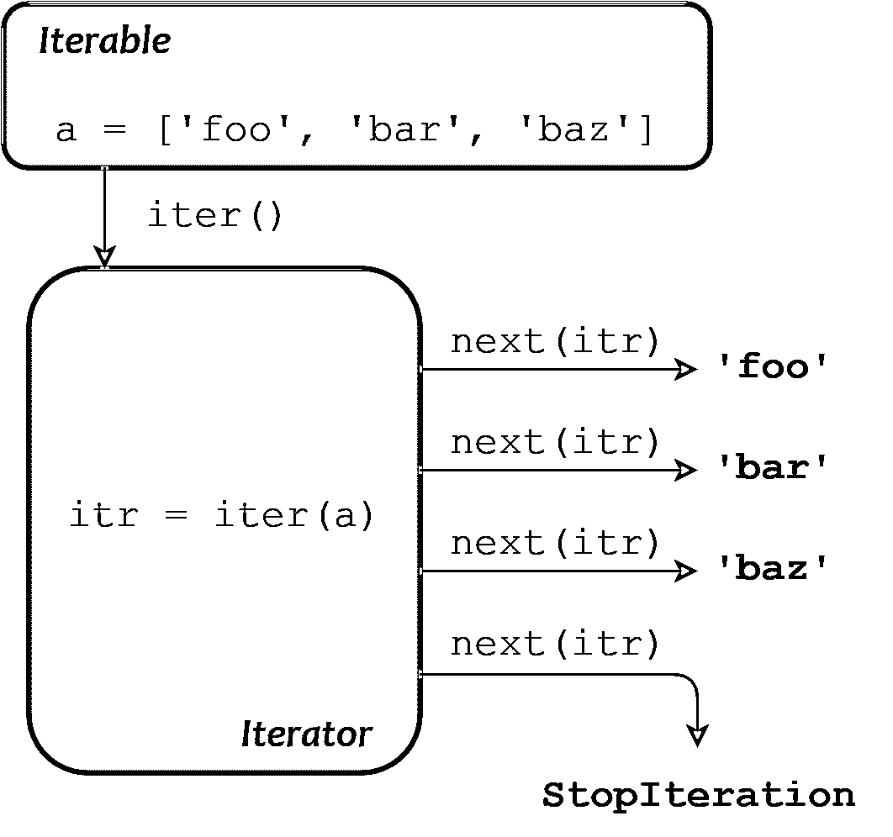

# python“for”循环(明确迭代)

> 原文：<https://realpython.com/python-for-loop/>

*立即观看**本教程有真实 Python 团队创建的相关视频课程。和书面教程一起看，加深理解: [**For Loops in Python(定迭代)**](/courses/python-for-loop/)

本教程将向你展示如何用 Python `for`循环执行**确定迭代**。

在本介绍性系列的[之前的教程](https://realpython.com/python-while-loop/)中，您学习了以下内容:

*   同一代码块的反复执行被称为**迭代**。
*   迭代有两种类型:
    *   **确定的**迭代，其中预先明确指定重复的次数
    *   **不定**迭代，其中代码块执行直到满足某个条件
*   在 Python 中，无限迭代是通过一个`while`循环来执行的。

**以下是你将在本教程中涉及的内容:**

*   您将从编程语言用来实现明确迭代的一些不同范例的比较开始。

*   然后你将学习 **iterables** 和 **iterators** ，这两个概念构成了 Python 中确定迭代的基础。

*   最后，您将把它们联系在一起，并了解 Python 的`for`循环。

**免费下载:** [从 Python 技巧中获取一个示例章节:这本书](https://realpython.com/bonus/python-tricks-sample-pdf/)用简单的例子向您展示了 Python 的最佳实践，您可以立即应用它来编写更漂亮的+Python 代码。

## 程序设计中的有限迭代综述

明确迭代循环经常被称为 **`for`** 循环，因为`for`是用于在几乎所有编程语言中引入它们的[关键字](https://realpython.com/python-keywords/)，包括 Python。

历史上，编程语言提供了几种不同风格的`for`循环。这些将在下面的章节中简要介绍。

[*Remove ads*](/account/join/)

### 数字范围循环

最基本的`for`循环是一个带有起始值和结束值的简单数值范围语句。确切的格式因语言而异，但通常如下所示:

```py
for  i  =  1  to  10
  <loop  body>
```

这里，循环体执行了十次。[变量](https://realpython.com/python-variables/) `i`在第一次迭代时取值`1`，在第二次迭代时取值`2`，依此类推。这种`for`循环在 BASIC、Algol 和 Pascal 语言中使用。

### 三表达式循环

由 [C 编程语言](https://realpython.com/c-for-python-programmers/)推广的另一种形式的`for`循环包含三个部分:

*   初始化
*   指定结束条件的表达式
*   每次迭代结束时要执行的操作。

这种类型的循环具有以下形式:

```py
for  (i  =  1;  i  <=  10;  i++) <loop  body>
```

**技术说明:**在 C 编程语言中，`i++`递增变量`i`。它大致相当于 Python 中的`i += 1`。

该循环解释如下:

*   将`i`初始化为`1`。
*   只要`i <= 10`继续循环。
*   每次循环迭代后，将`i`增加`1`。

三表达式`for`循环很受欢迎，因为为这三部分指定的表达式几乎可以是任何东西，所以这比上面显示的更简单的数值范围形式有更多的灵活性。这些`for`循环在 [C++](https://realpython.com/python-vs-cpp/) 、 [Java](https://realpython.com/oop-in-python-vs-java/) 、PHP 和 Perl 语言中也很常见。

### 基于集合或基于迭代器的循环

这种类型的循环迭代对象集合，而不是指定数值或条件:

```py
for i in <collection>
    <loop body>
```

每次循环时，变量`i`取`<collection>`中下一个对象的值。这种类型的`for`循环可以说是最一般化和最抽象的。Perl 和 PHP 也支持这种类型的循环，但是它是由关键字`foreach`而不是`for`引入的。

**延伸阅读:**查看 [For 循环](https://en.wikipedia.org/wiki/For_loop) Wikipedia 页面，深入了解跨编程语言的明确迭代的实现。

## Python `for`循环

在上面列出的循环类型中，Python 只实现了最后一种:基于集合的迭代。乍一看，这似乎是一个不公平的交易，但是请放心，Python 对确定迭代的实现是如此通用，以至于您最终不会感到被欺骗！

很快，您将详细探究 Python 的`for`循环。但是现在，让我们从一个快速原型和例子开始，只是为了熟悉一下。

Python 的`for`循环是这样的:

```py
for <var> in <iterable>:
    <statement(s)>
```

`<iterable>`是对象的集合，例如，列表或元组。与所有 Python 控制结构一样，循环体中的`<statement(s)>`用缩进表示，并且对`<iterable>`中的每一项执行一次。每次循环时，循环变量`<var>`取`<iterable>`中下一个元素的值。

这里有一个代表性的例子:

>>>

```py
>>> a = ['foo', 'bar', 'baz']
>>> for i in a:
...     print(i)
...
foo
bar
baz
```

在这个例子中，`<iterable>`是列表`a`，而`<var>`是变量`i`。每次通过循环，`i`在`a`中承担一个连续的项目，因此 [`print()`](https://realpython.com/python-print/) 分别显示值`'foo'`、`'bar'`和`'baz'`。像这样的`for`循环是处理 iterable 中项目的 Pythonic 方式。

但是什么是可迭代的呢？在进一步检查`for`循环之前，更深入地研究 Python 中的可迭代对象是有益的。

[*Remove ads*](/account/join/)

### 可重复项

在 Python 中， **iterable** 意味着一个对象可以在迭代中使用。该术语用作:

*   形容词:一个物体可以被描述为可重复的。
*   名词:一个对象可以被描述为可重复的。

如果一个对象是可迭代的，它可以被传递给内置的 Python 函数`iter()`，后者返回一个叫做**迭代器**的东西。是的，术语有点重复。坚持住。最后一切都解决了。

下例中的每个对象都是可迭代的，当传递给`iter()`时，返回某种类型的迭代器:

>>>

```py
>>> iter('foobar')                             # String
<str_iterator object at 0x036E2750>

>>> iter(['foo', 'bar', 'baz'])                # List
<list_iterator object at 0x036E27D0>

>>> iter(('foo', 'bar', 'baz'))                # Tuple
<tuple_iterator object at 0x036E27F0>

>>> iter({'foo', 'bar', 'baz'})                # Set
<set_iterator object at 0x036DEA08>

>>> iter({'foo': 1, 'bar': 2, 'baz': 3})       # Dict
<dict_keyiterator object at 0x036DD990>
```

另一方面，这些对象类型是不可迭代的:

>>>

```py
>>> iter(42)                                   # Integer
Traceback (most recent call last):
  File "<pyshell#26>", line 1, in <module>
    iter(42)
TypeError: 'int' object is not iterable

>>> iter(3.1)                                  # Float
Traceback (most recent call last):
  File "<pyshell#27>", line 1, in <module>
    iter(3.1)
TypeError: 'float' object is not iterable

>>> iter(len)                                  # Built-in function
Traceback (most recent call last):
  File "<pyshell#28>", line 1, in <module>
    iter(len)
TypeError: 'builtin_function_or_method' object is not iterable
```

到目前为止，您遇到的所有集合或容器类型的数据类型都是可迭代的。其中包括[字符串](https://realpython.com/python-strings/)，[列表](https://realpython.com/python-lists-tuples/#python-lists)，[元组](https://realpython.com/python-lists-tuples/#python-tuples)，[字典](https://realpython.com/python-dicts/)，[集合](https://realpython.com/python-sets/)，以及 [frozenset](https://realpython.com/python-sets/#frozen-sets) 类型。

但是这些绝不是唯一可以迭代的类型。Python 中内置的或模块中定义的许多对象都被设计成可迭代的。例如，Python 中的打开文件是可迭代的。正如您将在关于文件 I/O 的教程中看到的，迭代一个打开的文件对象会从文件中读取数据。

事实上，Python 中的几乎任何对象都可以变成可迭代的。即使是用户定义的对象，也可以通过迭代的方式进行设计。(在下一篇关于面向对象编程的文章中，您会发现这是如何做到的。)

### 迭代器

好了，现在你知道了一个对象是可迭代的意味着什么，你也知道了如何使用`iter()`从它那里获得一个迭代器。一旦你有了一个迭代器，你能用它做什么？

迭代器本质上是一个值生成器，它从相关的可迭代对象中产生连续的值。内置函数`next()`用于从迭代器中获取下一个值。

下面是一个使用上述相同列表的示例:

>>>

```py
>>> a = ['foo', 'bar', 'baz']

>>> itr = iter(a)
>>> itr
<list_iterator object at 0x031EFD10>

>>> next(itr)
'foo'
>>> next(itr)
'bar'
>>> next(itr)
'baz'
```

在这个例子中，`a`是一个可迭代列表，`itr`是相关的迭代器，通过`iter()`获得。每个`next(itr)`调用从`itr`获得下一个值。

注意迭代器是如何在内部保持状态的。它知道已经获得了哪些值，所以当您调用`next()`时，它知道接下来要返回什么值。

当迭代器用完值时会发生什么？让我们对上面的迭代器再进行一次`next()`调用:

>>>

```py
>>> next(itr)
Traceback (most recent call last):
  File "<pyshell#10>", line 1, in <module>
    next(itr)
StopIteration
```

如果迭代器中的所有值都已经返回，那么后续的`next()`调用将引发一个`StopIteration`异常。从迭代器获取值的任何进一步尝试都将失败。

只能从一个方向的迭代器中获取值。你不能倒退。没有`prev()`功能。但是您可以在同一个 iterable 对象上定义两个独立的迭代器:

>>>

```py
>>> a
['foo', 'bar', 'baz']

>>> itr1 = iter(a)
>>> itr2 = iter(a)

>>> next(itr1) 'foo'
>>> next(itr1)
'bar'
>>> next(itr1)
'baz'

>>> next(itr2) 'foo'
```

即使迭代器`itr1`已经在列表的末尾，`itr2`仍然在列表的开头。每个迭代器维护自己的内部状态，相互独立。

如果想一次从迭代器中获取所有值，可以使用内置的`list()`函数。在其他可能的用法中，`list()`将迭代器作为它的参数，并返回一个由迭代器产生的所有值组成的列表:

>>>

```py
>>> a = ['foo', 'bar', 'baz']
>>> itr = iter(a)
>>> list(itr)
['foo', 'bar', 'baz']
```

类似地，内置的`tuple()`和`set()`函数分别从迭代器产生的所有值中返回一个元组和一个集合:

>>>

```py
>>> a = ['foo', 'bar', 'baz']

>>> itr = iter(a)
>>> tuple(itr)
('foo', 'bar', 'baz')

>>> itr = iter(a)
>>> set(itr)
{'baz', 'foo', 'bar'}
```

不建议你养成这种习惯。迭代器的优雅之处在于它们“懒惰”这意味着当你创建一个迭代器的时候，它不会生成所有它当时能产生的项。它会一直等待，直到你用`next()`请求它们。项目直到被请求时才会被创建。

当您使用`list()`、`tuple()`等时，您是在强迫迭代器一次生成它的所有值，所以它们都可以被返回。如果迭代器返回的对象总数非常大，这可能需要很长时间。

事实上，可以使用[生成器函数](https://realpython.com/introduction-to-python-generators/)和 [`itertools`](https://realpython.com/python-itertools/) 在 Python 中创建一个迭代器，返回一系列无穷无尽的对象。如果你试图从一个无限的迭代器中一次获取所有的值，程序将[挂起](https://en.wikipedia.org/wiki/Hang_(computing))。

[*Remove ads*](/account/join/)

## Python 的内部`for`循环

现在已经向您介绍了完全理解 Python 的`for`循环如何工作所需的所有概念。继续之前，让我们回顾一下相关术语:

| 学期 | 意义 |
| --- | --- |
| **迭代** | 遍历集合中的对象或项目的过程 |
| **可迭代** | 可以被重复的物体(或用来描述物体的形容词) |
| **迭代器** | 从关联的 iterable 中产生连续项或值的对象 |
| **T2`iter()`** | 用于从 iterable 中获取迭代器的内置函数 |

现在，再次考虑本教程开始时出现的简单的`for`循环:

>>>

```py
>>> a = ['foo', 'bar', 'baz']
>>> for i in a:
...     print(i)
...
foo
bar
baz
```

这个循环可以完全用你刚刚学到的概念来描述。为了执行这个`for`循环描述的迭代，Python 执行以下操作:

*   调用`iter()`来获得`a`的迭代器
*   反复调用`next()`从迭代器中依次获取每一项
*   当`next()`引发`StopIteration`异常时终止循环

对于每一项`next()`返回，循环体被执行一次，循环变量`i`被设置为每次迭代的给定项。

下图总结了这一系列事件:

[](https://files.realpython.com/media/t.ba63222d63f5.png)

<figcaption class="figure-caption text-center">Schematic Diagram of a Python for Loop</figcaption>

也许这看起来像是许多不必要的恶作剧，但好处是巨大的。Python 完全以这种方式处理所有可迭代对象的循环，在 Python 中，可迭代对象和迭代器比比皆是:

*   许多内置对象和库对象是可迭代的。

*   有一个名为`itertools`的标准库模块，包含许多返回 iterables 的函数。

*   使用 Python 的面向对象功能创建的用户定义对象可以是可迭代的。

*   Python 有一个称为生成器的构造，它允许您以简单、直接的方式创建自己的迭代器。

在这一系列文章中，您将会发现更多关于上述内容的信息。它们都可以是一个`for`循环的目标，并且语法都是相同的。它简洁优雅，功能多样。

## 遍历字典

您之前看到迭代器可以从带有`iter()`的字典中获得，所以您知道字典必须是可迭代的。当你在字典中循环时会发生什么？让我们看看:

>>>

```py
>>> d = {'foo': 1, 'bar': 2, 'baz': 3}
>>> for k in d:
...     print(k)
...
foo
bar
baz
```

如您所见，当一个`for`循环[遍历一个字典](https://realpython.com/iterate-through-dictionary-python/)时，循环变量被分配给字典的键。

要访问循环中的字典值，您可以像往常一样使用键进行字典引用:

>>>

```py
>>> for k in d:
...     print(d[k])
...
1
2
3
```

您还可以使用`.values()`直接遍历字典的值:

>>>

```py
>>> for v in d.values():
...     print(v)
...
1
2
3
```

事实上，您可以同时遍历字典的键和值。这是因为`for`循环的循环变量不仅限于单个变量。它也可以是元组，在这种情况下，使用打包和解包从 iterable 中的项进行赋值，就像赋值语句一样:

>>>

```py
>>> i, j = (1, 2) >>> print(i, j)
1 2

>>> for i, j in [(1, 2), (3, 4), (5, 6)]: ...     print(i, j)
...
1 2
3 4
5 6
```

正如在 Python [字典](https://realpython.com/python-dicts/#built-in-dictionary-methods)的教程中所提到的，字典方法`.items()`有效地返回了一列作为元组的键/值对:

>>>

```py
>>> d = {'foo': 1, 'bar': 2, 'baz': 3}

>>> d.items()
dict_items([('foo', 1), ('bar', 2), ('baz', 3)])
```

因此，遍历字典访问键和值的 Pythonic 方法如下所示:

>>>

```py
>>> d = {'foo': 1, 'bar': 2, 'baz': 3}
>>> for k, v in d.items():
...     print('k =', k, ', v =', v)
...
k = foo , v = 1
k = bar , v = 2
k = baz , v = 3
```

[*Remove ads*](/account/join/)

## `range()`功能

在本教程的第一部分中，您看到了一种称为[数值范围循环](https://realpython.com/python-for-loop/#numeric-range-loop)的`for`循环，其中指定了起始和结束数值。虽然这种形式的`for`循环没有直接内置到 Python 中，但是很容易实现。

例如，如果您想迭代从`0`到`4`的值，您可以简单地这样做:

>>>

```py
>>> for n in (0, 1, 2, 3, 4):
...     print(n)
...
0
1
2
3
4
```

当只有几个数字时，这个解决方案还不错。但是如果数字范围大得多，它会很快变得乏味。

令人高兴的是，Python 提供了一个更好的选项——内置的`range()`函数，它返回一个产生整数序列的 iterable。

`range(<end>)`返回一个 iterable，该 iterable 产生从`0`开始的整数，直到但不包括`<end>`:

>>>

```py
>>> x = range(5)
>>> x
range(0, 5)
>>> type(x)
<class 'range'>
```

请注意，`range()`返回的是一个类`range`的对象，而不是一个值的列表或元组。因为`range`对象是可迭代的，所以可以通过用`for`循环迭代它们来获得值:

>>>

```py
>>> for n in x:
...     print(n)
...
0
1
2
3
4
```

你也可以用`list()`或`tuple()`一次抓取所有的值。在 REPL 会话中，这是快速显示值的便捷方式:

>>>

```py
>>> list(x)
[0, 1, 2, 3, 4]

>>> tuple(x)
(0, 1, 2, 3, 4)
```

然而，当`range()`被用在一个更大的应用程序的代码中时，以这种方式使用`list()`或`tuple()`通常被认为是不良的做法。像迭代器一样，`range`对象是懒惰的——指定范围内的值直到被请求时才会生成。在一个`range`对象上使用`list()`或`tuple()`强制所有的值一次返回。这很少是必要的，如果列表很长，会浪费时间和内存。

`range(<begin>, <end>, <stride>)`返回一个 iterable，该 iterable 产生从`<begin>`开始的整数，直到但不包括`<end>`。如果指定，`<stride>`表示值之间的跳跃量(类似于用于字符串和列表切片的跨距值):

>>>

```py
>>> list(range(5, 20, 3))
[5, 8, 11, 14, 17]
```

如果省略`<stride>`，则默认为`1`:

>>>

```py
>>> list(range(5, 10, 1))
[5, 6, 7, 8, 9]
>>> list(range(5, 10))
[5, 6, 7, 8, 9]
```

指定给`range()`的所有参数必须是整数，但其中任何一个都可以是负数。自然，如果`<begin>`大于`<end>`，`<stride>`一定是负数(如果你想要任何结果的话):

>>>

```py
>>> list(range(-5, 5))
[-5, -4, -3, -2, -1, 0, 1, 2, 3, 4]

>>> list(range(5, -5))
[]
>>> list(range(5, -5, -1))
[5, 4, 3, 2, 1, 0, -1, -2, -3, -4]
```

**技术说明:**严格来说，`range()`并不完全是一个内置函数。它被实现为一个创建不可变序列类型的可调用类。但出于实用目的，它的行为就像一个内置函数。

更多关于`range()`的信息，请看真正的 Python 文章 [Python 的`range()`函数(指南)](https://realpython.com/python-range)。

[*Remove ads*](/account/join/)

## 改变`for`循环行为

在本介绍性系列的上一篇教程中，您已经看到了如何使用 [`break`和`continue`语句](https://realpython.com/python-while-loop/#interruption-of-loop-iteration)中断`while`循环的执行，并使用 [`else`子句](https://realpython.com/python-while-loop/#the-else-clause)对其进行修改。这些功能在`for`循环中也是可用的。

### `break`和`continue`报表

`break`和`continue`与`for`回路的工作方式与`while`回路相同。`break`完全终止循环，并继续执行循环后的第一条语句:

>>>

```py
>>> for i in ['foo', 'bar', 'baz', 'qux']:
...     if 'b' in i:
...         break ...     print(i)
...
foo
```

`continue`终止当前迭代并进行下一次迭代:

>>>

```py
>>> for i in ['foo', 'bar', 'baz', 'qux']:
...     if 'b' in i:
...         continue ...     print(i)
...
foo
qux
```

### `else`条款

一个`for`循环也可以有一个`else`子句。这种解释类似于一个`while`循环。如果循环因 iterable 用尽而终止，将执行`else`子句:

>>>

```py
>>> for i in ['foo', 'bar', 'baz', 'qux']:
...     print(i)
... else:
...     print('Done.')  # Will execute
...
foo
bar
baz
qux
Done.
```

如果列表被一个`break`语句分解，则`else`子句不会被执行:

>>>

```py
>>> for i in ['foo', 'bar', 'baz', 'qux']:
...     if i == 'bar':
...         break ...     print(i)
... else:
...     print('Done.')  # Will not execute
...
foo
```

## 结论

本教程介绍了`for`循环，它是 Python 中**确定迭代**的主力。

您还了解了 **iterables** 和 **iterators** 的内部工作原理，这两种重要的对象类型是定义迭代的基础，但在其他各种 Python 代码中也很重要。

在这个介绍性系列的下两个教程中，您将稍微改变一下思路，探索 Python 程序如何通过从键盘的**输入**和从控制台的**输出**与用户交互。

[« Python "while" Loops (Indefinite Iteration)](https://realpython.com/python-while-loop/)[Python "for" Loops (Definite Iteration)](#)[Basic Input and Output in Python »](https://realpython.com/python-input-output/)

*立即观看**本教程有真实 Python 团队创建的相关视频课程。和书面教程一起看，加深理解: [**For Loops in Python(定迭代)**](/courses/python-for-loop/)*******