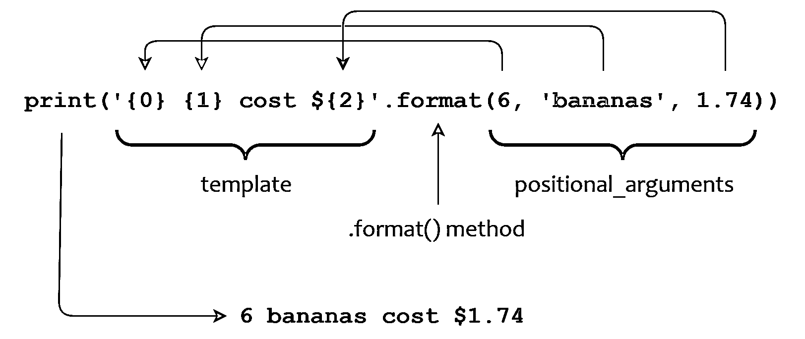

# 较新的 Python 字符串格式技术指南

> 原文：<https://realpython.com/python-formatted-output/>

*立即观看**本教程有真实 Python 团队创建的相关视频课程。配合文字教程一起看，加深理解: [**格式化 Python 字符串**](/courses/formatting-python-strings/)

在这个介绍性系列的[之前的教程](https://realpython.com/python-input-output/)中，您已经初步了解了如何用 **Python f-strings** 格式化您的[字符串](https://realpython.com/python-strings/)。在本教程的末尾，您会学到更多关于这种技术的知识。

由于 f-string 对于 Python 语言来说相对较新，所以熟悉第二种稍微老一点的技术也是有好处的。您可能会在较旧的 Python 代码中遇到它。

在本教程中，您将了解到:

1.  **弦`.format()`法**
2.  **格式的字符串文字**，或者 **f-string**

您将详细了解这些格式化技术，并将它们添加到 Python 字符串格式化工具包中。

**注意:**有一个名为`string`的标准模块，包含一个名为 [`Template`](https://docs.python.org/3.4/library/string.html#template-strings) 的类，它也通过插值提供一些字符串格式。一种相关的技术，**字符串模操作符**，提供了或多或少相同的功能。在本教程中，您不会涉及这些技术中的任何一种，但是如果您必须使用 Python 2 编写的代码，您会希望阅读一下[字符串模操作符](https://realpython.com/python-modulo-string-formatting/)。

您可能会注意到，在 Python 中有许多不同的方法来格式化字符串，这违背了 Python 自己的一条原则:

> 应该有一种——最好只有一种——显而易见的方法来做这件事。—蒂姆·彼得斯，Python 的禅宗

在 Python 存在和发展的这些年里，不同的字符串格式化技术得到了历史性的发展。旧的技术被保留下来以确保向后兼容性，有些甚至有特定的用例。

如果你刚开始使用 Python，并且正在寻找一种格式化字符串的单一方法，那么请坚持使用 Python 3 的 f 字符串。如果您遇到了看起来很奇怪的字符串格式代码并想了解更多，或者您需要使用旧版本的 Python，那么学习其他技术也是一个好主意。

## Python 字符串`.format()`方法

Python string `.format()`方法是在 2.6 版本中引入的。它在很多方面都类似于字符串模操作符，但是`.format()`在通用性方面远远超过它。Python `.format()`调用的一般形式如下所示:

```py
<template>.format(<positional_argument(s)>, <keyword_argument(s)>)
```

请注意，这是一个方法，而不是一个运算符。您调用`<template>`上的方法，这是一个包含**替换字段**的字符串。该方法的`<positional_arguments>`和`<keyword_arguments>`指定插入到`<template>`中代替替换字段的值。得到的格式化字符串是该方法的返回值。

在`<template>`字符串中，替换字段用花括号(`{}`)括起来。花括号中没有包含的内容是直接从模板复制到输出中的文本。如果您需要在模板字符串中包含一个文字花括号字符，如`{`或`}`，那么您可以通过将它加倍来转义该字符:

>>>

```py
>>> '{{ {0} }}'.format('foo')
'{ foo }'
```

现在输出中包含了花括号。

[*Remove ads*](/account/join/)

## 字符串`.format()`方法:参数

在深入了解如何在 Python 中使用这个方法格式化字符串的更多细节之前，让我们从一个简单的例子开始。回顾一下，这里是上一篇教程中关于[字符串模操作符](https://realpython.com/python-input-output/#the-string-modulo-operator)的第一个例子:

>>>

```py
>>> print('%d  %s cost $%.2f' % (6, 'bananas', 1.74))
6 bananas cost $1.74
```

这里，您使用 Python 中的字符串模操作符来格式化字符串。现在，您可以使用 Python 的 string `.format()`方法来获得相同的结果，如下所示:

>>>

```py
>>> print('{0}  {1} cost ${2}'.format(6, 'bananas', 1.74))
6 bananas cost $1.74
```

在本例中，`<template>`是字符串`'{0} {1} cost ${2}'`。替换字段是`{0}`、`{1}`和`{2}`，它们包含与从零开始的位置参数`6`、`'bananas'`和`1.74`相对应的数字。每个位置参数都被插入到模板中，代替其对应的替换字段:

[](https://files.realpython.com/media/t.e6b8525755da.png)

<figcaption class="figure-caption text-center">Using The String .format() Method in Python to Format a String With Positional Arguments</figcaption>

下一个例子使用[关键字参数](https://realpython.com/python-kwargs-and-args/)而不是位置参数来产生相同的结果:

>>>

```py
>>> print('{quantity}  {item} cost ${price}'.format(
...     quantity=6,
...     item='bananas',
...     price=1.74))
6 bananas cost $1.74
```

在这种情况下，替换字段是`{quantity}`、`{item}`和`{price}`。这些字段指定对应于关键字参数`quantity=6`、`item='bananas'`和`price=1.74`的关键字。每个关键字值都被插入到模板中，代替其对应的替换字段:

[](https://files.realpython.com/media/t.53be85450e90.png)

<figcaption class="figure-caption text-center">Using The String .format() Method in Python to Format a String With Keyword Arguments</figcaption>

在这个介绍性系列的下一篇教程中，您将了解到更多关于位置和关键字参数的知识，该教程将探索函数和参数传递。现在，接下来的两节将向您展示如何在 Python `.format()`方法中使用它们。

### 位置参数

位置参数被插入到模板中，代替**编号的替换字段**。像[列表](https://realpython.com/courses/lists-tuples-python/)索引一样，替换字段的编号是从零开始的。第一个位置参数编号为`0`，第二个编号为`1`，依此类推:

>>>

```py
>>> '{0}/{1}/{2}'.format('foo', 'bar', 'baz')
'foo/bar/baz'
```

请注意，替换字段不必按数字顺序出现在模板中。它们可以按任何顺序指定，并且可以出现多次:

>>>

```py
>>> '{2}.{1}.{0}/{0}{0}.{1}{1}.{2}{2}'.format('foo', 'bar', 'baz')
'baz.bar.foo/foofoo.barbar.bazbaz'
```

当你指定一个超出范围的替换字段号时，你会得到一个[错误](https://realpython.com/courses/python-exceptions-101/)。在下面的例子中，位置参数被编号为`0`、`1`和`2`，但是您在模板中指定了`{3}`:

>>>

```py
>>> '{3}'.format('foo', 'bar', 'baz')
Traceback (most recent call last):
  File "<pyshell#26>", line 1, in <module>
    '{3}'.format('foo', 'bar', 'baz')
IndexError: tuple index out of range
```

这引发了一个`IndexError` [异常](https://realpython.com/python-exceptions/)。

从 Python 3.1 开始，您可以省略替换字段中的数字，在这种情况下，解释器会假定顺序。这被称为**自动字段编号**:

>>>

```py
>>> '{}/{}/{}'.format('foo', 'bar', 'baz')
'foo/bar/baz'
```

指定自动字段编号时，必须提供至少与替换字段一样多的参数:

>>>

```py
>>> '{}{}{}{}'.format('foo','bar','baz')
Traceback (most recent call last):
  File "<pyshell#27>", line 1, in <module>
    '{}{}{}{}'.format('foo','bar','baz')
IndexError: tuple index out of range
```

在这种情况下，模板中有四个替换字段，但只有三个参数，所以出现了一个`IndexError`异常。另一方面，如果参数比替换字段多也没关系。多余的参数根本不用:

>>>

```py
>>> '{}{}'.format('foo', 'bar', 'baz')
'foobar'
```

这里，参数`'baz'`被忽略。

请注意，您不能混合使用这两种技术:

>>>

```py
>>> '{1}{}{0}'.format('foo','bar','baz')
Traceback (most recent call last):
  File "<pyshell#28>", line 1, in <module>
    '{1}{}{0}'.format('foo','bar','baz')
ValueError: cannot switch from manual field specification to automatic field
 numbering
```

当使用 Python 格式化带有位置参数的字符串时，必须在自动或显式替换字段编号之间进行选择。

[*Remove ads*](/account/join/)

### 关键字参数

关键字参数被插入到模板字符串中，代替具有相同名称的**关键字替换字段:**

>>>

```py
>>> '{x}/{y}/{z}'.format(x='foo', y='bar', z='baz')
'foo/bar/baz'
```

在这个例子中，关键字参数`x`、`y`和`z`的值分别代替替换字段`{x}`、`{y}`和`{z}`。

如果您引用了一个丢失的关键字参数，那么您将看到一个错误:

>>>

```py
>>> '{x}/{y}/{w}'.format(x='foo', y='bar', z='baz')
Traceback (most recent call last):
  File "<stdin>", line 1, in <module>
KeyError: 'w'
```

这里，您指定了替换字段`{w}`，但是没有相应的名为`w`的关键字参数。巨蟒召唤出 [`KeyError`异常](https://realpython.com/python-keyerror/)。

虽然必须按顺序指定位置参数，但是可以按任意顺序指定关键字参数:

>>>

```py
>>> '{0}/{1}/{2}'.format('foo', 'bar', 'baz')
'foo/bar/baz'
>>> '{0}/{1}/{2}'.format('bar', 'baz', 'foo')
'bar/baz/foo'

>>> '{x}/{y}/{z}'.format(x='foo', y='bar', z='baz')
'foo/bar/baz'
>>> '{x}/{y}/{z}'.format(y='bar', z='baz', x='foo')
'foo/bar/baz'
```

您可以在一个 Python `.format()`调用中同时指定位置参数和关键字参数。请注意，如果您这样做，那么所有的**位置参数必须出现在**任何关键字参数之前:

>>>

```py
>>> '{0}{x}{1}'.format('foo', 'bar', x='baz')
'foobazbar'
>>> '{0}{x}{1}'.format('foo', x='baz', 'bar')
  File "<stdin>", line 1
SyntaxError: positional argument follows keyword argument
```

事实上，所有位置参数出现在任何关键字参数之前的要求并不仅仅适用于 Python 格式的方法。这通常适用于任何函数或方法调用。在本系列的下一篇教程中，您将了解到更多关于函数和函数调用的内容。

在迄今为止的所有示例中，传递给 Python `.format()`方法的值都是文字值，但是您也可以指定[变量](https://realpython.com/python-variables/):

>>>

```py
>>> x = 'foo'
>>> y = 'bar'
>>> z = 'baz'
>>> '{0}/{1}/{s}'.format(x, y, s=z)
'foo/bar/baz'
```

在这种情况下，将变量`x`和`y`作为位置参数值传递，将`z`作为关键字参数值传递。

## 字符串`.format()`方法:简单替换字段

如您所见，当您调用 Python 的`.format()`方法时，`<template>`字符串包含了**替换字段**。它们指示在模板中的什么位置插入方法的参数。替换字段由三部分组成:

> `{[<name>][!<conversion>][:<format_spec>]}`

这些组件解释如下:

| 成分 | 意义 |
| --- | --- |
| `<name>` | 指定要格式化的值的来源 |
| `<conversion>` | 指示使用哪个标准 Python 函数来执行转换 |
| `<format_spec>` | 指定了有关如何转换值的更多详细信息 |

每个组件都是可选的，可以省略。让我们更深入地看看每个组件。

[*Remove ads*](/account/join/)

### `<name>`组件

`<name>`组件是替换字段的第一部分:

> `{`**`[<name>]`**T2】

`<name>`表示将参数列表中的哪个参数插入到 Python 格式字符串的给定位置。它要么是位置参数的数字，要么是关键字参数的关键字。在下面的例子中，替换字段的`<name>`组件分别是`0`、`1`和`baz`:

>>>

```py
>>> x, y, z = 1, 2, 3
>>> '{0}, {1}, {baz}'.format(x, y, baz=z)
'1, 2, 3'
```

如果一个参数是一个列表，那么您可以使用带有`<name>`的索引来访问列表的元素:

>>>

```py
>>> a = ['foo', 'bar', 'baz']
>>> '{0[0]}, {0[2]}'.format(a)
'foo, baz'
>>> '{my_list[0]}, {my_list[2]}'.format(my_list=a)
'foo, baz'
```

类似地，如果相应的参数是一个[字典](https://realpython.com/courses/dictionaries-python/)，那么您可以使用带有`<name>`的键引用:

>>>

```py
>>> d = {'key1': 'foo', 'key2': 'bar'}
>>> d['key1']
'foo'
>>> '{0[key1]}'.format(d)
'foo'
>>> d['key2']
'bar'
>>> '{my_dict[key2]}'.format(my_dict=d)
'bar'
```

您也可以从替换字段中引用**对象属性**。在本系列的[之前的教程](https://realpython.com/python-variables/#object-references)中，您了解到 Python 中的几乎每一项数据都是一个**对象**。对象可能有分配给它们的**属性**，这些属性使用点符号来访问:

```py
obj.attr
```

这里，`obj`是一个属性名为`attr`的对象。使用点符号来访问对象的属性。让我们看一个例子。[Python 中的复数](https://realpython.com/python-complex-numbers/)具有名为`.real`和`.imag`的属性，分别代表数字的实部和虚部。您也可以使用点符号来访问它们:

>>>

```py
>>> z = 3+5j
>>> type(z)
<class 'complex'>
>>> z.real
3.0
>>> z.imag
5.0
```

本系列中有几个即将推出的关于面向对象编程的教程，在这些教程中，您将学到更多关于像这样的对象属性的知识。

在这种情况下，对象属性的相关性在于您可以在 Python `.format()`替换字段中指定它们:

>>>

```py
>>> z
(3+5j)
>>> 'real = {0.real}, imag = {0.imag}'.format(z)
'real = 3.0, imag = 5.0'
```

如您所见，在 Python 中使用`.format()`方法格式化复杂对象的组件相对简单。

### `<conversion>`组件

`<conversion>`组件是替换字段的中间部分:

> `{[<name>]`**`[!<conversion>]`**T2】

Python 可以使用三种不同的内置函数将对象格式化为字符串:

1.  `str()`
2.  `repr()`
3.  `ascii()`

默认情况下，Python `.format()`方法使用`str()`，但是在某些情况下，您可能想要强制`.format()`使用另外两个中的一个。您可以使用替换字段的`<conversion>`组件来实现这一点。`<conversion>`的可能值如下表所示:

| 价值 | 意义 |
| --- | --- |
| `!s` | 用`str()`转换 |
| `!r` | 用`repr()`转换 |
| `!a` | 用`ascii()`转换 |

以下示例分别使用`str()`、`repr()`和`ascii()`强制 Python 执行字符串转换:

>>>

```py
>>> '{0!s}'.format(42)
'42'
>>> '{0!r}'.format(42)
'42'
>>> '{0!a}'.format(42)
'42'
```

在许多情况下，无论您使用哪种转换函数，结果都是一样的，正如您在上面的示例中所看到的。也就是说，您不会经常需要`<conversion>`组件，所以您不会在这里花费太多时间。但是，在有些情况下会有所不同，所以最好意识到，如果需要，您可以强制使用特定的转换函数。

[*Remove ads*](/account/join/)

### `<format_spec>`组件

`<format_spec>`组件是替换字段的最后一部分:

> `{[<name>][!<conversion>]`**`[:<format_spec>]`**T2】

`<format_spec>`代表 Python `.format()`方法功能的核心。它包含在将值插入模板字符串之前对如何格式化值进行精细控制的信息。一般形式是这样的:

> :`[[<fill>]<align>][<sign>][#][0][<width>][<group>][.<prec>][<type>]`

`<format_spec>`的十个子组件按所示顺序指定。它们控制格式，如下表所述:

| 亚成分 | 影响 |
| --- | --- |
| `:` | 将`<format_spec>`与替换字段的其余部分分开 |
| `<fill>` | 指定如何填充未占据整个字段宽度的值 |
| `<align>` | 指定如何对齐未占据整个字段宽度的值 |
| `<sign>` | 控制数值中是否包含前导符号 |
| `#` | 为某些演示类型选择替代输出形式 |
| `0` | 使值在左边用零而不是 ASCII 空格字符填充 |
| `<width>` | 指定输出的最小宽度 |
| `<group>` | 指定了数字输出的分组字符 |
| `.<prec>` | 指定浮点表示类型小数点后的位数，以及字符串表示类型的最大输出宽度 |
| `<type>` | 指定表示类型，这是对相应参数执行的转换类型 |

这些函数类似于字符串模操作符[转换说明符](https://realpython.com/python-input-output/#conversion-specifiers)中的组件，但是功能更强大。在接下来的几节中，您将看到对它们的功能更全面的解释。

#### **`<type>`** 子组件

先说 **`<type>`** ，这是`<format_spec>`的最后一部分。`<type>`子组件指定表示类型，表示类型是对相应值执行的转换类型，以产生输出。可能的值如下所示:

| 价值 | 演示类型 |
| --- | --- |
| `b` | 二进制整数 |
| `c` | 单字符 |
| `d` | 十进制整数 |
| `e`或`E` | 指数的 |
| `f`或`F` | 浮点 |
| `g`或`G` | 浮点或指数 |
| `o` | 八进制整数 |
| `s` | 线 |
| `x`或`X` | 十六进制整数 |
| `%` | 百分率 |

这些就像与字符串模运算符一起使用的[转换类型](https://realpython.com/python-input-output/#conversion-type)，在许多情况下，它们的功能是相同的。以下示例展示了相似性:

>>>

```py
>>> '%d' % 42
'42'
>>> '{:d}'.format(42)
'42'

>>> '%f' % 2.1
'2.100000'
>>> '{:f}'.format(2.1)
'2.100000'

>>> '%s' % 'foobar'
'foobar'
>>> '{:s}'.format('foobar')
'foobar'

>>> '%x' % 31
'1f'
>>> '{:x}'.format(31)
'1f'
```

然而，在一些 Python `.format()`表示类型和字符串模操作符转换类型之间有一些细微的差别:

| 类型 | `.format()`方法 | 字符串模运算符 |
| --- | --- | --- |
| **b** | 指定二进制整数转换 | 不支持 |
| **i，u** | 不支持 | 指定整数转换 |
| **c** | 指定字符转换，相应的值必须是整数 | 指定字符转换，但相应的值可以是整数或单个字符串 |
| **g，G** | 在浮点或指数输出之间选择，但是控制选择的规则稍微复杂一些 | 根据指数的大小和为`<prec>`指定的值，选择浮点或指数输出 |
| **r，a** | 不支持(尽管该功能由替换字段中的`!r`和`!a`转换组件提供) | 分别用`repr()`或`ascii()`指定转换 |
| **%** | 将数值参数转换为百分比 | 在输出中插入一个文字字符`'%'` |

接下来，您将看到几个说明这些差异的例子，以及 Python `.format()`方法表示类型的一些附加特性。您将看到的第一个演示类型是`b`，它指定了**二进制整数转换**:

>>>

```py
>>> '{:b}'.format(257)
'100000001'
```

模运算符根本不支持二进制转换类型:

>>>

```py
>>> '%b' % 257
Traceback (most recent call last):
  File "<stdin>", line 1, in <module>
ValueError: unsupported format character 'b' (0x62) at index 1
```

然而，模操作符允许**十进制整数转换**为`d`、`i`和`u`类型。只有`d`表示类型使用 Python `.format()`方法表示十进制整数转换。不支持`i`和`u`演示类型，也没有必要。

接下来是**单字转换**。模运算符允许整数或单个字符值使用`c`转换类型:

>>>

```py
>>> '%c' % 35
'#'
>>> '%c' % '#'
'#'
```

另一方面，Python 的`.format()`方法要求对应于`c`表示类型的值是一个整数:

>>>

```py
>>> '{:c}'.format(35)
'#'
>>> '{:c}'.format('#')
Traceback (most recent call last):
  File "<stdin>", line 1, in <module>
ValueError: Unknown format code 'c' for object of type 'str'
```

当你试图传递一个不同类型的值时，你会得到一个`ValueError`。

对于字符串模运算符和 Python 的`.format()`方法， **`g`转换类型**根据指数的大小和为`<prec>`指定的值选择浮点或指数输出:

>>>

```py
>>> '{:g}'.format(3.14159)
'3.14159'

>>> '{:g}'.format(-123456789.8765)
'-1.23457e+08'
```

管理选择的[精确规则](https://docs.python.org/3.4/library/string.html#format-specification-mini-language)在`.format()`中比在模运算符中稍微复杂一些。一般来说，你可以相信这个选择是有意义的。

**`G`** 与`g`相同，除了当输出是指数时，在这种情况下`'E'`将是大写的:

>>>

```py
>>> '{:G}'.format(-123456789.8765)
'-1.23457E+08'
```

结果与前面的例子相同，但是这次使用了大写的`'E'`。

**注意:**在其他一些情况下，你会发现`g`和`G`演示类型的不同。

在某些情况下，浮点运算可以产生一个基本上是无限的**值。这样的数字在 Python 中的字符串表示是 **`'inf'`** 。浮点运算也可能产生无法用数字表示的值。Python 用字符串`'NaN'`来表示这一点，它代表**而不是数字**。*

*当您将这些值传递给 Python 的`.format()`方法时，`g`表示类型产生小写输出，`G`产生大写输出:

>>>

```py
>>> x = 1e300 * 1e300
>>> x
inf

>>> '{:g}'.format(x)
'inf'
>>> '{:g}'.format(x * 0)
'nan'

>>> '{:G}'.format(x)
'INF'
>>> '{:G}'.format(x * 0)
'NAN'
```

您还会看到`f`和`F`演示类型的类似行为:

>>>

```py
>>> '{:f}'.format(x)
'inf'
>>> '{:F}'.format(x)
'INF'

>>> '{:f}'.format(x * 0)
'nan'
>>> '{:F}'.format(x * 0)
'NAN'
```

有关浮点表示、`inf`和`NaN`的更多信息，请查看维基百科关于 [IEEE 754-1985](https://en.wikipedia.org/wiki/IEEE_754-1985) 的页面。**  **模运算符支持 **`r`和`a`转换类型**，分别通过`repr()`和`ascii()`强制转换。Python 的`.format()`方法不支持`r`和`a`表示类型，但是您可以使用替换字段中的`!r`和`!a`转换组件完成同样的事情。

最后，您可以使用带有模运算符的 **`%`转换类型**将文字`'%'`字符插入到输出中:

>>>

```py
>>> '%f%%' % 65.0
'65.000000%'
```

在 Python `.format()`方法的输出中插入文字`'%'`字符并不需要任何特殊的东西，因此`%`表示类型为**百分比输出**提供了不同的方便用途。它将指定值乘以 100，并附加一个百分号:

>>>

```py
>>> '{:%}'.format(0.65)
'65.000000%'
```

`<format_spec>`的其余部分指示如何格式化所选的表示类型，与字符串模操作符的[宽度和精度说明符](https://realpython.com/python-input-output/#width-and-precision-specifiers)和[转换标志](https://realpython.com/python-input-output/#conversion-flags)非常相似。这些将在以下章节中进行更全面的描述。

#### **`<fill>`** 和 **`<align>`** 子组件

`<fill>`和`<align>`控制如何在指定的字段宽度内填充和定位格式化的输出。这些子组件只有在格式化字段值没有占据整个字段宽度时才有意义，这种情况只有在用`<width>`指定最小字段宽度时才会发生。如果没有指定`<width>`，那么`<fill>`和`<align>`将被忽略。在本教程的后面部分，您将会谈到`<width>`。

以下是`<align>`子组件的可能值:

*   `<`
*   `>`
*   `^`
*   `=`

使用小于号(`<`)的值表示输出是左对齐的:

>>>

```py
>>> '{0:<8s}'.format('foo')
'foo     '
>>> '{0:<8d}'.format(123)
'123     '
```

这是字符串值的默认行为。

使用大于号(`>`)的值表示输出应该右对齐:

>>>

```py
>>> '{0:>8s}'.format('foo')
'     foo'
>>> '{0:>8d}'.format(123)
'     123'
```

这是数值的默认行为。

使用插入符号(`^`)的值表示输出应该在输出字段中居中:

>>>

```py
>>> '{0:^8s}'.format('foo')
'  foo   '
>>> '{0:^8d}'.format(123)
'  123   '
```

最后，您还可以使用等号(`=`)为`<align>`子组件指定一个值。这只对数值有意义，并且只在输出中包含符号时才有意义。

当数字输出包含符号时，它通常直接放在数字第一个数字的左边，如上所示。如果`<align>`被设置为等号(`=`，则符号出现在输出字段的左边缘，并且在符号和数字之间放置填充符:

>>>

```py
>>> '{0:+8d}'.format(123)
'    +123'
>>> '{0:=+8d}'.format(123)
'+    123'

>>> '{0:+8d}'.format(-123)
'    -123'
>>> '{0:=+8d}'.format(-123)
'-    123'
```

您将在下一节详细介绍`<sign>`组件。

`<fill>`指定当格式化值没有完全填充输出宽度时，如何填充额外的空间。可以是除花括号(`{}`)以外的任何字符。(如果你真的觉得必须用花括号填充一个字段，那么你只能另寻他法了！)

使用`<fill>`的一些例子如下所示:

>>>

```py
>>> '{0:->8s}'.format('foo')
'-----foo'

>>> '{0:#<8d}'.format(123)
'123#####'

>>> '{0:*^8s}'.format('foo')
'**foo***'
```

如果您为`<fill>`指定了一个值，那么您也应该为`<align>`包含一个值。

#### **`<sign>`** 子组件

您可以使用`<sign>`组件控制**符号**是否出现在数字输出中。例如，在下面的例子中，`<format_spec>`中指定的加号(`+`)表示该值应该总是以前导符号显示:

>>>

```py
>>> '{0:+6d}'.format(123)
'  +123'
>>> '{0:+6d}'.format(-123)
'  -123'
```

在这里，您使用加号(`+`)，因此正值和负值都将包含一个符号。如果使用减号(`-`)，则只有负数值会包含前导符号，而正值不会:

>>>

```py
>>> '{0:-6d}'.format(123)
'   123'
>>> '{0:-6d}'.format(-123)
'  -123'
```

当您使用单个空格(`' '`)时，这意味着负值包含一个符号，正值包含一个 ASCII 空格字符:

>>>

```py
>>> '{0:*> 6d}'.format(123)
'** 123'

>>> '{0:*>6d}'.format(123)
'***123'

>>> '{0:*> 6d}'.format(-123)
'**-123'
```

因为空格字符是默认的填充字符，所以只有在指定了替代的`<fill>`字符时，您才会注意到它的影响。

最后，回想一下上面的内容，当您为`<align>`指定等号(`=`)并包含一个`<sign>`说明符时，填充位于符号和值之间，而不是符号的左边。

#### **`#`** 子组件

当您在`<format_spec>`中指定一个散列字符(`#`)时，Python 将为某些表示类型选择一个替代的输出形式。这类似于字符串模运算符的`#`转换标志。对于二进制、八进制和十六进制表示类型，哈希字符(`#`)导致在值的左侧包含一个显式的基本指示符:

>>>

```py
>>> '{0:b}, {0:#b}'.format(16)
'10000, 0b10000'
>>> '{0:o}, {0:#o}'.format(16)
'20, 0o20'
>>> '{0:x}, {0:#x}'.format(16)
'10, 0x10'
```

如您所见，基本指示器可以是`0b`、`0o`或`0x`。

对于浮点或指数表示类型，哈希字符强制输出包含小数点，即使输出由整数组成:

>>>

```py
>>> '{0:.0f}, {0:#.0f}'.format(123)
'123, 123.'
>>> '{0:.0e}, {0:#.0e}'.format(123)
'1e+02, 1.e+02'
```

对于除上述显示类型之外的任何显示类型，散列字符(`#`)不起作用。

#### **`0`** 子组件

如果输出小于指示的字段宽度，并且您在`<format_spec>`中指定了数字零(`0`)，那么值将在左边用零填充，而不是 ASCII 空格字符:

>>>

```py
>>> '{0:05d}'.format(123)
'00123'
>>> '{0:08.1f}'.format(12.3)
'000012.3'
```

您通常将它用于数值，如上所示。但是，它也适用于字符串值:

>>>

```py
>>> '{0:>06s}'.format('foo')
'000foo'
```

如果您同时指定了`<fill>`和`<align>`，那么`<fill>`将覆盖`0`:

>>>

```py
>>> '{0:*>05d}'.format(123)
'**123'
```

`<fill>`和`0`本质上控制相同的东西，所以没有必要指定两者。事实上，`0`真的是多余的，可能是为了方便熟悉字符串模运算符类似的`0`转换标志的开发人员而包含进来的。

#### **`<width>`** 子组件

`<width>`指定输出字段的最小宽度:

>>>

```py
>>> '{0:8s}'.format('foo')
'foo     '
>>> '{0:8d}'.format(123)
'     123'
```

注意，这是一个**最小字段宽度**。假设您指定了一个比最小值长的值:

>>>

```py
>>> '{0:2s}'.format('foobar')
'foobar'
```

在这种情况下，`<width>`实际上被忽略了。

#### **`<group>`** 子组件

`<group>`允许您在数字输出中包含一个**分组分隔符**。对于十进制和浮点表示类型，`<group>`可以指定为逗号字符(`,`)或下划线字符(`_`)。然后，该字符在输出中分隔每组三位数:

>>>

```py
>>> '{0:,d}'.format(1234567)
'1,234,567'
>>> '{0:_d}'.format(1234567)
'1_234_567'

>>> '{0:,.2f}'.format(1234567.89)
'1,234,567.89'
>>> '{0:_.2f}'.format(1234567.89)
'1_234_567.89'
```

使用下划线(`_`)的`<group>`值也可以用二进制、八进制和十六进制表示类型来指定。在这种情况下，输出中的每组四位数由下划线字符分隔:

>>>

```py
>>> '{0:_b}'.format(0b111010100001)
'1110_1010_0001'
>>> '{0:#_b}'.format(0b111010100001)
'0b1110_1010_0001'

>>> '{0:_x}'.format(0xae123fcc8ab2)
'ae12_3fcc_8ab2'
>>> '{0:#_x}'.format(0xae123fcc8ab2)
'0xae12_3fcc_8ab2'
```

如果您试图用除了上面列出的那些之外的任何表示类型来指定`<group>`，那么您的代码将会引发一个异常。

#### **`.<prec>`** 子组件

`.<prec>`指定浮点显示类型小数点后的位数:

>>>

```py
>>> '{0:8.2f}'.format(1234.5678)
' 1234.57'
>>> '{0:8.4f}'.format(1.23)
'  1.2300'

>>> '{0:8.2e}'.format(1234.5678)
'1.23e+03'
>>> '{0:8.4e}'.format(1.23)
'1.2300e+00'
```

对于字符串类型，`.<prec>`指定转换输出的最大宽度:

>>>

```py
>>> '{:.4s}'.format('foobar')
'foob'
```

如果输出比指定的值长，那么它将被截断。

[*Remove ads*](/account/join/)

## 字符串`.format()`方法:嵌套替换字段

回想一下，您可以使用字符串模运算符通过星号[指定](https://realpython.com/python-input-output/#width-and-precision-specifiers)或者`<width>`或者`<prec>`:

>>>

```py
>>> w = 10
>>> p = 2
>>> '%*.*f' % (w, p, 123.456)  # Width is 10, precision is 2
'    123.46'
```

然后从参数列表中获取相关的值。这允许在运行时动态地评估`<width>`和`<prec>`，如上面的例子所示。Python 的`.format()`方法使用**嵌套替换字段**提供了类似的能力。

在替换字段中，您可以指定一组嵌套的花括号(`{}`)，其中包含引用方法的位置或关键字参数之一的名称或数字。然后，替换字段的这一部分将在运行时进行计算，并使用相应的参数进行替换。您可以使用嵌套替换字段实现与上述字符串模运算符示例相同的效果:

>>>

```py
>>> w = 10
>>> p = 2
>>> '{2:{0}.{1}f}'.format(w, p, 123.456)
'    123.46'
```

这里，替换字段的`<name>`成分是`2`，表示值为`123.456`的第三个位置参数。这是要格式化的值。嵌套替换字段`{0}`和`{1}`对应于第一和第二位置参数`w`和`p`。这些占据了`<format_spec>`中的`<width>`和`<prec>`位置，允许在运行时评估字段宽度和精度。

您也可以在嵌套替换字段中使用**关键字参数。此示例在功能上与上一个示例相同:**

>>>

```py
>>> w = 10
>>> p = 2
>>> '{val:{wid}.{pr}f}'.format(wid=w, pr=p, val=123.456)
'    123.46'
```

在任一情况下，`w`和`p`的值在运行时被评估并用于修改`<format_spec>`。结果实际上与此相同:

>>>

```py
>>> '{0:10.2f}'.format(123.456)
'    123.46'
```

字符串模运算符只允许以这种方式在运行时对`<width>`和`<prec>`求值。相比之下，使用 Python 的`.format()`方法，您可以使用嵌套替换字段指定`<format_spec>`的任何部分。

在以下示例中，演示类型`<type>`由嵌套的替换字段指定并动态确定:

>>>

```py
>>> bin(10), oct(10), hex(10)
('0b1010', '0o12', '0xa')
>>> for t in ('b', 'o', 'x'):
...     print('{0:#{type}}'.format(10, type=t)) ...
0b1010
0o12
0xa
```

这里，分组字符`<group>`是嵌套的:

>>>

```py
>>> '{0:{grp}d}'.format(123456789, grp='_')
'123_456_789'
>>> '{0:{grp}d}'.format(123456789, grp=',')
'123,456,789'
```

咻！那是一次冒险。模板字符串的规范实际上是一种语言！

正如您所看到的，当您使用 Python 的`.format()`方法时，可以非常精细地调整字符串格式。接下来，您将看到另一种字符串和输出格式化技术，它提供了`.format()`的所有优点，但是使用了更直接的语法。

## Python 格式的字符串文字(f-String)

在 3.6 版本中，引入了一种新的 Python 字符串格式化语法，称为**格式化字符串文字。这些也被非正式地称为 **f 弦**，这个术语最初是在 [PEP 498](https://www.python.org/dev/peps/pep-0498) 中创造的，在那里它们被首次提出。**

[*Remove ads*](/account/join/)

### f 字符串语法

一个 [f 字符串](https://realpython.com/courses/python-3-f-strings-improved-string-formatting-syntax/)看起来非常像一个典型的 Python 字符串，除了它被字符`f`加在前面:

>>>

```py
>>> f'foo bar baz'
'foo bar baz'
```

也可以使用大写的`F`:

>>>

```py
>>> s = F'qux quux'
>>> s
'qux quux'
```

效果完全一样。就像任何其他类型的字符串一样，您可以使用单引号、双引号或三引号来定义 f 字符串:

>>>

```py
>>> f'foo'
'foo'
>>> f"bar"
'bar'
>>> f'''baz'''
'baz'
```

f-strings 的神奇之处在于，您可以将 Python 表达式直接嵌入其中。用花括号(`{}`)括起来的 f 字符串的任何部分都被视为一个**表达式**。计算表达式并将其转换为字符串表示形式，然后将结果插入到原始字符串的该位置:

>>>

```py
>>> s = 'bar'
>>> print(f'foo.{s}.baz')
foo.bar.baz
```

解释器将 f 字符串的剩余部分——不在花括号内的任何内容——视为普通字符串。例如，转义序列按预期进行处理:

>>>

```py
>>> s = 'bar'
>>> print(f'foo\n{s}\nbaz')
foo
bar
baz
```

这是前面使用 f 弦的例子:

>>>

```py
>>> quantity = 6
>>> item = 'bananas'
>>> price = 1.74
>>> print(f'{quantity}  {item} cost ${price}')
6 bananas cost $1.74
```

这相当于以下内容:

>>>

```py
>>> quantity = 6
>>> item = 'bananas'
>>> price = 1.74
>>> print('{0}  {1} cost ${2}'.format(quantity, item, price))
6 bananas cost $1.74
```

f 字符串中嵌入的表达式几乎可以任意复杂。以下示例显示了一些可能性:

*   变量:

    >>>

    ```py
    >>> quantity, item, price = 6, 'bananas', 1.74
    >>> f'{quantity}  {item} cost ${price}' '6 bananas cost $1.74'` 
    ```

*   算术表达式:

    >>>

    ```py
    >>> quantity, item, price = 6, 'bananas', 1.74
    >>> print(f'Price per item is ${price/quantity}') Price per item is $0.29

    >>> x = 6
    >>> print(f'{x} cubed is {x**3}') 6 cubed is 216` 
    ```

*   复合类型的对象:

    >>>

    ```py
    >>> a = ['foo', 'bar', 'baz']
    >>> d = {'foo': 1, 'bar': 2}

    >>> print(f'a = {a} | d = {d}') a = ['foo', 'bar', 'baz'] | d = {'foo': 1, 'bar': 2}` 
    ```

*   索引、切片和键引用:

    >>>

    ```py
    >>> a = ['foo', 'bar', 'baz']
    >>> d = {'foo': 1, 'bar': 2}

    >>> print(f'First item in list a = {a[0]}') First item in list a = foo

    >>> print(f'Last two items in list a = {a[-2:]}') Last two items in list a = ['bar', 'baz']

    >>> print(f'List a reversed = {a[::-1]}') List a reversed = ['baz', 'bar', 'foo']

    >>> print(f"Dict value for key 'bar' is {d['bar']}") Dict value for key 'bar' is 2` 
    ```

*   函数和方法调用:

    >>>

    ```py
    >>> a = ['foo', 'bar', 'baz', 'qux', 'quux']
    >>> print(f'List a has {len(a)} items') List a has 5 items

    >>> s = 'foobar'
    >>> f'--- {s.upper()} ---' '--- FOOBAR ---'

    >>> d = {'foo': 1, 'bar': 2}
    >>> print(f"Dict value for key 'bar' is {d.get('bar')}") Dict value for key 'bar' is 2` 
    ```

*   条件表达式:

    >>>

    ```py
    >>> x = 3
    >>> y = 7
    >>> print(f'The larger of {x} and {y} is {x if x > y else y}') The larger of 3 and 7 is 7

    >>> age = 13
    >>> f'I am {"a minor" if age < 18 else "an adult"}.' 'I am a minor.'` 
    ```

*   对象属性:

    >>>

    ```py
    >>> z = 3+5j
    >>> z
    (3+5j)

    >>> print(f'real = {z.real}, imag = {z.imag}') real = 3.0, imag = 5.0` 
    ```

要在 f-string 中包含一个文字花括号，通过将它加倍来对其进行转义，就像在 Python 的`.format()`方法的模板字符串中一样:

>>>

```py
>>> z = 'foobar'
>>> f'{{  {z[::-1]}  }}'
'{ raboof }'
```

你可以在 f 字符串前加上`'r'`或`'R'`来表示它是一个**原始 f 字符串**。在这种情况下，反斜杠序列保持不变，就像普通字符串一样:

>>>

```py
>>> z = 'bar'
>>> print(f'foo\n{z}\nbaz')
foo
bar
baz
>>> print(rf'foo\n{z}\nbaz') foo\nbar\nbaz
>>> print(fr'foo\n{z}\nbaz') foo\nbar\nbaz
```

请注意，您可以先指定`'r'`，然后指定`'f'`，反之亦然。

[*Remove ads*](/account/join/)

### f 字符串表达式限制

f 字符串表达式有一些小的限制。这些不是太限制性的，但是你应该知道它们是什么。首先，f 字符串表达式**不能为空**:

>>>

```py
>>> f'foo{}bar'
  File "<stdin>", line 1
SyntaxError: f-string: empty expression not allowed
```

不清楚你为什么想这么做。但是如果你觉得不得不去尝试，那就知道这是行不通的。

此外，f 字符串表达式**不能包含反斜杠(`\`)字符**。其中，这意味着您不能在 f 字符串表达式中使用反斜杠转义序列:

>>>

```py
>>> print(f'foo{\n}bar')
  File "<stdin>", line 1
SyntaxError: f-string expression part cannot include a backslash
>>> print(f'foo{\'}bar')
  File "<stdin>", line 1
SyntaxError: f-string expression part cannot include a backslash
```

您可以通过创建一个包含要插入的转义序列的临时变量来绕过这一限制:

>>>

```py
>>> nl = '\n'
>>> print(f'foo{nl}bar')
foo
bar
>>> quote = '\''
>>> print(f'foo{quote}bar')
foo'bar
```

最后，用三重引号引起的 f 字符串中的表达式不能包含注释:

>>>

```py
>>> z = 'bar'

>>> print(f'''foo{
... z
... }baz''')
foobarbaz

>>> print(f'''foo{
... z    # Comment
... }''')
  File "<stdin>", line 3
SyntaxError: f-string expression part cannot include '#'
```

但是，请注意，多行 f 字符串可能包含嵌入的换行符。

### f 字符串格式化

像 Python 的`.format()`方法一样，f 字符串支持大量的**修饰符**，它们控制输出字符串的最终外观。还有更多好消息。如果你已经掌握了 Python 的`.format()`方法，那么**你已经知道如何使用 Python 来格式化 f 字符串了！**

f 字符串中的表达式可以通过`<conversion>`或`<format_spec>`来修改，就像在`.format()`模板中使用的替换字段一样。语法是相同的。事实上，在这两种情况下，Python 都将使用相同的内部函数来格式化替换字段。在下面的示例中，`!r`被指定为`.format()`模板字符串中的`<conversion>`组件:

>>>

```py
>>> s = 'foo'
>>> '{0!r}'.format(s)
"'foo'"
```

这将强制由`repr()`执行转换。相反，您可以使用 f 字符串获得基本相同的代码:

>>>

```py
>>> s = 'foo'
>>> f'{s!r}'
"'foo'"
```

所有与`.format()`一起工作的`<format_spec>`组件也与 f 弦一起工作:

>>>

```py
>>> n = 123
>>> '{:=+8}'.format(n)
'+    123'
>>> f'{n:=+8}'
'+    123'

>>> s = 'foo'
>>> '{0:*^8}'.format(s)
'**foo***'
>>> f'{s:*^8}'
'**foo***'

>>> n = 0b111010100001
>>> '{0:#_b}'.format(n)
'0b1110_1010_0001'
>>> f'{n:#_b}'
'0b1110_1010_0001'
```

**嵌套**也可以工作，比如用 Python 的`.format()`方法嵌套替换字段:

>>>

```py
>>> a = ['foo', 'bar', 'baz', 'qux', 'quux']
>>> w = 4
>>> f'{len(a):0{w}d}'
'0005'

>>> n = 123456789
>>> sep = '_'
>>> f'{(n * n):{sep}d}'
'15_241_578_750_190_521'
```

这意味着格式化项可以在运行时计算。

f-strings 和 Python 的`.format()`方法或多或少是做同一件事的两种不同方式，f-strings 是一种更简洁的简写方式。以下表达式本质上是相同的:

```py
f'{<expr>!<conversion>:<format_spec>}'

'{0!<conversion>:<format_spec>}'.format(<expr>)
```

如果你想进一步探索 f 字符串，那么看看 [Python 3 的 f 字符串:一个改进的字符串格式语法(教程)](https://realpython.com/courses/python-3-f-strings-improved-string-formatting-syntax)。

[*Remove ads*](/account/join/)

## 结论

在本教程中，您掌握了另外两种可以在 Python 中用来格式化字符串数据的技术。现在，您应该拥有了为输出或显示准备字符串数据所需的所有工具！

您可能想知道应该使用哪种 Python 格式化技术。什么情况下你会选择 **`.format()`** 而不是 **f 弦**？参见 [Python 字符串格式化最佳实践](https://realpython.com/python-string-formatting/#which-string-formatting-method-should-you-use)了解一些需要考虑的事项。

在下一篇教程中，您将学习更多关于 Python 中的**函数**的知识。在本系列教程中，您已经看到了许多 Python 的**内置函数**的例子。在 Python 中，就像在大多数编程语言中一样，你也可以定义自己的自定义**用户定义函数**。如果你迫不及待地想了解如何继续下一个教程！

[« Basic Input, Output, and String Formatting in Python](https://realpython.com/python-input-output/)[Python String Formatting Techniques](#)[Defining Your Own Python Function »](https://realpython.com/defining-your-own-python-function/)

*立即观看**本教程有真实 Python 团队创建的相关视频课程。配合文字教程一起看，加深理解: [**格式化 Python 字符串**](/courses/formatting-python-strings/)************