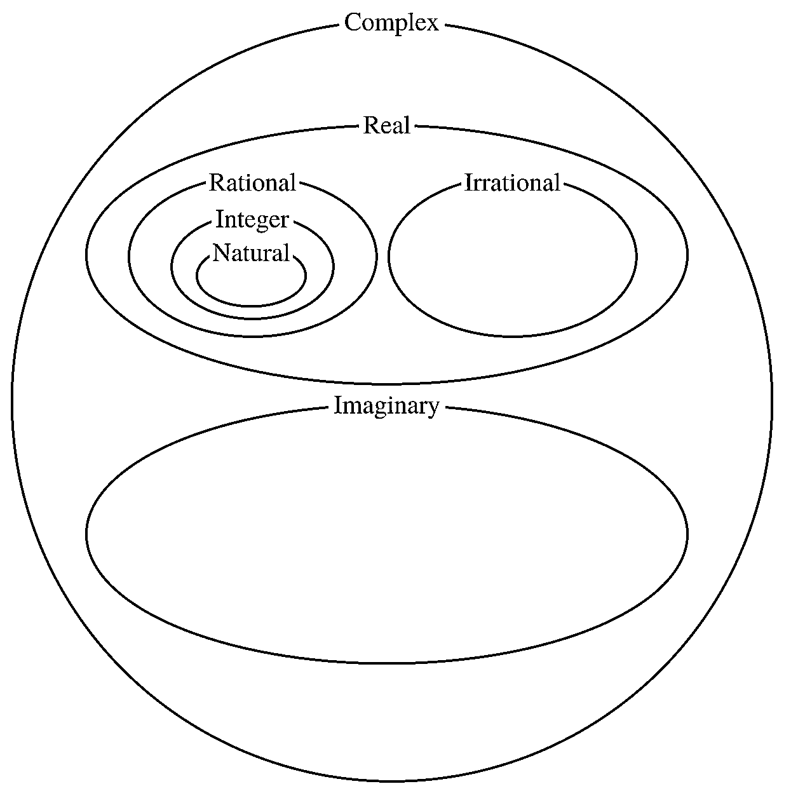
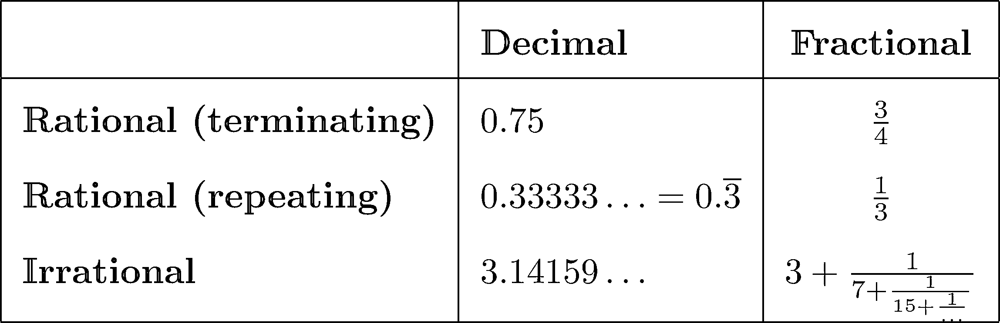
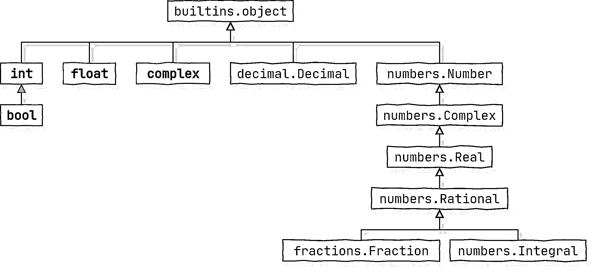
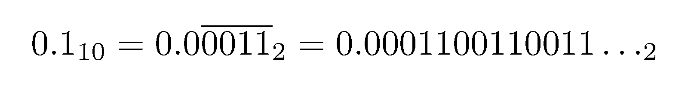
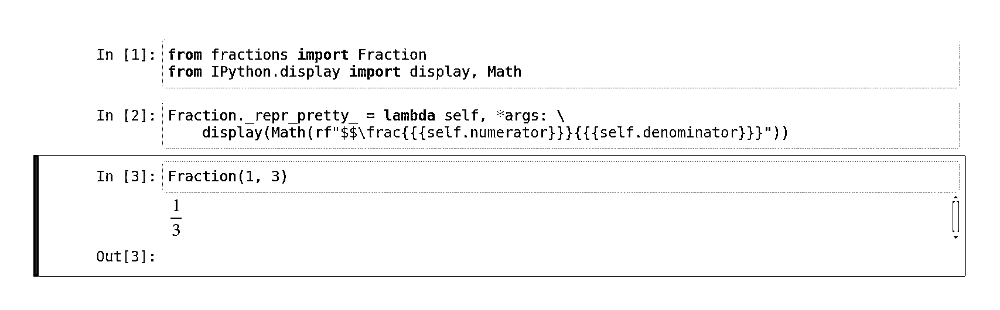

# 用 Python 分数表示有理数

> 原文：<https://realpython.com/python-fractions/>

Python 中的`fractions`模块可以说是标准库中使用最少的元素之一。尽管它可能不太出名，但它是一个非常有用的工具，因为它可以帮助解决二进制浮点运算的缺点。如果你打算处理**财务数据**或者如果你需要**无限精确**进行计算，这是必不可少的。

在本教程的末尾，你会看到一些[动手的例子](#studying-a-python-fraction-in-action)，其中分数是最合适和优雅的选择。你还将了解他们的弱点，以及如何在这个过程中充分利用它们。

**在本教程中，您将学习如何:**

*   在**十进制**和**小数**记数法之间转换
*   执行**有理数运算**
*   近似**无理数**
*   用**无限精度**精确表示分数
*   知道什么时候**选择** `Fraction`而不是`Decimal`或`float`

本教程的大部分内容都是关于`fractions`模块的，它本身不需要深入的 Python 知识，只需要理解它的[数值类型](https://realpython.com/python-numbers/)。然而，如果您熟悉更高级的概念，比如 Python 的内置 [`collections`模块](https://realpython.com/python-collections-module/)、[、`itertools`模块](https://realpython.com/python-itertools/)和[生成器](https://realpython.com/introduction-to-python-generators/)，那么您将能够很好地完成后面的所有代码示例。如果您想充分利用本教程，您应该已经熟悉了这些主题。

**免费奖励:** [掌握 Python 的 5 个想法](https://realpython.com/bonus/python-mastery-course/)，这是一个面向 Python 开发者的免费课程，向您展示将 Python 技能提升到下一个水平所需的路线图和心态。

## 十进制与分数记数法

让我们沿着记忆之路走一走，回忆一下你在学校学到的数字知识，避免可能的困惑。这里有四个概念:

1.  数学中的数字类型
2.  数字系统
3.  数字的符号
4.  Python 中的数字数据类型

现在，您将快速了解其中的每一个，以便更好地理解 Python 中`Fraction`数据类型的用途。

[*Remove ads*](/account/join/)

### 数字分类

如果你不记得数字的分类，这里有一个快速复习:

[](https://files.realpython.com/media/diagram-numbers-math.25b0c13bfd67.png)

<figcaption class="figure-caption text-center">Types of Numbers</figcaption>

数学中有更多类型的数字，但这些是与日常生活最相关的。在最顶端，你会发现[复数](https://realpython.com/python-complex-numbers/)，包括[虚数](https://en.wikipedia.org/wiki/Imaginary_number)和[实数](https://en.wikipedia.org/wiki/Real_number)。实数依次由有理数[和无理数](https://en.wikipedia.org/wiki/Rational_number)和无理数[组成。最后，有理数包含](https://en.wikipedia.org/wiki/Irrational_number)[整数](https://en.wikipedia.org/wiki/Integer)和[自然数](https://en.wikipedia.org/wiki/Natural_number)。

### 数字系统和符号

几个世纪以来，有各种各样的视觉表达数字的系统。今天，大多数人使用基于印度-阿拉伯符号的[位置数字系统](https://en.wikipedia.org/wiki/Positional_notation)。对于这样的系统，你可以选择任意的[基或基数](https://en.wikipedia.org/wiki/Radix)。然而，尽管人们更喜欢**十进制**(基数为 10)，计算机在**二进制**(基数为 2)中工作得最好。

在十进制系统中，您可以使用其他符号来表示一些数字:

*   **Decimal:** 0.75
*   **分数:**

这两者都不比另一个更好或更精确。用十进制表示数字可能更直观，因为它类似于一个百分比。比较小数也更简单，因为它们已经有了一个共同的分母——系统的基础。最后，十进制数字可以通过保持尾随零和前导零来传达精度。

另一方面，分数在手工进行符号代数时更方便，这就是为什么它们主要在学校使用。但是你能回忆起你最后一次使用分数是什么时候吗？如果你不能，那是因为十进制是当今计算器和计算机的核心。

分数符号通常只与有理数相关联。毕竟，有理数的定义表明，只要分母不为零，它就可以表示为两个整数的商，或 T2 分数。然而，当你考虑到可以近似无理数的[无限连分数](https://en.wikipedia.org/wiki/Continued_fraction)时，这还不是故事的全部:

[](https://files.realpython.com/media/latex_decimal_vs_fractional.ed464ec10585.png)

无理数总是有一个无终止无重复的小数展开式。例如，圆周率(π)的十进制展开式永远不会用完看起来具有随机分布的数字。如果你画出它们的直方图，那么每个数字将有一个大致相似的频率。

另一方面，大多数有理数都有终止的十进制展开。然而，有些可以有一个无限循环的十进制展开,一个或多个数字在一个周期内重复。重复的数字通常用十进制符号中的省略号(0.33333…)表示。不管它们的十进制扩展如何，有理数(如代表三分之一的数)在分数记数法中总是看起来优雅而紧凑。

### Python 中的数字数据类型

当在计算机内存中以[浮点](https://realpython.com/python-numbers/#floating-point-numbers)数据类型存储时，具有无限小数扩展的数字会导致舍入误差，而计算机内存本身是有限的。更糟糕的是，用二进制的*终止*十进制扩展通常不可能准确地表示数字！

这就是所谓的[浮点表示错误](https://docs.python.org/3/tutorial/floatingpoint.html#representation-error)，它影响所有编程语言，[包括 Python](https://realpython.com/python-numbers/#make-python-lie-to-you) 。每个程序员迟早都会面临这个问题。例如，您不能在像银行这样的应用程序中使用`float`,在这些应用程序中，必须在不损失任何精度的情况下存储和处理数字。

Python 的`Fraction`就是这些障碍的解决方案之一。虽然它代表一个**有理数**，但名称`Rational`已经代表了 [`numbers`](https://docs.python.org/3/library/numbers.html) 模块中的一个抽象基类。`numbers`模块定义了抽象数字数据类型的层次结构，以模拟数学中的数字分类:

[](https://files.realpython.com/media/uml_numeric_types.ed370d32b0b3.png)

<figcaption class="figure-caption text-center">Type hierarchy for numbers in Python</figcaption>

`Fraction`是`Rational`的直接和具体的子类，它提供了 Python 中有理数的完整实现。像`int`和`bool`这样的整型也来源于`Rational`，但是那些更具体。

有了这些理论背景，是时候创建你的第一个分数了！

[*Remove ads*](/account/join/)

## 从不同的数据类型创建 Python 片段

与`int`或`float`不同，分数不是 Python 中的内置数据类型，这意味着您必须从标准库中导入相应的模块才能使用它们。然而，一旦你通过了这个额外的步骤，你会发现分数只是代表了另一种数字类型，你可以在算术表达式中自由地与其他数字和数学运算符混合。

**注意:**分数是用纯 Python 实现的[，并且*比可以直接在硬件上运行的浮点数慢得多*。在大多数需要大量计算的情况下，性能比精度更重要。另一方面，如果你既需要性能又需要精度，那么考虑一种叫做](https://github.com/python/cpython/blob/3.9/Lib/fractions.py) [quicktions](https://pypi.org/project/quicktions/) 的分数替代方法，它可能会在某种程度上提高你的执行速度。

在 Python 中有几种创建分数的方法，它们都涉及到使用`Fraction`类。这是您唯一需要从`fractions`模块导入的东西。[类构造函数](https://realpython.com/python-class-constructor/)接受零个、一个或两个不同类型的参数:

>>>

```py
>>> from fractions import Fraction
>>> print(Fraction())
0
>>> print(Fraction(0.75))
3/4
>>> print(Fraction(3, 4))
3/4
```

当您调用不带参数的类构造函数时，它会创建一个表示数字零的新分数。单参数风格试图将另一种数据类型的值转换为分数。传入第二个参数使得构造函数期望一个**分子**和一个**分母**，它们必须是`Rational`类或其后代的实例。

注意，您必须 [`print()`](https://realpython.com/python-print/) 一个分数，以显示其友好的文本表示，在分子和分母之间使用斜杠字符(`/`)。如果不这样做，它将退回到由一段 Python 代码组成的稍微显式一些的字符串表示。在本教程的后面，你将学习如何[将分数转换成字符串](#strings_1)。

### 有理数

当你用两个参数调用`Fraction()`构造函数时，它们必须都是有理数，比如整数或其他分数。如果分子或分母都不是有理数，那么您将无法创建新的分数:

>>>

```py
>>> Fraction(3, 4.0)
Traceback (most recent call last):
  ...
    raise TypeError("both arguments should be "
TypeError: both arguments should be Rational instances
```

你反而得到了一个`TypeError`。虽然`4.0`在数学上是一个有理数，但 Python 并不这么认为。这是因为值存储为浮点数据类型，这种数据类型太宽泛，可以用来表示任何实数。

**注:**浮点数据类型不能在计算机内存中精确地存储**无理数**，因为它们的十进制展开没有终止和不重复。然而实际上，这没什么大不了的，因为他们的**近似值**通常就足够好了。唯一真正可靠的方法是对π这样的传统符号使用符号计算。

同样，你不能创建一个分母为零的分数，因为这将导致**被零**除，这在数学上没有定义和意义:

>>>

```py
>>> Fraction(3, 0)
Traceback (most recent call last):
  ...
    raise ZeroDivisionError('Fraction(%s, 0)' % numerator)
ZeroDivisionError: Fraction(3, 0)
```

Python 抛出了`ZeroDivisionError`。然而，当你指定一个有效的分子和一个有效的分母时，只要它们有一个公约数，它们就会自动被**规范化**:

>>>

```py
>>> Fraction(9, 12)  # GCD(9, 12) = 3
Fraction(3, 4)

>>> Fraction(0, 12)  # GCD(0, 12) = 12
Fraction(0, 1)
```

这两个数值都通过它们的[最大公约数(GCD)](https://realpython.com/python39-new-features/#greatest-common-divisor-gcd-and-least-common-multiple-lcm) 得到简化，恰好分别是 3 和 12。当您定义**负分数**时，归一化也会考虑负号:

>>>

```py
>>> -Fraction(9, 12)
Fraction(-3, 4)

>>> Fraction(-9, 12)
Fraction(-3, 4)

>>> Fraction(9, -12)
Fraction(-3, 4)
```

无论您将减号放在构造函数之前还是放在任何一个参数之前，为了一致性，Python 总是将分数的符号与其分子相关联。目前有一种方法可以禁用这种行为，但它没有记录在案，将来可能会被删除。

你通常将分数定义为两个整数的商。只要你只提供一个整数，Python 就会通过假设分母为`1`将这个数字转化为**不适当的分数**:

>>>

```py
>>> Fraction(3)
Fraction(3, 1)
```

相反，如果跳过这两个参数，分子将是`0`:

>>>

```py
>>> Fraction()
Fraction(0, 1)
```

不过，您不必总是为分子和分母提供整数。该文档声明它们可以是任何有理数，包括其他分数:

>>>

```py
>>> one_third = Fraction(1, 3)

>>> Fraction(one_third, 3)
Fraction(1, 9)

>>> Fraction(3, one_third)
Fraction(9, 1)

>>> Fraction(one_third, one_third)
Fraction(1, 1)
```

在每种情况下，结果都是一个分数，即使它们有时代表像 9 和 1 这样的整数值。稍后，您将看到如何将分数转换为其他数据类型。

如果给`Fraction`构造函数一个参数，这个参数恰好是一个分数，会发生什么？尝试此代码以找出:

>>>

```py
>>> Fraction(one_third) == one_third
True

>>> Fraction(one_third) is one_third
False
```

您得到的是相同的值，但是它是输入分数的**不同副本**。这是因为调用构造函数总是会产生一个新的实例，这与分数是**不可变的**这一事实不谋而合，就像 Python 中的其他数值类型一样。

[*Remove ads*](/account/join/)

### 浮点数和十进制数

到目前为止，您只使用了有理数来创建分数。毕竟，`Fraction`构造函数*的双参数版本要求*两个数字都是`Rational`实例。然而，单参数构造函数就不是这样了，它可以接受任何实数，甚至是字符串这样的非数值。

Python 中实数数据类型的两个主要例子是`float`和 [`decimal.Decimal`](https://realpython.com/python-rounding/#the-decimal-class) 。虽然只有后者可以精确地表示有理数，但两者都可以很好地近似无理数。与此相关，如果你想知道，`Fraction`在这方面与`Decimal`相似，因为它是`Real`的后代。


与`float`或`Fraction`不同，`Decimal`类没有正式注册为`numbers.Real`的子类，尽管实现了它的方法:

>>>

```py
>>> from numbers import Real
>>> issubclass(float, Real)
True

>>> from fractions import Fraction
>>> issubclass(Fraction, Real)
True

>>> from decimal import Decimal
>>> issubclass(Decimal, Real) False
```

这是[故意的](https://github.com/python/cpython/blob/3.9/Lib/numbers.py#L24),因为十进制浮点数与二进制数不太协调:

>>>

```py
>>> from decimal import Decimal
>>> Decimal("0.75") - 0.25
Traceback (most recent call last):
  File "<stdin>", line 1, in <module>
TypeError: unsupported operand type(s) for -: 'decimal.Decimal' and 'float'
```

另一方面，在上面的例子中，用等价的`Fraction`替换`Decimal`会产生一个`float`结果。

在 Python 3.2 之前，您只能使用`.from_float()`和`.from_decimal()`类方法从实数创建分数。虽然没有被弃用，但今天它们是多余的，因为`Fraction`构造函数可以直接将这两种数据类型作为参数:

>>>

```py
>>> from decimal import Decimal
>>> Fraction(0.75) == Fraction(Decimal("0.75"))
True
```

无论是从`float`还是`Decimal`对象制作`Fraction`对象，它们的值都是一样的。您以前见过从浮点值创建的分数:

>>>

```py
>>> print(Fraction(0.75))
3/4
```

结果是用分数表示的相同数字。然而，这段代码只是巧合地按预期工作。在大多数情况下，由于影响`float`数字的表示错误，您不会得到预期的值，无论它们是否合理:

>>>

```py
>>> print(Fraction(0.1))
3602879701896397/36028797018963968
```

哇哦。这里发生了什么？

让我们用慢动作分解一下。前一个数字可以表示为 0.75 或，也可以表示为和的和，它们是 2 的负幂，具有精确的二进制表示。另一方面，数字⅒只能用二进制数字的无终止重复扩展来近似为:



由于内存有限，二进制字符串最终必须结束，所以它的尾部变圆了。默认情况下，Python 只显示在`sys.float_info.dig`中定义的最重要的数字，但是如果你想的话，你可以格式化一个任意位数的浮点数:

>>>

```py
>>> str(0.1)
'0.1'

>>> format(0.1, ".17f")
'0.10000000000000001'
>>> format(0.1, ".18f")
'0.100000000000000006'
>>> format(0.1, ".19f")
'0.1000000000000000056'
>>> format(0.1, ".55f")
'0.1000000000000000055511151231257827021181583404541015625'
```

当您将一个`float`或一个`Decimal`数字传递给`Fraction`构造函数时，它会调用它们的`.as_integer_ratio()`方法来获得一个由两个不可约整数组成的元组，这两个整数的比值给出了与输入参数完全相同的十进制展开。然后，这两个数字被指定为新分数的分子和分母。

**注意:**从 Python 3.8 开始，`Fraction`也实现了`.as_integer_ratio()`来补充其他数值类型。例如，它可以帮助您将分数转换为元组。

现在，你可以拼凑出这两个大数字的来源:

>>>

```py
>>> Fraction(0.1)
Fraction(3602879701896397, 36028797018963968)

>>> (0.1).as_integer_ratio()
(3602879701896397, 36028797018963968)
```

如果你拿出你的袖珍计算器，输入这些数字，那么你将得到 0.1 作为除法的结果。然而，如果你用手或者使用像 [WolframAlpha](https://www.wolframalpha.com/input/?i=3602879701896397%2F36028797018963968) 这样的工具来划分它们，那么你会得到之前看到的 55 位小数。

有一种方法可以找到更接近你分数的近似值，它们有更实际的价值。例如，您可以使用`.limit_denominator()`，稍后您将在本教程中了解更多:

>>>

```py
>>> one_tenth = Fraction(0.1)
>>> one_tenth
Fraction(3602879701896397, 36028797018963968)

>>> one_tenth.limit_denominator()
Fraction(1, 10)

>>> one_tenth.limit_denominator(max_denominator=int(1e16))
Fraction(1000000000000000, 9999999999999999)
```

不过，这可能并不总是给你最好的近似值。底线是，如果你想避免可能出现的舍入误差，你应该*永远不要*试图直接从实数如`float`中创建分数。如果你不够小心，即使是`Decimal`类也可能受到影响。

无论如何，分数让你在它们的构造函数中用字符串最准确地表达十进制符号。

[*Remove ads*](/account/join/)

### 字符串

`Fraction`构造函数接受两种字符串格式，分别对应于**十进制**和**小数**表示法:

>>>

```py
>>> Fraction("0.1")
Fraction(1, 10)

>>> Fraction("1/10")
Fraction(1, 10)
```

这两种记数法都可以有一个加号(`+`)或减号(`-`)，而十进制记数法可以额外包含指数，以防您想要使用**科学记数法**:

>>>

```py
>>> Fraction("-2e-3")
Fraction(-1, 500)

>>> Fraction("+2/1000")
Fraction(1, 500)
```

两个结果唯一的区别就是一个是负的，一个是正的。

使用分数符号时，不能在斜杠字符(`/`)周围使用空白字符:

>>>

```py
>>> Fraction("1 / 10")
Traceback (most recent call last):
  ...
    raise ValueError('Invalid literal for Fraction: %r' %
ValueError: Invalid literal for Fraction: '1 / 10'
```

要确切地找出哪些字符串是有效的或无效的，可以探索一下[模块的源代码](https://github.com/python/cpython/blob/3.9/Lib/fractions.py#L23)中的[正则表达式](https://realpython.com/regex-python/)。记住从字符串或正确实例化的`Decimal`对象创建分数，而不是从`float`值创建分数，这样可以保持最大精度。

现在你已经创建了一些分数，你可能想知道除了第二组数字之外，它们还能为你做什么。这是一个很好的问题！

## 检查 Python 片段

`Rational`抽象基类定义了两个只读属性，用于访问分数的**分子**和**分母**:

>>>

```py
>>> from fractions import Fraction
>>> half = Fraction(1, 2)
>>> half.numerator
1
>>> half.denominator
2
```

因为分数是不可变的，你不能改变它们的内部状态:

>>>

```py
>>> half.numerator = 2
Traceback (most recent call last):
  File "<stdin>", line 1, in <module>
AttributeError: can't set attribute
```

如果您尝试为分数的一个属性指定一个新值，那么您将会得到一个错误。事实上，当您想要修改一个片段时，您必须创建一个新的片段。例如，为了反转你的分数，你可以调用`.as_integer_ratio()`得到一个元组，然后使用切片语法[反转](https://realpython.com/python-reverse-list/)它的元素:

>>>

```py
>>> Fraction(*half.as_integer_ratio()[::-1])
Fraction(2, 1)
```

一元星形运算符(`*` ) [解包](https://realpython.com/python-lists-tuples/#tuple-assignment-packing-and-unpacking)你的反转元组，并将其元素传递给`Fraction`构造函数。

每一个分数都有另一个有用的方法，可以让你找到最接近十进制记数法中给定数字的**有理逼近**。这是`.limit_denominator()`方法，您在本教程的前面已经提到过。您可以选择请求近似值的最大分母:

>>>

```py
>>> pi = Fraction("3.141592653589793")

>>> pi
Fraction(3141592653589793, 1000000000000000)

>>> pi.limit_denominator(20_000)
Fraction(62813, 19994)

>>> pi.limit_denominator(100)
Fraction(311, 99)

>>> pi.limit_denominator(10)
Fraction(22, 7)
```

初始近似值可能不是最方便使用的，但却是最可靠的。这个方法还可以帮助你**恢复一个以浮点数据类型存储的有理数**。记住`float`可能不会精确地表示所有的有理数，即使它们有终止的十进制展开:

>>>

```py
>>> pi = Fraction(3.141592653589793)

>>> pi
Fraction(884279719003555, 281474976710656) 
>>> pi.limit_denominator()
Fraction(3126535, 995207)

>>> pi.limit_denominator(10)
Fraction(22, 7)
```

与前面的代码块相比，您会注意到高亮显示的行上有不同的结果，即使`float`实例看起来与您之前传递给构造函数的字符串文字相同！稍后，您将探索一个使用`.limit_denominator()`寻找无理数近似值的例子。

[*Remove ads*](/account/join/)

## 将 Python 片段转换成其他数据类型

您已经学习了如何从以下数据类型创建分数:

*   `str`
*   `int`
*   `float`
*   `decimal.Decimal`
*   `fractions.Fraction`

反过来呢？如何将一个`Fraction`实例转换回这些类型？你将在这一部分找到答案。

### 浮点数和整数

Python 中本地数据类型之间的转换通常涉及调用一个内置函数，比如对象上的`int()`或`float()`。只要对象实现了相应的[特殊方法](https://docs.python.org/3/glossary.html#term-special-method)，如`.__int__()`或`.__float__()`，这些转换就会起作用。分数恰好从`Rational`抽象基类中继承了后者:

>>>

```py
>>> from fractions import Fraction
>>> three_quarters = Fraction(3, 4)

>>> float(three_quarters)
0.75

>>> three_quarters.__float__()  # Don't call special methods directly
0.75

>>> three_quarters.__int__()
Traceback (most recent call last):
  File "<stdin>", line 1, in <module>
AttributeError: 'Fraction' object has no attribute '__int__'
```

您不应该直接调用对象上的特殊方法，但这有助于演示。这里，你会注意到分数只实现了`.__float__()`而没有实现`.__int__()`。

当您研究[源代码](https://github.com/python/cpython/blob/3.9/Lib/numbers.py#L291)时，您会注意到`.__float__()`方法很方便地将一个分数的分子除以它的分母，从而得到一个浮点数:

>>>

```py
>>> three_quarters.numerator / three_quarters.denominator
0.75
```

请记住，将一个`Fraction`实例转换成一个`float`实例可能会导致一个**有损转换**，这意味着您可能会得到一个稍微有些偏差的数字:

>>>

```py
>>> float(Fraction(3, 4)) == Fraction(3, 4)
True

>>> float(Fraction(1, 3)) == Fraction(1, 3)
False

>>> float(Fraction(1, 10)) == Fraction(1, 10)
False
```

虽然分数不提供整数转换的实现，但是所有的实数都可以被**截断**，这是`int()`函数的一个后备:

>>>

```py
>>> fraction = Fraction(14, 5)

>>> int(fraction)
2

>>> import math
>>> math.trunc(fraction)
2

>>> fraction.__trunc__()  # Don't call special methods directly
2
```

稍后，在关于[舍入分数](#rounding-a-python-fraction)的章节中，您会发现其他一些相关的方法。

### 十进制数字

如果您尝试从一个`Fraction`实例创建一个`Decimal`数字，那么您会很快发现这样的直接转换是不可能的:

>>>

```py
>>> from decimal import Decimal
>>> Decimal(Fraction(3, 4))
Traceback (most recent call last):
  File "<stdin>", line 1, in <module>
TypeError: conversion from Fraction to Decimal is not supported
```

当你尝试时，你会得到一个`TypeError`。因为一个分数代表一个**除法**，但是，你可以通过仅用`Decimal`包装其中一个数字并手动分割它们来绕过这个限制:

>>>

```py
>>> fraction = Fraction(3, 4)
>>> fraction.numerator / Decimal(fraction.denominator)
Decimal('0.75')
```

与`float`不同，但与`Fraction`相似，`Decimal`数据类型没有浮点表示错误。因此，当您转换一个无法用二进制浮点精确表示的有理数时，您将保留该数的精度:

>>>

```py
>>> fraction = Fraction(1, 10)
>>> decimal = fraction.numerator / Decimal(fraction.denominator)

>>> fraction == decimal
True

>>> fraction == 0.1
False

>>> decimal == 0.1
False
```

同时，具有无终止重复十进制展开的有理数*将*在从小数转换为十进制时导致精度损失:

>>>

```py
>>> fraction = Fraction(1, 3)
>>> decimal = fraction.numerator / Decimal(fraction.denominator)

>>> fraction == decimal
False

>>> decimal
Decimal('0.3333333333333333333333333333')
```

这是因为在三分之一的十进制扩展中有无限个三，或者说`Fraction(1, 3)`，而`Decimal`类型有一个固定的精度。默认情况下，它只存储 28 位小数。如果你想的话，你可以调整它，但是它仍然是有限的。

[*Remove ads*](/account/join/)

### 字符串

分数的字符串表示使用熟悉的分数符号显示它们的值，而它们的规范表示输出一段 Python 代码，其中包含对`Fraction`构造函数的调用:

>>>

```py
>>> one_third = Fraction(1, 3)

>>> str(one_third)
'1/3'

>>> repr(one_third)
'Fraction(1, 3)'
```

不管你用`str()`还是`repr()`，结果都是一个字符串，只是它们的内容不同。

与其他数值类型不同，分数不支持 Python 中的[字符串格式](https://realpython.com/python-formatted-output/):

>>>

```py
>>> from decimal import Decimal
>>> format(Decimal("0.3333333333333333333333333333"), ".2f")
'0.33'

>>> format(Fraction(1, 3), ".2f")
Traceback (most recent call last):
  File "<stdin>", line 1, in <module>
TypeError: unsupported format string passed to Fraction.__format__
```

如果你尝试，你会得到一个`TypeError`。例如，如果您想在字符串模板中引用一个`Fraction`实例来填充占位符，这可能是一个问题。另一方面，您可以通过将分数转换为浮点数来快速解决这个问题，特别是在这种情况下，您不需要关心精度。

如果你在 [Jupyter 笔记本](https://realpython.com/jupyter-notebook-introduction/)上工作，那么你可能想要基于你的分数而不是它们的常规文本表示来呈现 [LaTeX](https://en.wikipedia.org/wiki/LaTeX) 公式。为此，您必须 [monkey 通过添加 Jupyter Notebook 能够识别的新方法](https://en.wikipedia.org/wiki/Monkey_patch) [`._repr_pretty_()`](https://ipython.readthedocs.io/en/latest/config/integrating.html#pretty-printing) 来修补数据类型:

```py
from fractions import Fraction
from IPython.display import display, Math

Fraction._repr_pretty_ = lambda self, *args: \
    display(Math(rf"$$\frac{{{self.numerator}}}{{{self.denominator}}}"))
```

它将一段 LaTeX 标记包装在一个`Math`对象中，并将其发送到您笔记本的富显示器，该显示器可以使用 [MathJax](https://www.mathjax.org/) 库来呈现标记:

[](https://files.realpython.com/media/jupyter-notebook-latex.f3fe392dcf49.png)

下一次您评估包含`Fraction`实例的笔记本单元格时，它将绘制一个漂亮的数学公式，而不是打印文本。

## 对分数进行有理数运算

如前所述，您可以在由其他数值类型组成的算术表达式中使用分数。分数将与大多数数字类型互操作，除了`decimal.Decimal`，它有自己的一套规则。此外，另一个操作数的数据类型，无论它位于分数的左边还是右边，都将决定算术运算结果的类型。

### 加法

您可以将两个或更多分数相加，而不必考虑将它们简化为公分母:

>>>

```py
>>> from fractions import Fraction
>>> Fraction(1, 2) + Fraction(2, 3) + Fraction(3, 4)
Fraction(23, 12)
```

结果是一个新分数，它是所有输入分数的总和。当你把整数和分数相加时，也会发生同样的情况:

>>>

```py
>>> Fraction(1, 2) + 3
Fraction(7, 2)
```

但是，一旦您开始将分数与非有理数混合，即不是`numbers.Rational`的子类的数字，那么您的分数在被添加之前将首先被转换为该类型:

>>>

```py
>>> Fraction(3, 10) + 0.1
0.4

>>> float(Fraction(3, 10)) + 0.1
0.4
```

无论是否显式使用`float()`，都会得到相同的结果。这种转换可能会导致精度损失，因为分数和结果现在都以浮点形式存储。尽管数字 0.4 看起来是对的，但它并不完全等于分数 4/10。

[*Remove ads*](/account/join/)

### 减法

分数相减和相加没有什么不同。Python 将为您找到共同点:

>>>

```py
>>> Fraction(3, 4) - Fraction(2, 3) - Fraction(1, 2)
Fraction(-5, 12)

>>> Fraction(4, 10) - 0.1
0.30000000000000004
```

这一次，精度损失非常显著，一目了然。请注意，在十进制扩展的末尾，有一长串的零后跟一个数字`4`。这是对一个值进行舍入的结果，否则它将需要无限多的二进制数字。

### 乘法运算

当您将两个分数相乘时，它们的分子和分母会逐元素相乘，如果需要，结果分数会自动减少:

>>>

```py
>>> Fraction(1, 4) * Fraction(3, 2)
Fraction(3, 8)

>>> Fraction(1, 4) * Fraction(4, 5)  # The result is 4/20
Fraction(1, 5)

>>> Fraction(1, 4) * 3
Fraction(3, 4)

>>> Fraction(1, 4) * 3.0
0.75
```

同样，根据另一个操作数的类型，结果中会有不同的数据类型。

### 分部

Python 中有两种除法运算符，分数支持这两种运算符:

1.  真师:`/`
2.  楼层划分:`//`

真正的除法会产生另一个分数，而底数除法总是会返回一个小数部分被截断的整数:

>>>

```py
>>> Fraction(7, 2) / Fraction(2, 3)
Fraction(21, 4)

>>> Fraction(7, 2) // Fraction(2, 3)
5

>>> Fraction(7, 2) / 2
Fraction(7, 4)

>>> Fraction(7, 2) // 2
1

>>> Fraction(7, 2) / 2.0
1.75

>>> Fraction(7, 2) // 2.0
1.0
```

请注意，地板除法的结果并不总是整数！结果可能以一个`float`结束，这取决于与分数一起使用的数据类型。分数还支持[模运算符(`%` )](https://realpython.com/python-modulo-operator/) 以及 [`divmod()`](https://realpython.com/python-modulo-operator/#modulo-operator-and-divmod) 函数，这可能有助于从不适当的分数创建**混合分数**:

>>>

```py
>>> def mixed(fraction):
...     floor, rest = divmod(fraction.numerator, fraction.denominator)
...     return f"{floor} and {Fraction(rest, fraction.denominator)}"
...
>>> mixed(Fraction(22, 7))
'3 and 1/7'
```

您可以更新函数，返回一个由整数部分和小数余数组成的元组，而不是像上面的输出那样生成一个字符串。继续尝试修改函数的返回值，看看有什么不同。

### 求幂运算

你可以用二进制的**取幂运算符(`**` )** 或者内置的 **`pow()`** 函数来计算分数的幂。你也可以用分数本身作为指数。现在回到你的 [Python 解释器](https://realpython.com/interacting-with-python/#using-the-python-interpreter-interactively)，开始探索如何计算分数的幂:

>>>

```py
>>> Fraction(3, 4) ** 2
Fraction(9, 16)

>>> Fraction(3, 4) ** (-2)
Fraction(16, 9)

>>> Fraction(3, 4) ** 2.0
0.5625
```

您会注意到，您可以使用正指数值和负指数值。当指数不是一个`Rational`数时，您的分数在继续之前会自动转换为`float`。

当指数是一个`Fraction`实例时，事情变得更加复杂。因为分数幂通常产生无理数，所以两个操作数都转换为`float`，除非基数和指数是整数:

>>>

```py
>>> 2 ** Fraction(2, 1)
4

>>> 2.0 ** Fraction(2, 1)
4.0

>>> Fraction(3, 4) ** Fraction(1, 2)
0.8660254037844386

>>> Fraction(3, 4) ** Fraction(2, 1)
Fraction(9, 16)
```

唯一一次得到分数的结果是当指数的分母等于 1，并且你正在产生一个`Fraction`实例。

[*Remove ads*](/account/join/)

## 对 Python 分数进行舍入

在 Python 中有很多[舍入数字的策略，在数学中甚至更多。分数和小数可以使用同一套内置的全局函数和模块级函数。它们可以让你将一个整数赋给一个分数，或者生成一个对应于更少小数位数的新分数。](https://realpython.com/python-rounding/)

当您将分数转换为`int`时，您已经了解了一种粗略的舍入方法，即**截断**小数部分，只留下整部分(如果有的话):

>>>

```py
>>> from fractions import Fraction

>>> int(Fraction(22, 7))
3

>>> import math
>>> math.trunc(Fraction(22, 7))
3

>>> math.trunc(-Fraction(22, 7))
-3
```

在这种情况下，调用`int()`相当于调用`math.trunc()`，它向下舍入正分数，向上舍入负分数。这两种操作分别被称为**地板**和**天花板**。如果需要，您可以直接使用两者:

>>>

```py
>>> math.floor(-Fraction(22, 7))
-4

>>> math.floor(Fraction(22, 7))
3

>>> math.ceil(-Fraction(22, 7))
-3

>>> math.ceil(Fraction(22, 7))
4
```

将`math.floor()`和`math.ceil()`的结果与您之前对`math.trunc()`的调用进行比较。每个函数都有不同的[舍入偏差](https://realpython.com/python-rounding/#interlude-rounding-bias)，这可能会影响舍入数据集的统计属性。幸运的是，有一种策略叫做**四舍五入成偶数**，它比截断、下限或上限更少偏差。

本质上，它将分数舍入到最接近的整数，而对于等距的两部分，则更倾向于最接近的偶数。您可以调用`round()`来利用这一策略:

>>>

```py
>>> round(Fraction(3, 2))  # 1.5
2

>>> round(Fraction(5, 2))  # 2.5
2

>>> round(Fraction(7, 2))  # 3.5
4
```

注意这些分数是如何根据最接近的偶数的位置向上或向下舍入的？自然地，这条规则只适用于左边最接近的整数和右边最接近的整数的距离相同的情况。否则，舍入方向基于到整数的最短距离，而不管它是否是偶数。

您可以选择为`round()`函数提供第二个参数，该参数指示您想要保留多少个小数位。当你这样做时，你将总是得到一个`Fraction`而不是一个整数，即使你请求的是零位数:

>>>

```py
>>> fraction = Fraction(22, 7)  # 3.142857142857143

>>> round(fraction, 0)
Fraction(3, 1)

>>> round(fraction, 1)  # 3.1
Fraction(31, 10)

>>> round(fraction, 2)  # 3.14
Fraction(157, 50)

>>> round(fraction, 3)  # 3.143
Fraction(3143, 1000)
```

然而，请注意调用`round(fraction)`和`round(fraction, 0)`之间的区别，它们产生相同的值，但是使用不同的数据类型:

>>>

```py
>>> round(fraction)
3

>>> round(fraction, 0)
Fraction(3, 1)
```

当您省略第二个参数时，`round()`将返回最接近的整数。否则，您将得到一个缩减的分数，它的分母最初是 10 的幂，对应于您所请求的十进制位数。

## 在 Python 中比较分数

在现实生活中，比较用分数表示的数字可能比比较用十进制表示的数字更困难，因为分数表示由两个值组成，而不是只有一个值。为了理解这些数字，通常将它们简化为一个公分母，并且只比较它们的分子。例如，尝试根据分数的值以升序排列以下分数:

*   2/3
*   5/8
*   8/13

它不像十进制记数法那样方便。混合符号的情况会变得更糟。然而，当你用一个共同的分母重写这些分数时，对它们进行排序就变得简单了:

*   208/312
*   195/312
*   192/312

3，8，13 的最大公约数是 1。这意味着所有三个分数的最小公分母是它们的乘积 312。一旦你把所有的分数转换成最小的公分母，你就可以忽略分母，专注于比较分子。

在 Python 中，当您比较和排序`Fraction`对象时，这在幕后工作:

>>>

```py
>>> from fractions import Fraction

>>> Fraction(8, 13) < Fraction(5, 8)
True

>>> sorted([Fraction(2, 3), Fraction(5, 8), Fraction(8, 13)])
[Fraction(8, 13), Fraction(5, 8), Fraction(2, 3)]
```

Python 可以使用内置的`sorted()`函数对`Fraction`对象进行快速排序。有益的是，所有的[比较操作符](https://realpython.com/python-operators-expressions/#comparison-operators)都按照预期工作。您甚至可以将它们用于除复数以外的其他数值类型:

>>>

```py
>>> Fraction(2, 3) < 0.625
False

>>> from decimal import Decimal
>>> Fraction(2, 3) < Decimal("0.625")
False

>>> Fraction(2, 3) < 3 + 2j
Traceback (most recent call last):
  File "<stdin>", line 1, in <module>
TypeError: '<' not supported between instances of 'Fraction' and 'complex'
```

比较运算符适用于浮点数和小数，但是当您尝试使用复数`3 + 2j`时会出现错误。这与复数没有定义自然排序关系的事实有关，所以你不能将它们与任何东西进行比较——包括分数。

[*Remove ads*](/account/join/)

## 在`Fraction`、`Decimal`、`Float`和之间选择

如果你需要从阅读本教程中挑选一件事情来记住，那么它应该是什么时候选择`Fraction`而不是`Decimal`和`float`。所有这些数字类型都有它们的用例，所以了解它们的优缺点是有好处的。在本节中，您将简要了解数字在这三种数据类型中是如何表示的。

### 二进制浮点:`float`

在大多数情况下，`float`数据类型应该是表示实数的默认选择。例如，它适用于科学、工程和计算机图形学，在这些领域中,**执行速度**比精度更重要。几乎没有任何程序需要比浮点更高的精度。

**注意:**如果你只需要使用整数，那么`int`将是一个速度和内存效率更高的数据类型。

浮点运算无与伦比的速度源于其在硬件而非软件中的实现。几乎所有的数学协处理器都符合 IEEE 754 标准，该标准描述了如何用二进制浮点 T2 表示数字。如你所料，使用二进制的缺点是臭名昭著的表示错误。

然而，除非你有特定的理由使用不同的数字类型，否则如果可能的话，你应该坚持使用`float`或`int`。

### 十进制浮点和定点:`Decimal`

有时使用二进制系统不能为实数提供足够的精度。一个显著的例子是**金融计算**，它涉及同时处理非常大和非常小的数字。他们还倾向于一遍又一遍地重复相同的算术运算，这可能会累积显著的舍入误差。

您可以使用[十进制浮点](https://en.wikipedia.org/wiki/Decimal_floating_point)算法来存储实数，以缓解这些问题并消除二进制表示错误。它类似于`float`，因为它移动小数点以适应更大或更小的幅度。然而，它以十进制**而不是二进制**运行。

另一种提高数值精度的策略是[定点](https://en.wikipedia.org/wiki/Fixed-point_arithmetic)算术，它为十进制扩展分配特定的位数。例如，最多四位小数的精度要求将分数存储为放大 10，000 倍的整数。为了恢复原来的分数，它们将被相应地缩小。

Python 的`decimal.Decimal`数据类型是十进制浮点和定点表示的混合。它还遵循以下两个标准:

1.  通用十进制算术规范([)](http://speleotrove.com/decimal/decarith.html)
2.  独立于基数的浮点运算( [IEEE 854-1987](http://en.wikipedia.org/wiki/IEEE_854-1987)

它们是在软件中模拟的，而不是在硬件中模拟的，这使得这种数据类型在时间和空间上比`float`效率低得多。另一方面，它可以用**任意**和**有限精度**表示数字，您可以自由调整。请注意，如果算术运算超过最大小数位数，您仍可能面临**舍入误差**。

然而，今天由固定精度提供的安全缓冲明天可能会变得不足。考虑恶性通货膨胀或处理汇率差异巨大的多种货币，如比特币(0.000029 BTC)和伊朗里亚尔(42，105.00 IRR)。如果你想要无限的精度，那么使用`Fraction`。

### 无限精度有理数:`Fraction`

`Fraction`和`Decimal`类型有一些相似之处。它们解决了二进制表示错误，它们在软件中实现，你可以在货币应用中使用它们。尽管如此，分数的主要用途是表示 T2 有理数 T3，所以比起小数来说，它们可能不太方便存储金钱。

**注意:**虽然`Fraction`数据类型是用纯 Python 实现的，但大多数 Python 发行版都为`Decimal`类型提供了一个编译好的动态链接库。如果它对您的平台不可用，那么 Python 也将退回到纯 Python 实现。然而，即使是编译版也不会像`float`那样充分利用硬件。

使用`Fraction`比`Decimal`有两个好处。第一个是**无限精度**，只受可用内存的限制。这使您可以用无终止和循环的十进制展开来表示有理数，而不会丢失任何信息:

>>>

```py
>>> from fractions import Fraction
>>> one_third = Fraction(1, 3)
>>> print(3 * one_third)
1

>>> from decimal import Decimal
>>> one_third = 1 / Decimal(3)
>>> print(3 * one_third)
0.9999999999999999999999999999
```

用 1/3 乘以 3 得到的分数正好是 1，但结果在十进制中是四舍五入的。它有 28 个小数位，这是`Decimal`类型的默认精度。

再来看看分数的另一个好处，这是你之前已经开始学习的。与`Decimal`不同，分数**可以与二进制浮点数**交互操作:

>>>

```py
>>> Fraction("0.75") - 0.25
0.5

>>> Decimal("0.75") - 0.25
Traceback (most recent call last):
  File "<stdin>", line 1, in <module>
TypeError: unsupported operand type(s) for -: 'decimal.Decimal' and 'float'
```

当您将分数与浮点数混合时，结果会得到一个浮点数。另一方面，如果您试图用一个`Decimal`数据类型混合分数，那么您将遇到一个`TypeError`。

[*Remove ads*](/account/join/)

## 正在研究 Python 片段

在这一节中，您将浏览一些在 Python 中使用`Fraction`数据类型的有趣且实用的例子。你可能会惊讶于分数是多么的方便，同时它们又是多么的被低估。准备好开始吧！

### 近似无理数

无理数在数学中起着重要的作用，这就是为什么它们出现在算术、微积分和几何等许多子领域的原因。一些你可能听说过的最著名的例子是:

*   二的平方根(√2)
*   阿基米德常数(π)
*   黄金比例(φ)
*   欧拉数( *e*

在数学史上，圆周率(π)一直特别有趣，这导致[许多人试图](https://en.wikipedia.org/wiki/Approximations_of_%CF%80)找到它的精确近似值。

虽然古代哲学家不得不竭尽全力，今天你可以用 Python 找到相当不错的圆周率的估计，使用**蒙特卡罗方法**，比如[布冯针](https://en.wikipedia.org/wiki/Buffon%27s_needle_problem)或类似的。然而，在大多数日常问题中，只有一个方便的分数形式的粗略近似值就足够了。以下是确定两个整数的商的方法，这两个整数逐渐逼近无理数:

```py
from fractions import Fraction
from itertools import count

def approximate(number):
    history = set()
    for max_denominator in count(1):
        fraction = Fraction(number).limit_denominator(max_denominator)
        if fraction not in history:
            history.add(fraction)
            yield fraction
```

该函数接受一个无理数，将其转换为一个分数，并找到一个小数位数较少的不同分数。 [Python 集合](https://realpython.com/python-sets/)通过保留历史数据来防止产生重复值，而 [`itertools`](https://realpython.com/python-itertools/) 模块的`count()`迭代器计数到无穷大。

现在，您可以使用此函数来查找圆周率的前十个分数近似值:

>>>

```py
>>> from itertools import islice
>>> import math

>>> for fraction in islice(approximate(math.pi), 10):
...     print(f"{str(fraction):>7}", "→", float(fraction))
...
 3 → 3.0
 13/4 → 3.25
 16/5 → 3.2
 19/6 → 3.1666666666666665
 22/7 → 3.142857142857143
 179/57 → 3.1403508771929824
 201/64 → 3.140625
 223/71 → 3.140845070422535
 245/78 → 3.141025641025641
 267/85 → 3.1411764705882352
```

不错！有理数 22/7 已经很接近了，这表明圆周率可以很早就被逼近，而且毕竟不是特别无理。`islice()`迭代器在收到请求的十个值后停止无限迭代。继续玩这个例子，增加结果的数量或者寻找其他无理数的近似值。

### 获取显示器的宽高比

图像或显示器的**纵横比**是其宽度与高度的商，方便地表示比例。它通常用于电影和数字媒体，而电影导演喜欢利用纵横比作为艺术手段。举例来说，如果你一直在寻找一部新的智能手机，那么说明书可能会提到屏幕比例，比如 16:9。

您可以通过使用官方 Python 发行版附带的 [Tkinter](https://realpython.com/python-gui-tkinter/) 来测量电脑显示器的宽度和高度，从而找出显示器的长宽比:

>>>

```py
>>> import tkinter as tk
>>> window = tk.Tk()
>>> window.winfo_screenwidth()
2560
>>> window.winfo_screenheight()
1440
```

请注意，如果您连接了多台显示器，则此代码可能不会按预期运行。

计算纵横比就是创建一个会自我缩小的分数:

>>>

```py
>>> from fractions import Fraction
>>> Fraction(2560, 1440)
Fraction(16, 9)
```

给你。显示器的分辨率为 16:9。但是，如果您使用的是屏幕尺寸较小的笔记本电脑，那么您的分数一开始可能无法计算出来，您需要相应地限制其分母:

>>>

```py
>>> Fraction(1360, 768)
Fraction(85, 48)

>>> Fraction(1360, 768).limit_denominator(10)
Fraction(16, 9)
```

请记住，如果您正在处理移动设备的垂直屏幕，您应该交换尺寸，以便第一个尺寸大于下面的尺寸。您可以将此逻辑封装在一个可重用的函数中:

```py
from fractions import Fraction

def aspect_ratio(width, height, max_denominator=10):
    if height > width:
        width, height = height, width
    ratio = Fraction(width, height).limit_denominator(max_denominator)
    return f"{ratio.numerator}:{ratio.denominator}"
```

这将确保一致的纵横比，而不管参数的顺序如何:

>>>

```py
>>> aspect_ratio(1080, 2400)
'20:9'

>>> aspect_ratio(2400, 1080)
'20:9'
```

无论你看的是水平屏幕还是垂直屏幕，长宽比都是一样的。

到目前为止，宽度和高度都是整数，但是分数值呢？例如，一些佳能相机有一个 APS-C 作物传感器，其尺寸为 22.8 毫米乘 14.8 毫米。分数在浮点数和十进制数中难以表达，但您可以将其转换为有理近似值:

>>>

```py
>>> aspect_ratio(22.2, 14.8)
Traceback (most recent call last):
  ...
    raise TypeError("both arguments should be "
TypeError: both arguments should be Rational instances

>>> aspect_ratio(Fraction("22.2"), Fraction("14.8"))
'3:2'
```

在这种情况下，纵横比恰好为 1.5 或 3:2，但许多相机的传感器宽度略长，因此纵横比为 1.555…或 14:9。当你做数学计算时，你会发现它是[宽格式(16:9)](https://en.wikipedia.org/wiki/16:9_aspect_ratio) 和[四三分制(4:3)](https://en.wikipedia.org/wiki/Four_Thirds_system) 的算术平均值，这是一种妥协，让你在这两种流行格式下都能很好地显示图片。

### 计算照片的曝光值

在数字图像中嵌入元数据的标准格式 [Exif(可交换图像文件格式)](https://en.wikipedia.org/wiki/Exif)，使用比率来存储多个值。一些最重要的比率描述了照片的曝光度:

*   光圈值
*   曝光时间
*   曝光偏差
*   焦距
*   光圈挡
*   快门速度

快门速度在口语中与曝光时间同义，但它是使用基于对数标度的 [APEX 系统](https://en.wikipedia.org/wiki/APEX_system)以分数形式存储在元数据中的。这意味着照相机会取你曝光时间的倒数，然后计算它的以 2 为底的对数。因此，例如，1/200 秒的曝光时间将作为 7643856/1000000 写入文件。你可以这样计算:

>>>

```py
>>> from fractions import Fraction
>>> exposure_time = Fraction(1, 200)

>>> from math import log2, trunc
>>> precision = 1_000_000
>>> trunc(log2(Fraction(1, exposure_time)) * precision)
7643856
```

如果您在没有任何外部库的帮助下手动读取这些元数据，您可以使用 Python 片段来恢复原始曝光时间:

>>>

```py
>>> shutter_speed = Fraction(7643856, 1_000_000)
>>> Fraction(1, round(2 ** shutter_speed))
Fraction(1, 200)
```

当你组合拼图的各个部分时——即光圈、快门速度和 ISO 速度——你将能够计算出单个**曝光值(EV)** ，它描述了捕捉到的光的平均量。然后，您可以使用它来获得拍摄场景中**亮度**的对数平均值，这在后期处理和应用特殊效果时非常有用。

计算曝光值的公式如下:

```py
from math import log2

def exposure_value(f_stop, exposure_time, iso_speed):
    return log2(f_stop ** 2 / exposure_time) - log2(iso_speed / 100)
```

请记住，它没有考虑其他因素，如曝光偏差或闪光灯，你的相机可能适用。无论如何，用一些样本值试一试:

>>>

```py
>>> exposure_value(
...     f_stop=Fraction(28, 5),
...     exposure_time=Fraction(1, 750),
...     iso_speed=400
... )
12.521600439723727

>>> exposure_value(f_stop=5.6, exposure_time=1/750, iso_speed=400)
12.521600439723727
```

您可以使用分数或其他数值类型作为输入值。这种情况下曝光值在+13 左右，比较亮。这张照片是在一个阳光明媚的日子拍摄的，尽管是在阴凉处。

### 解决变革问题

你可以用分数来解决计算机科学经典的[改变问题](https://en.wikipedia.org/wiki/Change-making_problem)，你可能会在求职面试中遇到。它要求获得一定金额的最少硬币数。例如，如果您考虑最受欢迎的[美元硬币](https://en.wikipedia.org/wiki/Coins_of_the_United_States_dollar)，那么您可以将 2.67 美元表示为 10 个 25 美分硬币(10 × $0.25)、1 个 1 角硬币(1 × $0.10)、1 个 5 分硬币(1 × $0.05)和 2 个 1 分硬币(2 × $0.01)。

分数可以是表示钱包或收银机中硬币的方便工具。你可以用以下方式定义美元硬币:

```py
from fractions import Fraction

penny = Fraction(1, 100)
nickel = Fraction(5, 100)
dime = Fraction(10, 100)
quarter = Fraction(25, 100)
```

其中一些会自动缩减，但没关系，因为您将使用十进制表示法对它们进行格式化。你可以用这些硬币来计算你钱包的总价值:

>>>

```py
>>> wallet = [8 * quarter, 5 * dime, 3 * nickel, 2 * penny]
>>> print(f"${float(sum(wallet)):.2f}")
$2.67
```

你的钱包总共是 2.67 美元，但是里面有多达 18 个硬币。同样数量的硬币可以用更少的硬币。解决改变问题的一种方法是使用[贪婪算法](https://en.wikipedia.org/wiki/Greedy_algorithm)，比如这个:

```py
def change(amount, coins):
    while amount > 0:
        for coin in sorted(coins, reverse=True):
            if coin <= amount:
                amount -= coin
                yield coin
                break
        else:
            raise Exception("There's no solution")
```

该算法试图找到一个最高面额的硬币，它不大于剩余金额。虽然实现起来相对简单，但它可能无法在所有硬币系统中给出最佳解决方案。这里有一个美元硬币的例子:

>>>

```py
>>> from collections import Counter

>>> amount = Fraction("2.67")
>>> usd = [penny, nickel, dime, quarter]

>>> for coin, count in Counter(change(amount, usd)).items():
...     print(f"{count:>2} × ${float(coin):.2f}")
...
10 × $0.25
 1 × $0.10
 1 × $0.05
 2 × $0.01
```

使用有理数来寻找解决方案是强制性的，因为浮点值不能解决问题。由于`change()`是一个生成可能重复的硬币的函数，你可以使用 [`Counter`](https://realpython.com/python-counter/) 将它们分组。

你可以通过问一个稍微不同的问题来修改这个问题。例如，给定总价格、收银机中可用的顾客硬币和卖家硬币，最佳硬币组合是什么？

### 产生和扩展连分数

在本教程开始时，您已经了解到无理数可以表示为**无限连分数**。这样的分数需要无限量的内存才能存在，但是你可以选择什么时候停止产生它们的系数来得到一个合理的近似值。

下面的[发生器函数](https://realpython.com/introduction-to-python-generators/)将以惰性评估的方式不断产生给定数字的系数:

```py
 1def continued_fraction(number):
 2    while True:
 3        yield (whole_part := int(number))
 4        fractional_part = number - whole_part
 5        try:
 6            number = 1 / fractional_part
 7        except ZeroDivisionError:
 8            break
```

该函数截断数字，并将剩余的分数表示为作为输入反馈的倒数。为了消除代码重复，它在第 3 行使用了一个**赋值表达式**，通常称为 Python 3.8 中引入的 [walrus 操作符](https://realpython.com/python-walrus-operator/)。

有趣的是，您也可以为有理数创建连分数:

>>>

```py
>>> list(continued_fraction(42))
[42]

>>> from fractions import Fraction
>>> list(continued_fraction(Fraction(3, 4)))
[0, 1, 3]
```

数字 42 只有一个系数，没有小数部分。相反，3/4 没有完整的部分和一个由 1/1+1/3 组成的连分数:


像往常一样，您应该注意当您切换到`float`时可能会出现的浮点表示错误:

>>>

```py
>>> list(continued_fraction(0.75))
[0, 1, 3, 1125899906842624]
```

虽然可以用二进制精确地表示 0.75，但它的倒数有无限的十进制扩展，尽管它是一个有理数。当你研究其余的系数时，你最终会在分母中发现这个巨大的数值，代表一个可以忽略不计的小值。这是你的近似误差。

您可以通过用 Python 分数替换实数来消除此错误:

```py
from fractions import Fraction 
def continued_fraction(number):
    while True:
        yield (whole_part := int(number))
 fractional_part = Fraction(number) - whole_part        try:
 number = Fraction(1, fractional_part)        except ZeroDivisionError:
            break
```

这个小小的改变让你能够可靠地生成对应于十进制数的连分式的系数。否则，即使终止十进制展开，也可能陷入无限循环。

好吧，让我们做一些更有趣的事情，生成无理数**的系数**，它们的十进制展开在第五十个小数位被截断。为了精确起见，将它们定义为`Decimal`实例:

>>>

```py
>>> from decimal import Decimal
>>> pi = Decimal("3.14159265358979323846264338327950288419716939937510")
>>> sqrt2 = Decimal("1.41421356237309504880168872420969807856967187537694")
>>> phi = Decimal("1.61803398874989484820458683436563811772030917980576")
```

现在，您可以使用熟悉的`islice()`迭代器检查连分数的前几个系数:

>>>

```py
>>> from itertools import islice

>>> numbers = {
...     " π": pi,
...     "√2": sqrt2,
...     " φ": phi
... }

>>> for label, number in numbers.items():
...     print(label, list(islice(continued_fraction(number), 20)))
...
 π [3, 7, 15, 1, 292, 1, 1, 1, 2, 1, 3, 1, 14, 2, 1, 1, 2, 2, 2, 2]
√2 [1, 2, 2, 2, 2, 2, 2, 2, 2, 2, 2, 2, 2, 2, 2, 2, 2, 2, 2, 2]
 φ [1, 1, 1, 1, 1, 1, 1, 1, 1, 1, 1, 1, 1, 1, 1, 1, 1, 1, 1, 1]
```

圆周率的前四个系数给出了一个令人惊讶的好的近似值，随后是一个无关紧要的余数。然而，其他两个常数的连分数看起来非常奇怪。他们一遍又一遍地重复同样的数字，直到无穷。知道了这一点，您可以通过将这些系数展开成十进制形式来近似计算它们:

```py
def expand(coefficients):
    if len(coefficients) > 1:
        return coefficients[0] + Fraction(1, expand(coefficients[1:]))
    else:
        return Fraction(coefficients[0])
```

递归地定义这个函数是很方便的，这样它可以在更小的系数列表中调用自己。在基本情况下，只有一个整数，这是可能的最粗略的近似值。如果有两个或更多，则结果是第一个系数之和，后面是其余展开系数的倒数。

您可以通过调用它们相反的返回值来验证这两个函数是否按预期工作:

>>>

```py
>>> list(continued_fraction(3.14159))
[3, 7, 15, 1, 25, 1, 7, 4, 851921, 1, 1, 2, 880, 1, 2]

>>> float(expand([3, 7, 15, 1, 25, 1, 7, 4, 851921, 1, 1, 2, 880, 1, 2]))
3.14159
```

完美！如果你把`continued_fraction()`的结果输入到`expand()`中，那么你就回到了开始时的初始值。不过，在某些情况下，为了更精确，您可能需要将扩展分数转换为`Decimal`类型，而不是`float`。

## 结论

在阅读本教程之前，你可能从未想过计算机是如何存储分数**的。毕竟，也许你的老朋友看起来可以很好地处理它们。然而，历史已经表明，这种误解可能最终导致[灾难性的失败](https://en.wikipedia.org/wiki/Vancouver_Stock_Exchange#Rounding_errors_on_its_Index_price)可能会花大钱。*

*使用 Python 的`Fraction`是避免这种灾难的一种方法。您已经看到了分数记数法的优缺点、它的实际应用以及在 Python 中使用它的方法。现在，您可以明智地选择哪种数值类型最适合您的用例。

**在本教程中，您学习了如何:**

*   在**十进制**和**小数**记数法之间转换
*   执行**有理数运算**
*   近似**无理数**
*   用**无限精度**精确表示分数
*   知道什么时候**选择** `Fraction`而不是`Decimal`或`float`************