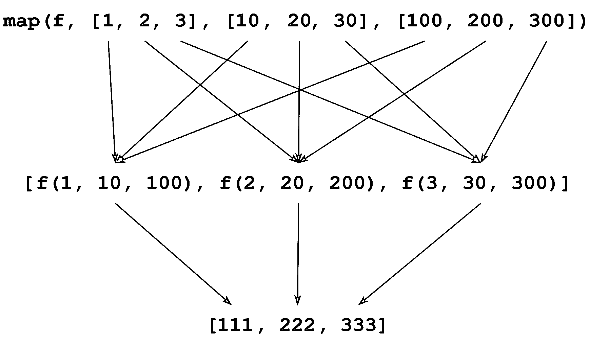
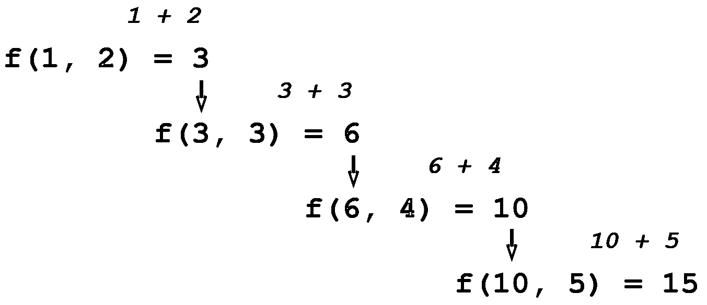
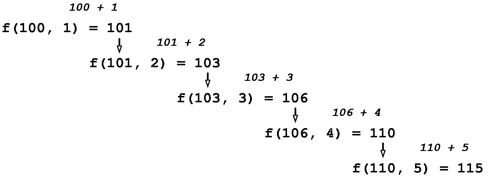

# Python 中的函数式编程:何时以及如何使用它

> 原文：<https://realpython.com/python-functional-programming/>

**函数式编程**是一种编程范式，其中主要的计算方法是函数求值。在本教程中，您将探索 Python 中的函数式编程。

函数式编程通常在 Python 代码中扮演相当小的角色。但是熟悉就好。至少，在阅读他人编写的代码时，您可能会不时遇到这种情况。您甚至会发现在您自己的代码中使用 Python 的函数式编程能力是有利的。

在本教程中，您将学习:

*   **函数式编程**范式需要什么
*   在 Python 中说**函数**是**一等公民**是什么意思
*   如何用 **`lambda`** 关键字定义**匿名函数**
*   如何使用 **`map()`** 、 **`filter()`** 、 **`reduce()`** 实现功能代码

**免费奖励:** [掌握 Python 的 5 个想法](https://realpython.com/bonus/python-mastery-course/)，这是一个面向 Python 开发者的免费课程，向您展示将 Python 技能提升到下一个水平所需的路线图和心态。

## 什么是函数式编程？

一个**纯函数**是一个其输出值仅跟随其输入值的函数，没有任何可观察到的[副作用](https://realpython.com/defining-your-own-python-function/#side-effects)。在**函数式编程**中，一个程序完全由纯函数的求值组成。计算通过嵌套或[组合函数调用](https://en.wikipedia.org/wiki/Function_composition_(computer_science))进行，不改变状态或可变数据。

函数范式之所以流行，是因为它提供了优于其他编程范式的几个优点。功能代码是:

*   **高层次:**你描述的是你想要的结果，而不是明确指定达到目标所需的步骤。单一陈述往往简洁，但却很有冲击力。
*   **透明:**纯函数的行为只取决于它的输入和输出，没有中间值。这消除了副作用的可能性，方便了[调试](https://realpython.com/python-debugging-pdb/)。
*   **可并行化:**不会产生副作用的例程可以更容易地[彼此并行运行](https://realpython.com/learning-paths/python-concurrency-parallel-programming/)。

许多编程语言支持某种程度的函数式编程。在一些语言中，几乎所有的代码都遵循函数范式。哈斯克尔就是这样一个例子。相比之下，Python 确实支持函数式编程，但也包含其他编程模型的特性。

虽然对函数式编程的深入[描述确实有些复杂，但这里的目标不是给出一个严格的定义，而是向您展示通过 Python 中的函数式编程可以做些什么。](https://en.wikipedia.org/wiki/Functional_programming)

[*Remove ads*](/account/join/)

## Python 对函数式编程的支持有多好？

为了支持函数式编程，如果给定编程语言中的[函数](https://realpython.com/defining-your-own-python-function/)有两种能力，这是很有用的:

1.  将另一个函数作为参数
2.  将另一个函数返回给它的调用方

Python 在这两方面都做得很好。正如您在本系列之前所学的，Python 程序中的所有东西都是一个对象。Python 中的所有对象都有或多或少的同等地位，函数也不例外。

在 Python 中，函数是**一等公民**。这意味着函数与像[字符串](https://realpython.com/python-strings/)和[数字](https://realpython.com/python-numbers/)这样的值具有相同的特征。任何你期望可以用字符串或数字做的事情，你也可以用函数来做。

例如，可以将一个函数赋给一个变量。然后，您可以像使用函数本身一样使用该变量:

>>>

```py
 1>>> def func():
 2...     print("I am function func()!")
 3...
 4
 5>>> func()
 6I am function func()!
 7
 8>>> another_name = func 9>>> another_name()
10I am function func()!
```

第 8 行的赋值`another_name = func`创建了一个对`func()`的新引用，名为`another_name`。然后，您可以通过名字`func`或`another_name`调用该函数，如第 5 行和第 9 行所示。

你可以用 [`print()`](https://realpython.com/python-print/) 向控制台显示一个函数，将它作为一个元素包含在一个复合数据对象中，比如一个[列表](https://realpython.com/python-lists-tuples/)，或者甚至将它作为一个[字典](https://realpython.com/python-dicts/)键:

>>>

```py
>>> def func():
...     print("I am function func()!")
...

>>> print("cat", func, 42) cat <function func at 0x7f81b4d29bf8> 42

>>> objects = ["cat", func, 42] >>> objects[1]
<function func at 0x7f81b4d29bf8>
>>> objects[1]()
I am function func()!

>>> d = {"cat": 1, func: 2, 42: 3} >>> d[func]
2
```

在这个例子中，`func()`出现在与值`"cat"`和`42`相同的上下文中，解释器处理得很好。

**注意:**在 Python 中你能对任何对象做什么或不能做什么，在某种程度上取决于上下文。例如，有些操作适用于某些对象类型，但不适用于其他类型。

您可以添加两个整数对象，或者用加号运算符(`+`)连接两个字符串对象。但是加号运算符不是为函数对象定义的。

就目前的目的而言，重要的是 Python 中的函数满足上面列出的有利于函数式编程的两个标准。可以将一个函数作为参数传递给另一个函数:

>>>

```py
 1>>> def inner():
 2...     print("I am function inner()!")
 3...
 4
 5>>> def outer(function):
 6...     function()
 7...
 8
 9>>> outer(inner) 10I am function inner()!
```

上面的例子是这样的:

*   第 9 行的调用将`inner()`作为参数传递给`outer()`。
*   在`outer()`内，Python 将`inner()`绑定到函数参数`function`。
*   `outer()`可以通过`function`直接呼叫`inner()`。

这就是所谓的**函数组合**。

**技术提示:** Python 提供了一种被称为**装饰器**的快捷符号，以方便将一个函数包装在另一个函数中。要了解更多信息，请查看 Python Decorators 的[初级读本。](https://realpython.com/primer-on-python-decorators/)

当您将一个函数传递给另一个函数时，传入的函数有时被称为**回调**，因为对[内部函数](https://realpython.com/inner-functions-what-are-they-good-for/)的*回调*可以修改外部函数的行为。

一个很好的例子就是 Python 函数 [`sorted()`](https://docs.python.org/3/library/functions.html#sorted) 。通常，如果您将一个字符串值列表传递给`sorted()`，那么它会按照词汇顺序对它们进行排序:

>>>

```py
>>> animals = ["ferret", "vole", "dog", "gecko"]
>>> sorted(animals)
['dog', 'ferret', 'gecko', 'vole']
```

然而，`sorted()`接受一个可选的`key`参数，该参数指定了一个可以作为排序键的回调函数。因此，例如，您可以改为按字符串长度排序:

>>>

```py
>>> animals = ["ferret", "vole", "dog", "gecko"]
>>> sorted(animals, key=len)
['dog', 'vole', 'gecko', 'ferret']
```

`sorted()`也可以带一个可选参数，指定以相反的顺序排序。但是您可以通过定义自己的回调函数来管理同样的事情，该函数反转了`len()`的含义:

>>>

```py
>>> animals = ["ferret", "vole", "dog", "gecko"]
>>> sorted(animals, key=len, reverse=True)
['ferret', 'gecko', 'vole', 'dog']

>>> def reverse_len(s):
...     return -len(s)
...
>>> sorted(animals, key=reverse_len)
['ferret', 'gecko', 'vole', 'dog']
```

你可以查看[如何在 Python](https://realpython.com/python-sort/) 中使用`sorted()`和`sort()`来获得更多关于在 Python 中排序数据的信息。

正如您可以将一个函数作为参数传递给另一个函数一样，一个函数也可以将另一个函数指定为其返回值:

>>>

```py
 1>>> def outer():
 2...     def inner(): 3...             print("I am function inner()!") 4...
 5...     # Function outer() returns function inner()
 6...     return inner 7...
 8
 9>>> function = outer() 10>>> function
11<function outer.<locals>.inner at 0x7f18bc85faf0>
12>>> function() 13I am function inner()!
14
15>>> outer()() 16I am function inner()!
```

这个例子中的情况如下:

*   **第 2 行到第 3 行:** `outer()`定义了一个局部函数`inner()`。
*   **第 6 行:** `outer()`传回`inner()`作为其返回值。
*   **第 9 行:**将`outer()`的返回值赋给变量`function`。

接下来，您可以通过`function`间接调用`inner()`，如第 12 行所示。您也可以使用来自`outer()`的返回值间接调用它，无需中间赋值，如第 15 行所示。

正如您所看到的，Python 已经准备好很好地支持函数式编程。不过，在开始编写函数式代码之前，还有一个概念将有助于您的探索:表达式[`lambda`。](https://realpython.com/python-lambda/)

[*Remove ads*](/account/join/)

## 用`lambda` 定义匿名函数

函数式编程就是调用函数并传递它们，所以它自然会涉及到定义很多函数。你可以用通常的方式定义一个函数，使用关键字 [`def`](https://realpython.com/defining-your-own-python-function/#function-calls-and-definition) ，就像你在本系列前面的教程中看到的那样。

不过，有时候，能够动态地定义一个匿名函数是很方便的，不需要给它一个名字。在 Python 中，你可以用一个 **`lambda`** 表达式来实现。

**技术说明:**术语 *lambda* 来自 [lambda calculus](https://en.wikipedia.org/wiki/Lambda_calculus) ，一种基于函数抽象和应用来表达计算的数学逻辑形式系统。

`lambda`表达式的语法如下:

```py
lambda <parameter_list>: <expression>
```

下表总结了一个`lambda`表达式的各个部分:

| 成分 | 意义 |
| --- | --- |
| `lambda` | 引入一个`lambda`表达式的关键字 |
| `<parameter_list>` | 可选的逗号分隔的参数名称列表 |
| `:` | 分隔`<parameter_list>`和`<expression>`的标点符号 |
| `<expression>` | 通常包含`<parameter_list>`中的名称的表达式 |

一个`lambda`表达式的值是一个可调用的函数，就像用`def`关键字定义的函数一样。它接受由`<parameter_list>`指定的参数，并返回一个值，如`<expression>`所示。

这是第一个简单的例子:

>>>

```py
 1>>> lambda s: s[::-1]
 2<function <lambda> at 0x7fef8b452e18>
 3
 4>>> callable(lambda s: s[::-1])
 5True
```

第 1 行的语句本身就是`lambda`表达式。在第 2 行，Python 显示了表达式的值，您可以看到这是一个函数。

内置的 Python 函数 [`callable()`](https://docs.python.org/3/library/functions.html?highlight=callable#callable) 如果传递给它的参数是可调用的，则返回 [`True`](https://realpython.com/python-boolean/) ，否则返回 [`False`](https://realpython.com/python-boolean/) 。第 4 行和第 5 行显示了由`lambda`表达式返回的值实际上是可调用的，就像函数应该做的那样。

在这种情况下，参数表由单个参数`s`组成。后续表达式`s[::-1]`是[以逆序](https://realpython.com/python-strings/#specifying-a-stride-in-a-string-slice)返回`s`中字符的切片语法。所以这个`lambda`表达式定义了一个临时的、无名的函数，它接受一个字符串参数并返回字符颠倒的参数字符串。

由`lambda`表达式创建的对象是一等公民，就像 Python 中的标准函数或任何其他对象一样。您可以将它赋给一个变量，然后使用该名称调用函数:

>>>

```py
>>> reverse = lambda s: s[::-1]
>>> reverse("I am a string")
'gnirts a ma I'
```

这在功能上——没有双关的意思——相当于用关键字`def`定义`reverse()`:

>>>

```py
 1>>> def reverse(s):
 2...     return s[::-1]
 3...
 4>>> reverse("I am a string") 5'gnirts a ma I'
 6
 7>>> reverse = lambda s: s[::-1]
 8>>> reverse("I am a string") 9'gnirts a ma I'
```

上面第 4 行和第 8 行的调用行为相同。

然而，在调用之前，没有必要将变量赋给一个`lambda`表达式。也可以直接调用由`lambda`表达式定义的函数:

>>>

```py
>>> (lambda s: s[::-1])("I am a string")
'gnirts a ma I'
```

这是另一个例子:

>>>

```py
>>> (lambda x1, x2, x3: (x1 + x2 + x3) / 3)(9, 6, 6)
7.0
>>> (lambda x1, x2, x3: (x1 + x2 + x3) / 3)(1.4, 1.1, 0.5)
1.0
```

这种情况下，参数为`x1`、`x2`、`x3`，表达式为`x1 + x2 + x3 / 3`。这是一个匿名的`lambda`函数，用来计算三个数字的平均值。

再举一个例子，回想一下上面您定义了一个`reverse_len()`作为`sorted()`的回调函数:

>>>

```py
>>> animals = ["ferret", "vole", "dog", "gecko"]

>>> def reverse_len(s):
...     return -len(s)
...
>>> sorted(animals, key=reverse_len)
['ferret', 'gecko', 'vole', 'dog']
```

您也可以在这里使用`lambda`函数:

>>>

```py
>>> animals = ["ferret", "vole", "dog", "gecko"]
>>> sorted(animals, key=lambda s: -len(s))
['ferret', 'gecko', 'vole', 'dog']
```

一个`lambda`表达式通常会有一个参数列表，但这不是必需的。可以定义一个没有参数的`lambda`函数。返回值不依赖于任何输入参数:

>>>

```py
>>> forty_two_producer = lambda: 42
>>> forty_two_producer()
42
```

请注意，您只能用`lambda`定义相当基本的函数。`lambda`表达式的返回值只能是一个表达式。一个`lambda`表达式不能包含赋值、 [`return`](https://realpython.com/python-return-statement/) 之类的语句，也不能包含 [`for`](https://realpython.com/python-for-loop/) 、 [`while`](https://realpython.com/python-while-loop/) 、 [`if`](https://realpython.com/python-conditional-statements/#introduction-to-the-if-statement) 、 [`else`](https://realpython.com/python-conditional-statements/#the-else-and-elif-clauses) 或 [`def`](https://realpython.com/defining-your-own-python-function/) 之类的控制结构。

在之前关于[定义 Python 函数](https://realpython.com/defining-your-own-python-function/#returning-data-to-the-caller)的教程中，您已经了解到用`def`定义的函数可以有效地返回多个值。如果函数中的一个`return`语句包含几个逗号分隔的值，那么 Python 将它们打包并作为一个[元组](https://realpython.com/python-lists-tuples/#python-tuples)返回:

>>>

```py
>>> def func(x):
...     return x, x ** 2, x ** 3
...
>>> func(3)
(3, 9, 27)
```

这种隐式元组打包不适用于匿名`lambda`函数:

>>>

```py
>>> (lambda x: x, x ** 2, x ** 3)(3)
<stdin>:1: SyntaxWarning: 'tuple' object is not callable; perhaps you missed a comma?
Traceback (most recent call last):
  File "<stdin>", line 1, in <module>
NameError: name 'x' is not defined
```

但是你可以从一个`lambda`函数中返回一个元组。你只需要用括号明确地表示元组。您也可以从`lambda`函数中返回一个列表或字典:

>>>

```py
>>> (lambda x: (x, x ** 2, x ** 3))(3)
(3, 9, 27)
>>> (lambda x: [x, x ** 2, x ** 3])(3)
[3, 9, 27]
>>> (lambda x: {1: x, 2: x ** 2, 3: x ** 3})(3)
{1: 3, 2: 9, 3: 27}
```

一个`lambda`表达式有自己的本地[名称空间](https://realpython.com/python-namespaces-scope/#namespaces-in-python)，所以参数名不会与全局名称空间中的相同名称冲突。一个`lambda`表达式可以访问全局名称空间中的变量，但是不能修改它们。

还有最后一个奇怪的地方需要注意。如果您发现需要在一个[格式的字符串文字(f-string)](https://realpython.com/python-f-strings/) 中包含一个`lambda`表达式，那么您需要用显式括号将它括起来:

>>>

```py
>>> print(f"--- {lambda s: s[::-1]} ---")
  File "<stdin>", line 1
    (lambda s)
             ^
SyntaxError: f-string: invalid syntax

>>> print(f"--- {(lambda s: s[::-1])} ---")
--- <function <lambda> at 0x7f97b775fa60> ---
>>> print(f"--- {(lambda s: s[::-1])('I am a string')} ---")
--- gnirts a ma I ---
```

现在你知道如何用`lambda`定义一个匿名函数了。关于`lambda`函数的进一步阅读，请查看[如何使用 Python Lambda 函数](https://realpython.com/python-lambda/)。

接下来，是时候深入研究 Python 中的函数式编程了。您将看到`lambda`函数在编写函数代码时是如何特别方便。

Python 提供了两个内置函数， [`map()`](https://realpython.com/python-map-function/) 和 [`filter()`](https://realpython.com/python-filter-function/) ，它们符合函数式编程范式。第三种， [`reduce()`](https://realpython.com/python-reduce-function/) ，不再是核心语言的一部分，但仍然可以从一个名为`functools`的模块中获得。这三个函数都将另一个函数作为其参数之一。

[*Remove ads*](/account/join/)

## 使用`map()` 将函数应用于可迭代对象

docket 上的第一个函数是 **`map()`** ，这是一个 Python 内置函数。使用`map()`，你可以依次对 [iterable](https://realpython.com/python-for-loop/#iterables) 中的每个元素应用一个函数，然后`map()`将返回一个迭代器产生结果。这可以允许一些非常简洁的代码，因为一个`map()`语句通常可以代替一个显式循环。

### 用单个可迭代的调用`map()`

在单个 iterable 上调用`map()`的语法如下所示:

```py
map(<f>, <iterable>)
```

`map(<f>, <iterable>)`在迭代器中返回将函数`<f>`应用到`<iterable>`的每个元素的结果。

这里有一个例子。假设您已经使用您的老朋友`[::-1]`字符串切片机制定义了`reverse()`，一个接受字符串参数并返回其反向的函数:

>>>

```py
>>> def reverse(s):
...     return s[::-1]
...
>>> reverse("I am a string")
'gnirts a ma I'
```

如果您有一个字符串列表，那么您可以使用`map()`将`reverse()`应用到列表的每个元素:

>>>

```py
>>> animals = ["cat", "dog", "hedgehog", "gecko"]
>>> iterator = map(reverse, animals)
>>> iterator
<map object at 0x7fd3558cbef0>
```

但是记住，`map()`不会返回一个列表。它返回一个名为**地图对象**的[迭代器](https://realpython.com/python-for-loop/#iterators)。要从迭代器中获取值，您需要迭代它或者使用`list()`:

>>>

```py
>>> iterator = map(reverse, animals)
>>> for i in iterator: ...     print(i)
...
tac
god
gohegdeh
okceg

>>> iterator = map(reverse, animals)
>>> list(iterator) ['tac', 'god', 'gohegdeh', 'okceg']
```

迭代`iterator`产生原始列表`animals`中的条目，每个字符串由`reverse()`反转。

在这个例子中，`reverse()`是一个非常短的函数，除了使用`map()`之外，您可能不需要它。你可以使用一个匿名的`lambda`函数，而不是用一个一次性的函数把代码弄乱:

>>>

```py
>>> animals = ["cat", "dog", "hedgehog", "gecko"]
>>> iterator = map(lambda s: s[::-1], animals) >>> list(iterator)
['tac', 'god', 'gohegdeh', 'okceg']

>>> # Combining it all into one line:
>>> list(map(lambda s: s[::-1], ["cat", "dog", "hedgehog", "gecko"])) ['tac', 'god', 'gohegdeh', 'okceg']
```

如果 iterable 包含不适合指定函数的项目，那么 Python 会抛出一个[异常](https://realpython.com/python-exceptions/):

>>>

```py
>>> list(map(lambda s: s[::-1], ["cat", "dog", 3.14159, "gecko"]))
Traceback (most recent call last):
  File "<stdin>", line 1, in <module>
  File "<stdin>", line 1, in <lambda>
TypeError: 'float' object is not subscriptable
```

在这种情况下，`lambda`函数需要一个字符串参数，并试图对其进行切分。列表中的第二个元素`3.14159`是一个`float`对象，它是不可切片的。于是出现了 [`TypeError`](https://realpython.com/python-traceback/#typeerror) 。

这里有一个更真实的例子:在关于[内置字符串方法](https://realpython.com/python-strings/#built-in-string-methods)的教程部分，您遇到了`str.join()`，它将 iterable 中的字符串串联起来，由指定的字符串分隔:

>>>

```py
>>> "+".join(["cat", "dog", "hedgehog", "gecko"])
'cat+dog+hedgehog+gecko'
```

如果列表中的对象是字符串，这就很好。如果不是，那么`str.join()`引发一个`TypeError`异常:

>>>

```py
>>> "+".join([1, 2, 3, 4, 5])
Traceback (most recent call last):
  File "<stdin>", line 1, in <module>
TypeError: sequence item 0: expected str instance, int found
```

解决这个问题的一种方法是使用循环。使用一个`for`循环，您可以创建一个新列表，其中包含原始列表中数字的字符串表示。然后您可以将新列表传递给`.join()`:

>>>

```py
>>> strings = []
>>> for i in [1, 2, 3, 4, 5]:
...     strings.append(str(i))
...
>>> strings
['1', '2', '3', '4', '5']
>>> "+".join(strings)
'1+2+3+4+5'
```

然而，因为`map()`依次对列表中的每个对象应用一个函数，它通常可以消除对显式循环的需要。在这种情况下，您可以在连接列表对象之前使用`map()`将`str()`应用于列表对象:

>>>

```py
>>> "+".join(map(str, [1, 2, 3, 4, 5]))
'1+2+3+4+5'
```

`map(str, [1, 2, 3, 4, 5])`返回一个迭代器，该迭代器产生字符串对象的列表`["1", "2", "3", "4", "5"]`，然后您可以成功地将该列表传递给`.join()`。

虽然`map()`在上面的例子中实现了想要的效果，但是在这种情况下，使用[列表理解](https://realpython.com/list-comprehension-python/)来代替显式循环会更[python 化](https://realpython.com/learning-paths/writing-pythonic-code/)。

[*Remove ads*](/account/join/)

### 使用多个可迭代的调用`map()`

还有另一种形式的`map()`接受不止一个可迭代的参数:

```py
map(<f>, <iterable₁>, <iterable₂>, ..., <iterableₙ>)
```

`map(<f>, <iterable`<sub>`1`</sub>`>, <iterable`<sub>`2`</sub>`>, ..., <iterable`<sub>`n`</sub>`>)`将`<f>`并行应用于每个`<iterable` <sub>`i`</sub> `>`中的元素，并返回产生结果的迭代器。

指定给`map()`的`<iterable` <sub>`i`</sub> `>`参数的数量必须与`<f>`期望的参数数量相匹配。`<f>`作用于每个`<iterable` <sub>`i`</sub> `>`的第一项，该结果成为返回迭代器产出的第一项。然后`<f>`作用于每个`<iterable` <sub>`i`</sub> `>`中的第二个项目，成为第二个产出的项目，以此类推。

一个例子应该有助于澄清:

>>>

```py
>>> def f(a, b, c):
...     return a + b + c
...

>>> list(map(f, [1, 2, 3], [10, 20, 30], [100, 200, 300])) [111, 222, 333]
```

在这种情况下，`f()`需要三个参数。相应地，`map()`有三个可重复的参数:列表`[1, 2, 3]`、`[10, 20, 30]`和`[100, 200, 300]`。

返回的第一项是将`f()`应用于每个列表中的第一个元素:`f(1, 10, 100)`的结果。返回的第二项是`f(2, 20, 200)`，第三项是`f(3, 30, 300)`，如下图所示:

[](https://files.realpython.com/media/t.130d7baf2cca.png)

从`map()`返回的值是一个迭代器，产生列表`[111, 222, 333]`。

同样在这种情况下，由于`f()`非常短，您可以很容易地用一个`lambda`函数代替它:

>>>

```py
>>> list(
...     map(
...         (lambda a, b, c: a + b + c),
...         [1, 2, 3],
...         [10, 20, 30],
...         [100, 200, 300]
...     )
... )
```

这个例子在`lambda`函数和[隐式行继续符](https://realpython.com/python-program-structure/#implicit-line-continuation)周围使用了额外的括号。这两者都不是必需的，但是它们有助于使代码更容易阅读。

## 用`filter()` 从 Iterable 中选择元素

**`filter()`** 允许您根据给定函数的评估从 iterable 中选择或过滤项目。它的名称如下:

```py
filter(<f>, <iterable>)
```

`filter(<f>, <iterable>)`将函数`<f>`应用于`<iterable>`的每个元素，并返回一个迭代器，该迭代器产生`<f>`为[真值](https://realpython.com/python-operators-expressions/#evaluation-of-non-boolean-values-in-boolean-context)的所有项目。相反，它过滤掉所有`<f>`为假的项目。

在下面的例子中，`greater_than_100(x)`是 true thy if`x > 100`:

>>>

```py
>>> def greater_than_100(x):
...     return x > 100
...

>>> list(filter(greater_than_100, [1, 111, 2, 222, 3, 333])) [111, 222, 333]
```

在这种情况下，`greater_than_100()`对于项目`111`、`222`和`333`是真的，因此这些项目保留，而`1`、`2`和`3`被丢弃。和前面的例子一样，`greater_than_100()`是一个短函数，您可以用一个`lambda`表达式来代替它:

>>>

```py
>>> list(filter(lambda x: x > 100, [1, 111, 2, 222, 3, 333]))
[111, 222, 333]
```

下一个例子特点 [`range()`](https://realpython.com/python-range/) 。`range(n)`产生一个迭代器，该迭代器产生从`0`到`n - 1`的整数。以下示例使用`filter()`从列表中仅选择偶数，并过滤掉奇数:

>>>

```py
>>> list(range(10))
[0, 1, 2, 3, 4, 5, 6, 7, 8, 9]

>>> def is_even(x):
...     return x % 2 == 0
...
>>> list(filter(is_even, range(10))) [0, 2, 4, 6, 8]

>>> list(filter(lambda x: x % 2 == 0, range(10))) [0, 2, 4, 6, 8]
```

下面是一个使用内置字符串方法的示例:

>>>

```py
>>> animals = ["cat", "Cat", "CAT", "dog", "Dog", "DOG", "emu", "Emu", "EMU"]

>>> def all_caps(s):
...     return s.isupper()
...
>>> list(filter(all_caps, animals)) ['CAT', 'DOG', 'EMU']

>>> list(filter(lambda s: s.isupper(), animals)) ['CAT', 'DOG', 'EMU']
```

请记住前面关于[字符串方法](https://realpython.com/python-strings/#built-in-string-methods)的教程，如果`s`中的所有字母字符都是大写的，则`s.isupper()`返回`True`，否则返回`False`。

[*Remove ads*](/account/join/)

## 用`reduce()` 将一个 Iterable 简化为一个值

**`reduce()`** 一次对两个可迭代的项目应用一个函数，逐步组合它们以产生一个结果。

`reduce()`曾经是 Python 中的内置函数。[吉多·范·罗苏姆](https://en.wikipedia.org/wiki/Guido_van_Rossum)显然相当不喜欢`reduce()`，并主张将其从语言中完全删除。以下是他对此的看法:

> 所以现在`reduce()`。这实际上是我最讨厌的一个，因为除了几个涉及`+`或`*`的例子，几乎每次我看到一个带有重要函数参数的`reduce()`调用，我都需要拿起笔和纸来画出实际输入到那个函数中的内容，然后我才明白`reduce()`应该做什么。因此，在我看来，`reduce()`的适用性仅限于关联操作符，在其他情况下，最好显式写出累加循环。([来源](https://www.artima.com/weblogs/viewpost.jsp?thread=98196))

Guido 实际上提倡从 Python 中删除所有三个`reduce()`、`map()`和`filter()`。人们只能猜测他的理由。碰巧的是，前面提到的**列表理解**涵盖了所有这些函数提供的功能以及更多。你可以通过阅读[在 Python 中何时使用列表理解](https://realpython.com/list-comprehension-python/)来了解更多。

如您所见，`map()`和`filter()`仍然是 Python 中的内置函数。`reduce()`不再是一个内置函数，但它可用于从标准库模块[导入](https://realpython.com/python-import/)，您将在接下来看到。

要使用`reduce()`，需要从名为`functools`的模块导入。有几种方法可以做到这一点，但以下是最直接的方法:

```py
from functools import reduce
```

接下来，解释器将`reduce()`放入[全局名称空间](https://realpython.com/python-namespaces-scope/#the-global-namespace)中，并使其可供使用。您将在下面看到的示例假设了这种情况。

### 使用两个参数调用`reduce()`

最简单的`reduce()`调用需要一个函数和一个 iterable，如下所示:

```py
reduce(<f>, <iterable>)
```

`reduce(<f>, <iterable>)`使用`<f>`，它必须是一个正好接受两个参数的函数，来逐步组合`<iterable>`中的元素。首先，`reduce()`对`<iterable>`的前两个元素调用`<f>`。然后将该结果与第三个元素组合，然后将该结果与第四个元素组合，依此类推，直到列表结束。然后`reduce()`返回最终结果。

Guido 说`reduce()`最直接的应用是那些使用[关联操作符](https://en.wikipedia.org/wiki/Operator_associativity)的应用，他是对的。让我们从加号运算符(`+`)开始:

>>>

```py
>>> def f(x, y):
...     return x + y
...

>>> from functools import reduce
>>> reduce(f, [1, 2, 3, 4, 5]) 15
```

对`reduce()`的调用从列表`[1, 2, 3, 4, 5]`中产生结果`15`,如下所示:

[](https://files.realpython.com/media/t.5446e98a36c1.png)

<figcaption class="figure-caption text-center">reduce(f, [1, 2, 3, 4, 5])</figcaption>

这是对列表中的数字求和的一种相当迂回的方式！虽然这很好，但还有一种更直接的方法。Python 的内置`sum()`返回 iterable 中数值的总和:

>>>

```py
>>> sum([1, 2, 3, 4, 5])
15
```

记住，二进制加运算符[也连接字符串](https://realpython.com/python-string-split-concatenate-join/)。因此，这个示例也将逐步连接列表中的字符串:

>>>

```py
>>> reduce(f, ["cat", "dog", "hedgehog", "gecko"])
'catdoghedgehoggecko'
```

同样，有一种方法可以实现这一点，大多数人认为这种方法更典型。这正是 [`str.join()`](https://realpython.com/python-strings/#converting-between-strings-and-lists) 所做的:

>>>

```py
>>> "".join(["cat", "dog", "hedgehog", "gecko"])
'catdoghedgehoggecko'
```

现在考虑一个使用二进制乘法运算符(`*`)的例子。正整数`n`的**阶乘**定义如下:

[](https://files.realpython.com/media/jsturtz-factorial-defn.b3cd3711a627.png)

您可以使用`reduce()`和`range()`实现阶乘函数，如下所示:

>>>

```py
>>> def multiply(x, y):
...     return x * y
...

>>> def factorial(n):
...     from functools import reduce
...     return reduce(multiply, range(1, n + 1)) ...

>>> factorial(4)  # 1 * 2 * 3 * 4
24
>>> factorial(6)  # 1 * 2 * 3 * 4 * 5 * 6
720
```

同样，有一种更简单的方法可以做到这一点。您可以使用标准[模块](https://realpython.com/python-math-module/)提供的`factorial()`:

>>>

```py
>>> from math import factorial

>>> factorial(4)
24
>>> factorial(6)
720
```

作为最后一个例子，假设您需要找到列表中的最大值。Python 提供了内置函数 [`max()`](https://realpython.com/python-min-and-max/) 来完成这项工作，但是您也可以使用`reduce()`:

>>>

```py
>>> max([23, 49, 6, 32])
49

>>> def greater(x, y):
...     return x if x > y else y
...

>>> from functools import reduce
>>> reduce(greater, [23, 49, 6, 32]) 49
```

注意，在上面的每个例子中，传递给`reduce()`的函数是一行函数。在每种情况下，您都可以使用一个`lambda`函数来代替:

>>>

```py
>>> reduce(lambda x, y: x + y, [1, 2, 3, 4, 5]) 15
>>> reduce(lambda x, y: x + y, ["foo", "bar", "baz", "quz"]) 'foobarbazquz'

>>> def factorial(n):
...     from functools import reduce
...     return reduce(lambda x, y: x * y, range(1, n + 1)) ...
>>> factorial(4)
24
>>> factorial(6)
720

>>> reduce((lambda x, y: x if x > y else y), [23, 49, 6, 32]) 49
```

这是避免将不需要的函数放入名称空间的一种便捷方式。另一方面，当你使用`lambda`而不是定义一个单独的函数时，阅读代码的人可能更难确定你的意图。通常情况下，这是可读性和便利性之间的平衡。

[*Remove ads*](/account/join/)

### 用初始值调用`reduce()`

还有另一种方法调用`reduce()`来指定归约序列的初始值:

```py
reduce(<f>, <iterable>, <init>)
```

当存在时，`<init>`指定组合的初始值。在对`<f>`的第一次调用中，参数是`<init>`和`<iterable>`的第一个元素。然后，该结果与第二个元素`<iterable>`相结合，以此类推:

>>>

```py
>>> def f(x, y):
...     return x + y
...

>>> from functools import reduce
>>> reduce(f, [1, 2, 3, 4, 5], 100)  # (100 + 1 + 2 + 3 + 4 + 5) 115

>>> # Using lambda:
>>> reduce(lambda x, y: x + y, [1, 2, 3, 4, 5], 100)
115
```

现在，函数调用的序列如下所示:

[](https://files.realpython.com/media/t.4cc153eaaffb.png)

<figcaption class="figure-caption text-center">reduce(f, [1, 2, 3, 4, 5], 100)</figcaption>

没有`reduce()`你也可以很容易达到同样的结果:

>>>

```py
>>> 100 + sum([1, 2, 3, 4, 5])
115
```

正如你在上面的例子中看到的，即使在你可以使用`reduce()`完成一项任务的情况下，通常也有可能找到一种更直接和[python 式的](https://realpython.com/learning-paths/writing-pythonic-code/)方法来完成没有它的相同任务。也许不难想象为什么`reduce()`最终被从核心语言中移除了。

也就是说，`reduce()`是一个非凡的函数。本节开头的描述指出`reduce()`组合元素产生一个*单一结果*。但是结果可以是一个复合对象，如列表或元组。出于这个原因，`reduce()`是一个非常一般化的高阶函数，通过它可以实现许多其他函数。

比如你可以用`reduce()`来实现`map()`:

>>>

```py
>>> numbers = [1, 2, 3, 4, 5]

>>> list(map(str, numbers)) ['1', '2', '3', '4', '5']

>>> def custom_map(function, iterable):
...     from functools import reduce
...
...     return reduce(
...         lambda items, value: items + [function(value)],
...         iterable,
...         [],
...     )
...
>>> list(custom_map(str, numbers)) ['1', '2', '3', '4', '5']
```

您也可以使用`reduce()`来实现`filter()`:

>>>

```py
>>> numbers = list(range(10))
>>> numbers
[0, 1, 2, 3, 4, 5, 6, 7, 8, 9]

>>> def is_even(x):
...     return x % 2 == 0
...

>>> list(filter(is_even, numbers)) [0, 2, 4, 6, 8]

>>> def custom_filter(function, iterable):
...     from functools import reduce
...
...     return reduce(
...         lambda items, value: items + [value] if function(value) else items,
...         iterable,
...         []
...     )
...
>>> list(custom_filter(is_even, numbers)) [0, 2, 4, 6, 8]
```

事实上，对对象序列的任何操作都可以表示为归约。

## 结论

**函数式编程**是一种编程范式，其中主要的计算方法是对纯函数求值。虽然 Python 主要不是一种函数式语言，但是熟悉`lambda`、`map()`、`filter()`和`reduce()`还是有好处的，因为它们可以帮助您编写简洁、高级、可并行化的代码。你也会在别人写的代码中看到它们。

**在本教程中，您学习了:**

*   什么是**功能编程**
*   Python 中的**函数**如何成为**的一等公民**，以及这如何使它们适合于函数式编程
*   如何定义一个简单的**匿名函数**与 **`lambda`**
*   如何用**`map()`****`filter()`****`reduce()`**实现功能代码

至此，关于使用 Python 的基础知识的介绍性系列已经结束。恭喜你！现在，您已经为以高效的 Pythonic 风格编写有用的程序打下了坚实的基础。

如果你有兴趣让你的 Python 技能更上一层楼，那么你可以查看更多的[中级](https://realpython.com/tutorials/intermediate/)和[高级](https://realpython.com/tutorials/advanced/)教程。你也可以查看一些 [Python 项目创意](https://realpython.com/intermediate-python-project-ideas/)，开始展示你的 Python 超能力。编码快乐！

[« Namespaces and Scope in Python](https://realpython.com/python-namespaces-scope/)[Functional Programming in Python](#)******