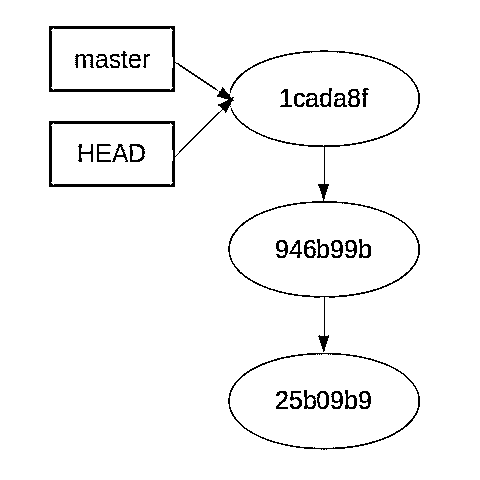
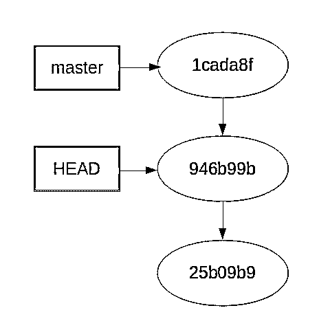

# Python 开发人员 Git 和 GitHub 简介

> 原文：<https://realpython.com/python-git-github-intro/>

*立即观看**本教程有真实 Python 团队创建的相关视频课程。和文字教程一起看，加深理解:[**Python 开发者 Git 和 GitHub 入门**](/courses/python-git-github-intro/)

你有没有做过一个 Python 项目，当你在这里做了一个更改或者在那里做了 PEP-8 清理之后，这个项目停止了工作，而你又不确定如何恢复它？版本控制系统可以帮助您解决这个问题以及其他相关问题。Git 是当今最流行的版本控制系统之一。

在本教程中，我将带您了解什么是 Git，如何将它用于您的个人[项目](https://realpython.com/intermediate-python-project-ideas/)，以及如何将它与 GitHub 结合使用，以便在更大的项目中与其他人合作。我们将了解如何创建一个 repo，如何添加新的和修改过的文件，以及如何浏览项目的历史，以便您可以“回到”项目工作的时间。

本文假设您的系统上已经安装了 Git。如果你不这样做，优秀的 *Pro Git* 书有一个[章节](https://git-scm.com/book/en/v2/Getting-Started-Installing-Git)告诉你如何去做。

## Git 是什么？

Git 是一个*分布式版本控制系统* (DVCS)。让我们把它分解一下，看看它意味着什么。

[*Remove ads*](/account/join/)

### 版本控制

一个*版本控制系统* (VCS)是一套跟踪一组文件历史的工具。这意味着您可以告诉您的 VCS(在我们的例子中是 Git)在任何时候保存文件的状态。然后，您可以继续编辑文件并存储该状态。保存状态类似于创建工作目录的备份副本。当使用 Git 时，我们将这种状态保存称为*提交*。

当您在 Git 中提交时，您添加了一条提交消息，该消息从较高的层面解释了您在该提交中所做的更改。Git 可以显示所有提交及其提交消息的历史。这为您所做的工作提供了一个有用的历史记录，并能真正帮助您确定系统中何时出现了 bug。

除了显示您所做更改的日志之外，Git 还允许您比较不同提交之间的文件。正如我前面提到的，Git 还允许您毫不费力地将任何文件(或所有文件)返回到先前的提交。

### 分布式版本控制

好了，这就是一个*版本控制系统*。*分发的*部分是什么？从一点历史开始回答这个问题可能是最简单的。早期版本控制系统的工作方式是将所有提交内容存储在本地硬盘上。这个提交集合被称为*库*。这解决了“我需要回到我所在的地方”的问题，但是对于一个在相同代码库上工作的团队来说，这并不是一个很好的扩展。

随着更大的团队开始工作(网络变得越来越普遍)，VCSs 开始将存储库存储在由许多开发人员共享的中央服务器上。虽然这解决了许多问题，但也产生了新的问题，比如文件锁定。

在其他一些产品的引领下，Git 打破了这种模式。Git 没有一个拥有最终版本存储库的中央服务器。所有用户都有存储库的完整副本。这意味着让所有开发人员回到同一个页面有时会很棘手，但这也意味着开发人员可以大部分时间离线工作，只有当他们需要共享他们的工作时才连接到其他存储库。

最后一段一开始看起来有点混乱，因为有很多开发人员将 GitHub 作为一个中央存储库，每个人都必须从中获取数据。这是真的，但是 Git 并没有强加这一点。在某些情况下，有一个共享代码的中心位置很方便。即使使用 GitHub，完整的存储库仍然存储在所有本地存储库中。

## 基本用法

既然我们已经讨论了什么是 Git，那么让我们来看一个例子，看看它是如何工作的。我们将从在本地机器上使用 Git 开始。一旦我们掌握了窍门，我们将添加 GitHub 并解释如何与它交互。

### 创建新的回购

要使用 Git，您首先需要告诉它您是谁。您可以使用`git config`命令设置您的用户名:

```py
$ git config --global user.name "your name goes here"
```

一旦建立起来，你将需要一个回购工作。创建回购很简单。在目录中使用`git init`命令:

```py
$ mkdir example
$ cd example
$ git init
Initialized empty Git repository in /home/jima/tmp/example/.git/
```

一旦你有了回购，你可以向 Git 询问。您最常用的 Git 命令是`git status`。现在试试:

```py
$ git status
On branch master

Initial commit

nothing to commit (create/copy files and use "git add" to track)
```

这向您显示了一些信息:您在哪个分支上，`master`(我们稍后将讨论分支)，以及您没有*要提交的内容*。这最后一部分意味着这个目录中没有 Git 不知道的文件。这很好，因为我们刚刚创建了目录。

### 添加新文件

现在创建一个 Git 不知道的文件。使用您最喜欢的编辑器，创建文件`hello.py`，其中只有一条打印语句。

```py
# hello.py
print('hello Git!')
```

如果您再次运行`git status`，您将看到不同的结果:

```py
$ git status
On branch master

Initial commit

Untracked files:
 (use "git add <file>..." to include in what will be committed)

 hello.py

nothing added to commit but untracked files present (use "git add" to track)
```

现在 Git 看到了新文件，并告诉您它是*未跟踪的*。这只是 Git 的说法，即文件不是回购的一部分，不受版本控制。我们可以通过将文件添加到 Git 来解决这个问题。使用`git add`命令来实现这一点:

```py
$ git add hello.py
$ git status
On branch master

Initial commit

Changes to be committed:
 (use "git rm --cached <file>..." to unstage)

 new file:   hello.py
```

现在 Git 知道了`hello.py`，并把它列在*要提交的变更*下面。将文件添加到 Git 会将它移动到*暂存区*(将在下面讨论)，这意味着我们可以将它提交给回购。

[*Remove ads*](/account/join/)

### 提交更改

当您*提交*变更时，您是在告诉 Git 在回购中制作这个状态的快照。现在使用`git commit`命令来完成。`-m`选项告诉 Git 使用随后的提交消息。如果您不使用`-m`，Git 将为您打开一个编辑器来创建提交消息。通常，您希望您的提交消息反映提交中发生的变化:

```py
$ git commit -m "creating hello.py"
[master (root-commit) 25b09b9] creating hello.py
 1 file changed, 3 insertions(+)
 create mode 100755 hello.py

$ git status
On branch master
nothing to commit, working directory clean
```

您可以看到 commit 命令返回了一堆信息，其中大部分都不是很有用，但是它确实告诉您只有一个文件发生了更改(这在我们添加一个文件时是有意义的)。它还告诉您提交(`25b09b9`)的 *SHA* 。稍后我们会有一个关于阿沙的旁白。

再次运行`git status`命令表明我们有了一个*干净的*工作目录，这意味着所有的更改都提交给了 Git。

在这一点上，我们需要停止我们的教程，并有一个临时区域的快速聊天。

## 旁白:集结地

与许多版本控制系统不同，Git 有一个*暂存区*(通常称为*索引*)。staging area 是 Git 跟踪您希望在下一次提交中进行的更改的方式。当我们运行上面的`git add`时，我们告诉 Git 我们想要将新文件`hello.py`移动到临时区域。这种变化在`git status`中得到了体现。文件从输出的*未跟踪*部分转到*待提交*部分。

注意，staging 区域反映了运行`git add`时文件的确切内容。如果您再次修改它，该文件将同时出现在状态输出的*已暂存的*和*未暂存的*部分。

在 Git 中处理文件的任何时候(假设它已经被提交过一次)，都有三个版本的文件可以处理:

*   您正在编辑的硬盘上的版本
*   Git 存储在您的临时区域中的不同版本
*   最新版本已签入到存储库中

这三者都可以是文件的不同版本。将更改移动到临时区域，然后提交它们，会使所有这些版本重新同步。

当我开始使用 Git 时，我发现 staging area 有点混乱，有点烦人。这似乎给这个过程增加了额外的步骤，却没有带来任何好处。当你第一次学习 Git 的时候，这是真的。过一段时间后，你会发现自己真的很喜欢这个功能。不幸的是，这些情况超出了本教程的范围。

如果你对集结地更详细的信息感兴趣，我可以推荐[这篇博文](https://alblue.bandlem.com/2011/10/git-tip-of-week-understanding-index.html)。

## `.gitignore`

状态命令非常方便，您会发现自己经常使用它。但是有时你会发现有一堆文件出现在*未跟踪*部分，而你希望 Git 不要看到它们。这就是`.gitignore`文件的用处。

让我们看一个例子。在同一个目录中创建一个名为`myname.py`的新 Python 文件。

```py
# myname.py
def get_name():
    return "Jim"
```

然后修改 hello.py 以包含`myname`并调用它的函数:

```py
# hello.py
import myname

name = myname.get_name()
print("hello {}".format(name))
```

当您导入一个本地模块时，Python 会将它编译成字节码，并将该文件保留在您的文件系统中。在 Python 2 中，它会留下一个名为`myname.pyc`的文件，但我们会假设您运行的是 Python 3。在这种情况下，它将创建一个`__pycache__`目录并在那里存储一个 pyc 文件。如下所示:

```py
$ ls
hello.py  myname.py
$ ./hello.py
hello Jim!
$ ls
hello.py  myname.py  __pycache__
```

现在，如果您运行`git status`，您将在*未跟踪的*部分看到该目录。还要注意，您的新`myname.py`文件没有被跟踪，而您对`hello.py`所做的更改位于一个新的名为“Changes not staged for commit”的部分中。这仅仅意味着那些变更还没有被添加到临时区域中。让我们试一试:

```py
$ git status
On branch master
Changes not staged for commit:
 (use "git add <file>..." to update what will be committed)
 (use "git checkout -- <file>..." to discard changes in working directory)

 modified:   hello.py

Untracked files:
 (use "git add <file>..." to include in what will be committed)

 __pycache__/
 myname.py

no changes added to commit (use "git add" and/or "git commit -a")
```

在我们继续讨论 gitignore 文件之前，让我们稍微清理一下我们造成的混乱。首先，我们将添加`myname.py`和`hello.py`文件，就像我们之前做的那样:

```py
$ git add myname.py hello.py
$ git status
On branch master
Changes to be committed:
 (use "git reset HEAD <file>..." to unstage)

 modified:   hello.py
 new file:   myname.py

Untracked files:
 (use "git add <file>..." to include in what will be committed)

 __pycache__/
```

让我们提交这些更改并完成清理工作:

```py
$ git commit -m "added myname module"
[master 946b99b] added myname module
 2 files changed, 8 insertions(+), 1 deletion(-)
 create mode 100644 myname.py
```

现在，当我们运行 status 时，我们所看到是那个`__pycache__`目录:

```py
$ git status
On branch master
Untracked files:
 (use "git add <file>..." to include in what will be committed)

 __pycache__/

nothing added to commit but untracked files present (use "git add" to track)
```

为了让所有的`__pycache__`目录(及其内容)被忽略，我们将添加一个`.gitignore`文件到我们的 repo 中。这听起来很简单。编辑文件(记住名字前面的*点*！)在你最喜欢的编辑器里。

```py
# .gitignore
__pycache__
```

现在当我们运行`git status`时，我们不再看到`__pycache__`目录。然而，我们确实看到了新的`.gitignore`！看一看:

```py
$ git status
On branch master
Untracked files:
 (use "git add <file>..." to include in what will be committed)

 .gitignore

nothing added to commit but untracked files present (use "git add" to track)
```

该文件只是一个普通的文本文件，可以像其他文件一样添加到 repo 中。现在就做:

```py
$ git add .gitignore
$ git commit -m "created .gitignore"
[master 1cada8f] created .gitignore
 1 file changed, 1 insertion(+)
 create mode 100644 .gitignore
```

`.gitignore`文件中的另一个常见条目是存储虚拟环境的目录。你可以在这里了解更多关于虚拟人[的信息，但虚拟人目录通常被称为`env`或`venv`。您可以将这些添加到您的`.gitignore`文件中。如果文件或目录存在，它们将被忽略。如果不是，那么什么都不会发生。](https://realpython.com/python-virtual-environments-a-primer/)

也可以在您的主目录中存储一个*全局* `.gitignore`文件。如果您的编辑器喜欢将临时或备份文件放在本地目录中，这将非常方便。

下面是一个简单的 Python `.gitignore`文件的例子:

```py
# .gitignore
__pycache__
venv
env
.pytest_cache
.coverage
```

要查看更完整的示例，请点击[这里的](https://github.com/github/gitignore/blob/master/Python.gitignore)，或者，如果你想自己制作一个，`git help gitignore`提供了你需要的所有细节。

[*Remove ads*](/account/join/)

## Git 回购中不应添加的内容

当你第一次开始使用任何版本控制工具时，尤其是 Git，你可能会想把所有的东西都放入回购中。这一般是个错误。Git 有一些限制，安全性方面的考虑迫使您限制添加到 repo 中的信息类型。

让我们从关于**所有**版本控制系统的基本经验法则开始。

> 只将*源*文件放入版本控制，从不将*生成*文件。

在这个上下文中，*源*文件是您创建的任何文件，通常是通过在编辑器中键入。一个*生成的*文件是计算机创建的，通常是通过处理一个*源*文件。例如，`hello.py`是一个*源*文件，而`hello.pyc`是一个*生成的*文件。

回购中不包括生成的文件有两个原因。首先，这样做是浪费时间和空间。生成的文件可以随时重新创建，并且可能需要以不同的形式创建。如果有人正在使用 Jython 或 IronPython，而您正在使用 Cython 解释器，那么`.pyc`文件可能会非常不同。提交一种特定风格的文件会导致冲突

不存储生成文件的第二个原因是，这些文件通常比原始源文件大。将它们放在回购中意味着每个人现在都需要下载和存储这些生成的文件，即使他们并没有使用它们。

这第二点引出了关于 Git repos 的另一条一般规则:谨慎提交二进制文件，强烈避免提交大文件。这条规则与 Git 的工作方式有很大关系。

Git 不会存储您提交的每个文件的每个版本的完整副本。相反，它使用基于文件后续版本之间差异的复杂算法来大大减少所需的存储量。二进制文件(如 jpg 或 MP3 文件)没有很好的比较工具，所以 Git 通常只需要在每次提交时存储整个文件。

当你使用 Git 时，尤其是使用 GitHub 时，**千万不要**将机密信息放入回购协议中，尤其是你可能会公开分享的信息。这很重要，所以我要再说一遍:

**注意:**切勿将机密信息放入 GitHub 的公共存储库中。密码、API 密钥和类似项目不应提交给回购。有人**最终会**找到他们。

## 旁白:什么是阿沙

当 Git 在 repo 中存储东西(文件、目录、提交等)时，它以一种复杂的方式存储它们，包括一个*散列函数*。我们不需要在这里深入讨论细节，但是哈希函数接受一个东西，并为这个东西生成一个更短的惟一 ID(在我们的例子中是 20 个字节)。这个 ID 在 Git 中称为“SHA”。不能保证它是唯一的，但是对于大多数实际应用来说，它是唯一的。

Git 使用它的哈希算法来索引你的回购协议中的所有内容。每个文件都有反映该文件内容的阿沙。每个目录依次被散列。如果该目录中的文件发生变化，那么该目录的 SHA 也会发生变化。

每个提交都包含您的 repo 中顶级目录的 SHA 以及一些其他信息。这就是一个 20 字节的数字如何描述你的回购的整个状态。

您可能会注意到，有时 Git 使用完整的 20 个字符值来显示阿沙:

```py
commit 25b09b9ccfe9110aed2d09444f1b50fa2b4c979c
```

有时它会向您展示一个简短的版本:

```py
[master (root-commit) 25b09b9] creating hello.py
```

通常，它会向您显示完整的字符串，但您并不总是必须使用它。Git 的规则是，您只需给出足够的字符来确保 SHA 在您的 repo 中是唯一的。一般七个字就够了。

每次提交对 repo 的更改时，Git 都会创建一个描述该状态的新 SHA。我们将在接下来的章节中了解 sha 的用处。

[*Remove ads*](/account/join/)

## 去日志

另一个非常常用的 Git 命令是`git log`。Git 日志向您展示了到目前为止您所做的提交的历史:

```py
$ git log
commit 1cada8f59b43254f621d1984a9ffa0f4b1107a3b
Author: Jim Anderson <jima@example.com>
Date:   Sat Mar 3 13:23:07 2018 -0700

 created .gitignore

commit 946b99bfe1641102d39f95616ceaab5c3dc960f9
Author: Jim Anderson <jima@example.com>
Date:   Sat Mar 3 13:22:27 2018 -0700

 added myname module

commit 25b09b9ccfe9110aed2d09444f1b50fa2b4c979c
Author: Jim Anderson <jima@example.com>
Date:   Sat Mar 3 13:10:12 2018 -0700

 creating hello.py
```

正如您在上面的清单中看到的，我们的 repo 的所有提交消息都是按顺序显示的。每次提交的开始都标有单词“commit ”,后跟该提交的 SHA。给你每个 sha 的历史。

## 回到过去:签出代码的特定版本

因为 Git 会记住你用 SHA 进行的每一次提交，所以你可以告诉 Git 转到任何一次提交，查看当时存在的回购。下图显示了 Git 认为我们的回购中有什么:

[](https://files.realpython.com/media/git_diag_before_checkout.05348d1952f2.png)

不用担心图中的`master`和`HEAD`是什么意思。我们稍后会解释这些。

为了改变我们在历史中的位置，我们将使用`git checkout`命令告诉 Git 我们想要查看哪个 SHA。让我们试试:

```py
$ git checkout 946b99bfe1641102d39f95616ceaab5c3dc960f9
Note: checking out '946b99bfe1641102d39f95616ceaab5c3dc960f9'.

You are in 'detached HEAD' state. You can look around, make experimental
changes and commit them, and you can discard any commits you make in this
state without impacting any branches by performing another checkout.

If you want to create a new branch to retain commits you create, you may
do so (now or later) by using -b with the checkout command again. Example:

 git checkout -b <new-branch-name>

HEAD is now at 946b99b... added myname module
```

好的，这里有很多令人困惑的信息。让我们从定义这些术语开始。先说`HEAD`。

Git 是你在任何时候碰巧看到的东西的名字。它并不意味着什么在您的文件系统上，或者什么在您的暂存区中。它意味着 Git 认为你已经签出的内容。所以，如果你编辑了一个文件，你的文件系统上的版本与`HEAD`中的版本是不同的(是的，HEAD 是全大写的)。

接下来，我们有`branch`。看待一家分行最简单的方式是，它是阿沙的一个标签。它还有其他一些有用的属性，但是现在，把一个分支想象成阿沙标签。

> **注意:**你们中那些曾经使用过其他版本控制系统(我看着你，Subversion)的人，对分支是什么会有一个非常不同的想法。Git 区别对待分支，这是一件好事。

当我们将所有这些信息放在一起时，我们看到*分离的头*仅仅意味着您的头指向没有分支(或标签)与之关联的阿沙。Git 非常好地告诉您如何解决这种情况。有时候你会想要修复它，有时候你可以在那种超然的状态下工作。

让我们回到我们的演示。如果您查看系统现在的状态，可以看到`.gitignore`文件不再存在。我们*回到*做那些改变之前的系统状态。下面是我们在这种状态下回购的示意图。注意`HEAD`和`master`指针是如何指向不同的 sha 的:

[](https://files.realpython.com/media/git_diag_after_checkout.ad1204812d7e.png)

好吧。现在，我们如何回到我们在哪里？有两种方式，其中一种你应该已经知道:`git checkout 1cada8f`。这将带你回到你开始走动时的状态。

> **注意:**一件奇怪的事情，至少在我的 Git 版本中，是它仍然给你一个*分离头*警告，即使你回到与分支相关的 SHA。

另一种返回的方式更常见:检查你所在的分支。Git 总是从一个名为`master`的分支开始。稍后我们将学习如何创建其他分支，但现在我们将坚持使用`master`。

要回到你想去的地方，你可以简单地做`git checkout master`。这将使您返回到提交给`master`分支的最新 SHA，在我们的例子中，它具有提交消息“created”。gitignore”。换句话说，`git checkout master`告诉 Git 让 HEAD 指向由标签或者分支`master`标记的 SHA。

请注意，有几种方法可以指定特定的提交。SHA 可能是最容易理解的。其他方法使用不同的符号和名称来指定如何从一个已知的位置(比如 HEAD)到达一个特定的提交。在本教程中，我不会涉及这些细节，但是如果你想了解更多细节，你可以在这里找到它们。

[*Remove ads*](/account/join/)

## 分支基础知识

再多说一点分支吧。分支为您提供了一种将不同的开发流分开的方法。虽然这在你独自工作时很有用，但在团队工作时几乎是必不可少的。

假设我在一个小团队中工作，并且有一个特性要添加到项目中。当我在做的时候，我不想把我的修改添加到`master`中，因为它仍然不能正常工作，可能会把我的团队成员搞得一团糟。

我可以等到完全完成后再提交更改，但这不太安全，也不总是可行的。因此，我将创建一个新的分支，而不是处理`master`:

```py
$ git checkout -b my_new_feature
Switched to a new branch 'my_new_feature'
$ git status
On branch my_new_feature
nothing to commit, working directory clean
```

我们在`checkout`命令中使用了`-b`选项来告诉 Git 我们希望它创建一个新的分支。正如您在上面看到的，在我们的分支中运行`git status`向我们显示，分支名称确实已经更改。让我们看看日志:

```py
$ git log
commit 1cada8f59b43254f621d1984a9ffa0f4b1107a3b
Author: Jim Anderson <jima@example.com>
Date:   Thu Mar 8 20:57:42 2018 -0700

 created .gitignore

commit 946b99bfe1641102d39f95616ceaab5c3dc960f9
Author: Jim Anderson <jima@example.com>
Date:   Thu Mar 8 20:56:50 2018 -0700

 added myname module

commit 25b09b9ccfe9110aed2d09444f1b50fa2b4c979c
Author: Jim Anderson <jima@example.com>
Date:   Thu Mar 8 20:53:59 2018 -0700

 creating hello.py
```

正如我希望你所料，日志看起来完全一样。创建新分支时，新分支将从您所在的位置开始。在这种情况下，我们在 master 的顶部，`1cada8f59b43254f621d1984a9ffa0f4b1107a3b`，所以这是新分支开始的地方。

现在，让我们来研究一下这个特性。对`hello.py`文件进行更改并提交。我将向您展示这些命令以供查看，但我将不再向您展示您已经看到的命令的输出:

```py
$ git add hello.py
$ git commit -m "added code for feature x"
```

现在，如果你做`git log`，你会看到我们的新提交出现了。在我这里，它有阿沙 4a 4f 4492 ed256 aa 7b 29 BF 5176 a 17 f 9 EDA 66 efbb，但你的回购极有可能有不同的 SHA:

```py
$ git log
commit 4a4f4492ded256aa7b29bf5176a17f9eda66efbb
Author: Jim Anderson <jima@example.com>
Date:   Thu Mar 8 21:03:09 2018 -0700

 added code for feature x

commit 1cada8f59b43254f621d1984a9ffa0f4b1107a3b
... the rest of the output truncated ...
```

现在切换回*主*分支，查看日志:

```py
git checkout master
git log
```

新的提交“为特性 x 添加的代码”在那里吗？

Git 有一个内置的方法来比较两个分支的状态，这样你就不用这么辛苦了。是`show-branch`命令。它看起来是这样的:

```py
$ git show-branch my_new_feature master
* [my_new_feature] added code for feature x
 ! [master] created .gitignore
--
*  [my_new_feature] added code for feature x
*+ [master] created .gitignore
```

它生成的图表起初有点混乱，所以让我们详细地浏览一下。首先，您通过给命令命名两个分支来调用它。在我们的例子中，那是`my_new_feature`和`master`。

输出的前两行是解码其余文本的关键。每行的第一个非空格字符是`*`或`!`，后跟分支的名称，然后是该分支上最近一次提交的提交消息。`*`字符用于指示该分支当前被检出，而`!`用于所有其他分支。该字符位于与下表中的提交匹配的列中。

第三行是分隔符。

从第四行开始，有些提交在一个分支中，而在另一个分支中没有。在我们目前的情况下，这很容易。在`my_new_feature`中有一个提交不在主机中。你可以在第四行看到。注意那一行是如何在第一列以`*`开始的。这是为了指示该提交在哪个分支中。

最后，输出的最后一行显示了两个分支的第一个公共提交。

这个例子非常简单。为了做一个更好的例子，我给`my_new_feature`增加了几个提交，给`master.`增加了几个提交，使输出看起来像这样:

```py
$ git show-branch my_new_feature master
* [my_new_feature] commit 4
 ! [master] commit 3
--
*  [my_new_feature] commit 4
*  [my_new_feature^] commit 1
*  [my_new_feature~2] added code for feature x
 + [master] commit 3
 + [master^] commit 2
*+ [my_new_feature~3] created .gitignore
```

现在您可以看到每个分支中有不同的提交。注意，`[my_new_feature~2]`文本是我前面提到的提交选择方法之一。如果您想查看 sha，可以通过在命令中添加–sha1-name 选项来显示它们:

```py
$ git show-branch --sha1-name my_new_feature master
* [my_new_feature] commit 4
 ! [master] commit 3
--
*  [6b6a607] commit 4
*  [12795d2] commit 1
*  [4a4f449] added code for feature x
 + [de7195a] commit 3
 + [580e206] commit 2
*+ [1cada8f] created .gitignore
```

现在你有了一个分支，上面有一堆不同的提交。当你最终完成了那个特性，并准备把它带给你团队的其他成员时，你会做什么？

从一个分支到另一个分支有三种主要的提交方式:合并、重定基础和精选。我们将在下一节中依次讨论这些问题。

[*Remove ads*](/account/join/)

### 合并

合并是三者中最容易理解和使用的。当您进行合并时，Git 将创建一个新的 commit，如果需要的话，它将合并两个分支的顶级 sha。如果另一个分支中的所有提交都在当前分支的顶部之前*(基于当前分支的顶部)，它将执行一个*快速向前合并*，并将这些新提交放在这个分支上。

让我们回到我们的 show-branch 输出看起来像这样的地方:

```py
$ git show-branch --sha1-name my_new_feature master
* [my_new_feature] added code for feature x
 ! [master] created .gitignore
--
*  [4a4f449] added code for feature x
*+ [1cada8f] created .gitignore
```

现在，我们想让 commit `4a4f449`成为 master。检查 master 并在那里运行`git merge`命令:

```py
$ git checkout master
Switched to branch 'master'

$ git merge my_new_feature
Updating 1cada8f..4a4f449
Fast-forward
 hello.py | 1 +
 1 file changed, 1 insertion(+)
```

因为我们在分支主服务器上，所以我们合并了 my_new_feature 分支。您可以看到这是一次快进合并，以及哪些文件发生了更改。现在让我们来看看日志:

```py
commit 4a4f4492ded256aa7b29bf5176a17f9eda66efbb
Author: Jim Anderson <jima@example.com>
Date:   Thu Mar 8 21:03:09 2018 -0700

 added code for feature x

commit 1cada8f59b43254f621d1984a9ffa0f4b1107a3b
Author: Jim Anderson <jima@example.com>
Date:   Thu Mar 8 20:57:42 2018 -0700

 created .gitignore
[rest of log truncated]
```

如果我们在合并之前对 master 进行了更改，Git 会创建一个新的 commit，它是两个分支的更改的组合。

Git 相当擅长的事情之一是理解不同分支的共同祖先，并自动将更改合并在一起。如果同一段代码在两个分支中都被修改了，Git 不知道该怎么办。当这种情况发生时，它会中途停止合并，并给出如何修复该问题的说明。这被称为*合并冲突*。

### 重置基准

重设基础类似于合并，但行为稍有不同。在合并中，如果两个分支都有变化，那么创建一个新的*合并提交*。在 rebasing 中，Git 将从一个分支获取提交，并在另一个分支的顶部重放它们，一次一个。

我不会在这里做一个详细的重置基础的演示，因为在文本中设置一个演示来显示这一点有点棘手，并且因为有一个很好地涵盖了这个主题的优秀网页，我将在本节的结尾引用它。

### 摘樱桃

挑选是将提交从一个分支转移到另一个分支的另一种方法。与合并和重定基础不同，通过精选，您可以精确地指定您想要的提交。最简单的方法是指定一个 SHA:

```py
$ git cherry-pick 4a4f4492ded256aa7b29bf5176a17f9eda66efbb
```

这告诉 Git 获取进入`4a4f449`的更改，并将它们应用到当前分支。

当您想要一个特定的变更，而不是对整个分支进行变更时，这个特性会非常方便。

**关于分支的快速提示:**我不能不推荐一个学习 Git 分支的优秀资源就离开这个主题。[学习 Git 分支](https://learngitbranching.js.org/)有一组练习，使用提交和分支的图形表示来清楚地解释合并、重定基础和精选之间的区别。我**高度**推荐花些时间完成这些练习。

## 使用远程仓库

到目前为止，我们讨论的所有命令都只适用于本地 repo。它们不与服务器或网络进行任何通信。事实证明，实际上只有四个主要的 Git 命令与远程回购进行对话:

*   `clone`
*   `fetch`
*   `pull`
*   `push`

就是这样。其他所有工作都在您的本地机器上完成。(好吧，准确地说，还有其他与遥控器对话的*命令，但它们不属于基本类别。)*

让我们依次看看这些命令。

[*Remove ads*](/account/join/)

### `Clone`

Git `clone`是当您有了一个已知存储库的地址并且想要制作一个本地副本时使用的命令。对于这个例子，让我们使用我在 GitHub 账户上的一个小回购，github-playground。

用于回购的 GitHub 页面位于这里。在该页面上，您会发现一个“克隆或下载”按钮，该按钮为您提供了使用`git clone`命令的 URI。如果你复制了，你就可以`clone`回购:

```py
git clone git@github.com:jima80525/github-playground.git
```

现在，您已经在本地机器上拥有了该项目的完整存储库。这包括所有的提交和所有的分支。(**注:**这个回购是一些朋友在学 Git 的时候用的。我从别人那里复制或*叉*了它。)

如果您想使用其他远程命令，您应该在 GitHub 上创建一个新的 repo 并遵循相同的步骤。欢迎您将`github-playground`回购转入您的账户并使用。GitHub 上的分叉是通过点击 UI 中的“fork”按钮来完成的。

### `Fetch`

为了清楚地解释`fetch`命令，我们需要后退一步，讨论 Git 如何管理本地回购和远程回购之间的关系。下一部分是背景，虽然你不会在日常生活中用到，但它会让`fetch`和`pull`之间的区别变得更有意义。

当你创建一个新的 repo 时，Git 不仅仅是复制那个项目中文件的一个版本。它复制整个存储库，并使用它在您的本地机器上创建一个新的存储库。

Git 除了 master 不为你做本地分支。但是，它会跟踪服务器上的分支。为此，Git 创建了一组以`remotes/origin/<branch_name>`开头的分支。

你很少(几乎从不)会检查这些`remotes/origin`分支，但是知道它们在那里是很方便的。请记住，当您克隆 repo 时，远程上存在的每个分支都将在`remotes/origin`中有一个分支。

当您创建一个新的分支，并且名称与服务器上现有的分支相匹配时，Git 会将您的本地分支标记为一个与远程分支相关联的*跟踪分支*。当我们到达`pull`时，我们将看到它是如何有用的。

现在你已经知道了`remotes/origin`分支，理解`git fetch`将会非常容易。所有的`fetch`所做的就是更新所有的`remotes/origin`分支。它将只修改存储在`remotes/origin`的分支，而不是你的任何本地分支。

### `Pull`

`Git pull`是另外两个命令的简单组合。首先，它执行一个`git fetch`来更新`remotes/origin`分支。然后，如果您所在的分支正在跟踪一个远程分支，那么它会对您的分支执行相应的`remote/origin`分支的`git merge`。

例如，假设您在 my_new_feature 分支，而您的同事刚刚在服务器上向它添加了一些代码。如果你做了一个`git pull`，Git 将更新所有的`remotes/origin`分支，然后做一个`git merge remotes/origin/my_new_feature`，这将得到新的提交到你所在的分支上！

当然，这里有一些限制。如果您修改了本地系统上的文件，Git 甚至不会让您尝试执行`git pull`。那会造成太多的混乱。

如果您在本地分支上有提交，并且远程也有新的提交(即“分支已经分叉”)，那么`pull`的`git merge`部分将创建一个合并提交，正如我们上面讨论的那样。

那些一直在仔细阅读的人会发现，你也可以通过做`git pull -r`让 Git 做 rebase 而不是 merge。

### `Push`

你可能已经猜到了，`git push`与`git pull`正好相反。嗯，几乎相反。`Push`发送关于你正在推送的分支的信息，并询问遥控器是否愿意更新该分支的版本以匹配你的版本。

一般来说，这相当于将您的新更改推送到服务器。这里有很多细节和复杂性，涉及到底什么是快进提交。

这里有一篇精彩的文章。其要点是`git push`使您的新提交在远程服务器上可用。

[*Remove ads*](/account/join/)

## 综合起来:简单的 g It 工作流

至此，我们已经回顾了几个基本的 Git 命令以及如何使用它们。最后，我将快速描述一下 Git 中可能的工作流。此工作流假设您正在处理本地回购，并且有一个您将`push`更改到的远程回购。它可以是 GitHub，但它与其他远程 repos 的工作方式相同。它假设您已经克隆了回购。

1.  确保你当前的区域是干净的。
2.  `git pull`–从遥控器获取最新版本。这避免了以后的合并问题。
3.  编辑您的文件并进行更改。记得运行你的 linter 并做[单元测试](https://realpython.com/python-testing/)！
4.  `git status`–查找所有更改的文件。确保观看未被跟踪的文件！
5.  `git add [files]`–将更改后的文件添加到暂存区。
6.  做出新的承诺。
7.  `git push origin [branch-name]`–将您的更改上传到遥控器。

这是系统中最基本的流程之一。使用 Git 的方法有很多很多，本教程只是触及了皮毛。如果你使用 Vim 或 Sublime 作为你的编辑器，你可能想看看这些教程，它们将向你展示如何获得插件来将 Git 集成到你的编辑器中:

*   [VIM 和 Python——天作之合](https://realpython.com/vim-and-python-a-match-made-in-heaven/)
*   [为全栈 Python 开发设置 Sublime Text 3](https://realpython.com/setting-up-sublime-text-3-for-full-stack-python-development/)
*   [Emacs——最好的 Python 编辑器？](https://realpython.com/emacs-the-best-python-editor/)

如果您想更深入地了解 Git，我可以推荐这些书:

*   免费的在线 [Pro Git](https://git-scm.com/book/en/v2) 是一个非常方便的参考。
*   对于那些喜欢在纸上阅读的人来说，有一个印刷版本的 [Pro Git](https://realpython.com/asins/1484200772/) ，我发现奥赖利的[版本控制与 Git](https://realpython.com/asins/1449316387/) 是有用的。

最后，如果你对在你的编码之旅中利用人工智能的力量感兴趣，那么你可能想玩玩 [GitHub Copilot](https://realpython.com/github-copilot-python/) 。

*立即观看**本教程有真实 Python 团队创建的相关视频课程。和文字教程一起看，加深理解:[**Python 开发者 Git 和 GitHub 入门**](/courses/python-git-github-intro/)***********