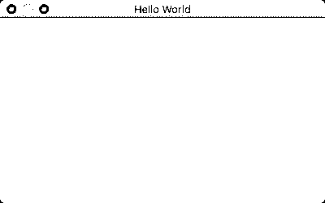
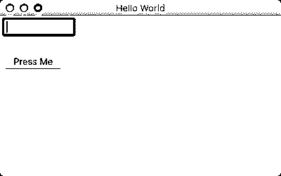
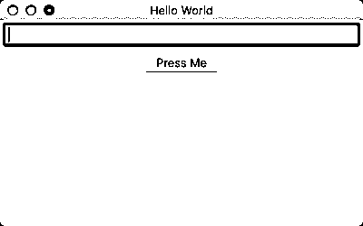
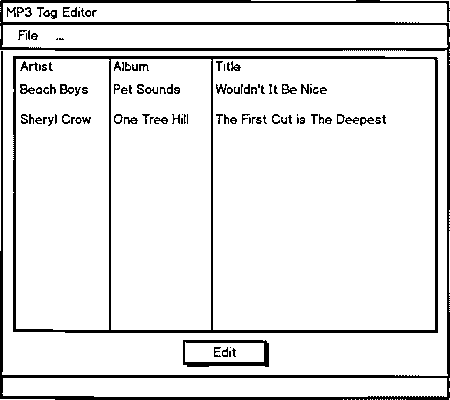
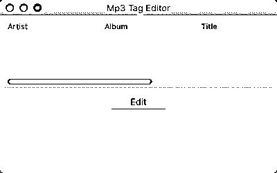

# 如何用 wxPython 构建 Python GUI 应用程序

> 原文：<https://realpython.com/python-gui-with-wxpython/>

有许多图形用户界面(GUI)工具包可用于 Python 编程语言。三巨头分别是 [Tkinter](https://realpython.com/python-gui-tkinter/) ，wxPython， [PyQt](https://realpython.com/python-pyqt-gui-calculator/) 。这些工具包都可以在 Windows、macOS 和 Linux 上工作，PyQt 还具有在移动设备上工作的能力。

图形用户界面是一个应用程序，它有按钮、窗口和许多其他小部件，用户可以用它们来与应用程序进行交互。web 浏览器就是一个很好的例子。它有按钮、标签和一个主窗口，所有的内容都在这里加载。

在本文中，您将学习如何使用 wxPython GUI 工具包用 Python 构建一个图形用户界面。

以下是涵盖的主题:

*   wxPython 入门
*   图形用户界面的定义
*   创建框架应用程序
*   创建工作应用程序

我们开始学习吧！

**免费下载:** [从 Python 技巧中获取一个示例章节:这本书](https://realpython.com/bonus/python-tricks-sample-pdf/)用简单的例子向您展示了 Python 的最佳实践，您可以立即应用它来编写更漂亮的+Python 代码。

## wxPython 入门

wxPython GUI toolkit 是一个 Python 包装器，围绕着一个名为 [wxWidgets](https://www.wxwidgets.org/) 的 C++库。wxPython 的首次发布是在 1998 年，所以 wxPython 已经存在了相当长的时间。wxPython 与其他工具包(如 **PyQt** 或 **Tkinter** )的主要区别在于，wxPython 尽可能使用原生平台上的实际部件。这使得 wxPython 应用程序看起来是运行它的操作系统的原生程序。

PyQt 和 Tkinter 都是自己绘制小部件，这就是为什么它们不总是匹配原生小部件，尽管 PyQt 非常接近。

这并不是说 wxPython 不支持定制小部件。事实上，wxPython 工具包包含了许多定制的小部件，以及数十个核心小部件。wxPython [下载](https://wxpython.org/pages/downloads/)页面有一个名为**额外文件**的部分值得一看。

这里有一个 wxPython 演示包的下载。这是一个不错的小应用程序，演示了 wxPython 中包含的绝大多数小部件。该演示允许开发人员在一个选项卡中查看代码，并在另一个选项卡中运行它。您甚至可以编辑并重新运行演示中的代码，以查看您的更改如何影响应用程序。

[*Remove ads*](/account/join/)

### 安装 wxPython

本文将使用最新的 wxPython，即 **wxPython 4** ，也称为 Phoenix release。wxPython 3 和 wxPython 2 版本只为 **Python 2** 打造。当 wxPython 的主要维护者 Robin Dunn 创建 wxPython 4 版本时，他弃用了大量别名，清理了大量代码，使 wxPython 更加 Python 化，更易于维护。

如果您要从旧版本的 wxPython 迁移到 wxPython 4 (Phoenix ),您需要参考以下链接:

*   [经典 vs 凤凰](https://wxpython.org/Phoenix/docs/html/classic_vs_phoenix.html)
*   wxPython Project Phoenix [迁移指南](https://wxpython.org/Phoenix/docs/html/MigrationGuide.html)

wxPython 4 包兼容 Python 2.7 和 Python 3。

您现在可以使用`pip`来安装 wxPython 4，这在 wxPython 的遗留版本中是不可能的。您可以执行以下操作将它安装到您的计算机上:

```py
$ pip install wxpython
```

**注意:**在 Mac OS X 上，你需要安装一个编译器，比如 **XCode** ，这样安装才能成功完成。Linux 可能还需要您安装一些依赖项，然后`pip`安装程序才能正常工作。

例如，我需要在 Xubuntu 上安装 **freeglut3-dev** 、**libgstreamer-plugins-base 0.10-dev**和 **libwebkitgtk-3.0-dev** 来安装它。

幸运的是，`pip`显示的错误消息有助于找出缺少的内容，如果您想在 Linux 上安装 wxPython，可以使用 wxPython Github 页面上的[先决条件](https://github.com/wxWidgets/Phoenix/blob/master/README.rst#prerequisites)部分来帮助您找到所需的信息。

在 GTK2 和 GTK3 版本的 [Extras Linux](https://extras.wxpython.org/wxPython4/extras/linux) 部分，您可以找到一些适用于最流行的 Linux 版本的 Python wheels。要安装其中一个轮子，您可以使用以下命令:

```py
$ pip install -U -f https://extras.wxpython.org/wxPython4/extras/linux/gtk3/ubuntu-18.04/ wxPython
```

确保您已经修改了上面的命令以匹配您的 Linux 版本。

### 图形用户界面的定义

正如在引言中提到的，图形用户界面(GUI)是绘制在屏幕上供用户交互的界面。

用户界面有一些通用组件:

*   主窗口
*   菜单
*   工具栏
*   小跟班
*   文本输入
*   标签

所有这些项目统称为**小部件**。wxPython 还支持许多其他常见的小部件和许多自定义小部件。开发人员将获取这些小部件，并将它们逻辑地排列在一个窗口上，供用户进行交互。

### 事件循环

图形用户界面通过等待用户做一些事情来工作。这件事被称为一个事件。当您的应用程序处于焦点时，或者当用户使用鼠标按下按钮或其他小部件时，当用户键入某些内容时，就会发生事件。

在幕后，GUI 工具包正在运行一个被称为**事件循环**的无限循环。事件循环只是等待事件发生，然后根据开发人员编写的应用程序来处理这些事件。当应用程序没有捕捉到一个事件时，它实际上忽略了它的发生。

当你在编写一个图形用户界面时，你会想记住你需要把每个部件挂接到**事件处理程序**上，这样你的应用程序就会做一些事情。

在处理事件循环时，有一点需要特别注意:它们可能会被阻塞。当您阻塞一个事件循环时，GUI 将变得无响应，并对用户显示为冻结。

在 GUI 中启动的任何进程，如果花费的时间超过四分之一秒，应该作为一个单独的线程或进程启动。这将防止您的 GUI 冻结，并为用户提供更好的用户体验。

wxPython 框架具有特殊的线程安全方法，您可以使用这些方法与您的应用程序进行通信，让它知道线程已经完成或者给它一个更新。

让我们创建一个框架应用程序来演示事件是如何工作的。

[*Remove ads*](/account/join/)

## 创建一个框架应用程序

GUI 环境中的应用程序框架是一个带有小部件的用户界面，这些小部件没有任何事件处理程序。这些对原型制作很有用。在花费大量时间在后端逻辑上之前，您基本上只需要创建 GUI，并将其提交给您的利益相关者签字认可。

让我们从用 wxPython 创建一个`Hello World`应用程序开始:

```py
import wx

app = wx.App()
frame = wx.Frame(parent=None, title='Hello World')
frame.Show()
app.MainLoop()
```

**注意:** Mac 用户可能会得到以下消息:*这个程序需要访问屏幕。请使用 python 的框架构建运行，并且仅当您登录到 Mac 的主显示屏时运行。*如果您看到这条消息，并且您没有在 virtualenv 中运行，那么您需要使用 **pythonw** 而不是 **python** 来运行您的应用程序。如果您在 virtualenv 中运行 wxPython，那么请参见 [wxPython wiki](https://wiki.wxpython.org/wxPythonVirtualenvOnMac) 获取解决方案。

在这个例子中，您有两个部分:`wx.App`和`wx.Frame`。`wx.App`是 wxPython 的应用程序对象，是运行 GUI 所必需的。这个`wx.App`启动了一个叫做`.MainLoop()`的东西。这是您在上一节中了解到的事件循环。

拼图的另一块是`wx.Frame`，它将为用户创建一个交互窗口。在这种情况下，您告诉 wxPython 该帧没有父帧，它的标题是`Hello World`。下面是运行代码时的样子:

[](https://files.realpython.com/media/hello1.c3e5d5e1cdb9.png)

**注意:**在 Mac 或 Windows 上运行时，应用程序看起来会有所不同。

默认情况下，`wx.Frame`会在顶部包含最小化、最大化和退出按钮。但是，您通常不会以这种方式创建应用程序。大多数 wxPython 代码将要求您子类化`wx.Frame`和其他小部件，以便您可以获得该工具包的全部功能。

让我们花点时间将您的代码重写为一个类:

```py
import wx

class MyFrame(wx.Frame):    
    def __init__(self):
        super().__init__(parent=None, title='Hello World')
        self.Show()

if __name__ == '__main__':
    app = wx.App()
    frame = MyFrame()
    app.MainLoop()
```

您可以将此代码用作应用程序的模板。然而，这个应用程序做的不多，所以让我们花一点时间来了解一些您可以添加的其他小部件。

### 小部件

wxPython 工具包有一百多个小部件可供选择。这使您可以创建丰富的应用程序，但是要想知道使用哪个小部件也是一件令人生畏的事情。这就是为什么 **wxPython 演示**是有用的，因为它有一个搜索过滤器，您可以使用它来帮助您找到可能适用于您的项目的小部件。

大多数 GUI 应用程序允许用户输入一些文本并按下按钮。让我们继续添加这些小部件:

```py
import wx

class MyFrame(wx.Frame):    
    def __init__(self):
        super().__init__(parent=None, title='Hello World')
        panel = wx.Panel(self)

        self.text_ctrl = wx.TextCtrl(panel, pos=(5, 5))
        my_btn = wx.Button(panel, label='Press Me', pos=(5, 55))

        self.Show()

if __name__ == '__main__':
    app = wx.App()
    frame = MyFrame()
    app.MainLoop()
```

当您运行这段代码时，您的应用程序应该如下所示:

[](https://files.realpython.com/media/hello2.4b3bac9c90eb.png)

您需要添加的第一个小部件叫做`wx.Panel`。这个小部件不是必需的，但是推荐使用。在 Windows 上，您实际上需要使用一个面板，以便框架的背景颜色是正确的灰色阴影。在 Windows 上，如果没有面板，选项卡遍历将被禁用。

当您将面板小部件添加到框架中，并且面板是框架的唯一子级时，它将自动扩展以用自身填充框架。

下一步是给面板添加一个`wx.TextCtrl`。几乎所有部件的第一个参数是部件应该放在哪个父部件上。在这种情况下，您希望文本控件和按钮位于面板的顶部，因此它是您指定的父控件。

您还需要告诉 wxPython 在哪里放置小部件，这可以通过用`pos`参数传入一个位置来完成。在 wxPython 中，原点位置是(0，0)，即父对象的左上角。因此，对于文本控件，您告诉 wxPython，您希望将其左上角定位在距离左侧(x)5 个像素和距离顶部(y)5 个像素的位置。

然后将按钮添加到面板中，并给它一个标签。为了防止小部件重叠，您需要将按钮位置的 y 坐标设置为 55。

[*Remove ads*](/account/join/)

### 绝对定位

当您为小部件的位置提供精确坐标时，您使用的技术称为**绝对定位**。大多数 GUI 工具包都提供了这种功能，但实际上并不推荐。

随着应用程序变得越来越复杂，跟踪所有小部件的位置变得越来越困难，如果你不得不四处移动小部件。重置所有这些位置变成了一场噩梦。

幸运的是，所有现代 GUI 工具包都为此提供了一个解决方案，这也是您接下来将要学习的内容。

### 分级器(动态分级)

wxPython 工具包包括**sizer**，用于创建动态布局。它们为您管理小部件的位置，并在您调整应用程序窗口大小时调整它们。其他 GUI 工具包将 sizers 称为[布局](https://realpython.com/python-pyqt-layout/)，这就是 PyQt 所做的。

以下是您最常看到的主要类型的筛分机:

*   `wx.BoxSizer`
*   `wx.GridSizer`
*   `wx.FlexGridSizer`

让我们给你的例子添加一个`wx.BoxSizer`,看看我们是否能让它工作得更好一点:

```py
import wx

class MyFrame(wx.Frame):    
    def __init__(self):
        super().__init__(parent=None, title='Hello World')
        panel = wx.Panel(self)        
        my_sizer = wx.BoxSizer(wx.VERTICAL)        
        self.text_ctrl = wx.TextCtrl(panel)
        my_sizer.Add(self.text_ctrl, 0, wx.ALL | wx.EXPAND, 5)        
        my_btn = wx.Button(panel, label='Press Me')
        my_sizer.Add(my_btn, 0, wx.ALL | wx.CENTER, 5)        
        panel.SetSizer(my_sizer)        
        self.Show()

if __name__ == '__main__':
    app = wx.App()
    frame = MyFrame()
    app.MainLoop()
```

这里您创建了一个`wx.BoxSizer`的实例并传递给它`wx.VERTICAL`，这是小部件被添加到 sizer 的方向。

在这种情况下，小部件将垂直添加，这意味着它们将从上到下一次添加一个。您也可以将 BoxSizer 的方向设置为`wx.HORIZONTAL`。当你这样做时，小部件将从左到右添加。

要向 sizer 添加一个小部件，您将使用`.Add()`。它最多接受五个参数:

*   `window`(微件)
*   `proportion`
*   `flag`
*   `border`
*   `userData`

`window`参数是要添加的小部件，而`proportion`设置这个小部件相对于 sizer 中的其他小部件应该占用多少空间。默认情况下，它是零，这告诉 wxPython 保持小部件的默认比例。

第三个参数是`flag`。如果您愿意，您实际上可以传入多个标志，只要您用管道字符:`|`分隔它们。wxPython 工具包使用一系列按位“或”运算，使用`|`来添加标志。

在本例中，您添加了带有`wx.ALL`和`wx.EXPAND`标志的文本控件。`wx.ALL`标志告诉 wxPython 您想要在小部件的所有边上添加边框，而`wx.EXPAND`让小部件在 sizer 中尽可能地扩展。

最后，有一个`border`参数，它告诉 wxPython 在小部件周围需要多少像素的边框。`userData`参数仅在您想要对小部件的大小做一些复杂的事情时使用，实际上在实践中很少见到。

将按钮添加到 sizer 遵循完全相同的步骤。然而，为了让事情变得更有趣一点，我把`wx.CENTER`的`wx.EXPAND`标志去掉，这样按钮就会在屏幕上居中。

当您运行此版本的代码时，您的应用程序应该如下所示:

[](https://files.realpython.com/media/sizers.9f6c203121e6.png)

如果您想了解关于 sizers 的更多信息，wxPython 文档有一个关于这个主题的很好的页面。

[*Remove ads*](/account/join/)

### 添加事件

虽然你的应用程序看起来更有趣，但它实际上并没有做什么。例如，如果你按下按钮，什么都不会发生。

让我们给按钮一个任务:

```py
import wx

class MyFrame(wx.Frame):    
    def __init__(self):
        super().__init__(parent=None, title='Hello World')
        panel = wx.Panel(self)        
        my_sizer = wx.BoxSizer(wx.VERTICAL)        
        self.text_ctrl = wx.TextCtrl(panel)
        my_sizer.Add(self.text_ctrl, 0, wx.ALL | wx.EXPAND, 5)        
        my_btn = wx.Button(panel, label='Press Me')
        my_btn.Bind(wx.EVT_BUTTON, self.on_press)
        my_sizer.Add(my_btn, 0, wx.ALL | wx.CENTER, 5)        
        panel.SetSizer(my_sizer)        
        self.Show()

    def on_press(self, event):
        value = self.text_ctrl.GetValue()
        if not value:
            print("You didn't enter anything!")
        else:
            print(f'You typed: "{value}"')

if __name__ == '__main__':
    app = wx.App()
    frame = MyFrame()
    app.MainLoop()
```

wxPython 中的小部件允许您将事件绑定附加到它们，以便它们可以响应某些类型的事件。

**注意:**上面的代码块使用了 f 字符串。你可以在 [Python 3 的 f-Strings:一个改进的字符串格式化语法(指南)](https://realpython.com/python-f-strings/)中读到所有关于它们的内容。

当用户按下按钮时，您希望按钮做一些事情。您可以通过调用按钮的`.Bind()`方法来实现这一点。`.Bind()`接受您想要绑定的事件、事件发生时要调用的处理程序、一个可选的源和几个可选的 id。

在本例中，您将按钮对象绑定到`wx.EVT_BUTTON`事件，并告诉它在该事件被触发时调用`on_press()`。

当用户执行您绑定到的事件时，事件被“激发”。在这种情况下，您设置的事件是按钮按下事件`wx.EVT_BUTTON`。

`.on_press()`接受第二个参数，您可以称之为`event`。这是惯例。如果你愿意，你可以叫它别的名字。然而，这里的 event 参数指的是这样一个事实:当调用这个方法时，它的第二个参数应该是某种类型的 event 对象。

在`.on_press()`中，您可以通过调用它的`GetValue()`方法来获取文本控件的内容。然后，根据文本控件的内容，将一个字符串打印到 stdout。

现在你已经有了基本的方法，让我们学习如何创建一个有用的应用程序！

## 创建工作应用程序

创造新事物的第一步是弄清楚你想创造什么。在这种情况下，我冒昧地为你做了那个决定。你将学习如何创建一个 MP3 标签编辑器！创建新东西的下一步是找出哪些包可以帮助你完成任务。

如果你在谷歌上搜索`Python mp3 tagging`，你会发现你有几个选项:

*   `mp3-tagger`
*   `eyeD3`
*   `mutagen`

我试用了几个，并决定 **eyeD3** 有一个不错的 API，你可以使用它而不会陷入 MP3 的 ID3 规范。你可以用`pip`安装 **eyeD3** ，像这样:

```py
$ pip install eyed3
```

在 macOS 上安装这个包时，可能需要使用`brew`安装`libmagic`。Windows 和 Linux 用户安装 eyeD3 应该没有任何问题。

### 设计用户界面

当设计一个界面的时候，最好只是勾画出你认为用户界面应该是什么样子。

您需要能够做到以下几点:

*   打开一个或多个 MP3 文件
*   显示当前的 MP3 标签
*   编辑 MP3 标签

大多数用户界面使用[菜单](https://realpython.com/python-menus-toolbars/)或按钮来打开文件或文件夹。你可以用一个*文件*菜单来做这个。因为您可能希望看到多个 MP3 文件的标签，所以您需要找到一个小部件来很好地做到这一点。

带有列和行的表格是理想的，因为这样你就可以为 MP3 标签标记列。wxPython 工具包中有几个小部件可以解决这个问题，其中最重要的两个部件如下:

*   `wx.grid.Grid`
*   `wx.ListCtrl`

在这种情况下，您应该使用`wx.ListCtrl`,因为`Grid`小部件太过了，而且坦率地说，它也要复杂得多。最后，您需要一个按钮来编辑所选 MP3 的标签。

现在你知道你想要什么了，你可以把它画出来:

[](https://files.realpython.com/media/mockup.b145e58828b0.png)

上面的插图让我们了解了应用程序应该是什么样子。现在你知道你想做什么了，是时候编码了！

[*Remove ads*](/account/join/)

### 创建用户界面

在编写新的应用程序时，有许多不同的方法。比如需要遵循[模型-视图-控制器](https://en.wikipedia.org/wiki/Model-view-controller)的设计模式吗？你是怎么分班的？每个文件一个类？有很多这样的问题，随着你对 GUI 设计越来越有经验，你会知道你想如何回答它们。

在您的情况下，您实际上只需要两个类:

*   一门`wx.Panel`课
*   一门`wx.Frame`课

你也可以主张创建一个控制器类型的模块，但是对于这样的东西，你真的不需要它。也可以将每个类放入自己的模块中，但是为了保持简洁，您将为所有代码创建一个 Python 文件。

让我们从导入和面板类开始:

```py
import eyed3
import glob
import wx

class Mp3Panel(wx.Panel):    
    def __init__(self, parent):
        super().__init__(parent)
        main_sizer = wx.BoxSizer(wx.VERTICAL)
        self.row_obj_dict = {}

        self.list_ctrl = wx.ListCtrl(
            self, size=(-1, 100), 
            style=wx.LC_REPORT | wx.BORDER_SUNKEN
        )
        self.list_ctrl.InsertColumn(0, 'Artist', width=140)
        self.list_ctrl.InsertColumn(1, 'Album', width=140)
        self.list_ctrl.InsertColumn(2, 'Title', width=200)
        main_sizer.Add(self.list_ctrl, 0, wx.ALL | wx.EXPAND, 5)        
        edit_button = wx.Button(self, label='Edit')
        edit_button.Bind(wx.EVT_BUTTON, self.on_edit)
        main_sizer.Add(edit_button, 0, wx.ALL | wx.CENTER, 5)        
        self.SetSizer(main_sizer)

    def on_edit(self, event):
        print('in on_edit')

    def update_mp3_listing(self, folder_path):
        print(folder_path)
```

这里，您为您的用户界面导入了`eyed3`包、Python 的`glob`包和`wx`包。接下来，您子类化`wx.Panel`并创建您的用户界面。你需要一本字典来存储你的 MP3 数据，你可以把它命名为`row_obj_dict`。

然后创建一个`wx.ListCtrl`，并将其设置为带有凹陷边框(`wx.BORDER_SUNKEN`)的报告模式(`wx.LC_REPORT`)。根据传入的样式标志，列表控件可以采用其他几种形式，但报告标志是最常用的。

为了使`ListCtrl`拥有正确的标题，您需要为每个列标题调用`.InsertColumn()`。然后提供列的索引、标签以及列的宽度(以像素为单位)。

最后一步是添加您的`Edit`按钮、事件处理程序和方法。您可以创建事件的绑定，并让它调用的方法暂时为空。

现在，您应该为框架编写代码:

```py
class Mp3Frame(wx.Frame):    
    def __init__(self):
        super().__init__(parent=None,
                         title='Mp3 Tag Editor')
        self.panel = Mp3Panel(self)
        self.Show()

if __name__ == '__main__':
    app = wx.App(False)
    frame = Mp3Frame()
    app.MainLoop()
```

这个类比第一个简单得多，因为您需要做的只是设置框架的标题并实例化面板类`Mp3Panel`。完成后，您的用户界面应该如下所示:

[](https://files.realpython.com/media/tag_editor.01b0ac1ff939.png)

用户界面看起来几乎没错，但是你没有一个*文件*菜单。这使得不可能添加 MP3 到应用程序和编辑他们的标签！

让我们现在就解决这个问题。

### 制作一个有效的应用程序

让您的应用程序工作的第一步是更新应用程序，使它有一个*文件*菜单，因为这样您就可以将 MP3 文件添加到您的作品中。菜单几乎总是添加到`wx.Frame`类中，所以这是您需要修改的类。

**注意:**一些应用程序已经不再有菜单了。第一个这样做的是微软 Office，他们添加了功能区栏。wxPython 工具包有一个定制的小部件，可以用来在`wx.lib.agw.ribbon`中创建功能区。

另一种最近放弃菜单的应用是网络浏览器，比如谷歌 Chrome 和 Mozilla Firefox。他们现在只使用工具栏。

让我们学习如何在应用程序中添加菜单栏:

```py
class Mp3Frame(wx.Frame):

    def __init__(self):
        wx.Frame.__init__(self, parent=None, 
                          title='Mp3 Tag Editor')
        self.panel = Mp3Panel(self)
        self.create_menu()
        self.Show()

    def create_menu(self):
        menu_bar = wx.MenuBar()
        file_menu = wx.Menu()
        open_folder_menu_item = file_menu.Append(
            wx.ID_ANY, 'Open Folder', 
            'Open a folder with MP3s'
        )
        menu_bar.Append(file_menu, '&File')
        self.Bind(
            event=wx.EVT_MENU, 
            handler=self.on_open_folder,
            source=open_folder_menu_item,
        )
        self.SetMenuBar(menu_bar)

    def on_open_folder(self, event):
        title = "Choose a directory:"
        dlg = wx.DirDialog(self, title, 
                           style=wx.DD_DEFAULT_STYLE)
        if dlg.ShowModal() == wx.ID_OK:
            self.panel.update_mp3_listing(dlg.GetPath())
        dlg.Destroy()
```

这里，您在类的构造函数中添加了对`.create_menu()`的调用。然后在`.create_menu()`本身中，您将创建一个`wx.MenuBar`实例和一个`wx.Menu`实例。

要将菜单项添加到菜单中，您可以调用菜单实例的`.Append()`,并向其传递以下内容:

*   唯一的标识符
*   新菜单项的标签
*   帮助字符串

接下来，您需要将菜单添加到菜单栏，因此您需要调用菜单栏的`.Append()`。它接受菜单实例和菜单标签。这个标签有点奇怪，因为你称它为`&File`而不是`File`。“与”号告诉 wxPython 创建一个键盘快捷键 `Alt` + `F` ，只需使用键盘就可以打开`File`菜单。

**注意:**如果你想在你的应用程序中添加键盘快捷键，那么你需要使用`wx.AcceleratorTable`的一个实例来创建它们。你可以在 wxPython [文档](https://wxpython.org/Phoenix/docs/html/wx.AcceleratorTable.html)中阅读更多关于 Accerator 表的内容。

要创建事件绑定，您需要调用`self.Bind()`，它将帧绑定到`wx.EVT_MENU`。当您为菜单事件使用`self.Bind()`时，您不仅需要告诉 wxPython 使用哪个`handler`，还需要告诉 wxPython 将处理程序绑定到哪个`source`。

最后，您必须调用框架的`.SetMenuBar()`并向其传递 menubar 实例，以便向用户显示。

现在，您已经将菜单添加到了框架中，让我们来看一下菜单项的事件处理程序，如下所示:

```py
def on_open_folder(self, event):
    title = "Choose a directory:"
    dlg = wx.DirDialog(self, title, style=wx.DD_DEFAULT_STYLE)
    if dlg.ShowModal() == wx.ID_OK:
        self.panel.update_mp3_listing(dlg.GetPath())
    dlg.Destroy()
```

既然你想让用户选择一个包含 MP3 的文件夹，你就应该使用 wxPython 的`wx.DirDialog`。`wx.DirDialog`只允许用户打开目录。

您可以设置对话框的标题和各种样式标志。要显示该对话框，您需要调用`.ShowModal()`。这将导致对话框有模式地显示，这意味着当对话框显示时，用户将不能与您的主应用程序交互。

如果用户按下对话框的 *OK* 按钮，可以通过对话框的`.GetPath()`得到用户的路径选择。您需要将该路径传递给 panel 类，这可以通过调用 panel 的`.update_mp3_listing()`来实现。

最后，您需要关闭对话框。要关闭对话框，推荐的方法是调用它的`.Destroy()`。

对话框确实有一个`.Close()`方法，但它基本上只是隐藏对话框，当你关闭应用程序时它不会自我销毁，这可能会导致奇怪的问题，比如你的应用程序现在正常关闭。更简单的方法是在对话框上调用`.Destroy()`来防止这个问题。

现在让我们更新你的`Mp3Panel`类。你可以从更新`.update_mp3_listing()`开始:

```py
def update_mp3_listing(self, folder_path):
    self.current_folder_path = folder_path
    self.list_ctrl.ClearAll()

    self.list_ctrl.InsertColumn(0, 'Artist', width=140)
    self.list_ctrl.InsertColumn(1, 'Album', width=140)
    self.list_ctrl.InsertColumn(2, 'Title', width=200)
    self.list_ctrl.InsertColumn(3, 'Year', width=200)

    mp3s = glob.glob(folder_path + '/*.mp3')
    mp3_objects = []
    index = 0
    for mp3 in mp3s:
        mp3_object = eyed3.load(mp3)
        self.list_ctrl.InsertItem(index, 
            mp3_object.tag.artist)
        self.list_ctrl.SetItem(index, 1, 
            mp3_object.tag.album)
        self.list_ctrl.SetItem(index, 2, 
            mp3_object.tag.title)
        mp3_objects.append(mp3_object)
        self.row_obj_dict[index] = mp3_object
        index += 1
```

在这里，您将当前目录设置为指定的文件夹，然后清除列表控件。这使得列表控件保持新鲜，并且只显示你当前正在处理的 MP3。这也意味着您需要再次重新插入所有列。

接下来，您将需要获取传入的文件夹，并使用 Python 的`glob` [模块](https://docs.python.org/3/library/glob.html)来搜索 MP3 文件。

然后你可以循环播放 MP3 并把它们转换成`eyed3`对象。你可以通过调用`eyed3`的`.load()`来实现。假设 MP3 已经有了适当的标签，那么您可以将 MP3 的艺术家、专辑和标题添加到列表控件中。

有趣的是，向列表控件对象添加新行的方法是对第一列调用`.InsertItem()`，对所有后续列调用`SetItem()`。

最后一步是将 MP3 对象保存到 Python 字典`row_obj_dict`。

现在您需要更新`.on_edit()`事件处理程序，以便编辑 MP3 的标签:

```py
def on_edit(self, event):
    selection = self.list_ctrl.GetFocusedItem()
    if selection >= 0:
        mp3 = self.row_obj_dict[selection]
        dlg = EditDialog(mp3)
        dlg.ShowModal()
        self.update_mp3_listing(self.current_folder_path)
        dlg.Destroy()
```

您需要做的第一件事是通过调用列表控件的`.GetFocusedItem()`来获取用户的选择。

如果用户没有在列表控件中选择任何内容，它将返回`-1`。假设用户选择了某个内容，您将希望从字典中提取 MP3 对象并打开一个 MP3 标签编辑器对话框。这将是一个自定义对话框，您将使用它来编辑 MP3 文件的艺术家、专辑和标题标签。

像往常一样，显示对话框。当对话框关闭时，将执行`.on_edit()`中的最后两行。这两行将更新列表控件，使其显示用户刚刚编辑的当前 MP3 标签信息，并销毁对话框。

#### 创建编辑对话框

拼图的最后一块是创建一个 MP3 标签编辑对话框。为了简洁，我们将跳过这个界面的草图，因为它是一系列包含标签和文本控件的行。文本控件中应该预先填充了现有的标记信息。您可以通过创建`wx.StaticText`的实例来为文本控件创建标签。

当你需要创建一个自定义对话框时，`wx.Dialog`类就是你的朋友。您可以使用它来设计编辑器:

```py
class EditDialog(wx.Dialog):    
    def __init__(self, mp3):
        title = f'Editing "{mp3.tag.title}"'
        super().__init__(parent=None, title=title)        
        self.mp3 = mp3        
        self.main_sizer = wx.BoxSizer(wx.VERTICAL)        
        self.artist = wx.TextCtrl(
            self, value=self.mp3.tag.artist)
        self.add_widgets('Artist', self.artist)        
        self.album = wx.TextCtrl(
            self, value=self.mp3.tag.album)
        self.add_widgets('Album', self.album)        
        self.title = wx.TextCtrl(
            self, value=self.mp3.tag.title)
        self.add_widgets('Title', self.title)        
        btn_sizer = wx.BoxSizer()
        save_btn = wx.Button(self, label='Save')
        save_btn.Bind(wx.EVT_BUTTON, self.on_save)        
        btn_sizer.Add(save_btn, 0, wx.ALL, 5)
        btn_sizer.Add(wx.Button(
            self, id=wx.ID_CANCEL), 0, wx.ALL, 5)
        self.main_sizer.Add(btn_sizer, 0, wx.CENTER)        
        self.SetSizer(self.main_sizer)
```

这里你想从子类化`wx.Dialog`开始，并根据你正在编辑的 MP3 的标题给它一个自定义的标题。

接下来，您可以创建您想要使用的 sizer 和小部件。为了使事情变得简单，您可以创建一个名为`.add_widgets()`的助手方法，用于将`wx.StaticText`小部件添加为带有文本控件实例的行。这里唯一的另一个小部件是*保存*按钮。

接下来让我们编写`add_widgets`方法:

```py
 def add_widgets(self, label_text, text_ctrl):
        row_sizer = wx.BoxSizer(wx.HORIZONTAL)
        label = wx.StaticText(self, label=label_text,
                              size=(50, -1))
        row_sizer.Add(label, 0, wx.ALL, 5)
        row_sizer.Add(text_ctrl, 1, wx.ALL | wx.EXPAND, 5)
        self.main_sizer.Add(row_sizer, 0, wx.EXPAND)
```

`add_widgets()`获取标签的文本和文本控件实例。然后它创建一个水平方向的`BoxSizer`。

接下来，您将使用传入的文本为标签参数创建一个`wx.StaticText`的实例。您还将设置它的大小为`50`像素宽，默认高度用`-1`设置。因为您希望标签在文本控件之前，所以您将首先向 BoxSizer 添加 StaticText 小部件，然后添加文本控件。

最后，您希望将水平尺寸标注添加到顶级垂直尺寸标注中。通过将 sizers 相互嵌套，您可以设计复杂的应用程序。

现在您需要创建`on_save()`事件处理程序，以便保存您的更改:

```py
 def on_save(self, event):
        self.mp3.tag.artist = self.artist.GetValue()
        self.mp3.tag.album = self.album.GetValue()
        self.mp3.tag.title = self.title.GetValue()
        self.mp3.tag.save()
        self.Close()
```

在这里，您将标签设置为文本控件的内容，然后调用`eyed3`对象的`.save()`。最后，你调用对话框的`.Close()`。你打电话的原因。这里的`Close()`而不是`.Destroy()`是你已经在你的 panel 子类的`.on_edit()`中调用了`.Destroy()`。

现在你的申请完成了！

[*Remove ads*](/account/join/)

## 结论

在本文中，您学到了很多关于 wxPython 的知识。您已经熟悉了使用 wxPython 创建 GUI 应用程序的基础知识。

您现在对以下内容有了更多的了解:

*   如何使用 wxPython 的一些小部件
*   wxPython 中事件的工作方式
*   绝对定位与 sizers 相比如何
*   如何创建一个框架应用程序

最后，您学习了如何创建一个工作应用程序，一个 [MP3 标签编辑器](https://github.com/realpython/materials/tree/master/build-a-gui-with-wxpython)。您可以使用在本文中学到的知识来继续增强这个应用程序，或者自己创建一个令人惊叹的应用程序。

wxPython GUI toolkit 是健壮的，并且充满了有趣的小部件，可以用来构建跨平台的应用程序。你只受限于你的想象力。

## 延伸阅读

如果您想了解更多关于 wxPython 的信息，可以查看以下链接:

*   wxPython 官方网站
*   Zetcode 的 [wxPython 教程](http://zetcode.com/wxpython/)
*   [鼠标 Vs Python 博客](https://www.blog.pythonlibrary.org/category/wxpython/)

想了解更多关于 Python 的其他功能，你可能想看看[我能用 Python 做什么？](https://realpython.com/what-can-i-do-with-python/)如果你想了解更多关于 Python 的`super()`，那么[用 Python super()](https://realpython.com/python-super/) 增强你的类可能正适合你。

如果您想更深入地研究它，您还可以下载您在本文中创建的 MP3 标签编辑器应用程序的代码。******