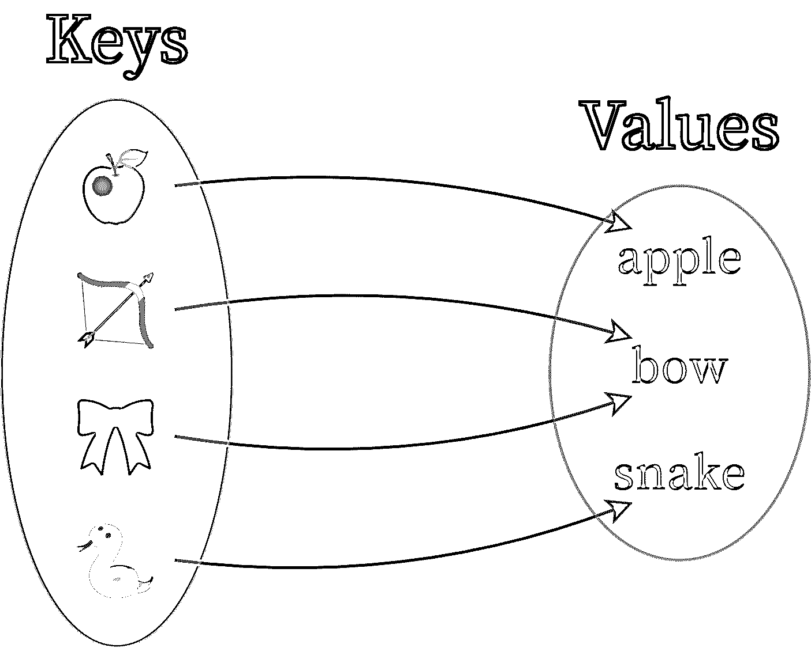
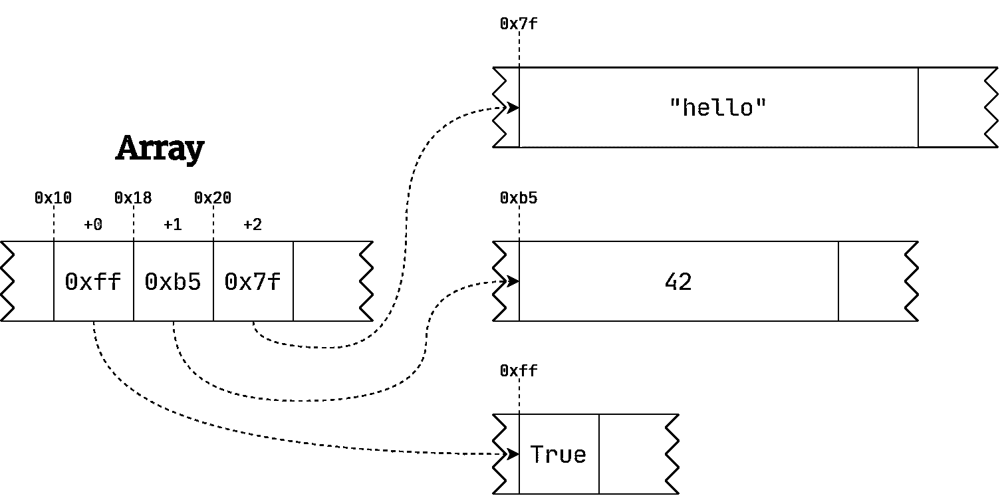
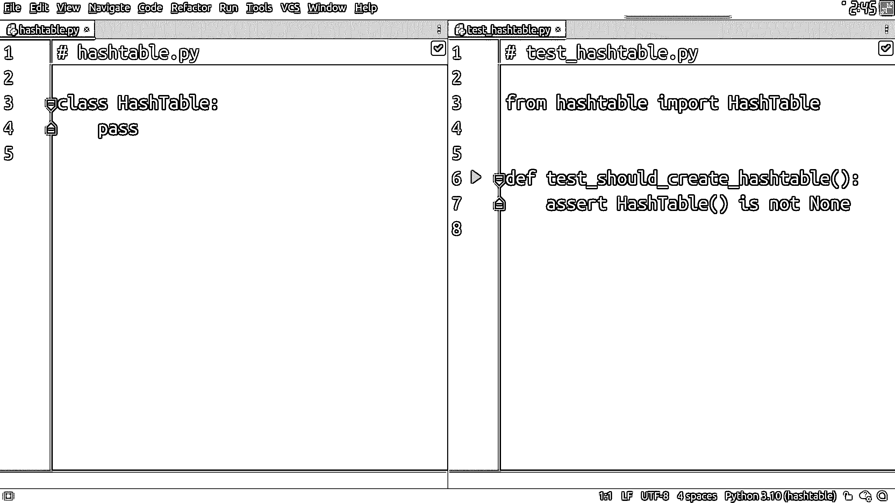
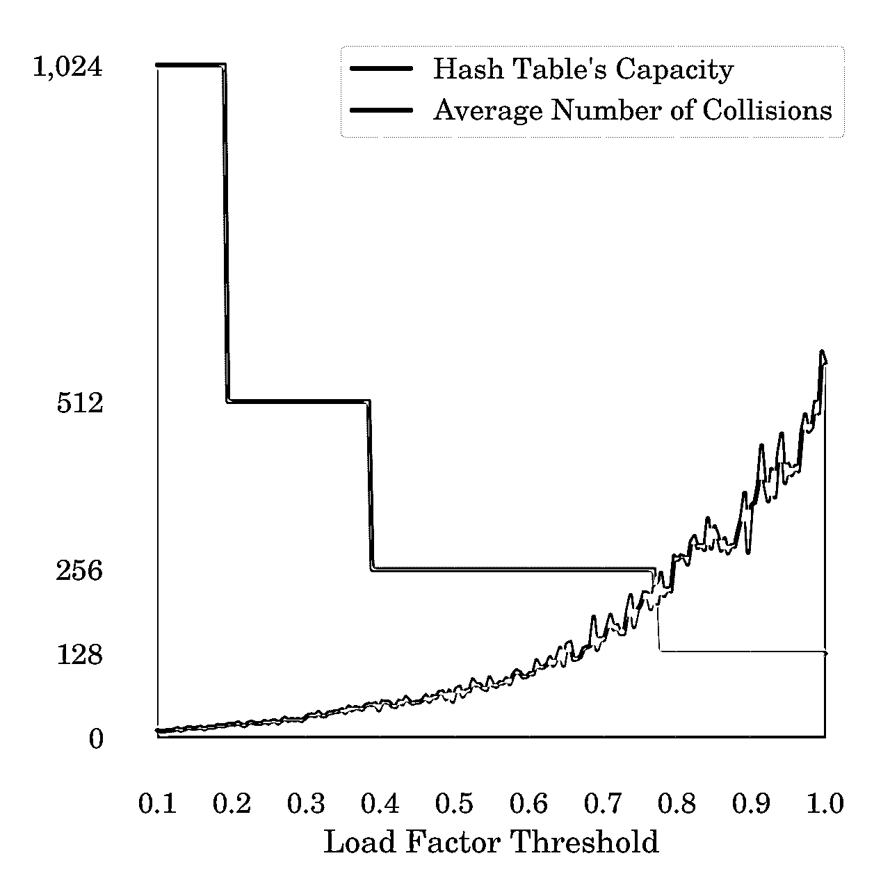
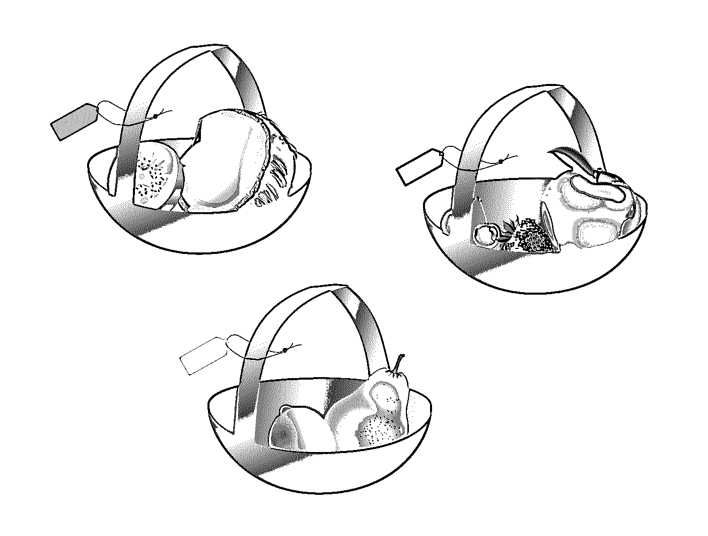
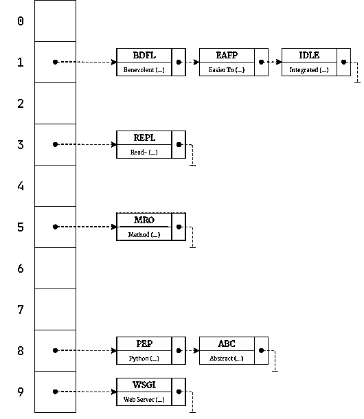

# 使用 TDD 在 Python 中构建哈希表

> 原文：<https://realpython.com/python-hash-table/>

半个多世纪前发明的**哈希表**是一种经典的[数据结构](https://en.wikipedia.org/wiki/Data_structure)，是编程的基础。直到今天，它还能帮助解决许多现实生活中的问题，比如索引数据库表、缓存计算值或实现集合。它经常出现在[的工作面试中](https://realpython.com/learning-paths/python-interview/)，Python 到处使用散列表，使得名字查找几乎是瞬间完成的。

尽管 Python 自带了名为`dict`的散列表，但是理解散列表在幕后是如何工作的还是很有帮助的。编码评估甚至会让你去构建一个。本教程将带您从头开始实现散列表的步骤，就好像 Python 中没有散列表一样。在这个过程中，您将面临一些挑战，这些挑战将介绍一些重要的概念，并让您了解为什么散列表如此之快。

除此之外，您还将参加**测试驱动开发(TDD)** 的实践速成班，并在逐步构建哈希表的同时积极练习。你不需要事先有任何关于 TDD 的经验，但是同时，即使你有，你也不会感到厌烦！

在本教程中，您将学习:

*   一个**散列表**与一个**字典**有何不同
*   如何用 Python 从零开始实现散列表
*   如何应对**哈希冲突**和其他挑战
*   一个**散列函数**的期望属性是什么
*   **Python 的`hash()`** 如何在幕后运作

如果你已经熟悉了 [Python 字典](https://realpython.com/python-dicts/)并且具备了[面向对象编程](https://realpython.com/python3-object-oriented-programming/)原则的基础知识，这将会有所帮助。要获得本教程中实现的哈希表的完整源代码和中间步骤，请访问下面的链接:

**源代码:** [点击这里下载源代码](https://realpython.com/bonus/python-hash-table-source-code/)，您将使用它在 Python 中构建一个散列表。

## 了解哈希表数据结构

在深入研究之前，您应该熟悉这些术语，因为它们可能会有点令人困惑。通俗地说，术语**散列表**或**散列表**经常与单词**字典**互换使用。然而，这两个概念之间有细微的区别，因为前者比后者更具体。

[*Remove ads*](/account/join/)

### 哈希表 vs 字典

在计算机科学中，[字典](https://en.wikipedia.org/wiki/Associative_array)是由成对排列的**键**和**值**组成的[抽象数据类型](https://en.wikipedia.org/wiki/Abstract_data_type)。此外，它为这些元素定义了以下操作:

*   添加一个键值对
*   删除键值对
*   更新键值对
*   查找与给定键相关联的值

从某种意义上来说，这种抽象数据类型类似于一个双语字典，其中的关键字是外来词，值是它们的定义或对其他语言的翻译。但是键和值之间并不总是有等价的感觉。**电话簿**是字典的另一个例子，它将姓名和相应的电话号码结合在一起。

**注意:**每当你*将*一个东西映射到另一个东西或者*将*一个值与一个键相关联时，你实际上是在使用一种字典。这就是为什么字典也被称为**映射**或**关联数组**。

字典有一些有趣的特性。其中之一是你可以把字典想象成一个数学函数，它将一个或多个参数投射到一个值上。这一事实的直接后果如下:

*   只有键-值对:在字典中，没有值就没有键，反之亦然。他们总是一起去。
*   **任意键和值:**键和值可以属于相同或不同类型的两个[不相交集合](https://en.wikipedia.org/wiki/Disjoint_sets)。键和值几乎可以是任何东西，比如数字、单词，甚至是图片。
*   **无序的键值对:**由于最后一点，字典一般不会为它们的键值对定义任何顺序。然而，这可能是特定于实现的。
*   唯一键:字典不能包含重复的键，因为那会违反函数的定义。
*   **非唯一值:**同一个值可以关联很多键，但不一定要关联。

有一些相关的概念扩展了字典的概念。例如，[多重映射](https://en.wikipedia.org/wiki/Multimap)允许每个键有多个值，而[双向映射](https://en.wikipedia.org/wiki/Bidirectional_map)不仅将键映射到值，还提供相反方向的映射。然而，在本教程中，您将只考虑常规字典，它为每个键映射一个值。

下面是一个假想字典的图形描述，它将一些抽象概念映射到它们对应的英语单词:

[](https://files.realpython.com/media/dict_map.6ea6c6e33b4b.png)

<figcaption class="figure-caption text-center">Graphical Depiction of a Dictionary Abstract Data Type</figcaption>

这是键到值的单向映射，值是两组完全不同的元素。马上，您可以看到比键更少的值，因为单词 *bow* 恰好是一个具有多种含义的[同音异义词](https://en.wikipedia.org/wiki/Homonym)。从概念上讲，这本字典仍然包含四对。根据您决定如何实现它，您可以重用重复的值以节省内存，或者为了简单起见复制它们。

现在，如何用编程语言编写这样的字典呢？正确的答案是你*不要*，因为大多数现代语言自带的字典要么是[原始数据类型](https://en.wikipedia.org/wiki/Primitive_data_type)，要么是它们的[标准库中的类](https://en.wikipedia.org/wiki/Standard_library)。Python 附带了一个内置的`dict`类型，它已经包装了一个用 C 编写的高度优化的数据结构，这样你就不用自己写字典了。

Python 的`dict`允许您执行本节开头列出的所有字典操作:

>>>

```py
>>> glossary = {"BDFL": "Benevolent Dictator For Life"}
>>> glossary["GIL"] = "Global Interpreter Lock"  # Add
>>> glossary["BDFL"] = "Guido van Rossum"  # Update
>>> del glossary["GIL"]  # Delete
>>> glossary["BDFL"]  # Search
'Guido van Rossum'
>>> glossary
{'BDFL': 'Guido van Rossum'}
```

使用**方括号语法** ( `[ ]`)，您可以向字典添加一个新的键值对。您还可以更新或删除由键标识的现有对的值。最后，您可以查找与给定键相关联的值。

也就是说，你可以问一个不同的问题。内置字典实际上是如何工作的？它是如何映射任意数据类型的键的，又是如何做到如此快速的呢？

寻找这种抽象数据类型的有效实现被称为**字典问题**。最著名的解决方案之一利用了您将要探索的[散列表](https://en.wikipedia.org/wiki/Hash_table)数据结构。但是，请注意，这并不是实现字典的唯一方法。另一个流行的实现建立在[红黑树](https://en.wikipedia.org/wiki/Red%E2%80%93black_tree)之上。

### 哈希表:带有哈希函数的数组

您是否曾经想过，为什么在 Python 中访问[序列](https://docs.python.org/3/glossary.html#term-sequence)元素如此之快，而不管您请求哪个索引？假设您正在处理一个很长的字符串，就像这样:

>>>

```py
>>> import string
>>> text = string.ascii_uppercase * 100_000_000

>>> text[:50]  # Show the first 50 characters
'ABCDEFGHIJKLMNOPQRSTUVWXYZABCDEFGHIJKLMNOPQRSTUVWX'

>>> len(text)
2600000000
```

上面的`text`变量中有 26 亿个字符来自重复 [ASCII](https://en.wikipedia.org/wiki/ASCII) 字母，你可以用 [Python 的`len()`函数](https://realpython.com/len-python-function/)来统计。然而，从这个字符串中获取第一个、中间的、最后一个或任何其他字符同样很快:

>>>

```py
>>> text[0]  # The first element
'A'

>>> text[len(text) // 2]  # The middle element
'A'

>>> text[-1]  # The last element, same as text[len(text) - 1]
'Z'
```

Python 中的所有序列类型也是如此，比如[列表和元组](https://realpython.com/python-lists-tuples/)。怎么会这样如此快的速度的秘密在于 Python 中的序列由一个[数组](https://en.wikipedia.org/wiki/Array_data_structure)支持，这是一个[随机存取](https://en.wikipedia.org/wiki/Random_access)数据结构。它遵循两个原则:

1.  该阵列占用一个**连续的**内存块。
2.  数组中的每个元素都有一个预先已知的固定大小的元素。

当你知道一个数组的内存地址，这个地址被称为**偏移量**，那么你可以通过计算一个相当简单的公式立即得到数组中想要的元素:


<figcaption class="figure-caption text-center">Formula to Calculate the Memory Address of a Sequence Element</figcaption>

从数组的偏移量开始，这也是数组的第一个元素的地址，索引为零。接下来，添加所需的字节数，这是通过将元素大小乘以目标元素的索引得到的。将几个数字相乘并相加总是需要相同的时间。

**注意:**与数组不同，Python 的列表可以包含不同大小的异构元素，这会破坏上面的公式。为了减轻这一点，Python 通过引入一个指向内存位置的[指针](https://realpython.com/pointers-in-python/)的数组而不是将值直接存储在数组中，增加了另一层间接性:

[](https://files.realpython.com/media/sequence_memory.7b9f9207fe9a.png)

<figcaption class="figure-caption text-center">Array of Pointers to Memory Addresses</figcaption>

指针仅仅是整数，总是占据相同的空间。习惯上用十六进制的[符号来表示内存地址。Python 和其他一些语言给这些数字加上前缀`0x`。](https://realpython.com/python-encodings-guide/#covering-all-the-bases-other-number-systems)

好的，你知道在一个数组中找到一个元素是很快的，不管这个元素实际上在哪里。你能把同样的想法在字典中重复使用吗？是啊！

哈希表的名字来源于一种叫做**哈希**的技巧，这种技巧可以让它们将任意键转换成一个整数，该整数可以作为常规数组中的索引。因此，您不用通过数字索引来搜索值，而是通过任意键来查找，而不会有明显的性能损失。太棒了！

实际上，散列并不适用于每个键，但是 Python 中的大多数内置类型都可以被散列。如果你遵循一些规则，那么你也可以创建自己的[散列](https://docs.python.org/3/glossary.html#term-hashable)类型。在下一节中，您将了解更多关于散列的内容。

[*Remove ads*](/account/join/)

## 了解哈希函数

一个[散列函数](https://en.wikipedia.org/wiki/Hash_function)通过将任何数据转换成固定大小的字节序列来执行散列，该字节序列被称为**散列值**或**散列码**。这是一个可以作为数字指纹或**摘要**的数字，通常比原始数据小得多，这让你可以验证它的完整性。如果你曾经从互联网上获取过一个大文件，比如 Linux 发行版的磁盘映像，那么你可能会注意到下载页面上有一个 [MD5](https://en.wikipedia.org/wiki/MD5) 或 [SHA-2](https://en.wikipedia.org/wiki/SHA-2) [校验和](https://en.wikipedia.org/wiki/Checksum)。

除了验证数据完整性和解决字典问题，哈希函数在其他领域也有帮助，包括**安全**和 **[密码学](https://en.wikipedia.org/wiki/Cryptography)** 。例如，您通常将哈希密码存储在数据库中，以降低数据泄露的风险。[数字签名](https://en.wikipedia.org/wiki/Digital_signature)包括在加密前哈希生成消息摘要。[区块链](https://en.wikipedia.org/wiki/Blockchain)交易是将哈希函数用于加密目的的另一个主要例子。

**注意:**[加密哈希函数](https://en.wikipedia.org/wiki/Cryptographic_hash_function)是一种特殊类型的哈希函数，必须满足一些附加要求。在本教程中，您将只遇到哈希表数据结构中使用的最基本形式的哈希函数。

虽然有许多**散列算法**，但是它们都有一些共同的属性，您将在本节中发现这些属性。正确实现一个好的散列函数是一项艰巨的任务，可能需要理解涉及[素数](https://en.wikipedia.org/wiki/Prime_number)的高等数学。幸运的是，您通常不需要手动实现这样的算法。

Python 自带了一个内置的 [hashlib](https://docs.python.org/3/library/hashlib.html) 模块，它提供了各种众所周知的加密哈希函数，以及不太安全的校验和算法。该语言还有一个全局 [`hash()`](https://docs.python.org/3.10/library/functions.html#hash) 函数，主要用于在字典和集合中快速查找元素。您可以先研究它是如何工作的，以了解哈希函数最重要的属性。

### 检查 Python 的内置`hash()`

在从头开始尝试实现散列函数之前，先停下来分析一下 Python 的`hash()`,提取它的属性。这将有助于您理解在设计自己的哈希函数时会涉及哪些问题。

**注意:**哈希函数的选择会极大地影响哈希表的性能。因此，在本教程稍后构建自定义哈希表时，您将依赖内置的`hash()`函数。在本节中实现散列函数只是作为一个练习。

对于初学者来说，试着在 Python 内置的一些数据类型文字上调用`hash()`,比如数字和字符串，看看这个函数是如何工作的:

>>>

```py
>>> hash(3.14)
322818021289917443

>>> hash(3.14159265358979323846264338327950288419716939937510)
326490430436040707

>>> hash("Lorem")
7677195529669851635

>>> hash("Lorem ipsum dolor sit amet, consectetur adipisicing elit,"
... "sed do eiusmod tempor incididunt ut labore et dolore magna"
... "aliqua. Ut enim ad minim veniam, quis nostrud exercitation"
... "ullamco laboris nisi ut aliquip ex ea commodo consequat."
... "Duis aute irure dolor in reprehenderit in voluptate velit"
... "esse cillum dolore eu fugiat nulla pariatur. Excepteur sint"
... "occaecat cupidatat non proident, sunt in culpa qui officia"
... "deserunt mollit anim id est laborum.")
1107552240612593693
```

通过查看结果，您已经可以做出一些观察。首先，对于上面显示的一些输入，内置散列函数可能在您的一端返回不同的值。虽然数字输入似乎总是产生相同的哈希值，但字符串很可能不会。这是为什么呢？看起来似乎`hash()`是一个[非确定性的](https://en.wikipedia.org/wiki/Nondeterministic_algorithm)函数，但这与事实相去甚远！

当您在现有的解释器会话中使用相同的参数调用`hash()`时，您将继续得到相同的结果:

>>>

```py
>>> hash("Lorem")
7677195529669851635

>>> hash("Lorem")
7677195529669851635

>>> hash("Lorem")
7677195529669851635
```

这是因为哈希值是不可变的 T2，在对象的整个生命周期中不会改变。然而，一旦您退出 Python 并再次启动它，那么您几乎肯定会在 Python 调用中看到不同的哈希值。您可以通过尝试使用`-c`选项在您的终端中运行[一行脚本](https://en.wikipedia.org/wiki/One-liner_program)来测试这一点:

*   [*视窗*](#windows-1)
**   [**Linux + macOS**](#linux-macos-1)*

```py
C:\> python -c print(hash('Lorem'))
6182913096689556094

C:\> python -c print(hash('Lorem'))
1756821463709528809

C:\> python -c print(hash('Lorem'))
8971349716938911741
```

```py
$ python -c 'print(hash("Lorem"))'
6182913096689556094

$ python -c 'print(hash("Lorem"))'
1756821463709528809

$ python -c 'print(hash("Lorem"))'
8971349716938911741
```

这是预料中的行为，Python 中实现了这一行为，作为对利用 web 服务器中哈希函数的[已知漏洞的](https://ocert.org/advisories/ocert-2011-003.html)[拒绝服务(DoS)](https://en.wikipedia.org/wiki/Denial-of-service_attack)攻击的对策。攻击者可以滥用弱哈希算法来故意制造所谓的哈希冲突，使服务器超载，使其无法访问。赎金是袭击的典型动机，因为大多数受害者通过不间断的在线存在赚钱。

今天，Python 默认为某些输入启用了**散列随机化**，比如字符串，以使散列值更难预测。这使得`hash()`更加**安全**并且攻击更加困难。不过，您可以通过 [`PYTHONHASHSEED`](https://docs.python.org/3/using/cmdline.html#envvar-PYTHONHASHSEED) 环境变量设置一个固定的种子值来禁用随机化，例如:

*   [*视窗*](#windows-2)
**   [**Linux + macOS**](#linux-macos-2)*

```py
C:\> set PYTHONHASHSEED=1

C:\> python -c print(hash('Lorem'))
440669153173126140

C:\> python -c print(hash('Lorem'))
440669153173126140

C:\> python -c print(hash('Lorem'))
440669153173126140
```

```py
$ PYTHONHASHSEED=1 python -c 'print(hash("Lorem"))'
440669153173126140

$ PYTHONHASHSEED=1 python -c 'print(hash("Lorem"))'
440669153173126140

$ PYTHONHASHSEED=1 python -c 'print(hash("Lorem"))'
440669153173126140
```

现在，对于一个已知的输入，每次 Python 调用都会产生相同的哈希值。这有助于在分布式 Python 解释器集群中划分或共享数据。只是要小心并理解禁用散列随机化所涉及的风险。总而言之，Python 的`hash()`确实是一个**确定性的**函数，这是 hash 函数最基本的特性之一。

此外，`hash()`似乎相当**通用**，因为它接受任意输入。换句话说，它接受各种类型和大小的值。该函数接受字符串和浮点数，无论它们的长度或大小如何，都不会报错。事实上，您也可以计算更奇特类型的哈希值:

>>>

```py
>>> hash(None)
5904497366826

>>> hash(hash)
2938107101725

>>> class Person:
...     pass
...

>>> hash(Person)
5904499092884

>>> hash(Person())
8738841746871

>>> hash(Person())
8738841586112
```

在这里，您调用了 [Python 的`None`对象](https://realpython.com/null-in-python/)上的散列函数、`hash()`函数本身，甚至一个定制的`Person`类及其一些实例。也就是说，并不是所有的对象都有相应的哈希值。如果您尝试针对以下几个对象之一调用`hash()`函数，它将引发一个异常:

>>>

```py
>>> hash([1, 2, 3])
Traceback (most recent call last):
  File "<stdin>", line 1, in <module>
TypeError: unhashable type: 'list'
```

输入的基础类型将决定您是否可以计算哈希值。在 Python 中，内置可变类型的实例——如列表、集合和字典——是不可散列的。你已经得到了为什么会这样的提示，但是你将在后面的[部分](#use-hashable-keys)中了解更多。现在，您可以假设大多数数据类型通常都应该使用散列函数。

[*Remove ads*](/account/join/)

### 深入探究 Python 的`hash()`

`hash()`的另一个有趣的特性是，不管输入有多大，它总是产生一个固定大小的输出。在 Python 中，哈希值是一个中等大小的整数。偶尔，它可能会显示为负数，所以如果您打算以某种方式依赖哈希值，请考虑这一点:

>>>

```py
>>> hash("Lorem")
-972535290375435184
```

固定大小输出的自然结果是大部分原始信息在此过程中不可逆转地丢失了。这很好，因为毕竟您希望得到的哈希值充当任意大数据的统一摘要。然而，因为散列函数将一组潜在的无限值投射到有限空间上，所以当两个不同的输入产生相同的散列值时，这可能导致**散列冲突**。

**注意:**如果你倾向于数学，那么你可以使用[鸽笼原理](https://en.wikipedia.org/wiki/Pigeonhole_principle)来更正式地描述哈希冲突:

> 给定 *m* 个商品和 *n* 个容器，如果 *m* > *n* ，那么至少有一个容器有不止一个商品。

在这种情况下，项是您输入到哈希函数中的无限个值，而容器是从有限的池中分配的哈希值。

哈希冲突是哈希表中的一个基本概念，在实现您的自定义哈希表时，您将[稍后](#resolve-hash-code-collisions)更深入地回顾这个概念。现在，你可以认为他们是非常不受欢迎的。您应该尽可能避免哈希冲突，因为它们会导致非常低效的查找，并可能被黑客利用。因此，为了安全性和效率，一个好的散列函数必须最小化散列冲突的可能性。

实际上，这通常意味着散列函数必须在可用空间上分配**均匀分布的**值。您可以通过在终端中绘制文本直方图来可视化 Python 的`hash()`产生的哈希值的分布。复制下面的代码块，并将其保存在名为`hash_distribution.py`的文件中:

```py
# hash_distribution.py

from collections import Counter

def distribute(items, num_containers, hash_function=hash):
    return Counter([hash_function(item) % num_containers for item in items])

def plot(histogram):
    for key in sorted(histogram):
        count = histogram[key]
        padding = (max(histogram.values()) - count) * " "
        print(f"{key:3}  {'■' * count}{padding} ({count})")
```

它使用一个 [`Counter`](https://realpython.com/python-counter/) 实例来方便地表示所提供项目的哈希值的直方图。通过用[模操作符](https://realpython.com/python-modulo-operator/)包装容器，散列值分布在指定数量的容器上。例如，现在您可以获取一百个可打印的 ASCII 字符，然后计算它们的哈希值并显示它们的分布:

>>>

```py
>>> from hash_distribution import plot, distribute
>>> from string import printable

>>> plot(distribute(printable, num_containers=2))
0 ■■■■■■■■■■■■■■■■■■■■■■■■■■■■■■■■■■■■■■■■■■■■■■■■■■■ (51)
1 ■■■■■■■■■■■■■■■■■■■■■■■■■■■■■■■■■■■■■■■■■■■■■■■■■   (49)

>>> plot(distribute(printable, num_containers=5))
0 ■■■■■■■■■■■■■■■            (15)
1 ■■■■■■■■■■■■■■■■■■■■■■■■■■ (26)
2 ■■■■■■■■■■■■■■■■■■■■■■     (22)
3 ■■■■■■■■■■■■■■■■■■         (18)
4 ■■■■■■■■■■■■■■■■■■■        (19)
```

当只有两个容器时，您应该期望大致对半分布。添加更多的容器应该会或多或少地均匀填充它们。如您所见，内置的`hash()`函数非常好，但在均匀分布哈希值方面并不完美。

与此相关，哈希值的均匀分布通常是**伪随机的**，这对于加密哈希函数尤其重要。这防止了潜在的攻击者使用统计分析来尝试和预测散列函数的输入和输出之间的相关性。考虑改变字符串中的单个字母，并检查这如何影响 Python 中产生的哈希值:

>>>

```py
>>> hash("Lorem")
1090207136701886571

>>> hash("Loren")
4415277245823523757
```

现在它是一个完全不同的哈希值，尽管只有一个字母不同。哈希值经常受到[雪崩效应](https://en.wikipedia.org/wiki/Avalanche_effect)的影响，因为即使是最小的输入变化也会被放大。然而，散列函数的这一特性对于实现散列表数据结构来说并不重要。

在大多数情况下，Python 的`hash()`展示了加密哈希函数的另一个非本质特性，这源于前面提到的鸽子洞原理。它的行为就像一个单向函数，因为在大多数情况下找到它的逆函数几乎是不可能的。然而，也有明显的例外:

>>>

```py
>>> hash(42)
42
```

小整数的哈希值等于自身，这是 [CPython](https://realpython.com/products/cpython-internals-book/) 为了简单和高效而使用的一个实现细节。请记住，实际的哈希值并不重要，只要您能够以确定的方式计算它们。

最后但同样重要的是，在 Python 中计算哈希值是快速的 T2，即使对于非常大的输入也是如此。在现代计算机上，调用带有一亿个字符的字符串的`hash()`作为参数会立即返回。如果速度不够快，那么哈希值计算的额外开销会抵消哈希的优势。

### 身份散列函数属性

基于到目前为止您对 Python 的`hash()`的了解，您现在可以从总体上对散列函数的期望属性得出结论。下面是对这些功能的总结，比较了常规哈希函数和它的加密功能:

| 特征 | 散列函数 | 加密哈希函数 |
| --- | --- | --- |
| 确定性的 | ✔️ | ✔️ |
| 通用输入 | ✔️ | ✔️ |
| 固定大小的输出 | ✔️ | ✔️ |
| 快速计算 | ✔️ | ✔️ |
| 均匀分布 | ✔️ | ✔️ |
| 随机分布 |  | ✔️ |
| 随机种子 |  | ✔️ |
| 单向函数 |  | ✔️ |
| 雪崩效应 |  | ✔️ |

两种散列函数类型的目标是重叠的，所以它们有一些共同的特性。另一方面，加密散列函数提供了额外的安全保证。

在构建您自己的散列函数之前，您将看一看 Python 中内置的另一个函数，这似乎是它最直接的替代品。

[*Remove ads*](/account/join/)

### 将对象的身份与其哈希进行比较

Python 中可能最简单的散列函数实现之一是内置的`id()`，它告诉你一个对象的身份。在标准 Python 解释器中，标识与表示为整数的对象内存地址相同:

>>>

```py
>>> id("Lorem")
139836146678832
```

`id()`函数具有大多数期望的散列函数属性。毕竟，它的速度非常快，可以处理任何输入。它以确定的方式返回一个固定大小的整数。与此同时，您不能根据其内存地址轻松地检索原始对象。内存地址本身在对象的生命周期中是不可变的，在解释器运行之间是随机的。

那么，为什么 Python 坚持使用不同的散列函数呢？

首先，`id()`的意图与`hash()`不同，所以其他 Python 发行版可能会以替代方式实现 identity。第二，内存地址在没有统一分布的情况下是可预测的，这对于散列来说是不安全的和非常低效的。最后，相等的对象通常应该产生相同的哈希代码，即使它们具有不同的标识。

**注意:**稍后，您将了解更多关于值的相等性和相应散列码之间的[契约](#the-hash-equal-contract)的内容。

这样一来，您终于可以考虑自己创建散列函数了。

### 制作自己的哈希函数

从头开始设计一个满足所有需求的散列函数是很困难的。如前所述，在下一节中，您将使用内置的`hash()`函数来创建哈希表原型。然而，尝试从头开始构建散列函数是了解其工作原理的一个好方法。到本节结束时，您将只有一个基本的散列函数，离完美还很远，但是您将获得有价值的见解。

在本练习中，您可以先限制自己只使用一种数据类型，并围绕它实现一个粗略的散列函数。例如，您可以考虑字符串，并对其中各个字符的**序数值**求和:

>>>

```py
>>> def hash_function(text):
...     return sum(ord(character) for character in text)
```

您使用一个[生成器表达式](https://realpython.com/introduction-to-python-generators/#building-generators-with-generator-expressions)对文本进行迭代，然后使用内置的 [`ord()`](https://docs.python.org/3/library/functions.html#ord) 函数将每个单独的字符转化为相应的 [Unicode](https://realpython.com/python-encodings-guide/) 码位，最后将序号值[求和](https://realpython.com/python-sum-function/)在一起。这将为作为参数提供的任何给定文本抛出一个数字:

>>>

```py
>>> hash_function("Lorem")
511

>>> hash_function("Loren")
512

>>> hash_function("Loner")
512
```

马上，您会注意到这个函数的一些问题。它不仅是特定于字符串的，而且还受到哈希代码分布不良的影响，哈希代码往往在相似的输入值处形成集群。输入的微小变化对观察到的输出几乎没有影响。更糟糕的是，该函数仍然对文本中的字符顺序不敏感，这意味着同一单词的[变位词](https://en.wikipedia.org/wiki/Anagram)，如 *Loren* 和 *Loner* ，会导致哈希代码冲突。

要解决第一个问题，尝试通过调用`str()`将输入转换为字符串。现在，您的函数将能够处理任何类型的参数:

>>>

```py
>>> def hash_function(key): ...     return sum(ord(character) for character in str(key)) 
>>> hash_function("Lorem")
511

>>> hash_function(3.14)
198

>>> hash_function(True)
416
```

您可以使用任何数据类型的参数调用`hash_function()`，包括字符串、浮点数或布尔值。

请注意，这种实现只能与相应的字符串表示一样好。一些对象可能没有适合上面代码的文本表示。特别是，没有正确实现特殊方法`.__str__()`和`.__repr__()`的定制类实例就是一个很好的例子。另外，您将无法再区分不同的数据类型:

>>>

```py
>>> hash_function("3.14")
198

>>> hash_function(3.14)
198
```

实际上，您可能希望将字符串`"3.14"`和浮点数`3.14`视为具有不同散列码的不同对象。减轻这种情况的一种方法是将`str()`替换为 [`repr()`](https://docs.python.org/3/library/functions.html#repr) ，用附加的撇号(`'`)将字符串的表示括起来:

>>>

```py
>>> repr("3.14")
"'3.14'"

>>> repr(3.14)
'3.14'
```

这将在一定程度上改进您的哈希函数:

>>>

```py
>>> def hash_function(key):
...     return sum(ord(character) for character in repr(key)) 
>>> hash_function("3.14")
276

>>> hash_function(3.14)
198
```

字符串现在可以与数字区分开来。为了解决变位词的问题，比如 *Loren* 和 *Loner* ，你可以通过考虑字符的值以及它在文本中的位置来修改你的散列函数:

>>>

```py
>>> def hash_function(key):
...     return sum(
...         index * ord(character)
...         for index, character in enumerate(repr(key), start=1)
...     )
```

这里，您将字符的序数值与它们对应的索引相乘，得到乘积的和。注意你[从 1 开始而不是从 0 开始枚举](https://realpython.com/python-enumerate/)索引。否则，第一个字符将总是被丢弃，因为它的值将被乘以零。

现在，您的哈希函数相当通用，不会像以前那样导致很多冲突，但是它的输出可以任意增长，因为字符串越长，哈希代码就越大。此外，对于较大的输入，它非常慢:

>>>

```py
>>> hash_function("Tiny")
1801

>>> hash_function("This has a somewhat medium length.")
60919

>>> hash_function("This is very long and slow!" * 1_000_000)
33304504435500117
```

您总是可以通过将您的哈希代码取模(`%`)与已知的最大大小(比如 100:

>>>

```py
>>> hash_function("Tiny") % 100
1

>>> hash_function("This has a somewhat medium length.") % 100
19

>>> hash_function("This is very long and slow!" * 1_000_000) % 100
17
```

请记住，选择较小的哈希代码池会增加哈希代码冲突的可能性。如果您事先不知道输入值的数量，那么最好等到以后再做决定。您还可以通过假设一个合理的最大值来限制您的哈希代码，例如 [`sys.maxsize`](https://docs.python.org/3/library/sys.html#sys.maxsize) ，它代表 Python 中本地支持的整数的最大值。

暂时忽略函数的缓慢速度，您会注意到哈希函数的另一个特殊问题。通过群集和不利用所有可用的槽，它导致散列码的次优分布:

>>>

```py
>>> from hash_distribution import plot, distribute
>>> from string import printable

>>> plot(distribute(printable, 6, hash_function))
 0 ■■■■■■■■■■■■■■■■■■■■■■■■■■■■■■■   (31)
 1 ■■■■                              (4)
 2 ■■■■■■■■■■■■■■■■■■■■■■■■■■■■■■■   (31)
 4 ■■■■■■■■■■■■■■■■■■■■■■■■■■■■■■■■■ (33)
 5 ■                                 (1)
```

分布不均。此外，有六个容器可用，但是直方图中缺少一个。这个问题源于这样一个事实，即由`repr()`添加的两个撇号导致本例中几乎所有的键都产生一个偶数散列数。如果左撇号存在，您可以通过删除它来避免这种情况:

>>>

```py
>>> hash_function("a"), hash_function("b"), hash_function("c")
(350, 352, 354)

>>> def hash_function(key):
...     return sum(
...         index * ord(character)
...         for index, character in enumerate(repr(key).lstrip("'"), 1) ...     )

>>> hash_function("a"), hash_function("b"), hash_function("c")
(175, 176, 177)

>>> plot(distribute(printable, 6, hash_function))
 0 ■■■■■■■■■■■■■■■■   (16)
 1 ■■■■■■■■■■■■■■■■   (16)
 2 ■■■■■■■■■■■■■■■    (15)
 3 ■■■■■■■■■■■■■■■■■■ (18)
 4 ■■■■■■■■■■■■■■■■■  (17)
 5 ■■■■■■■■■■■■■■■■■■ (18)
```

对`str.lstrip()`的调用只会影响以指定前缀开始的字符串。

当然，您可以继续进一步改进您的散列函数。如果你对 Python 中字符串和字节序列的`hash()`实现感到好奇，那么它目前使用的是 [SipHash](https://en.wikipedia.org/wiki/SipHash) 算法，如果前者不可用，它可能会退回到 [FNV](https://en.wikipedia.org/wiki/Fowler%E2%80%93Noll%E2%80%93Vo_hash_function) 的修改版本。要找出您的 Python 解释器使用的散列算法，请使用`sys`模块:

>>>

```py
>>> import sys
>>> sys.hash_info.algorithm
'siphash24'
```

至此，您已经很好地掌握了散列函数，它应该如何工作，以及在实现它时可能会面临哪些挑战。在接下来的小节中，您将使用哈希函数来构建哈希表。特定哈希算法的选择会影响哈希表的性能。有了这些知识作为基础，从现在开始，你可以放心地坚持使用内置的`hash()`。

[*Remove ads*](/account/join/)

## 用 TDD 在 Python 中构建一个哈希表原型

在本节中，您将创建一个表示哈希表数据结构的自定义类。它不会有 Python 字典做后盾，所以你可以从头构建一个哈希表，并实践你目前所学的内容。同时，您将模仿内置字典最基本的特性，在内置字典之后为您的实现建模。

**注意:**这只是一个快速提醒，实现哈希表只是一个练习和一个教育工具，用来教你这种数据结构解决的问题。就像以前编写自定义哈希函数一样，纯 Python 哈希表实现在现实应用程序中没有实际用途。

下面是您现在要实现的哈希表的高级需求列表。在本节结束时，您的哈希表将展示以下**核心特性**。它将让您:

*   创建一个空哈希表
*   向哈希表中插入一个键值对
*   从哈希表中删除一个键值对
*   在哈希表中通过键查找值
*   更新与现有键关联的值
*   检查哈希表是否有给定的键

除此之外，您将实现一些**不重要的**但仍然有用的特性。具体来说，您应该能够:

*   从 Python 字典创建哈希表
*   创建现有哈希表的[浅拷贝](https://en.wikipedia.org/wiki/Object_copying#Shallow_copy)
*   如果找不到相应的键，则返回默认值
*   报告哈希表中存储的键值对的数量
*   返回键、值和键值对
*   使哈希表可迭代
*   使用相等测试运算符使哈希表具有可比性
*   显示哈希表的文本表示

在实现这些特性的同时，您将通过逐渐向哈希表添加更多的特性来积极地练习**测试驱动开发**。请注意，您的原型将只涵盖基础知识。在本教程的稍后部分，您将学习如何处理一些更高级的极限情况。具体来说，本节不会介绍如何:

*   解决哈希代码冲突
*   保留插入顺序
*   动态调整哈希表的大小
*   计算负载系数

如果您遇到困难，或者如果您想跳过一些中间的重构步骤，请随意使用补充材料作为**控制检查点**。每个小节都以一个完整的实现阶段和相应的测试结束，您可以从这些测试开始。获取以下链接并下载支持材料，包括完整的源代码和本教程中使用的中间步骤:

**源代码:** [点击这里下载源代码](https://realpython.com/bonus/python-hash-table-source-code/)，您将使用它在 Python 中构建一个散列表。

### 参加测试驱动开发的速成班

既然您已经知道了哈希函数的高级属性及其用途，那么您就可以使用[测试驱动开发](https://realpython.com/courses/test-driven-development-pytest/)方法来构建哈希表。如果您以前从未尝试过这种编程技术，那么它可以归结为您倾向于在一个循环中重复的三个步骤:

1.  **🟥·雷德:**想出一个单独的[测试用例](https://en.wikipedia.org/wiki/Test_case)，并使用你选择的[单元测试](https://en.wikipedia.org/wiki/Unit_testing)框架将其自动化。在这一点上你的测试会失败，但是没关系。测试运行者通常用红色表示失败的测试，因此这个循环阶段被命名为。
2.  🟩·格林:实现最低限度，让你的测试通过，但仅此而已！这将确保更高的[代码覆盖率](https://en.wikipedia.org/wiki/Code_coverage)，并避免你写多余的代码。测试报告随后会亮起令人满意的绿色。
3.  **♻️重构:**可选地，修改你的代码而不改变它的行为，只要所有的测试用例仍然通过。您可以将此作为消除重复和提高代码可读性的机会。

Python 自带了开箱即用的 [unittest](https://docs.python.org/3/library/unittest.html) 包，但是第三方 [pytest](https://realpython.com/pytest-python-testing/) 库的学习曲线相对较浅，所以您将在本教程中使用它。现在就开始在您的[虚拟环境](https://realpython.com/python-virtual-environments-a-primer/)中安装`pytest`:

*   [*视窗*](#windows-3)
**   [**Linux + macOS**](#linux-macos-3)*

```py
(venv) C:\> python -m pip install pytest
```

```py
(venv) $ python -m pip install pytest
```

请记住，您可以根据几个控制检查点来验证每个实施阶段。接下来，创建一个名为`test_hashtable.py`的文件，并在其中定义一个虚拟测试函数来检查 pytest 是否会选择它:

```py
# test_hashtable.py

def test_should_always_pass():
    assert 2 + 2 == 22, "This is just a dummy test"
```

框架利用内置的 [`assert`语句](https://realpython.com/python-assert-statement/)来运行您的测试并报告它们的结果。这意味着您可以只使用常规的 Python 语法，除非绝对必要，否则不需要导入任何特定的 API。它还检测测试文件和测试函数，只要它们的名字以前缀`test`开始。

`assert`语句将一个布尔表达式作为参数，后跟一个可选的错误消息。当条件评估为`True`时，什么都不会发生，就好像根本没有断言一样。否则，Python 将引发一个`AssertionError`，并在[标准错误流(stderr)](https://en.wikipedia.org/wiki/Standard_streams#Standard_error_(stderr)) 上显示消息。同时，pytest 截获断言错误，并围绕它们构建一个报告。

现在，打开终端，将您的工作目录更改为您保存该测试文件的位置，并不带任何参数地运行`pytest`命令。它的输出应该如下所示:

*   [*视窗*](#windows-4)
**   [**Linux + macOS**](#linux-macos-4)*

```py
(venv) C:\> python -m pytest
=========================== test session starts ===========================
platform win32 -- Python 3.10.2, pytest-6.2.5, pluggy-1.0.0
rootdir: C:\Users\realpython\hashtable
collected 1 item

test_hashtable.py F                                                 [100%]

================================ FAILURES =================================
_________________________ test_should_always_pass _________________________

 def test_should_always_pass():
>       assert 2 + 2 == 22, "This is just a dummy test"
E       AssertionError: This is just a dummy test
E       assert (2 + 2) == 22

test_hashtable.py:4: AssertionError
========================= short test summary info =========================
FAILED test_hashtable.py::test_should_always_pass - AssertionError: This...
============================ 1 failed in 0.03s ============================
```

```py
(venv) $ pytest
=========================== test session starts ===========================
platform linux -- Python 3.10.0, pytest-6.2.5, py-1.11.0, pluggy-1.0.0
rootdir: /home/realpython/hashtable
collected 1 item

test_hashtable.py F                                                 [100%]

================================ FAILURES =================================
_________________________ test_should_always_pass _________________________

 def test_should_always_pass():
>       assert 2 + 2 == 22, "This is just a dummy test"
E       AssertionError: This is just a dummy test
E       assert (2 + 2) == 22

test_hashtable.py:4: AssertionError
========================= short test summary info =========================
FAILED test_hashtable.py::test_should_always_pass - AssertionError: This...
============================ 1 failed in 0.03s ============================
```

啊哦。你的测试失败了。要找到根本原因，可以通过在命令后面附加`-v`标志来增加 pytest 输出的详细程度。现在，您可以确定问题所在:

```py
 def test_should_always_pass():
>       assert 2 + 2 == 22, "This is just a dummy test"
E       AssertionError: This is just a dummy test
E       assert 4 == 22
E         +4
E         -22
```

输出显示失败断言的**实际**和**预期**值。在这种情况下，二加二等于四，而不是二十二。您可以通过更正预期值来修复代码:

```py
# test_hashtable.py

def test_should_always_pass():
 assert 2 + 2 == 4, "This is just a dummy test"
```

当您重新运行 pytest 时，应该不会再有测试失败了:

*   [*视窗*](#windows-5)
**   [**Linux + macOS**](#linux-macos-5)*

```py
(venv) C:\> python -m pytest
=========================== test session starts ===========================
platform win32 -- Python 3.10.2, pytest-6.2.5, pluggy-1.0.0
rootdir: C:\Users\realpython\hashtable
collected 1 item

test_hashtable.py .                                                 [100%]

============================ 1 passed in 0.00s ============================
```

```py
(venv) $ pytest
=========================== test session starts ===========================
platform linux -- Python 3.10.0, pytest-6.2.5, py-1.11.0, pluggy-1.0.0
rootdir: /home/realpython/hashtable
collected 1 item

test_hashtable.py .                                                 [100%]

============================ 1 passed in 0.00s ============================
```

就是这样！您已经学习了为哈希表实现自动化测试用例的基本步骤。当然，如果方便的话，你可以使用 IDE，比如 [PyCharm](https://realpython.com/pycharm-guide/) 或者编辑器，比如 [VS Code](https://realpython.com/advanced-visual-studio-code-python/) 集成测试框架。接下来，你要将这些新知识付诸实践。

[*Remove ads*](/account/join/)

### 定义一个自定义的`HashTable`类

记得遵循前面描述的**红绿重构**循环。因此，您必须从识别您的第一个测试用例开始。例如，您应该能够通过调用从`hashtable`模块导入的假想的`HashTable`类来实例化一个新的哈希表。这个调用应该返回一个非空的对象:

```py
# test_hashtable.py

from hashtable import HashTable

def test_should_create_hashtable():
    assert HashTable() is not None
```

此时，您的测试将拒绝运行，因为文件顶部有一个未满足要求的导入语句。毕竟你在**的红色阶段**。红色阶段是唯一允许添加新特性的时候，所以继续创建另一个名为`hashtable.py`的模块，并将`HashTable`类定义放入其中:

```py
# hashtable.py

class HashTable:
    pass
```

这是一个基本的类占位符，但应该足以让您的测试通过。顺便说一下，如果您使用代码编辑器，那么您可以方便地将视图分割成列，并排显示测试下的代码和相应的测试:

[](https://files.realpython.com/media/ht.2bce0b577485.png)

<figcaption class="figure-caption text-center">Split Screen in PyCharm</figcaption>

如果你对上面截图中描绘的配色方案感到好奇，那么它就是[德古拉主题](https://plugins.jetbrains.com/plugin/12275-dracula-theme)。它适用于许多代码编辑器，而不仅仅是 PyCharm。

一旦运行 pytest 成功，您就可以开始考虑另一个测试用例，因为几乎没有什么需要重构的。例如，一个基本的哈希表应该包含一个值序列。在这个早期阶段，您可以假设序列有一个在哈希表创建时建立的固定大小的序列。相应地修改您现有的测试用例:

```py
# test_hashtable.py

from hashtable import HashTable

def test_should_create_hashtable():
 assert HashTable(size=100) is not None
```

您使用关键字参数来指定大小。然而，在向`HashTable`类添加新代码之前，重新运行您的测试以确认您已经再次进入红色阶段。见证一次失败的测试可能是非常宝贵的。当您稍后实现一段代码时，您将知道它是否满足一组特定的测试，或者它们是否保持不受影响。否则，您的测试可能会通过验证与您想象的不同的东西来欺骗您！

在确认您处于红色阶段后，用预期的签名声明`HashTable`类中的`.__init__()`方法，但不要实现它的主体:

```py
# hashtable.py

class HashTable:
 def __init__(self, size): pass
```

嘣！你又回到了绿色阶段，所以这次来点重构怎么样？例如，如果对您来说更具描述性，您可以将参数`size`重命名为`capacity`。不要忘记首先更改测试用例，然后运行 pytest，最后一步总是更新测试中的代码:

```py
# hashtable.py

class HashTable:
 def __init__(self, capacity):        pass
```

正如您所知，红绿重构循环由几个简短的阶段组成，每个阶段通常不会超过几秒钟。那么，为什么不继续添加更多的测试用例呢？如果您的数据结构可以使用 Python 内置的`len()`函数报告哈希表的容量就好了。添加另一个测试用例，观察它是如何悲惨地失败的:

```py
# test_hashtable.py

from hashtable import HashTable

def test_should_create_hashtable():
    assert HashTable(capacity=100) is not None

def test_should_report_capacity():
 assert len(HashTable(capacity=100)) == 100
```

为了正确处理`len()`，你必须在你的类中实现[特殊方法](https://docs.python.org/3/glossary.html#term-special-method) `.__len__()`，并记住通过类初始化器提供的容量:

```py
# hashtable.py

class HashTable:
    def __init__(self, capacity):
 self.capacity = capacity 
 def __len__(self): return self.capacity
```

你可能认为 TDD 没有把你带到正确的方向。这可能不是您想象的哈希表实现方式。你一开始的值序列在哪里？不幸的是，测试驱动开发受到了很多批评，因为它采取了小步骤并在过程中做了很多修正。因此，它可能不适合涉及大量实验的项目。

另一方面，实现众所周知的数据结构，比如哈希表，是这种软件开发方法的完美应用。您有清晰的期望，可以直接编码为测试用例。很快，您将亲眼看到采取下一步将导致实现中的微小变化。不过，不要担心，因为完善代码本身没有让测试用例通过重要。

随着您通过测试用例不断添加更多的约束，您经常需要重新考虑您的实现。例如，一个新的哈希表可能应该从空的存储值位置开始:

```py
# test_hashtable.py

# ...

def test_should_create_empty_value_slots():
    assert HashTable(capacity=3).values == [None, None, None]
```

换句话说，一个新的哈希表应该公开一个具有请求长度的`.values`属性，并用`None`元素填充。顺便说一下，使用如此冗长的函数名是很常见的，因为它们会出现在您的测试报告中。测试的可读性和描述性越强，你就能越快地找出需要修复的部分。

注意:根据经验，你的测试用例应该尽可能的独立和原子化，这通常意味着每个函数只使用一个断言。然而，您的测试场景有时可能需要一点设置或拆卸。它们也可能包括几个步骤。在这种情况下，习惯上围绕所谓的[既定时间](https://en.wikipedia.org/wiki/Given-When-Then)惯例来构建你的职能:

```py
def test_should_create_empty_value_slots():
    # Given
    expected_values = [None, None, None]
    hash_table = HashTable(capacity=3)

    # When
    actual_values = hash_table.values

    # Then
    assert actual_values == expected_values
```

*给定的*部分描述了测试用例的初始状态和前提条件，而时的*表示测试中代码的动作，而*则负责断言最终结果。**

这是满足您现有测试的许多可能方法之一:

```py
# hashtable.py

class HashTable:
    def __init__(self, capacity):
 self.values = capacity * [None] 
    def __len__(self):
 return len(self.values)
```

您用一个只包含`None`元素的请求长度列表替换`.capacity`属性。将一个数字乘以一个列表或反过来是用给定值填充列表的一种快速方法。除此之外，您更新特殊的方法`.__len__()`,这样所有的测试都将通过。

**注意:**Python 字典的长度对应于实际存储的键值对的数量，而不是它的内部容量。你很快就会达到类似的效果。

既然您已经熟悉了 TDD，那么是时候深入研究一下，将剩下的特性添加到您的哈希表中。

[*Remove ads*](/account/join/)

### 插入一个键值对

既然您已经可以创建哈希表，那么是时候赋予它一些存储功能了。传统的哈希表由一个只能存储一种数据类型的数组支持。因此，许多语言(如 Java)中的哈希表实现要求您预先声明它们的键和值的类型:

```py
Map<String,  Integer>  phonesByNames  =  new  HashMap<>();
```

例如，这个特定的哈希表将字符串映射为整数。但是，因为数组不是 Python 的固有属性，所以您将继续使用列表。作为副作用，您的哈希表将能够接受任意数据类型的键和值，就像 Python 的`dict`。

**注意:** Python 有一个高效的 [`array`](https://docs.python.org/3/library/array.html) 集合，但是它只适用于数值。有时，您可能会发现处理原始二进制数据很方便。

现在添加另一个测试用例，使用熟悉的方括号语法将键值对插入到哈希表中:

```py
# test_hashtable.py

# ...

def test_should_insert_key_value_pairs():
    hash_table = HashTable(capacity=100)

    hash_table["hola"] = "hello"
    hash_table[98.6] = 37
    hash_table[False] = True

    assert "hello" in hash_table.values
    assert 37 in hash_table.values
    assert True in hash_table.values
```

首先，创建一个有 100 个空槽的哈希表，然后用三对不同类型的键和值填充它，包括字符串、浮点数和布尔值。最后，您断言哈希表以任意顺序包含预期的值。注意，你的哈希表只记得*值*，而不记得当时相关的键！

满足该测试的最简单、或许有点幼稚的实现如下:

```py
# hashtable.py

class HashTable:
    def __init__(self, capacity):
        self.values = capacity * [None]

    def __len__(self):
        return len(self.values)

 def __setitem__(self, key, value): self.values.append(value)
```

它完全忽略了键，只是将值追加到列表的右端，增加了列表的长度。您很可能会立即想到另一个测试案例。向哈希表中插入元素不会增加哈希表的大小。类似地，删除一个元素不会缩小哈希表，但是您只需要记住这一点，因为还没有能力删除键-值对。

**注意:**您也可以编写一个占位符测试，并告诉 pytest 无条件地跳过它，直到以后:

```py
import pytest

@pytest.mark.skip
def test_should_not_shrink_when_removing_elements():
    pass
```

它利用 pytest 提供的一个[装饰器](https://realpython.com/primer-on-python-decorators/)。

在现实世界中，您可能希望创建单独的测试用例，这些测试用例具有描述性的名称，专门用于测试这些行为。但是，因为这只是一个教程，为了简洁起见，您将向现有函数添加一个新的断言:

```py
# test_hashtable.py

# ...

def test_should_insert_key_value_pairs():
    hash_table = HashTable(capacity=100)

    hash_table["hola"] = "hello"
    hash_table[98.6] = 37
    hash_table[False] = True

    assert "hello" in hash_table.values
    assert 37 in hash_table.values
    assert True in hash_table.values

 assert len(hash_table) == 100
```

您现在处于红色阶段，因此重新编写您的特殊方法，以始终保持容量固定:

```py
# hashtable.py

class HashTable:
    def __init__(self, capacity):
        self.values = capacity * [None]

    def __len__(self):
        return len(self.values)

    def __setitem__(self, key, value):
 index = hash(key) % len(self) self.values[index] = value
```

您将一个任意键转换成一个数字哈希值，并使用模运算符将结果索引限制在可用的地址空间内。太好了！你的测试报告又变绿了。

**注意:**上面的代码依赖于 Python 内置的`hash()`函数，正如你已经了解到的，它有一个随机化的元素。因此，在极少数情况下，当两个键碰巧产生相同的哈希代码时，您的测试可能会失败。因为您稍后将处理哈希代码冲突，所以您可以在运行 pytest 时禁用哈希随机化或使用可预测的种子:

*   [*视窗*](#windows-6)
**   [**Linux + macOS**](#linux-macos-6)*

```py
(venv) C:\> set PYTHONHASHSEED=128
(venv) C:\> python -m pytest
```

```py
(venv) $ PYTHONHASHSEED=128 pytest
```

确保选择一个不会在样本数据中引起任何冲突的哈希种子。找到一个可能涉及一点点的尝试和错误。在我的例子中，value `128`似乎工作得很好。***  ***但是你能想出一些边缘案例吗？把`None`插入你的哈希表怎么样？这将在合法值和指定的[标记值](https://en.wikipedia.org/wiki/Sentinel_value)之间产生冲突，您在散列表中选择该标记值来表示空白。你会想避免的。

像往常一样，首先编写一个测试用例来表达期望的行为:

```py
# test_hashtable.py

# ...

def test_should_not_contain_none_value_when_created():
    assert None not in HashTable(capacity=100).values
```

解决这个问题的一个方法是用另一个用户不太可能插入的唯一值替换`.__init__()`方法中的`None`。例如，您可以通过创建一个全新的[对象](https://docs.python.org/3/library/functions.html#object)来定义一个特殊的常量，以表示哈希表中的空格:

```py
# hashtable.py

BLANK = object() 
class HashTable:
    def __init__(self, capacity):
 self.values = capacity * [BLANK] 
    # ...
```

您只需要一个空白实例来将插槽标记为空。自然地，您需要更新一个旧的测试用例来回到绿色阶段:

```py
# test_hashtable.py

from hashtable import HashTable, BLANK

# ...

def test_should_create_empty_value_slots():
    assert HashTable(capacity=3).values == [BLANK, BLANK, BLANK]

# ...
```

然后，编写一个肯定的测试用例，使用[快乐路径](https://en.wikipedia.org/wiki/Happy_path)来处理`None`值的插入:

```py
def test_should_insert_none_value():
    hash_table = HashTable(capacity=100)
    hash_table["key"] = None
    assert None in hash_table.values
```

您创建一个有 100 个槽的空哈希表，并插入与某个任意键相关联的`None`。如果到目前为止你一直在严格遵循这些步骤，它应该会非常有效。如果没有，那么查看错误消息，因为它们通常包含关于哪里出错的线索。或者，可以通过以下链接下载示例代码:

**源代码:** [点击这里下载源代码](https://realpython.com/bonus/python-hash-table-source-code/)，您将使用它在 Python 中构建一个散列表。

在下一小节中，您将添加通过相关键检索值的功能。

[*Remove ads*](/account/join/)

### 通过按键查找数值

要从哈希表中检索一个值，您需要像以前一样使用相同的方括号语法，只是不使用赋值语句。您还需要一个示例哈希表。为了避免在您的[测试套件](https://en.wikipedia.org/wiki/Test_suite)的各个测试用例中重复相同的设置代码，您可以将它包装在 pytest 公开的[测试夹具](https://en.wikipedia.org/wiki/Test_fixture)中:

```py
# test_hashtable.py

import pytest

# ...

@pytest.fixture
def hash_table():
    sample_data = HashTable(capacity=100)
    sample_data["hola"] = "hello"
    sample_data[98.6] = 37
    sample_data[False] = True
    return sample_data

def test_should_find_value_by_key(hash_table):
    assert hash_table["hola"] == "hello"
    assert hash_table[98.6] == 37
    assert hash_table[False] is True
```

一个**测试夹具**是一个用`@pytest.fixture`装饰器标注的函数。它为您的测试用例返回样本数据，比如用已知的键和值填充的散列表。您的 pytest 将自动为您调用该函数，并将其结果注入到任何一个测试函数中，该函数声明了一个与您的 fixture 同名的参数。在这种情况下，测试函数需要一个`hash_table`参数，它对应于您的 fixture 名称。

为了能够通过键查找值，您可以在您的`HashTable`类中通过另一个名为`.__getitem__()`的特殊方法实现元素查找:

```py
# hashtable.py

BLANK = object()

class HashTable:
    def __init__(self, capacity):
        self.values = capacity * [BLANK]

    def __len__(self):
        return len(self.values)

    def __setitem__(self, key, value):
        index = hash(key) % len(self)
        self.values[index] = value

 def __getitem__(self, key): index = hash(key) % len(self) return self.values[index]
```

您根据提供的键的散列码计算元素的索引，并返回该索引下的任何内容。但是丢失钥匙怎么办？到目前为止，当一个给定的键以前没有被使用过时，您可能会返回一个空的实例，这个结果并不那么有用。要复制 Python `dict`在这种情况下如何工作，您应该引发一个`KeyError`异常:

```py
# test_hashtable.py

# ...

def test_should_raise_error_on_missing_key():
    hash_table = HashTable(capacity=100)
    with pytest.raises(KeyError) as exception_info:
        hash_table["missing_key"]
    assert exception_info.value.args[0] == "missing_key"
```

您创建了一个空哈希表，并试图通过一个丢失的键访问它的一个值。pytest 框架包括一个用于测试异常的特殊构造。在上面，您使用`pytest.raises` [上下文管理器](https://realpython.com/python-with-statement/)来预期下面代码块中的特定类型的异常。处理这种情况就是给你的访问器方法添加一个[条件语句](https://realpython.com/python-conditional-statements/):

```py
# hashtable.py

# ...

class HashTable:
    # ...

    def __getitem__(self, key):
        index = hash(key) % len(self)
        value = self.values[index]
        if value is BLANK:
            raise KeyError(key)
        return value
```

如果给定索引处的值为空，则引发异常。顺便说一下，您使用了`is`操作符而不是等式测试操作符(`==`)来确保您比较的是[标识而不是值](https://realpython.com/python-is-identity-vs-equality/)。尽管自定义类中相等测试的默认实现退回到比较其实例的标识，但大多数内置数据类型区分这两种运算符，并以不同的方式实现它们。

因为现在可以确定给定的键在哈希表中是否有关联值，所以还不如实现`in`操作符来模拟 Python 字典。记住单独编写和覆盖这些测试用例，以尊重测试驱动的开发原则:

```py
# test_hashtable.py

# ...

def test_should_find_key(hash_table):
    assert "hola" in hash_table

def test_should_not_find_key(hash_table):
    assert "missing_key" not in hash_table
```

这两个测试用例都利用了您之前准备的测试夹具，并验证了`.__contains__()`特殊方法，您可以通过以下方式实现它:

```py
# hashtable.py

# ...

class HashTable:
    # ...

    def __contains__(self, key):
        try:
            self[key]
        except KeyError:
            return False
        else:
            return True
```

当访问给定的键引发一个`KeyError`时，您拦截该异常并返回`False`来指示一个丢失的键。否则，您将把`try` … `except`块与一个`else`子句结合起来，并返回`True`。[异常处理](https://realpython.com/python-exceptions/)很棒，但有时会不方便，这就是为什么`dict.get()`让你指定一个可选的**默认值**。您可以在自定义哈希表中复制相同的行为:

```py
# test_hashtable.py

# ...

def test_should_get_value(hash_table):
    assert hash_table.get("hola") == "hello"

def test_should_get_none_when_missing_key(hash_table):
    assert hash_table.get("missing_key") is None

def test_should_get_default_value_when_missing_key(hash_table):
    assert hash_table.get("missing_key", "default") == "default"

def test_should_get_value_with_default(hash_table):
    assert hash_table.get("hola", "default") == "hello"
```

`.get()`的代码看起来类似于您刚刚实现的特殊方法:

```py
# hashtable.py

# ...

class HashTable:
    # ...

    def get(self, key, default=None):
        try:
            return self[key]
        except KeyError:
            return default
```

您试图返回与所提供的键相对应的值。在出现异常的情况下，您返回默认值，这是一个[可选参数](https://realpython.com/python-optional-arguments/)。当用户不指定它时，它等于`None`。

为了完整起见，在接下来的小节中，您将添加从哈希表中删除键值对的功能。

[*Remove ads*](/account/join/)

### 删除一个键值对

Python 字典允许您使用内置的`del`关键字删除以前插入的键-值对，这将删除关于键和值的信息。下面是它如何与您的哈希表一起工作:

```py
# test_hashtable.py

# ...

def test_should_delete_key_value_pair(hash_table):
    assert "hola" in hash_table
    assert "hello" in hash_table.values

    del hash_table["hola"]

    assert "hola" not in hash_table
    assert "hello" not in hash_table.values
```

首先，验证样本哈希表是否具有所需的键和值。然后，通过只指出键来删除两者，并以相反的期望重复断言。您可以通过如下测试:

```py
# hashtable.py

# ...

class HashTable:
    # ...

    def __delitem__(self, key):
        index = hash(key) % len(self)
        del self.values[index]
```

计算与某个键相关的索引，并无条件地从列表中删除相应的值。但是，您会立即记起之前的笔记，即断言当您从散列表中删除元素时，散列表不应收缩。因此，您添加了另外两个断言:

```py
# test_hashtable.py

# ...

def test_should_delete_key_value_pair(hash_table):
    assert "hola" in hash_table
    assert "hello" in hash_table.values
 assert len(hash_table) == 100 
    del hash_table["hola"]

    assert "hola" not in hash_table
    assert "hello" not in hash_table.values
 assert len(hash_table) == 100
```

这将确保哈希表底层列表的大小不受影响。现在，您需要更新您的代码，以便它将一个插槽标记为空白，而不是完全丢弃它:

```py
# hashtable.py

# ...

class HashTable:
    # ...

    def __delitem__(self, key):
        index = hash(key) % len(self)
 self.values[index] = BLANK
```

考虑到你又处于绿色阶段，你可以借此机会花点时间重构。同一个指数公式在不同的地方出现了三次。您可以提取它并简化代码:

```py
# hashtable.py

# ...

class HashTable:
    # ...

    def __delitem__(self, key):
 self.values[self._index(key)] = BLANK 
    def __setitem__(self, key, value):
 self.values[self._index(key)] = value 
    def __getitem__(self, key):
 value = self.values[self._index(key)]        if value is BLANK:
            raise KeyError(key)
        return value

    # ...

 def _index(self, key): return hash(key) % len(self)
```

突然，在仅仅应用了这个微小的修改之后，一个模式出现了。删除项目相当于插入一个空白对象。因此，您可以重写删除例程来利用 mutator 方法:

```py
# hashtable.py

# ...

class HashTable:
    # ...

    def __delitem__(self, key):
        self[key] = BLANK

    # ...
```

通过方括号语法赋值会委托给`.__setitem__()`方法。好了，重构到此为止。在这一点上，考虑其他测试用例要重要得多。例如，当您请求删除一个丢失的密钥时会发生什么？在这种情况下，Python 的`dict`会引发一个`KeyError`异常，因此您也可以这样做:

```py
# hashtable.py

# ...

def test_should_raise_key_error_when_deleting(hash_table):
    with pytest.raises(KeyError) as exception_info:
        del hash_table["missing_key"]
    assert exception_info.value.args[0] == "missing_key"
```

覆盖这个测试用例相对简单，因为您可以依赖您在实现`in`操作符时编写的代码:

```py
# hashtable.py

# ...

class HashTable:
    # ...

    def __delitem__(self, key):
        if key in self:
            self[key] = BLANK
        else:
            raise KeyError(key)

    # ...
```

如果您在散列表中找到了这个键，那么您可以用 sentinel 值覆盖相关的值来删除这个键对。否则，您会引发异常。好了，接下来还有一个基本的散列表操作要做。

### 更新现有对的值

插入方法应该已经负责更新一个键-值对，所以您只需添加一个相关的测试用例，并检查它是否如预期的那样工作:

```py
# test_hashtable.py

# ...

def test_should_update_value(hash_table):
    assert hash_table["hola"] == "hello"

    hash_table["hola"] = "hallo"

    assert hash_table["hola"] == "hallo"
    assert hash_table[98.6] == 37
    assert hash_table[False] is True
    assert len(hash_table) == 100
```

在修改现有键的值 *hello* 并将其更改为 *hallo* 之后，还要检查其他键-值对以及哈希表的长度是否保持不变。就是这样。您已经有了一个基本的哈希表实现，但是仍然缺少一些实现起来相对便宜的额外特性。

[*Remove ads*](/account/join/)

### 获取键-值对

是时候解决房间里的大象了。Python 字典允许你迭代它们的**键**、**值**，或者称为**项**的键值对。然而，您的哈希表实际上只是一个上面有花哨索引的值列表。如果您曾经想要检索放入哈希表中的原始键，那么您将会很不幸，因为当前的哈希表实现将永远不会记住它们。

在这一小节中，您将对哈希表进行大量重构，以添加保留键和值的功能。请记住，这将涉及到几个步骤，许多测试将因此而失败。如果你想跳过这些中间步骤，看看效果，那就直接跳到[防御复制](#use-defensive-copying)。

等一下。您一直在阅读本教程中关于**键-值对**的内容，那么为什么不用元组替换值呢？毕竟在 Python 中元组是很直接的。更好的是，您可以使用[命名元组](https://realpython.com/python-namedtuple/)来利用它们的命名元素查找。但是首先，你需要考虑一个测试。

**注意:**记住，在设计测试用例时，要关注高级的面向用户的功能。不要根据程序员的经验或直觉去测试一段代码。测试应该最终驱动您在 TDD 中的实现，而不是相反。

首先，在您的`HashTable`类中需要另一个属性来保存键值对:

```py
# test_hashtable.py

# ...

def test_should_return_pairs(hash_table):
    assert ("hola", "hello") in hash_table.pairs
    assert (98.6, 37) in hash_table.pairs
    assert (False, True) in hash_table.pairs
```

此时，键-值对的顺序并不重要，所以您可以假设每次请求它们时，它们可能会以任意顺序出现。然而，您可以通过将`.values`重命名为`.pairs`并进行其他必要的调整来重用它，而不是向类中引入另一个字段。有几个。请注意，这将暂时使一些测试失败，直到您修复实现。

**注意:**如果您正在使用代码编辑器，那么您可以利用重构功能，通过单击一个按钮来方便地重命名变量或类成员。例如，在 PyCharm 中，你可以右击一个变量，从上下文菜单中选择*重构*，然后选择*重命名…* 。或者您可以使用相应的键盘快捷键:

[https://player.vimeo.com/video/680855017?background=1](https://player.vimeo.com/video/680855017?background=1)

<figcaption class="figure-caption text-center">PyCharm's Rename Refactor</figcaption>

这是更改项目中变量名称的最直接、最可靠的方式。代码编辑器将更新项目文件中的所有变量引用。

当你在`hashtable.py`和`test_hashtable.py`中将`.values`重命名为`.pairs`时，你还需要更新`.__setitem__()`特殊方法。特别是，它现在应该存储键和相关值的元组:

```py
# hashtable.py

# ...

class HashTable:
    # ...

    def __setitem__(self, key, value):
 self.pairs[self._index(key)] = (key, value)
```

在哈希表中插入一个元素会将键和值包装在一个元组中，然后将该元组放在对列表中所需的索引处。请注意，您的列表最初将只包含空白对象而不是元组，因此您将在对列表中使用两种不同的数据类型。一个是元组，而另一个可以是除了元组之外的任何东西来表示空白槽。

因此，您不再需要任何特殊的 sentinel 常量来将一个槽标记为空。您可以安全地删除您的`BLANK`常量，并在必要时再次用普通的`None`替换它，所以现在就去做吧。

**注:**移除代码一开始可能很难接受，但是越少越好！正如你所看到的，测试驱动的开发有时会让你兜圈子。

您可以再后退一步，重新获得删除项目的控制权:

```py
# hashtable.py

# ...

class HashTable:
    # ...

    def __delitem__(self, key):
        if key in self:
 self.pairs[self._index(key)] = None        else:
            raise KeyError(key)
```

不幸的是，您的`.__delitem__()`方法不能再利用方括号语法，因为这会导致将您选择的任何 sentinel 值包装在一个不必要的元组中。这里必须使用显式赋值语句，以避免以后不必要的复杂逻辑。

难题的最后一个重要部分是更新`.__getitem__()`方法:

```py
# hashtable.py

# ...

class HashTable:
    # ...

    def __getitem__(self, key):
        pair = self.pairs[self._index(key)]
        if pair is None:
            raise KeyError(key)
 return pair[1]
```

您查看一个索引，期望找到一个键值对。如果您什么也没有得到，那么您将引发一个异常。另一方面，如果您看到一些有趣的东西，那么您可以在索引 1 处获取元组的第二个元素，它对应于映射的值。但是，您可以使用命名元组更优雅地编写它，如前面所建议的:

```py
# hashtable.py

from typing import NamedTuple, Any

class Pair(NamedTuple):
    key: Any
    value: Any

class HashTable:
    # ...

    def __setitem__(self, key, value):
 self.pairs[self._index(key)] = Pair(key, value) 
    def __getitem__(self, key):
        pair = self.pairs[self._index(key)]
        if pair is None:
            raise KeyError(key)
 return pair.value 
    # ...
```

`Pair`类由`.key`和`.value`属性组成，它们可以自由地接受任何数据类型的值[。同时，您的类继承了所有常规元组的行为，因为它扩展了`NamedTuple`父类。注意，您必须在`.__setitem__()`方法中显式调用键和值上的`Pair()`，以利用`.__getitem__()`中的命名属性访问。](https://docs.python.org/3/library/typing.html#typing.Any)

**注意:**尽管使用定制的数据类型来表示键-值对，但是由于两种类型的兼容性，您可以编写期望得到`Pair`实例或常规元组的测试。

自然，在报告再次变绿之前，您有一些测试用例需要更新。慢慢来，仔细检查你的测试套件。或者，如果您觉得有困难，可以看看支持材料中的代码，或者看一下这里:

```py
# test_hashtable.py

# ...

def test_should_insert_key_value_pairs():
    hash_table = HashTable(capacity=100)

    hash_table["hola"] = "hello"
    hash_table[98.6] = 37
    hash_table[False] = True

 assert ("hola", "hello") in hash_table.pairs assert (98.6, 37) in hash_table.pairs assert (False, True) in hash_table.pairs 
    assert len(hash_table) == 100

# ...

def test_should_delete_key_value_pair(hash_table):
    assert "hola" in hash_table
 assert ("hola", "hello") in hash_table.pairs    assert len(hash_table) == 100

    del hash_table["hola"]

    assert "hola" not in hash_table
 assert ("hola", "hello") not in hash_table.pairs    assert len(hash_table) == 100
```

将会有另一个需要特别关注的测试用例。具体来说，就是验证一个空哈希表在创建时没有`None`值。您刚刚用一个值对列表替换了一个值列表。要再次找出这些值，您可以使用如下的列表理解:

```py
# test_hashtable.py

# ...

def test_should_not_contain_none_value_when_created():
    hash_table = HashTable(capacity=100)
 values = [pair.value for pair in hash_table.pairs if pair]    assert None not in values
```

如果你担心在测试用例中塞入过多的逻辑，那么你绝对是对的。毕竟，您想要测试哈希表的行为。但是现在还不用担心这个。您将很快再次访问这个测试用例。

### 使用防御性复制

一旦你回到绿色阶段，试着找出可能的极限情况。例如，`.pairs`被公开为任何人都可以有意或无意篡改的公共属性。实际上，访问器方法永远不应该泄漏你的内部实现，而是应该制作**防御性副本**来保护可变属性免受外部修改:

```py
# test_hashtable.py

# ...

def test_should_return_copy_of_pairs(hash_table):
    assert hash_table.pairs is not hash_table.pairs
```

每当从哈希表中请求键值对时，您都希望得到一个具有惟一身份的全新对象。你可以在一个 [Python 属性](https://realpython.com/python-property/)后面隐藏一个私有字段，所以创建一个，并且只在你的`HashTable`类中用`._pairs`替换所有对`.pairs`的引用。前导下划线是 Python 中的标准命名约定，表示内部实现:

```py
# hashtable.py

# ...

class HashTable:
    def __init__(self, capacity):
 self._pairs = capacity * [None] 
    def __len__(self):
 return len(self._pairs) 
    def __delitem__(self, key):
        if key in self:
 self._pairs[self._index(key)] = None        else:
            raise KeyError(key)

    def __setitem__(self, key, value):
 self._pairs[self._index(key)] = Pair(key, value) 
    def __getitem__(self, key):
 pair = self._pairs[self._index(key)]        if pair is None:
            raise KeyError(key)
        return pair.value

    def __contains__(self, key):
        try:
            self[key]
        except KeyError:
            return False
        else:
            return True

    def get(self, key, default=None):
        try:
            return self[key]
        except KeyError:
            return default

 @property def pairs(self): return self._pairs.copy() 
    def _index(self, key):
        return hash(key) % len(self)
```

当您请求存储在哈希表中的键值对列表时，每次都会得到它们的浅层副本。因为您没有对哈希表内部状态的引用，所以它不会受到对其副本的潜在更改的影响。

**注意:**您得到的类方法的顺序可能与上面给出的代码块略有不同。这没关系，因为从 Python 的角度来看，方法排序并不重要。然而，习惯上从[静态或类方法](https://realpython.com/instance-class-and-static-methods-demystified/)开始，然后是你的类的公共接口，这是你最有可能看到的。内部实现通常应该出现在最后。

为了避免在代码中跳来跳去，以类似于故事的方式组织方法是一个好主意。具体来说，高级函数应该列在被调用的低级函数之前。

为了进一步模仿属性中的`dict.items()`,生成的对列表不应该包含空白槽。换句话说，列表中不应该有任何`None`值:

```py
# test_hashtable.py

# ...

def test_should_not_include_blank_pairs(hash_table):
    assert None not in hash_table.pairs
```

为了满足这个测试，您可以通过在您的属性中向列表理解添加一个条件来过滤空值:

```py
# hashtable.py

# ...

class HashTable:
    # ...

    @property
    def pairs(self):
 return [pair for pair in self._pairs if pair]
```

您不需要显式调用`.copy()`，因为列表理解创建了一个新列表。对于键-值对的原始列表中的每一对，您检查该特定对是否真实，并将其保留在结果列表中。然而，这将破坏另外两个您现在需要更新的测试:

```py
# test_hashtable.py

# ...

def test_should_create_empty_value_slots():
 assert HashTable(capacity=3)._pairs == [None, None, None] 
# ...

def test_should_insert_none_value():
    hash_table = HashTable(100)
    hash_table["key"] = None
 assert ("key", None) in hash_table.pairs
```

这并不理想，因为您的测试之一触及内部实现，而不是关注公共接口。然而，这样的测试被称为[白盒测试](https://en.wikipedia.org/wiki/White-box_testing)，它有它的位置。

### 获取键和值

您还记得您通过添加列表理解来从您的键-值对中检索值而修改的测试用例吗？好吧，如果你想恢复记忆，这又是:

```py
# test_hashtable.py

# ...

def test_should_not_contain_none_value_when_created():
    hash_table = HashTable(capacity=100)
 values = [pair.value for pair in hash_table.pairs if pair]    assert None not in values
```

突出显示的行看起来就像实现`.values`属性所需的内容，您在前面用`.pairs`替换了它。您可以更新测试功能，再次利用`.values`:

```py
# test_hashtable.py

# ...

def test_should_not_contain_none_value_when_created():
    assert None not in HashTable(capacity=100).values
```

这可能会让人觉得这是徒劳的努力。但是，这些值现在通过 getter 属性动态计算，而以前它们存储在固定大小的列表中。为了满足这个测试，您可以重用它的旧实现的一部分，它采用了列表理解:

```py
# hashtable.py

# ...

class HashTable:
    # ...

    @property
    def values(self):
        return [pair.value for pair in self.pairs]
```

注意，您不再需要在这里指定可选的过滤条件，因为已经有一个隐藏在`.pairs`属性后面。

纯粹主义者可能会考虑使用集合理解而不是列表理解来表达缺乏对值的顺序的保证。但是，这将导致哈希表中关于重复值的信息丢失。通过编写另一个测试用例来保护自己免受这种可能性的影响:

```py
# test_hashtable.py

# ...

def test_should_return_duplicate_values():
    hash_table = HashTable(capacity=100)
    hash_table["Alice"] = 24
    hash_table["Bob"] = 42
    hash_table["Joe"] = 42
    assert [24, 42, 42] == sorted(hash_table.values)
```

例如，如果您有一个包含姓名和年龄的散列表，并且不止一个人有相同的年龄，那么`.values`应该保留所有重复的年龄值。您可以对年龄进行排序，以确保可重复的测试运行。虽然这个测试用例不需要编写新的代码，但是它可以防止[回归](https://en.wikipedia.org/wiki/Software_regression)。

检查期望值、它们的类型和数量是值得的。但是，您不能直接比较两个列表，因为哈希表中的实际值可能会以不可预知的顺序出现。要忽略测试中的顺序，您可以将两个列表都转换为集合，或者像以前一样对它们进行排序。不幸的是，集合删除了潜在的重复，而当列表包含不兼容的类型时，排序是不可能的。

要可靠地检查两个列表是否具有完全相同的任意类型元素(可能重复),同时忽略它们的顺序，可以使用以下 Python 习语:

```py
def have_same_elements(list1, list2):
    return all(element in list1 for element in list2)
```

它利用了内置的 [`all()`](https://realpython.com/python-all/) 函数，但是相当冗长。你最好使用 [`pytest-unordered`](https://pypi.org/project/pytest-unordered/) 插件。不要忘记首先将其安装到您的虚拟环境中:

*   [*视窗*](#windows-7)
**   [**Linux + macOS**](#linux-macos-7)*

```py
(venv) C:\> python -m pip install pytest-unordered
```

```py
(venv) $ python -m pip install pytest-unordered
```

接下来，将`unordered()`函数导入到您的测试套件中，并使用它来包装哈希表的值:

```py
# test_hashtable.py

import pytest
from pytest_unordered import unordered 
from hashtable import HashTable

# ...

def test_should_get_values(hash_table):
 assert unordered(hash_table.values) == ["hello", 37, True]
```

这样做会将值转换为无序列表，从而重新定义相等测试操作符，以便在比较列表元素时不考虑顺序。此外，空哈希表的值应该是一个空列表，而`.values`属性应该总是返回一个新的列表副本:

```py
# test_hashtable.py

# ...

def test_should_get_values_of_empty_hash_table():
    assert HashTable(capacity=100).values == []

def test_should_return_copy_of_values(hash_table):
    assert hash_table.values is not hash_table.values
```

另一方面，哈希表的键必须是惟一的，所以通过返回一个集合而不是一个键列表来强调这一点是有意义的。毕竟，根据定义，集合是没有重复项的无序集合:

```py
# test_hashtable.py

# ...

def test_should_get_keys(hash_table):
    assert hash_table.keys == {"hola", 98.6, False}

def test_should_get_keys_of_empty_hash_table():
    assert HashTable(capacity=100).keys == set()

def test_should_return_copy_of_keys(hash_table):
    assert hash_table.keys is not hash_table.keys
```

Python 中没有空的 set 文字，所以在这种情况下必须直接调用内置的`set()`函数。相应的 getter 函数的实现看起来很熟悉:

```py
# hashtable.py

# ...

class HashTable:
    # ...

    @property
    def keys(self):
        return {pair.key for pair in self.pairs}
```

它类似于`.values`属性。不同之处在于，您使用了花括号而不是方括号，并且在命名元组中引用了`.key`属性而不是`.value`。或者，如果你想的话，你可以使用`pair[0]`，但是它看起来可读性较差。

这也提醒您需要一个类似的测试用例，您在覆盖`.pairs`属性时错过了这个测试用例。为了保持一致性，返回一组对是有意义的:

```py
# test_hashtable.py

# ...

def test_should_return_pairs(hash_table):
 assert hash_table.pairs == { ("hola", "hello"), (98.6, 37), (False, True) } 
def test_should_get_pairs_of_empty_hash_table():
 assert HashTable(capacity=100).pairs == set()
```

所以，`.pairs`属性从现在开始也将使用一个集合理解:

```py
# hashtable.py

# ...

class HashTable:
    # ...

    @property
    def pairs(self):
 return {pair for pair in self._pairs if pair}
```

您不需要担心丢失任何信息，因为每个键值对都是唯一的。此时，您应该再次处于绿色阶段。

注意，您可以利用`.pairs`属性将哈希表转换成普通的旧字典，并使用`.keys`和`.values`来测试:

```py
def test_should_convert_to_dict(hash_table):
    dictionary = dict(hash_table.pairs)
    assert set(dictionary.keys()) == hash_table.keys
    assert set(dictionary.items()) == hash_table.pairs
    assert list(dictionary.values()) == unordered(hash_table.values)
```

要忽略元素的顺序，请记住在进行比较之前用集合包装字典键和键值对。相比之下，哈希表的值以列表的形式出现，所以一定要使用`unordered()`函数来比较列表，同时忽略元素顺序。

好了，你的哈希表现在真的开始成型了！

### 报告哈希表的长度

有一个小细节，为了简单起见，你故意保留到现在。它是你的哈希表的长度，即使只有空的槽，哈希表当前也报告它的最大容量。幸运的是，这并不需要花费太多精力来解决。找到名为`test_should_report_capacity()`的函数，如下所示重命名，并检查空哈希表的长度是否等于零而不是一百:

```py
# test_hashtable.py

# ...

def test_should_report_length_of_empty_hash_table():
    assert len(HashTable(capacity=100)) == 0
```

为了使容量独立于长度，修改您的特殊方法`.__len__()`,使其引用带有过滤对的公共属性，而不是所有槽的私有列表:

```py
# hashtable.py

# ...

class HashTable:
    # ...

    def __len__(self):
 return len(self.pairs) 
    # ...
```

您只是删除了变量名中的前导下划线。但是这个小小的变化现在导致了一大堆测试突然结束，出现了一个错误，还有一些测试失败了。

**注意:**失败的测试不太严重，因为它们的断言评估为`False`，而错误表明代码中完全出乎意料的行为。

看起来大多数测试用例都遇到了相同的未处理异常，这是因为在将键映射到索引时被零除。这是有意义的，因为`._index()`使用散列表的长度来寻找散列键除以可用槽数的余数。然而，哈希表的长度现在有了不同的含义。您需要取内部列表的长度:

```py
# hashtable.py

class HashTable:
    # ...

    def _index(self, key):
 return hash(key) % len(self._pairs)
```

现在好多了。仍然失败的三个测试用例使用了关于哈希表长度的错误假设。改变这些假设以通过测试:

```py
# test_hashtable.py

# ...

def test_should_insert_key_value_pairs():
    hash_table = HashTable(capacity=100)

    hash_table["hola"] = "hello"
    hash_table[98.6] = 37
    hash_table[False] = True

    assert ("hola", "hello") in hash_table.pairs
    assert (98.6, 37) in hash_table.pairs
    assert (False, True) in hash_table.pairs

 assert len(hash_table) == 3 
# ...

def test_should_delete_key_value_pair(hash_table):
    assert "hola" in hash_table
    assert ("hola", "hello") in hash_table.pairs
 assert len(hash_table) == 3 
    del hash_table["hola"]

    assert "hola" not in hash_table
    assert ("hola", "hello") not in hash_table.pairs
 assert len(hash_table) == 2 
# ...

def test_should_update_value(hash_table):
    assert hash_table["hola"] == "hello"

    hash_table["hola"] = "hallo"

    assert hash_table["hola"] == "hallo"
    assert hash_table[98.6] == 37
    assert hash_table[False] is True
 assert len(hash_table) == 3
```

您又回到了游戏中，但是`ZeroDivisionError`是一个危险信号，应该会立即让您想要添加额外的测试用例:

```py
# test_hashtable.py

# ...

def test_should_not_create_hashtable_with_zero_capacity():
    with pytest.raises(ValueError):
        HashTable(capacity=0)

def test_should_not_create_hashtable_with_negative_capacity():
    with pytest.raises(ValueError):
        HashTable(capacity=-100)
```

创建一个非正容量的`HashTable`没有多大意义。你怎么会有负长度的容器呢？因此，如果有人试图这样做，无论是有意还是无意，您都应该提出一个异常。在 Python 中指出这种不正确的输入参数的标准方法是引发一个`ValueError`异常:

```py
# hashtable.py

# ...

class HashTable:
    def __init__(self, capacity):
 if capacity < 1: raise ValueError("Capacity must be a positive number")        self._pairs = capacity * [None]

    # ...
```

如果您很勤奋，那么您可能还应该检查无效的参数类型，但是这超出了本教程的范围。你可以把它当作一种自愿的练习。

接下来，添加另一个场景来测试 pytest 作为 fixture 提供的非空哈希表的长度:

```py
# test_hashtable.py

# ...

def test_should_report_length(hash_table):
    assert len(hash_table) == 3
```

有三个键值对，所以哈希表的长度也应该是三。这个测试不需要任何额外的代码。最后，因为您现在处于重构阶段，所以您可以通过引入`.capacity`属性并在可能的情况下使用它来添加一点[语法糖](https://en.wikipedia.org/wiki/Syntactic_sugar):

```py
# test_hashtable.py

# ...

def test_should_report_capacity_of_empty_hash_table():
    assert HashTable(capacity=100).capacity == 100

def test_should_report_capacity(hash_table):
    assert hash_table.capacity == 100
```

容量是常数，在哈希表创建时确定。您可以从基础配对列表的长度中导出它:

```py
# hashtable.py

# ...

class HashTable:
    # ...

 @property def capacity(self): return len(self._pairs) 
    def _index(self, key):
 return hash(key) % self.capacity
```

当你向你的问题域引入新的词汇时，它帮助你发现新的机会来获得更准确、明确的命名。例如，您已经看到单词 *pairs* 可以互换使用，既指存储在哈希表中的实际键值对，也指用于配对的*槽*的内部列表。通过在任何地方将`._pairs`改为`._slots`，这可能是一个重构代码的好机会。

然后，您的一个早期测试用例将更清楚地传达它的意图:

```py
# test_hashtable.py

# ...

def test_should_create_empty_value_slots():
 assert HashTable(capacity=3)._slots == [None, None, None]
```

通过将单词 *value* 替换为其中的*对*，重命名该测试可能会更有意义:

```py
# test_hashtable.py

# ...

def test_should_create_empty_pair_slots():
    assert HashTable(capacity=3)._slots == [None, None, None]
```

你可能认为这样的哲学思考是不必要的。然而，你的名字越有描述性，你的代码就越有可读性——如果不是对其他人，那么肯定是对你将来。甚至还有关于它的[书](https://realpython.com/asins/0132350882/)和[笑话](https://martinfowler.com/bliki/TwoHardThings.html)。您的测试是文档的一种形式，因此对它们保持与您的被测代码相同的关注度是值得的。

### 使哈希表可迭代

Python 允许您[通过键、值或被称为条目的键值对来迭代字典](https://realpython.com/iterate-through-dictionary-python/)。您希望在您的自定义哈希表中有相同的行为，所以您从勾画几个测试用例开始:

```py
# test_hashtable.py

# ...

def test_should_iterate_over_keys(hash_table):
    for key in hash_table.keys:
        assert key in ("hola", 98.6, False)

def test_should_iterate_over_values(hash_table):
    for value in hash_table.values:
        assert value in ("hello", 37, True)

def test_should_iterate_over_pairs(hash_table):
    for key, value in hash_table.pairs:
        assert key in hash_table.keys
        assert value in hash_table.values
```

通过键、值或键值对的迭代在当前的实现中可以开箱即用，因为底层的集合和列表已经可以处理这些了。另一方面，要使你的`HashTable`类的实例[可迭代](https://docs.python.org/3/glossary.html#term-iterable)，你必须定义另一个特殊的方法，这将让你直接与 [`for`循环](https://realpython.com/python-for-loop/)合作:

```py
# test_hashtable.py

# ...

def test_should_iterate_over_instance(hash_table):
    for key in hash_table:
        assert key in ("hola", 98.6, False)
```

与之前不同的是，您在这里传递一个对`HashTable`实例的引用，但是行为与您迭代`.keys`属性是一样的。这种行为与 Python 中内置的`dict`兼容。

您需要的特殊方法`.__iter__()`必须返回一个[迭代器对象](https://docs.python.org/3/glossary.html#term-iterator)，该对象在循环内部使用:

```py
# hashtable.py

# ...

class HashTable:
    # ...

    def __iter__(self):
        yield from self.keys
```

这是一个[生成器迭代器](https://docs.python.org/3/glossary.html#term-generator-iterator)的例子，它利用了 Python 中的 [yield](https://realpython.com/introduction-to-python-generators/) 关键字。

**注意:**[`yield from`](https://docs.python.org/3/whatsnew/3.3.html#pep-380)表达式将迭代委托给一个子生成器，这个子生成器可以是另一个可迭代对象，比如一个列表或集合。

关键字`yield`允许你使用[函数风格](https://realpython.com/python-functional-programming/)定义一个就地迭代器，而不需要创建另一个类。名为`.__iter__()`的特殊方法在开始时被`for`循环调用。

好了，现在哈希表中只缺少一些不重要的特性。

### 在文本中表示哈希表

当[将](https://realpython.com/python-print/)打印到标准输出上时，您将在本节中实现的下一点将使您的哈希表看起来更好。哈希表的文本表示看起来类似于 Python `dict`文字:

```py
# test_hashtable.py

# ...

def test_should_use_dict_literal_for_str(hash_table):
    assert str(hash_table) in {
        "{'hola': 'hello', 98.6: 37, False: True}",
        "{'hola': 'hello', False: True, 98.6: 37}",
        "{98.6: 37, 'hola': 'hello', False: True}",
        "{98.6: 37, False: True, 'hola': 'hello'}",
        "{False: True, 'hola': 'hello', 98.6: 37}",
        "{False: True, 98.6: 37, 'hola': 'hello'}",
    }
```

文字使用花括号、逗号和冒号，而键和值有各自的表示。例如，字符串用单引号括起来。由于不知道键-值对的确切顺序，所以要检查哈希表的字符串表示是否符合可能的对排列之一。

要让您的类使用内置的`str()`函数，您必须在`HashTable`中实现相应的特殊方法:

```py
# hashtable.py

# ...

class HashTable:
    # ...

    def __str__(self):
        pairs = []
        for key, value in self.pairs:
            pairs.append(f"{key!r}: {value!r}")
        return "{" + ", ".join(pairs) + "}"
```

您通过`.pairs`属性迭代键和值，并使用 [f 字符串](https://realpython.com/python-f-strings/)来格式化各个对。注意模板字符串中的`!r`转换标志，它强制在键和值上调用`repr()`而不是默认的`str()`。这确保了更显式的表示，这种表示因数据类型而异。例如，它用单引号将字符串括起来。

`str()`和`repr()`的区别更加微妙。一般来说，两者都是为了将对象转换成字符串。然而，虽然您可以期望`str()`返回人类友好的文本，但是`repr()`通常会返回一段有效的 Python 代码，您可以对其进行评估以重新创建原始对象:

>>>

```py
>>> from fractions import Fraction
>>> quarter = Fraction("1/4")

>>> str(quarter)
'1/4'

>>> repr(quarter)
'Fraction(1, 4)'

>>> eval(repr(quarter))
Fraction(1, 4)
```

在这个例子中， [Python 片段](https://realpython.com/python-fractions/)的字符串表示是`'1/4'`，但是同一对象的规范字符串表示表示对`Fraction`类的调用。

您可以在您的`HashTable`类中实现类似的效果。不幸的是，目前你的类初始化器不允许用值创建新的实例。您将通过引入一个[类方法](https://realpython.com/instance-class-and-static-methods-demystified/#delicious-pizza-factories-with-classmethod)来解决这个问题，它将允许您从 Python 字典中创建`HashTable`实例:

```py
# test_hashtable.py

# ...

def test_should_create_hashtable_from_dict():
    dictionary = {"hola": "hello", 98.6: 37, False: True}

    hash_table = HashTable.from_dict(dictionary)

    assert hash_table.capacity == len(dictionary) * 10
    assert hash_table.keys == set(dictionary.keys())
    assert hash_table.pairs == set(dictionary.items())
    assert unordered(hash_table.values) == list(dictionary.values())
```

这很好地配合了你之前的转换，那是在相反的方向。但是，您需要假设哈希表有足够大的容量来保存原始字典中的所有键值对。合理的估计似乎是对数的十倍。您现在可以对其进行硬编码:

```py
# hashtable.py

# ...

class HashTable:

    @classmethod
    def from_dict(cls, dictionary):
        hash_table = cls(len(dictionary) * 10)
        for key, value in dictionary.items():
            hash_table[key] = value
        return hash_table
```

您创建一个新的哈希表，并使用任意因子设置其容量。然后，通过从作为参数传递给方法的字典中复制键值对来插入键值对。如果您愿意，您可以允许覆盖默认容量，因此添加一个类似的测试用例:

```py
# test_hashtable.py

# ...

def test_should_create_hashtable_from_dict_with_custom_capacity():
    dictionary = {"hola": "hello", 98.6: 37, False: True}

    hash_table = HashTable.from_dict(dictionary, capacity=100)

    assert hash_table.capacity == 100
    assert hash_table.keys == set(dictionary.keys())
    assert hash_table.pairs == set(dictionary.items())
    assert unordered(hash_table.values) == list(dictionary.values())
```

为了使容量可选，您可以利用布尔表达式的[短路评估](https://en.wikipedia.org/wiki/Short-circuit_evaluation):

```py
# hashtable.py

# ...

class HashTable:

    @classmethod
 def from_dict(cls, dictionary, capacity=None): hash_table = cls(capacity or len(dictionary) * 10)        for key, value in dictionary.items():
            hash_table[key] = value
        return hash_table
```

如果没有指定`capacity`，那么就回到默认行为，将字典的长度乘以 10。这样，您最终能够为您的`HashTable`实例提供一个规范的字符串表示:

```py
# test_hashtable.py

# ...

def test_should_have_canonical_string_representation(hash_table):
    assert repr(hash_table) in {
        "HashTable.from_dict({'hola': 'hello', 98.6: 37, False: True})",
        "HashTable.from_dict({'hola': 'hello', False: True, 98.6: 37})",
        "HashTable.from_dict({98.6: 37, 'hola': 'hello', False: True})",
        "HashTable.from_dict({98.6: 37, False: True, 'hola': 'hello'})",
        "HashTable.from_dict({False: True, 'hola': 'hello', 98.6: 37})",
        "HashTable.from_dict({False: True, 98.6: 37, 'hola': 'hello'})",
    }
```

和前面一样，您检查结果表示中所有可能的属性顺序排列。散列表的规范字符串表示看起来与使用`str()`时基本相同，但是它也将 dict 文字包装在对新的`.from_dict()`类方法的调用中。相应的实现通过调用内置的`str()`函数委托给特殊方法`.__str__()`:

```py
# hashtable.py

# ...

class HashTable:
    # ...

    def __repr__(self):
        cls = self.__class__.__name__
        return f"{cls}.from_dict({str(self)})"
```

注意，不要硬编码类名，以免以后选择重命名类时出现问题。

您的散列表原型几乎已经准备好了，因为您已经实现了本节介绍中提到的列表中几乎所有的核心和非必要特性。您刚刚添加了从 Python `dict`创建散列表的能力，并为其实例提供了字符串表示。最后一点是确保哈希表实例可以通过值进行比较。

### 测试哈希表的相等性

哈希表类似于集合，因为它们不对内容强加任何特定的顺序。事实上，哈希表和集合的共同点比你想象的要多，因为它们都是由哈希函数支持的。正是哈希函数使得哈希表中的键值对变得无序。然而，请记住，从 Python 3.6 开始，`dict`确实保留了插入顺序作为实现细节。

当且仅当两个哈希表具有相同的键值对时，它们的比较结果应该相等。然而，Python 默认比较对象**身份**，因为它不知道如何解释自定义数据类型的**值**。因此，哈希表的两个实例总是不相等的，即使它们共享同一组键值对。

要解决这个问题，您可以通过在您的`HashTable`类中提供特殊的`.__eq__()`方法来实现等式测试操作符(`==`)。此外，Python 将调用这个方法来计算不等于运算符(`!=`)，除非你也显式实现了`.__ne__()`。

您希望哈希表等于自身、其副本或具有相同键值对的另一个实例，而不管它们的顺序。相反，哈希表应该*而不是*等于具有不同的键值对集或完全不同的数据类型的实例:

```py
# test_hashtable.py

# ...

def test_should_compare_equal_to_itself(hash_table):
    assert hash_table == hash_table

def test_should_compare_equal_to_copy(hash_table):
    assert hash_table is not hash_table.copy()
    assert hash_table == hash_table.copy()

def test_should_compare_equal_different_key_value_order(hash_table):
    h1 = HashTable.from_dict({"a": 1, "b": 2, "c": 3})
    h2 = HashTable.from_dict({"b": 2, "a": 1, "c": 3})
    assert h1 == h2

def test_should_compare_unequal(hash_table):
    other = HashTable.from_dict({"different": "value"})
    assert hash_table != other

def test_should_compare_unequal_another_data_type(hash_table):
    assert hash_table != 42
```

您使用前面小节中介绍的`.from_dict()`来快速地用值填充新的散列表。您可以利用相同的类方法来制作哈希表实例的新副本。下面是满足这些测试用例的代码:

```py
# hashtable.py

# ...

class HashTable:
    # ...

    def __eq__(self, other):
        if self is other:
            return True
        if type(self) is not type(other):
            return False
        return set(self.pairs) == set(other.pairs)

    # ...

    def copy(self):
        return HashTable.from_dict(dict(self.pairs), self.capacity)
```

特殊的方法`.__eq__()`将一些要比较的对象作为参数。如果该对象恰好是`HashTable`的当前实例，则返回`True`，因为相同的身份意味着值相等。否则，您将通过比较键-值对的类型和集合来继续。转换为集合有助于使排序变得无关紧要，即使您决定将来将`.pairs`转换为另一个有序列表。

顺便说一下，得到的副本不仅应该具有相同的键-值对，还应该具有与源哈希表相同的容量。同时，两个具有不同容量的哈希表应该仍然是相等的:

```py
# test_hashtable.py

# ...

def test_should_copy_keys_values_pairs_capacity(hash_table):
    copy = hash_table.copy()
    assert copy is not hash_table
    assert set(hash_table.keys) == set(copy.keys)
    assert unordered(hash_table.values) == copy.values
    assert set(hash_table.pairs) == set(copy.pairs)
    assert hash_table.capacity == copy.capacity

def test_should_compare_equal_different_capacity():
    data = {"a": 1, "b": 2, "c": 3}
    h1 = HashTable.from_dict(data, capacity=50)
    h2 = HashTable.from_dict(data, capacity=100)
    assert h1 == h2
```

这两个测试将与您当前的`HashTable`实现一起工作，因此您不需要编写任何额外的代码。

您的定制哈希表原型仍然缺少内置字典提供的一些不重要的特性。作为练习，您可以尝试自己添加它们。例如，您可以从 Python 字典中复制其他方法，比如`dict.clear()`或`dict.update()`。除此之外，你可以实现从 Python 3.9 开始由`dict`支持的[位操作符](https://realpython.com/python-bitwise-operators/)，它允许[联合操作](https://www.python.org/dev/peps/pep-0584/)。

干得好！这是本教程完成的测试套件，您的哈希表已经通过了所有单元测试。给自己一个受之无愧的鼓励，因为这是一项了不起的工作。或者是吗？

假设您减少了哈希表的容量，只考虑插入的对。下面的哈希表应该容纳源字典中存储的所有三个键值对:

>>>

```py
>>> from hashtable import HashTable
>>> source = {"hola": "hello", 98.6: 37, False: True}
>>> hash_table = HashTable.from_dict(source, capacity=len(source))
>>> str(hash_table)
'{False: True}'
```

然而，当您揭示结果哈希表的键和值时，您有时会发现项目更少了。为了使这个代码片段可重复，通过将`PYTHONHASHSEED`环境变量设置为`0`，在禁用散列随机化的情况下运行它。

通常情况下，即使哈希表中有足够的空间，您最终也会丢失信息。这是因为大多数哈希函数并不完美，会导致哈希冲突，接下来您将了解如何解决这个问题。

## 解决哈希代码冲突

在这一节中，您将探索处理哈希代码冲突的两种最常见的策略，并将在您的`HashTable`类中实现它们。如果你想遵循下面的例子，那么不要忘记将`PYTHONHASHSEED`变量设置为`0`来禁用 Python 的散列随机化。

到目前为止，您应该已经对什么是哈希冲突有了很好的了解。当两个键产生相同的哈希代码，导致不同的值在哈希表中的相同索引处相互冲突。例如，在具有 100 个槽的哈希表中，当禁用哈希随机化时，键`"easy"`和`"difficult"`碰巧共享相同的索引:

>>>

```py
>>> hash("easy") % 100
43

>>> hash("difficult") % 100
43
```

到目前为止，您的哈希表无法检测在同一个槽中存储不同值的尝试:

>>>

```py
>>> from hashtable import HashTable

>>> hash_table = HashTable(capacity=100)
>>> hash_table["easy"] = "Requires little effort"
>>> hash_table["difficult"] = "Needs much skill"

>>> print(hash_table)
{'difficult': 'Needs much skill'}

>>> hash_table["easy"]
'Needs much skill'
```

您不仅最终会覆盖由`"easy"`键标识的对，而且更糟糕的是，检索这个现在不存在的键的值会给您一个不正确的答案！

有三种策略可用于解决哈希冲突:

| 战略 | 描述 |
| --- | --- |
| 完美散列 | 选择一个[完美的哈希函数](https://en.wikipedia.org/wiki/Perfect_hash_function)来避免哈希冲突。 |
| 散列地址 | 以一种可预测的方式传播冲突的值，以便以后检索它们。 |
| 封闭式寻址 | 将冲突的值保存在一个单独的数据结构中进行搜索。 |

虽然只有当你预先知道所有的值时，完美的散列才是可能的，但是另外两个[散列冲突解决](https://en.wikipedia.org/wiki/Hash_table#Collision_resolution)方法更实用，所以在本教程中你将仔细研究它们。注意，**开放寻址**可以由几种特定的算法来表示，包括:

*   [布谷鸟哈希](https://en.wikipedia.org/wiki/Cuckoo_hashing)
*   [双重哈希](https://en.wikipedia.org/wiki/Double_hashing)
*   [跳房子散列法](https://en.wikipedia.org/wiki/Hopscotch_hashing)
*   [线性探测](https://en.wikipedia.org/wiki/Linear_probing)
*   [二次探测](https://en.wikipedia.org/wiki/Quadratic_probing)
*   [罗宾汉哈希](https://en.wikipedia.org/wiki/Hash_table#Robin_Hood_hashing)

相比之下，**封闭寻址**最出名的是[分离链接](https://en.wikipedia.org/wiki/Hash_table#Separate_chaining)。此外，还有[合并哈希](https://en.wikipedia.org/wiki/Coalesced_hashing)，它将开放和封闭寻址背后的思想结合到一个算法中。

为了遵循测试驱动开发，你需要首先设计一个测试用例。但是如何测试哈希冲突呢？Python 的内置函数默认情况下对它的一些数据类型使用哈希随机化，这使得预测它的行为极其困难。用`PYTHONHASHSEED`环境变量手动选择散列种子是不切实际的，并且会使您的测试用例变得脆弱。

解决这个问题的最好方法是使用一个[模仿库](https://realpython.com/python-mock-library/)，比如 Python 的`unittest.mock`:

```py
from unittest.mock import patch

@patch("builtins.hash", return_value=42)
def test_should_detect_hash_collision(hash_mock):
    assert hash("foobar") == 42
```

[打补丁](https://realpython.com/python-mock-library/#patch)暂时用一个对象替换另一个对象。例如，您可以用一个总是返回相同期望值的假函数替换内置的`hash()`函数，使您的测试可重复。这种替换只在函数调用期间有效，之后原始的`hash()`再次被带回。

您可以对整个测试函数应用`@patch`装饰器，或者用上下文管理器限制模拟对象的范围:

```py
from unittest.mock import patch

def test_should_detect_hash_collision():
    assert hash("foobar") not in [1, 2, 3]
    with patch("builtins.hash", side_effect=[1, 2, 3]):
        assert hash("foobar") == 1
        assert hash("foobar") == 2
        assert hash("foobar") == 3
```

使用上下文管理器，您可以访问内置的`hash()`函数，以及它在同一个测试用例中的模拟版本。如果你愿意，你甚至可以拥有多种风格的模拟功能。`side_effect`参数允许您指定要引发的异常，或者您的模拟对象在连续调用时将返回的一系列值。

在本教程的剩余部分，您将继续向您的`HashTable`类添加更多特性，而不严格遵循测试驱动开发。为了简洁起见，新的测试将被省略，而修改类将导致一些现有的测试失败。但是，您可以在附带的资料中找到一个可以下载的工作测试套件。

### 通过线性探测找到碰撞的按键

停下来理解哈希代码冲突背后的理论。说到处理它们，[](https://en.wikipedia.org/wiki/Linear_probing)**线性探测是最古老、最直接、也是最有效的技术之一，所有的同时进行。对于**插入**、**查找**、**删除**和**更新**操作，它需要一些额外的步骤，这些您将会学到。*

*考虑一个示例散列表，它用常见的首字母缩略词来表示 [Python 词汇表](https://docs.python.org/3/glossary.html)。它总共有十个槽的容量，但是其中四个已经被下列键值对占用:

| 索引 | 钥匙 | 价值 |
| --- | --- | --- |
| Zero |  |  |
| one | BDFL | 仁慈的终身独裁者 |
| Two |  |  |
| three | 取代 | 阅读-评估-打印循环 |
| four |  |  |
| five |  |  |
| six |  |  |
| seven |  |  |
| eight | 精力 | Python 增强提案 |
| nine | WSGI(消歧义) | Web 服务器网关接口 |

现在，您想在您的术语表中添加另一个术语来定义 **MRO** 首字母缩写词，它代表[方法解析顺序](https://docs.python.org/3/glossary.html#term-method-resolution-order)。您计算键的散列码，并使用模运算符将其截断，以获得 0 到 9 之间的索引:

>>>

```py
>>> hash("MRO")
8199632715222240545

>>> hash("MRO") % 10
5
```

除了使用模操作符，你还可以用一个合适的[位掩码](https://realpython.com/python-bitwise-operators/#bitmasks)来截断哈希代码，这就是 Python 的`dict`的内部工作方式。

**注意:**为了获得一致的散列码，将`PYTHONHASHSEED`环境变量设置为`0`以禁用散列随机化。

太好了！在哈希表的索引 5 处有一个空位置，您可以在那里插入一个新的键值对:

| 索引 | 钥匙 | 价值 |
| --- | --- | --- |
| Zero |  |  |
| one | BDFL | 仁慈的终身独裁者 |
| Two |  |  |
| three | 取代 | 阅读-评估-打印循环 |
| four |  |  |
| <mark>5</mark> | <mark>MRO</mark> | <mark>方法解析顺序</mark> |
| six |  |  |
| seven |  |  |
| eight | 精力 | Python 增强提案 |
| nine | WSGI(消歧义) | Web 服务器网关接口 |

到目前为止，一切顺利。你的哈希表仍然有 50%的空闲空间，所以你不断添加更多的术语，直到你尝试插入 [EAFP](https://docs.python.org/3/glossary.html#term-EAFP) 缩写词。原来，EAFP 的散列码被截短为 1，这是由 [BDFL](https://docs.python.org/3/glossary.html#term-BDFL) 项占据的槽的索引:

>>>

```py
>>> hash("EAFP")
-159847004290706279

>>> hash("BDFL")
-6396413444439073719

>>> hash("EAFP") % 10
1

>>> hash("BDFL") % 10
1
```

将两个不同的密钥散列成冲突散列码的可能性相对较小。然而，将这些散列码投射到小范围的数组索引上是另一回事。使用线性探测，您可以通过将冲突的键-值对存储在一起来检测和减轻这种冲突:

| 索引 | 钥匙 | 价值 |
| --- | --- | --- |
| Zero |  |  |
| one | BDFL | 仁慈的终身独裁者 |
| <mark>2</mark> | <mark>EAFP</mark> | <mark>请求原谅比请求允许容易</mark> |
| three | 取代 | 阅读-评估-打印循环 |
| four |  |  |
| five | MRO | 方法解析顺序 |
| six |  |  |
| seven |  |  |
| eight | 精力 | Python 增强提案 |
| nine | WSGI(消歧义) | Web 服务器网关接口 |

尽管 BDFL 键和 EAFP 键给出的索引都等于 1，但只有第一个插入的键-值对最终会得到它。无论哪一对排在第二位，都将被放在被占用的索引旁边。因此，线性探测使哈希表对插入顺序敏感。

**注意:**当你使用线性探测或者其他哈希冲突解决方法时，那么你不能仅仅依靠哈希代码来找到相应的槽。还需要对比一下按键。

考虑为[抽象基类](https://docs.python.org/3/glossary.html#term-abstract-base-class)添加另一个首字母缩写词 **ABC** ，其哈希代码截断到索引 8。这次不能在下面的位置插入它，因为它已经被 WSGI 占用了。在正常情况下，您会继续向下寻找一个空闲的位置，但是因为您到达了最后一个索引，所以您必须绕回并在索引 0 处插入新的缩写:

| 索引 | 钥匙 | 价值 |
| --- | --- | --- |
| <mark>0</mark> | <mark>ABC</mark> | <mark>抽象基类</mark> |
| one | BDFL | 仁慈的终身独裁者 |
| Two | EAFP | 请求原谅比请求允许更容易 |
| three | 取代 | 阅读-评估-打印循环 |
| four |  |  |
| five | MRO | 方法解析顺序 |
| six |  |  |
| seven |  |  |
| eight | 精力 | Python 增强提案 |
| nine | WSGI(消歧义) | Web 服务器网关接口 |

要像这样在**中搜索**填充到哈希表中的键值对，请遵循类似的算法。先从看预期指数开始。例如，要查找与 ABC 键相关联的值，请计算其哈希代码并将其映射到索引:

>>>

```py
>>> hash("ABC")
-4164790459813301872

>>> hash("ABC") % 10
8
```

有一个键-值对存储在索引 8 处，但是它有一个不同的键等于 PEP，所以可以通过增加索引来跳过它。同样，那个槽被一个不相关的术语 WSGI 占用了，所以您返回并绕回，最终找到索引为 0 的匹配键对。这就是你的答案。

通常，搜索操作有三种可能的停止条件:

1.  你找到了一把匹配的钥匙。
2.  您用尽了所有插槽，但没有找到匹配的密钥。
3.  您发现了一个空的插槽，这也表明丢失了一把钥匙。

最后一点使得**删除现有的键-值对变得更加棘手。如果您只是从哈希表中删除了一个条目，那么您将引入一个空白槽，这将停止查找，而不管之前是否有任何冲突。为了使冲突的键值对再次可达，你必须重新散列它们或者使用[延迟删除](https://en.wikipedia.org/wiki/Lazy_deletion)策略。**

后者实现起来不太困难，但是具有增加必要查找步骤数量的额外成本。本质上，不是删除一个键-值对，而是用一个标记值替换它，下面用一个红叉(❌)表示，这样就可以找到以前冲突过的条目。假设您想要删除 BDFL 和 PEP 术语:

| 索引 | 钥匙 | 价值 |
| --- | --- | --- |
| Zero | 字母表 | 抽象基类 |
| one | -好的 |  |
| Two | EAFP | 请求原谅比请求允许更容易 |
| three | 取代 | 阅读-评估-打印循环 |
| four |  |  |
| five | MRO | 方法解析顺序 |
| six |  |  |
| seven |  |  |
| eight | -好的 |  |
| nine | WSGI(消歧义) | Web 服务器网关接口 |

您已经用 sentinel 值的两个实例替换了相应的键值对。例如，稍后当您寻找 ABC 密钥时，您在索引 8 处从 sentinel 反弹，然后继续到 WSGI，最后使用匹配的密钥到达索引 0。没有一个哨兵，你会很早就停止搜索，错误地得出没有这把钥匙的结论。

**注意:**您的哈希表的容量不会受到影响，因为您可以在插入新的键值对时随意覆盖标记。另一方面，如果你要填满哈希表并删除它的大部分元素，那么实际上你会以[线性搜索](https://realpython.com/binary-search-python/#linear-search)算法结束。

到目前为止，您已经学习了插入、删除和查找。然而，关于用线性探测更新哈希表中现有条目的值，有一个问题。当搜索要更新的对时，只有当该槽被另一个具有不同键的对占用或者包含标记值时，才应该跳过该槽。另一方面，如果槽是空的或者有匹配的键，那么您应该设置新的值。

在下一小节中，您将修改您的`HashTable`类，使用线性探测来解决散列冲突。

### 在`HashTable`类中使用线性探测

在线性探测理论中做了简短的介绍后，您现在又回到了编码上。因为线性探测将在哈希表的所有四个基本 [CRUD](https://en.wikipedia.org/wiki/Create,_read,_update_and_delete) 操作中使用，所以在您的类中编写一个 helper 方法来封装访问哈希表槽的逻辑是有帮助的:

```py
# hashtable.py

# ...

class HashTable:
    # ...

    def _probe(self, key):
        index = self._index(key)
        for _ in range(self.capacity):
            yield index, self._slots[index]
            index = (index + 1) % self.capacity
```

给定一个键，首先使用相应的哈希代码在哈希表中查找它的预期索引。然后，从计算出的索引开始，遍历哈希表中所有可用的槽。在每一步，您返回当前索引和相关联的对，它们可能是空的或者被标记为已删除。然后，增加索引，必要时环绕原点。

接下来，你可以重写你的`.__setitem__()`方法。不要忘记需要一个新的标记值。通过该值，您可以区分从未被占用的插槽和之前发生冲突但现在已被删除的插槽:

```py
# hashtable.py

DELETED = object()

# ...

class HashTable:
    # ...

    def __setitem__(self, key, value):
        for index, pair in self._probe(key):
            if pair is DELETED: continue
            if pair is None or pair.key == key:
                self._slots[index] = Pair(key, value)
                break
        else:
            raise MemoryError("Not enough capacity")
```

如果该槽是空的或者包含一对匹配的键，那么在当前索引处重新分配一个新的键-值对，并停止线性探测。否则，如果另一对占用了该插槽并具有不同的密钥，或者该插槽被标记为已删除，那么您将继续前进，直到找到一个空闲的插槽或用尽所有可用的插槽。如果您用完了可用的槽，您会引发一个`MemoryError`异常来指示哈希表的容量不足。

**注意:**巧合的是，`.__setitem__()`方法也包括更新现有对的值。因为对是由不可变的元组表示的，所以用匹配的键替换整个对，而不仅仅是它的值部分。

使用线性探测从哈希表中获取和删除键值对的工作方式几乎相同:

```py
# hashtable.py

DELETED = object()

# ...

class HashTable:
    # ...

    def __getitem__(self, key):
        for _, pair in self._probe(key):
            if pair is None:
                raise KeyError(key)
            if pair is DELETED:
                continue
            if pair.key == key:
 return pair.value        raise KeyError(key)

    def __delitem__(self, key):
        for index, pair in self._probe(key):
            if pair is None:
                raise KeyError(key)
            if pair is DELETED:
                continue
            if pair.key == key:
 self._slots[index] = DELETED                break
        else:
            raise KeyError(key)
```

唯一的区别在于突出显示的行。要删除一个对，您必须知道它在哈希表中的位置，以便用 sentinel 值替换它。另一方面，当按键搜索时，您只对相应的值感兴趣。如果这种代码重复困扰着你，那么你可以尝试把它作为一个练习来重构。然而，明确地写出来有助于说明问题。

**注意:**这是散列表的教科书式实现，它通过使用相等测试操作符(`==`)比较键来探测元素。然而，这是一个潜在的高成本操作，现实生活中的实现通过将散列代码与键和值一起存储在三元组而不是成对中来避免这种操作。另一方面，散列码比较起来很便宜。

你可以利用[散列等价契约](#the-hash-equal-contract)来加速。如果两个散列码不同，那么它们肯定来自不同的键，所以没有必要首先执行昂贵的相等测试。这个技巧极大地减少了键比较的次数。

还有一个重要的细节需要注意。哈希表的槽不再处于两种状态之一，即空或被占用。将 sentinel 值插入哈希表以将一个槽标记为已删除会打乱哈希表的`.pairs`、`.keys`和`.values`属性，并错误地报告长度。要解决这个问题，在返回键值对时，您必须过滤掉`None`和`DELETED`值:

```py
# hashtable.py

# ...

class HashTable:
    # ...

    @property
    def pairs(self):
        return {
            pair for pair in self._slots
            if pair not in (None, DELETED)
        }
```

有了这个小小的更新，您的哈希表现在应该能够通过分散冲突对并以线性方式查找它们来处理哈希冲突:

>>>

```py
>>> from unittest.mock import patch
>>> from hashtable import HashTable

>>> with patch("builtins.hash", return_value=24):
...     hash_table = HashTable(capacity=100)
...     hash_table["easy"] = "Requires little effort"
...     hash_table["difficult"] = "Needs much skill"

>>> hash_table._slots[24]
Pair(key='easy', value='Requires little effort')

>>> hash_table._slots[25]
Pair(key='difficult', value='Needs much skill')
```

尽管相同的散列码等于 24，但两个冲突的关键字`"easy"`和`"difficult"`在`._slots`列表中彼此相邻出现。请注意，它们的排列顺序与您将它们添加到哈希表的顺序相同。尝试交换插入顺序或改变哈希表的容量，并观察这会如何影响插槽。

到目前为止，哈希表的容量保持不变。在实现线性探测之前，您保持不被注意，并不断覆盖冲突的值。现在，您可以检测哈希表中何时没有更多空间，并引发相应的异常。但是，让哈希表根据需要动态扩展它的容量不是更好吗？

### 让哈希表自动调整大小

在调整哈希表大小时，有两种不同的策略。您可以等到最后一刻，只在散列表变满时调整其大小，或者您可以在达到某个阈值后急切地这样做。两种方式都有其利弊。可以说**懒惰策略**实现起来更简单，所以您将首先仔细看看它。但是，这会导致更多的冲突和更差的性能。

唯一必须增加哈希表中的槽数的时候是当一个新对的插入失败时，引发`MemoryError`异常。继续，用对您将创建的另一个帮助器方法的调用替换`raise`语句，然后通过方括号语法递归调用`.__setitem__()`:

```py
# hashtable.py

# ...

class HashTable:
    # ...

    def __setitem__(self, key, value):
        for index, pair in self._probe(key):
            if pair is DELETED: continue
            if pair is None or pair.key == key:
                self._slots[index] = Pair(key, value)
                break
        else:
 self._resize_and_rehash() self[key] = value
```

当您确定所有的插槽都被合法的键值对或 sentinel 值占用时，您必须分配更多的内存，复制现有的键值对，然后再次尝试插入新的键值对。

**注意:**将旧的键-值对放入一个更大的散列表中会使它们散列到完全不同的槽中。重新散列利用了刚刚创建的额外槽，减少了新哈希表中的冲突数量。此外，它通过回收以前用 sentinel 值标记为已删除的槽来节省空间。您不需要担心过去的冲突，因为键-值对无论如何都会找到新的槽。

现在，以下列方式实现调整大小和重新散列:

```py
# hashtable.py

# ...

class HashTable:
    # ...

    def _resize_and_rehash(self):
        copy = HashTable(capacity=self.capacity * 2)
        for key, value in self.pairs:
            copy[key] = value
        self._slots = copy._slots
```

创建哈希表的本地副本。因为很难预测您可能还需要多少个插槽，所以大胆猜测一下，将容量增加一倍。然后，迭代现有的一组键-值对，并将它们插入副本。最后，重新分配实例中的`._slots`属性，使其指向扩大的插槽列表。

您的哈希表现在可以在需要时动态增加其大小，所以试试吧。创建一个容量为 1 的空哈希表，并尝试向其中插入一些键值对:

*   [*视窗*](#windows-8)
**   [**Linux + macOS**](#linux-macos-8)*

***>>>

```py
>>> from hashtable import HashTable
>>> hash_table = HashTable(capacity=1)
>>> for i in range(20):
...     num_pairs = len(hash_table)
...     num_empty = hash_table.capacity - num_pairs
...     print(
...         f"{num_pairs:>2}/{hash_table.capacity:>2}",
...         ("X" * num_pairs) + ("." * num_empty)
...     )
...     hash_table[i] = i
...
 0/ 1 .
 1/ 1 X
 2/ 2 XX
 3/ 4 XXX.
 4/ 4 XXXX
 5/ 8 XXXXX...
 6/ 8 XXXXXX..
 7/ 8 XXXXXXX.
 8/ 8 XXXXXXXX
 9/16 XXXXXXXXX.......
10/16 XXXXXXXXXX......
11/16 XXXXXXXXXXX.....
12/16 XXXXXXXXXXXX....
13/16 XXXXXXXXXXXXX...
14/16 XXXXXXXXXXXXXX..
15/16 XXXXXXXXXXXXXXX.
16/16 XXXXXXXXXXXXXXXX
17/32 XXXXXXXXXXXXXXXXX...............
18/32 XXXXXXXXXXXXXXXXXX..............
19/32 XXXXXXXXXXXXXXXXXXX.............
```

>>>

```py
>>> from hashtable import HashTable
>>> hash_table = HashTable(capacity=1)
>>> for i in range(20):
...     num_pairs = len(hash_table)
...     num_empty = hash_table.capacity - num_pairs
...     print(
...         f"{num_pairs:>2}/{hash_table.capacity:>2}",
...         ("▣" * num_pairs) + ("□" * num_empty)
...     )
...     hash_table[i] = i
...
 0/ 1 □
 1/ 1 ▣
 2/ 2 ▣▣
 3/ 4 ▣▣▣□
 4/ 4 ▣▣▣▣
 5/ 8 ▣▣▣▣▣□□□
 6/ 8 ▣▣▣▣▣▣□□
 7/ 8 ▣▣▣▣▣▣▣□
 8/ 8 ▣▣▣▣▣▣▣▣
 9/16 ▣▣▣▣▣▣▣▣▣□□□□□□□
10/16 ▣▣▣▣▣▣▣▣▣▣□□□□□□
11/16 ▣▣▣▣▣▣▣▣▣▣▣□□□□□
12/16 ▣▣▣▣▣▣▣▣▣▣▣▣□□□□
13/16 ▣▣▣▣▣▣▣▣▣▣▣▣▣□□□
14/16 ▣▣▣▣▣▣▣▣▣▣▣▣▣▣□□
15/16 ▣▣▣▣▣▣▣▣▣▣▣▣▣▣▣□
16/16 ▣▣▣▣▣▣▣▣▣▣▣▣▣▣▣▣
17/32 ▣▣▣▣▣▣▣▣▣▣▣▣▣▣▣▣▣□□□□□□□□□□□□□□□
18/32 ▣▣▣▣▣▣▣▣▣▣▣▣▣▣▣▣▣▣□□□□□□□□□□□□□□
19/32 ▣▣▣▣▣▣▣▣▣▣▣▣▣▣▣▣▣▣▣□□□□□□□□□□□□□
```

在成功插入二十个键-值对的过程中，您从未遇到任何错误。通过这个粗略的描述，您可以清楚地看到当哈希表变满并需要更多的槽时，槽会加倍。

感谢您刚刚实现的自动调整大小，您可以为新哈希表假定一个默认容量。这样，创建一个`HashTable`类的实例将不再需要指定初始容量，尽管这样做可以提高性能。初始容量的常见选择是 2 的小幂，例如 8:

```py
# hashtable.py

# ...

class HashTable:
    @classmethod
    def from_dict(cls, dictionary, capacity=None):
 hash_table = cls(capacity or len(dictionary))        for key, value in dictionary.items():
            hash_table[key] = value
        return hash_table

 def __init__(self, capacity=8):        if capacity < 1:
            raise ValueError("Capacity must be a positive number")
        self._slots = capacity * [None]

    # ...
```

这使得通过调用无参数初始化器`HashTable()`来创建哈希表成为可能。请注意，您也可以更新您的类方法`HashTable.from_dict()`来使用字典的长度作为初始容量。以前，由于未处理的哈希冲突，您将字典的长度乘以一个任意因子，这是通过测试所必需的。

如前所述，延迟调整大小策略有一个问题，那就是增加了冲突的可能性。你接下来要解决这个问题。

### 计算负载系数

等待哈希表饱和并不是最佳选择。您可以尝试一种**急切策略**在达到其总容量之前调整哈希表的大小，从一开始就防止冲突发生。你如何决定调整大小和重新散列的最佳时机？使用负载系数！

**加载因子**是当前被占用的槽的数量(包括被删除的槽)与哈希表中所有槽的比例。负载系数越高，哈希冲突的可能性就越大，从而导致查找性能下降。因此，您希望装载系数始终保持相对较小。每当负载系数达到某个阈值时，就应该增加哈希表的大小。

特定阈值的选择是计算机科学中[时空权衡](https://en.wikipedia.org/wiki/Space%E2%80%93time_tradeoff)的经典例子。更频繁地调整哈希表大小会更便宜，并以消耗更多内存为代价获得更好的性能。相反，等待更长时间可以节省一些内存，但键查找会更慢。下图描述了分配的内存量和平均冲突数之间的关系:

[](https://files.realpython.com/media/load_factor_plot.a6853600e1c2.png)

这个图表背后的数据测量了在一个初始容量为 1 的空哈希表中插入 100 个元素所导致的平均冲突数。对于不同的负载系数阈值，测量被重复多次，在该阈值下，散列表通过使其容量加倍而在离散跳跃中调整自身的大小。

两个图的交点出现在 0.75 左右，表示阈值的**最佳点**，具有最低的内存量和冲突数量。使用较高的负载系数阈值并不能显著节省内存，但是会成倍增加冲突的数量。较小的阈值可以提高性能，但代价是浪费大量内存。请记住，您真正需要的是一百个插槽！

您可以试验不同的负载系数阈值，但是当 60%的槽被占用时调整哈希表的大小可能是一个好的起点。下面是如何在您的`HashTable`类中实现加载因子计算:

```py
# hashtable.py

# ...

class HashTable:
    # ...

    @property
    def load_factor(self):
        occupied_or_deleted = [slot for slot in self._slots if slot]
        return len(occupied_or_deleted) / self.capacity
```

您首先过滤真实的插槽，这将是除了`None`之外的任何东西，然后根据负载系数的定义获取比率。注意，如果你决定使用一个理解表达式，那么它*必须*是一个列表理解来计算所有标记值的出现。在这种情况下，使用集合理解将过滤掉删除对的重复标记，只留下一个实例，并导致错误的加载因子。

接下来，修改您的类以接受可选的**负载因子阈值**，并使用它来急切地调整插槽的大小和重新散列插槽:

```py
# hashtable.py

# ...

class HashTable:
    # ...

 def __init__(self, capacity=8, load_factor_threshold=0.6):        if capacity < 1:
            raise ValueError("Capacity must be a positive number")
 if not (0 < load_factor_threshold <= 1): raise ValueError("Load factor must be a number between (0, 1]")        self._slots = capacity * [None]
 self._load_factor_threshold = load_factor_threshold 
    # ...

    def __setitem__(self, key, value):
 if self.load_factor >= self._load_factor_threshold: self._resize_and_rehash() 
        for index, pair in self._probe(key):
            if pair is DELETED: continue
            if pair is None or pair.key == key:
                self._slots[index] = Pair(key, value)
                break
```

负载系数阈值默认为 0.6，这意味着所有插槽的 60%被占用。您使用弱不等式(`>=`)而不是严格不等式(`>`)来说明负载系数阈值的最大值，该值永远不会大于 1。如果加载因子等于 1，那么在插入另一个键值对之前，还必须调整哈希表的大小。

太棒了。你的哈希表变得更快了。本教程中的开放式寻址示例到此结束。接下来，您将使用一种最流行的封闭寻址技术来解决哈希冲突。

### 用单独的链接隔离碰撞的键

[**分离链接**](https://en.wikipedia.org/wiki/Hash_table#Separate_chaining) 是另一种非常流行的哈希冲突解决方法，也许比线性探测更普遍。这个想法是通过一个共同的特征将相似的项目分组到所谓的**桶**中，以缩小搜索空间。例如，你可以想象收获水果并把它们收集到不同颜色的篮子里:

[](https://files.realpython.com/media/buckets.ca9e58a83b24.png)

<figcaption class="figure-caption text-center">Fruits Grouped by Color in Each Basket</figcaption>

每个篮子里都装着颜色大致相同的水果。例如，当你想吃苹果时，你只需要在标有红色的篮子里搜寻。在理想的情况下，每个篮子应该包含不超过一个元素，使得搜索是即时的。你可以把标签想象成散列码，把颜色相同的水果想象成冲突的键值对。

基于独立链接的哈希表是对桶的引用列表，通常实现为形成元素的*链*的[链表](https://realpython.com/linked-lists-python/):

[](https://files.realpython.com/media/separate_chaining.cb416d02d088.png)

<figcaption class="figure-caption text-center">Chains of Collided Key-Value Pairs</figcaption>

每个链表都包含键-值对，由于冲突，它们的键共享相同的哈希代码。通过键查找值时，需要先定位右边的桶，然后使用**线性搜索**遍历它，找到匹配的键，最后返回对应的值。线性搜索只是意味着一个接一个地遍历桶中的每一项，直到找到正确的键。

**注意:**链表的元素有很小的内存开销，因为每个[节点](https://en.wikipedia.org/wiki/Node_(computer_science))都包含对下一个元素的引用。同时，与常规数组相比，这种内存布局使得追加和移除元素非常快。

要修改您的`HashTable`类以使用单独的链接，首先移除`._probe()`方法并用桶替换插槽。现在，不是每个索引都有一个`None`值或一对值，而是让每个索引保存一个可能为空或不为空的桶。每个存储桶将是一个链表:

```py
# hashtable.py

from collections import deque 
# ...

class HashTable:
    # ...

    def __init__(self, capacity=8, load_factor_threshold=0.6):
        if capacity < 1:
            raise ValueError("Capacity must be a positive number")
        if not (0 < load_factor_threshold <= 1):
            raise ValueError("Load factor must be a number between (0, 1]")
 self._buckets = [deque() for _ in range(capacity)]        self._load_factor_threshold = load_factor_threshold

    # ...

    def _resize_and_rehash(self):
        copy = HashTable(capacity=self.capacity * 2)
        for key, value in self.pairs:
            copy[key] = value
 self._buckets = copy._buckets
```

你可以利用 Python 的双端队列，或者在 [`collections`](https://realpython.com/python-collections-module/) 模块中可用的[队列](https://realpython.com/python-deque/)，而不是从头开始实现一个链表，它使用了一个[双向链表](https://realpython.com/linked-lists-python/#how-to-use-doubly-linked-lists)。它让您能够比普通列表更有效地添加和删除元素。

不要忘记更新`.pairs`、`.capacity`和`.load_factor`属性，以便它们引用桶而不是槽:

```py
# hashtable.py

# ...

class HashTable:
    # ...

    @property
    def pairs(self):
        return {pair for bucket in self._buckets for pair in bucket}

    # ...

    @property
    def capacity(self):
        return len(self._buckets)

    # ...

    @property
    def load_factor(self):
        return len(self) / self.capacity
```

您不再需要 sentinel 值来将元素标记为已删除，所以继续并删除`DELETED`常量。这使得键值对和加载因子的定义更加直观。容量与桶的数量是同义的，因为您希望在每个桶中最多保留一个键值对，从而最大限度地减少哈希代码冲突的数量。

**注意:**当哈希表中存储的键值对的数量超过桶的数量时，像这样定义的加载因子可以变得大于 1。

顺便说一句，允许太多的冲突将有效地把你的哈希表退化成一个具有线性[时间复杂度](https://en.wikipedia.org/wiki/Time_complexity)的平面列表，显著地降低它的性能。攻击者可能会利用这一事实，人为地制造尽可能多的冲突。

使用单独的链接，所有基本的散列表操作都归结为找到正确的存储桶并在其中进行搜索，这使得相应的方法看起来很相似:

```py
# hashtable.py

# ...

class HashTable:
    # ...

    def __delitem__(self, key):
        bucket = self._buckets[self._index(key)]
        for index, pair in enumerate(bucket):
            if pair.key == key:
                del bucket[index]
                break
        else:
            raise KeyError(key)

    def __setitem__(self, key, value):
        if self.load_factor >= self._load_factor_threshold:
            self._resize_and_rehash()

        bucket = self._buckets[self._index(key)]
        for index, pair in enumerate(bucket):
            if pair.key == key:
                bucket[index] = Pair(key, value)
                break
        else:
            bucket.append(Pair(key, value))

    def __getitem__(self, key):
        bucket = self._buckets[self._index(key)]
        for pair in bucket:
            if pair.key == key:
                return pair.value
        raise KeyError(key)
```

当您通过索引删除一个项目时，Deque 实例负责更新它们的内部引用。如果你使用了一个定制的链表，你必须在每次修改后手工重新连接冲突的键值对。和以前一样，更新现有的键-值对需要用新的替换旧的，因为键-值对是不可变的。

如果你想避免重复自己，那么尝试使用 Python 3.10 中引入的[结构模式匹配](https://realpython.com/python310-new-features/#structural-pattern-matching)来重构上述三种方法。你会在附带的材料中找到一个可能的解决方案。

好了，您知道如何处理哈希代码冲突，现在您已经准备好继续前进了。接下来，您将让哈希表按照插入顺序返回键和值。

## 在哈希表中保留插入顺序

因为经典的哈希表数据结构使用**哈希**将键均匀分布，有时还会伪随机分布，所以不能保证它们的顺序。根据经验，你应该*永远不要*假设当你请求哈希表元素时，它们会以一致的顺序出现。但是有时对你的元素强加一个特定的顺序可能是有用的，甚至是必要的。

直到 Python 3.6，在字典元素上执行顺序的唯一方法是使用标准库中的 [`OrderedDict`](https://realpython.com/python-ordereddict/) 包装器。后来，内置的`dict`数据类型开始保留键值对的**插入顺序**。无论如何，假设缺少元素顺序以使您的代码与旧的或替代的 Python 版本兼容可能仍然是明智的。

如何在自定义的`HashTable`类中复制类似的插入顺序保存？一种方法是在插入键时记住它们的顺序，并遍历该顺序以返回键、值和键对。首先在类中声明另一个内部字段:

```py
# hashtable.py

# ...

class HashTable:
    # ...

    def __init__(self, capacity=8, load_factor_threshold=0.6):
        if capacity < 1:
            raise ValueError("Capacity must be a positive number")
        if not (0 < load_factor_threshold <= 1):
            raise ValueError("Load factor must be a number between (0, 1]")
 self._keys = []        self._buckets = [deque() for _ in range(capacity)]
        self._load_factor_threshold = load_factor_threshold
```

这是一个空的键列表，当您修改哈希表的内容时，它会增长和收缩:

```py
# hashtable.py

# ...

class HashTable:
    # ...

    def __delitem__(self, key):
        bucket = self._buckets[self._index(key)]
        for index, pair in enumerate(bucket):
            if pair.key == key:
                del bucket[index]
 self._keys.remove(key)                break
        else:
            raise KeyError(key)

    def __setitem__(self, key, value):
        if self.load_factor >= self._load_factor_threshold:
            self._resize_and_rehash()

        bucket = self._buckets[self._index(key)]
        for index, pair in enumerate(bucket):
            if pair.key == key:
                bucket[index] = Pair(key, value)
                break
        else:
            bucket.append(Pair(key, value))
 self._keys.append(key)
```

当哈希表中不再有相关联的键值对时，就删除这个键。另一方面，只有在第一次将一个全新的键-值对插入哈希表时，才添加一个键。您不希望在进行更新时插入一个密钥，因为这将导致同一个密钥的多个副本。

接下来，您可以更改三个属性`.keys`、`.values`和`.pairs`，以便它们遵循插入键的相同顺序:

```py
# hashtable.py

# ...

class HashTable:
    # ...

    @property
    def keys(self):
        return self._keys.copy()

    @property
    def values(self):
        return [self[key] for key in self.keys]

    @property
    def pairs(self):
        return [(key, self[key]) for key in self.keys]
```

确保返回密钥的副本，以避免泄露内部实现。另外，请注意，这三个属性现在都返回列表而不是集合，因为您希望它们保持正确的顺序。反过来，这让您可以[压缩](https://realpython.com/python-zip-function/)键和值来进行配对:

>>>

```py
>>> from hashtable import HashTable
>>> hash_table = HashTable.from_dict({
...     "hola": "hello",
...     98.6: 37,
...     False: True
... })

>>> hash_table.keys
['hola', 98.6, False]

>>> hash_table.values
['hello', 37, True]

>>> hash_table.pairs
[('hola', 'hello'), (98.6, 37), (False, True)]

>>> hash_table.pairs == list(zip(hash_table.keys, hash_table.values))
True
```

键和值总是以相同的顺序返回，例如，第一个键和值可以相互映射。这意味着你可以像上面的例子一样压缩它们。

现在您知道了如何保持哈希表中键值对的插入顺序。另一方面，如果您想按照更高级的标准对它们进行排序，那么您可以遵循与对内置字典进行排序的[相同的技术。此时没有额外的代码要写。](https://realpython.com/iterate-through-dictionary-python/#iterating-in-sorted-order)

## 使用哈希键

现在，您的哈希表已经完成并且功能齐全。它可以使用内置的`hash()`函数将任意键映射到值。它可以检测和解决哈希代码冲突，甚至可以保留键值对的插入顺序。如果你愿意，理论上你可以在 Python `dict`上使用它，除了糟糕的性能和偶尔更冗长的语法之外，你不会注意到太多的不同。

**注意:**如前所述，你应该很少需要自己实现哈希表这样的数据结构。Python 附带了许多有用的[集合](https://realpython.com/python-collections-module/)，这些集合具有无与伦比的性能，并且经过了无数开发人员的现场测试。对于特殊的数据结构，在尝试创建自己的库之前，您应该检查第三方库的 [PyPI](https://pypi.org/) 。您将为自己节省大量时间，并显著降低出错的风险。

到目前为止，您已经理所当然地认为 Python 中的大多数内置类型都可以作为散列表键工作。然而，要在实践中使用任何哈希表实现，您必须将键限制为可哈希类型，并理解这样做的含义。当您决定将自定义数据类型引入等式时，这将特别有帮助。

### 可修改性 vs 不可修改性

您之前了解到，一些数据类型，包括 Python 中的大多数原始数据类型，是**可散列的**，而其他的则不是。哈希能力的主要特点是能够计算给定对象的哈希代码:

>>>

```py
>>> hash(frozenset(range(10)))
3895031357313128696

>>> hash(set(range(10)))
Traceback (most recent call last):
  File "<input>", line 1, in <module>
    hash(set(range(10)))
TypeError: unhashable type: 'set'
```

例如，Python 中的 [`frozenset`](https://realpython.com/python-sets/#frozen-sets) 数据类型的实例是可散列的，而普通集合根本不实现散列。哈希能力直接影响某些类型的对象能否成为**字典键**或**集合成员**，因为这两种数据结构都在内部使用`hash()`函数:

>>>

```py
>>> hashable = frozenset(range(10))
>>> {hashable: "set of numbers"}
{frozenset({0, 1, 2, 3, 4, 5, 6, 7, 8, 9}): 'set of numbers'}
>>> {hashable}
{frozenset({0, 1, 2, 3, 4, 5, 6, 7, 8, 9})}

>>> unhashable = set(range(10))
>>> {unhashable: "set of numbers"}
Traceback (most recent call last):
  File "<input>", line 1, in <module>
    {unhashable: "set of numbers"}
TypeError: unhashable type: 'set'
>>> {unhashable}
Traceback (most recent call last):
  File "<input>", line 1, in <module>
    {unhashable}
TypeError: unhashable type: 'set'
```

虽然`frozenset`的实例是可散列的，但是具有完全相同值的对应集合却不是。请注意，您仍然可以对字典值使用不可哈希的数据类型。字典*键*必须能够计算出它们对应的散列码。

**注意:**当你把一个不可销毁的对象插入一个可销毁的容器，比如`frozenset`，那么这个容器也变成不可销毁的。

Hashability 与**可变性**密切相关，即在对象的生命周期内改变其内部状态的能力。两者的关系有点像换个地址。当你搬到另一个地方，你仍然是同一个人，但你的老朋友可能很难找到你。

Python 中不可销毁的类型，比如列表、集合或字典，恰好是**可变**容器，因为您可以通过添加或删除元素来修改它们的值。另一方面，Python 中大多数内置的可散列类型都是**不可变的**。这是否意味着可变类型不能被散列？

正确的答案是它们*可以*既是可变的又是可散列的，但是它们很少应该是可变的！改变一个键会导致改变它在哈希表中的内存地址。以这个自定义类为例:

>>>

```py
>>> class Person:
...     def __init__(self, name):
...         self.name = name
```

这个类代表一个有名字的人。Python 为您的类中的特殊方法`.__hash__()`提供了一个默认实现，它仅仅使用对象的标识来导出它的散列代码:

>>>

```py
>>> hash(Person("Joe"))
8766622471691

>>> hash(Person("Joe"))
8766623682281
```

每个单独的`Person`实例都有一个唯一的散列码，即使它在逻辑上与其他实例相同。为了让对象的值决定它的散列码，您可以覆盖默认的`.__hash__()`实现，如下所示:

>>>

```py
>>> class Person:
...     def __init__(self, name):
...         self.name = name
...
...     def __hash__(self): ...         return hash(self.name) 
>>> hash(Person("Joe")) == hash(Person("Joe"))
True
```

您在`.name`属性上调用`hash()`,这样名称相同的`Person`类的实例总是具有相同的哈希代码。例如，这便于在字典中查找它们。

**注意:**你可以通过设置你的类的`.__hash__`属性等于`None`来显式地将你的类标记为**不可销毁**:

>>>

```py
>>> class Person:
...     __hash__ = None
...
...     def __init__(self, name):
...         self.name = name

>>> hash(Person("Alice"))
Traceback (most recent call last):
  File "<input>", line 1, in <module>
    hash(Person("Alice"))
TypeError: unhashable type: 'Person'
```

这将阻止`hash()`处理你的类的实例。

可散列类型的另一个特点是能够通过值来比较它们的实例。回想一下，哈希表使用相等测试操作符(`==`)来比较键，因此您必须在您的类中实现另一个特殊的方法`.__eq__()`，以实现这一点:

>>>

```py
>>> class Person:
...     def __init__(self, name):
...         self.name = name
...
...     def __eq__(self, other): ...         if self is other: ...             return True ...         if type(self) is not type(other): ...             return False ...         return self.name == other.name ...
...     def __hash__(self):
...         return hash(self.name)
```

如果你以前经历过哈希表的[相等测试，这段代码应该看起来很熟悉。简而言之，您检查另一个对象是否是完全相同的实例、另一种类型的实例、或者与`.name`属性具有相同类型和相同值的另一个实例。](#test-the-equality-of-hash-tables)

**注意:**编码特殊的方法，比如`.__eq__()`和`.__hash__()`可能是重复的、乏味的、容易出错的。如果你使用的是 Python 3.7 或更高版本，那么你可以通过使用[数据类](https://realpython.com/python-data-classes/)更简洁地达到同样的效果:

```py
@dataclass(unsafe_hash=True)
class Person:
    name: str
```

当一个数据类基于你的类属性生成`.__eq__()`时，你必须设置`unsafe_hash`选项来启用正确的`.__hash__()`方法生成。

实现了`.__eq__()`和`.__hash__()`之后，您可以使用`Person`类实例作为字典键:

>>>

```py
>>> alice = Person("Alice")
>>> bob = Person("Bob")

>>> employees = {alice: "project manager", bob: "engineer"}

>>> employees[bob]
'engineer'

>>> employees[Person("Bob")]
'engineer'
```

完美！如果您通过之前创建的`bob`引用或全新的`Person("Bob")`实例找到一个雇员，这并不重要。不幸的是，当 Bob 突然决定改名为 Bobby 时，事情变得复杂了:

>>>

```py
>>> bob.name = "Bobby"

>>> employees[bob]
Traceback (most recent call last):
  File "<input>", line 1, in <module>
    employees[bob]
KeyError: <__main__.Person object at 0x7f607e325e40>

>>> employees[Person("Bobby")]
Traceback (most recent call last):
  File "<input>", line 1, in <module>
    employees[Person("Bobby")]
KeyError: <__main__.Person object at 0x7f607e16ed10>

>>> employees[Person("Bob")]
Traceback (most recent call last):
  File "<input>", line 1, in <module>
    employees[Person("Bob")]
KeyError: <__main__.Person object at 0x7f607e1769e0>
```

即使您仍然使用之前插入的原始 key 对象，也无法检索相应的值。然而，更令人惊讶的是，您不能通过带有更新后的人名或旧名的新 key 对象来访问该值。你能说出原因吗？

原始键的散列码决定了关联值存储在哪个桶中。改变您的密钥的状态会使其哈希代码指示一个完全不同的桶或槽，其中不包含预期的值。但是使用旧名称的密钥也没有帮助。当它指向正确的桶时，存储的键发生了变化，使得`"Bob"`和`"Bobby"`之间的相等比较评估为`False`，而不是匹配。

因此，散列码必须是**不可变的**，散列才能按预期工作。因为哈希代码通常是从对象的属性中派生出来的，所以它们的状态应该是固定的，永远不会随时间而改变。实际上，这也意味着作为散列表键的对象本身应该是不可变的。

总而言之，可散列数据类型具有以下特征:

1.  有一个`.__hash__()`方法来计算实例的**散列码**
2.  有一个`.__eq__()`方法通过**值**来**比较**实例
3.  有**不可变的**散列码，在实例的生命周期中不会改变
4.  符合**哈希相等**契约

可散列类型的第四个也是最后一个特征是，它们必须符合**散列相等**契约，这将在下一小节中详细介绍。简而言之，具有相同值的对象必须具有相同的哈希代码。

### 哈希等价契约

为了避免使用自定义类作为哈希表键时出现问题，它们应该符合 hash-equal 协定。如果关于那个契约有一件事要记住，那就是当你实现`.__eq__()`时，你应该*总是*实现一个相应的`.__hash__()`。唯一不需要实现这两种方法的时候是当你使用一个包装器，比如一个**数据类**或者一个不可变的**命名的元组**已经为你做了这些。

此外，只要您绝对确定不会将您的数据类型的对象用作字典键或集合成员，不实现这两种方法也是可以的。但是你能这么肯定吗？

**注意:**如果您不能使用数据类或命名元组，并且您想要手动比较和散列一个类中的多个字段，那么将它们包装在元组中:

```py
class Person:
    def __init__(self, name, date_of_birth, married):
        self.name = name
        self.date_of_birth = date_of_birth
        self.married = married

    def __hash__(self):
        return hash(self._fields)

    def __eq__(self, other):
        if self is other:
            return True
        if type(self) is not type(other):
            return False
        return self._fields == other._fields

    @property
    def _fields(self):
        return self.name, self.date_of_birth, self.married
```

如果您的类中有相对较多的字段，那么定义一个私有属性来返回该元组是有意义的。

尽管您可以随意实现这两种方法，但它们必须满足 hash-equal 契约，该契约规定两个相等的对象必须散列到相等的散列代码。这使得根据提供的关键字找到正确的**桶**成为可能。然而，反过来就不正确了，因为**冲突**可能偶尔会导致相同的哈希代码被不同的值共享。您可以使用这两种含义更正式地表达这一点:

1.  `a = b` ⇒ `hash(a) = hash(b)`
2.  `hash(a) = hash(b)` ⇏ `a = b`

哈希相等契约是一个单向契约。如果两个密钥在逻辑上相等，那么它们的散列码也必须相等。另一方面，如果两个键共享相同的哈希代码，很可能它们是同一个键，但也有可能它们是不同的键。你需要比较它们，以确定它们是否真的匹配。根据[对位](https://en.wikipedia.org/wiki/Contraposition)定律，你可以从第一个推导出另一个含义:

`hash(a) ≠ hash(b)` ⇒ `a ≠ b`

如果你知道两个键有不同的散列码，那么比较它们就没有意义了。这有助于提高性能，因为相等测试往往代价很高。

一些 ide 提供自动生成`.__hash__()`和`.__eq__()`方法，但是你需要记住在每次修改你的类属性时重新生成它们。因此，尽可能坚持使用 Python 的数据类或命名元组，以保证可散列类型的正确实现。

## 结论

此时，您可以使用不同的策略来解决**哈希冲突**，从 Python 中的零开始**实现**哈希表。您知道如何动态调整哈希表**的大小并重新散列**以容纳更多数据，以及如何保持键值对的插入顺序**。在这个过程中，您通过一步一步地向哈希表添加特性，实践了**测试驱动开发(TDD)** 。**

除此之外，你对 Python 的内置`hash()`函数有很深的理解，可以自己创建一个。你了解了**散列等价契约**、**散列**和**不散列**数据类型的区别，以及它们与**不可变**类型的关系。您知道如何使用 Python 中的各种工具创建定制的可散列类。

**在本教程中，您学习了:**

*   一个**散列表**与一个**字典**有何不同
*   如何用 Python 从零开始实现散列表
*   如何应对**哈希冲突**和其他挑战
*   一个**散列函数**的期望属性是什么
*   **Python 的`hash()`** 如何在幕后运作

有了这些知识，你就准备好回答你在**工作面试**中可能遇到的与**散列表**数据结构相关的大多数问题。

您可以通过单击下面的链接下载完整的源代码和本教程中使用的中间步骤:

**源代码:** [点击这里下载源代码](https://realpython.com/bonus/python-hash-table-source-code/)，您将使用它在 Python 中构建一个散列表。************************************