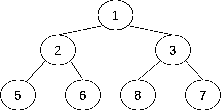
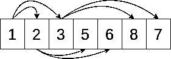

# Python heapq 模块:使用堆和优先级队列

> 原文：<https://realpython.com/python-heapq-module/>

**堆**和**优先级队列**是鲜为人知但非常有用的数据结构。对于许多涉及在数据集中寻找最佳元素的问题，它们提供了一个易于使用且高效的解决方案。Python `heapq`模块是标准库的一部分。它实现了所有的低级堆操作，以及堆的一些高级公共用途。

一个[优先级队列](https://realpython.com/queue-in-python/#priority-queue-sorted-from-high-to-low)是一个强大的工具，可以解决各种各样的问题，如编写电子邮件调度程序、在地图上寻找最短路径或合并日志文件。编程充满了[优化问题](https://en.wikipedia.org/wiki/Optimization_problem)，目标是找到最佳元素。优先级队列和 Python `heapq`模块中的函数通常可以对此有所帮助。

在本教程中，您将学习:

*   什么是**堆**和**优先级队列**以及它们之间的关系
*   使用堆可以解决什么样的问题
*   如何使用 Python **`heapq`模块**解决那些问题

本教程是为那些熟悉[列表](https://realpython.com/python-lists-tuples/)、[字典](https://realpython.com/python-dicts/)、[集合](https://realpython.com/python-sets/)和[生成器](https://realpython.com/introduction-to-python-generators/)并且正在寻找更复杂的[数据结构](https://realpython.com/python-data-structures/)的 python 们准备的。

您可以通过从下面的链接下载源代码来学习本教程中的示例:

**获取源代码:** [点击此处获取源代码，您将使用](https://realpython.com/bonus/python-heapq-code/)在本教程中了解 Python heapq 模块。

## 什么是堆？

堆是具体的数据结构，而优先级队列是抽象的数据结构。抽象的数据结构决定了[接口](https://realpython.com/python-interface/)，而具体的数据结构定义了实现。

堆通常用于实现优先级队列。它们是实现优先级队列抽象数据结构的最流行的具体数据结构。

具体的数据结构也规定了**性能保证**。性能保证定义了结构的*大小*和操作花费的*时间*之间的关系。理解这些保证可以让您预测当输入的大小改变时程序将花费多少时间。

[*Remove ads*](/account/join/)

### 数据结构、堆和优先级队列

抽象数据结构规定了操作和它们之间的关系。例如，优先级队列抽象数据结构支持三种操作:

1.  **is_empty** 检查队列是否为空。
2.  **add_element** 向队列中添加一个元素。
3.  **pop_element** 弹出优先级最高的元素。

优先级队列通常用于优化任务执行，目标是处理优先级最高的任务。任务完成后，它的优先级降低，并返回到队列中。

确定元素的优先级有两种不同的约定:

1.  最大的元素具有最高的优先级。
2.  最小的元素具有最高的优先级。

这两个约定是等价的，因为您总是可以颠倒有效顺序。例如，如果你的元素由[数字](https://realpython.com/python-numbers/)组成，那么使用负数将会颠倒约定。

Python `heapq`模块使用第二种约定，这通常是两种约定中更常见的一种。在这个约定下，*最小的*元素具有最高的优先级。这听起来可能令人惊讶，但它通常非常有用。在您稍后将看到的真实例子中，这种约定将简化您的代码。

**注意:**Python`heapq`模块，以及一般的堆数据结构*不是*设计来允许查找除最小元素之外的任何元素。对于按大小检索任何元素，更好的选择是二叉查找树。

具体数据结构实现抽象数据结构中定义的操作，并进一步指定性能保证。

优先级队列的堆实现保证了推送(添加)和弹出(移除)元素都是**对数时间**操作。这意味着做 push 和 pop 所需的时间与元素数量的以 2 为底的对数成正比**。**

[对数](https://en.wikipedia.org/wiki/Logarithm)增长缓慢。以 15 为底的对数大约是 4，而以 1 万亿为底的对数大约是 40。这意味着，如果一个算法在 15 个元素上足够快，那么它在 1 万亿个元素上只会慢 10 倍，而且可能仍然足够快。

在任何关于性能的讨论中，最大的警告是这些抽象的考虑比实际测量一个具体的程序和了解瓶颈在哪里更没有意义。一般的性能保证对于对程序行为做出有用的预测仍然很重要，但是这些预测应该得到证实。

### 堆的实现

堆将优先级队列实现为**完整二叉树**。在[二叉树](https://en.wikipedia.org/wiki/Binary_tree)中，每个节点最多有两个子节点。在一棵*完全*二叉树中，除了可能是最深的一层之外，所有层在任何时候都是满的。如果最深层次是不完整的，那么它的节点将尽可能地靠左。

**完整性属性**意味着树的深度是元素数量的以 2 为底的对数，向上取整。下面是一个完整二叉树的例子:

[](https://files.realpython.com/media/heap-tree.4b4413ff133c.png)

在这个特殊的例子中，所有级别都是完整的。除了最深的节点之外，每个节点正好有两个子节点。三个级别总共有七个节点。3 是 7 的以 2 为底的对数，向上取整。

基层的单个节点被称为**根**节点。将树顶端的节点称为根可能看起来很奇怪，但这是编程和计算机科学中的常见约定。

堆中的性能保证取决于元素如何在树中上下渗透。这样做的实际结果是，堆中的比较次数是树大小的以 2 为底的对数。

**注意:**比较有时涉及到使用`.__lt__()`调用用户定义的代码。与在堆中进行的其他操作相比，在 Python 中调用用户定义的方法是一个相对较慢的操作，因此这通常会成为瓶颈。

在堆树中，一个节点中的值总是小于它的两个子节点。这被称为**堆属性**。这与[二叉查找树](https://en.wikipedia.org/wiki/Binary_search_tree)不同，在后者中，只有左边的节点将小于其父节点的值。

推送和弹出的算法都依赖于临时违反堆属性，然后通过比较和替换单个分支上下来修复堆属性。

例如，为了将一个元素推到一个堆上，Python 会将新节点添加到下一个打开的槽中。如果底层未满，则该节点将被添加到底部的下一个空槽中。否则，创建一个新级别，然后将元素添加到新的底层。

添加节点后，Python 会将其与其父节点进行比较。如果违反了堆属性，则交换节点及其父节点，并从父节点重新开始检查。这种情况一直持续到堆属性成立或到达根为止。

类似地，当弹出最小的元素时，Python 知道，由于堆属性，该元素位于树的根。它用最深层的最后一个元素替换该元素，然后检查是否违反了分支的堆属性。

[*Remove ads*](/account/join/)

### 优先级队列的使用

优先级队列，以及作为优先级队列实现的堆，对于需要寻找某种极端元素的程序非常有用。例如，您可以将优先级队列用于以下任何任务:

*   从 hit data 中获取三个最受欢迎的博客帖子
*   寻找从一个地方到另一个地方的最快方法
*   基于到达频率预测哪辆公共汽车将首先到达车站

您可以使用优先级队列的另一个任务是安排电子邮件。想象一下，一个系统有几种电子邮件，每种邮件都需要以一定的频率发送。一种邮件需要每十五分钟发出一次，另一种需要每四十分钟发出一次。

调度程序可以将这两种类型的电子邮件添加到队列中，并带有一个**时间戳**来指示下一次需要发送电子邮件的时间。然后，调度程序可以查看时间戳最小的元素——表明它是下一个要发送的元素——并计算发送前要休眠多长时间。

当调度程序唤醒时，它将处理相关的电子邮件，将电子邮件从优先级队列中取出，计算下一个时间戳，并将电子邮件放回队列中的正确位置。

## Python `heapq`模块中作为列表的堆

尽管您看到了前面描述的树型堆，但重要的是要记住它是一棵*完整的*二叉树。完整性意味着除了最后一层，总是可以知道每一层有多少元素。因此，堆可以作为一个[列表](https://realpython.com/courses/lists-tuples-python/)来实现。这就是 Python `heapq`模块所做的事情。

有三个规则确定索引`k`处的元素与其周围元素之间的关系:

1.  它的第一个孩子在`2*k + 1`。
2.  它的第二个孩子在`2*k + 2`。
3.  它的父节点在`(k - 1) // 2`。

**注:**`//`符号是**整数除法**运算符。它总是向下舍入到整数。

上面的规则告诉你如何将一个列表可视化为一个完整的二叉树。请记住，元素总是有父元素，但有些元素没有子元素。如果`2*k`超出了列表的末尾，那么该元素没有任何子元素。如果`2*k + 1`是一个有效的索引，而`2*k + 2`不是，那么这个元素只有一个子元素。

heap 属性意味着如果`h`是一个堆，那么下面的永远不会是`False`:

```py
h[k] <= h[2*k + 1] and h[k] <= h[2*k + 2]
```

如果任何索引超出了列表的长度，它可能会引发一个`IndexError`，但它永远不会是`False`。

换句话说，一个元素必须总是小于两倍于其索引加 1 和两倍于其索引加 2 的元素。

下面是一个满足堆属性的列表:

[](https://files.realpython.com/media/heap-list.2db422e53ead.png)

箭头从元素`k`指向元素`2*k + 1`和`2*k + 2`。例如，Python 列表中的第一个元素有索引`0`，所以它的两个箭头指向索引`1`和`2`。注意箭头总是从较小的值到较大的值。这是检查列表是否满足堆属性的方法。

### 基本操作

Python `heapq`模块实现了对列表的堆操作。与许多其他模块不同，它没有*而不是*定义一个自定义类。Python `heapq`模块有直接作用于列表的函数。

通常，就像上面的电子邮件示例一样，元素将从一个空堆开始，一个接一个地插入到一个堆中。然而，如果已经有一个需要成为堆的元素列表，那么 Python `heapq`模块包含了用于将列表转换成有效堆的`heapify()`。

下面的代码使用`heapify()`将`a`变成**堆**:

>>>

```py
>>> import heapq
>>> a = [3, 5, 1, 2, 6, 8, 7]
>>> heapq.heapify(a)
>>> a
[1, 2, 3, 5, 6, 8, 7]
```

你可以检查一下，即使`7`在`8`之后，列表`a`仍然服从堆属性。比如`a[2]`，也就是`3`，小于`a[2*2 + 2]`，也就是`7`。

如您所见，`heapify()`就地修改了列表，但没有对其进行排序。堆不一定要排序才能满足堆属性。然而，因为每个排序列表*都满足堆属性*，所以在排序列表上运行`heapify()`不会改变列表中元素的顺序。

Python `heapq`模块中的其他基本操作假设列表已经是一个堆。值得注意的是，空列表或长度为 1 的列表总是堆。

因为树根是第一个元素，所以不需要专门的函数来非破坏性地读取最小的元素。第一个元素`a[0]`，永远是最小的元素。

为了在保留堆属性的同时弹出最小的元素，Python `heapq`模块定义了`heappop()`。

下面是如何使用`heappop()`弹出一个元素:

>>>

```py
>>> import heapq
>>> a = [1, 2, 3, 5, 6, 8, 7]
>>> heapq.heappop(a)
1
>>> a
[2, 5, 3, 7, 6, 8]
```

该函数返回第一个元素`1`，并保留`a`上的堆属性。比如`a[1]`是`5`，`a[1*2 + 2]`是`6`。

Python `heapq`模块还包括`heappush()`,用于将元素推送到堆中，同时保留堆属性。

以下示例显示了将值推送到堆中:

>>>

```py
>>> import heapq
>>> a = [2, 5, 3, 7, 6, 8]
>>> heapq.heappush(a, 4)
>>> a
[2, 5, 3, 7, 6, 8, 4]
>>> heapq.heappop(a)
2
>>> heapq.heappop(a)
3
>>> heapq.heappop(a)
4
```

将`4`推到堆中后，从堆中取出三个元素。因为`2`和`3`已经在堆中，并且比`4`小，所以它们先被弹出。

Python `heapq`模块还定义了另外两个操作:

1.  **`heapreplace()`** 相当于`heappop()`后跟`heappush()`。
2.  **`heappushpop()`** 相当于`heappush()`后跟`heappop()`。

这些在一些算法中是有用的，因为它们比分别做这两个操作更有效。

[*Remove ads*](/account/join/)

### 高层操作

由于优先级队列经常用于合并排序后的序列，Python `heapq`模块有一个现成的函数`merge()`，用于使用堆来合并几个可重复项。`merge()`假设它的输入 iterables 已经排序，并返回一个**迭代器**，而不是一个列表。

作为使用`merge()`的一个例子，这里有一个前面描述的电子邮件调度器的实现:

```py
import datetime
import heapq

def email(frequency, details):
    current = datetime.datetime.now()
    while True:
        current += frequency
        yield current, details

fast_email = email(datetime.timedelta(minutes=15), "fast email")
slow_email = email(datetime.timedelta(minutes=40), "slow email")

unified = heapq.merge(fast_email, slow_email)
```

本例中`merge()`的输入是[无限发电机](https://realpython.com/introduction-to-python-generators/#example-2-generating-an-infinite-sequence)。赋给[变量](https://realpython.com/python-variables/) `unified`的返回值也是无限迭代器。这个迭代器将按照未来时间戳的顺序产生要发送的电子邮件。

为了调试并确认代码正确合并，您可以打印要发送的前十封电子邮件:

>>>

```py
>>> for _ in range(10):
...    print(next(element))
(datetime.datetime(2020, 4, 12, 21, 27, 20, 305358), 'fast email')
(datetime.datetime(2020, 4, 12, 21, 42, 20, 305358), 'fast email')
(datetime.datetime(2020, 4, 12, 21, 52, 20, 305360), 'slow email')
(datetime.datetime(2020, 4, 12, 21, 57, 20, 305358), 'fast email')
(datetime.datetime(2020, 4, 12, 22, 12, 20, 305358), 'fast email')
(datetime.datetime(2020, 4, 12, 22, 27, 20, 305358), 'fast email')
(datetime.datetime(2020, 4, 12, 22, 32, 20, 305360), 'slow email')
(datetime.datetime(2020, 4, 12, 22, 42, 20, 305358), 'fast email')
(datetime.datetime(2020, 4, 12, 22, 57, 20, 305358), 'fast email')
(datetime.datetime(2020, 4, 12, 23, 12, 20, 305358), 'fast email')
```

请注意`fast email`是如何每隔`15`分钟安排一次的，`slow email`是如何每隔`40`安排一次的，并且电子邮件被适当地交错，以便它们按照时间戳的顺序排列。

不读取所有输入，而是动态工作。即使两个输入都是无限迭代器，打印前十项也会很快完成。

类似地，当用于合并排序后的序列时，比如按时间戳排列的日志文件行，即使日志很大，也会占用合理的内存量。

## 堆可以解决的问题

正如你在上面看到的，堆对于递增合并排序的序列是很好的。您已经考虑过的堆的两个应用是调度周期性任务和合并日志文件。然而，还有更多的应用。

堆还可以帮助识别顶部的 T2 或底部的 T4。Python `heapq`模块有实现这种行为的高级函数。

例如，该代码从 2016 年夏季奥运会的[女子 100 米决赛](https://www.olympic.org/rio-2016/athletics/100m-women)中获取时间作为输入，并打印奖牌获得者或前三名:

>>>

```py
>>> import heapq
>>> results="""\
... Christania Williams      11.80
... Marie-Josee Ta Lou       10.86
... Elaine Thompson          10.71
... Tori Bowie               10.83
... Shelly-Ann Fraser-Pryce  10.86
... English Gardner          10.94
... Michelle-Lee Ahye        10.92
... Dafne Schippers          10.90
... """
>>> top_3 = heapq.nsmallest(
...     3, results.splitlines(), key=lambda x: float(x.split()[-1])
... )
>>> print("\n".join(top_3))
Elaine Thompson          10.71
Tori Bowie               10.83
Marie-Josee Ta Lou       10.86
```

这段代码使用了 Python `heapq`模块中的`nsmallest()`。`nsmallest()`返回 iterable 中的最小元素，并接受三个参数:

1.  **`n`** 表示返回多少个元素。
2.  **`iterable`** 标识要比较的元素或数据集。
3.  **`key`** 是一个决定如何比较元素的可调用函数。

在这里，`key`函数通过空格分割该行，获取最后一个元素，并将其转换为一个[浮点数](https://realpython.com/python-data-types/#floating-point-numbers)。这意味着代码将根据运行时间对行进行排序，并返回运行时间最短的三行。这些对应于三个跑得最快的人，这给了你金牌，银牌和铜牌获得者。

Python `heapq`模块还包括`nlargest()`，它有类似的参数，返回最大的元素。这将是有用的，如果你想从标枪比赛中获得奖牌，其中的目标是投掷标枪尽可能远。

## 如何识别问题

作为优先级队列的实现，堆是解决极端问题的好工具，比如给定指标的最大值或最小值。

还有其他词语表明堆可能有用:

*   最大的
*   最小的
*   最大的
*   最小的
*   最好的
*   最差的
*   顶端
*   底部
*   最高的
*   最低限度
*   最佳的

每当问题陈述表明您正在寻找一些极端的元素时，就有必要考虑一下优先级队列是否有用。

有时优先级队列将只是解决方案的*部分*，其余部分将是[动态编程](https://en.wikipedia.org/wiki/Dynamic_programming)的某种变体。这是您将在下一节看到的完整示例的情况。动态编程和优先级队列经常一起使用。

[*Remove ads*](/account/join/)

## 示例:查找路径

下面的例子是 Python `heapq`模块的一个真实用例。这个例子将使用一个经典算法，作为它的一部分，需要一个堆。您可以通过单击下面的链接下载示例中使用的源代码:

**获取源代码:** [点击此处获取源代码，您将使用](https://realpython.com/bonus/python-heapq-code/)在本教程中了解 Python heapq 模块。

想象一个需要在二维迷宫中导航的机器人。机器人需要从左上角的原点出发，到达右下角的目的地。机器人的记忆中有迷宫的地图，所以它可以在出发前规划出整个路径。

目标是让机器人尽快完成迷宫。

我们的算法是 Dijkstra 算法的变体。在整个算法中，有三种数据结构被保持和更新:

1.  **`tentative`** 是一张从原点到某个位置的试探性路径图，`pos`。这条路径被称为*暂定*，因为它是已知最短的*路径*，但它可能会被改进。

2.  **`certain`** 是一组点，对于这些点，`tentative`映射的路径是*确定的*最短可能路径。

3.  **`candidates`** 是一堆有路径的位置。堆的**排序键**是路径的长度。

在每个步骤中，您最多可以执行四个操作:

1.  从`candidates`弹出一个候选人。

2.  将候选人添加到`certain`集合。如果候选人已经是`certain`集合的成员，则跳过接下来的两个动作。

3.  查找到当前候选人的最短已知路径。

4.  对于当前候选的每个近邻，查看遍历候选是否给出比当前`tentative`路径更短的路径。如果是，那么用这个新路径更新`tentative`路径和`candidates`堆。

这些步骤循环运行，直到目的地被添加到`certain`集合。当目的地在`certain`集合中时，您就完成了。该算法的输出是到目的地的`tentative`路径，现在`certain`是最短的可能路径。

### 顶层代码

现在您已经理解了算法，是时候编写代码来实现它了。在实现算法本身之前，写一些支持代码是有用的。

首先，你需要[导入](https://realpython.com/absolute-vs-relative-python-imports/#a-quick-recap-on-imports)Python`heapq`模块:

```py
import heapq
```

您将使用 Python `heapq`模块中的函数来维护一个堆，这将帮助您在每次迭代中找到已知路径最短的位置。

下一步是将地图定义为代码中的变量:

```py
map = """\
.......X..
.......X..
....XXXX..
..........
..........
"""
```

该地图是一个[三重引用字符串](https://realpython.com/python-data-types/#triple-quoted-strings)，显示机器人可以移动的区域以及任何障碍。

虽然更现实的场景是从文件中读取地图，但出于教学目的，使用这个简单的地图在代码中定义变量更容易。代码可以在任何地图上工作，但是在简单的地图上更容易理解和调试。

该图经过优化，便于代码的人类读者理解。点(`.`)足够亮，看起来是空的，但它的优点是显示了允许区域的尺寸。`X`位置标记机器人无法通过的障碍物。

[*Remove ads*](/account/join/)

### 支持代码

第一个函数将把地图转换成更容易用代码解析的形式。`parse_map()`获取地图并对其进行分析:

```py
def parse_map(map):
    lines = map.splitlines()
    origin = 0, 0
    destination = len(lines[-1]) - 1, len(lines) - 1
    return lines, origin, destination
```

该函数获取一个映射并返回一个包含三个元素的元组:

1.  `lines`列表
2.  `origin`
3.  `destination`

这使得剩余的代码能够处理为计算机设计的数据结构，而不是为人类的视觉扫描能力设计的数据结构。

可以通过`(x, y)`坐标来索引`lines`列表。表达式`lines[y][x]`返回两个字符之一的位置值:

1.  **点(`"."` )** 表示该位置为空。
2.  **字母`"X"`** 表示位置是障碍。

当你想找到机器人可以占据的位置时，这将是有用的。

函数`is_valid()`计算给定的`(x, y)`位置是否有效:

```py
def is_valid(lines, position):
    x, y = position
    if not (0 <= y < len(lines) and 0 <= x < len(lines[y])):
        return False
    if lines[y][x] == "X":
        return False
    return True
```

该函数有两个参数:

1.  **`lines`** 是把地图看成一列线条。
2.  **`position`** 是要检查的位置，作为指示`(x, y)`坐标的二元组整数。

为了有效，位置必须在地图的边界内，而不是障碍物。

该函数通过检查`lines`列表的长度来检查`y`是否有效。该函数接下来检查`x`是否有效，确保它在`lines[y]`内。最后，现在你知道两个坐标都在地图内，代码通过查看这个位置的字符并将字符与`"X"`进行比较来检查它们是否是障碍。

另一个有用的助手是`get_neighbors()`，它查找一个位置的所有邻居:

```py
def get_neighbors(lines, current):
    x, y = current
    for dx in [-1, 0, 1]:
        for dy in [-1, 0, 1]:
            if dx == 0 and dy == 0:
                continue
            position = x + dx, y + dy
            if is_valid(lines, position):
                yield position
```

该函数返回当前位置周围的所有有效位置。

`get_neighbors()`小心避免将某个位置标识为自己的邻居，但它允许对角邻居。这就是为什么`dx`和`dy`中至少有一个不能为零，但是两个都不为零也没关系。

最后一个助手函数是`get_shorter_paths()`，它寻找更短的路径:

```py
def get_shorter_paths(tentative, positions, through):
    path = tentative[through] + [through]
    for position in positions:
        if position in tentative and len(tentative[position]) <= len(path):
            continue
        yield position, path
```

`get_shorter_paths()`产生以`through`为最后一步的路径比当前已知路径短的位置。

`get_shorter_paths()`有三个参数:

1.  **`tentative`** 是将一个位置映射到最短已知路径的字典。
2.  **`positions`** 是一个可迭代的位置，您要将路径缩短到该位置。
3.  **`through`** 是这样一个位置，通过它也许可以找到一条到`positions`的更短的路径。

假设从`through`开始一步就可以到达`positions`中的所有元素。

功能`get_shorter_paths()`检查使用`through`作为最后一步是否会为每个位置创建更好的路径。如果一个位置没有已知的路径，那么任何路径都是较短的。如果有一条已知的路径，那么只有当它的长度更短时，你才会产生新的路径。为了让`get_shorter_paths()`的 API 更容易使用，`yield`的一部分也是更短的路径。

所有的帮助函数都被写成纯函数，这意味着它们不修改任何数据结构，只返回值。这使得遵循核心算法变得更加容易，核心算法完成所有的数据结构更新。

[*Remove ads*](/account/join/)

### 核心算法代码

概括地说，您正在寻找起点和终点之间的最短路径。

您保留三份数据:

1.  **`certain`** 是某些职位的设定。
2.  **`candidates`** 是堆候选人。
3.  **`tentative`** 是一个将节点映射到当前最短已知路径的字典。

如果您能确定最短的已知路径是最短的可能路径，则位置在`certain`中。如果目的地在`certain`集合中，那么到目的地的最短已知路径无疑是最短的可能路径，并且您可以返回该路径。

`candidates`的堆由最短已知路径的长度组织，并在 Python `heapq`模块中的函数的帮助下进行管理。

在每一步，你看着候选人与最短的已知路径。这是用`heappop()`弹出堆的地方。到这个候选者没有更短的路径——所有其他路径都经过`candidates`中的某个其他节点，并且所有这些路径都更长。正因为如此，目前的候选人可以标上`certain`。

然后查看所有没有被访问过的邻居，如果遍历当前节点是一种改进，那么使用`heappush()`将它们添加到`candidates`堆中。

函数`find_path()`实现了该算法:

```py
 1def find_path(map):
 2    lines, origin, destination = parse_map(map)
 3    tentative = {origin: []}
 4    candidates = [(0, origin)]
 5    certain = set()
 6    while destination not in certain and len(candidates) > 0:
 7        _ignored, current = heapq.heappop(candidates)
 8        if current in certain:
 9            continue
10        certain.add(current)
11        neighbors = set(get_neighbors(lines, current)) - certain
12        shorter = get_shorter_paths(tentative, neighbors, current)
13        for neighbor, path in shorter:
14            tentative[neighbor] = path
15            heapq.heappush(candidates, (len(path), neighbor))
16    if destination in tentative:
17        return tentative[destination] + [destination]
18    else:
19        raise ValueError("no path")
```

`find_path()`接收一个`map`作为字符串，并返回从原点到目的地的路径作为位置列表。

这个函数有点长且复杂，所以让我们一次一点地来看一下:

*   **第 2 行到第 5 行**设置了循环将查看和更新的变量。你已经知道了一条从原点到自身的路径，这条路径是空的，长度为 0。

*   **第 6 行**定义了循环的终止条件。如果没有`candidates`，那么没有路径可以缩短。如果`destination`在`certain`，那么到`destination`的路径不能再短了。

*   **第 7 行到第 10 行**使用`heappop()`得到一个候选者，如果它已经在`certain`中就跳过这个循环，否则将这个候选者添加到`certain`。这确保了每个候选项最多被循环处理一次。

*   **第 11 行到第 15 行**使用`get_neighbors()`和`get_shorter_paths()`寻找到邻近位置的更短路径，并更新`tentative`字典和`candidates`堆。

*   **第 16 行到第 19 行**处理返回正确的结果。如果找到了路径，那么函数将返回它。虽然计算路径*而不计算*最终位置使得算法的实现更简单，但是返回路径*并以*为目的地是一个更好的 API。如果找不到路径，则会引发异常。

将函数分解成不同的部分可以让你一次理解一部分。

### 可视化代码

如果该算法实际上被机器人使用，那么机器人可能会在它应该经过的位置列表中表现得更好。然而，为了使结果对人类来说更好看，可视化他们会更好。

`show_path()`在地图上绘制路径:

```py
def show_path(path, map):
    lines = map.splitlines()
    for x, y in path:
        lines[y] = lines[y][:x] + "@" + lines[y][x + 1 :]
    return "\n".join(lines) + "\n"
```

该函数将`path`和`map`作为参数。它返回一个新地图，路径由 at 符号(`"@"`)指示。

### 运行代码

最后，您需要调用函数。这可以通过 [Python 交互式解释器](https://realpython.com/interacting-with-python/#using-the-python-interpreter-interactively)来完成。

以下代码将运行该算法并显示漂亮的输出:

>>>

```py
>>> path = find_path(map)
>>> print(show_path(path, map))
@@.....X..
..@....X..
...@XXXX..
....@@@@@.
.........@
```

首先你得到从`find_path()`开始的最短路径。然后你把它传递给`show_path()`来渲染一个标有路径的地图。最后，你`print()`把地图以标准输出。

路径向右移动一步，然后向右下斜移几步，再向右移几步，最后向右下斜移一步。

恭喜你！您已经使用 Python `heapq`模块解决了一个问题。

这类寻路问题可以通过动态规划和优先级队列的组合来解决，在[工作面试](https://realpython.com/python-coding-interview-tips/)和编程挑战中很常见。例如，2019 年出现的代码[包括一个问题](https://adventofcode.com/2019/day/18)，可以用这里描述的技术解决。

[*Remove ads*](/account/join/)

## 结论

你现在知道了什么是**堆**和**优先级队列**数据结构，以及它们在解决什么样的问题时有用。您学习了如何使用 Python `heapq`模块将 Python 列表用作堆。您还学习了如何使用 Python `heapq`模块中的高级操作，比如`merge()`，它在内部使用堆。

**在本教程中，您已经学会了如何:**

*   使用 Python `heapq`模块中的**低级函数**来解决需要堆或优先级队列的问题
*   使用 Python `heapq`模块中的**高级函数**来合并已排序的可迭代对象或查找可迭代对象中最大或最小的元素
*   认识到堆和优先级队列可以帮助解决的问题
*   预测使用堆的代码的性能

凭借您对堆和 Python `heapq`模块的了解，您现在可以解决许多问题，这些问题的解决方案取决于找到最小或最大的元素。要了解您在本教程中看到的示例，您可以从下面的链接下载源代码:

**获取源代码:** [点击此处获取源代码，您将使用](https://realpython.com/bonus/python-heapq-code/)在本教程中了解 Python heapq 模块。*******