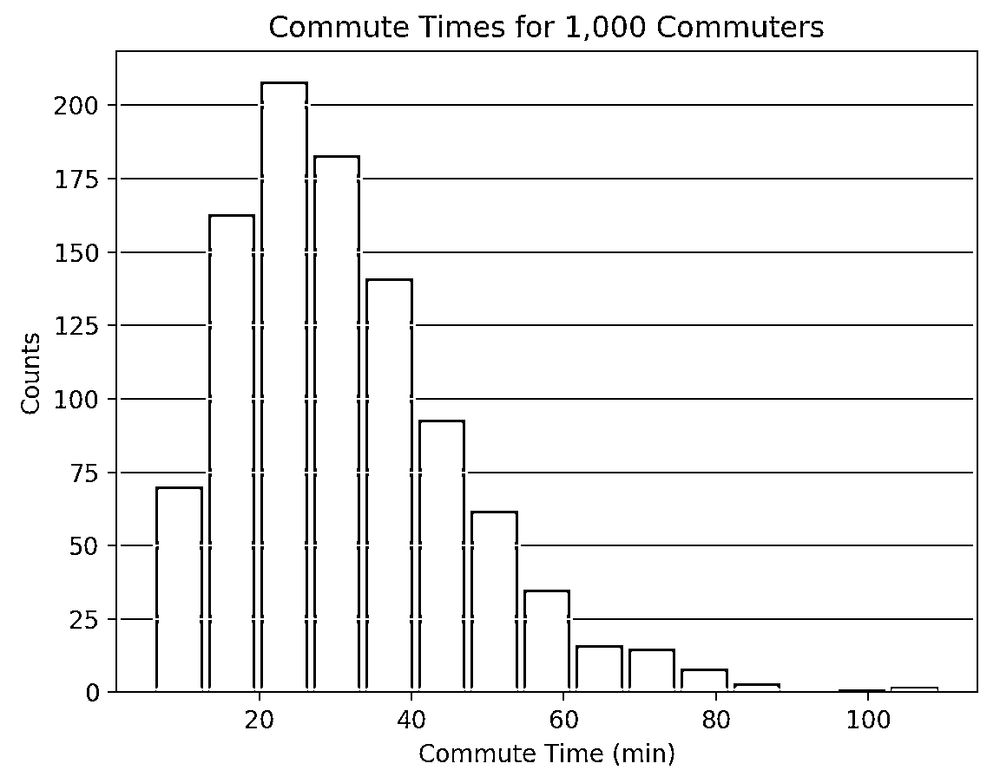
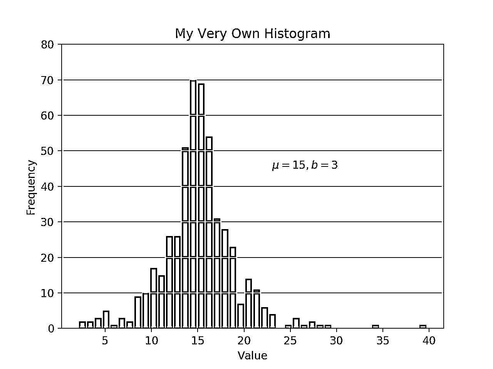
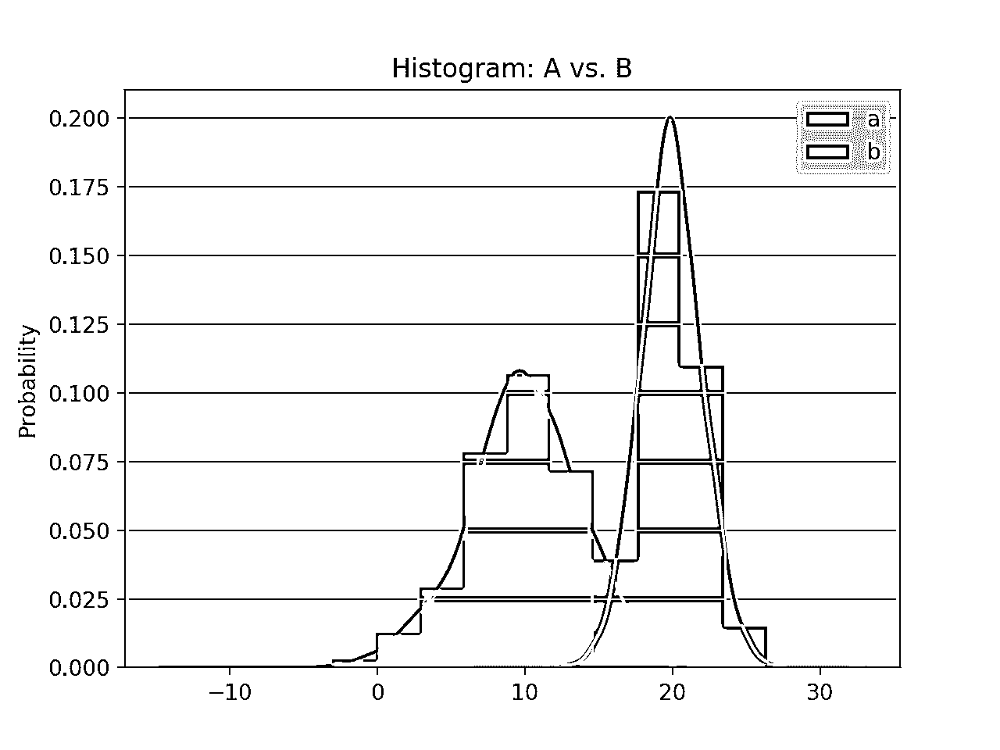
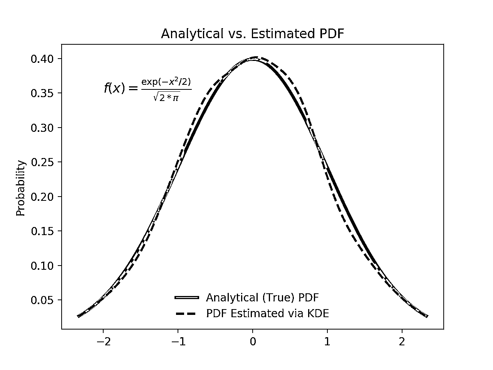
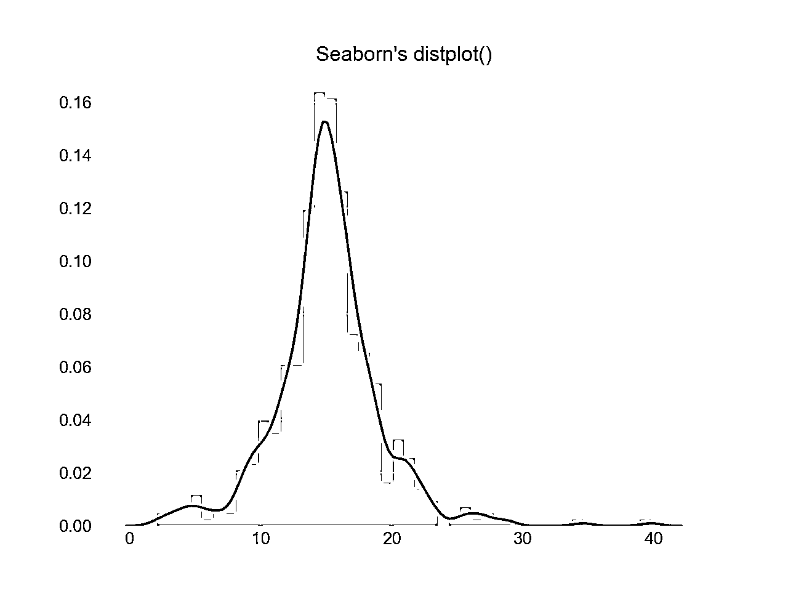
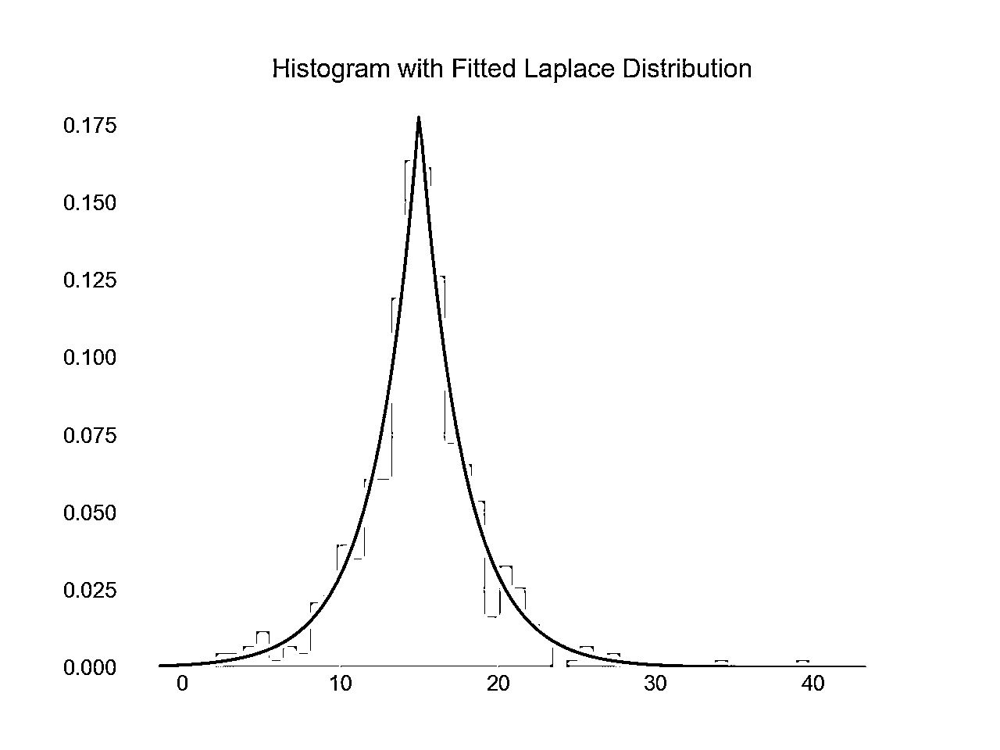

# Python 直方图绘制:NumPy、Matplotlib、Pandas 和 Seaborn

> 原文：<https://realpython.com/python-histograms/>

*立即观看**本教程有真实 Python 团队创建的相关视频课程。配合文字教程一起看，加深理解: [**Python 直方图绘制:NumPy、Matplotlib、Pandas & Seaborn**](/courses/python-histograms/)

在本教程中，您将具备制作产品质量、演示就绪的 Python 直方图的能力，并拥有一系列选择和功能。

如果您对 [Python 和 statistics](https://realpython.com/python-statistics/) 有入门中级知识，那么您可以将本文作为使用 Python 科学堆栈中的库(包括 NumPy、Matplotlib、 [Pandas](https://realpython.com/pandas-python-explore-dataset/) 和 Seaborn)在 Python 中构建和绘制直方图的一站式商店。

直方图是一个很好的工具，可以快速评估几乎所有观众都能直观理解的概率分布。Python 为构建和绘制直方图提供了一些不同的选项。大多数人通过直方图的图形表示来了解直方图，它类似于条形图:

[](https://files.realpython.com/media/commute_times.621e5b1ce062.png)

这篇文章将引导你创建类似上面的情节以及更复杂的情节。以下是您将涉及的内容:

*   用纯 Python 构建直方图，不使用第三方库
*   使用 NumPy 构建直方图以汇总底层数据
*   使用 Matplotlib、Pandas 和 Seaborn 绘制结果直方图

**免费奖金:**时间短？[点击这里获得一份免费的两页 Python 直方图备忘单](https://realpython.com/bonus/histograms-cheatsheet/)，它总结了本教程中解释的技术。

## 纯 Python 的直方图

当您准备绘制直方图时，最简单的方法是不要考虑柱，而是报告每个值出现的次数(频率表)。Python [字典](https://docs.python.org/3/tutorial/datastructures.html#dictionaries)非常适合这项任务:

>>>

```py
>>> # Need not be sorted, necessarily
>>> a = (0, 1, 1, 1, 2, 3, 7, 7, 23)

>>> def count_elements(seq) -> dict:
...     """Tally elements from `seq`."""
...     hist = {}
...     for i in seq:
...         hist[i] = hist.get(i, 0) + 1
...     return hist

>>> counted = count_elements(a)
>>> counted
{0: 1, 1: 3, 2: 1, 3: 1, 7: 2, 23: 1}
```

`count_elements()`返回一个字典，将序列中的唯一元素作为键，将它们的频率(计数)作为值。在`seq`的循环中，`hist[i] = hist.get(i, 0) + 1`说，“对于序列中的每个元素，将它在`hist`中的对应值增加 1。”

事实上，这正是 Python 标准库中的`collections.Counter`类所做的，该类的[子类化了](https://github.com/python/cpython/blob/7f1bcda9bc3c04100cb047373732db0eba00e581/Lib/collections/__init__.py#L466)一个 Python 字典并覆盖了它的`.update()`方法:

>>>

```py
>>> from collections import Counter

>>> recounted = Counter(a)
>>> recounted
Counter({0: 1, 1: 3, 3: 1, 2: 1, 7: 2, 23: 1})
```

通过测试两者之间的相等性，您可以确认您的手工函数实际上做了与`collections.Counter`相同的事情:

>>>

```py
>>> recounted.items() == counted.items()
True
```

**技术细节**:上面`count_elements()`的映射默认为一个更加高度优化的 [C 函数](https://github.com/python/cpython/blob/a5c42284e69fb309bdd17ee8c1c120d1be383012/Modules/_collectionsmodule.c#L2250)，如果它可用的话。在 Python 函数`count_elements()`中，你可以做的一个微优化是在 for 循环之前声明`get = hist.get`。这将把一个方法绑定到一个[变量](https://realpython.com/python-variables/)，以便在循环中更快地调用。

作为理解更复杂的函数的第一步，从头构建简化的函数可能会有所帮助。让我们利用 Python 的[输出格式](https://docs.python.org/tutorial/inputoutput.html#fancier-output-formatting)进一步重新发明一个 ASCII 直方图:

```py
def ascii_histogram(seq) -> None:
    """A horizontal frequency-table/histogram plot."""
    counted = count_elements(seq)
    for k in sorted(counted):
        print('{0:5d}  {1}'.format(k, '+' * counted[k]))
```

该函数创建一个排序频率图，其中计数表示为加号(`+`)的计数。在字典上调用 [`sorted()`](https://realpython.com/python-sort/) 会返回一个排序后的键列表，然后使用`counted[k]`访问每个键对应的值。要了解这一点，您可以使用 Python 的`random`模块创建一个稍大的数据集:

>>>

```py
>>> # No NumPy ... yet
>>> import random
>>> random.seed(1)

>>> vals = [1, 3, 4, 6, 8, 9, 10]
>>> # Each number in `vals` will occur between 5 and 15 times.
>>> freq = (random.randint(5, 15) for _ in vals)

>>> data = []
>>> for f, v in zip(freq, vals):
...     data.extend([v] * f)

>>> ascii_histogram(data)
 1 +++++++
 3 ++++++++++++++
 4 ++++++
 6 +++++++++
 8 ++++++
 9 ++++++++++++
 10 ++++++++++++
```

在这里，您模拟从`vals`开始拨弦，频率由`freq`(一个[发生器表达式](https://realpython.com/introduction-to-python-generators/))给出。产生的样本数据重复来自`vals`的每个值一定的次数，在 5 到 15 之间。

**注意** : [`random.seed()`](https://docs.python.org/library/random.html#random.seed) 用于播种或初始化`random`使用的底层伪随机数发生器( [PRNG](https://en.wikipedia.org/wiki/Pseudorandom_number_generator) )。这听起来可能有点矛盾，但这是一种让随机数据具有可重复性和确定性的方法。也就是说，如果你照原样复制这里的代码，你应该得到完全相同的直方图，因为在播种生成器之后第一次调用`random.randint()`将使用 [Mersenne Twister](https://en.wikipedia.org/wiki/Mersenne_Twister) 产生相同的“随机”数据。

[*Remove ads*](/account/join/)

## 从基础开始构建:以 NumPy 为单位的直方图计算

到目前为止，您一直在使用最好称为“频率表”的东西。但是从数学上来说，直方图是区间(区间)到频率的映射。更专业的说，可以用来近似基础变量的概率密度函数( [PDF](https://en.wikipedia.org/wiki/Probability_density_function) )。

从上面的“频率表”开始，真正的直方图首先“分类”值的范围，然后计算落入每个分类的值的数量。这就是 [NumPy 的](https://realpython.com/numpy-array-programming/) `histogram()`函数所做的事情，它也是你稍后将在 Python 库中看到的其他函数的基础，比如 Matplotlib 和 Pandas。

考虑从[拉普拉斯分布](https://en.wikipedia.org/wiki/Laplace_distribution)中抽取的一个浮点样本。该分布比正态分布具有更宽的尾部，并且具有两个描述性参数(位置和比例):

>>>

```py
>>> import numpy as np
>>> # `numpy.random` uses its own PRNG.
>>> np.random.seed(444)
>>> np.set_printoptions(precision=3)

>>> d = np.random.laplace(loc=15, scale=3, size=500)
>>> d[:5]
array([18.406, 18.087, 16.004, 16.221,  7.358])
```

在这种情况下，您处理的是一个连续的分布，单独计算每个浮点数，直到小数点后无数位，并没有多大帮助。相反，您可以对数据进行分类或“分桶”,并对落入每个分类中的观察值进行计数。直方图是每个条柱内值的结果计数:

>>>

```py
>>> hist, bin_edges = np.histogram(d)

>>> hist
array([ 1,  0,  3,  4,  4, 10, 13,  9,  2,  4])

>>> bin_edges
array([ 3.217,  5.199,  7.181,  9.163, 11.145, 13.127, 15.109, 17.091,
 19.073, 21.055, 23.037])
```

这个结果可能不是直接直观的。 [`np.histogram()`](https://docs.scipy.org/doc/numpy/reference/generated/numpy.histogram.html) 默认使用 10 个大小相等的仓，并返回频率计数和相应仓边的元组。它们是边缘，在这种意义上，将会比直方图的成员多一个箱边缘:

>>>

```py
>>> hist.size, bin_edges.size
(10, 11)
```

**技术细节**:除了最后一个(最右边的)箱子，其他箱子都是半开的。也就是说，除了最后一个 bin 之外的所有 bin 都是[包含，不包含]，最后一个 bin 是[包含，不包含]。

NumPy 如何构造[的一个非常简洁的分类如下:](https://github.com/numpy/numpy/blob/6a58e25703cbecb6786faa09a04ae2ec8221348b/numpy/lib/function_base.py#L432-L844)

>>>

```py
>>> # The leftmost and rightmost bin edges
>>> first_edge, last_edge = a.min(), a.max()

>>> n_equal_bins = 10  # NumPy's default
>>> bin_edges = np.linspace(start=first_edge, stop=last_edge,
...                         num=n_equal_bins + 1, endpoint=True)
...
>>> bin_edges
array([ 0\. ,  2.3,  4.6,  6.9,  9.2, 11.5, 13.8, 16.1, 18.4, 20.7, 23\. ])
```

上面的例子很有意义:在 23 的峰峰值范围内，10 个等间距的仓意味着宽度为 2.3 的区间。

从那里，该功能委托给 [`np.bincount()`](https://docs.scipy.org/doc/numpy/reference/generated/numpy.bincount.html) 或 [`np.searchsorted()`](https://docs.scipy.org/doc/numpy/reference/generated/numpy.searchsorted.html) 。`bincount()`本身可以用来有效地构建您在这里开始的“频率表”，区别在于包含了零出现的值:

>>>

```py
>>> bcounts = np.bincount(a)
>>> hist, _ = np.histogram(a, range=(0, a.max()), bins=a.max() + 1)

>>> np.array_equal(hist, bcounts)
True

>>> # Reproducing `collections.Counter`
>>> dict(zip(np.unique(a), bcounts[bcounts.nonzero()]))
{0: 1, 1: 3, 2: 1, 3: 1, 7: 2, 23: 1}
```

**注意** : `hist`这里实际上使用的是宽度为 1.0 的面元，而不是“离散”计数。因此，这只对计算整数有效，而不是像`[3.9, 4.1, 4.15]`这样的浮点数。

## 用 Matplotlib 和 Pandas 可视化直方图

现在你已经看到了如何用 Python 从头开始构建直方图，让我们看看其他的 [Python 包](https://realpython.com/python-modules-packages/)如何为你完成这项工作。 [Matplotlib](https://realpython.com/python-matplotlib-guide/) 通过围绕 NumPy 的`histogram()`的通用包装器，提供开箱即用的可视化 Python 直方图的功能:

```py
import matplotlib.pyplot as plt

# An "interface" to matplotlib.axes.Axes.hist() method
n, bins, patches = plt.hist(x=d, bins='auto', color='#0504aa',
                            alpha=0.7, rwidth=0.85)
plt.grid(axis='y', alpha=0.75)
plt.xlabel('Value')
plt.ylabel('Frequency')
plt.title('My Very Own Histogram')
plt.text(23, 45, r'$\mu=15, b=3$')
maxfreq = n.max()
# Set a clean upper y-axis limit.
plt.ylim(ymax=np.ceil(maxfreq / 10) * 10 if maxfreq % 10 else maxfreq + 10)
```

[](https://files.realpython.com/media/my_very_own_histogram.d411ea1cb95c.png)

如前所述，直方图在 x 轴上使用其条边，在 y 轴上使用相应的频率。在上图中，传递`bins='auto'`在两个算法之间选择，以估计“理想”的箱数。在高层次上，该算法的目标是选择一个能够生成最忠实的数据表示的条柱宽度。关于这个主题的更多信息，可能会变得非常专业，请查看 Astropy 文档中的[选择直方图仓](http://docs.astropy.org/en/stable/visualization/histogram.html)。

在 Python 的科学堆栈中，熊猫的`Series.histogram()` [使用`matplotlib.pyplot.hist()`](https://github.com/pandas-dev/pandas/blob/cbec58eacd8e9cd94b7f42351b8de4559c250909/pandas/plotting/_core.py#L1310) 绘制输入序列的 Matplotlib 直方图:

```py
import pandas as pd

# Generate data on commute times.
size, scale = 1000, 10
commutes = pd.Series(np.random.gamma(scale, size=size) ** 1.5)

commutes.plot.hist(grid=True, bins=20, rwidth=0.9,
                   color='#607c8e')
plt.title('Commute Times for 1,000 Commuters')
plt.xlabel('Counts')
plt.ylabel('Commute Time')
plt.grid(axis='y', alpha=0.75)
```

[](https://files.realpython.com/media/commute_times.621e5b1ce062.png)

`pandas.DataFrame.histogram()`类似，但为[数据帧](https://realpython.com/pandas-dataframe/)中的每列数据生成一个直方图。

[*Remove ads*](/account/join/)

## 绘制核密度估计值(KDE)

在本教程中，从统计学的角度来说，您一直在使用样本。无论数据是离散的还是连续的，它都被假定为来自一个总体，该总体具有仅由几个参数描述的真实、精确的分布。

核密度估计(KDE)是一种估计样本中随机变量的概率密度函数(PDF)的方法。KDE 是一种数据平滑的手段。

坚持使用熊猫库，你可以使用`plot.kde()`创建和覆盖密度图，它对`Series`和`DataFrame`对象都可用。但首先，让我们生成两个不同的数据样本进行比较:

>>>

```py
>>> # Sample from two different normal distributions
>>> means = 10, 20
>>> stdevs = 4, 2
>>> dist = pd.DataFrame(
...     np.random.normal(loc=means, scale=stdevs, size=(1000, 2)),
...     columns=['a', 'b'])
>>> dist.agg(['min', 'max', 'mean', 'std']).round(decimals=2)
 a      b
min   -1.57  12.46
max   25.32  26.44
mean  10.12  19.94
std    3.94   1.94
```

现在，要在相同的 Matplotlib 轴上绘制每个直方图:

```py
fig, ax = plt.subplots()
dist.plot.kde(ax=ax, legend=False, title='Histogram: A vs. B')
dist.plot.hist(density=True, ax=ax)
ax.set_ylabel('Probability')
ax.grid(axis='y')
ax.set_facecolor('#d8dcd6')
```

[](https://files.realpython.com/media/a_vs_b.7528322a9e65.png)

这些方法利用了 SciPy 的 [`gaussian_kde()`](https://docs.scipy.org/doc/scipy/reference/generated/scipy.stats.gaussian_kde.html) ，从而产生看起来更平滑的 PDF。

如果您仔细观察这个函数，您会发现对于 1000 个数据点的相对较小的样本，它是多么接近“真实”的 PDF。下面，你可以先用`scipy.stats.norm()`构建“解析”分布。这是一个类实例，封装了统计标准正态分布、其矩和描述函数。它的 PDF 是“精确的”，因为它被精确地定义为`norm.pdf(x) = exp(-x**2/2) / sqrt(2*pi)`。

在此基础上，您可以从该分布中随机抽取 1000 个数据点，然后尝试使用`scipy.stats.gaussian_kde()`返回 PDF 的估计值:

```py
from scipy import stats

# An object representing the "frozen" analytical distribution
# Defaults to the standard normal distribution, N~(0, 1)
dist = stats.norm()

# Draw random samples from the population you built above.
# This is just a sample, so the mean and std. deviation should
# be close to (1, 0).
samp = dist.rvs(size=1000)

# `ppf()`: percent point function (inverse of cdf — percentiles).
x = np.linspace(start=stats.norm.ppf(0.01),
                stop=stats.norm.ppf(0.99), num=250)
gkde = stats.gaussian_kde(dataset=samp)

# `gkde.evaluate()` estimates the PDF itself.
fig, ax = plt.subplots()
ax.plot(x, dist.pdf(x), linestyle='solid', c='red', lw=3,
        alpha=0.8, label='Analytical (True) PDF')
ax.plot(x, gkde.evaluate(x), linestyle='dashed', c='black', lw=2,
        label='PDF Estimated via KDE')
ax.legend(loc='best', frameon=False)
ax.set_title('Analytical vs. Estimated PDF')
ax.set_ylabel('Probability')
ax.text(-2., 0.35, r'$f(x) = \frac{\exp(-x^2/2)}{\sqrt{2*\pi}}$',
        fontsize=12)
```

[](https://files.realpython.com/media/analytic_v_estimated.44711de28f1d.png)

这是一个更大的代码块，所以让我们花点时间来了解几个关键行:

*   SciPy 的 [`stats`子包](https://docs.scipy.org/doc/scipy/reference/stats.html)允许您创建表示分析分布的 Python 对象，您可以从中采样以创建实际数据。所以`dist = stats.norm()`代表一个正常的连续随机变量，你用`dist.rvs()`从中生成随机数。
*   为了评估分析 PDF 和高斯 KDE，您需要一个分位数数组`x`(高于/低于平均值的标准偏差，表示正态分布)。`stats.gaussian_kde()`表示一个估计的 PDF，在这种情况下，您需要对一个数组进行评估，以产生视觉上有意义的东西。
*   最后一行包含一些 [LaTex](https://matplotlib.org/users/usetex.html) ，它与 Matplotlib 很好地集成在一起。

## 与 Seaborn 的别样选择

让我们再加入一个 Python 包。Seaborn 有一个`displot()`函数，可以一步绘制出单变量分布的直方图和 KDE。使用早期的 NumPy 数组`d`:

```py
import seaborn as sns

sns.set_style('darkgrid')
sns.distplot(d)
```

[](https://files.realpython.com/media/seaborn_distplot.b10bb7c29d85.png)

上面的调用产生了一个 KDE。还可以选择为数据拟合特定的分布。这不同于 KDE，它由通用数据的参数估计和指定的分布名称组成:

```py
sns.distplot(d, fit=stats.laplace, kde=False)
```

[](https://files.realpython.com/media/seaborn_fitted.106107494ccf.png)

同样，请注意细微的差别。在第一种情况下，你估计一些未知的 PDF 在第二种情况下，你需要一个已知的分布，并根据经验数据找出最能描述它的参数。

[*Remove ads*](/account/join/)

## 熊猫里的其他工具

除了它的绘图工具，Pandas 还提供了一个方便的`.value_counts()`方法来计算 Pandas 的非空值的直方图`Series`:

>>>

```py
>>> import pandas as pd

>>> data = np.random.choice(np.arange(10), size=10000,
...                         p=np.linspace(1, 11, 10) / 60)
>>> s = pd.Series(data)

>>> s.value_counts()
9    1831
8    1624
7    1423
6    1323
5    1089
4     888
3     770
2     535
1     347
0     170
dtype: int64

>>> s.value_counts(normalize=True).head()
9    0.1831
8    0.1624
7    0.1423
6    0.1323
5    0.1089
dtype: float64
```

在其他地方， [`pandas.cut()`](https://pandas.pydata.org/pandas-docs/stable/generated/pandas.cut.html) 是将值绑定到任意区间的便捷方式。假设您有一些关于个人年龄的数据，并希望明智地对它们进行分类:

>>>

```py
>>> ages = pd.Series(
...     [1, 1, 3, 5, 8, 10, 12, 15, 18, 18, 19, 20, 25, 30, 40, 51, 52])
>>> bins = (0, 10, 13, 18, 21, np.inf)  # The edges
>>> labels = ('child', 'preteen', 'teen', 'military_age', 'adult')
>>> groups = pd.cut(ages, bins=bins, labels=labels)

>>> groups.value_counts()
child           6
adult           5
teen            3
military_age    2
preteen         1
dtype: int64

>>> pd.concat((ages, groups), axis=1).rename(columns={0: 'age', 1: 'group'})
 age         group
0     1         child
1     1         child
2     3         child
3     5         child
4     8         child
5    10         child
6    12       preteen
7    15          teen
8    18          teen
9    18          teen
10   19  military_age
11   20  military_age
12   25         adult
13   30         adult
14   40         adult
15   51         adult
16   52         adult
```

令人高兴的是，这两个操作最终都利用了 Cython 代码，这使它们在速度上具有竞争力，同时保持了灵活性。

## 好吧，那我应该用哪个？

至此，您已经看到了许多用于绘制 Python 直方图的函数和方法可供选择。他们如何比较？简而言之，没有“一刀切”以下是到目前为止您所涉及的函数和方法的回顾，所有这些都与用 Python 分解和表示分布有关:

| 你有/想 | 考虑使用 | 注意事项 |
| --- | --- | --- |
| 包含在列表、元组或集合等数据结构中的简单整数数据，并且您希望在不导入任何第三方库的情况下创建 Python 直方图。 | Python 标准库中的 [`collections.Counter()`](https://docs.python.org/3.6/library/collections.html#collections.Counter) 提供了一种从数据容器中获取频率计数的快速而简单的方法。 | 这是一个频率表，所以它不像“真正的”直方图那样使用宁滨的概念。 |
| 大量数据，并且您想要计算表示仓和相应频率的“数学”直方图。 | NumPy 的 [`np.histogram()`](https://docs.scipy.org/doc/numpy/reference/generated/numpy.histogram.html) 和 [`np.bincount()`](https://docs.scipy.org/doc/numpy/reference/generated/numpy.bincount.html) 对数值计算直方图值和相应的面元边缘很有用。 | 更多信息，请查看 [`np.digitize()`](https://docs.scipy.org/doc/numpy/reference/generated/numpy.digitize.html) 。 |
| 熊猫的`Series`或`DataFrame`对象中的表格数据。 | 熊猫法如[`Series.plot.hist()`](https://pandas.pydata.org/pandas-docs/stable/generated/pandas.Series.plot.hist.html)[`DataFrame.plot.hist()`](https://pandas.pydata.org/pandas-docs/stable/generated/pandas.DataFrame.plot.hist.html)[`Series.value_counts()`](https://pandas.pydata.org/pandas-docs/stable/generated/pandas.Series.value_counts.html)[`cut()`](https://pandas.pydata.org/pandas-docs/stable/generated/pandas.cut.html)，还有[`Series.plot.kde()`](https://pandas.pydata.org/pandas-docs/stable/generated/pandas.Series.plot.kde.html)[`DataFrame.plot.kde()`](https://pandas.pydata.org/pandas-docs/stable/generated/pandas.DataFrame.plot.kde.html)。 | 查看熊猫[可视化文档](https://pandas.pydata.org/pandas-docs/stable/visualization.html)获取灵感。 |
| 从任何数据结构创建高度可定制、微调的图。 | [`pyplot.hist()`](https://matplotlib.org/api/_as_gen/matplotlib.pyplot.hist.html) 是一个广泛使用的直方图绘制函数，使用`np.histogram()`，是熊猫绘制函数的基础。 | Matplotlib，尤其是它的[面向对象框架](https://realpython.com/python-matplotlib-guide/)，非常适合微调直方图的细节。这个界面可能需要一点时间来掌握，但最终可以让您非常精确地安排任何可视化。 |
| 预先封装的设计和集成。 | Seaborn 的 [`distplot()`](https://seaborn.pydata.org/generated/seaborn.distplot.html) ，用于结合直方图和 KDE 图或绘制分布拟合图。 | 本质上是“包装器周围的包装器”,它在内部利用 Matplotlib 直方图，而 Matplotlib 直方图又利用 NumPy。 |

**免费奖金:**时间短？[点击这里获得一份免费的两页 Python 直方图备忘单](https://realpython.com/bonus/histograms-cheatsheet/)，它总结了本教程中解释的技术。

您也可以在真正的 Python 材料页面上找到这篇文章的代码片段，它们都在一个脚本中。

至此，祝你在野外创建直方图好运。希望上面的某个工具能满足你的需求。无论你做什么，只是不要用饼状图。

*立即观看**本教程有真实 Python 团队创建的相关视频课程。配合文字教程一起看，加深理解: [**Python 直方图绘制:NumPy、Matplotlib、Pandas & Seaborn**](/courses/python-histograms/)*****