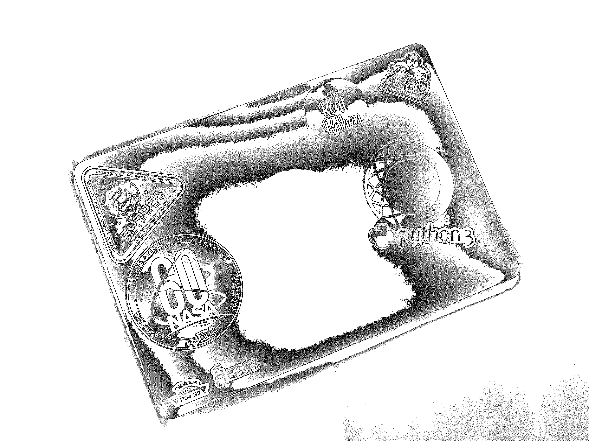
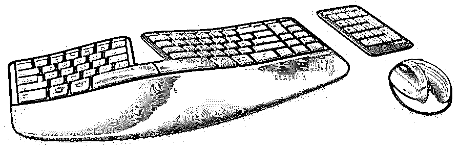
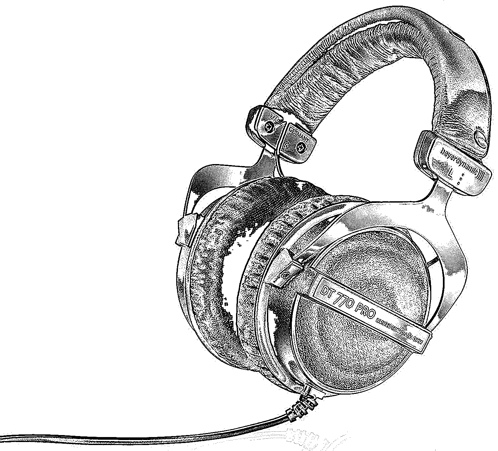
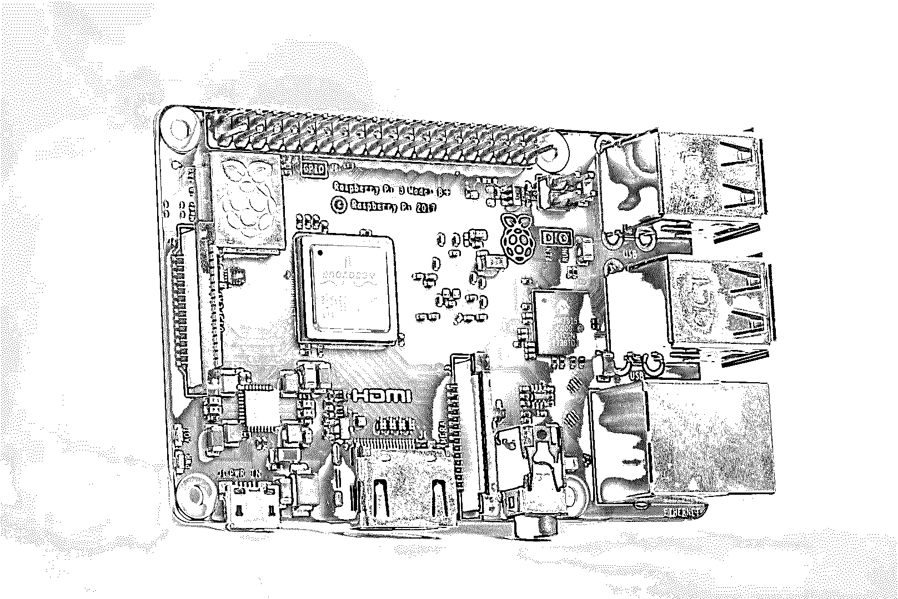
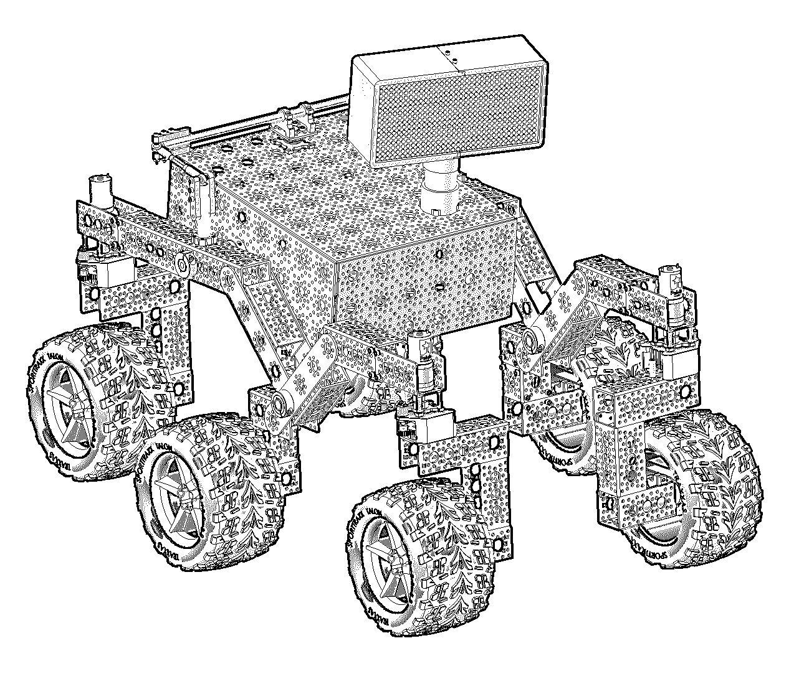
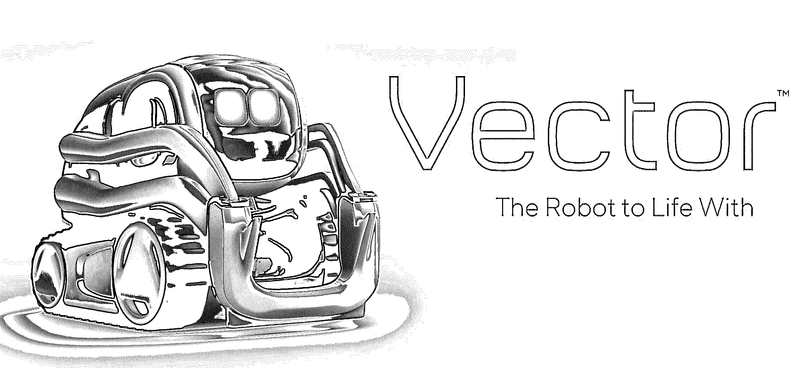
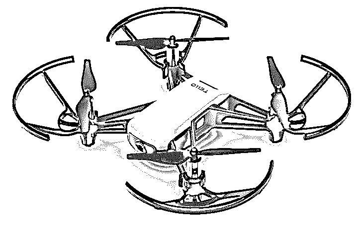

# 皮托尼斯塔的假日愿望清单

> 原文：<https://realpython.com/python-holiday-wish-list/>

又到了一年中每个人都希望得到最后一分钟礼物的时候了。无论你是 Python 开发者的朋友还是你自己，如果你想得到一些特别的东西，我有一个完美的愿望清单。为了给 Pythonistas 找到最好的礼物，我已经在网上搜遍了，并向我真正的 Python 作者同事进行了投票。

我将这些建议分为五类:

*   好的理由
*   学习资源
*   Python swag
*   五金器具
*   小玩意儿

## 为慈善事业捐款

任何人都能收到的最好的礼物是给予别人的感觉。无论您是想自己捐款还是以他人的名义捐款，这里有一些与 Python 相关的优秀组织可以使用捐款:

*   [Python 软件基金会(PSF)](https://www.python.org/psf/donations/) :维护 Python 的官方组织，每年举办 Python 大会

*   Django 软件基金会(DSF) :维护 Django(我们最喜欢的网络应用框架)的官方组织

*   PyLadies :致力于帮助更多女性成为 Python 开源社区的参与者和领导者的组织

捐赠你的钱并不是帮助 Python 社区的唯一方法。你也可以作为志愿者贡献你的时间。

[*Remove ads*](/account/join/)

## Python 学习资源

我认为能给予的最好礼物之一是知识。想好好阅读一下 Python 相关的内容吗？查看[最好的 Python 书籍](https://realpython.com/best-python-books/),收集大量的 Python 相关书籍。也许你想要一些更互动的东西？查看[在*真蟒*T5 的课程！](https://realpython.com/products/)

学习 Python 最好的方法之一就是向大师们学习。一张 PyCon 2019 的门票将是最大的学习礼物:三天的课程、演示、编码挑战，以及与 Python 代码梦想者的交流！这将是持续给予的终极礼物。你还会得到一整年都可以用的礼品袋。

## 蟒蛇贴纸、t 恤和咖啡杯…哦，我的天！

我们是 Pythonistas，为什么不展示一下我们最爱的编程语言呢！我喜欢在我的笔记本电脑上炫耀我对 Python 的热爱。

如果你不喜欢贴纸，那么一件运动衫或 t 恤可能会更好。也别忘了你的旧咖啡杯。它可能也需要升级。

想要有真正 Python 标志的东西吗？[他们也为你提供了保障](https://realpython.com/products/merch/)。

## 硬件

随着技术每天都在进步，每个程序员都需要升级他们的硬件。这可能是因为你的硬盘空间快用完了，键盘磨损了，或者只是想找点乐子。(或者你想要更高级的。每个人都喜欢挑战，对吗？)这是我这一季推荐去看看的硬件。

### 外部硬盘

无论您有一个庞大的代码库还是运行数百个 Docker 图像，您都可能很快耗尽空间来完成所有工作。好消息是硬盘容量的成本几乎在不断下降！另外，通过 USB 3.0，它几乎与内置硬盘一样快，甚至更快。不到 60 美元就能获得 [2 TB 的便携空间！需要更大的吗？对于](https://realpython.com/asins/B00FRHTTIA/)[贵一倍多一点的价格，可以得到 8 TB](https://realpython.com/asins/B01HAPGEIE/) ！如果可以的话，我建议坚持使用希捷和西部数据这样的品牌。

### 新型机械键盘

作为开发人员，我们在电脑上 99%的时间都在使用键盘。这意味着拥有适合自己的键盘非常重要。不知道买什么？在[机械键盘分部](https://www.reddit.com/r/MechanicalKeyboards)的人们创造了[一个伟大的机械键盘指南](https://www.reddit.com/r/MechanicalKeyboards/wiki/buying_guide)。

推荐键盘就像推荐内衣一样:你永远不知道别人会有什么感觉，所以我强烈建议你看看上面的指南。但是如果你想要我的意见，我使用的并且认为手感最好的键盘是[微软 Sculpt Ergo 键盘](https://realpython.com/asins/B00CYX54C0/)。

### 耳机

让我们面对现实吧:没有什么比带着你最喜欢的音乐进入状态，然后埋头研究你的代码库更好的了。那么，为什么不确保你得到一副好的耳机呢？我爱我的 [Beyerdynamic DT 770 Pro](https://realpython.com/asins/B01ERLN180/) 耳机，无法想象没有它们的编码。当你买耳机的时候，我推荐使用[这个有用的指南](https://sites.google.com/view/quipa/assistants)，它是由[耳机分栏](https://www.reddit.com/r/headphones)的热心人创建的。

[*Remove ads*](/account/join/)

## 小工具

有新玩具玩总是很有趣，我们 Python 开发者有很多选择。在这里，我们收集了我们最喜欢的使用 Python 的小工具。

### 树莓派

让我们从一个小馅饼开始——也就是树莓派。您可以用树莓派做很多事情，包括以下内容:

*   自动化你的花园
*   [实现家居自动化](https://lifehacker.com/build-an-entire-home-automation-system-with-a-raspberry-1640844965)
*   [建造一个老派的游戏中心](https://www.instructables.com/id/Build-your-own-Mini-Arcade-Cabinet-with-Raspberry-/)
*   [集群计算](https://www.raspberrypi.org/magpi/cluster-computer-raspberry-pi-3/)
*   [这么多！](https://projects.raspberrypi.org/en/)

其起价仅为 35 美元，令人惊讶的是，您将获得一个多核、蓝牙和 WiFi 功能的设备！我强烈建议买一个工具包开始。

*   [从他们的网站获取树莓酱](https://www.raspberrypi.org/products/)
*   [在亚马逊上购买树莓 Pi 3 套装](https://realpython.com/asins/B07BCC8PK7/)

### 开源漫游者

说到树莓派，创建自己的火星科学实验室怎么样！火星探测器的创造者美国宇航局喷气推进实验室(JPL)已经创建了一个使用树莓 Pi 的火星科学实验室探测器的[开源副本。](https://opensourcerover.jpl.nasa.gov/)

这款车价格不菲(约 2500 美元)，不适合心脏不好的人，因为它需要单独购买每个零件，然后组装整个漫游者。不要担心编程的漫游者虽然。这已经是 JPL 用 Python 写的了！如果价格和难度没有吓退你，那么这对于任何想学习机器人技术的人来说都是一份伟大的礼物。

*   [Github 回购](https://github.com/nasa-jpl/open-source-rover)
*   [零件清单](https://github.com/nasa-jpl/open-source-rover/raw/master/osr_Master_parts_list.xlsx)
*   [Python 源代码](https://github.com/nasa-jpl/osr-rover-code)

### Anki 的 Vector 和 Cozmo 机器人

如果制作自己的机器人似乎有点令人生畏，那么请查看 Vector 和 Cozmo。Vector 是“好机器人”,它可以帮助做很多事情，比如厨房定时器、自拍或告诉你天气将会如何。如果这还不够，还有 [Python 软件开发包(SDK)](https://developer.anki.com/blog/news/the-vector-sdk-hits-alpha/) 可以让你完全定制 Vector！

如果你是编程新手，或者想教别人如何给机器人编程，那么 Cozmo 可以满足你。有了完整的 Python SDK 和一个更简单的选项，这个机器人对于初学者和经验丰富的程序员来说是一个很好的选择。

*   [在亚马逊上获取矢量](https://realpython.com/asins/B07G3ZNK4Y/)
*   [在亚马逊上购买 coz mo](https://realpython.com/asins/B074WC4NHW/)
*   [Python SDK](https://developer.anki.com/blog/learn/tutorial/getting-started-with-the-cozmo-sdk/)

### DJI 无人机

有点厌倦了被卡在地上？坐飞机怎么样？DJI 有多种版本的无人机，你可以使用他们的软件手动或自动飞行。如果他们没有您正在寻找的特性，不如检查一下 SDK，自己动手做吧！DJI 有很多无人机可供选择，但我已经盯上了泰洛，因为它更便宜，而且有一个更容易使用的 Python 库。

*   [在亚马逊上购买泰洛](https://realpython.com/asins/B078YLX1XJ/)
*   [泰洛 Python 库](https://github.com/microlinux/tello)

[*Remove ads*](/account/join/)

## Pythonic 节日快乐

无论你决定给你或你的 Python 开发者朋友买什么，一定要享受这个假期，继续使用 Python！我现在准备在我的亚马逊购物车上推 checkout，并告诉我的妻子#PythonMadeMeDoIt。***